立体几何中动点问题

<table><tr><td>教学目标</td><td>掌握立体几何中的动点问题的基本处理方法   学会转化思想将空间问题转化为平面问题</td></tr><tr><td>重点</td><td>掌握立体几何中的动点问题的基本处理方法</td></tr><tr><td>难 点</td><td>确定动点的轨迹方程</td></tr></table>

## (一)轨迹为平面图形，求轨迹方程、长度、面积等问题

## 例题精讲

【例 1 】在棱长为 1 的正方体 ${ABCD} - {A}_{1}{B}_{1}{C}_{1}{D}_{1}$ 中,已知点 $P$ 为侧面 ${BC}{C}_{1}{B}_{1}$ 上的一动点,则下列结论不正确的是( )

A. 若点 $P$ 总保持 ${PA} \bot  B{D}_{1}$ ,则动点 $P$ 的轨迹是一条线段;

B. 若点 $P$ 到点 $A$ 的距离为 $\frac{2\sqrt{3}}{3}$ ，则动点 $P$ 的轨迹是一段圆弧；

C. 若 $P$ 到直线 ${AD}$ 与直线 $C{C}_{1}$ 的距离相等，则动点 $P$ 的轨迹是一段抛物线；

D. 若 $P$ 到直线 ${BC}$ 与直线 ${C}_{1}{D}_{1}$ 的距离比为1:2,则动点 $P$ 的轨迹是一段双曲线.

【难度】 $\star   \star   \star   \star$

【答案】C

【解析】对于 $A, B{D}_{1} \bot  {AC}, B{D}_{1} \bot  A{B}_{1}$ ,且 ${AC} \cap  A{B}_{1} = A$ ,所以 $B{D}_{1} \bot$ 平面 $A{B}_{1}C$ ,平面 $A{B}_{1}C$ 门平面 ${BC}{C}_{1}{B}_{1} = {B}_{1}C$ ,故动点 $P$ 的轨迹为线段 ${B}_{1}C$ ,所以 $\mathrm{A}$ 正确;

对于 $B$ ,点 $P$ 的轨迹为以 $A$ 为球心、半径为 $\frac{2\sqrt{3}}{3}$ 的球面与面 ${BC}{C}_{1}{B}_{1}$ 的交线,即为一段圆弧,所以 $\mathrm{B}$ 正确; 对于 $C$ ,作 ${PE} \bot  {BC},{EF} \bot  {AD}$ ,连接 ${PF}$ ; 作 ${PQ} \bot  C{C}_{1}$ . 由 $\left| {PF}\right|  = \left| {PQ}\right|$ ,在面 ${BC}{C}_{1}{B}_{1}$ 内,以 $C$ 为原点、以直线 ${CB}\text{ 、 }{CD}\text{ 、 }C{C}_{1}$ 为 $x, y, z$ 轴建立平面直角坐标系,如下图所示:

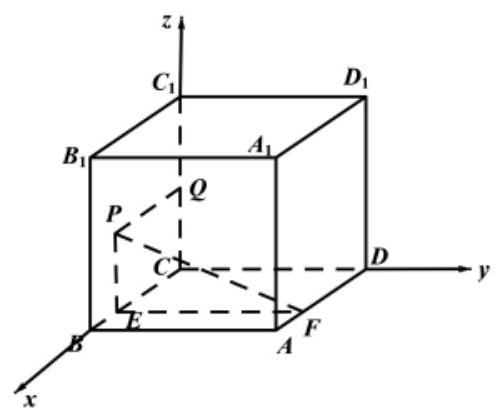

设 $P\left( {x,0, z}\right)$ ,则 $\sqrt{1 + {z}^{2}} = \left| x\right|$ ,化简得 ${x}^{2} - {z}^{2} = 1, P$ 点轨迹所在曲线是一段双曲线,所以 $\mathrm{C}$ 错误. 对于 $D$ ,由题意可知点 $P$ 到点 ${C}_{1}$ 的距离与点 $P$ 到直线 ${BC}$ 的距离之比为 2:1,结合 $\mathrm{C}$ 中所建立空间直角坐标系,可得 $\frac{P{C}_{1}}{PE} = \frac{2}{1}$ ,所以 $\frac{P{C}_{1}^{2}}{P{E}^{2}} = \frac{4}{1}$ ,代入可得 $\frac{{x}^{2} + {\left( 1 - z\right) }^{2}}{{z}^{2}} = \frac{4}{1}$ ,化简可得 $\frac{{\left( z + \frac{1}{3}\right) }^{2}}{\frac{4}{9}} - \frac{{x}^{2}}{\frac{4}{3}} = 1$ ,故点 $P$ 的轨迹为双曲线,所以 $\mathrm{D}$ 正确. 综上可知,不正确的为 $\mathrm{C}$ . 故选: $\mathrm{C}$ .

【例 2】如图所示的长方体 ${ABCD} - {A}_{1}{B}_{1}{C}_{1}{D}_{1},{AB} = 4,{AD} = 2, A{A}_{1} = \sqrt{5}$ . 动点 $P$ 在该长方体外接球上, 且 $\angle {PAD} = \angle {PAB}$ ,则点 $P$ 的轨迹长度为( )

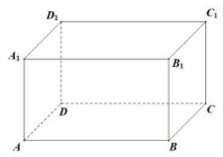

A. ${4\pi }$ B. ${5\pi }$ C. $\sqrt{21}\pi$ D. $\sqrt{23}\pi$

【难度】 $\star   \star   \star   \star$

【答案】D

【解析】由题意知长方体外接球的半径为 $\frac{\sqrt{{4}^{2} + {2}^{2} + {\left( \sqrt{5}\right) }^{2}}}{2} = \frac{5}{2}$ ,

因为 $P$ 是长方体外接球表面上一点,且 $\angle {PAD} = \angle {PAB}$ ,如图,

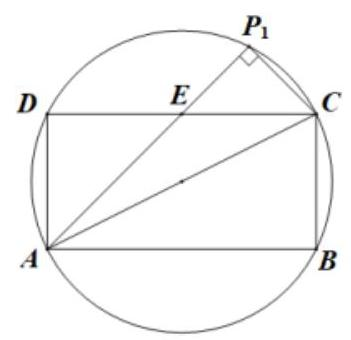

点 ${P}_{1}$ 是其中满足条件的一点,且 $\angle {P}_{1}{AD} = \angle {P}_{1}{AB} = {45}^{ \circ  },\angle C{P}_{1}A = {90}^{ \circ  }$ ,

可知 $P$ 点的轨迹是过弦 $A{P}_{1}$ 且垂直于平面 ${ABCD}$ 的平面与长方体外接球所截得的圆,

设该圆圆心为 ${O}_{3}$ ,外接球球心为 $O$ ,平面 ${ABCD}$ 所在圆圆心为 ${O}_{1}$ ,

如图,只需求圆 ${O}_{3}$ 的周长,设半径 ${O}_{3}{P}_{1}$ ,

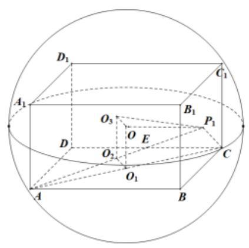

$\because \angle {P}_{1}{AD} = {45}^{ \circ  },{AD} = 2,{AB} = {CD} = 4,\therefore {CE} = {DE} = 2$ ,

$\because \angle {CE}{P}_{1} = {45}^{ \circ  },\angle C{P}_{1}A = {90}^{ \circ  },\therefore C{P}_{1} = \sqrt{2}$ ,又 ${AC} = \sqrt{{2}^{2} + {4}^{2}} = 2\sqrt{5}$ ,

$\therefore A{P}_{1} = 3\sqrt{2}$ ,在 $\bigtriangleup A{P}_{1}C$ 中, ${O}_{1}{O}_{2}$ 是中位线,则 ${O}_{1}{O}_{2} = \frac{1}{2}C{P}_{1} = \frac{\sqrt{2}}{2}$ ,

而 $O{O}_{3} = {O}_{1}{O}_{2},\therefore {O}_{3}{P}_{1} = \sqrt{O{P}_{1}^{2} - O{O}_{3}^{2}} = \sqrt{{\left( \frac{5}{2}\right) }^{2} - {\left( \frac{\sqrt{2}}{2}\right) }^{2}} = \frac{\sqrt{23}}{2},\therefore P$ 点的轨迹长度是 $\sqrt{23}\pi$ . 故选 D.

【例 3】在四棱锥 $P - {ABCD}$ 中, ${PA} \bot$ 平面 ${ABCD},{AP} = 2$ ,点 $M$ 是矩形 ${ABCD}$ 内 (含边界) 的动点, 且 ${AB} = 1$ ， ${AD} = 3$ ，直线 ${PM}$ 与平面 ${ABCD}$ 所成的角为 $\frac{\pi }{4}$ . 记点 $M$ 的轨迹长度为 $\alpha$ ，则 $\tan \alpha  =$ ___； 当三棱锥 $P - {ABM}$ 的体积最小时，三棱锥 $P - {ABM}$ 的外接球的表面积为___.

【难度】 $\star   \star   \star$

【答案】 $\sqrt{3}\;{8\pi }$

【解析】如图,因为 ${PA} \bot$ 平面 ${ABCD}$ ,垂足为 $\mathrm{A}$ ,则 $\angle {PMA}$ 为直线 ${PM}$ 与平面 ${ABCD}$ 所成的角, 所以 $\angle {PMA} = \frac{\pi }{4}$ . 因为 ${AP} = 2$ ,所以 ${AM} = 2$ ,

所以点 $M$ 位于底面矩形 ${ABCD}$ 内的以点 $\mathrm{A}$ 为圆心,2 为半径的圆上,

记点 $M$ 的轨迹为圆弧 ${EF}$ . 连接 ${AF}$ ,则 ${AF} = 2$ .

因为 ${AB} = 1\text{ ， }{AD} = 3$  ， 所以 $\angle {AFB} = \angle {FAE} = \frac{\pi }{6}$ ，则弧 ${EF}$ 的长度 $\alpha  = \frac{\pi }{6} \times  2 = \frac{\pi }{3}$ ，所以 $\tan \alpha  = \sqrt{3}$ . 当点 $M$ 位于 $F$ 时,三棱锥 $P - {ABM}$ 的体积最小,

又 $\angle {PAF} = \angle {PBF} = \frac{\pi }{2},\therefore$ 三棱锥 $P - {ABM}$ 的外接球球心为 ${PF}$ 的中点.

因为 ${PF} = \sqrt{{2}^{2} + {2}^{2}} = 2\sqrt{2}$ ,所以三棱锥 $P - {ABM}$ 的外接球的表面积 $S = {4\pi }{\left( \sqrt{2}\right) }^{2} = {8\pi }$ .

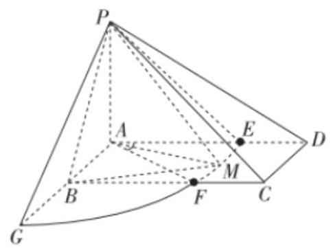

故答案为: $\sqrt{3};{8\pi }$

【例 4】如图,四棱柱 ${ABCD} - {A}^{\prime }{B}^{\prime }{C}^{\prime }{D}^{\prime }$ 中,底面 ${ABCD}$ 为正方形,侧棱 $A{A}^{\prime } \bot$ 底面 ${ABCD},{AB} = {3\sqrt{2}}$ ， $A{A}^{\prime } = 6$ ，以 $D$ 为圆心， $D{C}^{\prime }$ 为半径在侧面 ${BC}{C}^{\prime }{B}^{\prime }$ 上画弧，当半径的端点完整地划过 ${C}^{\prime }E$ 时，半径扫过的轨迹形成的曲面面积为( )

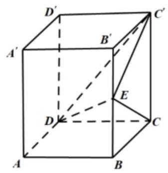

A. $\frac{9\sqrt{6}}{4}\pi$ B. $\frac{9\sqrt{3}}{4}\pi$ C. $\frac{9\sqrt{6}}{2}\pi$ D. $\frac{9\sqrt{3}}{2}\pi$

【难度】 $\star   \star   \star$

【答案】A

【解析】由题意 ${CE} = {CC}^{\prime } = {AA}^{\prime } = 6,{BC} = {AB} = {3\sqrt{2}}$ ，所以 ${BE} = \sqrt{{CE}^{2} - {CB}^{2}} = \sqrt{{36} - {18}} = {3\sqrt{2}}$ ，所以 $\angle {BCE} = {45}^{ \circ  },\angle {EC}{C}^{\prime } = {45}^{ \circ  }$ ,

所以曲面面积占以点 $D$ 为顶点, $D{C}^{\prime }$ 为母线在平面 ${BC}{C}^{\prime }{B}^{\prime }$ 所形成的圆锥的侧面积的 $\frac{1}{8}$ ,所以圆锥的侧面积 $S = {\pi rl} = \pi  \times  C{C}^{\prime } \times  {DC} = \pi  \times  6 \times  3\sqrt{6} = {18}\sqrt{6}\pi$ ,

所以曲面面积为 ${18}\sqrt{6}\pi  \times  \frac{1}{8} = \frac{9\sqrt{6}}{4}\pi$ . 故选: A.

【例 5】如图,已知直三棱柱 ${ABC} - {A}_{1}{B}_{1}{C}_{1}$ 的底面是边长为 2 的正三角形,侧棱长为 $2 \cdot  E, F$ 分别是侧面 ${AC}{C}_{1}{A}_{1}$ 和侧面 ${AB}{B}_{1}{A}_{1}$ 上的动点,满足二面角 $A - {EF} - {A}_{1}$ 为直二面角. 若点 $P$ 在线段 ${EF}$ 上,且 ${AP} \bot  {EF}$ , 则点 $P$ 的轨迹的面积是( )

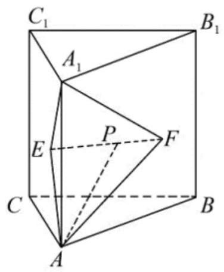

A. $\frac{\pi }{3}$ B. $\frac{2\pi }{3}$ C. $\frac{4\pi }{3}$ D. $\frac{8\pi }{3}$

【难度】 $\star   \star   \star$

【答案】B

【解析】解: $\because$ 二面角 $A - {EF} - {A}_{1}$ 为直二面角; $\therefore$ 平面 ${AEF} \bot$ 平面 ${EF}{A}_{1}$ ,

又 $\because$ 点 $P$ 在线段 ${EF}$ 上,且 ${AP}\bot {EF},{AP} \subset$ 平面 ${AEF}$ ,平面 ${AEF} \cap$ 平面 ${EF}{A}_{1} = {EF}$

$\therefore {AP} \bot$ 平面 ${EF}{A}_{1}$ ,连接 ${A}_{1}P$ ,

$\therefore {AP} \bot  {A}_{1}P,\therefore P$ 在以 $A{A}_{1}$ 为直径的球上,且 $P$ 在三棱柱 ${ABC} - {A}_{1}{B}_{1}{C}_{1}$ 内部,

$\therefore P$ 的轨迹为以 $A{A}_{1}$ 为直径的球在三棱柱 ${ABC} - {A}_{1}{B}_{1}{C}_{1}$ 内部的曲面,

又 $\because$ 三棱柱 ${ABC} - {A}_{1}{B}_{1}{C}_{1}$ 为正三棱柱,

$\therefore P$ 的轨迹为以 $A{A}_{1}$ 为直径的球面,占球面的 $\frac{1}{6}$ ,

$\therefore$ 点 $P$ 的轨迹的面积是 $S = \frac{1}{6} \times  {4\pi } = \frac{2\pi }{3}$ . 故选: B.

## 巩固训练

1、如图，斜线段 $\mathrm{{AB}}$ 与平面 $\alpha$ 所成的角为 ${60}^{ \circ  }$ ， $B$ 为斜足，平面 $\alpha$ 上的动点 $P$ 满足 $\angle \mathrm{{PAB}} = {30}^{ \circ  }$ ，则点 $P$ 的轨迹是

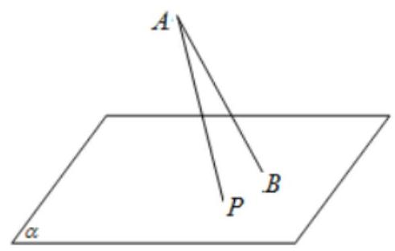

A. 直线 B. 抛物线

C. 椭圆 D. 双曲线的一支

【答案】C

【解析】用垂直于圆锥轴的平面去截圆锥, 得到的是圆; 把平面渐渐倾斜, 得到椭圆; 当平面和圆锥的一条母线平行时,得到抛物线.

此题中平面 $\alpha$ 上的动点 $P$ 满足 $\angle {PAB} = {30}^{ \circ  }$ ，可理解为 $P$ 在以 ${AB}$ 为轴的圆锥的侧面上，

再由斜线段 ${AB}$ 与平面 $\alpha$ 所成的角为 ${60}^{ \circ  }$ ,可知 $P$ 的轨迹符合圆锥曲线中椭圆定义.

故可知动点 $P$ 的轨迹是椭圆. 故选 C.

2、在正三棱柱 ${ABC} - {A}_{1}{B}_{1}{C}_{1}$ 中， ${AC} = \sqrt{2}, C{C}_{1} = 1$ ，点 $D$ 为 ${BC}$ 中点，则以下结论不正确的是( )

A. $\overrightarrow{{A}_{1}D} = \frac{1}{2}\overrightarrow{AB} + \frac{1}{2}\overrightarrow{AC} - \overrightarrow{A{A}_{1}}$

B. 三棱锥 $D - A{B}_{1}{C}_{1}$ 的体积为 $\frac{\sqrt{3}}{6}$

C. $A{B}_{1} \bot  {BC}$ 且 $A{B}_{1}//$ 平面 ${A}_{1}{C}_{1}D$

D. $\bigtriangleup  {ABC}$ 内到直线 ${AC}$ 、 $B{B}_{1}$ 的距离相等的点的轨迹为抛物线的一部分

【答案】C

【解析】

A. $\overline{{A}_{1}D} = \overline{{A}_{1}A} + \overline{AD} = \overline{AD} - \overline{A{A}_{1}} = \frac{1}{2}\left( {\overline{AB} + \overline{AC}}\right)  - \overline{A{A}_{1}} = \frac{1}{2}\overline{AB} + \frac{1}{2}\overline{AC} - \overline{A{A}_{1}}$ ,故正确;

B. ${V}_{D - A{B}_{i}{C}_{i}} = {V}_{A - D{B}_{i}{C}_{i}}$ ,因为 $D$ 为 ${BC}$ 中点且 ${AB} = {AC}$ ,所以 ${AD} \bot  {BC}$ ,

又因为 $B{B}_{1} \bot$ 平面 ${ABC}$ ,所以 $B{B}_{1} \bot  {AD}$ 且 $B{B}_{1} \cap  {BC} = B$ ,所以 ${AD} \bot$ 平面 $D{B}_{1}{C}_{1}$ ,

又因为 ${AD} = \sqrt{3}{BD} = \frac{\sqrt{3}}{2}{BC} = \frac{\sqrt{6}}{2},{S}_{\bigtriangleup D{B}_{1}{C}_{1}} = \frac{1}{2} \times  B{B}_{1} \times  {B}_{1}{C}_{1} = \frac{\sqrt{2}}{2}$ ,

所以 ${V}_{D - A{B}_{1}{C}_{1}} = {V}_{A - D{B}_{1}{C}_{1}} = \frac{1}{3} \times  {AD} \times  {S}_{\bigtriangleup D{B}_{1}{C}_{1}} = \frac{1}{3} \cdot  \frac{\sqrt{6}}{2} \cdot  \frac{\sqrt{2}}{2} = \frac{\sqrt{3}}{6}$ ，故正确；

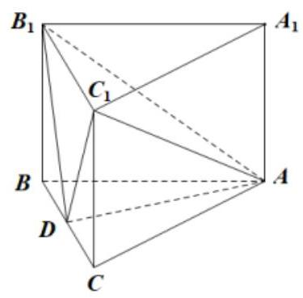

C. 假设 $A{B}_{1} \bot  {BC}$ 成立,又因为 $B{B}_{1} \bot$ 平面 ${ABC}$ ,所以 $B{B}_{1} \bot  {BC}$ 且 $B{B}_{1} \cap  A{B}_{1} = {B}_{1}$ , 所以 ${BC}\bot$ 平面 ${AB}{B}_{1}$ ，所以 ${BC}\bot {AB}$ ，显然与几何体为正三棱柱矛盾，所以 $A{B}_{1}\bot {BC}$ 不成立； 取 ${AB}$ 中点 $E$ ,连接 ${ED}, E{A}_{1}, A{B}_{1}$ ,如下图所示:

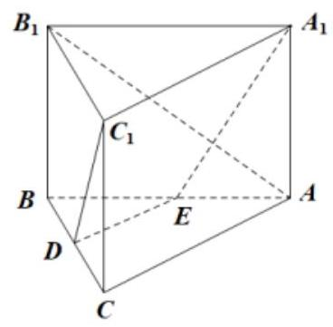

因为 $D, E$ 为 ${BC},{AB}$ 中点，所以 ${DE}//{AC}$ ，且 ${AC}//{{A}_{1}{C}_{1}}$ ，所以 ${DE}//{{A}_{1}{C}_{1}}$ ，所以 ${D, E,{A}_{1},{C}_{1}}$ 四点共面， 又因为 ${A}_{1}E$ 与 $A{B}_{1}$ 相交，所以 $A{B}_{1}//$ 平面 ${A}_{1}{C}_{1}D$ 显然不成立，故错误；

D. “ $\bigtriangleup  {ABC}$ 内到直线 ${AC}$ 、 $B{B}_{1}$ 的距离相等的点”即为“ $\bigtriangleup  {ABC}$ 内到直线 ${AC}$ 和点 $B$ 的距离相等的点”, 根据抛物线的定义可知满足要求的点的轨迹为抛物线的一部分,故正确; 故选: $\mathbf{C}$ .

3、点 $P$ 为棱长是 2 的正方体 ${ABCD} - {A}_{1}{B}_{1}{C}_{1}{D}_{1}$ 的内切球 $O$ 球面上的动点,点 $M$ 为 ${B}_{1}{C}_{1}$ 的中点,若满足 ${DP} \bot  {BM}$ ，则动点 $P$ 的轨迹的长度为( )

A. $\frac{\sqrt{5}\pi }{5}$ B. $\frac{2\sqrt{5}\pi }{5}$ C. $\frac{4\sqrt{5}\pi }{5}$ D. $\frac{8\sqrt{5}\pi }{5}$

【答案】C

【解析】解法一:

设 ${B}_{1}B$ 的中点为 $H$ ,连接 ${CH},{DH}$ ,因此有 ${CH} \bot  {BM}$ ,而 ${DC} \bot  {MB}$ ,而 ${DC},{CH} \subset$ 平面 ${CDH}$ , ${DC} \cap  {CH} = C$ ，因此有 ${BM}\bot$ 平面 ${DCH}$ ，所以动点 $P$ 的轨迹平面 ${DCH}$ 与正方体 ${ABCD} - {A}_{1}{B}_{1}{C}_{1}{D}_{1}$ 的内切球 $O$ 的交线. 正方体 ${ABCD} - {A}_{1}{B}_{1}{C}_{1}{D}_{1}$ 的棱长为 2,所以内切球 $O$ 的半径为 $R = 1$ ,建立如下图所示的以 $D$ 为坐标原点的空间直角坐标系:

因此有 $O\left( {1,1,1}\right) , C\left( {0,2,0}\right) , H\left( {2,2,1}\right)$ ,设平面 ${DCH}$ 的法向量为 $\overrightarrow{m} = \left( {x, y, z}\right)$ ,所以有 $\left\{  {\begin{array}{l} \bar{m} \bot  \overline{DC} \\  \bar{m} \bot  \overline{DH} \end{array} \Rightarrow  \left\{  {\begin{array}{l} \bar{m} \cdot  \overline{DC} = 0 \\  \bar{m} \cdot  \overline{DH} = 0 \end{array} \Rightarrow  \left\{  {\begin{array}{l} {2y} = 0 \\  {2x} + {2y} + z = 0 \end{array} \Rightarrow  \bar{m} = \left( {1,0, - 2}\right) }\right. }\right. }\right.$ ,因此 $O$ 到平面 ${DCH}$ 的距离为: $d = \frac{\left| \overrightarrow{m} \cdot  \overrightarrow{OD}\right| }{\left| \overrightarrow{m}\right| } = \frac{\sqrt{5}}{5}$ ,所以截面圆的半径为: $r = \sqrt{{R}^{2} - {d}^{2}} = \frac{2\sqrt{5}}{5}$ ,因此动点 $P$ 的轨迹的长度为 ${2\pi r} = \frac{4\sqrt{5}}{5}\pi$

故选: $\mathrm{C}$

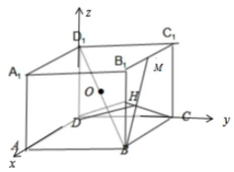

解法二: 根据题意,点 $P$ 为棱长是 2 的正方体 ${ABCD} - {A}_{1}{B}_{1}{C}_{1}{D}_{1}$ 的内切球 $O$ 球面上的动点,点 $M$ 为 ${B}_{1}{C}_{1}$ 的中点,设 $B{B}_{1}$ 中点为 $N, A{B}_{1}$ 中点为 $K$ ,如下图所示:

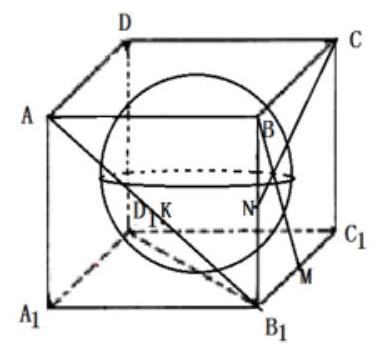

在平面 $B{B}_{1}{C}_{1}C$ 中, ${CN} \bot  {BM}$ ; 由题意可知 ${DP} \bot  {BM}$ ,

${CN}$ 为 ${DP}$ 在平面 $B{B}_{1}{C}_{1}C$ 内的射影,所以直线 ${DP}$ 在过点 $D$ 且与 ${BM}$ 垂直的平面内

又因为 $P$ 在正方体内切球的球面上

所以点 $P$ 的轨迹为正方体的内切球与过 $D$ 且与 ${BM}$ 垂直的平面相交得到的小圆,即 $P$ 的轨迹为过 $D, C, N$ 的平面即为平面 ${CDKN}$ 与内切球的交线

因为 $D, O, N$ 位于平面 $D{D}_{1}{B}_{1}B$ 内,设 $O$ 到平面 ${CDKN}$ 的距离为 $h$

所以由 ${V}_{C - {DON}} = {V}_{O - {DCN}}$ ,可得 $\frac{1}{3} \times  \frac{1}{2} \times  {ON} \times  \left( {\frac{1}{2}D{D}_{1}}\right)  \times  \left( {\frac{1}{2}{AC}}\right)  = \frac{1}{3} \times  \frac{1}{2} \times  {CD} \times  {CN} \times  h$

代入可得 $\frac{1}{3} \times  \frac{1}{2} \times  \sqrt{2} \times  1 \times  \sqrt{2} = \frac{1}{3} \times  \frac{1}{2} \times  2 \times  \sqrt{5} \times  h$ ,解得 $h = \frac{\sqrt{5}}{5}$

正方体的内切球半径为 $R = 1$

由圆的几何性质可得所截小圆的半径为 $r = \sqrt{1 - {\left( \frac{\sqrt{5}}{5}\right) }^{2}} = \frac{2\sqrt{5}}{5}$

所以小圆的周长为 $C = {2\pi r} = \frac{4\sqrt{5}\pi }{5}$ ; 即动点 $P$ 的轨迹的长度为 $\frac{4\sqrt{5}\pi }{5}$ ; 故选: $\mathrm{C}$

4、正方体 ${ABCD} - {A}_{1}{B}_{1}{C}_{1}{D}_{1}$ 的外接球的表面积为 ${12\pi }, E$ 为球心， $F$ 为 ${C}_{1}{D}_{1}$ 的中点. 点 $M$ 在该正方体的表面上运动，则使 ${ME}\bot {CF}$ 的点 $M$ 所构成的轨迹的周长等于___.

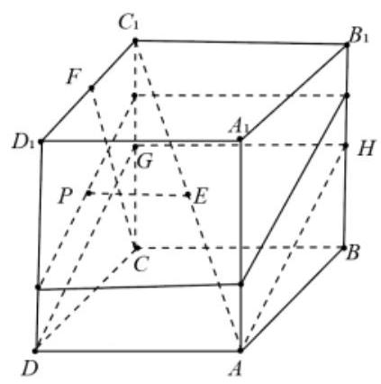

【答案】 $4 + 2\sqrt{5}$

【解析】

如图所示: , 因为正方体的外接球表面积为 ${12\pi }$ ,所以球的半径为 $\sqrt{3}$ , 设正方体的边长为 $\mathrm{a}$ ,所以 $\frac{\sqrt{3{a}^{2}}}{2} = \sqrt{3} \Rightarrow  a = 2$ ,取 $B{B}_{1}$ 的中点为 $\mathrm{H}, C{C}_{1}$ 的中点为 $\mathrm{G}$ ,设 $\mathrm{E}$ 在面 ${DC}{C}_{1}{D}_{1}$ 的摄影为 $\mathrm{P}$ ,过 $\mathrm{P}$ 作与面 $\mathrm{{AHGD}}$ 平行的面, 则使 ${ME} \bot  {CF}$ 的点 $M$ 所构成的轨迹为矩形,其周长等于 AHGD 的周长, 故答案为 $4 + 2\sqrt{5}$

5、矩形 ${ABCD}$ 中， ${AB} = \sqrt{3},{BC} = 1$ ，现将 $\bigtriangleup  {ACD}$ 沿对角线 ${AC}$ 向上翻折，得到四面体 $D - {ABC}$ ，则该四面体外接球的表面积为___；若翻折过程中 ${BD}$ 的长度在 $\left\lbrack  {\frac{\sqrt{7}}{2},\frac{\sqrt{10}}{2}}\right\rbrack$ 范围内变化，则点 $D$ 的运动轨迹的长度是___.

【答案】 ${4\pi }\;\frac{\sqrt{3}}{12}\pi$

【解析】

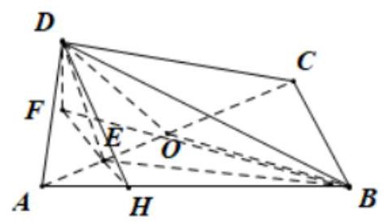

如图，在四面体 $D - {ABC}$ 中，取 ${AC}$ 的中点为 $O$ ，连接 ${DO},{BO}$ ，

由 $\bigtriangleup  {ADC}, \bigtriangleup  {ACB}$ 均为直角三角形可以得到 ${DO} = {AO} = {CO} = {BO}$ ，

故 $O$ 为四面体 $D - {ABC}$ 外接球的球心,故外接球的半径为 $\frac{1}{2}{AC} = \frac{1}{2}\sqrt{1 + 3} = 1$ ,

故外接球的表面积为 ${4\pi }$ .

在 $\bigtriangleup  {ADC}$ 中过 $D$ 作 ${DE}\bot {AC}$ ，垂足为 $E$ ，连接 ${BE}$ ，则 ${DE} = 1 \times  \frac{\sqrt{3}}{2} = \frac{\sqrt{3}}{2}$ ，

在 $\bigtriangleup  {ABC}$ 中过 $E$ 作 ${EH}\bot {AC}$ ，与 ${AB}$ 交于 $H$ ，连接 ${DH}$ ，则 ${EH} = \frac{1}{2} \times  \frac{\sqrt{3}}{3} = \frac{\sqrt{3}}{6}$ ，

且 $\angle {AHE} = \frac{\pi }{3}$ ，故 $\angle {EHB} = \frac{2\pi }{3}$ .

又 $\angle {DEH}$ 为二面角 $D - {AC} - B$ 的平面角,设该角为 $\theta$ ，

在 $\bigtriangleup {DEH}$ 中过 $D$ 作直线 ${EH}$ 的垂线,垂足为 $F$ ,连接 ${BF}$ ,

因为 ${DE} \cap  {EH} = E$ ,故 ${AC} \bot$ 平面 ${DEH}$ ,而 ${AC} \subset$ 平面 ${ABC}$ ,故平面 ${DEH} \bot$ 平面 ${ABC}$ ,

因为 ${DF} \subset$ 平面 ${DEH}$ ,平面 ${DEH} \cap$ 平面 ${ABC} = {EH}$ , ${DF} \bot  {EH}$ ,

故 ${DF} \bot$ 平面 ${ABC}$ ,而 ${FB} \subset$ 平面平面 ${ABC}$ ,故 ${DF} \bot  {FB}$ ,

因为 ${DF} = {DE}\sin \theta  = \frac{\sqrt{3}}{2}\sin \theta ,{FH} = {EH} - {DE}\cos \theta  = \frac{\sqrt{3}}{6} - \frac{\sqrt{3}}{2}\cos \theta$ ,

故 $B{F}^{2} = {\left( \frac{\sqrt{3}}{6} - \frac{\sqrt{3}}{2}\cos \theta \right) }^{2} + {\left( \frac{2\sqrt{3}}{3}\right) }^{2} - 2\left( {\frac{\sqrt{3}}{6} - \frac{\sqrt{3}}{2}\cos \theta }\right)  \times  \frac{2\sqrt{3}}{3} \times  \left( {-\frac{1}{2}}\right)  = \frac{7}{4} - \frac{3}{2}\cos \theta  + \frac{3}{4}{\cos }^{2}\theta$ ,

所以 $B{D}^{2} = \frac{7}{4} - \frac{3}{2}\cos \theta  + \frac{3}{4}{\cos }^{2}\theta  + \frac{3}{4}{\sin }^{2}\theta  = \frac{5}{2} - \frac{3}{2}\cos \theta$ ,

所以 $\frac{7}{4} \leq  \frac{5}{2} - \frac{3}{2}\cos \theta  \leq  \frac{5}{2}$ ,故 $0 \leq  \cos \theta  \leq  \frac{1}{2}$ ,故 $\frac{\pi }{3} \leq  \theta  \leq  \frac{\pi }{2}$ ,

故 $D$ 所在的弧对应的圆心角为 $\frac{\pi }{6}$ (以 $E$ 为圆心， ${DE}$ 为半径的圆)，

故其轨迹的长度为 $\frac{\pi }{6} \times  {DE} = \frac{\sqrt{3}}{12}\pi$ ,故答案为: ${4\pi },\frac{\sqrt{3}\pi }{12}$ .

# (二)轨迹为立体图形, 求轨迹体积等问题

## 例题精讲

【例 6】已知棱长为 3 的正方体 ${ABCD} - {A}_{1}{B}_{1}{C}_{1}{D}_{1}$ ，长为 2 的线段 ${MN}$ 的一个端点 $M$ 在 $D{D}_{1}$ 上运动，另一个端点 $N$ 在底面 ${ABCD}$ 上运动. 则线段 ${MN}$ 中点 $P$ 的轨迹与正方体的表面所围成的较小的几何体的体积为( )

A. $\frac{4}{3}\pi$ B. $\frac{7}{6}\pi$ C. $\frac{1}{3}\pi$ D. $\frac{1}{6}\pi$

【难度】★★★

【答案】C

【解析】

连接DN，易知三角形MDN为直角三角形，则斜边MN 中点P与定点D是距离DP= $\frac{1}{2}$ MN=1，即动点P 到定点 $\mathrm{D}$ 为定值,轨迹为以 $\mathrm{D}$ 为球心,1 为半径的球面,与正方体表面所围成的较小的几何体的体积为 $\mathrm{V} = \frac{4}{3}\pi  \cdot  {1}^{3} \cdot  \frac{1}{4} = \frac{\pi }{3}$ ,故选 C.

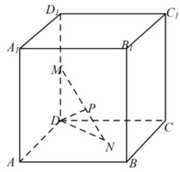

【例 7】在三棱锥 $A - {BCD}$ 中， ${AB}$ ， ${AC}$ ， ${AD}$ 两两互相垂直， ${AB} = {AC} = {AD} = 4$ . 点 $P$ ， $Q$ 分别在侧面 ${ABC}$ ,棱 ${AD}$ 上运动. ${PQ} = 2, M$ 为线段 ${PQ}$ 的中点,当 $P, Q$ 运动时,点 $M$ 的轨迹把三棱锥 $A - {BCD}$ 分成两部分的体积之比等于 ( )

A. 1:63 B. $1 : \left( {{16}\sqrt{2} - 1}\right)$ C. $\pi  : \left( {{64} - \pi }\right)$ D. $\pi  : \left( {{14} - \pi }\right)$

【难度】★★★

【答案】C

【解析】 $\because {AD} \bot  {AB},{AD} \bot  {AC},{AB}\bigcap {AC} = A,\therefore {AD} \bot$ 平面 ${ABC},{AP} \subset$ 平面 ${ABC}$ ,

$\therefore \bigtriangleup {PAQ}$ 为直角三角形, $M$ 为斜边 ${PQ}$ 的中点, $\therefore {AM} = \frac{1}{2}{PQ} = 1$ ,

$\therefore M$ 的轨迹是以 $A$ 为球心,1 为半径的八分之一球面,

${V}_{1} = \frac{1}{8} \times  \frac{4}{3}\pi  \times  {1}^{3} = \frac{\pi }{6},{V}_{2} = \frac{1}{3} \times  \frac{1}{2} \times  4 \times  4 \times  4 - \frac{\pi }{6} = \frac{{64} - \pi }{6},\therefore \frac{{V}_{1}}{{V}_{2}} = \frac{\pi }{{64} - \pi }$ . 故选: C.

【例 8】已知在直三棱柱 ${ABC} - {A}_{1}{B}_{1}{C}_{1}$ 中， $\angle {ABC} = {90}^{ \circ  }$ ， ${AB} = {BC} = 2$ ，侧面 ${AC}{C}_{1}{A}_{1}$ 为正方形， $P$ 为 $C{C}_{1}$ 的中点.

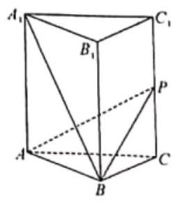

(1)若在平面 ${AB}{B}_{1}{A}_{1}$ 内存在动点 $R$ ,满足 $R{C}_{1}//$ 平面 ${APB}$ ,画出动点 $R$ 的轨迹图形(写出画法)

(2)在(1)问中画出的动点 $P$ 的轨迹上任取一点 $Q$ ，求三棱锥 $Q - {ABP}$ 的体积.

【难度】 $\star   \star   \star$

【答案】(1)作图见解析，详见解析(2) $\frac{2\sqrt{2}}{3}$

【解析】

(1)过点 ${C}_{1}$ 作 ${C}_{1}T//{PA}$ 交 $A{A}_{1}$ 于点 $T$ ，再过点 $T$ 作 ${TS}//{AB}$ 交 $B{B}_{1}$ 于点 $S$ ，则 $R$ 的轨迹为 ${TS}$ ，这条线段，如下图所示:

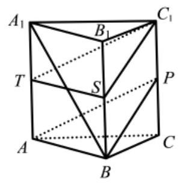

(2) $\because T$ 为 $A{A}_{1}$ 的中点， ${AB} = {BC} = 2,\angle {ABC} = {90}^{ \circ  }$ ，四边形 ${AC}{C}_{1}{A}_{1}$ 是正方形，

$\therefore {AC} = 2\sqrt{2},{AT} = \sqrt{2}$ ,

由 $\left( 1\right)$ 知 ${TS}//{AB}$ ,在直线 ${TS}$ 上任取点 $Q$ ,

则 ${S}_{\bigtriangleup {AQB}} = \frac{1}{2} \times  {AT} \times  {AB} = \frac{1}{2} \times  \sqrt{2} \times  2 = \sqrt{2}$ ,

$\therefore {V}_{Q - {ABP}} = {V}_{P - {AQB}} = \frac{1}{3} \times  {S}_{\bigtriangleup {AQB}} \times  {BC} = \frac{1}{3} \times  \sqrt{2} \times  2 = \frac{2\sqrt{2}}{3}$ ,

即三棱锥 $Q - {ABP}$ 的体积为 $\frac{2\sqrt{2}}{3}$ .

【例 9】正四面体 ${OABC}$ ,其棱长为 1 . 若 $\overrightarrow{OP} = x\overrightarrow{OA} + y\overrightarrow{OB} + z\overrightarrow{OC}\left( {0 \leq  x, y, z \leq  1}\right)$ ,且满足 $x + y + z \geq  1$ , 则动点 $P$ 的轨迹所形成的空间区域的体积为___.

【难度】 $\star   \star   \star   \star$

【答案】 $\frac{5\sqrt{2}}{12}$

【解析】由题意可知: 动点 $P$ 的轨迹所形成的空间区域是以 ${OA},{0B},{OC}$ 为邻边的平行六面体除去正四面体 ${OABC}$ ,如下图所示:

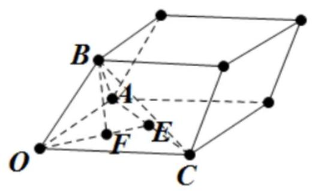

因为 ${OABC}$ 是正四面体，所以 ${OE} = \frac{\sqrt{3}}{2}$ 则 ${OF} = \frac{\sqrt{3}}{3},{BF} = \frac{\sqrt{6}}{3}$ ，

所以 $V = {V}_{\text{ 平行六面体 }} - {V}_{OABC} = \frac{1}{2} \times  1 \times  \sqrt{3} \times  \frac{\sqrt{6}}{3} - \frac{1}{3} \times  \frac{1}{2} \times  \frac{\sqrt{3}}{2} \times  1 \times  \frac{\sqrt{6}}{3} = \frac{5\sqrt{2}}{12}$ .

【例 10】如图,已知矩形 ${ABCD},{AB} = \sqrt{3},{AD} = 1,{AF} \bot$ 平面 ${ABC}$ ,且 ${AF} = 3.E$ 为线段 ${DC}$ 上一点, 沿直线 ${AE}$ 将 $\bigtriangleup {DAE}$ 翻折成 $\bigtriangleup {D}^{\prime }{AE}$ ， $M$ 为 $B{D}^{\prime }$ 的中点，则三棱锥 $M - {BCF}$ 体积的最小值是___.

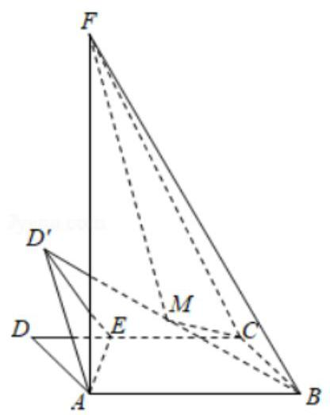

【难度】 $\star   \star   \star   \star$

【答案】 $\frac{\sqrt{3}}{12}$

【解析】解: 选固定点 $E$ ,可知 ${D}^{\prime }$ 在圆上运动,现 $E$ 在线段 ${DC}$ 上运动,且 $A{D}^{\prime } = 1$ ,

$\therefore {D}^{\prime }$ 的运动轨迹为以 $A$ 为球心,半径为 $A{D}^{\prime } = 1$ 的球面的一部分,

$\because {S}_{\bigtriangleup {BCF}} = \frac{1}{2} \times  {BC} \times  {BF} = \frac{1}{2} \times  1 \times  \sqrt{9 + 3} = \sqrt{3}$ ,

$\therefore$ 求三棱锥 $M - {BCF}$ 体积的最小值只需求 $M$ 到面 ${BCF}$ 的距离 ${d}_{1}$ 的最小值，

即求 ${D}^{\prime }$ 到面 ${BCF}$ 的距离 $d$ 的最小值，过 $A$ 作 ${BF}$ 的垂线，垂足为 $H$ ，

当 ${D}^{\prime }$ 为 ${AH}$ 与球 面的交点 $G$ 时， ${D}^{\prime }$ 到面 ${BCF}$ 的距离最小，

此时点 $E$ 在 ${DC}$ 上, $d = \frac{1}{2}{AF} - 1 = \frac{3}{2} - 1 = \frac{1}{2},{d}_{1} = \frac{1}{2}d = \frac{1}{4}$ ,

$\therefore$ 三棱锥 $M - {BCF}$ 体积的最小值为: ${V}_{\min } = {S}_{\Delta BCF} \times  {d}_{1} = \frac{\sqrt{3}}{12}$ . 故答案为: $\frac{\sqrt{3}}{12}$ .

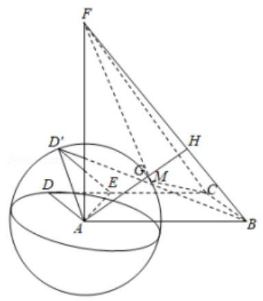

1、如图，正方体 ${ABCD} - {A}_{1}{B}_{1}{C}_{1}{D}_{1}$ 的棱长为 $2, P$ 是 $A{A}_{1}$ 的中点， $Q$ 是侧面正方形 $B{B}_{1}{C}_{1}C$ 内的动点，当 ${D}_{1}Q//$ 平面 ${PBD}$ 时，点 $Q$ 的轨迹长度为___，若点 $Q$ 轨迹的两端点和点 ${C}_{1}$ ， ${D}_{1}$ 在球 $O$ 的球面上，则球 $O$ 的体积为___.

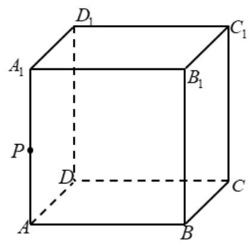

【答案】 $\sqrt{5}\;\frac{9\pi }{2}$

【解析】如图所示,因为 $P$ 是 $A{A}_{1}$ 的中点,取 $C{C}_{1}$ 中点 ${Q}_{0}$ ,

${D}_{1}{B}_{1}//{DB},{BD} \subset$ 平面 ${PBD},{B}_{1}{D}_{1} \text{ ⊄ }$ 平面 ${PBD}$ ,则 ${D}_{1}{B}_{1}//$ 平面 ${PBD}$

${B}_{1}{Q}_{0}//{PD},{PD} \subset$ 平面 ${PBD},{B}_{1}{Q}_{0} \text{ ⊄ }$ 平面 ${PBD}$ ,则 ${B}_{1}{Q}_{0}//$ 平面 ${PBD}$

由 ${D}_{1}{B}_{1} \cap  {B}_{1}{Q}_{0} = {B}_{1}$ ,所以平面 ${B}_{1}{D}_{1}{Q}_{0}//$ 平面 ${PBD}$ .

又平面 ${B}_{1}{D}_{1}{Q}_{0} \cap$ 平面 $B{B}_{1}{C}_{1}C = {B}_{1}{Q}_{0}$

当点 $Q$ 的轨迹为线段 ${B}_{1}{Q}_{0}$ ,满足 ${D}_{1}Q//$ 平面 ${PBD}$

因为正方体棱长为 2,所以 ${B}_{1}{Q}_{0} = \sqrt{5}$ . 点 $Q$ 轨迹的两端点为 ${B}_{1},{Q}_{0}$ ,

过 ${B}_{1},{Q}_{0}{C}_{1},{D}_{1}$ 的球也即是三棱锥 ${D}_{1} - {B}_{1}{C}_{1}{Q}_{0}$ 的外接球.

三棱锥 ${D}_{1} - {B}_{1}{C}_{1}{Q}_{0}$ 的外接球和长方体 $P{C}_{1}$ 的外接球为同一球

所以球 $O$ 的直径就是 ${A}_{1}{Q}_{0},{A}_{1}{Q}_{0} = \sqrt{1 + {2}^{2} + {2}^{2}} = 3$ ,则球 $O$ 的半径为 $\frac{3}{2}$ ; 故球 $O$ 体积为 $\frac{9\pi }{2}$ .

故答案为: $\sqrt{5},\frac{9\pi }{2}$

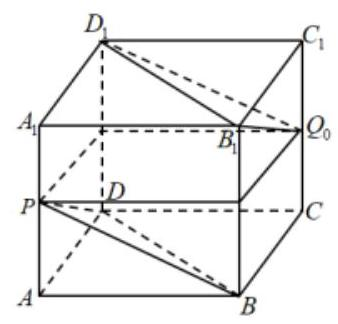

2、在棱长为 1 的正方体 ${ABCD} - {A}_{1}{B}_{1}{C}_{1}{D}_{1}$ 中，点 $P$ 是底面 ${ABCD}$ 内的动点， $\tan \angle {D}_{1}{PD} \geq  1$ ，则动点 $P$ 的轨迹的面积为___，动线段 ${D}_{1}P$ 的轨迹所形成几何体的体积是___.

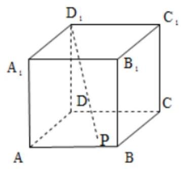

【答案】 $\frac{\pi }{4}\;\frac{\pi }{12}$ ;

【解析】解: $\because \tan \angle {D}_{1}{PD} = \frac{D{D}_{1}}{DP} \geq  1,\therefore {DP} \leq  1$ ,

即点 $P$ 的轨迹是以 $D$ 为圆心,1 为半径的 $\frac{1}{4}$ 个圆和圆的内部,

$\therefore P$ 的轨迹的面积为 $S = \frac{\pi }{4} \times  {1}^{2} = \frac{\pi }{4}$ ,

${D}_{1}P$ 的轨迹所形成几何体为 $\frac{1}{4}$ 个圆锥,其体积为 $V = \frac{1}{3} \times  \frac{\pi }{4} \times  1 = \frac{\pi }{12}$ ,故答案为: $\frac{\pi }{4};\frac{\pi }{12}$ .

3、如图，四面体 ${ABCD}$ ， ${AB} = {BC} = 4$ ， ${AC} = {BD} = 4\sqrt{2}$ ， ${AB} \bot  {CD}$ ， $\angle {BCD} = {90}^{ \circ  }$ .

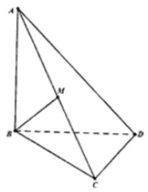

(1)若 ${AC}$ 中点是 $M$ ，求证: ${BM}\bot$ 面 ${ACD}$ ；

(2)若 $P$ 是线段 ${AB}$ 上的动点， $Q$ 是面 ${BCD}$ 上的动点，且线段 ${PQ} = 2$ ， ${PQ}$ 的中点是 $N$ ，求动点 $N$ 的轨迹与四面体 ${ABCD}$ 围成的较小的几何体的体积.

【答案】(1)见解析；(2)动点 $N$ 的轨迹是以 $B$ 为球心，半径为 1 的球面，体积 $V = \frac{\pi }{12}$ .

【解析】(1) $\because \angle {BCD} = {90}^{ \circ  }$ ， $\therefore {CD} \bot  {BC}$ ， $\because {AB} \bot  {CD}$ ， ${AB} \cap  {BC} = B$ ， $\therefore {CD} \bot$ 平面 ${ABC}$ ， $\because {BM} \subset$ 平面 ${ABC},\therefore {BM} \bot  {CD}$ .

$\because {AB} = {BC}, M$ 为 ${AC}$ 的中点, $\therefore {BM} \bot  {AC}$ .

$\because {AC} \cap  {CD} = C$ ,因此, ${BM} \bot$ 平面 ${ACD}$ ;

(2)如下图所示:

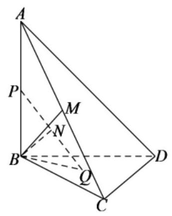

$\because {AB} = {BC} = 4,{AC} = 4\sqrt{2},\therefore {A{B}^{2} + B{C}^{2}} = {A{C}^{2}}$ ， $\therefore {AB} \bot  {BC}$ ，

又 ${AB} \bot  {CD},{BC} \cap  {CD} = C,\therefore {AB} \bot$ 平面 ${BCD}$ ,

$\because {BQ} \subset$ 平面 ${BCD},\therefore {AB} \bot  {BQ},\because P \in  {AB}$ ,则 ${PB} \bot  {BQ}$ .

在 ${Rt\Delta PBQ}$ 中, $N$ 为斜边 ${PQ}$ 的中点,则 ${BN} = \frac{1}{2}{PQ} = 1$ .

由(1)知， ${BM} \bot$ 平面 ${ACD}$ ，且 ${BM} = \frac{1}{2}{AC} = 2\sqrt{2}$ ， $\therefore {BN} < {BM}$ .

所以,点 $N$ 的轨迹是以 $B$ 为球心,半径为 1 的球面.

在 Rt $\bigtriangleup {BCD}$ 中, $\angle {BCD} = {90}^{ \circ  },{BD} = 4\sqrt{2},{BC} = 4$ ,则 $\cos \angle {CBD} = \frac{BC}{BD} = \frac{\sqrt{2}}{2}$ ,

$\therefore \angle {CBD} = \frac{\pi }{4}$ ，所以，动点 $N$ 的轨迹与四面体 ${ABCD}$ 围成的较小的几何体为球体的 $\frac{1}{16}$ .

因此，所求几何体的体积为 $V = \frac{1}{16} \times  \frac{4}{3}\pi  \times  {1}^{3} = \frac{\pi }{12}$ .

4、在正四面体 ${OABC}$ 中， ${OA} = 2$ ，点 $P$ 和点 $Q$ 在四面体面上或者里面，

且 $\overrightarrow{OP} = \frac{3}{2}\overrightarrow{OQ},\overrightarrow{OP} = x\overrightarrow{OA} + y\overrightarrow{OB} + z\overrightarrow{OC},\left( {x + y + z = 1}\right)$ ,求所有符合题意的线段 PQ 所围成的体积?

【答案】 $\frac{2\sqrt{2}}{9}$

【解析】略
