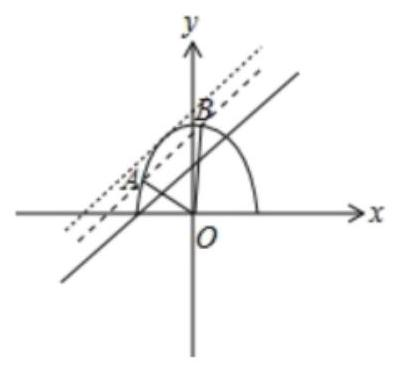
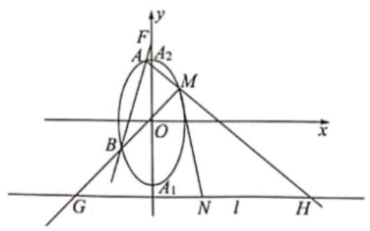
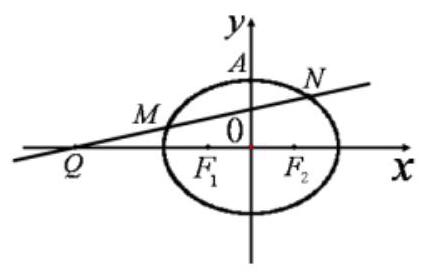
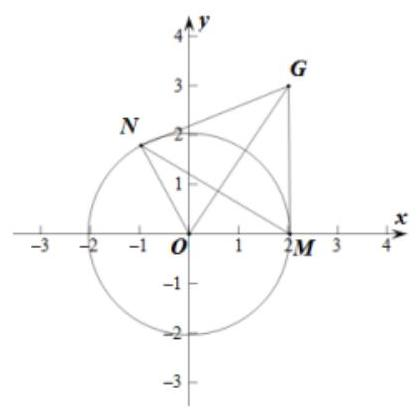
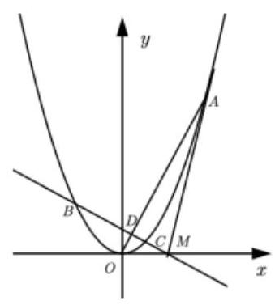

平面向量在解题中的应用

<table><tr><td>教学目标</td><td>如何利用平面向量这个工具去解决解析几何问题, 将几何问题代数化.</td></tr><tr><td>重点</td><td>平面向量可以解决解析几何中角度、共线、点与曲线方程、数量积及长度问题</td></tr><tr><td>难 点</td><td>如何在解析几何中中应用平面向量</td></tr></table>

## (一) 利用向量夹角公式, 合理处理解析几何中的角度问题

## 例题精讲

【例 1】设两曲线 ${C}_{1} : x - y + a = 0$ 与 ${C}_{2} : 2{x}^{2} + {y}^{2} = 1\left( {y \geq  0}\right)$ 的交点为 $A\text{ 、 }B, O$ 是坐标原点,若 $\bigtriangleup {AOB}$ 是锐角三角形，则实数 $a$ 的取值范围是___.

【难度】 $\star   \star   \star$

【答案】 $\left( {\frac{\sqrt{6}}{3},\frac{2\sqrt{3}}{3}}\right)$

【解析】由题意, $2{x}^{2} + {y}^{2} = 1\left( {y \geq  0}\right)$ 是焦点在 $y$ 轴上的上半个椭圆,

作出两曲线 ${C}_{1} : x - y + a = 0$ 与 ${C}_{2} : 2{x}^{2} + {y}^{2} = 1\left( {y \geq  0}\right)$ 图象,如图所示

联立 $\left\{  \begin{array}{l} x - y + a = 0 \\  2{x}^{2} + {y}^{2} = 1 \end{array}\right.$ ,得 $3{x}^{2} + {2ax} + {a}^{2} - 1 = 0$

设 $A\left( {{x}_{1},{y}_{1}}\right) , B\left( {{x}_{2},{y}_{2}}\right) ,\therefore {x}_{1} + {x}_{2} =  - \frac{2a}{3},{x}_{1}{x}_{2} = \frac{{a}^{2} - 1}{3}$

当 ${OA}\bot {OB}$ 时， $- \frac{{y}_{1}}{{x}_{1}} \cdot  \left( {-\frac{{y}_{2}}{{x}_{2}}}\right)  =  - 1$ ，即 ${y}_{1}{y}_{2} =  - {x}_{1}{x}_{2}$ ， $\therefore \left( {{x}_{1} + a}\right) \left( {{x}_{2} + a}\right)  =  - {x}_{1}{x}_{2}$ ，则 $a\left( {{x}_{1} + {x}_{2}}\right)  + 2{x}_{1}{x}_{2} + {a}^{2} = 0$ ， $\therefore  - \frac{2{a}^{2}}{3} + \frac{2{a}^{2} - 2}{3} + {a}^{2} = 0$ ,解得 $a = \frac{\sqrt{6}}{3}$ ;

当 ${OA} \bot  {AB}$ 时, ${OA}$ 所在直线方程为 $y =  - x$ ,联立 $\left\{  \begin{array}{l} y =  - x \\  2{x}^{2} + {y}^{2} = 1 \end{array}\right.$ ,解得 $A\left( {-\frac{\sqrt{3}}{3},\frac{\sqrt{3}}{3}}\right)$

把 $A$ 的坐标代入 $x - y + a = 0$ ，得 $a = \frac{2\sqrt{3}}{3}$ .

所以使 $\bigtriangleup {ABC}$ 是锐角三角形的实数 $a$ 的取值范围是 $\left( {\frac{\sqrt{6}}{3},\frac{2\sqrt{3}}{3}}\right)$ ,故答案为: $\left( {\frac{\sqrt{6}}{3},\frac{2\sqrt{3}}{3}}\right)$ .

【例 2】设三个数 $\sqrt{{\left( x - 1\right) }^{2} + {y}^{2}},2,\sqrt{{\left( x + 1\right) }^{2} + {y}^{2}}$ 成等差数列,其中 $\left( {x, y}\right)$ 对应点的曲线方程是 $C$ .

(1)求 $C$ 的标准方程；

(2)直线 ${l}_{1} : x - y + m = 0$ 与曲线 $C$ 相交于不同两点 $M, N$ ，且满足 $\angle {MON}$ 为钝角，其中 $O$ 为直角坐标原点， 求出 $m$ 的取值范围.

【难度】★★★

【答案】 $\left( 1\right) \frac{{x}^{2}}{4} + \frac{{y}^{2}}{3} = 1\;\left( 2\right)  - \frac{2\sqrt{42}}{7} < m < \frac{2\sqrt{42}}{7}$ 且 $m \neq  0$

【解析】解: (1) 、依题意: $\sqrt{{\left( x - 1\right) }^{2} + {y}^{2}} + \sqrt{{\left( x + 1\right) }^{2} + {y}^{2}} = 4$ ,所以点 $P\left( {x, y}\right)$ 对应的曲线方程 $C$ 是椭圆 ${2a} = 4,\therefore a = 2, c = 1;\therefore a = 2, c = 1, b = \sqrt{3};C$ 的标准方程 $\frac{{x}^{2}}{4} + \frac{{y}^{2}}{3} = 1$

(2)、联立方程组 $\left\{  \begin{array}{l} x - y + m = 0 \\  \frac{{x}^{2}}{4} + \frac{{y}^{2}}{3} = 1 \end{array}\right.$ ，且 $m \neq  0$ ，消去 $y$ ，得 $7{x}^{2} + {8mx} + 4{m}^{2} - {12} = 0$ ，

$\Delta  = {64}{m}^{2} - {28}\left( {4{m}^{2} - {12}}\right)  = {336} - {48}{m}^{2} > 0,\therefore {m}^{2} < 7$ ,且 $m \neq  0$

设 $M\left( {{x}_{1},{y}_{1}}\right) , N\left( {{x}_{2},{y}_{2}}\right)$ ,得 ${x}_{1}{x}_{2} = \frac{4{m}^{2} - {12}}{7}$ ,可计算 ${y}_{1}{y}_{2} = \frac{3{m}^{2} - {12}}{7}$

由 $\angle {MON}$ 为钝角,则 $\overrightarrow{OM} \cdot  \overrightarrow{ON} < 0,{x}_{1}{x}_{2} + {y}_{1}{y}_{2} < 0,\frac{4{m}^{2} - {12}}{7} + \frac{3{m}^{2} - {12}}{7} < 0$ ,所以 ${m}^{2} < \frac{24}{7}$

$\therefore m$ 的取值范围 $- \frac{2\sqrt{42}}{7} < m < \frac{2\sqrt{42}}{7}$ 且 $m \neq  0$ .

【例 3】已知抛物线 $C : {x}^{2} = {4y}$ ,不过原点的直线 $l$ 与 $C$ 交于不同两点 $A\left( {{x}_{A},{y}_{A}}\right) , B\left( {{x}_{B},{y}_{B}}\right)$ .

(1)若直线 $l$ 过抛物线 $C$ 的焦点,设求 ${x}_{A} \cdot  {x}_{B}$ 的值;

(2)若 ${OA}$ 垂直于 ${OB}$ ，求证:直线 $l$ 过定点；

(3)若直线 $l$ 过点 $\left( {0,4}\right)$ ，直线 $\mathrm{m} : y = {ax} - 1$ ，直线 ${AO},{BO}$ 分别交直线 $m$ 于 $M$ ， $N$ 两点，线段 ${MN}$ 长的最小值为 $f\left( a\right)$ ,求 $f\left( a\right)$ 的最大值.

【难度】 $\star   \star   \star   \star$

【答案】( 1 )-4；( 2 )证明见解析；( 3 )2.

【解析】( 1 )焦点 $F\left( {0,1}\right)$ ,显然直线 $l$ 的斜率一定存在,设为 $k$ ,设方程为 $y = {kx} + 1$ ,

联立方程组 $\left\{  \begin{array}{l} y = {kx} + 1 \\  {x}^{2} = {4y} \end{array}\right.$ ,消去 $y$ 得 ${x}^{2} - {4kx} - 4 = 0$ ,则 ${x}_{A} \cdot  {x}_{B} =  - 4$ ;

(2)由 $\overrightarrow{OA} \bot  \overrightarrow{OB}$ ，则 ${x}_{A}{x}_{B} + {y}_{A}{y}_{B} = 0$ ，又 $\left\{  \begin{array}{l} {x}_{A}{}^{2} = 4{y}_{A} \\  {x}_{B}{}^{2} = 4{y}_{B} \end{array}\right.$ ，所以 ${x}_{A}{x}_{B} + \frac{{x}_{A}{}^{2}{x}_{B}{}^{2}}{16} = 0$ ，所以 ${x}_{A}{x}_{B} =  - {16}$

设直线 $l$ 的方程为 $y = {kx} + t$ ,联立方程组 $\left\{  \begin{array}{l} y = {kx} + t \\  {x}^{2} = {4y} \end{array}\right.$ ,则 ${x}^{2} - {4kx} - {4t} = 0$

当 $\Delta  = {16}{k}^{2} + {16t} > 0$ 时,有 ${x}_{A} \cdot  {x}_{B} =  - {4t} =  - {16}$ ,得 $t = 4$

所以直线 $l$ 的方程为 $y = {kx} + 4$ ,所以直线 $l$ 过定点 $\left( {0,4}\right)$

(3)设直线 $l$ 的方程为 $y = {kx} + 4$ ，联立方程组 $\left\{  \begin{array}{l} y = {kx} + 4 \\  {x}^{2} = {4y} \end{array}\right.$ ，则 ${x}^{2} - {4kx} - {16} = 0$

则 ${x}_{A} \cdot  {x}_{B} =  - {16},{y}_{A}{y}_{B} = \frac{{x}_{A}{}^{2}}{4}\frac{{x}_{B}{}^{2}}{4} = {16}$ ,所以 ${x}_{A} \cdot  {x}_{B} + {y}_{A}{y}_{B} = 0$ ,即 $\overrightarrow{OA} \cdot  \overrightarrow{OB} = 0$ ; 所以 ${OA} \bot  {OB}$ ;

设直线 ${OA}$ 的方程: $y = {k}_{1}x$ ，联立 $\left\{  \begin{array}{l} y = {k}_{1}x \\  y = {ax} - 1 \end{array}\right.$ 得 ${x}_{M} = \frac{1}{a - {k}_{1}}$ ，由 ${OA} \bot  {OB}$ ，则 ${k}_{OB} =  - \frac{1}{{k}_{1}}$ ，

所以 ${x}_{N} = \frac{1}{a + \frac{1}{{k}_{1}}} = \frac{{k}_{1}}{a{k}_{1} + 1},\left| {MN}\right|  = \sqrt{1 + {a}^{2}}\left| {{x}_{M} - {x}_{N}}\right|  = \sqrt{1 + {a}^{2}}\left| \frac{{k}_{1}^{2} + 1}{\left( {a - {k}_{1}}\right) \left( {a{k}_{1} + 1}\right) }\right|$ ,

设 $\frac{{k}_{1}^{2} + 1}{\left( {a - {k}_{1}}\right) \left( {a{k}_{1} + 1}\right) } = \frac{1}{t}$ ,则 $\left( {a + t}\right) {k}_{1}^{2} - \left( {{a}^{2} - 1}\right) {k}_{1} + t - a = 0$ 有解, $\Delta  = {\left( {a}^{2} - 1\right) }^{2} - 4\left( {t + a}\right) \left( {t - a}\right)  \geq  0$ ,

得到 $t \leq  \frac{{a}^{2} + 1}{2}$ ,所以 $\frac{1}{t} \geq  \frac{2}{{a}^{2} + 1}$ ; 因此 $f\left( a\right)  = \frac{2}{\sqrt{{a}^{2} + 1}}$ ,当 $a = 0$ 时, $f\left( a\right)$ 的最大值为 2 .

## 巩固训练

1、设抛物线 ${x}^{2} = {4y}$ ，点 $F$ 是抛物线的焦点，点 $M\left( {0, m}\right)$ 在 $y$ 轴正半轴上(异于 $F$ 点)，动点 $N$ 在抛物线上，若 $\angle {FNM}$ 是锐角，则 $m$ 的范围为___.

【答案】 $\left( {0,1}\right)  \cup  \left( {1,9}\right)$

【解析】设 $N\left( {{4t},4{t}^{2}}\right)$ ,可知 $F\left( {0,1}\right) , m > 0$ 且 $m \neq  1$ ,所以 $\overrightarrow{NF} = \left( {-{4t},1 - 4{t}^{2}}\right) ,\overrightarrow{NM} = \left( {-{4t}, m - 4{t}^{2}}\right)$ , 因为 $\angle {FNM}$ 是锐角,所以 $\overrightarrow{NF} \cdot  \overrightarrow{NM} > 0$ ,即 ${16}{t}^{2} + \left( {1 - 4{t}^{2}}\right) \left( {m - 4{t}^{2}}\right)  > 0$ ,

整理得 ${16}{t}^{4} + \left( {{12} - {4m}}\right) {t}^{2} + m > 0$ ,等价于 $8{t}^{4} + \left( {6 - {2m}}\right) {t}^{2} + \frac{m}{2} > 0$ 对任意 $t \in  R$ 恒成立;

令 $x = {t}^{2} \geq  0$ ,则 $f\left( x\right)  = 8{x}^{2} + \left( {6 - {2m}}\right) x + \frac{m}{2} > 0$ 对任意 $x \in  \lbrack 0, + \infty )$ 恒成立;

因为 $f\left( x\right)$ 的对称轴为 $x =  - \frac{3 - m}{8}$ ,故分类讨论如下:

(1) $- \frac{3 - m}{8} \leq  0$ ，即 $0 < m \leq  3$ 时， $f{\left( x\right) }_{\min } = f\left( 0\right)  = \frac{m}{2} > 0$ ，所以 $0 < m \leq  3$ ；

(2) $- \frac{3 - m}{8} > 0$ ，即 $m > 3$ 时，应有 $\Delta  = {\left( 6 - 2m\right) }^{2} - 4 \times  8 \times  \frac{m}{2} < 0$ ，得 $3 < m < 9$ ；

综上所述: $m \in  \left( {0,1}\right)  \cup  \left( {1,9}\right)$ .

2、已知点 $A\left( {1,0}\right)$ ， $E$ ， $F$ 为直线 $x =  - 1$ 上的两个动点，且 $\overrightarrow{AE} \bot  \overrightarrow{AF}$ ，动点 $P$ 满足 $\overrightarrow{EP}//\overrightarrow{OA}$ ， $\overrightarrow{FO}//\overrightarrow{OP}$ (其中 $O$ 为坐标原点).

(1)求动点 $P$ 的轨迹 $C$ 的方程；

(2)若直线 $l$ 与轨迹 $C$ 相交于两不同点 $M\text{ 、 }N$ ，如果 $\overrightarrow{OM} \cdot  \overrightarrow{ON} =  - 4$ ，证明直线 $l$ 必过一定点，并求出该定点的坐标.

【答案】( 1 ) ${y}^{2} = {4x}\left( {x \neq  0}\right)$ ；( 2 )证明见解析，定点为 $\left( {2,0}\right)$ .

【解析】(1) 设 $P\left( {x, y}\right) \text{ 、 }E\left( {-1, a}\right) \text{ 、 }F\left( {-1, b}\right)$ ,

则 $\overrightarrow{AE} = \left( {-2, a}\right) ,\overrightarrow{AF} = \left( {-2, b}\right) ,\overrightarrow{EP} = \left( {x + 1, y - a}\right) ,\overrightarrow{OA} = \left( {1,0}\right) ,\overrightarrow{FO} = \left( {1, - b}\right) ,\overrightarrow{OP} = \left( {x, y}\right)$ .

由 $\overrightarrow{AE} \bot  \overrightarrow{AF}$ ,得 $\overrightarrow{AE} \cdot  \overrightarrow{AF} = 4 + {ab} = 0$ ,且点 $E\text{ 、 }F$ 均不在 $x$ 轴上,故 ${ab} =  - 4$ ,且 $a \neq  0, b \neq  0$ .

由 $\overrightarrow{EP}//\overrightarrow{OA}$ ,得 $y - a = 0$ ,即 $y = a$ . 由 $\overrightarrow{FO}//\overrightarrow{OP}$ ,得 ${bx} + y = 0$ ,即 $y =  - {bx}$ .

所以 ${y}^{2} =  - {abx} = {4x}$ ,所以动点 $P$ 的轨迹 $C$ 的方程为: ${y}^{2} = {4x}\left( {x \neq  0}\right)$ ;

(2)若直线 $l$ 的斜率为零时，则直线 $l$ 与曲线 $C$ 至多只有一个公共点，不合乎题意.

可设直线 $l$ 的方程为 $x = {ty} + n\left( {n \neq  0}\right)$ .

由 $\left\{  \begin{array}{l} y = {ty} + n \\  {y}^{2} = {4x} \end{array}\right.$ ,得 ${y}^{2} - {4ty} - {4n} = 0$ .

设 $M\left( {{x}_{1},{y}_{1}}\right) \text{ 、 }N\left( {{x}_{2},{y}_{2}}\right)$ ,则 ${y}_{1} + {y}_{2} = {4t},{y}_{1}{y}_{2} =  - {4n}$ .

$\therefore \overrightarrow{OM} \cdot  \overrightarrow{ON} = {x}_{1}{x}_{2} + {y}_{1}{y}_{2} = \frac{{\left( {y}_{1}{y}_{2}\right) }^{2}}{16} + {y}_{1}{y}_{2} = {n}^{2} - {4n} =  - 4$ ,

$\because n \neq  0$ ,解得 $n = 2$ ,所以,直线 $l$ 的方程为 $x = {ty} + 2$ ,即直线 $l$ 恒过定点 $\left( {2,0}\right)$ .

3、已知椭圆 $C : {x}^{2} + \frac{{y}^{2}}{m} = 1\left( {0 < m < 1}\right)$ 的左顶点为 $A, M$ 是椭圆 $C$ 上异于点 $A$ 的任意一点,点 $P$ 与点 $A$ 关于点 $M$ 对称.

(1)若点 $P$ 的坐标为 $\left( {\frac{9}{5},\frac{4\sqrt{3}}{5}}\right)$ ，求 $m$ 的值；

(2)若椭圆 $C$ 上存在点 $M$ ，使得以线段 ${PM}$ 为直径的圆过原点，求 $m$ 的取值范围.

【答案】(1) $\frac{4}{7};\;\left( 2\right) \left( {0,\frac{1}{2} - \frac{\sqrt{3}}{4}}\right\rbrack$ .

【解析】(1)依题意， $M$ 是线段 ${AP}$ 的中点，因为 $\mathrm{A}\left( {-1,0}\right)$ ， $\mathrm{P}\left( {\frac{9}{5},\frac{4\sqrt{3}}{5}}\right)$ ，

所以点 $\mathrm{M}$ 的坐标为 $\left( {\frac{3}{5},\frac{2\sqrt{3}}{5}}\right)$ 由点 $\mathrm{M}$ 在椭圆上，所以 $\frac{4}{25} + \frac{12}{{25}\mathrm{\;m}} = 1$ ，解得 $\mathrm{m} = \frac{4}{7}$

(2)解:设 $M\left( {{x}_{0},{y}_{0}}\right)$ 则， $C : {x}_{0}^{2} + \frac{{y}_{0}{}^{2}}{m} = 1$ 且 $- 1 < {x}_{0} < 1\cdots$ ①

因为 $M$ 是线段 ${AP}$ 的中点，所以 $P\left( {2{x}_{0} + 1\text{ , }2{y}_{0}}\right)$ ，以线段 ${PM}$ 为直径的圆过原点则， ${OP}\bot {OM}$ ，即 $\overrightarrow{OP}\bot \overrightarrow{OM}$ ，

所以 $\overrightarrow{OP} \cdot  \overrightarrow{OM} = {x}_{0}\left( {2{x}_{0} + 1}\right)  + 2{y}_{0}^{2} = 0\cdots$ ②

由①②消去 ${y}_{0}$ ，整理得 $m = \frac{2{x}_{0}{}^{2} + {x}_{0}}{2{x}_{0}{}^{2} - 2}$

所以 $m = 1 + \frac{1}{2\left( {{x}_{0} + 2}\right)  + \frac{6}{{x}_{0} + 2} - 8} \leq  \frac{1}{2} - \frac{\sqrt{3}}{4}$

(二)利用向量平行的充要条件, 灵活转化解析几何中的平行或共线问题

例题精讲

【例 4】已知 ${A}_{1},{A}_{2}$ 是椭圆 $E : \frac{{y}^{2}}{{a}^{2}} + \frac{{x}^{2}}{{b}^{2}} = 1\left( {a > b > 0}\right)$ 长轴的两个端点,点 $M\left( {1,2}\right)$ 在椭圆 $E$ 上,直线 $M{A}_{1}$ , $M{A}_{2}$ 的斜率之积等于 -4 .

(1)求椭圆 $E$ 的标准方程；

(2)设 $m > 0$ ，直线 $l$ 方程为 $y =  - m$ ，若过点 $F\left( {0, m}\right)$ 的直线与椭圆 $E$ 相交于 $\mathrm{A}$ ， $B$ 两点，直线 ${MA}$ ， ${MB}$ 与 $l$ 的交点分别为 $H, G$ ,线段 ${GH}$ 的中点为 $N$ . 判断是否存在正数 $m$ 使直线 ${MN}$ 的斜率为定值，并说明理由.

【难度】 $\star   \star   \star$

【答案】( 1 ) $\frac{{y}^{2}}{8} + \frac{{x}^{2}}{2} = 1$ ；( 2 )存在，理由见解析.

【解析】(1)由已知: ${A}_{1}\left( {0, - a}\right) ,{A}_{2}\left( {0, a}\right)$ ,

因为 $M\left( {1,2}\right)$ 在椭圆上,直线 $M{A}_{1}, M{A}_{2}$ 的斜率之积等于 -4,所以 ${k}_{M{A}_{1}} \cdot  {k}_{M{A}_{2}} = \frac{2 + a}{1 - 0} \times  \frac{2 - a}{1 - 0} =  - 4$ ,解得: ${a}^{2} = 8,$ 又 $\frac{4}{{a}^{2}} + \frac{1}{{b}^{2}} = 1$ ,所以 ${b}^{2} = 2$ ,所以椭圆的标准方程为 $\frac{{y}^{2}}{8} + \frac{{x}^{2}}{2} = 1$ ,

(2)设 $A\left( {{x}_{1},{y}_{1}}\right)$ ， $B\left( {{x}_{2},{y}_{2}}\right)$ 为过点 $F$ 的直线与椭圆 $E$ 的交点，

① 当经过点 $F$ 的直线斜率不存在时,此时 $\mathrm{A}, B$ 为椭圆 $E$ 长轴端点,

不妨设 $A\left( {0,2\sqrt{2}}\right) , B\left( {0, - 2\sqrt{2}}\right)$ ,因为 $M,\mathrm{\;A}, H$ 三点共线,

$H$ 坐标为 $\left( {\frac{m + 2}{2\sqrt{2} - 2} + 1, - m}\right)$ ,同理 $G$ 坐标为 $\left( {-\frac{m + 2}{2\sqrt{2} + 2} + 1, - m}\right)$ ,此时线段 ${GH}$ 的中点为 $N\left( {\frac{m + 4}{2}, - m}\right)$ , 所以 ${k}_{MN} = \frac{-m - 2}{\frac{m + 4}{2} - 1} =  - 2$ ,

② 当该直线的斜率存在时,设该直线的方程是 $y = {kx} + m$ ,联立方程得: $\left\{  \begin{array}{l} 4{x}^{2} + {y}^{2} = 8 \\  y = {kx} + m \end{array}\right.$ ,

消元并化简得: $\left( {4 + {k}^{2}}\right) {x}^{2} + {2kmx} + {m}^{2} - 8 = 0$ ,所以 ${x}_{1} + {x}_{2} =  - \frac{2km}{4 + {k}^{2}},{x}_{1}{x}_{2} = \frac{{m}^{2} - 8}{4 + {k}^{2}}$ ,

设 $H\left( {{x}_{3}, - m}\right) , G\left( {{x}_{4}, - m}\right)$ ,

因为 $M,\mathrm{\;A}, H$ 三点共线,即 $\overrightarrow{MA}//\overrightarrow{MH}$ ,所以 $\left( {{x}_{3} - 1}\right) \left( {{y}_{1} - 2}\right)  = \left( {-m - 2}\right) \left( {{x}_{1} - 1}\right)$ ,

由已知得,点 $M$ 不在直线 $y = {kx} + m$ 上,且 ${y}_{1} = k{x}_{1} + m$ ,所以 ${x}_{3} =  - \frac{\left( {m + 2}\right) \left( {{x}_{1} - 1}\right) }{k{x}_{1} + m - 2} + 1$ ,

同理可得 ${x}_{4} =  - \frac{\left( {m + 2}\right) \left( {{x}_{2} - 1}\right) }{k{x}_{2} + m - 2} + 1$ ,所以 ${x}_{3} + {x}_{4} =  - \frac{\left( {m + 2}\right) \left( {{x}_{1} - 1}\right) }{k{x}_{1} + m - 2} - \frac{\left( {m + 2}\right) \left( {{x}_{2} - 1}\right) }{k{x}_{2} + m - 2} + 2$ ,

$=  - \frac{\left( {m + 2}\right) \left\lbrack  {{2k}{x}_{1}{x}_{2} + \left( {m - 2 - k}\right) \left( {{x}_{1} + {x}_{2}}\right)  + 4 - {2m}}\right\rbrack  }{{k}^{2}{x}_{1}{x}_{2} + k\left( {m - 2}\right) \left( {{x}_{1} + {x}_{2}}\right)  + {\left( m - 2\right) }^{2}} + 2$ ,

将 ${x}_{1} + {x}_{2} =  - \frac{2km}{4 + {k}^{2}},{x}_{1}{x}_{2} = \frac{{m}^{2} - 8}{4 + {k}^{2}}$ 代入上式并化简得: ${x}_{3} + {x}_{4} = \frac{\left( {m + 2}\right) \left( {k - 2}\right) }{k - m + 2} + 2$ ,

所以 $N$ 的坐标为 $\left( {\frac{\left( {m + 2}\right) \left( {k - 2}\right) }{2\left( {k - m + 2}\right) } + 1, - m}\right)$ ,

当 $k - 2 \neq  0$ 时,直线 ${MN}$ 的斜率 ${k}_{MN} =  - \frac{2\left( {k - m + 2}\right) }{k - 2} = \frac{2\left( {m - 4}\right) }{k - 2} - 2$ ,

因为 ${k}_{MN}$ 与 $k$ 的取值无关,所以 $m - 4 = 0$ ,即 $m = 4$ ,此时 ${k}_{MN} =  - 2$ .

综合①②可知:存在 $m = 4$ 使得直线 ${MN}$ 的斜率为定值 -2 .

【例 5】设椭圆 $C : \frac{{x}^{2}}{{a}^{2}} + \frac{{y}^{2}}{{b}^{2}} = 1\left( {a > b > 0}\right) , O$ 为原点，点 $A\left( {4,0}\right)$ 是 $x$ 轴上一定点，已知椭圆的长轴长等于 $\left| {OA}\right|$ ,焦距为 $2\sqrt{3}$ .

(1)求椭圆的方程；

(2)直线 $l : y = {kx} + t$ 与椭圆 $C$ 交于两个不同点 $M, N$ ，已知 $M$ 关于 $y$ 轴的对称点为 ${M}^{\prime }, N$ 关于原点 $O$ 的对称点为 ${N}^{\prime }$ ,若 ${M}^{\prime },{N}^{\prime }$ 满足 $\overrightarrow{OA} = \lambda \overrightarrow{OM} + \mu \overrightarrow{ON}\left( {\lambda  + \mu  = 1}\right)$ ,求证: 直线 $l$ 经过定点.

【难度】 $\star   \star   \star$

【答案】(1) $\frac{{x}^{2}}{4} + {y}^{2} = 1$ ；(2)证明见解析.

【解析】( 1 )由题意，椭圆 $C : \frac{{x}^{2}}{{a}^{2}} + \frac{{y}^{2}}{{b}^{2}} = 1$ ，且长轴长等于 $\left| {OA}\right|$ ，焦距为 $2\sqrt{3}$ ，得 $a = 2, c = \sqrt{3}$ ，所以 ${b}^{2} = {a}^{2} - {c}^{2} = 1$ ,所以椭圆 $C$ 的方程为 $\frac{{x}^{2}}{4} + {y}^{2} = 1$ .

(2)设 $M\left( {{x}_{1},{y}_{1}}\right)$ ， $N\left( {{x}_{2},{y}_{2}}\right)$ ，则 ${M}^{\prime }\left( {-{x}_{1},{y}_{1}}\right)$ ， ${N}^{\prime }\left( {-{x}_{2}, - {y}_{2}}\right)$ ，

由 $\overrightarrow{OA} = \lambda \overrightarrow{OM} + \mu \overrightarrow{ON}\left( {\lambda  + \mu  = 1}\right)$ ,可得 $A,{M}^{\prime },{N}^{\prime }$ 三点共线,

所以 ${k}_{AM} = {k}_{AN}$ ,即 ${k}_{AN} - {k}_{A{M}^{\prime }} = 0$ ,

又由 ${k}_{AM} = \frac{{y}_{1}}{-{x}_{1} - 4},{k}_{A{N}^{\prime }} = \frac{{y}_{2}}{4 + {x}_{2}}$ ,

所以 $\frac{{y}_{1}}{{x}_{1} + 4} + \frac{{y}_{2}}{4 + {x}_{2}} = \frac{{y}_{1}\left( {{x}_{2} + 4}\right)  + {y}_{2}\left( {{x}_{1} + 4}\right) }{\left( {{x}_{1} + 4}\right) \left( {{x}_{2} + 4}\right) } = 0$ ,

整理得 ${2k}{x}_{1}{x}_{2} + \left( {t + {4k}}\right) \left( {{x}_{1} + {x}_{2}}\right)  + {8t} = 0$ . ①

由 $\left\{  \begin{array}{l} y = {kx} + t \\  \frac{{x}^{2}}{4} + {y}^{2} = 1 \end{array}\right.$ ,可得 $\left( {1 + 4{k}^{2}}\right) {x}^{2} + {8ktx} + 4{t}^{2} - 4 = 0$ ,则 ${x}_{1} + {x}_{2} =  - \frac{8kt}{1 + 4{k}^{2}},{x}_{1}{x}_{2} = \frac{4{t}^{2} - 4}{1 + 4{k}^{2}}$ ,

代入①，可得 $2 \times  \frac{4{t}^{2} - 4}{1 + 4{k}^{2}} + \left( {t + {4k}}\right)  \times  \left( {-\frac{8kt}{1 + 4{k}^{2}}}\right)  + {8t} = 0$ ，整理得 $t = k$ ，

所以直线 $l$ 的方程为 $y = {kx} + k$ ,即 $y = k\left( {x + 1}\right)$ ,即直线 $l$ 恒过定点 $\left( {-1,0}\right)$ .

## 巩固训练

1、已知直线 $l : x = {my} + 1$ 过抛物线 $C : {y}^{2} = {2px}$ 的焦点 $F$ ，交抛物线 $C$ 于 $A$ 、 $B$ 两点，若 $\overrightarrow{AF} = 2\overrightarrow{FB}$ ，则直线 $l$ 的斜率为___.

【答案】 $\pm  2\sqrt{2}$

【解析】由直线 $x = {my} + 1$ 过 $\left( {1,0}\right)$ ,所以 $p = 2$ ,

设 $A\left( {{x}_{1},{y}_{1}}\right) , B\left( {{x}_{2},{y}_{2}}\right)$ ,由 $\overrightarrow{AF} = 2\overrightarrow{FB}$ ,可得 ${y}_{1} =  - 2{y}_{2}$ ,

直线 $x = {my} + 1$ 与抛物线 ${y}^{2} = {4x}$ 联立得, ${y}^{2} = {4my} + 4$ ,所以 ${y}_{1}{y}_{2} =  - 4$ ,可得 ${y}_{2} =  \pm  \sqrt{2}$ ,

所以 $k = \frac{{y}_{2}}{{x}_{2} - 1} = \frac{\pm \sqrt{2}}{\frac{1}{2} - 1} =  \pm  2\sqrt{2}$ . 故答案为: $\pm  2\sqrt{2}$

2、如图,已知椭圆 C: $\frac{{x}^{2}}{{a}^{2}} + \frac{{y}^{2}}{{b}^{2}} = 1,\left( {a > b > 0}\right)$ 的左、右焦点为 ${F}_{1}\text{ 、 }{F}_{2}$ ,其上顶点为 $A$ . 已知 $\Delta {F}_{1}A{F}_{2}$ 是边长为 2 的正三角形.

(1)求椭圆 C 的方程；

(2)过点 $Q\left( {-4,0}\right)$ 任作一动直线 $l$ 交椭圆 C 于 $M, N$ 两点，在线段 ${MN}$ 上取一点 $R$ ，使得 $\frac{\left| MQ\right| }{\left| QN\right| } = \frac{\left| MR\right| }{\left| RN\right| }$ ，试判断当直线 $l$ 运动时,点 $R$ 是否在某一定直线上运动? 若在请求出该定直线,若不在请说明理由.

【答案】( 1 ) $\frac{{x}^{2}}{4} + \frac{{y}^{2}}{3} = 1$ ；( 2 )点 $\mathrm{R}$ 在定直线 $x =  - 1$ 上.

【解析】(1) $\Delta {F}_{1}A{F}_{2}$ 是边长为 2 的正三角形,则 $c = 1, a = 2$ ，故椭圆 $\mathbf{C}$ 的方程为 $\frac{{x}^{2}}{4} + \frac{{y}^{2}}{3} = 1$ .

(2)直线 MN 的斜率必存在,设其直线方程为 $y = k\left( {x + 4}\right)$ ,并设 $M\left( {{x}_{1},{y}_{1}}\right) , N\left( {{x}_{2},{y}_{2}}\right)$ .

联立方程 $\left\{  \begin{array}{l} \frac{{x}^{2}}{4} + \frac{{y}^{2}}{3} = 1 \\  y = k\left( {x + 4}\right)  \end{array}\right.$ ,消去 $y$ 得 $\left( {3 + 4{k}^{2}}\right) {x}^{2} + {32}{k}^{2}x + {64}{k}^{2} - {12} = 0$ ,则

$\Delta  = {144}\left( {1 - 4{k}^{2}}\right)  > 0,{x}_{1} + {x}_{2} = \frac{-{32}{k}^{2}}{3 + 4{k}^{2}},{x}_{1} \cdot  {x}_{2} = \frac{{64}{k}^{2} - {12}}{3 + 4{k}^{2}}$ ,由题意可设 $\overrightarrow{MR} =  - \lambda  \cdot  \overrightarrow{RN}$ ,

$M\dot{Q} = \lambda  \cdot  Q\dot{N}$ ,由 $M\dot{Q} = \lambda  \cdot  Q\dot{N}$ 得 $- 4 - {x}_{1} = \lambda \left( {{x}_{2} + 4}\right)$ ,故 $\lambda  =  - \frac{{x}_{1} + 4}{{x}_{2} + 4}$ . 设点 $\mathbf{R}$ 的坐标为 $\left( {{x}_{0},{y}_{0}}\right)$ ,

则 由 $\overrightarrow{MR} =  - \lambda  \cdot  \overrightarrow{RN}$ 得 ${x}_{0} - {x}_{1} =  - \lambda \left( {{x}_{2} - {x}_{0}}\right)$ ，解 得

${x}_{0} = \frac{{x}_{1} - \lambda {x}_{2}}{1 - \lambda } = \frac{{x}_{1} + \frac{{x}_{1} + 4}{{x}_{2} + 4} \cdot  {x}_{2}}{1 + \frac{{x}_{1} + 4}{{x}_{2} + 4}} = \frac{2{x}_{1}{x}_{2} + 4\left( {{x}_{1} + {x}_{2}}\right) }{\left( {{x}_{1} + {x}_{2}}\right)  + 8}.$

又 $2{x}_{1}{x}_{2} + 4\left( {{x}_{1} + {x}_{2}}\right)  = 2 \times  \frac{{64}{k}^{2} - {12}}{3 + 4{k}^{2}} + 4 \times  \frac{-{32}{k}^{2}}{3 + 4{k}^{2}} = \frac{-{24}}{3 + 4{k}^{2}}$ ,

$\left( {{x}_{1} + {x}_{2}}\right)  + 8 = \frac{-{32}{k}^{2}}{3 + 4{k}^{2}} + 8 = \frac{24}{3 + 4{k}^{2}}$ ,从而 ${x}_{0} = \frac{2{x}_{1}{x}_{2} + 4\left( {{x}_{1} + {x}_{2}}\right) }{\left( {{x}_{1} + {x}_{2}}\right)  + 8} =  - 1$ ,故点 $\mathrm{R}$ 在定直线 $x =  - 1$ 上

## (三) 将向量的坐标表示和运算转化为点的坐标和曲线的方程

## 例题精讲

【例 6】若平面上两点 $A\left( {-2,0}\right) , B\left( {1,0}\right)$ ,则过点 $B$ 的直线 $l$ 上满足 $\left( {\overrightarrow{BA} - \overrightarrow{PB}}\right)  \cdot  \left( {\overrightarrow{PA} + 2\overrightarrow{PB}}\right)  = 0$ 的点 $P$ 的个数为( )

A. 0 B. 1 C. 2 D. 与直线 $l$ 的斜率有关

【难度】★★★

【答案】C

【解析】解: 由 $\left( {\overrightarrow{BA} - \overrightarrow{PB}}\right)  \cdot  \left( {\overrightarrow{PA} + 2\overrightarrow{PB}}\right)  = 0$ ,则 $\left( {\overrightarrow{BP} + \overrightarrow{PA} - \overrightarrow{PB}}\right)  \cdot  \left( {\overrightarrow{PA} + 2\overrightarrow{PB}}\right)  = 0$ , 可得 $\left( {\overrightarrow{PA} - 2\overrightarrow{PB}}\right)  \cdot  \left( {\overrightarrow{PA} + 2\overrightarrow{PB}}\right)  = 0$ ,即 $\left| \overrightarrow{PA}\right|  = 2\left| \overrightarrow{PB}\right|$ ,可得点 $P$ 轨迹为圆,

设 $P\left( {x, y}\right)$ ,则 $\sqrt{{\left( x + 2\right) }^{2} + {y}^{2}} = 2\sqrt{{\left( x - 1\right) }^{2} + {y}^{2}}$ ,

整理可得方程为: ${\left( x - 2\right) }^{2} + {y}^{2} = 4$ ,故点 $P$ 的个数即为 $l$ 与圆的交点个数.

由于直线 $l$ 过定点 $\left( {1,0}\right)$ ,且在圆内,所以直线与圆有两个交点,故选: C.

【例 7】已知椭圆 $C : \frac{{x}^{2}}{{a}^{2}} + \frac{{y}^{2}}{{b}^{2}} = 1\left( {a > b > 0}\right)$ 的一个焦点和抛物线 ${y}^{2} = {12x}$ 的焦点相同,且椭圆过点 $\left( {-2,\sqrt{2}}\right)$ .

(1)求椭圆 $C$ 的方程；

(2)若直线 $y = {kx} + m$ 与椭圆 $C$ 交于A， $B$ 两点，以 $\mathrm{{OA}}$ ， ${OB}$ 为邻边作平行四边形 ${OACB}$ ，点 $C$ 在椭圆上, 问平行四边形 ${OACB}$ 的面积是否为定值? 若是定值, 求出结果, 若不是, 说明理由.

【难度】 $\star   \star   \star   \star$

【答案】(1) $\frac{{x}^{2}}{12} + \frac{{y}^{2}}{3} = 1$ ; (2) 是定值, $3\sqrt{3}$ .

【解析】(1)抛物线 ${y}^{2} = {12x}$ 的焦点坐标为 $\left( {3,0}\right)$ .

由题意: 椭圆的一个焦点坐标为 $\left( {3,0}\right)$ ,所以另一个焦点是 $\left( {-3,0}\right) , c = 3$ .

根据椭圆的定义有 ${2a} = \sqrt{{\left( 3 + 2\right) }^{2} + {\left( 0 - \sqrt{2}\right) }^{2}} + \sqrt{{\left( -3 + 2\right) }^{2} + {\left( 0 - \sqrt{2}\right) }^{2}} = 4\sqrt{3}$ 所以 $a = 2\sqrt{3}$ ,

所以 ${b}^{2} = {a}^{2} - {c}^{2} = 3$ 所以椭圆 $C : \frac{{x}^{2}}{12} + \frac{{y}^{2}}{3} = 1$ .

(2)设 $A\left( {{x}_{1},{y}_{1}}\right) , B\left( {{x}_{2},{y}_{2}}\right) , C\left( {{x}_{0},{y}_{0}}\right)$ ， $\left\{  \begin{array}{ll} \frac{{x}^{2}}{12} + \frac{{y}^{2}}{3} = 1 & \text{ ① } \\  y = {kx} + m & \text{ ② } \end{array}\right.$ ，

②代入①整理得，

$\left( {1 + 4{k}^{2}}\right) {x}^{2} + {8kmx} + 4{m}^{2} - {12} = 0,$

$\Delta  = {64}{k}^{2}{m}^{2} - {16}\left( {1 + 4{k}^{2}}\right) \left( {{m}^{2} - 3}\right)  = {16}\left( {3 - {m}^{2} + {12}{k}^{2}}\right)  > 0,$

${x}_{1} + {x}_{2} = \frac{-{8km}}{1 + 4{k}^{2}},{x}_{1}{x}_{2} = \frac{4{m}^{2} - {12}}{1 + 4{k}^{2}},$

因为 ${OACB}$ 是平行四边形所以 $\overline{OC} = \overrightarrow{OA} + \overrightarrow{OB}$ ,所以 ${x}_{0} = {x}_{1} + {x}_{2} = \frac{-{8km}}{1 + 4{k}^{2}}$ ,

${y}_{0} = {y}_{1} + {y}_{2} = k\left( {{x}_{1} + {x}_{2}}\right)  + {2m} = \frac{2m}{1 + 4{k}^{2}},$

因为 $\left( {{x}_{0},{y}_{0}}\right)$ 在椭圆上,代入得 ${\left( \frac{-{8km}}{1 + 4{k}^{2}}\right) }^{2} + 4{\left( \frac{2m}{1 + 4{k}^{2}}\right) }^{2} = {12}$ ,整理得: ${m}^{2} = \frac{3}{4}\left( {1 + 4{k}^{2}}\right)$ ,

$O$ 到 ${AB}$ 距离为 $d = \frac{\left| m\right| }{\sqrt{1 + {k}^{2}}}$ ,所以 ${S}_{\square {OACB}} = 2{S}_{\bigtriangleup {OAB}} = \left| {AB}\right|  \cdot  d = \frac{\left| m\right| }{\sqrt{1 + k}} \cdot  \sqrt{1 + {k}^{2}}\left| {{x}_{1} - {x}_{2}}\right|$ ,

$= \left| m\right| \sqrt{{\left( {x}_{1} + {x}_{2}\right) }^{2} - 4{x}_{1}{x}_{2}} = \left| m\right|  \cdot  \frac{4 \cdot  \sqrt{3 + {12}{k}^{2} - {m}^{2}}}{1 + 4{k}^{2}} = 4 \cdot  \left| m\right|  \cdot  \frac{\sqrt{3{m}^{2}}}{1 + 4{k}^{2}} = \frac{4\sqrt{3}{m}^{2}}{1 + 4{k}^{2}} = 3\sqrt{3}$ ,

所以平行四边形 ${OACB}$ 的面积为定值 $3\sqrt{3}$ .

【例 8】设椭圆 $\frac{{x}^{2}}{{a}^{2}} + \frac{{y}^{2}}{{b}^{2}} = 1\left( {a > b > 0}\right)$ 的右顶点为 $A$ ,上顶点为 $B$ ,且 $\frac{c}{a} = \frac{\sqrt{5}}{3},\left| {AB}\right|  = \sqrt{13}$ .

(1)求椭圆的方程；

(2)设直线 $l : y = {kx}\left( {k < 0}\right)$ 与椭圆交于 $P, Q$ 两点，直线 $l$ 与直线 ${AB}$ 交于点 $M$ ，且点 $P, M$ 均在第四象限. 若 $\overrightarrow{PM} = 2\overrightarrow{QP}$ ,求 $k$ 的值.

【难度】 $\star   \star   \star$

【答案】( 1 ) $\frac{{x}^{2}}{9} + \frac{{y}^{2}}{4} = 1$ ；( 2 ) $- \frac{1}{2}$

【解析】(1) 设椭圆右顶点为 $A\left( {a,0}\right)$ ,上顶点 $B\left( {0, b}\right)$ ,

由题意知, $\left| {AB}\right|  = \sqrt{{a}^{2} + {b}^{2}} = \sqrt{13}$ ,即 ${a}^{2} + {b}^{2} = {13}$ ,又 $\frac{c}{a} = \frac{\sqrt{5}}{3}$ ,即 $\frac{{c}^{2}}{{a}^{2}} = \frac{5}{9}$ ,

又由 ${a}^{2} = {b}^{2} + {c}^{2}$ ,可得 ${2a} = {3b}$ ,从而 $a = 3, b = 2$ . 所以,椭圆的方程为 $\frac{{x}^{2}}{9} + \frac{{y}^{2}}{4} = 1$ .

(2)设点 $P$ 的坐标为 $\left( {{x}_{1},{y}_{1}}\right)$ ，点 $M$ 的坐标为 $\left( {{x}_{2},{y}_{2}}\right)$ ，由题意， ${x}_{2} > {x}_{1} > 0$ ，

则点 $Q$ 的坐标为 $\left( {-{x}_{1}, - {y}_{1}}\right) ,\overrightarrow{PM} = \left( {{x}_{2} - {x}_{1},{y}_{2} - {y}_{1}}\right) ,\overrightarrow{QP} = \left( {2{x}_{1},2{y}_{1}}\right)$

由 $\overrightarrow{PM} = 2\overrightarrow{QP}$ ,可知 $\left( {{x}_{2} - {x}_{1},{y}_{2} - {y}_{1}}\right)  = 2\left( {2{x}_{1},2{y}_{1}}\right)  = \left( {4{x}_{1},4{y}_{1}}\right)$ ,即 ${x}_{2} = 5{x}_{1}$ .

由点 $A\left( {3,0}\right)$ ,点 $B\left( {0,2}\right)$ ,易知直线 ${AB}$ 的方程为 ${2x} + {3y} = 6$ ,

由方程组 $\left\{  \begin{array}{l} {2x} + {3y} = 6 \\  y = {kx} \end{array}\right.$ 消去 $y$ ,可得 ${x}_{2} = \frac{6}{{3k} + 2}$ ,由方程组 $\left\{  \begin{array}{l} \frac{{x}^{2}}{9} + \frac{{y}^{2}}{4} = 1 \\  y = {kx} \end{array}\right.$ 消去 $y$ ,可得 ${x}_{1} = \frac{6}{\sqrt{9{k}^{2} + 4}}$ .

由 ${x}_{2} = 5{x}_{1}$ ,可得 $\sqrt{9{k}^{2} + 4} = 5\left( {{3k} + 2}\right)$ ,整理得 ${18}{k}^{2} + {25k} + 8 = 0$ ,解得 $k =  - \frac{8}{9}$ 或 $k =  - \frac{1}{2}$ .

当 $k =  - \frac{8}{9}$ 时, ${x}_{2} =  - 9 < 0$ ,不合题意,舍去;

当 $k =  - \frac{1}{2}$ 时, ${x}_{2} = {12},{x}_{1} = \frac{12}{5}$ ,符合题意. 所以, $k$ 的值为 $- \frac{1}{2}$ .

巩固训练

1、已知椭圆 ${C}_{1} : \frac{{x}^{2}}{{a}^{2}} + \frac{{y}^{2}}{{b}^{2}} = 1\left( {a > b > 0}\right)$ 的左右焦点分别为 ${F}_{1},{F}_{2}$ . 点 $A\left( {\sqrt{3},\frac{1}{2}}\right)$ 在椭圆上; 直线 $A{F}_{1}$ 交 $y$ 轴于点 $B$ . 且 $\overrightarrow{A{F}_{2}} =  - 2\overrightarrow{OB}$ . 其中 $O$ 为坐标原点; 求椭圆 ${C}_{1}$ 的方程;

【答案】(1) $\frac{{x}^{2}}{4} + {y}^{2} = 1$ ; (2) ${\left( {S}_{\bigtriangleup {DOE}}\right) }_{\max } = \left\{  \begin{array}{l} 2\sqrt{\lambda  - {\lambda }^{2}},0 < \lambda  < \frac{1}{2} \\  1,\frac{1}{2} \leq  \lambda  < 1 \end{array}\right.$ .

【解析】解: ${F}_{1}\left( {-c,0}\right) ,{F}_{2}\left( {c,0}\right)$ 设由 $\overrightarrow{A{F}_{2}} =  - 2\overrightarrow{OB}$ 可得 $\left( {c - \sqrt{3}, - \frac{1}{2}}\right)  =  - 2\left( {0,{y}_{B}}\right)$ 得 $c - \sqrt{3} = 0$ 即 $c = \sqrt{3}$

另外 $A\left( {\sqrt{3},\frac{1}{2}}\right)$ 在椭圆上，

因此 $\frac{3}{{a}^{2}} + \frac{1}{4{b}^{2}} = 1$ ,即 $\frac{3}{{a}^{2}} + \frac{1}{4\left( {{a}^{2} - 3}\right) } = 1$ ,解得 ${a}^{2} = 4$ 或 ${a}^{2} = \frac{9}{4}$ (舍去),故椭圆 ${C}_{1}$ 的方程 $\frac{{x}^{2}}{4} + {y}^{2} = 1$ .

2、已知点 $E$ 与两个定点 $A\left( {1,0}\right)$ ， $B\left( {4,0}\right)$ 的距离的比为 $\frac{1}{2}$ .

(1)记点 $E$ 的轨迹为曲线 $C$ ,求曲线 $C$ 的轨迹方程.

(2)过点 $G\left( {2,3}\right)$ 作两条与曲线 $C$ 相切的直线，切点分别为 $M$ ， $N$ ，求直线 ${MN}$ 的方程.

(3)若与直线 ${l}_{1} : y = x - 2\sqrt{2}$ 垂直的直线 $l$ 与曲线 $C$ 交于不同的两点 $P, Q$ ，若 $\angle {POQ}$ 为钝角，求直线 $l$ 在 $y$ 轴上的截距的取值范围.

【答案】( 1 ) ${x}^{2} + {y}^{2} = 4$ ；( 2 ) ${2x} + {3y} - 4 = 0$ ；( 3 ) $\left( {-2,0}\right)  \cup  (0,2$

【解析】解: (1) 设点 $E$ 点坐标为 $\left( {x, y}\right)$ ,则 $\frac{\left| EA\right| }{\left| EB\right| } = \frac{1}{2}$ ,得 $\frac{{\left( x - 1\right) }^{2} + {y}^{2}}{{\left( x - 4\right) }^{2} + {y}^{2}} = \frac{1}{4}$

整理得: $3{x}^{2} + 3{y}^{2} - {12} = 0$ ,曲线 $C$ 的方程是 ${x}^{2} + {y}^{2} = 4$ .

(2)过 $G$ 点 $\left( {2,3}\right)$ 作两条与曲线 $C$ 相切的直线， $G$ 点在圆外，

连接 ${OG},{OM}$ ,由题意知 $\left| {OG}\right|  = \sqrt{{2}^{2} + {3}^{2}} = \sqrt{13},\left| {GM}\right|  = \sqrt{O{G}^{2} - O{M}^{2}} = 3$ ,

$\therefore$ 以 $G$ 为圆心, $\left| {GM}\right|$ 为半径的圆的方程为 ${\left( x - 2\right) }^{2} + {\left( y - 3\right) }^{2} = 9$ ①,

又圆 $C$ 的方程为 ${x}^{2} + {y}^{2} = 4$ ②，

由①-②得直线 ${MN}$ 的方程是 ${2x} + {3y} - 4 = 0$ ；

(3)设直线的方程为: $y =  - x + b$ ，联立 ${x}^{2} + {y}^{2} = 4$ ，得: $2{x}^{2} - {2bx} + {b}^{2} - 4 = 0$ ，

设直线 $l$ 与圆的交点 $P\left( {{x}_{1},{y}_{1}}\right) , Q\left( {{x}_{2},{y}_{2}}\right)$ ,由 $\Delta  = {\left( -2b\right) }^{2} - 8\left( {{b}^{2} - 4}\right)  > 0$ ,得 ${b}^{2} < 8$ ,

${x}_{1} + {x}_{2} = b \cdot  {x}_{1} \cdot  {x}_{2} = \frac{{b}^{2} - 4}{2}$

因为 $\angle {POQ}$ 为钝角，所以 $\overline{OP} \cdot  \overline{OQ} < 0$ ，即 ${x}_{1}{x}_{2} + {y}_{1}{y}_{2} < 0$ ，且 $\overline{OP}$ 与 $\overline{OQ}$ 不是反向共线，

又 ${y}_{1} =  - {x}_{1} + b,{y}_{2} =  - {x}_{2} + b$ ,所以 ${x}_{1}{x}_{2} + {y}_{1}{y}_{2} = 2{x}_{1}{x}_{2} - b\left( {{x}_{1} + {x}_{2}}\right)  + {b}^{2} < 0$

${x}_{1} + {x}_{2} = b,{x}_{1}{x}_{2} = \frac{{b}^{2} - 4}{2},{x}_{1}{x}_{2} + {y}_{1}{y}_{2} = {b}^{2} - 4 - {b}^{2} + {b}^{2} < 0$ ,得 ${b}^{2} < 4$ ,即 $- 2 < b < 2$ ,

当 $\overrightarrow{OP}$ 与 $\overrightarrow{OQ}$ 反向共线时,直线 $y =  - x + b$ 过原点,此时 $b = 0$ ,不满足题意,

故直线 $l$ 在 $y$ 轴上的截距的取值范围是 $- 2 < b < 2$ ,且 $b \neq  0$ .

(四)利用向量数量积, 求解解析几何中的数量关系问题

同例题精讲

【例 9】已知抛物线 $E : {x}^{2} = {2y}$ ,过抛物线上第一象限的点 $\mathrm{A}$ 作抛物线的切线,与 $x$ 轴交于点 $M$ . 过 $M$ 作 $\mathrm{{OA}}$ 的垂线,交抛物线于 $B, C$ 两点,交 $\mathrm{{OA}}$ 于点 $D$ .

(1)求证:直线 ${BC}$ 过定点；

(2)若 $\overrightarrow{MB} \cdot  \overrightarrow{MC} \geq  5$ ，求 $\left| {AD}\right|  \cdot  \left| {AO}\right|$ 的最小值.

【难度】 $\star   \star   \star$

【答案】(1)证明见解析；(2)72.

【解析】(1) ${y}^{\prime } = x$ ,设点 $A\left( {{2t},2{t}^{2}}\right) \left( {t > 0}\right)$ ,则 ${k}_{AM} = {\left. {y}^{\prime }\right| }_{x = t} = {2t}$ ,

$\therefore$ 直线 ${AM}$ 的方程为: $y - 2{t}^{2} = {2t}\left( {x - {2t}}\right)$ ,即 $y = {2tx} - 2{t}^{2}$ ,

$\therefore M\left( {t,0}\right)$ ,又 ${k}_{OA} = t,\therefore {k}_{BC} =  - \frac{1}{t}$ ,

$\therefore$ 直线 ${BC}$ 的方程: $y =  - \frac{1}{t}\left( {x - t}\right)  =  - \frac{1}{t}x + 1$ 经过定点 $\left( {0,1}\right)$ .

(2)直线 ${BC}$ 与抛物线 ${x}^{2} = {2y}$ 联立得 ${x}^{2} + \frac{2}{t}x - 2 = 0$ ，

设 $B\left( {{x}_{1},{y}_{1}}\right) , C\left( {{x}_{2},{y}_{2}}\right)$ ,则 ${x}_{1} + {x}_{2} =  - \frac{2}{t},{x}_{1} \cdot  {x}_{2} =  - 2$ ,

$\overrightarrow{MB} \cdot  \overrightarrow{MC} = \left( {{x}_{1} - t}\right) \left( {{x}_{2} - t}\right)  + {y}_{1}{y}_{2} = {x}_{1}{x}_{2} - t\left( {{x}_{1} + {x}_{2}}\right)  + {t}^{2} + {y}_{1}{y}_{2} = 1 + {t}^{2} \geq  5$ ,解得 $t \geq  2$ ,

$\because \left| {AD}\right|  = \frac{\left| \frac{1}{t} \times  2t + 2{t}^{2} - 1\right| }{\sqrt{\frac{1}{{t}^{2}} + 1}} = \frac{\left| 2{t}^{2} + 1\right| }{\sqrt{{t}^{2} + 1}} \cdot  t,\left| {AO}\right|  = 2\sqrt{{t}^{2} + {t}^{4}} = {2t}\sqrt{{t}^{2} + 1}$ ,

$\therefore \left| {AD}\right|  \cdot  \left| {AO}\right|  = 2{t}^{2}\frac{\left| 2{t}^{2} + 1\right| }{\sqrt{{t}^{2} + 1}} \cdot  \sqrt{{t}^{2} + 1} = 2{t}^{2}\left( {2{t}^{2} + 1}\right)  \geq  {72}$ ,当 $t = 2$ 时, ${\left( \left| AD\right|  \cdot  \left| AO\right| \right) }_{\min } = {72}$ .

【例 10】已知抛物线 $E : {y}^{2} = {4x}$ 的焦点为 $F$ ，准线为 $l$ ， $O$ 为坐标原点，过 $F$ 的直线 $m$ 与抛物线 $E$ 交于 ${AB}$ 两点,过 $F$ 且与直线 $m$ 垂直的直线 $n$ 与准线 $l$ 交于点 $M$ .

(1)若直线 $m$ 的斜率为 $\sqrt{3}$ ，求 $\frac{\left| AF\right| }{\left| BF\right| }$ 的值；

(2)设 ${AB}$ 的中点为 $N$ ，若 $O$ 、 $M$ 、 $N$ 、 $F$ 四点共圆，求直线 $m$ 的方程.

【难度】 $\star   \star   \star   \star$

【答案】( 1 ) $\frac{\left| AF\right| }{\left| BF\right| } = 3$ 或 $\frac{\left| AF\right| }{\left| BF\right| } = \frac{1}{3}$ ；( 2 ) $y =  \pm  \sqrt{2}\left( {x - 1}\right)$ .

【解析】(1)设 $\frac{\left| AF\right| }{\left| BF\right| } = \lambda$ ，当 $\lambda  > 1$ 时，设 $\left| {BF}\right|  = k > 0$ ，则 $\left| {AF}\right|  = {\lambda k}$ ，

$\because$ 直线 $m$ 的斜率为 $\sqrt{3},\therefore$ 直线 $m$ 的倾斜角为 ${60}^{ \circ  }$ ,

由抛物线的定义,有 $\left| {AB}\right|  \cdot  \cos {60}^{ \circ  } = \left( {\left| {AF}\right|  + \left| {BF}\right| }\right)  \cdot  \cos {60}^{ \circ  } = \left( {{\lambda k} + k}\right)  \times  \frac{1}{2} = {\lambda k} - k$ ,

$\therefore \frac{\lambda  + 1}{2} = \lambda  - 1$ ,解得: $\lambda  = 3$ ,

若 $0 < \lambda  < 1$ 时,同理可得: $\lambda  = \frac{1}{3},\therefore \frac{\left| AF\right| }{\left| BF\right| } = 3$ 或 $\frac{\left| AF\right| }{\left| BF\right| } = \frac{1}{3}$ .

(2)设直线 $m$ 的方程为 $x = {ty} + 1$ ，代入 ${y}^{2} = {4x}$ ，得 ${y}^{2} - {4ty} - 4 = 0$ .

设 $A\left( {{x}_{1},{y}_{1}}\right) , B\left( {{x}_{2},{y}_{2}}\right)$ ,则 ${y}_{1} + {y}_{2} = {4t},{y}_{1}{y}_{2} =  - 4$ .

由 ${y}_{1}^{2} = 4{x}_{1},{y}_{2}^{2} = 4{x}_{2}$ ,得 ${x}_{1} + {x}_{2} = \frac{{y}_{1}^{2}}{4} + \frac{{y}_{2}^{2}}{4} = \frac{{\left( {y}_{1} + {y}_{2}\right) }^{2} - 2{y}_{1}{y}_{2}}{4} = \frac{{\left( 4t\right) }^{2} - 2 \times  \left( {-4}\right) }{4} = 4{t}^{2} + 2$ ,

所以 $N\left( {2{t}^{2} + 1,{2t}}\right)$ .

因为直线 $m$ 的斜率为 $\frac{1}{t}$ ,所以直线 $n$ 的斜率为 $- t$ ,则直线 $n$ 的方程为 $y =  - t\left( {x - 1}\right)$ .

由 $\left\{  \begin{array}{l} x =  - 1, \\  y =  - t\left( {x - 1}\right) , \end{array}\right.$ 解得 $M\left( {-1,{2t}}\right)$ .

若 $O\text{ 、 }M\text{ 、 }N\text{ 、 }F$ 四点共圆,再结合 ${FN} \bot  {FM}$ ,得 ${OM} \bot  {ON}$ ,

则 $\overrightarrow{OM} \cdot  \overrightarrow{ON} =  - 1 \times  \left( {2{t}^{2} + 1}\right)  + {2t} \cdot  {2t} = 2{t}^{2} - 1 = 0$ ,解得 $t =  \pm  \frac{\sqrt{2}}{2}$ ,所以直线 $m$ 的方程为 $y =  \pm  \sqrt{2}\left( {x - 1}\right)$

巩固训练

1、已知 $F$ 为抛物线 ${y}^{2} = x$ 的焦点，点 $A$ ， $B$ 在该抛物线上且位于 $x$ 轴的两侧，而且 $\overrightarrow{OA} \cdot  \overrightarrow{OB} = 6$ ( $O$ 为坐标原点),若 $\bigtriangleup  {ABO}$ 与 $\bigtriangleup  {AFO}$ 的面积分别为 ${S}_{1}$ 和 ${S}_{2}$ ，则 ${S}_{1} + 4{S}_{2}$ 最小值是___

【答案】 6

【解析】解: 设直线 ${AB}$ 的方程为 $x = {ty} + m$ ,点 $A\left( {{x}_{1},{y}_{1}}\right) , B\left( {{x}_{2},{y}_{2}}\right)$ ,直线 ${AB}$ 与 $x$ 轴交点为 $M\left( {0, m}\right)$ . $\therefore$ 联立 $\left\{  \begin{array}{l} x = {ty} + m \\  {y}^{2} = x \end{array}\right.$ ,可得 ${y}^{2} = {ty} + m$ ,

根据韦达定理得 ${y}_{1} \cdot  {y}_{2} =  - m$ ,

$\because \overrightarrow{OA} \cdot  \overrightarrow{OB} = 6,\therefore {x}_{1}{x}_{2} + {y}_{1}{y}_{2} = 6$ ,即 ${\left( {y}_{1} \cdot  {y}_{2}\right) }^{2} + {y}_{1} \cdot  {y}_{2} - 6 = 0$ ,

$\because A, B$ 位于 $x$ 轴的两侧, $\therefore {y}_{1} \cdot  {y}_{2} =  - 3$

$\therefore m = 3$ 设点 $A$ 在 $x$ 轴的上方,则 ${y}_{1} > 0\because F\left( {\frac{1}{4},0}\right)$

$\therefore {S}_{1} + 4{S}_{2} = \frac{1}{2} \times  3 \times  \left( {{y}_{1} - {y}_{2}}\right)  + 4 \times  \frac{1}{2} \times  \frac{1}{4}{y}_{1}$

$= \frac{3}{2}\left( {{y}_{1} + \frac{3}{{y}_{1}}}\right)  + \frac{1}{2}{y}_{1} = 2{y}_{1} + \frac{9}{2{y}_{1}} \geq  6$

当且仅当 $2{y}_{1} = \frac{9}{2{y}_{1}}$ ,即 ${y}_{1} = \frac{3}{2}$ 时取等号. 故答案为: 6

2、在平面直角坐标系 ${xOy}$ 中,已知点 $A$ 在椭圆 $\frac{{x}^{2}}{25} + \frac{{y}^{2}}{9} = 1$ 上,点 $P$ 满足 $\overrightarrow{AP} = \left( {\lambda  - 1}\right) \overrightarrow{OA}\left( {\lambda  \in  R}\right)$ ,且 $\overrightarrow{OP} \cdot  \overrightarrow{OA} = {48}$ ，则线段 ${OP}$ 在 $x$ 轴上的投影长度的最大值为___

【答案】 10

【解析】 $\because \overrightarrow{AP} = \left( {\left( {\lambda  - 1}\right) \overrightarrow{OA} = \overrightarrow{OP} - \overrightarrow{OA},\therefore \overrightarrow{OP} = \lambda \overrightarrow{OA}}\right.$ ,则 $O, A, P$ 三点共线,

$\because \overrightarrow{OA} \cdot  \overrightarrow{OP} = {48}$ ,设 ${OP}$ 与 $x$ 轴的夹角为 $\theta , B$ 为 $A\left( {x, y}\right)$ 在 $x$ 轴上的投影,

则线段 ${OP}$ 在 $x$ 轴上的投影长度为

$\left| \overrightarrow{OP}\right| \cos \theta  = \frac{{48}\left| \overrightarrow{OB}\right| }{{\left| \overrightarrow{OA}\right| }^{2}} = \frac{{48}\left| x\right| }{{x}^{2} + {y}^{2}} = {48} \times  \frac{1}{\frac{{16}\left| x\right| }{25} + \frac{9}{\left| x\right| }} \leq  {48} \times  \frac{1}{\frac{24}{5}} = {10},$

当且仅当 $\frac{{16}\left| x\right| }{25} = \frac{9}{\left| x\right| }$ 即 $\left| x\right|  = \frac{15}{4}$ 时取得最大值 10 . 故答案为:10 .

3、已知椭圆 $W : \frac{{x}^{2}}{{a}^{2}} + \frac{{y}^{2}}{{b}^{2}} = 1\left( {a > b > 0}\right)$ 的左、右焦点分别是 ${F}_{1},{F}_{2}$ ,点 $P$ 为 $W$ 的上顶点,点 $Q$ 在 $W$ 上, $\overline{P{F}_{2}} = 7\overline{{F}_{2}Q}$ ,且 $\overline{P{F}_{1}} \cdot  \overline{PQ} =  - \frac{16}{7}$ .

(1)求 $W$ 的方程；

(2)已知过原点的直线 ${l}_{1}$ 与椭圆 $W$ 交于 $C, D$ 两点，垂直于 ${l}_{1}$ 的直线 ${l}_{2}$ 过 ${F}_{1}$ 且与椭圆 $W$ 交于 $M, N$ 两点,若 ${\left| CD\right| }^{2} = 6\left| {MN}\right|$ ,求 ${S}_{\bigtriangleup {F}_{2}{CD}}$ .

【答案】(1) $\frac{{x}^{2}}{4} + {y}^{2} = 1;\;\left( 2\right) \sqrt{2}$ ;

【解析】(1)设椭圆 $W$ 的焦距为 ${2c},\because \overrightarrow{P{F}_{2}} = 7\overrightarrow{{F}_{2}Q},\therefore Q$ 的坐标为 $\left( {\frac{8c}{7}, - \frac{b}{7}}\right) .\because Q$ 在 $W$ 上,

将 $Q\left( {\frac{8c}{7}, - \frac{b}{7}}\right)$ 代入 $\frac{{x}^{2}}{{a}^{2}} + \frac{{y}^{2}}{{b}^{2}} = 1$ ,得 $\frac{{c}^{2}}{{a}^{2}} = \frac{3}{4}$ .

又 $\because \overrightarrow{P{F}_{1}} \cdot  \overrightarrow{PQ} =  - \frac{16}{7},\therefore \left( {-c, - b}\right)  \cdot  \left( {\frac{8c}{7}, - \frac{8b}{7}}\right)  =  - \frac{16}{7},\therefore {c}^{2} - {b}^{2} = 2$ . 又 $\because {a}^{2} = {b}^{2} + {c}^{2}$ ,

$\therefore {a}^{2} = 4,{b}^{2} = 1, W$ 的方程为 $\frac{{x}^{2}}{4} + {y}^{2} = 1$ .

(2)当直线 ${l}_{2}$ 的斜率不存在时, $\left| {CD}\right|  = 2,\left| {MN}\right|  = 4$ ，不符合题意；

当直线 ${l}_{2}$ 的斜率为 0 时, $\left| {CD}\right|  = 4,\left| {MN}\right|  = 1$ ,也不符合题意.

$\therefore$ 可设直线 ${l}_{2}$ 的方程为 $y = k\left( {x + \sqrt{3}}\right) \left( {k \neq  0}\right)$ ,

联立 $\left\{  \begin{array}{l} y = k\left( {x + \sqrt{3}}\right) , \\  \frac{{x}^{2}}{4} + {y}^{2} = 1, \end{array}\right.$ 得 $\left( {4{k}^{2} + 1}\right) {x}^{2} + 8\sqrt{3}{k}^{2}x + {12}{k}^{2} - 4 = 0$ ,则 ${x}_{1} + {x}_{2} = \frac{-8\sqrt{3}{k}^{2}}{4{k}^{2} + 1},{x}_{1}{x}_{2} = \frac{{12}{k}^{2} - 4}{4{k}^{2} + 1}$ .

$\left| {MN}\right|  = \sqrt{{k}^{2} + 1} \cdot  \sqrt{{\left( {x}_{1} + {x}_{2}\right) }^{2} - 4{x}_{1}{x}_{2}} = \frac{4\left( {{k}^{2} + 1}\right) }{4{k}^{2} + 1}.$

由 $\left\{  \begin{array}{l} y =  - \frac{1}{k} \cdot  x, \\  \frac{{x}^{2}}{4} + {y}^{2} = 1, \end{array}\right.$ 得 $\left\{  \begin{array}{l} x = \frac{2k}{\sqrt{{k}^{2} + 4}}, \\  y = \frac{2}{\sqrt{{k}^{2} + 4}} \end{array}\right.$ 或 $\left\{  \begin{array}{l} x =  - \frac{2k}{\sqrt{{k}^{2} + 4}}, \\  y = \frac{2}{\sqrt{{k}^{2} + 4}}, \end{array}\right. \therefore {\left| CD\right| }^{2} = \frac{{16}\left( {{k}^{2} + 1}\right) }{{k}^{2} + 4}$ .

又 $\because 6\left| {MN}\right|  = {\left| CD\right| }^{2},\therefore \frac{{24}\left( {{k}^{2} + 1}\right) }{4{k}^{2} + 4} = \frac{{16}\left( {{k}^{2} + 1}\right) }{{k}^{2} + 4},\therefore {k}^{2} = 2$ ,

$\therefore \left| {CD}\right|  = 2\sqrt{2}\because {F}_{2}$ 到直线 ${CD}$ 的距离 $d = \frac{\sqrt{3}}{\sqrt{1 + {k}^{2}}} = 1,\therefore {S}_{\bigtriangleup {F}_{2}{CD}} = \frac{1}{2} \times  1 \times  2\sqrt{2} = \sqrt{2}$ .
