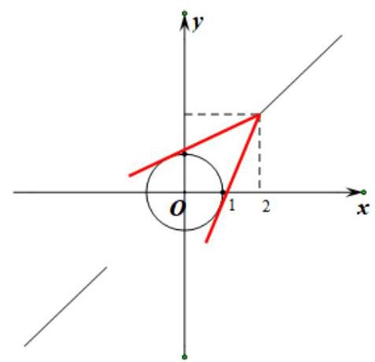
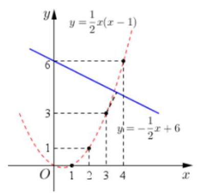
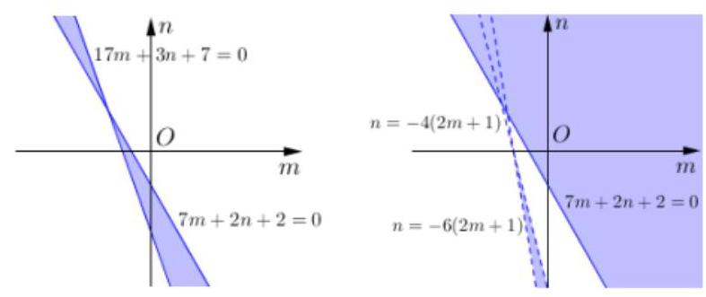
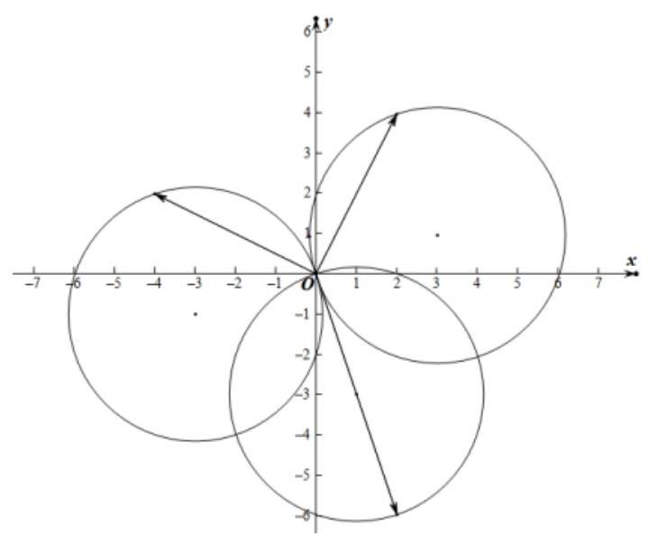
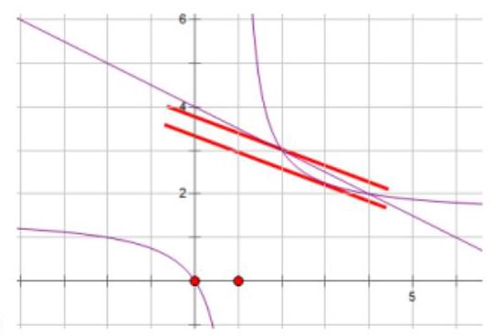

## 多变量问题的处理

<table><tr><td>教学目标</td><td>了解多变量问题的本质, 掌握基本的分析多变量问题的方法技巧</td></tr><tr><td>重点</td><td>多变量问题的处理方法和思想</td></tr><tr><td>难 点</td><td>多变量问题方法的应用</td></tr></table>

## (一) 几个变量之间无制约条件

例题精讲

【例 1】不等式 $\left| {x + \frac{1}{x}}\right|  \geq  \left| {a - 2}\right|  + \sin y$ 对一切非零实数 $x, y$ 均成立,则实数 $a$ 的取值范围为___.

【难度】 $\star   \star   \star$

【答案】 $\left\lbrack  {1,3}\right\rbrack$

【解析】 $\because x + \frac{1}{x} \in  \left( {-\infty , - 2\rbrack \cup \lbrack 2, + \infty }\right) \therefore \left| {x + \frac{1}{x}}\right|  \in  \lbrack 2, + \infty )$ ,其最小值为 2,又 $\because \sin \mathrm{y}$ 的最大值为 1,故不等式 $\left| {x + \frac{1}{x}}\right|  \geq  \left| {a - 2}\right|  + \sin y \mid$ 恒成立,有 $\left| {a - 2}\right|  \leq  1$ ,解得 $a \in  \left\lbrack  {1,3}\right\rbrack$ ,故答案为 $\left\lbrack  {1,3}\right\rbrack$

【例 2】已知 $x, y$ 为正数， $\frac{2x}{{3x} + y} + \frac{y}{x + {2y}}$ 的最大值为 $a + b\sqrt{2}$ (其中 $a, b$ 为有理数)，则 ${ab}$ 的值为___.

【难度】 $\star   \star   \star$

【答案】 $- \frac{14}{25}$

【解析】解法一: 双换元法

设 ${3x} + y = A, x + {2y} = b$ ,则 $x = \frac{{2A} - B}{5}, y = \frac{{3B} - A}{5}$ ,

$\therefore$ 原式 $= \frac{{4A} - {2B}}{5A} + \frac{{3B} - A}{5B} = \frac{4}{5} + \frac{3}{5} - \left( {\frac{2B}{5A} + \frac{A}{5B}}\right)  \leq  \frac{7}{5} - 2\sqrt{\frac{2B}{5A} \times  \frac{A}{5B}} = \frac{7}{5} - \frac{2\sqrt{2}}{5}$ ,

根据已知的最大值为 $a + b\sqrt{2}$ ,可得 $a = \frac{7}{5}, b =  - \frac{2}{5}$ ,所以 ${ab} =  - \frac{14}{25}$ . 故答案为: $- \frac{14}{25}$ .

解法二: 比值换元 设 $z = \frac{2x}{{3x} + y} + \frac{y}{x + {2y}} = \frac{2}{3 + \frac{y}{x}} + \frac{1}{\frac{x}{y} + 2}$ ,

令 $t = \frac{y}{x} > 0$ ,则 $z = \frac{2}{3 + t} + \frac{1}{\frac{1}{t} + 2} = \frac{2}{t + 3} + \frac{t}{{2t} + 1} = \frac{2}{t + 3} - \frac{1}{{4t} + 2} + \frac{1}{2} = \frac{{7t} + 1}{\left( {t + 3}\right) \left( {{4t} + 2}\right) } + \frac{1}{2}$ ,

令 ${7t} + 1 = m, t = \frac{m - 1}{7},\left( {m > 1}\right) , z = \frac{m}{\frac{m + {20}}{7} \cdot  \frac{{4m} + {10}}{7}} + \frac{1}{2} = \frac{49}{{4m} + \frac{200}{m} + {90}} + \frac{1}{2} \leq  \frac{49}{{40}\sqrt{2} + {90}} + \frac{1}{2} = \frac{7}{5} - \frac{2\sqrt{2}}{5}$ . 当且仅当 ${4m} = \frac{200}{m}$ 时等号成立.

## 巩固训练

1、已知对一切实数 $x$ ，不等式 $\left\lbrack  {{\left( {\log }_{3}m\right) }^{2} - {\log }_{3}\left( {{27}{m}^{2}}\right) }\right\rbrack  {x}^{2} - \left( {{\log }_{3}m - 3}\right) x - 1 < 0$ 恒成立，求实数 $m$ 的取值范围.

【答案】 $\frac{1}{\sqrt[5]{3}} < m \leq  {27}$

【解析】 $\left\lbrack  {{\left( {\log }_{3}m\right) }^{2} - {\log }_{3}\left( {{27}{m}^{2}}\right) }\right\rbrack  {x}^{2} - \left( {{\log }_{3}m - 3}\right) x - 1 < 0$ 恒成立,

当 ${\left( {\log }_{3}m\right) }^{2} - {\log }_{3}\left( {{27}{m}^{2}}\right)  = 0$ 时,即 ${\left( {\log }_{3}m\right) }^{2} - 2{\log }_{3}m - 3 = 0$ ,

解得 ${\log }_{3}m = 3$ 或 ${\log }_{3}m =  - 1$ ,验证知 ${\log }_{3}m = 3$ 时成立,故 $m = {27}$ ;

当 ${\left( {\log }_{3}m\right) }^{2} - {\log }_{3}\left( {{27}{m}^{2}}\right)  \neq  0$ 时, $\left\{  \begin{matrix} {\left( {\log }_{3}m\right) }^{2} - {\log }_{3}\left( {{27}{m}^{2}}\right)  < 0 \\  \Delta  = {\left( {\log }_{3}m - 3\right) }^{2} + 4\left\lbrack  {{\left( {\log }_{3}m\right) }^{2} - {\log }_{3}\left( {{27}{m}^{2}}\right) }\right\rbrack   < 0 \end{matrix}\right.$ , 即 $\left\{  \begin{array}{l}  - 1 < {\log }_{3}m < 3 \\   - \frac{1}{5} < {\log }_{3}m < 3 \end{array}\right.$ ,故 $- \frac{1}{5} < {\log }_{3}m < 3$ ,即 $\frac{1}{\sqrt[5]{3}} < m < {27}$ . 综上所述: $\frac{1}{\sqrt[5]{3}} < m \leq  {27}$ .

2、已知 $M = \frac{{a}^{2} - a\sin \theta  + 1}{{a}^{2} - a\cos \theta  + 1}\left( {a,\theta  \in  R, a \neq  0}\right)$ ，则 $M$ 的取值范围是___.

【答案】 $\left\lbrack  {\frac{4 - \sqrt{7}}{3},\frac{4 + \sqrt{7}}{3}}\right\rbrack$

【解析】解一: 化 $M = \frac{{a}^{2} - a\sin \theta  + 1}{{a}^{2} - a\cos \theta  + 1}$ 为 ${aM}\cos \theta  - a\sin \theta  - \left( {M - 1}\right) \left( {{a}^{2} + 1}\right)  = 0$ ,

可得直线 ${aMx} - {ay} - \left( {M - 1}\right) \left( {{a}^{2} + 1}\right)  = 0$ 与圆 ${x}^{2} + {y}^{2} = 1$ 有公共点,

$\therefore \frac{\left| {M - 1}\right| \left( {{a}^{2} + 1}\right) }{\left| a\right| \sqrt{{M}^{2} + 1}} \leq  1$ ,得到 $\frac{\left| M - 1\right| }{\sqrt{{M}^{2} + 1}} \leq  \frac{\left| a\right| }{{a}^{2} + 1} \leq  \frac{1}{2}$ (当且仅当 $\left| a\right|  = 1$ 时,等号成立).

故 $3{M}^{2} - {8M} + 3 \leq  0$ . 解得: $\frac{4 - \sqrt{7}}{3} \leq  M \leq  \frac{4 + \sqrt{7}}{3}.\therefore M$ 的取值范围是 $\left\lbrack  {\frac{4 - \sqrt{7}}{3},\frac{4 + \sqrt{7}}{3}}\right\rbrack$ .

解二: 利用辅助角公式, 三角函数有界性。

${a}^{2} - a\sin \theta  + 1 = M\left( {{a}^{2} - a\cos \theta  + 1}\right)$ ,即 $a\left( {M\cos  - \sin \theta }\right)  = \left( {M - 1}\right) \left( {{a}^{2} + 1}\right)$ ,即 $\sin \left( {\theta  + \varphi }\right)  = \frac{\left( {M - 1}\right) \left( {{a}^{2} + 1}\right) }{a\sqrt{{M}^{2} + 1}}$ ,

利用三角有界性有 $- 1 \leq  \frac{\left( {M - 1}\right) \left( {{a}^{2} + 1}\right) }{a\sqrt{{M}^{2} + 1}} \leq  1$ ,即 $\frac{{\left( M - 1\right) }^{2}}{\left( {M}^{2} + 1\right) } \leq  \frac{{a}^{2}}{{\left( {a}^{2} + 1\right) }^{2}} = \frac{1}{{a}^{2} + \frac{1}{{a}^{2}} + 2} \leq  \frac{1}{4}$ ,

$\therefore 4{\left( M - 1\right) }^{2} \leq  \left( {{M}^{2} + 1}\right)$ ,即 $3{M}^{2} - {8M} + 3 \leq  0$ ,解得 $\frac{4 - \sqrt{7}}{3} \leq  M \leq  \frac{4 + \sqrt{7}}{3}$

解三: 利用数形结合, 转化为点到点的斜率。

$M = \frac{{a}^{2} - a\sin \theta  + 1}{{a}^{2} - a\cos \theta  + 1} = \frac{a + \frac{1}{a} - \sin \theta }{a + \frac{1}{a} - \cos \theta }$ ,是点 $\left( {a + \frac{1}{a}, a + \frac{1}{a}}\right)$ 与 $\left( {\cos \theta ,\sin \theta }\right)$ 的两点间斜率,

点 $\left( {a + \frac{1}{a}, a + \frac{1}{a}}\right)$ 在直线 $y = x$ 上,且 $a + \frac{1}{a} \geq  2$ ,或 $a + \frac{1}{a} \leq   - 2$ ,点 $\left( {\cos \theta ,\sin \theta }\right)$ 在单位圆上,如图

由图及对称性可知图示两条切线为斜率的最大值与最小值。可求得最大值为 $\frac{4 + \sqrt{7}}{3}$ ,最小值为 $\frac{4 - \sqrt{7}}{3}$ . (所以,这里 $\sin \theta ,\cos \theta$ 前面的正负不影响此题结果。)

## (二)变量之间有等量关系

## 例题精讲

【例 3】已知 $\bigtriangleup  \mathrm{{ABC}}$ 中,角 $\mathrm{A},\mathrm{B},\mathrm{C}$ 所对的边分别为 $a, b, c$ ,且 $\mathrm{{BC}}$ 边上的高为 $a$ ,则 $\frac{b}{c} + \frac{c}{b}$ 的取值范围为 ___.

【难度】 $\star   \star   \star$

【答案】 $\left\lbrack  {2,\sqrt{5}}\right\rbrack$

【解析】【解析】方法一: 因为 $a, b, c$ 均为正,所以 $\frac{b}{c} + \frac{c}{b} \geq  2\sqrt{\frac{b}{c} \cdot  \frac{c}{b}} = 2$ ,当且仅当 $\frac{b}{c} = \frac{c}{b}$ 即 $b = c$ 时取 “ $=$ ”. 因为 ${S}_{\Delta } = \frac{1}{2}{a}^{2} = \frac{1}{2}{bc}\sin A \Rightarrow  {a}^{2} = {bc}\sin A$ ; ,

$\frac{b}{c} + \frac{c}{b} = \frac{{b}^{2} + {c}^{2}}{bc} = \frac{{a}^{2} + {2bc}\cos A}{bc} = \frac{{bc}\sin A + {2bc}\cos A}{bc} = \sin A + 2\cos A$

$= \sqrt{5}\left( {\frac{\sqrt{5}}{5}\sin A + \frac{2\sqrt{5}}{5}\cos A}\right)  = \sqrt{5}\sin \left( {x + \varphi }\right)$ ;

因为 $\sin \left( {x + \varphi }\right)  \leq  1$ ,则 $\frac{b}{c} + \frac{c}{b} \leq  \sqrt{5}$ . 综上可得 $2 \leq  \frac{b}{c} + \frac{c}{b} \leq  \sqrt{5}$ .

方法二: 利用耐克函数性质, ${S}_{\Delta } = \frac{1}{2}{a}^{2} = \frac{1}{2}{ac}\sin B \Rightarrow  a = c\sin B$ ,代入 $\cos B = \frac{{a}^{2} + {c}^{2} - {b}^{2}}{2ac} \Rightarrow  \frac{3 - \sqrt{5}}{2} \leq  \frac{{b}^{2}}{{c}^{2}} \leq  \frac{3 + \sqrt{5}}{2} \; {\left( \frac{b}{c} + \frac{c}{b}\right) }^{2} = \frac{{b}^{2}}{{c}^{2}} + \frac{{c}^{2}}{{b}^{2}} + 2$ ,后略。

【例 4】若正数 $a, b$ 满足 $\frac{1}{a} + \frac{1}{b} = 1$ ,则 $\frac{4}{a - 1} + \frac{9}{b - 1}$ 的最小值为 ( )

A. 6 B. 9 C. 12 D. 24

【难度】 $\star   \star   \star$

【答案】 $C$

【解析】解: $\because$ 正数 $a, b$ 满足 $\frac{1}{a} + \frac{1}{b} = 1,\therefore b = \frac{a}{a - 1} > 0$ ,解得 $a > 1$ ,同理 $b > 1$ ,

则 $\frac{4}{a - 1} + \frac{9}{b - 1} = \frac{1}{a - 1} + \frac{9}{\frac{a}{a - 1} - 1} = \frac{1}{a - 1} + 9\left( {a - 1}\right)  \geq  2\sqrt{9\left( {a - 1}\right)  \cdot  \frac{1}{a - 1}} = 6$ ,

当且仅当 $a = \frac{4}{3}$ 时取等号 (此时 $b = 4$ ), $\therefore \frac{4}{a - 1} + \frac{9}{b - 1}$ 的最小值为 6,故选: $C$ .

【例 5】已知正实数 $x, y$ 满足 $x + \frac{1}{x} + y + \frac{1}{y} = 5$ ,则 ${xy}$ 的取值范围为___.

【难度】 $\star   \star   \star$

【答案】 $\left\lbrack  {\frac{1}{4},4}\right\rbrack$

【解析】比值换元、万能 $k$ 法: 设 ${xy} = k\left( {k > 0}\right)$ ,则 $y = \frac{k}{x}$ 代入原式化简得, $\left( {k + 1}\right) {x}^{2} - {5kx} + {k}^{2} + k = 0$ , 已知方程有正根, 且由韦达定理可知若方程有根, 则必为正根, 故只需保证方程有根即可,

$\therefore \Delta  \geq  0$ ,即 ${25}{k}^{2} - 4\left( {k + 1}\right) \left( {{k}^{2} + k}\right)  \geq  0,\therefore 4{k}^{2} - {17k} + 4 \leq  0,\therefore \frac{1}{4} \leq  k \leq  4$ 。

【例 6】设公差不为 0 的等差数列 $\left\{  {a}_{n}\right\}$ 的前 $n$ 项和为 ${S}_{n}$ . 若数列 $\left\{  {a}_{n}\right\}$ 满足: 存在三个不同的正整数 $r, s, t$ , 使得 ${a}_{r},{a}_{s},{a}_{t}$ 成等比数列, ${a}_{2r},{a}_{2s},{a}_{2t}$ 也成等比数列,则 $\frac{{990}{S}_{1} + {S}_{n}}{{a}_{n}}$ 的最小值为___.

【难度】 $\star   \star   \star$

【答案】 45

【解析】令 $s < t < r,\because {a}_{s} \cdot  {a}_{r} = {a}_{t}^{2}\therefore \left( {{a}_{t} + \left( {r - t}\right) d}\right) \left( {{a}_{t} + \left( {s - t}\right) d}\right)  = {a}_{t}^{2}$

同理: $\because {a}_{2s} \cdot  {a}_{2r} = {a}_{2t}{}^{2}\therefore \left( {{a}_{2t} + 2\left( {r - t}\right) d}\right) \left( {{a}_{2t} + 2\left( {s - t}\right) d}\right)  = {a}_{t}^{2}$

整理得: ${a}_{t} =  - \frac{\left( {r - t}\right) \left( {s - t}\right) }{r + s - {2t}}d,{a}_{2t} =  - \frac{2\left( {r - t}\right) \left( {s - t}\right) }{r + s - {2t}}d$ ,

${a}_{2t} - {a}_{t} =  - \frac{\left( {r - t}\right) \left( {s - t}\right) }{r + s - {2t}}d = {td}$

化简得: ${t}^{2} = {rs}$ ,代入公式易得 ${a}_{n} = {nd}$

$\therefore \frac{{990}{s}_{1} + {s}_{n}}{{a}_{n}} = \frac{{990d} + \frac{n\left( {n + 1}\right) d}{2}}{nd} = \frac{990}{n} + \frac{n}{2} + \frac{1}{2} \geq  2\sqrt{445} + \frac{1}{2}$

$\because n \in  {N}^{ + },\therefore n = {44}$ 或 45,取得最小值 45

【例 7】设 $n \in  {\mathbf{N}}^{ * },{a}_{n}$ 为 ${\left( x + 2\right) }^{n} - {\left( x + 1\right) }^{n}$ 的展开式的各项系数之和, $m =  - \frac{1}{2}t + 6, t \in  \mathbf{R}$ , ${b}_{n} = \left\lbrack  \frac{{a}_{1}}{3}\right\rbrack   + \left\lbrack  \frac{2{a}_{2}}{{3}^{2}}\right\rbrack   + \cdots  + \left\lbrack  \frac{n{a}_{n}}{{3}^{n}}\right\rbrack$ ( $\left\lbrack  x\right\rbrack$ 表示不超过实数 $x$ 的最大整数),则 ${\left( n - t\right) }^{2} + {\left( {b}_{n} - m\right) }^{2}$ 的最小值为___.

【难度】 $\star   \star   \star   \star$

【答案】 $\frac{9}{5}$

【解析】赋值法,令 $x = 1,\therefore {a}_{n} = {3}^{n} - {2}^{n},\therefore \left\lbrack  \frac{n{a}_{n}}{{3}^{n}}\right\rbrack   = \left\lbrack  \frac{n\left( {{3}^{n} - {2}^{n}}\right) }{{3}^{n}}\right\rbrack   = \left\lbrack  {n - n \cdot  {\left( \frac{2}{3}\right) }^{n}}\right\rbrack$ ,

可用计算器分析 $n \cdot  {\left( \frac{2}{3}\right) }^{n}$ 单调性及范围,可知 $n \cdot  {\left( \frac{2}{3}\right) }^{n} \in  \left( {0,1}\right)$ , $\therefore \left\lbrack  \frac{n{a}_{n}}{{3}^{n}}\right\rbrack   = n - 1,\therefore {b}_{n} = \frac{n\left( {n - 1}\right) }{2},{\left( n - t\right) }^{2} + {\left( {b}_{n} - m\right) }^{2}$ 的

几何意义为点 $\left( {n,{b}_{n}}\right)$ 到点 $\left( {t, m}\right)$ 的距离的平方,如图所示,

当 $n = 3$ 时,点 $\left( {3,3}\right)$ 到直线 $y =  - \frac{1}{2}x + 6$ 的距离最小,

$\therefore {d}_{\min } = \frac{\left| 3 + 2 \times  3 - {12}\right| }{\sqrt{{1}^{2} + {2}^{2}}} = \frac{3}{\sqrt{5}}$ ,即 ${d}_{\min }^{2} = \frac{9}{5}$

【例 8】设 $\left( {{x}_{1},{y}_{1}}\right) \text{ 、 }\left( {{x}_{2},{y}_{2}}\right) \text{ 、 }\left( {{x}_{3},{y}_{3}}\right)$ 是平面曲线 ${x}^{2} + {y}^{2} = {2x} - {6y}$ 上任意三点，则 $A = {x}_{1}{y}_{2} - {x}_{2}{y}_{1} + {x}_{2}{y}_{3} - {x}_{3}{y}_{2}$ 的最小值为___

【难度】 $\star   \star   \star   \star$

【答案】 -40

【解析】解: 因为 ${x}^{2} + {y}^{2} = {2x} - {6y}$ ,所以 ${\left( x - 1\right) }^{2} + {\left( y + 3\right) }^{2} = {10}$ ,该曲线表示以 $\left( {1, - 3}\right)$ 为圆心,以 $\sqrt{10}$ 为半径的圆.

$A = {x}_{1}{y}_{2} - {x}_{2}{y}_{1} + {x}_{2}{y}_{3} - {x}_{3}{y}_{2}$ ,可以看做向量 $\overrightarrow{a} = \left( {{x}_{2},{y}_{2}}\right)$ 与 $\overrightarrow{b} = \left( {{y}_{3}, - {x}_{3}}\right)$ 的数量积, $\overrightarrow{a} = \left( {{x}_{2},{y}_{2}}\right)$ 与

$\overrightarrow{c} = \left( {-{y}_{1},{x}_{1}}\right)$ 的数量积之和,因为点 $\left( {{x}_{2},{y}_{2}}\right)$ 在 ${x}^{2} + {y}^{2} = {2x} - {6y}$ 上,

点 $\left( {{y}_{3}, - {x}_{3}}\right)$ 在 ${x}^{2} + {y}^{2} = {2y} + {6x}$ ,点 $\left( {-{y}_{1},{x}_{1}}\right)$ 在 ${x}^{2} + {y}^{2} =  - {2y} - {6x}$ 上,结合向量的几何意义,可知最小值为 $2\sqrt{10} \cdot  \left( {-\sqrt{10}}\right)  + 2\sqrt{10} \cdot  \left( {-\sqrt{10}}\right)  =  - {40}$ ,即 $\left( {2, - 6}\right)  \cdot  \left( {-4,2}\right)  + \left( {2, - 6}\right)  \cdot  \left( {2,4}\right)  =  - {40}$

故答案为: -40

## 巩固训练

1、设 $a, b, c$ 是三个正实数，且 $a + b + {2c} = \frac{bc}{a}$ ，则 $\frac{13a}{{3b} + c}$ 的最大值为___.

【答案】1

【解析】解法一: 整体换元

$\because a + b + {2c} = \frac{bc}{a},\therefore 1 + \frac{b}{a} + \frac{2c}{a} = \frac{bc}{{a}^{2}}$ ,

设 $\frac{b}{a} = m,\frac{c}{a} = n,\left( {m, n > 0}\right)$ ,则 $1 + m + {2n} = {mn}$ ,即 $\left( {m - 2}\right) \left( {n - 1}\right)  = 3$ ,(这里可知 $\mathbf{m} > 2,\mathbf{n} > 1$ )

$\frac{13a}{{3b} + c} = \frac{13}{\frac{{3b} + c}{a}} = \frac{13}{{3m} + n} = \frac{13}{3\left( {m - 2}\right)  + \left( {n - 1}\right)  + 7} \leq  \frac{13}{6 + 7} = 1.$

解法二: 消元法、整体换元

$\because a + b + {2c} = \frac{bc}{a},\therefore {a}^{2} + {ab} + {2ac} = {bc},\therefore c = \frac{{a}^{2} + {ab}}{b - {2a}}$ ,

$\because c > 0,\therefore b - {2a} > 0$ ,即 $\frac{b}{a} > 2,\therefore \frac{13a}{{3b} + c} = \frac{13}{3 \cdot  \frac{b}{a} + \frac{c}{a}} = \frac{13}{3 \cdot  \frac{b}{a} + \frac{a + b}{b - {2a}}} = \frac{13}{3 \cdot  \frac{b}{a} + \frac{1 + \frac{b}{a}}{\frac{b}{a} - 2}}$ ,

设 $\frac{b}{a} = x$ ,则 $x > 2$ ,令 $f\left( x\right)  = {3x} + \frac{1 + x}{x - 2} = {3x} + \frac{3}{x - 2} + 1 = 3\left( {x - 2}\right)  + \frac{3}{x - 2} + 7 \geq  2\sqrt{3\left( {x - 2}\right)  \cdot  \frac{3}{x - 2}} + 7 = 6 + 7 = {13}$ , 当且仅当 $x = 3$ 时取等号, $\therefore \frac{13a}{{3b} + c} \leq  \frac{13}{13} = 1$ ,故答案为: 1

2、关于 $x$ 的方程 ${x}^{2} + {ax} + b - 3 = 0\left( {a, b \in  \mathbf{R}}\right)$ 在 $\left\lbrack  {1,2}\right\rbrack$ 上有实根，则 ${a}^{2} + {\left( b - 4\right) }^{2}$ 的最小值为___.

【答案】 2

【解析】方法一: 由 ${x}^{2} + {ax} + b - 3 = 0$ ,知 $b =  - {x}^{2} - {ax} + 3$ ,

所以 ${a}^{2} + {\left( b - 4\right) }^{2} = {a}^{2} + {\left( -{x}^{2} - ax - 1\right) }^{2} = {a}^{2} + {\left( {x}^{2} + 1\right) }^{2} + {2ax}\left( {{x}^{2} + 1}\right)  + {a}^{2}{x}^{2}$

$= \left( {{x}^{2} + 1}\right) \left( {{x}^{2} + 1 + {2ax} + {a}^{2}}\right)  = \left( {{x}^{2} + 1}\right) {\left( x + a\right) }^{2} + {x}^{2} + 1$ ,

因为 $x \in  \left\lbrack  {1,2}\right\rbrack$ ,所以 ${a}^{2} + {\left( b - 4\right) }^{2} \geq  {x}^{2} + 1 \geq  2$ ,当 $x = 1, a =  - 1, b = 3$ 时,等号成立,

所以 ${a}^{2} + {\left( b - 4\right) }^{2}$ 的最小值为 2 . 故答案为:2 .

方法二: 由题意可知,将 ${x}^{2} + {ax} + b - 3 = 0\left( {a, b \in  \mathbf{R}}\right)$ 看做关于 $a, b$ 的直线方程,则 ${a}^{2} + {\left( b - 4\right) }^{2}$ 表示点 $\left( {a, b}\right)$ 到 $\left( {0,4}\right)$ 的距离的平方; 因为 $\left( {0,4}\right)$ 到直线 ${ax} + b + {x}^{2} - 3 = 0$ 的距离为 $d = \frac{{x}^{2} + 1}{\sqrt{{x}^{2} + 1}} = \sqrt{{x}^{2} + 1}$ ; 当 $x \in  \left\lbrack  {1,2}\right\rbrack$ 时, ${d}_{\min } = \sqrt{2}$ ,即 ${a}^{2} + {\left( b - 4\right) }^{2}$ 最小值为 4 。

3、实数 $x, y$ 满足 ${x}^{2} - {2xy} + 2{y}^{2} = 2$ ，则 ${x}^{2} + 2{y}^{2}$ 的最小值为___.

【答案】 $4 - 2\sqrt{2}$

【解析】解法一: 三角换元

依题意有 ${\left( x - y\right) }^{2} + {y}^{2} = 2$ ,故令 $x - y = \sqrt{2}\cos \alpha , y = \sqrt{2}\sin \alpha$ ,则 $x = \sqrt{2}\cos \alpha  + \sqrt{2}\sin \alpha$ ,

${x}^{2} + 2{y}^{2} = {\left( \sqrt{2}\cos \alpha  + \sqrt{2}\sin \alpha \right) }^{2} + 2{\left( \sqrt{2}\sin \alpha \right) }^{2} = 4 + 2\sqrt{2}\sin \left( {{2\alpha } - \frac{\pi }{4}}\right)$ ,

故最小值为 $4 - 2\sqrt{2}$

解法二: 配凑、基本不等式

${x}^{2} + 2{y}^{2} = 2 + {2xy} = 2 + \sqrt{2} \cdot  x \cdot  \sqrt{2}y \leq  \sqrt{2}\frac{{x}^{2} + 2{y}^{2}}{2}$ ,化简得 ${x}^{2} + 2{y}^{2} \leq  4 - 2\sqrt{2}$ .

解法三: 转化为齐次

${x}^{2} + 2{y}^{2} = \frac{2\left( {{x}^{2} + 2{y}^{2}}\right) }{{x}^{2} - {2xy} + 2{y}^{2}} = \frac{2\left( {1 + {\left( \frac{y}{x}\right) }^{2}}\right) }{1 - 2\frac{y}{x} + 2{\left( \frac{y}{x}\right) }^{2}}$ ,令 $\frac{y}{x} = t$ ,原式 $= \frac{2 + 2{t}^{2}}{1 - {2t} + 2{t}^{2}} = 1 + \frac{{2t} + 1}{1 - {2t} + 2{t}^{2}}$

4、已知实数 ${x}_{1}\text{ 、 }{x}_{2}\text{ 、 }{y}_{1}\text{ 、 }{y}_{2}$ 满足: ${x}_{1}^{2} + {y}_{1}^{2} = 1,{x}_{2}^{2} + {y}_{2}^{2} = 1,{x}_{1}{x}_{2} + {y}_{1}{y}_{2} = \frac{1}{2}$ , 则 $\frac{\left| {x}_{1} + {y}_{1} - 1\right| }{\sqrt{2}} + \frac{\left| {x}_{2} + {y}_{2} - 1\right| }{\sqrt{2}}$ 的最大值为___.

【答案】 $\sqrt{2} + \sqrt{3}$

【解析】解: 设 $A\left( {{x}_{1},{y}_{1}}\right) , B\left( {{x}_{2},{y}_{2}}\right) ,\overrightarrow{OA} = \left( {{x}_{1},{y}_{1}}\right) ,\overrightarrow{OB} = \left( {{x}_{2},{y}_{2}}\right)$ ,

由 ${x}_{1}^{2} + {y}_{1}^{2} = 1,{x}_{2}^{2} + {y}_{2}^{2} = 1,{x}_{1}{x}_{2} + {y}_{1}{y}_{2} = \frac{1}{2}$ ,可得 $A, B$ 两点在圆 ${x}^{2} + {y}^{2} = 1$ 上,

且 $\overrightarrow{OA} \cdot  \overrightarrow{OB} = 1 \times  1 \times  \cos \angle {AOB} = \frac{1}{2}$ ,即有 $\angle {AOB} = {60}^{ \circ  }$ ,即三角形 ${OAB}$ 为等边三角形, ${AB} = 1$ ,

$\frac{\left| {x}_{1} + {y}_{1} - 1\right| }{\sqrt{2}} + \frac{\left| {x}_{2} + {y}_{2} - 1\right| }{\sqrt{2}}$ 的几何意义为点 $A, B$ 两点,到直线 $x + y - 1 = 0$ 的距离 ${d}_{1}$ 与 ${d}_{2}$ 之和,

显然 $A, B$ 在第三象限, ${AB}$ 所在直线与直线 $x + y = 1$ 平行,可设 ${AB} : x + y + t = 0,\left( {t > 0}\right)$ ,

由圆心 $O$ 到直线 ${AB}$ 的距离 $d = \frac{\left| t\right| }{\sqrt{2}}$ ,可得 $2\sqrt{1 - \frac{{t}^{2}}{2}} = 1$ ,解得 $t = \frac{\sqrt{6}}{2}$ ,

即有两平行线的距离为 $\frac{1 + \frac{\sqrt{6}}{2}}{\sqrt{2}} = \frac{\sqrt{2} + \sqrt{3}}{2}$ ，即 $\frac{\left| {x}_{1} + {y}_{1} - 1\right| }{\sqrt{2}} + \frac{\left| {x}_{2} + {y}_{2} - 1\right| }{\sqrt{2}}$ 的最大值为 $\sqrt{2} + \sqrt{3}$ ，故答案为: $\sqrt{2} + \sqrt{3}$

## (三)变量之间有不等关系

## 例题精讲

【例 9】已知函数 $f\left( x\right)  = a{x}^{2} + {bx} + c\left( {0 < {2a} < b}\right)$ 对任意 $x \in  R$ 恒有 $f\left( x\right)  \geq  0$ 成立,则代数式 $\frac{f\left( 1\right) }{f\left( 0\right)  - f\left( {-1}\right) }$ 的最小值是___.

【难度】 $\star   \star   \star   \star$

【答案】 3

【解答】解: 因为 $\forall x \in  R, f\left( x\right)  = a{x}^{2} + {bx} + c \geq  0$ 恒成立, $0 < {2a} < b$ ,所以 $\left\{  \begin{array}{l} 0 < {2a} < b \\  \Delta  = {b}^{2} - {4ac} \leq  0 \end{array}\right.$ ,得 ${b}^{2} \leq  {4ac}$ ,

又 $0 < {2a} < b$ ,所以 $c \geq  \frac{{b}^{2}}{4a}$ ,所以 $\frac{f\left( 1\right) }{f\left( 0\right)  - f\left( {-1}\right) } = \frac{a + b + c}{c - \left( {a - b + c}\right) }$

$= \frac{a + b + c}{b - a} \geq  \frac{a + b + \frac{{b}^{2}}{4a}}{b - a} = \frac{4{a}^{2} + {4ab} + {b}^{2}}{{4a}\left( {b - a}\right) } = \frac{4{a}^{2} + {4ab} + {b}^{2}}{{4ab} - 4{a}^{2}} = \frac{4 + 4 \cdot  \frac{b}{a} + {\left( \frac{b}{a}\right) }^{2}}{4 \cdot  \frac{b}{a} - 4},$

设 $t = \frac{b}{a}$ ,由 $0 < {2a} < b$ 得, $t > 2$ ,

则 $\frac{f\left( 1\right) }{f\left( 0\right)  - f\left( {-1}\right) } \geq  \frac{4 + {4t} + {t}^{2}}{4\left( {t - 1}\right) } = \frac{{\left( t - 1\right) }^{2} + 6\left( {t - 1}\right)  + 9}{4\left( {t - 1}\right) } = \frac{1}{4}\left\lbrack  {\left( {t - 1}\right)  + \frac{9}{t - 1} + 6}\right\rbrack   \geq  \frac{1}{4} \times  \left( {6 + 6}\right)  = 3$ ,

当且仅当 $t - 1 = \frac{9}{t - 1}$ 时取等号,此时 $t = 4,\frac{f\left( 1\right) }{f\left( 0\right)  - f\left( {-1}\right) }$ 取最小值是 3,故答案为: 3 .

另外一种解法: $\frac{4{a}^{2} + {4ab} + {b}^{2}}{{4a}\left( {b - a}\right) } = \frac{{\left( b - a\right) }^{2} + {6ab} + 3{a}^{2}}{{4a}\left( {b - a}\right) } = \frac{{\left( b - a\right) }^{2}}{{4a}\left( {b - a}\right) } + \frac{{3a}\left\lbrack  {2\left( {b - a}\right)  + {3a}}\right\rbrack  }{{4a}\left( {b - a}\right) }$

【例 10】已知函数 $f\left( x\right)  = {ax} + b$ (其中 $a, b \in  R$ )，对任意 $x \in  \left\lbrack  {0,1}\right\rbrack  ,\left| {f\left( x\right) }\right|  \leq  1$ 则 $\left( {{2a} + 1}\right) \left( {{2b} + 1}\right)$ 的最小值为___

【难度】 $\star   \star   \star$

【答案】 -9

【解析】 $\because \left| {f\left( x\right) }\right|  \leq  1,\therefore \left\{  \begin{matrix}  - 1 \leq  b \leq  1 \\   - 1 \leq  a + b \leq  1 \end{matrix}\right.$

令 $\left( {{2a} + 1}\right) \left( {{2b} + 1}\right)  = z,0 \leq  \left( {{2b} + 1}\right)  + \left( {{2a} + 1}\right)  \leq  4$ ,

令 $x = {2a} + 1, y = {2b} + 1$

$- 1 \leq  y = {2b} + 1 \leq  3$

$\therefore z = {xy}$ 根据线性规划图易判断

$\therefore a = 2, b =  - 1,{z}_{\min } =  - {9a} = \frac{1}{2}, b = \frac{1}{2},{z}_{\max } = 4$

【例 11】已知 $a > b > 0$ ,那么,当代数式 ${a}^{2} + \frac{16}{b\left( {a - b}\right) }$ 取最小值时,点 $P\left( {a, b}\right)$ 的坐标为___.

【难度】 $\star   \star   \star$

【答案】 $\left( {2\sqrt{2},\sqrt{2}}\right)$

【解析】解: 因为 $a > b > 0 : \therefore b\left( {a - b}\right)  \leq  {\left( \frac{b + a - b}{2}\right) }^{2} = \frac{{a}^{2}}{4}$ ;

所以 ${a}^{2} + \frac{16}{b\left( {a - b}\right) } \geq  {a}^{2} + \frac{64}{{a}^{2}} \geq  2\sqrt{64} = {16}$ . 当且仅当 $\left\{  {\begin{array}{l} {a}^{4} = {64} \\  b = a - b \end{array} \Rightarrow  \left\{  \begin{array}{l} a = 2\sqrt{2} \\  b = \sqrt{2} \end{array}\right. }\right.$ 时取等号,

此时 $P\left( {a, b}\right)$ 的坐标为: $\left( {2\sqrt{2},\sqrt{2}}\right)$ .

故答案为: $\left( {2\sqrt{2},\sqrt{2}}\right)$ .

## 巩固训练

1、已知 $A, B, C$ 是平面上任意三点， ${BC} = a,{CA} = b,{AB} = c$ ，则 $y = \frac{c}{a + b} + \frac{b}{c}$ 的最小值是___.

【答案】 $\sqrt{2} - \frac{1}{2}$

【解答】依题意得 $\left\{  {\begin{array}{l} a + b \geq  c \\  b + c \geq  a \\  c + a \geq  b \end{array}, y = \frac{c}{a + b} + \frac{b}{c}}\right.$ 中 $\mathbf{a}$ 仅出现一次,所以必须 $\mathbf{a}$ 最大时, $\mathbf{y}$ 最小,所以 $\mathbf{a} = \mathbf{b} + \mathbf{c}$ , $y = \frac{c}{a + b} + \frac{b}{c} = \frac{1}{2\frac{b}{c} + 1} + \frac{b}{c} = \frac{1}{2\frac{b}{c} + 1} + \frac{b}{c} + \frac{1}{2} - \frac{1}{2} \geq  \sqrt{2} - \frac{1}{2}.$

2、设正实数 $x$ ， $y$ 满足 $x > \frac{2}{3}$ ， $y > 2$ ，不等式 $\frac{9{x}^{2}}{y - 2} + \frac{{y}^{2}}{{3x} - 2} \geq  m$ 恒成立，则 $m$ 的最大值为( )

A. $2\sqrt{2}$ B. $4\sqrt{2}$ C. 8 D. 16

【答案】D

【解析】解: 设 $y - 2 = a,{3x} - 2 = b,\left( {a > 0, b > 0}\right)$ ,

$\frac{9{x}^{2}}{y - 2} + \frac{{y}^{2}}{{3x} - 2} = \frac{{\left( b + 2\right) }^{2}}{a} + \frac{{\left( a + 2\right) }^{2}}{b} \geq  \frac{{\left( 2\sqrt{2b}\right) }^{2}}{a} + \frac{{\left( 2\sqrt{2a}\right) }^{2}}{b} = 8\left( {\frac{b}{a} + \frac{a}{b}}\right)  \geq  {16}$ ,

当且仅当 $a = b = 2$ ,即 $x = \frac{4}{3}, y = 4$ 时取等号

故选: $D$ .

3、已知正数 $a, b, c$ 满足 $a + {2b} \leq  {8c},\frac{2}{a} + \frac{3}{b} \leq  \frac{2}{c}$ ，求 $\frac{{3a} + {8b}}{c}$ 的取值范围.

【答案】 $\left\lbrack  {{27},{30}}\right\rbrack$

【解析】数形结合,令 $x = \frac{a}{c}, y = \frac{b}{c}$ ,则 $\frac{{3a} + {8b}}{c} = {3x} + {8y}$ ,

$a + {2b} \leq  {8c} \Rightarrow  \frac{a}{c} + \frac{2b}{c} \leq  8 \Rightarrow  x + {2y} \leq  8,$

$\frac{2}{a} + \frac{3}{b} \leq  \frac{2}{c} \Rightarrow  \frac{2c}{a} + \frac{3c}{b} \leq  2 \Rightarrow  \frac{2}{x} + \frac{3}{y} \leq  2 \Rightarrow  y \geq  \frac{3}{2} + \frac{3}{{2x} - 2}$

如图,

可知 ${3x} + {8y}$ 在 $\left( {2,3}\right)$ 取值最大值 30,在 $\left( {3,\frac{9}{4}}\right)$ 处取得最小值 27[联立方程,令 $\Delta  = 0$ ].

在约束条件下,则 $Z = 3\mathrm{x} + 8\mathrm{y}$ 的取值范围,可取值范围为 $\left\lbrack  {{27},{30}}\right\rbrack$
