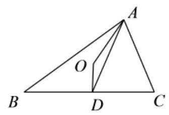
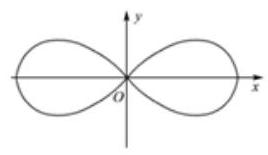
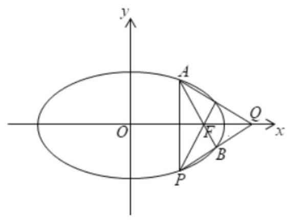
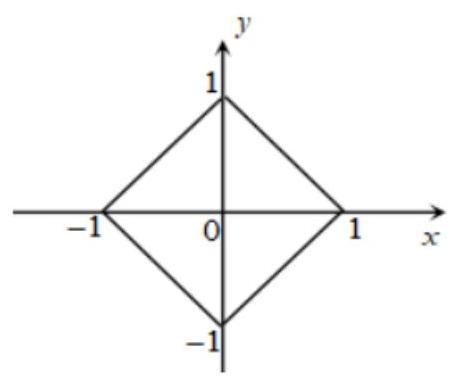
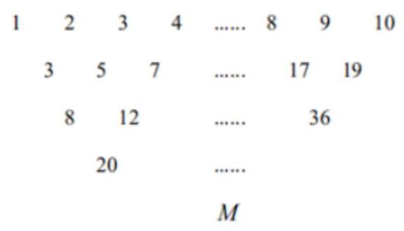
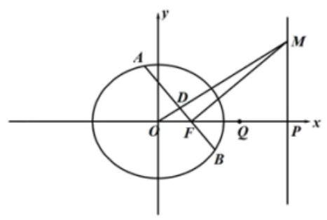

特殊与一般思想

<table><tr><td>教学目标</td><td>用特殊值法解答客观题   特殊与一般思想的相互转化</td></tr><tr><td>重点</td><td>常见特殊与一般思想方法</td></tr><tr><td>难点</td><td>特殊与一般思想的应用</td></tr></table>

由特殊到一般的思想方法, 是中学数学重要的思想方法, 广泛用于解题之中, 考查学生对客观题会运用特殊值思想解答题目, 并且能从特殊到一般的概括能力、知识迁移能力和创新思维能力, 在解决问题时, 以特殊问题为起点，抓住数学问题的特点，逐步分析、比较、讨论、层层深入，揭示规律，并由此推广到一般，从解决特殊问题的规律中，寻求解决一般问题的方法和规律，又用以指导特殊问题的解决，从而进一步加深对特殊问题与一般问题相互联系的认识和理解。

## (一) 特殊值法

## 知识梳理

是用特殊值(或特殊图形、特殊位置)代替题设普遍条件，得出特殊结论，再对各个选项进行检验，从而做出正确的选择. 常用的特例有特殊数值、特殊数列、特殊函数、特殊图形、特殊角、特殊位置等. 特例检验是解答选择题的最佳方法之一, 适用于解答 “对某一集合的所有元素、某种关系恒成立”, 这样以全称判断形式出现的题目，其原理是 “结论若在某种特殊情况下不真，则它在一般情况下也不真”，利用 “小题小做”或“小题巧做”的解题策略.

## 例题精讲

【例 1】在 $\bigtriangleup {ABC}$ 中, ${BC} = a,{CA} = b,{AB} = c$ ,下列说法中正确的是( )

A. 用 $\sqrt{a}\text{ 、 }\sqrt{b}\text{ 、 }\sqrt{c}$ 为边长不可以作成一个三角形

B. 用 $\sqrt{a}\text{ 、 }\sqrt{b}\text{ 、 }\sqrt{c}$ 为边长一定可以作成一个锐角三角形

C. 用 $\sqrt{a}\text{ 、 }\sqrt{b}\text{ 、 }\sqrt{c}$ 为边长一定可以作成一个直角三角形

D. 用 $\sqrt{a}\text{ 、 }\sqrt{b}\text{ 、 }\sqrt{c}$ 为边长一定可以作成一个钝角三角形

【难度】 $\star   \star   \star$

【答案】B

【解析】方法一: 可以通过对 $\mathbf{a},\mathbf{b},\mathbf{c}$ 分别取特殊值即可得到选项;

方法二: 要证 $\sqrt{a},\sqrt{b},\sqrt{c}$ 可以构成三角形,

因为 ${\left( \sqrt{a} + \sqrt{b}\right) }^{2} = a + 2\sqrt{ab} + b > c = {\left( \sqrt{c}\right) }^{2}$ ,所以 $\sqrt{a} + \sqrt{b} > \sqrt{c}$ ,即可以构成三角形。

又 $\cos A = \frac{b + c - a}{2\sqrt{bc}} > 0$ ,同理 $\cos B,\cos C$ 也大于 0,所以三角形为锐角三角形。

【例 2】若 $0 < {a}_{1} < {a}_{2},0 < {b}_{1} < {b}_{2}$ ,且 ${a}_{1} + {a}_{2} = {b}_{1} + {b}_{2} = 1$ ,则下列代数式中值最大的是( )

A. ${a}_{1}{b}_{1} + {a}_{2}{b}_{2}$ B. ${a}_{1}{a}_{2} + {b}_{1}{b}_{2}$ C. ${a}_{1}{b}_{2} + {a}_{2}{b}_{1}$ D. $\frac{1}{2}$

【难度】 $\star   \star   \star$

【答案】A

【解析】本题比较大小, 可以取特殊值, 也可以作差比较, 还可以用基本不等式或排序不等式。

解法一: 特殊值法.取 ${a}_{1} = \frac{1}{4},{a}_{2} = \frac{3}{4},{b}_{1} = \frac{1}{3},{b}_{2} = \frac{2}{3}$ ,通过计算比较 ${a}_{1}{b}_{1} + {a}_{2}{b}_{2}$ 最大。选 A

解法二: ${a}_{1}{a}_{2} + {b}_{1}{b}_{2} \leq  {\left( \frac{{a}_{1} + {a}_{2}}{2}\right) }^{2} + {\left( \frac{{b}_{1} + {b}_{2}}{2}\right) }^{2} = \frac{1}{2}$

${a}_{1}{b}_{1} + {a}_{2}{b}_{2} - \left( {{a}_{1}{b}_{2} + {a}_{2}{b}_{1}}\right)  = \left( {{a}_{1} - {a}_{2}}\right) {b}_{1} + \left( {{a}_{1} - {a}_{2}}\right) {b}_{2} = \left( {{a}_{2} - {a}_{1}}\right) \left( {{b}_{2} - {b}_{1}}\right)  \geq  0$

${a}_{1}{b}_{1} + {a}_{2}{b}_{2} \geq  \left( {{a}_{1}{b}_{2} + {a}_{2}{b}_{1}}\right)$

$1 = \left( {{a}_{1} + {a}_{2}}\right) \left( {{b}_{1} + {b}_{2}}\right)  = {a}_{1}{b}_{1} + {a}_{2}{b}_{2} + {a}_{1}{b}_{1} + {a}_{2}{b}_{1} \leq  2\left( {{a}_{1}{b}_{2} + {a}_{2}{b}_{2}}\right) \;{a}_{1}{b}_{1} + {a}_{2}{b}_{2} \geq  \frac{1}{2}$

解法三: 根据排序不等式知 ${a}_{1}{b}_{1} + {a}_{2}{b}_{2}\text{ 、 }{a}_{1}{a}_{2} + {b}_{1}{b}_{2}\text{ 、 }{a}_{1}{b}_{2} + {a}_{2}{b}_{1}$ 中, ${a}_{1}{b}_{1} + {a}_{2}{b}_{2}$ 最大,再取特值 ${a}_{1} = \frac{1}{4},{a}_{2} = \frac{3}{4},{b}_{1} = \frac{1}{3},{b}_{2} = \frac{2}{3}$ 比较 ${a}_{1}{b}_{1} + {a}_{2}{b}_{2}$ 与 $\frac{1}{2}\;$ 答案: A.

【例 3】已知函数 $y = f\left( x\right)$ 是定义在 $\mathbf{R}$ 上的奇函数,且在 $\lbrack 0, + \infty )$ 单调递减,当 $x + y = {2019}$ 时,恒有 $f\left( x\right)  + f\left( {2019}\right)  > f\left( y\right)$ 成立，则 $x$ 的取值范围是( )

A. $( - \infty ,0\rbrack$ B. $\left( {-\infty ,0}\right)$ C. $\left( {-\infty ,1}\right)$ D. $\left( {-\infty ,1}\right)$

【难度】★★★

【答案】B

【解析】方法一: 由题意,可以用特殊函数做,比如 $y = f\left( x\right)  =  - x$ ,则可得 $- x - {2019} >  - y =  - \left( {{2019} - x}\right)$ , 可解得 $x < 0$ 。

方法二: 对 $x$ 与 0 大小进行比较讨论;

当 $x > 0$ 时,因为 $x + y = {2019}$ ,所以 $y < {2019} \Rightarrow  f\left( y\right)  > f\left( {2019}\right)$ ,且此时 $f\left( x\right)  < 0$ ,显然

$f\left( x\right)  + f\left( {2019}\right)  > f\left( y\right)$ 不成立;

当 $x = 0$ 时, $f\left( x\right)  = 0, y = {2019}, f\left( y\right)  = f\left( {2019}\right)$ ,显然 $f\left( x\right)  + f\left( {2019}\right)  > f\left( y\right)$ 不成立;

当 $x < 0$ 时, $f\left( x\right)  > 0$ ,因为 $x + y = {2019}$ ,所以 $y > {2019} \Rightarrow  f\left( y\right)  < f\left( {2019}\right)$ ,显然

$f\left( x\right)  + f\left( {2019}\right)  > f\left( y\right)$ 恒成立; 综上: $x < 0$

【例 4】设函数 $y = f\left( x\right)$ 的定义域为 $D$ ,若存在常数 $a$ 满足 $\left\lbrack  {-a, a}\right\rbrack   \subseteq  D$ ,且对任意的 ${x}_{1} \in  \left\lbrack  {-a, a}\right\rbrack$ ,总存在 ${x}_{2} \in  \left\lbrack  {-a, a}\right\rbrack$ ,使得 $f\left( {x}_{1}\right)  \cdot  f\left( {-{x}_{2}}\right)  = 1$ ,称函数 $f\left( x\right)$ 为 $P\left( a\right)$ 函数,则下列结论中正确的有___.

(1)函数 $f\left( x\right)  = {3}^{x}$ 是 $P\left( 1\right)$ 函数

(2)函数 $f\left( x\right)  = {x}^{3}$ 是 $P\left( 2\right)$ 函数

(3)若函数 $f\left( x\right)  = {\log }_{12}\left( {x + t}\right)$ 是 $P\left( 2\right)$ 函数，则 $t = 4$

(4)若函数 $f\left( x\right)  = \tan x + b$ 是 $P\left( \frac{\pi }{4}\right)$ 函数，则 $b =  \pm  \sqrt{2}$

【难度】 $\star   \star   \star$

【答案】(1)(4)

【解析】对于(1): $f\left( x\right)  = {3}^{x}$ ,定义域为 $R$ ,当 $a = 1$ 时,有 $\left\lbrack  {-1,1}\right\rbrack   \in  R$ ,

对任意 ${x}_{1} \in  \left\lbrack  {-1,1}\right\rbrack  , f\left( {x}_{1}\right)  = {3}^{{x}_{1}}$ ,

因为 ${x}_{1} \in  \left\lbrack  {-1,1}\right\rbrack$ ,存在 ${x}_{2} = {x}_{1} \in  \left\lbrack  {-1,1}\right\rbrack$ ,使 $f\left( {x}_{1}\right)  \cdot  f\left( {-{x}_{2}}\right)  = f\left( {x}_{1}\right)  \cdot  f\left( {-{x}_{1}}\right)  = {3}^{{x}_{1}} \cdot  {3}^{-{x}_{1}} = {3}^{0} = 1$ ,

所以函数 $f\left( x\right)  = {3}^{x}$ 是 $P\left( 1\right)$ 函数,故 (1) 正确;

对于(2): $f\left( x\right)  = {x}^{3}$ ，定义域为 $R$ ，当 $a = 2$ 时，有 $\left\lbrack  {-2,2}\right\rbrack   \in  R$ ，

当 ${x}_{1} = 0$ 时， $f\left( {x}_{1}\right)  = 0$ ，

所以不存在 ${x}_{2} \in  \left\lbrack  {-2,2}\right\rbrack$ ,使得 $f\left( {x}_{1}\right)  \cdot  f\left( {-{x}_{2}}\right)  = 1$ ,此时 $f\left( {x}_{1}\right)  \cdot  f\left( {-{x}_{2}}\right)  = 0$ ,故 (2) 错误;

对于(3):当 $t = 4$ 时， $f\left( x\right)  = {\log }_{12}\left( {x + 4}\right)$ ，定义域为 $\left( {-4, + \infty }\right)$ ， $a = 2$ ，

因为 ${x}_{1} \in  \left\lbrack  {-2,2}\right\rbrack  ,{x}_{2} \in  \left\lbrack  {-2,2}\right\rbrack$ ,则 $- {x}_{2} \in  \left\lbrack  {-2,2}\right\rbrack$ ,所以 $x + 4 \in  \left\lbrack  {2,6}\right\rbrack$ ,

又 $f\left( x\right)  = {\log }_{12}\left( {x + 4}\right)$ 为增函数,所以 $f\left( x\right)  \in  \left\lbrack  {{\log }_{12}2,{\log }_{12}6}\right\rbrack$ ,

又因为 ${\log }_{12}6 < {\log }_{12}{12} = 1,{\log }_{12}2 > 0$ ,所以 $f\left( x\right)  \in  \left( {0,1}\right)$ ,所以 $f\left( {x}_{1}\right)  \in  \left( {0,1}\right) , f\left( {-{x}_{2}}\right)  \in  \left( {0,1}\right)$ ,

所以 $f\left( {x}_{1}\right)  \cdot  f\left( {-{x}_{2}}\right)  \in  \left( {0,1}\right)$ ,即 $f\left( {x}_{1}\right)  \cdot  f\left( {-{x}_{2}}\right)  \neq  1$ ,故 (3) 错误;

对于 (4) : 当 $- \frac{\pi }{4} \leq  x \leq  \frac{\pi }{4}$ 时, $- 1 \leq  \tan x \leq  1$ ,所以 $f\left( x\right)  \in  \left\lbrack  {b - 1, b + 1}\right\rbrack$ ,

因为函数 $f\left( x\right)  = \tan x + b$ 是 $P\left( \frac{\pi }{4}\right)$ 函数,

所以对任意 ${x}_{1} \in  \left\lbrack  {\frac{\pi }{4},\frac{\pi }{4}}\right\rbrack$ ,总存在 ${x}_{2} \in  \left\lbrack  {\frac{\pi }{4},\frac{\pi }{4}}\right\rbrack$ 使 $f\left( {x}_{1}\right)  \cdot  f\left( {-{x}_{2}}\right)  = 1$ ,

又 $- {x}_{2} \in  \left\lbrack  {\frac{\pi }{4},\frac{\pi }{4}}\right\rbrack$ ,当 ${x}_{2} = {x}_{1}$ 时, $f\left( {x}_{1}\right)  \cdot  f\left( {-{x}_{1}}\right)  = 1$ ,

当 ${x}_{1} = \frac{\pi }{4}$ 时,有 $\left( {b - 1}\right) \left( {b + 1}\right)  = 1$ ,解得 $b =  \pm  \sqrt{2}$ ,故 (4) 正确.

故填: (1) (4)

【例 5】有限数列 $\left\{  {a}_{n}\right\}$ ,若满足 $\left| {{a}_{1} - {a}_{2}}\right|  \leq  \left| {{a}_{1} - {a}_{3}}\right|  \leq  \cdots  \leq  \left| {{a}_{1} - {a}_{m}}\right| , m$ 是项数,则称 $\left\{  {a}_{n}\right\}$ 满足性质 $p$ .

(1)判断数列3,2,5,1和4,3,2,5,1是否具有性质 $p$ ,请说明理由.

(2)若 ${a}_{1} = 1$ ，公比为 $q$ 的等比数列，项数为 10，具有性质 $p$ ，求 $q$ 的取值范围.

(3)若 ${a}_{n}$ 是 $1,2,\ldots , m$ 的一个排列 $\left( {m \geq  4}\right) ,{b}_{k} = {a}_{k + 1}\left( {k = 1,2\ldots m - 1}\right) ,\left\{  {a}_{n}\right\}  ,\left\{  {b}_{n}\right\}$ 都具有性质 $p$ ，求所有满足条件的 $\left\{  {a}_{n}\right\}$ .

【难度】 $\star   \star   \star   \star$

【答案】( 1 )第一个数列具有性质 $p$ ，第二个数列不具有性质 $p$ ；理由见解析:( 2 ) $q \in  \left( {-\infty , - 2}\right\rbrack   \cup  \left( {0, + \infty }\right)$ ； (3)答案见解析.

【解析】(1)对于第一个数列有 $\left| {2 - 3}\right|  = 1,\left| {5 - 3}\right|  = 2,\left| {1 - 3}\right|  = 2$ ,满足题意,该数列满足性质 $p$ 对于第二个数列有 $\left| {3 - 4}\right|  = 1,\left| {2 - 4}\right|  = 2,\left| {5 - 4}\right|  = 1$ 不满足题意,该数列不满足性质 $p$ .

(2)由题意可得, $\left| {{q}^{n} - 1}\right|  \geq  \left| {{q}^{n - 1} - 1}\right| , n \in  \{ 2,3,\ldots ,9\}$

两边平方得: ${q}^{2n} - 2{q}^{n} + 1 \geq  {q}^{{2n} - 2} - 2{q}^{n - 1} + 1$ ,整理得: $\left( {q - 1}\right) {q}^{n - 1}\left\lbrack  {{q}^{n - 1}\left( {q + 1}\right)  - 2}\right\rbrack   \geq  0$

当 $q \geq  1$ 时,得 ${q}^{n - 1}\left( {q + 1}\right)  - 2 \geq  0$ ,此时关于 $n \geq  2$ 恒成立,

所以等价于 $n = 2$ 时 $q\left( {q + 1}\right)  - 2 \geq  0$ ,所以 $\left( {q + 2}\right) \left( {q - 1}\right)  \geq  0$ ,

所以 $q \leq   - 2$ 或者 $q \geq  1$ ,所以取 $q \geq  1$ .

当 $0 < q < 1$ 时,得 ${q}^{n - 1}\left( {q + 1}\right)  - 2 \leq  0$ ,此时关于 $n$ 恒成立,

所以等价于 $n = 2$ 时, $q\left( {q + 1}\right)  - 2 \leq  0$ ,所以 $\left( {q + 2}\right) \left( {q - 1}\right)  \leq  0$ ,

所以 $- 2 \leq  q \leq  1$ ,所以取 $0 < q \leq  1$ .

当 $- 1 \leq  q < 0$ 时,得 ${q}^{n - 1}\left\lbrack  {{q}^{n - 1}\left( {q + 1}\right)  - 2}\right\rbrack   \leq  0$ .

当 $n$ 为奇数的时候,得 ${q}^{n - 1}\left( {q + 1}\right)  - 2 \leq  0$ ,很明显成立,

当 $n$ 为偶数的时候,得 ${q}^{n - 1}\left( {q + 1}\right)  - 2 \geq  0$ ,很明显不成立,

故当 $- 1 \leq  q < 0$ 时,矛盾,舍去.

当 $q <  - 1$ 时,得 ${q}^{n - 1}\left\lbrack  {{q}^{n - 1}\left( {q + 1}\right)  - 2}\right\rbrack   \leq  0$ .

当 $n$ 为奇数的时候,得 ${q}^{n - 1}\left( {q + 1}\right)  - 2 \leq  0$ ,很明显成立,

当 $n$ 为偶数的时候,要使 ${q}^{n - 1}\left( {q + 1}\right)  - 2 \geq  0$ 恒成立,

所以等价于 $n = 2$ 时 $q\left( {q + 1}\right)  - 2 \geq  0$ ,所以 $\left( {q + 2}\right) \left( {q - 1}\right)  \geq  0$ ,所以 $q \leq   - 2$ 或者 $q \geq  1$ ,所以取 $q \leq   - 2$ .

综上可得, $q \in  ( - \infty , - 2\rbrack  \cup  \left( {0, + \infty }\right)$ .

(3)设 ${a}_{1} = p, p \in  \{ 3,4,\cdots , m - 3, m - 2\}$ ，

因为 $\left| {{a}_{1} - {a}_{2}}\right|  \leq  \left| {{a}_{1} - {a}_{3}}\right|  \leq  \cdots  \leq  \left| {{a}_{1} - {a}_{m}}\right|$ ,故 $\left| {{a}_{1} - {a}_{2}}\right|  = 1$ ,所以 ${a}_{2}$ 可以取 $p - 1$ 或者 $p + 1$ ,

若 ${a}_{1} = p,{a}_{2} = p - 1$ ,则 ${a}_{3} = p + 1$ ,

故 ${a}_{4} = p + 2$ 或 ${a}_{4} = p - 2$ (舍,因为 $\left| {{a}_{3} - {a}_{2}}\right|  > \left| {{a}_{4} - {a}_{2}}\right|$ ),所以 ${a}_{5} = p - 2$ (舍,因为 $\left| {{a}_{3} - {a}_{2}}\right|  > \left| {{a}_{5} - {a}_{2}}\right|$ ).

若 ${a}_{1} = p,{a}_{2} = p + 1$ ,则 ${a}_{3} = p - 1$ ,

故 ${a}_{4} = p + 2$ (舍,因为 $\left| {{a}_{3} - {a}_{2}}\right|  > \left| {{a}_{4} - {a}_{2}}\right|$ ),或 ${a}_{4} = p - 2$

所以 ${a}_{5} = p + 2$ (舍,因为 $\left| {{a}_{3} - {a}_{2}}\right|  > \left| {{a}_{5} - {a}_{2}}\right|$ ).

所以 $p \in  \{ 3,4,\cdots , m - 3, m - 2\}$ 均不能同时使 $\left\{  {a}_{n}\right\}  ,\left\{  {b}_{n}\right\}$ 都具有性质 $p$ .

当 $p = 1$ 时,即有 ${a}_{2} - {a}_{1} \leq  {a}_{3} - {a}_{1} \leq  \cdots  \leq  {a}_{m} - {a}_{1}$ ,

故 ${a}_{2} \leq  {a}_{3} \leq  \cdots  \leq  {a}_{m}$ ,故 ${a}_{2} = 2,{a}_{3} = 3,\cdots ,{a}_{m} = m$ ,

故有数列 $\left\{  {a}_{n}\right\}   : 1,2,3,\cdots , m - 1, m$ 满足题意.

当 $p = 2$ 时,则 ${a}_{2} = 1$ 且 $1 \leq  {a}_{3} - 2 \leq  \cdots  \leq  {a}_{m} - 2$ ,故 ${a}_{3} = 3,\cdots ,{a}_{m} = m$ ,

故有数列 $\left\{  {a}_{n}\right\}   : 2,1,3,\cdots , m - 1, m$ 满足题意.

当 $p = m$ 时, ${a}_{1} - {a}_{2} \leq  {a}_{1} - {a}_{3} \leq  \cdots  \leq  {a}_{1} - {a}_{m}$ ,

故 ${a}_{2} \geq  {a}_{3} \geq  \cdots  \geq  {a}_{m}$ ,故 ${a}_{2} = m - 1,{a}_{3} = m - 2,\cdots ,{a}_{m} = 1$ ,

故有数列 $\left\{  {a}_{n}\right\}   : m, m - 1,\cdots ,3,2,1$ 满足题意.

当 $p = m - 1$ 时,则 ${a}_{2} = m$ 且 $1 \leq  m - 1 - {a}_{3} \leq  \cdots  \leq  m - 1 - {a}_{m}$ ,故 ${a}_{3} = m - 2,\cdots ,{a}_{m} = 1$ ,

故有数列 $\left\{  {a}_{n}\right\}   : m - 1, m, m - 2, m - 3,\cdots ,3,2,1$ 满足题意. 故满足题意的数列只有上面四种.

## 巩固训练

1、已知 $\bigtriangleup  {ABC}$ 的三个内角 $A$ 、 $B$ 、 $C$ 的对边分别为 $a$ 、 $b$ 、 $c$ ，且满足 $\frac{\left( {\sin A - \sin C}\right) \left( {a + c}\right) }{b} = \sin A - \sin B$ ，则 $C =$ ___. 【答案】 ${60}^{ \circ  }$

【解析】容易发现当 $\bigtriangleup {ABC}$ 是一个等边三角形时,满足 $\frac{\left( {\sin A - \sin C}\right) \left( {a + c}\right) }{b} = \sin A - \sin B$ , 而此时 $C = {60}^{ \circ  }$ ,故角 $C$ 的大小为 ${60}^{ \circ  }$ .

2、定义在 $\mathbf{R}$ 上的函数 $f\left( x\right)$ 满足 $f\left( {x + y}\right)  = f\left( x\right)  + f\left( y\right)  + {2xy}\left( {x, y \in  \mathbf{R}}\right)$ ， $f\left( 1\right)  = 1$ ，则 $f\left( {-3}\right)$ 等于 ( )

A. 2 B. 3 C. 6 D. 9

【答案】D

【解析】由 $f\left( 1\right)  = 2$ 及 $f\left( {x + y}\right)  = f\left( x\right)  + f\left( y\right)  + {2xy}$ ,可令 $x, y$ 为特殊值,求出 $f\left( 2\right) , f\left( 3\right)$ , 再取特值研究函数的奇偶性; 或直接取满足条件的特殊函数解答。

解法一: 取 $f\left( x\right)  = {x}^{2}$ ,则满足 $f\left( {x + y}\right)  = f\left( x\right)  + f\left( y\right)  + {2xy}$ 和 $f\left( 1\right)  = 1,\therefore f\left( {-3}\right)  = 9$ ,选 D

解法二: $f\left( {x + y}\right)  = f\left( x\right)  + f\left( y\right)  + {2xy}$ 中,令 $x = 1, y = 1$ ,得 $f\left( 2\right)  = 4$ ,再令 $x = 1, y = 2$ 得 $f\left( 3\right)  = 9$ ,再令 $x = 1, y = 0$ ,得 $f\left( 0\right)  = 0$ ,令 $y =  - x$ 得, $f\left( x\right)  + f\left( {-x}\right)  = 2{x}^{2}$ ,再令 $x =  - 3$ ,得 $f\left( {-3}\right)  = 9$ ,选 D

3、如果对于函数 $f\left( x\right)$ 定义域内任意的两个自变量的值 ${x}_{1},{x}_{2}$ ,当 ${x}_{1} < {x}_{2}$ 时,都有 $f\left( {x}_{1}\right)  \leq  f\left( {x}_{2}\right)$ ,且存在两个不相等的自变量值 ${y}_{1},{y}_{2}$ ,使得 $f\left( {y}_{1}\right)  = f\left( {y}_{2}\right)$ ,就称 $f\left( x\right)$ 为定义域上的不严格的增函数. 则

① $f\left( x\right)  = \left\{  \begin{array}{l} x, x \geq  1 \\  0, - 1 < x < 1, \\  x, x \leq   - 1 \end{array}\right.$ ② $f\left( x\right)  = \left\{  \begin{array}{l} 1, x =  - \frac{\pi }{2} \\  \sin x, - \frac{\pi }{2} < x \leq  \frac{\pi }{2} \end{array}\right.$ ，③ $f\left( x\right)  = \left\{  \begin{array}{l} 1, x \geq  1 \\  0, - 1 < x < 1, \\   - 1, x \leq   - 1 \end{array}\right.$

④ $f\left( x\right)  = \left\{  \begin{array}{l} x, x \geq  1 \\  x + 1, x < 1 \end{array}\right.$ ，四个函数中为不严格增函数的是___.

【答案】①③

【解析】由已知中: 函数 $f\left( x\right)$ 定义域内任意的两个自变量的值 ${x}_{1},{x}_{2}$ ,

当 ${x}_{1} < {x}_{2}$ 时,都有 $f\left( {x}_{1}\right)  \leq  f\left( {x}_{2}\right)$ ,

且存在两个不相等的自变量值 ${y}_{1},{y}_{2}$ ,使得 $f\left( {y}_{1}\right)  = f\left( {y}_{2}\right)$ ,

就称 $f\left( x\right)$ 为定义域上的不严格的增函数.

① $f\left( x\right)  = \left\{  \begin{array}{ll} x, & x \geq  1 \\  0, &  - 1 < x < 1 \\  x, & x \leq   - 1 \end{array}\right.$ ，满足条件，为定义在 $\mathbf{R}$ 上的不严格的增函数；

② $f\left( x\right)  = \left\{  \begin{array}{ll} 1, & x =  - \frac{\pi }{2} \\  \sin x, &  - \frac{\pi }{2} < x \leq  \frac{\pi }{2} \end{array}\right.$ ，当 ${x}_{1} =  - \frac{\pi }{2},{x}_{2} \in  \left( {-\frac{\pi }{2},\frac{\pi }{2}}\right) , f\left( {x}_{1}\right)  > f\left( {x}_{2}\right)$ ，故不是不严格的增函数;

③ $f\left( x\right)  = \left\{  \begin{array}{l} 1, x \geq  1 \\  0, - 1 < x < 1 \\   - 1, x \leq   - 1 \end{array}\right.$ ，满足条件，为定义在 $\mathrm{R}$ 上的不严格的增函数；

④ $f\left( x\right)  = \left\{  \begin{array}{l} x, x \geq  1 \\  x + 1, x < 1 \end{array}\right.$ ，当 ${x}_{1} = \frac{1}{2},{x}_{2} \in  \left( {1,\frac{3}{2}}\right)$ ， $f\left( {x}_{1}\right)  > f\left( {x}_{2}\right)$ ，故不是不严格的增函数；

故已知的四个函数中为不严格增函数的是①③；

4、设点 $O$ 是 $\bigtriangleup  {ABC}$ 外接圆的圆心， ${AB} = 3$ ，且 $\overline{AO} \cdot  \overline{BC} =  - 4$ ，则 $\frac{\sin B}{\sin C}$ 的值是___.

【答案】 $\frac{1}{3}$

【解析】设点 $D$ 是边 ${BC}$ 的中点,则

$\overrightarrow{AO} \cdot  \overrightarrow{BC} = \left( {\overrightarrow{AD} + \overrightarrow{DO}}\right)  \cdot  \overrightarrow{BC} = \overrightarrow{AD} \cdot  \overrightarrow{BC} = \frac{1}{2}\left( {\overrightarrow{AB} + \overrightarrow{AC}}\right)  \cdot  \left( {\overrightarrow{AC} - \overrightarrow{AB}}\right)  = \frac{1}{2}\left( {{\overrightarrow{AC}}^{2} - {\overrightarrow{AB}}^{2}}\right)$

即 $\frac{1}{2}\left( {{\overrightarrow{AC}}^{2} - 9}\right)  =  - 4,{\overrightarrow{AC}}^{2} = 1,{AC} = 1$ ,故 $\frac{\sin B}{\sin C} = \frac{AC}{AB} = \frac{1}{3}$ . 故答案为: $\frac{1}{3}$ .

## (二)利用特殊的思想得到一般的结论

## 例题精讲

【例 6】为研究某校高二年级学生学业水平考试情况, 对该校高二年级 1000 名学生进行编号, 号码为 001, 0002,0003,...,1000,现从中抽取所有编号末位数字为 9 的学生的考试成绩进行分析,这种抽样方法是 ( )

A. 抽签法 B. 随机数表法 C. 系统抽样法 D. 分层抽样法

【难度】 $\star   \star   \star$

【答案】C

【解析】解: 因为抽取所有编号末位数字为 9 的学生的考试成绩进行分析

所以样本间距相同, 满足系统抽样的定义. 故选: C.

【例 7】双纽线像数字“8”，不仅体现了数学的对称、和谐、简洁、统一的美，同时也具有特殊的有价值的艺术美，是形成其它一些常见的漂亮图案的基石，也是许多设计者设计作品的主要几何元素. 曲线 $C$ : ${\left( {x}^{2} + {y}^{2}\right) }^{2} = 4\left( {{x}^{2} - {y}^{2}}\right)$ 是双纽线，则下列结论不正确的是( )

A. 曲线 $C$ 经过 5 个整点 (横、纵坐标均为整数的点)

B. 曲线 $C$ 上任意一点到坐标原点 $O$ 的距离都不超过 2

C. 曲线 $C$ 关于直线 $y = x$ 对称的曲线方程为 ${\left( {x}^{2} + {y}^{2}\right) }^{2} = 4\left( {{y}^{2} - {x}^{2}}\right)$

D. 若直线 $y = {kx}$ 与曲线 $C$ 只有一个交点，则实数 $k$ 的取值范围为 $\left( {-\infty , - 1\rbrack \cup \lbrack 1, + \infty }\right)$

【难度】 $\star   \star   \star$

【答案】A

【解析】 $y = 0$ 时, ${x}^{4} = 4{x}^{2}, x = 0$ 或 2 或 -2,三个整点 $\left( {0,0}\right) ,\left( {2,0}\right) ,\left( {-2,0}\right) , y \geq  1$ 无解, $\therefore$ 共有 3 个整点, A 错误,

${x}^{2} + {y}^{2} = \frac{4\left( {{x}^{2} - {y}^{2}}\right) }{{x}^{2} + {y}^{2}} \leq  4$ ,曲线 $C$ 上往取一点 $p\left( {x, y}\right)$ 到原点的距离 $d = \sqrt{{x}^{2} + {y}^{2}} \leq  2,\mathrm{\;B}$ 正确;

曲线 $C$ 上往取一点 $M$ 关于 $y = x$ 的对称点为 $N$ ,设 $N\left( {x, y}\right)$ ,则 $M\left( {y, x}\right) , M$ 在曲线 $C$ 上,

$\therefore {\left( {x}^{2} + {y}^{2}\right) }^{2} = 4\left( {{y}^{2} - {x}^{2}}\right) ,\mathrm{C}$ 正确.

$y = {kx}$ 与曲线 $C$ 一定有公共点 $\left( {0,0}\right) ,\because y = {kx}$ 与曲线 $C$ 只有一个公共点, $\left\{  \begin{array}{l} {\left( {x}^{2} + {y}^{2}\right) }^{2} = 4\left( {{x}^{2} - {y}^{2}}\right) \\  y = {kx} \end{array}\right.$

则 ${x}^{4}\left( {1 + {k}^{2}}\right)  = 4{x}^{2}\left( {1 - {k}^{2}}\right) ,\therefore 1 - {k}^{2} \leq  0,\therefore k \geq  1$ 或 $k \leq   - 1$ , D 正确

故选: A

【例 8】数列 $\left\{  {a}_{n}\right\}$ 中的项按顺序可以排列成如图的形式,第一行 1 项,排 ${a}_{1}$ ; 第二行 2 项,从左到右分别排 ${a}_{2},{a}_{3}$ ; 第三行 3 项……以此类推,设数列 $\left\{  {a}_{n}\right\}$ 的前 $n$ 项和为 ${S}_{n}$ ,则满足 ${S}_{n} > {2000}$ 的最小正整数 $n$ 的值为( )

4,

4, $4 \times  3$ ,

4, $4 \times  3,4 \times  {3}^{2}$ ,

4, $4 \times  3,4 \times  {3}^{2},4 \times  {3}^{3}$ ,

...

A. 27 B. 26 C. 21 D. 20

【难度】 $\star   \star   \star$

【答案】C

【解析】设满足 ${S}_{n} > {2000}$ 的最小正整数为 $n$ ,项 ${a}_{n}$ 在图中排在第 $\mathrm{i}$ 行第 $j$ 列 $\left( {i, j \in  {N}^{ * }\text{ 且 }j \leq  i}\right)$ ,

第一行的和为 $4 = 2\left( {3 - 1}\right)$ ,第二行的和为 $4 + 4 \times  3 = {16} = 2\left( {{3}^{2} - 1}\right)$ ,第三行的和为

$4 + 4 \times  3 + 4 \times  {3}^{2} = {52} = 2\left( {{3}^{3} - 1}\right) ,\cdots$ ,第 $i - 1$ 行的和为 $2\left( {{3}^{i - 1} - 1}\right)$ ,第 $\mathrm{i}$ 行,前 $j$ 列之和为 $2\left( {{3}^{j} - 1}\right)$ ,

所以有

${S}_{n} = 2\left( {3 - 1}\right)  + 2\left( {{3}^{2} - 1}\right)  + \cdots  + 2\left( {{3}^{i - 1} - 1}\right)  + 2\left( {{3}^{j} - 1}\right)  = 2\left( {3 + {3}^{2} + {3}^{3} + \cdots  + {3}^{i - 1}}\right)  - 2\left( {i - 1}\right)  + 2\left( {{3}^{j} - 1}\right) \; = {3}^{i} - 3 - 2\left( {i - 1}\right)  + 2\left( {{3}^{j} - 1}\right)  = {3}^{i} + 2 \cdot  {3}^{j} - {2i} - 3 > {2000}$ ,当 $j \leq  i \leq  5$ 时,不等式不成立,所以 $i \geq  6, j \geq  6$ , 即图中从第 6 行第 6 列开始，和大于 2000. 因为前 6 行共有 $1 + 2 + \cdots  + 6 = {21}$ 项，所以最小正整数 $n$ 的值为 21. 故选: C

【例 9】已知椭圆 $C : \frac{{x}^{2}}{{a}^{2}} + \frac{{y}^{2}}{{b}^{2}} = 1\left( {a > b > 0}\right)$ 的一个顶点恰好是抛物线 $D : {x}^{2} = {4y}$ 的焦点,其长轴长的平方是双曲线 $\frac{{x}^{2}}{6} - \frac{{y}^{2}}{2} = 1$ 虚轴长平方的 2 倍.

(1)求椭圆 $C$ 的标准方程；

(2)若过椭圆的右焦点 $F$ 作与坐标轴不垂直的直线 $l$ 交椭圆 $C$ 于 $A, B$ 两点，设点 $\mathrm{A}$ 关于 $x$ 轴的对称点为 $P$ ,当直线 $l$ 绕着点 $F$ 转动时,试探究: 是否存在定点 $Q$ ,使得 $B, P, Q$ 三点共线? 若存在,求出点 $Q$ 的坐标; 若不存在, 请说明理由.

【难度】 $\star   \star   \star$

【答案】(1) $\frac{{x}^{2}}{4} + {y}^{2} = 1$ ；(2)存在，定点为 $Q\left( {\frac{4\sqrt{3}}{3},0}\right)$ .

【解析】

(1)由题意，抛物线 $D : {x}^{2} = {4y}$ ,可得焦点为 $\left( {0,1}\right)$ ,所以 $b = 1$ ,

又由双曲线 $\frac{{x}^{2}}{6} - \frac{{y}^{2}}{2} = 1$ 的虚轴长为 $2\sqrt{2}$ ,可得椭圆 $C$ 的实轴长为 4,所以 $\left\{  \begin{array}{l} a = 2 \\  b = 1 \end{array}\right.$ ,

即椭圆 $C$ 的标准方程为 $\frac{{x}^{2}}{4} + {y}^{2} = 1$ .

( 2 )由直线 $l$ 不与坐标轴垂直，可设直线 $l$ 的方程为 $x = {ty} + \sqrt{3}$ ，其中 $t \neq  0$ ，

设点 $A\left( {{x}_{1},{y}_{1}}\right)$ 、 $B\left( {{x}_{2},{y}_{2}}\right)$ ，则点 $P\left( {{x}_{1}, - {y}_{1}}\right)$ ，

联立直线 $l$ 与椭圆 $C$ 的方程 $\left\{  \begin{array}{l} x = {ty} + \sqrt{3} \\  {x}^{2} + 4{y}^{2} = 4 \end{array}\right.$ ，整理得 $\left( {{t}^{2} + 4}\right) {y}^{2} + 2\sqrt{3}{ty} - 1 = 0$ ，

由 $\Delta  > 0$ 恒成立,且 ${y}_{1} + {y}_{2} =  - \frac{2\sqrt{3}t}{{t}^{2} + 4},{y}_{1}{y}_{2} =  - \frac{1}{{t}^{2} + 4}$ ,

由椭圆的对称性知,若存在定点 $Q$ ,则点 $Q$ 必在 $x$ 轴上,

故假设存在定点 $Q\left( {q,0}\right)$ ,使得 $P\text{ 、 }B\text{ 、 }Q$ 三点共线,则 ${k}_{PB} = {k}_{PQ}$ ,

即 $\frac{{y}_{2} + {y}_{1}}{{x}_{2} - {x}_{1}} = \frac{{y}_{1}}{q - {x}_{1}}$ ,可得 $q = \frac{{x}_{1}{y}_{2} + {x}_{2}{y}_{1}}{{y}_{1} + {y}_{2}} = \frac{{2t}{y}_{1}{y}_{2} + \sqrt{3}\left( {{y}_{1} + {y}_{2}}\right) }{{y}_{1} + {y}_{2}} = \frac{-{8t}}{-2\sqrt{3}t} = \frac{4\sqrt{3}}{3}$ .

故存在定点 $Q\left( {\frac{4\sqrt{3}}{3},0}\right)$ ,使得 $P\text{ 、 }B\text{ 、 }Q$ 三点共线.

【例 10】设 $\left\{  {a}_{n}\right\}$ 是无穷正项等比数列,公比为 $q$ . 对于正整数集 ${N}^{ * }$ 的子集 $T$ ,若 $T = \varnothing$ ,定义 ${S}_{T} = 0$ ; 若 $T = \left\{  {{t}_{1},{t}_{2},\cdots ,{t}_{k}}\right\}$ ,定义 ${S}_{T} = {a}_{{t}_{1}} + {a}_{{t}_{2}} + \cdots  + {a}_{{t}_{k}}$ .

(1)若 ${a}_{1} = 1, q = 3, T = \{ 2,4,5\}$ ，求 ${S}_{T}$ ；

(2)设 $0 < q \leq  \frac{1}{2}$ ，若 $A$ 、 $B$ 是 ${N}^{ * }$ 的非空有限子集且 $A \cap  B = \varnothing$ ，求证: ${S}_{A} \neq  {S}_{B}$ ；

(3)若对 ${N}^{ * }$ 的任意非空有限子集 $C\text{ 、 }D$ ，只要 ${S}_{C} \geq  {S}_{D}$ ，就有 ${S}_{C} + {S}_{C \cap  D} \geq  2{S}_{D}$ ，求公比 $q$ 的取值范围.

【难度】 $\star   \star   \star   \star$

【答案】(1)111；(2)见解析；(3) $0 < q \leq  \frac{1}{3}$ 或 $q \geq  3$ .

【解析】(1)根据定义可得 ${S}_{T} = {a}_{2} + {a}_{4} + {a}_{5} = 1 \times  3 + 1 \times  {3}^{3} + 1 \times  {3}^{4} = {111}$ ;

(2)设 $A = \left\{  {{t}_{1},{t}_{2},{t}_{3},\cdots ,{t}_{s}}\right\}  ,{t}_{1} < {t}_{2} < {t}_{3} < \cdots  < {t}_{s}$ ，

$B = \left\{  {{l}_{1},{l}_{2},{l}_{3},\cdots ,{l}_{m}}\right\}  ,{l}_{1} < {l}_{2} < {l}_{3} < \cdots  < {l}_{m}$ ,

因为 $A \cap  B = \varnothing$ ,故不妨设 ${t}_{1} < {l}_{1}$ ,则 ${t}_{1} \leq  {l}_{1} - 1$ ,所以 ${a}_{{t}_{1}} \geq  {a}_{{l}_{1} - 1} = \frac{{a}_{{l}_{1}}}{q}$ ,

因为 $0 < q \leq  \frac{1}{2}$ ,故 ${a}_{{t}_{1}} \geq  2{a}_{{l}_{1}}$ .

又 ${S}_{A} = {a}_{{t}_{1}} + {a}_{{t}_{2}} + \cdots  + {a}_{{t}_{k}} \geq  {a}_{{t}_{1}}$ ,

${S}_{B} = {a}_{{l}_{1}} + {a}_{{l}_{2}} + \cdots  + {a}_{{l}_{m}} \leq  {a}_{{l}_{1}} + {a}_{{l}_{1} + 1} + \cdots  + {a}_{{l}_{m} - 1} + {a}_{{l}_{m}} = \frac{{a}_{{l}_{1}}\left( {1 - {q}^{{l}_{m} - {l}_{1} + 1}}\right) }{1 - q} < \frac{{a}_{{l}_{1}}}{1 - q},$

因为 $0 < q \leq  \frac{1}{2}$ ,故 $\frac{{a}_{{l}_{1}}}{1 - q} \leq  2{a}_{{l}_{1}} \leq  {a}_{{l}_{1}} \leq  {S}_{A}$ ,所以 ${S}_{A} > {S}_{B}$ 即 ${S}_{A} \neq  {S}_{B}$ .

(3)若 $q = 1$ ，取 $C = \{ 1\}$ ， $D = \{ 2\}$ ，则 ${S}_{C} = {a}_{1} \geq  {a}_{2} = {S}_{D}$ ，

此时 $C \cap  D = \varnothing$ ,故 ${S}_{C} + {S}_{C \cap  D} = {S}_{C} = {a}_{1} < 2{a}_{2} = 2{S}_{D}$ ,这与题设矛盾,故 $q = 1$ 舍去.

若 $0 < q < 1$ ,取 $C = \{ 1\} , D = \{ 2\}$ ,因为 ${S}_{C} = {a}_{1} \geq  {a}_{2} = {S}_{D}$ ,

此时 $C \cap  D = \varnothing ,{S}_{C} + {S}_{C \cap  D} = {S}_{C} = {a}_{1}$ ,而 ${S}_{D} = {a}_{2}$ ,

由 ${S}_{C} + {S}_{C \cap  D} \geq  2{S}_{D}$ 可得 ${a}_{1} \geq  2{a}_{2}$ ,故 $0 < q \leq  \frac{1}{2}$ .

对任意的 $n \geq  2$ ,再取 $C = \{ 1\} , D = \{ 2,3,4,\cdots , n\}$ ,则 $C \cap  D = \varnothing$ ,

因为 $1 < 2$ ,由 (2) 的证明得 ${S}_{C} > {S}_{D}$ ,故 ${S}_{C} + {S}_{C \cap  D} = {S}_{C} \geq  2{S}_{D}$ 对任意 $n \geq  2$ 总成立,

即 ${a}_{1} \geq  2 \times  \frac{{a}_{2}\left( {1 - {q}^{n - 1}}\right) }{1 - q}$ 任意的 $n \geq  2$ 总成立,故 ${a}_{1} \geq  2 \times  \frac{{a}_{2}}{1 - q}$ ,

从而 $\left\{  \begin{array}{l} 1 \geq  2 \times  \frac{q}{1 - q} \\  0 < q \leq  \frac{1}{2} \end{array}\right.$ ,解得 $0 < q \leq  \frac{1}{3}$ .

下证: 当 $0 < q \leq  \frac{1}{3}$ 时,只要 ${S}_{C} \geq  {S}_{D}$ ,就有 ${S}_{C} + {S}_{C \cap  D} \geq  2{S}_{D}$ .

设 $C = \left\{  {{k}_{1},{k}_{2},{k}_{3},\cdots ,{k}_{s}}\right\}  ,{k}_{1} < {k}_{2} < {k}_{3} < \cdots  < {k}_{s}$ ,

$D = \left\{  {{n}_{1},{n}_{2},{n}_{3},\cdots ,{n}_{m}}\right\}  ,{n}_{1} < {n}_{2} < {n}_{3} < \cdots  < {n}_{m},$

若 $D \subseteq  C$ ,则 ${S}_{C} + {S}_{C \cap  D} = {S}_{C} + {S}_{D} \geq  {S}_{D} + {S}_{D} = 2{S}_{D}$ ,故 ${S}_{C} + {S}_{C \cap  D} \geq  2{S}_{D}$ 成立.

若 $D \text{ ⊄ } C$ ,则存在 ${n}_{{m}_{0}} \in  D$ 满足 ${n}_{{m}_{0}} \notin  C$ ,

由 ${S}_{C} \geq  {S}_{D}$ 可得存在 ${k}_{{s}_{0}} \in  C$ 满足 ${k}_{{n}_{0}} \notin  D$ ,否则 $C$ 为 $D$ 的真子集,与 ${S}_{C} \geq  {S}_{D}$ 矛盾.

令 ${C}^{\prime } = \{ x \mid  x \in  C, x \notin  C \cap  D\} ,{D}^{\prime } = \{ x \mid  x \in  D, x \notin  C \cap  D\}$ ,

则 ${C}^{\prime } \neq  \varnothing ,{D}^{\prime } \neq  \varnothing ,{C}^{\prime } \cap  {D}^{\prime } = \varnothing$ .

又 ${S}_{C} = {S}_{{C}^{\prime }} + {S}_{C \cap  D},{S}_{D} = {S}_{{D}^{\prime }} + {S}_{C \cap  D}$ ,且 ${S}_{C} + {S}_{C \cap  D} = {S}_{{C}^{\prime }} + 2{S}_{C \cap  D},2{S}_{D} = 2{S}_{{D}^{\prime }} + 2{S}_{C \cap  D}$ .

所以要证明当 ${S}_{C} \geq  {S}_{D}$ ,就有 ${S}_{C} + {S}_{C \cap  D} \geq  2{S}_{D}$ 也就是证明当 ${S}_{{C}^{\prime }} \geq  {S}_{{D}^{\prime }}$ ,就有 ${S}_{{C}^{\prime }} \geq  2{S}_{{D}^{\prime }}$ .

设 ${C}^{\prime }$ 中的最小元素为 ${k}_{{s}_{i}},{D}^{\prime }$ 的最小元素为 ${n}_{{m}_{i}}$ ,

若 ${k}_{{s}_{1}} > {n}_{{m}_{1}}$ ,由 (2) 的证明可知 ${S}_{{D}^{\prime }} > {S}_{{C}^{\prime }}$ ,这与 ${S}_{{C}^{\prime }} \geq  {S}_{{D}^{\prime }}$ 矛盾,故 ${k}_{{s}_{1}} < {n}_{{m}_{1}}$ ,

仍由(2)的证明可得 ${S}_{{C}^{ * }} \geq  {a}_{{k}_{n}},{S}_{{D}^{\prime }} \leq  \frac{{a}_{{n}_{m}}}{1 - q} \leq  \frac{3}{2}{a}_{{n}_{{m}_{1}}} \leq  \frac{1}{2}{a}_{{n}_{{m}_{1}} - 1} \leq  \frac{1}{2}{a}_{{k}_{n}} \leq  \frac{1}{2}{S}_{{C}^{\prime }}$ ,

故 ${S}_{{C}^{\prime }} \geq  2{S}_{{D}^{\prime }}$ 成立.

若 $q > 1$ ,取 $C = \{ 2\} , D = \{ 1\}$ ,因为 ${S}_{C} = {a}_{2} \geq  {a}_{1} = {S}_{D}, C \cap  D = \varnothing$ ,

故 ${S}_{C} + {S}_{C \cap  D} = {S}_{C} = {a}_{2}$ ,而 ${S}_{D} = {a}_{1}$ ,由 ${S}_{C} + {S}_{C \cap  D} \geq  2{S}_{D}$ 可得 ${a}_{2} \geq  2{a}_{1}$ ,故 $q \geq  2$ .

对任意的 $n \geq  2$ ,再取 $C = \{ n\} , D = \{ 1,2,3,4,\cdots , n - 1\}$ ,

此时 ${S}_{C} = {a}_{n},{S}_{D} = {a}_{1} + {a}_{2} + \cdots  + {a}_{n - 1} = \frac{{a}_{1}\left( {{q}^{n - 1} - 1}\right) }{q - 1} < \frac{{a}_{1}{q}^{n - 1}}{q - 1} \leq  {a}_{1}{q}^{n - 1} = {S}_{C}$ ,

故对任意的 $n \geq  2$ ，总有 ${a}_{1}{q}^{n - 1} \geq  2\frac{{a}_{1}\left( {{q}^{n - 1} - 1}\right) }{q - 1}$ 即 $\frac{2\left( {1 - \frac{1}{{q}^{n - 1}}}\right) }{q - 1} \leq  1$ ，所以 $\left\{  \begin{array}{l} \frac{2}{q - 1} \leq  1 \\  q \geq  2 \end{array}\right.$ ，解得 $q \geq  3$ .

下证: 当 $q \geq  3$ 时,只要 ${S}_{C} \geq  {S}_{D}$ ,就有 ${S}_{C} + {S}_{C \cap  D} \geq  2{S}_{D}$ .

设 $C = \left\{  {{k}_{1},{k}_{2},{k}_{3},\cdots ,{k}_{s}}\right\}  ,{k}_{1} < {k}_{2} < {k}_{3} < \cdots  < {k}_{s}$ ,

$D = \left\{  {{n}_{1},{n}_{2},{n}_{3},\cdots ,{n}_{m}}\right\}  ,{n}_{1} < {n}_{2} < {n}_{3} < \cdots  < {n}_{m},$

若 $D \subseteq  C$ ,则 ${S}_{C} + {S}_{C \cap  D} = {S}_{C} + {S}_{D} \geq  {S}_{D} + {S}_{D} = 2{S}_{D}$ ,故 ${S}_{C} + {S}_{C \cap  D} \geq  2{S}_{D}$ 成立.

若 $D \text{ ⊄ } C$ ,则存在 ${n}_{{m}_{0}} \in  D$ 满足 ${n}_{{m}_{0}} \notin  C$ ,

由 ${S}_{C} \geq  {S}_{D}$ 可得存在 ${k}_{{s}_{0}} \in  C$ 满足 ${k}_{{n}_{0}} \notin  D$ ,否则 $C$ 为 $D$ 的真子集,与 ${S}_{C} \geq  {S}_{D}$ 矛盾.

令 ${C}^{\prime } = \{ x \mid  x \in  C, x \notin  C \cap  D\} ,{D}^{\prime } = \{ x \mid  x \in  D, x \notin  C \cap  D\}$ ,

则 ${C}^{\prime } \neq  \varnothing ,{D}^{\prime } \neq  \varnothing ,{C}^{\prime } \cap  {D}^{\prime } = \varnothing$ .

又 ${S}_{C} = {S}_{{C}^{\prime }} + {S}_{C \cap  D},{S}_{D} = {S}_{{D}^{\prime }} + {S}_{C \cap  D}$ ,且 ${S}_{C} + {S}_{C \cap  D} = {S}_{{C}^{\prime }} + 2{S}_{C \cap  D},2{S}_{D} = 2{S}_{{D}^{\prime }} + 2{S}_{C \cap  D}$

所以要证明当 ${S}_{C} \geq  {S}_{D}$ ,就有 ${S}_{C} + {S}_{C \cap  D} \geq  2{S}_{D}$ 也就是证明当 ${S}_{{C}^{\prime }} \geq  {S}_{{D}^{\prime }}$ ,就有 ${S}_{{C}^{\prime }} \geq  2{S}_{{D}^{\prime }}$ .

设 ${C}^{\prime }$ 中的最大元素为 ${k}_{{s}_{1}},{D}^{\prime }$ 的最大元素为 ${n}_{{m}_{1}}$ ,

若 ${k}_{{s}_{1}} < {n}_{{m}_{1}}$ ,则 ${S}_{{C}^{\prime }} \leq  \frac{q{a}_{{k}_{{s}_{1}}} - {a}_{1}}{q - 1} < \frac{q{a}_{{k}_{{s}_{1}}}}{q - 1} = \frac{{a}_{{k}_{{s}_{1}} + 1}}{q - 1} \leq  \frac{{a}_{{n}_{{m}_{1}}}}{q - 1} < {a}_{{n}_{{m}_{1}}} \leq  {S}_{{D}^{\prime }}$ ,矛盾.

故 ${k}_{{z}_{1}} > {n}_{{m}_{1}}$ .

而 ${S}_{{C}^{\prime }} \geq  {a}_{{k}_{n}},{S}_{{D}^{\prime }} \leq  \frac{q{a}_{{n}_{m}} - {a}_{1}}{q - 1} < \frac{q{a}_{{n}_{m}}}{q - 1} \leq  \frac{{a}_{{n}_{m + 1}}}{q - 1} \leq  \frac{1}{2}{a}_{{k}_{n}} \leq  \frac{1}{2}{S}_{{C}^{\prime }}$ ,故 ${S}_{{C}^{\prime }} \geq  2{S}_{{D}^{\prime }}$ 成立.

综上, $0 < q \leq  \frac{1}{3}$ 或 $q \geq  3$ .

## 巩固训练

1、从全体高二同学的期末考试成绩中，随机抽取了 100 位同学的数学成绩进行分析，在录入数据时，统计员不小心将 100 位同学中的最高成绩 148 分录成了 150 分，则在计算出的数据中一定正确的是( )

A. 平均分 B. 方差 C. 中位数 D. 标准差

【答案】C

【解析】将最高分 148 分录成了 150 分，则把 100 个数据从小到大排列，中间的两个数没有发生变化，所以一定正确的数据为中位数. 故选:C

2、在平面直角坐标系中，定义 $\left| x\right|  + \left| y\right|$ 称为点 $P\left( {x, y}\right)$ 的“ $\delta$ 和”，其中 $O$ 为坐标原点，对于下列结论:(1) “ $\delta$ 和”为 1 的点 $P\left( {x, y}\right)$ 的轨迹围成的图形面积为 2; (2)设 $P$ 是直线 ${2x} - y - 4 = 0$ 上任意一点，则点 $P\left( {x, y}\right)$ 的“ $\delta$ 和”的最小值为 2; (3)设 $P$ 是直线 ${ax} - y + b = 0$ 上任意一点，则使得“ $\delta$ 和”最小的点有无

数个”的充要条件是 $a = 1$ ；(4)设 $P$ 是椭圆 ${x}^{2} + \frac{{y}^{2}}{2} = 1$ 上任意一点，则“ $\delta$ 和”的最大值为 $\sqrt{3}$ . 其中正确的结论序号为( )

A. (1) (2) (3) B. (1) (2) (4)

C. (1) (3) (4) D. (2) (3) (4)

【答案】B

【解析】(1) 当 $\left| x\right|  + \left| y\right|  = 1$ 时,点 $P\left( {x, y}\right)$ 的轨迹如图,其面积为 2,正确;

(2) $\because P$ 是直线 ${2x} - y - 4 = 0$ 上的一点, $\therefore y = {2x} - 4$ ,

$\therefore \left| x\right|  + \left| y\right|  = \left| x\right|  + \left| {{2x} - 4}\right|  = \left\{  \begin{array}{l} 4 - {3x}, x \leq  0, \\  4 - x,0 < x < 2, \\  {3x} - 4, x \geq  2, \end{array}\right.$ 可知, $x \leq  0,0 < x < 2$ 时递减, $x \geq  2$ 时递增,故 $\left| x\right|  + \left| y\right|$ 的最小值在 $x = 2$ 时取得, ${\left( \left| x\right|  + \left| y\right| \right) }_{\min } = 2$ ,正确;

(3)同(2)， $\left| x\right|  + \left| y\right|  = \left| x\right|  + \left| {{ax} + b}\right|$ ，可知当 $a =  \pm  1$ 时，都满足，“ $\delta$ 和”最小的点有无数个，故错误； (4)可设椭圆参数方程为 $\left\{  {\begin{array}{l} x = \cos \theta , \\  y = \sqrt{2}\sin \theta , \end{array}\therefore \left| x\right|  + \left| y\right|  = \left| {\cos \theta }\right|  + \left| {\sqrt{2}\sin \theta }\right| }\right.$ , 易知其最大值为 $\sqrt{3}$ ,正确.

故选: B.

3、有一些正整数排成的倒三角,从第二行起,每个数字等于“两肩”数的和,最后一行只有一个数 $M$ ,那么 $M =$ ___.

【答案】 2816

【解析】若第一行为1,2,则 $M = 3 = \left( {2 + 1}\right)  \times  {2}^{2 - 2}$ ;

若第一行为1,2,3,则 $M = 8 = \left( {3 + 1}\right)  \times  {2}^{3 - 2}$ ;

若第一行为1,2,3,4,则 $M = {20} = \left( {4 + 1}\right)  \times  {2}^{4 - 2}$ ;

...

归纳可得:若第一行为1，2，3，4，...，n，则 $M = \left( {n + 1}\right)  \times  {2}^{n - 2}$ .

当 $n = {10}$ 时,“金字数” $M = {11} \times  {2}^{8} = {2816}$ .

4、若数列 $\left\{  {a}_{n}\right\}$ 的各项均为正数, $\forall n \in  {N}^{ * },{a}_{n + 1}^{2} = {a}_{n}{a}_{n + 2} + t$ ( $t$ 为常数),且 $2{a}_{3} = {a}_{2} + {a}_{4}$ . (1)求 $\frac{{a}_{1} + {a}_{3}}{{a}_{2}}$ 的值；(2)求证:数列 $\left\{  {a}_{n}\right\}$ 为等差数列.

【答案】见解析

【解析】(1)令 $n = 1$ ，则有 ${a}_{2}^{2} = {a}_{1}{a}_{3} + t$ ① 令 $n = 2$ ，则有 ${a}_{3}^{2} = {a}_{2}{a}_{4} + t$ ②

①-②可得: ${a}_{2}^{2} - {a}_{3}^{2} = {a}_{1}{a}_{3} - {a}_{2}{a}_{4} \Rightarrow  {a}_{2}^{2} + {a}_{2}{a}_{4} = {a}_{3}^{2} + {a}_{1}{a}_{3} \Rightarrow  {a}_{2}\left( {{a}_{2} + {a}_{4}}\right)  = {a}_{3}\left( {{a}_{1} + {a}_{3}}\right)$

$\therefore \frac{{a}_{1} + {a}_{3}}{{a}_{2}} = \frac{{a}_{2} + {a}_{4}}{{a}_{3}} = 2$

(2)所给的递推公式中含有 $t$ ，而且原递推公式也很难变形，所以考虑再写一个式子两式相减，构造新的递推公式, 仿照 (1) 进行变形.

解: ${a}_{n + 1}^{2} = {a}_{n}{a}_{n + 2} + t \; {a}_{n + 2}^{2} = {a}_{n + 1}{a}_{n + 3} + t$ ④

$\therefore$ ③-④可得: ${a}_{n + 1}^{2} - {a}_{n + 2}^{2} = {a}_{n}{a}_{n + 2} - {a}_{n + 1}{a}_{n + 3} \Rightarrow  {a}_{n + 1}^{2} + {a}_{n + 1}{a}_{n + 3} = {a}_{n + 2}^{2} + {a}_{n}{a}_{n + 2}$

$\Rightarrow  {a}_{n + 1}\left( {{a}_{n + 1} + {a}_{n + 3}}\right)  = {a}_{n + 2}\left( {{a}_{n} + {a}_{n + 2}}\right) \therefore \frac{{a}_{n + 1} + {a}_{n + 3}}{{a}_{n + 2}} = \frac{{a}_{n} + {a}_{n + 2}}{{a}_{n + 1}}$ ,

从而 $\frac{{a}_{n + 1} + {a}_{n + 3}}{{a}_{n + 2}} = \frac{{a}_{n} + {a}_{n + 2}}{{a}_{n + 1}} = \frac{{a}_{n - 1} + {a}_{n + 1}}{{a}_{n}} = \cdots  = \frac{{a}_{2} + {a}_{4}}{{a}_{3}} = 2$

$\therefore \frac{{a}_{n} + {a}_{n + 2}}{{a}_{n + 1}} = 2 \Rightarrow  {a}_{n} + {a}_{n + 2} = 2{a}_{n + 1}\;\therefore {a}_{n + 1} - {a}_{n} = {a}_{n + 2} - {a}_{n + 1}$ ,

$\therefore$ 数列 $\left\{  {a}_{n}\right\}$ 为等差数列

5、已知椭圆方程 $\frac{{x}^{2}}{4} + \frac{{y}^{2}}{3} = 1$ ,直线 $l : x = 4$ 与 $x$ 轴相交于点 $P$ ,过右焦点 $F$ 的直线与椭圆交于 $\mathrm{A}, B$ 两点.

(1)若过点 $F$ 的直线 ${MF}$ 与 ${AB}$ 垂直，且与直线 $l$ 交于点 $M$ ，线段 ${AB}$ 中点为 $D$ ，求证: ${k}_{OD} = {k}_{OM}$ .

(2)设 $Q$ 点的坐标为 $\left( {\frac{5}{2},0}\right)$ ，直线 ${BQ}$ 与直线 $l$ 交于点 $E$ ，试问 ${EA}$ 是否垂直 ${EP}$ ，若是，写出证明过程， 若不是, 请说明理由.

【答案】(1)证明见解析; (2)是垂直; 证明见解析.

【解析】(1)由椭圆方程为 $\frac{{x}^{2}}{4} + \frac{{y}^{2}}{3} = 1$ 知,右焦点 $F$ 坐标 $\left( {1,0}\right)$ ,直线 $l$ 方程为 $x = 4$ ,点 $P$ 坐标 $\left( {4,0}\right)$ . 由 ${MF} \bot  {AB}$ 知,直线 ${AB}$ 斜率不为 0,故设直线 ${AB}$ 的方程为 $x = {my} + 1$ ,

从而,直线 ${MF}$ 的方程为 $y =  - m\left( {x - 1}\right)$ ,

令 $x = 4$ 得, $M$ 点坐标为 $\left( {4, - {3m}}\right)$ ,故直线 ${OM}$ 的方程来 $y =  - \frac{3m}{4}x$ ,

联立方程组 $\left\{  \begin{array}{l} x = {my} + 1 \\  \frac{{x}^{2}}{4} + \frac{{y}^{2}}{3} = 1 \end{array}\right.$ ,消去 $y$ 得: $\left( {3{m}^{2} + 4}\right) {y}^{2} + {6my} - 9 = 0$ ,

设 $A\left( {{x}_{1},{y}_{1}}\right) , B\left( {{x}_{2},{y}_{2}}\right)$ ,即 ${y}_{1} + {y}_{2} = \frac{-{6m}}{3{m}^{2} + 4},{y}_{1}{y}_{2} = \frac{-9}{3{m}^{2} + 4}$ ,

从而,线段 ${AB}$ 的中点 $D\left( {\frac{4}{3{m}^{2} + 4},\frac{-{3m}}{3{m}^{2} + 4}}\right) ,{k}_{OD} =  - \frac{3m}{4}$ ,综上可知, ${k}_{OD} = {k}_{OM}$ .

(2)(i)当直线 ${AB}$ 的斜率为 0 时，点 $E$ 即为点 $P$ ，从而 ${EA} \bot  {EP}$ .

(ii) 当直线 ${AB}$ 的斜率不为 0 时,

由(1)知， ${y}_{1} + {y}_{2} = \frac{-{6m}}{3{m}^{2} + 4},{y}_{1}{y}_{2} = \frac{-9}{3{m}^{2} + 4}$ ,

所以 ${y}_{1} + {y}_{2} = \frac{2}{3}m{y}_{1}{y}_{2}$ ,则 $m{y}_{2} = \frac{3\left( {{y}_{1} + {y}_{2}}\right) }{2{y}_{1}}$ ,

直线 ${BQ}$ 的方程为 $y = \frac{{y}_{2}}{{x}_{2} - \frac{5}{2}}\left( {x - \frac{5}{2}}\right)$ ,又 ${x}_{2} = m{y}_{2} + 1$ ,

令 $x = 4$ ,得 $y = \frac{{y}_{2}}{{x}_{1} - \frac{5}{2}}\frac{3}{2} = \frac{3{y}_{2}}{2{x}_{2} - 5} = \frac{3{y}_{2}}{{2m}{y}_{2} - 3} = \frac{3{y}_{2}}{\frac{3\left( {{y}_{1} + {y}_{2}}\right) }{2{y}_{1}}} = {y}_{1}$ ,

所以点 $E$ 的坐标为 $\left( {4,{y}_{1}}\right)$ ,即 ${EA} \bot  {EP}$ .
