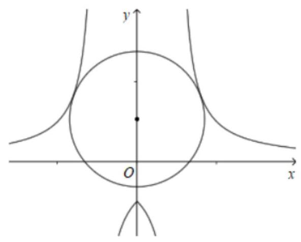
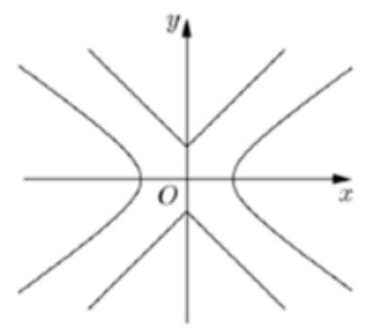
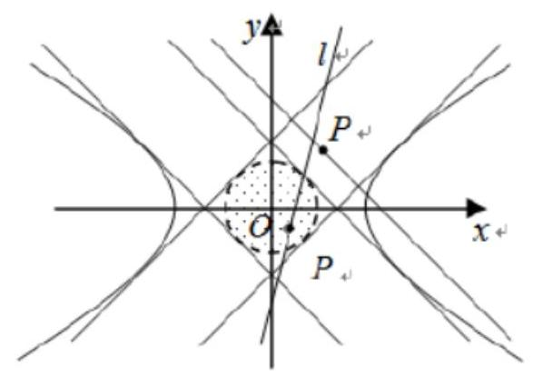
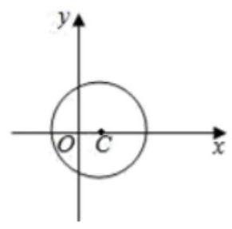

## 新定义

<table><tr><td>教学目标</td><td>常见新定义题型处理方法, 需要学生有一定阅读理解能力</td></tr><tr><td>重点</td><td>新定义在数列、函数、解析几何的应用, 将新定义问题转化为所学习的知识点</td></tr><tr><td>难 点</td><td>新定义在数列、函数、解析几何的应用</td></tr></table>

## (一)与函数有关的新定义问题

## 例题精讲

【例 1】我们把形如 $y = \frac{b}{\left| x\right|  - a}\left( {a > 0, b > 0}\right)$ 的函数称为 “囧函数”，因其函数图像类似于汉字 “囧”字，并把其与 $y$ 轴的交点关于原点的对称点称为“囧点”，以“囧点”为圆心凡是与“囧函数”有公共点的圆，皆称之为“囧圆”，则当 $a = 1, b = 1$ 时，所有的“囧圆”中，面积的最小值为( )

A. ${2\pi }$ B. ${3\pi }$ C. ${4\pi }$ D. ${5\pi }$

【难度】 $\star   \star   \star$

【答案】B

【解析】当 $a = 1, b = 1$ 时, $y = \frac{1}{\left| x\right|  - 1}$ ,

令 $x = 0$ ,解得 $y =  - 1$ ,则“囧点”为 $\left( {0,1}\right)$ ,作出图象,如下图所示:

当“囧圆”与 $y = \frac{1}{\left| x\right|  - 1}$ 在 $x$ 轴上方曲线相切时,不妨设在第一象限的切点为 $\left( {x, y}\right) \left( {x > 1}\right)$ ,

则其到 “囧点”的距离 $d = \sqrt{{x}^{2} + {\left( y - 1\right) }^{2}} = \sqrt{{x}^{2} + {\left( \frac{1}{x - 1} - 1\right) }^{2}} = \sqrt{{x}^{2} + {\left( \frac{1}{x - 1}\right) }^{2} + 1} - 2\left( \frac{1}{x - 1}\right)$

$= \sqrt{{x}^{2} + {\left( \frac{1}{x - 1}\right) }^{2} + 3 - 2\left( \frac{x}{x - 1}\right) } = \sqrt{{\left( x - \frac{1}{x - 1}\right) }^{2} + 3} \geq  \sqrt{3}$ ,

当 $x = \frac{1}{x - 1}$ ,即 ${x}^{2} - x - 1 = 0$ 时,解得 $x = \frac{1 + \sqrt{5}}{2}$ 或 $x = \frac{1 - \sqrt{5}}{2}$ (舍),

所以当 $x = \frac{1 + \sqrt{5}}{2}$ 时, $d = \sqrt{3}$ ,此时 “囧圆”的面积 $S = \pi  \times  {\left( \sqrt{3}\right) }^{2} = {3\pi }$ ,

当“囧圆”与 $y = \frac{1}{\left| x\right|  - 1}$ 图象的下支相切时,且切点为 $\left( {0, - 1}\right)$ ,

此时半径 $r = 2$ ，此时 “囧圆”的面积 $S = \pi  \times  {2}^{2} = {4\pi }$ ，所以所有的“囧圆”中，面积的最小值为 ${3\pi }$ . 故选:B

【例 2】若函数 $f\left( x\right)$ 对其定义域内的任意 ${x}_{1},{x}_{2}$ ,当 $f\left( {x}_{1}\right)  = f\left( {x}_{2}\right)$ 时总有 ${x}_{1} = {x}_{2}$ ,则称 $f\left( x\right)$ 为紧密函数,例如函数 $f\left( x\right)  = \ln x\left( {x > 0}\right)$ 是紧密函数. 下列命题:①紧密函数必是单调函数；②函数 $f\left( x\right)  = \frac{{x}^{2} + {2x} + a}{x}\left( {x > 0}\right)$ 在 $a < 0$ 时是紧密函数；③函数 $f\left( x\right)  = \left\{  \begin{array}{ll} {\log }_{3}x, & x \geq  2, \\  2 - x, & x < 2 \end{array}\right.$ 是紧密函数；④若函数 $f\left( x\right)$ 为定义域内的紧密函数， ${x}_{1} \neq  {x}_{2}$ ，则 $f\left( {x}_{1}\right)  \neq  f\left( {x}_{2}\right)$ ；其中正确的是___.

【难度】 $\star   \star   \star$

【答案】②④

【解析】①,由于函数 $f\left( x\right)$ 对其定义域内的任意 ${x}_{1},{x}_{2}$ ,当 $f\left( {x}_{1}\right)  = f\left( {x}_{2}\right)$ 时总有 ${x}_{1} = {x}_{2}$ ,则称 $f\left( x\right)$ 为紧密函数，所以紧密函数 $f\left( x\right)$ 的自变量与函数值是一一映射，故单调函数一定是紧密函数，但紧密函数不一定是单调函数,如 $y = \frac{1}{x}$ ,按照定义,显然是紧密函数,但不是单调函数,故①错;

②因为 $f\left( x\right)  = \frac{{x}^{2} + {2x} + a}{x} = x + \frac{a}{x} + 2\left( {x > 0}\right)$ ,当 $a < 0$ 时, $y = \frac{a}{x}$ 单调递增,所以

$f\left( x\right)  = \frac{{x}^{2} + {2x} + a}{x}\left( {x > 0}\right)$ 是单调函数,故一定使紧密函数,故②正确；

③ 函数 $f\left( x\right)  = \left\{  \begin{array}{ll} {\log }_{3}x, & x \geq  2, \\  2 - x, & x < 2 \end{array}\right.$ ，当 $x \geq  2$ 时， $f\left( x\right)  = {\log }_{3}x$ 单调递增；当 $x < 2$ 时， $f\left( x\right)  = 2 - x$ 单调递

减，不是一一映射，故不是紧密函数；故③错；

④若函数 $f\left( x\right)$ 为定义域内的紧密函数，由一一映射可知，若 ${x}_{1} \neq  {x}_{2}$ ，则 $f\left( {x}_{1}\right)  \neq  f\left( {x}_{2}\right)$ ；故④正确； 故答案为:②④.

【例 3】设 $f\left( x\right)$ 是定义在 $\left\lbrack  {0,1}\right\rbrack$ 上的函数,若存在 ${x}^{ * } \in  \left( {0,1}\right)$ 使得 $f\left( x\right)$ 在 $\left\lbrack  {0,{x}^{ * }}\right\rbrack$ 上单调递增,在 $\left\lbrack  {{x}^{ * },1}\right\rbrack$ 上单调递减,则称 $f\left( x\right)$ 为 $\left\lbrack  {0,1}\right\rbrack$ 上的单峰函数, ${x}^{ * }$ 为峰点,包含峰点的区间为含峰区间.

(1)判断下列函数是否为单峰函数:

① $f\left( x\right)  = \frac{x}{4{x}^{2} + 1}, x \in  \left\lbrack  {0,1}\right\rbrack$ ；

② $f\left( x\right)  = {2}^{{x}^{2} - x + 1}, x \in  \left\lbrack  {0,1}\right\rbrack$ ；

③ $f\left( x\right)  = {\log }_{\frac{1}{2}}\left( {\left| {x - \frac{1}{3}}\right|  + 1}\right) , x \in  \left\lbrack  {0,1}\right\rbrack$ ；

④ $f\left( x\right)  = {\left( \frac{1}{4} - x\right) }^{4},\;x \in  \left\lbrack  {0,1}\right\rbrack$ .

对任意的 $\left\lbrack  {0,1}\right\rbrack$ 上的单峰函数 $f\left( x\right)$ ,下面研究缩短其含峰区间长度 $l$ (区间长度 $l$ 等于区间的右端点与左端点之差).

(2)证明:对任意的 ${x}_{1},{x}_{2} \in  \left( {0,1}\right) ,{x}_{1} < {x}_{2}$ ，若 $f\left( {x}_{1}\right)  \geq  f\left( {x}_{2}\right)$ ，则 $\left( {0,{x}_{2}}\right)$ 为含峰区间；若 $f\left( {x}_{1}\right)  \leq  f\left( {x}_{2}\right)$ ， 则 $\left( {{x}_{1},1}\right)$ 含峰区间；

(3)对给定的 $r\left( {0 < r < {0.5}}\right)$ ,证明: 存在 ${x}_{1},{x}_{2} \in  \left( {0,1}\right)$ ,满足 ${x}_{2} - {x}_{1} \geq  {2r}$ ,使得由(2)所确定的含峰区间的长度不大于 ${0.5} + r$ .

【难度】 $\star   \star   \star   \star$

【答案】(1) $f\left( x\right)  = \frac{x}{4{x}^{2} + 1}\text{ 、 }f\left( x\right)  = {\log }_{\frac{1}{2}}\left( {\left| {x - \frac{1}{3}}\right|  + 1}\right)$ 是单峰函数， $f\left( x\right)  = {2}^{{x}^{2} - x + 1}\text{ 、 }f\left( x\right)  = {\left( \frac{1}{4} - x\right) }^{4}$ 不是单峰函数；(2)证明见解析；(3)证明见解析；

【解析】(1) $f\left( x\right)  = \frac{x}{4{x}^{2} + 1}$ 在 $\left\lbrack  {0,\frac{1}{2}}\right\rbrack$ 上单调递增,在 $\left\lbrack  {\frac{1}{2},1}\right\rbrack$ 上单调递减,是单峰函数; $f\left( x\right)  = {2}^{{x}^{2} - x + 1}$ 在 $\left\lbrack  {0,\frac{1}{2}}\right\rbrack$ 上单调递减,在 $\left\lbrack  {\frac{1}{2},1}\right\rbrack$ 上单调递增,不是单峰函数; $f\left( x\right)  = {\log }_{\frac{1}{2}}\left( {\left| {x - \frac{1}{3}}\right|  + 1}\right)$ 在 $\left\lbrack  {0,\frac{1}{3}}\right\rbrack$ 上单调递增,在 $\left\lbrack  {\frac{1}{3},1}\right\rbrack$ 上单调递减,是单峰函数; $f\left( x\right)  = {\left( \frac{1}{4} - x\right) }^{4}$ 在 $\left\lbrack  {0,\frac{1}{4}}\right\rbrack$ 上单调递减,在 $\left\lbrack  {\frac{1}{4},1}\right\rbrack$ 上单调递增,不是单峰函数;

(2)对任意的 ${x}_{1},{x}_{2} \in  \left( {0,1}\right) ,{x}_{1} < {x}_{2}$ :

若 $f\left( {x}_{1}\right)  \geq  f\left( {x}_{2}\right)$ 时, $\frac{f\left( {x}_{2}\right)  - f\left( {x}_{1}\right) }{{x}_{2} - {x}_{1}} \leq  0$ ,由单峰函数的定义知: 若 ${x}_{2},{x}_{1}$ 都在 $\left\lbrack  {0,{x}^{ * }}\right\rbrack$ 上不符合递增定义, 所以必有 ${x}_{2} > {x}^{ * }$ ,即 $\left( {0,{x}_{2}}\right)$ 为含峰区间;

若 $f\left( {x}_{1}\right)  \leq  f\left( {x}_{2}\right)$ 时, $\frac{f\left( {x}_{2}\right)  - f\left( {x}_{1}\right) }{{x}_{2} - {x}_{1}} \geq  0$ ,同理若 ${x}_{2},{x}_{1}$ 都在 $\left\lbrack  {{x}^{ * },1}\right\rbrack$ 上不符合递减定义,所以必有 ${x}_{1} < {x}^{ * }$ , 即 $\left( {{x}_{1},1}\right)$ 为含峰区间;

$\therefore$ 综上,对任意的 ${x}_{1},{x}_{2} \in  \left( {0,1}\right) ,{x}_{1} < {x}_{2}$ ,若 $f\left( {x}_{1}\right)  \geq  f\left( {x}_{2}\right)$ ,则 $\left( {0,{x}_{2}}\right)$ 为含峰区间; 若 $f\left( {x}_{1}\right)  \leq  f\left( {x}_{2}\right)$ , 则 $\left( {{x}_{1},1}\right)$ 含峰区间,得证

(3)由(2)的结论可知:当 $f\left( {x}_{1}\right)  \geq  f\left( {x}_{2}\right)$ 时，含峰区间的长度为 $l = {x}_{2}$ ；当 $f\left( {x}_{1}\right)  \leq  f\left( {x}_{2}\right)$ 时，含峰区间的长度为 ${l}^{\prime } = 1 - {x}_{1}$ .

由题意得 $\left\{  \begin{array}{l} {x}_{2} \leq  {0.5} + r \\  1 - {x}_{1} \leq  {0.5} + r \end{array}\right.$ ①，即可得 ${x}_{2} - {x}_{1} \leq  {2r}$ ，而 ${x}_{2} - {x}_{1} \geq  {2r}$ ，所以 ${x}_{2} - {x}_{1} = {2r}$ ②；

将②代入①得 ${x}_{1} \leq  {0.5} - r,{x}_{2} \geq  {0.5} + r$ ③，再由①和③得: ${x}_{1} = {0.5} - r \in  \left( {0,\frac{1}{2}}\right) ,{x}_{2} = {0.5} + r \in  \left( {\frac{1}{2},1}\right)$ ；

$\therefore$ 此时含峰区间的长度 $l = {l}^{\prime } = {0.5} + r$ ,即存在 ${x}_{1},{x}_{2} \in  \left( {0,1}\right)$ 使得所确定的含峰区间的长度不大于 ${0.5} + r$ .

【例 4】若函数 $f\left( x\right)$ 满足:对于任意正数 $s, t$ ,都有 $f\left( s\right)  > 0, f\left( t\right)  > 0$ ,且 $f\left( s\right)  + f\left( t\right)  < f\left( {s + t}\right)$ ,则称函数 $f\left( x\right)$ 为 “ $L$ 函数”.

(1)试判断函数 ${f}_{1}\left( x\right)  = {x}^{2}$ 与 ${f}_{2}\left( x\right)  = {x}^{\frac{1}{2}}$ 是否是 “ $L$ 函数”；

( 2 )若函数 $g\left( x\right)  = {3}^{x} - 1 + a\left( {{3}^{-x} - 1}\right)$ 为“ $L$ 函数”，求实数 $a$ 的取值范围；

(3)若函数 $f\left( x\right)$ 为“ $L$ 函数”，且 $f\left( 1\right)  = 1$ ，求证:对任意 $x \in  \left( {{2}^{k - 1},{2}^{k}}\right) \left( {k \in  {\mathrm{N}}^{ * }}\right)$ ，都有 $f\left( x\right)  - f\left( \frac{1}{x}\right)  > \frac{x}{2} - \frac{2}{x}.$

【难度】 $\star   \star   \star   \star$

【答案】( 1 ) ${f}_{1}\left( x\right)  = {x}^{2}$ 是 “ $L$ 函数”. ${f}_{2}\left( x\right)  = \sqrt{x}$ 不是 “ $L$ 函数”. ( 2 ) $\left\lbrack  {-1,1}\right\rbrack$ ( 3 )见解析

【解析】(1)对于函数 ${f}_{1}\left( x\right)  = {x}^{2}$ ,当 $t > 0, s > 0$ 时, ${f}_{1}\left( t\right)  = {t}^{2} > 0,{f}_{1}\left( s\right)  = {s}^{2} > 0$ ,又 ${f}_{1}\left( t\right)  + {f}_{1}\left( s\right)  - {f}_{1}\left( {t + s}\right)  = {t}^{2} + {s}^{2} - {\left( t + s\right) }^{2} =  - {2ts} < 0$ ,所以 ${f}_{1}\left( s\right)  + {f}_{1}\left( t\right)  < {f}_{1}\left( {s + t}\right)$ ,故 ${f}_{1}\left( x\right)  = {x}^{2}$ 是 “ $L$ 函数”.

对于函数 ${f}_{2}\left( x\right)  = \sqrt{x}$ ,当 $t = s = 1$ 时, ${f}_{2}\left( t\right)  + {f}_{2}\left( s\right)  = 2 > \sqrt{2} = {f}_{2}\left( {t + s}\right)$ ,

故 ${f}_{2}\left( x\right)  = \sqrt{x}$ 不是 “ $L$ 函数”.

(2)当 $t > 0, s > 0$ 时，由 $g\left( x\right)  = {3}^{x} - 1 + a\left( {{3}^{-x} - 1}\right)$ 是 “ $L$ 函数”,

可知 $g\left( t\right)  = {3}^{t} - 1 + a\left( {{3}^{-t} - 1}\right)  > 0$ ,即 $\left( {{3}^{t} - 1}\right) \left( {{3}^{t} - a}\right)  > 0$ 对一切正数 $t$ 恒成立,

又 ${3}^{t} - 1 > 0$ ,可得 $a < {3}^{t}$ 对一切正数 $t$ 恒成立,所以 $a \leq  1$ .

由 $g\left( t\right)  + g\left( s\right)  < g\left( {t + s}\right)$ ,可得 ${3}^{s + t} - {3}^{s} - {3}^{t} + 1 + a\left( {{3}^{-s - t} - {3}^{-s} - {3}^{-t} + 1}\right)  > 0$ ,

故 $\left( {{3}^{s} - 1}\right) \left( {{3}^{t} - 1}\right) \left( {{3}^{s + t} + a}\right)  > 0$ ,又 $\left( {{3}^{t} - 1}\right) \left( {{3}^{s} - 1}\right)  > 0$ ,故 ${3}^{s + t} + a > 0$ ,

由 ${3}^{s + t} + a > 0$ 对一切正数 $s, t$ 恒成立,可得 $a + 1 \geq  0$ ,即 $a \geq   - 1$ .

综上可知, $a$ 的取值范围是 $\left\lbrack  {-1,1}\right\rbrack$ .

(3)由函数 $f\left( x\right)$ 为“ $L$ 函数”，可知对于任意正数 $s, t$ ，

都有 $f\left( s\right)  > 0, f\left( t\right)  > 0$ ,且 $f\left( s\right)  + f\left( t\right)  < f\left( {s + t}\right)$ ,

令 $s = t$ ,可知 $f\left( {2s}\right)  > {2f}\left( s\right)$ ,即 $\frac{f\left( {2s}\right) }{f\left( s\right) } > 2$ ,

故对于正整数 $k$ 与正数 $s$ ,都有

$\frac{f\left( {{2}^{k}s}\right) }{f\left( s\right) } = \frac{f\left( {{2}^{k}s}\right) }{f\left( {{2}^{k - 1}s}\right) } \cdot  \frac{f\left( {{2}^{k - 1}s}\right) }{f\left( {{2}^{k - 2}s}\right) }\cdots  \cdot  \frac{f\left( {2s}\right) }{f\left( s\right) } > {2}^{k},$

对任意 $x \in  \left( {{2}^{k - 1},{2}^{k}}\right) \left( {k \in  {\mathrm{N}}^{ * }}\right)$ ,可得 $\frac{1}{x} \in  \left( {{2}^{-k},{2}^{1 - k}}\right)$ ,又 $f\left( 1\right)  = 1$ ,

所以 $f\left( x\right)  > f\left( {x - {2}^{k - 1}}\right)  + f\left( {2}^{k - 1}\right)  > f\left( {2}^{k - 1}\right)  \geq  {2}^{k - 1}f\left( 1\right)  = \frac{{2}^{k}}{2} > \frac{x}{2}$ ,

同理 $f\left( \frac{1}{x}\right)  < f\left( {2}^{1 - k}\right)  - f\left( {{2}^{1 - k} - \frac{1}{x}}\right)  < f\left( {2}^{1 - k}\right)  \leq  {2}^{1 - k}f\left( 1\right)  = {2}^{1 - k} < \frac{2}{x}$ ,

故 $f\left( x\right)  - f\left( \frac{1}{x}\right)  > \frac{x}{2} - \frac{2}{x}$ .

巩固训练

1、具有性质 $f\left( \frac{1}{x}\right)  =  - f\left( x\right)$ 的函数，我们称为满足“倒负”变换的函数，给出下列函数:① $f\left( x\right)  = x - \frac{1}{x}$ ; ② $f\left( x\right) \; = x + \frac{1}{x};\text{ ③ }f\left( x\right)  = \left\{  \begin{array}{ll} x, & 0 < x < 1 \\  0, & x = 1 \\   - \frac{1}{x}, & x > 1 \end{array}\right.$ 其中满足“倒负”变换的函数是( )

A. ①③ B. ②③

C. ①②③ D. ①②

【答案】A

【解析】对于①, $f\left( \frac{1}{x}\right)  = \frac{1}{x} - x =  - f\left( x\right)$ ,满足题意; 对于②, $f\left( \frac{1}{x}\right)  = \frac{1}{x} + x = f\left( x\right)$ ,不满足题意;

对于③， $f\left( \frac{1}{x}\right)  = \left\{  \begin{array}{l} \frac{1}{x},0 < \frac{1}{x} < 1 \\  0,\frac{1}{x} = 1 \\   - x,\frac{1}{x} > 1 \end{array}\right.$ ；即 $f\left( \frac{1}{x}\right)  = \left\{  \begin{array}{l} \frac{1}{x}, x > 1 \\  0, x = 1 \\   - x,0 < x < 1 \end{array}\right.$ ；故 $f\left( \frac{1}{x}\right)  =  - f\left( x\right)$ ，满足题意.

综上可知，满足“倒负”变换的函数是①③. 故选:A.

2、设函数 $f\left( x\right)$ 的定义域为 $D$ ,如果对于任意的 ${x}_{1} \in  D$ ,存在唯一的 ${x}_{2} \in  D$ ,使得 $\frac{f\left( {x}_{1}\right)  + f\left( {x}_{2}\right) }{2} = C$ 成立 (其中 $C$ 为常数),则称函数 $y = f\left( x\right)$ 在 $D$ 上的均值为 $C$ ,现在给出下列 4 个函数: ① $y = {x}^{3}$ ② $y = 4\sin x$ ③ $y = {lgx}$

④ $y = {2}^{x}$ ，则在其定义域上的均值为 2 的所有函数是下面的( )

A. ①② B. ③④ C. ①⑧④ D. ①③

【答案】 $D$

【解答】解: 由题意可得,均值为 2,则 $\frac{f\left( {x}_{1}\right)  + f\left( {x}_{2}\right) }{2} = 2$ 即 $f\left( {x}_{1}\right)  + f\left( {x}_{2}\right)  = 4$

①: $y = {x}^{3}$ 在定义域 $R$ 上单调递增,对应任意的 ${x}_{1}$ ,则存在唯一 ${x}_{2}$ 满足 ${x}_{1}^{3} + {x}_{2}^{3} = 4$ ①正确

②: $y = 4\sin x$ ,满足 $4\sin {x}_{1} + 4\sin {x}_{2} = 4$ ,令 ${x}_{1} = \frac{\pi }{2}$ ,则根据三角函数的周期性可得,

满足 $\sin {x}_{2} = 0$ 的 ${x}_{2}$ 无穷多个,②错误

③ $y = {lgx}$ 在 $\left( {0, + \infty }\right)$ 单调递增，对应任意的 ${x}_{1} > 0$ ，则满足 ${lg}{x}_{1} + {lg}{x}_{2} = 4$ 的 ${x}_{2}$ 唯一存在③正确

④ $y = {2}^{x}$ 满足 ${2}^{{x}_{1}} + {2}^{{x}_{2}} = 4$ ，令 ${x}_{1} = 3$ 时 ${x}_{2}$ 不存在④错误；故选: $D$ .

3、已知函数 $f\left( x\right)  = \left\{  \begin{array}{l} \left( {2-\lbrack x\rbrack }\right)  \cdot  \left| {x - 1}\right| ,0 \leq  x < 2 \\  1, x = 2 \end{array}\right.$ ，其中 $\lbrack x\rbrack$ 表示不超过 $x$ 的最大整数.设 $n \in  {N}^{ * }$ ，定义函数 ${f}_{n}\left( x\right)  : {f}_{1}\left( x\right)  = f\left( x\right) ,{f}_{2}\left( x\right)  = f\left( {{f}_{1}\left( x\right) }\right) ,\cdots ,{f}_{n}\left( x\right)  = f\left( {{f}_{n - 1}\left( x\right) }\right) \left( {n \geq  2}\right)$ ，则下列说法正确的有( ) 个.

① $y = \sqrt{x - f\left( x\right) }$ 的定义域为 $\left\lbrack  {\frac{2}{3},2}\right\rbrack$ ；

② 设 $A = \{ 0,1,2\} , B = \left\{  {x \mid  {f}_{3}\left( x\right)  = x, x \in  A}\right\}$ ，则 $A = B$ ；

③ ${f}_{2016}\left( \frac{8}{9}\right)  + {f}_{2017}\left( \frac{8}{9}\right)  = \frac{13}{9}$ ;

④ $M = \left\{  {x \mid  {f}_{2}\left( x\right)  = x, x \in  \left\lbrack  {0,2}\right\rbrack  }\right\}$ ，则 $\mathrm{M}$ 中至少含有 8 个元素.

A. 1 个 B. 2 个 C. 3 个 D. 4 个

【答案】D

【解析】当 $0 \leq  x \leq  1$ 时, $f\left( x\right)  = 2\left( {1 - x}\right)$ ; 当 $1 \leq  x \leq  2$ 时, $f\left( x\right)  = x - 1$ ,则 $f\left( x\right)  = \left\{  \begin{array}{l} 2\left( {1 - x}\right) ,0 \leq  x < 1 \\  x - 1,1 \leq  x \leq  2 \end{array}\right.$ 对①，有 $x - f\left( x\right)  \geq  0$ ，则 $\left\{  \begin{array}{l} 0 \leq  x < 1 \\  x - 2\left( {1 - x}\right)  \geq  0 \end{array}\right.$ 或 $\left\{  \begin{array}{l} 1 \leq  x \leq  2 \\  x - \left( {x - 1}\right)  \geq  0 \end{array}\right.$ ，得 $\frac{2}{3} \leq  x \leq  2$ ，即定义域为 $\left\lbrack  {\frac{2}{3},2}\right\rbrack$ ，故①

正确;

对②，当 $x = 0$ 时， ${f}_{3}\left( 0\right)  = f\left\lbrack  {{f}_{2}\left( 0\right) }\right\rbrack   = f\left( {f\left( {f\left( 0\right) }\right) }\right)  = f\left( {f\left( 2\right) }\right)  = f\left( 1\right)  = 0$ 成立；

当 $x = 1$ 时, ${f}_{3}\left( 1\right)  = f\left\lbrack  {{f}_{2}\left( 1\right) }\right\rbrack   = f\left( {f\left( {f\left( 1\right) }\right) }\right)  = f\left( {f\left( 0\right) }\right)  = f\left( 2\right)  = 1$ 成立;

当 $x = 2$ 时， ${f}_{3}\left( 2\right)  = f\left( {f\left( {f\left( 2\right) }\right) }\right)  = f\left( {f\left( 1\right) }\right)  = f\left( 0\right)  = 2$ 成立，

所以 $A = B$ ,故②项正确。

对 ③， ${f}_{1}\left( \frac{8}{9}\right)  = 2 \times  \left( {1 - \frac{8}{9}}\right)  = \frac{2}{9}$ ， ${f}_{2}\left( \frac{8}{9}\right)  = f\left( {f\left( \frac{8}{9}\right) }\right)  = f\left( \frac{2}{9}\right)  = 2 \times  \left( {1 - \frac{2}{9}}\right)  = \frac{14}{9}$ ，

${f}_{3}\left( \frac{8}{9}\right)  = f\left( {{f}_{2}\left( \frac{8}{9}\right) }\right)  = f\left( \frac{14}{9}\right)  = \frac{14}{9} - 1 = \frac{5}{9},$

${f}_{4}\left( \frac{8}{9}\right)  = f\left( {{f}_{3}\left( \frac{8}{9}\right) }\right)  = f\left( \frac{5}{9}\right)  = 2 \times  \left( {1 - \frac{5}{9}}\right)  = \frac{8}{9},$

一般地, ${f}_{{4k} + r}\left( \frac{8}{9}\right)  = {f}_{r}\left( \frac{8}{9}\right) \left( {k, r \in  N}\right)$ ,

即有 ${f}_{2015}\left( \frac{8}{9}\right)  + {f}_{2016}\left( \frac{8}{9}\right)  = {f}_{3}\left( \frac{8}{9}\right)  + {f}_{4}\left( \frac{8}{9}\right)  = \frac{5}{9} + \frac{8}{9} = \frac{13}{9}$ ,

故③正确。

对④，由①可知， $f\left( \frac{2}{3}\right)  = \frac{2}{3}$ ，所以 ${f}_{n}\left( \frac{2}{3}\right)  = \frac{2}{3}$ ，则 ${f}_{12}\left( \frac{2}{3}\right)  = \frac{2}{3}$ ，所以 $\frac{2}{3} \in  M$ ，

由②知,对 $x = 0,1,2$ ,恒有 ${f}_{3}\left( x\right)  = x$ ,所以 ${f}_{12}\left( x\right)  = x$ ,则 $0,1,2 \in  M$ ,

由③知，对 $x = \frac{8}{9},\frac{2}{9},\frac{14}{9},\frac{5}{9}$ ，恒有 ${f}_{12}\left( x\right)  = x$ ，所以 $\frac{8}{9},\frac{2}{9},\frac{14}{9},\frac{5}{9} \in  M$

综上所述， $\frac{2}{3},0,1,2,\frac{8}{9},\frac{2}{9},\frac{14}{9},\frac{5}{9} \in  M$ ，所以 $M$ 中至少含有 8 个元素，故④正确。

故选: D.

4、已知函数 $f\left( x\right)$ ，如果存在给定的实数对 $\left( {a, b}\right)$ ，使得 $f\left( {a + x}\right)  \cdot  f\left( {a - x}\right)  = b$ 恒成立，则称 $f\left( x\right)$ 为“ $\Gamma  -$ 函数”.

(1)判断函数 ${f}_{1}\left( x\right)  = x,{f}_{2}\left( x\right)  = {3}^{x}$ 是否是“ $\Gamma  -$ 函数”;

(2)若 ${f}_{3}\left( x\right)  = \tan x$ 是一个“ $\Gamma  -$ 函数”，求出所有满足条件的有序实数对 $\left( {a, b}\right)$ ；

新定义一教师版

(3)若定义域为 $\mathrm{R}$ 的函数 $f\left( x\right)$ 是 “ $\Gamma  -$ 函数”，且存在满足条件的有序实数对 $\left( {0,1}\right)$ 和 $\left( {1,4}\right)$ ，当 ${x}^{ \in  }\left\lbrack  {0,1}\right\rbrack$ 时， $f\left( x\right)$ 的值域为 $\left\lbrack  {1,2}\right\rbrack$ ,求当 $x \in  \left\lbrack  {-{2016},{2016}}\right\rbrack$ 时函数 $f\left( x\right)$ 的值域.

【答案】(1)函数 ${f}_{1}\left( x\right)  = x$ 不是“ $\Gamma  -$ 函数”，函数 ${f}_{2}\left( x\right)  = {3}^{x}$ 是“ $\Gamma  -$ 函数”；

(2) $\left( {a, b}\right)  = \left( {{k\pi } \pm  \frac{\pi }{4},1}\right) \left( {k \in  \mathbf{Z}}\right)$ ；

(3) $\left\lbrack  {{2}^{-{2016}},{2}^{2016}}\right\rbrack$ .

【解析】(1) 若 ${f}_{1}\left( x\right)  = x$ 是 “ $\Gamma  -$ 函数”,则存在常数 $\left( {a, b}\right)$ ,使得 $\left( {a + x}\right) \left( {a - x}\right)  = b$

即 ${x}^{2} = {a}^{2} - b$ 时,对 $x \in  \mathbf{R}$ 恒成立. 而 ${x}^{2} = {a}^{2} - b$ 最多有两个解,矛盾

因此 ${f}_{1}\left( x\right)  = x$ 不是 “ $\Gamma  -$ 函数”,则存在常数 $a, b$ 使得 ${3}^{a + x} \cdot  {3}^{a - x} = {3}^{2a} = b$

若 ${f}_{2}\left( x\right)  = {3}^{x}$ 是 “ $\Gamma  -$ 函数”,则存在常数 $a, b$ 使得 ${3}^{a + x} \cdot  {3}^{a - x} = {3}^{2a} = b$

即存在常数对 $\left( {a,{3}^{2a}}\right)$ 满足条件. 因此 ${f}_{2}\left( x\right)  = {3}^{x}$ 是 “ $\Gamma  -$ 函数”;

(2) ${f}_{3}\left( x\right)  = \tan x$ 是一个“ $\Gamma  -$ 函数”,有序实数对 $\left( {a, b}\right)$ 满足 $\tan \left( {a + x}\right)  \cdot  \tan \left( {a - x}\right)  = b$ 恒成立,

当 $a = {k\pi } + \frac{\pi }{2}, k \in  \mathbf{Z}$ 时, $\tan \left( {a + x}\right)  \cdot  \tan \left( {a - x}\right)  =  - {\cot }^{2}x$ ,不是常数

$\therefore a \neq  {k\pi } + \frac{\pi }{2}, k \in  \mathbf{Z}$

当 $x \neq  {m\pi } + \frac{\pi }{2}, m \in  \mathbf{Z}$ 时,有 $\frac{\tan a + \tan x}{1 - \tan a \cdot  \tan x} \cdot  \frac{\tan a - \tan x}{1 + \tan a \cdot  \tan x} = \frac{{\tan }^{2}a - {\tan }^{2}x}{1 - {\tan }^{2}a{\tan }^{2}x} = b$ 恒成立

即 $\left( {b \cdot  {\tan }^{2}a - 1}\right) {\tan }^{2}x + \left( {{\tan }^{2}a - b}\right)  = 0$ 恒成立.

则 $\left\{  {\begin{array}{l} b \cdot  {\tan }^{2}a - 1 = 0 \\  {\tan }^{2}a - b = 0 \end{array} \Rightarrow  \left\{  {\begin{array}{l} {\tan }^{2}a = 1 \\  b = 1 \end{array} \Rightarrow  \left\{  {\begin{array}{l} a = {k\pi } \pm  \frac{\pi }{4} \\  b = 1 \end{array}, k \in  Z}\right. }\right. }\right.$ ,

当 $x = {m\pi } + \frac{\pi }{2}, m \in  \mathbf{Z}, a = {k\pi } \pm  \frac{\pi }{4}$ 时, $\tan \left( {a + x}\right)  \cdot  \tan \left( {a - x}\right)  =  - {\cot }^{2}x$ 成立.

因此满足 ${f}_{3}\left( x\right)  = \tan x$ 是一个“ $\Gamma  -$ 函数”, $\left( {a, b}\right)  = \left( {{k\pi } \pm  \frac{\pi }{4},1}\right) \left( {k \in  \mathbf{Z}}\right)$ .

(3) 函数 $f\left( x\right)$ 是 “ $\Gamma  -$ 函数”，且存在满足条件的有序实数对 $\left( {0,1}\right)$ 和 $\left( {1,4}\right)$ ，

于是 $f\left( x\right)  \cdot  f\left( {-x}\right)  = 1, f\left( {1 + x}\right)  \cdot  f\left( {1 - x}\right)  = 4, f\left( {1 + x}\right)  \cdot  f\left( {1 - x}\right)  = 4 \Leftrightarrow  f\left( x\right)  \cdot  f\left( {2 - x}\right)  = 4$ .

${x}^{ \in  }\left\lbrack  {1,2}\right\rbrack$ 时, ${2}^{ - }{x}^{ \in  }\left\lbrack  {0,1}\right\rbrack  , f{\left( {2}^{ - }x\right) }^{ \in  }\left\lbrack  {1,2}\right\rbrack  , f\left( x\right)  = \frac{4}{f\left( {2 - x}\right) } \in  \left\lbrack  {2,4}\right\rbrack$ ,

$\therefore {x}^{ \in  }\left\lbrack  {0,2}\right\rbrack$ 时, $f\left( x\right)  \in  \left\lbrack  {1,4}\right\rbrack$ ,

$\left\{  {\begin{array}{l} f\left( x\right)  \cdot  f\left( {-x}\right)  = 1 \\  f\left( {1 + x}\right)  \cdot  f\left( {1 - x}\right)  = 4 \end{array} \Rightarrow  \left\{  {\begin{array}{l} f\left( {-x}\right)  = \frac{1}{f\left( x\right) } \\  f\left( {-x}\right)  = \frac{4}{f\left( {2 + x}\right) } \end{array} \Rightarrow  f\left( {x + 2}\right)  = {4f}\left( x\right) ,}\right. }\right.$

${x}^{ \in  }\left\lbrack  {2,4}\right\rbrack$ 时, $f{\left( x\right) }^{ \in  }\left\lbrack  {4,{16}}\right\rbrack$ ,

${x}^{ \in  }\left\lbrack  {4,6}\right\rbrack$ 时, $f{\left( x\right) }^{ \in  }\left\lbrack  {{16},{64}}\right\rbrack$ ,

以此类推可知: ${x}^{ \in  }\left\lbrack  {{2k},2{k}^{ + }2}\right\rbrack$ 时, $f{\left( x\right) }^{ \in  }\left\lbrack  {{2}^{2k},{2}^{2{k}^{ + }2}}\right\rbrack$

${x}^{ \in  }\left\lbrack  {{2014},{2016}}\right\rbrack$ 时, $f{\left( x\right) }^{ \in  }\left\lbrack  {{2}^{2014},{2}^{2016}}\right\rbrack$ ,

因此 $x \in  \left\lbrack  {0,{2016}}\right\rbrack$ 时, $f\left( x\right)  \in  \left\lbrack  {1,{2}^{2016}}\right\rbrack$

$x \in  \left\lbrack  {-{2016},0}\right\rbrack$ 时, $f\left( x\right)  = \frac{1}{f\left( {-x}\right) }, - x \in  \left\lbrack  {0,{2016}}\right\rbrack  , f\left( {-x}\right)  \in  \left\lbrack  {1,{2}^{2016}}\right\rbrack   \Rightarrow  f\left( x\right)  \in  \left\lbrack  {{2}^{-{2016}},1}\right\rbrack$

综上可知当 $x \in  \left\lbrack  {-{2016},{2016}}\right\rbrack$ 时函数 $f\left( x\right)$ 的值域为 $\left\lbrack  {{2}^{-{2016}},{2}^{2016}}\right\rbrack$ .

## (二) 与数列有关的新定义问题

## 例题精讲

【例 5】对于任意 $n \in  {\mathbf{N}}^{ * }$ ,若数列 $\left\{  {x}_{n}\right\}$ 满足 ${x}_{n + 1} - {x}_{n} > 1$ ,则称这个数列为“K 数列”.

(1)已知数列: $1,\left| {m + 1}\right| ,{m}^{2}$ 是“K数列”，求实数 $m$ 的取值范围；

(2)设等差数列 $\left\{  {a}_{n}\right\}$ 的前 $n$ 项和为 ${S}_{n}$ ，当首项 ${a}_{1}$ 与公差 $d$ 满足什么条件时，数列 $\left\{  {S}_{n}\right\}$ 是“K 数列”?

(3)设数列 $\left\{  {a}_{n}\right\}$ 的前 $n$ 项和为 ${S}_{n}$ ， ${a}_{1} = 1$ ，且 $2{S}_{n + 1} - 3{S}_{n} = 2{a}_{1}, n \in  {\mathbf{N}}^{ * }$ . 设 ${c}_{n} = \lambda {a}_{n} + {\left( -1\right) }^{n}{a}_{n + 1}$ ，是否存在实数 $\lambda$ ,使得数列 $\left\{  {c}_{n}\right\}$ 为 “ $\mathrm{K}$ 数列”. 若存在,求实数 $\lambda$ 的取值范围; 若不存在,请说明理由.

【难度】 $\star   \star   \star$

【答案】 $\left( 1\right) m > 2$ 或 $m <  - 3$ ； ( 2 ) ${a}_{1} + d > 1$ 且 $d \geq  0$ ； ( 3 ) $\lambda  > \frac{53}{6}$ .

【解析】( 1 )由题意可得 $\left\{  {\begin{matrix} \left| {m + 1}\right|  - 1 > 1 \\  {m}^{2} - \left| {m + 1}\right|  > 1 \end{matrix}.\therefore m > 2}\right.$ 或 $m <  - 3$

(2) ${S}_{n} = n{a}_{1} + \frac{n\left( {n - 1}\right) d}{2},\because$ 数列 $\left\{  {S}_{n}\right\}$ 是 “ $\mathrm{K}$ 数列”; $\therefore {S}_{n + 1} - {S}_{n} > 1,\therefore {a}_{n + 1} > 1$

$\therefore {a}_{1} + {nd} > 1$ 对 $n \in  {N}^{ * }$ 恒成立; $\therefore d \geq  0;\therefore {a}_{1} + d > 1$ 且 $d \geq  0$

(3) $\because 2{S}_{n + 1} - 3{S}_{n} = 2{a}_{1},\therefore 2{S}_{n} - 3{S}_{n - 1} = 2{a}_{1}\left( {n \geq  2}\right) ,\therefore 2{a}_{n + 1} = 3{a}_{n}\left( {n \geq  2}\right)$

$\because 2{a}_{2} = 3{a}_{1}$ 也成立, $\therefore 2{a}_{n + 1} = 3{a}_{n}\left( {n \geq  1}\right) ,\therefore \frac{{a}_{n + 1}}{{a}_{n}} = \frac{3}{2};\therefore$ 数列 $\left\{  {a}_{n}\right\}$ 是公比为 $\frac{3}{2}$ 的等比数列

$\because {a}_{1} = 1,\therefore {a}_{n} = {\left( \frac{3}{2}\right) }^{n - 1},\therefore {c}_{n} = \lambda  \cdot  {\left( \frac{3}{2}\right) }^{n - 1} + {\left( -1\right) }^{n} \cdot  {\left( \frac{3}{2}\right) }^{n}$

由题意得: ${c}_{n + 1} - {c}_{n} > 1$ ，即 $\frac{1}{2} \cdot  \lambda  \cdot  {\left( \frac{3}{2}\right) }^{n - 1} + {\left( -1\right) }^{n + 1} \cdot  \frac{5}{2} \cdot  {\left( \frac{3}{2}\right) }^{n} > 1$ .

当 $n$ 为偶数时, $\lambda  > 2 \cdot  {\left( \frac{2}{3}\right) }^{n - 1} + \frac{15}{2}$ 恒成立, $\lambda  > \frac{53}{6}$ ;

当 $n$ 为奇数时, $\lambda  > 2 \cdot  {\left( \frac{2}{3}\right) }^{n - 1} - \frac{15}{2}$ 恒成立, $\lambda  >  - \frac{11}{2}$ . 综上, $\lambda  > \frac{53}{6}$ .

【例 6】已知数列 $\left\{  {x}_{n}\right\}$ ,若对任意 $n \in  {\mathbf{N}}^{ * }$ ,都有 $\frac{{x}_{n} + {x}_{n + 2}}{2} > {x}_{n + 1}$ 成立,则称数列 $\left\{  {x}_{n}\right\}$ 为“差增数列”.

(1)试判断数列 ${a}_{n} = {n}^{2}\left( {n \in  {\mathbf{N}}^{ * }}\right)$ 是否为“差增数列”，并说明理由；

(2)若数列 $\left\{  {a}_{n}\right\}$ 为“差增数列”，且 ${a}_{n} \in  {\mathbf{N}}^{ * }$ ， ${a}_{1} = {a}_{2} = 1$ ，对于给定的正整数 $m$ ，当 ${a}_{k} = m$ ，项数 $k$ 的最大值为 20 时,求 $m$ 的所有可能取值的集合;

(3)若数列 $\left\{  {\lg {x}_{n}}\right\}$ 为“差增数列”， $\left( {n \in  {\mathbf{N}}^{ * }, n \leq  {2020}}\right)$ ，且 $\lg {x}_{1} + \lg {x}_{2} + \cdots  + \lg {x}_{2020} = 0$ ，证明: ${x}_{1010}{x}_{1011} < 1$ .

【难度】 $\star   \star   \star   \star$

【答案】(1)是:见解析(2) $\left\{  {m\left| {m \in  {\mathbf{N}}^{ * },{172} \leq  m \leq  {190}}\right. }\right\}$ ；(3)见解析

【解析】解: (1) 数列 ${a}_{n} = {n}^{2}\left( {n \in  {\mathbf{N}}^{ * }}\right)$ 是“差增数列”.

因为任意的 $n \in  {\mathbf{N}}^{ * }$ ,都有 ${a}_{n} + {a}_{n + 2} = {n}^{2} + {\left( n + 2\right) }^{2} = 2{n}^{2} + {4n} + 4 = 2\left( {n + 1}\right) 2 + 2 > 2{\left( n + 1\right) }^{2} = 2{a}_{n + 1}$ , 即 $\frac{{a}_{n} + {a}_{n + 2}}{2} > {a}_{n + 1}$ 成立,所以数列 ${a}_{n} = {n}^{2}\left( {n \in  {\mathbf{N}}^{ * }}\right)$ 是“差增数列”;

(2)由已知,对任意的 $n \in  {\mathrm{N}}^{ * }$ , ${a}_{n + 2} - {a}_{n + 1} > {a}_{n + 1} - {a}_{n}$ 恒成立.

可令 ${b}_{n} = {a}_{n + 1} - {a}_{n}\left( {n \geq  1}\right)$ ,则 ${b}_{n} \in  \mathrm{N}$ ,且 ${b}_{n} < {b}_{n + 1}$ ,

又 ${a}_{n} = m$ ，要使项数 $k$ 达到最大，且最大值为 20 时，必须 ${b}_{n}\left( {1 \leq  n \leq  {18}}\right)$ 最小.

而 ${b}_{1} = 0$ ,故 ${b}_{2} = 1,{b}_{3} = 2,\ldots ,{b}_{n} = n - 1$ .

所以 ${a}_{n} - {a}_{1} = {b}_{1} + {b}_{2} + \ldots  + {b}_{n - 1} = 0 + 1 + 2 + \ldots  + \left( {n - 2}\right)  = \frac{1}{2}\left( {n - 1}\right) \left( {n - 2}\right)$ ,

即当 $1 \leq  n \leq  {19}$ 时, ${a}_{n} = 1 + \frac{\left( {n - 1}\right) \left( {n - 2}\right) }{2},{a}_{19} = {154}$ ,因为 $k$ 的最大值为 20,

所以 ${18} \leq  {a}_{20} - {a}_{19} < {18} + {19}$ ,即 ${18} \leq  m - {154} < {18} + {19}$ ,

所以 $m$ 的所有可能取值的集合为 $\left\{  {m \mid  {172} \leq  m < {191}, m \in  {\mathrm{N}}^{ * }}\right\}$ .

(3)证明:(反证法)假设 ${x}_{1010}{x}_{1011} \geq  1$ . 由已知可得 ${x}_{n}\left( {n = 1,2,\ldots ,{2020}}\right)$ 均为正数,且 ${x}_{1}{x}_{2}\ldots {x}_{2020} = 1$ ， $\frac{{x}_{n + 1}}{{x}_{n}} < \frac{{x}_{n + 2}}{{x}_{n + 1}}$ . 而由 $\frac{{x}_{n + 1}}{{x}_{n}} < \frac{{x}_{n + 2}}{{x}_{n + 1}}$ 可得 $\frac{{x}_{1010}}{{x}_{1009}} < \frac{{x}_{1011}}{{x}_{1010}} < \frac{{x}_{1012}}{{x}_{1011}}$ ,

即 ${x}_{1010}{x}_{1011} < {x}_{1009}{x}_{1012}$ ,所以 ${x}_{1009}{x}_{1012} > 1$ .

又 $\frac{{x}_{1010}}{{x}_{1008}} = \frac{{x}_{1010}}{{x}_{1009}} \cdot  \frac{{x}_{1009}}{{x}_{1008}} < \frac{{x}_{1012}}{{x}_{1011}} \cdot  \frac{{x}_{1013}}{{x}_{1012}} = \frac{{x}_{1013}}{{x}_{1011}}$ ,即 ${x}_{1008}{x}_{1013} > 1$ ,

同理可证 ${x}_{1007}{x}_{1014} > 1,\ldots ,{x}_{1}{x}_{2020} > 1$ ,

因此 ${x}_{1}{x}_{2}\ldots {x}_{2020} > 1$ ,这与已知矛盾,所以 ${x}_{1010}{x}_{1011} < 1$ .

【例 7】对于由 $m$ 个正整数构成的有限集 $M = \left\{  {{a}_{1},{a}_{2},{a}_{3},\cdots ,{a}_{m}}\right\}$ ,记 $P\left( M\right)  = {a}_{1} + {a}_{2} + \cdots  + {a}_{m}$ ,特别规定 $P\left( \varnothing \right)  = 0$ ,若集合 $M$ 满足: 对任意的正整数 $k \leq  P\left( M\right)$ ,都存在集合 $M$ 的两个子集 $A\text{ 、 }B$ ,使得 $k = P\left( A\right)  - P\left( B\right)$ 成立,则称集合 $M$ 为“满集”,

(1)分别判断集合 ${M}_{1} = \{ 1,2\}$ 与 ${M}_{2} = \{ 1,4\}$ 是否为“满集”，请说明理由；

(2)若 ${a}_{1},{a}_{2},\cdots ,{a}_{m}$ 由小到大能排列成公差为 $d\left( {d \in  {\mathbf{N}}^{ * }}\right)$ 的等差数列，求证:集合 $M$ 为“满集”的必要条件是 ${a}_{1} = 1, d = 1$ 或 2 ;

(3)若 ${a}_{1},{a}_{2},\cdots ,{a}_{m}$ 由小到大能排列成首项为 1，公比为 2 的等比数列，求证:集合 $M$ 是“满集”

【难度】 $\star   \star   \star   \star$

【答案】(1)集合 ${M}_{1}$ 是“满集”，集合 ${M}_{2}$ 不是“满集”，理由见解析；(2)证明见解析；(3)证明见解析. 【解析】(1)集合 ${M}_{1}$ 是“满集”，集合 ${M}_{2}$ 不是“满集”.

对于集合 ${M}_{1}, P\left( {M}_{1}\right)  = 1 + 2 = 3$ ,且 ${M}_{1}$ 共有 4 个子集: $\varnothing ,\{ 1\} ,\{ 2\} ,\{ 1,2\}$

当 $k$ 分别取1,2,3时,由 $1 = P\left( {\{ 1\} }\right)  - P\left( \varnothing \right) ;2 = P\left( {\{ 2\} }\right)  - P\left( \varnothing \right) ;3 = P\left( {\{ 1,2\} }\right)  - P\left( \varnothing \right)$ ; 故 ${M}_{1}$ 是 “满

集”;

对于集合 ${M}_{2}, P\left( {M}_{1}\right)  = 1 + 4 = 5$ ,且 ${M}_{1}$ 共有 4 个子集: $\varnothing ,\{ 1\} ,\{ 4\} ,\{ 1,4\}$

当 $k = 2$ 时,不存在 $\{ 1,4\}$ 的两个子集 $A, B$ ,使得 $P\left( A\right)  - P\left( B\right)  = 2$ ,故 ${M}_{2}$ 不是“满集”;

(2) $\because {a}_{1},{a}_{2},\ldots ,{a}_{m}$ 由小到大能排列成公差为 $d\left( {d \in  {\mathbf{N}}^{ * }}\right)$ 的等差数列，

$\therefore {a}_{1} < {a}_{2} < \cdots  < {a}_{m}$ ,记 ${k}_{0} = P\left( M\right)  = {a}_{1} + {a}_{2} + \cdots  + {a}_{m}$

$\because M$ 为 “满集”, $\therefore$ 对任意的正整数 $k \leq  {k}_{0}$ ,都存在集合 $M$ 的两个子集 $A, B$ ,使得 $k = P\left( A\right)  - P\left( B\right)$ 成立,

当 $k = {k}_{0} - 1$ 时,由 ${k}_{0} - 1 = P\left( A\right)  - P\left( B\right)$ ,及 $P\left( B\right)  \geq  0$ 知 $P\left( A\right)  = {k}_{0}$ 或 $P\left( A\right)  = {k}_{0} - 1$ ,

若 $P\left( A\right)  = {k}_{0}$ ,则 $P\left( B\right)  = 1,\therefore {a}_{1} = 1$ ,此时 $A = \left\{  {{a}_{1},{a}_{2},{a}_{3},\ldots ,{a}_{m}}\right\}  , B = \left\{  {a}_{1}\right\}$

若 $P\left( A\right)  = {k}_{0} - 1$ ,则 $A \subset  M$ ,在 $M$ 的真子集中, $P\left( A\right)  = {a}_{2} + {a}_{3} + \cdots  + {a}_{m}$ 最大,必有 ${a}_{1} = 1$ ,此时 $A = {a}_{2},{a}_{3},\cdots ,{a}_{m}, B = \varnothing$ . 综上可得: $\therefore {a}_{1} = 1$

若 $d \geq  3$ ,当 $k = {k}_{0} - 3$ 时, $\because \left( {{k}_{0} - 0}\right)  > \left( {{k}_{0} - 1}\right)  > \left( {\left( {{k}_{0} - 1}\right)  - 1}\right)  > k > \left( {{k}_{0} - \left( {1 + d}\right) }\right)  > \cdots$ ,

$\therefore$ 不存在 $M$ 的子集 $A, B$ ,使得 $k = {k}_{0} - 3 = P\left( A\right)  - P\left( B\right) ,\therefore d = 1,2$ ,

综合得:集合 $M$ 为“满集”的必要条件是， $d = 1$ 或 2 ;

(3)可得 ${a}_{n} = {2}^{n - 1}, n = 1,2,\cdots , m$ ，

下面用数学归纳法证明:

任意 $m \in  {N}^{ * }$ ,任意 $0 \leq  k \leq  P\left( M\right)$ ,存在 $M$ 的一个子集 $\mathrm{A}$ ,使得 $P\left( A\right)  = k$ ,

当 $m = 1$ 时显然成立,

设 $m = n$ 时结论也成立,

那么当 $m = n + 1$ 时,任意的 $k \leq  P\left( M\right)  = {a}_{1} + {a}_{2} + \cdots  + {a}_{n + 1}$ ,

如果 $k \leq  {a}_{1} + {a}_{2} + \cdots  + {a}_{n}$ ,根据归纳假设,存在 $\left\{  {{a}_{1},{a}_{2},\ldots ,{a}_{n}}\right\}$ 的一个子集 $\mathrm{A}$ 使得 $P\left( A\right)  = k$ ,此时 $\mathrm{A}$ 也是 $M$ 的一个子集, 结论成立,

如果 $k > {a}_{1} + {a}_{2} + \cdots  + {a}_{n} = 1 + {2}^{1} + \cdots  + {2}^{n - 1} = {2}^{n} - 1$ ,那么 $k - {a}_{n + 1} >  - 1$ ,

又 $k \leq  {a}_{1} + {a}_{2} + \cdots  + {a}_{n + 1} = {2}^{n + 1} - 1$ ,所以 $k - {a}_{n + 1} \leq  {2}^{n + 1} - {2}^{n} - 1 = {2}^{n} - 1$ ,所以

$0 \leq  k - {a}_{n + 1} \leq  {a}_{1} + {a}_{2} + \cdots  + {a}_{n + 1},$

根据归纳假设,存在 $\left\{  {{a}_{1},{a}_{2},\ldots ,{a}_{n}}\right\}$ 的子集 ${A}_{0}$ 使得 $P\left( {A}_{0}\right)  = k - {a}_{n + 1}$ ,

再令 $A = \left\{  {a}_{n + 1}\right\}   \cup  {A}_{0}, P\left( A\right)  = k$ ,结论成立,所以任意 $0 \leq  k \leq  P\left( M\right)$ ,存在 $M$ 的一个子集 $A$ ,使得 $P\left( A\right)  = k$ , 再令 $B = \varnothing$ ,则 $P\left( A\right)  - P\left( B\right)  = k$ ,所以集合 $M$ 是“满集”.

## 巩固训练

1、对于数列 $\left\{  {a}_{n}\right\}$ ,若从第二项起的每一项均大于该项之前的所有项的和,则称 $\left\{  {a}_{n}\right\}$ 为 $P$ 数列.

(1)若数列 $1,2, x,8$ 是 $P$ 数列，求实数 $x$ 的取值范围；

(2)设数列 ${a}_{1}$ ， ${a}_{2}$ ， ${a}_{3}$ ， $\cdots$ ， ${a}_{10}$ 是首项为-1，公差为 $d$ 的等差数列，若该数列是 $P$ 数列，求 $d$ 的取值范围;

(3)设无穷数列 $\left\{  {a}_{n}\right\}$ 是首项为 $a$ 、公比为 $q$ 的等比数列，有穷数列 $\left\{  {b}_{n}\right\}$ 、 $\left\{  {c}_{n}\right\}$ 是从 $\left\{  {a}_{n}\right\}$ 中取出部分项按原来的顺序所组成的不同数列,其所有项和分别记为 ${T}_{1}\text{ 、 }{T}_{2}$ ,求证: 当 $a > 0$ 且 ${T}_{1} = {T}_{2}$ 时,数列 $\left\{  {a}_{n}\right\}$ 不是 $P$ 数列.

【答案】( 1 ) $3 < x < 5$ ；( 2 ) $\left( {0,\frac{8}{27}}\right)$ ；( 3 )证明见解析.

【解析】解: (1) 由题意得 $\left\{  \begin{array}{l} x > 1 + 2 \\  8 > 1 + 2 + x \end{array}\right.$ ,所以 $3 < x < 5$ ;

实数 $x$ 的取值范围是 $3 < x < 5$ .

( 2 )由题意得，该数列的前 $n$ 项和为 ${S}_{n} =  - n + \frac{n\left( {n - 1}\right) }{2}d,{a}_{n + 1} =  - 1 + {nd}$ ，

由数列 ${a}_{1},{a}_{2},{a}_{3},\cdots ,{a}_{10}$ 是 $P$ 数列,得 ${a}_{2} > {S}_{1} = {a}_{1}$ ,故公差 $d > 0$ ,

${S}_{n} - {a}_{n + 1} = \frac{d}{2}{n}^{2} - \left( {1 + \frac{3}{2}d}\right) n + 1 < 0$ 对满足 $n = 1,2,3\cdots ,9$ 的所有 $n$ 都成立,

则 $\frac{d}{2} \cdot  {9}^{2} - 9\left( {1 + \frac{3}{2}d}\right)  + 1 < 0$ ,解得 $d < \frac{8}{27}$ ,所以 $d$ 的取值范围是 $\left( {0,\frac{8}{27}}\right)$ ;

(3)若 $\left\{  {a}_{n}\right\}$ 是 $P$ 数列，则 $a = {S}_{1} < {a}_{2} = {aq}$ ，

因为 $a > 0$ ,所以 $q > 1$ ,又由 ${a}_{n + 1} > {S}_{n}$ 对所有 $n$ 都成立,得 $a{q}^{n} > a \cdot  \frac{{q}^{n} - 1}{q - 1}$ 恒成立,

即 $2 - q < {\left( \frac{1}{q}\right) }^{n}$ 恒成立,因为 ${\left( \frac{1}{q}\right) }^{n} > 0,\mathop{\lim }\limits_{{n \rightarrow  \infty }}{\left( \frac{1}{q}\right) }^{n} = 0$ ,故 $2 - q \leq  0$ ,所以 $q \geq  2$ ,

若 $\left\{  {b}_{n}\right\}$ 中的每一项都在 $\left\{  {c}_{n}\right\}$ 中,则由这两数列是不同数列可知 ${T}_{1} < {T}_{2}$ ,

若 $\left\{  {c}_{n}\right\}$ 中的每一项都在 $\left\{  {b}_{n}\right\}$ 中,同理可得 ${T}_{1} > {T}_{2}$ ,

若 $\left\{  {b}_{n}\right\}$ 中至少有一项不在 $\left\{  {c}_{n}\right\}$ 中,且 $\left\{  {c}_{n}\right\}$ 中至少有一项不在 $\left\{  {b}_{n}\right\}$ 中,

设 $\left\{  {b}_{n}^{\prime }\right\}  ,\left\{  {c}_{n}^{\prime }\right\}$ 是将 $\left\{  {b}_{n}\right\}  ,\left\{  {c}_{n}\right\}$ 中的公共项去掉之后剩余项依次构成的数列,

它们的所有项之和分别为 ${T}_{1}^{\prime },{T}_{2}^{\prime }$ ,不妨设 $\left\{  {b}_{n}^{\prime }\right\}  ,\left\{  {c}_{n}^{\prime }\right\}$ 中的最大项在 $\left\{  {b}_{n}^{\prime }\right\}$ 中,设为 ${a}_{m}\left( {m \geq  2}\right)$ ,则 ${T}_{2}^{\prime } \leq  {a}_{1} + {a}_{2} + \cdots  + {a}_{m - 1} < {a}_{m} \leq  {T}_{1}^{\prime }$ ,故总有 ${T}_{2}^{\prime } \neq  {T}_{1}^{\prime }$ 与 ${T}_{2}^{\prime } = {T}_{1}^{\prime }$ 矛盾,

故假设错误, 原命题正确.

2、已知项数为 $m$ 的有限数列 $\left\{  {a}_{n}\right\}  \left( {m \geq  2}\right)$ ,若 $\left| {{a}_{1} - {a}_{2}}\right|  \leq  \left| {{a}_{2} - {a}_{3}}\right|  \leq  \cdots  \leq  \left| {{a}_{m - 1} - {a}_{m}}\right|$ ,则称 $\left\{  {a}_{n}\right\}$ 为 “ $W$ 数列”.

(1)判断数列3,4,2,5,1和2,3,4,5,1,6是否为 $W$ 数列，并说明理由;

(2)设 $W$ 数列 ${a}_{1},{a}_{2},\cdots ,{a}_{10}$ 中各项互不相同，且 ${a}_{1} = {20},{a}_{10} = 2$ ，若 ${a}_{10},{a}_{9},\cdots ,{a}_{1}$ 也是 $W$ 数列，求有限数列 $\left\{  {a}_{n}\right\}$ 的通项公式;

(3)已知 $W$ 数列 $\left\{  {a}_{n}\right\}$ 是 $1,2,3,\cdots , m$ 的一个排列,且 $\mathop{\sum }\limits_{{k = 1}}^{{m - 1}}\left| {{a}_{k} - {a}_{k + 1}}\right|  = m + 1$ ，求 $m$ 的所有可能值.

【答案】(1)都是 $W$ 数列，理由见解析；(2) ${a}_{n} = {22} - {2n}$ ， $1 \leq  n \leq  {10}$ ；(3) $m = 4$ .

【解析】

(1)对数列3,4,2,5,1，有 $\left| {{a}_{1} - {a}_{2}}\right|  = 1,\left| {{a}_{2} - {a}_{3}}\right|  = 2,\left| {{a}_{3} - {a}_{4}}\right|  = 3$ ，

$\left| {{a}_{4} - {a}_{5}}\right|  = 4$ ,故数列3,4,2,5,1是 $W$ 数列,

对数列2,3,4,5,1,6,有 $\left| {{a}_{1} - {a}_{2}}\right|  = 1,\left| {{a}_{2} - {a}_{3}}\right|  = 1,\left| {{a}_{3} - {a}_{4}}\right|  = 1$ ,

$\left| {{a}_{4} - {a}_{5}}\right|  = 4,\left| {{a}_{5} - {a}_{6}}\right|  = 5$ ,故数列2,3,4,5,1,6也是 $W$ 数列;

(2)由 ${a}_{1},{a}_{2},\ldots \ldots ,{a}_{10}$ 是 $W$ 数列，得 $\left| {{a}_{1} - {a}_{2}}\right|  \leq  \left| {{a}_{2} - {a}_{3}}\right|  \leq  \ldots  \leq  {a}_{9} - {a}_{10}$ ，

由 ${a}_{10},{a}_{9},\ldots ,{a}_{1}$ 是 $W$ 数列,得 $\left| {{a}_{10} - {a}_{9}}\right|  \leq  \left| {{a}_{9} - {a}_{8}}\right|  \leq  \ldots  \leq  \left| {{a}_{1} - {a}_{2}}\right|$ ,

新定义一教师版

故 $\left| {{a}_{1} - {a}_{2}}\right|  = \left| {{a}_{2} - {a}_{3}}\right|  = \ldots  = \left| {{a}_{9} - {a}_{10}}\right|$ ,

$\because {a}_{1},{a}_{2},\ldots \ldots ,{a}_{10}$ 中各项不等, $\therefore {a}_{10} - {a}_{9} = {a}_{9} - {a}_{8} = \ldots  = {a}_{2} - {a}_{1}$ ,即 $\left\{  {a}_{n}\right\}$ 是等差数列,

由 ${a}_{1} = {20},{a}_{10} = 2$ 得 $d = \frac{{a}_{10} - {a}_{1}}{9} =  - 2$ ,故 ${a}_{n} = {20} - 2\left( {n - 1}\right)  = {22} - {2n},1 \leq  n \leq  {10}$ ;

(3) $\because$ 数列 $\left\{  {a}_{n}\right\}$ 是数列 $1,2,3,\ldots m$ 的一个排列， $\therefore \left| {{a}_{k} - {a}_{k + 1}}\right|  \geq  1,\therefore \mathop{\sum }\limits_{{k = 1}}^{{m - 1}}\left| {{a}_{k} - {a}_{k + 1}}\right|  \geq  m - 1$ ， $\because \mathop{\sum }\limits_{{k = 1}}^{{m - 1}}\left| {{a}_{k} - {a}_{k + 1}}\right|  = m + 1$ ,且 $\left\{  {a}_{n}\right\}$ 是 $W$ 数列,

故 $\left| {{a}_{m} - {a}_{m - 1}}\right|  = 3,\left| {{a}_{m - 1} - {a}_{m - 2}}\right|  = \left| {{a}_{m - 2} - {a}_{m - 3}}\right|  = \ldots  = \left| {{a}_{2} - {a}_{1}}\right|  = 1$ ,

或 $\left| {{a}_{m} - {a}_{m - 1}}\right|  = 2,\left| {{a}_{m - 1} - {a}_{m - 2}}\right|  = 2,\left| {{a}_{m - 2} - {a}_{m - 3}}\right|  = \ldots  = \left| {{a}_{2} - {a}_{1}}\right|  = 1$ ,

当 $m = 2$ 时,显然不成立,当 $m = 3$ 时,显然不成立,

当 $m = 4$ 时,可取数列 $\{ 2,3,4,1\}$ 或 $\{ 3,2,1,4\}$ ,故 $m = 4$ 成立,

当 $m \geq  4$ 时,考虑数列 ${B}_{m - 1} = \left\{  {\left| {{a}_{1} - {a}_{2}}\right| ,\left| {{a}_{2} - {a}_{3}}\right| ,\ldots ,\left| {{a}_{m - 1} - {a}_{m}}\right| }\right\}$ ,

① ${B}_{1} = {B}_{2} = \ldots {B}_{m - 3} = 1,{B}_{m - 2} = {B}_{m - 1} = 2$ ，

由于 ${a}_{1},{a}_{2},\ldots {a}_{m - 2}$ 应为一串连续的自然数,

若 ${a}_{1} < {a}_{m - 2}$ ,则 ${a}_{m - 1} = {a}_{m - 2} \pm  2$ ,又 ${a}_{m - 4} = {a}_{m - 2} - 2$ ,故 ${a}_{m - 1} = {a}_{m - 2} + 2$ ,

又 ${a}_{m} = {a}_{m - 1} \pm  2$ ，且 ${a}_{m - 3} = {a}_{m - 1} - 2$ ，故 ${a}_{n} = {a}_{m - 1} + 2$ ，但此时 ${a}_{m - 1} + 1$ 不在数列中，矛盾；

② ${B}_{1} = {B}_{2} = \ldots  = {B}_{m - 2} = 1,{B}_{m - 1} = 3$ ，

同①得 ${a}_{1}$ ， ${a}_{2}$ ， $\ldots {a}_{m - 2}$ 应为一串连续的自然数，

若 ${a}_{m} = {a}_{m - 1} + 3$ ,且 ${a}_{1} < {a}_{m}$ ,则 ${a}_{m - 1} + 1,{a}_{m - 1} + 2$ 不在数列中,矛盾,

若 ${a}_{m} = {a}_{m - 1} - 3$ ,则 ${a}_{m - 1} - 3$ 应为与 ${a}_{1}$ 相邻的与 ${a}_{2}$ 不相等的自然数,

故 ${a}_{1} + \left( {m - 2}\right)  - 3 = {a}_{1} - 1$ ,解得: $m = 4$ ,

同理得当 ${a}_{m} = {a}_{m - 1} + 3$ ，且 ${a}_{1} > {a}_{m}$ 时， $m = 4$ ，综上: $m = 4$ .

3、若正整数 $n$ 的二进制表示是 $n = {2}^{m} + {a}_{m - 1} \cdot  {2}^{m - 1} + \cdots  + {a}_{1} \cdot  2 + {a}_{0}$ ,这里 ${a}_{i} \in  \{ 0,1\} \left( {i = 0,1,2,\cdots , m - 1}\right)$ ,称有穷数列 $1,{a}_{m - 1},{a}_{m - 2},\cdots ,{a}_{0}$ 为 $n$ 的生成数列,设 $q\left( {q \neq  1}\right)$ 是一个给定的实数,称 ${p}_{n} = {q}^{m} + {a}_{m - 1} \cdot  {q}^{m - 1} + \cdots  + {a}_{1} \cdot  q + {a}_{0}$ 为 $n$ 的生成数.

(1)求 ${5}^{100}$ 的生成数列的项数;

(2)求由 $n$ 的生成数列 ${p}_{1},{p}_{2},\cdots ,{p}_{n}$ 的前 ${2}^{k} - 1\left( {k \in  {\mathbf{N}}^{ * }}\right)$ 项的和 ${S}_{{2}^{k} - 1}$ (用 $q\text{ 、 }k$ 表示);

(3)若实数 $q$ 满足 $\frac{1 + \sqrt{5}}{2} < q < 2$ ，证明:存在无穷多个正整数 $k$ ，使得不存在正整数 $l$ 满足 ${p}_{2k} < {p}_{1} < {p}_{{2k} + 1}$ .

【答案】(1)233() ${S}_{{2}^{k} - 1} = {2}^{k - 1}\left( {1 + q + \cdots  + {q}^{k - 1}}\right)$ ；(3)证明见解析.

【解析】因为 ${a}_{i} \in  \{ 0,1\}$ ,所以 $n = {2}^{m} + {a}_{m - 1} \cdot  {2}^{m - 1} + \cdots  + {a}_{1} \cdot  2 + {a}_{0} > {2}^{m}$

且 $n = {2}^{m} + {a}_{m - 1} \cdot  {2}^{m - 1} + \cdots  + {a}_{1} \cdot  2 + {a}_{0} < {2}^{m} + {2}^{m - 1} + \cdots  + 2 + 1 = \frac{1 - {2}^{m + 1}}{1 - 2} = {2}^{m + 1} - 1 < {2}^{m + 1}$ ,

故确定 $m$ 即可确定 $n$ 的生成数列的项数 $m + 1$ ,

令 ${2}^{m} < {5}^{100} < {2}^{m + 1}$ ,解得 ${100}{\log }_{2}5 - 1 < m < {100}{\log }_{2}5$ ,

因为 ${\log }_{2}5 \approx  {2.322}, m \in  {N}^{ * }$ ,所以 $m = {232}$ ,所以 ${5}^{100}$ 的生成数列的项数为 233 ;

(2)法一:(数学归纳法)

当 $k = 1$ 时， ${S}_{1} = {p}_{1} = 1$ ，

当 $k = 2$ 时， ${S}_{3} = {p}_{1} + {p}_{2} + {p}_{3} = 1 + q + \left( {q + 1}\right)  = 2\left( {1 + q}\right)$ ，

当 $k = 3$ 时， ${S}_{7} = {p}_{1} + {p}_{2} + \cdots  + {p}_{7}$

$= 1 + q + \left( {q + 1}\right)  + \left( {q}^{2}\right)  + \left( {{q}^{2} + 1}\right)  + \left( {{q}^{2} + q}\right)  + \left( {{q}^{2} + q + 1}\right)  = {2}^{2}\left( {1 + q + {q}^{2}}\right)$ ,

猜想: ${S}_{{2}^{k} - 1} = {2}^{k - 1}\left( {1 + q + \cdots  + {q}^{k - 1}}\right)$ ,接下来用数学归纳法证明,

当 $k = 1,2,3$ 时,已证,

假设结论对 $k$ 成立,则对 $k + 1$ 有

${S}_{{2}^{k + 1} - 1} = {S}_{{2}^{k} - 1} + {p}_{{2}^{k}} + {p}_{{2}^{k} + 1} + \cdots  + {p}_{{2}^{k + 1} - 1}$

$= {2}^{k - 1}\left( {1 + q + \cdots  + {q}^{k - 1}}\right)  + {q}^{k} + \left( {{q}^{k} + 1}\right)  + \cdots  + \left( {{q}^{k} + {q}^{k - 1} + \cdots  + q + 1}\right)$

$= {2}^{k - 1}\left( {1 + q + \cdots  + {q}^{k - 1}}\right)  + {2}^{k} \cdot  {q}^{k} + {S}_{{2}^{k} - 1} = {2}^{k}\left( {1 + q + \cdots  + {q}^{k}}\right) ,$

故结论对 $k + 1$ 也成立,

所以 ${S}_{{2}^{k} - 1} = {2}^{k - 1}\left( {1 + q + \cdots  + {q}^{k - 1}}\right)$ ;

(3)对 $m \in  {N}^{ * }$ ，设二进制表示下 ${2k} = {\left( \underset{m\text{ 个 10 }}{\underbrace{{10}\cdots {10}}}\right) }_{2}$ ，我们证明不存在 $l \in  {N}^{ * }$ ， 使得 ${p}_{2k} < {p}_{l} < {p}_{{2k} + 1}$ ,

事实上,对这样的 $k \in  {N}^{ * }$ ,有 ${p}_{2k} = {q}^{{2m} - 1} + {q}^{{2m} - 3} + \cdots  + q,{p}_{{2k} + 1} = {p}_{2k} + 1$ ,

如果存在 $l \in  {N}^{ * }$ ,使得 ${p}_{2k} < {p}_{l} < {p}_{{2k} + 1}$ ,

设 $l$ 的二进制表示为 $l = \mathop{\sum }\limits_{{i = 0}}^{t}{a}_{i} \cdot  {2}^{i},{a}_{i} \in  \{ 0,1\} ,{a}_{t} = 1$ ,则 ${p}_{l} = \mathop{\sum }\limits_{{i = 0}}^{t}{a}_{i} \cdot  {q}^{i}$ ,

① 若 $m = 1$ ，则 $q < {p}_{i} < q + 1$ ，这时，如果 $t \geq  2$ ，

那么 ${p}_{l} \geq  {q}^{2} > q + 1$ (因为 $\frac{1 + \sqrt{5}}{2} < q < 2$ ,所以 $q + 1 < {q}^{2}$ ),矛盾,

如果 $t = 1$ ,那么 ${p}_{l} = q$ 或 $q + 1$ ,也矛盾,

② 设 $m - 1\left( {m \geq  2}\right)$ 时可以推出矛盾,考虑 $m$ 的情形,

若 $t \geq  {2m}$ ,则 ${p}_{l} \geq  {q}^{2m} \geq  {q}^{{2m} - 1} + {q}^{{2m} - 2} \geq  {q}^{{2m} - 1} + {q}^{{2m} - 3} + {q}^{{2m} - 4} \geq  \cdots  \geq$

${q}^{{2m} - 1} + \cdots  + q + 1 = {p}_{{2k} + 1}$ ,矛盾,

若 $t \leq  {2m} - 2$ ,则 ${p}_{l} \leq  {q}^{{2m} - 2} + {q}^{{2m} - 3} + \cdots  + 1$

$= \left( {{q}^{{2m} - 2} + {q}^{{2m} - 3}}\right)  + \left( {{q}^{{2m} - 4} + {q}^{{2m} - 5}}\right)  + \cdots  + \left( {{q}^{2} + q}\right)  + 1$

$\leq  {q}^{{2m} - 1} + {q}^{{2n} - 3} + \cdots  + {q}^{3} + 1 < {q}^{{2m} - 1} + \cdots  + {q}^{3} + q = {p}_{2k}$ ,矛盾,

上述推导中都用到了 ${q}^{i + 2} \geq  {q}^{i + 1} + {q}^{i}, i = 0,1,2,\cdots$ ,

所以 $t = {2m} - 1$ ,这时,记 ${l}^{\prime } = l - {2}^{{2m} - 1} = \mathop{\sum }\limits_{{i = 0}}^{{t - 1}}{a}_{i} \cdot  {2}^{i}$ ,

进而,有 ${p}_{{l}^{\prime }} = {p}_{i} - {q}^{{2m} - 1}$ ,

于是,由 ${p}_{2k} < {p}_{l} < {p}_{{2k} + 1}$ 得 ${p}_{2\left( {k - 1}\right) } = {q}^{{2m} - 3} + \cdots  + {q}^{3} + q < {p}_{l} < {p}_{2\left( {k - 1}\right) } + 1$ ,与归纳假设不符.

综上所述,存在无穷多个正整数 $k$ ,使得不存在正整数 $l$ ,满足 ${p}_{2k} < {p}_{l} < {p}_{{2k} + 1}$ .

## (三) 与解析几何有关的新定义问题

## 例题精讲

【例 8】已知抛物线 $\Gamma  : {x}^{2} = {4y}, P\left( {{x}_{0},{y}_{0}}\right)$ 为抛物线 $\Gamma$ 上的点,若直线 $l$ 经过点 $P$ 且斜率为 $\frac{{x}_{0}}{2}$ ,则称直线 $l$ 为点 $P$ 的“特征直线”. 设 ${x}_{1}\text{ 、 }{x}_{2}$ 为方程 ${x}^{2} - {ax} + b = 0\left( {a, b \in  \mathbf{R}}\right)$ 的两个实根,记 $\tau \left( {a, b}\right)  = \left\{  {\begin{array}{l} \left| {x}_{1}\right| ,\left| {x}_{1}\right|  \geq  \left| {x}_{2}\right| \\  \left| {x}_{2}\right| ,\left| {x}_{1}\right|  < \left| {x}_{2}\right|  \end{array}.}\right.$

(1)求点 $A\left( {2,1}\right)$ 的“特征直线” $l$ 的方程；

(2)已知点 $G$ 在抛物线 $\Gamma$ 上，点 $G$ 的“特征直线”与双曲线 $\frac{{x}^{2}}{4} - {y}^{2} = 1$ 经过二、四象限的渐进线垂直，且与 $y$ 轴的交于点 $H$ ，点 $Q\left( {a, b}\right)$ 为线段 ${GH}$ 上的点. 求证: $\tau \left( {a, b}\right)  = 2$ ；

(3)已知 $C$ 、 $D$ 是抛物线 $\Gamma$ 上异于原点的两个不同的点，点 $C$ 、 $D$ 的“特征直线”分别为 ${l}_{1}$ 、 ${l}_{2}$ ，直线 ${l}_{1}$ 、 ${l}_{2}$ 相交于点 $M\left( {a, b}\right)$ ，且与 $y$ 轴分别交于点 $E$ 、 $F$ . 求证:点 $M$ 在线段 ${CE}$ 上的充要条件为 $\tau \left( {a, b}\right)  = \frac{\left| {x}_{c}\right| }{2}$ (其中 ${x}_{C}$ 为点 $C$ 的横坐标).

【难度】 $\star   \star   \star   \star$

【答案】(1) $y = x - 1$ (2) 证明见解析(3)证明见解析

【解析】(1)由题意 $l$ 的斜率为 1，所以点 $A\left( {2,1}\right)$ 的“特征直线” $l$ 的方程为 $y = x - 1$ .

(2)设点 $G\left( {m, n}\right)$ ，由于双曲线 $\frac{{x}^{2}}{4} - {y}^{2} = 1$ 所求渐进线的斜率为 $- \frac{1}{2}$

所以 $\frac{m}{2} = 2$ ,进而得 $G\left( {4,4}\right)$ ,线段 ${GH}$ 的方程为 $y = {2x} - 4\left( {0 \leq  x \leq  4}\right)$

所以 $\left( {a, b}\right)$ 满足 $b = {2a} - 4\left( {0 \leq  a \leq  4}\right)$

$\left( {a, b}\right)$ 所对应方程为: ${x}^{2} - {ax} + 2\left( {a - 2}\right)  = 0$ ,解得 ${x}_{1} = 2,{x}_{2} = a - 2$

因为 $- 2 \leq  a - 2 \leq  2$ ,所以 $\left| {x}_{1}\right|  \geq  \left| {x}_{2}\right|$ ,进而 $\tau \left( {a, b}\right)  = 2$

(3)设 $C\left( {{x}_{c},{y}_{c}}\right)$ ， $D\left( {{x}_{d},{y}_{d}}\right)$ ，则 ${l}_{1}$ 、 ${l}_{2}$ 的方程分别为 ${l}_{1} : y = \frac{{x}_{c}}{2}x - \frac{{x}_{c}^{2}}{4}$ ， ${l}_{2} : y = \frac{{x}_{d}}{2}x - \frac{{x}_{d}^{2}}{4}$ ，

解 ${l}_{1}\text{ 、 }{l}_{2}$ 交点可得 $a = \frac{{x}_{c} + {x}_{d}}{2}, b = \frac{{x}_{c}{x}_{d}}{4}$ ,

$\left( {a, b}\right)$ 所对应的方程为: ${x}^{2} - \frac{{x}_{c} + {x}_{d}}{2}x + \frac{{x}_{c}{x}_{d}}{4} = 0,{x}_{1} = \frac{{x}_{c}}{2},{x}_{2} = \frac{{x}_{d}}{2}$

必要性: 因为点 $M$ 在线段 ${CE}$ 上

当 ${x}_{c} > 0$ 时, $0 \leq  \frac{{x}_{c} + {x}_{d}}{2} \leq  {x}_{c}$ ,得 $- {x}_{c} \leq  {x}_{d} \leq  {x}_{c}$ ,

当 ${x}_{c} < 0$ 时, ${x}_{c} \leq  \frac{{x}_{c} + {x}_{d}}{2} \leq  0$ ,得 ${x}_{c} \leq  {x}_{d} \leq   - {x}_{c}$ ,所以 $\left| {x}_{c}\right|  \geq  \left| {x}_{d}\right|$ ,进而 $\tau \left( {a, b}\right)  = \frac{\left| {x}_{c}\right| }{2}$

①充分性:由 $\tau \left( {a, b}\right)  = \frac{\left| {x}_{c}\right| }{2}$ ，得 $\left| {x}_{c}\right|  \geq  \left| {x}_{d}\right|$ ，

当 ${x}_{c} > 0$ 时, $- {x}_{c} \leq  {x}_{d} \leq  {x}_{c}$ ,得 $0 \leq  \frac{{x}_{c} + {x}_{d}}{2} \leq  {x}_{c}$ ,

当 ${x}_{c} < 0$ 时,得 ${x}_{c} \leq  {x}_{d} \leq   - {x}_{c}$ ,得 ${x}_{c} \leq  \frac{{x}_{c} + {x}_{d}}{2} \leq  0$ ,所以点 $M$ 在线段 ${CE}$ 上.

综上所述: 点 $M$ 在线段 ${CE}$ 上的充要条件为 $\tau \left( {a, b}\right)  = \frac{\left| {x}_{c}\right| }{2}$

【例 9】若给定椭圆 $C : a{x}^{2} + b{y}^{2} = 1\left( {a > 0, b > 0, a \neq  b}\right)$ 和点 $N\left( {{x}_{0},{y}_{0}}\right)$ ,则称直线 $l : a{x}_{0}x + b{y}_{0}y = 1$ 为椭圆 $C$ 的“伴随直线”.

(1)若 $N\left( {{x}_{0},{y}_{0}}\right)$ 在椭圆 $C$ 上，判断椭圆 $C$ 与它的“伴随直线”的位置关系(当直线与椭圆的交点个数为 0 个、1 个、2 个时, 分别称直线与椭圆相离、相切、相交)，并说明理由;

(2)命题:“若点 $N\left( {{x}_{0},{y}_{0}}\right)$ 在椭圆 $C$ 的外部，则直线 $l$ 与椭圆 $C$ 必相交. ”写出这个命题的逆命题，判断此逆命题的真假, 说明理由;

(3)若 $N\left( {{x}_{0},{y}_{0}}\right)$ 在椭圆 $C$ 的内部，过 $N$ 点任意作一条直线，交椭圆 $C$ 于 $A$ 、 $B$ ，交 $l$ 于 $M$ 点(异于 $A$ 、 $B)$ ,设 $\overline{MA} = {\lambda }_{1}\overline{AN},\overline{MB} = {\lambda }_{2}\overline{BN}$ ,问 ${\lambda }_{1} + {\lambda }_{2}$ 是否为定值? 说明理由.

【难度】 $\star   \star   \star$

【答案】(1) $l$ 与椭圆 $C$ 相切. 见解析 (2) 逆命题:若直线 $l : a{x}_{0}x + b{y}_{0}y = 1$ 与椭圆 $C$ 相交，则点 $N\left( {{x}_{0},{y}_{0}}\right)$ 在椭圆 $C$ 的外部. 是真命题. 见解析 (3) 为定值 0,见解析

【解析】解: (1) $\left\{  {\begin{array}{l} a{x}^{2} + b{y}^{2} = 1 \\  a{x}_{0}x + b{y}_{0}y = 1 \end{array} \Rightarrow  \left( {{ab}{y}_{0}^{2} + {a}^{2}{x}_{0}^{2}}\right) {x}^{2} - {2a}{x}_{0}x + 1 - b{y}_{0}^{2} = 0}\right.$ ,即 $a{x}^{2} - {2a}{x}_{0}x + a{x}_{0}^{2} = 0$

$\therefore \Delta  = 4{a}^{2}{x}_{0}{}^{2} - 4{a}^{2}{x}_{0}{}^{2} = 0,\therefore l$ 与椭圆 $C$ 相切.

(2)逆命题:若直线 $l : a{x}_{0}x + b{y}_{0}y = 1$ 与椭圆 $C$ 相交，则点 $N\left( {{x}_{0},{y}_{0}}\right)$ 在椭圆 $C$ 的外部.

是真命题. 联立方程得 $\left( {{ab}{y}_{0}{}^{2} + {a}^{2}{x}_{0}{}^{2}}\right) {x}^{2} - {2a}{x}_{0}x + 1 - b{y}_{0}{}^{2} = 0$

则 $\Delta  = 4{a}^{2}{x}_{0}^{2} - {4a}\left( {b{y}_{0}^{2} + a{x}_{0}^{2}}\right) \left( {1 - b{y}_{0}^{2}}\right)  > 0,\therefore a{x}_{0}^{2} - b{y}_{0}^{2} + {b}^{2}{y}_{0}^{4} - a{x}_{0}^{2} + {ab}{x}_{0}^{2}{y}_{0}^{2} > 0$

$\therefore b{y}_{0}{}^{2} + a{x}_{0}{}^{2} > 1,\therefore N\left( {{x}_{0},{y}_{0}}\right)$ 在椭圆 $C$ 的外部.

(3)同理可得此时 $l$ 与椭圆相离，设 $M\left( {{x}_{1},{y}_{1}}\right) , A\left( {x, y}\right)$

则 $\left\{  \begin{array}{l} x = \frac{{x}_{1} + {\lambda }_{1}{x}_{0}}{1 + {\lambda }_{1}} \\  y = \frac{{y}_{1} + {\lambda }_{1}{y}_{0}}{1 + {\lambda }_{1}} \end{array}\right.$ 代入椭圆 $C : a{x}^{2} + b{y}^{2} = 1$ ,利用 $M$ 在 $l$ 上,

即 $a{x}_{0}{x}_{1} + b{y}_{0}{y}_{1} = 1$ ,整理得 $\left( {a{x}_{0}{}^{2} + b{y}_{0}{}^{2} - 1}\right) {\lambda }_{1}{}^{2} + a{x}_{1}{}^{2} + b{y}_{1}{}^{2} - 1 = 0$ ,同理得关于 ${\lambda }_{2}$ 的方程,类似.

即 ${\lambda }_{1}\text{ 、 }{\lambda }_{2}$ 是 $\left( {a{x}_{0}{}^{2} + b{y}_{0}{}^{2} - 1}\right) {\lambda }^{2} + a{x}_{1}{}^{2} + b{y}_{1}{}^{2} - 1 = 0$ 的两根, $\therefore {\lambda }_{1} + {\lambda }_{2} = 0$ .

【例 10】如图,已知曲线 ${C}_{1} : \frac{{x}^{2}}{2} - {y}^{2} = 1$ ,曲线 ${C}_{2} : \left| y\right|  = \left| x\right|  + 1, P$ 是平面上一点,若存在过点 $P$ 的直线与 ${C}_{1}\text{ 、 }{C}_{2}$ 都有公共点,则称 $P$ 为“ ${C}_{1} - {C}_{2}$ 型点”.

(1)证明: ${C}_{1}$ 的左焦点是“ ${C}_{1} - {C}_{2}$ 型点”；

(2)设直线 $y = {kx}$ 与 ${C}_{2}$ 有公共点，求证: $\left| k\right|  > 1$ ，进而证明原点不是 “ ${C}_{1} - {C}_{2}$ 型点”；

(3)求证: $\left\{  {\left( {x, y}\right) \left| \right| x\left| +\right| y \mid   < 1}\right\}$ 内的点都不是 “ ${C}_{1} - {C}_{2}$ 型点”.

【难度】 $\star   \star   \star   \star$

【答案】(1) $x =  - \sqrt{3}$ ；(2)见解析; (3)见解析.

【解析】(1) ${\mathrm{C}}_{1}$ 的左焦点为 $\mathrm{F}\left( {-\sqrt{3},0}\right)$ ,过 $F$ 的直线 $\mathrm{x} =  - \sqrt{3}$ 与 ${\mathrm{C}}_{1}$ 交于 $\left( {-\sqrt{3}, \pm  \frac{\sqrt{2}}{2}}\right)$ ,与 ${\mathrm{C}}_{2}$ 交于 $\left( {-\sqrt{3}, \pm  \left( {\sqrt{3} + 1}\right) }\right)$ ,故 ${\mathrm{C}}_{1}$ 的左焦点为“ ${\mathrm{C}}_{1} - {\mathrm{C}}_{2}$ 型点”,且直线可以为 $\mathrm{x} =  - \sqrt{3}$ ;

( 2 )直线 $y = {kx}$ 与 ${C}_{2}$ 有交点，则 $\left\{  {\begin{matrix} y = {kx} \\  \left| y\right|  = \left| x\right|  + 1 \end{matrix} \Rightarrow  \left( {\left| k\right|  - 1}\right) \left| x\right|  = 1}\right.$ ，

若方程组有解,则必须 $\left| \mathrm{k}\right|  > 1$ ; 直线 $\mathrm{y} = \mathrm{{kx}}$ 与 ${\mathrm{C}}_{1}$ 有交点,则 $\left\{  {\begin{matrix} y = {kx} \\  {\mathrm{x}}^{2} - 2{\mathrm{y}}^{2} = 2 \end{matrix} \Rightarrow  \left( {1 - 2{\mathrm{k}}^{2}}\right) {\mathrm{x}}^{2} = 2}\right.$ ,

若方程组有解,则必须 ${\mathrm{k}}^{2} < \frac{1}{2}$

故直线 $\mathrm{y} = \mathrm{{kx}}$ 至多与曲线 ${\mathrm{C}}_{1}$ 和 ${\mathrm{C}}_{2}$ 中的一条有交点,即原点不是 “ ${\mathrm{C}}_{1} - {\mathrm{C}}_{2}$ 型点”

(3)以 $\left| \mathrm{x}\right|  + \left| \mathrm{y}\right|  = 1$ 为边界的正方形区域记为 $\mathrm{D}$ .

1)若点 $P$ 在 $\Omega$ 的边界上，则该边所在直线与 ${\mathrm{C}}_{1}$ 相切，与 ${\mathrm{C}}_{2}$ 有公共部分，即 $\Omega$ 边界上的点都是“ ${\mathrm{C}}_{1} - {\mathrm{C}}_{2}$ 型点”;

2) 设 $P\left( {{x}_{0},{y}_{0}}\right)$ 是区域 $\Omega$ 内的点,即 $\left| {x}_{0}\right|  + \left| {y}_{0}\right|  < 1$ ,

假设 $P\left( {{x}_{0},{y}_{0}}\right)$ 是 “ ${C}_{1} - {C}_{2}$ 型点”,则存在过点 $P$ 的直线 $l : y - {y}_{0} = k\left( {x - {x}_{0}}\right)$ 与 ${C}_{1}\text{ 、 }{C}_{2}$ 都有公共点.

i)若直线 $1\mathrm{\text{ 与 }}{\mathrm{C}}_{2}$ 有公共点,直线1的方程化为 $y = {kx} + {y}_{0} - k{x}_{0}$ ,假设 $\left| k\right|  \leq  1$ ,则

$\left| {{kx} + {y}_{0} - k{x}_{0}}\right|  \leq  \left| {kx}\right|  + \left| {y}_{0}\right|  + \left| {k{x}_{0}}\right|  \leq  \left| x\right|  + \left| {y}_{0}\right|  + \left| {x}_{0}\right|  < \left| x\right|  + 1,$

可知直线1在 ${C}_{2} : \left| y\right|  = \left| x\right|  + 1$ 之间，与 ${C}_{2}$ 无公共点，这与“直线1与 ${C}_{2}$ 有公共点”矛盾，所以得到:与 ${C}_{2}$ 有公共点的直线 1 的斜率 $\mathrm{k}$ 满足 $\left| \mathrm{k}\right|  > 1$ .

ii) 假设1与 ${C}_{1}$ 也有公共点,则方程组 $\left\{  \begin{matrix} y = {kx} + {y}_{0} - k{x}_{0} \\  \frac{{x}^{2}}{2} - {y}^{2} = 1 \end{matrix}\right.$ 有实数解.

从方程组得 $\left( {1 - 2{k}^{2}}\right) {x}^{2} - {4k}\left( {{y}_{0} - k{x}_{0}}\right) x - 2\left\lbrack  {{\left( {y}_{0} - k{x}_{0}\right) }^{2} + 1}\right\rbrack   = 0$ ,

$\Delta  = 8\left( {{y}_{0}{}^{2} - {2k}{x}_{0}{y}_{0} + {k}^{2}{x}_{0}{}^{2} + 1 - 2{k}^{2}}\right)  = 8\left\lbrack  {{\left( {y}_{0} - k{x}_{0}\right) }^{2} + 1 - {k}^{2} - {k}^{2}}\right\rbrack$ ,由 $\left| k\right|  > 1,\left| {x}_{0}\right|  + \left| {y}_{0}\right|  < 1$

因为 $\left| {{y}_{0} - k{x}_{0}}\right|  \leq  \left| {y}_{0}\right|  + \left| k\right|  \cdot  \left| {x}_{0}\right|  < \left| {y}_{0}\right|  + \left| k\right|  \cdot  \left( {1 - \left| {y}_{0}\right| }\right)  = \left| k\right|  + \left| {y}_{0}\right| \left( {1 - \left| k\right| }\right)  < \left| k\right|  \Rightarrow  {\left( {y}_{0} - k{x}_{0}\right) }^{2} < {k}^{2}$

所以, $\Delta  = 8\left\lbrack  {{\left( {y}_{0} - k{x}_{0}\right) }^{2} - {k}^{2} + 1 - {k}^{2}}\right\rbrack   < 0$ ,即直线1与 ${C}_{1}$ 没有公共点,与 “直线1与 ${C}_{1}$ 有公共点” 矛盾, 于是可知 $P$ 不是“ ${\mathrm{C}}_{1} - {\mathrm{C}}_{2}$ 型点”. 证明完毕

另解: $\Delta  = 8\left( {{\mathrm{y}}_{0}{}^{2} - 2{\mathrm{{kx}}}_{0}{\mathrm{y}}_{0} + {\mathrm{k}}^{2}{\mathrm{x}}_{0}{}^{2} + 1 - 2{\mathrm{k}}^{2}}\right)$

令 $\mathrm{f}\left( \mathrm{k}\right)  = \left( {{\mathrm{x}}_{0}{}^{2} - 1}\right) {\mathrm{k}}^{2} - 2\mathrm{k}{\mathrm{x}}_{0}{\mathrm{y}}_{0} + {\mathrm{y}}_{0}{}^{2}$ ,因为 $\left| {\mathrm{x}}_{0}\right|  + \left| {\mathrm{y}}_{0}\right|  < 1$ ,所以 $\left| {\mathrm{x}}_{0}\right|  < 1$ ,即 ${\mathrm{x}}_{0}{}^{2} - 1 < 0$ . 于是可知 $\mathrm{f}\left( \mathrm{k}\right)$ 的图像是开口向下的抛物线,且对称轴方程为 $\mathrm{k} = \frac{{\mathrm{x}}_{0}{\mathrm{y}}_{0}}{{\mathrm{x}}_{0}{}^{2} - 1}$ ,因为 $\left| \frac{{\mathrm{x}}_{0}{\mathrm{y}}_{0}}{{\mathrm{x}}_{0}{}^{2} - 1}\right|  < \frac{\left| {\mathrm{x}}_{0}\right|  \cdot  \left( {1 - \left| {\mathrm{x}}_{0}\right| }\right) }{\left( {1 - \left| {\mathrm{x}}_{0}\right| }\right)  \cdot  \left( {1 + \left| {\mathrm{x}}_{0}\right| }\right) } < 1$ ,

所以 $\mathrm{f}\left( \mathrm{k}\right)$ 在区间 $\left( {-\infty , - 1}\right)$ 上为增函数,在 $\left( {1, + \infty }\right)$ 上为减函数.

因为 $\mathrm{f}\left( 1\right)  = {\left| {\mathrm{x}}_{0} - {\mathrm{y}}_{0}\right| }^{2} - 1 \leq  {\left( \left| {\mathrm{x}}_{0}\right|  + \left| {\mathrm{y}}_{0}\right| \right) }^{2} - 1 < 0,\mathrm{f}\left( {-1}\right)  = {\left| {\mathrm{x}}_{0} + {\mathrm{y}}_{0}\right| }^{2} - 1 \leq  {\left( \left| {\mathrm{x}}_{0}\right|  + \left| {\mathrm{y}}_{0}\right| \right) }^{2} - 1 < 0$ ,所以对任意 $\left| \mathrm{k}\right|  > 1$ ,都有 $\mathrm{f}\left( \mathrm{k}\right)  < 0,\Delta  = 8\left\lbrack  {\mathrm{f}\left( \mathrm{k}\right)  + 1 - {\mathrm{k}}^{2}}\right\rbrack   < 0$ ,即直线1与 ${\mathrm{C}}_{1}$ 没有公共点,与“直线1与 ${\mathrm{C}}_{1}$ 有公共点”矛盾,于是可知 $P$ 不是“ ${\mathrm{C}}_{1} - {\mathrm{C}}_{2}$ 型点”. 证明完毕.

巩固训练

1、以椭圆 $C : \frac{{x}^{2}}{{a}^{2}} + \frac{{y}^{2}}{{b}^{2}} = 1\left( {a > b > 0}\right)$ 的中心 $O$ 为圆心, $\sqrt{{a}^{2} + {b}^{2}}$ 为半径的圆称为该椭圆的“准圆”. 已知椭圆 $C$ 的长轴长是短轴长的 $\sqrt{2}$ 倍,且经过点 $\left( {\sqrt{2},1}\right)$ ,椭圆 $C$ 的“准圆”的一条弦 ${AB}$ 所在的直线与椭圆 $C$ 交于 $M\text{ 、 }N$ 两点.

(1)求椭圆 $C$ 的标准方程及其“准圆”的方程；

(2)当 $\overrightarrow{OM} \cdot  \overrightarrow{ON} = 0$ 时,证明:弦 ${AB}$ 的长为定值.

【答案】(1) $\frac{{x}^{2}}{4} + \frac{{y}^{2}}{2} = 1,{x}^{2} + {y}^{2} = 6$ ；(2)证明见解析.

【解析】(1)由题意 $\left\{  \begin{array}{l} a = \sqrt{2}b, \\  \frac{2}{{a}^{2}} + \frac{1}{{b}^{2}} = 1, \end{array}\right.$ 解得 $a = 2, b = \sqrt{2}$ ,所以椭圆的标准方程为 $\frac{{x}^{2}}{4} + \frac{{y}^{2}}{2} = 1$

椭圆 $C$ 的“准圆”方程为 ${x}^{2} + {y}^{2} = 6$

(2)证明:①当弦 ${AB} \bot  x$ 轴时，交点 $M\text{ 、 }N$ 关于 $x$ 轴对称，

又 $\overrightarrow{OM} \cdot  \overrightarrow{ON} = 0$ ,则 ${OM} \bot  {ON}$ ,可设 $M\left( {t, t}\right) \text{ 、 }N\left( {t, - t}\right) ,\frac{{t}^{2}}{4} + \frac{{t}^{2}}{2} = 1$ 得 $\left| t\right|  = \frac{2\sqrt{3}}{3}$

此时原点 $O$ 到弦 ${AB}$ 的距离 $d = \left| t\right|  = \frac{2\sqrt{3}}{3}$ ,则,因此 $\left| {AB}\right|  = 2\sqrt{6 - \frac{4}{3}} = \frac{2}{3}\sqrt{42}$

② 当弦 ${AB}$ 不垂直于 $x$ 轴时,设直线 ${AB}$ 的方程为 $y = {kx} + m$ ,且与椭圆 $C$ 的交点 $M\left( {{x}_{1},{y}_{1}}\right) \text{ 、 }N\left( {{x}_{2},{y}_{2}}\right)$ ,

联列方程组 $\left\{  \begin{array}{l} y = {kx} + m \\  \frac{{x}^{2}}{4} + \frac{{y}^{2}}{2} = 1 \end{array}\right.$ ,代入消元得: $\left( {2 + 4{k}^{2}}\right) {x}^{2} + {8kmx} + 4{m}^{2} - 8 = 0$ ,

由 ${x}_{1} + {x}_{2} = \frac{-{8km}}{2 + 4{k}^{2}},{x}_{1}{x}_{2} = \frac{4{m}^{2} - 8}{2 + 4{k}^{2}}$

可得 ${y}_{1}{y}_{2} = \left( {k{x}_{1} + m}\right) \left( {k{x}_{2} + m}\right)  = {k}^{2} \times  \frac{4{m}^{2} - 8}{2 + 4{k}^{2}} + {km} \times  \frac{-{8km}}{2 + 4{k}^{2}} + {m}^{2} = \frac{2{m}^{2} - 8{k}^{2}}{2 + 4{k}^{2}}$ ,

由 $\overrightarrow{OM} \cdot  \overrightarrow{ON} = 0$ 得 ${x}_{1}{x}_{2} + {y}_{1}{y}_{2} = 0$ ,

即 $\frac{4{m}^{2} - 8}{2 + 4{k}^{2}} + \frac{2{m}^{2} - 8{k}^{2}}{2 + 4{k}^{2}} = \frac{6{m}^{2} - 8{k}^{2} - 8}{2 + 4{k}^{2}} = 0$ ,所以 ${m}^{2} = \frac{4}{3}\left( {{k}^{2} + 1}\right)$

此时 $\Delta  = {32}\left( {4{k}^{2} - {m}^{2} + 2}\right)  = {32}\left( {\frac{8}{3}{k}^{2} + \frac{2}{3}}\right)  > 0$ 成立,

则原点 $O$ 到弦 ${AB}$ 的距离 $d = \frac{\left| m\right| }{\sqrt{{k}^{2} + 1}} = \sqrt{\frac{{m}^{2}}{{k}^{2} + 1}} = \sqrt{\frac{4}{3}} = \frac{2\sqrt{3}}{3}$ ,则 $\left| {AB}\right|  = 2\sqrt{6 - \frac{4}{3}} = \frac{2}{3}\sqrt{42}$ ,

综上得 $\left| {AB}\right|  = \frac{2}{3}\sqrt{42}$ ,因此弦 ${AB}$ 的长为定值.

2、对于曲线 $C : f\left( {x, y}\right)  = 0$ ,若存在非负实常数 $M$ 和 $m$ ,使得曲线 $C$ 上任意一点 $P\left( {x, y}\right)$ 有 $m \leq  \left| {OP}\right|  \leq  M$ 成立 (其中 $O$ 为坐标原点),则称曲线 $C$ 为既有外界又有内界的曲线,简称“有界曲线”,并将最小的外界 ${M}_{0}$ 成为曲线 $C$ 的外确界,最大的内界 ${m}_{0}$ 成为曲线 $C$ 的内确界.

(1)曲线 ${y}^{2} = {4x}$ 与曲线 ${\left( x - 1\right) }^{2} + {y}^{2} = 4$ 是否为“有界曲线”? 若是，求出其外确界与内确界；若不是，请说明理由;

(2)已知曲线 $C$ 上任意一点 $P\left( {x, y}\right)$ 到定点 ${F}_{1}\left( {-1,0}\right)$ ， ${F}_{2}\left( {1,0}\right)$ 的距离之积为常数。 $a\left( {a > 0}\right)$ ，求曲线 $C$ 的外确界与内确界.

【答案】(1)曲线 ${y}^{2} = {4x}$ 不是“有界曲线”，理由见解析；曲线 ${\left( x - 1\right) }^{2} + {y}^{2} = 4$ 是“有界曲线”，其外确界为 3,内确界为 1; (2) 当 $0 < a < 1$ 时,曲线 $C$ 的外确界与内确界分别为 $\sqrt{a + 1},\sqrt{1 - a}$ ; 当 $1 \leq  a \leq  3$ 时, 曲线 $C$ 的外确界与内确界分别为 $\sqrt{a + 1},0$ ;

当 $a > 3$ 时,曲线 $C$ 的外确界与内确界分别为 $\sqrt{a + 1},\sqrt{a - 3}$ .

【解析】( 1 ) ${y}^{2} = {4x}$ 的图象为开口向右的抛物线,抛物线上的点到原点的距离的最小值为 0，无最大值, $\therefore$ 曲线 ${y}^{2} = {4x}$ 不是“有界曲线”;

$\because$ 曲线 ${\left( x - 1\right) }^{2} + {y}^{2} = 4$ 的轨迹为以 $\left( {1,0}\right)$ 为圆心,以 2 为半径的圆,如图:

由图可知曲线 ${\left( x - 1\right) }^{2} + {y}^{2} = 4$ 上的点到原点距离的最小值为 1,最大值为 3,则曲线 ${\left( x - 1\right) }^{2} + {y}^{2} = 4$ 是“有界曲线”，其外确界为3，内确界为1；

(2)由已知得: $\sqrt{{\left( x - 1\right) }^{2} + {y}^{2}} \cdot  \sqrt{{\left( x + 1\right) }^{2} + {y}^{2}} = a$ ，整理得: ${\left( {x}^{2} + {y}^{2} + 1\right) }^{2} - 4{x}^{2} = {a}^{2}$ ，

$\therefore {y}^{2} = \sqrt{4{x}^{2} + {a}^{2}} - \left( {{x}^{2} + 1}\right)$ ,

$\because {y}^{2} \geq  0,\therefore \sqrt{4{x}^{2} + {a}^{2}} \geq  {x}^{2} + 1,\therefore {\left( {x}^{2} + 1\right) }^{2} \leq  4{x}^{2} + {a}^{2},\therefore {\left( {x}^{2} - 1\right) }^{2} \leq  {a}^{2},\therefore 1 - a \leq  {x}^{2} \leq  a + 1$ ,

则 ${x}^{2} + {y}^{2} = {x}^{2} + \sqrt{4{x}^{2} + {a}^{2}} - \left( {{x}^{2} + 1}\right)  = \sqrt{4{x}^{2} + {a}^{2}} - 1$ ,

$\because 1 - a \leq  {x}^{2} \leq  a + 1,\therefore {\left( a - 2\right) }^{2} \leq  4{x}^{2} + {a}^{2} \leq  {\left( a + 2\right) }^{2}$ ,即 $\left| {a - 2}\right|  \leq  \sqrt{4{x}^{2} + {a}^{2}} \leq  \left| {a + 2}\right|$ ,

当 $0 < a < 1$ 时, $2 - a \leq  \sqrt{4{x}^{2} + {a}^{2}} \leq  a + 2$ ,则 $1 - a \leq  \sqrt{4{x}^{2} + {a}^{2}} - 1 \leq  a + 1$ ,

$\therefore \sqrt{1 - a} \leq  \sqrt{{x}^{2} + {y}^{2}} \leq  \sqrt{a + 1}$ ,则曲线 $C$ 的外确界与内确界分别为 $\sqrt{a + 1},\sqrt{1 - a}$ ;

当 $1 \leq  a \leq  2$ 时， $2 - a \leq  \sqrt{4{x}^{2} + {a}^{2}} \leq  a + 2$ ，则 $1 - a \leq  \sqrt{4{x}^{2} + {a}^{2}} - 1 \leq  a + 1$ ，

$\therefore 0 \leq  \sqrt{{x}^{2} + {y}^{2}} \leq  \sqrt{a + 1}$ ,则曲线 $C$ 的外确界与内确界分别为 $\sqrt{a + 1},0$ ;

当 $2 < a \leq  3$ 时， $a - 2 \leq  \sqrt{4{x}^{2} + {a}^{2}} \leq  a + 2$ ，则 $a - 3 \leq  \sqrt{4{x}^{2} + {a}^{2}} - 1 \leq  a + 1$ ，

$\therefore 0 \leq  \sqrt{{x}^{2} + {y}^{2}} \leq  \sqrt{a + 1}$ ,则曲线 $C$ 的外确界与内确界分别为 $\sqrt{a + 1},0$ ;

当 $a > 3$ 时, $a - 2 \leq  \sqrt{4{x}^{2} + {a}^{2}} \leq  a + 2$ ,则 $a - 3 \leq  \sqrt{4{x}^{2} + {a}^{2}} - 1 \leq  a + 1$ ,

$\therefore \sqrt{a - 3} \leq  \sqrt{{x}^{2} + {y}^{2}} \leq  \sqrt{a + 1}$ ,则曲线 $C$ 的外确界与内确界分别为 $\sqrt{a + 1},\sqrt{a - 3}$ .

综上,当 $0 < a < 1$ 时,曲线 $C$ 的外确界与内确界分别为 $\sqrt{a + 1},\sqrt{1 - a}$ ;

当 $1 \leq  a \leq  3$ 时,曲线 $C$ 的外确界与内确界分别为 $\sqrt{a + 1},0$ ;

当 $a > 3$ 时,曲线 $C$ 的外确界与内确界分别为 $\sqrt{a + 1},\sqrt{a - 3}$ .

3、给定椭圆 $C : \frac{{x}^{2}}{{a}^{2}} + \frac{{y}^{2}}{{b}^{2}} = 1\left( {a > b > 0}\right)$ ，称圆心在原点 $O$ 、半径为 $\sqrt{{a}^{2} + {b}^{2}}$ 的圆是椭圆 $C$ 的“卫星圆”， 若椭圆 $C$ 的长轴长是其焦距 $\sqrt{}2$ ,点 $\left( {2,\sqrt{2}}\right)$ 在 $C$ 上.

(1)求椭圆 $C$ 的方程和其“卫星圆”方程；

(2)点 $P$ 是椭圆 $C$ 的“卫星圆”上的一个动点，过点 $P$ 作直线 ${l}_{1}\text{ 、 }{l}_{2}$ 使得 ${l}_{1} \bot  {l}_{2}$ ，与椭圆 $C$ 都只有一个交点， 且 ${l}_{1}\text{ 、 }{l}_{2}$ 分别交其“卫星圆”于点 $M\text{ 、 }N$ ，证明: 弦长 $\left| {MN}\right|$ 为定值.

【答案】( 1 ) $\frac{{x}^{2}}{8} + \frac{{y}^{2}}{4} = 1,{x}^{2} + {y}^{2} = {12}$ ；( 2 )证明见解析.

【解析】( 1 )因为椭圆 $C$ 的 $a = \sqrt{2}c$ ,点 $\left( {2,\sqrt{2}}\right)$ 在 $C$ 上，

所以 $\frac{4}{{a}^{2}} + \frac{2}{{b}^{2}} = 1$ ,解得 $a = 2\sqrt{2}, b = 2$ ,椭圆方程为 $\frac{{x}^{2}}{8} + \frac{{y}^{2}}{4} = 1$ ,

因为 $r = \sqrt{{a}^{2} + {b}^{2}} = 2\sqrt{3}$ ,圆心为原点 $O$ ,所以卫星圆的方程为 ${x}^{2} + {y}^{2} = {12}$ .

(2)①当 ${l}_{1}$ 、 ${l}_{2}$ 中有一条无斜率时，不妨设 ${l}_{1}$ 无斜率，

因为 ${l}_{1}$ 与椭圆只有一个公共点,所以其方程为 $x = 2\sqrt{2}$ 或 $x =  - 2\sqrt{2}$ ,

当 ${l}_{1}$ 方程为 $x = 2\sqrt{2}$ 时,此时 ${l}_{1}$ 与“卫星圆”交于点 $\left( {2\sqrt{2},2}\right)$ 和 $\left( {2\sqrt{2}, - 2}\right)$ ,

此时经过点 $\left( {2\sqrt{2},2}\right)$ 或 $\left( {2\sqrt{2}, - 2}\right)$ 且与椭圆只有一个公共点的直线是 $y = 2$ 或 $y =  - 2$ ,

即 ${l}_{2}$ 为 $y = 2$ 或 $y =  - 2$ ,此时 ${l}_{1} \bot  {l}_{2}$ ,线段 ${MN}$ 应为“卫星圆”的直径, $\left| {MN}\right|  = 4\sqrt{3}$ ,

② 当 ${l}_{1}$ 、 ${l}_{2}$ 都有斜率时,设点 $P\left( {{x}_{0},{y}_{0}}\right)$ ,其中 ${x}_{0}{}^{2} + {y}_{0}{}^{2} = {12}$ ,

设经过点 $P\left( {{x}_{0},{y}_{0}}\right)$ 与椭圆只有一个公共点的直线为 $y = t\left( {x - {x}_{0}}\right)  + {y}_{0}$ ,联立方程 $\left\{  \begin{array}{l} y = t\left( {x - {x}_{0}}\right)  + {y}_{0} \\  \frac{{x}^{2}}{8} + \frac{{y}^{2}}{4} = 1 \end{array}\right.$ ,

消去 $y$ 得到 $\left( {1 + 2{t}^{2}}\right) {x}^{2} + {4t}\left( {{y}_{0} - t{x}_{0}}\right) x + 2{\left( {y}_{0} - t{x}_{0}\right) }^{2} - 8 = 0$ ,

则 $\Delta  = \left( {{64} - 8{x}_{0}^{2}}\right) {t}^{2} + {16}{x}_{0}{y}_{0}t + {32} - 8{y}_{0}^{2} = 0$ ,

${t}_{1} \cdot  {t}_{2} = \frac{{32} - 8{y}_{0}^{2}}{{64} - 8{x}_{0}^{2}} = \frac{{32} - 8\left( {{12} - {x}_{0}^{2}}\right) }{{64} - 8{x}_{0}^{2}} =  - 1$ ,满足条件的两直线 ${l}_{1}\text{ 、 }{l}_{2}$ 垂直,

此时线段 ${MN}$ 应为“卫星圆”的直径， $\left| {MN}\right|  = 4\sqrt{3}$ ，

综合①②可知， $\left| {MN}\right|$ 为定值， $\left| {MN}\right|  = 4\sqrt{3}$ .

## (四) 其他新定义问题

## 例题精讲

【例 11】给定集合 $A$ ,若对于任意 $a, b \in  A$ ,有 $a + b \in  A, a - b \in  A$ 则称集合 $A$ 为闭集合,给出如下五个结论:

①集合 $A = \{  - 4, - 2,0,2,4\}$ 为闭集合;

②正整数集是闭集合；

③集合 $A = \{ n \mid  n = {3k}$ ， $k \in  Z\}$ 是闭集合；

④若集合 ${A}_{1},{A}_{2}$ 为闭集合，则 ${A}_{1} \cup  {A}_{2}$ 为闭集合；

⑤若集合 ${A}_{1},{A}_{2}$ 为闭集合，且 ${A}_{1} \subseteq  R,{A}_{2} \subseteq  R$ ，则存在 $c \in  R$ ，使得 $c \notin  \left( {{A}_{1} \cup  {A}_{2}}\right)$ .

其中正确的结论的序号是___.

【答案】③

【解答】解: 对于①: 集合 $A = \{  - 4, - 2,0,2,4\}$ ; 例如 $- 4 + \left( {-2}\right)  =  - 6 \notin  A$ ,故不是闭集合,故不正确; 对于②: 任意 $a, b \in  A$ ,有 $a + b \in  A$ ,利用 $a = 1, b = 2, z$ 则 $a - b =  - 1 \notin  A$ 所以正整数集是闭集合,不正确.

对于③: 由于任意两个 3 的倍数, 它们的和、差仍是 3 的倍数, 故③是闭集合, 故正确；

对于④: 假设 ${A}_{1} = \{ n \mid  n = {3k}, k \in  Z\} ,{A}_{2} = \{ n \mid  n = {5k}, k \in  Z\} ,3 \in  {A}_{1},5 \in  {A}_{2}$ ,但是, $3 + 5 \notin  {A}_{1}\bigcup {A}_{2}$ ,则 ${A}_{1}\bigcup {A}_{2}$ 不是闭集合,故错.

对于⑤:设集合 ${A}_{1} = \{ n \mid  n = {3k}$ ， $k \in  Z\}$ ， ${A}_{2} = R$ 都为闭集合，找不出 $c \notin  \left( {{A}_{1}\bigcup {A}_{2}}\right)$ . 故⑤不正确.

正确结论的序号是③.

故答案为: ③.

【例 12】已知函数 $f\left( x\right)$ ,若存在非零实数 $a\text{ 、 }b$ ,使得对定义域内任意的 $x$ ,均有 $f\left( {x + a}\right)  = f\left( x\right)  + b$ 成立, 则称该函数 $f\left( x\right)$ 为阶梯周期函数.

(1)判断函数 $f\left( x\right)  = \left\lbrack  x\right\rbrack   + \left| {\sin {\pi x}}\right| \left( {x \in  \mathbf{R}}\right)$ 是否为阶梯周期函数，请说明理由. (其中 $\left\lbrack  x\right\rbrack$ 表示不超过 $x$ 的最大整数,例如: $\left\lbrack  {-3,5}\right\rbrack   =  - 4,\left\lbrack  {2,1}\right\rbrack   = 2$ )

(2)已知函数 $g\left( x\right) , x \in  \mathbf{R}$ 的图像既关于点 $\left( {1,0}\right)$ 对称,又关于点 $\left( {3,2}\right)$ 对称.

① 求证:函数 $g\left( x\right)$ 为阶梯周期函数；

② 当 $x \in  \left\lbrack  {0,4}\right\rbrack$ 时， $g\left( x\right)  \in  \left\lbrack  {p, q}\right\rbrack$ ( $p$ 、 $q$ 为实数),求函数 $g\left( x\right)$ 的值域.

【答案】(1)是,理由见解析; (2)①证明见解析; ② $\left\lbrack  {{4n} + p,{4n} + q}\right\rbrack$ ， $n \in  \mathbf{Z}$ .

【解析】(1) 因为 $f\left( {x + 1}\right)  = \left\lbrack  {x + 1}\right\rbrack   + \left| {\sin \pi \left( {x + 1}\right) }\right|  = \left\lbrack  x\right\rbrack   + 1 + \left| {\sin {\pi x}}\right|  = f\left( x\right)  + 1$ ,

所以存在 $a = 1, b = 1$ ,使得函数 $f\left( x\right)$ 为阶梯周期函数

(2)①因为函数 $g\left( x\right)$ 的图像既关于点 $\left( {1,0}\right)$ 对称，又关于点 $\left( {3,2}\right)$ 对称，所以 $\left\{  \begin{array}{l} g\left( {-x}\right)  + g\left( {2 + x}\right)  = 0 \\  g\left( {-x}\right)  + g\left( {6 + x}\right)  = 4 \end{array}\right.$

两式相减得: $g\left( {6 + x}\right)  - g\left( {2 + x}\right)  = 4$ ,即 $g\left( {x + 4}\right)  = g\left( x\right)  + 4$ ,所以函数 $g\left( x\right)$ 为阶梯周期函数;

② 当 $x \in  \left\lbrack  {{4n},{4n} + 4}\right\rbrack  ,\left( {n \in  N}\right)$ 时， $x - {4n} \in  \left\lbrack  {0,4}\right\rbrack$ ，

由 $g\left( {x + 4}\right)  = g\left( x\right)  + 4$ ,得 $g\left( x\right)  = g\left( {x - 4}\right)  + 4 = g\left( {x - 4 \times  2}\right)  + 4 \times  2 = \ldots$

$= g\left( {x - {4n}}\right)  + {4n} \in  \left\lbrack  {{4n} + p,{4n} + q}\right\rbrack  \left( {n \in  N}\right) ,$

当 $x \in  \left\lbrack  {-{4n}, - {4n} + 4}\right\rbrack  ,\left( {n \in  N}\right)$ 时, $x + {4n} \in  \left\lbrack  {0,4}\right\rbrack$ ,

由 $g\left( {x + 4}\right)  = g\left( x\right)  + 4$ ,得 $g\left( x\right)  = g\left( {x + 4}\right)  - 4 = g\left( {x + 4 \times  2}\right)  - 4 \times  2 = \ldots$

$= g\left( {x + {4n}}\right)  - {4n} \in  \left\lbrack  {-{4n} + p, - {4n} + q}\right\rbrack  \left( {n \in  N}\right) ,$

综上: 函数 $g\left( x\right)$ 的值域是 $\left\lbrack  {{4n} + p,{4n} + q}\right\rbrack  n \in  \mathbf{Z}$ .

## 巩固训练

1、在实数集 $\mathbf{R}$ 中定义一种运算 $\Theta$ ,满足下列性质:

①对任意的 $m \in  \mathbf{R}$ ， ${m\Theta 0} = m$ ；

②对任意的 $m, n \in  \mathbf{R},{m\Theta n} = {n\Theta m}$ ；

③对任意的 $m, n, t \in  \mathbf{R},\left( {m\Theta n}\right) {\Theta t} = \left\lbrack  {{t\Theta }\left( {m \cdot  n}\right) }\right\rbrack   + \left( {n\Theta t}\right)  + \left( {m\Theta t}\right)  - 2$ ;

则 ${2\Theta 4} =$ ___，函数 $f\left( x\right)  = {e}^{x}\Theta \frac{4}{{e}^{x}}$ 的最小值为___.

【答案】 12 6

【解析】根据定义可得 ${2\Theta 4} = \left( {2\Theta 4}\right) {\Theta 0} = {0\Theta 8} + {0\Theta 2} + {0\Theta 4} - 2 = 8 + 2 + 4 - 2 = {12}$ ;

$f\left( x\right)  = {e}^{x}\Theta \frac{4}{{e}^{x}} = \left( {{e}^{x}\Theta \frac{4}{{e}^{x}}}\right) {\Theta 0} = {0\Theta 4} + {0\Theta }{e}^{x} + {0\Theta }\frac{4}{{e}^{x}} - 2$

$= 4 + {e}^{x} + \frac{4}{{e}^{x}} - 2 = {e}^{x} + \frac{4}{{e}^{x}} + 2 \geq  2\sqrt{{e}^{x} \times  \frac{4}{{e}^{x}}} + 2 = 6$ ,当且仅当 $x = \ln 2$ 时等号成立.

故答案为: ${12};6$ .

2、非空集合 $G$ 关于运算 $\oplus$ 满足:(1)对任意 $a$ 、 $b \in  G$ ，都有 $a + b \in  G$ ；(2)存在 $c \in  G$ ，使得对一切 $a \in  G$ ,都有 $a \oplus  c = c \oplus  a = a$ ,则称 $G$ 关于运算 $\oplus$ 为 “融洽集”。现给出下列集合和运算:

$\text{ ① }G = \{$ 非负整数 $\}$ ， $\oplus$ 为整数的加法。

② $G = \{$ 偶数 $\}$ ， $\oplus$ 为整数的乘法。

③ $G = \{$ 平面向量 $\}$ ， $\oplus$ 为平面向量的加法。

④ $G = \{$ 二次三项式 $\}$ ， $\oplus$ 为多项式的加法。

⑤ $G = \{$ 虚数 $\}$ ， $\oplus$ 为复数的乘法。

其中 $G$ 关于运算 $\oplus$ 为 “融洽集” 的是___(写出所有 “融洽集” 的序号)

【解析】非空集合 $G$ 关于运算 $\oplus$ 满足: (1) 对任意 $a, b \in  G$ ,都有 $a \oplus  b \in  G$ ;

(2)存在 $e \in  G$ ，使得对一切 $a \in  G$ ，都有 $a \oplus  e = e \oplus  a = a$ ，则称 $G$ 关于运算 $\oplus$ 为“融洽集”；现给出下列集合和运算:

① $G = \{$ 非负整数 $\} , \oplus$ 为整数的加法，满足任意 $a, b \in  G$ ，都有 $a \oplus  b \in  G$ ，且令 $e = 0$ ，有 $a \oplus  0 = 0 \oplus  a = a$ ,所以①符合要求;

② $G = \{$ 偶数 $\}$ ，⊕为整数的乘法，若存在 $a \oplus  e = a \times  e = a$ ，则 $e = 1$ ，矛盾， .， ②不符合要求；

③ $G = \{$ 平面向量 $\}$ ， $\oplus$ 为平面向量的加法，取 $e = \overrightarrow{0}$ ，满足要求， $\therefore$ ③符合要求；

④ $G = \{$ 二次三项式 $\}$ ， $\oplus$ 为多项式的加法,两个二次三项式相加得到的可能不是二次三项式，所以④不

符合要求;

⑤ $G = \{$ 虚数 $\}$ ， $\oplus$ 为复数的乘法，两个虚数相乘得到的可能是实数， $\therefore$ ⑤不符合要求，

这样 $G$ 关于运算 $\oplus$ 为 “融洽集” 的有①③。
