## 建模与应用

<table><tr><td>教学目标</td><td>主要讨论建立数学模型的意义、方法和一般步骤, 让学生对数学模型有一个全面的初步的了解</td></tr><tr><td>重点</td><td>找到适合实际问题与数学模型的关系, 建立数学模型</td></tr><tr><td>难点</td><td>找到适合实际问题与数学模型的关系, 建立数学模型</td></tr></table>

## (一) 建立函数模型解决问题

## 例题精讲

【例 1】设 $x\text{ 、 }y \in  \mathbf{R}$ ,且满足 $\left\{  \begin{array}{l} {\left( x - 1\right) }^{2003} + {2002}\left( {x - 1}\right)  =  - 1, \\  {\left( y - 2\right) }^{2003} + {2002}\left( {y - 2}\right)  = 1. \end{array}\right.$ ,则 $x + y =$ ___.

【难度】 $\star   \star   \star$

【答案】 3

【解析】构造函数 $f\left( t\right)  = {t}^{2003} + {2002t}$ ,易知 $f\left( t\right)$ 是 $R$ 上的奇函数,也是单调增函数. 由此可得 $f\left( {x - 1}\right)  =  - f\left( {y - 2}\right)$ ,即 $f\left( {x - 1}\right)  = f\left( {2 - y}\right)$ . 故 $x - 1 = 2 - y, x + y = 3$ .

故答案为: 3

【例 2】已知 ${a}_{1}\text{ 、 }{a}_{2}$ 与 ${b}_{1}\text{ 、 }{b}_{2}$ 是 4 个不同的实数,若关于 $x$ 的方程 $\left| {x - {a}_{1}}\right|  + \left| {x - {a}_{2}}\right|  = \left| {x - {b}_{1}}\right|  + \left| {x - {b}_{2}}\right|$ 的解集 A 不是无限集,则集合 A 中元素的个数构成的集合为___.

【难度】 $\star   \star   \star   \star$

【答案】 $\{ 1\}$

【解析】转化为 $f\left( x\right)  = \left| {x - {a}_{1}}\right|  + \left| {x - {a}_{2}}\right|$ 和 $g\left( x\right)  = \left| {x - {b}_{1}}\right|  + \left| {x - {b}_{2}}\right|$ 图像交点,

为了简化问题,我们可以研究 $\left| x\right|  + \left| {x - 1}\right|  = \left| {x - a}\right|  + \left| {x - b}\right| , f\left( x\right)  = \left| x\right|  + \left| {x - 1}\right|  = \left\{  \begin{matrix}  - {2x} + 1, x < 0 \\  1,\;0 \leq  x \leq  1 \\  {2x} - 1, x > 1 \end{matrix}\right.$ ,

设 $a < b, g\left( x\right)  = \left| {x - a}\right|  + \left| {x - b}\right|  = \left\{  \begin{array}{l}  - {2x} + a + b, x < a \\  b - a,\;a \leq  x \leq  b \\  {2x} - a - b, x > b \end{array}\right.$ ,

设 $A\left( {0,1}\right) , B\left( {1,1}\right) , C\left( {a, b - a}\right) , D\left( {b, b - a}\right)$ ,

①由图像易知，1 个交点容易得到，如 $a = \frac{1}{2}, b = 2$ 时，可求得唯一一个交点为 $\left( {\frac{5}{4},\frac{3}{2}}\right)$

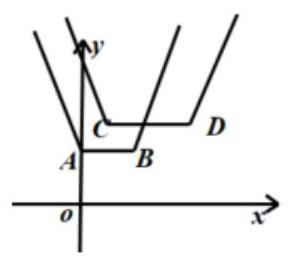

而 0 个交点和 2 个交点都是不可能的.

②假设有 0 个交点，

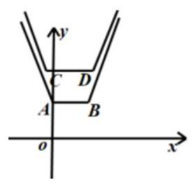

由题意 $\left| {k}_{AC}\right|  = \frac{\left| b - a - 1\right| }{\left| a\right| } > 2,\left| {k}_{BD}\right|  = \frac{\left| b - a - 1\right| }{\left| b - 1\right| } > 2,\therefore \frac{\left| a\right| }{\left| b - a - 1\right| } < \frac{1}{2},\frac{\left| b - 1\right| }{\left| b - a - 1\right| } < \frac{1}{2}$ , $\therefore \frac{\left| a\right| }{\left| b - a - 1\right| } + \frac{\left| b - 1\right| }{\left| b - a - 1\right| } < 1,$

而由三角不等式, $\frac{\left| a\right| }{\left| b - a - 1\right| } + \frac{\left| b - 1\right| }{\left| b - a - 1\right| } \geq  \frac{\left| b - a - 1\right| }{\left| b - a - 1\right| } = 1$ ,故矛盾, $\therefore$ 不可能有 0 个交点; ③假设有 2 个交点，

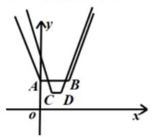

${k}_{AC} = \frac{b - a - 1}{a} \in  \left( {-2,0}\right) ,{k}_{BD} = \frac{b - a - 1}{b - 1} \in  \left( {0,2}\right) ,\therefore \frac{-a}{b - a - 1} > \frac{1}{2},\frac{b - 1}{b - a - 1} > \frac{1}{2}$ ,

$\therefore \frac{b - a - 1}{b - a - 1} > 1$ ,明显矛盾, $\therefore$ 不可能有 2 个交点.

其他 0 个交点和 2 个交点的情况均可化归为以上两类.

综上所述，解集 $\mathrm{A}$ 不是无限集时，集合 $\mathrm{A}$ 的元素个数只有 1 个. 故答案为: $\{ 1\}$ .

【例 3】研究汽车急刹车的停车距离对汽车刹车设计和路面交通管理非常重要, 急刹车停车距离受诸多因素影响,其中最为关键的两个因素是驾驶员的反应时间和汽车行驶速度,设 $d$ 表示停车距离, ${d}_{1}$ 表示反应距离, ${d}_{2}$ 表示制动距离,则 $d = {d}_{1} + {d}_{2}$ ,如图是根据美国公路局公布的实验数据制作的停车距离示意图. 图中指针所指的内圈数值表示对应的车速 $v\left( {\mathrm{\;{km}}/\mathrm{h}}\right)$ . 根据该图数据,建立停车距离与汽车速度的函数模型. 可选择模型①: $d = {av} + b$ . 模型②: $d = {av}^{2} + {bv}$ . 模型③: $d = {av} + \frac{b}{v}$ . 模型④: $d = {av}^{2} + \frac{b}{v}$ .(其中 $a, b$ 为待定参数) 进行拟合, 则拟合效果最好的函数模型是( )

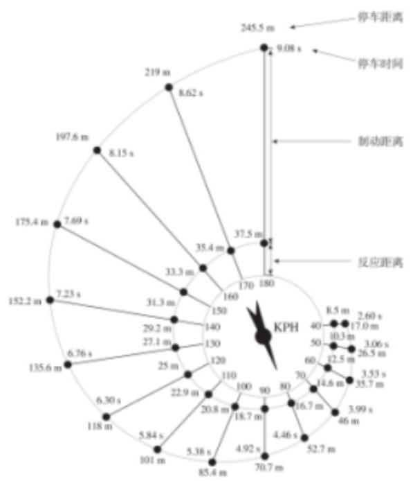

A. $d = {av} + b$ . B. $d = a{v}^{2} + {bv}$ .

C. $d = {av} + \frac{b}{v}$ . D. $d = a{v}^{2} + \frac{b}{v}$ .

【难度】★★★

【答案】B

【解析】分析图中数据可得,车速每增加 10 千米/小时,反应距离 ${d}_{1}$ 增加的数量大体不变,

且 $v = 0$ 时, ${d}_{1} = 0$ ,所以可拟合为 ${d}_{1} = {bv}$ ;

分析车速 $v$ 和制动距离 ${d}_{2}\left( {{d}_{2} = d - {d}_{1}}\right)$ 可得 $\frac{{d}_{2}}{{v}^{2}}$ 稳定在一个常量附近,且 $v = 0$ 时, ${d}_{2} = 0$ ,所以可拟合为 ${d}_{2} = a{v}^{2}$ ; 所以拟合效果最好的函数模型是 $d = a{v}^{2} + {bv}$ . 故选: B.

## 巩固训练

1、设 $x, y$ 为实数，且满足 $\left\{  \begin{array}{l} {\left( x - 1\right) }^{2017} + {2013}\left( {x - 1}\right)  =  - 1 \\  {\left( y - 1\right) }^{2017} + {2013}\left( {y - 1}\right)  = 1 \end{array}\right.$ ，则 $x + y =$ ___.

【答案】 2

【解析】方程组可化为 $\left\{  \begin{array}{l} {\left( x - 1\right) }^{2017} + {2013}\left( {x - 1}\right)  + 1 = 0 \\  {\left( 1 - y\right) }^{2017} + {2013}\left( {1 - y}\right)  + 1 = 0 \end{array}\right.$ ,

设 $f\left( t\right)  = {t}^{2017} + {2013t} + 1$ ,且 $f\left( t\right)  = {t}^{2017} + {2013t} + 1$ 为单调递增函数,

所以 $x - 1 = 1 - y$ ,则 $x + y = 2$ ,故答案为: 2

2、若 ${\sin }^{2018}\alpha  - {\left( 2 - \cos \beta \right) }^{1009} \geq  \left( {3 - \cos \beta  - {\cos }^{2}\alpha }\right) \left( {1 - \cos \beta  + {\cos }^{2}\alpha }\right)$ ,则 $\sin \left( {\alpha  + \frac{\beta }{2}}\right)  =$ ___.

【答案】 $\pm  1$

【解析】 ${\left( {\sin }^{2}\alpha \right) }^{1009} - {\left( 2 - \cos \beta \right) }^{1009} \geq  \left( {2 - \cos \beta  + {\sin }^{2}\alpha }\right) \left( {2 - \cos \beta  - {\sin }^{2}\alpha }\right)$

${\left( {\sin }^{2}\alpha \right) }^{1009} + {\left( {\sin }^{2}\alpha \right) }^{2} \geq  {\left( 2 - \cos \beta \right) }^{1009} + {\left( 2 - \cos \beta \right) }^{2},\because y = {x}^{1009} + {x}^{2}$ 在 $\lbrack 0, + \infty )$ 递增,

$\therefore {\sin }^{2}\alpha  \geq  2 - \cos \beta$ ,即 ${\sin }^{2}\alpha  + \cos \beta  \geq  2,\therefore {\sin }^{2}\alpha  = \cos \beta  = 1$ ,

$\therefore \alpha  = \frac{\pi }{2} + {m\pi },\beta  = {2n\pi },\therefore \sin \left( {\alpha  + \frac{\beta }{2}}\right)  =  \pm  1$

3、埃及金字塔是古埃及的帝王(法老)陵墓，世界七大奇迹之一，其中较为著名的是胡夫金字塔. 令人吃惊的并不仅仅是胡夫金字塔的雄壮身姿，还有发生在胡夫金字塔上的数字“巧合”. 如胡夫金字塔的底部周长如果除以其高度的两倍，得到的商为 3.14159，这就是圆周率较为精确的近似值. 金字塔底部形为正方形， 整个塔形为正四棱锥, 经古代能工巧匠建设完成后, 底座边长大约 230 米. 因年久风化, 顶端剥落 10 米, 则胡夫金字塔现高大约为( )

A. 128.5 米 B. 132.5 米 C. 136.5 米 D. 110.5 米

【答案】C

【解析】胡夫金字塔原高为 $h$ ,则 $\frac{{230} \times  4}{2h} = {3.14159}$ ,即 $h = \frac{{230} \times  4}{2 \times  {3.14159}} \approx  {146.4}$ 米, 则胡夫金字塔现高大约为 136.4 米. 故选 C.

4、众所周知，银行的运营方式一直是个谜，但去银行存款却又是一个十分实际的问题，所以理解清楚银行的运营方式对我们进入社会大展手脚是一个帮助. 某人拟去附近的一家银行存款，得知该银行对于数额非特别巨大的存款有如下两种存款方案(单次存款金额不得少于 100 元):

[方案一] 定期存款策略:固定存款年，年利率为 3%，存满一年后本金与利息作为下一年的本金继续实行存款策略. 若中途取出存款则会扣除全部利息并收取 5-50 元依本金数额而定的手续费(从存款中扣除)， 具体扣费措施见附表. 若一年内存在两次取出存款，则该人在这一年内将被计入不诚信档案. 当该人被计入不诚信档案后, 收取的手续费将增加至四倍.

[方案二]活期存款策略:年利率为1%，可以随时存取款并且不扣除利息以及手续费.

[手续费附表]

<table><tr><td>存款金额 $N$ 的范围/元</td><td>${100} \leq  N \leq  {1000}$</td><td>${1000} < N \leq  {7000}$</td><td>${7000} < N \leq  {10000}$</td><td>$> {10000}$</td></tr><tr><td>手续费/元</td><td>$5 \times  \left\lbrack  \frac{N}{500}\right\rbrack$</td><td>${10} + 5 \times  \left\lbrack  \frac{N - {1000}}{1000}\right\rbrack$</td><td>45</td><td>50</td></tr></table>

[补充内容] ①年利率是指，理论上存款一年后获得的利息(即银行通过利用存款人的存款资金进行理财而获得盈利后对存款人的账户相应地存入一定数额的报酬)与一年前的本金的比值. 若存款不满一年，获得的利息将按照存款时间与一年的比值乘以利率及本金来计算.

②注:[x]表示大于等于 $x$ 的最小整数. 如[3.4] = 4

则以下说法中正确的序号组合是( )

①若该人一年内选用定期存款存取同一笔钱共计扣除手续费 95 元，则他初始存入的金额小于 2020 元

②若该人一年内选用定期存款存取同一笔钱共计扣除手续费 95 元，则他初始存入的金额可能为 5000 元

③若该人要在一年后获得的利息最大，应选择方案一

④若该人要在一年后获得的利息最大，应选择方案二

A. ①③ B. ②④ C. ③ D. ④

【答案】D

【解答】解: 设该人初始存入的金额为 $N$ 元,

当 ${100} \leq  N \leq  {1000}$ 时,手续费 $y \leq  5 \times  \left\lbrack  \frac{1000}{500}\right\rbrack   = {10}$ ,

当 ${100} < N \leq  {7000}$ 时,手续费 $y \leq  {10} + {10} + 5 \times  \left\lbrack  \frac{{7000} - {1000}}{1000}\right\rbrack   = {50}$ ,

当 ${7000} < N \leq  {10000}$ 时,手续费 $y = {50} + {45} = {95}$ , $\therefore$ 命题①②错误;

由于定期存？的年利率比活期存款的年利率大,

若该人要在一年后获得的利息最大，应该选择方案二，二命题③错误，命题④正确. 故选: $D$ .

## (二)建立三角函数模型解决问题

## 例题精讲

【例 4】圣·索菲亚教堂(英语:SAINT SOPHIA CATHEDRAL)坐落于中国黑龙江省，是一座始建于 1907 年拜占庭风格的东正教教堂，距今已有 114 年的历史，为哈尔滨的标志性建筑. 1996 年经国务院批准，被列为第四批全国重点文物保护单位，是每一位到哈尔滨旅游的游客拍照打卡的必到景点其中央主体建筑集球, 圆柱, 棱柱于一体, 极具对称之美, 可以让游客从任何角度都能领略它的美. 小明同学为了估算索菲亚教堂的高度,在索菲亚教堂的正东方向找到一座建筑物 ${AB}$ ,高为 $\left( {{15}\sqrt{3} - {15}}\right) \mathrm{m}$ ,在它们之间的地面上的点 $M$ ( $B, M, D$ 三点共线) 处测得楼顶 A，教堂顶 $C$ 的仰角分别是 ${15}^{ \circ  }$ 和 ${60}^{ \circ  }$ ，在楼顶 A 处测得塔顶 $C$ 的仰角为 ${30}^{ \circ  }$ ，则小明估算索菲亚教堂的高度为( )

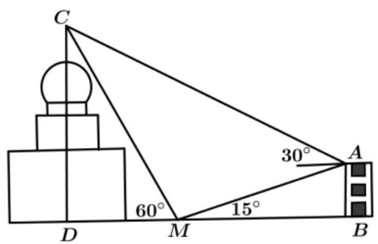

A. ${20}\mathrm{\;m}$ B. ${30}\mathrm{\;m}$ C. ${20}\sqrt{3}\mathrm{\;m}$ D. ${30}\sqrt{3}\mathrm{\;m}$

【难度】 $\star   \star   \star$

【答案】D

【解析】由题意知: $\angle {CAM} = {45}^{ \circ  },\angle {AMC} = {105}^{ \circ  }$ 所以 $\angle {ACM} = {30}^{ \circ  }$

在 $R{t}_{\bigtriangleup }{ABM}$ 中, ${AM} = \frac{AB}{\sin \angle {AMB}} = \frac{AB}{\sin {15}^{ \circ  }}$ ,

在 $\bigtriangleup {ACM}$ 中,由正弦定理得 $\frac{AM}{\sin {30}^{ \circ  }} = \frac{CM}{\sin {45}^{ \circ  }}$ 所以 ${CM} = \frac{{AM} \cdot  \sin {45}^{ \circ  }}{\sin {30}^{ \circ  }} = \frac{{AB} \cdot  \sin {45}^{ \circ  }}{\sin {15}^{ \circ  } \cdot  \sin {30}^{ \circ  }}$ ,

在 Rt $\bigtriangleup {DCM}$ 中, ${CD} = {CM} \cdot  \sin {60}^{ \circ  } = \frac{{AB} \cdot  \sin {45}^{ \circ  } \cdot  \sin {60}^{ \circ  }}{\sin {15}^{ \circ  } \cdot  \sin {30}^{ \circ  }} = \frac{\left( {{15}\sqrt{3} - {15}}\right)  \cdot  \frac{\sqrt{2}}{2} \cdot  \frac{\sqrt{3}}{2}}{\frac{\sqrt{6} - \sqrt{2}}{4} \cdot  \frac{1}{2}} = {30}\sqrt{3}$ ; 故选: D

【例 5】随着私家车的逐渐增多, 居民小区“停车难”问题日益突出. 本市某居民小区为缓解“停车难”问题, 拟建造地下停车库, 建筑设计师提供了该地下停车库的入口和进入后的直角转弯处的平面设计示意图.

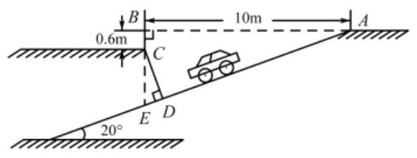

图1

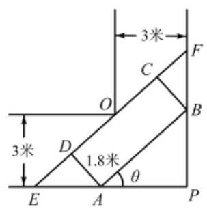

图2

(1)按规定，地下停车库坡道口上方要张贴限高标志，以便告知停车人车辆能否安全驶入，为标明限高， 请你根据该图 1 所示数据计:算限定高度 ${CD}$ 的值. (精确到 ${0.1}\mathrm{m}$ )(下列数据提供参考:

$\sin {20}^{ \circ  } = {0.3420},\cos {20}^{ \circ  } = {0.9397},\tan {20}^{ \circ  } = {0.3640}$ )

(2)在车库内有一条直角拐弯车道，车道的平面图如图 2 所示，车道宽为3米，现有一辆转动灵活的小汽车,其水平截面图为矩形 ${ABCD}$ ,它的宽 ${AD}$ 为 1.8 米,直线 ${CD}$ 与直角车道的外壁相交于 $E\text{ 、 }F$ .

①若小汽车卡在直角车道内(即点 $A$ 、 $B$ 分别在 ${PE}$ 、 ${PF}$ 上，点 $O$ 在 ${CD}$ 上) $\angle {PAB} = \theta$ (rad)，求水平截面的长(即 ${AB}$ 的长,用 $\theta$ 表示)

②若小汽车水平截面的长为 4.4 米，问此车是否能顺利通过此直角拐弯车道？

备注: 以下结论可能用到, 此题可以直接运用.

结论 $1\sin \theta  + \cos \theta  = \sqrt{2}\sin \left( {\theta  + \frac{\pi }{4}}\right)$ ;

结论 2 若函数 $f\left( x\right)$ 和函数 $g\left( x\right)$ 都在区间 $I$ 上单调递增,则函数 $f\left( x\right)  + g\left( x\right)$ 在区间 $I$ 上单调递增.

【难度】 $\star   \star   \star   \star$

【答案】(1)2.8m；(2)能顺利通过.

【解析】解: (1) 在 $\bigtriangleup {ABE}$ 中, $\angle {ABE} = {90}^{ \circ  },\angle {BAE} = {20}^{ \circ  },\therefore \tan \angle {BAE} = \frac{BE}{AB}$ ,

又 ${AB} = {10},\therefore {BE} = {AB} \cdot  \tan \angle {BAE} = {10}\tan {20}^{ \circ  } = {3.640}\mathrm{\;m}$ ,

$\because {BC} = {0.6},\therefore {CE} = {BE} - {BC} = {3.040}\mathrm{\;m}$ ,

在 $\bigtriangleup {CED}$ 中, $\because {CD} \bot  {AE},\angle {ECD} = \angle {BAE} = {20}^{ \circ  },\therefore \cos \angle {ECD} = \frac{CD}{CE}$ ,

则 ${CD} = {CE} \cdot  \cos \angle {ECD} = 3\cos {20}^{ \circ  } = {3.040} \times  {0.94} = {2.8576}\mathrm{\;m}$ ,

结合实际意义,四舍五入会使车辆卡住,可以使用去尾法, $\therefore$ 限定高度 ${CD}$ 的值约为 ${2.8}\mathrm{\;m}$ ;

(2)延长 ${CD}$ 与直角走廊的边相交于 $E$ 、 $F$ ，

则 ${EF} = {OE} + {OF} = \frac{3}{\cos \theta } + \frac{3}{\sin \theta }$ ,其中 $0 < \theta  < \frac{\pi }{2},\therefore {DE} = \frac{1.8}{\tan \theta },{CF} = {BC} \cdot  \tan \theta  = {1.8}\tan \theta$ ,

又 $\because {AB} = {DC} = {EF} - \left( {{DE} + {CF}}\right)$ ，设 ${AB} = f\left( \theta \right)$ ，

$\therefore f\left( \theta \right)  = \frac{3}{\cos \theta } + \frac{3}{\sin \theta } - {1.8}\left( {\tan \theta  + \frac{1}{\tan \theta }}\right)  = \frac{\left( {\sin \theta  + \cos \theta }\right)  - {1.8}}{\sin \theta \cos \theta }$ ,其中 $0 < \theta  < \frac{\pi }{2}$ ,

设 $\sin \theta  + \cos \theta  = t$ ,则 $t = \sqrt{2}\sin \left( {\theta  + \frac{\pi }{4}}\right) ,1 < t \leq  \sqrt{2},\therefore \sin \theta \cos \theta  = \frac{{t}^{2} - 1}{2}$ ,

$\therefore f\left( \theta \right)  = g\left( t\right)  = \frac{{6t} - {3.6}}{{t}^{2} - 1} = \frac{6\left( {t - \frac{3}{5}}\right) }{{t}^{2} - 1}$

$= \frac{6}{\frac{{t}^{2} - 1}{t - \frac{3}{5}}} = \frac{6}{\left( {t - \frac{3}{5}}\right)  - \frac{\frac{16}{25}}{t - \frac{3}{5}} + \frac{6}{5}}$ ,

$\because t \in  (1,\sqrt{2}\rbrack ,\therefore m = \left( {t - \frac{3}{5}}\right)  - \frac{\frac{16}{25}}{t - \frac{3}{5}} + \frac{6}{5}$ 单调递增,则 $g\left( t\right)  = \frac{{6t} - {3.6}}{{t}^{2} - 1}$ 在 $t \in  (1,\sqrt{2}\rbrack$ 上是减函数,

$\therefore g{\left( t\right) }_{\min } = g\left( \sqrt{2}\right)  = 6\sqrt{2} - {3.6} > {4.4},\therefore$ 小汽车能够顺利通过直角转弯车道.

## 巩固训练

1、如图，一个湖的边界是圆心为 $O$ 的圆，湖的一侧有一条直线型公路 $l$ ，湖上有桥 ${AB}$ ( ${AB}$ 是圆 $O$ 的直径). 规划在公路 $l$ 上选两个点 $P\text{ 、 }Q$ ,并修建两段直线型道路 ${PB}$ 、

${QA}$ . 规划要求: 线段 ${PB}\text{ 、 }{QA}$ 上的所有点到点 $O$ 的距离均不小于圆 $O$ 的半径. 已知点 $\mathrm{A}\text{ 、 }B$ 到直线 $l$ 的距离分别为 ${AC}$ 和 ${BD}$ ( $C\text{ 、 }D$ 为垂足),测得 ${AB} = {10},{AC} = 6,{BD} = {12}$ (单位: 百米).

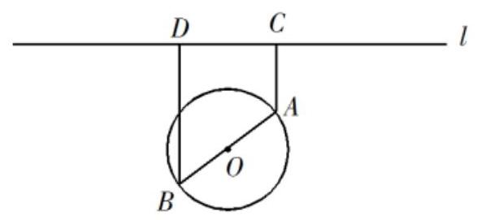

(1)若道路 ${PB}$ 与桥 ${AB}$ 垂直，求道路 ${PB}$ 的长；

(2)在规划要求下， $P$ 和 $Q$ 中能否有一个点选在 $D$ 处？并说明理由.

【答案】(1)15(百米)；(2)P 和 $Q$ 均不能选在 $D$ 处，理由见解析.

【解析】(1)过 $\mathrm{A}$ 作 ${AE} \bot  {BD}$ ,垂足为 $E$ .

由已知条件得,四边形 ${ACDE}$ 为矩形,则 ${DE} = {BE} = {AC} = 6,{AE} = {CD} = 8$ ,

$\because {PB} \bot  {AB},\therefore \cos \angle {PBD} = \cos \angle {BAE} = \frac{8}{10} = \frac{4}{5},\therefore {PB} = \frac{BD}{\cos \angle {PBD}} = \frac{12}{\frac{4}{5}} = {15}$ .

因此道路 ${PB}$ 的长为 15 (百米)；

(2)①若 $P$ 在 $D$ 处，由(1)可得 $E$ 在圆上，则线段 ${BE}$ 上的点(除 $B$ 、 $E$ )到点 $O$ 的距离均小于圆 $O$ 的半径, $\therefore P$ 在 $D$ 处不满足规划要求;

②若 $Q$ 在 $D$ 处,连接 ${AD}$ ,由 (1) 知 ${AD} = \sqrt{{AE}^{2} + {ED}^{2}} = {10}$ ,

从而 $\cos \angle {BAD} = \frac{A{D}^{2} + A{B}^{2} - B{D}^{2}}{{2AD} \cdot  {AB}} = \frac{7}{25} > 0$ ， $\therefore \angle {BAD}$ 为锐角.

$\therefore$ 线段 ${AD}$ 上存在点到点 $O$ 的距离小于圆 $O$ 的半径.

因此, $Q$ 选在 $D$ 处也不满足规划要求.

综上, $P$ 和 $Q$ 均不能选在 $D$ 处.

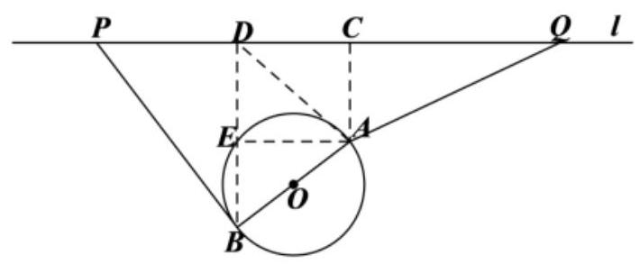

2、山顶有一座石塔 ${BC}$ ,已知石塔的高度为 $a$ .

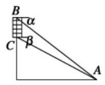

(1)

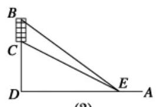

(2)

(1)如图(1)，若以 $B, C$ 为观测点，在塔顶 $B$ 处测得地面上一点 $A$ 的俯角为 $\alpha$ ，在塔底 $C$ 处测得 $A$ 处的俯角为 $\beta$ ,用 $a,\alpha ,\beta$ 表示山的高度 $h$ .

(2)如图(2)，若将观测点选在地面的直线 ${AD}$ 上，其中 $D$ 是塔顶 $B$ 在地面上的正投影. 已知石塔高度 $a = {20}$ ， 当观测点 $E$ 在 ${AD}$ 上满足 ${DE} = {60}\sqrt{10}$ 时，看 ${BC}$ 的视角(即 $\angle {BEC}$ )最大，求山的高度 $h$ .

【答案】( 1 ) $h = \frac{a\cos \alpha \sin \beta }{\sin \left( {\alpha  - \beta }\right) };\;$ (2) $h = {180}$ .

【解析】( 1 )解:在 $\bigtriangleup {ABC}$ 中， $\angle {ABC} = \alpha  - \beta ,\angle {BCA} = {90}^{ \circ  } + \beta$ ，

由正弦定理得: $\frac{BC}{\sin \angle {BAC}} = \frac{AB}{\sin \angle {BCA}}$ ，得 ${AB} = \frac{\alpha \sin \left( {{90}^{ \circ  } + \beta }\right) }{\sin \left( {\alpha  - \beta }\right) } = \frac{a\cos \beta }{\sin \left( {\alpha  - \beta }\right) }$ ，

则 $h = {AB} \cdot  \sin \alpha  - a = \frac{a\cos \beta \sin \alpha }{\sin \left( {\alpha  - \beta }\right) } - a = \frac{a\cos \alpha \sin \beta }{\sin \left( {\alpha  - \beta }\right) }$ ,

(2)设 ${DE} = x,\because \tan \angle {BED} = \frac{h + {20}}{h},\tan \angle {CED} = \frac{h}{x}$ ，

$\therefore \tan \angle {BEC} = \tan \left( {\angle {BED} - \angle {CED}}\right)  = \frac{\tan \angle {BED} - \tan \angle {CED}}{1 + \tan \angle {BED} \cdot  \tan \angle {CED}}$ ，

$= \frac{\frac{20}{x}}{1 + \frac{\left( {h + {20}}\right) h}{{x}^{2}}} = \frac{20}{x + \frac{h\left( {h + {20}}\right) }{x}} \leq  \frac{10}{\sqrt{h\left( {h + {20}}\right) }}$ ,当且仅当 $x = \frac{\left( {h + {20}}\right) h}{x}$ ,

即 $x = \sqrt{h\left( {h + {20}}\right) }$ 时, $\tan \angle {BEC}$ 最大,从而 $\angle {BEC}$ 最大,

由题意, $\sqrt{h\left( {h + {20}}\right) } = {60}\sqrt{10}$ ,解得 $h = {180}$ .

## (三)建立数列模型解决问题

【例 6】数列 $\left\{  {a}_{n}\right\}$ 中的项按顺序可以排列成如图的形式,第一行 1 项,排 ${a}_{1}$ ; 第二行 2 项,从左到右分别排 ${a}_{2},{a}_{3}$ ; 第三行 3 项……以此类推,设数列 $\left\{  {a}_{n}\right\}$ 的前 $n$ 项和为 ${S}_{n}$ ,则满足 ${S}_{n} > {1000}$ 的最小正整数 $n$ 的值为( )

4,

4, 4×3,

4, $4 \times  3,4 \times  {3}^{2}$ ,

4, $4 \times  3,4 \times  {3}^{2},4 \times  {3}^{3}$ ,

...

A. 22 B. 21 C. 20 D. 19

【难度】 $\star   \star   \star   \star$

【答案】C

【解析】第 $\mathrm{i}$ 行的和为 $\frac{4\left( {1 - {3}^{i}}\right) }{1 - 3} = 2\left( {{3}^{i} - 1}\right)$ ,

设满足 ${S}_{n} > {1000}$ 的最小正整数为 $n$ ,项 ${a}_{n}$ 在图中排在第 $\mathrm{i}$ 行第 $j$ 列 $\left( {i, j \in  {N}^{ * }\text{ 且 }j \leq  i}\right)$ ,

所以有 ${S}_{n} = 2\left( {3 - 1}\right)  + 2\left( {{3}^{2} - 1}\right)  + \ldots  + 2\left( {{3}^{i - 1} - 1}\right)  + 2\left( {{3}^{j} - 1}\right)$

$= 2\left( {3 + {3}^{2} + {3}^{3} + \ldots  + {3}^{i - 1}}\right)  - 2\left( {i - 1}\right)  + 2\left( {{3}^{j} - 1}\right)  = {3}^{i} - 3 - 2\left( {i - 1}\right)  + 2\left( {{3}^{j} - 1}\right)$

$= {3}^{i} + 2 \cdot  {3}^{j} - {2i} - 3 > {1000}$ ,则 $i \geq  6, j \geq  5$ ,

即图中从第 6 行第 5 列开始，和大于 1000 .

因为第 6 行第 5 列之前共有 $1 + 2 + 3 + 4 + 5 + 5 = {20}$ 项,所以最小正整数 $n$ 的值为 20 . 故选: C.

【例 7】首届世界低碳经济大会 11 月 17 日在南昌召开，本届大会的主题为“节能减排，绿色生态”. 某企业在国家科研部门的支持下，投资 810 万元生产并经营共享单车，第一年维护费为 10 万元，以后每年增加 20 万元，每年收入租金 300 万元.

(1)若扣除投资和各种维护费，则从第几年开始获取纯利润？

(2)若干年后企业为了投资其他项目，有两种处理方案:

①纯利润总和最大时，以 100 万元转让经营权；

②年平均利润最大时以 460 万元转让经营权，问哪种方案更优？

【难度】 $\star   \star   \star$

【答案】(1)从第 4 年开始获取纯利润; (2)方案②.

【解析】(1) 设第 $n$ 年获取利润为 $y$ 万元, $n$ 年共收入租金 ${300n}$ 万元,付出维护费构成一个以 10 为首项, 20 为公差的等差数列,其 ${10n} + \frac{n\left( {n - 1}\right) }{2} \times  {20} = {10}{n}^{2}$

因此利润 $y = {300n} - \left( {{810} + {10}{n}^{2}}\right)$

令 $y > 0$ ,解得: $3 < n < {27}$

所以从第 4 年开始获取纯利润.

(2)方案①:纯利润 $y = {300n} - \left( {{810} + {10}{n}^{2}}\right)  =  - {10}{\left( n - {15}\right) }^{2} + {1440}$

所以 15 年后共获利润: ${1440} + {100} = {1540}$ (万元)

方案②:年平均利润 $W = \frac{{300n} - \left( {{810} - {10}{n}^{2}}\right) }{n} = {300} - \left( {\frac{810}{n} + {10n}}\right)  \leq  {300} - 2\sqrt{\frac{810}{n} \times  {10n}} = {120}$

当且仅当 $\frac{810}{n} = {10n}$ ,即 $n = 9$ 时取等号,所以 9 年后共获利润: ${120} \times  9 + {460} = {1540}$ (万元)

综上: 两种方案获利一样多, 而方案②时间比较短, 所以选择方案②.

【例 8】某地出现了虫害，农业科学家引入了“虫害指数”数列 $\left\{  {I}_{n}\right\}$ ， $\left\{  {I}_{n}\right\}$ 表示第 $n$ 周的虫害的严重程度， 虫害指数越大，严重程度越高，为了治理虫害，需要环境整治、杀灭害虫，然而由于人力资源有限，每周只能采取以下两个策略之一:

策略A:环境整治，“虫害指数”数列满足 ${I}_{n + 1} = {1.02}{I}_{n} - {0.20}$ ;

策略 $B :$ 杀灭害虫，“虫害指数”数列满足 ${I}_{n + 1} = {1.08}{I}_{n} - {0.46}$ ；

当某周“虫害指数”小于 1 时, 危机就在这周解除.

(1)设第一周的虫害指数 ${I}_{1} \in  \left\lbrack  {1,8}\right\rbrack$ ，用哪一个策略将使第二周的虫害严重程度更小？

(2)设第一周的虫害指数 ${I}_{1} = 3$ ，如果每周都采用最优的策略，虫害的危机最快在第几周解除？

【难度】 $\star   \star   \star$

【答案】(1)答案不唯一, 具体见解析 (2) 虫害最快在第 9 周解除

【解析】(1)由题意可知,使用策略 $\mathrm{A}$ 时, ${I}_{2} = {1.02}{I}_{1} - {0.2}$ ; 使用策略 $B$ 时, ${I}_{2} = {1.08}{I}_{1} - {0.46}$

令 ${1.02}{I}_{1} - {0.20} - \left( {{1.08}{I}_{1} - {0.46}}\right)  > 0 \Rightarrow  {I}_{1} < \frac{13}{3}$ ,即当 ${I}_{1} \in  \left\lbrack  {1,\frac{13}{3}}\right)$ 时,使用策略 $B$ 第二周严重程度更小; 当 ${I}_{1} = \frac{13}{3}$ 时,使用两种策哈第二周严重程度一样; 当 ${I}_{1} \in  \left\lbrack  {\frac{13}{3},8}\right)$ 时,使用策略 $\mathrm{A}$ 第二周严重程度更小.

( 2 )由( 1 )可知，最优策略为策略 $B$ ，即 ${I}_{n + 1} = {1.08}{I}_{n} - {0.46},{I}_{n + 1} - \frac{23}{4} = {1.08}\left( {{I}_{n} - \frac{23}{4}}\right)$ ，所以数列 $\left\{  {{I}_{n} - \frac{23}{4}}\right\}$ 是以 $- \frac{11}{4}$ 为首项，1.08 为公比的等比数列,所以 ${I}_{n} - \frac{23}{4} = \left( {-\frac{11}{4}}\right)  \cdot  {1.08}^{n - 1}$ ,即 ${I}_{n} = \left( {-\frac{11}{4}}\right)  \cdot  {1.08}^{n - 1} + \frac{23}{4}$ ,令 ${I}_{n} < 1$ ,可得 $n \geq  9$ ,所以虫害最快在第 9 周解除.

## 巩固训练

1、如图，一个粒子从原点出发，在第一象限和两坐标轴正半轴上运动，在第一秒时它从原点运动到点 $\left( {0,1}\right)$ ， 接着它按图所示在 $x$ 轴、 $y$ 轴的垂直方向上来回运动，且每秒移动一个单位长度，那么，在 2018 秒时，这个粒子所处的位置在点___.

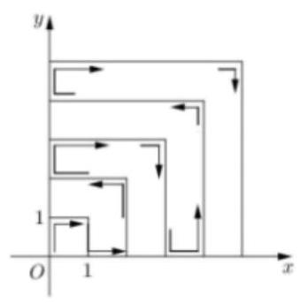

【答案】 $\left( {6,{44}}\right)$

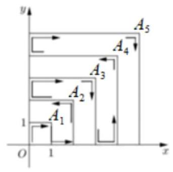

则 ${a}_{1} = 2,{a}_{2} = 6,{a}_{3} = {12},{a}_{4} = {20},\ldots ,{a}_{n} = {a}_{n - 1} = {2n}$ ,

将 ${a}_{2} - {a}_{1} = 2 \times  2,{a}_{3} - {a}_{2} = 2 \times  3,{a}_{4} - {a}_{3} = 2 \times  4,\ldots ,{a}_{n} - {a}_{n - 1} = {2n}$ 相加得: ${a}_{n} - {a}_{1} = 2\left( {2 + 3 + 4 + \ldots  + n}\right)  = {n}^{2} + n - 2$ ,则 ${a}_{n} = n\left( {n + 1}\right)$ , 由 ${44} \times  {45} = {1980}$ ,故运动了1980秒时它到点 ${A}_{44}\left( {{44},{44}}\right)$ ,

又由运动规律知: ${A}_{1},{A}_{2},\ldots ,{A}_{n}$ 中,奇数点处向下运动,偶数点处向左运动,

故粒子到达 ${A}_{44}\left( {{44},{44}}\right)$ 时向左运动 38 秒即运动了 2018 秒到达点 $\left( {6,{44}}\right)$ ，

则所求点应为 $\left( {6,{44}}\right)$ . 故答案为 $\left( {6,{44}}\right)$ .

2、2015 年推出一种新型家用轿车，购买时费用为 16.9 万元，每年应交付保险费、养路费及汽油费共 1.2 万元，汽车的维修费为:第一年无维修费用，第二年为0.2万元，从第三年起，每年的维修费均比上一年增加 0.2 万元.

(I) 设该辆轿车使用 $n$ 年的总费用(包括购买费用、保险费、养路费、汽油费及维修费)为 $f\left( n\right)$ ，求 $f\left( n\right)$ 的表达式;

(II) 这种汽车使用多少报废最合算(即该车使用多少年，年平均费用最少)？

【答案】(1) $f\left( n\right)  = {16.9} + {1.2n} + \left( {{0.1}{n}^{2} - {0.1n}}\right)  = {0.1}{n}^{2} + {1.1n} + {16.9}$ (万元).(2) 13 年报废最合算.

【解析】(I) 由题意得:每年的维修费构成一等差数列， $n$ 年的维修总费用为

$\frac{\left\lbrack  0 + {0.2}\left( n - 1\right) \right\rbrack  }{2}n = {0.1}{n}^{2} - {0.1n}$ (万元)

所以 $f\left( n\right)  = {16.9} + {1.2n} + \left( {{0.1}{n}^{2} - {0.1n}}\right)  = {0.1}{n}^{2} + {1.1n} + {16.9}$ (万元)

(II) 该辆轿车使用 $n$ 年的年平均费用为

$$
\frac{f\left( n\right) }{n} = \frac{{0.1}{n}^{2} + {1.1n} + {16.9}}{n}
$$

$$
= {0.1n} + {1.1} + \frac{16.9}{n} \geq  2\sqrt{{0.1n} \cdot  \frac{16.9}{n}} + {1.1}
$$

$= {3.7}$ (万元)

当且仅当 ${0.1n} = \frac{16.9}{n}$ 时取等号,此时 $n = {13}$

答: 这种汽车使用 13 年报废最合算.

## (四)建立其他模型解决问题

## 例题精讲

【例 9】在四面体 ${ABCD}$ 中,三组对棱棱长分别相等且依次为 $\sqrt{34},\sqrt{41},5$ ,则此四面体 ${ABCD}$ 的外接球的半径 $R$ 为___.

【难度】★★★

【答案】 $\frac{5\sqrt{2}}{2}$

【解答】解: $\because$ 四面体 ${ABCD}$ 中,三组对棱棱长分别相等,故可将其补充为一个三个面上对角线长分别为 $\sqrt{34},\sqrt{41},5$ ,的长方体,则其外接球的直径 ${2R} = \sqrt{\frac{1}{2}\left( {{34} + {41} + {25}}\right) } = 5\sqrt{2}$ ,则 $R = \frac{5\sqrt{2}}{2}$ ,故答案为: $\frac{5\sqrt{2}}{2}$

【例 10】如图是一个地铁站入口的双翼闸机，它的双翼展开时，双翼边缘的端点 $\mathrm{A}$ 与 $B$ 之间的距离为 ${16}\mathrm{\;{cm}}$ , 双翼的边缘 ${AC} = {BD} = {54}\mathrm{\;{cm}}$ ,且与闸机侧立面夹角 $\angle {PCA} = \angle {BQD} = {30}^{ \circ  }$ ,当双翼收起时,可以通过闸机的物体的最大宽度为___cm.

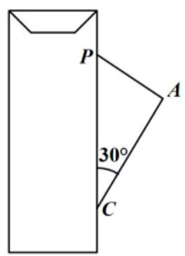

闸机箱

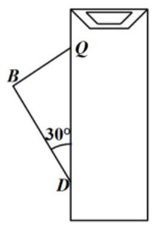

闸机箱

【难度】 $\star   \star   \star$

【答案】 70

【解析】

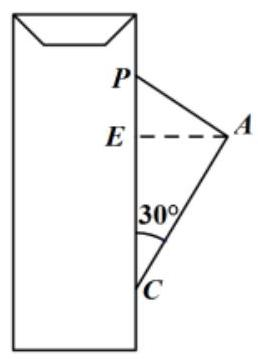

闸机箱

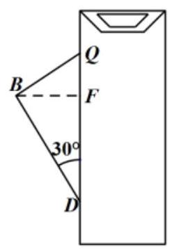

闸机箱

如图所示，过 $A$ 作 ${AE}\bot {CP}$ 于 $E$ ，过 $B$ 作 ${BF}\bot {DQ}$ 于 $F$ ，

则在 ${Rt}\bigtriangleup {ACE}$ 中, ${AE} = \frac{1}{2}{AC} = \frac{1}{2} \times  {54} = {27}\left( \mathrm{\;{cm}}\right)$ ,同理 ${BF} = {27}\left( \mathrm{\;{cm}}\right)$

又点 $\mathbf{A}$ 与 $\mathbf{B}$ 之间的距离为 ${16}\left( \mathrm{\;{cm}}\right)$ ,

$\therefore$ 通过闸机的物体的最大宽度为 ${27} + {16} + {27} = {70}\left( \mathrm{\;{cm}}\right)$ ，故答案为:70.

## 巩固训练

1、在三棱锥 $P - {ABC}$ 中，三条侧棱 ${PA},{PB},{PC}$ 两两垂直，且 ${PA} = {PB} = 3,{PC} = 4$ ，又 $M$ 是底面 ${ABC}$ 内一点,则 $M$ 到三个侧面的距离的平方和的最小值是___.

【答案】 $\frac{144}{41}$

【解答】解: 以 $P$ 为原点, ${PA}$ 为 $x$ 轴, ${PB}$ 为 $y$ 轴, ${PC}$ 为 $z$ 轴,

建立空间直角坐标系,由已知得 $A\left( {3,0,0}\right) , B\left( {0,3,0}\right) , C\left( {0,0,4}\right)$ ,

$\therefore$ 平面 ${ABC}$ 为: $\frac{1}{3}x + \frac{1}{3}y + \frac{1}{4}z = 1,\therefore 1 = {\left( \frac{1}{3}x + \frac{1}{3}y + \frac{1}{4}z\right) }^{2} \leq  \left\lbrack  {{\left( \frac{1}{3}\right) }^{2} + {\left( \frac{1}{3}\right) }^{2} + {\left( \frac{1}{4}\right) }^{2}}\right\rbrack  \left( {{x}^{2} + {y}^{2} + {z}^{2}}\right)$ ,

解得 ${x}^{2} + {y}^{2} + {z}^{2} \geq  \frac{144}{41}$ .

又 $M$ 是底面 ${ABC}$ 内一点, $\therefore M$ 到三棱锥三个侧面的距离的平方和的最小值是 $\frac{144}{41}$ . 故答案为: $\frac{144}{41}$ .

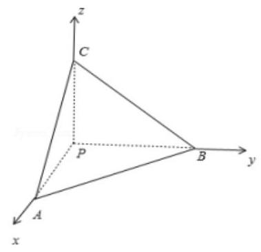
