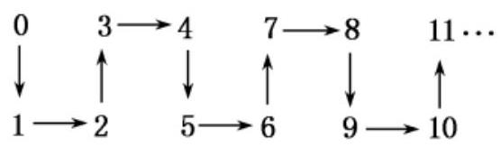
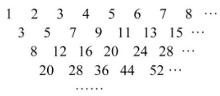
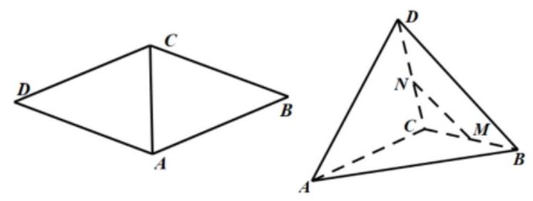
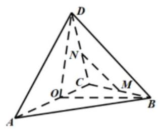
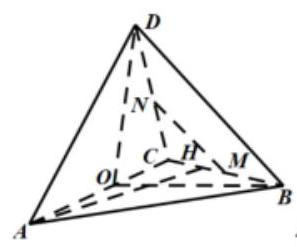
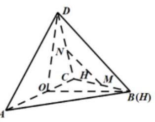
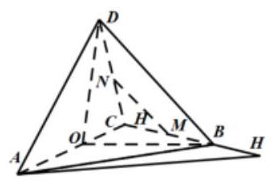

## 学习与探究型、论证与分析

<table><tr><td>教学目标</td><td>掌握推理与证明常见的四种方法</td></tr><tr><td>重点</td><td>选择恰当的方法解决推理与证明题</td></tr><tr><td>难 点</td><td>选择恰当的方法解决推理与证明题</td></tr></table>

## (一)合情推理、演绎推理

知识梳理

## 一、合情推理

1. 归纳推理是由部分到整体，由个别到一般的推理，在进行归纳时，要先根据已知的部分个体，把它们适当变形, 找出它们之间的联系, 从而归纳出一般结论;

2. 类比推理是由特殊到特殊的推理, 是两类类似的对象之间的推理, 其中一个对象具有某个性质, 则另一个对象也具有类似的性质。在进行类比时, 要充分考虑已知对象性质的推理过程, 然后类比推导类比对象的性质。

## 二、演绎推理

演绎推理是由一般到特殊的推理, 数学的证明过程主要是通过演绎推理进行的, 只要采用的演绎推理的大前提、小前提和推理形式是正确的，其结论一定是正确，一定要注意推理过程的正确性与完备性。

## 例题精讲

【例 1 】已知复数 $z$ 对应的点在复平面第一象限内，甲、乙、丙、丁四人对复数 $z$ 的陈述如下( i 为虚数单位): 甲: $z + \overline{z} = 2$ ； Z: $z - \bar{z} = 2\sqrt{3}i$ ； 丙: $z \cdot  \bar{z} = 4$ ；丁: $\frac{z}{\bar{z}} = \frac{{z}^{2}}{2}$ . 在甲、乙、丙、丁四人陈述中，有且只有两个人的陈述正确，则复数 $z =$ ___.

【难度】 $\star   \star   \star$

【答案】 $1 + i$

【解析】设 $z = a + {bi}\left( {a > 0, b > 0}\right)$ ,则 $\bar{z} = a - {bi}$ ,

$\therefore z + \bar{z} = {2a}, z - \bar{z} = {2bi}, z \cdot  \bar{z} = {a}^{2} + {b}^{2},\frac{z}{\bar{z}} = \frac{{z}^{2}}{{a}^{2} + {b}^{2}}$ .

$\because z \cdot  \bar{z} = 4$ 与 $\frac{z}{\bar{z}} = \frac{{z}^{2}}{2}$ 不可能同时成立, $\therefore$ 丙丁不能同时正确;

$\because z - \bar{z} = 2\sqrt{3}i$ 时, ${b}^{2} = 3 > 2,\therefore \frac{z}{\bar{z}} = \frac{{z}^{2}}{2}$ 不成立, $\therefore$ 乙丁不能同时正确;

当甲乙正确时: $a = 1, b = \sqrt{3}$ ,则丙也正确,不合题意;

当甲丙正确时: $a = 1, b = \sqrt{3}$ ,则乙也正确,不合题意;

当乙丙正确时: $b = \sqrt{3}, a = 1$ ,则甲也正确,不合题意;

$\therefore$ 甲丁陈述正确,此时 $a = b = 1,\therefore z = 1 + i$ . 故答案为: $1 + i$ .

【例 2】如图所示, $n$ 个连续自然数按规律排列如下:

根据规律，从 2014 到 2016 的箭头方向依次为( )

A. $\rightarrow   \uparrow$ B. $\uparrow   \rightarrow$

C. $\downarrow   \rightarrow$ D. $\rightarrow   \downarrow$

【难度】 $\star   \star   \star$

【答案】B

【解析】由题意可知箭头变化的周期为 $4,{2014} = {503} \times  4 + 2$ ,故从 2014 到 2016 的箭头方向与从 2 到 4 的箭头方向一致，依次为 $\uparrow   \rightarrow$ ；故选:B

【例 3】在等差数列 $\left\{  {a}_{n}\right\}$ 中,若 ${a}_{2020} = 0$ ,则有等式 ${a}_{1} + {a}_{2} + \cdots  + {a}_{n} = {a}_{1} + {a}_{2} + \cdots  + {a}_{{4039} - n}$ ( $n < {4039}$ 且 $n \in  {\mathbf{N}}^{ * }$ )成立，类比上述性质，在等比数列 $\left\{  {b}_{n}\right\}$ 中，若 ${b}_{2021} = 1$ ，则有( )

A. ${b}_{1} \cdot  {b}_{2}\cdots  \cdot  {b}_{n} = {b}_{1} \cdot  {b}_{2}\cdots \cdots {b}_{{4041} - n}\;\left( {n < {4041}\text{ 且 }n \in  {\mathbf{N}}^{ * }}\right)$

B. ${b}_{1} \cdot  {b}_{2}\cdots  \cdot  {b}_{n} = {b}_{1} \cdot  {b}_{2}\cdots  \cdot  {b}_{{4040} - n}\left( {n < {4040}\text{ 且 }n \in  {\mathbf{N}}^{ * }}\right)$

C. ${b}_{1} + {b}_{2} + \cdots  + {b}_{n} = {b}_{1} + {b}_{2} + \cdots  + {b}_{{4041} - n}\left( {n < {4041}\text{ 且 }n \in  {\mathbf{N}}^{ * }}\right)$

D. ${b}_{1} + {b}_{2} + \cdots  + {b}_{n} = {b}_{1} + {b}_{2} + \cdots  + {b}_{{4040} - n}\;\left( {n < {4040}\text{ 且 }n \in  {\mathbf{N}}^{ * }}\right)$

【难度】 $\star   \star   \star$

【答案】A

【解析】在等差数列 $\left\{  {a}_{n}\right\}$ 中,有 ${a}_{n + 1} + {a}_{{4039} - n} = 2{a}_{2020} = 0$ ,所以有 ${a}_{1} + {a}_{2} + \cdots  + {a}_{n} = {a}_{1} + {a}_{2} + \cdots  + {a}_{{4039} - n}$ 在等比数列 $\left\{  {b}_{n}\right\}$ 中,若 ${b}_{2021} = 1$ ,则 ${b}_{n + 1} + {b}_{{4041} - n} = {b}_{2021}{}^{2} = 1$

当 $n \leq  {2020}$ 时,则 ${4041} - n > n$ ,则 ${b}_{n + 1}\cdots \cdots {b}_{{4041} - n} = 1$

${b}_{1} \cdot  {b}_{2}\cdots \cdots {b}_{{4041} - n} = {b}_{1} \cdot  {b}_{2}\cdots \cdots {b}_{n} \cdot  {b}_{n + 1}\cdots \cdots {b}_{{4041} - n} = {b}_{1} \cdot  {b}_{2}\cdots \cdots {b}_{n}$

当 $n \geq  {2021}$ 时,则 ${4041} - n < n$ ,则 ${b}_{{4041} - n + 1}\cdots \cdots {b}_{n} = 1$

${b}_{1} \cdot  {b}_{2}\cdots \cdots {b}_{n} = {b}_{1} \cdot  {b}_{2}\cdots \cdots {b}_{{4041} - n} \cdot  {b}_{{4041} - n + 1}\cdots \cdots {b}_{n} = {b}_{1} \cdot  {b}_{2}\cdots \cdots {b}_{{4041} - n}$

所以 ${b}_{1} \cdot  {b}_{2}\cdots {b}_{n} = {b}_{1} \cdot  {b}_{2}\cdots \cdots {b}_{{4041} - n}$ ; 故选: $\mathbf{A}$

## 巩固训练

1、某学习小组有甲、乙、丙、丁四位同学，某次数学测验有一位同学没有及格，当其他同学问及他们四人时，甲说:“没及格的在甲、丙、丁三人中”；乙说:“是丙没及格”；丙说:“是甲或乙没及格”；丁说:“乙说的是正确的”. 已知四人中有且只有两人的说法是正确的，则由此可推断未及格的同学是( )

A. 甲 B. 乙 C. 丙 D. 丁

【答案】A

【解析】注意到乙、丁说的同真或同假, 当同真时, 甲说的也真, 不成立, 故同假, 所以甲、丙说的同真, 故甲未及格.故选:A

2、我们把平面内与直线垂直的非零向量称为直线的法向量，在平面直角坐标系中，利用求动点轨迹方程的方法,可以求出过点 $A\left( {2, - 1}\right)$ ,且法向量为 $\overrightarrow{n} = \left( {-1,2}\right)$ 的直线 (点法式) 方程为 $- 1 \times  \left( {x - 2}\right)  + 2 \times  \left( {y + 1}\right)  = 0$ , 化简得 $x - {2y} - 4 = 0$ . 类比以上方法,在空间直角坐标系中,经过点 $B\left( {1, - 1, - 2}\right)$ ,且法向量为 $\overrightarrow{m} = \left( {1,2, - 1}\right)$ 的平面的方程为( )

A. $x + {2y} + z + 1 = 0$ B. $x - {2y} - z - 1 = 0$

C. $x + {2y} + z - 1 = 0$ D. $x + {2y} - z - 1 = 0$

【答案】D

【解析】类比平面中求动点轨迹方程的方法,在空间任取一点 $P\left( {x, y, z}\right)$ ,则 $\overrightarrow{BP} = \left( {x - 1, y + 1, z + 2}\right) \; \because$ 平面法向量为 $\overrightarrow{m} = \left( {1,2, - 1}\right)$ ,所求的平面方程为 $1 \times  \left( {x - 1}\right)  + 2 \times  \left( {y + 1}\right)  + \left( {-1}\right)  \times  \left( {z + 2}\right)  = 0$ ,

化简得 $x + {2y} - z - 1 = 0$ . 故选: D

3、如图数表，它的第一行数由正整数从小到大排列得到，此后下一行数由前一行每两个相邻的数的和写在这两个数正中间下方得到.依次类推,则该数表中,第 $n$ 行第 1 个数是___.

---

---

【答案】 $\left( {n + 1}\right)  \cdot  {2}^{n - 2}$ .

【解析】观察数表,得出每一行都成等差数列,且第 $n$ 行公差为 ${2}^{n - 1}$ ,

因此设第 $n$ 行第 1 个数是 ${a}_{n}$ ,则第 $n$ 行第 2 个数是 ${a}_{n} + {2}^{n - 1}$ ,

从而可得 ${a}_{n} = 2{a}_{n - 1} + {2}^{n - 2}$ ,从而 $\frac{{a}_{n}}{{2}^{n}} - \frac{{a}_{n - 1}}{{2}^{n - 1}} = \frac{1}{4}$ ,所以 $\left\{  \frac{{a}_{n}}{{2}^{n}}\right\}$ 是等差数列,公差为 $\frac{1}{4}$ ,

所以 $\frac{{a}_{n}}{{2}^{n}} = \frac{1}{2} + \frac{1}{4}\left( {n - 1}\right)  = \frac{n + 1}{4},{a}_{n} = \left( {n + 1}\right)  \cdot  {2}^{n - 2}$ . 故答案为: $\left( {n + 1}\right)  \cdot  {2}^{n - 2}$ .

4、两个数列 $\left\{  {\alpha }_{n}\right\}$ 、 $\left\{  {\beta }_{n}\right\}$ ，当 $\left\{  {\alpha }_{n}\right\}$ 和 $\left\{  {\beta }_{n}\right\}$ 同时在 $n = {n}_{0}$ 时取得相同的最大值，我们称 $\left\{  {\alpha }_{n}\right\}$ 与 $\left\{  {\beta }_{n}\right\}$ 具有性质 $P$ ,其中 $n \in  {\mathrm{N}}^{ * }$ .

(1)设 ${\left( 1 + x\right) }^{2022}$ 的二项展开式中 ${x}^{k}$ 的系数为 ${a}_{k}\left( {k = 0,1,2,3,\cdots ,{2022}}\right)$ ， $k \in  \mathrm{N}$ ，

记 ${a}_{0} = {c}_{1},{a}_{1} = {c}_{2},\cdots$ ,依次下去, ${a}_{2022} = {c}_{2023}$ ,组成的数列是 $\left\{  {c}_{n}\right\}$ ;

同样地, ${\left( x - \frac{1}{x}\right) }^{2022}$ 的二项展开式中 ${x}^{k}$ 的系数为 ${b}_{k}\left( {k = 0,1,2,3,\cdots ,{2022}}\right) , k \in  \mathrm{N}$ ,

记 ${b}_{0} = {d}_{1},{b}_{1} = {d}_{2},\cdots$ ,依次下去, ${b}_{2022} = {d}_{2023}$ ,组成的数列是 $\left\{  {d}_{n}\right\}$ ;

判别 $\left\{  {c}_{n}\right\}$ 与 $\left\{  {d}_{n}\right\}$ 是否具有性质 $P$ ,请说明理由;

( 2 )数列 $\left\{  {t - {dn}}\right\}$ 的前 $n$ 项和是 ${S}_{n}$ ，数列 $\left\{  {{1982} - {3}^{n}}\right\}$ 的前 $n$ 项和是 ${T}_{n}$ ，若 $\left\{  {S}_{n}\right\}$ 与 $\left\{  {T}_{n}\right\}$ 具有性质 $P$ ， ${d, t} \in  {\mathrm{N}}^{ * }$ ， 则这样的数列 $\{ t - {dn}\}$ 一共有多少个? 请说明理由;

(3)两个有限项数列 $\left\{  {a}_{n}\right\}$ 与 $\left\{  {b}_{n}\right\}$ 满足 ${a}_{n + 1} - {a}_{n} = \lambda \left( {{b}_{n + 1} - {b}_{n}}\right) , n \in  {\mathrm{N}}^{ * }$ ，且 ${a}_{1} = {b}_{1} = 0$ ，是否存在实数 $\lambda$ ， 使得 $\left\{  {a}_{n}\right\}$ 与 $\left\{  {b}_{n}\right\}$ 具有性质 $P$ ,请说明理由.

【答案】(1)不具有；(2)206；(3) $\lambda  = 1$ .

【解析】解: (1) 在 $\left\{  {c}_{n}\right\}$ 中, ${n}_{0} = {1012}$ 时, $\left\{  {c}_{n}\right\}$ 有最大值 ${C}_{2022}^{1011}$ ,

在 $\left\{  {d}_{n}\right\}$ 中, ${n}_{0} = {1011}$ 或时 ${n}_{0} = {1013}$ 或, $\left\{  {d}_{n}\right\}$ 有最大值 ${C}_{2022}^{1000}$ ,所以 $\left\{  {c}_{n}\right\}$ 与 $\left\{  {d}_{n}\right\}$ 不具有性质;

(2)令 ${b}_{n} = {1982} - {3}^{n}$ ，则 ${T}_{n} = {1982n} - \frac{3\left( {1 - {3}^{n}}\right) }{1 - 3} = {1982n} + \frac{3}{2} - \frac{3}{2} \cdot  {3}^{n}$

由 $\left\{  \begin{array}{l} {T}_{n} \geq  {T}_{n - 1} \\  {T}_{n} \geq  {T}_{n + 1} \end{array}\right.$ 即 $\left\{  \begin{array}{l} {1982n} + \frac{3}{2} - \frac{3}{2} \cdot  {3}^{n} \geq  {1982}\left( {n - 1}\right)  + \frac{3}{2} - \frac{3}{2} \cdot  {3}^{n - 1} \\  {1982n} + \frac{3}{2} - \frac{3}{2} \cdot  {3}^{n} \geq  {1982}\left( {n + 1}\right)  + \frac{3}{2} - \frac{3}{2} \cdot  {3}^{n + 1} \end{array}\right.$ 得 $\left\{  \begin{array}{l} {3}^{n} \leq  {1982} \\  {3}^{n + 1} \geq  {1982} \end{array}\right.$

所以 ${\log }_{3}\frac{1982}{3} \leq  n \leq  {\log }_{3}{1982}$ ,又 $n \geq  2, n \in  {N}^{ * }$ ,

所以 $n = 6$ 时, ${T}_{n\max } = {1982} \times  6 + \frac{3}{2} - \frac{3}{2} \cdot  {3}^{6} = {10800}$ ,所以 $\left\{  {S}_{n}\right\}$ 与 $\left\{  {T}_{n}\right\}$ 具有性质 $P$

所以 $n = 6$ 时, ${S}_{n\max } = {10800};{a}_{n} = t - {dn}\therefore t - {6d} > 0, t - {7d} < 0$

${a}_{n} = t - {dn}$ 是等差数列,所以 ${S}_{6} = \frac{\left( {t - d + t - {6d}}\right)  \times  6}{2} = {10800}$

$\left\{  {\begin{array}{l} t, d \in  {N}^{ * } \\  {2t} - {7d} = {3600} \\  {6d} < t < {7d} \end{array}\text{ 解出 }\left\{  {\begin{array}{l} t = {3606} \\  d = {516} \end{array},\left\{  {\begin{array}{l} t = {3613} \\  d = {518} \end{array}\ldots \left\{  {\begin{array}{l} t = {4313} \\  d = {718} \end{array}\text{ 一共 }{102}\text{ 个数列 }}\right. }\right. }\right. }\right.$

(3)因为 ${a}_{n + 1} - {a}_{n} = \lambda \left( {{b}_{n + 1} - {b}_{n}}\right) , n \in  {\mathrm{N}}^{ * }$ ，

当 $n \geq  2, n \in  {N}^{ * }$ 时, ${a}_{n} = \left( {{a}_{n} - {a}_{n - 1}}\right)  + \left( {{a}_{n - 1} - {a}_{n - 2}}\right)  + \cdots  + \left( {{a}_{2} - {a}_{1}}\right)  + {a}_{1}$

$= \lambda \left( {{b}_{n} - {b}_{n - 1}}\right)  + \lambda \left( {{b}_{n - 1} - {b}_{n - 2}}\right)  + \cdots  + \lambda \left( {{b}_{2} - {b}_{1}}\right)  + 0 = \lambda \left( {{b}_{n} - {b}_{1}}\right)  + 0 = \lambda {b}_{n},{a}_{n} = \lambda {b}_{n}$

当 $n = 1$ 时, ${a}_{1} = {b}_{1} = 0$ ,符合上式,所以 ${a}_{n} = \lambda {b}_{n}, n \in  {N}^{ * }$

因为 $\left\{  {a}_{n}\right\}$ 与 $\left\{  {b}_{n}\right\}$ 是有限项数列,所以一定存在最大值

假设 ${\left( {a}_{n}\right) }_{\max } = {a}_{{n}_{0}},{\left( {b}_{n}\right) }_{\max } = {b}_{{n}_{0}}$ 因为 $\left\{  {a}_{n}\right\}$ 与 $\left\{  {b}_{n}\right\}$ 具有性质 $P$ ,所以 ${n}_{0} = {n}_{0}\prime ,\therefore {a}_{{n}_{0}} = {b}_{{n}_{0}}$

$\lambda  = 1$ 时显然成立; 假设 $\lambda  > 1$ ,则显然 ${\left( {a}_{n}\right) }_{\max } = {a}_{{n}_{0}}{\left( {b}_{n}\right) }_{\max } = {b}_{{n}_{0}}{a}_{{n}_{0}} = \lambda {b}_{{n}_{0}} > {b}_{{n}_{0}}$ 产生矛盾,

同法 $\lambda  < 1$ ,也产生矛盾,所以 $\lambda  = 1$

## (二)直接法、间接法

## 知识梳理

直接证明是相对于间接证明说的，综合法和分析法是两种常见的直接证明。综合法一般地，利用已知条件和某些数学定义、定理、公理等, 经过一系列的推理论证, 最后推导出所要证明的结论成立, 这种证明方法叫做综合法(或顺推证法、由因导果法)。分析法一般地，从要证明的结论出发，逐步寻求使它成立的充分条件, 直至最后, 把要证明的结论归结为判定一个明显成立的条件 (已知条件、定理、定义、公理等)为止，这种证明方法叫做分析法。

间接证明是相对于直接证明说的, 反证法是间接证明常用的方法。假设原命题不成立, 经过正确的推理, 最后得出矛盾, 因此说明假设错误, 从而证明原命题成立, 这种证明方法叫做反证法。

要练说, 得练看。看与说是统一的, 看不准就难以说得好。练看, 就是训练幼儿的观察能力, 扩大幼儿的认知范围，让幼儿在观察事物、观察生活、观察自然的活动中，积累词汇、理解词义、发展语言。在运用观察法组织活动时，我着眼观察于观察对象的选择，着力于观察过程的指导，着重于幼儿观察能力和语言表达能力的提高。

要练说, 得练看。看与说是统一的, 看不准就难以说得好。练看, 就是训练幼儿的观察能力, 扩大幼儿的认知范围，让幼儿在观察事物、观察生活、观察自然的活动中，积累词汇、理解词义、发展语言。在运用观察法组织活动时，我着眼观察于观察对象的选择，着力于观察过程的指导，着重于幼儿观察能力和语言表达能力的提高。

## 例题精讲

【例 4】设 $a\text{ 、 }b \in  R$ ,则 “ ${ab} \neq  0$ ” 是 “ $\frac{\left| a + b\right| }{\left| a\right|  + \left| b\right| } \leq  1$ ” 成立的( )条件.

A. 充分非必要 B. 必要非充分 C. 充分且必要 D. 非充分非必要

【难度】 $\star   \star   \star$

【答案】A

【解析】 $\frac{\left| a + b\right| }{\left| a\right|  + \left| b\right| } \leq  1 \Leftrightarrow  \frac{{a}^{2} + {b}^{2} + {2ab}}{{a}^{2} + {b}^{2} + 2\left| {ab}\right| } \leq  1 \Leftrightarrow  \left\{  {\begin{array}{l} \left| a\right|  + \left| b\right|  \neq  0 \\  \left| {ab}\right|  \geq  {ab} \end{array} \Leftrightarrow  \left| a\right|  + \left| b\right|  \neq  0}\right.$

所以 ${ab} \neq  0$ 成立时 $\left| a\right|  + \left| b\right|  \neq  0$ 成立,即 $\frac{\left| a + b\right| }{\left| a\right|  + \left| b\right| } \leq  1$ 成立, $a = 0, b = 1$ 时 $\frac{\left| a + b\right| }{\left| a\right|  + \left| b\right| } \leq  1$ 成立 ${ab} \neq  0$ 不成立,“ ${ab} \neq  0$ ” 是“ $\frac{\left| a + b\right| }{\left| a\right|  + \left| b\right| } \leq  1$ ”成立的充分非必要条件. 故选: A

【例 5】在发生某公共卫生事件期间、有专业机构认为该事件在一段时间没有发生在规模群体感染的标志为 “连续 14 天，每天新增疑似病例不超过 6 人”. 根据过去 14 天甲、乙、丙、丁四地新增疑似病例数据，一定符合该标志的是( )

A. 甲地:总体均值为 1 ，中位数为 1 B. 乙地:总体均值为 1 ，总体标准差大于 0

C. 丙地:中位数为 1 ，众数为 2 D. 丁地:总体均值为 2 ，总体方差为 1

【难度】 $\star   \star   \star$

【答案】D

【解析】对于 $\mathrm{A}$ 选项，反例:0、0、0、0、0、0、1、1、1、1、1、1、1、1、7，满足中位数为 1，均值为 1， 与题意矛盾, A 选项不合乎题意;

对于 $\mathrm{B}$ 选项，反例:0、0、0、0、0、0、1、1、1、1、1、1、1、1、7，满足均值为 1，方差大于 0，标准差大于 0 ，与题意矛盾， $\mathrm{B}$ 选项不合乎题意；

对于 $\mathrm{C}$ 选项,反例: $0\text{ 、 }0\text{ 、 }0\text{ 、 }0\text{ 、 }0\text{ 、 }0\text{ 、 }1\text{ 、 }1\text{ 、 }2\text{ 、 }2\text{ 、 }2\text{ 、 }2\text{ 、 }2\text{ 、 }7$  ， ,满足中位数为 1,众数为 2,与题意矛盾, $\mathrm{C}$ 选项不合乎要求;

对于 D 选项，将 14 个数由小到大依次记为:

${x}_{1}\text{ 、 }{x}_{2}\text{ 、 }{x}_{3}\text{ 、 }{x}_{4}\text{ 、 }{x}_{5}\text{ 、 }{x}_{6}\text{ 、 }{x}_{7}\text{ 、 }{x}_{8}\text{ 、 }{x}_{9}\text{ 、 }{x}_{10},{x}_{11}\text{ 、 }{x}_{12}\text{ 、 }{x}_{13}\text{ 、 }{x}_{14}$ ,

假设 ${x}_{14} \geq  6$ ,若均值为 2,则方差为 ${s}^{2} = \frac{\mathop{\sum }\limits_{{i = 1}}^{{14}}{\left( {x}_{i} - 2\right) }^{2}}{14} \geq  \frac{{\left( {x}_{14} - 2\right) }^{2}}{14} \geq  \frac{{\left( 6 - 2\right) }^{2}}{14} = \frac{16}{14} > 1$ ,与总体方差为 1 矛盾,故 ${x}_{14} < 6$ ,假设不成立,故丁地没有发生规模群体感染, $\mathrm{D}$ 选项合乎要求. 故选: $\mathrm{D}$ .

【例 6】用 $\left\lbrack  x\right\rbrack$ 表示一个小于或等于 $x$ 的最大整数. 如: $\left\lbrack  2\right\rbrack   = 2,\left\lbrack  {4.1}\right\rbrack   = 4,\left\lbrack  {-{3.1}}\right\rbrack   =  - 4$ . 已知实数列 ${a}_{0}\text{ 、 }{a}_{1}$ 、 ...对于所有非负整数i 满足 ${a}_{i + 1} = \left\lbrack  {a}_{i}\right\rbrack   \cdot  \left( {{a}_{i} - \left\lbrack  {a}_{i}\right\rbrack  }\right)$ ,其中 ${a}_{0}$ 是任意一个非零实数.

(I) 若 ${a}_{0} =  - {2.6}$ ,写出 ${a}_{1}\text{ 、 }{a}_{2}\text{ 、 }{a}_{3}$ ;

(II) 若 ${a}_{0} > 0$ ，求数列 $\left\{  \left\lbrack  {a}_{i}\right\rbrack  \right\}$ 的最小值；

(III) 证明: 存在非负整数 $k$ ,使得当 $i \geq  k$ 时, ${a}_{i} = {a}_{i + 2}$ .

【难度】 $\star   \star   \star   \star$

【答案】(I) ${a}_{1} =  - {1.2},{a}_{2} =  - {1.6},{a}_{3} =  - {0.8}$ ; (II) 最小值为 0 ; (III) 见解析.

【解析】(I) $\because {a}_{0} =  - {2.6},\therefore {a}_{1} = \left\lbrack  {a}_{0}\right\rbrack   \cdot  \left( {{a}_{0} - \left\lbrack  {a}_{0}\right\rbrack  }\right)  =  - 3 \times  \left( {-{2.6} + 3}\right)  =  - {1.2}$ ,

同理可得: ${a}_{2} =  - {1.6},{a}_{3} =  - {0.8}$ ;

(II) 因 ${a}_{0} > 0$ ,则 $\left\lbrack  {a}_{0}\right\rbrack   \geq  0$ ,所以 ${a}_{1} = \left\lbrack  {a}_{0}\right\rbrack  \left( {{a}_{0} - \left\lbrack  {a}_{0}\right\rbrack  }\right)  \geq  0$ ,

设 $\left\lbrack  {a}_{i}\right\rbrack   \geq  0, i \geq  1$ ,则 ${a}_{i + 1} = \left\lbrack  {a}_{i}\right\rbrack  \left( {{a}_{i} - \left\lbrack  {a}_{i}\right\rbrack  }\right)  \geq  0$ ,所以 $\left\lbrack  {a}_{i}\right\rbrack   \geq  0,\forall i \geq  0$ .

又因 $0 \leq  {a}_{i} - \left\lbrack  {a}_{i}\right\rbrack   < 1$ ,则 ${a}_{i + 1} = \left\lbrack  {a}_{i}\right\rbrack  \left( {{a}_{i} - \left\lbrack  {a}_{i}\right\rbrack  }\right)  \leq  \left\lbrack  {a}_{i}\right\rbrack$ ,则 $\left\lbrack  {a}_{i + 1}\right\rbrack   \leq  \left\lbrack  {a}_{i}\right\rbrack$ , $\forall i \geq  0$ .

假设 $\forall i \geq  0$ ,都有 $\left\lbrack  {a}_{i}\right\rbrack   > 0$ 成立,则 ${a}_{i + 1} = \left\lbrack  {a}_{i}\right\rbrack  \left( {{a}_{i} - \left\lbrack  {a}_{i}\right\rbrack  }\right)  < \left\lbrack  {a}_{i}\right\rbrack$ ,

则 $\left\lbrack  {a}_{i + 1}\right\rbrack   < \left\lbrack  {a}_{i}\right\rbrack  ,\;\forall i \geq  0$ ,即 $\left\lbrack  {a}_{i + 1}\right\rbrack   \leq  \left\lbrack  {a}_{i}\right\rbrack   - 1,\;\forall i \geq  0$ ,

则 $\left\lbrack  {a}_{n}\right\rbrack   \leq  \left\lbrack  {a}_{0}\right\rbrack   - n,\forall n \geq  1$ ,则当 $n \geq  \left\lbrack  {a}_{0}\right\rbrack$ 时, $\left\lbrack  {a}_{n}\right\rbrack   \leq  0$ ,

这与假设矛盾,所以 $\left\lbrack  {a}_{i}\right\rbrack   > 0,\forall i \geq  0$ 不成立,

即存在 $k \in  \mathbf{N},\left\lbrack  {a}_{k}\right\rbrack   = 0$ ,从而 $\left\{  \left\lbrack  {a}_{i}\right\rbrack  \right\}$ 的最小值为 0 ;

(III) 当 ${a}_{0} > 0$ 时,由 (II) 知,存在 $k \in  \mathbf{N},\left\lbrack  {a}_{k}\right\rbrack   = 0$ ,

所以 ${a}_{k + 1} = 0$ ,所以 $\left\lbrack  {a}_{k + 1}\right\rbrack   = 0$ ,所以 ${a}_{i} = 0,\forall i \geq  k$ ,成立.

当 ${a}_{0} < 0$ 时,若存在 $k \in  \mathbf{N},{a}_{k} = 0$ ,则 ${a}_{i} = 0,\forall i \geq  k$ ,得证;

若 ${a}_{i} < 0,\forall i \geq  0$ ,则 $\left\lbrack  {a}_{i}\right\rbrack   \leq   - 1$ ,则 ${a}_{i + 1} = \left\lbrack  {a}_{i}\right\rbrack  \left( {{a}_{i} - \left\lbrack  {a}_{i}\right\rbrack  }\right)  > \left\lbrack  {a}_{i}\right\rbrack$ ,

则 $\left\lbrack  {a}_{i + 1}\right\rbrack   \geq  \left\lbrack  {a}_{i}\right\rbrack  ,\;\forall i \geq  0$ ,所以数列 $\left\{  \left\lbrack  {a}_{i}\right\rbrack  \right\}$ 单调不减.

由于 $\left\lbrack  {a}_{i}\right\rbrack$ 是负整数,所以存在整数 $\mathrm{m}$ 和负整数 $\mathrm{c}$ ,使得当 $i \geq  m$ 时, $\left\lbrack  {a}_{i}\right\rbrack   = c$ .

所以,当 $i \geq  m$ 时, ${a}_{i + 1} = c\left( {{a}_{i} - c}\right)$ ,则 ${a}_{i + 1} - \frac{{c}^{2}}{c - 1} = c\left( {{a}_{i} - \frac{{c}^{2}}{c - 1}}\right)$ ,令 ${b}_{i} = {a}_{i} - \frac{{c}^{2}}{c - 1}$ ,即 ${b}_{i + 1} = c{b}_{i}, i \geq  m$ . 当 ${b}_{m} = 0$ 时,则 ${b}_{i} = 0, i \geq  m$ ,则 ${a}_{i} = \frac{{c}^{2}}{c - 1}, i \geq  m$ ,得证.

当 ${b}_{m} \neq  0$ 时， ${b}_{i} \neq  0$ ， $i \geq  m$ ， ${b}_{i} = {c}^{i - m}{b}_{m}$ ， $i \geq  m$ ，

因当 $i \geq  m$ 时， $\left\lbrack  {a}_{i}\right\rbrack   = c$ ，则 ${a}_{i} \in  \lbrack c, c + 1)$ ，则 $\left\{  {b}_{i}\right\}$ 有界，所以 $\left| c\right|  \leq  1$ ，所以负整数 $c =  - 1$ . $\therefore {a}_{i} =  - \frac{1}{2} + {\left( -1\right) }^{i - m}{b}_{m} =  - \frac{1}{2} + {\left( -1\right) }^{i - m}\left( {{a}_{m} + \frac{1}{2}}\right) \left( {i \geq  m}\right)$ ,则 ${a}_{i} = \left\{  \begin{array}{l} {a}_{m}, i = m, m + 2, m + 4,\cdots \\   - 1 - {a}_{m}, i = m + 1, m + 3,\cdots  \end{array}\right.$ 令 $k = m$ ,满足当 $i \geq  k$ 时, ${a}_{i} = {a}_{i + 2}$ . 综上,存在非负整数 $k$ ,使得当 $i \geq  k$ 时, ${a}_{i} = {a}_{i + 2}$ .

## 巩固训练

1、某同学准备用反证法证明如下一个问题: 函数 $f\left( x\right)$ 在 $\left\lbrack  {0,1}\right\rbrack$ 上有意义,且 $f\left( 0\right)  = f\left( 1\right)$ ,如果对于不同的 ${x}_{1}\text{ 、 }{x}_{2} \in  \left\lbrack  {0,1}\right\rbrack$ ,都有 $\left| {f\left( {x}_{1}\right)  - f\left( {x}_{2}\right) }\right|  < \left| {{x}_{1} - {x}_{2}}\right|$ ,求证: $\left| {f\left( {x}_{1}\right)  - f\left( {x}_{2}\right) }\right|  < \frac{1}{2}$ . 那么他的反设应该是 ___.

【答案】“存在 ${x}_{1}\text{ 、 }{x}_{2} \in  \left\lbrack  {0,1}\right\rbrack$ ,使得 $\left| {f\left( {x}_{1}\right)  - f\left( {x}_{2}\right) }\right|  < \left| {{x}_{1} - {x}_{2}}\right|$ ,则 $\left| {f\left( {x}_{1}\right)  - f\left( {x}_{2}\right) }\right|  \geq  \frac{1}{2}$ ”.

【解析】根据反证法的原理可知,该同学所做的反设应该是: “存在 ${x}_{1}\text{ 、 }{x}_{2} \in  \left\lbrack  {0,1}\right\rbrack$ ,使得 $\left| {f\left( {x}_{1}\right)  - f\left( {x}_{2}\right) }\right|  < \left| {{x}_{1} - {x}_{2}}\right|$ ,则 $\left| {f\left( {x}_{1}\right)  - f\left( {x}_{2}\right) }\right|  \geq  \frac{1}{2}$ ”. 故答案为: “存在 ${x}_{1}\text{ 、 }{x}_{2} \in  \left\lbrack  {0,1}\right\rbrack$ ,使得 $\left| {f\left( {x}_{1}\right)  - f\left( {x}_{2}\right) }\right|  < \left| {{x}_{1} - {x}_{2}}\right|$ ,则 $\left| {f\left( {x}_{1}\right)  - f\left( {x}_{2}\right) }\right|  \geq  \frac{1}{2}$ ”.

2、 $M$ ， $N$ 分别为菱形 ${ABCD}$ 的边 ${BC}$ ， ${CD}$ 的中点，将菱形沿对角线 ${AC}$ 折起，使点 $D$ 不在平面 ${ABC}$ 内，则在翻折过程中，下列选项错误的个数是( )

①异面直线 ${AC}$ 与 ${MN}$ 所成的角为定值；

② ${MN}//$ 平面 ${ABD}$ ；

③若存在某个位置,使得直线 ${AD}$ 与直线 ${BC}$ 垂直,则 $\angle {ABC}$ 的取值范围是 $\left( {0,\frac{\pi }{2}}\right)$ ;

A. 0 B. 1 C. 2 D. 3

【答案】A

【解析】对于①，取 ${AC}$ 的中点 $O$ ，连接 ${DO},{BO}$ ，作图如下:

则 ${AC} \bot  {DO},{AC} \bot  {BO},{BO} \cap  {DO} = O$ ,

由线面垂直的判定知, ${AC} \bot$ 平面 ${BOD}$ ,

所以 ${AC} \bot  {BD}$ ，

又因为 ${MN}//{BD}$ ，所以 ${AC}\bot {MN}$ ，

即异面直线 ${AC}$ 与 ${MN}$ 所成的角为定值 ${90}^{ \circ  }$ ，则①正确；

对于②，因为 $M$ ， $N$ 分别为菱形 ${ABCD}$ 的边 ${BC}$ ， ${CD}$ 的中点，

所以 ${MN}$ 为 $\bigtriangleup  {BCD}$ 的中位线， ${MN}//{BD}$ ，

又因为 ${MN} \text{ ⊄ }$ 平面 ${ABD},{BD} \subset$ 平面 ${ABD}$ ,

所以 ${MN}//$ 平面 ${ABD}$ ,则②也正确；

对于③，过 $\mathrm{A}$ 作 ${AH} \bot  {BC}$ ，垂足为 $H$ ，

若 $\angle {ABC}$ 为锐角， $H$ 在线段 ${CB}$ 上，如图 1

若 $\angle {ABC}$ 为直角， $H$ 与 $B$ 重合，如图 2

若 $\angle {ABC}$ 为钝角， $H$ 在线段 ${CB}$ 的延长线上，如图 3

图 1

图 2

图 3

若存在某个位置,使得直线 ${AD}$ 与直线 ${BC}$ 垂直,

因为 ${AH} \bot  {BC}$ ,所以 ${CB} \bot$ 平面 ${AHD}$ ,

由线面垂直的性质知, ${CB} \bot  {HD}$ ,

若 $\angle {ABC}$ 为直角, $H$ 与 $B$ 重合,所以 ${CB} \bot  {BD}$ ,

在 ${\Delta CBD}$ 中,因为 ${CB} = {CD}$ ,

所以 ${CB}\bot {BD}$ 不可能成立，即 $\angle {ABC}$ 为直角不可能成立;

若 $\angle {ABC}$ 为钝角， $H$ 在线段 ${BC}$ 的延长线上，

则在原平面图菱形 ${ABCD}$ 中, $\angle {DCB}$ 为锐角,

由于立体图中 ${DB} < {DO} + {OB}$ ,

所以立体图中 $\angle {DCB}$ 一定比原平面图中更小,

所以 $\angle {DCB}$ 为锐角，因 ${CB}\bot {HD}$ ，故点 $H$ 在线段 ${BC}$

与 $H$ 在线段 ${BC}$ 的延长线上矛盾,因此 $\angle {ABC}$ 不可能为钝角;

综上可知, $\angle {ABC}$ 的取值范围是 $\left( {0,\frac{\pi }{2}}\right)$ ,则③正确. 故选: A.

3、已知数列 $\left\{  {x}_{n}\right\}$ ，若对任意 $n \in  {\mathrm{N}}^{ * }$ ，都有 $\frac{{x}_{n} + {x}_{n + 2}}{2} > {x}_{n + 1}$ 成立，则称数列 $\left\{  {x}_{n}\right\}$ 为 “差增数列”.

(1)试判断数列 ${a}_{n} = {n}^{2}\left( {n \in  {\mathrm{N}}^{ * }}\right)$ 是否为 “差增数列”，并说明理由；

(2)若数列 $\left\{  {a}_{n}\right\}$ 为 “差增数列”，且 ${a}_{n} \in  {\mathrm{N}}^{ * }$ ， ${a}_{1} = {a}_{2} = 1$ ，对于给定的正整数 $m$ ，

当 ${a}_{k} = m$ ，项数 $k$ 的最大值为 20 时，求 $m$ 的所有可能取值的集合；

(3)若数列 $\left\{  {\lg {x}_{n}}\right\}$ 为 “差增数列”， $\left( {n \in  {\mathrm{N}}^{ * }, n \leq  {2020}}\right)$ ，

且 $\lg {x}_{1} + \lg {x}_{2} + \cdots  + \lg {x}_{2020} = 0$ ,证明: ${x}_{1010}{x}_{1011} < 1$ .

【答案】(1)是；(2) $\left\{  {m \mid  m \in  {\mathbf{N}}^{ * },{172} \leq  m \leq  {190}}\right\}$ ；(3)略.

【解析】(1) 数列 ${a}_{n} = {n}^{2}\left( {n \in  {\mathbf{N}}^{ * }}\right)$ 是 “差增数列”.

因为对任意 $n \in  {\mathbf{N}}^{ * }$ ,都有 ${a}_{n} + {a}_{n + 2} = {n}^{2} + {\left( n + 2\right) }^{2} = 2{n}^{2} + {4n} + 4 = 2{\left( n + 1\right) }^{2} + 2 > 2{\left( n + 1\right) }^{2} = 2{a}_{n + 1}$ , 即 $\frac{{a}_{n} + {a}_{n + 2}}{2} > {a}_{n + 1}$ 成立. 所以数列 ${a}_{n} = {n}^{2}\left( {n \in  {\mathbf{N}}^{ * }}\right)$ 是 “差增数列”.

( 2 )由已知，对任意 $n \in  {\mathbf{N}}^{ * }$ ， ${a}_{n + 2} - {a}_{n + 1} > {a}_{n + 1} - {a}_{n}$ 恒成立.

令 ${b}_{n} = {a}_{n + 1} - {a}_{n}\left( {n \geq  1}\right)$ ,则 ${b}_{n} \in  \mathbf{N}$ ,且 ${b}_{n} < {b}_{n + 1}$ .

又 ${a}_{k} = m$ ，要使项数 $k$ 达到最大，且最大值为 20 时，必须 ${b}_{n}\left( {1 \leq  n \leq  {18}}\right)$ 最小.

而 ${b}_{1} = 0$ ,故 ${b}_{2} = 1,{b}_{3} = 2,\cdots \cdots ,{b}_{n} = n - 1$ .

所以 ${a}_{n} - {a}_{1} = {b}_{1} + {b}_{2} + \cdots  + {b}_{n - 1} = 0 + 1 + 2 + \cdots  + \left( {n - 2}\right)  = \frac{1}{2}\left( {n - 1}\right) \left( {n - 2}\right)$

即当 $1 \leq  n \leq  {19}$ 时， ${a}_{n} = \frac{\left( {n - 1}\right) \left( {n - 2}\right) }{2} + 1,{a}_{19} = {154}$ ，

因为 $k$ 的最大值为 20,所以 ${18} \leq  {a}_{20} - {a}_{19} < {18} + {19}$ ,即 ${18} \leq  m - {154} < {18} + {19}$ ,

所以 $m$ 的所有可能取值的集合为 $\left\{  {m \mid  {172} \leq  m < {191}, m \in  {\mathbf{N}}^{ * }}\right\}$

(3)证明:(反证法)假设 ${x}_{1010}{x}_{1011} \geq  1$ .

由已知得 ${x}_{n}\left( {n = 1,2,\cdots ,{2020}}\right)$ 均为正数,且 ${x}_{1}{x}_{2}\cdots {x}_{2020} = 1,\frac{{x}_{n + 1}}{{x}_{n}} < \frac{{x}_{n + 2}}{{x}_{n + 1}}$ .

而由 $\frac{{x}_{n + 1}}{{x}_{n}} < \frac{{x}_{n + 2}}{{x}_{n + 1}}$ 得 $\frac{{x}_{1010}}{{x}_{1009}} < \frac{{x}_{1011}}{{x}_{1010}} < \frac{{x}_{1012}}{{x}_{1011}}$ ,即 ${x}_{1010}{x}_{1011} < {x}_{1009}{x}_{1012}$ ,所以 ${x}_{1009}{x}_{1012} > 1$ .

又 $\frac{{x}_{1010}}{{x}_{1008}} = \frac{{x}_{1010}}{{x}_{1009}} \cdot  \frac{{x}_{1009}}{{x}_{1008}} < \frac{{x}_{1012}}{{x}_{1011}} \cdot  \frac{{x}_{1013}}{{x}_{1012}} = \frac{{x}_{1013}}{{x}_{1011}}$ ,即 ${x}_{1008}{x}_{1013} > 1$

同理可证: ${x}_{1007}{x}_{1014} > 1,\cdots \cdots ,{x}_{1}{x}_{2020} > 1$ .

因此, ${x}_{1}{x}_{2}\cdots {x}_{2020} > 1$ ,与已知矛盾. 所以 ${x}_{1010}{x}_{1011} < 1$ .

## (三) 数学归纳法

## 知识梳理

数学上证明与自然数 $\mathrm{N}$ 有关的命题的一种特殊方法,它主要用来研究与正整数有关的数学问题,在高中数学中常用来证明等式成立和数列通项公式成立。

## 例题精讲

【例 7】设数列 $\left\{  {a}_{n}\right\}$ 的前 $n$ 项和为 ${S}_{n}$ ,并且满足 $2{S}_{n} = {a}_{n}^{2} + n,{a}_{n} > 0\left( {n \in  {N}^{ * }}\right)$ .

(I) 求 ${a}_{1},{a}_{2},{a}_{3}$ ;

(II)猜想 $\left\{  {a}_{n}\right\}$ 的通项公式，并用数学归纳法加以证明；

(III) 设 $x > 0, y > 0$ ,且 $x + y = 1$ ,证明: $\sqrt{{a}_{n}x + 1} + \sqrt{{a}_{n}y + 1} \leq  \sqrt{2\left( {n + 2}\right) }$ .

【难度】 $\star   \star   \star$

【答案】(I) ${a}_{1} = 1,{a}_{2} = 2,{a}_{3} = 3$ . (II) 答案见解析; (III) 证明见解析.

【解析】(I) 分别令 $n = 1,2,3$ ,得 $\left\{  \begin{array}{l} 2{a}_{1} = {a}_{1}^{2} + 1 \\  2\left( {{a}_{1} + {a}_{2}}\right)  = {a}_{2}^{2} + 2 \\  2\left( {{a}_{1} + {a}_{2} + {a}_{3}}\right)  = {a}_{3}^{2} +  \end{array}\right.$

$\because {a}_{n} > 0,\therefore {a}_{1} = 1,{a}_{2} = 2,{a}_{3} = 3$ .

(II) 猜想: ${a}_{n} = n$ ,由 $2{S}_{n} = {a}_{n}^{2} + n$ ①

可知,当 $n \geq  2$ 时, $2{S}_{n - 1} = {a}_{n - 1}^{2} + \left( {n - 1}\right)$ ②

①-②，得 $2{a}_{n} = {a}_{n}^{2} - {a}_{n - 1}^{2} + 1$ ，即 ${a}_{n}^{2} = 2{a}_{n} + {a}_{n - 1}^{2} - 1$ .

1) 当 $n = 2$ 时, ${a}_{2}^{2} = 2{a}_{2} + {1}^{2} - 1,\because {a}_{2} > 0,\therefore {a}_{2} = 2$ ;

2) 假设当 $n = k\left( {k \geq  2}\right)$ 时, ${a}_{k} = k$ . 那么当 $n = k + 1$ 时, ${a}_{k + 1}^{2} = 2{a}_{k + 1} + {a}_{k}^{2} - 1 = 2{a}_{k + 1} + {k}^{2} - 1$

$\Rightarrow  \left\lbrack  {{a}_{k + 1} - \left( {k + 1}\right) }\right\rbrack  \left\lbrack  {{a}_{k + 1} + \left( {k - 1}\right) }\right\rbrack   = 0$ ,

$\because {a}_{k + 1} > 0, k \geq  2,\therefore {a}_{k + 1} + \left( {k - 1}\right)  > 0,\therefore {a}_{k + 1} = k + 1$ . 这就是说,当 $n = k + 1$ 时也成立,

$\therefore {a}_{n} = n\left( {n \geq  2}\right)$ . 显然 $n = 1$ 时,也适合. 故对于 $n \in  {N}^{ * }$ ,均有 ${a}_{n} = n$

(III) 要证 $\sqrt{{nx} + 1} + \sqrt{{ny} + 1} \leq  \sqrt{2\left( {n + 2}\right) }$ ,只要证 ${nx} + 1 + 2\sqrt{\left( {{nx} + 1}\right) \left( {{ny} + 1}\right) } + {ny} + 1 \leq  2\left( {n + 2}\right)$ ,

即 $n\left( {x + y}\right)  + 2 + 2\sqrt{{n}^{2}{xy} + n\left( {x + y}\right)  + 1} \leq  2\left( {n + 2}\right)$ ,

将 $x + y = 1$ 代入,得 $2\sqrt{{n}^{2}{xy} + n + 1} \leq  n + 2$ ,即要证 $4\left( {{n}^{2}{xy} + n + 1}\right)  \leq  {\left( n + 2\right) }^{2}$ ,即 ${4xy} \leq  1$ .

$\because x > 0, y > 0$ ,且 $x + y = 1,\therefore \sqrt{xy} \leq  \frac{x + y}{2} = \frac{1}{2}$ ,即 ${xy} \leq  \frac{1}{4}$ ,故 ${4xy} \leq  1$ 成立,所以原不等式成立.

【例 8】已知数列 $\left\{  {a}_{n}\right\}$ 满足, ${a}_{n + 2} = 3{a}_{n + 1} - 2{a}_{n},{a}_{1} = 1,{a}_{2} = 3$ ,记 ${b}_{n} = \frac{\sqrt{{3n} + 1}}{{a}_{n + 1} + 1},{S}_{n}$ 为数列 $\left\{  {b}_{n}\right\}$ 的前 $n$ 项和.

(1)求证: $\left\{  {{a}_{n + 1} - {a}_{n}}\right\}$ 为等比数列，并求 ${a}_{n}$ ；

(2)求证: ${S}_{n} \leq  \frac{\sqrt{7}}{2} - \frac{\sqrt{{3n} + 7}}{{2}^{n + 1}}$ .

【难度】 $\star   \star   \star$

【答案】(1)证明见解析; ${a}_{n} = {2}^{n} - 1, n \in  {N}^{ * }$ ; (2) 证明见解析

【解析】证明: (1) 依题意,由 ${a}_{n + 2} = 3{a}_{n + 1} - 2{a}_{n}$ ,可得: ${a}_{n + 2} - {a}_{n + 1} = 3{a}_{n + 1} - 2{a}_{n} - {a}_{n + 1} = 2\left( {{a}_{n + 1} - {a}_{n}}\right)$ , $\because {a}_{2} - {a}_{1} = 3 - 1 = 2,\therefore$ 数列 $\left\{  {{a}_{n + 1} - {a}_{n}}\right\}$ 是以 2 为首项,2 为公比的等比数列,

$\therefore {a}_{n + 1} - {a}_{n} = 2 \cdot  {2}^{n - 1} = {2}^{n}, n \in  {N}^{ * }$ .

故 ${a}_{1} = 1,{a}_{2} - {a}_{1} = {2}^{1},{a}_{3} - {a}_{2} = {2}^{2},\cdots ,{a}_{n} - {a}_{n - 1} = {2}^{n - 1}$ ,

各项相加,可得 ${a}_{n} = 1 + {2}^{1} + {2}^{2} + \ldots  + {2}^{n - 1} = \frac{1 - {2}^{n}}{1 - 2} = {2}^{n} - 1, n \in  {N}^{ * }$ .

(2)由(1)知， ${b}_{n} = \frac{\sqrt{{3n} + 1}}{{a}_{n + 1} + 1} = \frac{\sqrt{{3n} + 1}}{{2}^{n + 1}}$ ，

下面用数学归纳法证明不等式成立,

① 当 $n = 1$ 时， ${S}_{1} = {b}_{1} = \frac{\sqrt{3 \times  1 + 1}}{{2}^{1 + 1}} = \frac{\sqrt{4}}{4}$ ，

$\because$ 右边 $= \frac{\sqrt{7}}{2} - \frac{\sqrt{10}}{4}$ ,要证明: $\frac{\sqrt{4}}{4} \leq  \frac{\sqrt{7}}{2} - \frac{\sqrt{10}}{4}$ ,只要证明: $\sqrt{4} + \sqrt{10} \leq  2\sqrt{7}$ ,

两边平方,可得 ${\left( \sqrt{4} + \sqrt{10}\right) }^{2} \leq  {\left( 2\sqrt{7}\right) }^{2}$ ,化简整理,得 $2\sqrt{10} \leq  7$ ,

$\because {\left( 2\sqrt{10}\right) }^{2} = {40} < {7}^{2} = {49},\therefore \frac{\sqrt{4}}{4} \leq  \frac{\sqrt{7}}{2} - \frac{\sqrt{10}}{4}$ 成立,即当 $n = 1$ 时,不等式成立.

②假设当 $n = k$ 时,不等式成立,即 ${S}_{k} \leq  \frac{\sqrt{7}}{2} - \frac{\sqrt{{3k} + 7}}{{2}^{k + 1}}$ ,

则当 $n = k + 1$ 时, ${S}_{k + 1} = {S}_{k} + \frac{\sqrt{{3k} + 4}}{{2}^{k + 2}} \leq  \frac{\sqrt{7}}{2} - \frac{\sqrt{{3k} + 7}}{{2}^{k + 1}} + \frac{\sqrt{{3k} + 4}}{{2}^{k + 2}}$ ,

要证明: ${S}_{k + 1} \leq  \frac{\sqrt{7}}{2} - \frac{\sqrt{{3k} + {10}}}{{2}^{k + 2}}$ ,

只要证明: $\frac{\sqrt{7}}{2} - \frac{\sqrt{{3k} + 7}}{{2}^{k + 1}} + \frac{\sqrt{{3k} + 4}}{{2}^{k + 2}} \leq  \frac{\sqrt{7}}{2} - \frac{\sqrt{{3k} + {10}}}{{2}^{k + 2}},\frac{\sqrt{{3k} + 4}}{{2}^{k + 2}} + \frac{\sqrt{{3k} + {10}}}{{2}^{k + 2}} \leq  \frac{\sqrt{{3k} + 7}}{{2}^{k + 1}}$ ,

化简,得 $\sqrt{{3k} + 4} + \sqrt{{3k} + {10}} \leq  2\sqrt{{3k} + 7}$ ,两边平方,可得 ${\left( \sqrt{{3k} + 4} + \sqrt{{3k} + {10}}\right) }^{2} \leq  {\left( 2\sqrt{{3k} + 7}\right) }^{2}$ ,

化简整理,得 $\sqrt{{3k} + 4}\sqrt{{3k} + {10}} \leq  {3k} + 7$ ,两边平方,可得 $\left( {{3k} + 4}\right) \left( {{3k} + {10}}\right)  \leq  \left( {{3k} + 7}\right) {}^{2}$ ,

化简整理,得 $9{k}^{2} + {42k} + {40} \leq  9{k}^{2} + {42k} + {49}$ ,

$\because {40} < {49},\therefore 9{k}^{2} + {42k} + {40} \leq  9{k}^{2} + {42k} + {49}$ 成立, $\therefore \frac{\sqrt{7}}{2} - \frac{\sqrt{{3k} + 7}}{{2}^{k + 1}} + \frac{\sqrt{{3k} + 4}}{{2}^{k + 2}} \leq  \frac{\sqrt{7}}{2} - \frac{\sqrt{{3k} + {10}}}{{2}^{k + 2}}$ 成立,

即: ${S}_{k + 1} \leq  \frac{\sqrt{7}}{2} - \frac{\sqrt{{3k} + {10}}}{{2}^{k + 2}}$ 成立, $\therefore$ 当 $n = k + 1$ 时,不等式也成立. 综上所述,可得

${S}_{n} \leq  \frac{\sqrt{7}}{2} - \frac{\sqrt{{3n} + 7}}{{2}^{n + 1}}$ 对 $n \in  {N}^{ * }$ 成立,故得证.

【例 9】若数列 $\left\{  {a}_{n}\right\}$ 对任意连续三项 ${a}_{i}\text{ 、 }{a}_{i + 1}\text{ 、 }{a}_{i + 2}$ ,均有 $\left( {{a}_{i} - {a}_{i + 2}}\right) \left( {{a}_{i + 2} - {a}_{i + 1}}\right)  > 0\left( {i \in  {\mathrm{N}}^{ * }}\right)$ ,则称该数列为 “跳跃数列”.

(1)判断下列两个数列是否是跳跃数列:

① 等差数列:1，2，3，4，5，...；

② 等比数列: $1, - \frac{1}{2},\frac{1}{4}, - \frac{1}{8},\frac{1}{16},\cdots$ ;

( 2 )若数列 $\left\{  {a}_{n}\right\}$ 满足对任何正整数 $n$ ，均有 ${a}_{n + 1} = {a}_{1}^{{a}_{n}}\left( {{a}_{1} > 0}\right)$ ，证明:数列 $\left\{  {a}_{n}\right\}$ 是跳跃数列的充分必要条件是 $0 < {a}_{1} < 1$ ;

(3)跳跃数列 $\left\{  {a}_{n}\right\}$ 满足对任意正整数 $n$ 均有 ${a}_{n + 1} = \frac{{19} - {a}_{n}^{2}}{5}$ ，求首项 ${a}_{1}$ 的取值范围.

【难度】 $\star   \star   \star   \star$

【答案】(1)①不是；②是；(2)略；(3)(-2,2)U，

【解析】(1) ① 等差数列: $1,2,3,4,5,\ldots$ 不是跳跃数列；② 等比数列: $1, - \frac{1}{2},\frac{1}{4}, - \frac{1}{8},\frac{1}{16},\ldots$ 是跳跃数列.

(2)必要性:若 ${a}_{1} > 1$ ，则 $\left\{  {a}_{n}\right\}$ 是单调递增数列，不是跳跃数列；

若 ${a}_{1} = 1,\left\{  {a}_{n}\right\}$ 是常数列,不是跳跃数列.

充分性: 下面用数学归纳法证明: 若 $0 < {a}_{1} < 1$ ,则对任何正整数 $n$ ,均有 ${a}_{{2n} - 1} < {a}_{{2n} + 1} < {a}_{2n},{a}_{2n} > {a}_{{2n} + 2} > {a}_{{2n} + 1}$ 成立.

(1)当 $n = 1$ 时， ${a}_{2} = {a}_{1}^{{a}_{1}} > {a}_{1}^{1} = {a}_{1},\;{a}_{3} = {a}_{1}^{{a}_{2}} < {a}_{1}^{{a}_{1}} = {a}_{2}$ ，

$\because {a}_{2} = {a}_{1}^{{a}_{1}} < 1,\therefore {a}_{3} = {a}_{1}^{{a}_{2}} > {a}_{1}^{1} = {a}_{1},\therefore {a}_{2} > {a}_{3} > {a}_{1}$

$\because {a}_{2} > {a}_{3} > {a}_{1},\therefore {a}_{1}^{{a}_{2}} < {a}_{1}^{{a}_{3}} < {a}_{1}^{{a}_{1}},{a}_{3} < {a}_{4} < {a}_{2}$ ,所以 $n = 1$ 命题成立

(2)若 $n = k$ 时， ${a}_{{2k} - 1} < {a}_{{2k} + 1} < {a}_{2k},{a}_{2k} > {a}_{{2k} + 2} > {a}_{{2k} + 1}$ ，

则 ${a}^{{a}_{2k}} < {a}^{{a}_{{2k} + 2}} < {a}^{{a}_{{2k} + 1}},\therefore {a}_{{2k} + 1} < {a}_{{2k} + 3} < {a}_{{2k} + 2}$ ,

${a}^{{a}_{{2k} + 1}} > {a}^{{a}_{{2k} + 3}} > {a}^{{a}_{{2k} + 2}},\therefore {a}_{{2k} + 2} > {a}_{{2k} + 4} > {a}_{{2k} + 3}$ ,所以当 $n = k + 1$ 时命题也成立

根据数学归纳法,可知命题成立,数列满足 $\left( {{a}_{i} - {a}_{i + 2}}\right) \left( {{a}_{i + 2} - {a}_{i + 1}}\right)  > 0$ ,故 $\left\{  {a}_{n}\right\}$ 是跳跃数列.

(3) ${a}_{n + 1} - {a}_{n} = \frac{1}{5}\left( {{19} - {a}_{n}^{2} - 5{a}_{n}}\right)$ ，

${a}_{n + 2} - {a}_{n + 1} = \frac{1}{125}\left( {{a}_{n}^{2} - 5{a}_{n} - {19}}\right) \left( {{19} - {a}_{n}^{2} - 5{a}_{n}}\right) ,$

${a}_{n + 2} - {a}_{n} = \frac{1}{125}\left( {{a}_{n} - 2}\right) \left( {{a}_{n} - 3}\right) \left( {{19} - {a}_{n}^{2} - 5{a}_{n}}\right) ,$

[1]若 ${a}_{n + 1} > {a}_{n}$ ,则 ${a}_{n + 1} > {a}_{n + 2} > {a}_{n}$ ,此时 ${a}_{n} \in  \left( {\frac{5 - \sqrt{101}}{2},2}\right)$ ;

[2]若 ${a}_{n + 1} < {a}_{n}$ ,则 ${a}_{n + 1} < {a}_{n + 2} < {a}_{n}$ ,此时 ${a}_{n} \in  \left( {3,\frac{5 + \sqrt{101}}{2}}\right)$ ;

若 ${a}_{n} \in  \left( {\frac{5 - \sqrt{101}}{2},2}\right)$ ,则 ${a}_{n + 1} = \frac{{19} - {a}_{n}^{2}}{5} \in  \left( {3,\frac{5 + \sqrt{101}}{2}}\right)$ ,所以 ${a}_{n} \in  \left( {-2,2}\right)$ .

若 ${a}_{n} \in  \left( {3,\frac{5 + \sqrt{101}}{2}}\right)$ ,则 ${a}_{n + 1} = \frac{{19} - {a}_{n}^{2}}{5} \in  \left( {-2,2}\right)$ ,所以 ${a}_{n} \in  \left( {3,\sqrt{21}}\right)$ . 所以 ${a}_{1} \in  \left( {-2,2}\right)  \cup  \left( {3,\sqrt{21}}\right)$ ,

此时对任何正整数 $n$ ,均有 ${a}_{n} \in  \left( {-2,2}\right)  \cup  \left( {3,\sqrt{21}}\right)$

## 巩固训练

1、观察下列等式:

$1 = 1$

$2 + 3 + 4 = 9$

$3 + 4 + 5 + 6 + 7 = {25}$

$4 + 5 + 6 + 7 + 8 + 9 + {10} = {49}$

. . . . . .

按照以上式子的规律:

(1)写出第 5 个等式，并猜想第 $n\left( {n \in  {N}^{ * }}\right)$ 个等式；

(2)用数学归纳法证明上述所猜想的第 $n\left( {n \in  {N}^{ * }}\right)$ 个等式成立.

【答案】(1) $5 + 6 + 7 + 8 + 9 + {10} + {11} + {12} + {13} = {9}^{2};n + \left( {n + 1}\right)  + \left( {n + 2}\right)  + \cdots  + \left( {{3n} - 2}\right)  = {\left( 2n - 1\right) }^{2}$ , $n \in  {N}^{ * };\;\left( 2\right)$ 证明见解析.

【解析】(1) 第 5 个等式为 $5 + 6 + 7 + 8 + 9 + {10} + {11} + {12} + {13} = {9}^{2}$ . 第 $n$ 个等式为 $n + \left( {n + 1}\right)  + \left( {n + 2}\right)  + \cdots  + \left( {{3n} - 2}\right)  = {\left( 2n - 1\right) }^{2}, n \in  {N}^{ * }$ .

(2)证明:①当 $n = 1$ 时，等式左边 $= 1$ ，等式右边 $= {\left( 2 - 1\right) }^{2} = 1$ ，所以等式成立.

② 假设 $n = k$ 时，命题成立，即 $k + \left( {k + 1}\right)  + \left( {k + 2}\right)  + \cdots  + \left( {{3k} - 2}\right)  = {\left( 2k - 1\right) }^{2}$ ，

则当 $n = k + 1$ 时,

$\left( {k + 1}\right)  + \left\lbrack  {\left( {k + 1}\right)  + 1}\right\rbrack   + \left\lbrack  {\left( {k + 1}\right)  + 2}\right\rbrack   + \cdots  + \left\lbrack  {3\left( {k + 1}\right)  - 2}\right\rbrack   = \left( {k + 1}\right)  + \left( {k + 2}\right)  + \left( {k + 3}\right)  + \cdots  + \left( {{3k} + 1}\right)$

$= k + \left( {k + 1}\right)  + \left( {k + 2}\right)  + \cdots  + \left( {{3k} - 2}\right)  + \left( {{3k} - 1}\right)  + {3k} + \left( {{3k} + 1}\right)  - k$

$= {\left( 2k - 1\right) }^{2} + {8k} = 4{k}^{2} - {4k} + 1 + {8k} = {\left( 2k + 1\right) }^{2} = {\left\lbrack  2\left( k + 1\right)  - 1\right\rbrack  }^{2}$ ,

即 $n = k + 1$ 时等式成立. 根据①和②，可知对任意 $n \in  {N}^{ * }$ 等式都成立.

2、已知函数 $f\left( x\right)  = \frac{1}{2}\left( {x + \frac{1}{x}}\right) \left( {x > 0}\right)$ ， ${a}_{n + 1} = f\left( {a}_{n}\right)$ ，对于任意的 $n \in  {N}^{ * }$ ，都有 ${a}_{n + 1} < {a}_{n}$ .

(1)求 ${a}_{1}$ 的取值范围

(2)若 ${a}_{1} = \frac{3}{2}$ ，证明: ${a}_{n} < 1 + \frac{1}{{2}^{n + 1}}\left( {n \in  {N}^{ * }, n \geq  2}\right)$

(3)在(2)的条件下，证明: $\frac{{a}_{1}}{{a}_{2}} + \frac{{a}_{2}}{{a}_{3}} + \cdots  + \frac{{a}_{n}}{{a}_{n + 1}} - n < \sqrt{2} + 1$

【答案】( 1 ) ${a}_{1} > 1$ ；( 2 )证明见解析；( 3 )证明见解析.

【解析】(1) 由题得 ${a}_{n + 1} = f\left( {a}_{n}\right)  = \frac{1}{2}\left( {{a}_{n} + \frac{1}{{a}_{n}}}\right) ,\because {a}_{n + 1} < {a}_{n},\therefore {a}_{n + 1} - {a}_{n} = \frac{1}{2}\left( {\frac{1}{{a}_{n}} - {a}_{n}}\right)  < 0$ 恒成立 $\therefore \frac{1 - {a}_{n}^{2}}{{a}_{n}} < 0$

$\because {a}_{n} > 0\therefore {a}_{n} > 1$ ,故: ${a}_{1} > 1$

(2) $\because f\left( x\right)  = \frac{1}{2}\left( {x + \frac{1}{x}}\right) \therefore {f}^{\prime }\left( x\right)  = \frac{1}{2}\left( {1 - \frac{1}{{x}^{2}}}\right)$ ， $\therefore$ 当 $x > 1$ 时， ${f}^{\prime }\left( x\right)  > 0$

$\therefore$ 函数 $f\left( x\right)$ 在 $\left( {1, + \infty }\right)$ 上是单调递增函数.

下面用数学归纳法证明: ${a}_{n} < 1 + \frac{1}{{2}^{n - 1}}\left( {n \in  {N}^{ * }, n \geq  2}\right)$

① 当 $n = 2$ 时，由 ${a}_{1} = \frac{3}{2}$ 得 ${a}_{2} = \frac{1}{2}\left( {{a}_{1} + \frac{1}{{a}_{1}}}\right)  = \frac{13}{12} < 1 + \frac{1}{{2}^{3}}$ 成立.

②假设当 $n = k\left( {k \geq  2}\right)$ 时，结论成立. 即: ${a}_{k} < 1 + \frac{1}{{2}^{k + 1}}$

那么当 $n = k + 1$ 时 ${a}_{k + 1} = f\left( {a}_{k}\right)  < f\left( {1 + \frac{1}{{2}^{k + 1}}}\right)  = \frac{1}{2}\left( {1 + \frac{1}{{2}^{k + 1}} + \frac{1}{1 + \frac{1}{{2}^{k + 1}}}}\right)$

$= \frac{1}{2}\left( {1 + \frac{1}{{2}^{k + 1}} + 1 - \frac{1}{{2}^{k + 1} - 1}}\right)  < \frac{1}{2}\left( {2 + \frac{1}{{2}^{k + 1}}}\right)  = 1 + \frac{1}{{2}^{k + 2}}$

这表明当 $n = k + 1$ 时不等式也成立,综合①②可知:当 $n \in  {N}^{ * }, n \geq  2$ 时 ${a}_{n} < 1 + \frac{1}{{2}^{n + 1}}$ 成立

(3) $\because {a}_{n + 1} = \frac{1}{2}\left( {{a}_{n} + \frac{1}{{a}_{n}}}\right)$ 且 ${a}_{n} > 0$

$\therefore {a}_{n} = {a}_{n + 1} + \sqrt{{a}_{n + 1}^{2} - 1}\therefore \frac{{a}_{n}}{{a}_{n + 1}} = 1 + \sqrt{1 - \frac{1}{{a}_{n + 1}^{2}}}$

$\because {a}_{n + 1} < {a}_{n}\therefore \frac{{a}_{n}}{{a}_{n + 1}} - 1 < \sqrt{1 - \frac{1}{{a}_{n}^{2}}}$

令 $g\left( x\right)  = \sqrt{1 - \frac{1}{{x}^{2}}}$ ,则 $g\left( x\right)$ 在 $\left( {1, + \infty }\right)$ 上递增

$\therefore$ 由(2)知:

$$
\frac{{a}_{n}}{{a}_{n + 1}} - 1 < \sqrt{1 - \frac{1}{{a}_{n}^{2}}} < \sqrt{1 - \frac{1}{{\left( 1 + \frac{1}{{2}^{n + 1}}\right) }^{2}}} = \sqrt{\frac{2 \cdot  {2}^{n + 1} + 1}{{\left( {2}^{n + 1} + 1\right) }^{2}}} < \sqrt{\frac{2 \cdot  {2}^{n + 1} + 2}{{\left( {2}^{n + 1} + 1\right) }^{2}}} = \sqrt{\frac{2}{{2}^{n + 1} + 1}} < \sqrt{\frac{1}{{2}^{n}}}\left( {n \geq  2}\right)
$$

$$
\text{ 又 }\frac{{a}_{1}}{{a}_{2}} - 1 = \frac{5}{13} < \sqrt{\frac{1}{2}},\therefore \text{ 左边 } = \left( {\frac{{a}_{1}}{{a}_{2}} - 1}\right)  + \left( {\frac{{a}_{2}}{{a}_{3}} - 1}\right)  + \cdots  + \left( {\frac{{a}_{n}}{{a}_{n + 1}} - 1}\right)
$$

$$
< \sqrt{\frac{1}{2}} + \sqrt{\frac{1}{{2}^{2}}} + \sqrt{\frac{1}{{2}^{3}}} + \cdots  + \sqrt{\frac{1}{{2}^{n}}} = \frac{\frac{\sqrt{2}}{2} \cdot  \left\lbrack  {1 - {\left( \frac{\sqrt{2}}{2}\right) }^{n}}\right\rbrack  }{1 - \frac{\sqrt{2}}{2}} = \left( {\sqrt{2} + 1}\right)  \cdot  \left\lbrack  {1 - {\left( \frac{\sqrt{2}}{2}\right) }^{n}}\right\rbrack   < \sqrt{2} + 1
$$

$$
\therefore \frac{{a}_{1}}{{a}_{2}} + \frac{{a}_{2}}{{a}_{3}} + \cdots  + \frac{{a}_{n}}{{a}_{n + 1}} - n < \sqrt{2} + 1
$$
