11.19高数功底考姓名:___

## 一、填空题

1 填空题

已知椭圆 $\frac{{x}^{2}}{{a}^{2}} + \frac{{y}^{2}}{{b}^{2}} = 1\left( {a > b > 0}\right)$ 的左、右焦点分别为 ${F}_{1}\text{ 、 }{F}_{2}$ ,过 ${F}_{2}$ 的直线与椭圆交于 $A\text{ 、 }B$ 两点，若 $\bigtriangleup  {F}_{1}{AB}$ 是以 $A$ 为直角顶点的等腰直角三角形，则椭圆的离心率为___.

答案

$\sqrt{6} - \sqrt{3}$

解析

分析: 设 ${\mathrm{{IF}}}_{1}{\mathrm{\;F}}_{2}\mathrm{I} = 2\mathrm{c},\left| {\mathrm{A}{\mathrm{F}}_{1}}\right| \mathrm{I} = \mathrm{m}$ ,若 $\bigtriangleup \mathrm{{AB}}{\mathrm{F}}_{1}$ 构成以 $\mathrm{A}$ 为直角顶点的等腰直角三角形,

则 $\left| {AB}\right|  = \left| {A{F}_{1}}\right|  = m,\left| {B{F}_{1}}\right|  = \sqrt{2}m$ ,再由椭圆的定义和周长的求法,可得 $m$ ,再由勾股定理,可得 a, $\mathrm{c}$ 的方程,求得 $\frac{{c}^{2}}{{a}^{2}}$ ,开方得答案.

详解: 如图,设 $\left| {{\mathrm{F}}_{1}{\mathrm{\;F}}_{2}}\right|  = 2\mathrm{c},\left| {\mathrm{A}{\mathrm{F}}_{1}}\right|  = \mathrm{m}$ ,

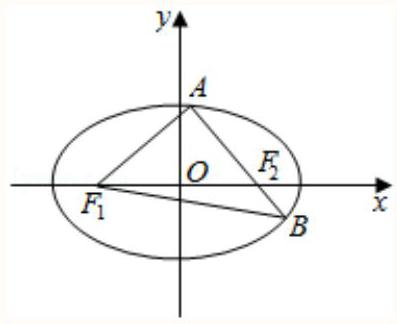

若 $\bigtriangleup  {AB}{F}_{1}$ 构成以 $\mathrm{A}$ 为直角顶点的等腰直角三角形,

则 $\left| {AB}\right|  = \left| {A{F}_{1}}\right|  = m,\left| {B{F}_{1}}\right|  = \sqrt{2}m$ ,

由椭圆的定义可得 $\bigtriangleup {AB}{F}_{1}$ 的周长为 ${4a}$ ,

即有 $4\mathrm{a} = 2\mathrm{m} + \sqrt{2}\mathrm{m}$ ,即 $\mathrm{m} = 2\left( {2 - \sqrt{2}}\right) \mathrm{a}$ ,

则 $\left| {A{F}_{2}}\right|  = {2a} - m = \left( {2\sqrt{2} - 2}\right) a$ ,

在直角三角形 ${\mathrm{{AF}}}_{1}{\mathrm{\;F}}_{2}$ 中,

${\left| {\mathrm{F}}_{1}{\mathrm{\;F}}_{2}\right| }^{2} = {\left| {\mathrm{{AF}}}_{1}\right| }^{2} + {\left| {\mathrm{{AF}}}_{2}\right| }^{2},$

即 $4{c}^{2} = 4{\left( 2 - \sqrt{2}\right) }^{2}{a}^{2} + 4{\left( \sqrt{2} - 1\right) }^{2}{a}^{2}$ ,

$\therefore {\mathrm{c}}^{2} = \left( {9 - 6\sqrt{2}}\right) {\mathrm{a}}^{2}$ ,

则 ${\mathrm{e}}^{2} = \frac{{c}^{2}}{{a}^{2}} = 9 - 6\sqrt{2} = 9 - 2\sqrt{18}$ ,

$\therefore \mathrm{e} = \sqrt{6} - \sqrt{3}$ .

故答案为: $\sqrt{6} - \sqrt{3}$ .

点睛: 椭圆的离心率是椭圆最重要的几何性质, 求椭圆的离心率(或离心率的取值范围), 常见有两种方法:

① 求出 $\mathrm{a},\mathrm{c}$ ，代入公式 $e = \frac{c}{a}$ ；

②只需要根据一个条件得到关于 $\mathrm{a},\mathrm{\;b},\mathrm{c}$ 的齐次式，结合 ${\mathrm{b}}^{2} = {\mathrm{a}}^{2} - {\mathrm{c}}^{2}$ 转化为 $\mathrm{a},\mathrm{c}$ 的齐次式，然后等式(不等式)两边分别除以a或 ${\mathrm{a}}^{2}$ 转化为关于e的方程(不等式)，解方程(不等式)即可得e(e的取值范围).

2 填空题

已知 $\overrightarrow{{e}_{1}},\overrightarrow{{e}_{2}}$ ，是空间单位向量， $\overrightarrow{{e}_{1}} \cdot  \overrightarrow{{e}_{2}} = \frac{1}{2}$ ，若空间向量 $\overrightarrow{b}$ 满足 $\overrightarrow{b} \cdot  \overrightarrow{{e}_{1}} = 2,\overrightarrow{b} \cdot  \overrightarrow{{e}_{2}} = \frac{5}{2}$ ，且对于任意 $x, y \in  \mathrm{R},\left| {\overrightarrow{b} - \left( {x\overrightarrow{{e}_{1}} + y\overrightarrow{{e}_{2}}}\right) }\right|  \geq  \left| {\overrightarrow{b} - \left( {{x}_{0}\overrightarrow{{e}_{1}} + {y}_{0}\overrightarrow{{e}_{2}}}\right) }\right|  = 1\left( {{x}_{0},{y}_{0} \in  \mathrm{R}}\right) ,\left| \overrightarrow{b}\right|  = \underline{\;};$

答案

$2\sqrt{2}$

解析

问题等价于 $\left| {\overrightarrow{b} - \left( {x\overrightarrow{{e}_{1}} + y\overrightarrow{{e}_{2}}}\right) }\right|$ ,当且仅当 $x = {x}_{0}, y = {y}_{0}$ 时取到最小值 1,通过平方的方法, 结合最值的知识求得正确答案.

$\overrightarrow{{e}_{1}} \cdot  \overrightarrow{{e}_{2}} = \left| \overrightarrow{{e}_{1}}\right|  \cdot  \left| \overrightarrow{{e}_{2}}\right| \cos \left\langle  {\overrightarrow{{e}_{1}},\overrightarrow{{e}_{2}}}\right\rangle   = \cos \left\langle  {\overrightarrow{{e}_{1}},\overrightarrow{{e}_{2}}}\right\rangle   = \frac{1}{2}$ ,又 $0 \leq  \left\langle  {\overrightarrow{{e}_{1}},\overrightarrow{{e}_{2}}}\right\rangle   \leq  \pi$ ,所以

$\left\langle  {\overrightarrow{{e}_{1}},\overrightarrow{{e}_{2}}}\right\rangle   = \frac{\pi }{3}$

$\left| {\overrightarrow{b} - \left( {x\overrightarrow{{e}_{1}} + y\overrightarrow{{e}_{2}}}\right) }\right|  \geq  \left| {\overrightarrow{b} - \left( {{x}_{0}\overrightarrow{{e}_{1}} + {y}_{0}\overrightarrow{{e}_{2}}}\right) }\right|  = 1$ 对于任意 $x, y \in  \mathrm{R}$ 成立,

等价于 $\left| {\overrightarrow{b} - \left( {x\overrightarrow{{e}_{1}} + y\overrightarrow{{e}_{2}}}\right) }\right|$ ,当且仅当 $x = {x}_{0}, y = {y}_{0}$ 时取到最小值 1,

${\left| \overrightarrow{b} - \left( x\overrightarrow{{e}_{1}} + y\overrightarrow{{e}_{2}}\right) \right| }^{2} = {\left| \overrightarrow{b}\right| }^{2} - 2\overrightarrow{b}\left( {x\overrightarrow{{e}_{1}} + y\overrightarrow{{e}_{2}}}\right)  + {\left( x\overrightarrow{{e}_{1}} + y\overrightarrow{{e}_{2}}\right) }^{2}$

$= {\left| \overrightarrow{b}\right| }^{2} - \left( {{2x}\overrightarrow{b} \cdot  \overrightarrow{{e}_{1}} + {2y}\overrightarrow{b} \cdot  \overrightarrow{{e}_{2}}}\right)  + \left( {{x}^{2} + {y}^{2} + {2xy}\overrightarrow{{e}_{1}} \cdot  \overrightarrow{{e}_{2}}}\right)$

$= {\left| \overrightarrow{b}\right| }^{2} - \left( {{4x} + {5y}}\right)  + \left( {{x}^{2} + {y}^{2} + {xy}}\right)  = {\left| \overrightarrow{b}\right| }^{2} + {x}^{2} + {y}^{2} + {xy} - {4x} - {5y}$

$= {\left| \overrightarrow{b}\right| }^{2} + {x}^{2} + {y}^{2} + \left( {y - 4}\right) x - {5y} = {\left| \overrightarrow{b}\right| }^{2} + {\left( x + \frac{y - 4}{2}\right) }^{2} + \frac{3}{4}{\left( y - 2\right) }^{2} - 7$

则 $\left\{  \begin{array}{l} {x}_{0} + \frac{{y}_{0} - 4}{2} = 0 \\  {y}_{0} - 2 = 0 \\  {\left| \overrightarrow{b}\right| }^{2} - 7 = 1 \end{array}\right.$ ,解得 $\left\{  \begin{array}{l} {x}_{0} = 1 \\  {y}_{0} = 2 \\  \left| \overrightarrow{b}\right|  = 2\sqrt{2} \end{array}\right.$ .

故答案为: $2\sqrt{2}$ .

3 填空题

设 $0 < x, y < 1$ , $u = \sqrt{2{x}^{2} + 2{y}^{2} - {4y} + 2} + \sqrt{{x}^{2} + {y}^{2} - {2x} - {2y} + 2} + \sqrt{{x}^{2} + {y}^{2} - {2x} + 1}$ 的最小值为 ___；

答案

✓5

解析

应用两点间距离公式结合三角形旋转转化边长, 最后结合距离和得出最小值即可.

设 $P\left( {x, y}\right) , A\left( {1,0}\right) , B\left( {1,1}\right) , C\left( {0,1}\right)$ ,设 $0 < x, y < 1$ ,

$u = \sqrt{2{x}^{2} + 2{y}^{2} - {4y} + 2} + \sqrt{{x}^{2} + {y}^{2} - {2x} - {2y} + 2} + \sqrt{{x}^{2} + {y}^{2} - {2x} + 1}$

$= \sqrt{2}\left| {PC}\right|  + \left| {PB}\right|  + \left| {PA}\right|$

把 $\bigtriangleup {PAB}$ 以 $C$ 为旋转中心逆时针旋转 $\frac{\pi }{2}$ 时,得出 $\bigtriangleup {PA}{B}^{\prime }$ ,则 ${B}^{\prime }\left( {0,2}\right)$ ,

所以 $\sqrt{2}\left| {PC}\right|  + \left| {PB}\right|  + \left| {PA}\right|  = \left| {P{P}^{\prime }}\right|  + \left| {{P}^{\prime }{B}^{\prime }}\right|  + \left| {PA}\right|  \geq  \left| {A{B}^{\prime }}\right|  = \sqrt{5}$ ,

当且仅当 $P,{P}^{\prime }, A,{B}^{\prime }$ 四点共线时取最小值 $\sqrt{5}$

则 $u = \sqrt{2{x}^{2} + 2{y}^{2} - {4y} + 2} + \sqrt{{x}^{2} + {y}^{2} - {2x} - {2y} + 2} + \sqrt{{x}^{2} + {y}^{2} - {2x} + 1}$ 的最小值为 $\sqrt{5}$ . 故答案为: $\sqrt{5}$ .

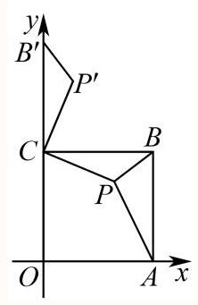

4 填空题

已知 $\mathrm{A},\mathrm{B}$ 两点在曲线 $y = {\mathrm{e}}^{x}$ 上，C，D两点在曲线 $y = \ln x$ 上，给出下列四个结论:

① $\left| {AC}\right|$ 的最小值为 $\sqrt{2}$ ；

② 当 ${AC}$ 与坐标轴平行时， $\left| {AC}\right|$ 最小值为2；

③当四边形 ${ABCD}$ 为正方形时，设正方形面积为S，则 $S < 2{\left( \mathrm{e} - 1\right) }^{2}$ ；

④当直线 ${AC},{BD}$ 均为曲线 $y = {\mathrm{e}}^{x}$ 和 $y = \ln x$ 的公切线时，线段 ${AB}$ 的中点在 $y$ 轴上.

其中所有正确结论的序号是___.

## 答案

①③④

解析

①结合图形，结合相切状态求解最小值；②由 $\left| {AC}\right|  = {\mathrm{e}}^{x} - \ln x, x > 0$ ，构造函数求解最小值， 再证明最小值大于2; ③先证明若四边形 ${ABCD}$ 为正方形，则 ${k}_{AB} = 1$ ，可知 $A$ 与 $D$ ， $B$ 与 $C$ 关于直线 $y = x$ 对称; 结合对称性分析存在正方形 ${ABCD}$ 满足题意,进而利用坐标表达面积,结合关系式利用单调性求解范围; ④设切点 $A\left( {{x}_{1},{\mathrm{e}}^{{x}_{1}}}\right) , B\left( {{x}_{2},{\mathrm{e}}^{{x}_{2}}}\right)$ ,利用函数的对称性、导数求

切线方程,借助切线斜率建立等量关系 ${k}_{AC} = {\mathrm{e}}^{{x}_{1}} = \frac{1}{{\mathrm{e}}^{{x}_{2}}}$ 证明即可.

对于①:

因为 $y = {\mathrm{e}}^{x}$ 与 $y = \ln x$ 互为反函数，它们的图象关于 $y = x$ 对称，

所以 $\left| {AC}\right|$ 的最小值就是点 $A$ 到直线 $y = x$ 的最小距离的 2 倍.

对 $y = {\mathrm{e}}^{x}$ 求导得 ${y}^{\prime } = {\mathrm{e}}^{x}$ ,令 ${\mathrm{e}}^{x} = 1$ ,解得 $x = 0$ .

此时 $y = {\mathrm{e}}^{0} = 1$ ,即曲线 $y = {\mathrm{e}}^{x}$ 在点 $\left( {0,1}\right)$ 处的切线斜率为 1,

切线方程为 $y - 1 = 1 \times  \left( {x - 0}\right)$ ,即 $y = x + 1$ .

切点 $\left( {0,1}\right)$ 到直线 $y = x$ 的距离为 $d = \frac{\left| 0 - 1\right| }{\sqrt{{1}^{2} + {\left( -1\right) }^{2}}} = \frac{\sqrt{2}}{2}$ ,

即点 $A$ 到直线 $y = x$ 的最小距离为 $\frac{\sqrt{2}}{2}$ ，

所以 $\left| {AC}\right|$ 的最小值为 ${2d} = \sqrt{2}$ ，故①正确；

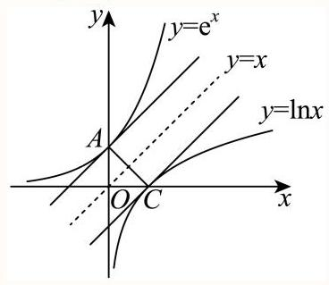

对于②:

当 ${AC}$ 与坐标轴平行时，

若 ${AC}$ 与 $y$ 轴平行，此时 $A\left( {x,{\mathrm{e}}^{x}}\right) , C\left( {x,\ln x}\right)$ ，则 $\left| {AC}\right|  = \left| {{\mathrm{e}}^{x} - \ln x}\right|  = {\mathrm{e}}^{x} - \ln x, x > 0$ .

令 $f\left( x\right)  = {\mathrm{e}}^{x} - \ln x$ ,对其求导得 ${f}^{\prime }\left( x\right)  = {\mathrm{e}}^{x} - \frac{1}{x}$ ,

${f}^{\prime }\left( x\right)$ 在 $\left( {0, + \infty }\right)$ 上单调递增,且 ${f}^{\prime }\left( \frac{1}{2}\right)  = \sqrt{\mathrm{e}} - 2 < 0,{f}^{\prime }\left( 1\right)  = \mathrm{e} - 1 > 0$ ,

所以存在 ${x}_{0} \in  \left( {\frac{1}{2},1}\right)$ ,使得 ${f}^{\prime }\left( {x}_{0}\right)  = 0$ ,即 ${\mathrm{e}}^{{x}_{0}} = \frac{1}{{x}_{0}},\ln {x}_{0} =  - {x}_{0}$ .

当 $x \in  \left( {0,{x}_{0}}\right)$ 时, ${f}^{\prime }\left( x\right)  < 0$ ; 当 $x \in  \left( {{x}_{0}, + \infty }\right)$ 时, ${f}^{\prime }\left( x\right)  > 0$ ,

即 $f\left( x\right)$ 在 $\left( {0,{x}_{0}}\right)$ 上单调递减,在 $\left( {{x}_{0}, + \infty }\right)$ 上单调递增,

所以 $f{\left( x\right) }_{\min } = f\left( {x}_{0}\right)  = {\mathrm{e}}^{{x}_{0}} - \ln {x}_{0} = \frac{1}{{x}_{0}} + {x}_{0} > 2$ ,即 $\left| {AC}\right|  > 2$ ;

若 ${AC}$ 与 $x$ 轴平行,则可设 $A\left( {\ln y, y}\right) , C\left( {{\mathrm{e}}^{y}, y}\right) ,\left( {y > 0}\right)$

则 $\left| {AC}\right|  = \left| {{\mathrm{e}}^{y} - \ln y}\right|  = {\mathrm{e}}^{y} - \ln y$ ,

同理可证 $\left| {AC}\right|  > 2$ .

综上可知，当 ${AC}$ 与坐标轴平行时， $\left| {AC}\right|$ 最小值不为2，故②错误；

对于③:

当四边形 ${ABCD}$ 为正方形时,

因为 $y = {\mathrm{e}}^{x}$ 与 $y = \ln x$ 互为反函数,它们的图象关于 $y = x$ 对称.

如图,设 $A\left( {a,{\mathrm{e}}^{a}}\right) , B\left( {b,{\mathrm{e}}^{b}}\right) , C\left( {c,\ln c}\right) , D\left( {d,\ln d}\right) \left( {a < b, c > d}\right)$ ,

则 $\overrightarrow{AB} = \left( {b - a,{\mathrm{e}}^{b} - {\mathrm{e}}^{a}}\right) ,\overrightarrow{DC} = \left( {c - d,\ln c - \ln d}\right) ,\overrightarrow{BC} = \left( {c - b,\ln c - {\mathrm{e}}^{b}}\right)$ ,

因为 $\overrightarrow{BC}$ 可由 $\overrightarrow{BA}$ 逆时针旋转得到,故 $\overrightarrow{BC} = \left( {{\mathrm{e}}^{b} - {\mathrm{e}}^{a}, a - b}\right)$ ,又 $\overrightarrow{AB} = \overrightarrow{DC}$ ,

可得 $b - a = c - d,{\mathrm{e}}^{b} - {\mathrm{e}}^{a} = \ln c - \ln d$ ,

且 $c - b = {\mathrm{e}}^{b} - {\mathrm{e}}^{a}, a - b = \ln c - {\mathrm{e}}^{b}$ ,

故 $b - a = c - d = {\mathrm{e}}^{b} - \ln c = {\mathrm{e}}^{a} - \ln d$ ,且 $c - b = d - a = {\mathrm{e}}^{b} - {\mathrm{e}}^{a} = \ln c - \ln d$ ,

设 $m = b - a = c - d = {\mathrm{e}}^{b} - \ln c = {\mathrm{e}}^{a} - \ln d$ ,

设 $n = c - b = d - a = {\mathrm{e}}^{b} - {\mathrm{e}}^{a} = \ln c - \ln d$ ,

由 $m = b - a = \ln {\mathrm{e}}^{b} - \ln {\mathrm{e}}^{a} > 0$ ,

则有 ${\mathrm{e}}^{m} = \frac{{\mathrm{e}}^{b}}{{\mathrm{e}}^{a}}$ ; 又 $n = {\mathrm{e}}^{b} - {\mathrm{e}}^{a} > 0$ ,

联立可得 $\left\{  \begin{array}{l} {\mathrm{e}}^{a} = \frac{n}{{\mathrm{e}}^{m} - 1} \\  {\mathrm{e}}^{b} = \frac{n{\mathrm{e}}^{m}}{{\mathrm{e}}^{m} - 1} \end{array}\right. \left( {m > 0, n > 0}\right)$ ,

由 $\left\{  \begin{array}{l} \ln c - \ln d = \ln \frac{c}{d} = n \\  c - d = m \end{array}\right.$ ,可解得 $\left\{  \begin{array}{l} c = \frac{m{\mathrm{e}}^{n}}{{\mathrm{e}}^{n} - 1} \\  d = \frac{m}{{\mathrm{e}}^{n} - 1} \end{array}\right.$ ,

则由 $m = {\mathrm{e}}^{a} - \ln d, n = d - a$ 可得,

$m - n = \frac{n}{{\mathrm{e}}^{m} - 1} - \ln \frac{m}{{\mathrm{e}}^{n} - 1} - \frac{m}{{\mathrm{e}}^{n} - 1} + \ln \frac{n}{{\mathrm{e}}^{m} - 1} = \frac{n\left( {{\mathrm{e}}^{n} - 1}\right)  - m\left( {{\mathrm{e}}^{m} - 1}\right) }{\left( {{\mathrm{e}}^{m} - 1}\right) \left( {{\mathrm{e}}^{n} - 1}\right) } + \ln$

$\frac{n\left( {{\mathrm{e}}^{n} - 1}\right) }{m\left( {{\mathrm{e}}^{m} - 1}\right) }$

,

若 $m > n > 0$ ,则 ${\mathrm{e}}^{m} - 1 > {\mathrm{e}}^{n} - 1 > 0$ ,

所以 $0 < n\left( {{\mathrm{e}}^{n} - 1}\right)  < m\left( {{\mathrm{e}}^{m} - 1}\right)$ ,

可得 $\frac{n\left( {{\mathrm{e}}^{n} - 1}\right)  - m\left( {{\mathrm{e}}^{m} - 1}\right) }{\left( {{\mathrm{e}}^{m} - 1}\right) \left( {{\mathrm{e}}^{n} - 1}\right) } < 0,\ln \frac{n\left( {{\mathrm{e}}^{n} - 1}\right) }{m\left( {{\mathrm{e}}^{m} - 1}\right) } < 0$ ,则 $m - n < 0$ ,这与 $m > n$ 矛盾;

若 $n > m > 0$ ,则 ${\mathrm{e}}^{n} - 1 > {\mathrm{e}}^{m} - 1 > 0$ ,

所以 $n\left( {{\mathrm{e}}^{n} - 1}\right)  > m\left( {{\mathrm{e}}^{m} - 1}\right)  > 0$ ,

可得 $\frac{n\left( {{\mathrm{e}}^{n} - 1}\right)  - m\left( {{\mathrm{e}}^{m} - 1}\right) }{\left( {{\mathrm{e}}^{m} - 1}\right) \left( {{\mathrm{e}}^{n} - 1}\right) } > 0,\ln \frac{n\left( {{\mathrm{e}}^{n} - 1}\right) }{m\left( {{\mathrm{e}}^{m} - 1}\right) } > 0$ ,则 $m - n > 0$ ,这与 $n > m$ 矛盾;

故 $m = n$ ,即 $b - a = {\mathrm{e}}^{b} - {\mathrm{e}}^{a}$ ,从而 ${k}_{AB} = \frac{{\mathrm{e}}^{b} - {\mathrm{e}}^{a}}{b - a} = 1$ .

所以 ${AB}$ 与直线 $y = x$ 平行,由此可知 $A$ 与 $D, B$ 与 $C$ 关于直线 $y = x$ 对称;

则可设 $A\left( {a,{\mathrm{e}}^{a}}\right) , B\left( {b,{\mathrm{e}}^{b}}\right) , C\left( {{\mathrm{e}}^{b}, b}\right) , D\left( {{\mathrm{e}}^{a}, a}\right) \left( {a < b}\right)$ ,

所以 ${\left| AB\right| }^{2} = {\left( b - a\right) }^{2} + {\left( {\mathrm{e}}^{b} - {\mathrm{e}}^{a}\right) }^{2} = 2{\left( b - a\right) }^{2};{\left| BC\right| }^{2} = 2{\left( {\mathrm{e}}^{b} - b\right) }^{2}$ ;

则 $b - a = {\mathrm{e}}^{b} - b = {\mathrm{e}}^{b} - {\mathrm{e}}^{a}$ ,可得 ${\mathrm{e}}^{a} = b$ ,所以 $a = \ln b$ ,

所以有 $b - \ln b = {\mathrm{e}}^{b} - b$ ,即 ${2b} - \ln b - {\mathrm{e}}^{b} = 0$ .

令 $f\left( x\right)  = {2x} - \ln x - {\mathrm{e}}^{x}$ ， $\left( {x > 0}\right)$

再令 $g\left( x\right)  = {\mathrm{e}}^{x} - x, x > 0$ ,

则 ${g}^{\prime }\left( x\right)  = {\mathrm{e}}^{x} - 1 > 0$ ,故 $g\left( x\right)$ 在 $\left( {0, + \infty }\right)$ 上单调递增,

则 $g\left( x\right)  > g\left( 0\right)  = 1$ ,所以 ${\mathrm{e}}^{x} - x > 0$ 即 ${\mathrm{e}}^{x} > x$ .

则 ${f}^{\prime }\left( x\right)  = 2 - \frac{1}{x} - {\mathrm{e}}^{x} < 2 - \frac{1}{x} - x \leq  0$ ,所以 ${f}^{\prime }\left( x\right)  < 0$ ,

故 $f\left( x\right)$ 在 $\left( {0, + \infty }\right)$ 上单调递减，

由 $f\left( 1\right)  = 2 - \ln 1 - \mathrm{e} < 0$ ,且 $f\left( \frac{1}{{\mathrm{e}}^{2}}\right)  = \frac{2}{{\mathrm{e}}^{2}} - \ln \frac{1}{{\mathrm{e}}^{2}} - {\mathrm{e}}^{\frac{1}{{\mathrm{e}}^{2}}} = 2 + \frac{2}{{\mathrm{e}}^{2}} - {\mathrm{e}}^{\frac{1}{{\mathrm{e}}^{2}}} > 0$ ,

故 $f\left( x\right)$ 在 $\left( {\frac{1}{2},1}\right)$ 内有唯一零点,

即方程 $b - \ln b = {\mathrm{e}}^{b} - b$ 有唯一解,故仅存在一个这样的正方形 ${ABCD}$ .

且 ${S}_{\text{ 正方形 }{ABCD}} = 2{\left( {\mathrm{e}}^{b} - b\right) }^{2},\frac{1}{{\mathrm{e}}^{2}} < b < 1$ ,

且 $h\left( b\right)  = {\left( {\mathrm{e}}^{b} - b\right) }^{2}$ 在 $\left( {0,1}\right)$ 为单调增函数,

故 $h\left( b\right)  < h\left( 1\right)  = {\left( \mathrm{e} - 1\right) }^{2}$ ，故 ${S}_{\text{ 正方形 }{ABCD}} < 2{\left( \mathrm{e} - 1\right) }^{2}$ ，故③正确；

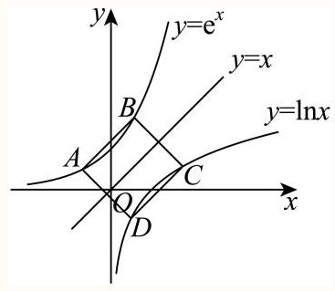

对于④:

如图，由图象可知，两函数恰有两条公切线，且两公切线也关于 $y = x$ 对称.

设两公切线分别与 $y = {\mathrm{e}}^{x}$ 相切的切点为 $A\left( {{x}_{1},{\mathrm{e}}^{{x}_{1}}}\right) , B\left( {{x}_{2},{\mathrm{e}}^{{x}_{2}}}\right)$ .

则点 $B$ 关于直线 $y = x$ 的对称点 $\left( {{\mathrm{e}}^{{x}_{2}},{x}_{2}}\right)$ 即为公切线 ${AC}$ 与 $y = \ln x$ 相切的切点 $C$ ，

由 ${\left( {\mathrm{e}}^{x}\right) }^{\prime } = {\mathrm{e}}^{x},{\left( \ln x\right) }^{\prime } = \frac{1}{x}$ ,

则公切线 ${AC}$ 的斜率 ${k}_{AC} = {\mathrm{e}}^{{x}_{1}} = \frac{1}{{\mathrm{e}}^{{x}_{2}}}$ ,

所以 ${\mathrm{e}}^{{x}_{1}} \cdot  {\mathrm{e}}^{{x}_{2}} = {\mathrm{e}}^{{x}_{1} + {x}_{2}} = 1$ ,可得 ${x}_{1} + {x}_{2} = 0$ ,

故线段 ${AB}$ 的中点在 $y$ 轴上，故④正确.

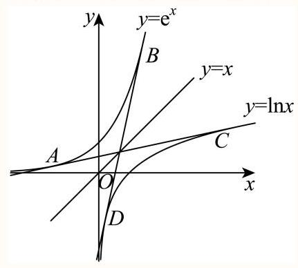

5 填空题

已知向量 $\overrightarrow{a},\overrightarrow{b}$ 满足 $\left| \overrightarrow{a}\right|  = 3,\left| \overrightarrow{b}\right|  = 1$ ，若存在不同的实数 ${\lambda }_{1},{\lambda }_{2}\left( {{\lambda }_{1}{\lambda }_{2} \neq  0}\right)$ ，使得 $\overrightarrow{{c}_{i}} = {\lambda }_{i}\overrightarrow{a} + 3{\lambda }_{i}\overrightarrow{b}$ ， 且 $\left( {\overrightarrow{{c}_{i}} - \overrightarrow{a}}\right)  \cdot  \left( {\overrightarrow{{c}_{i}} - \overrightarrow{b}}\right)  = 0\left( {i = 1,2}\right)$ ，则 $\left| {\overrightarrow{{c}_{1}} - \overrightarrow{{c}_{2}}}\right|$ 的取值范围是___.

4 答案

$\left\lbrack  {2,2\sqrt{2}}\right) \bigcup \left\lbrack  {2\sqrt{2},2\sqrt{3}}\right)$

解析

设 $\overrightarrow{a} \cdot  \overrightarrow{b} = k,\left( {\overrightarrow{{c}_{i}} - \overrightarrow{a}}\right)  \cdot  \left( {\overrightarrow{{c}_{i}} - \overrightarrow{b}}\right)  = 0$ 变形(数量积的运算)得 ${\lambda }_{1},{\lambda }_{2}$ 是方程

$6\left( {k + 3}\right) {x}^{2} - 4\left( {k + 3}\right) x + k = 0$ 的两根,利用韦达定理求得 $\left| {{\lambda }_{1} - {\lambda }_{2}}\right|$ ,则

$\left| {\overrightarrow{{c}_{1}} - \overrightarrow{{c}_{2}}}\right|  = \left| {{\lambda }_{1} - {\lambda }_{2}}\right| \left| {\overrightarrow{a} + 3\overrightarrow{b}}\right|$ 可表示为 $k$ 的函数，由 $k$ 的范围可得结论，在题中注意 $k$ 的范围

的确定. $\overrightarrow{{c}_{1}} - \overrightarrow{a} = \left( {{\lambda }_{1} - 1}\right) \overrightarrow{a} + 3{\lambda }_{1}\overrightarrow{b},\overrightarrow{{c}_{1}} - \overrightarrow{b} = {\lambda }_{1}\overrightarrow{a} + \left( {3{\lambda }_{1} - 1}\right) \overrightarrow{b}$ ,

设 $\overrightarrow{a} \cdot  \overrightarrow{b} = k\left( {-3 \leq  k \leq  3}\right)$ ,由 $\left( {\overrightarrow{{c}_{1}} - \overrightarrow{a}}\right)  \cdot  \left( {\overrightarrow{{c}_{1}} - \overrightarrow{b}}\right)  = 0$ 得 ${\overrightarrow{{c}_{1}}}^{2} - \left( {\overrightarrow{a} + \overrightarrow{b}}\right)  \cdot  \overrightarrow{{c}_{1}} + \overrightarrow{a} \cdot  \overrightarrow{b} = 0$ ,

整理得 $6\left( {k + 3}\right) {\lambda }_{1}^{2} - 4\left( {k + 3}\right) {\lambda }_{1} + k = 0$ ,

同理 $6\left( {k + 3}\right) {\lambda }_{2}^{2} - 4\left( {k + 3}\right) {\lambda }_{2} + k = 0$ ,

所以 ${\lambda }_{1},{\lambda }_{2}$ 是方程 $6\left( {k + 3}\right) {x}^{2} - 4\left( {k + 3}\right) x + k = 0$ 的两根,由 ${\lambda }_{1}{\lambda }_{2} \neq  0$ 得 $k \neq  0$ ,

$k =  - 3$ 时方程无解,故 $k \neq  0$ 且 $k \neq   - 3,\Delta  = 8\left( {k + 3}\right) \left( {6 - k}\right)  > 0$ ,

${\lambda }_{1} + {\lambda }_{2} = \frac{2}{3},\;{\lambda }_{1}{\lambda }_{2} = \frac{k}{6\left( {k + 3}\right) },$

所以 $\left| {{\lambda }_{1} - {\lambda }_{2}}\right|  = \sqrt{{\left( {\lambda }_{1} + {\lambda }_{2}\right) }^{2} - 4{\lambda }_{1}{\lambda }_{2}} = \sqrt{\frac{4}{9} - \frac{4k}{6\left( {k + 3}\right) }} = \frac{\sqrt{8\left( {k + 3}\right) \left( {6 - k}\right) }}{6\left( {k + 3}\right) }$ ,

$\left| {\overrightarrow{a} + 3\overrightarrow{b}}\right|  = \sqrt{{\left( \overrightarrow{a} + 3\overrightarrow{b}\right) }^{2}} = \sqrt{{\overrightarrow{a}}^{2} + 6\overrightarrow{a} \cdot  \overrightarrow{b} + 9{\overrightarrow{b}}^{2}} = \sqrt{6\left( {k + 3}\right) },$

所以 $\left| {\overrightarrow{{c}_{1}} - \overrightarrow{{c}_{2}}}\right|  = \left| {{\lambda }_{1} - {\lambda }_{2}}\right| \left| {\overrightarrow{a} + 3\overrightarrow{b}}\right|  = \sqrt{6\left( {k + 3}\right) }\left| {{\lambda }_{1} - {\lambda }_{2}}\right|  = \sqrt{\frac{4}{3}\left( {6 - k}\right) }$ ,

由 $\$  - 3$ 且 $k \neq  0$ 得 $\left| {\overrightarrow{{c}_{1}} - \overrightarrow{{c}_{2}}}\right|$ 的范围是 $\left\lbrack  {2,2\sqrt{2})\bigcup (2\sqrt{2},2\sqrt{3}}\right\rbrack$ .

故答案为: $\left\lbrack  {2,2\sqrt{2}}\right) \bigcup (2\sqrt{2},2\sqrt{3}\rbrack$ .

本题考查平面向量的数量积,解题关键是设 $\overrightarrow{a} \cdot  \overrightarrow{b} = k$ 后通过数量积的运算把 ${\lambda }_{1},{\lambda }_{2}$ 是方程 $6\left( {k + 3}\right) {x}^{2} - 4\left( {k + 3}\right) x + k = 0$ 的两根，这样可用韦达定理求得 $\left| {{\lambda }_{1} - {\lambda }_{2}}\right|$ ，从而求得目标 $\left| {\overrightarrow{{c}_{1}} - \overrightarrow{{c}_{2}}}\right|$ 关于 $k$ 的函数，属于难题.

## 二、单选题

6 单选题 4次作答 正确率 25%

设 ${f}_{1}\left( x\right)  = \sin x,{f}_{2}\left( x\right)  = \cos \left( {x + \varphi }\right)$ . 若对任意 $t \in  \mathbf{R}$ ,均存在 $i \in  \{ 1,2\}$ ,使得函数 $y = {f}_{i}\left( x\right)$ 在 $\left\lbrack  {t, t + \frac{\pi }{4}}\right\rbrack$ 是单调函数，则 $\varphi$ 的取值可能是( ).

A. $\frac{4\pi }{7}$

B. $\frac{3\pi }{7}$

C. $\frac{2\pi }{7}$

D. $\frac{\pi }{7}$

答案

D

解析

利用两个函数总存在一个是单调的函数,而 ${f}_{1}\left( x\right)  = \sin x$ 的单调性是已知的,我们就对任意 $\left\lbrack  {t, t + \frac{\pi }{4}}\right\rbrack$ 可能包含在 $\frac{\pi }{2}$ 时,会导致 ${f}_{1}\left( x\right)  = \sin x$ 不单调,此时则需要 ${f}_{2}\left( x\right)  = \cos \left( {x + \varphi }\right)$ 必须单调,从而去验证 ${f}_{2}\left( x\right)  = \cos \left( {x + \varphi }\right)$ 在区间 $\left\lbrack  {\frac{\pi }{4},\frac{3\pi }{4}}\right\rbrack  ,\left\lbrack  {\frac{5\pi }{4},\frac{7\pi }{4}}\right\rbrack$ 的单调性,从而问题可得解. 由于这两个函数都是周期为 ${2\pi }$ 的函数,则下面只考虑在区间 $\left\lbrack  {0,{2\pi }}\right\rbrack$ 上进行分析研究,

因为 ${f}_{1}\left( x\right)  = \sin x$ 在区间 $\left\lbrack  {0,\frac{\pi }{2}}\right\rbrack$ 上单调递增,在 $\left\lbrack  {\frac{\pi }{2},\frac{3\pi }{2}}\right\rbrack$ 上单调递减,在 $\left\lbrack  {\frac{3\pi }{2},{2\pi }}\right\rbrack$ 上单调递增,

而题意要求对任意 $t \in  \mathbf{R}$ ,均存在 $i \in  \{ 1,2\}$ ,使得函数 $y = {f}_{i}\left( x\right)$ 在 $\left\lbrack  {t, t + \frac{\pi }{4}}\right\rbrack$ 是单调函数,

所以只需要 ${f}_{2}\left( x\right)  = \cos \left( {x + \varphi }\right)$ 在区间 $\left\lbrack  {\frac{\pi }{4},\frac{3\pi }{4}}\right\rbrack  ,\left\lbrack  {\frac{5\pi }{4},\frac{7\pi }{4}}\right\rbrack$ 是单调函数即可,

根据选项可知只需要满足 $\varphi  > 0$ 时取值,

故 $\frac{\pi }{4} + \varphi  \leq  x + \varphi  \leq  \frac{3\pi }{4} + \varphi ,\frac{5\pi }{4} + \varphi  \leq  x + \varphi  \leq  \frac{7\pi }{4} + \varphi$ ,

根据余弦函数的单调性,若满足 $\left\{  \begin{array}{l} \frac{\pi }{4} + \varphi  \geq  0 \\  \frac{3\pi }{4} + \varphi  \leq  \pi  \end{array}\right.$ ,解得 $0 < \varphi  \leq  \frac{\pi }{4}$ ,

若满足 $\left\{  \begin{array}{l} \frac{5\pi }{4} + \varphi  \geq  \pi \\  \frac{7\pi }{4} + \varphi  \leq  {2\pi } \end{array}\right.$ ,解得 $0 < \varphi  \leq  \frac{\pi }{4}$ ,

若满足 $\left\{  \begin{array}{l} \frac{\pi }{4} + \varphi  \geq  \pi \\  \frac{3\pi }{4} + \varphi  \leq  {2\pi } \end{array}\right.$ , $\varphi$ 无解,

故 $0 < \varphi  \leq  \frac{\pi }{4}$ 必满足题意，而 $\frac{2\pi }{7} > \frac{2\pi }{8} = \frac{\pi }{4}$ ，则ABC错误；

故选: D.

选项分布(全国)

<table><tr><td>作答次数</td><td>正确率</td><td>A占比</td><td>B占比</td><td>C占比</td><td>D占比</td></tr><tr><td>4</td><td>25%</td><td>0%</td><td>50% 易错</td><td>25%</td><td>25% 正确</td></tr></table>

7 单选题 13次作答 正确率 53.8%

已知, $A\left( {2,0}\right) , B\left( {3,2}\right) ,\mathrm{C}$ 在函数 $y = \sqrt{{x}^{2} - 1}, x \geq  1$ 图像上,则下列判断错误的是 ( )

A. 存在 $m > 0$ ,使得 ${S}_{\bigtriangleup {ABC}} = m$ 的点 $\mathrm{C}$ 有且只有一个

B. 任意 $m > 0$ ，使得 ${S}_{\bigtriangleup {ABC}} = m$ 的点C至少一个

C. 存在 $m > 0$ ,使得 ${S}_{\bigtriangleup {ABC}} = m$ 的点 $\mathrm{C}$ 有且仅有两个

D. 任意 $m > 0$ ，使得 ${S}_{\bigtriangleup {ABC}} = m$ 的点C最多两个

答案

D

解析

根据题意，函数 $y = \sqrt{{x}^{2} - 1}$ 为双曲线 ${x}^{2} - {y}^{2} = 1$ 的一部分 (如图 $x \geq  0, y \geq  0$ ),求出直线 ${l}_{AB} : y = {2x} - 4$ ,再求出与函数 $y = \sqrt{{x}^{2} - 1}, x \geq  0$ 图象相切的直线 $l$ ,过点 ${C}_{2}\left( {1,0}\right)$ 与直线 ${l}_{AB}$

平行的直线为 ${l}_{1} : y = {2x} - 2$ ,分别求出特殊情况下 $m$ 的值,即可判断.

根据题意, $A\left( {2,0}\right) , B\left( {3,2}\right)$ ,则 ${l}_{AB} : y = {2x} - 4,\left| {AB}\right|  = \sqrt{5}$ ,

函数 $y = \sqrt{{x}^{2} - 1}$ 为双曲线 ${x}^{2} - {y}^{2} = 1$ 的一部分 (如图 $x \geq  1, y \geq  0$ ),

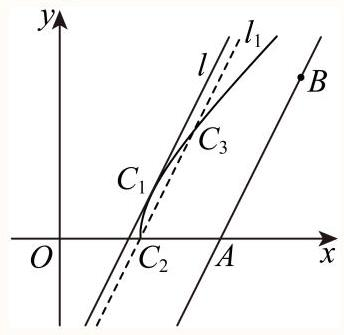

因为双曲线的渐近线为 $y = x$ ,所以直线 ${l}_{AB}$ 与函数图象交于一点,

设直线 $l : y = {2x} + b$ 与函数 $y = \sqrt{{x}^{2} - 1}, x \geq  1$ 图象相切，

联立方程组 $\left\{  \begin{array}{l} y = \sqrt{{x}^{2} - 1} \\  y = {2x} + b \end{array}\right.$ ,得 $3{x}^{2} + {4bx} + {b}^{2} + 1 = 0$ ,

令 $\Delta  = 4{b}^{2} - {12} = 0$ ,得 $b =  \pm  \sqrt{3}$ ,

由图可知, $b =  - \sqrt{3}$ ,

此时直线 ${l}_{AB}$ 与 $l$ 间的距离为 $\frac{4 - \sqrt{3}}{\sqrt{5}}$ ，又 $\left| {AB}\right|  = \sqrt{5}$ ，

当点C为切点 ${C}_{1}$ 时, ${S}_{\bigtriangleup {ABC}} = m = \frac{1}{2} \times  \sqrt{5} \times  \frac{4 - \sqrt{3}}{\sqrt{5}} = \frac{4 - \sqrt{3}}{2}$ ,

又过点 ${C}_{2}\left( {1,0}\right)$ 与直线 ${l}_{AB}$ 平行的直线为 ${l}_{1} : y = {2x} - 2$ ，其与直线 ${l}_{AB}$ 的距离为 $\frac{2}{\sqrt{5}}$ ，

所以当点 $\mathrm{C}$ 为 ${C}_{2}$ 或 ${C}_{3}$ 时， ${S}_{\bigtriangleup {ABC}} = m = \frac{1}{2} \times  \sqrt{5} \times  \frac{2}{\sqrt{5}} = 1$ ，

所以当 $m > \frac{4 - \sqrt{3}}{2}$ 时，使得 ${S}_{\bigtriangleup {ABC}} = m$ 的点C有且只有一个，A正确；

由于函数 $y = \sqrt{{x}^{2} - 1}, x \geq  1$ 图象向右向上无限延伸,

所以点 $\mathrm{C}$ 到直线 ${l}_{AB}$ 的距离可以无限大,

从而任意 $m > 0$ ，使得 ${S}_{\bigtriangleup {ABC}} = m$ 的点C至少一个，B正确；

当 $m = \frac{4 - \sqrt{3}}{2}$ ,或 $0 < m < 1$ 时,使得 ${S}_{\bigtriangleup {ABC}} = m$ 的点C有且仅有两个, C正确;

而当 $1 \leq  m < \frac{4 - \sqrt{3}}{2}$ 时,使得 ${S}_{\bigtriangleup {ABC}} = m$ 的点C有三个,故 $\mathrm{D}$ 错误.

故选: D

1 选项分布(全国)

<table><tr><td>作答次数</td><td>正确率</td><td>A占比</td><td>B占比</td><td>C占比</td><td>D占比</td></tr><tr><td>13</td><td>53.8%</td><td>15.4%</td><td>7.7%</td><td>23.1% 易错</td><td>53.8%(正确)</td></tr></table>

## 三、解答题

8 解答题

《瀑布》(图1)是埃舍尔最为人所知的作品之一，图中的瀑布会源源不断地落下，落下的水又逆流而上, 荒唐至极, 但又会让你百看不腻.画面下方还有一位饶有兴致的观察者, 似乎他没发现什么不对劲.此时, 他既是画外的观看者, 也是埃舍尔自己.画面两座高塔各有一个几何体, 左塔上方是著名的“三立方体合体”由三个正方体构成，右塔上的几何体是首次出现，后称“埃舍尔多面体”(图 2)

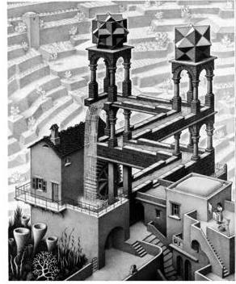

图1

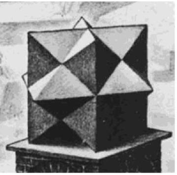

图2

埃舍尔多面体可以用两两垂直且中心重合的三个正方形构造, 设边长均为2, 定义正方形 ${A}_{n}{B}_{n}{C}_{n}{D}_{n}, n = 1,2,3$ 的顶点为“框架点”，定义两正方形交线为“极轴”，其端点为“极点”，记为 ${P}_{n},{Q}_{n}$ ,将极点 ${P}_{1},{Q}_{1}$ ,分别与正方形 ${A}_{2}{B}_{2}{C}_{2}{D}_{2}$ 的顶点连线,取其中点记为 ${E}_{m},{F}_{m},, m = 1,2,3,4$ ，如(图3). 埃舍尔多面体可视部分是由12个四棱锥构成，这些四棱锥顶点均为“框架点”，底面四边形由两个“极点”与两个“中点”构成，为了便于理解，图4我们构造了其中两个四棱锥 ${A}_{1} - {P}_{1}{E}_{1}{P}_{2}{E}_{2}$ 与 ${A}_{2} - {P}_{2}{E}_{1}{P}_{3}{F}_{1}$ .

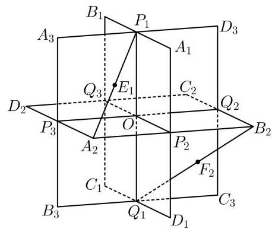

图3

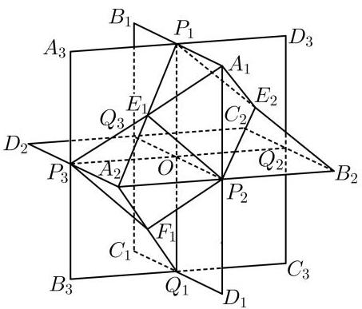

图4

(1)求异面直线 ${P}_{1}{A}_{2}$ 与 ${Q}_{1}{B}_{2}$ 成角余弦值

(2)求平面 ${P}_{1}{A}_{1}{E}_{1}$ 与平面 ${A}_{1}{E}_{2}{P}_{2}$ 的夹角余弦值

(3)求埃舍尔体的表面积与体积(直接写出答案)

答案

(1) $\frac{1}{3}$

(2) $\frac{1}{2}$

(3)表面积为 ${12}\sqrt{2}$ ，体积为 4.

解析

(1)以 $O$ 为坐标原点，分别以 $O{P}_{3}\text{ 、 }O{P}_{2}\text{ 、 }O{P}_{1}$ 为 $x$ 轴、 $y$ 轴、 $z$ 轴建立空间直角坐标系，

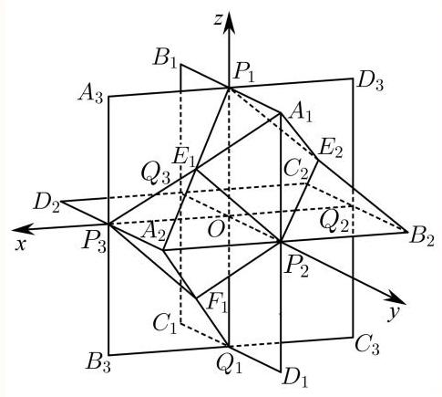

则

${P}_{1}\left( {0,0,1}\right) \text{ 、 }{A}_{2}\left( {1,1,0}\right) \text{ 、 }{Q}_{1}\left( {0,0, - 1}\right) \text{ 、 }{B}_{2}\left( {-1,1,0}\right) \text{ 、 }{A}_{1}\left( {0,1,1}\right) \text{ 、 }{E}_{1}\left( {\frac{1}{2},\frac{1}{2},\frac{1}{2}}\right) \text{ 、 }{E}_{2} \; \left( {-\frac{1}{2},\frac{1}{2},\frac{1}{2}}\right) \text{ 、 }{P}_{2}\left( {0,1,0}\right)$

所以 $\overrightarrow{{P}_{1}{A}_{2}} = \left( {1,1, - 1}\right) ,\overrightarrow{{Q}_{1}{B}_{2}} = \left( {-1,1,1}\right)$ ，所以

$\left| {\cos \left\langle  {\overrightarrow{{P}_{1}{A}_{2}},\overrightarrow{{Q}_{1}{B}_{2}}}\right\rangle  }\right|  = \left| \frac{-1 + 1 - 1}{\sqrt{3} \times  \sqrt{3}}\right|  = \frac{1}{3},$

所以异面直线 ${P}_{1}{A}_{2}$ 与 ${Q}_{1}{B}_{2}$ 成角余弦值为 $\frac{1}{3}$ .

(2)由(1)得 $\overrightarrow{{P}_{1}{A}_{1}} = \left( {0,1,0}\right) ,\overrightarrow{{P}_{1}{E}_{1}} = \left( {\frac{1}{2},\frac{1}{2}, - \frac{1}{2}}\right)$ ，设平面 ${P}_{1}{A}_{1}{E}_{1}$ 的法向量为

$\overrightarrow{m} = \left( {{x}_{1},{y}_{1},{z}_{1}}\right) ,$

则 $\left\{  \begin{array}{l} \overrightarrow{{P}_{1}{A}_{1}} \cdot  \overrightarrow{m} = 0 \\  \overrightarrow{{P}_{1}{E}_{1}} \cdot  \overrightarrow{m} = 0 \end{array}\right.$ ,即 $\left\{  \begin{array}{l} y = 0 \\  \frac{1}{2}x + \frac{1}{2}y - \frac{1}{2}z = 0 \end{array}\right.$ ,令 $x = 1$ 可得 $\overrightarrow{m} = \left( {1,0,1}\right)$ ,

$\overrightarrow{{A}_{1}{E}_{2}} = \left( {-\frac{1}{2}, - \frac{1}{2}, - \frac{1}{2}}\right) ,\overrightarrow{{A}_{1}{P}_{2}} = \left( {0,0, - 1}\right)$ 设平面 ${A}_{1}{E}_{2}{P}_{2}$ 的法向量为 $\overrightarrow{n} = \left( {{x}_{2},{y}_{2},{z}_{2}}\right)$ ,

则 $\left\{  \begin{array}{l} \overrightarrow{{A}_{1}{E}_{2}} \cdot  \overrightarrow{m} = 0 \\  \overrightarrow{{A}_{1}{P}_{2}} \cdot  \overrightarrow{m} = 0 \end{array}\right.$ ,即 $\left\{  \begin{array}{l} z = 0 \\   - \frac{1}{2}x - \frac{1}{2}y - \frac{1}{2}z = 0 \end{array}\right.$ ,令 $x = 1$ 可得 $\overrightarrow{n} = \left( {1, - 1,0}\right)$ ,

所以 $\left| {\cos \langle \overrightarrow{m},\overrightarrow{n}\rangle }\right|  = \left| \frac{1}{\sqrt{2} \times  \sqrt{2}}\right|  = \frac{1}{2}$ ,

平面 ${P}_{1}{A}_{1}{E}_{1}$ 与平面 ${A}_{1}{E}_{2}{P}_{2}$ 的夹角余弦值为 $\frac{1}{2}$

(3) 表面积为 ${12}\sqrt{2}$ ，体积为 4.

9 解答题 14次作答 正确率73.2%

已知曲线 $\overline{C : {x}^{2}} - {y}^{2} = 2$ ，第一象限内点 $P$ 在曲线 $C$ 上， ${F}_{1}\left( {-2,0}\right)$ 、 ${F}_{2}\left( {2,0}\right)$ ，连接 $P{F}_{2}$ 并延长与曲线 $C$ 交于 $Q$ 点， $\overrightarrow{P{F}_{2}} = \lambda \overrightarrow{{F}_{2}Q}\left( {\lambda  > 0}\right)$ . 以 $P$ 为圆心， $\left| {P{F}_{2}}\right|$ 为半径的圆与线段 $P{F}_{1}$ 交于点 $N$ ，记 $\bigtriangleup  P{F}_{2}N$ ， $\bigtriangleup P{F}_{1}Q$ 的面积分别为 ${S}_{1},{S}_{2}$ .

(1)若 $\lambda  = 1$ ，求点 $P$ 的坐标；

(2)若点 $P$ 的坐标为 $\left( {{x}_{0},{y}_{0}}\right)$ ，求证 ${x}_{0} = \frac{\left| {P{F}_{1}}\right|  + \left| {P{F}_{2}}\right| }{\left| {P{F}_{1}}\right|  - \left| {P{F}_{2}}\right| }$ ；

(3)求 $\frac{{S}_{2} + \lambda {S}_{1}}{{S}_{1}}$ 的最小值.

答案

(1) $P\left( {2,\sqrt{2}}\right)$

(2)证明见解析

(3) $1 + 2\sqrt{5}$ .

解析

(1) 设 $l : x = {my} + 2, P\left( {{x}_{1},{y}_{1}}\right) , Q\left( {{x}_{2},{y}_{2}}\right)$ ,

与 ${x}^{2} - {y}^{2} = 2$ 联立可得 $\left( {{m}^{2} - 1}\right) {y}^{2} + {4my} + 2 = 0, m \neq   \pm  1$ ,

$\Delta  = {16}{m}^{2} - 8\left( {{m}^{2} - 1}\right)  = 8{m}^{2} + 8 > 0,{y}_{1} + {y}_{2} =  - \frac{4m}{{m}^{2} - 1},{y}_{1}{y}_{2} = \frac{2}{{m}^{2} - 1},$

因为 $\overrightarrow{P{F}_{2}} = \overrightarrow{{F}_{2}Q}$ ,所以 ${y}_{1} =  - {y}_{2}$ ,

由 ${y}_{1} + {y}_{2} =  - \frac{4m}{{m}^{2} - 1}$ 可得 $m = 0$ ,故 ${y}_{1}{y}_{2} = \frac{2}{0 - 1} =  - 2$

因为 $P$ 在第一象限,所以 ${y}_{1} > 0$ ,解得 ${y}_{1} = \sqrt{2}$ ,

由 $l : x = 2$ 得 $P\left( {2,\sqrt{2}}\right)$ ;

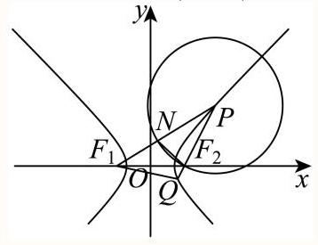

(2) 由题意得 ${x}_{0}^{2} - {y}_{0}^{2} = 2,{x}_{0} > \sqrt{2}$ ,故 ${y}_{0}^{2} = {x}_{0}^{2} - 2$ ,

$\left| {P{F}_{1}}\right|  = \sqrt{{\left( {x}_{0} + 2\right) }^{2} + {y}_{0}^{2}} = \sqrt{{\left( {x}_{0} + 2\right) }^{2} + {x}_{0}^{2} - 2} = \sqrt{2}{x}_{0} + \sqrt{2},$

$\left| {P{F}_{2}}\right|  = \sqrt{{\left( {x}_{0} - 2\right) }^{2} + {y}_{0}^{2}} = \sqrt{{\left( {x}_{0} - 2\right) }^{2} + {x}_{0}^{2} - 2} = \sqrt{2}{x}_{0} - \sqrt{2},$

则 $\frac{\left| P{F}_{1}\right| }{\left| P{F}_{2}\right| } = \frac{{x}_{0} + 1}{{x}_{0} - 1}$ ,即 ${x}_{0} = \frac{\left| {P{F}_{1}}\right|  + \left| {P{F}_{2}}\right| }{\left| {P{F}_{1}}\right|  - \left| {P{F}_{2}}\right| }$ ;

(3)由(1)得 ${y}_{1} + {y}_{2} =  - \frac{4m}{{m}^{2} - 1},{y}_{1}{y}_{2} = \frac{2}{{m}^{2} - 1} < 0$ ,故 $- 1 < m < 1$ , 因为 $\overrightarrow{P{F}_{2}} = \lambda \overrightarrow{{F}_{2}Q}\left( {\lambda  > 0}\right)$ ,所以 ${y}_{1} =  - \lambda {y}_{2}$ ,

当 $\lambda  = 1$ 时， $m = 0$ ， $P\left( {2,\sqrt{2}}\right)$ ， ${F}_{2}\left( {2,0}\right)$ ，故 $\left| {P{F}_{2}}\right|  = \sqrt{2}$ ， $\left| {P{F}_{1}}\right|  = {2a} + \left| {P{F}_{2}}\right|  = 3\sqrt{2}$ ，

$\left| {{F}_{1}{F}_{2}}\right|  = 4$ ,故 ${\left| P{F}_{2}\right| }^{2} + {\left| {F}_{1}{F}_{2}\right| }^{2} = {\left| P{F}_{1}\right| }^{2}$ ,所以 $P{F}_{2} \bot  {F}_{1}{F}_{2}$ ,

$\sin \angle {F}_{1}P{F}_{2} = \frac{\left| {F}_{1}{F}_{2}\right| }{\left| P{F}_{1}\right| } = \frac{4}{3\sqrt{2}} = \frac{2\sqrt{2}}{3},$

则 ${S}_{1} = \frac{1}{2}\left| {P{F}_{2}}\right|  \cdot  \left| {PN}\right| \sin \angle {F}_{1}P{F}_{2} = \frac{1}{2} \times  \sqrt{2} \times  \sqrt{2} \times  \frac{2\sqrt{2}}{3} = \frac{2\sqrt{2}}{3}$ ,

由对称性可知 ${S}_{2} = 2{S}_{\bigtriangleup P{F}_{1}{F}_{2}} = 2 \times  \frac{1}{2}{S}_{1} = 2 \times  \frac{1}{2}\left| {P{F}_{2}}\right|  \cdot  \left| {{F}_{1}{F}_{2}}\right|  = 4\sqrt{2}$ ,

则 $\frac{{S}_{2} + \lambda {S}_{1}}{{S}_{1}} = \frac{{S}_{2} + {S}_{1}}{{S}_{1}} = \frac{4\sqrt{2} + \frac{2\sqrt{2}}{3}}{\frac{2\sqrt{2}}{3}} = 7$ ,

当 $\lambda  \neq  1$ 时, $- \lambda {y}_{2} + {y}_{2} =  - \frac{4m}{{m}^{2} - 1}, - \lambda {y}_{2}^{2} = \frac{2}{{m}^{2} - 1}$ ,

由 $- \lambda {y}_{2} + {y}_{2} =  - \frac{4m}{{m}^{2} - 1}$ 得 ${y}_{2} = \frac{4m}{\left( {\lambda  - 1}\right) \left( {{m}^{2} - 1}\right) }$ ,

将其代入 $- \lambda {y}_{2}^{2} = \frac{2}{{m}^{2} - 1}$ 中得 $- \lambda \frac{{16}{m}^{2}}{{\left( \lambda  - 1\right) }^{2}{\left( {m}^{2} - 1\right) }^{2}} = \frac{2}{{m}^{2} - 1}$ ,

显然,当 $0 < \lambda  < 1$ 时, $m < 0$ ,当 $\lambda  > 1$ 时, $m > 0$ ,

解得 $m =  - \frac{1 - \lambda }{\sqrt{1 + {6\lambda } + {\lambda }^{2}}},{y}_{2} =  - \frac{\sqrt{1 + {6\lambda } + {\lambda }^{2}}}{2\lambda },{y}_{1} = \frac{\sqrt{1 + {6\lambda } + {\lambda }^{2}}}{2}$ ,

因为 $\frac{{S}_{2}}{{S}_{1}} = \frac{\frac{1}{2}\left| {P{F}_{1}}\right|  \cdot  \left| {PQ}\right| \sin \angle {F}_{1}{PQ}}{\frac{1}{2}\left| {PN}\right|  \cdot  \left| {P{F}_{2}}\right| \sin \angle {F}_{1}{PQ}} = \frac{\left| {P{F}_{1}}\right|  \cdot  \left| {PQ}\right| }{{\left| P{F}_{2}\right| }^{2}}$ ,

其中 $m{y}_{1} =  - \frac{1 - \lambda }{\sqrt{1 + {6\lambda } + {\lambda }^{2}}} \cdot  \frac{\sqrt{1 + {6\lambda } + {\lambda }^{2}}}{2} = \frac{\lambda  - 1}{2}$ ,

由 (2) 知 $\frac{\left| P{F}_{1}\right| }{\left| P{F}_{2}\right| } = \frac{{x}_{1} + 1}{{x}_{1} - 1} = \frac{m{y}_{1} + 3}{m{y}_{1} + 1} = \frac{\lambda  + 5}{\lambda  + 1}$ ,

又 $\overrightarrow{P{F}_{2}} = \lambda \overrightarrow{{F}_{2}Q}\left( {\lambda  > 0}\right)$ ,故 $\frac{\left| PQ\right| }{\left| P{F}_{2}\right| } = \frac{\left| {P{F}_{2}}\right|  + \left| {{F}_{2}Q}\right| }{\left| P{F}_{2}\right| } = \frac{\lambda  + 1}{\lambda }$ ,

故 $\frac{{S}_{2}}{{S}_{1}} = \frac{\left| {P{F}_{1}}\right|  \cdot  \left| {PQ}\right| }{{\left| P{F}_{2}\right| }^{2}} = \frac{\lambda  + 5}{\lambda  + 1} \cdot  \frac{\lambda  + 1}{\lambda } = \frac{\lambda  + 5}{\lambda }$ ,

所以 $\frac{{S}_{2} + \lambda {S}_{1}}{{S}_{1}} = \frac{\lambda  + 5}{\lambda } + \lambda  = 1 + \frac{5}{\lambda } + \lambda  \geq  1 + 2\sqrt{\frac{5}{\lambda } \cdot  \lambda } = 1 + 2\sqrt{5}$ ,

当且仅当 $\frac{5}{\lambda } = \lambda$ ,即 $\lambda  = \sqrt{5}$ 时等号成立,此时 $m = \frac{\sqrt{5} - 1}{\sqrt{6 + 6\sqrt{5}}}$ ,

由于 $1 + 2\sqrt{5} < 7$ ,

故 ${\left( \frac{{S}_{2} + \lambda {S}_{1}}{{S}_{1}}\right) }_{\min } = 1 + 2\sqrt{5}$ .

10 解答题

给定函数 $f\left( x\right)$ ，若过点 $P$ 恰能作曲线 $y = f\left( x\right)$ 的 $k$ 条切线 $\left( {k \in  \mathbf{N}}\right)$ ，则称 $P$ 是 $f\left( x\right)$ 的“ $k$ 秩点”，切点的横坐标为 $f\left( x\right)$ 的“ $k$ 秩数”.

(1)若 $A\left( {1,0}\right)$ 是函数 $y = {x}^{2}$ 的“ $k$ 秩点”，求其“ $k$ 秩数”；

(2)证明: $B\left( {0,2}\right)$ 是函数 $y = \cos x\left( {-{2\pi } \leq  x \leq  {2\pi }}\right)$ 的“0秩点”；

(3)记使函数 $y = {x}^{3} - x$ 的“1秩数”小于0的“1秩点”构成的集合为Γ.证明:对 $\forall M\left( {{x}_{1},{y}_{1}}\right)$ ，

$N\left( {{x}_{2},{y}_{2}}\right)  \in  \Gamma$ ,且 ${x}_{2} - {x}_{1} > 1$ ,有 $2{y}_{1} + {y}_{2} > 0$ .

答案

(1)0 和 2

(2)证明见解析

(3)证明见解析

## 解析

(1)设切点为 $\left( {t,{t}^{2}}\right)$ ，由已知得 ${y}^{\prime } = {2x}$ ，所以切线方程为 $y = {2t}\left( {x - t}\right)  + {t}^{2}$ ，

又切线过点 $A\left( {1,0}\right)$ ,将其代入切线方程得 $0 = {2t} - {t}^{2}$ ,即 $\left( {2 - t}\right) t = 0$ ,

所以 $t = 0$ 或 2,则 “ $k$ 秩数”为 0 和 2 .

(2)假设过点 $B\left( {0,2}\right)$ 存在切线与函数 $y = \cos x$ 相切，设切点为 $\left( {t,\cos t}\right)$ ，且有 ${y}^{\prime } =  - \sin x$ ， 所以切线方程为 $y =  - \sin t\left( {x - t}\right)  + \cos t$ ,

又切线过点 $B\left( {0,2}\right)$ ,所以 $2 = t\sin t + \cos t$ ,

令 $g\left( t\right)  = t\sin t + \cos t - 2, t \in  \left\lbrack  {-{2\pi },{2\pi }}\right\rbrack$ ,则 ${g}^{\prime }\left( t\right)  = t\cos t$ .

令 ${g}^{\prime }\left( t\right)  = 0$ ,解得 $t =  - \frac{3}{2}\pi , - \frac{\pi }{2},0,\frac{\pi }{2}$ 或 $\frac{3}{2}\pi$ ,

当 $t \in  \left\lbrack  {-{2\pi }, - \frac{3}{2}\pi }\right)  \cup  \left( {-\frac{\pi }{2},0}\right)  \cup  \left( {\frac{\pi }{2},\frac{3}{2}\pi }\right) \;$ 时 ， ${g}^{\prime }\left( t\right)  < 0$ ，当

$t \in  \left( {-\frac{3}{2}\pi , - \frac{\pi }{2}}\right)  \cup  \left( {0,\frac{\pi }{2}}\right)  \cup  \left( {\frac{3}{2}\pi ,{2\pi }}\right\rbrack$ 时, ${g}^{\prime }\left( t\right)  > 0,$

故 $g\left( t\right)$ 在区间 $\left\lbrack  {-{2\pi }, - \frac{3\pi }{2}}\right) ,\left( {-\frac{\pi }{2},0}\right) ,\left( {\frac{\pi }{2},\frac{3}{2}\pi }\right)$ 上单调递减,在区间 $\left( {-\frac{3}{2}\pi , - \frac{\pi }{2}}\right)$ ,

$\left( {0,\frac{\pi }{2}}\right) ,\left( {\frac{3}{2}\pi ,{2\pi }}\right\rbrack$ 上单调递增,

所以 $g{\left( t\right) }_{\max } = {\left\{  g\left( -2\pi \right) , g\left( -\frac{\pi }{2}\right) , g\left( \frac{\pi }{2}\right) , g\left( 2\pi \right) \right\}  }_{\max }$ ,又 $g\left( {-{2\pi }}\right)  = g\left( {2\pi }\right)  =  - 1$ , $g\left( {-\frac{\pi }{2}}\right)  = g\left( \frac{\pi }{2}\right)  = \frac{\pi }{2} - 2,$

故 $g{\left( t\right) }_{\max } = \frac{\pi }{2} - 2 < 0$ ,故 $\forall t \in  \left\lbrack  {-{2\pi },{2\pi }}\right\rbrack  , g\left( t\right)  < 0$ ,即方程 $2 = t\sin t + \cos t$ 无实数解,假设不成立.

故 $B\left( {0,2}\right)$ 是 $y = \cos x\left( {-{2\pi } \leq  x \leq  {2\pi }}\right)$ 的“0秩点”.

(3)证明:由已知得 ${y}^{\prime } = 3{x}^{2} - 1$ ，则曲线 $y = {x}^{3} - x$ 在点 $\left( {t,{t}^{3} - t}\right)$ 处的切线方程为

$y - \left( {{t}^{3} - t}\right)  = \left( {3{t}^{2} - 1}\right) \left( {x - t}\right) .$

故点 $\left( {a, b}\right)  \in  \Gamma$ 当且仅当关于 $t$ 的方程 $b - \left( {{t}^{3} - t}\right)  = \left( {3{t}^{2} - 1}\right) \left( {a - t}\right)$ ,

即 $2{t}^{3} - {3a}{t}^{2} + \left( {a + b}\right)  = 0$ 恰有一个实数解,且该解为负值.

设 $h\left( t\right)  = 2{t}^{3} - {3a}{t}^{2} + \left( {a + b}\right)$ ,则点 $\left( {a, b}\right)  \in  \Gamma$ 当且仅当 $y = h\left( t\right)$ 恰有一个零点,且该零点小于0 .

① 若 $a = 0$ ，则 $h\left( t\right)  = 2{t}^{3} + b$ 在 $\mathbf{R}$ 上是增函数， $h\left( 0\right)  = b$ ，要想 $y = h\left( t\right)$ 恰有一个零点，且该零点小于 0，需满足 $b > 0$ ；

②若 $a > 0$ ，因为 ${h}^{\prime }\left( t\right)  = 6{t}^{2} - {6at}$ ，令 ${h}^{\prime }\left( t\right)  = 0$ ，解得 $t = 0$ 或 $t = a$ ，列表如下:

<table><tr><td>$t$</td><td>$\left( {-\infty ,0}\right)$</td><td>0</td><td>(0, a)</td><td>$a$</td><td>$\left( {a, + \infty }\right)$</td></tr><tr><td>${h}^{\prime }\left( t\right)$</td><td>+</td><td>0</td><td>-</td><td>0</td><td>+</td></tr><tr><td>$h\left( t\right)$</td><td>↗</td><td>极大值 $h\left( 0\right)$</td><td>↘</td><td>极小值 $h\left( a\right)$</td><td>↗</td></tr></table>

所以 $h\left( a\right)  = b + a - {a}^{3} > 0$ ,即 $b > {a}^{3} - a$ ;

③若 $a < 0$ ，同理可得 $h\left( 0\right)  = a + b > 0$ ，即 $b >  - a$ .

综上所述， $\Gamma  = \{ \left( {a, b}\right)  \mid  b > {a}^{3} - a$ 且 $a \geq  0\}  \cup  \{ \left( {a, b}\right)  \mid  b >  - a > 0\}$ ，

所以对 $\forall M\left( {{x}_{1},{y}_{1}}\right) , N\left( {{x}_{2},{y}_{2}}\right)  \in  \Gamma$ ,若 ${x}_{i} \geq  0$ ,则 ${y}_{i} > {x}_{i}^{3} - {x}_{i}$ ; 若 ${x}_{i} \leq  0$ ,则 ${y}_{i} >  - {x}_{i}$ ( $i = 1,2)$ .

① 当 ${x}_{2} \leq  0$ 时， ${x}_{1} < {x}_{2} - 1$ ，所以 $2{y}_{1} + {y}_{2} >  - 2{x}_{1} - {x}_{2} >  - 2\left( {{x}_{2} - 1}\right)  - {x}_{2} = 2 - 3{x}_{2} \geq  2$ ,即 $2{y}_{1} + {y}_{2} > 0$ .

② 当 ${x}_{1} < 0 < {x}_{2}$ 时 ， ${x}_{1} < {x}_{2} - 1$ ，所以

$2{y}_{1} + {y}_{2} >  - 2{x}_{1} + {x}_{2}^{3} - {x}_{2} > 2 - 2{x}_{2} + {x}_{2}^{3} - {x}_{2} = {x}_{2}^{3} - 3{x}_{2} + 2$ .

令 $m\left( x\right)  = {x}^{3} - {3x} + 2, x > 0$ ,则 ${m}^{\prime }\left( x\right)  = 3{x}^{2} - 3$ ,令 ${m}^{\prime }\left( x\right)  = 0$ ,得 $x = 1$ ,

当 $0 < x < 1$ 时， ${m}^{\prime }\left( x\right)  < 0, m\left( x\right)$ 单调递减；当 $x > 1$ 时， ${m}^{\prime }\left( x\right)  > 0, m\left( x\right)$ 单调递增.

所以 $m\left( x\right)  \geq  m\left( 1\right)  = 0$ ,所以 $2{y}_{1} + {y}_{2} > 0$ .

③ 当 ${x}_{1} \geq  0\;$ 时， ${x}_{2} > {x}_{1} + 1 \geq  1$ ，所以

$2{y}_{1} + {y}_{2} > 2\left( {{x}_{1}^{3} - {x}_{1}}\right)  + \left( {{x}_{2}^{3} - {x}_{2}}\right)  > 2{x}_{1}^{3} - 2{x}_{1} + {\left( {x}_{1} + 1\right) }^{3} - \left( {{x}_{1} + 1}\right)  = 3{x}_{1}^{3} + 3{x}_{1}^{2}.$

令 $n\left( x\right)  = 3{x}^{3} + 3{x}^{2}, x \geq  0$ ,则 ${n}^{\prime }\left( x\right)  = 9{x}^{2} + {6x} \geq  0$ ,所以 $n\left( x\right)$ 单调递增,

所以 $n\left( x\right)  \geq  n\left( 0\right)  = 0$ ,所以 $2{y}_{1} + {y}_{2} > 0$ .

综上所述,对 $\forall M\left( {{x}_{1},{y}_{1}}\right) , N\left( {{x}_{2},{y}_{2}}\right)  \in  \Gamma$ ,且 ${x}_{2} - {x}_{1} > 1$ ,有 $2{y}_{1} + {y}_{2} > 0$ .
