## 12 新定义问题

## 学习目标

<table><tr><td>目标1</td><td>****** 综合</td><td>掌握运算、方法等新定义题型解题技巧</td></tr><tr><td>目标2</td><td>****** 综合</td><td>掌握其他新定义问题求解</td></tr></table>

## 知识清单

## 知识点一:运算、方法新定义

## 考点1:运算新定义

知识笔记

## ○ 运算新定义

运算类的新定义问题一般是题目给出一种新方法或者给出一种新的结论，可以通过类比或者直接使用题目所给方法、结论去进行计算，然后进行问题的求解。

## 经典例题

- 母题1

对实数 $\mathrm{a}$ 和 $\mathrm{b}$ ,定义运算 “ $\odot$ ” : $a \odot  b = \left\{  \begin{array}{l} a, a - b \leq  2 \\  b, a - b > 2 \end{array}\right.$ ,设函数 $f\left( x\right)  = \left( {{x}^{2} - 1}\right)  \odot  \left( {{5x} - {x}^{2}}\right) \left( {x \in  \mathrm{R}}\right)$ ,若函数 $y = f\left( x\right)  - m$ 的图象与x轴恰有1个公共点，则实数m的取值范围是( )

A. $( - 1,6\rbrack$

B. $( - \infty , - 1\rbrack  \cup  \left( {-\frac{11}{4},6}\right)$ C. $\left( {-\frac{11}{4}, + \infty }\right)$ D. $\left\lbrack  {-\frac{11}{4}, - 1}\right)  \cup  \left\lbrack  {6,8}\right\rbrack$

## 变式1-1

设 $m\text{ 、 }n \in  \mathbf{R}$ ,定义运算“ $\bigtriangleup$ ”和“ $\bigtriangledown$ ”如下: $m \bigtriangleup  n = \left\{  \begin{array}{l} m, m \leq  n, \\  n, m > n, \end{array}\right. m \bigtriangledown  n = \left\{  \begin{array}{l} n, m \leq  n, \\  m, m > n. \end{array}\right.$ 若正数 $m\text{ 、 }n\text{ 、 }p\text{ 、 }q$ 满足 ${mn} \geq  4, p + q \leq  4$ ,则 ( )

A. $m\bigtriangleup n \geq  2, p\bigtriangleup q \leq  2$ B. $m \bigtriangledown  n \geq  2, p \bigtriangledown  q \geq  2$ C. $m\bigtriangleup n \geq  2, p \bigtriangledown  q \geq  2$ D. $m \bigtriangledown  n \geq  2, p\bigtriangleup q \leq  2$

## 变式1-2

衡量曲线弯曲程度的重要指标是曲率,曲线的曲率定义如下:记 $y = {f}^{\prime }\left( x\right)$ 为 $y = f\left( x\right)$ 的导函数, $y = {f}^{\prime \prime }\left( x\right)$ 为 $y = {f}^{\prime }\left( x\right)$ 的导函数,则曲线 $y = f\left( x\right)$ 在点 $\left( {x, f\left( x\right) }\right)$ 处的曲率为 $K = \frac{\left| {f}^{\prime \prime }\left( x\right) \right| }{{\left( 1 + {\left( {f}^{\prime }\left( x\right) \right) }^{2}\right) }^{\frac{3}{2}}}$ . 曲线 $f\left( x\right)  = \ln x - \cos \left( {x - 1}\right)$ 在点 $\left( {1, f\left( 1\right) }\right)$ 处的曲率为___.

## 变式1-3

设向量 $\overrightarrow{a} = \left( {{x}_{1},{y}_{1}}\right) ,\overrightarrow{b} = \left( {{x}_{2},{y}_{2}}\right)$ ，记 $\overrightarrow{a} \cdot  \overrightarrow{b} = {x}_{1}{x}_{2} - {y}_{1}{y}_{2}$ ，若圆 $C : {x}^{2} + {y}^{2} - {4x} + {8y} = 0$ 上的任意三点 ${A}_{1}\text{ ， }{A}_{2}$ ， ${A}_{3}$ ，且 ${A}_{1}{A}_{2}\bot {A}_{2}{A}_{3}$ ，则 $\left| {\overrightarrow{O{A}_{1}} \cdot  \overrightarrow{O{A}_{2}} + \overrightarrow{O{A}_{2}} \cdot  \overrightarrow{O{A}_{3}}}\right|$ 的最大值是___.

## 3 变式1-4

设复数 ${z}_{1} = a + b\mathrm{i},{z}_{2} = c + d\mathrm{i}$ ，其中 $a\text{ 、 }b\text{ 、 }c\text{ 、 }d \in  \mathrm{R}$ . 现在复数系中定义一个新运算 $\infty$ ，规定: ${z}_{1} \otimes  {z}_{2} = \left( {{ac} + {bd}}\right)  + \left( {{ad} + {bc}}\right) \mathrm{i}.$

(1) 已知 $\left| {\left( {2 - \mathrm{i}}\right)  \otimes  \left( {x + \mathrm{i}}\right) }\right|  = \sqrt{2}$ ，求实数 $\mathrm{x}$ 的值；

(2)现给出如下有关复数新运算 $\otimes$ 性质的两个命题:

① $\overline{{z}_{1} \otimes  {z}_{2}} = \overline{{z}_{1}} \otimes  \overline{{z}_{2}}$ ；

② 若 ${z}_{1} \otimes  {z}_{2} = 0$ ，则 ${z}_{1} = 0$ 或 ${z}_{2} = 0$ .

请判定以上两个命题是真命题还是假命题，并说明理由.

2 变式1-5

“曼哈顿距离”是十九世纪的赫尔曼·闵可夫斯基所创，定义如下:在直角坐标平面上任意两点 $A\left( {{x}_{1},{y}_{1}}\right) , B\left( {{x}_{2},{y}_{2}}\right)$ 的“曼哈顿距离”为 $d\left( {A, B}\right)  = \left| {{x}_{1} - {x}_{2}}\right|  + \left| {{y}_{1} - {y}_{2}}\right|$ ，已知动点N在圆 ${x}^{2} + {y}^{2} = 9$ 上，定点 $M\left( {3,4}\right)$ ，则 $M,\mathrm{\;N}$ 两点的“曼哈顿距离”的最大值为 .

## 考点2:方法新定义

## 知识笔记

## ○ 方法新定义

这一类问题通常会先给出一种解题的思路和方法，让我们通过类比、转换，用同样的思路和方法去求解给出的不同问题。这类问题中有些题目我们直接按照给出的方法直接求解就好，但是有些直接求解无法完成的题目，可能就需要我们结合具体题目在所给方法上进行改动。

9 母题2

解不等式 ${\left( \frac{1}{2}\right) }^{x} - x + \frac{1}{2} > 0$ 时，可构造函数 $f\left( x\right)  = {\left( \frac{1}{2}\right) }^{x} - x$ ,由 $f\left( x\right)$ 在 $x \in  R$ 是减函数，及 $f\left( x\right)  > f\left( 1\right)$ ，可得 $x < 1$ ，用类似的方法可求得不等式 $\arcsin {x}^{2} + \arcsin x + {x}^{6} + {x}^{3} > 0$ 的解集为 ( )

A. $\left( {0,1}\right)$ B. $\left( {-1,1}\right)$ C. $( - 1,1\rbrack$ D. $\left( {-1,0}\right)$

变式2-1

代数式 $1 + \frac{1}{1 + \frac{1}{1 + \ldots }}$ 中省略号“…”代表此方式无限重复，因原式是一个固定值，可以用如下方法求得:令原式 $= t$ ,则 $1 + \frac{1}{t} = t$ ,则 ${t}^{2} - t - 1 = 0$ ,取正值得 $t = \frac{\sqrt{5} + 1}{2}$ ,用类似方法可得 $\sqrt{6 + \sqrt{6 + \sqrt{6 + \ldots }}} =$ ___.

## 变式2-2

计算 ${C}_{n}^{1} + 2{C}_{n}^{2} + 3{C}_{n}^{3} + \cdots  + n{C}_{n}^{n}$ ,可以采用以下方法:

构造等式: ${C}_{n}^{0} + {C}_{n}^{1}x + {C}_{n}^{2}{x}^{2} + \cdots  + {C}_{n}^{n}{x}^{n} = {\left( 1 + x\right) }^{n}$ ，两边对x求导，

得 ${C}_{n}^{1} + 2{C}_{n}^{2}x + 3{C}_{n}^{3}{x}^{2} + \cdots  + n{C}_{n}^{n}{x}^{n - 1} = n{\left( 1 + x\right) }^{n - 1}$ ，

在上式中令 $x = 1$ ,得 ${C}_{n}^{1} + 2{C}_{n}^{2} + 3{C}_{n}^{3} + \cdots  + n{C}_{n}^{n} = n \cdot  {2}^{n - 1}$ . 类比上述计算方法,计算

${C}_{n}^{1} + {2}^{2}{C}_{n}^{2} + {3}^{2}{C}_{n}^{3} + \cdots  + {n}^{2}{C}_{n}^{n} =$

变式2-3

$\bigtriangleup  {ABC}$ 内一点 $F$ (见图1)，式子 ${FA} + {FC} + {FB}$ 可以写成1 $\times  {FA} + 1 \times  {FC} + 1 \times  {FB}$ ，这个式子中 ${FA}$ 、 ${FC}$ 、 ${FB}$ 的系数均为1，以三个系数1作为边长可构造一个等边三角形，因此我们尝试把 $\bigtriangleup  {AFC}$ 绕点 $C$ 顺时针旋转 $\frac{\pi }{3}$ ，得到 $\bigtriangleup  {A}^{\prime }{F}^{\prime }C$ (见图2) ，所以 ${FA} + {FC} + {FB}$ 等于 ${F}^{\prime }{A}^{\prime } + {F}^{\prime }F + {FB}$ ，显然 ${F}^{\prime }{A}^{\prime } + {F}^{\prime }F + {FB} \geq  {A}^{\prime }B$ ，当 ${A}^{\prime }$ 、 ${F}^{\prime }$ 、 $F$ 、 $B$ 四点共线时 (见图3), ${FA} + {FC} + {FB}$ 最小.

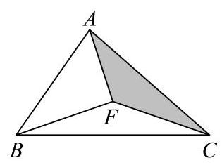

图1

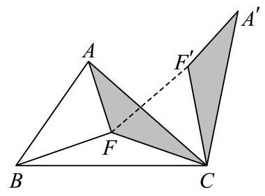

图2

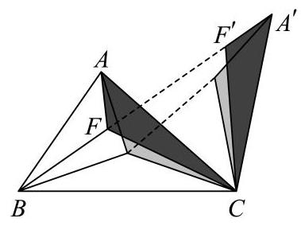

图3

试用类似的方法解决下面这道题目:

已知 $\overrightarrow{a}$ 是平面内的任意一个向量，向量 $\overrightarrow{b}$ 、 $\overrightarrow{c}$ 满足 $\overrightarrow{b} \cdot  \overrightarrow{c} = 0$ ，且 $\left| \overrightarrow{b}\right|  = 4$ ，则 $\sqrt{2}\left| {\overrightarrow{a} - \overrightarrow{b}}\right|  + \left| {\overrightarrow{a} - \overrightarrow{c}}\right|  + \left| {\overrightarrow{a} + \overrightarrow{c}}\right|$ 的最小值为___.

## 知识点二 新定义问题

## 。考点3:新定义问题

## 知识笔记

## 新定义问题

该考点下的新定义问题主要是题目给出新定义，比如常见的“xx函数”、“xx性质”等等。这一类问题重心在于先理解新定义，认识到新定义下的函数、数列所满足的性质。之后结合题目一般会出现以下几种问题:(以函数为例)

(1)满足型:给出 $f\left( x\right)$ 满足新定义性质，去求解该 $f\left( x\right)$ 相关的问题。

解法思路:将 $f\left( x\right)$ 所满足的性质作为已知条件去应用

(2)验证型:给出新定义性质，让我们验证函数 $f\left( x\right)$ 具有相应性质

解法思路:假设 $f\left( x\right)$ 具有该性质，列出式子观察或者计算是否成立；或者使用反证法

(3)综合型:给出函数新定义概念，求解各类新定义相关问题

## 经典例题

9 母题3

对于定义域为 $D$ 的函数 $y = f\left( x\right)$ ，区间 $I \subseteq  D.$ 若 $\{ y \mid  y = f\left( x\right) , x \in  I\}  = I$ ，则称 $y = f\left( x\right)$ 为 $I$ 上的闭函数:若存在常数 $\alpha  \in  (0,1\rbrack$ ,对于任意的 ${x}_{1},{x}_{2} \in  I$ ,都有 $\left| {f\left( {x}_{1}\right)  - f\left( {x}_{2}\right) }\right|  \leq  \alpha \left| {{x}_{1} - {x}_{2}}\right|$ ,则称 $y = f\left( x\right)$ 为 $I$ 上的压缩函数.

(1)判断命题“函数 $f\left( x\right)  = \sqrt{x}\left( {x \in  \left\lbrack  {0,1}\right\rbrack  }\right)$ 既是闭函数，又是压缩函数”的真假，并说明理由；

(2)已知函数 $y = f\left( x\right)$ 是区间[0,1]上的闭函数，且是区间[0,1]上的压缩函数，求函数 $y = f\left( x\right)$ 在区间[0,1]上的解析式, 并说明理由;

(3)给定常数 $k > 0$ ，以及关于 $x$ 的函数 $f\left( x\right)  = \left\lceil  {1 - \frac{k}{x}}\right\rceil$ ，是否存在实数 $a, b\left( {a < b}\right)$ 使得 $y = f\left( x\right)$ 是区间 $\left\lbrack  {a\text{ , }b}\right\rbrack$ 上的闭函数,若存在,求出 $a\text{ 、 }b$ 的值,若不存在,说明理由.

变式3-1

在计算机语言中，有一种函数 $y = \operatorname{INT}\left( x\right)$ 叫做取整函数(也叫高斯函数)，它表示y等于不超过 $x$ 的最大整数，如 $\operatorname{INT}\left( {0.9}\right)  = 0,\operatorname{INT}\left( {3.14}\right)  = 3$ ,已知 ${a}_{n} = \operatorname{INT}\left( {\frac{2020}{7} \times  {10}^{n}}\right) ,{b}_{1} = {a}_{1},{b}_{n} = {a}_{n} - {10}{a}_{n - 1}\left( {n \in  {\mathbf{N}}^{ * }\text{ ,且 }n \geq  2}\right)$ , 则数列 $\left\{  {b}_{n}\right\}$ 的前 2020 项的和 ${S}_{2020} =$

## 变式3-2

若从无穷数列 $\left\{  {a}_{n}\right\}$ 中任取若干项 ${a}_{{n}_{1}},{a}_{{n}_{2}},\ldots ,{a}_{{n}_{k}}$ (其中 ${n}_{1} < {n}_{2} < \cdots  < {n}_{k}$ ) 都依次为数列 $\left\{  {b}_{n}\right\}$ 中的连续 $k$ 项，则称 $\left\{  {b}_{n}\right\}$ 是 $\left\{  {a}_{n}\right\}$ 的“衍生数列”. 给出以下两个命题:

(1)数列 $1,2,3,\cdots , n,\cdots$ 是某个数列的“衍生数列”；

(2)若 $\left\{  {a}_{n}\right\}$ 各项均为0或1，且是自身的“衍生数列”，则 $\left\{  {a}_{n}\right\}$ 从某一项起为常数列. 下列判断正确的是( ).

A. (1)(2)均为真命题 B. (1)(2)均为假命题

C. (1)为真命题，(2)为假命题 D. (1)为假命题，(2)为真命题

## 变式3-3

定义函数 $f\left( x\right)  = \{ \mathrm{x}\{ \mathrm{x}\} \}$ ，其中 $\{ \mathrm{x}\}$ 表示不小于 $\mathrm{x}$ 的最小整数，如 $\{ {1.4}\}  = 2$ ， $\{  - {2.3}\}  =  - 2$ ，当 $x \in  (0, n\rbrack ,\left( {n \in  {N}^{ * }}\right)$ 时， 函数 $f\left( x\right)$ 的值域为 ${\mathrm{A}}_{\mathrm{n}}$ ，记集合 ${\mathrm{A}}_{\mathrm{n}}$ 中元素的个数为 ${\mathrm{a}}_{\mathrm{n}}$ ，则 ${\mathrm{a}}_{\mathrm{n}} =$ ___ .

## 变式3-4

Cas $\sin i$ 卵形线是由法国天文家 Jean - DominiqueCas $\sin i\left( {{1625} - {1712}}\right)$ 引入的 . 卵形线的定义是:线上的任何点到两个固定点 $A, B$ 的距离的乘积等于常数 ${b}^{2}, b$ 是正常数，设 $A, B$ 的距离为 ${2a}$ ，当 $a = b$ 时称得到的卵形线为双纽线. 已知在平面直角坐标系 ${xOy}$ 中,到两定点 $A\left( {-a,0}\right) , B\left( {a,0}\right)$ 距离之积为常数的点的轨迹 $C$ 是双纽线, $P\left( {x}_{0}\right.$ , ${y}_{0})$ 是曲线 $C$ 上一点,则 ( )

A. 曲线 $C$ 关于原点 $O$ 中心对称 B. ${x}_{0}$ 的取值范围是 $\left\lbrack  {-a, a}\right\rbrack$

C. ${\left| PO\right| }^{2} - {a}^{2}$ 的最大值为 $\frac{{a}^{2}}{2}$ D. 曲线 $C$ 上有且仅有一个点 $P$ 满足 $\left| {PA}\right|  = \left| {PB}\right|$

变式3-5

如图直线 $l$ 以及三个不同的点 $A,{A}^{\prime }, O$ ,其中 $O \in  l$ ,设 $\overrightarrow{OA} = \overrightarrow{a},\overrightarrow{O{A}^{\prime }} = \overrightarrow{b}$ ,直线 $l$ 的一个方向向量的单位向量是 $\overrightarrow{e}$ , 下列关于向量运算的方程甲: $\left\{  \begin{array}{l} \left| {\overrightarrow{a} - \left( {\overrightarrow{a} \cdot  \overrightarrow{e}}\right) \overrightarrow{e}}\right|  = \left| {\overrightarrow{b} - \left( {\overrightarrow{b} \cdot  \overrightarrow{e}}\right) \overrightarrow{e}}\right| \\  \overrightarrow{a} \cdot  \overrightarrow{e} = \overrightarrow{b} \cdot  \overrightarrow{e} \end{array}\right.$ ,乙: $\overrightarrow{a} + \overrightarrow{b} = 2\left( {\overrightarrow{a} \cdot  \overrightarrow{e}}\right) \overrightarrow{e}$ ,其中是否可以作为 $A,{A}^{\prime }$ 关于直线 $l$ 对称的充要条件的方程(组)，下列说法正确的是( )

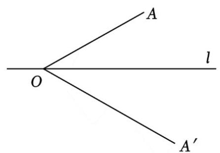

A. 甲乙都可以 B. 甲可以, 乙不可以 C. 甲不可以, 乙可以 D. 甲乙都不可以

- 母题4

向量的运算包含点乘和叉乘，其中点乘就是大家熟悉的向量的数量积. 现定义向量的叉乘:给定两个不共线的空间向量 $\overrightarrow{a}$ 与 $\overrightarrow{b},\overrightarrow{a} \times  \overrightarrow{b}$ 规定: $\left( {\overrightarrow{0a} \times  \overrightarrow{b}}\right)$ 为同时与 $\overrightarrow{a},\overrightarrow{b}$ 垂直的向量； $\left( {\overrightarrow{0a},\overrightarrow{b}}\right) ,\overrightarrow{a} \times  \overrightarrow{b}$ 三个向量构成右手系(如图1)；③ $\left| {\overrightarrow{a} \times  \overrightarrow{b}}\right|  = \left| \overrightarrow{a}\right| \left| \overrightarrow{b}\right| \sin  < \overrightarrow{a},\overrightarrow{b} > ;$ ④若 $\overrightarrow{a} = \left( {{x}_{1},{y}_{1},{z}_{1}}\right) ,\overrightarrow{b} = \left( {{x}_{2},{y}_{2},{z}_{2}}\right)$ ,则 $\overrightarrow{a} \times  \overrightarrow{b} = \left( {+\left| \begin{array}{l} {y}_{1},{z}_{1} \\  {y}_{2},{z}_{2} \end{array}\right| , - \left| \begin{array}{l} {x}_{1},{z}_{1} \\  {x}_{2},{z}_{2} \end{array}\right| , + \left| \begin{array}{l} {x}_{1},{y}_{1} \\  {x}_{2},{y}_{2} \end{array}\right| }\right)$ ,其中 $\left| \begin{array}{l} a, b \\  c, d \end{array}\right|  = {ad} - {bc}$ . 如图2,在长方体中 ${ABCD} - {A}_{1}{B}_{1}{C}_{1}{D}_{1}$ , ${AB} = {AD} = 2, A{A}_{1} = 3$ ，则下列结论正确的是( )

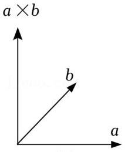

图1

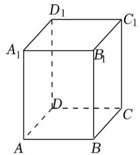

图2

A. $\left| {\overrightarrow{AB} \times  \overrightarrow{AD}}\right|  = \left| \overrightarrow{A{A}_{1}}\right|$

B. $\overrightarrow{AB} \times  \overrightarrow{AD} = \overrightarrow{AD} \times  \overrightarrow{AB}$

C. $\left( {\overrightarrow{AB} - \overrightarrow{AD}}\right)  \times  \overrightarrow{A{A}_{1}} = \overrightarrow{AB} \times  \overrightarrow{A{A}_{1}} - \overrightarrow{AD} \times  \overrightarrow{A{A}_{1}}$

D. 长方体 ${ABCD} - {A}_{1}{B}_{1}{C}_{1}{D}_{1}$ 的体积 $V = \left( {\overrightarrow{AB} \times  \overrightarrow{AD}}\right)  \cdot  \overrightarrow{{C}_{1}C}$

9 变式4-1 祖暅原理:“幂势既同，则积不容异”. 即:夹在两个平行平面之间的两个几何体，被平行于这两个平面的任意平面所截，如果截得的两个截面的面积总相等，那么这两个几何体的体积相等. 已知在 ${xOy}$ 平面上，将两个半圆弧 ${\left( x - 1\right) }^{2} + {y}^{2} = 1\left( {x \geq  1}\right)$ 和 ${\left( x - 3\right) }^{2} + {y}^{2} = 1\left( {x \geq  3}\right)$ ，两条直线 $y = 1$ 和 $y =  - 1$ 围成的封闭图形记为 $D$ ，如图中阴影部分，记 $D$ 绕 $y$ 轴旋转一周而成的几何体为 $\Omega$ . 过 $\left( {0, y}\right) \left( {\left| y\right|  \leq  1}\right)$ 作 $\Omega$ 的水平截面，所得截面积为 ${4\pi }\sqrt{1 - {y}^{2}} + {8\pi }$ . 试利用祖暅原理、一个平放的圆柱和一个长方体，得出 $\Omega$ 的体积值为

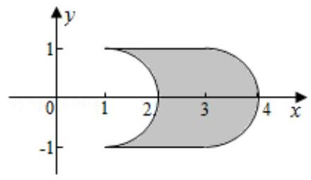

## 变式4-2

在数列的极限一节，课本中给出了计算由抛物线 $y = {x}^{2}$ 、 $x$ 轴以及直线 $x = 1$ 所围成的曲边区域面积 $S$ 的一种方法: 把区间 $\left\lbrack  {0,1}\right\rbrack$ 平均分成 $n$ 份，在每一个小区间上作一个小矩形，使得每个矩形的左上端点都在抛物线 $y = {x}^{2}$ 上(如图) ，则当 $n \rightarrow  \infty$ 时，这些小矩形面积之和的极限就是 $S.$ 已知 ${1}^{2} + {2}^{2} + {3}^{2} + \cdots  + {n}^{2} = \frac{1}{6}n\left( {n + 1}\right) \left( {{2n} + 1}\right) .$ 利用此方法计算出的由曲线 $y = \sqrt{x}$ 、 $x$ 轴以及直线 $x = 1$ 所围成的曲边区域的面积为

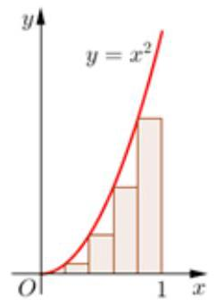

## 巩固练习

## 考点1:运算新定义

9 A组

1

对自然数 $a, b, c$ ，定义新运算 $*$ ，使其满足 $\left( {a * b}\right)  * c = a * \left( {bc}\right)$ ， $\left( {a * b}\right) \left( {a * c}\right)  = a * \left( {b + c}\right)$ . 则 $2 * 4 =$

2

在实数的原有运算法则中，定义新运算 $a \otimes  b = a - {2b}$ ，则 $\left| {x \otimes  \left( {1 - x}\right) }\right|  + \left| {\left( {1 - x}\right)  \otimes  x}\right|  > 3$ 的解集为___.

9 B组

1

对于实数x、y，定义新运算x*y = ax+by+2010，其中a、b是常数，等式右边是通常的加法和乘法运算，若3*5 = 2011，4*9 = 2009，则1*2 = ___.

定义向量的运算 $\overrightarrow{a} \otimes  \overrightarrow{b} = \left| \overrightarrow{a}\right|  \cdot  \left| \overrightarrow{b}\right|  \cdot  \sin  < \overrightarrow{a},\overrightarrow{b} >$ (其中 $< \overrightarrow{a},\overrightarrow{b} >$ 为向量 $\overrightarrow{a},\overrightarrow{b}$ 的夹角),设 $\overrightarrow{OA},\overrightarrow{OB}$ 为非零向量,则下列说法正确的是

① $\overrightarrow{OA} \otimes  \overrightarrow{OB}$ 是非负实数;

②若向量 $\overrightarrow{OA},\overrightarrow{OB}$ 共线，则有 $\overrightarrow{OA} \otimes  \overrightarrow{OB} = 0$ ；

③ 若向量 $\overrightarrow{OA},\overrightarrow{OB}$ 垂直,则有 $\overrightarrow{OA} \otimes  \overrightarrow{OB} = 0$ ;

④若 $O, A, B$ 能构成三角形，则三角形面积 ${S}_{OAB} = \frac{1}{2}\overrightarrow{OA} \otimes  \overrightarrow{OB}$ .

## 学考点2:方法新定义

- A组

1

南宋的数学家杨辉“善于把已知形状、大小的几何图形的求面积、体积的连续量问题转化为离散量的垛积问题”，在他的专著《详解九章算法·商功》中，杨辉将堆垛与相应立体图形作类比，推导出了三角垛、方垛、刍童垛等的公式，例如三角垛指的是如图顶层放1个，第二层放3个，第三层放6个，第四层放10个……第n层放 ${a}_{n}$ 个物体堆成的堆垛,则 $\frac{1}{{a}_{1}} + \frac{1}{{a}_{2}} + \cdots  + \frac{1}{{a}_{2022}} =$

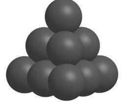

2

在财务审计中，我们可以用 “本・福特定律” 来检验数据是否造假. 本・福特定律指出 ，在一组没有人为编造的自然生成的数据 (均为正实数) 中,首位非零的数字是 $1 \sim  9$ 这九个事件不是等可能的. 具体来说,随机变量 $X$ 是一组没有人为编造的首位非零数字,则 $P\left( {X = k}\right)  = \lg \frac{k + 1}{k}, k = 1,2,\ldots ,9$ . 则根据本 $\bullet$ 福特定律,首位非零数字是 1 与首位非零数字是8的概率之比约为 (保留至整数).

- B组

如图①，用一个平面去截圆锥得到的截口曲线是椭圆. 许多人从纯几何的角度出发对这个问题进行过研究，其中比利时数学家Germinaldandelin $\left( {{1794} - {1847}}\right)$ 的方法非常巧妙，极具创造性.在圆锥内放两个大小不同的球，使得它们分别与圆锥的侧面、截面相切，两个球分别与截面相切于 $E, F$ ，在截口曲线上任取一点 $A$ ，过 $A$ 作圆锥的母线，分别与两个球相切于 $C, B$ ,由球和圆的几何性质，可以知道， ${AE} = {AC}$ ， ${AF} = {AB}$ ，于是

${{AE} + {AF}} = {{AB} + {AC}} = {BC}$ . 由 $B, C$ 的产生方法可知，它们之间的距离 ${BC}$ 是定值，由椭圆定义可知，截口曲线是以 $E, F$ 为焦点的椭圆.

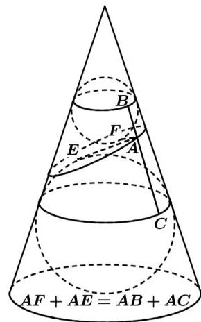

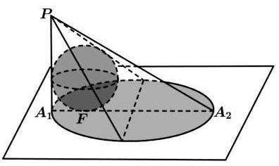

如图②，一个半径为2的球放在桌面上，桌面上方有一个点光源 $P$ ，则球在桌面上的投影是椭圆，已知 ${A}_{1}{A}_{2}$ 是椭圆的长轴, $P{A}_{1}$ 垂直于桌面且与球相切, $P{A}_{1} = 5$ ,则椭圆的焦距为 ( )

A. 4 B. 6 C. 8 D. 12

2

"0,1数列"是每一项均为0或1的数列，在通信技术中应用广泛 . 设 $A$ 是一个“0,1数列”，定义数列 $f\left( A\right)$ :数列 $A$ 中每个0都变为“1,0,1”， $A$ 中每个1都变为“0,1,0”，所得到的新数列. 例如数列 $A$ : 1,0,则数列 $f\left( A\right)$ : 0,1,0,1,0,1 . 已知数列 ${A}_{1} : 1,0,1,0,1$ ，且数列 ${A}_{k + 1} = f\left( {A}_{k}\right)$ ， $k = 1,2,3,\cdots$ ，记数列 ${A}_{k}$ 的所有项之和为 ${S}_{k}$ ，则 ${S}_{k} + {S}_{k + 1} =$

## 考点3:新定义问题

9 B组

1

数列 $\left\{  {a}_{n}\right\}$ 中， ${S}_{n}$ 是其前 $n$ 项的和，若对任意正整数 $n$ ，总存在正整数 $m$ ，使得 ${S}_{n} = {a}_{m}$ ，则称数列 $\left\{  {a}_{n}\right\}$ 为“某数列”.现有如下两个命题:①等比数列 $\left\{  {2}^{n}\right\}$ 为“某数列”；②对任意的等差数列 $\left\{  {a}_{n}\right\}$ ，总存在两个“某数列” $\left\{  {b}_{n}\right\}$ 和 $\left\{  {c}_{n}\right\}$ ，使得 ${a}_{n} = {b}_{n} + {c}_{n}$ . 则下列选项中正确的是 ( )

A. ①为真命题，②为真命题 B. ①为真命题，②为假命题

C. ①为假命题，②为真命题 D. ①为假命题，②为假命题

记函数 ${y}_{1} = {f}_{1}\left( x\right) , x \in  D$ ,函数 ${y}_{2} = {f}_{2}\left( x\right) , x \in  D$ ,若对任意的 $x \in  D$ ,总有 $\left| {{f}_{2}\left( x\right) }\right|  \leq  \left| {{f}_{1}\left( x\right) }\right|$ 成立,则称函数 ${f}_{1}\left( x\right)$ 包裹函数 ${f}_{2}\left( x\right)$ . 判断如下两个命题真假:

①函数 ${f}_{1}\left( x\right)  = {kx}$ 包裹函数 ${f}_{2}\left( x\right)  = x\cos x$ 的充要条件是 $\left| k\right|  \geq  1$ ；

②若对于任意 $p > 0,\left| {{f}_{1}\left( x\right)  - {f}_{2}\left( x\right) }\right|  < p$ 对任意 $x \in  D$ 都成立，则函数 ${f}_{1}\left( x\right)$ 包裹函数 ${f}_{2}\left( x\right)$ .

则下列选项正确的是 ( )

A. ①真②假 B. ①假②真 C. ①②全假 D. ①②全真

3

被誉为“数学之神”之称的阿基米德(前287~前212)，是古希腊伟大的物理学家、数学家、天文学家，他最早利用逼近的思想证明了如下结论:抛物线的弦与抛物线所围成的封闭图形的面积，等于抛物线的弦与经过弦的端点的两条切线所围成的三角形面积的三分之二，这个结论就是著名的阿基米德定理，其中的三角形被称为阿基米德三角形. 在平面直角坐标系 ${xOy}$ 中, $M$ 是焦点为 $F$ 的抛物线 $C : {x}^{2} = {2py}$ 上的任意一点,且 $\left| {MF}\right|$ 的最小值是 $\frac{1}{2}$ . 若直线 $l : y = 2$ 与抛物线 $C$ 交于 $A$ ， $B$ 两点，则弦 ${AB}$ 与抛物线 $C$ 所围成的封闭图形的面积为 .

○ C组

1

若正整数 $n$ 的二进制表示是 $n = {2}^{m} + {a}_{m - 1} \cdot  {2}^{m - 1} + \cdots  + {a}_{1} \cdot  2 + {a}_{0}$ ,这里 ${a}_{i} \in  \{ 0,1\} \left( {i = 0,1,2,\cdots , m - 1}\right)$ ,称有穷数列 $1,{a}_{m - 1},{a}_{m - 2},\cdots ,{a}_{0}$ 为 $n$ 的生成数列,设 $q\left( {q \neq  1}\right)$ 是一个给定的实数,称

${p}_{n} = {q}^{m} + {a}_{m - 1} \cdot  {q}^{m - 1} + \cdots  + {a}_{1} \cdot  q + {a}_{0}$ 为 $n$ 的生成数.

(1)求 ${5}^{100}$ 的生成数列的项数；

(2)求由 $n$ 的生成数列 ${p}_{1},{p}_{2},\cdots ,{p}_{n}$ 的前 ${2}^{k} - 1\left( {k \in  {\mathbf{N}}^{ * }}\right)$ 项的和 ${S}_{{2}^{k} - 1}$ (用 $q$ 、 $k$ 表示)；

(3)若实数 $q$ 满足 $\frac{1 + \sqrt{5}}{2} < q \leq  2$ ，证明:存在无穷多个正整数 $k$ ，使得不存在正整数 $l$ 满足 ${p}_{2k} < {p}_{1} < {p}_{{2k} + l}.$

设数列 $\left\{  {a}_{n}\right\}$ ，对任意 $n \in  {N}^{ * }$ 都有 $\left( {{kn} + b}\right) \left( {{a}_{1} + {a}_{n}}\right)  + p = 2\left( {{a}_{1} + {a}_{2}\ldots  + {a}_{n}}\right)$ ，(其中 $k$ 、 $b$ 、 $p$ 是常数).

(1)当 $k = 0, b = 3, p =  - 4$ 时,求 ${a}_{1} + {a}_{2} + {a}_{3} + \ldots  + {a}_{n}$ ;

(2)当 $k = 1$ ， $b = 0$ ， $p = 0$ 时，若 ${a}_{3} = 3$ ， ${a}_{9} = {15}$ ，求数列 $\left\{  {a}_{n}\right\}$ 的通项公式；

(3)若数列 $\left\{  {a}_{n}\right\}$ 中任意(不同)两项之和仍是该数列中的一项，则称该数列是“封闭数列”，当 $k = 1$ ， $b = 0$ ， $p = 0$ 时，设 ${S}_{n}$ 是数列 $\left\{  {a}_{n}\right\}$ 的前 $n$ 项和， ${a}_{2} - {a}_{1} = 2$ ，试问:是否存在这样的 “封闭数列” $\left\{  {a}_{n}\right\}$ ，使得对任意 $n \in  {N}^{ * }$ ，都有 ${S}_{n} \neq  0$ ,且 $\frac{1}{12} < \frac{1}{{S}_{1}} + \frac{1}{{S}_{2}} + \frac{1}{{S}_{3}} + \cdots  + \frac{1}{{S}_{n}} < \frac{11}{18}$ . 若存在,求数列 $\left\{  {a}_{n}\right\}$ 的首项 ${a}_{1}$ 的所有取值; 若不存在,说明理由.

对于数列 $\left\{  {a}_{n}\right\}$ ，定义 $\left\{  {\bigtriangleup {a}_{n}}\right\}$ 为数列 $\left\{  {a}_{n}\right\}$ 的差分数列，其中 $\bigtriangleup {a}_{n} = {a}_{n + 1} - {a}_{n}, n \in  {N}^{ * }$ ，如果对任意的 $n \in  {N}^{ * }$ ， 都有 $\bigtriangleup {a}_{n + 1} > \bigtriangleup {a}_{n}$ ,则称数列 $\left\{  {a}_{n}\right\}$ 为差分增数列.

(1)已知数列 $1,2,4, x,{16},{24}$ 为差分增数列，求实数 $x$ 的取值范围；

(2)已知数列 $\left\{  {a}_{n}\right\}$ 为差分增数列，且 ${a}_{1} = {a}_{2} = 1,{a}_{n} \in  {N}^{ * }$ . 若 ${a}_{k} = {2021}$ ，求非零自然数 $k$ 的最大值；

(3)已知项数为 ${2k}$ 的数列 $\left\{  {{\log }_{3}{a}_{n}}\right\}  \left( {n = 1,2,3,\ldots ,{2k}}\right)$ 是差分增数列，且所有项的和等于 $k$ ，证明: ${a}_{k}{a}_{k + 1} < 3$

在平面直角坐标系中，两点 ${P}_{1}\left( {{x}_{1},{y}_{1}}\right) ,{P}_{2}\left( {{x}_{2},{y}_{2}}\right)$ 间的“L-距离”定义为 $\begin{Vmatrix}{{P}_{1}{P}_{2}}\end{Vmatrix} = \left| {{x}_{1} - {x}_{2}}\right|  + \left| {{y}_{1} - {y}_{2}}\right|$ . 则平面内与 $x$ 轴上两个不同的定点 ${F}_{1},{F}_{2}$ 的 “L-距离” 之和等于定值 (大于 $\begin{Vmatrix}{{F}_{1}{F}_{2}}\end{Vmatrix}$ ) 的点的轨迹可以是( )

A.

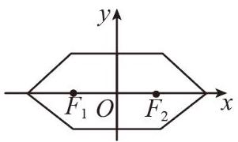

B.

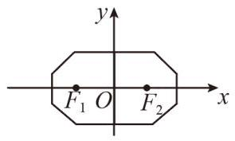

C.

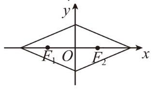

D.

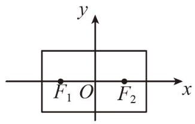
