# 第一章 高中数学必备基本功

## 第一讲 基础运算

### 第一节 因式分解

因式分解，是代数运算中最基本的技能之一。本质上，它就是“打开括号”的逆运算。

打开括号，是把乘积写成和；因式分解，则是把和重新写成乘积。

例如，$(x+2)(x+3)=x^2+5x+6$ 是打开括号；反过来，把 $x^2+5x+6$ 写成 $(x+2)(x+3)$，就是因式分解。

很多同学会做因式分解，却不知道什么时候该用。真正的困难往往不是“怎么分解”，而是：

> 我为什么要把这个式子分解？

所以，学习因式分解，首先要知道它能干什么。

##### 1. 解方程

例如，解方程 $x^2-5x+6=0$。

因式分解后得到 $(x-2)(x-3)=0$，于是可以进一步得到 $x=2$ 或 $x=3$。

这里，因式分解把一个二次方程转化成了两个一次方程。

因此，看到“多项式等于零”时，要优先考虑能不能因式分解。

##### 2. 判断正负

例如，要判断 $x^2-5x+6$ 的正负，可以先写成 $(x-2)(x-3)$。

当 $x<2$ 时，两个因式都为负，乘积为正；当 $2<x<3$ 时，两个因式一正一负，乘积为负；当 $x>3$ 时，两个因式都为正，乘积为正。

乘积形式比加减形式更容易判断正负。

##### 3. 化简分式

例如，$\frac{x^2-4}{x^2-x-2}$。

分子可以分解为 $(x-2)(x+2)$，分母可以分解为 $(x-2)(x+1)$。

因式分解后，分子和分母中的公因式 $x-2$ 才能显现出来，从而完成约分。

所以，看到分子、分母都是多项式时，要检查它们能不能分别分解。

##### 4. 发现隐藏结构

例如，$a(x-y)+b(x-y)$ 中，两个部分都含有相同的整体 $x-y$。

把它提取出来，就得到 $a(x-y)+b(x-y)=(a+b)(x-y)$。

这里的关键不是计算，而是发现重复出现的整体。

再如，$n^3-n$ 可以分解为 $n(n-1)(n+1)$。分解之后，我们就能看出它是三个连续整数的乘积，这在整除问题中非常有用。

因此，判断一道题是否需要因式分解，不要只问：

> 这个式子能不能分解？

更应该问：

> 分解以后，能不能让下一步更容易？

当题目涉及等于零、求根、判断正负、分式约分、证明整除，或者式子中出现重复结构时，都应该优先想到因式分解。

可以记住一句话：

> 当加减形式不好处理时，尝试把它变成乘积形式。

#### ①解方程与不等式

一元八次方程你不会解, 拆成 8 个一元一次方程, 你是不是就会解了?

最常规的无参数一元二次方程 $\left( {{x}^{2} - {2x} - 3 = 0}\right)$ 不再赘述,这个不会日子真没法过了. 含参的十字相乘是必会内容, 在导数单调性分析最为常见, 在一些齐次式出现的地方也很常用.

1. $2{a}^{2}{x}^{2} + {ax} - 3 = 0$；$2{e}^{2x} - a{e}^{x} - {a}^{2} = 0$

2. $2{a}^{2} + 2{c}^{2} - {5ac} = 0$

${y}^{2} + 3\left( {m - \frac{1}{m}}\right) y - 9 = 0$

3. $\left( {{2020} - \text{ 卷 }{20}}\right) 4{k}^{2} + {8km} + 3{m}^{2} - {2m} - 1 = 0 \; {m}^{2} + {4km} + m + {2k} + 4{k}^{2} = 0$

#### ②简化多项式

很多复杂的多项式其实可以分解成几个较为简单的式子, 从而方便分析其特点或者判断正负、取值. 4. ${f}^{\prime }\left( x\right)  = x{e}^{2x} - {e}^{2x} + {kx} - k{x}^{2}$ ,试分析其正负情况.

5. ${g}^{\prime }\left( x\right)  = 2\left( {{e}^{2x} + {e}^{-{2x}}}\right)  - {4b}\left( {{e}^{x} + {e}^{-x}}\right)  + \left( {{8b} - 4}\right)$ ,试进行因式分解.

【解】注意到 ${\left( {e}^{x} + {e}^{-x}\right) }^{2} = {e}^{2x} + {e}^{-{2x}} + 2$ ,设 $t = {e}^{x} + {e}^{-x}$ ,则 ${e}^{2x} + {e}^{-{2x}} = {t}^{2} - 2$ ,

原式整理为 ${g}^{\prime }\left( x\right)  = h\left( t\right)  = 2\left( {{t}^{2} - 2}\right)  - {4bt} + {8b} - 4 = 2{t}^{2} - {4bt} + 8\left( {b - 1}\right)  = 2\left( {t - 2}\right) \left( {t - {2b} + 2}\right)$ ,

即 ${g}^{\prime }\left( x\right)  = 2\left( {{e}^{x} + {e}^{-x} - 2}\right) \left( {{e}^{x} + {e}^{-x} - {2b} + 2}\right)$ .

#### ③高次方程因式分解:长除法或待定系数法

这类内容在课本上似乎是完全没出现过,但是在近五年的新高考中确实出现过几次,基本都是在导数题中处理三次函数或方程，你也不想导数题算到最后却不会处理高次方程吧，所以还是很有必要掌握的，本身倒也算不上太超纲太难的知识点，个人觉得这算代数基本功，往大了说叫做深入理解方程与根.

6. ${x}^{3} - {x}^{2} - x + 1 = 0$；$- 4{t}^{3} - {2t} + 6 = 0$

7. ${g}^{\prime }\left( x\right)  = \frac{1}{2} - \frac{1}{{x}^{2}} - \frac{2}{{x}^{3}} - \frac{\left( {x - 2}\right) {e}^{x}}{{x}^{3}}$ ,分析 ${g}^{\prime }\left( x\right)$ 正负.

8. 已知 ${p}_{0} + {p}_{1} + {p}_{2} + {p}_{3} = 1$ ,因式分解 ${p}_{0} + {p}_{1}x + {p}_{2}{x}^{2} + {p}_{3}{x}^{3} = x$ .

#### ④补充公式

立方相关公式:其实高考中真正用上的机会不多，所以理论上不记也没关系，尤其是完全立方公式，打开括号现场乘一下也行，但是吧，本身倒也不难记，所以还是记一下吧.

立方和公式 ${a}^{3} + {b}^{3} = \left( {a + b}\right) \left( {{a}^{2} - {ab} + {b}^{2}}\right)$ 立方差公式 ${a}^{3} - {b}^{3} = \left( {a - b}\right) \left( {{a}^{2} + {ab} + {b}^{2}}\right)$

完全立方和公式 ${\left( a + b\right) }^{3} = {a}^{3} + 3{a}^{2}b + {3a}{b}^{2} + {b}^{3}$ 完全立方差公式 ${\left( a - b\right) }^{3} = {a}^{3} - 3{a}^{2}b + {3a}{b}^{2} - {b}^{3}$

### 第二节 常见方程&不等式解法

这部分由于比较基础, 所以不会面面俱到, 只强调易错点, 以及补充一些大家以前不曾见过或了解的技巧.

#### ①一次、二次方程&不等式

注意最高次项系数正 or 负 or 零, 这不就是给导数单调性讨论打基础嘛.

1. ${ax} - 1 > 0 \; a{x}^{2} - \left( {a + 1}\right) x + 1 > 0$

2. $2{\sin }^{2}\alpha  = \sin \alpha \cos \alpha$ ,则 $\tan \alpha  =$ ___. $x\left( {{x}^{2} - {2x}}\right)  = {3x}$ ,则 $x =$ ___

#### ② 分式不等式

注意二次函数的开口方向,以及分母不能为 0 .

3. $\frac{{2x} - 1}{x + 2} < 0 \; \frac{{2x} - 1}{x + 2} \geq  3$

#### ③绝对值不等式

需要掌握代数思路和几何思路, 很多时候几何思路会方便你更直观的理解题目.

4. $\left| {x + 1}\right|  < 2 \; \left| {{2x} + 1}\right|  > \left| {x - 2}\right|$

5. 在实数范围内，不等式 $\left| \right| x - 2\left| {-1}\right|  \leq  1$ 的解集为___.

6. 设集合 $A = \{ x\left| \right| x - a \mid   < 1, x \in  \mathbf{R}\} , B = \{ x\left| \right| x - b \mid   > 2, x \in  \mathbf{R}\}$ . 若 $A \subseteq  B$ ，则实数 $a, b$ 必满足

A. $\left| {a + b}\right|  \leq  3$ B. $\left| {a + b}\right|  \geq  3$ C. $\left| {a - b}\right|  \leq  3$ D. $\left| {a - b}\right|  \geq  3$

7. 若关于实数 $x$ 的不等式 $\left| {x - 5}\right|  + \left| {x + 3}\right|  < a$ 无解，则实数 $a$ 的取值范围是___.

#### ④绝对值三角不等式

$\parallel a\left| -\right| b\left| \right|  \leq  \left| {a + b}\right|  \leq  \left| a\right|  + \left| b\right|$

眼熟嘛: $\sqrt{1 + {k}^{2}}\left| {k - {2m}}\right|  + \sqrt{1 + {k}^{2}}\left| {\frac{1}{k} + {2m}}\right|  \geq  \sqrt{1 + {k}^{2}}\left| {k - {2m} + \frac{1}{k} + {2m}}\right|  \cdot  \sqrt{1 + {k}^{2}}\left| {k + \frac{1}{k}}\right|$

#### ⑤高次不等式&高次函数

穿针引线法, 这个过程实际上就是在画函数图像.

数轴标根 $\Rightarrow$ 找出发点: 最高次项系数为正则右上角, 负则右下角 (为啥这样?) $\Rightarrow$ 奇穿偶不穿. 8. 解不等式 ${\left( x - 1\right) }^{2}\left( {x - 2}\right) {\left( x - 3\right) }^{4}{\left( x - 4\right) }^{3} > 0$ .

9. 若 $x = 2$ 是函数 $f\left( x\right)  = \left( {x - 1}\right) \left( {x - 2}\right) \left( {x - a}\right)$ 的极值点,则 $f\left( 0\right)  =$ ___.

10. 已知 $a > 0$ ,且 $x = 0$ 是函数 $f\left( x\right)  = {x}^{2}\ln \left( {x + a}\right)$ 的极大值点,则 $a$ 的取值范围是

A. $\left( {0, e}\right)$ B. $\left( {1, e}\right)$ C. $(0, e\rbrack$ D. $\left( {0,1}\right)$

### 第三节 不等式常用分析思路

单独考察的话基本是在送分题位置, 但是很多时候解答题中某个环节会需要进行大小比较.

#### ①特值&观察&分析

1. (2022 上海 14)若 $a > b > c > d$ ,则下列不等式恒成立的是

A. $a + d > b + c$ B. $a + c > b + d$ C. ${ac} > {bd}$ D. ${ad} > {bc}$

2. 设 $a, b \in  \mathbf{R}$ ,若 $a - \left| b\right|  > 0$ ,则下列不等式中正确的是

A. $b - a > 0$ B. ${a}^{3} + {b}^{3} < 0$ C. $b + a > 0$ D. ${a}^{2} - {b}^{2} < 0$

3. 下列说法正确的是

A. 若 $a > b$ ,则 $a{c}^{2} > b{c}^{2}$ B. 若 $a > b, c > d$ ,则 $a + c > b + d$

C. 若 $a > b, c > d$ ,则 ${ac} > {bd}$ D. 若 $b > a > 0, c > 0$ ,则 $\frac{b + c}{a + c} > \frac{b}{a}$

4. 几个不等式中变量的范围

(1) ${x}_{1} + {x}_{2} = 2 \Rightarrow$

(2) ${x}_{1}{x}_{2} = 2\left( {{x}_{1},{x}_{2}\text{ 均为正数 }}\right)  \Rightarrow$

(3) $a < b < c$ 且 $a + b + c = 0 \Rightarrow$

#### ②作差

5. 已知 $0 < p < q < 1$ ，比较 $M = {15q}\left( {{p}^{3} - 3{p}^{2} + {3p}}\right)$ 和 $N = {15p}\left( {{q}^{3} - 3{q}^{2} + {3q}}\right)$ 的大小.

#### ③作商

6. 数列 $\left\{  {a}_{n}\right\}$ 满足 ${a}_{n} = \frac{{n}^{3}}{{3}^{n}}$ ,判断 $\left\{  {a}_{n}\right\}$ 的单调性.

#### ④构造函数

7. 设 $a, b \in  \mathbf{R}$ ,则 “ $a > b$ ” 是 “ $a\left| a\right|  > b\left| b\right|$ ” 的

A. 充分而不必要条件 B. 必要而不充分条件 C. 充分必要条件 D. 既不充分也不必要条件

#### ⑤实际问题构建不等关系

8. 刘老师沿着某公园的环形跑道(周长大于 $1\mathrm{\;{km}}$ ) 按逆时针方向跑步,他从起点出发,并用软件记录了运动轨迹，他每跑1km，软件会在运动轨迹上标注出相应的里程数. 已知刘老师共跑了11km，恰好回到起点，前 5km 的记录数据如图所示，则刘老师总共跑的圈数为

A. 7 B. 8 C. 9 D. 10

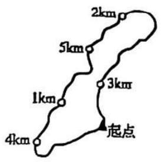

### 第四节 集合中的一些易错点

单纯的交并补的实在没啥好说的，我想着重讲讲对于一些集合语言的翻译与理解.

1. 如何用集合表示全体正奇数和全体正偶数?

2. $\{ x \mid  x = {3k}, k \in  \mathbf{Z}\} ,\{ y \mid  y = {3m} + 1, m \in  \mathbf{Z}\} ,\{ z \mid  z = {3n} + 2, n \in  \mathbf{Z}\} ,\{ w \mid  w = {3p} - 1, p \in  \mathbf{Z}\}$ ,这些集合表示啥?

3. 已知集合 $S = \{ s \mid  s = {2n} + 1, n \in  \mathbf{Z}\} , T = \{ t \mid  t = {4n} + 1, n \in  \mathbf{Z}\}$ ,则 $S \cap  T =$

A. $\varnothing$ B. $S$ C. $T$ D. $\mathbf{Z}$

4. (2006上海理15)若关于 $x$ 的不等式 $\left( {1 + {k}^{2}}\right) x \leq  {k}^{4} + 4$ 的解集是 $M$ ,则对任意实数 $k$ ,总有

A. $2 \in  M,0 \in  M$ B. $2 \notin  M,0 \notin  M$ C. $2 \in  M,0 \notin  M$ D. $2 \notin  M,0 \in  M$

5. 已知集合 $A = \left\{  {\left( {x, y}\right)  \mid  {x}^{2} + {y}^{2} \leq  1, x, y \in  \mathbf{Z}}\right\}  , B = \{ \left( {x, y}\right) \left| \right| x \mid   \leq  2,\left| y\right|  \leq  2, x, y \in  \mathbf{Z}\}$ ,定义集合 $A \oplus  B = \left\{  {\left( {{x}_{1} + {x}_{2},{y}_{1} + {y}_{2}}\right)  \mid  \left( {{x}_{1},{y}_{1}}\right)  \in  A,\left( {{x}_{2},{y}_{2}}\right)  \in  B}\right\}$ ,则 $A \oplus  B$ 中元素的个数为

A. 77 B. 49 C. 45 D. 30

6. 已知集合 $\{ a, b, c\}  = \{ 0,1,2\}$ ，且下列三个关系:① $a \neq  2$ ；② $b = 2$ ；③ $c \neq  0$ 有且只有一个正确,则 ${100a} + {10b} + c =$ ___.

### 第五节 逻辑用语

用数学的语言描述世界, 理解世界, 这其实是数学教学的一个宏观的目标, 不过很多高中生对于数学语言的理解还是很吃力的，比如一些新定义题目中字母、变量、角标一多就容易晕，更别提类似于 2025 一卷 19 题这种“ $\forall ,\exists$ ”混合的题干了,我在考场上其实都琢磨了好一阵子. 既然今年考了,明年高考有没有咱不知道,但是模考里肯定会出现很多这种逻辑词混合表述的题干，所以还是有必要练一练的，这事没啥坏处，大学里也用得着, 头一个月学极限全是这种东西.

#### ①或

“≥”这个符号到底表达啥含义？2≥1 对吗? $\sin x \geq   - 2$ 对吗?

#### ②命题的否定

$\nabla x > 0, x + \frac{1}{x} \geq  2$

#### ③逻辑词的组合.

已知集合 $A$ 为某学校学生的高考数学成绩,集合 $B$ 为学校数学老师的成绩. 尝试翻译下列数学语言.

7. (1) $\forall a \in  A, a < {130}$ (2) $\forall a \in  A, a \geq  {90}$

(3) $\exists b \in  B, b < {100}$ (4) $\exists b \in  B, b > {140}$

(5) $\forall a \in  A,\forall b \in  B, a < b$ (6) $\forall a \in  A,\exists b \in  B, a < b$

(7) $\forall a \in  A,\exists b \in  B, a > b$ (8) $\exists a \in  A,\exists b \in  B, a > b$

(9) $\exists a \in  A,\forall b \in  B, a = b$ (10) $\exists a \in  A,\exists b \in  B, a = b$

## 第二讲 均值不等式

均值这东西本身并不难, 就是个小工具而已, 但是被垃圾模拟题搞得乌烟瘴气, 整天出的都是些什么鬼东西. 咱先说好了啊，当你以后问一些模拟题中奇奇怪怪的不等式时，正常的题，肯定会给你答疑，但如果是跟高考不沾边的题, 我一定会拦住你别做, 咱别在这些地方浪费时间, 你非要问, 不好意思那我只能给你一顿臭骂.

### 第一节 拨乱反正! 高考都考啥?

首先请大家搞清楚高考中均值不等式都咋考. 近六年相关的题目都在这了, 请你看明白该学啥, 没必要学啥.

#### 全国卷

1. (多选) 若 $x, y$ 满足 ${x}^{2} + {y}^{2} - {xy} = 1$ ,则

A. $x + y \leq  1$ B. $x + y \geq   - 2$ C. ${x}^{2} + {y}^{2} \leq  2$ D. ${x}^{2} + {y}^{2} \geq  1$

2. 下列函数中最小值为 4 的是

A. $y = {x}^{2} + {2x} + 4$

B. $y = \left| {\sin x}\right|  + \frac{4}{\left| \sin x\right| }$

C. $y = {2}^{x} + {2}^{2 - x}$ D. $y = \ln x + \frac{4}{\ln x}$

3. (多选) 已知 $a > 0, b > 0$ ,且 $a + b = 1$ ,则

A. ${a}^{2} + {b}^{2} \geq  \frac{1}{2}$ B. ${2}^{a - b} > \frac{1}{2}$ C. ${\log }_{2}a + {\log }_{2}b \geq   - 2$ D. $\sqrt{a} + \sqrt{b} \leq  \sqrt{2}$

#### 自主命题

4. 已知 $a > 0, b > 0$ ,则

A. ${a}^{2} + {b}^{2} > {2ab}$ B. $\frac{1}{a} + \frac{1}{b} \geq  \frac{1}{ab}$ C. $a + b > \sqrt{ab}$ D. $\frac{1}{a} + \frac{1}{b} \leq  \frac{2}{\sqrt{ab}}$

5. (2025 上海 8) 设 $a, b > 0, a + \frac{1}{b} = 1$ ，则 $b + \frac{1}{a}$ 的最小值为___.

6. 已知 $\left( {{x}_{1},{y}_{1}}\right) ,\left( {{x}_{2},{y}_{2}}\right)$ 是函数 $y = {2}^{x}$ 的图象上两个不同的点,则

A. ${\log }_{2}\frac{{y}_{1} + {y}_{2}}{2} < \frac{{x}_{1} + {x}_{2}}{2}$ B. ${\log }_{2}\frac{{y}_{1} + {y}_{2}}{2} > \frac{{x}_{1} + {x}_{2}}{2}$

C. ${\log }_{2}\frac{{y}_{1} + {y}_{2}}{2} < {x}_{1} + {x}_{2}$ D. ${\log }_{2}\frac{{y}_{1} + {y}_{2}}{2} > {x}_{1} + {x}_{2}$

7. (2024 上海春考 6) 已知 ${ab} = 1,4{a}^{2} + 9{b}^{2}$ 的最小值为___.

8. " ${a}^{2} = {b}^{2}$ " 是 " ${a}^{2} + {b}^{2} = {2ab}$ "的

A. 充分不必要条件 B. 必要而不充分条件 C. 充分必要条件 D. 既不充分也不必要条件

9. 若 ${xy} \neq  0$ ，则 “ $x + y = 0$ ” 是 “ $\frac{x}{y} + \frac{y}{x} =  - 2$ ” 的

A. 充分而不必要条件 B. 必要而不充分条件 C. 充分必要条件 D. 既不充分也不必要条件

10. (2023 上海春考 6) 已知正实数 $a\text{ 、 }b$ 满足 $a + {4b} = 1$ ,则 ${ab}$ 的最大值为___.

11. (2022 上海 14)若实数 $a\text{ 、 }b$ 满足 $a > b > 0$ ,下列不等式中恒成立的是

A. $a + b > 2\sqrt{ab}$ B. $a + b < 2\sqrt{ab}$ C. $\frac{a}{2} + {2b} > 2\sqrt{ab}$ D. $\frac{a}{2} + {2b} < 2\sqrt{ab}$

12. 已知 $a > 0, b > 0$ ,则 $\frac{1}{a} + \frac{a}{{b}^{2}} + b$ 的最小值为___.

13. (2021 上海春考 8)已知函数 $f\left( x\right)  = {3}^{x} + \frac{a}{{3}^{x} + 1}\left( {a > 0}\right)$ 的最小值为 5，则 $a =$ ___.

14. 已知 $a > 0, b > 0$ ,且 ${ab} = 1$ ,则 $\frac{1}{2a} + \frac{1}{2b} + \frac{8}{a + b}$ 的最小值为___.

15. 已知 $5{x}^{2}{y}^{2} + {y}^{4} = 1\left( {x, y \in  \mathbf{R}}\right)$ ,则 ${x}^{2} + {y}^{2}$ 的最小值是___.

16. (2020上海 13)下列不等式恒成立的是

A. ${a}^{2} + {b}^{2} \leq  {2ab}$ B. ${a}^{2} + {b}^{2} \geq   - {2ab}$ C. $a + b \geq  2\sqrt{\left| ab\right| }$ D. ${a}^{2} + {b}^{2} \leq   - {2ab}$

你可以看到，全国卷中其实比较少专门考察均值不等式，要考也是最基本的用法，更多的是在其他题目中灵活运用. 自主命题卷中考察较多, 但依然只局限于均值不等式最常规的几种用法. 所以, 常规方法学明白、用明白，对付高考足够了. 不等式这东西高考考纲要求很低，这不是高中的主干内容，稍微难一点都容易超纲，除非你是强基或者竞赛，否则不要给自己平白无故增加负担. 你在模拟题里面见到的那些逆天不等式、求最值题目, 高考真不考, 你学的那些超纲方法, 逆天变形, 惊人配凑秒杀, 高考真用不上.

比如, 你在高考真题里看见过这种题吗:

${x}^{3} + {y}^{3} - \frac{1}{4}x - \frac{1}{4}y = 3$ ,求 ${13x} + y$ 的最大值?

解: $0 = {x}^{3} + {y}^{3} - \frac{1}{4}x - \frac{1}{4}y - 3 \; = \left( {{x}^{3} + \frac{27}{8} + \frac{27}{8}}\right)  + \left( {{y}^{3} + \frac{1}{8} + \frac{1}{8}}\right)  - \frac{x}{4} - \frac{y}{4} - {10} \; \geq  \frac{27x}{4} + \frac{3y}{4} - \frac{x}{4} - \frac{y}{4} - {10} = \frac{{13x} + y}{2} - {10}$

$\therefore {13x} + y \leq  {20}$ ,当且仅当 $x = \frac{3}{2}, y = \frac{1}{2}$ 取等.

这是正常高中生能想到的配凑吗?

再有, 不要乱做来路不明的题目, 有一种题叫做钓鱼题, 看似正常实则无比复杂. 比如:

已知 ${a}^{2} + {b}^{2} = 1$ ,求 $\left( {a + 1}\right) \left( {b + 2}\right)$ 的最大值. 你想三角换元吗?

答案: $2 + \frac{{\left( {297216} - {11712}\sqrt{183}\right) }^{\frac{1}{3}}}{48} + \frac{{\left( {4644} + {183}\sqrt{183}\right) }^{\frac{1}{3}}}{12}$ .

这就是被钓鱼的下场.

听话，把精力都用在刀刃上.

附:真题答案

全国卷:1.BC 2.C 3.ABD

自主命题:4.C 5.4 6.B 7.12 8.B 9.C 10. $\frac{1}{16}\;$ 11.A 12.2 $\sqrt{2}\;$ 13.9 14.4 15. $\frac{4}{5}\;$ 16.B 这些题可以作为本讲学习后的自测题目.

### 第二节 均值不等式核心思路

这部分内容学明白, 基本就足够高考用了, 关键是学明白原理, 不要机械的套公式.

#### ①均值不等式干啥用的？

#### ②均值不等式的推导、使用条件、核心思想

#### ③均值不等式链

这个不等式链可以解决 99% 的问题.

$$
\sqrt{ab} \leq  \frac{a + b}{2} \leq  \sqrt{\frac{{a}^{2} + {b}^{2}}{2}}
$$

几何平均数 $\leq$ 算数平均数 $\leq$ 平方平均数

不等式链中分别包含了两个变量的积、和、平方和, 当你遇到题目时, 只需要想清楚两件事:

一、题目要求的是两个变量的和、积还是平方和? 二、这两个变量的定值在哪，和、积还是平方和? 然后来上面这个公式里三选二, 需要哪个就用哪个.

#### 题型一 积定

1. 设 $a, b > 0,{ab} = 4$ ,求:

(1) ${2a} + b$ 的最小值. (2) ${a}^{2} + {b}^{2}$ 的最小值.

(3) ${a}^{3} + {b}^{3}$ 的最小值. (4) $\frac{1}{{a}^{2}} + \frac{1}{{b}^{2}}$ 的最小值.

#### 题型二 和定

2. 设 $a, b > 0, a + b = 4$ ,求:

(1) ${ab}$ 的最大值. (2) ${a}^{2} + {b}^{2}$ 的最小值.

(3) ${a}^{3} + {b}^{3}$ 的最小值. (4) $\frac{1}{{a}^{2}} + \frac{1}{{b}^{2}}$ 的最小值.

#### 题型三 平方和定

3. (1) $\left| m\right|  \cdot  \sqrt{1 - {m}^{2}}$ 的最大值为? (2) $y = \sqrt{x} + \sqrt{1 - x}$ 的最大值为?

4. $a, b > 0$ 且 $a + b = {10}$ ,则 $\sqrt{a + 2} + \sqrt{b + 3}$ 的最大值为?

#### 题型四 积、和、平方混合

需要谁就留下谁，不需要的就用不等式链转化成需要的形式.

5. 设 $a, b > 0, a + b = {2ab}$ ,求:

(1) ${ab}$ 的最小值. (2) $a + b$ 的最小值. (3) $a + {2b}$ 的最小值.

6. 设 $a, b > 0,{a}^{2} + {b}^{2} + {ab} = 1$ ,求 $a + b$ 的最大值. (想想什么题会出现这样的式子)

7. 若 $x, y$ 满足 ${x}^{2} + {y}^{2} - {xy} = 1$ ,则

A. $x + y \leq  1$ B. $x + y \geq   - 2$ C. ${x}^{2} + {y}^{2} \leq  2$ D. ${x}^{2} + {y}^{2} \geq  1$

8. 已知 ${a}^{2} + {b}^{2} = 1,{b}^{2} + {c}^{2} = 2,{c}^{2} + {a}^{2} = 2$ ,则 ${ab} + {bc} + {ca}$ 的最小值为

A. $\sqrt{3} - \frac{1}{2}$ B. $\frac{1}{2} - \sqrt{3}$ C. $- \frac{1}{2} - \sqrt{3}$ D. $\frac{1}{2} + \sqrt{3}$

#### 题型五 均值不等式成立的条件:一正二定三相等

9. 在下列各函数中,最小值等于 2 的函数是

A. $y = x + \frac{1}{x}$ B. $y = \cos x + \frac{1}{\cos x}\left( {0 < x < \frac{\pi }{2}}\right)$

C. $y = \frac{{x}^{2} + 3}{\sqrt{{x}^{2} + 2}}$ D. $y = {\mathrm{e}}^{x} + \frac{4}{{\mathrm{e}}^{x}} - 2$

10. 已知 $a > 0, b > 0$ ,则

A. ${a}^{2} + {b}^{2} > {2ab}$ B. $\frac{1}{a} + \frac{1}{b} \geq  \frac{1}{ab}$ C. $a + b > \sqrt{ab}$ D. $\frac{1}{a} + \frac{1}{b} \leq  \frac{2}{\sqrt{ab}}$

11. 若 $a, b \in  \mathbf{R},{ab} > 0$ ,求 $\frac{{a}^{4} + 4{b}^{4} + 1}{ab}$ 的最小值.

多说两句，真的非得“一正二定三相等”才能用均值吗？

实则不然, 这事取决于你的日的, 只有当你想“通过均值不等式求取准确最值”时, 才需要上述条件.

如果只是单纯的放缩, 那对于非负数来说, 随便用.

比如想证明 ${x}^{2} + x + 1$ 恒正,可以用 $\Delta$ ,但也可以 ${x}^{2} + 1 + x \geq  2\sqrt{{x}^{2} \cdot  1} + x = 2\left| x\right|  + x > 0$ ,不需要管取不取等, 只要比后面大就得了.

当然, 负值其实也能用.

12. 若 $x < 0$ ,求 $x + \frac{1}{x}$ 的最大值.

#### 题型六 配凑定值

13. 若 $x > \frac{5}{3}$ ,则 ${3x} + \frac{4}{{3x} - 5}$ 的最小值为 ___.

14. 若 $x > \frac{1}{2}$ ,则 ${4x} + \frac{1}{{2x} - 1}$ 的最小值为 ___.

#### 题型七 1 的代换

15. (1)设 $a, b > 0,\frac{1}{a} + \frac{2}{b} = 1$ ，求 ${2a} + b$ 最小值. (2)设 $a, b > 0,\frac{1}{a + 1} + \frac{2}{b} = 1$ ，求 $a + {2b}$ 最小值.

16. 设 $0 < x < 1$ ,求 $\frac{1}{2x} + \frac{2}{1 - x}$ 最小值. (2) $a, b > 0, a + b = 1$ ,求 $\frac{1}{a + {2b}} + \frac{4}{{2a} + b}$ 最小值.

稍作拓展: 三元均值不等式 $\sqrt[3]{abc} \leq  \frac{a + b + c}{3}$ 或 ${abc} \leq  {\left( \frac{a + b + c}{3}\right) }^{3}$ ,有时在小题里可以悄悄用.

例: 求 $f\left( x\right)  = {x}^{2}\left( {2 - x}\right)$ 在 $x \in  \left( {0,2}\right)$ 上的最大值.

#### 题型八 三角换元

由于 ${\sin }^{2}\theta  + {\cos }^{2}\theta  = 1$ ,当遇到平方和为定值的形式时,可以考虑利用三角换元.

17. 已知实数 $x, y$ 满足 ${x}^{2} + {y}^{2} - {4x} - {2y} - 4 = 0$ ,则 $x - y$ 的最大值是

A. $1 + \frac{3\sqrt{2}}{2}$ B. 4 C. $1 + 3\sqrt{2}$ D. 7

18. 若 $x, y$ 满足 ${x}^{2} + {y}^{2} - {xy} = 1$ ，则

A. $x + y \leq  1$ B. $x + y \geq   - 2$ C. ${x}^{2}$ - ${17}{x}^{2} + {y}^{2} \geq  1$

### 第三节 拓展方法

这些东西, 算是没那么偏, 稍微还有点用, 但是在高考中出现的可能性微乎其微, 其实我都不想讲的, 我也不推荐你们花时间看，但是又怕你们模考遇到了骂我不讲，所以还是放这里了.

警告:前面的都滚瓜烂熟再看这些.

#### 题型一 单变量思想——保底方法

1. 若实数 $x, y$ 满足 ${xy} + {3x} = 3\left( {0 < x < \frac{1}{2}}\right)$ ，求 $\frac{3}{x} + \frac{1}{y - 3}$ 的最小值.

2. 已知 $5{x}^{2}{y}^{2} + {y}^{4} = 1\left( {x, y \in  \mathbf{R}}\right)$ ，则 ${x}^{2} + {y}^{2}$ 的最小值为___.

3. 设 $a, b > 0,{5ab} + {b}^{2} = 1$ ,求 $a + b$ 的最小值.

#### 题型二 齐次化思想——目标: 凑 0 次

4. 设 $a, b > 0, a + b = 1$ ,求 $\left( {\frac{1}{a} + 1}\right) \left( {\frac{1}{b} + 1}\right)$ 的最小值.

5. 设 $a, b > 0, a + b = 2$ ,求 $\frac{1}{a} + \frac{1}{ab}$ 的最小值.

6. 设 $a, b > 0, a + b = 1$ ,求 $\frac{1}{{a}^{2}} + \frac{1}{{b}^{2}}$ 的最小值.

#### 题型三 因式分解

遇到 ${ax} + {by} + {cxy} = d$ 类型时,可以提公因式进行因式分解,得到积定形式.

7. 设 $x, y > 0$ ,且 ${2x} + y + {xy} = 4$ ,求 $x + y, x + {2y},{2x} + {3y}$ 的最小值.

8. 设 $x > 1, y > \frac{1}{2}$ ,且 ${2xy} - x - {2y} = 1$ ,求 $x + {2y}$ 的最小值.

#### 题型四 双换元

9. 设 $a, b > 0$ ,求 $\frac{a}{a + {2b}} + \frac{b}{a + b}$ 的最小值.

10. 已知非负实数 $m, n$ 满足 $m + n = 1$ ,求 $\frac{{m}^{2}}{m + 2} + \frac{{n}^{2}}{n + 1}$ 的最小值.

Finally, 感兴趣的同学可以思考一个问题, 为什么非要有定值呢?

当 $x > 0$ 时,由均值不等式: ${x}^{2} + \frac{1}{x} \geq  2\sqrt{{x}^{2} \cdot  \frac{1}{x}} = 2\sqrt{x}$ ,当且仅当 $x = 1$ 时等号成立,

则 ${x}^{2} + \frac{1}{x}$ 最小值为 $2\sqrt{1} = 2$ ,对吗?

其实一个人的奋斗历程，就是在应用均值不等式. (强行升华)

每个人拥有的资源都是有限定的. 时间 + 金钱 + 精力 = 有限值.

而你要做的就是在有限的条件下,合理分配这些资源,寻求时间 $\times$ 金钱 $\times$ 精力 $=$ 成就的最大值.

# 第二章 函数

毋庸置疑，函数绝对是整个高中数学最主线的内容. 实际上，几乎任何一个章节都和函数分不开，你总得去表达一些变量之间的关系，研究变化规律，求范围或者求最值，这些都是函数的功能. 所以你要是函数拉了，那以后肯定到处受罪，好不容易列个式子，结果不会分析函数变化，找不到最值，求不出范围，约等于白做. 导数题更是建立在函数基础上, 要学导数, 就得先把函数学明白.

## 第三讲 函数三要素

### 第一节 函数定义域

#### 1. 常见函数定义域

(1)分式中分母___；(2)偶次根式下的式子___，奇次根式下的式子___；

(3)对数式 ${\log }_{a}x$ 中 ___；(4) 正切函数 $\tan x$ 中 ___.

#### 2. 定义域注意事项

(1)定义域永远指的是 $x$ 的取值范围;

(2)定义域的书写格式:

(3)高中数学中必须写成集合形式的有:

(4)一个解析式中含有多个涉及定义域的式子时，应该取各个集合的交集.

#### 3. 同一函数的概念: 定义域和对应法则完全相同.

#### 题型一 具体函数定义域

常考常用，基本送分，通常会和解不等式放在一起考.

1. 求下列函数定义域

(l) $f\left( x\right)  = \sqrt{\frac{x + 1}{x - 2}}$ (2) $f\left( x\right)  = \frac{2}{1 - {2x}} + \ln \left( {1 - x}\right)$

2. 设函数 $f\left( x\right)  = \ln \left( \frac{1 + x}{1 - x}\right)$ ，则函数 $g\left( x\right)  = f\left( \frac{x}{2}\right)  + f\left( \frac{1}{x}\right)$ 的定义域为___

3. 函数 $f\left( x\right)  = \frac{{2kx} - 8}{k{x}^{2} + {2kx} + 1}$ 的定义域为 $\mathbf{R}$ ,求实数 $k$ 的取值范围.

#### 题型二 抽象函数定义域

这玩意高一刚学的时候常考，但是高三几乎不可能单独考了，不过你得理解啥意思，理解这个才能理解函数. 4. 函数 $f\left( {{2x} - 1}\right)$ 的定义域为 $\left\lbrack  {-1,3}\right\rbrack$ ，则函数 $f\left( {{3x} + 1}\right)$ 的定义域是___.

### 第二节 函数解析式

这种题也是，高一出点就得了，高三考这个太浪费题目，不多讲，不过你必须熟练掌握待定系数法和换元法.

1. 求 $f\left( x\right)$ 解析式.

(1) $f\left( x\right)$ 是一次函数. $f(f\left( x\right)  = {{4x} + 3}$

(2) $f\left( {\sqrt{x} + 1}\right)  = {3x} + 1$ (3) $f\left( \frac{1 - x}{1 + x}\right)  = {2x} - 1$

(4) $f\left( {x + \frac{1}{x}}\right)  = {x}^{2} + \frac{1}{{x}^{2}}$ (5) $f\left( x\right)  + {2f}\left( \frac{1}{x}\right)  = {2x} + 1$

### 第三节 函数图像平移翻折变换

在理解的基础上牢记图像变换法则, 非常重要.

#### 1. 图像平移:左加右减，上加下减

$f\left( x\right)  \rightarrow  f\left( {x + 1}\right) \; f\left( x\right)  \rightarrow  f\left( {x - 1}\right) \; f\left( x\right)  \rightarrow  f\left( x\right)  + 1 \; f\left( x\right)  \rightarrow  f\left( x\right)  - 1$

<table><tr><td align="center" valign="top">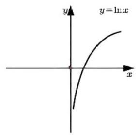</td><td align="center" valign="top">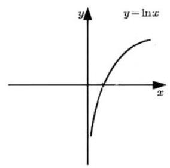</td></tr><tr><td align="center" valign="top">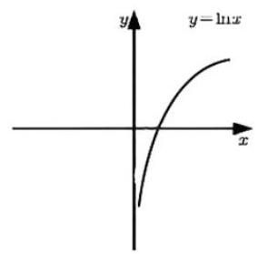</td><td align="center" valign="top">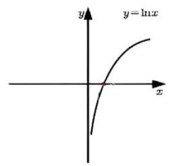</td></tr></table>

左右平移始终牢记:你要做的是把原来的 $x$ 替换为 $x + a$ ，左加右减一定要加到 $x$ 身上，不是 ${2x}$ 比如, $f\left( {{2x} + 1}\right)$ 向右平移 1 个单位得到:___ $f\left( {-{3x} - 2}\right)$ 向左平移 2 个单位得到___ 还有,点的平移并不是左加右减, $\left( {m, n}\right)$ 右移 2 个单位再下移 1 个单位得到___

#### 2. 图像翻折与对称

$f\left( x\right)  \rightarrow   - f\left( x\right) \; f\left( x\right)  \rightarrow  f\left( {-x}\right) \; f\left( x\right)  \rightarrow  \left| {f\left( x\right) }\right| \; f\left( x\right)  \rightarrow  f\left( \left| x\right| \right)$

<table><tr><td align="center" valign="top">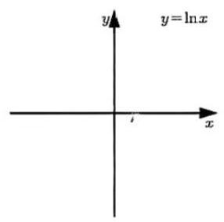</td><td align="center" valign="top">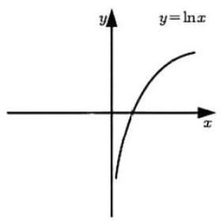</td></tr><tr><td align="center" valign="top">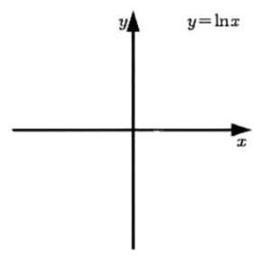</td><td align="center" valign="top">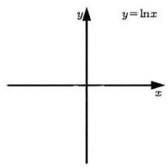</td></tr></table>

#### 3. 图像伸缩

(1) $f\left( x\right)  \rightarrow  {Af}\left( x\right)$ (2) $f\left( x\right)  \rightarrow  f\left( {Ax}\right)$

### 第四节 常见函数图像

再复杂的函数, 只要有图, 就好研究, 如果考试能用 Geogebra 或者 Desmos 画图, 你觉得函数还会有难度吗? 所以画图才是函数的灵魂. 通常情况下，我们只需要画出草图，展示出最关键的信息即可，包括但不限于:单调性，对称性，最值，与坐标轴交点，必过定点，渐近线，正负变化等等.

#### 1. 直线型函数

(1) $y = x + 1$ (2) $y = \left| x\right|  + 1$ (3) $y = \left| {x + 1}\right|$ (4) $y = a\left| {{bx} + c}\right|  + d$

(5) $y = \left| {x + 1}\right|  + \left| {x + 3}\right|$ (6) $y = \left| {x + 1}\right|  - \left| {x + 3}\right|$

#### 2. 反比例型函数

一次比一次的函数图象,一定可以由 $y = \frac{1}{x}$ 经过平移翻折伸缩得到,所以画图技巧: 先找对称中心.

(1) $y = \frac{{2x} + 3}{x + 1}$ (2) $y = \frac{{cx} + d}{{ax} + b}$

#### 3. 抛物线型函数

通常情况下，画图只需要画出开口，对称轴，根就能用了

(1) $y = {x}^{2} - {2x} - 3$ (2) $y = {x}^{2} - 2\left| x\right|  - 3$ (3) $y = \left| {{x}^{2} - {2x} - 3}\right|$

#### 4. 指数型函数

注意渐近线的位置, 会限制函数值域, 平移时渐近线一定也跟着移.

(1) $y = {a}^{x}$ (2) $y = 4 \times  {2}^{x}$ (3) $y = {2}^{\left| x\right|  + 2} \; \left( 4\right) y = \left| {{2}^{x} - 1}\right|$

#### 5. 对数型函数

一样要注意渐近线, 还得注意定义域.

(1) $y = {\log }_{a}x$ (2) $y = {\log }_{2}\left( {x + 1}\right)$ (3) $y = \left| {\ln x}\right|$ (4) $y = {\log }_{2}\left| x\right|$

#### 6. 幂函数

$y = {x}^{\alpha }\left( {\alpha  =  - 1,\frac{1}{2},1,2,3}\right)$

#### 7. 高斯函数(取整函数)

高考中单独考察这玩意图象的情况并不多, 因为取整稍微难一点就容易超纲, 出现更多的场景可能还是数列当中,比如把 $\left\lbrack  {a}_{n}\right\rbrack$ 求和.

(1) $y = \left\lbrack  x\right\rbrack$ (2) $y = x - \left\lbrack  x\right\rbrack$

#### 8. 对勾函数&飘带函数

对勾函数非常重要, 相关性质务必熟练, 此处大家还要学习函数叠加的画法, 体会渐近线的出现.

(1) $y = {ax} + \frac{b}{x}\left( {a, b\text{ 同号 }}\right)$ (2) $y = {ax} + \frac{b}{x}\left( {a, b\text{ 异号 }}\right)$

#### 题型一 数形结合, 画出图就能做

1. 若关于 $x$ 的不等式 $\left| {{2x} - a}\right|  + x > 1$ 在 $\left\lbrack  {0,2}\right\rbrack$ 上恒成立，则实数 $a$ 的取值范围是___

2. 已知 $f\left( x\right)  = {\left( x - 1\right) }^{2}, g\left( x\right)  = {\log }_{a}x$ ,若 $f\left( x\right)  \leq  g\left( x\right)$ 在 $x \in  \left\lbrack  {1,2}\right\rbrack$ 上恒成立,则 $a$ 的取值范围是___.

3. 已知函数 $f\left( x\right)  = \left\{  \begin{array}{ll} {\left( \frac{1}{2}\right) }^{x}, & x \geq  1 \\  {\log }_{4}\left( {x + 1}\right) , &  - 1 < x < 1 \end{array}\right.$ ,则 $f\left( x\right)  \leq  \frac{1}{2}x$ 的解集为

A. $\left( {-\infty ,0}\right)$ B. $\left( {-1,0}\right)$ C. $\left( {-1,0\rbrack \cup \lbrack 1, + \infty }\right)$ D. $\lbrack 1, + \infty )$

4. 已知 $f\left( x\right)  = \left\{  \begin{array}{ll} {\log }_{3}x, & x > 0 \\  {\log }_{\frac{1}{3}}\left( {-x}\right) , & x < 0 \end{array}\right.$ ,当 $\frac{f\left( m\right)  - f\left( {-m}\right) }{m} > 0$ 时,则实数 $m$ 的取值范围是

A. $\left( {-1,0}\right)  \cup  \left( {0,1}\right)$ B. $\left( {-\infty , - 1}\right)  \cup  \left( {1, + \infty }\right)$

C. $\left( {-1,0}\right)  \cup  \left( {1, + \infty }\right)$ D. $\left( {-\infty , - 1}\right)  \cup  \left( {0,1}\right)$

5. 已知函数 $f\left( x\right)  = \left\{  \begin{array}{l}  - {x}^{2} + 2, x \leq  1, \\  x + \frac{1}{x} - 1, x > 1, \end{array}\right.$ 则 $f\left( {f\left( \frac{1}{2}\right) }\right)  =$ ___；若当 $x \in  \left\lbrack  {a, b}\right\rbrack$ 时， $1 \leq  f\left( x\right)  \leq  3$ ，则 $b - a$ 的最大值是 ___.

### 第五节 函数值域

#### 题型一 二次函数值域

高中数学其实出现最多的是二次函数，所以二次函数求值域的操作务必熟练，第一步一定先找开口和对称轴。 用换元法务必注意新元的范围.

1. $f\left( x\right)  = {x}^{2} - {2x} + 3$ ,求 $x \in  \left\lbrack  {-3,0}\right\rbrack  , x \in  \left\lbrack  {2,4}\right\rbrack  , x \in  \left\lbrack  {0,3}\right\rbrack$ 时的值域.

2. $\left( 1\right) y = x + 1 - \sqrt{x - 2}$ (2) $y = {4}^{x} - {2}^{x + 2} + 2, x \in  \left\lbrack  {0,2}\right\rbrack$ (3) $y = {\sin }^{2}x + 2\cos x + 2$

3. 设非空集合 $S = \{ x \mid  m \leq  x \leq  l\}$ 满足: 当 $x \in  S$ 时,有 ${x}^{2} \in  S$ ,给出如下三个命题: ①若 $m = 1$ ，则 $S = \{ 1\}$ ；②若 $m =  - \frac{1}{2}$ ，则 $\frac{1}{4} \leq  l \leq  1$ ；③ 若 $l = \frac{1}{2}$ ，则 $- \frac{\sqrt{2}}{2} \leq  m \leq  0$ . 其中正确命题的个数是

A. 0 B. 1 C. 2 D. 3

#### 题型二 分式型值域

多见于解析几何中,核心在于分离常数降次,说白了就是别让一个分式上下都带着 $x$ . 先学会判断次数.

4. $\frac{1\text{ 次 }}{1\text{ 次 }} : \left( 1\right) y = \frac{{ax} + b}{{cx} + d}$ (2) $y = \frac{{2}^{x + 1} - 1}{{2}^{x} + 1}$

5. $\frac{2x}{1\text{ 次 }} : \left( 1\right) y = \frac{{x}^{2} + {2x} + 2}{x}, x \in  \left\lbrack  {1,3}\right\rbrack$ (2) $y = \frac{{x}^{2} - {2x}}{x + 1}, x \in  \left\lbrack  {1,3}\right\rbrack$

6. $\frac{1\text{ 次 }}{2\text{ 次 }} : \left( 1\right) y = \frac{x - 1}{{x}^{2} + {2x} + 1}, x > 1$ (2) $y = \frac{\sqrt{{x}^{2} + 1}}{{x}^{2} + 5}$

7. $\frac{2\text{ 次 }}{2\text{ 次 }} : \left( 1\right) y = \frac{{x}^{2}}{{x}^{2} - x + 1}, x > 0$ (2) 求 $\frac{2{k}^{2} + 1{}^{2}}{\left( {{k}^{2} + 1}\right) \left( {8{k}^{2} + 2}\right) }$ 的最大值

(3) 求 $\frac{4{x}^{2} - {4x} + 4}{{x}^{2} + {2x} + 4}$ 取得最小值时 $x$ 的取值.

8. 求 ${S}_{\bigtriangleup {PQG}} = \frac{{8k}\left( {1 + {k}^{2}}\right) }{\left( {1 + 2{k}^{2}}\right) \left( {2 + {k}^{2}}\right) }$ 的最大值.

## 第四讲 函数单调性与奇偶性

### 第一节 函数单调性

#### 1. 单调性的定义: 对 $\forall {x}_{1},{x}_{2} \in  D$ ,

(1) 当 ${x}_{1} < {x}_{2}$ 时,总有 $f\left( {x}_{1}\right)  < f\left( {x}_{2}\right)$ ,则___

(2)当 ${x}_{1} \neq  {x}_{2}$ 时，总有 $\left( {{x}_{1} - {x}_{2}}\right) \left\lbrack  {f\left( {x}_{1}\right)  - f\left( {x}_{2}\right) }\right\rbrack   > 0$ 或 $\frac{f\left( {x}_{1}\right)  - f\left( {x}_{2}\right) }{{x}_{1} - {x}_{2}} > 0$ ，则___.

#### 2. 常见和单调性有关的表述

(1) $f\left( x\right)$ 连续，且 $\forall {x}_{1},{x}_{2} \in  D$ ，当 $f\left( {x}_{1}\right)  = f\left( {x}_{2}\right)$ 时总有 ${x}_{1} = {x}_{2}$ ，则___.

(2) $\exists {x}_{1},{x}_{2} \in  D$ ，当 ${x}_{1} \neq  {x}_{2}$ 时，使得 $f\left( {x}_{1}\right)  = f\left( {x}_{2}\right)$ ，则___.

(3) $\exists m \in  \mathbf{R}$ ，使得 $g\left( x\right)  = f\left( x\right)  - m$ 有两个不相等的零点，则___.

(4)当 ${x}_{1} \neq  {x}_{2}$ 时，总有 $\frac{f\left( {x}_{1}\right)  - f\left( {x}_{2}\right) }{{x}_{1} - {x}_{2}} > a$ ,则

#### 3. 判断单调性的方法

相比于具体判断方法，我觉得很多同学需要先树立起 “拿到陌生函数尝试用性质判断一下单调性”的意识.

小题可能还好, 大题拿过来就想求导, 上瘾还是怎么的, 明明有很多单调性就是直接可以 “注意到”的.

(1)利用性质判断

若 $f\left( x\right)$ 单调递增，则 $y = f\left( x\right)  + c$ ___； $y = c \cdot  f\left( x\right)$ ___；

若 $f\left( x\right)  > 0$ 且 $f\left( x\right)$ 递增,则 $y = \frac{1}{f\left( x\right) }$ 的单调性___， $y = \sqrt{f\left( x\right) }$ ___.

(2)单调性加减运算

增 + 增 $=$ ___，增 - 减 = ___，减 + 减 = ___，减 - 增 = ___

正增 $\times$ 正增 $=$ ___，负增 $\times$ 负增 $=$ ___

(3)求导

函数单调递增 $\Leftrightarrow  {f}^{\prime }\left( x\right)$ ___；函数单调递减 $\Leftrightarrow  {f}^{\prime }\left( x\right)$ ___

#### 4. 复合函数单调性

定义域+同增异减,实在不行你就求导

例: $f\left( x\right)  = {\log }_{\frac{1}{2}}\left( {1 - {x}^{2}}\right)  =$

#### 5. 分段函数单调性

各自单调&分界单调.

#### 6. 注意事项

(1)单调区间不能并，要用“逗号”或者“和”连接；

(2)通常情况下单调区间写开闭均可,但一律建议写开区间,因为涉及到定义域时不能乱闭,例如 $y = \frac{1}{x}$ .

#### 题型一 单调性定义

首先你得会判断已知函数单调性, 遇见比较大小的问题, 学会从单调性的角度出发去思考, 把函数大小比较转化为自变量大小比较.

1. 下列函数中,在区间 $\left( {0, + \infty }\right)$ 上单调递减的是

A. $f\left( x\right)  =  - {\log }_{\frac{1}{2}}x$ B. $f\left( x\right)  = {x}^{\frac{1}{2}}$ C. $f\left( x\right)  = {2}^{-x}$ D. $f\left( x\right)  =  - {x}^{2} + x$

2. 设函数 $f\left( x\right)  = {2}^{x\left( {x - a}\right) }$ 在区间 $\left( {0,1}\right)$ 单调递减,则 $a$ 的取值范围是

A. $\left( {-\infty , - 2}\right)$ B. $\lbrack  - 2,0)$ C. $(0,2\rbrack$ D. $\lbrack 2, + \infty )$

3. 函数 $y = \frac{2x}{1 + {x}^{2}}$ 在

A. $\left( {-\infty , + \infty }\right)$ 内是增函数 B. $\left( {-\infty , + \infty }\right)$ 内是减函数

C. $\left( {-1,1}\right)$ 内是增函数,在其余区间内是减函数 D. $\left( {-1,1}\right)$ 内是减函数,在其余区间内是增函数

4. 已知 $f\left( x\right)$ 在 $\mathbf{R}$ 上是减函数,且 $a + b \leq  0$ ,则一定有

A. $f\left( a\right)  + f\left( b\right)  \leq   - f\left( a\right)  - f\left( b\right)$ B. $f\left( a\right)  + f\left( b\right)  \leq  f\left( {-a}\right)  + f\left( {-b}\right)$

C. $f\left( a\right)  + f\left( b\right)  \geq   - f\left( a\right)  - f\left( b\right)$ D. $\widehat{f}\left( a\right)  + f\left( b\right)  \geq  f\left( {-a}\right)  + f\left( {-b}\right)$

5. 若函数 $f\left( x\right)$ 的定义域为 $\mathbf{R}$ ,则 “ $\forall x \in  \mathbf{R}, f\left( {x + 1}\right)  > f\left( x\right)$ ” 是 “ $f\left( x\right)$ 为增函数” 的

A. 充分不必要条件 B. 必要不充分条件 C. 充分必要条件 D. 不充分不必要条件

6. 若函数 $f\left( x\right)$ 的定义域为 $\mathbf{R}$ ,则 “ $y = f\left( {x + 1}\right)  - f\left( x\right)$ 为增函数” 是 “ $f\left( x\right)$ 为增函数”的

A. 充分不必要条件 B. 必要不充分条件 C. 充分必要条件 D. 不充分不必要条件

7. 已知函数 $f\left( x\right)  = \frac{\sqrt{3 - {ax}}}{a - 1}\left( {a \neq  1}\right)$ .

(1)若 $a >$ 则 $f\left( x\right)$ 的定义域是___

( 2 )若 $f\left( x\right)$ 在区间 $(0,1\rbrack$ 上是减函数，则实数 $a$ 的取值范围是 ___.

#### 题型二 分段函数单调性

基础题型,必须掌握

8. 已知函数 $f\left( x\right)  = \left\{  \begin{array}{l}  - {x}^{2} - {2ax} - a, x < 0 \\  {\mathrm{e}}^{x} + \ln \left( {x + 1}\right) , x \geq  0 \end{array}\right.$ 在 $\mathbf{R}$ 上单调递增,则 $a$ 的取值范围是

A. $( - \infty ,0\rbrack$ B. $\left\lbrack  {-1,0}\right\rbrack$ C. $\left\lbrack  {-1,1}\right\rbrack$ D. $\lbrack 0, + \infty )$

9. 设函数 $f\left( x\right)  = \left\{  \begin{array}{ll} {2}^{x}, & x \leq  a \\  {x}^{2}, & x > a \end{array}\right.$ ,若 $f\left( x\right)$ 为增函数,则实数 $a$ 的取值范围是

A. $(0,4\rbrack$ B. $\left\lbrack  {2,4}\right\rbrack$ C. $\lbrack 2, + \infty )$ D. $\lbrack 4, + \infty )$

(经典问题: ${2}^{x} = {x}^{2}$ 有几个解? )

10. 若函数 $f\left( x\right)  = \left\{  {\begin{array}{l}  - x + 6, x \leq  2 \\  3 + {\log }_{a}x, x > 2 \end{array}\left( {a > 0\text{ 且 }a \neq  1}\right) }\right.$ 的值域是 $\lbrack 4, + \infty )$ ,则实数 $a$ 的取值范围是

11. 设函数 $f\left( x\right)  = \left\{  \begin{array}{l} x + 1, x \leq  0 \\  {2}^{x}, x > 0 \end{array}\right.$ ,则满足 $f\left( x\right)  + f\left( {x - \frac{1}{2}}\right)  > 1$ 的 $x$ 的取值范围是___

12. 已知函数 $f\left( x\right)  = \left\{  \begin{array}{ll}  - {x}^{2} + {ax}, & x \leq  1 \\  {3ax} - 7, & x > 1 \end{array}\right.$ ,若 $\exists {x}_{1},{x}_{2} \in  \mathbf{R}$ ,当 ${x}_{1} \neq  {x}_{2}$ 时,使得 $f\left( {x}_{1}\right)  = f\left( {x}_{2}\right)$ 成立,则实数 $a$ 的取值范围是___.

### 第二节 函数奇偶性

#### 1. 奇偶性定义

大前提:定义域关于原点对称. 反过来，已知函数是奇偶或者有对称性质，则定义域一定是对称的.

奇函数:对 $\forall x \in  D$ ，都有___，奇函数图像关于___中心对称.

偶函数: 对 $\forall x \in  D$ ,都有___，偶函数图像关于___轴对称.

#### 2. 常用结论

结论 1: 若奇函数定义域中有 0,则一定有 ___. 但并不是说所有奇函数都有 $f\left( 0\right)  = 0$ !

结论 $2 : f\left( \left| x\right| \right) , f\left( {x}^{2}\right)$ 这种东西一定是___

结论3:奇偶函数的零点. 极值点也一定___.

结论 4: $f\left( x\right)$ 是奇函数 $\Rightarrow  {f}^{\prime }\left( x\right)$ 是___ $f\left( x\right)$ 是偶函数 $\Rightarrow  {f}^{\prime }\left( x\right)$ 是 ___，反过来呢?

#### 3. 判断奇偶性

(1)先看定义域是否关于原点对称.

(2)利用性质判断.

奇 $\pm$ 奇 $=$ ___，偶 $\pm$ 偶 $=$ ___，奇 $\times$ 偶 $=$ ___. (除法同乘法)

奇 $\times$ 奇 $=$ ___，偶 $\times$ 偶 $=$ _____，奇 $\times$ 偶 $=$ _____.(除法同乘法)

思考:奇士偶一定是非奇非偶函数吗?

(3) 性质不好使,就用通法,计算 $f\left( {-x}\right)$ 与 $f\left( x\right)$ 的关系.

#### 4. 常见奇偶函数

奇函数偶函数

$f\left( x\right)  = {x}^{{2n} - 1}, n \in  \mathbf{Z} \; f\left( x\right)  = {x}^{2n}, n \in  \mathbf{Z}$

$f\left( x\right)  = \sin {\omega x} \; f\left( x\right)  = \cos {\omega x}$

$f\left( x\right)  = \tan {\omega x} \; f\left( x\right)  = \left| x\right|$

$f\left( x\right)  = {ax} + \frac{b}{x} \; f\left( x\right)  = c$

如何用随便一个函数构造出一个奇函数或偶函数?

$F\left( x\right)  = f\left( x\right)  - f\left( {-x}\right) \; F\left( x\right)  = f\left( x\right)  + f\left( {-x}\right)$

#### 5. 几个常见的特殊奇偶函数

可以不背，但再见到时你得能在脑海中有这样的感觉:“哎这个我见过，好像是有奇偶性来着”

(1) $f\left( x\right)  = {e}^{x} + {e}^{-x}$ (2) $f\left( x\right)  = {e}^{x} - {e}^{-x}$ (3) $f\left( x\right)  = \frac{{e}^{x} - {e}^{-x}}{{e}^{x} + {e}^{-x}}$ (4) $f\left( x\right)  = \frac{{e}^{x} - 1}{{e}^{x} + 1}$

(5) $f\left( x\right)  = \ln \left( \frac{1 + x}{1 - x}\right)$ (6) $g\left( x\right)  = \ln \left( \frac{x + 1}{x - 1}\right)$

(7) $f\left( x\right)  = \ln \left( {\sqrt{1 + {\widetilde{x}}^{2}} \pm  x}\right)$ (8) $g\left( x\right)  = {\log }_{2}\left( {{2}^{x} + 1}\right)  - \frac{1}{2}x$

#### 题型一 已知奇偶求参数

真题中大量出现,属于必会题目,因为这是非常基础的定义,并且处理思路多样,虽然都去算 $f\left( {-x}\right)$ 也不是不可以, 但我们还是要尽量寻找最简便的方法.

①熟悉常见奇偶函数; ②定义域、零点、特殊值对称; ③四则运算性质; ④算 $f\left( {-x}\right)$ 与 $f\left( x\right)$ 的关系.

1. 已知函数 $f\left( x\right)  = a{x}^{2} + {bx} + {3a} + b$ 为偶函数,其定义域是 $\left\lbrack  {a - 1,{2a}}\right\rbrack$ ,求 $f\left( x\right)$ 的值域.

2. 已知函数 $f\left( x\right)  = \frac{\left( {{2x} + 3}\right) \left( {x + a}\right) }{x}$ 是奇函数，则 $a =$ ___.

3. 已知 $f\left( x\right)  = \frac{x{e}^{x}}{{\mathrm{e}}^{ax} - 1}$ 是偶函数，则 $a =$ ___.

4. 若 $f\left( x\right)  = \left( {x + a}\right) \ln \frac{{2x} - 1}{{2x} + 1}$ 为偶函数,则 $a =$

A. -1 B. 0 C. $\frac{1}{2}$ D. 1

5. 若函数 $f\left( x\right)  = \ln \left( {{\mathrm{e}}^{3x} + 1}\right)  + {ax}$ 为偶函数，则 $a =$ ___.

6. 若 $f\left( x\right)  = \ln \left| {a + \frac{1}{1 - x}}\right|  + b$ 是奇函数，则 $a =$ ___， $b =$ ___.

#### 题型二 给一半求另一半解析式

去年讲义这里说的是 “感觉该考一考了”，您猜怎么着？

7. 已知 $f\left( x\right)$ 是偶函数， $x \geq  0$ 时， $f\left( x\right)  =  - 2{x}^{2} + {4x}$ ，求 $x < 0$ 时， $f\left( x\right)$ 的解析式为___.

8. 已知 $f\left( x\right)$ 是定义在 $\mathbf{R}$ 上的奇函数，且当 $x > 0$ 时， $f\left( x\right)  = \left( {{x}^{2} - 3}\right) {e}^{x} + 2$ ，则当 $x < 0$ 时， $f\left( x\right)  =$ ___.如果是求 $f\left( x\right)$ 在 $\mathbf{R}$ 上的解析式呢?

#### 题型三 奇+常模型

比较基础, 理解原理即可, 也没必要记什么结论, 那点小结论在出题人前面不堪一击.

9. 已知 $f\left( x\right)  = a{x}^{3} + {bx} - \frac{c}{x} + 2$ ,若 $f\left( 3\right)  = 5$ ,则 $f\left( {-3}\right)  =$ ___.

10. 设函数 $f\left( x\right)  = \frac{{\left( x + 1\right) }^{2} + \sin x}{{x}^{2} + 1}$ 的最大值为 $M$ ，最小值为 $m$ ，则 $M + m =$ ___.

11. 一定要奇+常吗? 已知函数 $f\left( x\right)  = a{x}^{3} + {bx} - \frac{c}{x} + {2}^{x}$ ,若 $f\left( 1\right)  = 4$ ,则 $f\left( {-1}\right)  =$ ___.

### 第三节 单调性+奇偶性综合

很符合高考对于基本概念的考察思路, 不会做的时候不妨想一想单调性和奇偶性都有啥作用? 单调性: 自变量大小关系 $\Leftrightarrow$ 函数值大小关系; 奇偶性: $\left( x\right)  \Leftrightarrow  \left( {-x}\right)$ 互相转换. 通常来说，画个示意图基本都可以解决.

1. 奇函数 $f\left( x\right)$ 是定义在 $\mathbf{R}$ 上的增函数,则 “ $a + b > 0$ ” 是 “ $f\left( a\right)  + f\left( b\right)  > 0$ ”的

A. 充分而不必要条件 B. 必要而不充分条件 D. 不充分不必要条件

2. 已知函数 $f\left( x\right)  = {x}^{3} + x$ ,则 “ ${x}_{1} + {x}_{2} = 0$ ” 是 “ $f\left( {x}_{1}\right)  + f\left( {x}_{2}\right)  = 0$ ” 的

A. 充分而不必要条件 B. 必要而不充分条件 C. 充分必要条件 D. 不充分不必要条件

3. (2020 二卷 9)设函数 $f\left( x\right)  = \ln \left| {{2x} + 1}\right|  - \ln \left| {{2x} - 1}\right|$ ,则 $f\left( x\right)$

A. 是偶函数,且在 $\left( {\frac{1}{2}, + \infty }\right)$ 单调递增 B. 是奇函数,且在 $\left( {-\frac{1}{2},\frac{1}{2}}\right)$ 单调递减

C. 是偶函数,且在 $\left( {-\infty , - \frac{1}{2}}\right)$ 单调递增 D. 是奇函数,且在 $\left( {-\infty , - \frac{1}{2}}\right)$ 单调递减

4. 若定义在 $\mathbf{R}$ 的奇函数 $f\left( x\right)$ 在 $\left( {-\infty ,0}\right)$ 单调递减,且 $f\left( 2\right)  = 0$ ,则满足 ${xf}\left( {x - 1}\right)  \geq  0$ 的 $x$ 的取值范围是

A. $\left\lbrack  {-1,1}\right\rbrack   \cup  \lbrack 3, + \infty )$ B. $\left\lbrack  {-3, - 1}\right\rbrack   \cup  \left\lbrack  {0,1}\right\rbrack$ C. $\left\lbrack  {-1,0}\right\rbrack   \cup  \lbrack 1, + \infty )$ D. $\left\lbrack  {-1,0}\right\rbrack   \cup  \left\lbrack  {1,3}\right\rbrack$

5. 设函数 $f\left( x\right)  = \ln \left( {1 + \left| x\right| }\right)  - \frac{1}{1 + {x}^{2}}$ ,则使得 $f\left( x\right)  < f\left( {{2x} - 1}\right)$ 成立的 $x$ 的取值范围是

A. $\left( {\frac{1}{3},1}\right)$ B. $\left( {-\infty ,\frac{1}{3}}\right)  \cup  \left( {1, + \infty }\right)$

C. $\left( {-\frac{1}{3},\frac{1}{3}}\right)$ D. $\left( {-\infty , - \frac{1}{3}}\right)  \cup  \left( {\frac{1}{3}, + \infty }\right)$

## 第五讲 函数对称性、周期性以及抽象函数

乱七八糟口诀最多的一集...还是先理解原理吧各位，这部分内容只需要四个字就够了:同周反对。

#### 1. 首先你需要理解如何表示点对称,比如 $A\left( {{x}_{1},{y}_{1}}\right) , B\left( {{x}_{2},{y}_{2}}\right) , M\left( {a, b}\right) , l : x = c$ ,

$A$ 和 $B$ 关于 $l : x = c$ 轴对称 $\Leftrightarrow \; A$ 和 $B$ 关于 $M\left( {a, b}\right)$ 中心对称 $\Leftrightarrow$

所以找对称轴或对称中心的方法很简单,你初中就会,相加除以 2 呗.

那么让你写对称点坐标你就会写了,比如:

点 $A\left( {x, y}\right)$ 关于直线 $x = a$ 的对称点为___；点 $A\left( {x, y}\right)$ 关于点 $M\left( {a, b}\right)$ 的对称点为___.

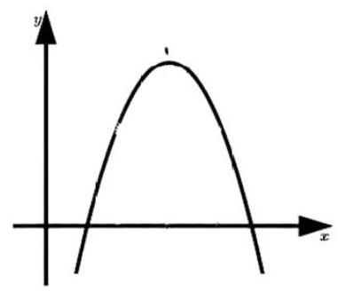

#### 2. 函数轴对称

形如 $f\left( \;\right)  = f$ (   ),看起来像偶函数的形式.

常见形式:

$\left( 1\right) f\left( {a + x}\right)  = f\left( {a - x}\right) \; \Leftrightarrow  \;$ 对称轴:

(2) $f\left( {{2a} - x}\right)  = f\left( x\right) \; \Leftrightarrow  \;$ 对称轴:

(3) $f\left( {a + x}\right)  = f\left( {b - x}\right) \; \Leftrightarrow  \;$ 对称轴:

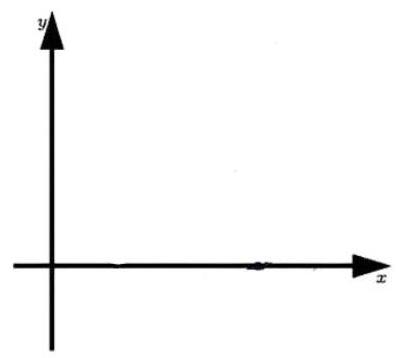

#### 3. 函数中心对称

形如 $f\left( \;\right)  =  - f$ (   )或 $f\left( \;\right)  + f\left( \;\right)  = k$ ,看起来像奇函数的形式.

常见形式:

$\left( 1\right) f\left( {x + a}\right)  =  - f\left( {a - x}\right) \; \Leftrightarrow  \;$ 对称中心:

(2) $f\left( {{2a} - x}\right)  + f\left( x\right)  = {2b}\; \Leftrightarrow  \;$ 对称中心:

(3) $f\left( {a + x}\right)  + f\left( {b - x}\right)  = {2c} \Leftrightarrow  \;$ 对称中心:

#### 4. 函数周期性

周期性的定义:对 $\forall x \in  D$ ，都有___，则 $T$ 为函数的周期.

(1) $T = 2$ (最常见最常考):

$f\left( {x + 1}\right)  + f\left( x\right)  = k \; f\left( {x + 1}\right)  \cdot  f\left( x\right)  = k$

$f\left( {x + 1}\right)  + f\left( x\right)  = f\left( {x + 1}\right)  \cdot  f\left( x\right) \; f\left( {x + 1}\right)  = \frac{1 - f\left( x\right) }{1 + f\left( x\right) }$

(2) $T = 3$ (比较少见)

$f\left( {x + 1}\right)  = 1 - \frac{1}{f\left( x\right) } \; \left( {x + 1}\right)  =  - \frac{1}{1 + f\left( x\right) }$

(3) $T = 6$ (非常少见)

$f\left( {x + 2}\right)  = f\left( {x + 1}\right)  - f\left( x\right)$

※全记下来肯定不靠谱,所以有这么一招...

#### 5. 双对称必出周期

(1) $f\left( x\right)$ 关于 $x = a, x = b$ 同时对称，则 $T = 2\left| {a - b}\right|$ .

$\left( 2\right) f\left( x\right)$ 关于 $\left( {a,0}\right) ,\left( {b,0}\right)$ 同时对称,则 $T = 2\left| {a - b}\right|$ . (注意! 两个对称中心必须纵坐标相同才行!!!)

(3) $f\left( x\right)$ 关于 $\left( {a,0}\right) , x = b$ 同时对称,则 $T = 4\left| {a - b}\right|$ .

### 第一节 判断对称性、周期性

#### 题型一 $f\left( x\right)$ 对称性、周期性

1. 判断下列函数的对称性或周期性.

$\left( 1\right) f\left( x\right)  + f\left( {x - 3}\right)  = 0$ (2) $f\left( x\right)  + f\left( {4 - x}\right)  = 2$

(3) $f\left( {3 + x}\right) f\left( x\right)  = 1$ (4) $f\left( {5 + x}\right)  = f\left( {3 - x}\right)$

(5) $f\left( {x + 2}\right)  + f\left( {x - 1}\right)  = 4$ (6) $f\left( {x + 2}\right)  = 1 - \frac{1}{f\left( x\right) }$

#### 题型二 如何快速找具体函数的对称中心 or 对称轴

2. 已知函数 $f\left( x\right)  = \frac{1}{1 + {2}^{x}}$ ,则对于任意实数 $x$ ,有

A. $f\left( x\right)  + f\left( {-x}\right)  = 0$ B. $f\left( {-x}\right)  - f\left( x\right)  = 0$ C. $f\left( {-x}\right)  + f\left( x\right)  = 1$ D. $f\left( {-x}\right)  - f\left( x\right)  = \frac{1}{3}$

3. 已知函数 $f\left( x\right)  = \frac{1}{{\mathrm{e}}^{x} + a}$ 的图像关于点 $\left( {1, f\left( 1\right) }\right)$ 对称,则 $a =$

A. 1 B. 2 C. e D. ${\mathrm{e}}^{2}$

4. 已知函数 $f\left( x\right)  = \frac{1}{x} + \frac{1}{x - 1} + \frac{1}{x - 2} + \frac{7}{2}$ 的图象是一个中心对称图形,它的对称中心为___.

5. 已知函数 $f\left( x\right)  = \frac{3 \cdot  {2}^{x} + 1}{{2}^{x - 1} + 1}$ 的图象是一个中心对称图形,它的对称中心为___.

6. 关于函数 $f\left( x\right)  = \ln \frac{1 + x}{1 - x}$ ,下列说法正确的是

A. $f\left( x\right)$ 在 $\left( {-1,1}\right)$ 上单调递增,且曲线 $y = f\left( x\right)$ 存在对称轴

B. $f\left( x\right)$ 在 $\left( {-1,1}\right)$ 上单调递增,且曲线 $y = f\left( x\right)$ 存在对称中心

C. $f\left( x\right)$ 在 $\left( {-1,1}\right)$ 上单调递减,且曲线 $y = f\left( x\right)$ 存在对称轴

D. $f\left( x\right)$ 在 $\left( {-1,1}\right)$ 上单调递减,且曲线 $y = f\left( x\right)$ 存在对称中心

#### 题型三 $f\left( {{ax} + b}\right)$ 对称性、周期性

出现频率没那么高, 还是建议少背结论, 理解原理之后你会发现啥都不用记, 一切就是这么简单奇函数: 关于 $\left( {m,0}\right)$ 中心对称:

偶函数: 关于 $x = m$ 轴对称:

7. 判断 $f\left( x\right)$ 所具有的性质.

(1) $f\left( {x + 1}\right)$ 是奇函数； (2) $f\left( {x + 1}\right)$ 关于(1,0)中心对称；

(3) $f\left( {x + 1}\right)$ 是偶函数; (4) $f\left( {x + 1}\right)$ 关于 $x = 1$ 轴对称.

8. 判断 $f\left( x\right)$ 所具有的性质.

(1) $f\left( {{2x} + 1}\right)$ 是奇函数； (2) $f\left( {{2x} + 1}\right)$ 关于 $\left( {1,0}\right)$ 中心对称;

(3) $f\left( {{2x} + 1}\right)$ 是偶函数； (4) $f\left( {{2x} + 1}\right)$ 关于 $x = 1$ 轴对称.

### 第二节 对称性、周期性综合应用

前几年的高考重点，模拟题没活了就爱出这玩意，基本思路就是翻译对称性和周期性，然后画示意图，很多时候可以拿三角函数去凑.

1. $f\left( x\right)$ 是定义域为 $\mathbf{R}$ 的奇函数， $f\left( {1 - x}\right)  = f\left( {1 + x}\right)$ ，若 $f\left( 1\right)  = 2$ ，则 $f\left( 1\right)  + f\left( 2\right)  + \cdots  + f\left( {2024}\right)  =$ ___.

2. 定义在 $\mathbf{R}$ 上的奇函数 $f\left( x\right)$ 满足 $f\left( {x - 4}\right)  =  - f\left( x\right)$ ,且在区间 $\left\lbrack  {0,2}\right\rbrack$ 上是增函数,若方程 $f\left( x\right)  = m\left( {m > 0}\right)$ 在区间 $\left\lbrack  {-8,8}\right\rbrack$ 上有四个不同的根 ${x}_{1},{x}_{2},{x}_{3},{x}_{4}$ ,则 ${x}_{1} + {x}_{2} + {x}_{3} + {x}_{4} =$

3. $f\left( x\right)$ 定义域为 $\mathbf{R}, f\left( {x + 1}\right)$ 为奇函数, $f\left( {x + 2}\right)$ 为偶函数, $x \in  \left\lbrack  {1,2}\right\rbrack$ 时, $f\left( x\right)  = a{x}^{2} + b$ . 若 $f\left( 0\right)  + f\left( 3\right)  = 6$ ,则 $f\left( \frac{9}{2}\right)  =$

A. $- \frac{9}{4}$ B. $- \frac{3}{2}$ C. $\frac{7}{4}$ D. $\frac{5}{2}$

4. 函数 $f\left( x\right)$ 的定义域为 $\mathbf{R}\left( {f\left( x\right) \text{ 不恒为 0 }}\right) , f\left( {x + 2}\right)$ 为偶函数, $f\left( {{2x} + 1}\right)$ 为奇函数,则

A. $f\left( {-\frac{1}{2}}\right)  = 0$ B. $f\left( {-1}\right)  = 0$ C. $f\left( 2\right)  = 0$ D. $f\left( 4\right)  = 0$

5. (多选) 偶函数 $f\left( x\right)$ 定义域为 $\mathbf{R}$ ， $f\left( {\frac{1}{2}x + 1}\right)$ 为奇函数，且 $f\left( x\right)$ 在 $\left\lbrack  {0,1}\right\rbrack$ 上单调递增，则下列结论正确的是

A. $f\left( {-\frac{3}{2}}\right)  < 0$ B. $f\left( \frac{4}{3}\right)  > 0$ C. $f\left( 3\right)  < 0$ D. $f\left( \frac{2024}{3}\right)  > 0$

6. (2021 上海春考) 已知函数 $y = f\left( x\right)$ 的定义域为 $\mathbf{R}$ ,下列是 $f\left( x\right)$ 无最大值的充分条件是

A. $f\left( x\right)$ 为偶函数且关于点 $\left( {1,1}\right)$ 对称 B. $f\left( x\right)$ 为偶函数且关于直线 $x = 1$ 对称

C. $f\left( x\right)$ 为奇函数且关于点 $\left( {1,1}\right)$ 对称 D. $f\left( x\right)$ 为奇函数且关于直线 $x = 1$ 对称

### 第三节 相同对称性的函数

为啥人家能“注意到”，你却注意不到？因为你没有这样的意识:给你一个函数，你应该先去琢磨一下它的单调性、对称性、周期性, 有没有特殊的地方; 给你两个函数, 你要想一想这俩函数有没有什么比较特殊的共同点. 先有这样观察的意识, 知道该观察点啥, 然后你的注意力才会逐渐提高.

1. 设函数 $f\left( x\right)  = a{\left( x + 1\right) }^{2} - 1, g\left( x\right)  = \cos x + {2ax}$ ( $a$ 为常数),当 $x \in  \left( {-1,1}\right)$ 时,曲线 $y = \; f\left( x\right)$ 和 $y = g\left( x\right)$ 恰有一个交点,则 $a =$

A. -1 B. $\frac{1}{2}$ C. 1 D. 2

2. 已知函数 $f\left( x\right)  = \sin {\pi x}, g\left( x\right)  = {x}^{2} - x + 2$ ,则

A. 曲线 $y = f\left( x\right)  + g\left( x\right)$ 不是轴对称图形 B. 曲线 $y = f\left( x\right)  - g\left( x\right)$ 是中心对称图形

C. 函数 $y = f\left( x\right) g\left( x\right)$ 是周期函数

D. 函数 $y = \frac{f\left( x\right) }{g\left( x\right) }$ 最大值为 $\frac{4}{7}$

3. 已知函数 $f\left( x\right)  = {x}^{2} - {2x} + a\left( {{\mathrm{e}}^{x - 1} + {\mathrm{e}}^{-x + 1}}\right)$ 有唯一零点,则 $a =$

A. $- \frac{1}{2}$ B. $\frac{1}{3}$ C. $\frac{1}{2}$ D. 1

4. 已知函数 $f\left( x\right) \left( {x \in  \mathbf{R}}\right)$ 满足 $f\left( {-x}\right)  = 2 - f\left( x\right)$ ,若函数 $y = \frac{x + 1}{x}$ 与 $y = f\left( x\right)$ 的图象交点为 $\left( {{x}_{1},{y}_{1}}\right) ,\left( {{x}_{2},{y}_{2}}\right) ,\cdots ,\left( {{x}_{m},{y}_{m}}\right)$ ,则 $\mathop{\sum }\limits_{{i = 1}}^{m}\left( {{x}_{i} + {y}_{i}}\right)  =$

A. 0 B. $m$ C. ${2m}$ D. ${4m}$

5. 求函数 $f\left( x\right)  = \left( {x + 1}\right) \left( {x + 2}\right) \left( {x + 3}\right) \left( {x + 4}\right)$ 的最小值.

6. 若函数 $f\left( x\right)  = \left( {1 - {x}^{2}}\right) \left( {{x}^{2} + {ax} + b}\right)$ 的图象关于直线 $x =  - 2$ 对称，则 $f\left( x\right)$ 的最大值为___.

★已知 $f\left( x\right)  = \ln \left( \frac{{x}^{2} + {3x} + 3}{{x}^{2} + x + 1}\right)$ 的图象是中心对称图形,你能猜出它的对称中心吗?

### 第四节 证明函数对称性

解答题中证明对称性, 基本可以采取先猜后证的方法, 首先判断出对称轴或者对称中心, 不需要给他理由, 接下来直接证明成立即可.

1. 已知函数 $f\left( x\right)  = \ln \frac{x}{2 - x} + {ax} + b{\left( x - 1\right) }^{3}$ . 证明: 曲线 $y = f\left( x\right)$ 是中心对称图形;

2. 已知函数 $f\left( x\right)  = \left( {\frac{1}{x} + a}\right) \ln \left( {1 + x}\right)$ . 是否存在 $a, b$ 使得曲线 $y = f\left( \frac{1}{x}\right)$ 关于直线 $x = b$ 对称,若存在,求 $a, b$ 的值,若不存在,说明理由;

### 第五节 抽象函数

抽象函数的题目可以大致分为两类, 一类是比较容易找到原函数的, 这类需要我们熟悉常见初等函数 (一次、 二次、指、对、幂)所满足的形式，以及常用的变形方式，可以通过待定系数法求解; 另一类是很难找到原函数的，甚至根本就没有原函数，那没别的招，就是往里带各种数，找一些反例去排除选项. 当然带数也是有一定的方法的，得有目的性，不是纯瞎带，不过无论如何这种题千万别怕尝试，多写点，试着试着就凑出答案了. 模拟题里出的比较混乱，有一些过于难了，还是建议大家掌握基本的方法即可，不必纠结极致的“注意力”.

★常用的函数模型.

(1)一次函数:里面加减，外面也加减.

$f\left( x\right)  = {kx} \Leftrightarrow  f\left( {x \pm  y}\right)  = f\left( x\right)  \pm  f\left( y\right) \; f\left( x\right)  = {kx} + b \Leftrightarrow  f\left( {x \pm  y}\right)  = f\left( x\right)  \pm  f\left( y\right)  \mp  b$

( 2 )二次函数:外面有 ${xy}$ 交叉项.

$f\left( x\right)  = a{x}^{2} + {bx} + c \Leftrightarrow  f\left( {x + y}\right)  = f\left( x\right)  + f\left( y\right)  + {2axy} - c.$

(3)指数函数:里面加减，外面乘除.

$$
f\left( x\right)  = {a}^{x} \Leftrightarrow  f\left( {x + y}\right)  = f\left( x\right) f\left( y\right)
$$

$f\left( x\right)  = {a}^{x} \Leftrightarrow  f\left( {x - y}\right)  = \frac{f\left( x\right) }{f\left( y\right) }$

(4) 对数函数: 里面乘除, 外面加减.

$f\left( x\right)  = {\log }_{a}x \Leftrightarrow  f\left( {xy}\right)  = f\left( x\right)  + f\left( y\right) \; f\left( x\right)  = {\log }_{a}x \Leftrightarrow  f\left( \frac{x}{y}\right)  = f\left( x\right)  - f\left( y\right)$

(5) 幂函数:里面乘除，外面乘除.

$f\left( x\right)  = {x}^{n} \Leftrightarrow  f\left( {xy}\right)  = f\left( x\right) f\left( y\right) \; f\left( x\right)  = {x}^{n} \Leftrightarrow  f\left( \frac{x}{y}\right)  = \frac{f\left( x\right) }{f\left( y\right) }$

(6)* 三角函数

$f\left( x\right)  = \cos x \Leftrightarrow  {2f}\left( x\right) f\left( y\right)  = f\left( {x + y}\right)  + f\left( {x - y}\right)$ ,这种情况下其实就不太建议你硬找原函数了

#### 题型一 比较容易凑出原函数的

1. 已知定义在 $\left( {0, + \infty }\right)$ 的函数 $f\left( x\right)$ 满足 $f\left( {xy}\right)  + 1 = f\left( x\right)  + f\left( y\right)$ ,且 $f\left( \frac{1}{2}\right)  = 0$ ,则 $f\left( {2}^{11}\right)  =$ ___

2. 定义在 $\mathbf{R}$ 上的函数 $f\left( x\right)$ 满足 $f\left( {x + y}\right)  = f\left( x\right)  + f\left( y\right)  + {2xy}, f\left( 1\right)  = 2$ ,则 $f\left( {-3}\right)  =$

A. 2 B. 3 C. 6 D. 9

3. (多选)已知函数 $f\left( x\right)$ 的定义域为 $\mathbf{R}, f\left( {xy}\right)  = {y}^{2}f\left( x\right)  + {x}^{2}f\left( y\right)$ ,则

A. $f\left( 0\right)  = 0$ B. $f\left( 1\right)  = 0$

C. $f\left( x\right)$ 是偶函数 D. $x = 0$ 是 $f\left( x\right)$ 的极小值点

4. 已知定义域为 $\mathbf{R}$ 的函数 $f\left( x\right)$ 满足 $f\left( {x + y}\right)  + f\left( {x - y}\right)  = f\left( x\right) f\left( y\right) , f\left( 1\right)  = 1$ ,则 $\mathop{\sum }\limits_{{k = 1}}^{{22}}f\left( k\right)  =$

A. -3 B. -2 C. 0 D. 1

#### 题型二 不太能凑出原函数的

★常见赋值思路(下面的“1”代表题干中所给常数).

(1) 单赋值: 令 $y = 0, y =  \pm  1, y =  \pm  2, y =  \pm  \frac{1}{2}$ .

(2)双赋值:令 $x = y = 0, x = y =  \pm  1, x = y =  \pm  2, x = y =  \pm  \frac{1}{2}, x =  - y = 1, x =  - y$ .

(3)往已知条件上凑:令 $x + y = 1, x - y = 1$ .

5. 已知函数 $f\left( x\right)$ 的定义域为 $\mathbf{R}$ ，满足 $f\left( \mathbb{C}\right)  = 1$ ，且 $f\left( {{xy} + 1}\right)  = f\left( x\right) f\left( y\right)  - f\left( y\right)  - x + 2$ ，则 $f\left( {2024}\right)  =$ ___.

6. 已知定义域为 $R$ 的函数 $f\left( x\right)$ 满足 $f\left( {x + y}\right)  + f\left( {x - y}\right)  = f\left( x\right) f\left( y\right) , f\left( 1\right)  = 1$ ,则 $\mathop{\sum }\limits_{{k = 1}}^{{22}}f\left( k\right)  =$

A. -3 B. -2 C. 0 D. 1

7. 若定义在 $\mathbf{R}$ 上的函数 $f\left( x\right)$ 满足 ${2f}\left( {x + y}\right) f\left( {x - y}\right)  = f\left( {2x}\right)  + f\left( {2y}\right)$ ,且 $f\left( 1\right)  =  - 1$ ,则 $\mathop{\sum }\limits_{{i = 1}}^{{2024}}f\left( i\right)  =$

A. 0 B. -1 C. 2 D. 1

## 第六讲 指对幂运算与指对幂函数

### 第一节 指对运算

#### 1. 分数指数幂: ${a}^{\frac{m}{n}} =$

#### 2. 指数运算法则:(1) ${a}^{r} \cdot  {a}^{s} =$ ___；(2) ${\left( {a}^{r}\right) }^{s} =$ ___；(3) ${\left( ab\right) }^{r} =$ ___.

#### 3. 一些常见的小计算

${2}^{n + 1} - {2}^{n} =$ ___； ${3}^{n + 1} - {3}^{n} =$ _________:

${\mathrm{e}}^{2x} =$ ___； ${4}^{x + \frac{1}{2}} =$ ___； ${\left( \frac{16}{81}\right) }^{-\frac{3}{4}} =$ ___.

#### 4. 对数运算

(1)对数搞不明白咋回事的朋友，先记住一句话:对数是用来算指数的.

(2)指对互化

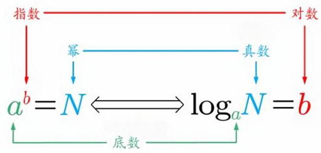

(3)对数恒等式: ${a}^{{\log }_{a}N} =$ ___. ${\log }_{a}1 =$ ___. ${\log }_{a}a =$ ___.

(4) 常用对数: 以 10 为底: $y = \lg x$ ; 自然对数: 以 $e\left( {e \approx  {2.718}}\right)$ 为底: $y = {\log }_{e}x = \ln x$ .

(5)* 常用近似值: $\ln 2 \approx$ ___； $\ln 3 \approx$ ___； $\ln 3 \approx$ ___； $\lg 3 \approx$ ___.

#### 5. 对数重要公式

${\log }_{a}\left( {MN}\right)  =$

${\log }_{a}{M}^{N} =$ ___ ${\log }_{{a}^{b}}{M}^{n} =$ ___ $\;{\log }_{a}\frac{1}{M} =$ ___

有这公式吗？ $\log M \cdot  {\log }_{a}N =$

换底公式: ${\log }_{a}b = \frac{{\log }_{c}b}{{\log }_{c}a}$ 重要变形: ${\log }_{a}b \cdot  {\log }_{b}a =$ ___

#### 题型一 指数计算

1. 常见指数幂，不一定全背下来，但起码对这些数要有个印象.

${11}^{2} = \;{12}^{2} = \;{13}^{2} = \;{14}^{2} = \;{15}^{2} = \;{16}^{2} = \;{17}^{2} = \;{18}^{2} = \;{19}^{2} =$

${2}^{2} = \;{2}^{3} = \;{2}^{4} = \;{2}^{5} = \;{2}^{6} = \;{2}^{7} = \;{2}^{8} = \;{2}^{9} = \;{2}^{10} =$

${3}^{2} = \;{3}^{3} = \;{3}^{4} = \;{4}^{2} = \;{4}^{3} = \;{5}^{2} = \;{5}^{3} = \;{6}^{2} = \;{6}^{3} =$

2. 化简计算

(1) $\frac{{\left( {a}^{\frac{2}{3}}{b}^{-1}\right) }^{-\frac{1}{2}}{a}^{-\frac{1}{2}}{b}^{\frac{1}{3}}}{\sqrt[6]{a{b}^{5}}}$ (2) $\sqrt[3]{{a}^{\frac{7}{2}}\sqrt[3]{{a}^{-3}}} \div  \sqrt{\sqrt[3]{{a}^{-8}} \cdot  \sqrt[3]{{a}^{12}}}\left( {a > 0}\right)$ (3) $\sqrt{\frac{3 - \sqrt{5}}{8}}$

3. (2018上海 11)已知常数 $a > 0$ ，函数 $f\left( x\right)  = \frac{{2}^{x}}{{2}^{x} + {ax}}$ 的图象经过点 $P\left( {p,\frac{6}{5}}\right)$ ， $Q\left( {q, - \frac{1}{5}}\right)$ ，若 ${2}^{p + q} = {36pq}$ ， 则 $a = {\_ \_ \_ .}$

4. 解不等式 ${4}^{k - 1} - 7 \cdot  {2}^{k - 1} - 8 > 0$ .

#### 题型二 对数计算

5. 化简计算

(1)lg0.001 $= \; \ln \sqrt{e} = \; {\left( \frac{1}{4}\right) }^{{\log }_{4}3} =$

(2) ${\log }_{4}8 = \; {\log }_{9}{27} = \; {\log }_{\sqrt[4]{3}}{81} = \; {\log }_{\left( 2 + \sqrt{3}\right) }\left( {2 - \sqrt{3}}\right)  =$

(3) ${\left( \lg 2\right) }^{2} + \lg 4 \cdot  \lg 5 + {\left( \lg 5\right) }^{2} \; \lg {25} + \frac{2}{3}\lg 8 + \lg 5 \cdot  \lg {20} + {\left( \lg 2\right) }^{2}$

6. 若 ${\log }_{a}2 = m$ ， ${\log }_{a}3 = n$ ，则 ${a}^{{2m} + n} =$ ___

7. 已知 $\left( {{x}_{1},{y}_{1}}\right)$ , $\left( {{x}_{2},{y}_{2}}\right)$ 是函数 $y = {2}^{x}$ 的图象上两个不同的点,则

A. ${\log }_{2}\frac{{y}_{1} + {y}_{2}}{2} < \frac{{x}_{1} + {x}_{2}}{2}$ B. ${\log }_{2}\frac{{y}_{1} + {y}_{2}}{2} > \frac{{x}_{1} + {x}_{2}}{2}$

C. ${\log }_{2}\frac{{y}_{1} + {y}_{2}}{2} < {x}_{1} + {x}_{2}$ D. ${\log }_{2}\frac{{y}_{1} + {y}_{2}}{2} > {x}_{1} + {x}_{2}$

8. $f\left( x\right)$ 是定义在 $\mathbf{R}$ 上的奇函数且 $f\left( x\right)  = f\left( {x + 4}\right)$ ,当 $x \in  \left( {-1,0}\right)$ 时, $f\left( x\right)  = {2}^{x} + \frac{1}{5}$ ,则 $f\left( {{\log }_{2}{24}}\right)  =$

#### 题型三 换底公式

9. 已知 $a = \lg 2, b = \lg 3$ ,用 $a, b$ 表示 ${\log }_{5}{18}$ .

10. 若 ${2}^{a} = {5}^{b} = {10}$ ,则 $\frac{1}{a} + \frac{1}{b} =$

A. -1 B. $\lg 7$ C. 1 D. ${\log }_{7}{10}$

11. 已知 $a > 1,\frac{1}{{\log }_{8}a} - \frac{1}{{\log }_{a}4} =  - \frac{5}{2}$ ，则 $a =$ ___.

12. 在某款计算器上计算 ${\log }_{a}b$ 时，需依次按下 “log”，“a”，“b” 3 个键，某同学使用该计算器计算 ${\log }_{a}b(a > 1$ ， $b > 1)$ 时，误按成“log”，“ $b$ ”，“ $a$ ”这 3 个键，所得到的值是正确结果的 $\frac{4}{9}$ ，则

A. ${2a} = {3b}$ B. ${a}^{3}{b}^{2} = 1$ C. ${a}^{2} = {b}^{3}$ D. ${a}^{3} = {b}^{2}$

13. 设 $a = {\log }_{0.2}{0.3}, b = {\log }_{2}{0.3}$ ,则

A. $a + b < {ab} < 0$ B. ${ab} < a + b < 0$ C. $a + b < 0 < {ab}$ D. ${ab} < 0 < a + b$

#### 题型四 指对数实际应用

14. (人教 B 版课后习题) 已知 $\lg 3 \approx  {0.4771}$ ,判断 ${3}^{2025}$ 是多少位数.

15. 德国心理学家艾宾浩斯研究发现, 人类大脑对事物的遗忘是有规律的, 他依据实验数据绘制出 “遗忘曲线”. “遗忘曲线”中记忆率 $y$ 随时间 $t$ (小时) 变化的趋势可由函数 $y = 1 - {0.6}{t}^{0.27}$ 近似描述,则记忆率为 50%时经过的时间约为(参考数据: $\lg 2 \approx  {0.30},\lg 3 \approx  {0.48}$ )

A. 2 小时 B. 0.8 小时 C. 0.5 小时 D. 0.2 小时

16. 在一定条件下,某人工智能大语言模型训练 $N$ 个单位的数据量所需要时间 $T = k{\log }_{2}N$ (单位:小时)，其中 $k$ 为常数. 在此条件下，已知训练数据量 $N$ 从 ${10}^{6}$ 个单位增加到 ${1.024} \times  {10}^{9}$ 个单位时，训练时间增加 20 小时; 当训练数据量 $N$ 从 ${1.024} \times  {10}^{9}$ 个单位增加到 ${4.096} \times  {10}^{9}$ 个单位时,训练时间增加 (单位:小时)

A. 2 B. 4 C. 20 D. 40

17. Logistic 模型是常用数学模型之一, 可应用于流行病学领域. 有学者根据公布数据建立了某地区新冠肺炎累计确诊病例数 $I\left( t\right)$ ( $t$ 的单位:天)的 Logistic 模型: $I\left( t\right)  = \frac{K}{1 + {\mathrm{e}}^{-{0.23}\left( {t - {53}}\right) }}$ ，其中 $K$ 为最大确诊病例数. 当 $I\left( {t}^{ * }\right)  = {0.95K}$ 时,标志着已初步遏制疫情,则 ${t}^{ * }$ 约为 $\left( {\ln {19} \approx  3}\right)$

A. 60 B. 63 C. 66 D. 69

18. (多选) 噪声污染问题越来越受到重视. 用声压级来度量声音的强弱, 定义声压级 ${L}_{p} = {20} \times  \lg \frac{p}{{p}_{0}}$ ,其中常数 ${p}_{0}\left( {{p}_{0} > 0}\right)$ 是听觉下限阈值, $p$ 是实际声压. 下表为不同声源的声压级:

<table><tr><td>声源</td><td>与声源的距离/m</td><td>声压级/dB</td></tr><tr><td>燃油汽车</td><td>10</td><td>60~90</td></tr><tr><td>混合动力汽车</td><td>10</td><td>50~60</td></tr><tr><td>电动汽车</td><td>10</td><td>40</td></tr></table>

已知在距离燃油汽车、混合动力汽车、电动汽车 ${10}\mathrm{\;m}$ 处测得实际声压分别为 ${p}_{1},{p}_{2},{p}_{3}$ ,则

A. ${p}_{1} \geq  {p}_{2}$ B. ${p}_{2} > {10}{p}_{3}$ C. ${p}_{3} = {100}{p}_{0}$ D. ${p}_{1} \leq  {100}{p}_{2}$

### 第二节 指对幂函数

指数函数: $y = {a}^{x}\left( {a > 0, a \neq  1}\right)$ 对数函数: $y = {\log }_{a}x\left( {a > 0, a \neq  1}\right)$

<table><tr><td align="center" valign="top">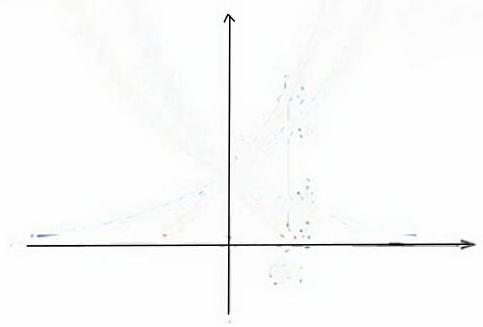</td><td align="center" valign="top">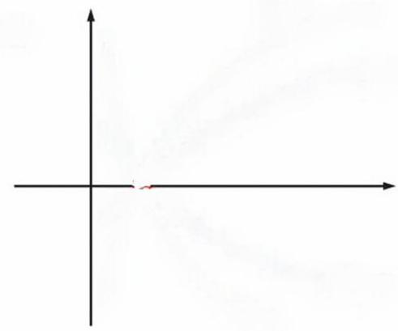</td></tr></table>

幂函数: $y = {x}^{\alpha }\left( {\alpha  =  - 1,\frac{1}{2},1,2,3}\right) \; y = \left| {\ln x}\right|$

<table><tr><td align="center" valign="top">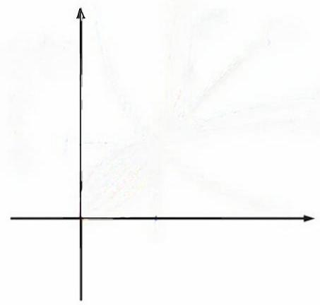</td><td align="center" valign="top">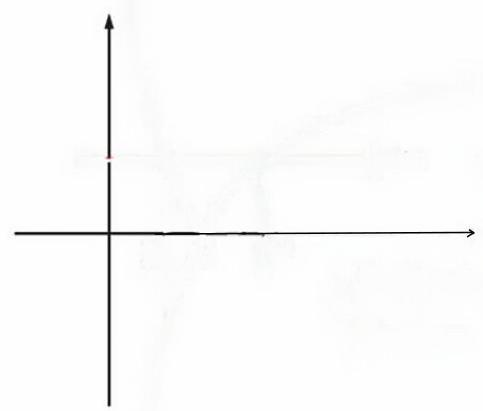</td></tr></table>

关于反函数，只有上海卷会稍微考一点，全国卷的朋友们只需要了解一件事:同底指对函数互为反函数，图象关于 $y = x$ 对称，就够了. 如果模拟题出了需要很复杂的反函数技巧的题目，你就跟我一起骂就完事了.

#### 题型一 基本计算

1. 已知幂函数 $f\left( x\right)$ 的图像过点 $\left( {3,\frac{1}{9}}\right)$ ,则 $f\left( 2\right)  =$

A. -4 B. -3

C. $\frac{1}{4}$ D. 3

2. 已知幂函数 $f\left( x\right)  = \left( {{m}^{2} + m - 1}\right) {x}^{{2m} + 1}$ 在 $\left( {0, + \infty }\right)$ 上单调递减，则实数 $m$ 的值为

A. -2 B. -1 C. 1 D. 2 或 1

3. 函数 $f\left( x\right)  = {\log }_{2}\left( {-{x}^{2} + {2x} + 3}\right)$ 的值域为___，单调增区间是___.

4. 函数 $f\left( x\right)  = \lg \left( {a{x}^{2} - {ax} + 1}\right)$ 的定义域为 $\mathbf{R}$ ,求实数 $a$ 的取值范围.

5. 函数 $f\left( x\right)  = \lg \left( {a{x}^{2} - {ax} + 1}\right)$ 的值域为 $\mathbf{R}$ ,求实数 $a$ 的取值范围.

#### 题型二 图像性质

1. 函数 $f\left( x\right)  = {a}^{{2x} - 4} - 3$ 恒过定点___，函数 $g\left( x\right)  = 1 - {\log }_{a}\left( {2 + x}\right)$ 恒过定点___.

2. 当 $0 < x \leq  \frac{1}{2}$ 时, ${4}^{x} < {\log }_{a}x$ ,则 $a$ 的取值范围是

A. $\left( {0,\frac{\sqrt{2}}{2}}\right)$ B. $\left( {\frac{\sqrt{2}}{2},1}\right)$ C. $\left( {1,\sqrt{2}}\right)$ D. $\left( {\sqrt{2},2}\right)$

3. 当 $a \neq  0$ 时,函数 $y = {ax} + b$ 和 $y = {b}^{ax}$ 的图像只可能是

<table><tr><td align="center" valign="top">A. 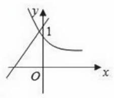</td><td align="center" valign="top">B. 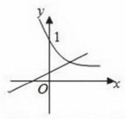</td></tr><tr><td align="center" valign="top">C. 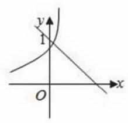</td><td align="center" valign="top">D. 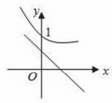</td></tr></table>
4. 在同一个坐标系中,函数 $f\left( x\right)  = {\log }_{a}x, g\left( x\right)  = {a}^{-x}, h\left( x\right)  = {x}^{a}$ 的部分图像可能是

<table><tr><td align="center" valign="top">A. 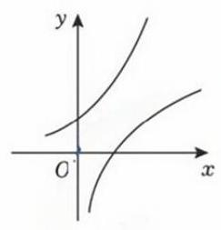</td><td align="center" valign="top">B. 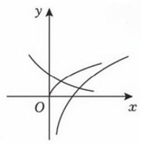</td></tr><tr><td align="center" valign="top">C. 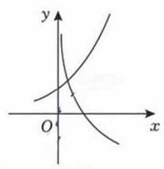</td><td align="center" valign="top">D. 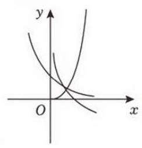</td></tr></table>
5. 函数 $f\left( x\right)  = {\log }_{a}\left( {{2}^{x} + b - 1}\right) \left( {a > 0, a \neq  1}\right)$ 的图象如图所示,则 $a, b$ 满足的关系是

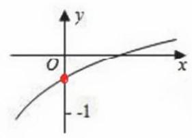

A. $0 < {a}^{-1} < {b}^{-1} < 1$ B. $0 < {b}^{-1} < a < 1$ C. $0 < b < {a}^{-1} < 1$ D. $0 < {a}^{-1} < b < 1$

6. 已知 $a > 0$ ,且 $a \neq  1$ ,则函数 $y = {\log }_{a}\left( {x + \frac{1}{a}}\right)$ 的图像一定经过

A. 一、二象限 B. 一、三象限 C. 二、四象限 D. 三、四象限

7. 若函数 $y = \left| {{\log }_{2}x}\right|$ 的定义域为 $\left\lbrack  {a, b}\right\rbrack$ ，值域为 $\left\lbrack  {0,2}\right\rbrack$ ，则 $b - a$ 的最小值为___，最大值为___.

8. 已知函数 $f\left( x\right)  = \left| {{\log }_{5}x}\right|$ ，若 $f\left( x\right)  < f\left( {2 - x}\right)$ ，则 $x$ 的取值范围是___.

### 第三节 比大小

首先，不是说高考不考比大小了，是说不考那种【通过构造很复杂的函数然后求导判断单调性进而判断正负】 的比大小，构造简单函数比大小可能考，利用基本指对图像的常规比大小更可能考，别老乱造谣啊.

通常来说除了非常明显的构造函数题型，比大小没有万能的方法，多试试，给每个数大致估估值，基本就能出来,理论上不会再出太难的题. 下面展示的也只是常规的方法,你超绝记忆力记一堆估算值那也是一种方法... 比如我也记了几个常见的,我觉得够用了: $\ln 2 \approx  {0.69},\ln 3 \approx  {1.1},\lg 2 \approx  {0.3010},\lg 3 \approx  {0.4771}$ .

#### 题型一 借助图像

这类题在比大小市场里占大多数, 需要熟练掌握指对幂函数的单调性

1. 比较大小.

(1) $a = {1.01}^{0.5}, b = {1.01}^{0.6}, c = {0.6}^{0.5}$ (2) $a = \ln 2, b = {\log }_{3}2, c = {5}^{\frac{1}{2}}, d = {\log }_{1}3$

2. 设正数 $a, b$ 满足 ${\log }_{2}a = {\log }_{3}b$ ，给出下列五个结论，其中不可能成立的是___.

① $1 < a < b$ ; ② $0 < b < a < 1$ ; ③ $a = b$ ；④ $1 < b < a$ ； ⑤ $0 < a < b < 1$ .

3. 已知 ${2025}^{a} = {2035},{2035}^{b} = {2025}, c = {\log }_{2050}{2025}$ ,则

A. ${a}^{c} < {b}^{c}$ B. ${c}^{a} < {c}^{b}$ C. ${\log }_{a}c > {\log }_{b}c$ D. ${\log }_{c}a > {\log }_{c}b$

#### 题型二 求同存异

全部转化成形式相同或相近的数, 单独比较二者不同的部分.

4. 比较大小

(1) ${\log }_{3}2$ ___ $\frac{1}{2}$ , ${\log }_{3}2$ ___ $\frac{2}{3}$ , $\ln 5$ ___ $\frac{3}{2}$ (2) ${\mathrm{e}}^{\frac{1}{2}}$ ___ $\frac{3}{2},{2}^{\frac{3}{2}}$ ___ $\frac{3}{2},{\left( \frac{2}{3}\right) }^{\frac{1}{2}}$ ___ ${\left( \frac{1}{2}\right) }^{\frac{2}{3}}$

(3) $a = {\left( \ln 2\right) }^{2}, b = \ln \left( {\ln 2}\right) , c = \ln 2, d = \ln \sqrt{2}$ (4) $a = \frac{\ln 2}{2}, b = \frac{\ln 3}{3}, c = \frac{\ln 5}{5}$

(5) $a = {\log }_{2}6, b = {\log }_{5}{10}, c = {\log }_{7}{14}$ (6) $a = {\log }_{2}3, b = {\log }_{4}6, c = {\log }_{6}9$

5. 已知 $x > 1, y > 1$ ,则 “ ${4}^{x} > {2}^{y\prime }$ ” 是 “ ${\log }_{2}x > {\log }_{4}\left( {y - 1}\right)$ ” 的

A. 充分不必要条件 B. 必要不充分条件 C. 充分必要条件 D. 不充分不必要条件

6. 设 $x\text{ 、 }y\text{ 、 }z$ 为正数,且 ${2}^{x} = {3}^{y} = {5}^{z}$ ,则

A. ${2x} < {3y} < {5z}$ B. ${5z} < {2x} < {3y}$ C. ${3y} < {5z} < {2x}$ D. ${3y} < {2x} < {5z}$

7. 若实数 $x, y, z$ 满足 $2 + {\log }_{2}x = 3 + {\log }_{3}y = 5 + {\log }_{5}z$ ,则 $x, y, z$ 的大小关系不可能是

A. $x > y > z$ B. $x > z > y$ C. $y > x > z$ D. $y > z > x$

#### 题型三 借助中间量

简单来说,大家都去跟 0 比比,跟 1 比比,跟 $\frac{1}{2}$ 比比,跟-1比比.

8. 已知 $a = {\log }_{5}2, b = {\log }_{8}3, c = \frac{1}{2}$ ，则

A. $c < b < a$ B. $b < a < c$ C. $a < c < b$ D. $a < b < c$

9. 比较大小: $a = {\log }_{5}2, b = {\log }_{0.5}{0.2}, c = {0.5}^{0.2}$ .

10. 已知 $x = \ln \pi , y = {\log }_{5}2, z = {e}^{-\frac{1}{2}}$ ,则

A. $x < y < z$ B. $z < x < y$ C. $z < y < x$ D. $y < z < x$

11. 已知 $a = {5}^{{\log }_{2}{3.4}}, b = {5}^{{\log }_{4}{3.6}}, c = {\left( \frac{1}{5}\right) }^{{\log }_{3}{0.3}}$ ,则

A. $a > b > c$ B. $b > a > c$ C. $a > c > b$ D. $c > a > b$

#### 题型四 构造函数

大题小题都用得到, 比较重要, 此处说的构造, 指的是两个变量地位均等而进行的同构, 而那种复杂的指对变形同构，个人觉得高考出现几率极低，暂时不必纠结，以后再讲.

12. 若 ${2}^{x} - {2}^{y} < {3}^{-x} - {3}^{-y}$ ，则

A. $\ln \left( {y - x + 1}\right)  > 0$ B. $\ln \left( {y - x + 1}\right)  < 0$ C. $\ln \left| {x - y}\right|  > 0$ D. $\ln \left| {x - y}\right|  < 0$

13. $a = \frac{\ln 2}{2}, b = \frac{\ln 3}{3}, c = \frac{\ln 5}{5}$

14. 比较 ${\log }_{2}3,{\log }_{3}4,{\log }_{4}5$ 的大小关系

15. 若 ${2}^{a} + {\log }_{2}a = {4}^{b} + 2{\log }_{4}b$ ,则

A. $a > {2b}$ B. $a < {2b}$ C. $a > {b}^{2}$ D. $a < {b}^{2}$

16. *已知 ${5}^{5} < {8}^{4},{13}^{4} < {8}^{5}$ . 设 $a = {\log }_{5}3, b = {\log }_{8}5, c = {\log }_{13}8$ ,则

A. $a < b < c$ B. $b < a < c$ C. $b < c < a$ D. $c < a < b$

## 第七讲 函数零点与方程

### 第一节 零点存在性定理

#### 1. 函数零点的概念

使 $f\left( x\right)  = 0$ 的实数 $x$ 叫做函数 $f\left( x\right)$ 的零点. 例: $f\left( x\right)  = x - 1$ 的零点是___

#### 2. 零点存在性定理

若函数在 $\left\lbrack  {a, b}\right\rbrack$ 上连续,且 $f\left( a\right)  \cdot  f\left( b\right)  < 0$ ,则函数在 $\left( {a, b}\right)$ 上至少有一个零点;

若函数在 $\left\lbrack  {a, b}\right\rbrack$ 上单调连续,且 $f\left( a\right)  \cdot  f\left( b\right)  < 0$ ,则存在唯一零点.

#### 3. 通常来说, 若能直接求出具体零点必然是极好的, 但包含指对计算时经常求不出, 此时若函数单调, 则经常借助零点存在性定理判断零点所在区间.

#### 题型一 判断零点所在区间

这类题的本质其实是___.

1. 在下列区间中,函数 $f\left( x\right)  = \ln x - \frac{2}{x}$ 的零点所在区间为

A. $\left( {1,2}\right)$ B. $\left( {2,3}\right)$ C. $\left( {3,4}\right)$ D. $\left( {e,3}\right)$

2. 在下列区间中,函数 $f\left( x\right)  = {\mathrm{e}}^{x} + {4x} - 3$ 的零点所在的区间为

A. $\left( {-\frac{1}{4},0}\right)$ B. $\left( {0,\frac{1}{4}}\right)$ C. $\left( {\frac{1}{4},\frac{1}{2}}\right)$ D. $\left( {\frac{1}{2},\frac{3}{4}}\right)$

3. 函数 $f\left( x\right)  = {0.3}^{ \circ  } - \sqrt{x}$ 的零点所在区间是

A. $\left( {0,{0.3}}\right)$ B. $\left( {{0.3},{0.5}}\right)$ C. $\left( {{0.5},1}\right)$ D. $\left( {1,2}\right)$

### 第二节 借助图象交点找零点

#### 1. 函数 $f\left( x\right)$ 的零点 $\Leftrightarrow$ 方程 $f\left( x\right)  = 0$ 的根 $\Leftrightarrow$ 函数 $y = f\left( x\right)$ 的图像与 $x$ 轴的交点.

#### 2. 函数 $F\left( x\right)  = f\left( x\right)  - g\left( x\right)$ 的零点 $\Leftrightarrow  F\left( x\right)  = f\left( x\right)  - g\left( x\right)  = 0$ 的根 $\Leftrightarrow  f\left( x\right)  = g\left( x\right)  \Leftrightarrow  f\left( x\right)$ 与 $g\left( x\right)$ 图像交点.

#### 3. “等高线”

$f\left( x\right)  = m$ 的根 $\Leftrightarrow$ 存在互不相等的实数 $a, b, c$ 满足 $f\left( a\right)  = f\left( b\right)  = f\left( c\right)  \Leftrightarrow$ 一条横线与 $f\left( x\right)$ 交点个数.

#### 题型一 画图看交点

稍复杂零点问题的核心方法,就是画图,尝试将其拆分为两个容易画图的函数,图象交点个数即零点个数.

1. 函数 $f\left( x\right)  = \ln x - x + 2$ 的零点个数为___

2. 已知函数 $y = {2}^{x} + x, y = \ln x + x, y = \lg x + x$ 的零点依次为 ${x}_{1},{x}_{2},{x}_{3}$ ,则 ${x}_{1},{x}_{2},{x}_{3}$ 的大小关系为___.

3. 已知 $a, b, c$ 均为正数,且 ${2}^{a} = {\log }_{2}a,{\left( \frac{1}{2}\right) }^{b} = {\log }_{2}b,{\left( \frac{1}{2}\right) }^{c} = {\log }_{2}c$ ,则 $a, b, c$ 的大小关系为___.

4. 函数 $f\left( x\right)  = {2}^{x}\left| {{\log }_{0.5}x}\right|  - 1$ 的零点个数为___.

#### 题型二 函数等高线

关注根之间是否存在等量关系,核心思想是消元转化为单变量,必要时需引入参数,即“连等设 $k$ ”.

5. 函数 $f\left( x\right)  = \left\{  \begin{array}{ll} \left| {\ln x}\right| , & 0 < x \leq  \mathrm{e} \\   - \frac{1}{\mathrm{e}}x + 2, & x > \mathrm{e} \end{array}\right.$ ,若存在互不相等的实数 $a, b, c$ 满足 $f\left( a\right)  = f\left( b\right)  = f\left( c\right)$ ,则 ${abc}$ 的取值范围

A. $\left( {0,\mathrm{e}}\right)$ B. $\left( {1,\mathrm{e}}\right)$ C. $\left( {1,2\mathrm{e}}\right)$ D. $\left( {e,{2e}}\right)$

6. 已知函数 $f\left( x\right)  = \left\{  \begin{array}{l}  - {x}^{2} + {2x} + 1, x < 2 \\  {2}^{x - 2}, x \geq  2 \end{array}\right.$ ,且存在不同的实数 ${x}_{1},{x}_{2},{x}_{3}$ ,使得 $f\left( {x}_{1}\right)  = f\left( {x}_{2}\right)  = f\left( {x}_{3}\right)$ ,则 ${x}_{1} \cdot  {x}_{2} \cdot  {x}_{3}$ 的取值范围是

A. $\left( {0,3}\right)$ B. $\left( {1,2}\right)$ C. $\left( {0,2}\right)$ D. $\left( {1,3}\right)$

### 第三节 二次方程根的分布

很多时候我们需要对方程的根加以限制，才能满足题目需要，这其中最为常见的就是对二次函数根的控制. 比如,让二次函数有两个正根/有两个大于 1 的根/在区间 $\left\lbrack  {a, b}\right\rbrack$ 中有两个根/不存在大于 $m$ 的根等等等等...

1. 图像视角:限制二次函数的开口、对称轴、判别式、特殊值来控制根的分布。

2. 韦达视角:利用判别式与韦达定理来控制根的分布。

3. $\Delta  = 0$ 的情况很多时候得单独讨论.

<table><tr><td colspan="4">两根与 0 的大小比较</td></tr><tr><td>根的分布</td><td>对应图像</td><td>图像视角</td><td>韦达视角</td></tr><tr><td>${x}_{1} < 0,{x}_{2} < 0$</td><td>[失效外部图片：bo_d6ppm34601uc73e385s0_52.jpg]</td><td></td><td></td></tr><tr><td>${x}_{1} > 0,{x}_{2} > 0$</td><td>[失效外部图片：bo_d6ppm34601uc73e385s0_52.jpg]</td><td></td><td></td></tr><tr><td>${x}_{1} < 0 < {x}_{2}$</td><td>[失效外部图片：bo_d6ppm34601uc73e385s0_52.jpg]</td><td></td><td></td></tr></table>

<table><tr><td colspan="4">两根与 $k$ 的大小比较</td></tr><tr><td>根的分布</td><td>对应图像</td><td>图像视角</td><td>韦达视角</td></tr><tr><td>${x}_{1} < k,{x}_{2} < k$</td><td>[失效外部图片：bo_d6ppm34601uc73e385s0_52.jpg]</td><td></td><td></td></tr><tr><td>${x}_{1} > k,{x}_{2} > k$</td><td>[失效外部图片：bo_d6ppm34601uc73e385s0_52.jpg]</td><td></td><td></td></tr><tr><td>${x}_{1} < k < {x}_{2}$</td><td>[失效外部图片：bo_d6ppm34601uc73e385s0_52.jpg]</td><td></td><td></td></tr></table>

<table><tr><td colspan="4">两根在区间上的分布</td></tr><tr><td>根的分布</td><td>对应图像</td><td>图像视角</td><td>韦达视角</td></tr><tr><td>$m < {x}_{1} < n$</td><td>[失效外部图片：bo_d6ppm34601uc73e385s0_53.jpg]</td><td></td><td></td></tr><tr><td>$m < {x}_{1} < {x}_{2} < n$</td><td>[失效外部图片：bo_d6ppm34601uc73e385s0_53.jpg]</td><td></td><td></td></tr></table>

千万不要机械背结论，这类题目首先在脑海中想象一下:函数图象应该长什么样？然后用条件去加以限制， 每写出一个条件都要思考:“这样就够了吗”，尝试举出反例，有反例，就再多加条件去限制.

1. 关于 $x$ 的方程 ${x}^{2} + \left( {{a}^{2} - 1}\right) x + a - 2 = 0$ 有一个根小于 -1,另一个根大于 1,则 $a$ 的取值范围是___.

2. (多选) 若函数 $f\left( x\right)  = a\ln x + \frac{b}{x} + \frac{c}{{x}^{2}}\left( {a \neq  0}\right)$ 既有极大值也有极小值,则

A. ${bc} > 0$ B. ${ab} < 0$ C. ${b}^{2} + {8ac} > 0$ D. ${ac} < 0$

3. 关于 $x$ 的方程 $a{x}^{2} + {4x} + 1 = 0$ 至少有一个负根的充要条件是

A. $0 < a \leq  4$ B. $a \leq  0$ C. $a < 4$ D. $a \leq  4$

4. (人教 B 版课后习题) 已知函数 $f\left( x\right)  = 2\left( {m + 1}\right) {x}^{2} + {4mx} + {2m} - 1$ 有一个零点在区间 $\left( {0,1}\right)$ 内,求实数 $m$ 的取值范围. 若函数 $f\left( x\right)  =  - {3a}{x}^{2} + {4x} - 1$ 在区间 $\left( {-1,1}\right)$ 内恰有一个零点,则实数 $a$ 的取值范围为

A. $\left( {-\frac{5}{3},1}\right)$ B. $\left\lbrack  {-\frac{5}{3},\frac{4}{3}}\right\rbrack$ C. $\left\lbrack  {-\frac{5}{3},1}\right\rbrack   \cup  \left\{  \frac{4}{3}\right\}$ D. $\left\lbrack  {-\frac{2}{3},1}\right\rbrack   \cup  \left\{  \frac{4}{3}\right\}$

### 第四节 函数、方程、不等式之间的联系

函数的零点 $\Leftrightarrow$ 方程的根 $\Leftrightarrow$ 不等式解集的区间端点,三者要灵活转化.

1. 已知关于 $x$ 的一元二次不等式 $a{x}^{2} + {bx} - c < 0$ 的解集为 $\{ x \mid  3 < x < 5\}$ ,则不等式 $c{x}^{2} + {bx} - a > 0$ 的解集为

A. $\left( {-\infty ,\frac{1}{5}}\right)  \cup  \left( {\frac{1}{3}, + \infty }\right)$ B. $\left( {-\infty , - \frac{1}{3}}\right)  \cup  \left( {-\frac{1}{5}, + \infty }\right)$

C. $\left( {\frac{1}{5},\frac{1}{3}}\right)$ D. $\left( {-\frac{1}{3}, - \frac{1}{5}}\right)$

2. 若关于 $x$ 的方程 $\left( {x - 2}\right) \left( {x - 3}\right)  = m$ 有实数根 ${x}_{1},{x}_{2}$ ,且 ${x}_{1} < {x}_{2}$ ,下列4个结论中正确的结论个数为 ① $m = 0$ 时， ${x}_{1} = 2,{x}_{2} = 3$ ; ② $m >  - \frac{1}{4}$ ; ③ $m > 0$ 时， $2 < {x}_{1} < {x}_{2} < 3$ ；④ $m > 0$ 时， ${x}_{1} < 2 < 3 < {x}_{2}$ ；

A. 1 B. 2 C. 3 D. 4

3.(2003 上海理 15) ${a}_{1},{b}_{1},{c}_{1},{a}_{2},{b}_{2},{c}_{2}$ 均为非零实数,不等式 ${a}_{1}{x}^{2} + {b}_{1}x + c > 0$ 和 ${a}_{2}{x}^{2} + {b}_{2}x + {c}_{2} > 0$ 的解集分别为 $M, N$ ,那么 “ $\frac{{a}_{1}}{{a}_{2}} = \frac{{b}_{1}}{{b}_{2}} = \frac{{c}_{1}}{{c}_{2}}$ ” 是 “ $M = N$ ” 的

A. 充分而不必要条件 B. 必要而不充分条件 C. 充分必要条件 D. 既不充分也不必要条件

4. 设函数 $f\left( x\right)  = \sqrt{a{x}^{2} + {bx} + c}\left( {a < 0}\right)$ 的定义域为 $D$ ,若所有点 $\left( {s, f\left( t\right) }\right) \left( {s, t \in  D}\right)$ ) 构成一个正方形区域,则 $a$ 的值为

A. -2 B. -4 C. -8 D. 不能确定

5. 设函数 $f\left( x\right)  = \left( {x + a}\right) \ln \left( {x + b}\right)$ ,若 $f\left( x\right)  \geq  0$ ,则 ${a}^{2} + {b}^{2}$ 的最小值为

A. $\frac{1}{8}$ B. $\frac{1}{4}$ C. $\frac{1}{2}$ D. 1

6. 已知 $f\left( x\right)  = m\left( {x - {2m}}\right) \left( {x + m + 3}\right) , g\left( x\right)  = {2}^{x} - 2$ . 若同时满足条件:

(1) $\forall x \in  \mathbf{R}, f\left( x\right)  < 0$ 或 $g\left( x\right)  < 0;\left( 2\right) \exists x \in  \left( {-\infty , - 4}\right) , f\left( x\right)  \cdot  g\left( x\right)  < 0$ .

则 $m$ 的取值范围是

A. $\left( {-4,0}\right)$ B. $\left( {-\infty , - 2}\right)$ C. $\left( {-4, - 2}\right)$ D. $\varnothing$

### 第五节 函数图像识别

①定义域；②特殊点 $(x$ 、 $y$ 轴交点、 $\pm  1$ 等特殊值、无穷远)；③ 看正负；④奇偶、单调 (求导).

1. 函数 $f\left( x\right)  = \frac{{ax} + b}{{\left( x + c\right) }^{2}}$ 的图像如图所示,判断 $a, b, c$ 的正负.

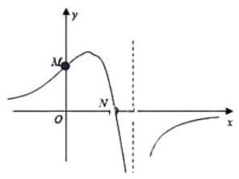

2. 函数 $y = \frac{\left( {x + 1}\right) {a}^{x}}{\left| x\right| }\left( {a > 1}\right)$ 的图像的大致形状是

<table><tr><td align="center" valign="top">A. 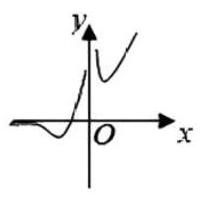</td><td align="center" valign="top">B. 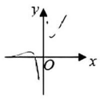</td></tr><tr><td align="center" valign="top">C. 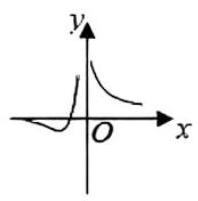</td><td align="center" valign="top">D. 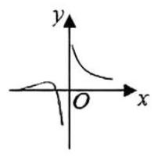</td></tr></table>
3. 函数 $f\left( x\right)  =  - {x}^{2} + \left( {{\mathrm{e}}^{x} - {\mathrm{e}}^{-x}}\right) \sin x$ 的区间 $\left\lbrack  {-{2.8},{2.8}}\right\rbrack$ 的图像大致为

<table><tr><td align="center" valign="top">A. 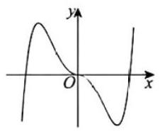</td><td align="center" valign="top">B. 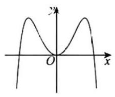</td></tr><tr><td align="center" valign="top">C. 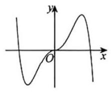</td><td align="center" valign="top">D. 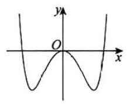</td></tr></table>
4. 函数 $f\left( x\right)  = \ln \left| \frac{1 + x}{1 - x}\right|$ 的大致图像为

<table><tr><td align="center" valign="top">A. 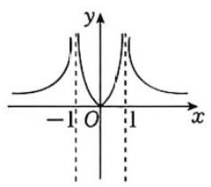</td><td align="center" valign="top">B. 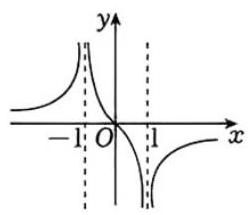</td></tr><tr><td align="center" valign="top">C. 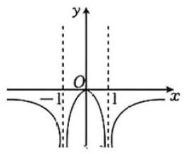</td><td align="center" valign="top">D. 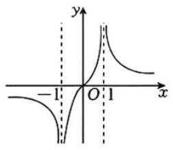</td></tr></table>
5. 已知函数 $f\left( x\right)  = {x}^{2} + \frac{1}{4}, g\left( x\right)  = \sin x$ ,则图像为如图的函数可能是

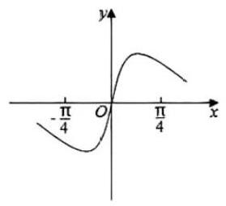

A. $y = f\left( x\right)  + g\left( x\right)  - \frac{1}{4}$ B. $y = f\left( x\right)  - g\left( x\right)  - \frac{1}{4}$

C. $y = f\left( x\right) g\left( x\right)$ D. $y = \frac{g\left( x\right) }{f\left( x\right) }$

6. 如图可能是下列哪个函数的图像

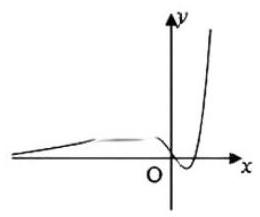

A. $y = {2}^{x} - {x}^{2} - 1$ B. $y = \frac{{2}^{x}\sin x}{{4}^{x} + 1}$ C. $y = \left( {{x}^{2} - {2x}}\right) {\mathrm{e}}^{x}$ D. $y = \frac{x}{\ln x}$

7. 已知二次函数 $f\left( x\right)$ ,对任意的 $x \in  \mathbf{R}$ ,有 $f\left( {2x}\right)  < {2f}\left( x\right)$ ,则 $f\left( x\right)$ 的图像可能是

<table><tr><td align="center" valign="top">A. 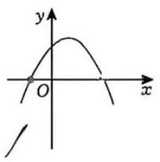</td><td align="center" valign="top">B. 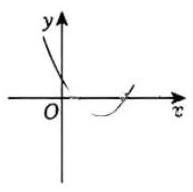</td></tr><tr><td align="center" valign="top">C. 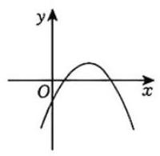</td><td align="center" valign="top">D. 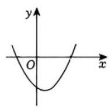</td></tr></table>
# 第三章 导数

首先我们需要分析一下当然高考 19 题模式下, 导数题可能出现的位置.

小题的整体难度是大幅下降的，所以大概率是不太会出现那种 “小题大做”的情况了，比如 2022 乙卷理 16. 所以小题如果涉及导数大概率是很常规的问题, 或者仅仅在某些题目中作为判断单调性的工具而使用.

那么目前导数比较流行的大题位置就是 16 题——常规单调性、极值、最值，18 题——送分十中档十偏难三问， 19 题——不太送分的(1)+带有一定创新的(2)(3)，当然也不排除未来会有更多整活的方式，毕竟教育部研究员今年的原话是“有的试题更是有意识地针对僵化的答题思路进行‘反套路’设计”.

对于大部分同学来说，导数一轮复习的目标就是拿下基础和中档，具体来说，16 题你必须得满分，18 题前两问你得能做个差不多，19题第一问得有思路. 更深的内容，别太着急，以后都会讲到，有更高追求的同学如果等不及当然也可以自己先加大力度, 但注意别学的太偏, 你要是拿不准什么样的题该做, 咱可以一起讨论.

大家在学习过程应该多关注这几个问题:

①常见的函数单调性、极值和最值问题，我能不能流畅的写下来？

②如何借助数形结合直观分析题目，降低思维量？

③必要性探路，到底是怎么一回事？到底要不要证不成立那边？

④如何培养自己的“注意力”？都该注意点啥？

个人认为，导数没学明白或者说学歪了的几个标志:

①看见函数啥也不想就求导；

②张口闭口一堆不明觉厉的“名词”:

③ 背大量的放缩、套路；

④追求一些难以复用的技巧或思路，性价比太低了.

## 第八讲 导数基础与单调性讨论

### 第一节 导数基础

基本不会专门出题, 虽然不会有人求导总出错, 但是总会有人求导出错

#### 题型一 导数的概念

★平均变化率 $\frac{\Delta y}{\Delta x} = \frac{f\left( {{x}_{0} + {\Delta x}}\right)  - f\left( {x}_{0}\right) }{\Delta x}$ ,瞬时变化率 $\mathop{\lim }\limits_{{{\Delta x} \rightarrow  0}}\frac{\Delta y}{\Delta x} = \mathop{\lim }\limits_{{{\Delta x} \rightarrow  0}}\frac{f\left( {{x}_{0} + {\Delta x}}\right)  - f\left( {x}_{0}\right) }{\Delta x} = {f}^{\prime }\left( {x}_{0}\right)$

1. 求 $f\left( x\right)  = {x}^{2}$ 在区间 $\left\lbrack  {2,4}\right\rbrack$ 上的平均变化率.

2. $\mathop{\lim }\limits_{{{\Delta x} \rightarrow  0}}\frac{f\left( {{x}_{0} + {2\Delta x}}\right)  - f\left( {{x}_{0} - {\Delta x}}\right) }{\Delta x} =$

A. $2{f}^{\prime }\left( {x}_{0}\right)$ B. ${f}^{\prime }\left( {x}_{0}\right)$ C. $3{f}^{\prime }\left( {x}_{0}\right)$ D. $- 3{f}^{\prime }\left( {x}_{0}\right)$

3. $\mathop{\lim }\limits_{{x \rightarrow  0}}\frac{f\left( 1\right)  - f\left( {1 - {2x}}\right) }{2x} =$

A. $\frac{1}{2}{f}^{\prime }\left( 1\right)$ B. ${f}^{\prime }\left( 1\right)$ C. $2{f}^{\prime }\left( 1\right)$ D. $- {f}^{\prime }\left( 1\right)$

#### 题型二 导数计算

给大家的一个建议:导数大题第一问的求导，导完立刻检查两遍确保万无一失，再往下做题.

★基本初等函数求导公式

(1) ${\left( C\right) }^{\prime } = \; {\left( {x}^{n}\right) }^{\prime } = \; {\left( \sqrt{x}\right) }^{\prime } = \; {\left( \frac{1}{x}\right) }^{\prime } =$

(2) ${\left( {a}^{x}\right) }^{\prime } = \; {\left( {\mathrm{e}}^{x}\right) }^{\prime } = \; {\left( {\log }_{a}x\right) }^{\prime } = \; {\left( \ln x\right) }^{\prime } =$

(3) ${\left( \sin x\right) }^{\prime } = \; {\left( \cos x\right) }^{\prime } = \; {\left( \tan x\right) }^{\prime } =$

★导数四则运算

(1) ${\left\lbrack  f\left( x\right)  \pm  g\left( x\right) \right\rbrack  }^{\prime } =$ (2) ${\left\lbrack  f\left( x\right)  \cdot  g\left( x\right) \right\rbrack  }^{\prime } =$ (3) ${\left\lbrack  \frac{f\left( x\right) }{g\left( x\right) }\right\rbrack  }^{\prime } =$

★复合导数求导法则

设函数 $y = f\left\lbrack  {g\left( x\right) }\right\rbrack$ ,则有 ${y}^{\prime } =$

4. 稍微复杂一点的求导练习

(1) $f\left( x\right)  = \sqrt{3 - \frac{3{x}^{2}}{4}}$ (2) $f\left( x\right)  = \frac{x\ln x + x}{x - 1}$ (3) $f\left( x\right)  = \frac{{e}^{x} + 2\sin x}{1 + {x}^{2}}$

(4) $f\left( x\right)  = x - {x}^{3}{e}^{{ax} + b}$ (5) $f\left( x\right)  = \left( {\frac{1}{x} + a}\right) \ln \left( {1 + x}\right)$ (6) $f\left( x\right)  = {ax} - \frac{\sin x}{{\cos }^{3}x}$

(7) $f\left( x\right)  = {a}^{x} + {\left( 1 + a\right) }^{x}$ (8) $f\left( x\right)  = {\sin }^{2}x\sin {2x}$ (9) $f\left( x\right)  = \ln \frac{x}{2 - x} + {ax} + b{\left( x - 1\right) }^{3}$

5. 一些求导小技巧

(1) $y = f\left( x\right)  \cdot  {\mathrm{e}}^{x}$ ,例: $y = \left( {{x}^{2} - {2x} + 3}\right) {\mathrm{e}}^{x}$ (2) $y = \frac{f\left( x\right) }{{\mathrm{e}}^{x}}$ ,例: $y = \frac{\sin x}{{\mathrm{e}}^{x}}$

(3) 已知函数 $f\left( x\right)  = x\left( {x - 1}\right) \left( {x - 2}\right) \left( {x - 3}\right) \left( {x - 4}\right)$ 的导数为 ${f}^{\prime }\left( x\right)$ ,则 ${f}^{\prime }\left( 1\right)  =$

### 第二节 单调性分析

导数中最重要的内容, 各类分析都是建立在单调性分析的基础上的, 特别是导数的中档题几乎必考单调性讨论,所以这部分无论如何也得学透彻. 首先我们先明确一件事,高中阶段你能遇到的导数题,单调递增 $\Leftrightarrow  {f}^{\prime }\left( x\right) \; \geq  0$ ,单调递减 $\Leftrightarrow  {f}^{\prime }\left( x\right)  \leq  0$ ,偶尔有一些等于 0 的导数值不影响函数单调性, $y = {x}^{3}$ 都要被说 $f$ .

接下来就是单调性讨论的核心问题:当我们在分类讨论时我们究竟在讨论啥?

单调性讨论的核心就是想尽一切办法画导数示意图，示意图不需要好看，不需要准确，只需要表达清楚一件事:___ 一切影响你画导数示意图的因素, 都是要分类讨论的因素.

求出导函数之后，为了更方便找零点，看正负，一般要尝试进行通分、因式分解等操作.

#### 题型一 导函数为一次函数

讨论点啥？①最高次项是否为 0；②一次函数斜率正负；③零点的具体值；④零点是否在定义域内。

(1) $f\left( x\right)  = x{e}^{ax}$ (2) $f\left( x\right)  = \ln \left( {x + 1}\right)  + {ax}$

#### 题型二 导函数为类一次函数

啥叫类一次? 比如 ${2}^{x} - 2 \Leftrightarrow  x - 1$

(1) $f\left( x\right)  = {\mathrm{e}}^{x} - \left( {a - 1}\right) x$ (2) $f\left( x\right)  = {ax} - x\ln x$

#### 题型三 导函数为二次函数

讨论点啥? ①最高次项为 0；②开口方向；③零点个数；④两个零点大小关系；⑤零点是否在定义域内. 我会频繁地提到两个词:增减增，减增减。

(1) $f\left( x\right)  = {\mathrm{e}}^{x}\left( {a{x}^{2} - x + 1}\right)$ (2) $f\left( x\right)  = \frac{a}{3}{x}^{3} + \frac{1}{2}{x}^{2} - x + 1$

#### 题型四 导函数为类二次函数

(1) $f\left( x\right)  = \left( {x - 2}\right) {\mathrm{e}}^{x} - \frac{1}{2}a{x}^{2} + {ax}$ (2) $f\left( x\right)  = \left( {a{x}^{2} - x}\right) \ln x - \frac{1}{2}a{x}^{2} + x$

#### 题型五 二阶导

求二阶导之前想清楚，为什么要求二阶导？一定要求二阶导吗？不要忘了自己为什么出发。

(1) $f\left( x\right)  = {\mathrm{e}}^{ax} + {x}^{2} - {ax}$ (2) $f\left( x\right)  = \frac{2 + \ln x}{x + 1}$

#### 题型六 三角函数

(1) $f\left( x\right)  = x - \frac{\sin x}{{\cos }^{2}x}, x \in  \left( {0,\frac{\pi }{2}}\right)$ (2) $f\left( x\right)  = {8x} - \frac{\sin x}{{\cos }^{3}x}, x \in  \left( {0,\frac{\pi }{2}}\right)$

#### 题型七 断点、渐近线、极限

导数中不可避免地需要用到一些简单的极限, 即使大题不能用, 但也可以帮助分析, 寻找大致的方向. 目前只需要了解①指数函数 $>$ 幂函数 $>$ 对数函数; ② $x \rightarrow  {0}^{ + }, x \rightarrow  {0}^{ - }$ .

例: 画出 $f\left( x\right)  = \frac{{\mathrm{e}}^{x}}{{x}^{2} - 1}$ 的图像

### 第三节 已知单调性求参

本质上是恒成立问题, 可以转化为求函数最值, 比较容易出错的是 “存在单调区间” 这种问法

1. 已知 $0 < a < 1$ 且 $a \neq  \frac{1}{2}$ ,若函数 $f\left( x\right)  = 2{\log }_{a}x - {\log }_{2a}x$ 在 $\left( {0, + \infty }\right)$ 上单调递减,则实数 $a$ 的取值范围为

A. $\left( {\frac{1}{4},\frac{1}{2}}\right)$ B. $\left( {0,\frac{1}{4}}\right)$ C. $\left( {\frac{1}{4},\frac{1}{2}}\right)  \cup  \left( {\frac{1}{2},1}\right)$ D. $\left( {0,\frac{1}{4}}\right)  \cup  \left( {\frac{1}{2},1}\right)$

2. 设 $a \in  \left( {0,1}\right)$ ,若函数 $f\left( x\right)  = {a}^{x} + {\left( 1 + a\right) }^{x}$ 在 $\left( {0, + \infty }\right)$ 上单调递增,则 $a$ 的取值范围是

3. 已知 $f\left( x\right)  = \left( {{x}^{2} - {2ax}}\right) {\mathrm{e}}^{x}$ 在 $\left\lbrack  {-1,1}\right\rbrack$ 上是单调函数，求 $a$ 的取值范围.

4. 已知 $f\left( x\right)  = \ln x + {\left( x - a\right) }^{2}\left( {a \in  \mathbf{R}}\right)$ 在区间 $\left\lbrack  {\frac{1}{2},2}\right\rbrack$ 上存在单调递增区间，则实数 $a$ 的取值范围是 ___.

## 第九讲 三次函数与切线问题

### 第一节 三次函数性质

三次函数是多选题常客, 过去文科数学导数解答题也考察很多, 新高考下放在 16 题也非常合适. 就像学习函数时你必须对二次函数驾轻就熟，学习导数时三次函数也要做到游刃有余，然后记得多尝试“穿针引线”.

#### 1. 三次函数的四种图像

#### 2. 三次函数对称中心

#### 3. 三次函数极值点与对称中心之间的关系

#### 题型一 三次函数基础计算

1. 函数 $f\left( x\right)  = a{x}^{3} + b{x}^{2} + {cx} + d$ 的图象如图所示,则下列结论成立的是

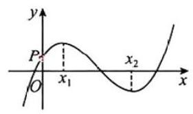

A. $a > 0, b < 0, c > 0, d > 0$ B. $a > 0, b < 0, c < 0, d > 0$

C. $a < 0, b < 0, c > 0, d > 0$ D. $a > 0, b > 0, c > 0, d < 0$

2. 若 $x = 2$ 是函数 $f\left( x\right)  = \left( {x - 1}\right) \left( {x - 2}\right) \left( {x - a}\right)$ 的极值点,则 $f\left( 0\right)  =$ ___.

3. 设 $a \neq  0$ ,若 $x = a$ 是函数 $f\left( x\right)  = a{\left( x - a\right) }^{2}\left( {x - b}\right)$ 的极大值点,则

A. $a < b$ B. $a > b$ C. ${ab} < {a}^{2}$ D. ${ab} > {a}^{2}$

4. 已知 $f\left( x\right)  = {x}^{3} - 6{x}^{2} + {9x} - {abc}, a < b < c$ ,且 $f\left( a\right)  = f\left( b\right)  = f\left( c\right)  = 0$ ,现给出如下结论: ① $f\left( 0\right) f\left( 1\right)  > 0$ ; ② $f\left( 0\right) f\left( 1\right)  < 0$ ; ③ $f\left( 0\right) f\left( 3\right)  > 0$ ; ④ $f\left( 0\right) f\left( 3\right)  < 0$ . 其中正确结论的序号是

A. ①③ B. ①④ C. ②③ D. ②④

5. 已知函数 $f\left( x\right)  = \left( {x - a}\right) \left( {x - b}\right) \left( {x - c}\right)$ ,其中 $a < b < c$ ,若 $f\left( {1 + x}\right) f\left( {2 - x}\right)  \leq  0$ ,则 $a + b + c =$ ___

6. 曲线 $y = {x}^{3} - {3x}$ 与 $y =  - {\left( x - 1\right) }^{2} + a$ 在 $\left( {0, + \infty }\right)$ 上有两个不同的交点,则 $a$ 的取值范围为___.

7. 已知函数 $f\left( x\right)  = \left( {x - a}\right) {\left( x - b\right) }^{2}$ ,其中 $a < b,5$ 为 $f\left( x\right)$ 的极小值点,若 $f\left( x\right)$ 在 $\left( {a, a + 3}\right)$ 内有最大值,则 $a$ 的取值范围是

A. $\left( {-4,5}\right)$ B. $( - 4,5\rbrack$ C. $\left( {-4,\frac{11}{4}}\right)$ D. $  = {x}^{3} - {kx} + {k}^{2}$ .

(1)讨论 $f\left( x\right)$ 的单调性;

(2)若 $f\left( x\right)$ 有三个零点,求 $k$ 的取值范围.

#### 题型二 三次函数多选题

9. 已知函数 $f\left( x\right)  = {x}^{3} - x + 1$ ,则

A. $f\left( x\right)$ 有两个极值点 B. $f\left( x\right)$ 有三个零点

C. 点 $\left( {0,1}\right)$ 是曲线 $y = f\left( x\right)$ 的对称中心 D. 直线 $y = {2x}$ 是曲线 $y = f\left( x\right)$ 的切线

10. 设函数 $f\left( x\right)  = {\left( x - 1\right) }^{2}\left( {x - 4}\right)$ ,则

A. $x = 3$ 是 $f\left( x\right)$ 的极小值点 B. 当 $0 < x < 1$ 时, $f\left( x\right)  < f\left( {x}^{2}\right)$

C. 当 $1 < x < 2$ 时, $- 4 < f\left( {{2x} - 1}\right)  < 0$ D. 当 $- 1 < x < 0$ 时, $f\left( {2 - x}\right)  > f\left( x\right)$

11. 设函数 $f\left( x\right)  = 2{x}^{3} - {3a}{x}^{2} + 1$ ,则

A. 当 $a > 1$ 时, $f\left( x\right)$ 有三个零点 B. 当 $a < 0$ 时, $x = 0$ 是 $f\left( x\right)$ 的极大值点

C. 存在 $a, b$ ,使得 $x = b$ 为 $y = f\left( x\right)$ 对称轴 D. 存在 $a$ ,使得 $\left( {1, f\left( 1\right) }\right)$ 为 $y = f\left( x\right)$ 的对称中心

12. 已知三次函数 $f\left( x\right)  = a{x}^{3} + b{x}^{2} + {cx} - 1$ ,若函数 $g\left( x\right)  = f\left( {-x}\right)  + 1$ 的图象关于 $\left( {1,0}\right)$ 对称,且 $g\left( {-2}\right)  < 0$ ,则

A. $a < 0$ B. $g\left( x\right)$ 有 3 个零点

C. $f\left( x\right)$ 对称中心是 $\left( {-1,0}\right)$ D. ${12a} - {4b} + c < 0$

#### 题型三 三次方程韦达定理

应用场景很有限，略有一点超纲吧，但是这种根与方程的思想还是很重要的，初中学过双根式，那高中有三根式也很合理吧. 先回顾一下二次方程的韦达定理是如何推导的.

13. 已知函数 $f\left( x\right)  = {x}^{3} + a{x}^{2} + {bx} + c$ ,且 $0 < f\left( {-1}\right)  = f\left( {-2}\right)  = f\left( {-3}\right)  \leq  3$ ,则

A. $c \leq  3$ B. $3 < c \leq  6$ C. $6 < c \leq  9$ D. $c > 9$

14. 已知函数 $f\left( x\right)  = x{\left( x - 3\right) }^{2}$ ,若 $f\left( a\right)  = f\left( b\right)  = f\left( c\right)$ ,其中 $a < b < c$ ,则

A. $1 < a < 2$ B. $a + b + c = 6$

C. $a + b > 2$ D. ${abc}$ 的取值范围是 $\left( {0,4}\right)$

15. 已知函数 $f\left( x\right)  = {x}^{3} + b{x}^{2} + {cx} + d$ 在 $( - \infty ,0\rbrack$ 上是增函数,在 $\left\lbrack  {0,2}\right\rbrack$ 上是减函数,且方程 $f\left( x\right)  = 0$ 有实数根 $\alpha ,\beta ,2\left( {\alpha  < 2 \leq  \beta }\right)$ ,则

A. $c = 0$ B. $b \leq   - 3$ C. $d \leq  4$ D. ${\alpha }^{2} + {\beta }^{2}$ 的最小值为 5

### 第二节 切线相关问题

#### 切线方程基本求法

1. 函数切线与函数交点不一定只有一个. 切线问题的核心在于切点, 有切点就直接用, 没切点就设切点. 任何一个切线相关的题,都离不开下面这三个方程:

①切点在函数上: ${y}_{0} = f\left( {x}_{0}\right)$ ; ②切点在切线上: $y = k\left( {x - {x}_{0}}\right)  + {y}_{0}$ ; ③切线斜率等于切点处导数值: $k = {f}^{\prime }\left( {x}_{0}\right)$ ； 三合一即可得到: $y = {f}^{\prime }\left( {x}_{0}\right) \left( {x - {x}_{0}}\right)  + f\left( {x}_{0}\right)$ .

2. 区分“在”与“过”某点的切线

“在”:该点为切点，导数值即为切线斜率；

“过”:该点不一定为切点, 甚至都不一定在函数上，所以必须设切点.

3. 务必牢记的几条重要切线:

(1) $y = {\mathrm{e}}^{x}$ (2) $y = \ln x$ (3) $y = \sin x$ 与 $y = \tan x$
#### 题型一 基础计算

1. 若直线 $y = {2x} + 5$ 是曲线 $y = {e}^{x} + x + a$ 的一条切线，则 $a =$ ___.

2. 若曲线 $y = {\mathrm{e}}^{x} + x$ 在点 $\left( {0,1}\right)$ 处的切线也是曲线 $y = \ln \left( {x + 1}\right)  + a$ 的切线,则 $a =$ ___.

3. 设函数 $f\left( x\right)  = \frac{{\mathrm{e}}^{x} + 2\sin x}{1 + {x}^{2}}$ ，则曲线 $y = f\left( x\right)$ 在点 $\left( {0,1}\right)$ 处的切线与坐标轴围成的三角形面积为

A. $\frac{1}{6}$ B. $\frac{1}{3}$ C. $\frac{1}{2}$ D. $\frac{2}{3}$

4. 已知三次函数 $f\left( x\right)$ 的零点从小到大依次为 $m,0,2$ ，其图象在 $x =  - 1$ 处的切线 $l$ 经过点 $\left( {2,0}\right)$ ，则 $m =$

A. $- \frac{8}{5}$ B. -2 C. $- \frac{5}{3}$ D. $- \frac{3}{2}$

5. 已知函数 $f\left( x\right)$ 是可导函数. 如图,直线 $y = {kx} + 2$ 是曲线 $y = f\left( x\right)$ 在 $\left( {3,1}\right)$ 处的切线,令 $g\left( x\right)  = \frac{f\left( x\right) }{x},{g}^{\prime }$ (x) 是 $g\left( x\right)$ 的导函数,则 ${g}^{\prime }\left( 3\right)  =$

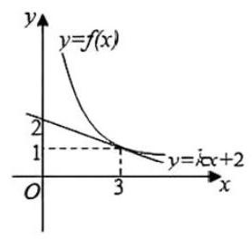

A. $- \frac{2}{9}$ B. $- \frac{1}{3}$ C. $- \frac{2}{3}$ D. 0

6. $P$ 是曲线 $y = x + \frac{4}{x}\left( {x > 0}\right)$ 上一个动点,则点 $P$ 到直线 $x + y = 0$ 的距离的最小值是 ___.

#### 题型二 过某点求切线

设切点为 $\left( {{x}_{0},{y}_{0}}\right)$ ,所过点为 $\left( {x, y}\right)$ ,则 $y = {f}^{\prime }\left( {x}_{0}\right) \left( {x - {x}_{0}}\right)  + {y}_{0} \Leftrightarrow  \frac{y - {y}_{0}}{x - {x}_{0}} = {f}^{\prime }\left( {x}_{0}\right)$ .

7. 已知函数 $f\left( x\right)  = x\ln x - 3{x}^{2}$ ,求经过点 $P\left( {0,2}\right)$ 的切线方程.

8. 已知函数 $f\left( x\right)  = {x}^{3} - {x}^{2} + {ax} + 1$ . 求 $y = f\left( x\right)$ 过坐标原点的切线与曲线 $y = f\left( x\right)$ 的公共点的坐标.

#### 题型三 切线条数

本质上可以转化为函数零点个数问题，不过也可以借助图像形状来分析，以三次函数图像为例，一般地，过三次函数 $f\left( x\right)$ 对称中心作切线 $L$ ，则坐标平面被切线和函数的图像分割为四个区域.

①过区域 I, IV 内的点作函数 $f\left( x\right)$ 的切线，有且仅有 3 条；

②过区域 II、III 内的点以及对称中心作函数 $f\left( x\right)$ 的切线，有且仅有 1 条；

③过切线 $L$ 或函数图像 (除去对称中心) 上的点作函数 $f\left( x\right)$ 的切线，有且仅有 2 条；

IV

III I

9. 设 $f\left( x\right)  = 2{x}^{3} - {3x}$ ,若过点 $P\left( {1, t}\right)$ 存在三条切线与曲线 $f\left( x\right)$ 相切,则 $t$ 的取值范围是

A. $\lbrack  - 3,1)$ B. $\left\lbrack  {-2,1}\right\rbrack$

C. $( - \infty , - 3\rbrack  \cup  \left( {-1,1}\right)$ D. $\left( {-3, - 1}\right)$

10. 若曲线 $y = \left( {x + a}\right) {\mathrm{e}}^{x}$ 有两条过坐标原点的切线,则 $a$ 的取值范围是 ___.

11. 已知函数 $f\left( x\right)  = \frac{x + 1}{{e}^{x}}$ ,若过 $P\left( {-1, t}\right)$ 可作两条直线与函数 $f\left( x\right)$ 的图像相切,则 $t$ 的取值范围为

A. $\left( {\frac{4}{e}, + \infty }\right)$ B. $\left\{  \frac{4}{e}\right\}$ C. $\left( {0,\frac{4}{e}}\right)$ D. $\left( {0,\frac{4}{e}}\right)  \cup  \{ 0\}$

#### 题型四 公切线

① 分别设出两个函数的切点坐标 $\left( {{x}_{1}, f\left( {x}_{1}\right) }\right) ,\left( {{x}_{2}, g\left( {x}_{2}\right) }\right)$ ;

② 分别写出两个函数的切线方程 $\left\{  {\begin{array}{l} y - f\left( {x}_{1}\right)  = {f}^{\prime }\left( {x}_{1}\right) \left( {x - {x}_{1}}\right) \\  y - g\left( {x}_{2}\right)  = {g}^{\prime }\left( {x}_{2}\right) \left( {x - {x}_{2}}\right)  \end{array} \Rightarrow  \left\{  \begin{array}{l} y = {f}^{\prime }\left( {x}_{1}\right) x - {f}^{\prime }\left( {x}_{1}\right) {x}_{1} + f\left( {x}_{1}\right) \\  y = {g}^{\prime }\left( {x}_{2}\right) x - {g}^{\prime }\left( {x}_{2}\right) {x}_{2} + g\left( {x}_{2}\right)  \end{array}\right. }\right.$ ;

③两个切线方程相同，即 $\left\{  \begin{array}{l} {f}^{\prime }\left( {x}_{1}\right)  = {g}^{\prime }\left( {x}_{2}\right) \\   - {f}^{\prime }\left( {x}_{1}\right) {x}_{1} + f\left( {x}_{1}\right)  =  - {g}^{\prime }\left( {x}_{2}\right) {x}_{2} + g\left( {x}_{2}\right)  \end{array}\right.$ ，然后就是想办法消元化为单变量求解.

12. 曲线 $y = \ln x$ 与曲线 $y = {x}^{2} + {2ax}$ 有公切线,则实数 $a$ 的取值范围是

A. $\left( {-\infty , - \frac{1}{2}}\right\rbrack$ B. $\left\lbrack  {-\frac{1}{2}, + \infty }\right)$ C. $\left( {-\infty ,\frac{1}{2}}\right\rbrack$ D. $\left\lbrack  {\frac{1}{2}, + \infty }\right)$

13. 已知函数 $f\left( x\right)  = 2 + \ln x, g\left( x\right)  = a\sqrt{x}$ ,若总存在两条不同的直线与函数 $y = f\left( x\right) , y = g\left( x\right)$ 图像均相切,则实数 $a$ 的取值范围为

A. $\left( {0,1}\right)$ B. $\left( {0,2}\right)$ C. $\left( {1,2}\right)$ D. $\left( {1,\mathrm{e}}\right)$

14. 已知函数 $f\left( x\right)  = {x}^{3} - x, g\left( x\right)  = {x}^{2} + a$ ,曲线 $y = f\left( x\right)$ 在点 $\left( {{x}_{1}, f\left( {x}_{1}\right) }\right)$ 处的切线也是曲线 $y = g\left( x\right)$ 的切线. 求 $a$ 的取值范围.

## 第十讲 常规极值与最值问题

极值与最值本质上是单调性的延伸, 先得知道图像走势, 才能知道哪里高哪里低. 务必注意函数极值点是导数的变号零点,所以极值点也是数,不是点,“ $x = 1$ 是 $f\left( x\right)$ 的极值点” 这样的表述是没问题的. 解题过程中务必强调变号二字, 有时需要回带检验.

### 第一节 极值问题

#### 题型一 极值点概念

1. 如图,已知直线 $y = {kx} + m$ 与曲线 $y = f\left( x\right)$ 相切于两点,则 $F\left( x\right)  = f\left( x\right)  - {kx}$ 有

A. 1 个极大值点, 2 个极小值点 B. 2 个极大值点, 1 个极小值点

C. 3 个极大值点, 无极小值点 D. 3 个极大值点, 2 个极小值点

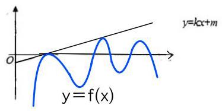

2. 已知函数 $f\left( x\right)  = {\left( x - 1\right) }^{2} \cdot  \sin x \cdot  \ln \left( {x + 1}\right)$ ,则

A. $f\left( x\right)$ 在区间 $\left( {2,3}\right)$ 内存在零点 B. 0 是 $f\left( x\right)$ 的极小值点

C. $f\left( x\right)$ 在区间 $\left( {0,1}\right)$ 内存在极大值 D. $f\left( x\right)$ 在区间 $\left( {-1,0}\right)$ 上单调递减

3. 已知函数 $f\left( x\right)  = a{e}^{x} - \ln x - 1$ ,设 $x = 2$ 是 $f\left( x\right)$ 的极值点,求 $a$ ,并求 $f\left( x\right)$ 的单调区间.

4. 已知函数 $f\left( x\right)  = a\left( {x - 1}\right) {e}^{x} - \ln x\left( {a > 0}\right)$ ,证明: 函数 $f\left( x\right)$ 存在极小值.

#### 题型二 存在极值点求参

5. (2025 上海 19) 已知 $f\left( x\right)  = {x}^{2} - \left( {m + 2}\right) x + m\ln x, m \in  \mathbf{R}$ . 若函数 $y = f\left( x\right)$ 满足在 $\left( {0, + \infty }\right)$ 上存在极大值,求 $m$ 的取值范围.

6. 已知 $a \in  \mathbf{R}$ ,若函数 $f\left( x\right)  = x + \frac{a}{x} - \ln x$ 既有极大值又有极小值,则 $a$ 的取值范围是

A. $\left( {\frac{1}{4}, + \infty }\right)$ B. $\left( {0,\frac{1}{4}}\right)$ C. $\left( {-\frac{1}{4},0}\right)$ D. $\left( {-\frac{1}{4}, + \infty }\right)$

7. 已知函数 $f\left( x\right)  =  - a{x}^{2} + {2x}\ln x$ 有两个极值点,则实数 $a$ 的取值范围为

A. $\left( {-\infty ,\frac{1}{2}}\right)$ B. $\left( {0,\frac{1}{2}}\right)$ C. $\left( {1, + \infty }\right)$ D. $\left( {0,1}\right)$

8. 已知函数 $f\left( x\right)  = {\mathrm{e}}^{x} - {ax} - {a}^{3}$ . 若 $f\left( x\right)$ 有极小值,且极小值小于 0,求 $a$ 的取值范围.

9. 已知函数 $f\left( x\right)  = \ln \left( {1 + x}\right)  - x + \frac{1}{2}{x}^{2} - k{x}^{3}$ ，其中 $0 < k < \frac{1}{3}$ . 证明: $f\left( x\right)$ 在 $\left( {0, + \infty }\right)$ 上存在唯一的极值点和唯一的零点.

10. 已知函数 $f\left( x\right)  = \left( {\frac{1}{x} + a}\right) \ln \left( {1 + x}\right)$ . 若 $f\left( x\right)$ 在 $\left( {0, + \infty }\right)$ 存在极值,求 $a$ 的取值范围.

#### 题型三 判断极值点个数

11. 设函数 $f\left( x\right)  = \ln \left( {x + 1}\right)  + a\left( {{x}^{2} - x}\right)$ ,其中 $a \in  \mathbf{R}$ ,讨论函数 $f\left( x\right)$ 极值点的个数,并说明理由;

12. 设函数 $f\left( x\right)  = x - {x}^{3}{\mathrm{e}}^{{ax} + b}$ ,曲线 $y = f\left( x\right)$ 在点 $\left( {1, f\left( 1\right) }\right)$ 处的切线方程为 $y =  - x + 1$ .

(1)求 $a, b$ 的值；

(2)设 $g\left( x\right)  = {f}^{\prime }\left( x\right)$ ，求 $g\left( x\right)$ 的单调区间；

(3) 求 $f\left( x\right)$ 的极值点的个数.

#### 题型四 双极值点问题

13. 已知 $f\left( x\right)  = \frac{1}{2}{x}^{2} - x + a\ln x$ ,若函数 $f\left( x\right)$ 有两个极值点 ${x}_{1},{x}_{2}$ ,求证: $f\left( {x}_{1}\right)  + f\left( {x}_{2}\right)  > \frac{-3 - 2\ln 2}{4}$

14. 已知函数 $f\left( x\right)  = \ln x + {x}^{2} - {2ax}, a \in  \mathbf{R}$ .

(1)当 $a > 0$ 时，讨论 $f\left( x\right)$ 的单调性；

(2)若函数 $f\left( x\right)$ 有两个极值点 ${x}_{1},{x}_{2}\left( {{x}_{1} < {x}_{2}}\right)$ . 求 ${2f}\left( {x}_{1}\right)  - f\left( {x}_{2}\right)$ 的最小值.

### 第二节 最值问题

极值和最值区别在于, 极值只能出现在区间内部, 而最值可以出现在区间端点, 需要对函数有更全面的把握. 此外, 最值问题和恒成立问题密不可分, 毕竟恒成立本质上就是求最值嘛, 在下一讲会有更详细的分析.

1. 已知 $f\left( x\right)  = 2\sin x + \sin {2x}$ ，则 $f\left( x\right)$ 的最小值是 ___.

2. 若函数 $f\left( x\right)  = 2{x}^{3} - a{x}^{2} + 1\left( {a \in  \mathbf{R}}\right)$ 在 $\left( {0, + \infty }\right)$ 内有且只有一个零点,则 $f\left( x\right)$ 在 $\left\lbrack  {-1,1}\right\rbrack$ 上的最大值与最小值之和为___.

3. 已知函数 $f\left( x\right)  = 2{x}^{3} - a{x}^{2} + b$ .

(1)讨论 $f\left( x\right)$ 的单调性；

(2) 是否存在 $a, b$ ,使得 $f\left( x\right)$ 在区间 $\left\lbrack  {0,1}\right\rbrack$ 的最小值为 -1 且最大值为 1 ? 若存在,求出 $a, b$ 的所有值; 若不存在,说明理由.

4. 已知函数 $f\left( x\right)  = a\left( {{\mathrm{e}}^{x} + a}\right)  - x$ . 证明: 当 $a > 0$ 时, $f\left( x\right)  > 2\ln a + \frac{3}{2}$ .

5. 已知函数 $f\left( x\right)  = {\mathrm{e}}^{x} + a{x}^{2} + {2ax}$ 在 $x \in  \left( {0, + \infty }\right)$ 上有最小值，则实数 $a$ 的取值范围为

A. $\left( {\frac{1}{2}, + \infty }\right)$ B. $\left( {-\frac{\mathrm{e}}{2}, - \frac{1}{2}}\right)$ C. $\left( {-1,0}\right)$ D. $\left( {-\infty , - \frac{1}{2}}\right)$

## 第十一讲 恒成立与必要性探路

含参恒成立问题差不多是导数中出现频率最高的题型了.

首先大家务必要熟悉最常规的两大方向:① 参变分离转化为最值问题；② 直接分类讨论.

肯定有同学会问，那我咋一眼看出来到底用哪个呢？送你俩字:试试. 简单的题目，很多时候怎么做都行，但是复杂的题目，说实话，对于绝大多数同学和老师来说，都很难一眼就看出来合适的解题思路. 导数也好，圆曲也好，大家要有这种“分析，尝试，排除错误方向，寻找合适解法”的意识.都压轴题了，还让你一眼就看出来怎么做，未免有点太白给了吧.

### 第一节 参变分离

#### 1. 分参需要啥条件?

①能分得开；②除过去的内容正负容易确定；③得到的新函数最值能求且好求.

2. 基本的条件翻译首先你得会，详情参见第一讲第五节逻辑用语.

$\forall x \in  D, a < f\left( x\right)  \Rightarrow \; \forall x \in  D, a > f\left( x\right)  \Rightarrow$

$\exists x \in  D, a < f\left( x\right)  \Rightarrow \; \exists x \in  D, a > f\left( x\right)  \Rightarrow$

$\forall {x}_{1} \in  D,\exists {x}_{2} \in  D, f\left( {x}_{1}\right)  < g\left( {x}_{2}\right)  \Rightarrow \; \exists {x}_{1} \in  D,\forall {x}_{2} \in  D, f\left( {x}_{1}\right)  < g\left( {x}_{2}\right)  \Rightarrow$

$\forall {x}_{1} \in  D,\forall {x}_{2} \in  D, f\left( {x}_{1}\right)  < g\left( {x}_{2}\right)  \Rightarrow \; \exists {x}_{1} \in  D,\exists {x}_{2} \in  D, f\left( {x}_{1}\right)  < g\left( {x}_{2}\right)  \Rightarrow$

1. 已知函数 $f\left( x\right)  = a{e}^{x} - \ln x$ 在区间 $\left( {1,2}\right)$ 上单调递增,则 $a$ 的最小值为

A. ${e}^{2}$ B. $e$ C. ${e}^{-1}$ D. ${e}^{-2}$

2. 已知函数 $f\left( x\right)  = \frac{1 + \ln x}{x}$ ,若当 $x \geq  1$ 时, $f\left( x\right)  \geq  \frac{k}{x + 1}$ 恒成立,求实数 $k$ 的取值范围.

3. 当 $x \in  \left\lbrack  {-2,1}\right\rbrack$ 时，不等式 $a{x}^{3} - {x}^{2} + {4x} + 3 \geq  0$ 恒成立，则实数 $a$ 的取值范围是

A. $\left\lbrack  {-5, - 3}\right\rbrack$ B. $\left\lbrack  {-6, - \frac{9}{8}}\right\rbrack$ C. $\left\lbrack  {-6, - 2}\right\rbrack$ D. $\left\lbrack  {-4, - 3}\right\rbrack$

4. 已知函数 $f\left( x\right)  = a\ln x + x - 1$ ，若 $f\left( x\right)  \geq  0$ 对于任意 $x \geq  1$ 恒成立，求实数 $a$ 的取值范围.

### 第二节 分类讨论

由上面几个题你可以发现, 参变分离存在着一些问题, 比如分参后函数求导分析很复杂, 或者最值处函数无意义，得用到洛必达法则，而有时可能参数无法进行分离，所以如今的解答题中，更多地还是采取直接讨论分析的思路，这是目前的主流方向，在此基础上的各种技巧都是锦上添花，切勿本末倒置，追求各类大招.

5. 设函数 $f\left( x\right)  = {a}^{2}{x}^{2} + {ax} - 3\ln x + 1$ ,其中 $a > 0$ ,若 $y = f\left( x\right)$ 的图象与 $x$ 轴没有公共点,求 $a$ 的取值范围.

6. 已知函数 $f\left( x\right)  = {x}^{2} + {4x} + 2, g\left( x\right)  = 2{\mathrm{e}}^{x}\left( {x + 1}\right)$ ,若 $x \geq   - 2$ 时, $f\left( x\right)  \leq  k\mathrm{\;g}\left( x\right)$ ,求 $k$ 的取值范围.

### 第三节 必要性探路

啥是必要性探路? 啥是端点效应? 这俩不是一回事吗?

很多同学都是听大家说有这么个东西，上网随便找了个视频看一下，最后得到一个浅显的理解:“必要性探路啊，就是端点效应嘛，带个端点值进去，然后就出答案了呗，然后再证一下就行了.”

要我说，片面的理解还不如不理解呢，很多同学现在遇到恒成立，就想端点效应，就往里带，带完数就开始证， 能证出来的话就过了，证不出来就找地方问:这题端点效应咋不对啊？

端点效应, 只不过是必要性探路思想中的一小部分内容而已, 不要把二者混为一谈.

所以啥是必要性探路? 还是那俩字: 试试.

要判断一个人是不是河北人，我可以先判断他是不是中国人，因为“中国人”是“河北人”的必要条件，如果连中国人都不是，那更不可能是河北人了，就不用再往下问了；如果是中国人，那我再考虑判断他是不是河北人，这就叫做必要性探路:通过一次成本较低的尝试，可以把不满足条件的情况都舍弃，缩小分析范围. 听起来很高端，其实你在小题中经常用到，举个非常简单的例子:

不等式 $\left( {x - 1}\right) \left( {x - 3}\right)  < 0$ 的解集是

A. $\left( {-\infty ,1}\right)$ B. $\left( {3, + \infty }\right)$ C. $\left\lbrack  {1,3}\right\rbrack$ D. $\left( {1,3}\right)$

#### 题型一 整数解问题

有没有想过, 为啥这些题只让你求整数解, 不让你求精确解呢?

1. 已知 $f\left( x\right)  = {ax} - 2\ln x$ ,当 $x > 1$ 时,不等式 $f\left( x\right)  < \left( {x - 2}\right) \ln x + {2x} + a - 1$ 恒成立,求整数 $a$ 的最大值.

2. 已知函数 $f\left( x\right)  = {x}^{2} + {6x} - 8 - 8\ln x$ . 若对于任意 $x > 0, f\left( x\right)  \geq  {ax}$ 恒成立,求整数 $a$ 的最大值.

#### 题型二 先猜后证

你需要证另一侧吗?

如果在区间 $\left\lbrack  {a, b}\right\rbrack$ 上函数 $f\left( x\right)  \geq  0$ 恒成立,则必有 $f\left( a\right)  \geq  0, f\left( b\right)  \geq  0, f\left( c\right)  \geq  0$ 其中 $c \in  \left\lbrack  {a, b}\right\rbrack$ ;

3. 已知函数 $f\left( x\right)  = \frac{1}{2}{x}^{2} - \left( {a + 1}\right) x + a\ln x$ ,若 $f\left( x\right)  \geq  0$ 恒成立,求实数 $a$ 的取值范围.

4 已知函数 $f\left( x\right)  = a\ln x - {x}^{2} + \left( {{2a} - 1}\right) x\left( {a \geq  0}\right)$ ,若 $f\left( x\right)  \leq  0$ ,求 $a$ 的取值范围

5. 已知函数 $f\left( x\right)  = {a}^{2}\ln x - {x}^{2} + {ax}$ ,若 $f\left( x\right)  \leq  0$ ,求 $a$ 的取值范围.

6. 已知函数 $f\left( x\right)  = \left( {a - x}\right) {e}^{x}, a \in  \mathbf{R}$ ,若不等式 $f\left( x\right)  > 1 - x$ 没有整数解,求实数 $a$ 的取值范围.

#### 题型三 端点效应

你需要证另一侧吗?

端点效应是必要性探路思想更深入的一种体现. 我们期望带入一些特殊值使得 $f\left( x\right)$ 满足题意,从而得到参数满足的必要条件,但有时 $f\left( x\right)$ 在某点处恒成立,不含参,所以从 $f\left( x\right)$ 身上我们并不能得到参数所满足的范围, 那么此时只能从更深一层的 ${f}^{\prime }\left( x\right)$ 身上寻求帮助. 为了使 $f\left( x\right)$ 的走势满足要求,我们能从图象的角度感觉出来, ${f}^{\prime }\left( x\right)$ 也必须满足一定的要求才行,这就是所谓的端点效应.

但是这种“ ${f}^{\prime }\left( x\right)$ 需要满足的要求”在高中阶段，我们是没有严谨的定理作为支撑的，因为我们是从图象的角度直观感受出来的，所以此时必须要对另一侧进行证明，这样才完整.

最常见的两类情况:

① 如果在区间 $\left\lbrack  {a, b}\right\rbrack$ 上函数 $f\left( x\right)  \geq  0$ 恒成立,且 $f\left( a\right)  = 0$ ,则 ${f}^{\prime }\left( a\right)  \geq  0$ ;

②如果在区间 $\left\lbrack  {a, b}\right\rbrack$ 上函数 $f\left( x\right)  \geq  0$ 恒成立,且 $f\left( a\right)  = 0,{f}^{\prime }\left( a\right)  = 0$ ,则 ${f}^{\prime \prime }\left( a\right)  \geq  0$ .

值得注意的是，上述猜出“参数范围”的过程，不需要展示在卷面上，直接天降神兵开始讨论就好了，另外，也别把猜出来的范围就真的当成最终结果, 有的时候可能不对呢.

7. 已知函数 $f\left( x\right)  = {\mathrm{e}}^{x} - {\mathrm{e}}^{-x} - {2ax}$ ，当 $x \geq  0$ 时， $f\left( x\right)  \geq  0$ ，求 $a$ 的取值范围.

8. 已知函数 $f\left( x\right)  = {\mathrm{e}}^{x} - a{x}^{2} - x - 1$ ,当 $x \geq  0$ 时, $f\left( x\right)  \geq  0$ ,求 $a$ 的取值范围.

9. 已知函数 $f\left( x\right)  = \left( {1 - {ax}}\right) \ln \left( {1 + x}\right)  - x$ . 当 $x \geq  0$ 时, $f\left( x\right)  \geq  0$ ,求 $a$ 的取值范围.

10. 已知函数 $f\left( x\right)  = {\mathrm{e}}^{x} + a{x}^{2} - x$ . 当 $x \geq  0$ 时, $f\left( x\right)  \geq  \frac{1}{2}{x}^{3} + 1$ ,求 $a$ 的取值范围.

## 第十二讲 导数证明题练习

### 第一节 数值放缩, 无参证明

一言以蔽之，只需要证明最危险的情况就好了

1. 已知函数 $f\left( x\right)  = a\left( {x - 1}\right)  - \ln x + 1$ . 当 $a \leq  2$ 时,证明: 当 $x > 1$ 时, $f\left( x\right)  < {\mathrm{e}}^{x - 1}$ 恒成立.

2. 已知函数 $f\left( x\right)  = a{e}^{x} - \ln x - 1$ . 证明: 当 $a \geq  \frac{1}{\mathrm{e}}$ 时, $f\left( x\right)  \geq  0$ .

3. 已知函数 $f\left( x\right)  = \frac{a{x}^{2} + x - 1}{{\mathrm{e}}^{x}}$ . 证明: 当 $a \geq  1$ 时, $f\left( x\right)  + \mathrm{e} \geq  0$ .

4. 设函数 $f\left( x\right)  = \left( {1 - {x}^{2}}\right) {\mathrm{e}}^{x}$ . 当 $x \geq  0$ 时, $f\left( x\right)  \leq  {ax} + 1$ ,求实数 $a$ 的取值范围.

### 第二节 函数形式转化

大部分导数证明题的方法都不唯一, 很多时候并不是非得硬导原函数, 虽然理论上可能做得出来, 但可能成本太高, 所以我们可以尝试对要证明的式子进行一定的等价变形, 也许就会得到一个处理起来更简单的函数. 当然，我们不必追求某些惊为天人的变形操作，这些可遇不可求的方法你在真正考试的情况下很难用的出来，所以掌握常规的一些处理思路即可. 实际上你可以注意到我上面的用词:“可能”“尝试”“也许”，还是那句话，很多时候对于复杂函数都是需要不断尝试不断纠错的，没有万能的套路模板，只有万能的分析能力.

#### 题型一 对数常用处理思路

对数有一个比较好的特点:求导之后可以变为幂函数，但是如果对数身上粘着其他函数，求导后就还会存在对数，所以常用的一个处理思路就是 “对数单身狗”:将对数分离出来，求导后就只剩各种分式了.

$$
f\left( x\right) \ln x + g\left( x\right)  > 0 \Leftrightarrow  \ln x + \frac{g\left( x\right) }{f\left( x\right) } > 0
$$

1. 函数 $f\left( x\right)  = \left( {2 + x}\right) \ln \left( {1 + x}\right)  - {2x}$ . 证明: 当 $- 1 < x < 0$ 时, $f\left( x\right)  < 0$ ; 当 $x > 0$ 时, $f\left( x\right)  > 0$

2. 设函数 $f\left( x\right)  = \ln \left( {1 - x}\right)$ ,设函数 $g\left( x\right)  = \frac{x + f\left( x\right) }{{xf}\left( x\right) }$ 证明: $g\left( x\right)  < 1$ .

3. 设函数 $f\left( x\right)  = x\ln x$ . 若 $f\left( x\right)  \geq  a\left( {x - \sqrt{x}}\right)$ 在 $x \in  \left( {0, + \infty }\right)$ 时恒成立,求 $a$ 的值;

#### 题型二 指数常用处理思路

指数的麻烦之处在于无论如何求导都永远存在，但也有一个优点，就是恒正，我们关心的就是导数的正负，所以常用的一个处理思路就是 “指数找朋友”:让指数式和其他式子结合起来，求导后就不用再管指数式了。

$$
{e}^{x} + f\left( x\right)  > 0 \Leftrightarrow  1 + \frac{f\left( x\right) }{{e}^{x}} > 0
$$

4. (2022 新 II 卷 22) 已知函数 $f\left( x\right)  = x{e}^{ax} - {\mathrm{e}}^{x}$ . 当 $x > 0$ 时, $f\left( x\right)  <  - 1$ ,求 $a$ 的取值范围;

5. 已知函数 $f\left( x\right)  = {e}^{x} - \sin x - \cos x$ ，证明:当 $x >  - \frac{5\pi }{4}$ 时， $f\left( x\right)  \geq  0$ .

6. 已知函数 $f\left( x\right)  = {e}^{x} - a{x}^{2}$ ，若 $f\left( x\right)$ 在 $\left( {0, + \infty }\right)$ 只有一个零点，求 $a$ .

### 第三节 零点问题

常规的零点问题类似于恒成立问题, 基本也是两个大方向.

①分参转化为函数交点问题:这需要准确画出函数图象，比较麻烦的就是断点，极限，渐近线这些地方，需要一点极限的思想, 有的时候也可以半分参, 借助数形结合找到答案, 再去想办法证明;

②直接讨论判断函数走向及正负情况:由于零点基本求不出来，所以大概率是用零点存在性定理结合单调性来判断零点位置，那么就需要找到一正一负的两个函数值，即“找点”，常规点的还好，有比较直观的思路，但老高考里经常整一些非常困难的找点，需要一定的放缩技巧，我总感觉新高考应该不太会整太恶心的放缩和找点了, 毕竟有些省连极限都是可以用的, 所以暂时不必太过担心, 以后有需要我会讲的.

#### 题型一 常规零点分析

1. 已知函数 $f\left( x\right)  = {ax} - {\left( \ln x\right) }^{2}$ ,若 $f\left( x\right)$ 有 3 个零点 ${x}_{1},{x}_{2},{x}_{3}$ ,求 $a$ 的取值范围.

2. 若曲线 $f\left( x\right)  = \frac{k}{x}\left( {k < 0}\right)$ 与 $g\left( x\right)  = {\mathrm{e}}^{x}$ 有三条公切线,则 $k$ 的取值范围为

A. $\left( {-\frac{1}{\mathrm{e}},0}\right)$ B. $\left( {-\infty , - \frac{1}{\mathrm{e}}}\right)$ C. $\left( {-\frac{2}{\mathrm{e}},0}\right)$ D. $\left( {-\infty , - \frac{2}{\mathrm{e}}}\right)$

#### 题型二 隐零点

所谓隐零点,即可以通过零点存在性定理确定其存在,但无法求得准确值的零点,而题目的求解通常又需要利用到这个零点的值. 单纯的证明题通常只需要利用 ${f}^{\prime }\left( {x}_{0}\right)  = 0$ 这一等式,进行整体代换. 涉及到范围的问题稍复杂一些, 可能还需要通过求具体值把零点卡在合适的区间中再去求解.

3. 已知函数 $f\left( x\right)  = {x}^{2} + a\ln \left( {x + 1}\right)$ ,若 $f\left( x\right)$ 存在唯一极值点 ${x}_{0}$ ,证明: $f\left( {x}_{0}\right)  + {x}_{0}^{2} \leq  0$ .

4. 已知函数 $f\left( x\right)  = {x}^{2} - x - x\ln x$ ,且 $\mathrm{f}\left( \mathrm{x}\right)  \geq  0$ . 证明: $f\left( x\right)$ 存在唯一的极大值点 ${x}_{0}$ ,且 ${\mathrm{e}}^{-2} < f\left( {x}_{0}\right)  < {2}^{-2}.$

5. 已知函数 $f\left( x\right)  = a\left( {x - 1}\right) {e}^{x} - {2x}$ ,当 $\frac{1}{{e}^{2}} < a < \frac{2}{e}$ 时,证明: $f\left( x\right)  >  - 3$ .

6. $f\left( x\right)  = {\mathrm{e}}^{x}\left( {a + \ln x}\right)$ ,记 $f\left( x\right)$ 的导函数为 $g\left( x\right)$ ,当 $a \in  \left( {0,\ln 2}\right)$ 时,证明: $g\left( x\right)$ 存在极小值点 ${x}_{0}$ ,且 $f\left( {x}_{0}\right)  < 0$ .

### 第四节 如何提高注意力

关键的问题在于: 我该注意点啥?

1. 设函数 $f\left( x\right)  = {e}^{mx} + {x}^{2} - {mx}$ ,证明: $f\left( x\right)$ 在 $\left( {-\infty ,0}\right)$ 单调递减, $\left( {0, + \infty }\right)$ 单调递增.

2. 已知函数 $f\left( x\right)  = {e}^{-x}\ln \left( {x + 1}\right)  - {ax}$ ,求 $f\left( x\right)$ 在区间 $\left( {-1,0}\right)$ 上的极值点个数.

3. 已知 $f\left( x\right)  = x{a}^{x} - {e}^{x} + 1\left( {a > 1}\right)$ .

(1)当 $a = e$ 时,求函数 $f\left( x\right)$ 的单调区间；

(2) 当 $a \geq  e$ 时,求证: $f\left( x\right)  \geq  0$ .

4. 已知函数 $f\left( x\right)  = \left( {x + a}\right) {\mathrm{e}}^{ax}$ ,其中 $a \in  \mathbf{R}$ .

(2)求函数 $f\left( x\right)$ 的单调区间；

(3)设函数 $f\left( x\right)$ 在区间 $\left\lbrack  {-1,2}\right\rbrack$ 上的最大值和最小值分别为 $M\left( a\right) , N\left( a\right)$ ，求使得不等式 $M\left( a\right)  \cdot  N\left( a\right)  \geq \; \left( {{2a} - 1}\right) {\mathrm{e}}^{a} + {\mathrm{e}}^{2}$ 成立的 $a$ 的最小值.
