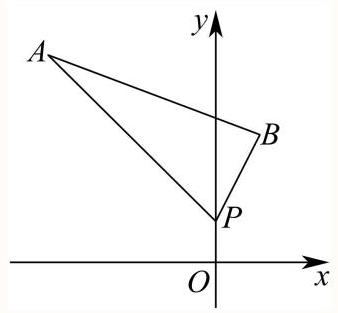
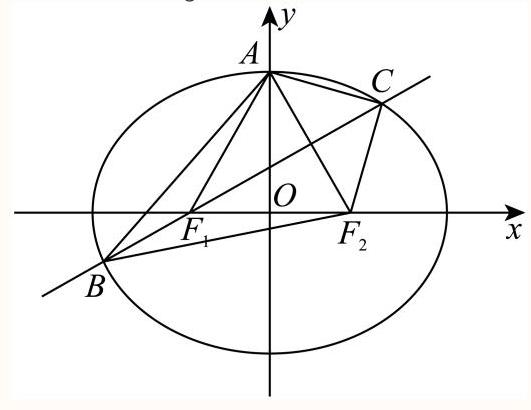
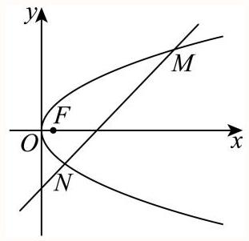
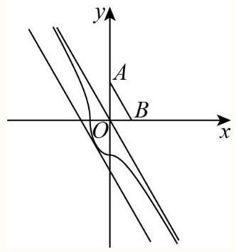

中档题周周练6.12-1

姓名:___

1 容易 上海市黄浦区2025-2026学年第二学期高三5月模拟数学试卷

已知随机变量 $X$ 服从正态分布 $N\left( {2,{\sigma }^{2}}\right) \left( {\sigma  > 0}\right)$ ，则 $P\left( {X > 2}\right)  =$ ___.

---

											答案

$\frac{1}{2}$

---

解析

因为 $X \sim  N\left( {2,{\sigma }^{2}}\right)$ ,所以正态密度曲线关于直线 $x = 2$ 对称,得到 $P\left( {X > 2}\right)  = \frac{1}{2}$ .

2 较易 上海市曹杨第二中学2026届高三下学期考前模拟数学试卷

已知随机变量 $X$ 服从分布

<table><tr><td>$X$</td><td>-1</td><td>2</td></tr><tr><td>$P$</td><td>$p$</td><td>0.4</td></tr></table>

，则 $E\left( {{5X} - 1}\right)  =$ ___.

答案

0

解析

由题可得: $p + {0.4} = 1$ ,解得: $p = {0.6}$ ,所以 $E\left( X\right)  =  - {0.6} + 2 \times  {0.4} = {0.2}$ ,

则 $E\left( {{5X} - 1}\right)  = {5E}\left( X\right)  - 1 = 5 \times  {0.2} - 1 = 0$

3 较易 上海市延安中学2025-2026学年高三下学期5月适应性考试数学试卷

已知 $X$ 服从二项分布 $B\left( {5,{0.6}}\right)$ ，则 $P\left( {X = 2}\right)  =$ ___.

答案

${0.2304} \mid  \frac{144}{625}$

解析

由题意可知 $P\left( {X = 2}\right)  = {\mathrm{C}}_{5}^{2}{\left( {0.6}\right) }^{2}{\left( 1 - {0.6}\right) }^{3} = {0.2304}$ .

4 较易 上海市大同中学2025-2026学年高三下学期模拟预测数学试题

已知连续型随机变量 $Y$ 服从正态分布 $N\left( {2,{2}^{2}}\right)$ ，则 $P\left( {0 \leq  Y \leq  4}\right)$ 的值约等于___.

(注: 若 $X \sim  N\left( {\mu ,{\sigma }^{2}}\right)$ ,则 $P\left( {\mu  - \sigma  \leq  X \leq  \mu  + \sigma }\right)  \approx  {0.68}, P\left( {\mu  - {2\sigma } \leq  X \leq  \mu  + {2\sigma }}\right)  \approx  {0.95}$ )

答案

${0.68}\left| {\;\frac{17}{25}}\right.$

解析

随机变量 $Y$ 服从正态分布 $N\left( {2,{2}^{2}}\right)$ ,

$\therefore P\left( {0 \leq  Y \leq  4}\right)  = P\left( {\mu  - \sigma  \leq  Y \leq  \mu  + \sigma }\right)  \approx  {0.68}$ .

5 较易 上海市华东师范大学第二附属中学2025-2026学年高三下学期考前模拟数学试卷

立德中学进行新年联欢，有一个抽奖游戏，箱子中放了 100 个一样规格的红包，里面分别放入1, 2, 3, ..., 99, 100元，若依次(不放回)抽两次红包，得到的奖金数额之和为偶数的概率为 ___.

答案

99 99

解析

利用组合数公式及古典概型概率公式计算即可得.

抽到的两个红包可能性有 ${\mathrm{C}}_{100}^{2}$ 种,

由奇数加奇数为偶数, 偶数加偶数为偶数,

则其中奖金数额之和为偶数的可能性有 ${\mathrm{C}}_{50}^{2} + {\mathrm{C}}_{50}^{2}$ 种,

故抽到的奖金数额之和为偶数的概率为 $\frac{{\mathrm{C}}_{50}^{2} + {\mathrm{C}}_{50}^{2}}{{\mathrm{C}}_{100}^{2}} = \frac{\frac{{50} \times  {49}}{2} + \frac{{50} \times  {49}}{2}}{\frac{{100} \times  {99}}{2}} = \frac{49}{99}$ .

6 较易 2026年上海秋季高考数学

${\left( {x}^{2} + x\right) }^{5}$ 展开式中 ${x}^{7}$ 项的系数为___

答案

10

解析

${T}_{r + 1} = {C}_{5}^{r} \cdot  {\left( {x}^{2}\right) }^{5 - r} \cdot  {\left( x\right) }^{r} = {C}_{5}^{r} \cdot  {x}^{{10} - r},{10} - r = 7, r = 3$

${T}_{4} = {C}_{5}^{3} \cdot  {\left( {x}^{2}\right) }^{2} \cdot  {x}^{3} = {10}{x}^{7},$

故系数为 10 .

7 较易 上海音乐学院附属黄浦比乐中学2025-2026学年第二学期期中考试试卷高二年级数学... 若直线 $x + {2y} + 3 = 0$ 与直线 ${2x} + {my} + {10} = 0$ 平行，则这两条直线间的距离是___.

答案

$\frac{2\sqrt{5}}{5}$

解析

运用两直线平行求得 $\mathrm{m}$ 的值,再运用两平行线间的距离公式可求得结果.

由直线 $x + {2y} + 3 = 0$ 与直线 ${2x} + {my} + {10} = 0$ 平行,

可知 $m - 2 \times  2 = 0$ ,即 $m = 4$ ,

故直线 ${2x} + {my} + {10} = 0$ 为 ${2x} + {4y} + {10} = 0$ ,

直线 $x + {2y} + 3 = 0$ 变形得 ${2x} + {4y} + 6 = 0$ ,

故这两条直线间的距离为 $d = \frac{\left| 6 - {10}\right| }{\sqrt{{2}^{2} + {4}^{2}}} = \frac{2\sqrt{5}}{5}$ ,

故答案为: $\frac{2\sqrt{5}}{5}$ .

8 较易 沪教版 (2020) 选修第一册 新课改一课一练 第2章 2.1.3 圆的一般方程

已知点 $A\left( {0,1}\right)$ ， $B\left( {2, - 1}\right)$ ，动点 $P\left( {x, y}\right)$ 满足 $\overrightarrow{PA} \cdot  \overrightarrow{PB} = 1$ ，则点 $P$ 的轨迹为___.

答案

${\left( x - 1\right) }^{2} + {y}^{2} = 3$

解析

用向量数量积的坐标运算表示已知等式化简即得轨迹方程, 由方程可判断轨迹.

$\overrightarrow{PA} = \left( {-x,1 - y}\right) ,\overrightarrow{PB} = \left( {2 - x, - 1 - y}\right) ,$

$\overrightarrow{PA} \cdot  \overrightarrow{PB} =  - x\left( {2 - x}\right)  - \left( {1 - y}\right) \left( {1 + y}\right)  =  - {2x} + {x}^{2} - 1 + {y}^{2} = 1,$

化简得: ${\left( x - 1\right) }^{2} + {y}^{2} = 3$ ,所以,点 $\mathrm{P}$ 的轨迹为圆: ${\left( x - 1\right) }^{2} + {y}^{2} = 3$

故答案为: ${\left( x - 1\right) }^{2} + {y}^{2} = 3$

9 般 2026年上海秋季高考数学

某工厂为进行环境保护与改善，对九年间空气中某颗粒物密度与二氧化硫密度进行了监测与记录， 数据如下:

某颗粒物密度 101.02 87.02 57.46 21.85 11.76 8.86 5.03 4.63 3.86

二氧化硫密度 119.47 51.84 53.2 9.166.64.4 3.31 3.35 3.86

(1)为进一步研究，从这 9 年间随机抽取一年，该年份颗粒物的密度大于二氧化硫密度的概率是

多少?

(2)为研究颗粒物密度与二氧化硫密度的相关性，该工厂应选取茎叶图、扇形图、散点图中的哪一种进行分析,并请你判断相关系数在 $\left( {-1,0}\right) ,\left( {0,1}\right) ,\left( {1,2}\right)$ 哪个区间内 (直接写结论).

(3)9 年的年份 $x$ 的平均数为2018， $y$ (颗粒物密度)关于 $x$ (年份) 的回归方程拟合采用 $y = {106.544}{e}^{-{0.461}\left( {x - {2014}}\right) }$ 或 $y = a\left( {x - {2014}}\right)  + {83.743}$ . 若 2023 年实际颗粒物浓度为 3.88,则哪个回归方程对于 2023 年的预测值与实际值的差值绝对值更小?

## 答案

(1) $\frac{7}{9}$

(2)选择散点图， $r \in  \left( {0,1}\right)$ .

(3) $y = {106.544}{e}^{-{0.461}\left( {x - {2014}}\right) }$ 对于 2023 年的预测值与实际值的差值绝对值更小

解析

(1)由题意，设该年份颗粒物的密度大于二氧化硫密度为束件 $A$ ，显然满足题意共有 7 年，故 $P\left( A\right)  = \frac{7}{9}$ ,故该年份颗粒物的密度大于二氧化硫密度的概率为 $\frac{7}{9}$ .

(2)选择散点图， $r \in  \left( {0,1}\right)$ .

(3)由题意，设样本中心 $\left( {{2018},\bar{y}}\right)$ ，

$\bar{y} = \frac{{101.02} + {87.02} + {57.46} + {21.85} + {11.76} + {8.86} + {5.03} + {4.63} + {3.86}}{9} \approx  {33.499},$ 故 ${33.499} = a\left( {{2018} - {2014}}\right)  + {83.74} \Rightarrow  a \approx   - {12.561}, y =  - {12.561}\left( {x - {2014}}\right)  + {83.743}$ ,故 $x = {2023}$ 时,此时 $y = {106.544}{e}^{-{0.461}\left( {{2023} - {2014}}\right) } \approx  {1.681}$ ,差值绝对值为 2.199, $y =  - {12.561}\left( {{2023} - {2014}}\right)  + {83.743} \approx  {29.306}$ ,差值绝对值为 ${33.186} > {2.199}$ , 故 $y = {106.544}{e}^{-{0.461}\left( {x - {2014}}\right) }$ 对于 2023 年的预测值与实际值的差值绝对值更小

10 一般上海市延安中学2025-2026学年高三下学期5月适应性考试数学试卷

甲、乙两支球队参加某球类比赛,如果每局比赛甲队获胜的概率为 $p\left( {0 < p < 1}\right)$ ,乙队获胜的概率为 $1 - p$ ,且每局比赛的结果相互独立. 比赛有两种方案,

方案一:采用“三局两胜”制，即累计先胜两局的队最终获胜；

方案二:采用“五局三胜”制，即累计先胜三局的队最终获胜.

(1)当 $p = \frac{2}{3}$ 时，采用方案一还是方案二对乙更有利(不用说明理由)，并求该方案下乙队最终获胜的概率;

(2)当 $p = \frac{1}{2}$ 时，若比赛采用方案二.

①求在甲队最终获胜的条件下，比赛恰好进行了四局的概率；

②若比赛结果为3:0或者3:1时，胜方得3分，负方得0分，比赛结果为3:2时，胜方得2分，负方得1 分,求甲队本次比赛的得分 $X$ 的分布及期望

## 答案

(1)采用方案一对乙更有利，乙队最终获胜的概率 ${p}_{1} = \frac{7}{27}$

(2)① $\frac{3}{8}$ ；②

<table><tr><td>$X$</td><td>0</td><td>1</td><td>2</td><td>3</td></tr><tr><td>$P$</td><td>5</td><td>$\frac{3}{16}$</td><td>$\frac{3}{16}$</td><td>$\frac{5}{16}$</td></tr></table>

$E\left( X\right)  = \frac{3}{2}$

解析

(1)当 $p = \frac{2}{3}$ 时，每局比赛乙队获胜的概率为 $1 - p = \frac{1}{3}$ ,

采用方案一，三局两胜制下乙获胜分两种情况:2:0胜和2:1胜，

因此乙队最终获胜的概率 ${p}_{1} = \frac{1}{3} \cdot  \frac{1}{3} + {\mathrm{C}}_{2}^{1}\frac{1}{3} \cdot  \frac{2}{3} \cdot  \frac{1}{3} = \frac{7}{27}$ ;

采用方案二,五局三胜制下乙获胜分三种情况: $3 : 0$ 胜、3:1胜和3:2胜,

因此乙队最终获胜的概率 ${p}_{2} = \frac{1}{3} \cdot  \frac{1}{3} \cdot  \frac{1}{3} + {\mathrm{C}}_{3}^{2}{\left( \frac{1}{3}\right) }^{2} \cdot  \frac{2}{3} \cdot  \frac{1}{3} + {\mathrm{C}}_{4}^{2}{\left( \frac{1}{3}\right) }^{2} \cdot  {\left( \frac{2}{3}\right) }^{2} \cdot  \frac{1}{3} = \frac{17}{81}$

,

而 $\frac{7}{27} > \frac{17}{81}$ ,所以采用方案一对乙更有利,乙队最终获胜的概率 ${p}_{1} = \frac{7}{27}$ .

(2)①当 $p = \frac{1}{2}$ 时，甲队最终获胜的事件为 $B$ ，五局三胜制下甲获胜分三种情况:3:0胜、3:1胜

和3:2胜,

$P\left( B\right)  = \frac{1}{2} \cdot  \frac{1}{2} \cdot  \frac{1}{2} + {\mathrm{C}}_{3}^{2} \cdot  {\left( \frac{1}{2}\right) }^{2} \cdot  \frac{1}{2} \cdot  \frac{1}{2} + {\mathrm{C}}_{4}^{2} \cdot  {\left( \frac{1}{2}\right) }^{2} \cdot  {\left( \frac{1}{2}\right) }^{2} \cdot  \frac{1}{2} = \frac{1}{2},$

比赛恰好进行了四局的事件为 $A$ ,则 $P\left( {AB}\right)  = {\mathrm{C}}_{3}^{2} \cdot  {\left( \frac{1}{2}\right) }^{2} \cdot  \frac{1}{2} \cdot  \frac{1}{2} = \frac{3}{16}$ ,

所以求在甲队最终获胜的条件下,比赛恰好进行了四局的概率为 $P\left( {A \mid  B}\right)  = \frac{P\left( {AB}\right) }{P\left( B\right) } = \frac{3}{8}$ . ②甲队得分 $X$ 的所有可能取值为0,1,2,3，

$X = 0$ ,即乙以 $3 : 0$ 或 $3 : 1$ 胜甲, $P\left( {X = 0}\right)  = {\left( \frac{1}{2}\right) }^{3} + {\mathrm{C}}_{3}^{2}{\left( \frac{1}{2}\right) }^{3} \cdot  \frac{1}{2} = \frac{5}{16}$ ;

$X = 1$ ,即乙以 $3 : 2$ 胜甲， $P\left( {X = 1}\right)  = {\mathrm{C}}_{4}^{2}{\left( \frac{1}{2}\right) }^{2} \cdot  {\left( \frac{1}{2}\right) }^{2} \cdot  \frac{1}{2} = \frac{3}{16}$ ;

$X = 2$ ,即甲以 $3 : 2$ 胜乙, $P\left( {X = 2}\right)  = {\mathrm{C}}_{4}^{2}{\left( \frac{1}{2}\right) }^{2} \cdot  {\left( \frac{1}{2}\right) }^{2} \cdot  \frac{1}{2} = \frac{3}{16}$ ;

$X = 3$ ,即甲以 $3 : 0$ 或 $3 : 1$ 胜乙, $P\left( {X = 3}\right)  = {\left( \frac{1}{2}\right) }^{3} + {\mathrm{C}}_{3}^{2}{\left( \frac{1}{2}\right) }^{3} \cdot  \frac{1}{2} = \frac{5}{16}$ ,

所以 $X$ 的分布为

<table><tr><td>$X$</td><td>0</td><td>1</td><td>2</td><td>3</td></tr><tr><td>$P$</td><td>5 16</td><td>$\frac{3}{16}$</td><td>$\frac{3}{16}$</td><td>$\frac{5}{16}$</td></tr></table>

期望 $E\left( X\right)  = 0 \times  \frac{5}{16} + 1 \times  \frac{3}{16} + 2 \times  \frac{3}{16} + 3 \times  \frac{5}{16} = \frac{3}{2}$ .

11 一般 上海市吴淞中学2025-2026学年高二下学期中考试数学试卷

有两个罐子, $A$ 罐中放有 3 个白球和 2 个黑球, $B$ 罐中放有 5 个白球.

(1)若从 $A$ 罐不放回地摸2个球，求恰好摸到一个白球一个黑球的概率；

(2)若从 $A$ 罐不放回地摸2个球，求第二次摸到白球的概率；

(3) 现在从两个罐子各摸一个球并交换，这样交换2次后，记A罐中黑球的个数为 $X$ ，求 $X$ 的分布列和期望.

(1) $\frac{3}{5}$

(2) $\frac{3}{5}$

(3) $X$ 的分布列为:

<table><tr><td>$X$</td><td>0</td><td>1</td><td>2</td></tr><tr><td>$P$</td><td>125</td><td>64   125</td><td>53</td></tr></table>

$E\left( X\right)  = \frac{34}{25}$

解析

(1)所求概率为 $\frac{{\mathrm{C}}_{3}^{1}{\mathrm{C}}_{2}^{1}{\mathrm{A}}_{2}^{2}}{{\mathrm{\;A}}_{5}^{2}} = \frac{3}{5}$ ;

(2)根据全概率公式知第二次摸到白球的概率为 $\frac{3}{5} \times  \frac{2}{4} + \frac{2}{5} \times  \frac{3}{4} = \frac{12}{20} = \frac{3}{5}$ ;

(3) $X$ 的取值为0,1,2，

则 $P\left( {X = 0}\right)  = \frac{2}{5} \times  1 \times  \frac{1}{5} \times  \frac{4}{5} = \frac{8}{125}$ ,

$P\left( {X = 1}\right)  = \frac{3}{5} \times  1 \times  \frac{2}{5} \times  1 + \frac{2}{5} \times  1 \times  \frac{4}{5} \times  \frac{4}{5} + \frac{2}{5} \times  1 \times  \frac{1}{5} \times  \frac{1}{5} = \frac{64}{125},$

$P\left( {X = 2}\right)  = \frac{3}{5} \times  1 \times  \frac{3}{5} \times  1 + \frac{2}{5} \times  1 \times  \frac{4}{5} \times  \frac{1}{5} = \frac{53}{125},$

则 $X$ 的分布列为:

<table><tr><td>$X$</td><td>0</td><td>1</td><td>2</td></tr><tr><td>$P$</td><td>8 125</td><td></td><td>$\frac{53}{125}$</td></tr></table>

期望 $E\left( X\right)  = 0 \times  \frac{8}{125} + 1 \times  \frac{64}{125} + 2 \times  \frac{53}{125} = \frac{34}{25}$ .

12 —— 上海市华东师范大学第二附属中学2025-2026学年高三下学期考前模拟数学试卷

一盒子中有大小与质地均相同的 20 个小球, 其中白球9个, 其余为黑球. 参与者从盒子中有放回的随机取 $m$ 次球,若其中取到白球的个数为 $\xi ,\xi  = k\left( {k = 0,1,2\ldots m}\right)$ ,当概率 $P\left( {\xi  = 6}\right)  \geq  P\left( {\xi  = k}\right) \left( {k = 0,1,2\ldots m}\right)$ 时,则 $m =$ ___.

答案

13或14

解析

根据题意可得 $\xi  \sim  B\left( {m,\frac{9}{20}}\right)$ ,利用二项分布的公式求解即可.

由题可得每次取到白球的概率为 $\frac{9}{20}$ ,

参与者从盒子中有放回的随机取 $m$ 次球，若其中取到白球的个数为 $\xi$ ，则 $\xi  \sim  B\left( {m,\frac{9}{20}}\right)$ ，

所以

$\begin{array}{l} P\left( {\xi  = k}\right)  = {\mathrm{C}}_{m}^{k}{\left( \frac{9}{20}\right) }^{k}{\left( 1 - \frac{9}{20}\right) }^{m - k} = {\mathrm{C}}_{m}^{k}{\left( \frac{9}{20}\right) }^{k}{\left( \frac{11}{20}\right) }^{m - k} = {\mathrm{C}}_{m}^{k}\frac{{9}^{k} \times  {11}^{m - k}}{{20}^{m}}, k = 0,1,2, \end{array}$

若概率 $P\left( {\xi  = 6}\right)$ 最大,则有 $\left\{  {\begin{array}{l} P\left( {\xi  = 6}\right)  \geq  P\left( {\xi  = 7}\right) \\  P\left( {\xi  = 6}\right)  \geq  P\left( {\xi  = 5}\right)  \end{array} \Rightarrow  \left\{  \begin{array}{l} {\mathrm{C}}_{m}^{6}\frac{{9}^{6} \times  {11}^{m - 6}}{{20}^{m}} \geq  {\mathrm{C}}_{m}^{7}\frac{{9}^{7} \times  {11}^{m - 7}}{{20}^{m}} \\  {\mathrm{C}}_{m}^{6}\frac{{9}^{6} \times  {11}^{m - 6}}{{20}^{m}} \geq  {\mathrm{C}}_{m}^{5}\frac{{9}^{5} \times  {11}^{m - 5}}{{20}^{m}} \end{array}\right. }\right.$ , 所以 $\left\{  {\begin{array}{l} {11}{\mathrm{C}}_{m}^{6} \geq  9{\mathrm{C}}_{m}^{7} \\  9{\mathrm{C}}_{m}^{6} \geq  {11}{\mathrm{C}}_{m}^{5} \end{array} \Rightarrow  \left\{  \begin{array}{l} \frac{11}{9} \geq  \frac{m - 6}{7} \\  \frac{m - 5}{6} \geq  \frac{11}{9} \end{array}\right. }\right.$ ,解得 $\frac{37}{3} \leq  m \leq  \frac{131}{9}$ ,又 $m \in  \mathrm{Z}$ ,故 $m = {13}$ 或 14, 所以 $m = {13}$ 或 14 时,概率 $P\left( {\xi  = 6}\right)$ 的值最大

13 一般上海市位育中学2025-2026学年高三下学期5月模拟练习数学试卷

我国的制造业增加值自2010年起连续12年位居世界第一，某设备生产企业对现有生产设备进行技术攻坚突破，提高核心竞争力、设备生产的零件的直径为 $X$ (单位nm).

(1)技术攻坚前，为分析影响零件直径的因素，技术人员测量了某批次零件的直径与三个相关变量: 机床转速①、切削深度②和环境湿度③，并计算了直径与这三个变量的相关系数分别为0.75 ， -0.88，0.42. 请按照相关性从强到弱对这三个变量进行排序，直接写出排序结果(无需说明理由, 用标号①②③表示即可;

(2)现有旧设备生产的零件共7个，其中直径大于10nm的有4个. 现从这7个零件中随机抽取2个， 记 $Y$ 表示取出的零件中直径大于10nm的零件个数，求 $Y$ 的分布与期望:

(3)若技术攻坚后新设备生产的零件直径 $X \sim  N\left( {9,{0.2}^{2}}\right)$ ，从生产的同一批零件中随机取出 10 个零件逐一独立地进行检验，求至多有1个零件小于8.6nm的概率. (结果保留到0.0001) 参考数据: 若 $x \sim  N\left( {\mu ,{\sigma }^{2}}\right)$ ,则 $P\left( {\left| {x - \mu }\right|  \leq  \sigma }\right)  \approx  {0.6827}, P\left( {\left| {x - \mu }\right|  \leq  {2\sigma }}\right)  \approx  {0.9545}$ .

答案

(1)②①③

(2) $Y$ 的分布为: 期望 $E\left( Y\right)  = \frac{8}{7}$

<table><tr><td>$Y$</td><td>0</td><td>1</td><td>2</td></tr><tr><td>$P$</td><td>$\frac{1}{7}$</td><td>4 7</td><td>$\frac{2}{7}$</td></tr></table>

(3) 0.9794

解析

(1) 由 $\left| {-{0.88}}\right|  > \left| {0.75}\right|  > \left| {0.42}\right|$ ,

故按照相关性从强到弱对这三个变量进行排序为②①③；

(2)由题意，7个零件中直径大于10nm的有4个，不大于10nm的有3个，

随机抽取 2 个， $Y$ 的可能取值为 0,1,2,

$P\left( {Y = 0}\right)  = \frac{{\mathrm{C}}_{3}^{2}}{{\mathrm{C}}_{7}^{2}} = \frac{1}{7}, P\left( {Y = 1}\right)  = \frac{{\mathrm{C}}_{4}^{1}{\mathrm{C}}_{3}^{1}}{{\mathrm{C}}_{7}^{2}} = \frac{4}{7}, P\left( {Y = 2}\right)  = \frac{{\mathrm{C}}_{4}^{2}}{{\mathrm{C}}_{7}^{2}} = \frac{2}{7},$

故 $Y$ 的分布为:

<table><tr><td>$Y$</td><td>0</td><td>1</td><td>2</td></tr><tr><td>$P$</td><td>1</td><td>4 7</td><td>$\frac{2}{7}$</td></tr></table>

$E\left( Y\right)  = 0 \times  \frac{1}{7} + 1 \times  \frac{4}{7} + 2 \times  \frac{2}{7} = \frac{8}{7};$

(3) 由 $X \sim  N\left( {9,{0.2}^{2}}\right) ,\mu  - {2\sigma } = {8.6}$ ,

故 $P\left( {X < {8.6}}\right)  = \frac{1 - P\left( {\left| {X - \mu }\right|  \leq  {2\sigma }}\right) }{2} \approx  \frac{1 - {0.9545}}{2} = {0.02275}$ ,

记10个零件中直径小于 ${8.6}\mathrm{\;{nm}}$ 的个数为 $Z$ ,各零件检验独立,故 $Z \sim  B\left( {{10},{0.02275}}\right)$ , 则

$P\left( {Z \leq  1}\right)  = P\left( {Z = 0}\right)  + P\left( {Z = 1}\right)  = {\mathrm{C}}_{10}^{0} \times  {\left( 1 - {0.02275}\right) }^{10} + {\mathrm{C}}_{10}^{1} \times  {0.02275} \times \; {\left( 1 - {0.02275}\right) }^{9}$

$\approx  {0.79443} + {0.18494} \approx  {0.9794}.$

14 一般上海市行知中学2025-2026学年第二学期5月月考高一年级数学试卷

若直线 $y = {kx} + 1$ 与点 $A\left( {-4,5}\right) \text{ 、 }B\left( {1,3}\right)$ 构成的线段 ${AB}$ 相交，则 $k$ 的取值范围是___.

## 答案

$k \leq   - 1$ 或 $k \geq  2$

解析

首先求出直线过定点 $P\left( {0,1}\right)$ ,利用斜率计算公式求出 ${k}_{PA},{k}_{PB}$ ,再数形结合即可得解. 直线 $y = {kx} + 1$ 过定点 $P\left( {0,1}\right)$ ,如图,

由 ${k}_{PA} = \frac{5 - 1}{-4 - 0} =  - 1,{k}_{PB} = \frac{3 - 1}{1 - 0} = 2$ ,

15 一般 上海音乐学院附属黄浦比乐中学2025-2026学年第二学期期中考试试卷高二年级数学...

已知 ${F}_{1}$ ， ${F}_{2}$ 为椭圆 $\Gamma  : \frac{{x}^{2}}{{a}^{2}} + {y}^{2} = 1\left( {a > 1}\right)$ 的左右焦点， $\mathrm{A}$ 为 $\Gamma$ 的上顶点，直线l经过点 ${F}_{1}$ 且与 $\Gamma$ 交于 B，C两点；若1垂直平分线段 $A{F}_{2}$ ，则 $\bigtriangleup  \mathrm{{ABC}}$ 的周长是___.

答案

$\frac{8\sqrt{3}}{3}$

解析

如图,连接 $C{F}_{2}, B{F}_{2}$ ,则可得 $\left| {C{F}_{2}}\right|  = \left| {AC}\right| ,\left| {B{F}_{2}}\right|  = \left| {AB}\right|$ ,所以 $\bigtriangleup \mathrm{{ABC}}$ 的周长为 $\left| {C{F}_{2}}\right|  + \left| {B{F}_{2}}\right|  + \left| {B{F}_{1}}\right|  + \left| {C{F}_{1}}\right|  = {4a}$ ,再求出 $a$ ,即可求得结果.

如图,连接 $C{F}_{2}, B{F}_{2}$ ,

因为1垂直平分线段 $A{F}_{2}$ ,

所以 $\left| {C{F}_{2}}\right|  = \left| {AC}\right| ,\left| {B{F}_{2}}\right|  = \left| {AB}\right|$ ,

所以 $\bigtriangleup {ABC}$ 的周长为 $\left| {C{F}_{2}}\right|  + \left| {B{F}_{2}}\right|  + \left| {B{F}_{1}}\right|  + \left| {C{F}_{1}}\right|  = {4a}$ ,

由题意得 $A\left( {0,1}\right) ,{F}_{1}\left( {-c,0}\right) ,{F}_{2}\left( {c,0}\right)$ ,则

$A{F}_{2}$ 的中点为 $\left( {\frac{c}{2},\frac{1}{2}}\right) ,{k}_{A{F}_{2}} = \frac{1 - 0}{0 - c} =  - \frac{1}{c}$ ,

所以直线 $l$ 的斜率为 $c$ ,

所以直线 $l$ 的方程为 $y - \frac{1}{2} = c\left( {x - \frac{c}{2}}\right)$ ,

因为直线 $l$ 过 ${F}_{1}\left( {-c,0}\right)$ ,

所以 $- \frac{1}{2} = c\left( {-c - \frac{c}{2}}\right)$ ,解得 $c = \frac{\sqrt{3}}{3}$ ,

所以 $a = \sqrt{{b}^{2} + {c}^{2}} = \sqrt{1 + \frac{1}{3}} = \frac{2\sqrt{3}}{3}$ ，

所以 $\bigtriangleup  \mathrm{{ABC}}$ 的周长为 ${4a} = \frac{8\sqrt{3}}{3}$ ，

故答案为: $\frac{8\sqrt{3}}{3}$ .

16 一般 新疆伊西哈拉镇中学2018-2019学年高二上学期期末数学试卷

若直线 $l : y = {kx} + 2$ 与曲线 $C : {x}^{2} - {y}^{2} = 6\left( {x > 0}\right)$ 交于不同的两点，则 $k$ 的取值范围是( )

A. $\left( {-\frac{\sqrt{15}}{3},\frac{\sqrt{15}}{3}}\right)$

B. $\left( {0,\frac{\sqrt{15}}{3}}\right)$

C. $\left( {-\frac{\sqrt{15}}{3},0}\right)$

D. $\left( {-\frac{\sqrt{15}}{3}, - 1}\right)$

答案

D

解析

把直线与双曲线方程联立消去 $y$ ,利用 $\Delta  > 0$ 和 $k <  - 1$ 联立，即可求得 $k$ 的范围.

联立方程组 $\left\{  \begin{array}{l} y = {kx} + 2 \\  {x}^{2} - {y}^{2} = 6 \end{array}\right.$ ,整理得 $\left( {{k}^{2} - 1}\right) {x}^{2} + {4kx} + {10} = 0$ ,

设方程 $\left( {{k}^{2} - 1}\right) {x}^{2} + {4kx} + {10} = 0$ 的两根为 ${x}_{1},{x}_{2}$ ,

因为直线 $y = {kx} + 2$ 与双曲线 ${x}^{2} - {y}^{2} = 6\left( {x > 0}\right)$ 的右支交于不同的两点,

则满足 $\left\{  \begin{array}{l} {x}_{1} + {x}_{2} =  - \frac{4k}{{k}^{2} - 1} > 0 \\  {x}_{1}{x}_{2} = \frac{10}{{k}^{2} - 1} > 0 \\  {k}^{2} - 1 \neq  0 \end{array}\right.$ ,解得 $k <  - 1$ ,

又由 $\left\{  \begin{array}{l} k <  - 1 \\  \Delta  = {\left( 4k\right) }^{2} - {40}\left( {{k}^{2} - 1}\right)  > 0 \end{array}\right.$ ,解得 $- \frac{\sqrt{15}}{3} < k <  - 1$ ,

所以 $k$ 的取值范围是 $\left( {-\frac{\sqrt{15}}{3}, - 1}\right)$ .

故选: D.

17 一般 上海市华东师范大学第二附属中学2025-2026学年高三下学期6月高考全真模拟数学试卷已知抛物线 $C : {y}^{2} = {4x}$ 的焦点为 $F$ .

(1)求点 $F$ 到抛物线准线的距离；

(2)若过点 $\left( {1,0}\right)$ 的直线 $l$ 交抛物线于 $A$ 、 $B$ 两点，求 $\left| {AB}\right|$ 的最小值；

(3)设直线 $l$ 与抛物线 $C$ 交于 $M$ 、 $N$ 两点，若 $\overrightarrow{OM} \cdot  \overrightarrow{ON} = 4$ ，求线段 ${MN}$ 中点到 $y$ 轴的距离的取值范围。

## ✓答案

(1)2

(2) 4

(3) $\left( {2\sqrt{2} - 2, + \infty }\right)$

## 解析

(1)由题意得 $F\left( {1,0}\right)$ ,准线方程为 $x =  - 1$ ,

则点 $F$ 到抛物线准线的距离为 2 .

(2)当斜率不存在时，直线方程为 $x = 1$ ，

设 $A\left( {{x}_{A},{y}_{A}}\right)$ ， $B\left( {{x}_{B},{y}_{B}}\right)$ ，联立方程组 $\left\{  \begin{array}{l} {y}^{2} = {4x} \\  x = 1 \end{array}\right.$ ，

解得 ${y}_{A} = 2,{y}_{B} =  - 2$ ,可得 $\left| {AB}\right|  = 4$ ,

当斜率存在时,设直线方程为 $y = k\left( {x - 1}\right)$ ,

联立方程组 $\left\{  \begin{array}{l} {y}^{2} = {4x} \\  y = k\left( {x - 1}\right)  \end{array}\right.$ ,可得 ${k}^{2}{x}^{2} - \left( {2{k}^{2} + 4}\right) x + {k}^{2} = 0$ ,

由韦达定理得 ${x}_{A} + {x}_{B} = 2 + \frac{4}{{k}^{2}}$ ，由焦半径公式得 $\left| {AB}\right|  = 4 + \frac{4}{{k}^{2}} > 4$ ，

综上可得, $\left| {AB}\right|$ 的最小值为4.

(3)如图，作出符合题意的图形，

设直线方程为 $x = {my} + t$ ，设 $M\left( {{x}_{1},{y}_{1}}\right)$ ， $N\left( {{x}_{2},{y}_{2}}\right)$ ，

联立方程组 $\left\{  \begin{array}{l} {y}^{2} = {4x} \\  x = {my} + t \end{array}\right.$ ,可得 ${y}^{2} - {4my} - {4t} = 0$ ,

可得 $\Delta  = {16}\left( {{m}^{2} + t}\right)  > 0$ ,由韦达定理得 ${y}_{1} + {y}_{2} = {4m},{y}_{1}{y}_{2} =  - {4t}$ ,

设线段 ${MN}$ 中点为 $Q\left( {{x}_{0},{y}_{0}}\right)$ ，由中点坐标公式得 ${x}_{0} = \frac{{x}_{1} + {x}_{2}}{2}$ ，

由题意得线段 ${MN}$ 中点到 $y$ 轴的距离为 ${x}_{0} = \frac{{x}_{1} + {x}_{2}}{2} = \frac{\frac{{y}_{1}^{2}}{4} + \frac{{y}_{2}^{2}}{4}}{2} = \frac{{y}_{1}^{2} + {y}_{2}^{2}}{8}$

$= \frac{{\left( {y}_{1} + {y}_{2}\right) }^{2} - 2{y}_{1}{y}_{2}}{8} = \frac{{16}{m}^{2} - 2 \times  \left( {-{4t}}\right) }{8} = 2{m}^{2} + t,$

而 ${x}_{1}{x}_{2} = \frac{{\left( {y}_{1}{y}_{2}\right) }^{2}}{16} = \frac{{16}{t}^{2}}{16} = {t}^{2}$ ,而 $\overrightarrow{OM} = \left( {{x}_{1},{y}_{1}}\right) ,\overrightarrow{ON} = \left( {{x}_{2},{y}_{2}}\right)$ ,

得到 $\overrightarrow{OM} \cdot  \overrightarrow{ON} = {x}_{1}{x}_{2} + {y}_{1}{y}_{2} = {t}^{2} - {4t}$ ,而 $\overrightarrow{OM} \cdot  \overrightarrow{ON} = 4$ ,

可得 ${t}^{2} - {4t} = 4$ ,解得 $t = 2 + 2\sqrt{2}$ 或 $t = 2 - 2\sqrt{2}$ ,

当 $t = 2 + 2\sqrt{2}$ 时,满足 $\Delta  = {16}\left( {{m}^{2} + t}\right)  > 0$ ,此时 $2{m}^{2} + t \geq  t = 2 + 2\sqrt{2}$ ,

当 $t = 2 - 2\sqrt{2}$ 时,此时 $\Delta  = {16}\left( {{m}^{2} + 2 - 2\sqrt{2}}\right)  > 0$ ,

解得 ${m}^{2} > 2\sqrt{2} - 2$ ,此时 $2{m}^{2} + t > 4\sqrt{2} - 4 + 2 - 2\sqrt{2} = 2\sqrt{2} - 2$ ,

综上可得,线段 ${MN}$ 中点到 $y$ 轴的距离的取值范围为 $\left( {2\sqrt{2} - 2, + \infty }\right)$ .

18 一般上海市华东师范大学第二附属中学2025-2026学年高三下学期6月高考全真模拟数学试卷下列调查中，适合采用抽样调查的是( )

A. 调查某中学高一(1)班30名同学的视力情况

B. 虹桥高铁站对乘坐高铁的旅客进行安检

C. 为保证飞机飞行安全, 工人对其零部件进行检查

D. 调查上海市中学生的周末作业完成时间

## 答案

D

解析

根据抽样调查的特点, 它适用于总体较大、全面调查不经济或不现实的情况, 分析选项即可. 对于A，调查某中学高一(1)班30名同学的视力情况，总体较小(仅30人)，容易进行全面调查, 不适合抽样调查, 故A错误;

对于B，安检涉及安全风险，必须对每位旅客进行全面检查，不适合抽样调查，故B错误；

对于 $\mathrm{C}$ ,飞机零部件检查要求全面性,任何遗漏都可能造成安全事件,不适合抽样调查,故 $\mathrm{C}$ 错误;

对于D，调查对象是全市范围的中学生，总体较大，适合抽样调查，故D正确.

19 较难 2022年上海卷秋季高考真题数学试卷

设集合 $\Omega  = \left\{  {\left( {x, y}\right) \left| {{\left( x - k\right) }^{2} + {\left( y - {k}^{2}\right) }^{2} = 4}\right| k\mid , k \in  \mathbf{Z}}\right\}$ ，①存在直线 $l$ ，使得集合 $\Omega$ 中不存在点在 $l$ 上，而存在点在 $l$ 两侧；②存在直线 $l$ ，使得集合 $\Omega$ 中存在无数点在 $l$ 上，则()

A. ①成立②成立

B. ①成立②不成立

C. ①不成立②成立

D. ①不成立②不成立

答案

B

解析

当 $k = 0$ 时,集合 $\Omega  = \left\{  {\left( {x, y}\right) \left| {{\left( x - k\right) }^{2} + {\left( y - {k}^{2}\right) }^{2} = 4}\right| k\mid , k \in  \mathbf{Z}}\right\}   = \{ \left( {0,0}\right) \}$ ,

当 $k > 0$ 时,集合 $\Omega  = \left\{  {\left( {x, y}\right) \left| {{\left( x - k\right) }^{2} + {\left( y - {k}^{2}\right) }^{2} = 4}\right| k\mid , k \in  \mathbf{Z}}\right\}$ ,

表示圆心为 $\left( {k,{k}^{2}}\right)$ ，半径为 $r = 2\sqrt{k}$ 的圆，

圆的圆心在直线 $y = {x}^{2}$ 上,半径 $r = f\left( k\right)  = 2\sqrt{k}$ 单调递增,

相邻两个圆的圆心距 $d = \sqrt{{\left( k + 1 - k\right) }^{2} + {\left\lbrack  {\left( k + 1\right) }^{2} - {k}^{2}\right\rbrack  }^{2}} = \sqrt{4{k}^{2} + {4k} + 2}$ ,相邻两个圆的半径之和为 $l = 2\sqrt{k} + 2\sqrt{k + 1}$ ,

因为 $d > l$ 有解,故相邻两个圆之间的位置关系可能相离,

当 $k < 0$ 时，同 $k > 0$ 的情况，故存在直线 $l$ ，使得集合 $\Omega$ 中不存在点在 $l$ 上，而存在点在 $l$ 两侧， 故①正确，

若直线 $l$ 斜率不存在，显然不成立，

设直线 $l : y = {mx} + n$ ,若考虑直线 $l$ 与圆 ${\left( x - k\right) }^{2} + {\left( y - {k}^{2}\right) }^{2} = 4\left| k\right|$ 的交点个数,

$d = \frac{\left| mk + n - {k}^{2}\right| }{\sqrt{{m}^{2} + 1}},\;r = 2\sqrt{\left| k\right| },$

给定 $m, n$ ,当 $k$ 足够大时,均有 $d > r$ ,

故直线 $l$ 只与有限个圆相交,②错误.

故选: $B$ .

20 较难 2021年上海卷秋季高考真题数学试卷

已知椭圆 $\Gamma  : \frac{{x}^{2}}{2} + {y}^{2} = 1,{F}_{1}\text{ 、 }{F}_{2}$ 是其左右焦点,直线 $l$ 过点 $P\left( {m,0}\right) \left( {m <  - \sqrt{2}}\right)$ 交椭圆 $\Gamma$ 于 $A$ 、 $B$ 两点，且 $A$ 、 $B$ 在 $x$ 轴上方，点 $A$ 在线段 ${BP}$ 上.

(1)若 $B$ 是上顶点， $\left| \overrightarrow{B{F}_{1}}\right|  = \left| \overrightarrow{P{F}_{1}}\right|$ ，求 $m$ 的值；

(2)若 $\overrightarrow{{F}_{1}A} \cdot  \overrightarrow{{F}_{2}A} = \frac{1}{3}$ ，且原点 $O$ 到直线 $l$ 的距离为 $\frac{4\sqrt{15}}{15}$ ，求直线 $l$ 的方程；

(3)对于任意点 $P$ ，是否存在唯一直线 $l$ ，使得 $\overrightarrow{{F}_{1}A}//\overrightarrow{{F}_{2}B}$ 成立，若存在，求出直线 $l$ 的斜率，若不存在, 请说明理由.

答案

(1) $- 1 - \sqrt{2}$

(2) $y = \frac{1}{3}\left( {x + \frac{4\sqrt{6}}{3}}\right)$

(3) $\sqrt{\frac{1}{2{m}^{2} - 4}}$

解析

(1)依题意: ${a}^{2} = 2,{b}^{2} = 1$ ，半焦距 $c = 1$ ，

则 $\left| \overrightarrow{B{F}_{1}}\right|  = \left| \overrightarrow{P{F}_{1}}\right|  = a = \sqrt{2}$

$\therefore \left| {OP}\right|  = \left| {P{F}_{1}}\right|  + c = \sqrt{2} + 1$ ,

此时: $m =  - 1 - \sqrt{2}$ .

(2) 设直线 $l$ 的方程为: $y = k\left( {x - m}\right)$ ( $k$ 必存在),又 $A, B$ 在 $x$ 轴上方,点 $A$ 在线段 ${BP}$ 上,

则设 $A\left( {{x}_{1},{y}_{1}}\right)$ ,且 ${x}_{1} < 0$ ,

又 ${F}_{1}\left( {-1,0}\right) ,{F}_{2}\left( {1,0}\right)$ ,

故有 ${F}_{1}A \cdot  {F}_{2}A = \left( {{x}_{1} + 1}\right) \left( {{x}_{1} - 1}\right)  + {y}_{1}{}^{2}$

$= {x}_{1}{}^{2} - 1 + {y}_{1}{}^{2}$

$= \frac{1}{3}$

又 $\frac{{x}_{1}{}^{2}}{2} + {y}_{1}{}^{2} = 1 \Rightarrow  {y}_{1}{}^{2} = 1 - \frac{{x}_{1}{}^{2}}{2}$ ,

代入 $\overrightarrow{{F}_{1}A} \cdot  \overrightarrow{{F}_{2}A} = {x}_{1}{}^{2} + {y}_{1}{}^{2} - 1$

$= {x}_{1}^{2} + 1 - \frac{{x}_{1}{}^{2}}{2} - 1$

$= \frac{1}{3}$

$\Rightarrow  {x}_{1} =  - \frac{\sqrt{6}}{3}$ (正值舍去)

则 ${y}_{1} = \frac{\sqrt{6}}{3}$ ,

即直线 $l$ 满足 $\frac{\sqrt{6}}{3} = k \cdot  \left( {-\frac{\sqrt{6}}{3} - m}\right)$

又点 $O$ 到直线 $l$ 的距离 $d = \frac{\left| km\right| }{\sqrt{1 + {k}^{2}}} = \frac{4\sqrt{15}}{15}\;$ ②

联立 ①② 可得 $\left\{  \begin{array}{l} m =  - \frac{4\sqrt{6}}{3} \\  k = \frac{1}{3} \end{array}\right.$ (另一组解舍去,因与 $m <  - \sqrt{2}$ 矛盾),

即直线 $l$ 的方程为: $y = \frac{1}{3}\left( {x + \frac{4\sqrt{6}}{3}}\right)$ .

(3)设直线 $l$ 的方程为: $y = k\left( {x - m}\right) \left( {k > 0}\right)$ ， $A\left( {{x}_{1},{y}_{1}}\right)$ ， $B\left( {{x}_{2},{y}_{2}}\right)$ ，

又 ${F}_{1}\left( {-1,0}\right) ,{F}_{2}\left( {1,0}\right)$ ,

则 $\overrightarrow{{F}_{1}A} = \left( {{x}_{1} + 1,{y}_{1}}\right)$ ,

$\overrightarrow{{F}_{2}B} = \left( {{x}_{2} + 1,{y}_{2}}\right) ,$

$\overrightarrow{{F}_{1}A}//\overrightarrow{{F}_{2}B} \Rightarrow  \left( {{x}_{1} + 1}\right)  \cdot  {y}_{2} = \left( {{x}_{2} - 1}\right)  \cdot  {y}_{1}$ ,

则 $\left( {{x}_{1} + 1}\right)  \cdot  k\left( {{x}_{2} - m}\right)  = \left( {{x}_{2} - 1}\right)  \cdot  k\left( {{x}_{1} - m}\right)$ ,

化简可得: ${x}_{1} + {x}_{2} + m\left( {{x}_{2} - {x}_{1}}\right)  - {2m} = 0$ ,

联立:

$\left\{  {\begin{array}{l} y = k\left( {x - m}\right) \\  {x}^{2} + 2{y}^{2} = 2 \end{array} \Rightarrow  \left( {1 + 2{k}^{2}}\right) {x}^{2} - {4m}{k}^{2}x + 2{k}^{2}{m}^{2} - 2 = 0,}\right.$

$\Delta  > 0$ ,

则 $\left\{  \begin{array}{l} {x}_{1} + {x}_{2} = \frac{4mk}{1 + 2{k}^{2}} \\  {x}_{1}{x}_{2} = \frac{2{k}^{2}{m}^{2} - 2}{1 + 2{k}^{2}} \end{array}\right.$

则可得

$\frac{{4m}{k}^{2}}{1 + 2{k}^{2}} + m\left( {{x}_{2} - {x}_{1}}\right)  - {2m} = 0 \Rightarrow  {x}_{2} - {x}_{1} = \frac{2}{1 + 2{k}^{2}},$

又: ${\left( {x}_{2} - {x}_{1}\right) }^{2} = {\left( {x}_{1} + {x}_{2}\right) }^{2} - 4{x}_{1}{x}_{2} = {\left( \frac{2}{1 + 2{k}^{2}}\right) }^{2}$ ,

代入 $\left\{  \begin{array}{l} {x}_{1} + {x}_{2} = \frac{{4m}{k}^{2}}{1 + 2{k}^{2}} \\  {x}_{1}{x}_{2} = \frac{2{k}^{2}{m}^{2} - 2}{1 + 2{k}^{2}} \end{array}\right.$

化简可得: $4{k}^{2} - 2{k}^{2}{m}^{2} + 1 = 0 \Rightarrow  {k}^{2} = \frac{1}{2{m}^{2} - 4}$ ,

则 $k = \sqrt{\frac{1}{2{m}^{2} - 4}}, m <  - \sqrt{2}$ ,

故对于任意点 $P$ ,存在唯一直线 $l$ ,使得 $\overrightarrow{{F}_{1}A}//\overrightarrow{{F}_{2}B}$ 成立,此时直线 $l$ 的斜率为 $\sqrt{\frac{1}{2{m}^{2} - 4}}$

21 较难 上海市吴淞中学2025-2026学年高二下学期中考试数学试卷

已知点 $A\left( {0,1}\right) , B\left( {2,0}\right)$ ，点 $C$ 在曲线 $\Gamma  : \frac{x\left| x\right| }{4} + y\left| y\right|  =  - 1$ 上，则 $\bigtriangleup  {ABC}$ 的面积( )

A. 有最大值，但没有最小值

B. 没有最大值, 但有最小值

C. 既有最大值, 也有最小值

D. 既没有最大值, 也没有最小值

答案

A

解析

按x、y的正负符号分象限讨论, 去掉绝对值后得到各象限内对应的标准圆锥曲线方程, 确定曲线 $\Gamma$ 的具体形状与范围，计算线段 ${AB}$ 的长度，以及直线 ${AB}$ 的方程:结合三角形面积，将问题转化为求点 $\mathrm{C}$ 到直线 ${AB}$ 的距离 $\mathrm{d}$ 的最值情况，结合曲线的形状讨论d的最值情况，即可确定答案. 对于曲线 $\Gamma  : \frac{x\left| x\right| }{4} + y\left| y\right|  =  - 1$ ,

当 $x \geq  0, y \geq  0$ 时,方程为 $\frac{{x}^{2}}{4} + {y}^{2} =  - 1$ ,方程无实数解,曲线不存在;

当 $x \geq  0, y < 0$ 时,方程为 ${y}^{2} - \frac{{x}^{2}}{4} = 1$ ,曲线为双曲线 ${y}^{2} - \frac{{x}^{2}}{4} = 1$ 在第四象限内部分, 且当 $x \rightarrow   + \infty$ 时,曲线无限靠近直线 $y =  - \frac{1}{2}x$ ;

当 $x < 0, y \geq  0$ 时,方程为 $\frac{{x}^{2}}{4} - {y}^{2} = 1$ ,曲线为双曲线 $\frac{{x}^{2}}{4} - {y}^{2} = 1$ 在第二象限内部分, 且当 $x \rightarrow   - \infty$ 时,曲线无限靠近直线 $y =  - \frac{1}{2}x$ ;

当 $x \leq  0, y \leq  0$ 时,方程为 $\frac{{x}^{2}}{4} + {y}^{2} = 1$ ,曲线为椭圆 $\frac{{x}^{2}}{4} + {y}^{2} = 1$ 在第三象限内部分,

点 $A\left( {0,1}\right) , B\left( {2,0}\right)$ ,则直线 ${AB}$ 的方程为 $x + {2y} - 2 = 0,\left| {AB}\right|  = \sqrt{5}$ ,

设点 $C$ 到直线 ${AB}$ 的距离为 $d$ ，则 ${S}_{\bigtriangleup {ABC}} = \frac{1}{2} \cdot  \left| {AB}\right|  \cdot  d = \frac{\sqrt{5}}{2}d$ ；

直线 $x + {2y} - 2 = 0$ 和直线 $y =  - \frac{1}{2}x$ 平行,两直线间距离为 $\frac{\left| -2 - 0\right| }{\sqrt{{1}^{2} + {2}^{2}}} = \frac{2\sqrt{5}}{5}$ ，

而 $d = \frac{\left| x + 2y - 2\right| }{\sqrt{5}}$ ,当 $C$ 点落在曲线位于第二或第四象限内的部分上时,恒有 $d > \frac{2\sqrt{5}}{5}$ ;

当 $C$ 点落在曲线位于第三象限内的部分上时,设 $\left\{  \begin{array}{l} x = 2\cos \theta \\  y = \sin \theta  \end{array}\right.$ , $\theta  \in  \left\lbrack  {\pi ,\frac{3\pi }{2}}\right\rbrack$ ,

则 $x + {2y} - 2 = 2\cos \theta  + 2\sin \theta  - 2 = 2\sqrt{2}\sin \left( {\theta  + \frac{\pi }{4}}\right)  - 2$ ,

则 $d = \frac{\left| x + 2y - 2\right| }{\sqrt{5}} \leq  \frac{2\sqrt{2} + 2}{\sqrt{5}}$ ,当且仅当 $\sin \left( {\theta  + \frac{\pi }{4}}\right)  =  - 1$ 时取等号,

此时 $\bigtriangleup {ABC}$ 的面积取到最大值,

综上可知 $\bigtriangleup {ABC}$ 的面积有最大值,但没有最小值.
