# 建模专题 4.28 重组题库（仅题目版）

来源：`建模专题-4.28-教师版.md`。

处理原则：删除原有答案与解题过程，只保留题干、选项、表格和图片；题目顺序按中心模型重新排列，不沿用原题库顺序。

## 我对题库的理解

这份题库表面上覆盖测量、交通、建筑、绿化、容器、费用、通行等真实情境，但中心思想并不是“生活常识”，而是把现实对象压缩为几类数学模型：变量函数、三角测量、路径优化、区域最值、立体工程和坐标向量。

我重排时没有按原来的“求值、范围、函数相关、三角、立体几何”等标签走，因为那些标签更多是题源或知识点标签；我改按学生做题时真正需要识别的“建模动作”来排。这样学生先看题时，会先问“这是哪类模型”，而不是先找公式。

## 重排规则

(1) 先抽象后应用：先放变量函数类，建立建模语言。

(2) 先测量后优化：再放观测测量类，因为它们主要训练图形还原。

(3) 先路径后区域：路径题强调目标函数，区域题强调几何表达式。

(4) 先平面后立体：立体题所需的投影、截面、体积表面积关系更综合。

(5) 最后放抽象结构：向量、轨迹、切线这类题更像从应用背景中抽出的数学骨架。

## 分类目录

- 一、变量函数与抽象模型：8 题
- 二、观测测量与定位求值：15 题
- 三、路径、运输与通行临界：12 题
- 四、平面区域规划与面积最值：17 题
- 五、立体结构、容器与材料工程：16 题
- 六、向量、坐标与隐含几何结构：3 题

## 一、变量函数与抽象模型

这一组把现实语言先压缩成变量、函数或不等式，重点不是图形计算，而是识别“谁是变量、目标量如何随变量变化”。我把它放在最前面，是为了先建立建模题的通用语言。

### 第01题｜比例换算与速度估算

中心思想：比例换算与速度估算。

2024年10月30日“神舟十九号”载人飞船发射成功，标志着中国空间站建设进入新阶段. 在飞船竖直升空过程中， 某位记者用照相机在同一位置以同一姿势连续拍照两次. 已知“神舟十九号”飞船船体实际长度为H，且在照片上飞

船船体长度为h，比较两张照片，相对于照片中的同一固定参照物飞船上升了m. 假设该记者连按拍照键间的反应时间为t，并忽略相机曝光时长，若用平均速度估算瞬时速度，则拍照时飞船的瞬时速度为___ . (用含有H、h、 m、t的式子表示)

### 第02题｜雨中行模型解释

中心思想：雨中行模型解释。

小李研究数学建模“雨中行”问题，在作出“降雨强度保持不变”、“行走速度保持不变”、“将人体视作一个长方体”等合理假设的前提下, 他设了变量:

<table><tr><td>人的身高</td><td>人体宽度</td><td>人体厚度</td><td>降雨速度</td><td>雨滴密度</td><td>行走距离</td><td>风速</td><td>行走速度</td></tr><tr><td>$h$</td><td>$w$</td><td>$d$</td><td>${v}_{r}$</td><td>$p$</td><td>$D$</td><td>${v}_{w}$</td><td>$v$</td></tr></table>

并构建模型如下:

当人迎风行走时,人体总的淋雨量为 $T = \frac{pwD}{v}\left\lbrack  {d{v}_{r} + h\left( {{v}_{w} + v}\right) }\right\rbrack$ .

根据模型, 小李对“雨中行”作出如下解释:

①若两人结伴迎风行走，则体型较高大魁梧的人淋雨是较大；

②若某人迎风行走，则走得越快淋雨量越小，若背风行走，则走得越慢淋雨量越小；

③若某人迎风行走了10秒，则行走距离越长淋雨量越大.

这些解释合理的个数为( )

A. 0 B. 1 C. 2 D. 3

### 第03题｜绝对值约束下的参数存在

中心思想：绝对值约束下的参数存在。

若存在实数 $a$ ,使得当 $x \in  \left\lbrack  {0, m}\right\rbrack  \left( {m > 0}\right)$ 时，都有 $\left| {{2x} - 1}\right|  + \left| {{x}^{2} - a}\right|  \leq  4$ ，则实数 $m$ 的最大值为( )

A. 1

B. $\frac{3}{2}$ C. 2

D. $\frac{5}{2}$

### 第04题｜导数与唯一整数解

中心思想：导数与唯一整数解。

已知函数 $f\left( x\right)  = {\mathrm{e}}^{x - 1} - {ax} + a\left( {a > 0}\right)$ ，若 $f\left( x\right)  < 0$ 仅存在唯一整数解，则 $a$ 的取值范围为___▲___.

### 第05题｜含参函数单调性讨论

中心思想：含参函数单调性讨论。

已知函数 $f\left( x\right)  = \left\lbrack  {{\ln }^{2}x - \left( {a + 1}\right) \ln x + 1}\right\rbrack   \cdot  x, a \in  \mathrm{R}$ ,讨论函数 $f\left( x\right)$ 的单调性.

### 第06题｜斜坡体能消耗最少

中心思想：斜坡体能消耗最少。

公园修建斜坡，假设斜坡起点在水平面上，斜坡与水平面的夹角为θ，斜坡终点距离水平面的垂直高度为4米，游客每走一米消耗的体能为 $\left( {{1.025} - \cos \theta }\right)$ ,要使游客从斜坡底走到斜坡顶端所消耗的总体能最少,则 $\theta  =$

### 第07题｜仓库竞标费用模型

中心思想：仓库竞标费用模型。

某物流公司为了扩大业务量，计划改造一间高为6米，底面积为24平方米，且背面靠墙的长方体形状的仓库. 因仓库的背面靠墙,无须建造费用,设仓库前面墙体的长为 $x$ 米 $\left( {4 \leq  x \leq  6}\right)$ . 现有甲、乙两支工程队参加竞标，甲队的报价方案为:仓库前面新建墙体每平方米400元，左右两面新建墙体每平方米300元，屋顶和地面以及其他共计

28800元；乙队给出的整体报价为 $\left( {1 + \frac{2}{x}}\right)  \times  {6k} \times  {10}^{4}$ 元( $k > 0$ )，不考虑其他因素，若乙队要确保竞标成功，则实数 $k$ 的取值范围是

### 第08题｜椭圆浅水区判别条件

中心思想：椭圆浅水区判别条件。

某海域内有一孤岛，岛四周的海平面(视为平面)上有一浅水区(含边界)，其边界是长轴长为2a，短轴长为2b 的椭圆，已知岛上甲、乙导航灯的海拔高度分别为 ${\mathrm{h}}_{1}$ 、 ${\mathrm{h}}_{2}$ ，且两个导航灯在海平面上的投影恰好落在椭圆的两个焦点上，现有船只经过该海域(船只的大小忽略不计)，在船上测得甲、乙导航灯的仰角分别为 ${\theta }_{1}$ 、 ${\theta }_{2}$ ，那么船只已进入该浅水区的判别条件是___.

## 二、观测测量与定位求值

这一组的中心是“看得见但量不到”，需要把方向角、仰角、影长、观测点转化为三角形或坐标关系。我打乱了原题顺序，按从平面测量到空间/曲面测量递进。

### 第09题｜同楼仰角测距

中心思想：同楼仰角测距。

如图所示，小明和小宁家都住在东方明珠塔附近的同一幢楼上，小明家在 $A$ 层，小宁家位于小明家正上方的 $B$ 层,已知 ${AB} = a$ .小明在家测得东方明珠塔尖的仰角为 $\alpha$ ,小宁在家测得东方明珠塔尖的仰角为 $\beta$ ,则他俩所住的这幢楼与东方明珠塔之间的距离 $d =$

### 第10题｜林场火情方位定位

中心思想：林场火情方位定位。

某林场为了及时发现火情，设立了两个观测点 $A$ 和 $B$ . 某日两个观测点的林场人员都观测到 $C$ 处出现火情. 在 $A$ 处观测到火情发生在北偏西40°方向，而在 $B$ 处观测到火情在北偏西60°方向. 已知 $B$ 在 $A$ 的正东方向10km处(如图所示),则 $\left| {{BC} - {AC}}\right|  =$ km. (精确到 ${0.1}\mathrm{\;{km}}$ )

### 第11题｜建筑物仰角测高

中心思想：建筑物仰角测高。

如图,某建筑物 ${OP}$ 垂直于地面,从地面点 $A$ 处测得建筑物顶部 $P$ 的仰角为 ${30}^{ \circ  }$ ,从地面点 $B$ 处测得建筑物顶部 $P$ 的仰角为 ${45}^{ \circ  }$ ，已知 $A$ 、 $B$ 相距 100米， $\angle {AOB} = {60}^{ \circ  }$ ，则该建筑物 ${OP}$ 高度约为 米.(保留一位小数)

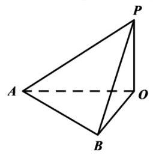

### 第12题｜大厦三点测高

中心思想：大厦三点测高。

中企联合大厦是奉贤区的第一高楼，是奉贤美奉贤强的一个缩影. 某数学建模兴趣小组的同学们去实地进行测量，经过多次的测量，最终在平行于地面的同一水平面上选取三个点:点 $B$ 、点 $C$ 、点 $O$ 作为测量基点. 设大厦的最高点为 $A$ ,在点 $B$ 处测得点 $A$ 的仰角为 $\angle {ABO} = \theta  = {71.5}^{ \circ  }$ ,在点 $C$ 处测得点 $A$ 的仰角为 $\angle {ACO} = {44}^{ \circ  }$ ,又测得 ${BC} = {221}$ 米， $\angle {BOC} = {119}^{ \circ  }$ ，(见图). 现作出以下几个假设:

①直线 ${AO}$ 垂直于平面 ${OBC}$ ；

②平面 ${OBC}$ 到地面的距离等于测角仪高度，在计算过程中测角仪高度忽略不计；

③其它次要因素等忽略不计. 根据以上信息估算奉贤第一高楼的高度约 米.(结果保留整数)

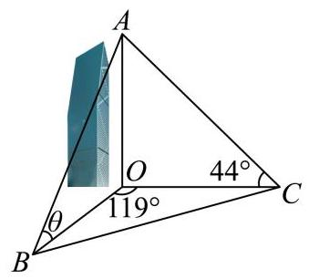

### 第13题｜双方向角求角度

中心思想：双方向角求角度。

已知点B在点C正北方向，点D在点C的正东方向， ${BC} = {CD},$ 存在点A满足 $\angle {BAC} = {16.5}^{ \circ  },\angle {DAC} = {37}^{ \circ  }$ ，则 $\angle {BCA} = \;$ (精确到0.1度)

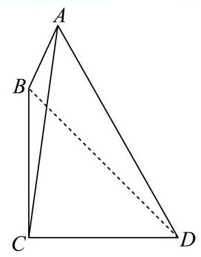

### 第14题｜隧道方向测定

中心思想：隧道方向测定。

如图,要在A和D两地之间修建一条笔直的隧道,现在从B地和C地测量得到: $\angle {DBC} = {24.2}^{ \circ  }$ , $\angle {DCB} = {35.4}^{ \circ  }$ , $\angle {DBA} = {31.6}^{ \circ  },\angle {DCA} = {17.5}^{ \circ  }$ . 试求 $\angle {DAB}$ 以确定隧道AD的方向. (结果精确到 ${0.1}^{ \circ  }$ )

### 第15题｜广告牌设计与实测修正

中心思想：广告牌设计与实测修正。

如图，某公司要在 $A$ 、 $B$ 两地连线上的定点 $C$ 处建造广告牌 ${CD}$ ，其中 $D$ 为顶端， ${AC}$ 长35米， ${CB}$ 长80米，设 $A\text{ 、 }B$ 在同一水平面上，从 $A$ 和 $B$ 看 $D$ 的仰角分别为 $\alpha$ 和 $\beta$ .

(1)设计中 ${CD}$ 是铅垂方向，若要求 $\alpha  \geq  {2\beta }$ ，问 ${CD}$ 的长至多为多少(结果精确到0.01米)？

(2)施工完成后. ${CD}$ 与铅垂方向有偏差，现在实测得 $\alpha  = {38.12}^{ \circ  },\beta  = {18.45}^{ \circ  }$ ,求 ${CD}$ 的长(结果精确到0.01 米) ?

### 第16题｜斜面影子测角

中心思想：斜面影子测角。

小申同学观察发现，生活中有些时候影子可以完全投射在斜面上. 某斜面上有两根长为1米的垂直于水平面放置的杆子，与斜面的接触点分别为A、B，它们在阳光的照射下呈现出影子，阳光可视为平行光:其中一根杆子的影子在水平面上，长度为0.4米；另一根杆子的影子完全在斜面上，长度为0.45米. 则斜面的底角 $\theta  = \;$ . (结果用角度制表示，精确到 ${0.01}^{ \circ  }$ )

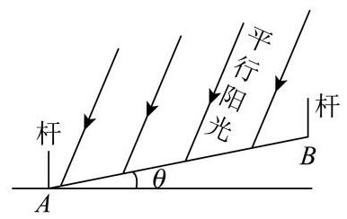

### 第17题｜瀑布高度与视角

中心思想：瀑布高度与视角。

瀑布是庐山的一大奇观，唐代诗人李白曾在《望庐山瀑布中》写道:日照香炉生紫烟，遥看瀑布挂前川，飞流直下三千尺，疑是银河落九天.为了测量某个瀑布的实际高度, 某同学设计了如下测量方案: 沿一段水平山道步行至与瀑布底端在同一水平面时，在此位置测得瀑布顶端的仰角正切值为 $\frac{3}{2}$ ，沿山道继续走 ${20}\mathrm{\;m}$ ，测得瀑布顶端的仰角为 $\frac{\pi }{3}$ . 已知该同学沿山道行进的方向与他第一次望向瀑布底端的方向所成角为 $\frac{\pi }{3}$ .根据这位同学的测量数据，可知该瀑布的高度为___m；若第二次测量后，继续行进的山道有坡度，坡角大小为 $\frac{\pi }{4}$ ，且两段山道位于同一平面内， 若继续沿山道行进 ${20}\sqrt{2}\mathrm{m}$ ，则该同学望向瀑布顶端与底端的视角正切值为___. (此人身高忽略不计)

### 第18题｜太阳高度角与墙面阴影

中心思想：太阳高度角与墙面阴影。

嘉定某学习小组开展测量太阳高度角的数学活动. 太阳高度角是指某时刻太阳光线和地平面所成的角. 测量时, 假设太阳光线均为平行的直线, 地面为水平平面. 如图, 两竖直墙面所成的二面角为 ${120}^{ \circ  }$ , 墙的高度均为3米. 在时刻 $t$ ，实地测量得在太阳光线照射下的两面墙在地面的阴影宽度分别为1米、1.5米. 在线查阅嘉定的天文资料，当天的太阳高度角和对应时间的部分数据如表所示，则时刻 $t$ 最可能为( )

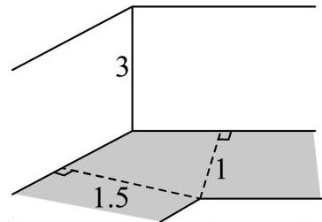

<table><tr><td>太阳高度角</td><td>时间</td><td>太阳高度角</td><td>时间</td></tr><tr><td>43.13°</td><td>08:30</td><td>68.53°</td><td>10:30</td></tr><tr><td>49.53°</td><td>09:00</td><td>74.49°</td><td>11:00</td></tr><tr><td>55.93°</td><td>09:30</td><td>79.60°</td><td>11:30</td></tr><tr><td>62.29°</td><td>10:00</td><td>82.00°</td><td>12:00</td></tr></table>

A. 09:00 B. 10:00

### 第19题｜正午太阳高度角估纬度

中心思想：正午太阳高度角估纬度。

太阳高度角是太阳光线与地面所成的角(即太阳在当地的仰角). 设地球表面某地正午太阳高度角为 $\theta$ ， $\delta$ 为此时太阳直射点纬度， $\varphi$ 为当地纬度值，那么这三个量满足 $\theta  = {90}^{ \circ  } - \left| {\varphi  - \delta }\right|$ . 通州区某校学生科技社团尝试估测通州区当地纬度值( $\varphi$ 取正值)，选择春分当日( $\delta  = {0}^{ \circ  }$ )测算正午太阳高度角. 他们将长度为1米的木杆垂直立于地面， 测量木杆的影长. 分为甲、乙、丙、丁四个小组在同一场地进行, 测量结果如下:

<table><tr><td>组别</td><td>甲组</td><td>乙组</td><td>丙组</td><td>丁组</td></tr><tr><td>木杆影长度(米)</td><td>0.82</td><td>0.80</td><td>0.83</td><td>0.85</td></tr></table>

则四组中对通州区当地纬度估测值最大的一组是( )

A. 甲组 B. 乙组 C. 丙组

### 第20题｜异地观测流星高度

中心思想：异地观测流星高度。

10世纪阿拉伯天文学家阿尔·库希设计出一种方案，通过两个观察者异地同时观测同一颗流星来测定流星的高度. 如图，设有两个观察者在地球上A、B两地同时观察到一颗流星S，仰角分别是 $\alpha$ 和 $\beta$ ( ${MA}$ ， ${MB}$ 表示当地的地平线). 设 $\alpha  = {30}^{ \circ  },\beta  = {45}^{ \circ  },\overset{\text{ ⏜ }}{AB} = {500}\mathrm{\;{km}}$ ,地球的半径 $R = {6371}\mathrm{\;{km}}$ ,则流星的高度约为 $\;\mathrm{{km}}$ (精确到 $1\mathrm{\;{km}}$ ).

### 第21题｜斜杆影长测量次数

中心思想：斜杆影长测量次数。

如图所示，水平地面上插有两根杆子 ${AB}$ 和 ${CD},{AB}$ 所在直线垂直于地面且 ${AB} = 2$ 米， ${CD}$ 所在直线与地面斜交. 小明有一把卷尺. 他在某时刻分别测出杆子 ${AB}$ 和 ${CD}$ 在阳光下影子的长度,称为一次操作. 小明可以在白天的不同时刻进行多次操作. 假设阳光为平行光，正午时分 ${AB}$ 的影子长度为 0 . 则下列说法正确的是( )

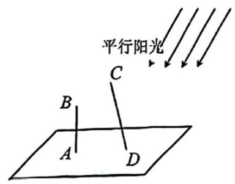

A. 为求出 ${CD}$ 的长度，小明至少需要进行2次操作 B. 为求出 ${CD}$ 的长度，小明至少需要进行3次操作

C. 为求出 ${CD}$ 的长度，小明至少需要进行4次操作 D. 无论进行多少次操作，小明都不能求出 ${CD}$ 的长度

### 第22题｜海岸线折线测距

中心思想：海岸线折线测距。

如图，折线 $A - B - C$ 为海岸线， ${BD} = {39.2}\mathrm{\;{km}}$ ， $\angle {BDC} = {22}^{ \circ  }$ ， $\angle {CBD} = {78}^{ \circ  }$ ， $\angle {BDA} = {54}^{ \circ  }$ .

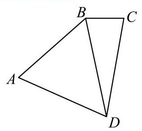

(1) 求 ${BC}$ 的长度；

(2)若 ${AB} = {{40}\mathrm{\;{km}}}$ ，求 $D$ 到海岸线 $A - B - C$ 的最短距离. (以上答案都精确到 ${0.001}\mathrm{\;{km}}$ )

### 第23题｜缺口圆形零件定位

中心思想：缺口圆形零件定位。

一个机器零件的形状是有缺口的圆形铁片，如图中实线部分为裁剪后的形状. 已知这个圆的半径是 ${13}\mathrm{\;{cm}}$ , ${AB} = {8\mathrm{\;{cm}}}$ ， ${BC} = {6\mathrm{\;{cm}}}$ ，且 ${AB}\bot {BC}$ ，则圆心到点B的距离约为___cm。(结果精确到0.1cm)

## 三、路径、运输与通行临界

这一组都在问“怎样走、能不能过、在哪里最省”。我按“路径最短/最省 -> 交通运输 -> 直角通行临界”排列，让学生看到最优化和临界状态是同一类思维。

### 第24题｜救生栈道最短抵达

中心思想：救生栈道最短抵达。

某临海地区为保障游客安全修建了海上救生栈道，如图，线段 ${BC}$ 、 ${CD}$ 是救生栈道的一部分，其中 ${BC} = {300m}$

， ${CD} = {800m}$ ， $B$ 在 $A$ 的北偏东 ${30}^{ \circ  }$ 方向， $C$ 在 $A$ 的正北方向， $D$ 在 $A$ 的北偏西 ${80}^{ \circ  }$ 方向，且 $\angle B = {90}^{ \circ  }$ . 若救生艇在 $A$ 处载上遇险游客需要尽快抵达救生栈道 $B - C - D$ ，则最短距离为 $\;\mathrm{m}$ . (结果精确到 $1\mathrm{\;m}$ )

### 第25题｜供水站费用最省

中心思想：供水站费用最省。

如下图所示，甲工厂位于一直线河岸的岸边 $A$ 处，乙工厂与甲工厂在河的同侧，且位于离河岸40km的 $B$ 处，河岸边 $D$ 处与 $A$ 处相距 ${50}\mathrm{\;{km}}$ (其中 ${BD}\bot {AD}$ )，两家工厂要在此岸边建一个供水站 $C$ ，从供水站到甲工厂和乙工厂的水管费用分别为每千米3a元和5a元，问供水站C建在岸边距离A处___km才能使水管费用最省？

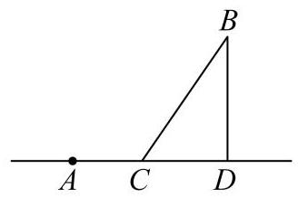

### 第26题｜海陆联运时间最短

中心思想：海陆联运时间最短。

如图所示， ${AB}$ 为沿海岸的高速路，海岛上码头 $O$ 离高速路最近点 $B$ 的距离是120km，在距离 $B$ 点300km的 $A$ 处有一批药品要尽快送达海岛. 现要用海陆联运的方式运送这批药品,设登船点 $C$ 到 $B$ 的距离为 $x$ ，已知汽车速度为 ${100}\mathrm{\;{km}}/\mathrm{h}$ ，快艇速度为 ${50}\mathrm{\;{km}}/\mathrm{h}$ . (参考数据: $\sqrt{3} \approx  {1.7}$ .)

(1)写出运输时间 $t\left( x\right)$ 关于 $x$ 的函数；

(2)当 $C$ 选在何处时运输时间最短？

### 第27题｜景区人行步道最短

中心思想：景区人行步道最短。

如图，现对某景区一长 ${AB} = {600}\mathrm{m}$ ，宽 ${AD} = {360}\mathrm{m}$ 的矩形空地进行建设. 规划在边 ${AB},{AD}$ 上分别取点 $M, N$ 修建人行步道(不考虑宽度)，且满足点 $A$ 关于步道 ${MN}$ 的对称点 $E$ 在边 ${DC}$ 上. 在 $\bigtriangleup  {AMN}$ 内种植花卉，在 $\bigtriangleup  {EMN}$ 内搭建娱乐设施，其余区域规划为露营区，则人行步道 ${MN}$ 的最短距离为 $\;\mathrm{m}$ . (结果精确到 $1\mathrm{\;m}$ )

### 第28题｜瞭望台视线范围最大

中心思想：瞭望台视线范围最大。

某海滨浴场平面图是如图所示的半圆，其中 $O$ 是圆心，直径 ${MN}$ 为400米， $P$ 是弧 ${MN}$ 的中点. 一个急救中心 $A$ 在栈桥 ${OP}$ 中点上，计划在弧 ${NP}$ 上设置一个瞭望台 $B$ ，并在 ${AB}$ 间修建浮桥. 已知 $\angle {ABO}$ 越大，瞭望台 $B$ 处的视线范围越大，则 $B$ 处的视线范围最大时， ${AB}$ 的长度为 米. (结果精确到 1 米)

### 第29题｜码头步道长度最小

中心思想：码头步道长度最小。

某地要建造一个市民休闲公园长方形 ${ABCD}$ ,如图,边 ${AB} = 2\mathrm{\;{km}}$ ,边 ${AD} = 1\mathrm{\;{km}}$ ,其中区域 ${ADE}$ 开挖成一个人工湖，其他区域为绿化风景区. 经测算，人工湖在公园内的边界是一段圆弧，且 $A$ 、 $D$ 位于圆心 $O$ 的正北方向， $E$ 位于圆心 $O$ 的北偏东 ${60}^{ \circ  }$ 方向. 拟定在圆弧 $P$ 处修建一座渔人码头，供游客湖中泛舟，并在公园的边 ${DC}$ 、 ${CB}$ 开设两个门 $M$ 、 $N$ ，修建步行道 ${PM}$ 、 ${PN}$ 通往渔人码头，且 ${PM}\bot {CD}$ 、 ${PN}\bot {CB}$ ，则步行道 ${PM}$ 、 ${PN}$ 长度之和的最小值是 km. (精确到0.001)

### 第30题｜阿克曼转向可行性

中心思想：阿克曼转向可行性。

汽车转弯时遵循阿克曼转向几何原理，即转向时所有车轮中垂线交于一点，该点称为转向中心:如图1，某汽车四轮中心分别为 $A\text{ 、 }B\text{ 、 }C\text{ 、 }D$ ，向左转向，左前轮转向角为 $\alpha$ ，右前轮转向角为 $\beta$ ，转向中心为 $O$ . 设该汽车左右轮距 ${AB}$ 为 $w$ 米，前后轴距 ${AD}$ 为 $l$ 米.

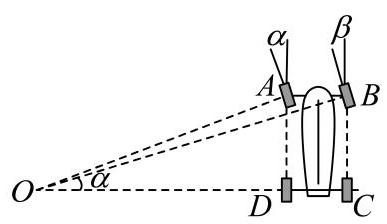

图1

图2

(1) 试用 $w\text{ 、 }l$ 和 $\alpha$ 表示 $\tan \beta$ ；

(2) 如图2，有一直角弯道， $M$ 为内直角顶点， ${EF}$ 为上路边，路宽均为3.5米，汽车行驶其中，左轮 $A\text{ 、 }D$ 与路边 ${FS}$ 相距2米.试依据如下假设，对问题*做出判断，并说明理由.

假设:①转向过程中，左前轮转向角 $\alpha$ 的值始终为 ${30}^{ \circ  }$ ；②设转向中心 $O$ 到路边 ${EF}$ 的距离为 $d$ ，若 ${OB} < d$ 且 ${OM} < {OD}$ ，则汽车可以通过，否则不能通过；③ $w = {1.570}, l = {2.680}$ .问题*:可否选择恰当转向位置，使得汽车通过这一弯道?

### 第31题｜直角过道设备长度

中心思想：直角过道设备长度。

某建筑物内一个水平直角型过道如图所示，两过道的宽度均为3米，有一个水平截面为矩形的设备需要水平通过直角型过道. 若该设备水平截面矩形的宽 ${BC}$ 为 1 米，则该设备能水平通过直角型过道的长 ${AB}$ 不超过 米.

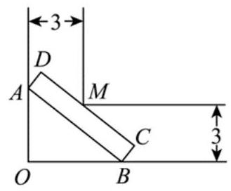

### 第32题｜冰箱入户与过道回收

中心思想：冰箱入户与过道回收。

网络购物行业日益发达，各销售平台通常会配备送货上门服务. 小金正在配送客户购买的电冰箱，并获得了客户所在小区门户以及建筑转角处的平面设计示意图.

图1

图2

(1)为避免冰箱内部制冷液逆流，要求运送过程中发生倾斜时，外包装的底面与地面的倾斜角 $\alpha$ 不能超过 $\frac{\pi }{4}$ ，且底面至少有两个顶点与地面接触. 外包装看作长方体，如图1所示，记长方体的纵截面为矩形 ${ABCD}$ ， ${AD} = {0.8}\mathrm{\;m}$ ， ${AB} = {2.4}\mathrm{\;m}$ ，而客户家门高度为 2.3 米，其他过道高度足够. 若以倾斜角 $\alpha  = \frac{\pi }{4}$ 的方式进客户家门, 小金能否将冰箱运送入客户家中? 计算并说明理由.

(2)由于客户选择以旧换新服务，小金需要将客户长方体形状的旧冰箱进行回收. 为了省力，小金选择将冰箱水平推运(冰箱背面水平放置于带滚轮的平板车上，平板车长宽均小于冰箱背面). 推运过程中遇到一处直角过道,如图2所示,过道宽为 1.8 米. 记此冰箱水平截面为矩形 ${EFGH},{EH} = {1.2}\mathrm{\;m}$ . 设 $\angle {PHG} = \beta$ ,当冰箱被卡住时(即点 $H$ 、 $G$ 分别在射线 ${PR}$ 、 ${PQ}$ 上，点 $O$ 在线段 ${EF}$ 上)，尝试用 $\beta$ 表示冰箱高度 ${EF}$ 的长，并求出 ${EF}$ 的最小值，最后请帮助小金得出结论:按此种方式推运的旧冰箱，其高度的最大值是多少？(结果精确到 ${0.1}\mathrm{\;m}$ )

### 第33题｜大卡车转弯车长

中心思想：大卡车转弯车长。

某路口的转弯处受地域限制，设计了一条单向双排直角拐弯车道，平面设计如图所示，每条车道宽为4米，现有一辆大卡车，在里侧车道，其车体水平截面图为矩形ABCD，它的宽AD为2.4米，车厢的左侧直线CD与双车道的分界线相交于 $\mathrm{E}$ 、 $\mathrm{F}$ ,记 $\angle {DAE} = \theta$ .

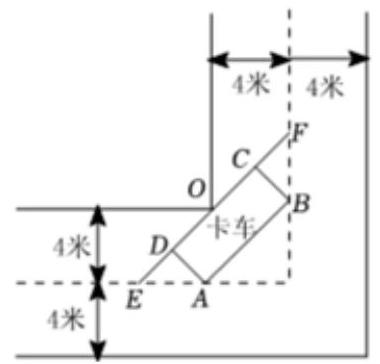

(1)若大卡车在转弯的某一刻，恰好 $\theta  = \frac{\pi }{6}$ ，且A、B也都在双车道的分界线上，直线CD也恰好过路口边界O，求大卡车的车长AB；

(2)为保证行车安全，在里侧车道转弯时，车体不能越过双车道分界线. 求此大卡车的车长AB的最大值.

### 第34题｜线段通过直角拐角

中心思想：线段通过直角拐角。

如图，平面内一条长度为 $d$ 的线段 ${AB}$ 恰好能通过直角拐角，拐角点 $P$ 到 ${Ox}$ 所在直线的距离为1m，到 ${Oy}$ 所在直线的距离为2m，若 ${AB}$ 恰好过 $P$ 点才能通过拐角，则 $d$ 的值约为 m.(结果精确到 ${0.01}\mathrm{m}$ )

$y$

$P$

$B \; A$

O $x$

### 第35题｜棱柱中折线路径最短

中心思想：棱柱中折线路径最短。

如图，在直四棱柱 ${ABCD} - {A}_{1}{B}_{1}{C}_{1}{D}_{1}$ 中，底面 ${ABCD}$ 为菱形，且 $\angle {BAD} = {60}^{ \circ  }$ . 若 ${AB} = {A{A}_{1}} = 2$ ，点 $M$ 为棱 $C{C}_{1}$ 的中点，点 $P$ 在 ${A}_{1}B$ 上，则线段 ${PA},{PM}$ 的长度和的最小值为 .

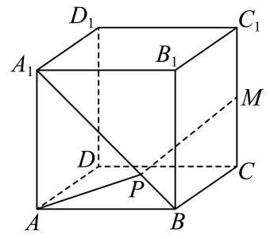

## 四、平面区域规划与面积最值

这一组的中心是区域设计：绿地、花坛、桥面、班徽、休闲区等。排列时我先放简单图形函数，再放复合区域与方案设计，便于从“写面积”过渡到“解释设计方案”。

### 第36题｜腐蚀区域内矩形面积最大

中心思想：腐蚀区域内矩形面积最大。

如图所示，正方形 ${ABCD}$ 是一块边长为4的工程用料，阴影部分所示是被腐蚀的区域，其余部分完好，曲线 ${MN}$ 为以 ${AD}$ 为对称轴的抛物线的一部分， ${DM} = {DN} = 3$ . 工人师傅现要从完好的部分中截取一块矩形原料 ${BQPR}$ ， 当其面积有最大值时， ${AQ}$ 的长为 .

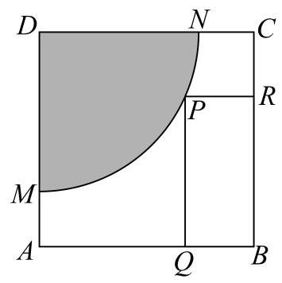

### 第37题｜扇形腐蚀铁皮截取

中心思想：扇形腐蚀铁皮截取。

如图，有一块矩形铁皮 ${ABCD}$ ，其中 ${AB} = t$ 米， ${AD} = 4$ 米，其中， $t$ 是一个大于等于4的常数. 阴影部分 ${AMN}$ 是一个半径为3米的扇形. 设这个扇形已经腐蚀不能使用, 但其余部分均完好. 工人师傅想在未被腐蚀的部分截下一块其边落在 ${BC}$ 与 ${CD}$ 上的矩形铁皮 ${PQCR}$ ，使点P在弧 ${MN}$ 上. 设 $\angle {MAP} = \theta \left( {0 \leq  \theta  \leq  \frac{\pi }{2}}\right)$ ，矩形 ${PQCR}$ 的面积为S平方米.

(1)求S关于 $\theta$ 的函数表达式；

(2)当 $t = 4$ 时，求S的最值，并求出当S取得最值时，所对应的 $\sin \theta$ 的值.

### 第38题｜扇形绿地破坏最小

中心思想：扇形绿地破坏最小。

如图,某处有一块圆心角为 $\frac{2}{3}\pi$ 的扇形绿地 ${AOB}$ ,扇形的半径为20米, ${AB}$ 是一条原有的人行直路,由于工程建设需要,现要在绿地中建一条直路 ${OC}$ ,以便在图中阴影部分区域分类堆放物料.为了尽量减少对绿地的破坏(不计路宽),则原直路 ${AB}$ 与新直路 ${OC}$ 的交叉点 $D$ 到 $O$ 的距离为 米.

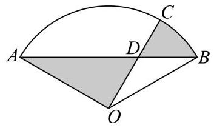

### 第39题｜滑杆三角形面积范围

中心思想：滑杆三角形面积范围。

如图，两条足够长且互相垂直的轨道 ${l}_{1},{l}_{2}$ 相交于点 $O$ ，一根长度为 8 的直杆 ${AB}$ 的两端点 $A, B$ 分别在 ${l}_{1},{l}_{2}$ 上滑动( $A, B$ 两点不与 $O$ 点重合，轨道与直杆的宽度等因素均可忽略不计),直杆上的点 $P$ 满足 ${OP} \bot  {AB}$ ，则 $\bigtriangleup  {OAP}$ 面积的取值范围是

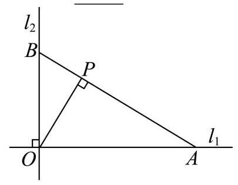

### 第40题｜平行线内正三角形距离积

中心思想：平行线内正三角形距离积。

如图， ${l}_{1}$ 、 ${l}_{2}$ 、 ${l}_{3}$ 是同一平面内三条不重合自上而下的平行直线，如果边长为 $a$ 的正三角形 ${ABC}$ 的三顶点分别在 ${l}_{1}$ 、 ${l}_{2}$ 、 ${l}_{3}$ 上，设 ${l}_{1}$ 与 ${l}_{2}$ 的距离为 ${d}_{1}$ ， ${l}_{2}$ 与 ${l}_{3}$ 的距离为 ${d}_{2}$ ，则 ${d}_{1} \cdot  {d}_{2}$ 的最大值___.

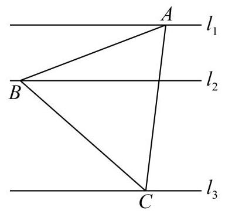

### 第41题｜折叠正三角形长度最小

中心思想：折叠正三角形长度最小。

在边长为1的正三角形ABC的边AB、AC上分别取D、E两点，若沿线段DE折叠该三角形时，顶点A恰好落在边BC 上. 则线段AD的长度的最小值为 .

### 第42题｜水滴状班徽面积

中心思想：水滴状班徽面积。

申辉中学高一(8)班设计了一个“水滴状”班徽的平面图(如图)，徽章由等腰三角形 ${ABC}$ 及以弦 ${BC}$ 和劣弧 ${BC}$ 所围成的弓形所组成，其中 ${AB} = {AC}$ ，劣弧 ${BC}$ 所在的圆为三角形的外接圆，圆心为 $O$ .

已知 $\angle {BAC} = \theta ,\theta  \in  \left( {0,\frac{\pi }{2}}\right)$ ，外接圆的半径是2，则该图形的面积为___. (用含 $\theta$ 的表达式表示)

### 第43题｜儿童游乐区面积最大

中心思想：儿童游乐区面积最大。

如图，某小区内有一块矩形区域 ${ABCD}$ ，其中 ${AB} = {40}$ 米， ${AD} = {20}$ 米，点 $E$ 、 $F$ 分别为 ${AB}$ 、 ${CD}$ 的中点，左右两个扇形区域为花坛 (两个扇形的圆心分别为 $A$ 、 $B$ ，半径均为20米)，其余区域为草坪. 现规划在草坪上修建一个三角形的儿童游乐区，且三角形的一个顶点在线段 ${EF}$ 上，另外两个顶点在线段 ${CD}$ 上，则该游乐区面积的最大值为平方米. (结果保留整数)

### 第44题｜半圆步道最大长度

中心思想：半圆步道最大长度。

如图是某公园局部的平面示意图，图中的实线部分(它由线段 ${CE},{DF}$ 与分别以 ${OC},{OD}$ 为直径的半圆弧组成) 表示一条步道.其中的点 $C, D$ 是线段 ${AB}$ 上的动点，点 $\mathrm{O}$ 为线段 ${AB},{CD}$ 的中点，点 $E, F$ 在以 ${AB}$ 为直径的半圆弧上， 且 $\angle {OCE},\angle {ODF}$ 均为直角. 若 ${AB} = 1$ 百米，则此步道的最大长度为 百米.

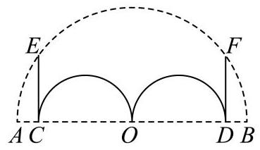

### 第45题｜城市公园栈道最短

中心思想：城市公园栈道最短。

如图，某城市公园内有一矩形空地 ${ABCD},{AB} = {300}\mathrm{\;m}$ ， ${AD} = {180}\mathrm{m}$ ，现规划在边 ${AB}$ ， ${CD}$ ， ${DA}$ 上分别取点 $E$ ， $F, G$ ,且满足 ${AE} = {EF},{FG} = {GA},$ 在 $\bigtriangleup {EAG}$ 内建造喷泉瀑布,在 $\bigtriangleup {EFG}$ 内种植花奔,其余区域铺设草坪,并修建栈道 ${EG}$ 作为观光路线(不考虑宽度)，则当 $\sin \angle {AEG} = \;$ 时，栈道 ${EG}$ 最短.

### 第46题｜拱桥修建费用最低

中心思想：拱桥修建费用最低。

某公园为了美化环境，计划建造一座拱桥DACBE，已知该桥的剖面如图所示，共包括一段圆弧形桥面 $\overset{\text{ ⏜ }}{ACB}$ 和两段长度相等的直线型桥面 $\overset{\text{ ⏜ }}{ACB}$ ,圆弧形桥面 $\overset{\text{ ⏜ }}{ACB}$ 所在圆的半径为4米,圆心 $O$ 在 ${DE}$ 上,且 ${AD}$ 和 ${BE}$ 所在直线与圆 $O$ 分别在连结点 $A$ 和 $B$ 处相切. 已知直线型桥面的修建费用是每米0.4万元，弧形桥面 $\overset{\text{ ⏜ }}{ACB}$ 的修建费用是每米2.5万元，设 $\angle {ADO} = \theta$ ，根据空间限制及桥面坡度的限制， $\theta$ 的范围为 $\arcsin \frac{1}{3} \leq  \theta  \leq  \frac{\pi }{6}$ ，则当桥面修建总费用最低时 $\theta$ 的值为 .

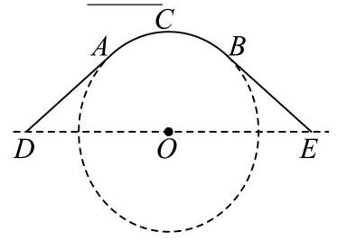

### 第47题｜半圆长方形社区绿化

中心思想：半圆长方形社区绿化。

为了打造美丽社区，某小区准备将一块由一个半圆和长方形组成的空地进行美化，如图，长方形的边 ${AB}$ 为半圆的直径，O为半圆的圆心， ${AB} = {2AD} = {200}\mathrm{m}$ ，现要将此空地规划出一个等腰三角形区域 ${PMN}$ (底边 ${MN}\bot {CD}$ ) 种植观赏树木，其余区域种植花卉. 设 $\angle {MOB} = \theta ,\theta  \in  \left( {0,\frac{\pi }{2}}\right\rbrack$ .

(1) 当 $\theta  = \frac{\pi }{3}$ 时,求 $\bigtriangleup  {PMN}$ 的面积;

(2)求三角形区域 ${PMN}$ 面积的最大值.

### 第48题｜亚运机器狗轨道总长

中心思想：亚运机器狗轨道总长。

2023年杭州亚运会首次启用机器狗搬运赛场上的运动装备. 如图所示，在某项运动赛事扇形场地 ${OAB}$ 中， $\angle {AOB} = \frac{\pi }{2},{OA} = {500}$ 米,点 $Q$ 是弧 $\overset{\text{ ⏜ }}{AB}$ 的中点, $P$ 为线段 ${OQ}$ 上一点 (不与点 $O, Q$ 重合). 为方便机器狗运输装备,现需在场地中铺设三条轨道 ${PO},{PA},{PB}$ . 记 $\angle {APQ} = \theta$ ,三条轨道的总长度为 $y$ 米.

(1) 将 $y$ 表示成 $\theta$ 的函数，并写出 $\theta$ 的取值范围；

(2) 当三条轨道的总长度最小时，求轨道 ${PO}$ 的长.

### 第49题｜休闲椅总造价最小

中心思想：休闲椅总造价最小。

如图，某城市小区有一个矩形休闲广场， ${AB} = {20}$ 米，广场的一角是半径为16米的扇形BCE绿化区域，为了使小区居民能够更好的在广场休闲放松，现决定在广场上安置两排休闲椅，其中一排是穿越广场的双人靠背直排椅MN (宽度不计)，点 $M$ 在线段 ${AD}$ 上，并且与曲线 ${CE}$ 相切；另一排为单人弧形椅沿曲线 ${CN}$ (宽度不计)摆放. 已知双人靠背直排椅的造价每米为 ${2a}$ 元，单人弧形椅的造价每米为 $a$ 元，记锐角 $\angle {NBE} = \theta$ ，总造价为 $W$ 元.

(1) 试将 $W$ 表示为 $\theta$ 的函数 $W\left( \theta \right)$ ，并写出 $\cos \theta$ 的取值范围；

(2)问当 ${AM}$ 的长为多少时，能使总造价 $W$ 最小.

### 第50题｜手电筒照射面积最大

中心思想：手电筒照射面积最大。

草坪上有一个带有围栏的边长为30m的正三角形活动区域ABC，点 $P$ 在边BC上，且 $\left| {PB}\right|  = 2\left| {PC}\right|$ ，小闵同学在该区域玩耍，他在 $P$ 处放置了一个手电筒，若手电筒发出的光线张角(任两条光线的最大夹角)为 ${60}^{ \circ  }$ ，则手电筒在 ABC内部所能照射到的地面的最大面积为 ${\mathrm{m}}^{2}$

### 第51题｜口袋公园面积或周长设计

中心思想：口袋公园面积或周长设计。

某街道规划建一座口袋公园. 如图所示，公园由扇形 ${AOC}$ 区域和三角形 ${COD}$ 区域组成. 其中 $A$ 、 $O$ 、 $D$ 三点共线,扇形半径 ${OA}$ 为 30 米. 规划口袋公园建成后,扇形 ${AOC}$ 区域将作为花草展示区,三角形 ${COD}$ 区域作为亲水平台区, 两个区域的所有边界修建休闲步道.

(1) 若 $\angle {AOC} = \frac{\pi }{3},{OD} = {2OA}$ ，求休闲步道总长(精确到米)；

(2)若 $\angle {ODC} = \frac{\pi }{6}$ ，在前期民意调查时发现，绝大部分街道居民对亲水平台区更感兴趣. 请你根据民意调查情

况,从该区域面积最大或周长最长的视角出发,选择其中一个方案,设计三角形 ${COD}$ 的形状.

### 第52题｜角形区域育苗面积最大

中心思想：角形区域育苗面积最大。

某公园的一个角形区域 ${AOB}$ 如图所示,其中 $\angle {AOB} = \frac{2\pi }{3}$ . 现拟用长度为 100 米的隔离档板 (折线 ${DCE}$ ) 与部分围墙(折线 ${DOE}$ )围成一个花卉育苗区 ${ODCE}$ ，要求满足 ${OD} = {OC} = {OE}$ .

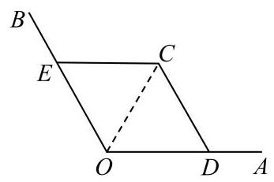

(1)设 $\angle {DOC} = \frac{\pi }{3} + \alpha \left( {-\frac{\pi }{3} < \alpha  < \frac{\pi }{3}}\right)$ ，试用 $\alpha$ 表示 ${OD}$ ；

(2)为使花卉育苗区的面积最大，应如何设计？请说明理由.

## 五、立体结构、容器与材料工程

这一组处理三维物体：圆锥、圆柱、球、仓库、容器、风铃、花盆等。排序从基本体积表面积到真实工程费用，帮助学生看到立体几何在建模题中的用途。

### 第53题｜圆柱容球体积比

中心思想：圆柱容球体积比。

著名的古希腊数学家阿基米德一生最为满意的一个数学发现就是“圆柱容球”定理:把一个球放在一个圆柱形的容器中，如果盖上容器的上盖后，球恰好与圆柱的上、下底面和侧面相切(该球也被称为圆柱的内切球)，那么此时圆柱的内切球体积与圆柱体积之比为定值，则该定值为( ).

A. $\frac{1}{2}$ B. $\frac{1}{3}$ C. $\frac{3}{4}$ D. $\frac{2}{3}$

### 第54题｜球外切圆锥表面积比

中心思想：球外切圆锥表面积比。

如果一个球的外切圆锥的高是这个球半径的3倍，那么圆锥侧面积和球的表面积的比值为 .

### 第55题｜球内接圆柱侧面积最大

中心思想：球内接圆柱侧面积最大。

如图所示，半径 $R = 2$ 的球O中有一内接圆柱，当圆柱的侧面积最大时，球的表面积与圆柱的侧面积之差等于

### 第56题｜圆锥容器放球半径

中心思想：圆锥容器放球半径。

如图，在一个轴截面为正三角形的圆锥形容器中注入高为h的水，然后，将一个铁球放入这个圆锥形的容器中， 若水面恰好和球面相切，则这个球的半径为 .

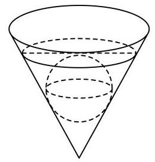

### 第57题｜三棱锥外接球表面积

中心思想：三棱锥外接球表面积。

已知球 $O$ 是三棱锥 $\mathrm{P} - \mathrm{{ABC}}$ 的外接球， $\mathrm{{PA}} = \mathrm{{PB}} = \mathrm{{PC}} = 5\sqrt{2}$ ， $\mathrm{{CA}} = 6$ ， $\mathrm{{AB}} = {10}$ ， $\mathrm{{BC}} = 8$ ，则球 $\mathrm{O}$ 的表面积是

### 第58题｜球材加工圆柱侧面积

中心思想：球材加工圆柱侧面积。

将一个半径为1的球形石材加工成一个圆柱形摆件，则该圆柱形摆件侧面积的最大值为 .

### 第59题｜爆破圆锥体积最大

中心思想：爆破圆锥体积最大。

采矿、采石或取土时，常用炸药包进行爆破，部分爆破呈圆锥漏斗形状(如图)，已知圆锥的母线长是炸药包的爆破半径R，它的值是固定的. 当炸药包埋的深度为 可使爆破体积最大.

### 第60题｜炸药包埋深度最大体积

中心思想：炸药包埋深度最大体积。

采矿、采石或取土时，常用炸药包进行爆破，部分爆破呈圆锥漏斗形状(如图)，已知圆锥的母线长是炸药包的爆破半径R，若要使爆破体积最大，则炸药包埋的深度为

炸药包

### 第61题｜正四棱锥纪念碑体积最大

中心思想：正四棱锥纪念碑体积最大。

某建筑公司欲设计一个正四棱锥形纪念碑，要求其顶点位于容积为36π立方米的球形景观灯所在球面上. 考虑到抗风、抗震等结构安全需求，侧棱长度1需满足 $2\sqrt{3} \leq  l \leq  3\sqrt{3}$ . 当纪念碑体积取得最大值时，正四棱锥的侧棱长约为 米(精确到0.01米).

### 第62题｜椭圆旋转圆柱体积最大

中心思想：椭圆旋转圆柱体积最大。

在直角坐标系 ${xOy}$ 中，一个矩形的四个顶点都在椭圆 $C : \frac{{x}^{2}}{4} + \frac{{y}^{2}}{2} = 1$ 上，将该矩形绕 $y$ 轴旋转 ${180}^{ \circ  }$ ，得到一个圆柱体，则该圆柱体的体积最大时，其侧面积为( )

A. $\frac{16\pi }{3}$ B. $\frac{{16}\sqrt{3}\pi }{3}$ C. $\frac{8\pi }{3}$ D. $\frac{{16}\sqrt{6}\pi }{9}$

### 第63题｜建筑体形系数最小

中心思想：建筑体形系数最小。

为了节能环保、节约材料，定义建筑物的“体形系数” $S = \frac{{F}_{0}}{{V}_{0}}$ ，其中 ${F}_{0}$ 为建筑物暴露在空气中的面积(单位:平方米), ${V}_{0}$ 为建筑物的体积 (单位: 立方米).

(1)若有一个圆柱体建筑的底面半径为 $R$ ，高度为 $H$ ，暴露在空气中的部分为上底面和侧面，试求该建筑体的“体形系数” $S$ ; (结果用含 $R$ 、 $H$ 的代数式表示)

(2)定义建筑物的“形状因子”为 $f = \frac{{L}^{2}}{A}$ ，其中 $A$ 为建筑物底面面积， $L$ 为建筑物底面周长，又定义 $T$ 为总建筑面积, 即为每层建筑面积之和 (每层建筑面积为每一层的底面面积). 设n为某宿舍楼的层数, 层高为3米, 则可以推导出该宿舍楼的“体形系数”为 $S = \sqrt{\frac{f \cdot  n}{T}} + \frac{1}{3n}$ . 当 $f = {18}, T = {10000}$ 时，试求当该宿舍楼的层数 $n$ 为多少时，“体形系数” $S$ 最小.

### 第64题｜挡雨棚抽象与遮挡区域

中心思想：挡雨棚抽象与遮挡区域。

某数学建模小组研究挡雨棚 (图1)，将它抽象为柱体 (图2)，底面 ${ABC}$ 与 ${A}_{1}{B}_{1}{C}_{1}$ 全等且所在平面平行， $\bigtriangleup  {ABC}$ 与 $\bigtriangleup {A}_{1}{B}_{1}{C}_{1}$ 各边表示挡雨棚支架,支架 $A{A}_{1}\text{ 、 }B{B}_{1}\text{ 、 }C{C}_{1}$ 垂直于平面 ${ABC}$ . 雨滴下落方向与外墙(所在平面)所成角为 $\frac{\pi }{6}$ (即 $\angle {AOB} = \frac{\pi }{6}$ )，挡雨棚有效遮挡的区域为矩形 $A{A}_{1}{O}_{1}O$ ( $O$ 、 ${O}_{1}$ 分别在 ${CA}$ 、 ${C}_{1}{A}_{1}$ 延长线上).

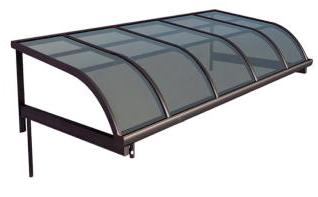

图1

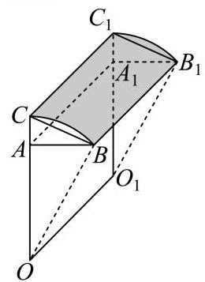

图2

图3

(1)挡雨板(曲面 $B{B}_{1}{C}_{1}C$ )的面积可以视为曲线段 ${BC}$ 与线段 $B{B}_{1}$ 长的乘积. 已知 ${OA} = {1.5}$ 米， ${AC} = {0.3}$ 米， $A{A}_{1} = 2$ 米，小组成员对曲线段 ${BC}$ 有两种假设，分别为:①其为直线段且 $\angle {ACB} = \frac{\pi }{3}$ ；②其为以 $O$ 为圆心的圆弧.请分别计算这两种假设下挡雨板的面积(精确到0.1平方米);

(2)小组拟自制 $\bigtriangleup {ABC}$ 部分的支架用于测试(图3)，其中 ${AC} = {0.6}$ 米， $\angle {ABC} = \frac{\pi }{2}$ ， $\angle {CAB} = \theta$ ，其中 $\frac{\pi }{6} < \theta  < \frac{\pi }{2}$ ,求有效遮挡区域高 ${OA}$ 的最大值.

### 第65题｜正三棱柱容器容积

中心思想：正三棱柱容器容积。

一块边长为12cm的正三角形薄铁片，按如图所示设计方案，裁剪下三个全等的四边形(每个四边形中有且只有一组对角为直角),然后用余下的部分加工制作成一个底面边长为 $x\mathrm{\;{cm}}$ 的 “无盖” 正三棱柱形容器,容积记为 $V{\mathrm{\;{cm}}}^{3}$ .

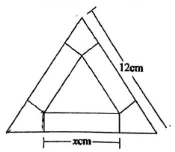

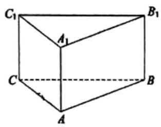

(1)若加工人员为了充分利用边角料，考虑在加工过程中，使用裁剪下的三个四边形材料恰好拼接成这个正三棱柱形容器的“顶盖”，求出此时 $x$ 的值；

(2)将 $V$ 表示为 $x$ 的函数，并求 $V$ 的最大值.

### 第66题｜半球圆柱容器建造费用

中心思想：半球圆柱容器建造费用。

某工厂拟建造如图所示的容器 (不计厚度, 长度单位: 米), 其中容器的上端为半球形, 下部为圆柱形, 该容器的体积为 $\frac{160\pi }{3}$ 立方米,且 $l \geq  {6r}$ .假设该容器的建造费用仅与其表面积有关.已知圆柱形部分侧面的建造方米2.25千元，半球形部分以及圆柱底面每平方米建造费用为 $m\left( {m > {2.25}}\right)$ 千元.设该容器的建造费用为 $y$ 千元.

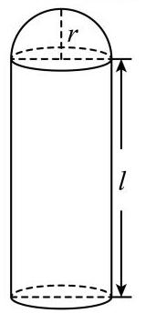

(1)写出 $y$ 关于 $r$ 的函数表达式，并求该函数的定义域；

(2)求该容器的建造费用最小时的 $r$ .

### 第67题｜风铃体积建模

中心思想：风铃体积建模。

上海市奉贤区奉城镇的古建筑万佛阁(图1)的屋檐下常系挂风铃(图2)，风吹铃动，悦耳清脆，亦称惊鸟铃， 一般一个惊鸟铃由铜铸造而成, 由铃身和铃舌组成, 为了知道一个惊鸟铃的质量, 可以通过计算该惊鸟铃的体积, 然后由物理学知识计算出该惊鸟铃的质量, 因此我们需要作出一些合理的假设:

假设1: 铃身且可近似看作由一个较大的圆锥挖去一个较小的圆锥;

假设2: 两圆锥的轴在同一条直线上;

假设3: 铃身内部有一个挂铃舌的部位的体积忽略不计.

截面图如下 (图3)，其中 ${O}_{1}{O}_{3} = {20}\mathrm{{cm}}$ ， ${O}_{2}{O}_{3} = {18}\mathrm{{cm}}$ ， ${AB} = {16}\mathrm{{cm}}$ ，则制作100个这样的惊鸟铃的铃身至少需要千克铜. (铜的密度为 ${8.9}\mathrm{g}/{\mathrm{{cm}}}^{3}$ )(结果精确到个位)

图1

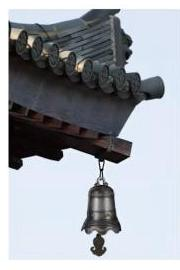

图2

图3

### 第68题｜花盆圆台母线长

中心思想：花盆圆台母线长。

徐汇滨江作为2024年上海国际鲜花展的三个主会场之一，吸引了广大市民前往观展并拍照留念.图中的花盆是种植鲜花的常见容器，它可视作两个圆台的组合体，上面圆台的上、下底面直径分别为30cm和26cm，下面圆台的上、 下底面直径分别为 ${24}\mathrm{\;{cm}}$ 和 ${18}\mathrm{\;{cm}}$ ，且两个圆台侧面展开图的圆弧所对的圆心角相等.若上面圆台的高为 $8\mathrm{\;{cm}}$ ，则该花盆上、下两部分母线长的总和为 $\;\mathrm{{cm}}$ .

## 六、向量、坐标与隐含几何结构

这一组题面看起来仍是应用或图形，但核心不是现实背景，而是坐标、向量、轨迹和距离。放在最后，是因为它们更接近抽象化后的数学结构。

### 第69题｜向量坐标表示三角形面积

中心思想：向量坐标表示三角形面积。

已知 $\overrightarrow{OA} = \left( {{x}_{1},{y}_{1}}\right) ,\overrightarrow{OB} = \left( {{x}_{2},{y}_{2}}\right)$ ，且 $\overrightarrow{OA}$ 、 $\overrightarrow{OB}$ 不共线，则 $\bigtriangleup  {OAB}$ 的面积为( )

A. $\frac{1}{2}\left| {{x}_{1}{x}_{2} - {y}_{1}{y}_{2}}\right|$ B. $\frac{1}{2}\left| {{x}_{1}{y}_{2} - {x}_{2}{y}_{1}}\right|$ C. $\frac{1}{2}\left| {{x}_{1}{x}_{2} + {y}_{1}{y}_{2}}\right|$ D. $\frac{1}{2}\left| {{x}_{1}{y}_{2} + {x}_{2}{y}_{1}}\right|$

### 第70题｜向量线性组合与最短距离

中心思想：向量线性组合与最短距离。

如图所示，已知 $\bigtriangleup  {ABC}$ 满足 ${BC} = 8,{AC} = {3AB}$ ， $P$ 为 $\bigtriangleup  {ABC}$ 所在平面内一点. 定义点集 $D = \left\{  {P\left| {\;\overrightarrow{AP} = {3\lambda }\overrightarrow{AB} + \frac{1 - \lambda }{3}\overrightarrow{AC}}\right. ,\lambda  \in  \mathbf{R}}\right\}$ . 若存在点 ${P}_{0} \in  D$ ,使得对任意 $P \in  D$ ,满足 $\left| \overrightarrow{AP}\right|  \geq  \left| \overrightarrow{A{P}_{0}}\right|$ 恒成立,则 $\left| \overrightarrow{A{P}_{0}}\right|$ 的最大值为

### 第71题｜抛物线切线与梯形面积

中心思想：抛物线切线与梯形面积。

小虹同学要在边长为10的正方形纸片 ${RSNM}$ 上剪出一个等腰梯形 ${ABCD}$ 的图案，如图所示，腰 ${AB}$ 、 ${CD}$ 与正方形内的抛物线 $\Gamma$ 分别相切于 $E$ 、 $F$ 两点，其中 $\Gamma$ 的顶点 $O$ 为 ${RM}$ 的中点. 若当点 $E$ 到 ${RM}$ 的距离为4.5时， ${EF} = 6$ ，则当等腰梯形 ${ABCD}$ 的面积取到最小值时， ${EF} =$ ___.(结果保留2位小数)

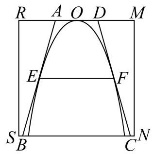
