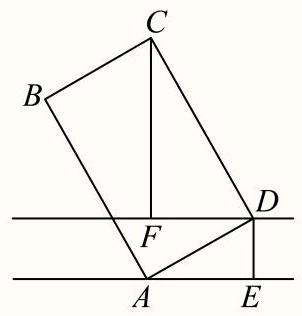
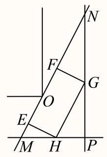

# 建模突围：实战应用篇（10题）

## 知识讲解

## 导学说明

本讲的“10题”指核心讲义中的母题与变式合计 10 题，不包含后面的分层练习。

本讲不把应用题简单堆成题库，而是按“母题 -> 相似变式 -> 模型迁移”的方式组织。每个母题负责建立一种建模方法，变式围绕母题的相似结构展开，让学生看到：题面可以变，现实背景可以变，但数学模型和解题动作是可以复用的。

## 1. 数学目标

(1)能够从实际情境中提取已知量、目标量和限制条件。

(2)能够把方向角、仰角、距离、速度、费用、面积、通行限制等现实条件转化为数学模型。

(3)能够识别同一母题模型在不同背景中的变式。

(4)能够用正弦定理、余弦定理、锐角三角函数、导数、基本不等式等工具求解模型。

(5)能够把数学结果回译为现实结论，并处理单位、近似值和实际可行性。

## 2. 课程重难点

(1)重点：掌握“审题 -> 建图 -> 设元 -> 列式 -> 求解 -> 回译”的建模流程。

(2)重点：理解母题与变式之间的相似点，而不是只记单题答案。

(3)难点：准确判断变量的取值范围，尤其是最值题和通行可行性题。

(4)难点：在复杂情境中找到主模型，避免被现实背景中的枝节信息干扰。

## 3. 核心 10 题计数

(1)母题1 + 变式1-1 + 变式1-2：测量求值模型，共 3 题。

(2)母题2 + 变式2-1 + 变式2-2：路径与费用最优模型，共 3 题。

(3)母题3 + 变式3-1：函数最值模型，共 2 题。

(4)母题4 + 变式4-1：通行临界模型，共 2 题。

合计：$3+3+2+2=10$ 题。

## 知识导图

现实情境

-> 提取对象：点、线、角、距离、速度、费用、面积、通行尺寸

-> 判断母题模型：测量求值 / 路径费用 / 函数最值 / 通行临界

-> 建立数学表达：三角关系 / 距离公式 / 目标函数 / 临界不等式

-> 求解模型：正弦定理、余弦定理、锐角三角函数、导数、辅助角

-> 回译结论：单位、精度、最优位置、是否可行

## 教法备注

## 1. 三类知识点

(1)事实性知识：

方向角、仰角、垂线段最短、速度时间关系、费用分段相加、直角过道临界状态等。

(2)概念性知识：

正弦定理、余弦定理、锐角三角函数、导数求最值、辅助角公式、函数单调性。

(3)程序性知识：

本讲以程序性知识为核心。学生需要反复训练“现实语言 -> 数学模型”的操作流程。

## 2. 本切片知识点标签

知识点：现实情境中的三角与函数建模。

知识类型：程序性知识为主，概念性知识为支撑。

## 可知识点：实战应用题的母题迁移

## EV 知识笔记

## 1. 建模题的通用流程

(1)圈目标：求值、最短、最大、最小、是否可行、方案设计。

(2)画结构：把方向、距离、路线、墙面、过道、工程尺寸画成数学图形。

(3)设变量：优先选择自然变化量，如 $x,\theta,h,r$。

(4)列模型：求值题列三角关系，最值题列函数，可行性题列临界条件。

(5)回现实：检查单位、精确度、取整方式和实际意义。

## 2. 四类母题模型

## (1)测量求值模型

关键词：观测点、方向角、仰角、测量高度、实测偏差。

基本动作：把现实角转化为三角形内角，再用三角函数、正弦定理或余弦定理求目标量。

## (2)路径与费用最优模型

关键词：尽快、最短、最省、不同速度、不同费用。

基本动作：把总距离、总时间或总费用写成一个变量的函数，再求最值。

## (3)函数最值模型

关键词：消耗最少、面积最大、长度最短、总体最优。

基本动作：先写目标函数，再用导数、辅助角或基本不等式求最值。

## (4)通行临界模型

关键词：能否通过、最大高度、最大长度、刚好卡住、临界位置。

基本动作：把“刚好能通过”看成临界状态，建立三角函数表达式，求临界值。

## 母题1：方向角观测求距离

### 教法备注

母题说明：考查方向角情境中的解三角形建模。

模型关键词：两个观测点、一个目标点、已知基线、方向角转内角。

某林场为了及时发现火情，设立了两个观测点 $A$ 和 $B$。某日两个观测点的林场人员都观测到 $C$ 处出现火情。在 $A$ 处观测到火情发生在北偏西 $40^\circ$ 方向，而在 $B$ 处观测到火情在北偏西 $60^\circ$ 方向。已知 $B$ 在 $A$ 的正东方向 $10\mathrm{km}$ 处，如图所示，则 $\left|BC-AC\right|=$ ___ $\mathrm{km}$。（精确到 $0.1\mathrm{km}$）

---

答案

$7.8$

---

解析

由题意可得

$$
AB=10,\quad \angle ABC=30^\circ,\quad \angle CAB=130^\circ.
$$

所以

$$
\angle ACB=20^\circ.
$$

在 $\triangle ABC$ 中，由正弦定理得

$$
\frac{AB}{\sin\angle ACB}
=\frac{AC}{\sin\angle ABC}
=\frac{BC}{\sin\angle BAC}.
$$

于是

$$
AC=\frac{10\sin30^\circ}{\sin20^\circ}\approx14.6,
$$

$$
BC=\frac{10\sin130^\circ}{\sin20^\circ}\approx22.4.
$$

所以

$$
\left|BC-AC\right|\approx22.4-14.6=7.8.
$$

故答案为：$7.8$。

### 教法备注

1.【选题原因】

本题建立“方向角转内角”的母题。它的价值不在计算难度，而在把生活方位语言转成三角形结构。

2.【错因预设】

(1)把北偏西角直接当作三角形内角；

(2)忘记 $B$ 在 $A$ 的正东方向；

(3)算出 $AC,BC$ 后忘记题目要求差值。

3.【讲法建议】

先只画方向图，不计算。让学生标出 $\angle CAB,\angle ABC$ 后，再进入正弦定理。

## 变式题1-1：同楼仰角测距

### 教法备注

变式说明：与母题1相似，仍然是“观测角 -> 距离”的测量模型；不同点是本题用两个仰角的差建立方程。

相似点：都需要把实际观测角转化成三角形中的边角关系。

变化点：母题1是平面方位角，靠正弦定理求两段距离；本题是竖直仰角，靠两个正切关系作差求水平距离。

迁移目标：让学生意识到“观测角求距离”不一定都用正弦定理，关键是先判断图形结构。

如图所示，小明和小宁家都住在东方明珠塔附近的同一幢楼上，小明家在 $A$ 层，小宁家位于小明家正上方的 $B$ 层，已知 $AB=a$。小明在家测得东方明珠塔尖的仰角为 $\alpha$，小宁在家测得东方明珠塔尖的仰角为 $\beta$，则他俩所住的这幢楼与东方明珠塔之间的距离 $d=$ ___。

答案

$$
d=\frac{a}{\tan\alpha-\tan\beta}.
$$

解析

分别过点 $A,B$ 作到塔身所在直线的水平距离。由于两人住在同一幢楼上，水平距离均为 $d$。

由正切定义可得，塔尖相对 $A$ 点的竖直高度为 $d\tan\alpha$，相对 $B$ 点的竖直高度为 $d\tan\beta$。

两者高度差正好为 $AB=a$，所以

$$
d\tan\alpha-d\tan\beta=a.
$$

因此

$$
d=\frac{a}{\tan\alpha-\tan\beta}.
$$

### 教法备注

本题要强调“同一水平距离 $d$”是建模关键。学生若能看出两个仰角共用同一个水平距离，就能自然列出高度差方程。

## 变式题1-2：广告牌仰角测长

### 教法备注

变式说明：与母题1相似，都是通过观测角求实际长度；不同点是本题包含“设计模型”和“实测修正模型”两层。

相似点：都从两个观测位置出发，通过角度信息确定未知长度。

变化点：母题1中目标点位置固定在平面图内；本题第一问是理想铅垂模型，第二问是施工偏差后的普通三角形模型。

迁移目标：训练学生判断“同一个题干中不同小问可能对应不同模型”，不能机械套第一问的直角三角形。

如图，某公司要在 $A$、$B$ 两地连线上的定点 $C$ 处建造广告牌 $CD$，其中 $D$ 为顶端，$AC=35$ 米，$CB=80$ 米。设 $A$、$B$ 在同一水平面上，从 $A$ 和 $B$ 看 $D$ 的仰角分别为 $\alpha$ 和 $\beta$。

(1)设计中 $CD$ 是铅垂方向，若要求 $\alpha\ge2\beta$，问 $CD$ 的长至多为多少？（结果精确到 $0.01$ 米）

(2)施工完成后，$CD$ 与铅垂方向有偏差。现在实测得 $\alpha=38.12^\circ,\beta=18.45^\circ$，求 $CD$ 的长。（结果精确到 $0.01$ 米）

答案

(1) $CD\approx28.28\mathrm{m}$。

(2) $CD\approx26.93\mathrm{m}$。

解析

(1)设计中 $CD$ 是铅垂方向，所以

$$
\tan\alpha=\frac{CD}{35},\quad \tan\beta=\frac{CD}{80}.
$$

由 $\alpha\ge2\beta$ 得

$$
\tan\alpha\ge\tan2\beta.
$$

于是

$$
\frac{CD}{35}\ge
\frac{2\cdot\frac{CD}{80}}{1-\left(\frac{CD}{80}\right)^2}.
$$

解得

$$
CD\le20\sqrt2.
$$

所以 $CD$ 的长至多约为 $28.28$ 米。

(2)实测时 $CD$ 不一定铅垂。先在 $\triangle ADB$ 中求 $AD$。

$$
AB=35+80=115,
$$

$$
\angle ADB=180^\circ-38.12^\circ-18.45^\circ=123.43^\circ.
$$

由正弦定理得

$$
\frac{115}{\sin123.43^\circ}
=\frac{AD}{\sin18.45^\circ},
$$

所以

$$
AD\approx43.61.
$$

再在 $\triangle ACD$ 中，由余弦定理得

$$
CD^2=35^2+AD^2-2\cdot35\cdot AD\cos38.12^\circ.
$$

因此

$$
CD\approx26.93.
$$

### 教法备注

本题的教学重点是区分两问模型。第一问中 $CD$ 是铅垂高度；第二问中 $CD$ 是偏斜后的广告牌实际长度，不能继续用直角三角形直接求。

## 母题2：海陆联运最短时间

### 教法备注

母题说明：考查不同速度下的分段路径最短时间模型。

模型关键词：海陆联运、不同速度、登船点、总时间函数。

如图所示，$AB$ 为沿海岸的高速路，海岛上码头 $O$ 离高速路最近点 $B$ 的距离是 $120\mathrm{km}$，在距离 $B$ 点 $300\mathrm{km}$ 的 $A$ 处有一批药品要尽快送达海岛。现要用海陆联运的方式运送这批药品，设登船点 $C$ 到 $B$ 的距离为 $x$，已知汽车速度为 $100\mathrm{km/h}$，快艇速度为 $50\mathrm{km/h}$。（参考数据：$\sqrt3\approx1.7$）

(1)写出运输时间 $t(x)$ 关于 $x$ 的函数；

(2)当 $C$ 选在何处时运输时间最短？

答案

(1)

$$
t(x)=\frac{\sqrt{14400+x^2}}{50}+\frac{300-x}{100},\quad 0\le x<300.
$$

(2)当点 $C$ 选在距 $B$ 点约 $68\mathrm{km}$ 处时运输时间最短。

解析

由题意知

$$
OC=\sqrt{120^2+x^2},\quad AC=300-x.
$$

所以总时间为

$$
t(x)=\frac{OC}{50}+\frac{AC}{100}
=\frac{\sqrt{14400+x^2}}{50}+\frac{300-x}{100}.
$$

求导得

$$
t'(x)=\frac{x}{50\sqrt{120^2+x^2}}-\frac1{100}.
$$

令 $t'(x)=0$，得

$$
2x=\sqrt{120^2+x^2},
$$

解得

$$
x=40\sqrt3\approx68.
$$

当 $0<x<40\sqrt3$ 时，$t'(x)<0$；当 $40\sqrt3<x<300$ 时，$t'(x)>0$。所以此时总时间最短。

### 教法备注

1.【选题原因】

本题建立“分段路径 + 不同速度”的母题。学生要意识到最短时间不等于最短路程。

2.【错因预设】

(1)把目标函数写成总路程；

(2)把水路距离误写成 $120+x$；

(3)求出 $x$ 后没有说明登船点的现实位置。

3.【讲法建议】

先追问：为什么不直接从 $B$ 下水？让学生体会汽车速度和快艇速度不同会改变最优点。

## 变式题2-1：供水站费用最省

### 教法备注

变式说明：与母题2相似，都是“分段成本最优”；不同点是母题2按时间建模，本题按费用建模。

相似点：都把总目标量写成两段之和，并用一个位置变量控制两段长度。

变化点：母题2的两段权重来自速度，目标函数是时间；本题的两段权重来自单价，目标函数是费用。

迁移目标：让学生把“不同速度”和“不同费用”统一看成“不同权重下的路径优化”。

如下图所示，甲工厂位于一直线河岸的岸边 $A$ 处，乙工厂与甲工厂在河的同侧，且位于离河岸 $40\mathrm{km}$ 的 $B$ 处，河岸边 $D$ 处与 $A$ 处相距 $50\mathrm{km}$，其中 $BD\perp AD$。两家工厂要在此岸边建一个供水站 $C$，从供水站到甲工厂和乙工厂的水管费用分别为每千米 $3a$ 元和 $5a$ 元，问供水站 $C$ 建在岸边距离 $A$ 处 ___ $\mathrm{km}$ 才能使水管费用最省？

答案

$20$

解析

设 $CD=x\mathrm{km}$，则

$$
AC=50-x,\quad BC=\sqrt{x^2+40^2}.
$$

总费用为

$$
y=3a(50-x)+5a\sqrt{x^2+40^2},\quad 0<x<50.
$$

求导得

$$
y'=-3a+\frac{5ax}{\sqrt{x^2+40^2}}.
$$

令 $y'=0$，得 $x=30$。由单调性可知，此时费用最小。

所以

$$
AC=50-30=20.
$$

故答案为：$20$。

### 教法备注

本题的相似点在于“总量由两段组成”：母题2是总时间，本题是总费用。讲授时要让学生说清楚每一项对应哪一段现实路径。

## 变式题2-2：救生栈道最短抵达

### 教法备注

变式说明：与母题2相似，都是最短路径问题；不同点是本题不是求函数最值，而是先判断“到线段的最短距离”为垂线段。

相似点：都要先识别现实语言中的“尽快/最短”对应什么数学目标。

变化点：母题2的最优点在一条路线中变化，需要求导；本题最短路径直接由垂线段给出，关键是找到垂足对应的三角关系。

迁移目标：训练学生先判断最短模型类型，再决定是否需要设变量求导。

某临海地区为保障游客安全修建了海上救生栈道，如图，线段 $BC$、$CD$ 是救生栈道的一部分，其中 $BC=300\mathrm{m}$，$CD=800\mathrm{m}$，$B$ 在 $A$ 的北偏东 $30^\circ$ 方向，$C$ 在 $A$ 的正北方向，$D$ 在 $A$ 的北偏西 $80^\circ$ 方向，且 $\angle B=90^\circ$。若救生艇在 $A$ 处载上遇险游客需要尽快抵达救生栈道 $B-C-D$，则最短距离为 ___ $\mathrm{m}$。（结果精确到 $1\mathrm{m}$）

答案

$475$

解析

作 $AE\perp CD$ 于点 $E$，最短距离为 $AE$。

在直角三角形 $\triangle ABC$ 中，

$$
AC=\frac{BC}{\sin30^\circ}=600.
$$

结合 $\triangle ADC$ 中的角度关系，可得

$$
\sin D=\frac{3\sin80^\circ}{4},
$$

从而

$$
\cos\angle EAD\approx0.735.
$$

进一步得到

$$
\cos\angle CAE\approx0.79135.
$$

所以

$$
AE=AC\cdot\cos\angle CAE\approx600\times0.79135\approx475.
$$

### 教法备注

本题训练“先判断目标，再计算”。看到“尽快抵达栈道”，不能立刻连端点，而要先判断最近点是否为垂足。

## 母题3：斜坡体能消耗最少

### 教法备注

母题说明：考查现实消耗问题中的函数最值建模。

模型关键词：总体消耗、单位消耗、路程长度、导数求最小值。

公园修建斜坡，假设斜坡起点在水平面上，斜坡与水平面的夹角为 $\theta$，斜坡终点距离水平面的垂直高度为 $4$ 米，游客每走一米消耗的体能为 $(1.025-\cos\theta)$。要使游客从斜坡底走到斜坡顶端所消耗的总体能最少，则 $\theta=$ ___。

答案

$$
\arccos\frac{40}{41}
$$

解析

斜坡长度为

$$
L=\frac4{\sin\theta},\quad 0<\theta<\frac{\pi}{2}.
$$

所以总体能消耗为

$$
y=f(\theta)=L(1.025-\cos\theta)
=\frac{4.1-4\cos\theta}{\sin\theta}.
$$

求导得

$$
f'(\theta)=\frac{4-4.1\cos\theta}{\sin^2\theta}.
$$

令 $f'(\theta)=0$，得

$$
\cos\theta=\frac{40}{41}.
$$

由单调性可知，当

$$
\theta=\arccos\frac{40}{41}
$$

时，总体能消耗最少。

### 教法备注

1.【选题原因】

本题建立“目标量 = 单位量 × 总量”的函数最值母题。

2.【错因预设】

(1)把斜坡长度误写成 $4\sin\theta$；

(2)只写函数，不写 $\theta$ 的范围；

(3)求出临界点后不判断单调性。

3.【讲法建议】

板书先写现实关系：

$$
\text{总体能}=\text{每米消耗}\times\text{斜坡长度}.
$$

再进入函数求导。

## 变式题3-1：景区步道长度最短

### 教法备注

变式说明：与母题3相似，都是先建立目标函数再求最值；不同点是本题目标是几何路径长度。

相似点：都要先把现实目标量表示成一个变量的函数，再通过单调性求最值。

变化点：母题3的变量是斜坡角，目标是体能消耗；本题变量是步道与边界形成的角，目标是步道长度。

迁移目标：让学生把“消耗最少”“路径最短”统一看成函数最值问题，同时注意变量范围来自实际图形边界。

如图，现对某景区一长 $AB=600\mathrm{m}$，宽 $AD=360\mathrm{m}$ 的矩形空地进行建设。规划在边 $AB,AD$ 上分别取点 $M,N$ 修建人行步道，且满足点 $A$ 关于步道 $MN$ 的对称点 $E$ 在边 $DC$ 上。在 $\triangle AMN$ 内种植花卉，在 $\triangle EMN$ 内搭建娱乐设施，其余区域规划为露营区，则人行步道 $MN$ 的最短距离为 ___ $\mathrm{m}$。（结果精确到 $1\mathrm{m}$）

答案

$468$

解析

由对称可知

$$
\operatorname{Rt}\triangle MAN\cong \operatorname{Rt}\triangle MEN.
$$

设

$$
\angle AMN=\theta,\quad 0<\theta<\frac{\pi}{2}.
$$

由图形关系可得

$$
AN=\frac{180}{\cos^2\theta},
$$

所以

$$
MN=\frac{AN}{\sin\theta}
=\frac{180}{\sin\theta\cos^2\theta}.
$$

令 $t=\sin\theta$，则

$$
MN=\frac{180}{t(1-t^2)}.
$$

结合题目边界条件可得

$$
\frac{\sqrt{10}}{10}\le t\le\frac{\sqrt2}{2}.
$$

要使 $MN$ 最短，只需使

$$
t-t^3
$$

最大。令

$$
f(t)=t-t^3,
$$

则

$$
f'(t)=1-3t^2.
$$

所以 $t=\frac{\sqrt3}{3}$ 时 $f(t)$ 取最大值。

于是

$$
MN_{\min}=270\sqrt3\approx468.
$$

### 教法备注

本题和母题3的共同点是：先把现实目标量写成函数，再求最值。不同点是变量受到实际区域边界约束，不能忽略取值范围。

## 母题4：冰箱入户通行临界

### 教法备注

母题说明：考查通行可行性中的临界状态建模。

模型关键词：门高、过道宽、最大尺寸、刚好能通过。

网络购物行业通常会配备送货上门服务。小金配送客户购买的电冰箱，并获得了客户所在小区门户以及建筑转角处的平面设计示意图。

图1

图2

(1)为避免冰箱内部制冷液逆流，要求运送过程中发生倾斜时，外包装的底面与地面的倾斜角 $\alpha$ 不能超过 $\frac{\pi}{4}$。外包装看作长方体，如图1所示，记长方体的纵截面为矩形 $ABCD$，$AD=0.8\mathrm{m}$，$AB=2.4\mathrm{m}$，而客户家门高度为 $2.3$ 米。若以倾斜角 $\alpha=\frac{\pi}{4}$ 的方式进客户家门，小金能否将冰箱运送入客户家中？

(2)旧冰箱水平推运时遇到一处直角过道，如图2所示，过道宽为 $1.8$ 米。记此冰箱水平截面为矩形 $EFGH$，$EH=1.2\mathrm{m}$。设 $\angle PHG=\beta$，当冰箱被卡住时，用 $\beta$ 表示冰箱高度 $EF$ 的长，并求出 $EF$ 的最小值。按此种方式推运的旧冰箱，其高度的最大值是多少？（结果精确到 $0.1\mathrm{m}$）

答案

(1)能。

(2) $EF_{\min}=\frac{18\sqrt2-12}{5}\approx2.69$，实际可推运高度最大约为 $2.6\mathrm{m}$。

解析

(1)倾斜后的实际高度为

$$
h=0.8\sin\frac{\pi}{4}+2.4\cos\frac{\pi}{4}
=\frac{8\sqrt2}{5}\approx2.26.
$$

因为 $2.26<2.3$，所以能进入客户家门。

(2)延长 $EF$ 与直角走廊边相交于 $M,N$。

$$
MN=\frac{1.8}{\sin\beta}+\frac{1.8}{\cos\beta},
$$

$$
EM=\frac{1.2}{\tan\beta},\quad FN=1.2\tan\beta.
$$

所以

$$
EF=MN-EM-FN
$$

$$
=\frac{1.8}{\sin\beta}+\frac{1.8}{\cos\beta}
-1.2\left(\tan\beta+\frac1{\tan\beta}\right).
$$

整理得

$$
EF=\frac{1.8(\sin\beta+\cos\beta)-1.2}{\sin\beta\cos\beta}.
$$

令 $t=\sin\beta+\cos\beta$，则 $1<t\le\sqrt2$，且

$$
\sin\beta\cos\beta=\frac{t^2-1}{2}.
$$

因此

$$
EF=\frac65\cdot\frac{3t-2}{t^2-1}.
$$

该式的最小值在 $t=\sqrt2$ 时取得，所以

$$
EF_{\min}=\frac{18\sqrt2-12}{5}\approx2.69.
$$

考虑实际通过高度，最大约为 $2.6\mathrm{m}$。

### 教法备注

1.【选题原因】

本题建立“刚好通过”的临界模型。学生要学会把生活中的“能不能过”转化为数学临界值。

2.【错因预设】

(1)倾斜高度的正弦、余弦项写反；

(2)不能理解为什么要研究“卡住时”的状态；

(3)把 $2.69$ 直接四舍五入成 $2.7$，忽略“能通过最大高度”要向下取。

3.【讲法建议】

强调“临界值”的意义：低于临界值能通过，高于临界值不一定能通过。

## 变式题4-1：直角过道设备通行

### 教法备注

变式说明：与母题4相似，仍然是直角过道通行临界模型；不同点是本题求设备最大长度。

相似点：都要把“能否通过”转化为“临界位置下尺寸达到极限”。

变化点：母题4限制的是冰箱高度和过道宽度；本题限制的是设备宽度与可通过长度。

迁移目标：让学生形成通行类问题的固定判断：先找刚好卡住的状态，再用角度变量表达临界尺寸。

某建筑物内一个水平直角型过道如图所示，两过道的宽度均为 $3$ 米，有一个水平截面为矩形的设备需要水平通过直角型过道。若该设备水平截面矩形的宽 $BC$ 为 $1$ 米，则该设备能水平通过直角型过道的长 $AB$ 不超过 ___ 米。

答案

$$
6\sqrt2-2.
$$

解析

建立直角坐标系，令设备在临界位置时长为 $AB=r$，并设

$$
\angle OAB=\theta,\quad 0<\theta<\frac{\pi}{2}.
$$

根据直角过道宽度与设备宽度的限制，可以把临界长度表示为关于

$$
t=\sin\theta+\cos\theta
$$

的函数。由于

$$
1\le t\le\sqrt2,
$$

整理后可得临界长度的最小允许值在 $t=\sqrt2$ 时取得。

因此设备能水平通过直角型过道的长不超过

$$
2(3\sqrt2-1)=6\sqrt2-2.
$$

### 教法备注

这道变式和母题4的相似点是“通行问题都看临界状态”；不同点是母题4通过冰箱高度限制，本题通过过道宽度与设备宽度限制。讲解时可以把“最大可通过尺寸”统一概括为“临界函数的最小值”。

## 分层练习

【说明】以下题目不计入核心 10 题，用于课后巩固与迁移。

## 基础

1. 仰角测高模型

如图，某建筑物 $OP$ 垂直于地面，从地面点 $A$ 处测得建筑物顶部 $P$ 的仰角为 $30^\circ$，从地面点 $B$ 处测得建筑物顶部 $P$ 的仰角为 $45^\circ$。已知 $A$、$B$ 相距 $100$ 米，$\angle AOB=60^\circ$，则建筑物 $OP$ 高度约为 ___ 米。（保留一位小数）

答案：$66.4$。

训练目的：巩固“高度作公共未知量，再用余弦定理列方程”。

2. 比例估算模型

2024年10月30日“神舟十九号”载人飞船发射成功。在飞船竖直升空过程中，某位记者用照相机在同一位置以同一姿势连续拍照两次。已知“神舟十九号”飞船船体实际长度为 $H$，且在照片上飞船船体长度为 $h$。比较两张照片，相对于照片中的同一固定参照物，飞船上升了 $m$。假设该记者连按拍照键间的反应时间为 $t$，并忽略相机曝光时长，若用平均速度估算瞬时速度，则拍照时飞船的瞬时速度为 ___。（用含有 $H,h,m,t$ 的式子表示）

答案：

$$
\frac{Hm}{ht}.
$$

训练目的：巩固“实际量与照片量按同一比例换算”的建模方法。

3. 面积函数模型

如图所示，正方形 $ABCD$ 是一块边长为 $4$ 的工程用料，阴影部分所示是被腐蚀的区域，其余部分完好，曲线 $MN$ 为以 $AD$ 为对称轴的抛物线的一部分，$DM=DN=3$。工人师傅现要从完好的部分中截取一块矩形原料 $BQPR$，当其面积有最大值时，$AQ$ 的长为 ___。

答案：

$$
\frac{4+\sqrt7}{3}.
$$

训练目的：巩固“建系 -> 写面积函数 -> 导数求最值”。

## 综合

1. 大厦高度估算模型

中企联合大厦是奉贤区的第一高楼。某数学建模兴趣小组实地测量，选取同一水平面上的三个点 $B$、$C$、$O$ 作为测量基点。设大厦最高点为 $A$，在点 $B$ 处测得点 $A$ 的仰角为 $\angle ABO=71.5^\circ$，在点 $C$ 处测得点 $A$ 的仰角为 $\angle ACO=44^\circ$，又测得 $BC=221$ 米，$\angle BOC=119^\circ$。假设：

①直线 $AO$ 垂直于平面 $OBC$；

②平面 $OBC$ 到地面的距离等于测角仪高度，在计算过程中测角仪高度忽略不计；

③其它次要因素忽略不计。

根据以上信息估算大厦高度约 ___ 米。（结果保留整数）

答案：$180$。

训练目的：巩固“空间测量问题平面化”。

2. 扇形绿地最小破坏模型

如图，某处有一块圆心角为 $\frac{2}{3}\pi$ 的扇形绿地 $AOB$，扇形的半径为 $20$ 米，$AB$ 是一条原有的人行直路。由于工程建设需要，现要在绿地中建一条直路 $OC$，以便在图中阴影部分区域分类堆放物料。为了尽量减少对绿地的破坏（不计路宽），则原直路 $AB$ 与新直路 $OC$ 的交叉点 $D$ 到 $O$ 的距离为 ___ 米。

答案：

$$
10\sqrt2.
$$

训练目的：巩固“面积函数 + 三角最值”。

3. 公园步道长度最小模型

某地要建造一个市民休闲公园长方形 $ABCD$，如图，边 $AB=2\mathrm{km}$，边 $AD=1\mathrm{km}$，其中区域 $ADE$ 开挖成一个人工湖，其他区域为绿化风景区。经测算，人工湖在公园内的边界是一段圆弧，且 $A$、$D$ 位于圆心 $O$ 的正北方向，$E$ 位于圆心 $O$ 的北偏东 $60^\circ$ 方向。拟定在圆弧 $P$ 处修建一座渔人码头，供游客湖中泛舟，并在公园的边 $DC$、$CB$ 开设两个门 $M$、$N$，修建步行道 $PM$、$PN$ 通往渔人码头，且 $PM\perp CD$、$PN\perp CB$，则步行道 $PM$、$PN$ 长度之和的最小值是 ___ km。（精确到 $0.001$）

答案：$1.172$。

训练目的：巩固“坐标建模 + 辅助角求最值”。

## 挑战

1. 轨道滑杆面积范围模型

如图，两条足够长且互相垂直的轨道 $l_1,l_2$ 相交于点 $O$，一根长度为 $8$ 的直杆 $AB$ 的两端点 $A,B$ 分别在 $l_1,l_2$ 上滑动（$A,B$ 两点不与 $O$ 点重合，轨道与直杆的宽度等因素均可忽略不计），直杆上的点 $P$ 满足 $OP\perp AB$，则 $\triangle OAP$ 面积的取值范围是 ___。

答案：

$$
(0,6\sqrt3].
$$

训练目的：巩固“几何动态问题函数化”。

2. 流星高度测量模型

10世纪阿拉伯天文学家阿尔·库希设计出一种方案，通过两个观察者异地同时观测同一颗流星来测定流星的高度。如图，设有两个观察者在地球上 $A$、$B$ 两地同时观察到一颗流星 $S$，仰角分别是 $\alpha$ 和 $\beta$（$MA$、$MB$ 表示当地的地平线）。设 $\alpha=30^\circ,\beta=45^\circ,\overset{\frown}{AB}=500\mathrm{km}$，地球的半径 $R=6371\mathrm{km}$，则流星的高度约为 ___ $\mathrm{km}$。（精确到 $1\mathrm{km}$）

答案：$197$。

训练目的：巩固“曲面背景下的三角测量模型”。

## 教师使用建议

(1)第一课时：母题1及变式1-1、1-2，形成测量求值模型。

(2)第二课时：母题2及变式2-1、2-2，形成路径与费用最优模型。

(3)第三课时：母题3及变式3-1，形成函数最值模型。

(4)第四课时：母题4及变式4-1，形成通行临界模型。

(5)课后练习：按基础、综合、挑战三层布置，不计入核心 10 题。
