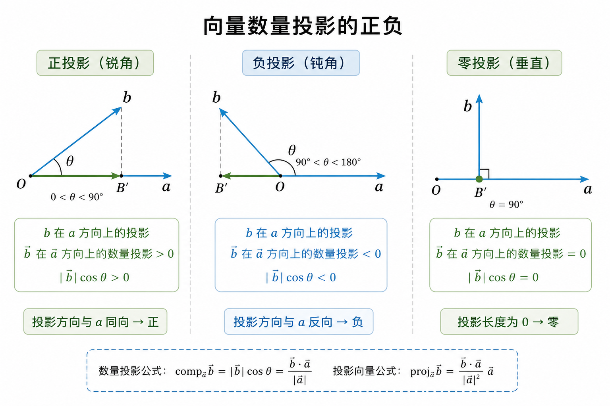
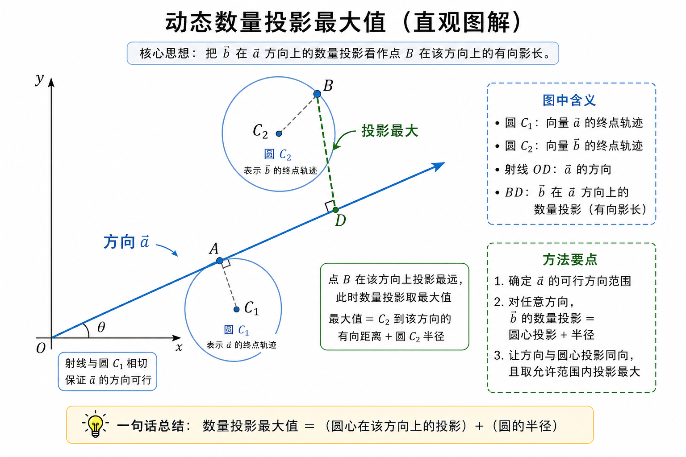
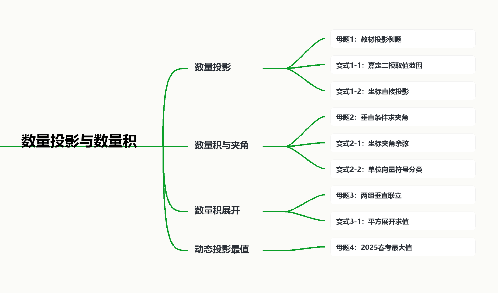

# **数量投影与数量积**

## **知识讲解**

### **1. 本版说明**

本讲以“数量投影”和“数量积”为主线，目标不是单纯背公式，而是让学生把三件事连起来：

- 数量投影是“沿某个方向看长度”，可以为正、为负、为零；
- 数量积是“一个向量的长度乘另一个向量在它方向上的数量投影”；
- 垂直、夹角、长度平方、最值问题都可以转化为数量积方程。

本版题源优先采用上海真题、春考、一模二模，再用沪教版教材例题与练习补足概念层。全库原始命中明细见同目录 `数量投影与数量积全库检索命中明细.txt`，去重候选题见 `数量投影与数量积候选题源表.md`。

### **2. 概念与公式**

设 $\vec a\ne \vec0$，$\theta=\langle \vec a,\vec b\rangle$。

向量 $\vec b$ 在 $\vec a$ 方向上的**数量投影**为

$$
\operatorname{comp}_{\vec a}\vec b=|\vec b|\cos\theta=\frac{\vec b\cdot \vec a}{|\vec a|}.
$$

向量 $\vec b$ 在 $\vec a$ 方向上的**投影向量**为

$$
\operatorname{proj}_{\vec a}\vec b
=\frac{\vec b\cdot\vec a}{|\vec a|^2}\vec a.
$$

两个向量的数量积定义为

$$
\vec a\cdot\vec b=|\vec a||\vec b|\cos\theta.
$$

若 $\vec a=(x_1,y_1)$，$\vec b=(x_2,y_2)$，则

$$
\vec a\cdot\vec b=x_1x_2+y_1y_2,\qquad
\cos\theta=\frac{\vec a\cdot\vec b}{|\vec a||\vec b|}.
$$

特别地，

$$
\vec a\perp\vec b\Longleftrightarrow \vec a\cdot\vec b=0,\qquad
|\vec a\pm\vec b|^2=|\vec a|^2\pm2\vec a\cdot\vec b+|\vec b|^2.
$$

### **3. 课堂判断顺序**

- **先分清对象**：题目问“数量投影”还是“投影向量”。前者是数，后者是向量。
- **再选计算形式**：有坐标用坐标，有模和夹角用定义，有垂直就列数量积为 0。
- **遇到最值看几何意义**：$\vec b$ 在 $\vec a$ 方向上的数量投影，就是点 $B$ 到 $\vec a$ 方向轴上的有向投影长度。

### **4. 知识点直观图解**

下面两张图用于建立直观。生图负责帮助学生先“看见”投影方向和最值结构；正式计算仍以本页公式和后面解析为准。

#### **图解1：数量投影的正、负、零**

{width=95%}

这张图要让学生抓住三个判断：

- 锐角时，投影向量与 $\vec a$ 同向，数量投影为正；
- 钝角时，投影向量与 $\vec a$ 反向，数量投影为负；
- 垂直时，投影长度为 $0$，数量投影为 $0$。

#### **图解2：动态数量投影最值**

{width=95%}

这张图对应母题4的思路：如果 $\vec b$ 的终点在一个圆上运动，那么在固定方向上的数量投影最大值可以看成

$$
\text{圆心在该方向上的数量投影}+\text{半径}.
$$

如果 $\vec a$ 的方向也受限制，先确定 $\vec a$ 的可行方向范围，再在允许方向中取使投影最大的方向。

### **5. 本讲方法笔记：按题素拆题**

一道题不是一个不可拆的整体，而是由若干个“题素”拼成的。所谓题素，就是题目里最小的知识与方法单元。本讲常见题素包括：数量投影对象判断、点乘公式、垂直条件、夹角余弦、长度平方展开、辅助角化简、圆上投影最值。复杂题只是把多个题素叠在一起，先拆开，题就会变小。

1. **投影对象分层**  
   $\operatorname{comp}_{\vec a}\vec b$ 是数量，$\operatorname{proj}_{\vec a}\vec b$ 是向量。若题目问“在 $\vec a$ 方向上的投影”，要结合题意判断是“数量投影”还是“投影向量”。

2. **坐标题优先公式化**  
   若 $\vec a=(x_1,y_1)$，$\vec b=(x_2,y_2)$，则先算 $\vec a\cdot\vec b=x_1x_2+y_1y_2$。求 $\vec a$ 在 $\vec b$ 方向上的数量投影时，分母是 $|\vec b|$：

   $$
   \operatorname{comp}_{\vec b}\vec a=\frac{\vec a\cdot\vec b}{|\vec b|}.
   $$

3. **垂直条件代数化**  
   题目出现“垂直”，立即想到数量积为 $0$。例如 $(\vec a-\vec b)\perp\vec a$ 应先写成 $(\vec a-\vec b)\cdot\vec a=0$。

4. **长度平方展开**  
   遇到 $|\vec a+\vec b|$、$|2\vec a-\vec b|$ 一类表达式，优先平方并展开，减少夹角图形依赖：

   $$
   |\lambda\vec a+\mu\vec b|^2=\lambda^2|\vec a|^2+2\lambda\mu\,\vec a\cdot\vec b+\mu^2|\vec b|^2.
   $$

5. **动态最值几何化**  
   数量投影最值题常把模长条件转成圆或球，再看“沿某个方向投影最远”。母题4和变式4-1都属于这一类，只是一个从图形入手，一个从二次式最小值入手。

## **知识导图**

## **知识点1：数量投影**

## **母题1：投影向量与数量投影**

\begin{QuestionBox}

【来源】\hyperlink{src-c01}{教材例 1}

已知向量 $\vec a$ 与 $\vec b$ 的夹角为 $\dfrac{2\pi}{3}$，且 $|\vec a|=3$，$|\vec b|=4$。求 $\vec b$ 在 $\vec a$ 方向上的投影向量与数量投影。

\end{QuestionBox}

\begin{AnswerBox}

投影向量为 $-\dfrac23\vec a$，数量投影为 $-2$。

\end{AnswerBox}

\begin{AnalysisBox}

设 $\vec a_0=\dfrac{\vec a}{|\vec a|}$ 是 $\vec a$ 方向上的单位向量。

数量投影为

$$
|\vec b|\cos\langle\vec a,\vec b\rangle
=4\cos\frac{2\pi}{3}=-2.
$$

因此投影向量为

$$
|\vec b|\cos\langle\vec a,\vec b\rangle\vec a_0
=-2\cdot\frac{\vec a}{3}
=-\frac23\vec a.
$$

注意负号的含义：$\dfrac{2\pi}{3}$ 是钝角，所以 $\vec b$ 在 $\vec a$ 方向上的投影与 $\vec a$ 反向。

\end{AnalysisBox}

\begin{TeachBox}

本题的题素很少，但概念边界很重要：先算数量投影这个“数”，再把它乘以 $\vec a$ 方向的单位向量得到投影向量。收获是把“数”和“向量”分层处理；负号不是计算装饰，而是在说明投影方向与 $\vec a$ 反向。

\end{TeachBox}

\vspace{0.45em}
\hrule
\vspace{0.95em}

## **变式1-1：数量投影的取值范围**

\begin{QuestionBox}

【来源】\hyperlink{src-c02}{二模嘉定 9}

已知向量 $\vec a=(\cos x,\sin x)$，$\vec b=(3,\sqrt3)$，且 $x\in\left[0,\dfrac{\pi}{2}\right]$，求 $\vec a$ 在 $\vec b$ 方向上的数量投影的取值范围。

\end{QuestionBox}

\begin{AnswerBox}

$\left[\dfrac12,1\right]$。

\end{AnswerBox}

\begin{AnalysisBox}

数量投影为

$$
\frac{\vec a\cdot\vec b}{|\vec b|}
=\frac{3\cos x+\sqrt3\sin x}{\sqrt{3^2+(\sqrt3)^2}}
=\frac{3\cos x+\sqrt3\sin x}{2\sqrt3}.
$$

将分子化为辅助角形式：

$$
3\cos x+\sqrt3\sin x=2\sqrt3\cos\left(x-\frac{\pi}{6}\right),
$$

所以数量投影为

$$
\cos\left(x-\frac{\pi}{6}\right).
$$

因为 $x\in\left[0,\dfrac{\pi}{2}\right]$，所以

$$
x-\frac{\pi}{6}\in\left[-\frac{\pi}{6},\frac{\pi}{3}\right].
$$

在该区间上，$\cos\left(x-\dfrac{\pi}{6}\right)$ 的最大值为 $1$，最小值为 $\dfrac12$，故取值范围为

$$
\left[\frac12,1\right].
$$

\end{AnalysisBox}

\begin{TeachBox}

本题由四个题素叠加：数量投影公式、坐标点乘、辅助角化简、三角函数区间取值。它看起来比母题大，是因为多了“函数化”和“取值范围”两个包装。收获是先把投影写成 $\cos\left(x-\dfrac{\pi}{6}\right)$，后面才是真正的一元三角函数取值问题；同时要提醒分母是方向向量的模 $|\vec b|$。

\end{TeachBox}

\vspace{0.45em}
\hrule
\vspace{0.95em}

## **变式1-2：坐标向量直接求数量投影**

\begin{QuestionBox}

【来源】\hyperlink{src-c03}{二模汇编投影题}

向量 $\vec a=(310,118)$ 在向量 $\vec b=(0,2025)$ 方向上的数量投影是 $\underline{\hspace{2.5em}}$。

\end{QuestionBox}

\begin{AnswerBox}

$118$。

\end{AnswerBox}

\begin{AnalysisBox}

由数量投影公式，

$$
\operatorname{comp}_{\vec b}\vec a=\frac{\vec a\cdot\vec b}{|\vec b|}.
$$

因为

$$
\vec a\cdot\vec b=310\cdot0+118\cdot2025=118\cdot2025,
\qquad |\vec b|=2025,
$$

所以

$$
\frac{\vec a\cdot\vec b}{|\vec b|}=118.
$$

\end{AnalysisBox}

\begin{TeachBox}

本题的题素只有坐标点乘和方向向量长度，适合作为快速校准题。收获是：题目问“数量投影”时答案是数 $118$；若改问“投影向量”，答案才是 $(0,118)$。

\end{TeachBox}

## **知识点2：数量积与夹角**

## **母题2：由垂直条件反求夹角**

\begin{QuestionBox}

【来源】\hyperlink{src-c04}{教材练习 A5}

设向量 $\vec a,\vec b$ 满足 $|\vec a|=1$，$|\vec b|=\sqrt2$，向量 $\vec a-\vec b$ 与 $\vec a$ 垂直。求 $\langle\vec a,\vec b\rangle$。

\end{QuestionBox}

\begin{AnswerBox}

$\dfrac{\pi}{4}$。

\end{AnswerBox}

\begin{AnalysisBox}

由 $(\vec a-\vec b)\perp\vec a$，得

$$
(\vec a-\vec b)\cdot\vec a=0.
$$

展开：

$$
\vec a\cdot\vec a-\vec b\cdot\vec a=0,
$$

所以

$$
|\vec a|^2=\vec a\cdot\vec b.
$$

代入 $|\vec a|=1$，得 $\vec a\cdot\vec b=1$。设 $\theta=\langle\vec a,\vec b\rangle$，则

$$
1=|\vec a||\vec b|\cos\theta=1\cdot\sqrt2\cos\theta.
$$

所以

$$
\cos\theta=\frac{\sqrt2}{2}.
$$

又 $\theta\in[0,\pi]$，故

$$
\theta=\frac{\pi}{4}.
$$

\end{AnalysisBox}

\begin{TeachBox}

本题的题素是“垂直 $\rightarrow$ 数量积为 $0$”“展开点乘”“用夹角公式还原角”。收获是：不要把题目当作几何图形硬想，先把垂直条件翻译成 $(\vec a-\vec b)\cdot\vec a=0$，题目就变成一条数量积方程。

\end{TeachBox}

\vspace{0.45em}
\hrule
\vspace{0.95em}

## **变式2-1：坐标求夹角余弦**

\begin{QuestionBox}

【来源】\hyperlink{src-c05}{一模黄浦 5}

已知向量 $\vec a=(0,2)$，$\vec b=(\sqrt3,1)$，求向量 $\vec a$ 与 $\vec b$ 夹角的余弦值。

\end{QuestionBox}

\begin{AnswerBox}

$\dfrac12$。

\end{AnswerBox}

\begin{AnalysisBox}

先求数量积：

$$
\vec a\cdot\vec b=0\cdot\sqrt3+2\cdot1=2.
$$

再求模：

$$
|\vec a|=2,\qquad |\vec b|=\sqrt{(\sqrt3)^2+1^2}=2.
$$

所以

$$
\cos\langle\vec a,\vec b\rangle
=\frac{\vec a\cdot\vec b}{|\vec a||\vec b|}
=\frac{2}{2\cdot2}
=\frac12.
$$

\end{AnalysisBox}

\begin{TeachBox}

本题是标准三步题素：先点乘，再求模，最后代入夹角余弦公式。收获是坐标题尽量公式化，少凭图像直觉判断。

\end{TeachBox}

\vspace{0.45em}
\hrule
\vspace{0.95em}

## **变式2-2：单位向量中的符号分类**

\begin{QuestionBox}

【来源】\hyperlink{src-c06}{一模闵行 10}

若平面上的三个单位向量 $\vec a,\vec b,\vec c$ 满足

$$
|\vec a\cdot\vec b|=\frac12,\qquad |\vec a\cdot\vec c|=\frac{\sqrt3}{2},
$$

求 $\vec b\cdot\vec c$ 的所有可能值组成的集合。

\end{QuestionBox}

\begin{AnswerBox}

$\left\{0,\dfrac{\sqrt3}{2},-\dfrac{\sqrt3}{2}\right\}$。

\end{AnswerBox}

\begin{AnalysisBox}

因为 $\vec a,\vec b,\vec c$ 都是单位向量，所以

$$
\vec a\cdot\vec b=\cos\langle\vec a,\vec b\rangle,\qquad
\vec a\cdot\vec c=\cos\langle\vec a,\vec c\rangle.
$$

取 $\vec a$ 的方向为角度 $0$ 的方向。由

$$
|\vec a\cdot\vec b|=\frac12
$$

可知 $\vec b$ 与 $\vec a$ 的有向夹角可取

$$
\pm\frac{\pi}{3},\quad \pm\frac{2\pi}{3}.
$$

由

$$
|\vec a\cdot\vec c|=\frac{\sqrt3}{2}
$$

可知 $\vec c$ 与 $\vec a$ 的有向夹角可取

$$
\pm\frac{\pi}{6},\quad \pm\frac{5\pi}{6}.
$$

于是 $\vec b$ 与 $\vec c$ 的夹角差只会给出

$$
\cos\frac{\pi}{6}=\frac{\sqrt3}{2},\qquad
\cos\frac{\pi}{2}=0,\qquad
\cos\frac{5\pi}{6}=-\frac{\sqrt3}{2}.
$$

因此

$$
\vec b\cdot\vec c\in
\left\{0,\frac{\sqrt3}{2},-\frac{\sqrt3}{2}\right\}.
$$

\end{AnalysisBox}

\begin{TeachBox}

本题的难点来自题素组合：单位向量把点乘变成余弦，绝对值会抹掉正负号，平面方向又有两侧可能。收获是不要急着算 $\vec b\cdot\vec c$，先在单位圆上列出 $\vec b$、$\vec c$ 相对 $\vec a$ 的可能方向，再看夹角差。复杂感主要来自“符号分类”而不是点乘公式本身。

\end{TeachBox}

## **知识点3：数量积展开**

## **母题3：两组垂直条件联立求夹角**

\begin{QuestionBox}

【来源】\hyperlink{src-c07}{教材练习 B6}

已知 $\vec a,\vec b$ 都是非零向量，且 $\vec a+3\vec b$ 与 $7\vec a-5\vec b$ 垂直，$\vec a-4\vec b$ 与 $7\vec a-2\vec b$ 垂直。求 $\vec a,\vec b$ 的夹角。

\end{QuestionBox}

\begin{AnswerBox}

$\dfrac{\pi}{3}$。

\end{AnswerBox}

\begin{AnalysisBox}

设

$$
A=|\vec a|^2,\qquad B=|\vec b|^2,\qquad C=\vec a\cdot\vec b.
$$

由第一组垂直条件，

$$
(\vec a+3\vec b)\cdot(7\vec a-5\vec b)=0.
$$

展开得

$$
7A+16C-15B=0\qquad (1).
$$

由第二组垂直条件，

$$
(\vec a-4\vec b)\cdot(7\vec a-2\vec b)=0.
$$

展开得

$$
7A-30C+8B=0\qquad (2).
$$

由 $(1)-(2)$ 得

$$
46C-23B=0,
$$

所以

$$
C=\frac12B.
$$

代入 $(2)$：

$$
7A-30\cdot\frac12B+8B=0,
$$

即

$$
7A-7B=0,
$$

所以 $A=B$。设 $\theta=\langle\vec a,\vec b\rangle$，则

$$
\cos\theta=\frac{\vec a\cdot\vec b}{|\vec a||\vec b|}
=\frac{C}{\sqrt{AB}}
=\frac{\frac12B}{B}
=\frac12.
$$

故

$$
\theta=\frac{\pi}{3}.
$$

\end{AnalysisBox}

\begin{TeachBox}

本题看起来综合，其实由四个题素组成：垂直转数量积为 $0$、双线性展开、设 $A=|\vec a|^2$，$B=|\vec b|^2$，$C=\vec a\cdot\vec b$、联立消元求夹角余弦。收获是把复杂向量式降维成 $A,B,C$ 的代数方程组；这比贸然设坐标更稳，也更能暴露题目的结构。

\end{TeachBox}

\vspace{0.45em}
\hrule
\vspace{0.95em}

## **变式3-1：由长度平方反推数量积**

\begin{QuestionBox}

【来源】\hyperlink{src-c08}{教材练习 A8}

设向量 $\vec a,\vec b$ 满足 $|\vec a|=4$，$|\vec b|=5$，$|\vec a+\vec b|=\sqrt{21}$。分别求：

(1) $\vec a\cdot\vec b$；

(2) $(2\vec a-\vec b)\cdot(\vec a+3\vec b)$。

\end{QuestionBox}

\begin{AnswerBox}

(1) $-10$；(2) $-93$。

\end{AnswerBox}

\begin{AnalysisBox}

(1) 由

$$
|\vec a+\vec b|^2=|\vec a|^2+2\vec a\cdot\vec b+|\vec b|^2,
$$

得

$$
21=16+2\vec a\cdot\vec b+25.
$$

所以

$$
\vec a\cdot\vec b=-10.
$$

(2) 展开数量积：

$$
(2\vec a-\vec b)\cdot(\vec a+3\vec b)
=2\vec a\cdot\vec a+6\vec a\cdot\vec b-\vec b\cdot\vec a-3\vec b\cdot\vec b.
$$

即

$$
2|\vec a|^2+5\vec a\cdot\vec b-3|\vec b|^2
=2\cdot16+5(-10)-3\cdot25
=-93.
$$

\end{AnalysisBox}

\begin{TeachBox}

本题的题素是长度平方展开和复合数量积展开。收获是先由 $|\vec a+\vec b|^2$ 反推出 $\vec a\cdot\vec b$，再展开四项并合并；不要跳步，否则最容易把系数 $6\vec a\cdot\vec b-\vec b\cdot\vec a$ 合并错。

\end{TeachBox}

## **知识点4：动态投影最值**

## **母题4：上海春考中的数量投影最大值**

\begin{QuestionBox}

【来源】\hyperlink{src-c09}{春考 2025-12}

在平面中，$\vec e_1$ 和 $\vec e_2$ 是互相垂直的单位向量，向量 $\vec a$ 满足

$$
|\vec a-4\vec e_1|=2,
$$

向量 $\vec b$ 满足

$$
|\vec b-6\vec e_2|=1.
$$

求 $\vec b$ 在 $\vec a$ 方向上的数量投影的最大值。

\end{QuestionBox}

\begin{AnswerBox}

$4$。

\end{AnswerBox}

\begin{AnalysisBox}

取

$$
\vec e_1=(1,0),\qquad \vec e_2=(0,1).
$$

把 $\vec a,\vec b$ 看成从原点出发的向量。条件

$$
|\vec a-4\vec e_1|=2
$$

表示 $\vec a$ 的终点 $A$ 在以 $C_1=(4,0)$ 为圆心、半径为 $2$ 的圆上；条件

$$
|\vec b-6\vec e_2|=1
$$

表示 $\vec b$ 的终点 $B$ 在以 $C_2=(0,6)$ 为圆心、半径为 $1$ 的圆上。

设 $\vec a$ 的方向单位向量为

$$
\vec u=(\cos t,\sin t).
$$

若射线 $O+\lambda\vec u$ 能与圆 $(x-4)^2+y^2=4$ 相交，则圆心 $C_1=(4,0)$ 到该射线所在直线的距离不超过 $2$。因此

$$
4|\sin t|\le2.
$$

为了使 $\vec b$ 在 $\vec a$ 方向上的数量投影尽量大，应取 $\sin t$ 尽量大，所以

$$
\sin t\le\frac12.
$$

对固定方向 $\vec u$，$\vec b$ 在 $\vec a$ 方向上的数量投影为

$$
\vec b\cdot\vec u.
$$

由于 $B$ 在以 $C_2=(0,6)$ 为圆心、半径为 $1$ 的圆上，沿方向 $\vec u$ 的最大投影为

$$
C_2\cdot\vec u+1=6\sin t+1.
$$

因此

$$
\vec b\cdot\vec u\le6\cdot\frac12+1=4.
$$

当 $\sin t=\dfrac12$，即 $\vec a$ 的方向与 $x$ 轴成 $\dfrac{\pi}{6}$，且点 $B$ 取在圆 $C_2$ 沿 $\vec u$ 方向的最远点时，等号成立。

故最大值为 $4$。

\end{AnalysisBox}

\begin{TeachBox}

本题是全讲最综合的一题，题素包括：模长条件转圆、$\vec a$ 的方向可行性、固定方向上的圆投影最大值、边界取等。收获是先拆开两个运动对象：$\vec a$ 负责提供“允许的方向”，$\vec b$ 负责在该方向上取最大投影。数量投影最值不必先写复杂代数式，抓住“圆心投影 + 半径”就能看清最大值结构。

\end{TeachBox}

\vspace{0.45em}
\hrule
\vspace{0.95em}

## **变式4-1：任意参数下的最短距离**

\begin{QuestionBox}

【来源】\hyperlink{src-c10}{一模崇明 11}

已知不平行的两个向量 $\vec a,\vec b$ 满足 $|\vec a|=1$，$\vec a\cdot\vec b=\sqrt3$。若对任意 $t\in\mathbb R$，都有

$$
|\vec b-t\vec a|\ge2
$$

成立，求 $|\vec b|$ 的最小值。

\end{QuestionBox}

\begin{AnswerBox}

$\sqrt7$。

\end{AnswerBox}

\begin{AnalysisBox}

把 $t\vec a$ 看成 $\vec a$ 所在直线上的任意向量，则

$$
|\vec b-t\vec a|
$$

表示 $\vec b$ 的终点到这条直线上的点的距离。其最小值就是 $\vec b$ 到 $\vec a$ 方向直线的垂直距离。

用平方展开：

$$
|\vec b-t\vec a|^2
=|\vec b|^2-2t(\vec a\cdot\vec b)+t^2|\vec a|^2.
$$

代入 $|\vec a|=1$，$\vec a\cdot\vec b=\sqrt3$，得

$$
|\vec b-t\vec a|^2
=|\vec b|^2-2\sqrt3\,t+t^2
=(t-\sqrt3)^2+|\vec b|^2-3.
$$

因为对任意 $t$ 都有 $|\vec b-t\vec a|\ge2$，所以最小平方不小于 $4$：

$$
|\vec b|^2-3\ge4.
$$

因此

$$
|\vec b|\ge\sqrt7.
$$

故 $|\vec b|$ 的最小值为 $\sqrt7$。

\end{AnalysisBox}

\begin{TeachBox}

本题把“投影最短距离”包装成“任意 $t$”的不等式。题素包括：把 $t\vec a$ 看成直线上的动点、平方展开、二次函数配方、最小值不小于 $4$。收获是最优的 $t$ 本质上就是把 $\vec b$ 投影到 $\vec a$ 方向上；代数配方和几何垂距说的是同一件事。

\end{TeachBox}

## **题源索引与审核清单**

### **原始来源索引** {#original-sources}

题面中的短来源链接跳转至本处，便于课堂版面保持简洁；完整题源与行号集中保留在这里。

- 教学依据：沪教版必修第二册 8.2 向量的数量积，第 593-675 行附近；普通高中数学课程标准中“理解投影和数量积”相关条目。
- \hypertarget{src-c01}{}教材例 1：沪教版必修第二册 8.2 向量的数量积，例 1，约第 597-613 行。
- \hypertarget{src-c02}{}二模嘉定 9：2026 届嘉定区高三下二模第 9 题，源文件第 77-81 行。
- \hypertarget{src-c03}{}二模汇编投影题：2025 届上海高考数学二模试卷汇编，第 4715-4719 行。
- \hypertarget{src-c04}{}教材练习 A5：沪教版必修第二册习题 8.2 A 组第 5 题，约第 879 行。
- \hypertarget{src-c05}{}一模黄浦 5：2023.12 上海一模分类汇编，黄浦区一模第 5 题，result.json 第 161 行附近。
- \hypertarget{src-c06}{}一模闵行 10：2023.12 上海一模分类汇编，闵行区一模第 10 题，result.json 第 161 行附近。
- \hypertarget{src-c07}{}教材练习 B6：沪教版必修第二册习题 8.2 B 组第 6 题，约第 951 行。
- \hypertarget{src-c08}{}教材练习 A8：沪教版必修第二册习题 8.2 A 组第 8 题，约第 887 行。
- \hypertarget{src-c09}{}春考 2025-12：2025 年 1 月上海春考第 12 题，2011-2025 上海真题汇编第 775-825 行。
- \hypertarget{src-c10}{}一模崇明 11：2023.12 上海一模分类汇编，崇明区一模第 11 题，result.json 第 161 行后续。

### **自检清单**

- 已区分数量投影与投影向量。
- 已覆盖定义公式、坐标公式、垂直条件、平方展开、动态最值。
- 已加入两张生图辅助图：数量投影正负零、动态数量投影最大值。
- 已补充本讲方法笔记，覆盖后续题目中反复使用的投影、点乘、垂直、平方展开和最值方法。
- 每题均含【题目】【答案】【解析】【总结收获】。
- 未设置集中答案页，答案与解析紧跟题目。
- 2025 春考题源图片未在本地保留，已改用坐标化解析。

