祖暅

姓名:___

1 较易 灭空题 11 次作答 正确率 56.4% 江苏省2021届高三高考数学全真模拟试题 (... 我国古代数学家祖暅求几何体的体积时，提出一个原理:幂势即同，则积不容异. 意思是:夹在两个平行平面之间的两个等高的几何体被平行于这两个面的平面去截，若截面积相等，则两个几何体的体积相等, 这个定理的推广是: 夹在两个平行平面间的几何体, 被平行于这两个平面的平面所截，若截得两个截面面积比为 $k$ ，则两个几何体的体积比也为 $k.$ 已知线段 ${AB}$ 长为4，直线 $l$ 过点 $A$ 且与 ${AB}$ 垂直，以 $B$ 为圆心，以 1 为半径的圆绕 $l$ 旋转一周，得到环体 $M$ ；以 $A$ ， $B$ 分别为上下底面的圆心,以1为上下底面半径的圆柱体 $N$ ; 过 ${AB}$ 且与 $l$ 垂直的平面为 $\beta$ ,平面 $\alpha //\beta$ ,且距离为 $h$ ,若平面 $\alpha$ 截圆柱体 $N$ 所得截面面积为 ${S}_{1}$ ，平面 $\alpha$ 截环体 $M$ 所得截面面积为 ${S}_{2}$ ，则 $\frac{{S}_{1}}{{S}_{2}} =$ ___，环体 $M$ 体积为___.

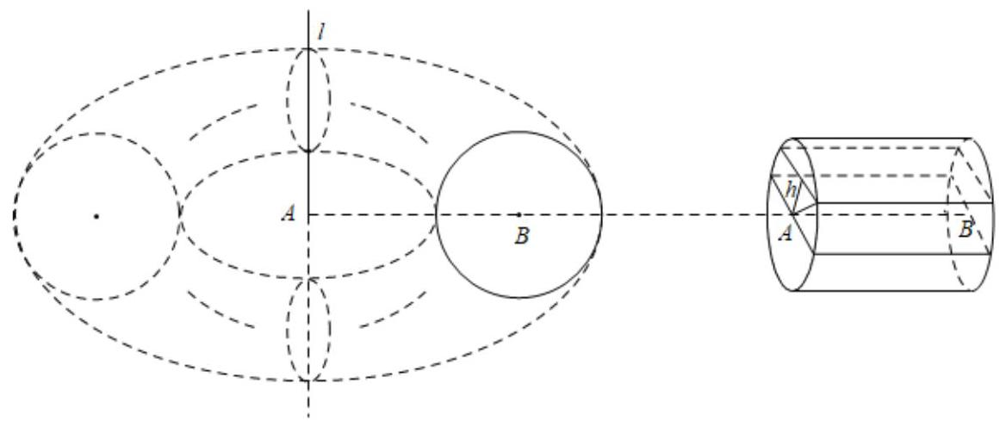

答案

$\frac{1}{2\pi };8{\pi }^{2}$

解析

画出示意图,可得 ${S}_{1} = 2\sqrt{1 - {h}^{2}} \cdot  4 = 8\sqrt{1 - {h}^{2}},{S}_{2} = \pi {r}_{\text{ 外 }}^{2} - \pi {r}_{\text{ 内 }}^{2}$ ,

其中 ${r}_{\text{ 外 }}^{2} = {\left( 4 + \sqrt{1 - {h}^{2}}\right) }^{2},{r}_{\text{ 内 }}^{2} = {\left( 4 - \sqrt{1 - {h}^{2}}\right) }^{2}$ ,

故 ${S}_{2} = {16}\sqrt{1 - {h}^{2}} \cdot  \pi  = {2\pi }{S}_{1}$ ,即 $\frac{{S}_{1}}{{S}_{2}} = \frac{1}{2\pi }$ ,

环体 $M$ 体积为 ${2\pi }{V}_{\text{ 柱 }} = {2\pi } \cdot  {4\pi } = 8{\pi }^{2}$ .

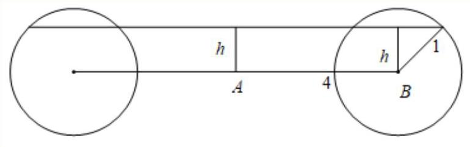

2 一般 填空题 1次作答 正确率 0% 上海市延安中学2025-2026学年高二上学期期中...

在 ${xOy}$ 平面上，将两个半圆弧 ${\left( x - 1\right) }^{2} + {y}^{2} = 1\left( {x \geq  1}\right)$ 和 ${\left( x - 3\right) }^{2} + {y}^{2} = 1\left( {x \geq  3}\right)$ 、两条直线 $y = 1$ 和 $y =  - 1$ 围成的封闭图形记为D，如图中阴影部分. 记D绕y轴旋转一周而成的几何体为 $\Omega$ ，过 $\left( {0, y}\right) \left( {\left| y\right|  \leq  1}\right)$ 作 $\Omega$ 的水平截面，所得截面面积为 ${4\pi }\sqrt{1 - {y}^{2}} + {8\pi }$ ，试利用祖暅原理、一个平放的圆柱和一个长方体，得出 $\Omega$ 的体积值为___

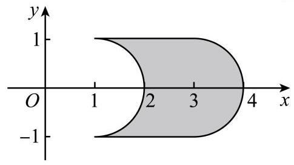

答案

$\pi  \cdot  {1}^{2} \cdot  {2\pi } + 2 \cdot  {8\pi } = 2{\pi }^{2} + {16\pi }$

解析

根据提示,一个半径为1,高为 ${2\pi }$ 的圆柱平放,一个高为2,底面面积 ${8\pi }$ 的长方体,这两个几何体与 $\Omega$ 放在一起,根据祖暅原理,每个平行水平面的截面面积都相等,故它们的体积相等, 即 $\Omega$ 的体积值为 $\pi  \cdot  {1}^{2} \cdot  {2\pi } + 2 \cdot  {8\pi } = 2{\pi }^{2} + {16\pi }$ .

【考点定位】考查旋转体组合体体积的计算, 重点考查空间想象能力, 属难题.

3 伞般 解答题

祖暅是我国南北朝时期的伟大数学家，他在实践的基础上提出了体积计算原理(祖暅原理):“幂势既同, 则积不容异.”并用它推导出了球的体积公式. 我们可以将半球的体积转化为一个圆柱与一个圆锥的体积之差, 从而得出球的体积公式. 图1是一种“四脚帐篷”的示意图, 用任意平行于帐篷底面ABCD的平面截帐篷，得截面四边形为正方形，该帐篷的三视图如图2所示，其中正视图的投影线方向垂直于平面 ${AOC}$ ,正视图和侧视图中的曲线均是半径为 1 的半圆. 模仿球的体积计算方法, 利用祖暅原理求该几何体的体积.

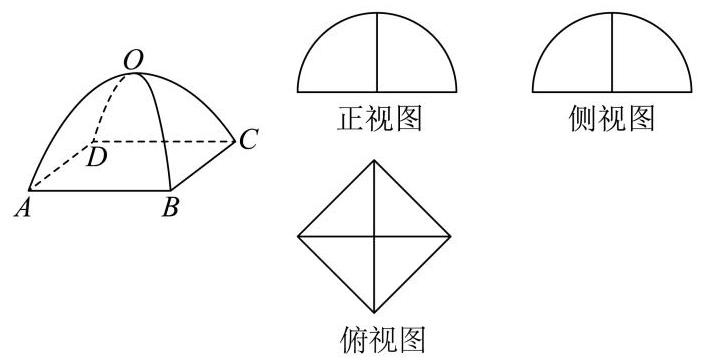

图2

图1

答案

$\frac{4}{3}$

## 解析

根据题意“祖暅原理”为两个等高的几何体若在所有等高处的水平截面的面积相等，则这两个几何体的体积相等,则可将该四角帐篷的体积等价于一个棱柱减去一个棱锥的体积, 根据三视图的数据即可求解.

如图, 构造一个几何体“M”, 将与帐篷同底等高的正四棱柱挖去一个倒放的同底等高的正四棱锥,

用平行于底面的平面截帐篷和该几何体.

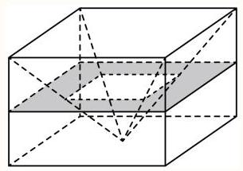

设截面到帐篷底面的距离为 $x$ ,易得其截面的对角线长为 $2\sqrt{1 - {x}^{2}}$ ,所以其面积为 $2\left( {1 - {x}^{2}}\right)$ ,

截几何体“M”得“回字形”截面面积也是 $2\left( {1 - {x}^{2}}\right)$ ,

因此，由祖暅原理知帐篷与几何体“M”的体积相等，

体积 $V = {\left( \sqrt{2}\right) }^{2} \times  1 - \frac{1}{3} \times  {\left( \sqrt{2}\right) }^{2} \times  1 = \frac{4}{3}$ .

4 一般 单选题 22次作答 正确率 86.4% 四川省成都市锦江区嘉祥外国语高级中学20...

中国古代数学家刘徽在《九章算术注》中，称一个正方体内两个互相垂直的内切圆柱所围成的立体为“牟合方盖”，但刘徽未能求得牟合方盖的体积，约200年后，祖冲之的儿子祖暅提出“幂势既同， 则积不容异”，后世称为祖暅原理，即:两等高立体，若在每一等高处的截面积都相等，则两立体体积相等. 图1为棱长为 $\mathrm{r}$ 的正方体截得的“牟合方盖”的八分之一，图2为棱长为 $\mathrm{r}$ 的正方体的八分之一, 图3是底面边长为r的正方体的一个底面和底面以外的顶点作的正四棱锥, 由祖暅原理计算知, 牟合方盖的体积与其外切正方体的体积之比为( )

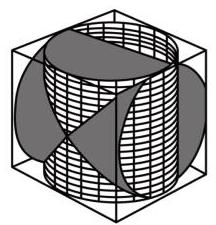

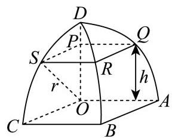

图1

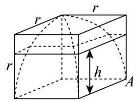

图2

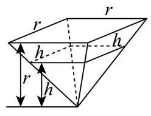

图3

A. $\frac{1}{3}$

B. $\frac{2}{3}$

C. $\frac{3}{16}$

D. $\frac{9}{16}$

答案

B

解析

根据题意, 列等式, 套用正方体, 锥体体积公式求解.

设正方体的边长为 ${2r}$ ,则 ${V}_{\text{ 正方体 }} = {\left( 2r\right) }^{3} = 8{r}^{3}$ ,

由 $\frac{1}{8}{V}_{\text{ 正方体 }} - \frac{1}{8}{V}_{\text{ 牟合方盖 }} = \frac{1}{3}{r}^{2} \cdot  r = \frac{1}{3} \cdot  \frac{1}{8}{V}_{\text{ 正方体 }}$ ,则 ${V}_{\text{ 牟合方盖 }} = \frac{2}{3}{V}_{\text{ 正方体 }}$ ,

所以牟合方盖的体积与其外切正方体的体积之比为 $\frac{2}{3}$ .

故选: B.

7 [选项分布(全国)

<table><tr><td>作答次数</td><td>正确率</td><td>A占比</td><td>B占比</td><td>C占比</td><td>D占比</td></tr><tr><td>22</td><td>86.4%</td><td>13.6% 易错</td><td>86.4% 正确</td><td>0%</td><td>0%</td></tr></table>

5 较易 填空题 四川省绵阳市三台中学2025-2026学年高三上学期12月月考数学试题

中国南北朝时期数学家、天文学家祖冲之、祖暅父子提出介于两个平行平面之间的两个几何体，被任一平行于这两个平面的平面所截, 如果两个截面的面积相等, 则这两个几何体的体积相等. 一个上底面边长为1，下底面边长为2，高为3的正四棱台与一个不规则几何体如图所示，则该不规则几何体的体积为___.

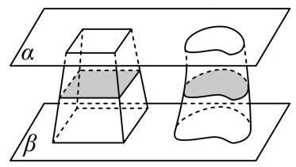

答案

7

解析

利用台体的体积公式求正四棱台的体积, 再根据祖暅原理即可得结果.

由题意可知: 正四棱台的体积为 $V = \frac{1}{3} \times  \left( {{1}^{2} + {2}^{2} + \sqrt{{1}^{2} \times  {2}^{2}}}\right)  \times  3 = 7$ ,

根据祖暅原理可知该不规则几何体的体积为7.

故答案为: 7 .

6 较易 填空题 3 次作答 正确率 100% 上海师范大学附属嘉定高级中学2024-2025学...

祖暅(公元前5-6世纪)，字景烁，是我国南北朝时期的数学家.他提出了一条原理:“幂势既同，则积不容异."这句话的意思是: 两个等高的几何体若在所有等高处的水平截面的面积相等, 则这两个几何体的体积相等.该原理在西方直到十七世纪才由意大利数学家卡瓦列利发现, 比祖暅晚一千一百多年.如图将某几何体(左侧图)与已被挖去了圆锥体的圆柱体(右侧图)放置于同一平面 $\beta$ 上.以平行于平面 $\beta$ 的平面于距平面 $\beta$ 任意高 $d$ 处可横截得到 ${S}_{\text{ 圆 }}$ 及 ${S}_{\text{ 环 }}$ 两截面,若 ${S}_{\text{ 圆 }} = {S}_{\text{ 环 }}$ 总成立,且图中圆柱体(右侧图)的底面直径为3，高为3，则该几何体(左侧图)的体积是___.

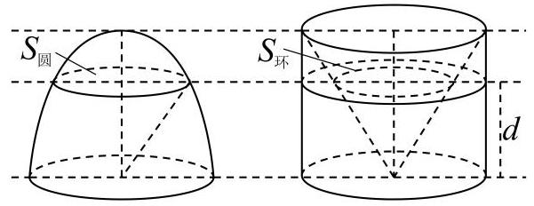

答案

$\frac{9\pi }{2}$

解析

根据题意利用 $V = {V}_{\text{ 圆柱 }} - {V}_{\text{ 圆锥 }}$ 求解即可.

由 ${S}_{\text{ 圆 }} = {S}_{\text{ 环 }}$ 总成立,

故该几何体(左侧图)的体积是

$V = {V}_{\text{ 圆柱 }} - {V}_{\text{ 圆锥 }} = \pi  \times  {\left( \frac{3}{2}\right) }^{2} \times  3 - \frac{1}{3} \times  \pi  \times  {\left( \frac{3}{2}\right) }^{2} \times  3 = \frac{9\pi }{2}.$

故答案为: $\frac{9\pi }{2}$

7 较难 单选题 上海市上南中学2024-2025学年高二上学期阶段性诊断练习一数学试题

祖暅是我国南北朝时期杰出的数学家和天文学家祖冲之的儿子，他提出了一条原理:“幂势既同， 则积不容异”这里的“幂”指水平截面的面积，“势”指高这句话的意思是:两个等高的几何体若在所有等高处的水平截面的面积相等，则这两个几何体体积相等，利用祖暅原理可以将半球的体积转化为与其同底等高的圆柱和圆锥的体积之差,图1是一补四脚帐篷的示意图,其中曲线 ${AOC}$ 和 ${BOD}$ 均是以 $\sqrt{2}$ 为半径的半圆,平面 ${AOC}$ 和平面 ${BOD}$ 均垂直于平面 ${ABCD}$ ,用任意平行于帐篷底面 ${ABCD}$ 的平面截帐篷，所得截面四边形均为正方形，模仿上述半球的体积计算方法，可以构造一个与帐篷同底等高的正四棱柱，从中挖去一个倒放的同底等高的正四棱锥(如图2)，从而求得该帐篷的体积为( )

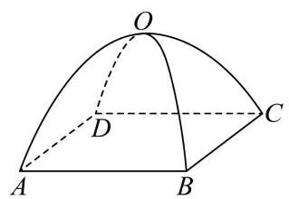

(图1)

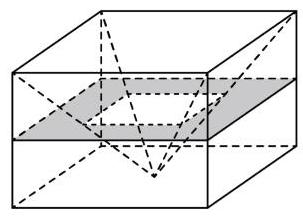

(图2)

A. $\frac{8\sqrt{2}}{3}$

B. $\frac{{32}\sqrt{2}}{3}$

C. $\frac{8}{3}$

D. $\frac{32}{3}$

答案

A

解析

先证明等高处的水平截面截两个几何体的截面的面积相等, 由祖暅原理知帐篷体积为正四棱柱的体积减去正四棱锥的体积, 计算即可.

设截面与底面的距离为 $h$ ，在帐篷中的截面为 ${A}^{\prime }{B}^{\prime }{C}^{\prime }{D}^{\prime }$ ，

设底面中心为 $O$ ,截面 ${A}^{\prime }{B}^{\prime }{C}^{\prime }{D}^{\prime }$ 中心为 ${O}^{\prime }$ ,则 $O{C}^{\prime } = \sqrt{2},{O}^{\prime }{C}^{\prime } = \sqrt{2 - {h}^{2}}$ ,

所以 ${B}^{\prime }{C}^{\prime } = \sqrt{2} \cdot  \sqrt{2 - {h}^{2}}$ ,所以截面为 ${A}^{\prime }{B}^{\prime }{C}^{\prime }{D}^{\prime }$ 的面积为 $2\left( {2 - {h}^{2}}\right)$ .

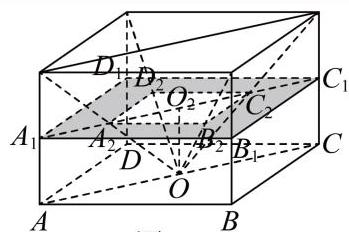

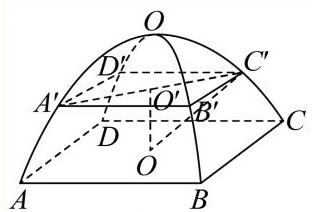

图1

图2

设截面截正四棱柱得四边形为 ${A}_{1}{B}_{1}{C}_{1}{D}_{1}$ ,截正四棱锥得四边形为 ${A}_{2}{B}_{2}{C}_{2}{D}_{2}$ ,

底面中心 $O$ 与截面 ${A}_{2}{B}_{2}{C}_{2}{D}_{2}$ 中心 ${O}_{2}$ 之间的距离为 $O{O}_{2} = h$ ,

在正四棱柱中，底面正方形边长为2，高为 $\sqrt{2}$ ， ${AO} = \sqrt{2}$ ，

所以 $\angle {AO}{A}_{2} = \angle {CO}{C}_{2} = {45}^{ \circ  }$ ，所以 $\angle {A}_{2}O{C}_{2} = {90}^{ \circ  }$ ， $\bigtriangleup  {A}_{2}O{C}_{2}$ 为等腰直角三角形，

所以 ${A}_{2}{C}_{2} = {2h}$ ,所以四边形 ${A}_{2}{B}_{2}{C}_{2}{D}_{2}$ 边长为 $\sqrt{2}h$ ,

所以四边形 ${A}_{2}{B}_{2}{C}_{2}{D}_{2}$ 面积为 $2{h}^{2}$ ,

所以图2中阴影部分的面积为 ${S}_{{A}_{1}{B}_{1}{C}_{1}{D}_{1}} - {S}_{{A}_{2}{B}_{2}{C}_{2}{D}_{2}} = 4 - 2{h}^{2}$ ,与截面 ${A}^{\prime }{B}^{\prime }{C}^{\prime }{D}^{\prime }$ 面积相等, 由祖暅原理知帐篷体积为正四棱柱的体积减去正四棱锥的体积，

即 ${V}_{\text{ 帐篷 }} = {V}_{\text{ 正四棱柱 }} - {V}_{\text{ 正四棱锥 }} = {2}^{2} \times  \sqrt{2} - \frac{1}{3} \times  {2}^{2} \times  \sqrt{2} = \frac{8\sqrt{2}}{3}$ .

故选: A.

8 较易 单斐题 上海市上南中学2025-2026学年高二上学期期中考试数学试题

祖暅，又名祖暅之，是我国南北朝时期的数学家、天文学家祖冲之的儿子. 他在《级术》中提出“幂势既同，则积不容异”的结论，其中“幂”是面积.“势”是高，意思就是:夹在两个平行平面间的两个几何体，被平行于这两个平行平面的任一平面所截，如果截得的两个截面的面积总相等，那么这两个几何体的体积相等 (如图①) 这一原理主要应用于计算一些复杂几何体的体积，若某艺术品如图②所示，高为40cm，底面为边长20cm的正三角形挖去以底边为直径的圆(如图③)，则该艺术品的体积为( )

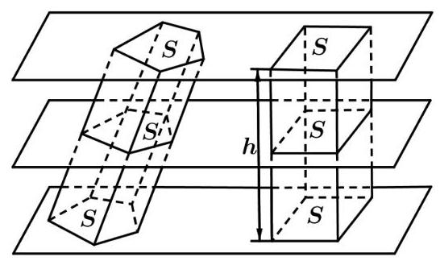

图①

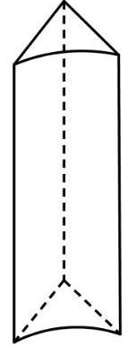

图②

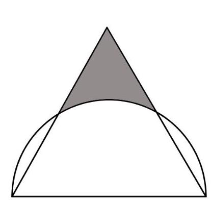

图③

A. $\left( {{1000}\sqrt{3} - \frac{1000}{3}\pi }\right) {\mathrm{{cm}}}^{3}$

B. $\left( {{2000}\sqrt{3} - \frac{2000}{3}\pi }\right) {\mathrm{{cm}}}^{3}$

C. $\left( {\frac{{2000}\sqrt{3}}{3} - \frac{2000}{9}\pi }\right) {\mathrm{{cm}}}^{3}$

D. $\left( {\frac{{1000}\sqrt{3}}{3} - \frac{1000}{9}\pi }\right) {\mathrm{{cm}}}^{3}$

答案

B

解析

先求出阴影部分的面积,其面积为边长 ${20}\mathrm{\;{cm}}$ 的正三角形的面积减去两个边长为 ${10}\mathrm{\;{cm}}$ 的正三角形的面积,再减去圆心角为 $\frac{\pi }{3}$ ,半径为 ${10}\mathrm{\;{cm}}$ 的扇形面积,然后利用柱体的体积公式求解即可由图知阴影部分的面积为

$\frac{1}{2} \times  {20} \times  {20} \times  \frac{\sqrt{3}}{2} - \frac{1}{2} \times  {10} \times  {10} \times  \frac{\sqrt{3}}{2} \times  2 - \frac{1}{2} \times  \frac{\pi }{3} \times  {10}^{2} = \left( {{50}\sqrt{3} - \frac{50}{3}\pi }\right) {\mathrm{{cm}}}^{2}$ ,

所以艺术品的体积为 $\left( {{2000}\sqrt{3} - \frac{2000}{3}\pi }\right) {\mathrm{{cm}}}^{3}$ .

故选: B

9 一般 解答题] 上海市上海交通大学附属中学2025-2026学年高二上学期期末考试数学试卷

李华同学用如下左图所示的炒勺做蛋饺，在学习立体几何后，他打算研究炒勺(不考虑勺柄，下同)的容积与表面积.如图所示，取定球面上一点N，连结N与球心 $O$ ，在线段 ${NO}$ 上取一点 ${O}^{\prime }$ ，过 ${O}^{\prime }$ 垂直于 ${NO}$ 的平面(记作 $\alpha$ )将球面分成了两部分；李华同学将炒匀抽象为其中含有点N的那部分曲面, 并设球面半径为R.

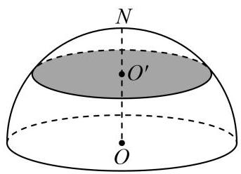

(1)若将炒勺简化为一个半球面(即 ${O}^{\prime }$ 与 $O$ 重合)，求炒勺的容积；

(2)李华记得必修三教材中，半球体积是利用如图所示的圆柱、圆锥以及祖暅原理推导所得.模仿教材中的方法, $N{O}^{\prime } = h\left( {0 < h \leq  R}\right)$ ,求炒勺的容积 $\mathrm{V}$ ,并写出推导过程;

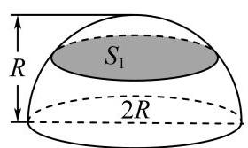

图(1)

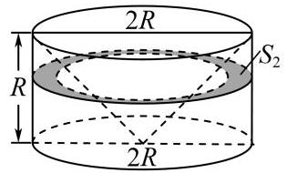

图(2)

(3)设 $R = 4$ 厘米， $N{O}^{\prime } = h = 2$ 厘米，利用必修三教材中近似地推导球的表面积公式的方法，帮助李华同学推测炒勺的内表面面积S(近似到0.01平方厘米)，并写出推导过程.

答案

(1) $\frac{2}{3}\pi {R}^{3}$ ；

(2) $V = {\pi R}{h}^{2} - \frac{1}{3}\pi {h}^{3}$ ；

(3) 50.27.

解析

(1)若将炒勺简化为一个半球面(即 ${O}^{\prime }$ 与 $O$ 重合)，则炒勺的容积为 $\frac{1}{2} \times  \frac{4}{3}\pi {R}^{3} = \frac{2}{3}\pi {R}^{3}$ ；

(2)

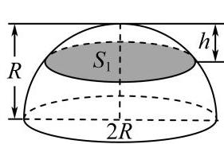

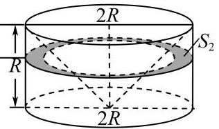

图(1) 图(2)

如图: 先证明对任意高度 $h$ ,图中的阴影部分面积相等,

图(1)中阴影部分圆的半径设为 ${r}_{1}$ ,则由垂径定理可知: ${r}_{1}^{2} = {R}^{2} - {\left( R - h\right) }^{2} = {2Rh} - {h}^{2}$

所以图 (1) 中阴影部分圆的面积为: ${S}_{1} = \pi {r}_{1}^{2} = {2\pi Rh} - \pi {h}^{2}$ ,

图 (2) 中阴影部分为圆环,设内圆半径为 ${r}_{2}$ ,则 $\frac{{r}_{2}}{R} = \frac{R - h}{R} \Rightarrow  {r}_{2} = R - h$ ,

所以图 (2) 中阴影部分圆环的面积为: ${S}_{2} = \pi {R}^{2} - \pi {r}_{2}^{2} = \pi {R}^{2} - \pi {\left( R - h\right) }^{2} = {2\pi Rh} - \pi {h}^{2}$ ,

此时对任意的高度 $h$ ,都有 ${S}_{1} = {S}_{2}$ ,则根据祖暅原理,

可知炒勺的容积 $\mathrm{V}$ 等于一个高为 $h$ 的圆柱体积减去一个圆台体积, 即 $V = \pi {R}^{2}h - \frac{1}{3}\left\lbrack  {\pi {R}^{2} + \pi {\left( R - h\right) }^{2} + \sqrt{\pi {R}^{2} \cdot  \pi {\left( R - h\right) }^{2}}}\right\rbrack  h \; = \pi {R}^{2}h - \frac{1}{3}\left\lbrack  {\pi {R}^{2} + \pi {\left( R - h\right) }^{2} + {\pi R}\left( {R - h}\right) }\right\rbrack  h = \pi {R}^{2}h - \frac{1}{3}\left( {{3\pi }{R}^{2} - {3\pi Rh} + \pi {h}^{2}}\right) h \; = \pi {R}^{2}h - \frac{1}{3}\left\lbrack  {\pi {R}^{2} + \pi {\left( R - h\right) }^{2} + {\pi R}\left( {R - h}\right) }\right\rbrack  h = {\pi R}{h}^{2} - \frac{1}{3}\pi {h}^{3},$ 故炒勺的容积 $V = {\pi R}{h}^{2} - \frac{1}{3}\pi {h}^{3}$ ;

(3)

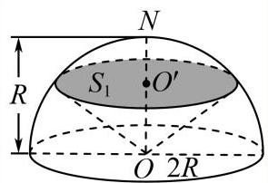

图(1)

当 $R = 4$ 厘米， $N{O}^{\prime } = h = 2$ 厘米，先计算炒匀的容积 $V = \pi  \times  4 \times  {2}^{2} - \frac{1}{3}\pi  \times  {2}^{3} = \frac{40\pi }{3}$ ，

再计算阴影部分圆的半径 ${r}_{1}^{2} = 2 \times  4 \times  2 - {2}^{2} = {12} \Rightarrow  {r}_{1} = 2\sqrt{3}$

图中阴影部分下方的圆锥体积 ${V}_{1} = \frac{1}{3}\pi {r}_{1}^{2} \times  \left( {R - h}\right)  = \frac{1}{3}\pi  \times  {12} \times  \left( {4 - 2}\right)  = {8\pi }$ ,

再根据推导球的表面积公式的方法,将炒勺的球面分割成微小的 $n$ 个部分,每一个部分与球心形成的锥体的高都近似看成球的半径,

从而可将这 $n$ 个锥体的体积之和等于炒勺和圆锥组成的几何体体积,最后可近似求出炒勺的表面积，设炒勺的表面积为 $S$ ，

则 $\frac{1}{3} \times  S \times  4 = \frac{40\pi }{3} + {8\pi } \Rightarrow  S = {16\pi } \approx  {16} \times  {3.14159} = {50.26544} \approx  {50.27}$

故炒勺的表面积为50.27.

10 一般 解答题 上海市市西中学2025-2026学年高二上学期11月期中考试数学试题

沪教版教材11.4.2在推导半径为 $R$ 的球的体积公式时，先构造如图所示的圆柱体，圆柱体的底面半径和高都为 $R$ ,其底面和半球体的底面同在平面 $\alpha$ 上,然后在圆柱体内挖去一个圆锥后,运用祖暅原理来推导，请解答以下问题:

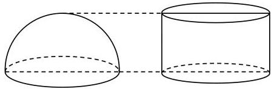

(1)补全完整祖暅原理:夹在两个___间的两个几何体，如果被平行于这两个平面的___截得的两个截面的___，那么这两个几何体的体积必相等.

(2) 请把如图补充完整并写出球的体积公式的推导过程.

## 答案

(1)平行面；任意平面；面积相等

(2) $V = \frac{4}{3}\pi {R}^{3}$ ，推导及作图见解析

## 解析

(1)平行面；任意平面；面积相等

(2)如图(1)，设平行于大圆且与大圆的距离为 $l$ 的平面截半球所得圆面的半径为 $r$ ， $r = \sqrt{{R}^{2} - {l}^{2}},$

于是截面面积 ${S}_{1} = \pi {r}^{2} = \pi \left( {{R}^{2} - {l}^{2}}\right)  = \pi {R}^{2} - \pi {l}^{2}$ ,

则 ${S}_{1}$ 可以看成是在半径为 $R$ 的圆面上挖去一个半径为 $l$ 的同心圆所得的圆环的面积,

所以,取一个底面半径和高均为 $R$ 的圆柱,

从圆柱中挖去一个以圆柱的上底面为底面，下底面圆心为顶点的圆锥，把所得的几何体与半球放在同一水平面 $\alpha$ 上,

如图(2)，

用同一水平面去截这两个几何体，截面分别为圆面和圆环面，

可知圆环大圆半径为 $R$ ，小圆半径为 $l$ ，圆环面积 ${S}_{2} = \pi {R}^{2} - \pi {l}^{2}$ ，所以 ${S}_{1} = {S}_{2}$ ，

则根据祖暅原理可得这两个几何体的体积相等，即 $\frac{1}{2}{V}_{\text{ 球 }} = \pi {R}^{2} \cdot  R - \frac{1}{3}\pi {R}^{2} \cdot  R = \frac{2}{3}\pi {R}^{3}$ , 所以可得球的体积为 ${V}_{\text{ 球 }} = \frac{4}{3}\pi {R}^{3}$ .

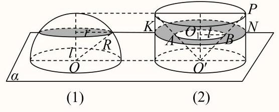

11 一般 填空题 5 次作答 正确率 80% 上海外国语大学附属外国语学校松江云间中学2...

如图,正方体 ${ABCD} - {A}_{1}{B}_{1}{C}_{1}{D}_{1}$ 中,四分之一圆柱 $B{B}_{1}{C}_{1} - A{A}_{1}{D}_{1}$ 与四分之一圆柱

$A{A}_{1}{B}_{1} - D{D}_{1}{C}_{1}$ 公共部分是八分之一的“牟合方盖”. 已知这个正方体的棱长为2，利用祖暅原理， 该八分之一“牟合方盖”的体积为___.

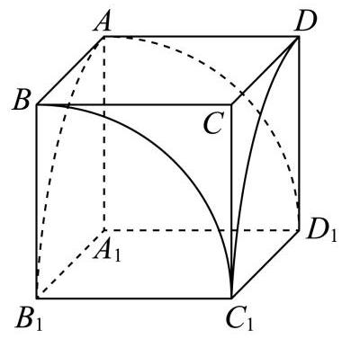

答案

$\frac{16}{3}$

解析

关键点在于构造底面边长和高均为 2 的直四棱锥，根据祖暅原理，八分之一“牟合方盖”的体积等于正方体的体积减去该四棱锥的体积, 即可求得结果.

如图,设 $M{B}_{1} = h$ ,边长为 $r$ ,截面位于八分之一“牟合方盖”内的部分为正方形PQRS.

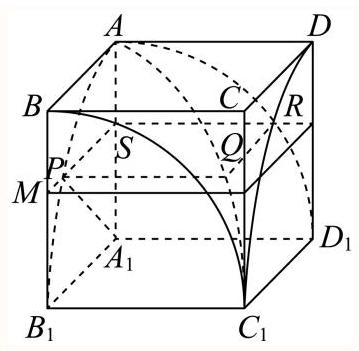

易知 $M{B}_{1} = {A}_{1}S = h$ ,连接 ${A}_{1}P$ .

由点 $P$ 在以 ${A}_{1}$ 为圆心, $r$ 为半径的圆弧上,得 ${A}_{1}P = r$ .

在Rt $\bigtriangleup {A}_{1}{PS}$ 中,由勾股定理得 ${PS} = \sqrt{{r}^{2} - {h}^{2}}$ ,

故所求正方形 ${PQRS}$ 的面积为 ${r}^{2} - {h}^{2}$ .

所以用平行于底面 ${A}_{1}{B}_{1}{C}_{1}{D}_{1}$ 的任意一个平面截八分之一“牟合方盖”,

所得截面面积是 ${r}^{2} - {h}^{2}, h \in  \left\lbrack  {0, r}\right\rbrack$ ,

所以可以构造底面边长为 $r$ ,高为 $r$ 的直四棱锥,对于直四棱锥 ${C}_{1} - {ABCD}$ , 当用过点 $M$ 的截面截该四棱锥时,截面面积为 ${h}^{2}$ .

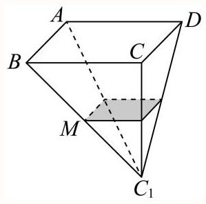

根据祖暅原理，八分之一“牟合方盖”的体积等于正方体的体积减去该四棱锥的体积，

故所求体积为 ${r}^{3} - \frac{1}{3}{r}^{2} \cdot  r = \frac{2}{3} \times  {2}^{3} = \frac{16}{3}$ .

故答案为: $\frac{16}{3}$ .
