线面角专题

姓名:___

1 解答题 165次作答 正确率 90.8%

如图,已知正方体 ${ABCD} - {A}_{1}{B}_{1}{C}_{1}{D}_{1}$ 的棱长为 2 .

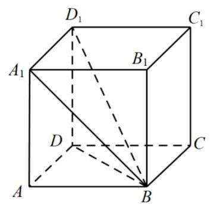

(1)求直线 ${A}_{1}B$ 和平面 $\mathrm{{ABCD}}$ 所成角的大小；

(2)求直线 $B{D}_{1}$ 和平面 ${ABCD}$ 所成角的正切值.

答案

(1) $\frac{\pi }{4}$

(2) $\frac{\sqrt{2}}{2}$

2 解析

(1)因为 ${A}_{1}A\bot$ 平面 $\mathrm{{ABCD}}$ ，

$\therefore$ 直线 ${A}_{1}B$ 在平面 ${ABCD}$ 上的射影为直线 ${AB}$ ，

$\therefore \angle {A}_{1}{BA}$ 就是直线 ${A}_{1}B$ 和平面 $\mathrm{{ABCD}}$ 所成的角.

$\because$ 在 $\operatorname{Rt}\bigtriangleup {A}_{1}{BA}$ 中, $A{A}_{1} = {AB}$ ,则 $\angle {A}_{1}{BA} = \frac{\pi }{4}$ ,

$\therefore$ 直线 ${A}_{1}B$ 和平面 ${ABCD}$ 所成角的大小为 $\frac{\pi }{4}$ .

(2) 因为 ${D}_{1}D \bot$ 平面 $\mathrm{{ABCD}}$ ,

$\therefore$ 直线 ${D}_{1}B$ 在平面 $\mathrm{{ABCD}}$ 上的射影为直线 ${DB}$ ,

$\therefore \angle {D}_{1}{BD}$ 就是直线 ${D}_{1}B$ 和平面 $\mathrm{{ABCD}}$ 所成的角.

$\because$ 在 $\operatorname{Rt}\bigtriangleup {D}_{1}{BD}$ 中, $D{D}_{1} = 2,{BD} = 2\sqrt{2}$ ,则 $\tan \angle {D}_{1}{BD} = \frac{D{D}_{1}}{BD} = \frac{\sqrt{2}}{2}$ ,

$\therefore$ 直线 $B{D}_{1}$ 和平面 $\mathrm{{ABCD}}$ 所成角的的正切值为 $\frac{\sqrt{2}}{2}$ .

2 解答题 88次作答 正确率 74%

如图, PA 上平面ABCD, ABCD为正方形, 且PA=AD, E、F分别是线段PA、CD的中点.

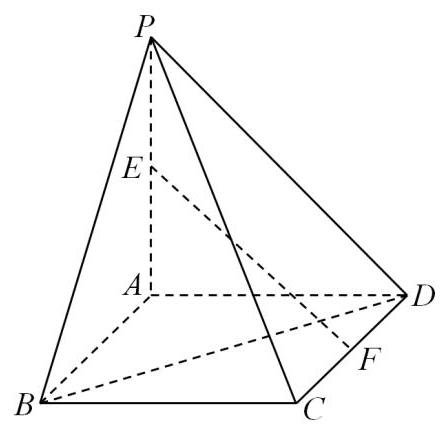

(1)求EF和平面PAB所成的角 $\alpha$ ；

(2)求证:EF//平面PBC.

答案

(1) $\arctan \sqrt{2}$ ;

(2)证明见解析.

## 解析

(1)若 $G$ 是 ${AB}$ 中点，连接 ${EG},{FG}$ ，四边形 ${ABCD}$ 为正方形， ${PA} = {PD}$ ，

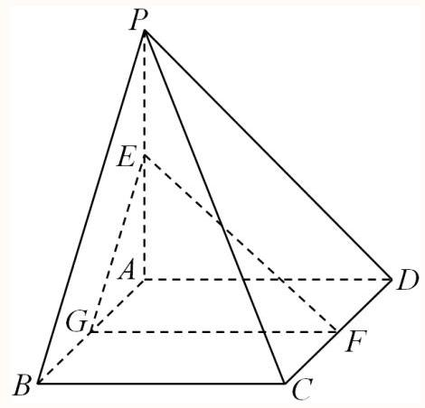

因为 ${PA} \bot$ 面 ${ABCD},{PA} \subset$ 面 ${PAB}$ ,则面 ${ABCD} \bot$ 面 ${PAB}$ ,

由F是线段CD的中点，则 ${FG}//{BC}$ ，而 ${BC}\bot {AB}$ ，即 ${FG}\bot {AB}$ ，

由面 ${ABCD} \cap$ 面 ${PAB} = {AB},{FG} \subset$ 面 ${ABCD}$ ,故 ${FG}\bot$ 面 ${PAB}$ ,

所以EF和平面PAB所成角的平面角为 $\alpha  = \angle {FEG}$ 或补角，由 ${EG} \subset$ 面 ${PAB}$ ，则 ${FG}\bot {EG}$ ， 在直角 $\bigtriangleup {FEG}$ 中, $\tan \alpha  = \frac{FG}{EG}$ ,

由E是线段PA的中点，则 ${EG}//{BP}$ 且 ${EG} = \frac{1}{2}{BP}$ ，结合 ${AB} \subset$ 面 ${ABCD}$ ，即 ${PA}\bot {AB}$ ，

所以 ${EG} = \frac{\sqrt{2}}{2}{AB},{AB} = {BC} = {FG}$ ，则 ${EG} = \frac{\sqrt{2}}{2}{FG}$ ，故 ${\tan \alpha  = \sqrt{2}},$

故EF和平面PAB所成角为 $\arctan \sqrt{2}$ .

(2)由(1)知: ${FG}//{BC}$ ， ${FG} \text{ ⊄ }$ 面 ${PBC}$ ， ${BC} \subset$ 面 ${PBC}$ ，则 ${FG}//$ 面 ${PBC}$ ，

又 ${EG}//{BP}$ ，同理可证 ${EG}//$ 面 ${PBC}$ ，

因为 ${FG} \cap  {EG} = G,{FG},{EG} \subset$ 面 ${FEG}$ ,则面 ${FEG}//$ 面 ${PBC}$ ,

由 ${EF} \subset$ 面 ${FEG}$ ,可得 ${EF}//$ 面 ${PBC}$ .

如图,在正四棱锥 $P - {ABCD}$ 中, $O$ 为底面 ${ABCD}$ 的中心.

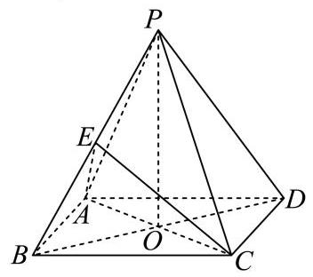

(1)若 ${AP} = 5,{AD} = 4\sqrt{2}$ ，求正四棱锥的体积；

(2)若 ${AP} = {AD}$ ， $E$ 为 ${PB}$ 的中点，求直线 ${BD}$ 与平面 ${AEC}$ 所成角的大小.

答案

(1) 32

(2) $\frac{\pi }{4}$

解析

(1)正四棱锥满足 ${PO} \bot$ 平面 ${ABCD}$ ，由 ${AO} \subset$ 平面 ${ABCD}$ ，则 ${PO} \bot  {AO}$ ， 又正四棱锥底面 ${ABCD}$ 是正方形，由 ${AD} = 4\sqrt{2}$ 可得， ${AO} = 4$ ， 故 ${PO} = \sqrt{P{A}^{2} - A{O}^{2}} = 3$ ,则 ${V}_{P - {ABCD}} = \frac{1}{3} \times  {\left( 4\sqrt{2}\right) }^{2} \times  3 = {32}$ ;

(2)连接 ${EA},{EO},{EC}$ ，由题意结合正四棱锥的性质可知，每个侧面都是等边三角形，

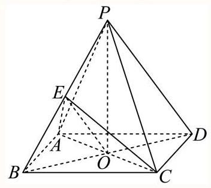

由 $E$ 是 ${PB}$ 中点,则 ${AE} \bot  {PB},{CE} \bot  {PB}$ ,又 ${AE} \cap  {CE} = E,{AE},{CE} \subset$ 平面 ${ACE}$ ,

故 ${PB} \bot$ 平面 ${ACE}$ ,即 ${BE} \bot$ 平面 ${ACE}$ ,又 ${BD} \cap$ 平面 ${ACE} = O$ ,

于是 $\angle {BOE}$ 即为直线 ${BD}$ 与平面 ${AEC}$ 所成角,

设 ${AP} = {AD} = a$ ,则 ${BO} = \frac{\sqrt{2}}{2}a,{BE} = \frac{1}{2}a,\sin \angle {BOE} = \frac{BE}{BO} = \frac{\frac{1}{2}a}{\frac{\sqrt{2}}{2}a} = \frac{\sqrt{2}}{2}$ , 又线面角的范围是 $\left\lbrack  {0,\frac{\pi }{2}}\right\rbrack$ ,故 $\angle {BOE} = \frac{\pi }{4}$ ，即直线 ${BD}$ 与平面 ${AEC}$ 所成角的大小为 $\frac{\pi }{4}$ .

4 解答题 132次作答 正确率 66.6%

如图，在三棱锥P $- \mathrm{{ABC}}$ 中， $\mathrm{{AB}} \bot  \mathrm{{BC}}$ ， $\mathrm{{AB}} = \mathrm{{BC}} = \frac{1}{2}\mathrm{{PA}}$ ，点 $\mathrm{O}$ 、 $\mathrm{D}$ 分别是 $\mathrm{{AC}}$ 、 $\mathrm{{PC}}$ 的中点， $\mathrm{{OP}} \bot$ 底面ABC.

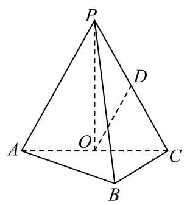

(1)求证: $\mathrm{{OD}}//$ 平面 $\mathrm{{PAB}}$ ；

(2)求直线 ${OD}$ 与平面 ${PBC}$ 所成角的正弦值.

答案

(1)详见解析(2) $\frac{\sqrt{210}}{30}$

解析

(1)由题意利用线面平行的判定定理证明题中的结论即可;

(2)首先作出直线与平面所成的角，然后利用几何体的空间结构特征确定线面角的正弦值即可. (1)如图，

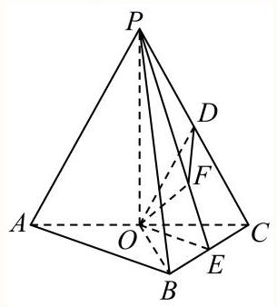

$\because \mathrm{O}$ 、 $\mathrm{D}$ 分别为 $\mathrm{{AC}}$ 、 $\mathrm{{PC}}$ 的中点，

$\therefore \mathrm{{OD}}\parallel \mathrm{{PA}}$ .

又PAC平面PAB，OD⊄平面PAB，

$\therefore \mathrm{{OD}}\parallel$ 平面 $\mathrm{{PAB}}$ .

(2)连接 ${OB}$ ,

$\because \mathrm{{AB}} \bot  \mathrm{{BC}},\mathrm{{OA}} = \mathrm{{OC}}$ ,

$\therefore \mathrm{{OA}} = \mathrm{{OB}} = \mathrm{{OC}}$ .

又 $\because \mathrm{{OP}} \bot$ 平面 $\mathrm{{ABC}}$ ,

$\therefore \mathrm{{PA}} = \mathrm{{PB}} = \mathrm{{PC}}$ .

取BC的中点E，连接PE，OE，

则BC $\bot$ 平面POE,

作OF $\bot$ PE于F,

连接DF，则OF $\bot$ 平面PBC，

$\therefore \angle \mathrm{{ODF}}$ 是OD与平面PBC所成的角.

设AB $=$ BC $=$ a,

则 $\mathrm{{PA}} = \mathrm{{PB}} = \mathrm{{PC}} = 2\mathrm{a},\;\mathrm{{OA}} = \mathrm{{OB}} = \mathrm{{OC}} = \frac{\sqrt{2}}{2}\mathrm{a}$ ,

PO $= \frac{\sqrt{14}}{2}$ a.

在 $\bigtriangleup \mathrm{{PBC}}$ 中, $\because \mathrm{{PE}}\bot \mathrm{{BC}},\mathrm{{PB}} = \mathrm{{PC}}$ ,

$\therefore \mathrm{{PE}} = \frac{\sqrt{15}}{2}$ a. $\therefore \mathrm{{OF}} = \frac{\sqrt{210}}{30}$ a.

又 $\because \mathrm{O}$ 、 $\mathrm{D}$ 分别为 $\mathrm{{AC}}$ 、 $\mathrm{{PC}}$ 的中点， $\therefore \mathrm{{OD}} = \frac{\mathrm{{PA}}}{2} = \mathrm{a}$ .

在 $\mathrm{{Rt}} \bigtriangleup  \mathrm{{ODF}}$ 中， $\sin \angle \mathrm{{ODF}} = \overline{\mathrm{{OD}}} = \frac{\sqrt{210}}{30}$ .

$\therefore \mathrm{{OD}}$ 与平面PBC所成角的正弦值为 $\frac{\sqrt{210}}{30}$ .

本题主要考查线面平行的判定定理，直线与平面所成的角的含义与应用等知识，意在考查学生的转化能力和空间想象能力.

5 填空题 1051 次作答 正确率 73.7%

已知正四面体 ${ABCD}$ 的棱长为 1，则直线 ${AB}$ 与平面 ${BCD}$ 所成角的余弦值为___.

答案

$\frac{\sqrt{3}}{3} \mid  \frac{1}{3}\sqrt{3}$

解析

根据正四面体的特征, 应用面面垂直性质定理及线面垂直判定定理结合线面角的定义计算即可.

如图,

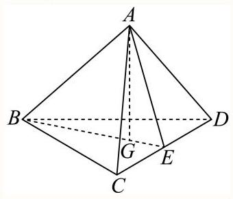

取 ${CD}$ 的中点 $E$ ,连接 ${AE},{BE}$ ,过点 $A$ 作 ${AG} \bot  {BE}$ 交 ${BE}$ 于点 $G$ ,

则 ${AE} \bot  {CD},{BE} \bot  {CD}$ ,又 ${AE} \cap  {BE} = E,{AE},{BE} \subset$ 平面 ${ABE}$ ,

所以 ${CD} \bot$ 平面 ${ABE}$ ,又 ${CD} \subset$ 平面 ${BCD}$ ,所以平面 ${BCD} \bot$ 平面 ${ABE}$ .

又平面 ${BCD} \cap$ 平面 ${ABE} = {BE},{AG} \bot  {BE},{AG} \subset$ 平面 ${ABE}$ ,所以 ${AG} \bot$ 平面 ${BCD}$ .

由正四面体的性质,知 ${BG} = \frac{2}{3}{BE} = \frac{2}{3} \times  \frac{\sqrt{3}}{2} \times  1 = \frac{\sqrt{3}}{3}$ ,且 $\angle {ABG}$ 即为直线 ${AB}$ 与平面 ${BCD}$ 所成的角.

在 Rt $\bigtriangleup {AGB}$ 中, $\cos \angle {ABG} = \frac{BG}{AB} = \frac{\frac{\sqrt{3}}{3}}{1} = \frac{\sqrt{3}}{3}$ ;

故答案为: $\frac{\sqrt{3}}{3}$

6 解答题 27次作答 正确率 63.7%

如图，三棱柱 ${ABC} - {A}_{1}{B}_{1}{C}_{1}$ 的侧棱 ${A}_{1}A$ 垂直于底面 ${ABC},{A}_{1}A = 2,{AC} = {CB} = 1$ ， $\angle {BCA} = {90}^{ \circ  }, M\text{ 、 }N$ 分别是 ${AB}\text{ 、 }{A}_{1}A$ 的中点.

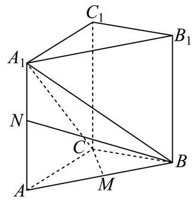

(1) 求证: ${A}_{1}B \bot  {CM}$

(2) 求直线BN与平面 ${A}_{1}{BC}$ 所成角正弦值.

答案

(1)证明见解析

(2) $\frac{\sqrt{15}}{15}$

解析

(1)因为 ${AC} = {CB} = 1$ ， $M$ 是 ${AB}$ 的中点，所以 ${CM}\bot {AB}$ ，

又因为 ${A}_{1}A \bot$ 平面 ${ABC}$ ，又 ${CM} \subset$ 平面 ${ABC}$ ，所认 ${A}_{1}A \bot  {CM}$ ，

又 ${A}_{1}A \cap  {AB} = A,{A}_{1}A,{AB} \subset$ 平面 ${BA}{A}_{1}{B}_{1}$ ,所以 ${CM} \bot$ 平面 ${BA}{A}_{1}{B}_{1}$ ,

因为 ${A}_{1}B \subset$ 平面 ${BA}{A}_{1}{B}_{1}$ ,所以 ${A}_{1}B \bot  {CM}$ ;

(2) 过 $N$ 作 ${NH} \bot  {A}_{1}C$ 交 ${A}_{1}C$ 于 $H$ ,连接 ${BH}$ ,

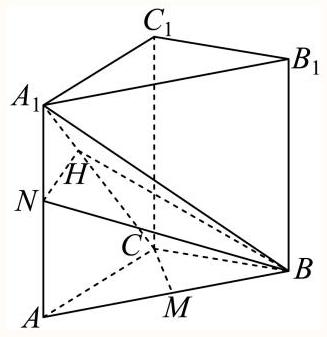

因为 $\angle {BCA} = {90}^{ \circ  }$ ,所以 ${AC} \bot  {BC}$ ,

又因为 ${A}_{1}A \bot$ 平面 ${ABC}$ ,又 ${BC} \subset$ 平面 ${ABC}$ ,所认 ${A}_{1}A \bot  {BC}$ ,

又 ${A}_{1}A \cap  {AC} = A,{A}_{1}A,{AC} \subset$ 平面 ${CA}{A}_{1}{C}_{1}$ ,所以 ${BC} \bot$ 平面 ${CA}{A}_{1}{C}_{1}$ ,

因为 ${NH} \subset$ 平面 ${CA}{A}_{1}{C}_{1}$ ，所以 ${BC}\bot {NH}$ ，

又 ${A}_{1}C \cap  {BC} = C,{A}_{1}C,{BC} \subset$ 平面 ${A}_{1}{CB}$ ，所以 ${NH}\bot$ 平面 ${A}_{1}{CB}$ ，

因为 $\angle {NBH}$ 是直线 ${NB}$ 与平面 ${A}_{1}{CB}$ 所成的角,

因为 ${AC} = {CB} = 1$ ,所以 ${AB} = \sqrt{{1}^{2} + {1}^{2}} = \sqrt{2}$ ,

因为 ${A}_{1}A = 2, N$ 是 ${A}_{1}A$ 的中点,所以 ${BN} = \sqrt{{1}^{2} + {\left( \sqrt{2}\right) }^{2}} = \sqrt{3}$ ,

在直角三角形 ${A}_{1}{AC}$ 中， ${A}_{1}C = \sqrt{{1}^{2} + {2}^{2}} = \sqrt{5}$ ，

所以 $\bigtriangleup {A}_{1}{AC} \sim  {A}_{1}{HN}$ ,所以 $\frac{{A}_{1}N}{NH} = \frac{{A}_{1}C}{AC}$ ,所以 $\frac{1}{NH} = \frac{\sqrt{5}}{1}$ ,所以 ${NH} = \frac{1}{\sqrt{5}}$ ,

所以 $\sin \angle {NBH} = \frac{NH}{BN} = \frac{\frac{1}{\sqrt{5}}}{\sqrt{3}} = \frac{\sqrt{15}}{15}$ ,

所以直线BN与平面 ${A}_{1}{BC}$ 所成角的正弦值为 $\frac{\sqrt{15}}{15}$ .

7 解答题 178次作答 正确率 84.4%

如图所示,四棱柱 ${ABCD} - {A}_{1}{B}_{1}{C}_{1}{D}_{1}$ 的底面 $\mathrm{{ABCD}}$ 是正方形，O是底面的中心， ${A}_{1}O\bot$ 平面 ${ABCD},{AB} = A{A}_{1} = \sqrt{2}$ .

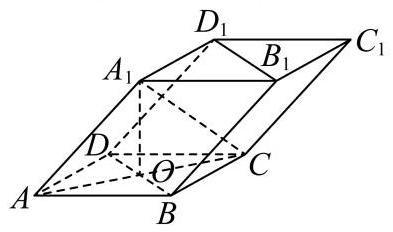

(1) 求证: ${A}_{1}C \bot$ 平面 ${BD}{D}_{1}{B}_{1}$ ;

(2) 求直线 $O{A}_{1}$ 与平面 $A{A}_{1}B$ 所成角的正弦值.

答案

(1)证明见解析

(2) $\frac{\sqrt{3}}{3}$

解析

(1)因为 ${ABCD}$ 是正方形，所以 ${AC}\bot {BD},{OA} = {OC} = 1$ ，

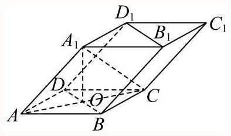

因为 ${A}_{1}O \bot$ 底面 ${ABCD}$ ,

所以 ${A}_{1}O \bot  {BD}$ ,又 ${A}_{1}O \cap  {AC} = O,{A}_{1}O,{AC}$ 在平面 $A{A}_{1}C$ 内,

所以 ${BD} \bot$ 平面 $A{A}_{1}C,{A}_{1}C$ 在平面 $A{A}_{1}C$ 内,

所以 ${BD}\bot {A}_{1}C$ ，

由 $A{A}_{1} = \sqrt{2},{OA} = {OC} = 1,{A}_{1}O\bot$ 底面 ${ABCD}$ ，

可得 ${A}_{1}O = 1,{A}_{1}C = \sqrt{2}$ ，

所以 $A{A}_{1}^{2} + {A}_{1}{C}^{2} = A{C}^{2}$ ,即有 $A{A}_{1} \bot  {A}_{1}C$ ,

因为 $A{A}_{1}//B{B}_{1}$ ,所以 $B{B}_{1} \bot  {A}_{1}C$ ,

$B{B}_{1}$ 和 ${BD}$ 在平面 ${BD}{D}_{1}{B}_{1}$ 内,且 $B{B}_{1} \cap  {BD} = B$ , 所以 ${A}_{1}C \bot$ 平面 ${BD}{D}_{1}{B}_{1}$ .

(2)方法1:设点 $O$ 到平面 $A{A}_{1}B$ 的距离为 $h$ ，

${V}_{O - {A}_{1}{AB}} = \frac{1}{3} \cdot  {S}_{AOB} \cdot  O{A}_{1} = \frac{1}{3} \cdot  {S}_{A{A}_{1}B} \cdot  h$

由题可知 $O{A}_{1} = 1$ , ${S}_{AOB} = \frac{1}{2},{S}_{A{A}_{1}B} = \frac{1}{2} \times  \sqrt{2} \times  \sqrt{2} \times  \frac{\sqrt{3}}{2} = \frac{\sqrt{3}}{2}$ .

所以 $h = \frac{1 \times  1}{\sqrt{3}} = \frac{\sqrt{3}}{3}$ .

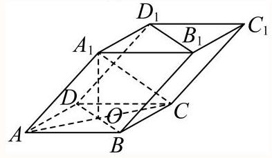

得直线 $O{A}_{1}$ 与平面 $A{A}_{1}B$ 所成角 $\theta$ 的正弦值 $\sin \theta  = \frac{h}{O{A}_{1}} = \frac{\sqrt{3}}{3}$ .

方法2: (建系)

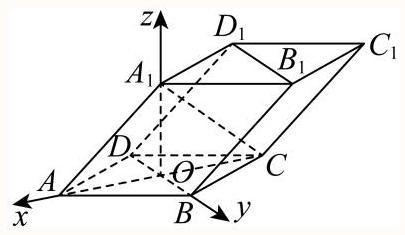

以 $O$ 为原点，射线 ${OA}$ 、 ${OB}$ 、 $O{A}_{1}$ 为 $x$ 轴、 $y$ 轴、 $z$ 轴的正半轴，建立空间直角坐标系.

可得 $A\left( {1,0,0}\right) \text{ 、 }B\left( {0,1,0}\right) \text{ 、 }{A}_{1}\left( {0,0,1}\right)$

则 ${\overrightarrow{OA}}_{1} = \left( {0,0,1}\right) ,{\overrightarrow{AA}}_{1} = \left( {-1,0,1}\right) ,\overrightarrow{AB} = \left( {-1,1,0}\right)$ ,

设平面 $A{A}_{1}B$ 的一个法向量为 $\overrightarrow{n} = \left( {x, y, z}\right)$ ,

则 $\left\{  \begin{array}{l} \overrightarrow{n} \cdot  \overrightarrow{A{A}_{1}} =  - x + z = 0 \\  \overrightarrow{n} \cdot  \overrightarrow{AB} =  - x + y = 0 \end{array}\right.$ ,令 $x = 1$ ,可得 $\overrightarrow{n} = \left( {1,1,1}\right)$ ,

直线 $O{A}_{1}$ 与平面 $A{A}_{1}B$ 所成角 $\theta$ 的正弦值等于向量 $\overrightarrow{O{A}_{1}}$ 与平面法向量 $\overrightarrow{n}$ 的夹角余弦值的绝对值: $\sin \theta  = \left| {\cos \left\langle  {\overrightarrow{O{A}_{1}},\overrightarrow{n}}\right\rangle  }\right|  = \left| \frac{\overrightarrow{O{A}_{1}} \cdot  \overrightarrow{n}}{\left| \overrightarrow{O{A}_{1}}\right|  \cdot  \left| \overrightarrow{n}\right| }\right|  = \frac{1}{\sqrt{3}} = \frac{\sqrt{3}}{3}$ .

8 解答题 100次作答 正确率 71.7%

如图,在棱长为2的正方体 ${ABCD} - {A}_{1}{B}_{1}{C}_{1}{D}_{1}$ 中, $E, F$ 分别为线段 $D{D}_{1},{BD}$ 的中点.

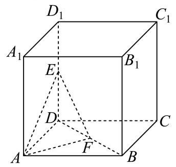

(1)求点 $D$ 到平面 ${AEF}$ 的距离；

(2)求直线 $C{C}_{1}$ 与平面 ${AEF}$ 所成的角.

答案

(1) $\frac{\sqrt{6}}{3}$

(2) $\arcsin \frac{\sqrt{6}}{3}$

解析

(1)在正方体 ${ABCD} - {A}_{1}{B}_{1}{C}_{1}{D}_{1}$ 中， $E$ 为线段 $D{D}_{1}$ 的中点，

所以 ${ED} \bot$ 平面 ${ADF}$ ,且 ${ED} = 1$ ,

因为 $F$ 是线段 ${BD}$ 的中点,所以 ${S}_{\bigtriangleup {ADF}} = \frac{1}{2}{S}_{\bigtriangleup {ABD}} = \frac{1}{2} \times  2 = 1$ ,

故三棱锥 $E - {ADF}$ 的体积 $V = \frac{1}{3}{S}_{\bigtriangleup {ADF}} \times  {ED} = \frac{1}{3} \times  1 \times  1 = \frac{1}{3}$ ;

因为 $E, F$ 分别为线段 $D{D}_{1},{BD}$ 的中点,所以 ${EF} = \frac{1}{2}B{D}_{1} = \frac{1}{2} \times  2\sqrt{3} = \sqrt{3}$ ,

又因为 ${AE} = \sqrt{5},{AF} = \frac{1}{2}{AC} = \frac{1}{2} \times  2\sqrt{2} = \sqrt{2}$ ,

所以在 $\bigtriangleup {AEF}$ 中满足 $E{F}^{2} + A{F}^{2} = A{E}^{2}$ ,故 $\bigtriangleup {AEF}$ 为直角三角形,

则 ${S}_{\bigtriangleup {AEF}} = \frac{1}{2}{AF} \times  {EF} = \frac{1}{2} \times  \sqrt{2} \times  \sqrt{3} = \frac{\sqrt{6}}{2}$ ,设点 $D$ 到平面 ${AEF}$ 的距离为 $d$ ,

则 $V = \frac{1}{3}{S}_{\bigtriangleup {ABF}} \times  d = \frac{1}{3}$ ,解得 $d = \frac{\sqrt{6}}{3}$ ,

因此点 $D$ 到平面 ${AEF}$ 的距离为 $\frac{\sqrt{6}}{3}$ .

(2)

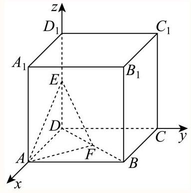

建立如图所示:

以 $D$ 为坐标原点， ${DA}$ 、 ${DC}$ 、 ${DD}_{1}$ 分别为 $x$ 、 $y$ 、 $z$ 轴的空间直角坐标系，

$C\left( {0,2,0}\right) ,{C}_{1}\left( {0,2,2}\right) , A\left( {2,0,0}\right) , E\left( {0,0,1}\right) , F\left( {1,1,0}\right) ,$

所以 $\overrightarrow{C{C}_{1}} = \left( {0,0,2}\right) ,\overrightarrow{AE} = \left( {-2,0,1}\right) ,\overrightarrow{AF} = \left( {-1,1,0}\right)$ ,

设平面 ${AEF}$ 的法向量为 $\overrightarrow{n} = \left( {x, y, z}\right)$ ，

则 $\left\{  \begin{array}{l} \overrightarrow{n} \cdot  \overrightarrow{AE} = 0 \\  \overrightarrow{n} \cdot  \overrightarrow{AF} = 0 \end{array}\right.$ ，即 $\left\{  \begin{array}{l}  - {2x} + z = 0 \\   - x + y = 0 \end{array}\right.$ ，令 $x = y = 1$ ，解得 $z = 2$ ，

所以 $\overrightarrow{n} = \left( {1,1,2}\right)$ ,

设直线 $C{C}_{1}$ 与平面 ${AEF}$ 所成角为 $\theta$ ,所以 $\sin \theta  = \frac{\left| \overrightarrow{n} \cdot  \overrightarrow{C{C}_{1}}\right| }{\left| \overrightarrow{n}\right|  \cdot  \left| \overrightarrow{C{C}_{1}}\right| } = \frac{4}{\sqrt{6} \times  2} = \frac{\sqrt{6}}{3}$ ,

所以 $\theta  = \arcsin \frac{\sqrt{6}}{3}$

9 解答题 390次作答 正确率 80.8%

如图,四边形 ${ABCD}$ 为正方形, ${ED} \bot$ 平面 ${ABCD},{FB}//{ED},{AB} = {ED} = {2FB} = 2$ .

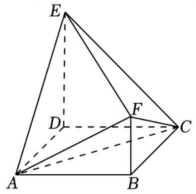

(1)求证: ${AC}\bot$ 平面 ${BDEF}$ ；

(2) 求 ${BC}$ 与平面 ${AEF}$ 所成角的正弦值.

答案

(1)证明见解析；

(2) $\frac{2}{3}$ .

解析

(1)连接 ${BD}$ 交 ${AC}$ 于 $O$ ，如图，

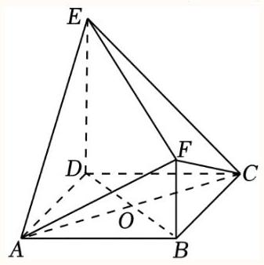

由四边形 ${ABCD}$ 为正方形，得 ${AC}\bot {BD}$ ，

又 ${ED} \bot$ 平面 ${ABCD},{AC} \subset$ 平面 ${ABCD}$ ，则 ${ED} \bot  {AC}$ ，

而 ${FB}//{ED}$ ，即B，D，E，F四点共面，又 ${ED} \cap  {BD} = D$ ，且 ${ED},{BD} \subset$ 平面 ${BD}{EF}$ ， 所以 ${AC} \bot$ 平面 ${BDEF}$ .

(2)因为 ${BC}//{AD}$ ，则 ${BC}$ 与平面 ${AEF}$ 所成角等于 ${AD}$ 与平面 ${AEF}$ 所成角，

显然 ${AE} = \sqrt{{2}^{2} + {2}^{2}} = 2\sqrt{2},{AF} = \sqrt{{2}^{2} + {1}^{2}} = \sqrt{5},{EF} = \sqrt{{\left( 2\sqrt{2}\right) }^{2} + {1}^{2}} = 3$ ,

在 $\bigtriangleup {AEF}$ 中,由余弦定理得 $\cos \angle {AEF} = \frac{A{E}^{2} + E{F}^{2} - A{F}^{2}}{{2AE} \cdot  {EF}} = \frac{8 + 9 - 5}{2 \times  2\sqrt{2} \times  3} = \frac{\sqrt{2}}{2}$ ,

$\sin \angle {AEF} = \sqrt{1 - {\left( \frac{\sqrt{2}}{2}\right) }^{2}} = \frac{\sqrt{2}}{2}$ 此

${S}_{\bigtriangleup {AEF}} = \frac{1}{2}{AE} \cdot  {EF}\sin \angle {AEF} = \frac{1}{2} \times  2\sqrt{2} \times  3 \times  \frac{\sqrt{2}}{2} = 3,$

设点 $D$ 到平面 ${AEF}$ 的距离为 $d$ ,

由 ${ED} \bot$ 平面 ${ABCD}$ ,知 ${DE} \bot  {AB}$ ,而 ${AD} \bot  {AB},{AD} \cap  {DE} = D$ ,则 ${AB} \bot$ 平面 ${ADE}$ ,

又 ${FB}//{ED},{FB} \text{ ⊄ }$ 平面 ${ADE},{ED} \subset$ 平面 ${ADE}$ ,

则 ${FB}//$ 平面 ${ADE}$ ,即有点F到平面 ${ADE}$ 的距离为 $\mathrm{{ABK}}2$ ,又 ${S}_{\bigtriangleup {ADE}} = \frac{1}{2} \times  2 \times  2 = 2$ ,

由 ${V}_{D - {AEF}} = {V}_{F - {ADE}}$ ,得 $\frac{1}{3}{S}_{\bigtriangleup {AEF}} \cdot  d = \frac{1}{3}{S}_{\bigtriangleup {ADE}} \times  2$ ,即 $\frac{1}{3} \times  {3d} = \frac{1}{3} \times  2 \times  2$ ,解得 $d = \frac{4}{3}$

所以 ${BC}$ 与平面 ${AEF}$ 所成角的正弦值为 $\frac{d}{AD} = \frac{\frac{4}{3}}{2} = \frac{2}{3}$ .