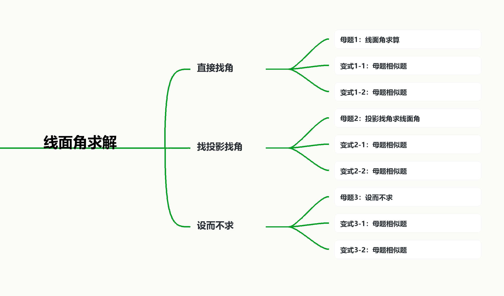

# 线面角求解

## 知识讲解

## 导学说明

## 1. 教学目标

(1) 识记直线与平面所成角的定义，能准确说出“斜线、投影、垂线、垂足”四个对象。

(2) 能够在空间图形中判断线面角对应的平面角，并在直角三角形中用 $\sin\theta,\cos\theta,\tan\theta$ 求值。

(3) 能够在垂足不明显或平面较复杂时，改用投影证明、等体积距离法或空间向量法求线面角。

## 2. 课程重难点

(1) 重点：找到斜线在平面内的投影，明确线面角的顶点和两条边。

(2) 难点：目标平面不是底面时，如何证明某条线垂直目标平面；当角不便直接画出时，如何用距离或法向量转化。

## 3. 考查形式与分值占比

(1) 题型：选择、填空、解答题均可考查，常与线面垂直、面面垂直、体积、空间向量综合出现。

(2) 占比：在立体几何板块中属于高频题素，常作为解答题第 1、2 问或压轴小问的中间步骤。

## 知识导图

## 3 教法备注

## 1. 三类知识点

(1) 事实性知识：线面角范围为 $[0,\frac\pi2]$，垂线段长度、斜线长度、投影长度构成直角三角形。

(2) 概念性知识：直线与平面所成角是斜线与其在平面内投影所成的锐角；若直线垂直平面，则线面角为 $\frac\pi2$；若直线平行或在平面内，则线面角为 $0$。

(3) 程序性知识：先找垂线，再找投影，再进直角三角形；若投影不明显，则证明垂直目标平面；若仍不易找角，则用距离或法向量公式。

## 2. 本切片知识点标签

线面角求解：程序性知识。

【注】线面角定义本身属于概念性知识；本讲重点训练的是“如何把空间角转化为可计算量”。

## 知识笔记

## 1. 线面角定义

设直线 $l$ 与平面 $\alpha$ 斜交，交点为 $A$。在 $l$ 上取一点 $P$，过 $P$ 作 $PO\bot\alpha$，垂足为 $O$，则 $AO$ 是 $PA$ 在平面 $\alpha$ 内的投影，$\angle PAO$ 就是直线 $l$ 与平面 $\alpha$ 所成的角。

若 $\theta$ 为线面角，则

$$
\sin\theta=\frac{\text{垂线段}}{\text{斜线段}},\qquad
\tan\theta=\frac{\text{垂线段}}{\text{投影段}}.
$$

## 2. 向量公式

设 $\vec a$ 是直线方向向量，$\vec n$ 是平面法向量，$\theta$ 是直线与平面所成角，则

$$
\sin\theta=\frac{|\vec a\cdot\vec n|}{|\vec a|\,|\vec n|}.
$$

这里是 $\sin\theta$，不是 $\cos\theta$，因为方向向量与法向量的夹角和线面角互余。

## 3. 三种课堂路径

(1) 直接找角：题中已有垂线和投影，直接指出线面角所在的直角三角形。

(2) 找投影找角：垂足不显眼，先证明某条辅助线垂直目标平面，再确定投影。

(3) 设而不求：不执着于画出角，改用点到平面距离、等体积或法向量，把线面角转成 $\sin\theta=\frac d l$ 或向量公式。

## 教法备注

知识标签:程序性知识

教学步骤:本讲需要学生能够利用线面角定义和投影关系进行给定线面角的求解，该讲知识点建立在已经学习完线面垂直、点到平面距离、直角三角形和空间向量基础上，所以教师应先带领学生复习线面角定义与投影三角形，然后每种求角路径教师都可以至少演示一道例题，以及部分变式，让学生能够在操作中学会线面角的转化方法，最后进行独立练习

对应知识层级:操作

## 知识点1：直接找角

## 母题1：线面角求算

\begin{TeachingNoteBox}
母题说明:直接找角
\end{TeachingNoteBox}

\begin{QuestionBox}

【来源】指定题源第 1 题：上海市静安区 2017-2018 学年高二下学期期末数学试题。

如图，$AB$ 是平面 $\alpha$ 的斜线，$B$ 为斜足，$AO\bot$ 平面 $\alpha$，$O$ 为垂足，$BC$ 是平面 $\alpha$ 上的一条直线，$OC\bot BC$ 于点 $C$，$\angle ABC=60^\circ$，$\angle OBC=45^\circ$。

\begin{center}
\includegraphics[width=0.34\linewidth]{images/0_157_413_294_238_0.jpg}
\end{center}

(1) 求证：$BC\bot$ 平面 $AOC$；

(2) 求 $AB$ 和平面 $\alpha$ 所成角的大小。

\end{QuestionBox}

\begin{AnswerBox}

(1) 证明见解析；(2) $45^\circ$。

\end{AnswerBox}

\begin{AnalysisBox}

(1) 因为 $AO\bot$ 平面 $\alpha$，且 $BC\subset\alpha$，所以 $AO\bot BC$。又 $OC\bot BC$，且 $AO\cap OC=O$，$AO,OC\subset$ 平面 $AOC$，所以 $BC\bot$ 平面 $AOC$。

(2) 设 $BC=1$。由 $OC\bot BC$ 且 $\angle OBC=45^\circ$，得 $OC=1$，$OB=\sqrt2$。在直角三角形 $ABC$ 中，$\angle ABC=60^\circ$，所以 $AB=2$。

又 $AO\bot$ 平面 $\alpha$，所以 $AO\bot OB$，于是

$$
AO=\sqrt{AB^2-OB^2}=\sqrt{4-2}=\sqrt2.
$$

$AB$ 在平面 $\alpha$ 内的投影为 $BO$，所以线面角为 $\angle ABO$。因为 $AO=BO$，所以 $\angle ABO=45^\circ$。

\end{AnalysisBox}

\begin{TeachBox}

直接找角的关键是先说清“投影是哪一条线”。本题中垂线为 $AO$，斜线为 $AB$，投影为 $BO$，因此角在 $B$ 点，而不是 $A$ 点或 $O$ 点。

\end{TeachBox}

## 变式1-1：底面垂线已给出的直接找角

\begin{TeachingNoteBox}
变式说明:直接找角
\end{TeachingNoteBox}

\begin{QuestionBox}

【来源】指定题源第 3 题：上海市浦东新区上海海事大学附属北蔡高级中学 2024 届高三上学期期中数学试题。

四边形 $ABCD$ 是边长为 $1$ 的正方形，$AC$ 与 $BD$ 交于 $O$ 点，$PA\bot$ 平面 $ABCD$，且 $PA=AB=AD$。

\begin{center}
\includegraphics[width=0.34\linewidth]{images/2_160_462_340_305_0.jpg}
\end{center}

(1) 求证：$AB$ 和 $PC$ 是异面直线；

(2) 求直线 $PC$ 和平面 $ABCD$ 所成角。

\end{QuestionBox}

\begin{AnswerBox}

(1) 证明见解析；(2) $\arctan\frac{\sqrt2}{2}$。

\end{AnswerBox}

\begin{AnalysisBox}

(1) $AB\subset$ 平面 $ABCD$，而 $P\notin$ 平面 $ABCD$，$C\notin AB$，故 $AB$ 与 $PC$ 不共面，是异面直线。

(2) 设 $PA=AB=AD=a$。因为 $PA\bot$ 平面 $ABCD$，点 $P$ 在底面上的投影为 $A$，所以 $PC$ 在底面上的投影为 $AC$，线面角为 $\angle PCA$。

在正方形中 $AC=\sqrt2a$，在直角三角形 $PAC$ 中，

$$
\tan\angle PCA=\frac{PA}{AC}=\frac{a}{\sqrt2a}=\frac{\sqrt2}{2}.
$$

因此直线 $PC$ 与平面 $ABCD$ 所成角为 $\arctan\frac{\sqrt2}{2}$。

\end{AnalysisBox}

\begin{TeachBox}

只要已知“某点到平面的垂足”，求这点连向平面内一点的线面角，就优先看这条线在平面内的投影。本题 $P$ 的投影是 $A$，所以 $PC$ 的投影是 $AC$。

\end{TeachBox}

## 变式1-2：正方体中多条斜线的底面投影

\begin{TeachingNoteBox}
变式说明:直接找角
\end{TeachingNoteBox}

\begin{QuestionBox}

【来源】指定题源第 11 题：专题 10 空间角与空间距离的综合。

如图，已知正方体 $ABCD-A_1B_1C_1D_1$ 的棱长为 $2$。

\begin{center}
\includegraphics[width=0.34\linewidth]{images/10_168_1356_353_347_0.jpg}
\end{center}

(1) 求直线 $A_1B$ 和平面 $ABCD$ 所成角的大小；

(2) 求直线 $BD_1$ 和平面 $ABCD$ 所成角的正切值。

\end{QuestionBox}

\begin{AnswerBox}

(1) $\frac\pi4$；(2) $\frac{\sqrt2}{2}$。

\end{AnswerBox}

\begin{AnalysisBox}

(1) 因为 $A_1A\bot$ 平面 $ABCD$，所以 $A_1B$ 在平面 $ABCD$ 上的投影为 $AB$，线面角为 $\angle A_1BA$。在直角三角形 $A_1BA$ 中，$AA_1=AB=2$，所以 $\angle A_1BA=\frac\pi4$。

(2) 因为 $D_1D\bot$ 平面 $ABCD$，所以 $D_1B$ 在平面 $ABCD$ 上的投影为 $DB$，线面角为 $\angle D_1BD$。在直角三角形 $D_1BD$ 中，$DD_1=2$，$BD=2\sqrt2$，故

$$
\tan\angle D_1BD=\frac{DD_1}{BD}=\frac{2}{2\sqrt2}=\frac{\sqrt2}{2}.
$$

\end{AnalysisBox}

\begin{TeachBox}

正方体题不要只看空间对角线本身，要把“上端点竖直投到底面”作为固定动作。投影一确定，线面角就回到一个底面直角三角形。

\end{TeachBox}

## 知识点2：找投影找角

## 母题2：投影找角求线面角

\begin{TeachingNoteBox}
母题说明:投影找角
\end{TeachingNoteBox}

\begin{QuestionBox}

【来源】指定题源第 2 题：上海市同济大学第二附属中学 2024-2025 学年高二上学期期中考试数学试卷。

如图，已知 $PA=AC=PC=AB=a$，$PA\bot AB$，$AC\bot AB$，$M$ 为 $AC$ 的中点。

\begin{center}
\includegraphics[width=0.34\linewidth]{images/1_160_207_312_377_0.jpg}
\end{center}

(1) 求证：$PM\bot$ 平面 $ABC$；

(2) 求直线 $PB$ 与平面 $ABC$ 所成角的大小。

\end{QuestionBox}

\begin{AnswerBox}

(1) 证明见解析；(2) $\arcsin\frac{\sqrt6}{4}$。

\end{AnswerBox}

\begin{AnalysisBox}

(1) 因为 $PA=AC=PC$，所以 $\triangle PAC$ 为等边三角形。$M$ 为 $AC$ 的中点，故 $PM\bot AC$。

又 $PA\bot AB$，$AC\bot AB$，且 $PA\cap AC=A$，所以 $AB\bot$ 平面 $PAC$。因为 $PM\subset$ 平面 $PAC$，所以 $AB\bot PM$。再由 $PM\bot AC$，$AB\cap AC=A$，可得 $PM\bot$ 平面 $ABC$。

(2) 连接 $BM$。由 (1) 知 $PM\bot$ 平面 $ABC$，所以点 $P$ 在平面 $ABC$ 上的投影为 $M$，$PB$ 在平面 $ABC$ 上的投影为 $BM$，线面角为 $\angle PBM$。

\begin{center}
\includegraphics[width=0.34\linewidth]{images/1_243_1466_324_394_0.jpg}
\end{center}

等边三角形 $PAC$ 中，$PM=\frac{\sqrt3}{2}a$。直角三角形 $PAB$ 中，$PB=\sqrt2a$。所以

$$
\sin\angle PBM=\frac{PM}{PB}=\frac{\frac{\sqrt3}{2}a}{\sqrt2a}=\frac{\sqrt6}{4}.
$$

故直线 $PB$ 与平面 $ABC$ 所成角为 $\arcsin\frac{\sqrt6}{4}$。

\end{AnalysisBox}

\begin{TeachBox}

这类题的角不是一眼看出来的，而是先证明“谁垂直目标平面”。一旦证明 $PM\bot$ 平面 $ABC$，投影点就是 $M$，线面角自然落在 $\triangle PBM$ 中。

\end{TeachBox}

## 变式2-1：向侧面找投影

\begin{TeachingNoteBox}
变式说明:投影找角
\end{TeachingNoteBox}

\begin{QuestionBox}

【来源】指定题源第 5 题：浙江省衢州一中 2011-2012 学年高二上学期期末理科数学试题。

如图，三棱柱 $ABC-A_1B_1C_1$ 的侧棱 $A_1A$ 垂直于底面 $ABC$，$A_1A=2$，$AC=CB=1$，$\angle BCA=90^\circ$，$M,N$ 分别是 $AB,A_1A$ 的中点。

\begin{center}
\includegraphics[width=0.34\linewidth]{images/4_159_97_328_342_0.jpg}
\end{center}

(1) 求证：$A_1B\bot CM$；

(2) 求直线 $BN$ 与平面 $A_1BC$ 所成角的正弦值。

\end{QuestionBox}

\begin{AnswerBox}

(1) 证明见解析；(2) $\frac{\sqrt{15}}{15}$。

\end{AnswerBox}

\begin{AnalysisBox}

(1) 因为 $AC=CB$ 且 $M$ 为 $AB$ 的中点，所以 $CM\bot AB$。又 $A_1A\bot$ 平面 $ABC$，且 $CM\subset$ 平面 $ABC$，所以 $A_1A\bot CM$。由于 $A_1A$ 与 $AB$ 相交并都在平面 $BAA_1B_1$ 内，故 $CM\bot$ 平面 $BAA_1B_1$，从而 $A_1B\bot CM$。

(2) 过 $N$ 作 $NH\bot A_1C$，交 $A_1C$ 于 $H$，连接 $BH$。

\begin{center}
\includegraphics[width=0.34\linewidth]{images/4_245_1121_327_339_0.jpg}
\end{center}

因为 $AC\bot BC$，$A_1A\bot$ 平面 $ABC$，所以 $A_1A\bot BC$。于是 $BC\bot$ 平面 $CAA_1C_1$，而 $NH\subset$ 平面 $CAA_1C_1$，故 $BC\bot NH$。

又 $NH\bot A_1C$，且 $A_1C\cap BC=C$，$A_1C,BC\subset$ 平面 $A_1CB$，所以 $NH\bot$ 平面 $A_1CB$。因此 $H$ 是点 $N$ 到平面 $A_1BC$ 的垂足，线面角为 $\angle NBH$。

由 $AC=CB=1$，得 $AB=\sqrt2$。$N$ 为 $A_1A$ 中点，$AN=1$，所以 $BN=\sqrt{AB^2+AN^2}=\sqrt3$。在直角三角形 $A_1AC$ 中，$A_1C=\sqrt5$，由相似关系得 $NH=\frac1{\sqrt5}$。故

$$
\sin\angle NBH=\frac{NH}{BN}=\frac{1/\sqrt5}{\sqrt3}=\frac{\sqrt{15}}{15}.
$$

\end{AnalysisBox}

\begin{TeachBox}

目标平面是侧面时，垂足通常不在原图中显露。做法是“在目标平面内找两条相交线”，让辅助线 $NH$ 同时垂直 $A_1C$ 和 $BC$，从而确认它垂直整个平面。

\end{TeachBox}

## 变式2-2：先证明垂直平面再找角

\begin{TeachingNoteBox}
变式说明:投影找角
\end{TeachingNoteBox}

\begin{QuestionBox}

【来源】指定题源第 17 题：山东省烟台市中英文学校 2023-2024 学年高一下学期期末检测数学试题。

如图，在正四棱锥 $P-ABCD$ 中，$O$ 为底面 $ABCD$ 的中心。

\begin{center}
\includegraphics[width=0.34\linewidth]{images/16_160_602_351_312_0.jpg}
\end{center}

(1) 若 $AP=5$，$AD=4\sqrt2$，求正四棱锥的体积；

(2) 若 $AP=AD$，$E$ 为 $PB$ 的中点，求直线 $BD$ 与平面 $AEC$ 所成角的大小。

\end{QuestionBox}

\begin{AnswerBox}

(1) $32$；(2) $\frac\pi4$。

\end{AnswerBox}

\begin{AnalysisBox}

(1) 正四棱锥中 $PO\bot$ 平面 $ABCD$。由 $AD=4\sqrt2$，得 $AO=4$。所以 $PO=\sqrt{AP^2-AO^2}=3$，体积

$$
V=\frac13\cdot (4\sqrt2)^2\cdot 3=32.
$$

(2) 连接 $EA,EO,EC$。若 $AP=AD$，则每个侧面都是等边三角形。$E$ 为 $PB$ 的中点，所以 $AE\bot PB$，$CE\bot PB$。

\begin{center}
\includegraphics[width=0.34\linewidth]{images/16_244_1545_350_310_0.jpg}
\end{center}

因为 $AE\cap CE=E$，$AE,CE\subset$ 平面 $AEC$，所以 $PB\bot$ 平面 $AEC$。于是 $BE$ 是点 $B$ 到平面 $AEC$ 的垂线段。又 $BD\cap$ 平面 $AEC=O$，故线面角为 $\angle BOE$。

设 $AP=AD=a$，则 $BO=\frac{\sqrt2}{2}a$，$BE=\frac12a$。所以

$$
\sin\angle BOE=\frac{BE}{BO}=\frac{\frac12a}{\frac{\sqrt2}{2}a}=\frac{\sqrt2}{2}.
$$

线面角范围为 $[0,\frac\pi2]$，故 $\angle BOE=\frac\pi4$。

\end{AnalysisBox}

\begin{TeachBox}

本题的投影点不是底面中心直接给出的，而是通过 $PB\bot$ 平面 $AEC$ 得到。先证垂直平面，再谈投影，是这类题的稳定顺序。

\end{TeachBox}

## 知识点3：设而不求

## 母题3：设而不求

\begin{TeachingNoteBox}
母题说明:设而不求
\end{TeachingNoteBox}

\begin{QuestionBox}

【来源】指定题源第 18 题：上海市嘉定区第一中学 2024-2025 学年高二上学期期末数学试题。

如图，在棱长为 $2$ 的正方体 $ABCD-A_1B_1C_1D_1$ 中，$E,F$ 分别为线段 $DD_1,BD$ 的中点。

\begin{center}
\includegraphics[width=0.34\linewidth]{images/17_160_448_343_324_0.jpg}
\end{center}

(1) 求点 $D$ 到平面 $AEF$ 的距离；

(2) 求直线 $CC_1$ 与平面 $AEF$ 所成的角。

\end{QuestionBox}

\begin{AnswerBox}

(1) $\frac{\sqrt6}{3}$；(2) $\arcsin\frac{\sqrt6}{3}$。

\end{AnswerBox}

\begin{AnalysisBox}

(1) 因为 $E$ 是 $DD_1$ 的中点，所以 $ED\bot$ 平面 $ADF$，且 $ED=1$。又 $F$ 是 $BD$ 的中点，$S_{\triangle ADF}=\frac12S_{\triangle ABD}=1$，所以

$$
V_{E-ADF}=\frac13\cdot S_{\triangle ADF}\cdot ED=\frac13.
$$

在 $\triangle AEF$ 中，$EF=\sqrt3$，$AF=\sqrt2$，$AE=\sqrt5$，满足 $EF^2+AF^2=AE^2$，故 $\triangle AEF$ 为直角三角形，

$$
S_{\triangle AEF}=\frac12\cdot AF\cdot EF=\frac{\sqrt6}{2}.
$$

设点 $D$ 到平面 $AEF$ 的距离为 $d$，由等体积

$$
\frac13S_{\triangle AEF}d=\frac13
$$

得 $d=\frac{\sqrt6}{3}$。

(2) 建立如图坐标系，以 $D$ 为原点，$DA,DC,DD_1$ 分别为 $x,y,z$ 轴。

\begin{center}
\includegraphics[width=0.36\linewidth]{images/18_242_93_381_395_0.jpg}
\end{center}

则

$$
C(0,2,0),\quad C_1(0,2,2),\quad A(2,0,0),\quad E(0,0,1),\quad F(1,1,0).
$$

有 $\overrightarrow{CC_1}=(0,0,2)$，$\overrightarrow{AE}=(-2,0,1)$，$\overrightarrow{AF}=(-1,1,0)$。设平面 $AEF$ 的法向量为 $\vec n=(x,y,z)$，则

$$
\begin{cases}
-2x+z=0,\\
-x+y=0.
\end{cases}
$$

取 $x=y=1$，得 $\vec n=(1,1,2)$。设线面角为 $\theta$，则

$$
\sin\theta=\frac{|\vec n\cdot\overrightarrow{CC_1}|}{|\vec n|\,|\overrightarrow{CC_1}|}
=\frac4{\sqrt6\cdot2}=\frac{\sqrt6}{3}.
$$

所以 $\theta=\arcsin\frac{\sqrt6}{3}$。

\end{AnalysisBox}

\begin{TeachBox}

本题不强行画出 $CC_1$ 在平面 $AEF$ 上的投影，而是用法向量直接求 $\sin\theta$。当目标平面由三个中点或空间点确定时，建系往往比找投影更稳。

\end{TeachBox}

## 变式3-1：等体积与向量法互证

\begin{TeachingNoteBox}
变式说明:设而不求
\end{TeachingNoteBox}

\begin{QuestionBox}

【来源】指定题源第 8 题：上海市奉贤区 2025-2026 学年高三上学期学科质量监测（一）数学试卷。

如图，四棱柱 $ABCD-A_1B_1C_1D_1$ 的底面 $ABCD$ 是正方形，$O$ 是底面的中心，$A_1O\bot$ 平面 $ABCD$，$AB=AA_1=\sqrt2$。

\begin{center}
\includegraphics[width=0.34\linewidth]{images/6_161_1116_393_230_0.jpg}
\end{center}

(1) 求证：$A_1C\bot$ 平面 $BDD_1B_1$；

(2) 求直线 $OA_1$ 与平面 $AA_1B$ 所成角的正弦值。

\end{QuestionBox}

\begin{AnswerBox}

(1) 证明见解析；(2) $\frac{\sqrt3}{3}$。

\end{AnswerBox}

\begin{AnalysisBox}

(1) 因为 $ABCD$ 是正方形，所以 $AC\bot BD$，且 $OA=OC=1$。又 $A_1O\bot$ 底面 $ABCD$，所以 $A_1O\bot BD$。由于 $A_1O$ 与 $AC$ 相交于 $O$，且都在平面 $AA_1C$ 内，故 $BD\bot$ 平面 $AA_1C$，从而 $BD\bot A_1C$。

\begin{center}
\includegraphics[width=0.34\linewidth]{images/6_244_1829_391_237_0.jpg}
\end{center}

由 $AA_1=\sqrt2$，$OA=OC=1$，$A_1O\bot$ 底面，得 $A_1O=1$，$A_1C=\sqrt2$。于是 $AA_1^2+A_1C^2=AC^2$，所以 $AA_1\bot A_1C$。又 $AA_1\parallel BB_1$，故 $BB_1\bot A_1C$。因为 $BD$ 与 $BB_1$ 在平面 $BDD_1B_1$ 内相交，所以 $A_1C\bot$ 平面 $BDD_1B_1$。

(2) 方法一：设点 $O$ 到平面 $AA_1B$ 的距离为 $h$。由等体积

$$
V_{O-A_1AB}=\frac13S_{AOB}\cdot OA_1=\frac13S_{AA_1B}\cdot h.
$$

其中 $OA_1=1$，$S_{AOB}=\frac12$，$S_{AA_1B}=\frac{\sqrt3}{2}$，所以 $h=\frac{\sqrt3}{3}$。

\begin{center}
\includegraphics[width=0.34\linewidth]{images/7_243_871_393_231_0.jpg}
\end{center}

设直线 $OA_1$ 与平面 $AA_1B$ 所成角为 $\theta$，则

$$
\sin\theta=\frac{h}{OA_1}=\frac{\sqrt3}{3}.
$$

方法二：以 $O$ 为原点，$OA,OB,OA_1$ 为 $x,y,z$ 轴建立坐标系。

\begin{center}
\includegraphics[width=0.34\linewidth]{images/7_242_1228_406_235_0.jpg}
\end{center}

$A(1,0,0)$，$B(0,1,0)$，$A_1(0,0,1)$。平面 $AA_1B$ 的法向量可取 $\vec n=(1,1,1)$，$\overrightarrow{OA_1}=(0,0,1)$，于是

$$
\sin\theta=\frac{|\overrightarrow{OA_1}\cdot\vec n|}{|\overrightarrow{OA_1}|\,|\vec n|}=\frac1{\sqrt3}=\frac{\sqrt3}{3}.
$$

\end{AnalysisBox}

\begin{TeachBox}

等体积法和向量法本质一致：都在求“斜线方向离平面有多远”。若题目已给体积、面积关系，等体积更短；若坐标清楚，法向量更稳。

\end{TeachBox}

## 变式3-2：用距离转化线面角

\begin{TeachingNoteBox}
变式说明:设而不求
\end{TeachingNoteBox}

\begin{QuestionBox}

【来源】指定题源第 15 题：本地题集三棱台线面角选择题。

如图，在三棱台 $ABC-A_1B_1C_1$ 中，$AA_1\bot$ 平面 $ABC$，$\angle ABC=90^\circ$，$AA_1=A_1B_1=B_1C_1=1$，$AB=2$，则 $AC$ 与平面 $BCC_1B_1$ 所成的角为（ ）

\begin{center}
\includegraphics[width=0.34\linewidth]{images/14_168_446_426_383_0.jpg}
\end{center}

A. $30^\circ$

B. $45^\circ$

C. $60^\circ$

D. $90^\circ$

\end{QuestionBox}

\begin{AnswerBox}

A。

\end{AnswerBox}

\begin{AnalysisBox}

将棱台补全为棱锥 $D-ABC$。

\begin{center}
\includegraphics[width=0.34\linewidth]{images/14_226_1380_373_415_0.jpg}
\end{center}

由条件可得 $DA=BC=2$，$AC=2\sqrt2$。又 $AA_1\bot$ 平面 $ABC$，可推出 $BD=2\sqrt2$，$CD=2\sqrt3$，于是

$$
BC^2+BD^2=CD^2,
$$

故 $\triangle BCD$ 为直角三角形，

$$
S_{\triangle BCD}=\frac12\cdot2\cdot2\sqrt2=2\sqrt2.
$$

设点 $A$ 到平面 $BCC_1B_1$ 的距离为 $h$。由等体积

$$
V_{D-ABC}=V_{A-BCD},
$$

即

$$
\frac13\cdot2\cdot\frac12\cdot2\cdot2=\frac13\cdot h\cdot2\sqrt2,
$$

得 $h=\sqrt2$。设 $AC$ 与平面 $BCC_1B_1$ 所成角为 $\theta$，则

$$
\sin\theta=\frac{h}{AC}=\frac{\sqrt2}{2\sqrt2}=\frac12.
$$

所以 $\theta=30^\circ$，选 A。

\end{AnalysisBox}

\begin{TeachBox}

这题不必把投影线画出来。只要能求出点 $A$ 到目标平面的距离 $h$，就能用 $\sin\theta=\frac{h}{AC}$ 把线面角转成长度比。

\end{TeachBox}

## 总结收获

(1) 直接找角：先确认垂线，再确认投影，角在斜线与投影的公共端点处。

(2) 找投影找角：目标平面复杂时，先证明辅助线垂直平面；垂足一旦确定，角自然出现。

(3) 设而不求：当投影不易画出时，用 $\sin\theta=\frac d l$ 或 $\sin\theta=\frac{|\vec a\cdot\vec n|}{|\vec a|\,|\vec n|}$，避免陷入图形猜角。

(4) 易错提醒：向量法求线面角时，方向向量与法向量夹角的余弦绝对值，等于线面角的正弦值。

## 题源与版本说明

- 模板依据：`D:\数学md文件输出\角的配凑问题-教师版.pdf_os_d810eg2lb0pc7385kfv0\角的配凑问题-教师版-dollar.md`。
- 正文题源：`D:\数学md文件输出\2026年06月09日高中数学题集-解析版.pdf_os_d8jm5dilb0pc73d8or50\2026年06月09日高中数学题集-解析版-dollar.md`，正文共选入 9 道题。
- 图片处理：题源 `images` 文件夹已整体复制到本讲义目录，正文引用所选题目的 17 张原图/解析图。
- 全库参考：已检索 `D:\数学md文件输出` 下线面角相关 Markdown，命中明细见 `线面角全库检索命中明细-v1.txt`，候选表见 `线面角候选题源表-v1.md`。本版正文以指定题源为准，其它 `.md` 只作候选核对，不混入正文题目。

版本号：v1.2

