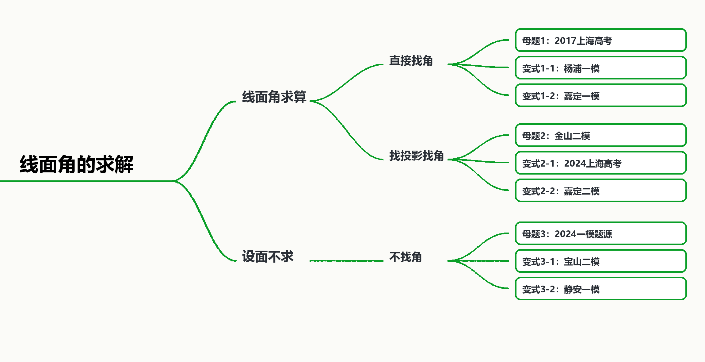

# 线面角的求解

## 知识讲解

### 1. 本版说明

本版为“真题模考优先版”。在上一版框架基础上，保留“直接找角、找投影找角、设面不求”三条主线，并用全库检索出的上海真题、一模、二模候选题替换原来的自编变式。

全库原始命中明细见同目录下 `线面角全库检索命中明细.txt`，去重候选题见 `线面角候选题源表.md`。

### 2. 概念与公式

直线与平面所成角，是斜线与它在平面上的投影所成的锐角。若直线 $l$ 与平面 $\alpha$ 斜交于 $A$，在 $l$ 上取点 $P$，过 $P$ 作 $PO\bot\alpha$，垂足为 $O$，则 $AO$ 是斜线 $PA$ 在平面 $\alpha$ 上的投影，$\angle PAO$ 即为线面角。

若 $PO\bot\alpha$，则

$$
\sin\theta=\frac{PO}{PA},\qquad
\tan\theta=\frac{PO}{AO}.
$$

若 $\vec a$ 是直线方向向量，$\vec n$ 是平面法向量，则

$$
\sin\theta=\frac{|\vec a\cdot\vec n|}{|\vec a|\,|\vec n|}.
$$

注意：这里用的是线面角的正弦值，因为直线方向向量与平面法向量的夹角和线面角互余。

### 3. 课堂判断顺序

- **直接找角**：题目已经给出垂直于底面的线、直棱柱、正棱锥、圆锥轴线等结构，垂足清楚，直接转到直角三角形。
- **找投影找角**：垂足不明显，要在目标平面内找两条相交线，证明某条辅助线同时垂直它们，从而确定投影。
- **设面不求**：题目给出线面角，但目标是长度、参数、体积等。此时不要执着于画角，直接设参数、求法向量、列方程。

## 知识导图

## 知识点1：直接找角

## 母题1：线面角求算

\begin{QuestionBox}

【来源】上海高考真题：2017 年上海高考第 17 题。

\begin{center}
\includegraphics[width=0.34\linewidth]{images/gaokao-2017-17-fig.jpg}
\end{center}

如图，直三棱柱 $ABC-A_1B_1C_1$ 的底面为直角三角形，两直角边 $AB$ 和 $AC$ 的长分别为 $4$ 和 $2$，侧棱 $AA_1$ 的长为 $5$。设 $M$ 是 $BC$ 的中点，求直线 $A_1M$ 与平面 $ABC$ 所成角的大小。

\end{QuestionBox}

\begin{AnswerBox}

$\arctan\sqrt5$。

\end{AnswerBox}

\begin{AnalysisBox}

直三棱柱中 $A_1A\bot$ 平面 $ABC$，所以 $A$ 是点 $A_1$ 在平面 $ABC$ 上的投影，$A_1M$ 在平面 $ABC$ 上的投影是 $AM$。

因此所求线面角为 $\angle A_1MA$。

在直角三角形 $ABC$ 中，

$$
BC=\sqrt{AB^2+AC^2}=\sqrt{4^2+2^2}=2\sqrt5.
$$

因为 $M$ 是直角三角形斜边 $BC$ 的中点，所以

$$
AM=\frac12 BC=\sqrt5.
$$

在直角三角形 $A_1AM$ 中，

$$
\tan\angle A_1MA=\frac{A_1A}{AM}=\frac{5}{\sqrt5}=\sqrt5.
$$

所以直线 $A_1M$ 与平面 $ABC$ 所成角为 $\arctan\sqrt5$。

\end{AnalysisBox}

\begin{TeachBox}

本题是最标准的“直接找角”：先确认垂线 $A_1A$，再确认投影 $AM$。学生容易把 $\angle A_1AM$ 当成线面角，应强调线面角的顶点在斜足或斜线与投影的公共端点处。

\end{TeachBox}

## 变式1-1：长方体中直接找底面投影

\begin{QuestionBox}

【来源】上海一模题源：2025.12 杨浦高三一模第 17 题，来自 2026 届高三一模分类汇编学生版。

\begin{center}
\includegraphics[width=0.30\linewidth]{images/yangpu-2025-12-17-fig.jpg}
\end{center}

如图，在长方体 $ABCD-A_1B_1C_1D_1$ 中，底面 $ABCD$ 是边长为 $2$ 的正方形，$AA_1=4$。求直线 $A_1C$ 与平面 $ABCD$ 所成角的大小，用反三角函数表示。

\end{QuestionBox}

\begin{AnswerBox}

$\arctan\sqrt2$。

\end{AnswerBox}

\begin{AnalysisBox}

长方体中 $A_1A\bot$ 平面 $ABCD$，所以点 $A$ 是点 $A_1$ 在底面上的投影，直线 $A_1C$ 在底面上的投影为 $AC$。

因此所求角为 $\angle A_1CA$。

底面是边长为 $2$ 的正方形，

$$
AC=2\sqrt2.
$$

在直角三角形 $A_1AC$ 中，

$$
\tan\angle A_1CA=\frac{A_1A}{AC}=\frac{4}{2\sqrt2}=\sqrt2.
$$

所以直线 $A_1C$ 与平面 $ABCD$ 所成角为 $\arctan\sqrt2$。

\end{AnalysisBox}

\begin{TeachBox}

这题和母题1同型，但把“直三棱柱”换成长方体。课堂上可要求学生用一句话说明：$A_1C$ 的投影为什么是 $AC$。

\end{TeachBox}

## 变式1-2：已知一条斜线的线面角，求另一条斜线的线面角

\begin{QuestionBox}

【来源】上海一模题源：2025.12 嘉定高三一模第 18 题，来自 2026 届高三一模分类汇编学生版。

\begin{center}
\includegraphics[width=0.34\linewidth]{images/jiading-2025-12-18-fig.jpg}
\end{center}

如图，在四面体 $VABC$ 中，$AC=BC$，从顶点 $V$ 作平面 $ABC$ 的垂线，垂足 $O$ 恰好落在 $\triangle ABC$ 的中线 $CD$ 上。如果 $DV=DA=2$，直线 $VD$ 与平面 $ABC$ 所成的角为 $\frac{\pi}{4}$，求直线 $VA$ 与平面 $ABC$ 所成角的大小。

\end{QuestionBox}

\begin{AnswerBox}

$\dfrac{\pi}{6}$。

\end{AnswerBox}

\begin{AnalysisBox}

因为 $VO\bot$ 平面 $ABC$，所以直线 $VD$ 在平面 $ABC$ 上的投影是 $DO$，直线 $VA$ 在平面 $ABC$ 上的投影是 $AO$。

已知 $VD$ 与平面 $ABC$ 所成角为 $\frac{\pi}{4}$，所以

$$
\angle VDO=\frac{\pi}{4}.
$$

在直角三角形 $VDO$ 中，$VD=2$，且为等腰直角三角形，因此

$$
VO=DO=\sqrt2.
$$

又 $AC=BC$，$CD$ 是底面三角形的中线，所以 $CD\bot AB$。点 $O$ 在 $CD$ 上，故 $DO\bot AD$。于是

$$
AO=\sqrt{AD^2+DO^2}=\sqrt{2^2+(\sqrt2)^2}=\sqrt6.
$$

设直线 $VA$ 与平面 $ABC$ 所成角为 $\theta$，则

$$
\tan\theta=\frac{VO}{AO}=\frac{\sqrt2}{\sqrt6}=\frac1{\sqrt3}.
$$

所以 $\theta=\frac{\pi}{6}$。

\end{AnalysisBox}

\begin{TeachBox}

本题不是直接套一个直角三角形，而是先由已知线面角求出垂高 $VO$ 与投影段 $DO$，再转到另一条斜线 $VA$。适合训练“同一个垂足服务多条斜线”的意识。

\end{TeachBox}

## 知识点2：找投影找角

## 母题2：投影找角求线面角

\begin{QuestionBox}

【来源】上海二模题源：2026 届金山区高三二模第 18 题。

\begin{center}
\includegraphics[width=0.42\linewidth]{images/jinqshan-2026-18-fig1.jpg}\hspace{1em}
\includegraphics[width=0.28\linewidth]{images/jinqshan-2026-18-fig2.jpg}
\end{center}

长方形 $ABCD$ 中，$AB=2$，$BC=4$，点 $E,F$ 分别为边 $BC,AD$ 的中点。将长方形 $ABEF$ 沿 $EF$ 翻折，得到二面角 $A_1-EF-D$。已知该二面角大小为 $60^\circ$。求直线 $CA_1$ 与平面 $A_1BEF$ 所成角的大小，结果用反三角函数表示。

\end{QuestionBox}

\begin{AnswerBox}

$\arctan\dfrac{\sqrt{15}}{5}$。

\end{AnswerBox}

\begin{AnalysisBox}

折叠前，$ABEF$ 是边长为 $2$ 的正方形，又 $DF=2$。二面角 $A_1-EF-D$ 的平面角为 $\angle A_1FD=60^\circ$，所以 $\triangle A_1FD$ 是等边三角形。同理，$\triangle BEC$ 是等边三角形。

取 $BE$ 的中点 $H$，连接 $CH,A_1H$。在等边三角形 $BEC$ 中，

$$
CH\bot BE,\qquad EH=BH=1,\qquad CH=\sqrt3.
$$

又 $EF\bot$ 平面 $BEC$，所以 $EF\bot CH$。因为 $BE,EF$ 是平面 $A_1BEF$ 内两条相交直线，且

$$
CH\bot BE,\qquad CH\bot EF,
$$

所以

$$
CH\bot \text{平面 }A_1BEF.
$$

这说明 $H$ 是点 $C$ 到平面 $A_1BEF$ 的垂足，$CA_1$ 在该平面上的投影为 $A_1H$，所求角为 $\angle CA_1H$。

在直角三角形 $A_1BH$ 中，

$$
A_1H=\sqrt{A_1B^2+BH^2}=\sqrt{2^2+1^2}=\sqrt5.
$$

于是

$$
\tan\angle CA_1H=\frac{CH}{A_1H}=\frac{\sqrt3}{\sqrt5}=\frac{\sqrt{15}}{5}.
$$

所求角为 $\arctan\dfrac{\sqrt{15}}{5}$。

\end{AnalysisBox}

\begin{TeachBox}

此题关键是找出 $CH\bot$ 平面 $A_1BEF$。如果学生只看到折叠图而不知从哪里下手，可以提示其在目标平面内找两条相交直线：$BE$ 与 $EF$。

\end{TeachBox}

## 变式2-1：上海高考中的投影找角

\begin{QuestionBox}

【来源】上海高考真题：2024 年上海高考第 18 题。

\begin{center}
\includegraphics[width=0.38\linewidth]{images/gaokao-2024-18-fig.jpg}
\end{center}

如图为正四棱锥 $P-ABCD$，$O$ 为底面 $ABCD$ 的中心。若 $AP=AD$，$E$ 为 $PB$ 的中点，求直线 $BD$ 与平面 $AEC$ 所成角的大小。

\end{QuestionBox}

\begin{AnswerBox}

$\dfrac{\pi}{4}$。

\end{AnswerBox}

\begin{AnalysisBox}

因为正四棱锥中 $PA=PB=PC=PD$，又 $AP=AD=AB=BC$，所以 $\triangle APB$ 与 $\triangle CPB$ 都是等边三角形。

点 $E$ 是 $PB$ 的中点，因此

$$
AE\bot PB,\qquad CE\bot PB.
$$

又 $AE\cap CE=E$，且 $AE,CE\subset$ 平面 $AEC$，所以

$$
PB\bot \text{平面 }AEC.
$$

直线 $BD$ 与平面 $AEC$ 交于 $O$，点 $B$ 到平面 $AEC$ 的垂足为 $E$，所以所求线面角为 $\angle BOE$。

设正方形边长为 $s$，则

$$
BO=\frac{s}{\sqrt2},\qquad BE=\frac{s}{2}.
$$

在直角三角形 $BOE$ 中，

$$
\sin\angle BOE=\frac{BE}{BO}=\frac{s/2}{s/\sqrt2}=\frac{\sqrt2}{2}.
$$

又线面角范围为 $\left[0,\frac{\pi}{2}\right]$，所以

$$
\angle BOE=\frac{\pi}{4}.
$$

故直线 $BD$ 与平面 $AEC$ 所成角为 $\frac{\pi}{4}$。

\end{AnalysisBox}

\begin{TeachBox}

本题的投影不在底面，而在平面 $AEC$ 上。关键步骤是先证明 $PB\bot$ 平面 $AEC$，再把点 $B$ 投影到 $E$。这类题可以训练“投影平面不一定是底面”的意识。

\end{TeachBox}

## 变式2-2：用法向量处理不明显投影

\begin{QuestionBox}

【来源】上海二模题源：2026 届嘉定区高三二模第 18 题。

\begin{center}
\includegraphics[width=0.34\linewidth]{images/jiading-2026-18-fig.jpg}
\end{center}

如图，在 $\triangle ABC$ 中，$\angle ACB=90^\circ$，$DA\bot$ 平面 $ABC$，$M,N$ 分别是线段 $AC,DB$ 的中点。若 $AC=BC=AD=2$，求直线 $MN$ 与平面 $ABD$ 所成角的大小。

\end{QuestionBox}

\begin{AnswerBox}

$\dfrac{\pi}{6}$。

\end{AnswerBox}

\begin{AnalysisBox}

建立空间直角坐标系：

$$
C(0,0,0),\quad A(-2,0,0),\quad B(0,2,0),\quad D(-2,0,2).
$$

因为 $M,N$ 分别是 $AC,DB$ 的中点，

$$
M(-1,0,0),\qquad N(-1,1,1).
$$

所以

$$
\overrightarrow{MN}=(0,1,1),\qquad |\overrightarrow{MN}|=\sqrt2.
$$

平面 $ABD$ 内有

$$
\overrightarrow{AB}=(2,2,0),\qquad \overrightarrow{AD}=(0,0,2).
$$

设平面 $ABD$ 的法向量为 $\vec n=(x,y,z)$，则

$$
\vec n\cdot\overrightarrow{AB}=0,\qquad
\vec n\cdot\overrightarrow{AD}=0.
$$

取

$$
\vec n=(1,-1,0),\qquad |\vec n|=\sqrt2.
$$

设直线 $MN$ 与平面 $ABD$ 所成角为 $\theta$，则

$$
\sin\theta=\frac{|\overrightarrow{MN}\cdot\vec n|}{|\overrightarrow{MN}|\,|\vec n|}
=\frac{|0-1+0|}{\sqrt2\cdot\sqrt2}
=\frac12.
$$

所以 $\theta=\frac{\pi}{6}$。

\end{AnalysisBox}

\begin{TeachBox}

这题投影不直观，用法向量更稳定。讲解时可提醒学生：线面角公式中代入的是法向量，所以得到的是 $\sin\theta$，不是 $\cos\theta$。

\end{TeachBox}

## 知识点3：设面不求

## 母题3：设面求参数

\begin{QuestionBox}

【来源】上海一模题源：2024 年一模学生版本，四棱锥线面角填空题。

\begin{center}
\includegraphics[width=0.38\linewidth]{images/yimo-2024-be-pde-fig.jpg}
\end{center}

在四棱锥 $P-ABCD$ 中，$PA\bot$ 平面 $ABCD$，底面 $ABCD$ 是矩形，$AP=AB=2$，$AD=4$。点 $E$ 在线段 $BC$ 上，直线 $PB$ 与平面 $PDE$ 所成的角为 $\arcsin\dfrac{\sqrt3}{6}$，求 $BE$ 的长。

\end{QuestionBox}

\begin{AnswerBox}

$BE=2$。

\end{AnswerBox}

\begin{AnalysisBox}

建立空间直角坐标系：

$$
A(0,0,0),\quad B(2,0,0),\quad D(0,4,0),\quad P(0,0,2).
$$

设 $BE=t$，则

$$
E(2,t,0),\qquad 0\le t\le 4.
$$

直线 $PB$ 的方向向量可取

$$
\vec a=\overrightarrow{PB}=(2,0,-2).
$$

平面 $PDE$ 内有

$$
\overrightarrow{PD}=(0,4,-2),\qquad \overrightarrow{PE}=(2,t,-2).
$$

平面 $PDE$ 的一个法向量可取

$$
\vec n=\overrightarrow{PD}\times\overrightarrow{PE}=2(t-4,-2,-4).
$$

去掉倍数，取

$$
\vec n=(t-4,-2,-4).
$$

由线面角公式，

$$
\sin\theta=\frac{|\vec a\cdot\vec n|}{|\vec a|\,|\vec n|}
=\frac{2t}{2\sqrt2\sqrt{(t-4)^2+20}}
=\frac{t}{\sqrt2\sqrt{(t-4)^2+20}}.
$$

已知 $\sin\theta=\dfrac{\sqrt3}{6}$，所以

$$
\frac{t}{\sqrt2\sqrt{(t-4)^2+20}}=\frac{\sqrt3}{6}.
$$

平方整理得

$$
12t^2=2\bigl((t-4)^2+20\bigr),
$$

即

$$
5t^2+8t-36=0.
$$

解得

$$
t=2\quad\text{或}\quad t=-\frac{18}{5}.
$$

由 $0\le t\le 4$，得 $t=2$，所以 $BE=2$。

\end{AnalysisBox}

\begin{TeachBox}

本题体现“设面不求角”：平面 $PDE$ 随点 $E$ 改变，不宜强行找投影。设参数、求法向量、代入线面角正弦公式，是更稳定的做法。

\end{TeachBox}

## 变式3-1：由线面角条件求体积

\begin{QuestionBox}

【来源】上海二模题源：2026 年宝山高三二模第 17 题，根目录散落试卷解析。

如图意，在四棱锥 $P-ABCD$ 中，$ABCD$ 是边长为 $1$ 的正方形，$PA\bot$ 平面 $ABCD$，$E$ 是 $PA$ 的中点。

(1) 求证：$BD\bot$ 平面 $PAC$；

(2) 若直线 $BE$ 与平面 $PAC$ 所成角的正弦值为 $\dfrac{\sqrt{10}}{5}$，求三棱锥 $B-PCD$ 的体积。

\end{QuestionBox}

\begin{AnswerBox}

(1) 证明见解析；(2) $\dfrac16$。

\end{AnswerBox}

\begin{AnalysisBox}

(1) 因为 $ABCD$ 是正方形，所以 $BD\bot AC$。又 $PA\bot$ 平面 $ABCD$，且 $BD\subset$ 平面 $ABCD$，所以 $PA\bot BD$。由于 $PA\cap AC=A$，且 $PA,AC\subset$ 平面 $PAC$，所以

$$
BD\bot \text{平面 }PAC.
$$

(2) 以 $A$ 为原点，$\overrightarrow{AB},\overrightarrow{AD},\overrightarrow{AP}$ 方向分别为 $x,y,z$ 轴正方向建立空间直角坐标系。

设 $PA=h$，则

$$
A(0,0,0),\quad B(1,0,0),\quad D(0,1,0),\quad P(0,0,h),\quad E\left(0,0,\frac h2\right).
$$

由 (1) 可知，$\overrightarrow{BD}=(-1,1,0)$ 是平面 $PAC$ 的一个法向量。又

$$
\overrightarrow{BE}=\left(-1,0,\frac h2\right).
$$

设直线 $BE$ 与平面 $PAC$ 所成角为 $\theta$，则

$$
\sin\theta=\frac{|\overrightarrow{BE}\cdot\overrightarrow{BD}|}{|\overrightarrow{BE}|\,|\overrightarrow{BD}|}
=\frac{1}{\sqrt{1+\frac{h^2}{4}}\cdot\sqrt2}.
$$

由题意，

$$
\frac{1}{\sqrt{1+\frac{h^2}{4}}\cdot\sqrt2}=\frac{\sqrt{10}}{5}.
$$

平方得

$$
2+\frac{h^2}{2}=\frac52,
$$

所以 $h=1$，即 $PA=1$。

四棱锥 $P-ABCD$ 的体积为

$$
V_{P-ABCD}=\frac13\cdot 1\cdot 1=\frac13.
$$

三棱锥 $B-PCD$ 与三棱锥 $P-BCD$ 是同一个四点构成的四面体，而 $\triangle BCD$ 是正方形底面的一半，所以

$$
V_{B-PCD}=V_{P-BCD}=\frac12 V_{P-ABCD}=\frac16.
$$

\end{AnalysisBox}

\begin{TeachBox}

这道题把“线面角条件”转化为高度 $h$，再转化为体积。讲解时要强调：给的是线面角的正弦值，目标不是求角，而是求几何体的量。

\end{TeachBox}

## 变式3-2：由目标平面求法向量

\begin{QuestionBox}

【来源】上海一模题源：2025.12 静安高三一模第 19 题，来自 2026 届高三一模分类汇编学生版。

\begin{center}
\includegraphics[width=0.38\linewidth]{images/jingan-2025-12-19-fig.jpg}
\end{center}

已知正四棱柱 $ABCD-A_1B_1C_1D_1$ 的底面边长为 $1$，点 $E,F$ 分别在边 $AD,CD$ 上，且 $AE=2/3$，$CF=2/3$。

(1) 证明：$AC//$ 平面 $B_1EF$；

(2) 若 $AA_1=2$，求直线 $BB_1$ 与平面 $B_1EF$ 所成角的正弦值。

\end{QuestionBox}

\begin{AnswerBox}

(1) 证明见解析；(2) $\dfrac{5}{\sqrt{97}}$。

\end{AnswerBox}

\begin{AnalysisBox}

以 $A$ 为原点，$\overrightarrow{AB},\overrightarrow{AD},\overrightarrow{AA_1}$ 方向分别为 $x,y,z$ 轴正方向建立空间直角坐标系。因为底面边长为 $1$，$AA_1=2$，所以

$$
A(0,0,0),\quad B(1,0,0),\quad C(1,1,0),\quad D(0,1,0),\quad B_1(1,0,2).
$$

由 $AE=\frac23$，$CF=\frac23$ 得

$$
E\left(0,\frac23,0\right),\qquad F\left(\frac13,1,0\right).
$$

平面 $B_1EF$ 内有

$$
\overrightarrow{EF}=\left(\frac13,\frac13,0\right),\qquad
\overrightarrow{EB_1}=\left(1,-\frac23,2\right).
$$

取法向量

$$
\vec n=\overrightarrow{EF}\times\overrightarrow{EB_1}
=\left(\frac23,-\frac23,-\frac59\right).
$$

去分母可取

$$
\vec n=(6,-6,-5).
$$

(1) 因为

$$
\overrightarrow{AC}=(1,1,0),
$$

且

$$
\overrightarrow{AC}\cdot\vec n=6-6+0=0,
$$

所以 $AC$ 的方向向量与平面 $B_1EF$ 的法向量垂直，故 $AC//$ 平面 $B_1EF$。

(2) 直线 $BB_1$ 的方向向量可取

$$
\vec a=(0,0,1).
$$

设直线 $BB_1$ 与平面 $B_1EF$ 所成角为 $\theta$，则

$$
\sin\theta=\frac{|\vec a\cdot\vec n|}{|\vec a|\,|\vec n|}
=\frac{5}{\sqrt{6^2+(-6)^2+(-5)^2}}
=\frac{5}{\sqrt{97}}.
$$

\end{AnalysisBox}

\begin{TeachBox}

这题适合作为设面不求的收束题：目标平面由 $B_1,E,F$ 三点确定，几何投影不直观，建系求法向量最直接。第 (1) 问还能顺便复习“线面平行可转化为方向向量与法向量垂直”。

\end{TeachBox}

## 题源索引与审核清单

### 题源索引

- 全库原始检索：`D:\数学md文件输出\线面角的求解-教师版-真题模考优先版\线面角全库检索命中明细.txt`。
- 去重候选表：`D:\数学md文件输出\线面角的求解-教师版-真题模考优先版\线面角候选题源表.md`。
- 母题1：`D:\win_ob\试卷汇总\高考真题\2017上海高考数学试题 含解析.md`，约第 52、154-157 行。
- 变式1-1、1-2、3-2：`D:\win_ob\试卷汇总\0-一模-二模-模考试卷\26一模分类汇编【学生版】(3)\2026届高三一模分类汇编【学生版】_3_-dollar.md`，线面角专题约第 1318-1363 行。
- 母题2：`D:\win_ob\试卷汇总\2026届金山区高三下二模数学试卷（解析版）.pdf_os_d7ffgvk91nqc73dornrg.md\2026届金山区高三下二模数学试卷（解析版）-dollar.md`，约第 280-323 行。
- 变式2-1：`D:\win_ob\试卷汇总\高考真题\2024年上海市高考数学试题-解析版.md`，约第 323-340 行。
- 变式2-2：`D:\win_ob\试卷汇总\2026届嘉定区高三下二模数学试卷（解析版）.pdf_os_d7ffh7qlb0pc738pjaf0.md\2026届嘉定区高三下二模数学试卷（解析版）-dollar.md`，约第 269-303 行。
- 母题3：`D:\win_ob\试卷汇总\0-一模-二模-模考试卷\24年一模学生版本\24年一模学生版本-dollar.md`，约第 879-881 行。
- 变式3-1：`D:\win_ob\零散-未分类的题库\03-题库试卷\根目录散落试卷-待整理\2026年上海宝山高三数学二模试卷与完整解析.md`，约第 582-614 行。

### 自检清单

- 已将 6 个原自编变式全部替换为全库候选题中的上海真题/一模/二模题。
- 已保留用户图示框架：直接找角、找投影找角、设面不求。
- 已为入选题复制或下载题图；仅变式3-1源文件未见独立题图，保留文字化题干。
- 每题均含【题目】【答案】【解析】【教法备注】。
- 未设置最终答案汇总，答案与解析紧跟题目。
