2024年上海高考数学

# 考前100题 压轴版

高考数学热点应有尽有, 全盘梳理

必备知识考点科学分类，针对练习

高考数学真题优中选优，实战冲关

刘继东 编著

数学

(领会意图, 洞悉本质)

日日新学习频道 出品

## 序 言

制作《考前 100 题》也有几个年头了！

最开始我是选取了各个地区的高考填选真题, 没有解答题, 倾向于压轴难度题目。那时候上海高考还是老教材，没有导数。

后来开始分为“能力版”和“压轴版”两个版本来制作。坦率来说，做这些不是为了押题，也没办法押题。 但是从广义的角度来说, 其实每次课都是在押题, 每次做题也都是在押题。押的是知识点, 是解题思路。

“能力版”选取的是中档题，旨在帮助成绩在 110~125 分学生考前再最后熟悉一遍重点内容；“压轴版” 是以压轴题为主, 旨在帮助成绩在 130 以上的学生, 考前能有一些新题来保持手感。

压轴版在选题时候，题目难度是和上海高考压轴题难度相当，或者是略高的。有一些新定义类问题， 如 “马尔科夫链”、《洛必达法则”，并不是为了让你去研究这些超纲内容，而是想让你锻炼解决新定义类问题的能力, 同时了解一下这些被其他地区拿来热炒的问题。切不可舍本逐末。

就像 “211” 工程大学不是正好 100 所一样，《考前 100 题》也并不是正好 100 题，而是多于 100 题， 题量控制在 100~150 题之间。

临阵磨枪有没有可能会有重大突破？基本是没有的。学习是个长期积累的过程，知识与方法，过程与能力，情感态度与价值观，这些不是三、两天就能发生显著改变的。那不“磨”了行不行？也不行。这就好比运动员一样, 想保持一定水平是需要持续练习的, 尤其是保持高水平, 是需要高强度练习的。就算有时候学习不能让自己进步, 如果不学显然是会退步的。

祝:学习进步，前程似锦！

刘继东

2024.05.12

## 目 录

序 言 ..2

1~30 题 .4

31~50 题 14

51~80 题. .23

81~100 题 .36

101~129 题 46

答案与解析 .56

1~30 题. .56

31~50 题 82

51~80 题 103

81~100 题 127

101~129题 146

1~30 题

【1】若集合 $A, B, C, D$ 满足 $A, B, C$ 都是 $D$ 的子集，且 $A \cap  B, B \cap  C, A \cap  C$ 均只有一个元素，且 $A \cap  B \cap  C = \varnothing$ ,称 $\left( {A, B, C}\right)$ 为 $D$ 的一个“有序子集列”,若 $D$ 有 5 个元素,则有多少个“有序子集列”___

【2】已知等差数列 $\left\{  {a}_{n}\right\}$ 的公差为 $\frac{2\pi }{3}$ ,集合 $S = \left\{  {x \mid  x = \cos {a}_{n}, n \in  {\mathbf{N}}^{ * }}\right\}$ 有且仅有两个元素,则这两个元素的积为___.

【3】定义: 有限集合 $A = \left\{  {x \mid  x = {a}_{i}, i \leq  n, i \in  {\mathrm{N}}_{ + }, n \in  {\mathrm{N}}_{ + }}\right\}  , S = {a}_{1} + {a}_{2} + \cdots  + {a}_{n}$ 则称 $\mathrm{S}$ 为集合 $\mathrm{A}$ 的“元素和”,记为 $\left| A\right|$ . 若集合 $P = \left\{  {x\left| {\;x = \left( {i + 1}\right) {2}^{i}}\right. , i \leq  n, i \in  {\mathrm{N}}_{ + }, n \in  {\mathrm{N}}_{ + }}\right\}$ ，集合 $P$ 的所有非空子集分别为 ${P}_{1}$ ， ${P}_{2},\ldots ,{P}_{k}$ ，则 $\left| {P}_{1}\right|  + \left| {P}_{2}\right|  + \cdots  + \left| {P}_{k}\right|  =$ ___.

【4】已知 $A = \left( {{x}_{1},{x}_{2},{x}_{3},{x}_{4}}\right)$ 满足: $\text{ ① }{x}_{i} \in  \{ 0,1,2,3\} \left( {i = 1,2,3,4}\right)$ ; ② $\forall 1 \leq  i < j \leq  4$ ，均有 ${x}_{i} \neq  {x}_{j}$ ；若 $B = \left( {{y}_{1},{y}_{2},{y}_{3},{y}_{4}}\right)$ ,其中 ${y}_{1} = 0,{y}_{2} = 1,{y}_{3} = 2,{y}_{4} = 3$ ,且集合 $M = \left\{  {z\left| {z = }\right| {x}_{i} - {y}_{i}}\right\}$ 有 7 个真子集,则满足条件的 $A$ 的个数为___.

【5】已知有限集合 $A = \left\{  {{a}_{1},{a}_{2},{a}_{3},\cdots ,{a}_{n}}\right\}$ ,定义集合 $B = \left\{  {{a}_{i} + {a}_{j} \mid  1 \leq  i < j \leq  n, i, j \in  {\mathrm{N}}^{ * }}\right\}$ 中的元素个数为集合 $\mathrm{A}$ 的 “容量”,记为 $L\left( A\right)$ . 若集合 $A = \left\{  {x \in  {\mathrm{N}}^{ * } \mid  1 \leq  x \leq  4}\right\}$ ,若集合 $A = \left\{  {x \in  {\mathrm{N}}^{ * } \mid  1 \leq  x \leq  {2n}, n \in  {\mathrm{N}}^{ * }}\right\}$ ,且 $L\left( A\right)  = {8089}$ , 则正整数 $n$ 的值是___.

【6】已知集合 $A = \left\lbrack  {t + 1, t + 2}\right\rbrack   \cup  \left\lbrack  {t + 5, t + {10}}\right\rbrack  ,0 \notin  A$ ,如果存在正数 $\lambda$ ,使得对任意 $a \in  A$ ,都满足 $\frac{\lambda }{a} \in  A$ , 则实数 $t =$ ___.

【7】若 $X$ 是一个集合， $T$ 是一个以 $X$ 的某些子集为元素的集合，且满足:① $X$ 属于 $T$ ，空集 $\varnothing$ 属于 $T$ ； ② $T$ 中任意多个元素的并集属于 $T$ ；③ $T$ 中任意多个元素的交集属于 $T$ ，则称 $T$ 是集合 $X$ 上的一个拓扑. 已知函数 $f\left( x\right)  = \left\lbrack  {x\left\lbrack  x\right\rbrack  }\right\rbrack$ ，其中 $\left\lbrack  x\right\rbrack$ 表示不大于 $x$ 的最大整数，当 $x\left( {0, n\rbrack , n{\mathrm{N}}^{ * }}\right)$ 时，函数 $f\left( x\right)$ 值域为集合 ${A}_{n}$ ，则集合 ${A}_{2}$ 上的含有 4 个元素的拓扑 $T$ 的个数为___.

【8】已知函数 $f\left( x\right)$ 的定义域为 $\left( {-\infty , + \infty }\right)$ . 对任意的 $x, y \in  \mathbf{R}$ 恒有 $f\left( {x + y}\right) f\left( {x - y}\right)  = \left\lbrack  {f\left( x\right)  + f\left( y\right) }\right\rbrack  \left\lbrack  {f\left( x\right)  - f\left( y\right) }\right\rbrack$ ,且 $f\left( 1\right)  = 2, f\left( 2\right)  = 0$ . 则 $f\left( {2023}\right)  + f\left( {2024}\right)  =$ ___.

【9】已知“ $\left\lbrack  x\right\rbrack$ ”表示小于 $x$ 的最大整数，例如 $\left\lbrack  5\right\rbrack   = 4,\left\lbrack  {-{2.1}}\right\rbrack   =  - 3$ . 若 $\sin {\omega x} = \left\lbrack  x\right\rbrack$ 恰好有四个解，那么 $\omega$ 的范围是___.

【10】已知 $f\left( x\right)  = \left\{  \begin{array}{l} \left| {\sin {\pi x}}\right| ,0 \leq  x \leq  2 \\  {\mathrm{e}}^{x}, x < 0 \end{array}\right.$ ,若存在实数 ${x}_{i}\left( {i = 1,2,3,4,5}\right)$ ,当 ${x}_{i} < {x}_{i + 1}\left( {i = 1,2,3,4}\right)$ 时,满足 $f\left( {x}_{1}\right)  = f\left( {x}_{2}\right)  = f\left( {x}_{3}\right)  = f\left( {x}_{4}\right)  = f\left( {x}_{5}\right)$ ,则 $\mathop{\sum }\limits_{{i = 1}}^{5}{x}_{i}f\left( {x}_{i}\right)$ 的取值范围为___.

【11】已知函数 $y = f\left( x\right)$ 的定义域为 $C$ ,值域为 $D$ ,若存在整数 $m \in  C, n \in  D$ ,且 $n = f\left( m\right)$ ,则 ${mn}$ 为函数 $y = f\left( x\right)$ 的“子母数”. 已知集合 $A = \left\{  {x\left| {\;\sin \left( {\frac{\sqrt{3}\pi }{3}\tan \frac{x}{24} + \frac{\pi }{3}}\right)  \geq  \frac{\sqrt{3}}{2}}\right. , x \in  \left\lbrack  {-{8\pi },{8\pi }}\right\rbrack  }\right\}$ ，函数 $g\left( x\right)  = \left\lbrack  {\cos x}\right\rbrack$ ， $x \in  A\left( {\left\lbrack  x\right\rbrack  \text{ 表示不超过 }x\text{ 的最大整数,例如 }\left\lbrack  {1.2}\right\rbrack   = 1}\right)$ ,当 ${xg}\left( x\right)  < 0$ 时,函数 $y = g\left( x\right)$ 的所有“子母数” 之和为___.

【12】已知定义域为 $\mathrm{R}$ 的函数 $f\left( x\right)$ ,对 ${x}_{0} \in  \mathrm{R}$ ,若存在 $\delta  > 0$ ,对任意的 $x \in  \left( {{x}_{0} - \delta ,{x}_{0}}\right)  \cup  \left( {{x}_{0},{x}_{0} + \delta }\right)$ ,有 $\frac{f\left( x\right)  - f\left( {x}_{0}\right) }{x - {x}_{0}} < {f}^{\prime }\left( {x}_{0}\right)$ 恒成立,则称 ${x}_{0}$ 为函数 $f\left( x\right)$ 的“特异点”. 函数 $f\left( x\right)  = \left\{  \begin{array}{l}  - x{\mathrm{e}}^{x + 1}, x \leq  0 \\  {x}^{2} - {2x}, x > 0 \end{array}\right.$ 在其定义域上的“特异点”个数是___个.

【13】已知关于实数 $t\left( {-1 \leq  t \leq  1}\right)$ 的方程 $\left| {t - {t}_{1}}\right|  + \left| {t - {t}_{2}}\right|  = m$ 和 $\left| {t - {t}_{1}}\right|  - \left| {t - {t}_{2}}\right|  = n$ 对任意 ${t}_{1},{t}_{2}\left( {-1 \leq  {t}_{2} \leq  {t}_{1} \leq  1}\right)$ 有解, 则 $m + n$ 的值的集合为___.

【14】函数 $\max \{ \left| a\right| ,\left| b\right| ,\left| {a + {2b} - 4}\right| \}$ 的最小值为___. (其中 $\max \{ x, y\}$ 表示 $x, y$ 中较大者)

【15】当 $x > 0$ 时, $a{\mathrm{e}}^{2x} \geq  \ln \frac{x}{a{\mathrm{e}}^{x}}$ 恒成立,则实数 $a$ 的取值范围是___.

【16】已知函数 $f\left( x\right)  = \left\{  {\begin{array}{l} {2}^{x}, x \leq  0, \\  \frac{2\ln x}{x}, x > 0, \end{array}g\left( x\right)  = {x}^{2} + {2x} - {4\lambda },\lambda  \in  \mathrm{R}}\right.$ ,若关于 $x$ 的方程 $f\left( {g\left( x\right) }\right)  = \lambda$ 有 6 个解, 则 $\lambda$ 的取值范围为___.

【17】已知偶函数 $f\left( x\right)$ 的图象关于直线 $x = 2$ 对称, $f\left( 2\right)  = 2$ ,且对任意 ${x}_{1},{x}_{2} \in  \left\lbrack  {0,1}\right\rbrack$ ,均有 $f\left( {{x}_{1} + {x}_{2}}\right)  = f\left( {x}_{1}\right)  + f\left( {x}_{2}\right)$ 成立，若 $f\left( 7\right)  + f\left( \frac{7}{2}\right)  + f\left( \frac{7}{{2}^{2}}\right)  + \cdots  + f\left( \frac{7}{{2}^{n}}\right)  < t$ 对任意 $n \in  {\mathbf{N}}^{ * }$ 恒成立，则 $t$ 的最小值为___.

【18】函数 $f\left( x\right)  = \frac{x}{1 + \left| x\right| }\left( {x \in  \mathbf{R}}\right)$ ,给出下列四个结论:

① $f\left( x\right)$ 的值域是 $\left( {-1,1}\right)$ ；

② $\exists {x}_{1},{x}_{2} \in  \mathbf{R}$ 且 ${x}_{1} < {x}_{2}$ ,使得 $f\left( {x}_{1}\right)  > f\left( {x}_{2}\right)$ ;

③任意 ${x}_{1},{x}_{2} \in  \left( {0, + \infty }\right)$ 且 ${x}_{1} \neq  {x}_{2}$ ,都有 $\frac{f\left( {x}_{1}\right)  + f\left( {x}_{2}\right) }{2} > f\left( \frac{{x}_{1} + {x}_{2}}{2}\right)$ ;

④ 规定 ${f}_{1}\left( x\right)  = f\left( x\right) ,{f}_{n + 1}\left( x\right)  = f\left( {{f}_{n}\left( x\right) }\right)$ ，其中 $n \in  {\mathbf{N}}^{ * }$ ，则 ${f}_{10}\left( \frac{1}{2}\right)  = \frac{1}{12}$ .

其中，所有正确结论的序号是___.

【19】已知函数 $f\left( x\right)  = {x}^{2} - {4x}, x \in  \left\lbrack  {a - 1, a + 1}\right\rbrack  , a \in  \mathbf{R}$ . 设集合 $M = \left\{  {\left( {m, f\left( n\right) }\right)  \mid  m, n \in  \left\lbrack  {a - 1, a + 1}\right\rbrack  }\right\}$ ，若 $M$ 中的所有点围成的平面区域的面积为S，则S的最小值为___.

【20】若实数 ${x}_{1},{x}_{2}$ 分别是方程 $\ln \left( {x - 1}\right)  + x = 3, x\ln x = {\mathrm{e}}^{2}$ 的根,则 ${x}_{1} \cdot  {x}_{2} - {x}_{2}$ 的值为___.

【21】已知数列 $\left\{  {a}_{n}\right\}  ,{a}_{1} = a\left( {0 < a < 1}\right) ,{a}_{n + 1} = {a}^{{a}_{n}}$ . 给出下列四个结论:

① ${a}_{2} \in  \left( {0, a}\right)$ ； ② ${a}_{10} > {a}_{9}$ ；

③ $\left\{  {a}_{2n}\right\}$ 为递增数列；④ $\forall n \in  \mathbf{N}$ ，使得 $\left| {{a}_{n + 1} - {a}_{n}}\right|  < 1 - a$ .

其中所有正确结论的序号是___.

【22】设 $a$ 为常数,函数 $f\left( x\right)  = 2{\cos }^{2}x - a\sin x - 1$ 在区间 $\left( {0,{n\pi }}\right)$ 上恰有 2024 个零点,求所有可能的正整数 $n$ 的值组成的集合为___.

【23】已知函数 $f\left( x\right)  = \sin x + 2\left| {\sin x}\right|$ ,关于 $x$ 的方程 ${f}^{2}\left( x\right)  - \sqrt{a}f\left( x\right)  - 1 = 0$ 有以下结论:

① 当 $a \geq  0$ 时,方程 ${f}^{2}\left( x\right)  - \sqrt{a}f\left( x\right)  - 1 = 0$ 恒有根;

② 当 $a \geq  0$ 时,方程 ${f}^{2}\left( x\right)  - \sqrt{a}f\left( x\right)  - 1 = 0$ 在 $\left\lbrack  {0,{6\pi }}\right\rbrack$ 内最多有 9 个不等实根;

③ 当 $0 \leq  a < \frac{64}{9}$ 时,方程 ${f}^{2}\left( x\right)  - \sqrt{a}f\left( x\right)  - 1 = 0$ 在 $\left\lbrack  {0,{2\pi }}\right\rbrack$ 内有两个不等实根;

④若方程 ${f}^{2}\left( x\right)  - \sqrt{a}f\left( x\right)  - 1 = 0$ 在 $\left\lbrack  {0,{6\pi }}\right\rbrack$ 内根的个数为正偶数,则所有根之和为 ${15\pi }$ . 其中正确的结论是___(填写所有正确结论的编号).

【24】在函数极限的运算过程中，洛必达法则是解决未定式 $\frac{0}{0}$ 型或 $\frac{\infty }{\infty }$ 型极限的一种重要方法，其含义为: 若函数 $f\left( x\right)$ 和 $g\left( x\right)$ 满足下列条件:

① $\mathop{\lim }\limits_{{x \rightarrow  a}}f\left( x\right)  = 0$ 且 $\mathop{\lim }\limits_{{x \rightarrow  a}}g\left( x\right)  = 0$ (或 $\mathop{\lim }\limits_{{x \rightarrow  a}}f\left( x\right)  = \infty ,\mathop{\lim }\limits_{{x \rightarrow  a}}g\left( x\right)  = \infty$ );

②在点 $a$ 的附近区域内两者都可导,且 ${g}^{\prime }\left( x\right)  \neq  0$ ；

③ $\mathop{\lim }\limits_{{x \rightarrow  a}}\frac{{f}^{\prime }\left( x\right) }{{g}^{\prime }\left( x\right) } = A$ ( $\mathrm{\;A}$ 可为实数，也可为 $\pm  \infty$ ),则 $\mathop{\lim }\limits_{{x \rightarrow  a}}\frac{f\left( x\right) }{g\left( x\right) } = \mathop{\lim }\limits_{{x \rightarrow  a}}\frac{{f}^{\prime }\left( x\right) }{{g}^{\prime }\left( x\right) } = A$ .

(1)用洛必达法则求 $\mathop{\lim }\limits_{{x \rightarrow  0}}\frac{x}{\sin x}$ ;

(2)函数 $f\left( x\right)  = 1 + x + \frac{{x}^{2}}{2!} + \frac{{x}^{3}}{3!} + \cdots  + \frac{{x}^{{2n} - 1}}{\left( {{2n} - 1}\right) !}\left( {n \geq  2, n \in  {\mathbf{N}}^{ * }}\right)$ ，判断并说明 $f\left( x\right)$ 的零点个数；

(3)已知 $g\left( {2x}\right)  = g\left( x\right)  \cdot  \cos x, g\left( 0\right)  = 1, x \in  \left( {-\frac{\pi }{2},\frac{\pi }{2}}\right)$ ，求 $g\left( x\right)$ 的解析式.

参考公式: $\mathop{\lim }\limits_{{x \rightarrow  a}}f\left( x\right)  = f\left( {\mathop{\lim }\limits_{{x \rightarrow  a}}x}\right) ,\mathop{\lim }\limits_{{x \rightarrow  a}}{kf}\left( x\right)  = k\mathop{\lim }\limits_{{x \rightarrow  a}}f\left( x\right)$ .

【25】对给定的在定义域内连续且存在导函数的函数 $f\left( x\right)$ ,若对在 $f\left( x\right)$ 定义域内的给定常数 $a$ ,存在数列 $\left\{  {a}_{n}\right\}$ 满足 ${a}_{1}$ 在 $f\left( x\right)$ 的定义域内且 ${a}_{1} > a$ ，且对 $\forall n \geq  2, n \in  {\mathbf{N}}^{ * }, y = f\left( x\right)$ 在区间 $\left( {a,{a}_{n - 1}}\right)$ 的图象上有且仅有在 $x = {a}_{n}$ 一个点处的切线平行于 $\left( {a, f\left( a\right) }\right)$ 和 $\left( {{a}_{n - 1}, f\left( {a}_{n - 1}\right) }\right)$ 的连线,则称数列 $\left\{  {a}_{n}\right\}$ 为函数 $f\left( x\right)$ 的“ $a$ 关联切线伴随数列”.

(1)若函数 $f\left( x\right)  = {x}^{2}$ ，证明: $\forall a \in  \mathbf{R}$ ， $f\left( x\right)$ 都存在 “ $a$ 关联切线伴随数列”；

(2)若函数 $g\left( x\right)  = {\left( x - 1\right) }^{3}$ ，数列 $\left\{  {a}_{n}\right\}$ 为函数 $f\left( x\right)$ 的 1 米联切线伴随数列”，且 ${a}_{1} = \sqrt{3} + 1$ ，求 $\left\{  {a}_{n}\right\}$ 的通项公式;

(3)若函数 $h\left( x\right)  = m{x}^{3} + 6\sin x$ ，数列 $\left\{  {b}_{n}\right\}$ 为函数 $f\left( x\right)$ 的 “ $b$ 关联切线伴随数列”，记数列 $\left\{  {b}_{n}\right\}$ 的前 $n$ 项和为 ${S}_{n}$ ,证明: 当 $m \geq  1, b \geq  0$ 时, ${S}_{n} + {b}_{n} \geq  \left( {n - 1}\right) b + 2{b}_{1}$ .

【26】帕德近似是法国数学家亨利·帕德发明的用有理多项式近似特定函数的方法. 给定两个正整数 $m, n$ , 函数 $f\left( x\right)$ 在 $x = 0$ 处的 $\lbrack m, n\rbrack$ 阶帕德近似定义为: $R\left( x\right)  = \frac{{a}_{0} + {a}_{1}x + \cdots  + {a}_{m}{x}^{m}}{1 + {b}_{1}x + \cdots  + {b}_{n}{x}^{n}}$ ,且满足:

$f\left( 0\right)  = R\left( 0\right) ,{f}^{\prime }\left( 0\right)  = {R}^{\prime }\left( 0\right) ,{f}^{\prime \prime }\left( 0\right)  = {R}^{\prime \prime }\left( 0\right) ,\cdots ,{f}^{\left( m + n\right) }\left( 0\right)  = {R}^{\left( m + n\right) }\left( 0\right)$ . (注: ${f}^{\prime \prime }\left( x\right)  = {\left\lbrack  {f}^{\prime }\left( x\right) \right\rbrack  }^{\prime }$ ,

${f}^{\prime \prime \prime }\left( x\right)  = {\left\lbrack  {f}^{\prime \prime }\left( x\right) \right\rbrack  }^{\prime },{f}^{\left( 4\right) }\left( x\right)  = {\left\lbrack  {f}^{\prime \prime }\left( x\right) \right\rbrack  }^{\prime },{f}^{\left( 5\right) }\left( x\right)  = {\left\lbrack  {f}^{\left( 4\right) }\left( x\right) \right\rbrack  }^{\prime },\cdots ,{f}^{\left( n\right) }\left( x\right)$ 为 ${f}^{\left( n - 1\right) }\left( x\right)$ 的导数)已知

$f\left( x\right)  = \ln \left( {x + 1}\right)$ 在 $x = 0$ 处的 $\left\lbrack  {1,1}\right\rbrack$ 阶帕德近似为 $g\left( x\right)  = \frac{mx}{1 + {nx}}$ .

(1)求实数 $m, n$ 的值；

(2)证明:当 $x \geq  0$ 时， $f\left( x\right)  \geq  g\left( x\right)$ ；

(3)设 $a$ 为实数，讨论方程 $f\left( x\right)  - \frac{a}{2}g\left( x\right)  = 0$ 的解的个数.

【27】有一种速度叫“中国速度”，“中国速度”正在刷新世界对中国高铁的认知。由于地形等原因，在修建高铁、公路、桥隧等基建中, 我们常用曲线的曲率 (Curvature) 来刻画路线弯曲度. 如图所示的光滑曲线 $C$ 上的曲线段 ${AB}$ ,设其弧长为 ${\Delta s}$ ,曲线 $C$ 在 $A, B$ 两点处的切线分别为 ${l}_{A},{l}_{B}$ ,记 ${l}_{A},{l}_{B}$ 的夹角为 ${\Delta \theta }\left( {{\Delta \theta } \in  \left\lbrack  {0,\frac{\pi }{2}}\right\rbrack  }\right)$ ，定义 $\bar{K} = \left| \frac{\Delta \theta }{\Delta s}\right|$ 为曲线段 $\overset{\text{ ⏜ }}{AB}$ 的平均曲率，定义 $K\left( x\right)  = \mathop{\lim }\limits_{{{\Delta x} \rightarrow  0}}\left| \frac{\Delta \theta }{\Delta s}\right|  = \frac{\left| {f}^{\prime \prime }\left( x\right) \right| }{{\left( 1 + {\left( {f}^{\prime }\left( x\right) \right) }^{2}\right) }^{\frac{3}{2}}}$ 为曲线 $C : y = f\left( x\right)$ 在其上一点 $A\left( {x, y}\right)$ 处的曲率. (其中 ${f}^{\prime }\left( x\right)$ 为 $f\left( x\right)$ 的导函数， ${f}^{\prime \prime }\left( x\right)$ 为 ${f}^{\prime }\left( x\right)$ 的导函数)

(1)若 $f\left( x\right)  = \sin \left( {2x}\right)$ ，求 $K\left( \frac{\pi }{4}\right)$ ；

(2)记圆 ${x}^{2} + {y}^{2} = {2025}$ 上圆心角为 $\frac{\pi }{3}$ 的圆弧的平均曲率为 $a$ .

① 求 $a$ 的值；

②设函数 $g\left( x\right)  = \ln \left( {x + {45a}}\right)  - x{\mathrm{e}}^{x - 1}$ ，若方程 $g\left( x\right)  = m\left( {m > 0}\right)$ 有两个不相等的实数根 ${x}_{1}$ ， ${x}_{2}$ ，证明:

$\left| {{x}_{2} - {x}_{1}}\right|  < 1 - \frac{\left( {5\mathrm{e} - 2}\right) m}{3\mathrm{e} - 3}$ ,其中 e为自然对数的底数, $\mathrm{e} = {2.71828}\cdots$ .

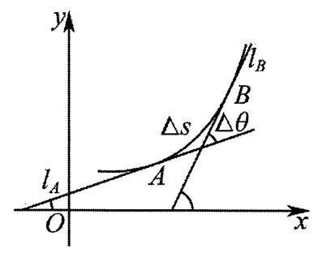

【28】定义: 若 ${h}^{\prime }\left( x\right)$ 是 $h\left( x\right)$ 的导数, ${h}^{\prime \prime }\left( x\right)$ 是 ${h}^{\prime }\left( x\right)$ 的导数,则曲线 $y = h\left( x\right)$ 在点 $\left( {x, h\left( x\right) }\right)$ 处的曲率 $K = \frac{\left| {h}^{\prime \prime }\left( x\right) \right| }{{\left\{  1 + {\left\lbrack  {h}^{\prime }\left( x\right) \right\rbrack  }^{2}\right\}  }^{\frac{3}{2}}}$ ; 已知函数 $f\left( x\right)  = {\mathrm{e}}^{x}\sin \left( {\frac{\pi }{2} + x}\right) , g\left( x\right)  = x + \left( {{2a} - 1}\right) \cos x,\left( {a < \frac{1}{2}}\right)$ ,曲线 $y = g\left( x\right)$ 在点 $\left( {0, g\left( 0\right) }\right)$ 处的曲率为 $\frac{\sqrt{2}}{4}$ ;

(1)求实数 $a$ 的值；

(2)对任意 $x \in  \left\lbrack  {-\frac{\pi }{2},0}\right\rbrack$ ， ${mf}\left( x\right)  \geq  {g}^{\prime }\left( x\right)$ 恒成立，求实数 $m$ 的取值范围；

(3)设方程 $f\left( x\right)  = {g}^{\prime }\left( x\right)$ 在区间 $\left( {{2n\pi } + \frac{\pi }{3},{2n\pi } + \frac{\pi }{2}}\right) \left( {n \in  {\mathrm{N}}^{ * }}\right)$ 内的根为 ${x}_{1},{x}_{2},\ldots ,{x}_{n},\ldots$ 比较 ${x}_{n + 1}$ 与 ${x}_{n} + {2\pi }$ 的大小, 并证明.

【29】如图,对于曲线 $\Gamma$ ,存在圆 $C$ 满足如下条件:

①圆 $C$ 与曲线 $\Gamma$ 在点 $\mathrm{A}$ ,且圆心在曲线 $\Gamma$ 凹的一侧;

②圆 $C$ 与曲线 $\Gamma$ 在点 $\mathrm{A}$ 处有相同的切线;

③曲线 $\Gamma$ 的导函数在点 $\mathrm{A}$ 处的导数(即曲线 $\Gamma$ 的二阶导数)等于圆 $C$ 在点 $\mathrm{A}$ 处的二阶导数(已知圆 ${\left( x - a\right) }^{2} + {\left( y - b\right) }^{2} = {r}^{2}$ 在点 $A\left( {{x}_{0},{y}_{0}}\right)$ 处的二阶导数等于 $\left. {\frac{{r}^{2}}{{\left( b - {y}_{0}\right) }^{3}})}\right)$ 则称圆 $C$ 为曲线 $\Gamma$ 在 $\mathrm{A}$ 点处的曲率圆,其半径 $r$ 称为曲率半径.

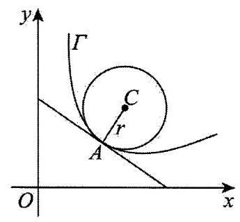

(1)求抛物线 $y = {x}^{2}$ 在原点的曲率圆的方程；

(2)求曲线 $y = \frac{1}{x}$ 的曲率半径的最小值；

(3)若曲线 $y = {\mathrm{e}}^{x}$ 在 $\left( {{x}_{1},{\mathrm{e}}^{{x}_{1}}}\right)$ 和 $\left( {{x}_{2},{\mathrm{e}}^{{x}_{2}}}\right) \left( {{x}_{1} \neq  {x}_{2}}\right)$ 处有相同的曲率半径,求证: ${x}_{1} + {x}_{2} <  - \ln 2$ .

【30】设集合 $M$ 是一个非空数集,对任意 $x, y \in  M$ ,定义 $\rho \left( {x, y}\right)  = \left| {x - y}\right|$ ,称 $\rho$ 为集合 $M$ 的一个度量,称集合 $M$ 为一个对于度量 $\rho$ 而言的度量空间,该度量空间记为 $\left( {M,\rho }\right)$ .

定义 1: 若 $f : M \rightarrow  M$ 是度量空间 $\left( {M,\rho }\right)$ 上的一个函数,且存在 $\alpha  \in  \left( {0,1}\right)$ ,使得对任意 $x, y \in  M$ ,均有: $\rho \left( {f\left( x\right) , f\left( y\right) }\right)  \leq  {\alpha \rho }\left( {x, y}\right)$ ,则称 $f$ 是度量空间 $\left( {M,\rho }\right)$ 上的一个“压缩函数”.

定义 2: 记无穷数列 ${a}_{0},{a}_{1},{a}_{2},\cdots$ 为 ${\left\{  {a}_{n}\right\}  }_{n = 0}^{+\infty }$ ,若 ${\left\{  {a}_{n}\right\}  }_{n = 0}^{+\infty }$ 是度量空间 $\left( {M,\rho }\right)$ 上的数列,且对任意正实数 $\varepsilon  > 0$ , 都存在一个正整数 $N$ ,使得对任意正整数 $m, n \geq  N$ ,均有 $\rho \left( {{a}_{m},{a}_{n}}\right)  < \varepsilon$ ,则称 ${\left\{  {a}_{n}\right\}  }_{n = 0}^{+\infty }$ 是度量空间 $\left( {M,\rho }\right)$ 上的一个“基本数列”.

(1)设 $f\left( x\right)  = \sin x + \frac{1}{2}$ ，证明: $f$ 是度量空间 $\left( {\left\lbrack  {\frac{1}{2},2}\right\rbrack  ,\rho }\right)$ 上的一个“压缩函数”；

(2)已知 $f : \mathbf{R} \rightarrow  \mathbf{R}$ 是度量空间 $\left( {\mathbf{R},\rho }\right)$ 上的一个压缩函数，且 ${a}_{0} \in  \mathbf{R}$ ，定义 ${a}_{n + 1} = f\left( {a}_{n}\right)$ ， $n = 0,1,2,\cdots$ ， 证明: ${\left\{  {a}_{n}\right\}  }_{n = 0}^{+\infty }$ 为度量空间 $\left( {\mathbf{R},\rho }\right)$ 上的一个“基本数列”.

31~50 题

【31】函数 $f\left( x\right)  = {\mathrm{e}}^{\sin x} - {\mathrm{e}}^{\cos x}$ 在 $\left( {0,{2\pi }}\right)$ 范围内极值点的个数为___.

【32】与曲线在某点处的切线垂直, 且过该点的直线称为曲线在某点处的法线. 关于曲线的法线有下列四种说法:

①存在一类曲线，其法线恒过定点；

②若曲线 $y = {x}^{4}$ 的法线的纵截距存在，则其最小值为 $\frac{3}{4}$ ；

③存在两条直线既是曲线 $y = {\mathrm{e}}^{x}$ 的法线，也是曲线 $y = \ln x$ 的法线；

④曲线 $y = \sin x$ 的任意法线与该曲线的公共点个数均为 1 .

其中所有说法正确的序号是___.

【33】已知函数 $f\left( x\right)  = {ax} - \frac{4\left( {x - 1}\right) }{{\mathrm{e}}^{x - 3}}\left( {x > 2}\right)$ 的图象经过 $A, B$ 两点,且 $f\left( x\right)$ 的图象在 $A, B$ 处的切线互相垂直, 则实数 $a$ 的取值范围是___.

【34】已知函数 $f\left( x\right)  = 3{\frac{x}{{\mathrm{e}}^{x}}}^{2} + \left( {{a}^{2} - 1}\right) \frac{x}{{\mathrm{e}}^{x}} + 1 - {a}^{2}$ 有三个不同的零点 ${x}_{1},{x}_{2},{x}_{3}$ ,其中 ${x}_{1} < {x}_{2} < {x}_{3}$ 则 ${\left( 1 - \frac{{x}_{1}}{{\mathrm{e}}^{{x}_{1}}}\right) }^{2}\left( {1 - \frac{{x}_{2}}{{\mathrm{e}}^{{x}_{2}}}}\right) \left( {1 - \frac{{x}_{3}}{{\mathrm{e}}^{{x}_{3}}}}\right)$ 的值为___.

【35】已知 $0 < {x}_{i} < {y}_{i} \leq  4,{x}_{i}^{{y}_{i}} = {y}_{i}^{{x}_{i}}\left( {i = 1,2,\cdots }\right)$ ,则使不等式 $\left( {\mathop{\sum }\limits_{{i = 1}}^{n}{x}_{i}}\right) \left( {\mathop{\sum }\limits_{{i = n + 1}}^{{2n}}{y}_{i}}\right)  \leq  {2024}$ 能成立的正整数 $n$ 的最大值为___.

【36】如图,在 $\bigtriangleup  {ABC}$ 中，已知 $\angle {BAC} = {120}^{ \circ  }$ ，其内切圆与 ${AC}$ 边相切于点 $D$ ，且 ${AD} = 1$ ，延长 ${BA}$ 到 $E$ ， 使 ${BE} = {BC}$ ,连接 ${CE}$ ,设以 $E, C$ 为焦点且经过点 $A$ 的椭圆的离心率为 ${e}_{1}$ ,以 $E, C$ 为焦点且经过点 $A$ 的双曲线的离心率为 ${e}_{2}$ ，则 ${e}_{1}{e}_{2}$ 的取值范围是___.

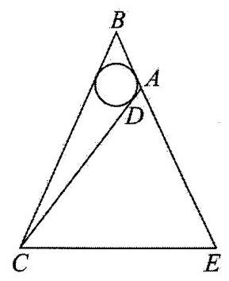

【37】如图，在直三棱柱 ${ABC} - {A}_{1}{B}_{1}{C}_{1}$ 中， ${AB}\bot {BC},{AB} = {BC} = {A{A}_{1}} = 2, P$ 为线段 ${A}_{1}{B}_{1}$ 的中点， $Q$ 为线段 ${C}_{1}P$ (包括端点)上一点，则 $\bigtriangleup  {BCQ}$ 的面积的取值范围为___.

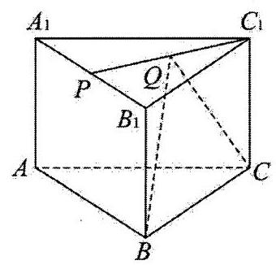

【38】设函数 $f\left( x\right)  = \sin \left( {{\omega x} + \varphi }\right) \left( {\omega  > 0,\left| \varphi \right|  \leq  \frac{\pi }{2}}\right)$ ,若 $x =  - \frac{\pi }{3}$ 为函数 $f\left( x\right)$ 的零点， $x = \frac{\pi }{3}$ 为函数 $f\left( x\right)$ 的图象的对称轴,且 $f\left( x\right)$ 在区间 $\left( {\frac{\pi }{12},\frac{\pi }{4}}\right)$ 上单调,则 $\omega$ 的最大值为___.

【39】已知圆 ${C}_{1} : {x}^{2} + {y}^{2} = 1$ ，圆 ${C}_{2} : {x}^{2} + {y}^{2} = {2x}$ ，过 ${C}_{2}$ 上一点 $P$ 作 ${C}_{2}$ 的切线与 ${C}_{1}$ 交于 $A, B$ 不同两点， $\overrightarrow{{C}_{1}Q} = \overrightarrow{{C}_{1}A} + \overrightarrow{{C}_{1}B}$ ，点 $R$ 的坐标为 $\left( {-1,0}\right)$ ，则 $\left| {QR}\right|$ 的取值范围为___.

【40】已知 $k$ 是正整数，且 $1 \leq  k \leq  {2024}$ ，则满足方程 $\sin {1}^{ \circ  } + \sin {2}^{ \circ  } + \cdots  + \sin {k}^{ \circ  } = \sin {1}^{ \circ  } \cdot  \sin {2}^{ \circ  }\cdots \sin {k}^{ \circ  }$ 的 $k$ 有___个.

【41】已知 $\bigtriangleup  {ABC}$ 的角 $A, B, C$ 满足 $\tan A\tan B\tan C \leq  \left\lbrack  {\tan A}\right\rbrack   + \left\lbrack  {\tan B}\right\rbrack   + \left\lbrack  {\tan C}\right\rbrack$ ，其中符号 $\left\lbrack  x\right\rbrack$ 表示不大于 $x$ 的最大整数,若 $A \leq  B \leq  C$ ,则 $\tan C - \tan B =$ ___.

【42】已知函数 $f\left( x\right)  = \sin x$ ,若存在 ${x}_{1},{x}_{2},\ldots ,{x}_{n}$ 满足 $0 \leq  {x}_{1} < {x}_{2} < \ldots  < {x}_{n} \leq  {n\pi }, n \in  {\mathrm{N}}^{ * }$ ,且 $\left| {f\left( {x}_{1}\right)  - f\left( {x}_{2}\right) }\right|  + \left| {f\left( {x}_{2}\right)  - f\left( {x}_{3}\right) }\right|  + \cdots  + \left| {f\left( {x}_{m + }\right)  - f\left( {x}_{m}\right) }\right|  = {2024},\left( {m \geq  2, m \in  {\mathrm{N}}^{ * }}\right)$ ,当 $m$ 取最小值时,则此时 $m$ 的值为___.

【43】已知存在 $\overrightarrow{{a}_{k}} \in  \left\{  {\left( {x, y, z}\right)  \mid  {x}^{2} + {y}^{2} + {z}^{2} = 1}\right\}  \left( {k = 1,2,3,\cdots ,6}\right)$ ,对任意 $1 \leq  i < j \leq  6$ 都有 $\overrightarrow{{a}_{i}} \cdot  \overrightarrow{{a}_{j}} \leq  M$ ,则实数 $M$ 的最小值为___.

【44】对于函数 $f\left( x\right)$ ,若实数 ${x}_{0}$ 满足 $f\left( {x}_{0}\right)  = {x}_{0}$ ,则称 ${x}_{0}$ 为 $f\left( x\right)$ 的不动点. 已知 $a \geq  0$ ,且 $f\left( x\right)  = \frac{1}{2}\ln x + a{x}^{2} + 1 - a$ 的不动点的集合为 A. 以 $\min M$ 和 $\max M$ 分别表示集合 $M$ 中的最小元素和最大元素.

(1)若 $a = 0$ ，求 $\mathrm{A}$ 的元素个数及 $\max A$ ；

(2)当A恰有一个元素时， $a$ 的取值集合记为 $B$ .

(i) 求 $B$ ;

(ii) 若 $a = \min B$ ,数列 $\left\{  {a}_{n}\right\}$ 满足 ${a}_{1} = 2,{a}_{n + 1} = \frac{f\left( {a}_{n}\right) }{{a}_{n}}$ ,集合 ${C}_{n} = \left\{  {\mathop{\sum }\limits_{{k = 1}}^{n}\left| {{a}_{k} - 1}\right| ,\frac{4}{3}}\right\}  , n \in  {\mathrm{N}}^{ * }$ . 求证: $\forall n \in  {\mathrm{N}}^{ * }$ , $\max {C}_{n} = \frac{4}{3}$

【45】“让式子丢掉次数”:伯努利不等式

伯努利不等式 (Bernoulli'sInequality), 又称贝努利不等式, 是高等数学的分析不等式中最常见的一种不等式,由瑞士数学家雅各布伯努利提出: 对实数 $x \in  \left( {-1, + \infty }\right)$ ,在 $n \in  \lbrack 1, + \infty )$ 时,有不等式 ${\left( 1 + x\right) }^{n} \geq  1 + {nx}$ 成立; 在 $n \in  \left( {0,1}\right)$ 时,有不等式 ${\left( 1 + x\right) }^{n} \leq  1 + {nx}$ 成立.

(1)猜想伯努利不等式等号成立的条件;

(2)当 $n \geq  1$ 时，对伯努利不等式进行证明；

(3)考虑对多个变量的不等式问题. 已知 ${a}_{1},{a}_{2},\cdots ,{a}_{n}\left( {n \in  {\mathrm{N}}^{ * }}\right)$ 是大于 -1 的实数(全部同号)，证明 $\left( {1 + {a}_{1}}\right) \left( {1 + {a}_{2}}\right) \cdots \left( {1 + {a}_{n}}\right)  \geq  1 + {a}_{1} + {a}_{2} + \cdots  + {a}_{n}$

【46】对于有穷数列 ${a}_{1},{a}_{2},\cdots ,{a}_{m}\left( {m \geq  3}\right)$ ,若存在等差数列 $\left\{  {b}_{n}\right\}$ ,使得 ${b}_{1} \leq  {a}_{1} < {b}_{2} \leq  {a}_{2} < \cdots  < {b}_{m} \leq  {a}_{m} < {b}_{m + 1}$ , 则称数列 $\left\{  {a}_{n}\right\}$ 是一个长为 $m$ 的 “弱等差数列”.

(1)证明:数列1,2,4 是“弱等差数列”；

(2)设函数 $f\left( x\right)  = x\sin x, f\left( x\right)$ 在 $\left( {0,{2024}}\right)$ 内的全部极值点按从小到大的顺序排列为 ${a}_{1},{a}_{2},\cdots ,{a}_{m}$ ，证明: ${a}_{1},{a}_{2},\cdots ,{a}_{m}$ 是“弱等差数列”;

(3)证明:存在长为 2024 的“弱等差数列” $\left\{  {a}_{n}\right\}$ ，且 $\left\{  {a}_{n}\right\}$ 是等比数列.

【47】对于一组向量 $\overrightarrow{{a}_{1}},\overrightarrow{{a}_{2}},\overrightarrow{{a}_{3}},\ldots ,\overrightarrow{{a}_{n}},\left( {n \in  \mathbf{N}\text{ 且 }n \geq  3}\right)$ ,令 $\overrightarrow{{S}_{n}} = \overrightarrow{{a}_{1}} + \overrightarrow{{a}_{2}} + \overrightarrow{{a}_{3}}\cdots  + \overrightarrow{{a}_{n}}$ ,如果存在 $\overrightarrow{{a}_{p}}\left( {p \in  \{ 1,2,3,\cdots , n\} }\right)$ ,使得 $\left| \overrightarrow{{a}_{p}}\right|  \geq  \left| {\overrightarrow{{S}_{n}} - \overrightarrow{{a}_{p}}}\right|$ ,那么称 $\overrightarrow{{a}_{p}}$ 是该向量组的 “长向量”.

(1)设 $\overrightarrow{{a}_{n}} = \left( {n, x + {2n}}\right) , n \in  \mathbf{N}$ 且 $n > 0$ ，若 $\overrightarrow{{a}_{3}}$ 是向量组 $\overrightarrow{{a}_{1}},\overrightarrow{{a}_{2}},\overrightarrow{{a}_{3}}$ ， $\ldots ,\overrightarrow{{a}_{7}}$ 是否存在“长向量”？给出你的结

(2)若 $\overrightarrow{{a}_{n}} = \left( {\sin \frac{n\pi }{2},\cos \frac{n\pi }{2}}\right) , n \in  \mathbf{N}$ 且 $n > 0$ ，向量组 $\overrightarrow{{a}_{1}},\overrightarrow{{a}_{2}},\overrightarrow{{a}_{3}},\ldots ,\overrightarrow{{a}_{7}}$ 是否存在“长向量”？给出你的结论并说明理由;

(3)已知 $\overrightarrow{{a}_{1}},\overrightarrow{{a}_{2}},\overrightarrow{{a}_{3}}$ 均是向量组 $\overrightarrow{{a}_{1}},\overrightarrow{{a}_{2}},\overrightarrow{{a}_{3}}$ 的“长向量”，其中 $\overrightarrow{{a}_{1}} = \left( {\sin x,\cos x}\right) ,\overrightarrow{{a}_{2}} = \left( {2\cos x,2\sin x}\right)$ . 设在平面直角坐标系中有一点列 ${P}_{1},{P}_{2},{P}_{3},\ldots ,{P}_{n}$ 满足, ${P}_{1}$ 为坐标原点, ${P}_{2}$ 为 ${\overrightarrow{a}}_{3}$ 的位置向量的终点,且 ${P}_{{2k} + 1}$ 与 ${P}_{2k}$ 关于点 ${P}_{1}$ 对称, ${P}_{{2k} + 2}$ 与 ${P}_{{2k} + 1}\left( {k \in  \mathbf{N}}\right.$ 且 $k > 0$ ) 关于点 ${P}_{2}$ 对称,求 $\left| \overline{{P}_{1013}{P}_{1014}}\right|$ 的最小值.

【48】对于函数 $y = f\left( x\right) , x \in  {D}_{1}, y = g\left( x\right) , x \in  {D}_{2}$ 及实数 $m$ ,若存在 ${x}_{1} \in  {D}_{1},{x}_{2} \in  {D}_{2}$ ,使得 $f\left( {x}_{1}\right)  + g\left( {x}_{2}\right)  = m$ , 则称函数 $f\left( x\right)$ 与 $g\left( x\right)$ 具有“ $m$ 关联”性质.

(1)若 $f\left( x\right)  = \sin x$ 与 $g\left( x\right)  = \cos {2x}$ 具有“m 关联”性质，求 $m$ 的取值范围；

(2)已知 $a > 0$ ， $f\left( x\right)$ 为定义在 $\mathrm{R}$ 上的奇函数，且满足；

①在 $\left\lbrack  {0,{2a}}\right\rbrack$ 上，当且仅当 $x = \frac{a}{2}$ 时， $f\left( x\right)$ 取得最大值 1 ；

②对任意 $x \in  \mathbf{R}$ ，有 $f\left( {a + x}\right)  + f\left( {a - x}\right)  = 0$ .

求证: ${y}_{1} = \sin {\pi x} + f\left( x\right)$ 与 ${y}_{2} = \cos {\pi x} - f\left( x\right)$ 不具有 “4 关联” 性.

【49】已知 ${A}_{n} : {a}_{1},{a}_{2},\cdots ,{a}_{n}\left( {n \geq  3}\right)$ 为有穷整数数列,若 ${A}_{n}$ 满足: ${a}_{i + 1} - {a}_{i} \in  \{ p, q\} \left( {i = 1,2,\cdots , n - 1}\right)$ ,其中 $p$ , $q$ 是两个给定的不同非零整数,且 ${a}_{1} = {a}_{n} = 0$ ,则称 ${A}_{n}$ 具有性质 $T$ .

(1)若 $p =  - 1, q = 2$ ，那么是否存在具有性质 $T$ 的 ${A}_{5}$ ? 若存在，写出一个这样的 ${A}_{5}$ ；若不存在，请说明理由;

(2)若 $p =  - 1, q = 2$ ，且 ${A}_{10}$ 具有性质 $T$ ，求证: ${a}_{1},{a}_{2},\cdots ,{a}_{9}$ 中必有两项相同；

(3)若 $p + q = 1$ ，求证:存在正整数 $k$ ，使得对任意具有性质 $T$ 的 ${A}_{k}$ ，都有 ${a}_{1},{a}_{2},\cdots ,{a}_{k - 1}$ 中任意两项均不相同.

【50】将数列 ${N}_{0} : 1,2,3,4,\cdots$ 中项数为平方数的项依次选出构成数列 ${A}_{1} : 1,4,9,{16},\cdots$ ,此时数列 ${N}_{0}$ 中剩下的项构成数列 ${N}_{1} : 2,3,5,6,\cdots$ ; 再将数列 ${N}_{1}$ 中项数为平方数的项依次选出构成数列 ${A}_{2} : 2,6,{12},{20},\cdots$ ,剩下的项构成数列 ${N}_{2}$ ; .... 如此操作下去,将数列 ${N}_{k - 1}\left( {k \in  {\mathbf{N}}^{ * }}\right)$ 中项数为平方数的项依次选出构成数列 ${A}_{k}$ , 剩下的项构成数列 ${N}_{k}$ .

(1)分别写出数列 ${A}_{3},{A}_{4}$ 的前 2 项;

(2)记数列 ${A}_{m}$ 的第 $n$ 项为 $f\left( {m, n}\right)$ . 求证:当 $n \geq  2$ 时， $f\left( {m, n}\right)  - f\left( {m, n - 1}\right)  = {2n} + m - 2$ ；

(3)若 $f\left( {m, n}\right)  = {108}$ ，求 $m, n$ 的值.

51~80 题

【51】函数 $f\left( x\right)$ 的定义域为 $\left( {-\infty , + \infty }\right)$ ,其导函数为 ${f}^{\prime }\left( x\right)$ ,若 $f\left( x\right)  = f\left( {-x}\right)  - 2\sin x$ ,且当 $x \geq  0$ 时, ${f}^{\prime }\left( x\right)  >  - \cos x$ ，则不等式 $f\left( {x + \frac{\pi }{2}}\right)  > f\left( x\right)  + \sin x - \cos x$ 的解集为___.

【52】 $\bigtriangleup {ABC}$ 中,角 $A, B, C$ 所对的三边分别为 $a, b, c, c = {2b}$ ,若 $\bigtriangleup {ABC}$ 的面积为 1,则 ${BC}$ 的最小值是___.

【53】已知平面向量 $\overrightarrow{a},\overrightarrow{b},\overrightarrow{c}$ 满足: $\left| \overrightarrow{a}\right|  = \left| \overrightarrow{b}\right|  = \left| {\overrightarrow{a} + \overrightarrow{b}}\right| ,\left| \overrightarrow{c}\right|  = 2\left| {\overrightarrow{a} - \overrightarrow{c}}\right|  = 2$ ，则 $\left| {\overrightarrow{b} - \overrightarrow{c}}\right|$ 的最小值是___.

【54】已知 $\overrightarrow{e}$ 是单位向量,向量 $\overrightarrow{{b}_{i}}\left( {i = 1,2}\right)$ 满足 $\left| {\overrightarrow{e} - \overrightarrow{{b}_{i}}}\right|  = \overrightarrow{e} \cdot  \overrightarrow{{b}_{i}}$ ,且 $x\overrightarrow{{b}_{1}} + y\overrightarrow{{b}_{2}} = \overrightarrow{e}$ ,其中 $x, y \in  \mathbf{R}$ ,且 $x + y = 1$ . 则下列结论中，正确结论的序号是___.

① $x\overrightarrow{e} \cdot  \overrightarrow{{b}_{1}} + y\overrightarrow{e} \cdot  \overrightarrow{{b}_{2}} = 1$ ；

② $\left( {y\left| x\right|  + x\left| y\right| }\right) \left| {\overrightarrow{{b}_{1}} - \overrightarrow{{b}_{2}}}\right|  = \frac{1}{2}$ ；

③存在 $x, y$ ，使得 $\left| {\overrightarrow{{b}_{1}} - \overrightarrow{{b}_{2}}}\right|  = 2$ ；

④ 当 $\left| {\overrightarrow{{b}_{1}} - \overrightarrow{{b}_{2}}}\right|$ 取最小值时， $\overrightarrow{{b}_{1}} \cdot  \overrightarrow{{b}_{2}} = 0$ .

【55】已知 $\overrightarrow{{e}_{1}} + \overrightarrow{{e}_{2}} + \overrightarrow{{e}_{3}} = \overrightarrow{0}$ ，且 $\left| \overrightarrow{{e}_{1}}\right|  = \left| \overrightarrow{{e}_{2}}\right|  = \left| \overrightarrow{{e}_{3}}\right|  = 1$ ，实数 $x, y, z$ 满足 $x + y + z = 1$ ，且 $0 \leq  x \leq  \frac{1}{2} \leq  y \leq  1$ ，则 $\left| {x\overrightarrow{{e}_{1}} + y\overrightarrow{{e}_{2}} + z\overrightarrow{{e}_{3}}}\right|$ 的最小值是___.

【56】已知平面向量 $\overrightarrow{a},\overrightarrow{b}$ 满足 $\left| \overrightarrow{a}\right|  = \left| {\overrightarrow{a} + \overrightarrow{b}}\right|  = 1,\overrightarrow{a} \cdot  \overrightarrow{b} =  - \frac{1}{2}$ ，向量 $\overrightarrow{p}$ 满足 $\overrightarrow{p} = \left( {2 - \lambda }\right) \overrightarrow{a} + \lambda \overrightarrow{b}$ ，当 $\overrightarrow{p}$ 与 $\overrightarrow{p} - \overrightarrow{a}$ 的夹角余弦值取得最小值时，实数 $\lambda$ 的值为___.

【57】若从无穷数列 $\left\{  {a}_{n}\right\}$ 中任取若干项 ${a}_{{n}_{1}},{a}_{{n}_{2}},\ldots ,{a}_{{n}_{k}}$ (其中 ${n}_{1} < {n}_{2} < \cdots  < {n}_{k}$ ) 都依次为数列 $\left\{  {b}_{n}\right\}$ 中的连续 $k$ 项，则称 $\left\{  {b}_{n}\right\}$ 是 $\left\{  {a}_{n}\right\}$ 的“衍生数列”. 给出以下两个命题:

(1)数列 $1,2,3,\cdots , n,\cdots$ 是某个数列的“衍生数列”，

(2)若 $\left\{  {a}_{n}\right\}$ 各项均为 0 或 1，且是自身的“衍生数列”，则 $\left\{  {a}_{n}\right\}$ 从某一项起为常数列. 下列判断正确的是( ).

A. (1)(2)均为真命题 B. (1)(2)均为假命题

C. (1)为真命题，(2)为假命题 D. (1)为假命题，(2)为真命题

【58】已知定义在 $\mathbf{R}$ 上的函数 $y = f\left( x\right)$ . 对任意区间 $\left\lbrack  {a, b}\right\rbrack$ 和 $c \in  \left\lbrack  {a, b}\right\rbrack$ ,若存在开区间 $I$ ,使得 $c \in  I \cap  \left\lbrack  {a, b}\right\rbrack$ , 且对任意 $x \in  I \cap  \left\lbrack  {a, b}\right\rbrack  \left( {x \neq  c}\right)$ 都成立 $f\left( x\right)  < f\left( c\right)$ ,则称 $c$ 为 $f\left( x\right)$ 在 $\left\lbrack  {a, b}\right\rbrack$ 上的一个“ $M$ 点”. 有以下两个命题:

①若 $f\left( {x}_{0}\right)$ 是 $f\left( x\right)$ 在区间 $\left\lbrack  {a, b}\right\rbrack$ 上的最大值，则 ${x}_{0}$ 是 $f\left( x\right)$ 在区间 $\left\lbrack  {a, b}\right\rbrack$ 上的一个 $M$ 点；

② 若对任意 $a < b$ ， $b$ 都是 $f\left( x\right)$ 在区间 $\left\lbrack  {a, b}\right\rbrack$ 上的一个 $M$ 点，则 $f\left( x\right)$ 在 $\mathbf{R}$ 上严格增.

那么 ( )

A. ①是真命题，②是假命题 B. ①是假命题，②是真命题

C. ①、②都是真命题 D. ①、②都是假命题

【59】在数学中, 布劳威尔不动点定理是拓扑学里一个非常重要的不动点定理, 它可应用到有限维空间, 并构成了一般不动点定理的基石. 简单来说就是对于满足一定条件的连续函数 $f\left( x\right)$ ,存在一个点 ${x}_{0}$ , 使得 $f\left( {x}_{0}\right)  = {x}_{0}$ ,那么我们称 $f\left( x\right)$ 为 “不动点”函数. 若 $f\left( x\right)$ 存在 $n$ 个点 ${x}_{i}\left( {i = 1,2,\cdots , n}\right)$ ,满足 $f\left( {x}_{i}\right)  = {x}_{i}$ , 则称 $f\left( x\right)$ 为“ $n$ 型不动点”函数，则下列函数中为“ 3 型不动点”函数的是( )

A. $f\left( x\right)  = 1 - \ln x$ B. $f\left( x\right)  = 5 - \ln x - {\mathrm{e}}^{x}$

C. $f\left( x\right)  = \frac{4{\mathrm{e}}^{x - 2}}{x}$ D. $f\left( x\right)  = 2\sin x + 2\cos x$

【60】信息熵是信息论中的一个重要概念. 设随机变量 $X$ 所有可能的取值为 $1,2,\cdots , n$ ,且 $P\left( {X = i}\right)  = {p}_{i} > 0 \; \left( {i = 1,2,\cdots , n}\right) ,\mathop{\sum }\limits_{{i = 1}}^{n}{p}_{i} = 1$ ，定义 $X$ 的信息熵 $H\left( x\right)  =  - \mathop{\sum }\limits_{{i = 1}}^{n}{p}_{i}{\log }_{2}{p}_{i}$ ，则下列判断中正确的是( )

① 若 ${P}_{i} = \frac{1}{n}\left( {i = 1,2,\cdots , n}\right)$ ，则 $H\left( x\right)  = {\log }_{2}n$

②若 $H\left( x\right)  = 0$ ，则 $n = 1$ ；

③若 $n = 2$ ，则当 ${p}_{1} = \frac{1}{2}$ 时， $H\left( x\right)$ 取得最大值

④若 $n = {2m}$ ，随机变量 $Y$ 所有可能的取值为 $1,2,\cdots , m$ ，且 $P\left( {Y = j}\right)  = {p}_{j} + {p}_{{2m} + 1 - j}\left( {j = 1,2,\cdots , m}\right)$ ，则 $H\left( X\right)  > H\left( Y\right)$

A. ①② B. ②③ C. ①②④ D. ①②③④

【61】定义: 设二元函数 $z = f\left( {x, y}\right)$ 在点 $\left( {{x}_{0},{y}_{0}}\right)$ 的附近有定义,当 $y$ 固定在 ${y}_{0}$ 而 $x$ 在 ${x}_{0}$ 处有改变量 $\Delta \mathrm{x}$ 时, 相应的二元函数 $z = f\left( {x, y}\right)$ 有改变量 ${\Delta z} = f\left( {{x}_{0} + {\Delta x},{y}_{0}}\right)  - f\left( {{x}_{0},{y}_{0}}\right)$ ,如果 $\mathop{\lim }\limits_{{{\Delta x} \rightarrow  0}}\frac{\Delta z}{\Delta x}$ 存在,那么称此极限为二元函数 $z = f\left( {x, y}\right)$ 在点 $\left( {{x}_{0},{y}_{0}}\right)$ 处对 $x$ 的偏导数,记作 ${f}_{x}\left( {{x}_{0},{y}_{0}}\right)$ . 若 $z = f\left( {x, y}\right)$ 在区域 $D$ 内每一个点 $\left( {x, y}\right)$ 对 $x$ 的偏导数都存在,那么这个偏导数就是一个关于 $x, y$ 的二元函数,它就被称为二元函数 $z = f\left( {x, y}\right)$ 对自变量 $x$ 的偏导函数,记作 ${f}_{x}\left( {x, y}\right)$ . 已知 $F\left( {x, y}\right)  = {x}^{2} + {y}^{2} - {xy}$ ,若 $F\left( {x, y}\right)  = 1$ ,则 ${F}_{x}\left( {x, y}\right)  + {F}_{y}\left( {x, y}\right)$ 的取值范围为( )

A. $( - \infty ,2\rbrack$ B. $\left\lbrack  {-2,2}\right\rbrack$ C. $\left( {0,2}\right)$ D. $\lbrack 2, + \infty )$

【62】已知正实数 $C$ 满足: 对于任意 $\theta$ ,均存在 $i, j \in  \mathbf{Z},0 \leq  i \leq  j \leq  {255}$ ,使得 $\left| {{\cos }^{2}\theta  - \frac{i}{j}}\right|  \leq  C$ ,记 $C$ 的最小值为 $\lambda$ ,则 ( )

A. $\frac{1}{2000} < \lambda  < \frac{1}{1000}$ B. $\frac{1}{1000} < \lambda  < \frac{1}{500}$

C. $\frac{1}{500} < \lambda  < \frac{1}{200}$ D. $\frac{1}{200} < \lambda  < \frac{1}{100}$

【63】在 $\bigtriangleup  {ABC}$ 中， ${AB} = {AC} = 1$ ，点 $D$ 在 $\bigtriangleup  {ABC}$ 所在平面内，对任意 $t \in  R$ ，都有 $\left| {\overrightarrow{DC} - t \cdot  \overrightarrow{DB}}\right|  \geq  \left| \overrightarrow{BC}\right|$ 恒成立， 且 $\left| \overrightarrow{BD}\right|  = \left| \overrightarrow{BC}\right|$ ，则 $\left| \overrightarrow{AD}\right|$ 的最大值为( )

A. $1 + \sqrt{2}$ B. $3 + 2\sqrt{2}$ C. $\sqrt{4 - \sqrt{3}}$ D. $4 - \sqrt{3}$

【64】设 ${a}_{1},{a}_{2},{a}_{3},{a}_{4} \in  R$ ,且 ${a}_{1}{a}_{4} - {a}_{2}{a}_{3} = 1$ ,记 $f\left( {{a}_{1},{a}_{2},{a}_{3},{a}_{4}}\right)  = {a}_{1}^{2} + {a}_{2}^{2} + {a}_{3}^{2} + {a}_{4}^{2} + {a}_{1}{a}_{3} + {a}_{2}{a}_{4}$ ,则 $f\left( {{a}_{1},{a}_{2},{a}_{3},{a}_{4}}\right)$ 的最小值为( )

A. 1 B. $\sqrt{3}$ C. 2 D. $2\sqrt{3}$

【65】已知 $\alpha ,\beta$ 为两个不重合的平面, $m, n$ 为两条不重合的直线,且 $\alpha  \cap  \beta  = m, n \subset  \beta$ . 记直线 $m$ 与直线 $n$ 的夹角和二面角 $\alpha  - m - \beta$ 均为 ${\theta }_{1}$ ，直线 $n$ 与平面 $\alpha$ 的夹角为 ${\theta }_{2}$ ，则下列说法正确的是( )

A. 若 $0 < {\theta }_{1} < \frac{\pi }{6}$ ，则 ${\theta }_{1} > 2{\theta }_{2}$ B. 若 $\frac{\pi }{6} < {\theta }_{1} < \frac{\pi }{4}$ ，则 $\tan {\theta }_{1} > 2\tan {\theta }_{2}$

C. 若 $\frac{\pi }{4} < {\theta }_{1} < \frac{\pi }{3}$ ，则 $\sin {\theta }_{1} < \sin {\theta }_{2}$ D. 若 $\frac{\pi }{3} < {\theta }_{1} < \frac{\pi }{2}$ ，则 $\cos {\theta }_{1} > \frac{3}{4}\cos {\theta }_{2}$

【66】如图,已知 ${F}_{1},{F}_{2}$ 分别为双曲线 $C : \frac{{x}^{2}}{{a}^{2}} - \frac{{y}^{2}}{{b}^{2}} = 1\left( {a > 0, b > 0}\right)$ 的左、右焦点, $P$ 为第一象限内一点,且满足 $\left| {{F}_{2}P}\right|  = a,\left( {\overrightarrow{{F}_{1}P} + \overrightarrow{{F}_{1}{F}_{2}}}\right)  \cdot  \overrightarrow{{F}_{2}P} = 0$ ,线段 ${F}_{2}P$ 与双曲线 $C$ 交于点 $Q$ ,若 $\left| {{F}_{2}P}\right|  = 5\left| {{F}_{2}Q}\right|$ ,则双曲线 $C$ 的渐近线方程为 ( )

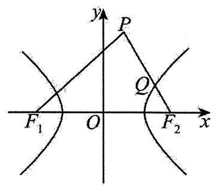

A. $y =  \pm  \frac{\sqrt{5}}{5}x$ B. $y =  \pm  \frac{1}{2}x$

C. $y =  \pm  \frac{\sqrt{3}}{2}x$ D. $y =  \pm  \frac{\sqrt{3}}{3}x$

【67】设 $f\left( x\right)  = a{x}^{2} + {bx} + c\left( {a\text{ 、 }b\text{ 、 }c \in  \mathbf{R}}\right)$ . 已知关于 $x$ 的方程 $f\left( x\right)  = x$ 有纯虚数根,则关于 $x$ 的方程 $f\left( {f\left( x\right) }\right)  = x$ 的解的情况，下列描述正确的是( )

A. 方程只有虚根解, 其中两个是纯虚根

B. 可能方程有四个实数根的解

C. 可能有两个实数根, 两个纯虚数根

D. 可能方程没有纯虚数根的解

【68】已知实数 $\lambda  > 0$ ,记函数构成的集合 ${A}_{\lambda } = \left\{  {m\left( x\right) \left| {\forall {x}_{1},{x}_{2} \in  \mathrm{R},}\right| m\left( {x}_{2}\right)  - m\left( {x}_{1}\right) \left| { < \lambda }\right| {x}_{2} - x \mid  }\right\}$ . 已知实数 $\alpha$ 、 $\beta  > 0$ ,若 $g\left( x\right)  \in  {A}_{\alpha }, h\left( x\right)  \in  {A}_{\beta }$ ,则下列结论正确的是 ( )

A. $g\left( x\right)  \cdot  h\left( x\right)  \in  {A}_{\alpha  \cdot  \beta }$

B. 若 $h\left( x\right)  \neq  0$ ，则 $\frac{g\left( x\right) }{h\left( x\right) } \in  {A}_{\frac{\alpha }{\beta }}$

C. $g\left( x\right)  - h\left( x\right)  \in  {A}_{\alpha  - \beta }$ D. $g\left( x\right)  + h\left( x\right)  \in  {A}_{\alpha  + \beta }$

【69】某市一个经济开发区的公路路线图如图所示, 粗线是大公路, 细线是小公路, 七个公司 ${A}_{1},{A}_{2},{A}_{3},{A}_{4},{A}_{5},{A}_{6},{A}_{7}$ 分布在大公路两侧,有一些小公路与大公路相连. 现要在大公路上设一快递中转站, 中转站到各公司(沿公路走)的距离总和越小越好，则这个中转站最好设在( )

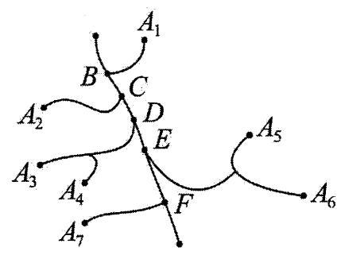

A. 路口 $C$ B. 路口 $D$

C. 路口 $E$ D. 路口 $F$

【70】已知 $a, b \in  \mathbf{R}$ ,函数 $f\left( x\right)  = a\cos x + b\cos {2x}\left( {x \in  \mathbf{R}}\right)$ 的最小值为 -1,则 ( )

A. $a + b$ 的最小值为 1,此时 $\left( {a, b}\right)  = \left( {\frac{1}{3},\frac{2}{3}}\right)$

B. $a + b$ 的最大值为 2,此时 $\left( {a, b}\right)  = \left( {\frac{4}{3},\frac{2}{3}}\right)$

C. $a + b$ 的最小值为 1,此时 $\left( {a, b}\right)  = \left( {\frac{2}{3},\frac{1}{3}}\right)$

D. $a + b$ 的最大值为 2,此时 $\left( {a, b}\right)  = \left( {\frac{2}{3},\frac{4}{3}}\right)$

【71】已知函数 $f\left( x\right)  = {\mathrm{e}}^{x} + {ax} + b - 3\left( {a, b \in  \mathbf{R}}\right)$ 在区间 $\left\lbrack  {1,2}\right\rbrack$ 上总存在零点，则 ${a}^{2} + {\left( b - 4\right) }^{2}$ 的最小值为 ( )

A. $\frac{{\left( \mathrm{e} + 1\right) }^{2}}{2}$ B. $\frac{4}{13}$ C. $\frac{{\left( {\mathrm{e}}^{2} + 1\right) }^{2}}{5}$ D. $\frac{8}{{\mathrm{e}}^{4}}$

【72】假设直线 $L$ 与曲线 $M$ 相切，若切点唯一，则称直线 $L$ 与曲线 $M$ 单切；若切点有两个，则称直线 $L$ 与曲线 $M$ 双切; 若 $L$ 还与曲线 $M$ 相交,则称直线 $L$ 与曲线 $M$ 交切. 已知函数 $f\left( x\right)  = \left| {{x}^{3} - {3x}}\right|$ ,则对下列命题判断正确的是 ( )

① 直线 $y = 2$ 与曲线 $y = f\left( x\right)$ 双切

②存在唯一的直线，与曲线 $y = f\left( x\right)$ 单切且交切

A、①正确，②正确 B、①错误，②正确

C、①正确，②错误 D、①错误，②错误

【73】已知集合 $A = \left\{  {\mathop{\sum }\limits_{{i = 1}}^{m}{2}^{{a}_{i}} \mid  0 \leq  {a}_{1} < {a}_{2} < \cdots  < {q}_{n}, q \in  \mathbf{N}}\right\}$ ，定义:当 $m = t$ 时，把集合 $\mathrm{A}$ 中所有的数从小到大排列成数列 $\left\{  {b{\left( t\right) }_{n}}\right\}$ ,数列 $\left\{  {b{\left( t\right) }_{n}}\right\}$ 的前 $n$ 项和为 $S{\left( t\right) }_{n}$ . 例如: $t = 2$ 时,

$$
b{\left( 2\right) }_{1} = {2}^{0} + {2}^{1} = 3, b{\left( 2\right) }_{2} = {2}^{0} + {2}^{2} = 5, b{\left( 2\right) }_{3} = {2}^{1} + {2}^{2} = 6, b{\left( 2\right) }_{4} = {2}^{0} + {2}^{3} = 9,\cdots ,
$$

$$
S{\left( 2\right) }_{4} = b{\left( 2\right) }_{1} + b{\left( 2\right) }_{2} + b{\left( 2\right) }_{3} + b{\left( 2\right) }_{4} = {23}.
$$

(1)写出 $b{\left( 2\right) }_{5}, b{\left( 2\right) }_{6}$ ，并求 $S{\left( 2\right) }_{10}$ ；

(2)判断 88 是否为数列 $\left\{  {b{\left( 3\right) }_{n}}\right\}$ 中的项. 若是，求出是第几项；若不是，请说明理由；

(3)若 2024 是数列 $\left\{  {b{\left( t\right) }_{n}}\right\}$ 中的某一项 $b{\left( {t}_{0}\right) }_{{n}_{0}}$ ，求 ${t}_{0}$ ， ${n}_{0}$ 及 $S{\left( {t}_{0}\right) }_{{n}_{0}}$ 的值.

【74】对于数列 $A : {a}_{1},{a}_{2},{a}_{3}\left( {{a}_{i} \in  N, i = 1,2,3}\right)$ ,定义 “ $F$ 变换”: $F$ 将数列 $\mathrm{A}$ 变换成数列 $B : {b}_{1},{b}_{2},{b}_{3}$ ,其中 ${b}_{i} = \left| {{a}_{i} - {a}_{i + 1}}\right| \left( {i = 1,2}\right)$ ,且 ${b}_{3} = \left| {{a}_{3} - {a}_{1}}\right|$ . 这种 “ $F$ 变换” 记作 $B = F\left( A\right)$ ,继续对数列 $B$ 进行 “ $F$ 变换”,得到数列 $C : {c}_{1},{c}_{2},{c}_{3}$ ,依此类推,当得到的数列各项均为 0 时变换结束.

(1)写出数列 $A : 2,5,3$ ，经过 6 次“ $F$ 变换”后得到的数列；

(2)若 ${a}_{1},{a}_{2},{a}_{3}$ 不全相等，判断数列 $A : {a}_{1},{a}_{2},{a}_{3}$ 经过不断的“ $F$ 变换”是否会结束，并说明理由；

(3)设数列 $A : {185},3,{188}$ 经过 $k$ 次“ $F$ 变换”得到的数列各项之和最小，求 $k$ 的最小值.

【75】马尔科夫链是概率统计中的一个重要模型, 也是机器学习和人工智能的基石, 在强化学习、自然语言处理、金融领域、天气预测等方面都有着极其广泛的应用. 其数学定义为: 假设我们的序列状态是 $\ldots \ldots {X}_{t - 2},{X}_{t - 1},{X}_{t},{X}_{t + 1},\ldots$ ,那么 ${X}_{t + 1}$ 时刻的状态的条件概率仅依赖前一状态 ${X}_{t}$ ,即

$P\left( {{X}_{t + 1} \mid  \cdots ,{X}_{t - 2},{X}_{t - 1},{X}_{t}}\right)  = P\left( {{X}_{t + 1} \mid  {X}_{t}}\right) .$

现实生活中也存在着许多马尔科夫链, 例如著名的赌徒模型.

假如一名赌徒进入赌场参与一个赌博游戏, 每一局赌徒赌赢的概率为 50%，且每局赌赢可以赢得 1 元, 每一局赌徒赌输的概率为 50%，且赌输就要输掉 1 元. 赌徒会一直玩下去，直到遇到如下两种情况才会结束赌博游戏: 记赌徒的本金为 $A\left( {A \in  {\mathrm{N}}^{ * }, A < B}\right)$ 一种是赌金达到预期的 $B$ 元,赌徒停止赌博; 另一种是赌徒输光本金后,赌徒可以向赌场借钱,最多借 $A$ 元,再次输光后赌场不再借钱给赌徒. 赌博过程如图的数轴所示.

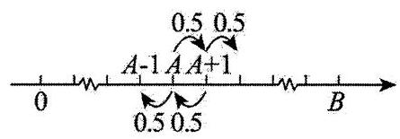

当赌徒手中有 $n$ 元 $\left( {-A \leq  n \leq  B, n \in  Z}\right)$ 时,最终欠债 $A$ 元(可以记为该赌徒手中有 $- A$ 元)概率为 $P\left( n\right)$ ， 请回答下列问题:

(1)请直接写出 $P\left( {-A}\right)$ 与 $P\left( B\right)$ 的数值.

(2)证明 $\{ P\left( n\right) \}$ 是一个等差数列，并写出公差 $d$ .

(3)当 $A = {100}$ 时，分别计算 $B = {300}, B = {1500}$ 时， $P\left( A\right)$ 的数值，论述当 $B$ 持续增大时， $P\left( A\right)$ 的统计含义.

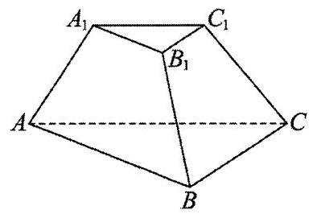

【76】如图，已知三棱台 ${ABC} - {A}_{1}{B}_{1}{C}_{1}$ 的体积为 $\frac{7\sqrt{3}}{12}$ ，平面 ${AB}{B}_{1}{A}_{1} \bot$ 平面 ${BC}{C}_{1}{B}_{1}$ ， $\bigtriangleup  {ABC}$ 是以 $B$ 为直角顶点的等腰直角三角形,且 ${AB} = {2A}{A}_{1} = 2{A}_{1}{B}_{1} = {2B}{B}_{1}$ ,

(1)证明: ${BC}\bot$ 平面 ${AB}{B}_{1}{A}_{1}$ ；

(2)求点 $B$ 到面 ${AC}{C}_{1}{A}_{1}$ 的距离；

(3)在线段 $C{C}_{1}$ 上是否存在点 $F$ ，使得二面角 $F - {AB} - C$ 的大小为 $\frac{\pi }{6}$ ，若存在，求出 ${CF}$ 的长，若不存在， 请说明理由.

【77】如图,已知等腰梯形 ${ABCD}$ 的外接圆圆心 $O$ 在底边 ${AB}$ 上, ${AB}//{CD},{AB} = {3AD} = 9,{CD} = 7$ ,点 $P$ 是上半圆上的动点 (不包含 $\mathrm{A}, B$ 两点),点 $Q$ 是线段 ${PA}$ 上的动点,将半圆 ${APB}$ 所在的平面沿直径 ${AB}$ 折起,使得平面 ${PAB} \bot$ 平面 ${ABCD}$ .

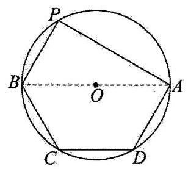

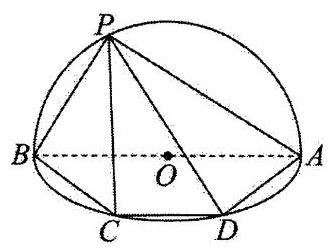

(1)当 ${PC}//$ 平面 ${QBD}$ 时，求 $\frac{\left| PQ\right| }{\left| QA\right| }$ 的值；

(2)证明: ${PB}$ 不可能垂直 ${AD}$ ；

(3)设 ${QB}$ 与平面 ${ABD}$ 所成的角为 $\alpha$ ，二面角 $Q - {BD} - A$ 的平面角为 $\beta$ (其中 $\alpha$ ， $\beta  \in  \left( {0,\frac{\pi }{2}}\right)$ )，求 $\beta  - \alpha$ 的最大值.

【78】如图所示,用一个不平行于圆柱底面的平面,截该圆柱所得的截面为椭圆面,得到的几何体称之为 “斜截圆柱”. 图一与图二是完全相同的“斜截圆柱”, ${AB}$ 是底面圆 $O$ 的直径, ${AB} = {2BC} = 2$ ,椭圆所在平面垂直于平面 ${ABCD}$ ,且与底面所成二面角为 ${45}^{ \circ  }$ ,图一中,点 $P$ 是椭圆上的动点,点 $P$ 在底面上的投影为点 ${P}_{1}$ ,图二中,椭圆上的点 ${E}_{i}\left( {i = 1,2,3,\cdots , n}\right)$ 在底面上的投影分别为 ${F}_{i}$ ,且 ${F}_{i}$ 均在直径 ${AB}$ 的同一侧.

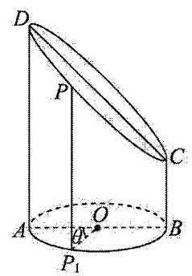

图一

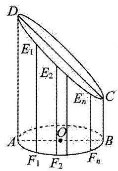

图二

(1)当 $\angle {{AO}{P}_{1}} = \frac{2\pi }{3}$ 时，求 $P{P}_{1}$ 的长度;

(2)(i)当 $n = 6$ 时，若图二中，点 ${F}_{1},{F}_{2},\ldots ,{F}_{6}$ 将半圆均分成 7 等份，求 $\left( {{E}_{1}{F}_{1} - 2}\right)  \cdot  \left( {{E}_{2}{F}_{2} - 2}\right)  \cdot  \left( {{E}_{3}{F}_{3} - 2}\right)$ ；

(ii) 证明: $\overset{\text{ ⏜ }}{A{F}_{1} \cdot  {E}_{1}{F}_{1} + {F}_{1}{F}_{2} \cdot  {E}_{2}{F}_{2} + \cdots  + {F}_{n - 1}{F}_{n} \cdot  {E}_{n}{F}_{n} + {F}_{n}B \cdot  {BC}} < {2\pi }$ .

【79】如图，在四棱锥 $P - {ABCD}$ 中，底面 ${ABCD}$ 为正方形， ${PA}\bot$ 平面 ${ABCD}$ ， ${PD}$ 与底面所成的角为45°， $E$ 为 ${PD}$ 的中点.

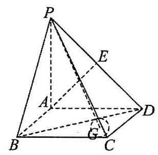

(1)求证: ${AE}\bot$ 平面 ${PCD}$ ；

(2)若 ${AB} = 2, G$ 为 $\bigtriangleup  {BCD}$ 的内心，求直线 ${PG}$ 与平面 ${PCD}$ 所成角的正弦值.

【80】如图,在三棱锥 $P - {ABC}$ 中, ${AB} \bot  {BC},{AB} = 2,{BC} = 2\sqrt{2},{PB} = {PC} = \sqrt{6},{BP},{AP},{BC}$ 的中点分别为 $D, E, O,{AD} = \sqrt{5}{DO}$ ,点 $F$ 在 ${AC}$ 上, ${BF} \bot  {AO}$ .

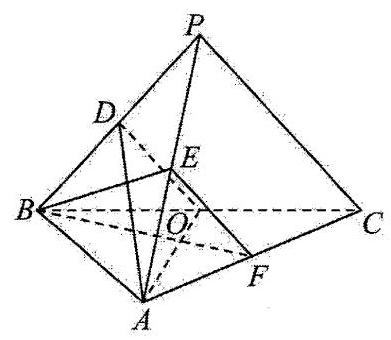

(1)证明: ${EF}//$ 平面 ${ADO}$ ；

(2)证明:平面 ${ADO} \bot$ 平面 ${BEF}$ ；

(3)求二面角 $D - {AO} - C$ 的正弦值.

81~100 题

【81】记 ${N}_{m}^{ * } = \{ 1,2,3,\cdots , m\} \left( {m \in  {\mathrm{N}}^{ * }}\right) ,{A}_{k}$ 表示 $k$ 个元素的有限集, $S\left( E\right)$ 表示非空数集 $E$ 中所有元素的和,若集合 ${M}_{m, k} = \left\{  {S\left( {A}_{k}\right)  \mid  {A}_{k} \subseteq  {N}_{m}^{ * }}\right\}$ ,若 $S\left( {M}_{m,2}\right)  \geq  {817}$ ,则 $m$ 的最小值为___.

【82】“0,1 数列”在通信技术中有着重要应用,它是指各项的值都等于 0 或 1 的数列.设 $\mathrm{A}$ 是一个有限“0, 1 数列”, $f\left( A\right)$ 表示把 $\mathrm{A}$ 中每个 0 都变为1,0,1,每个 1 都变为0,1,0,所得到的新的 “0,1 数列”. 例如 $A = \{ 1,0\}$ ,则 $f\left( A\right)  = \{ 0,1,0,1,0,1\}$ . 设 ${A}_{1}$ 是一个有限“0,1 数列”,定义 ${A}_{k + 1} = f\left( {A}_{k}\right) , k = 1,2,3,\cdots$ . 若有限“0, 1 数列” ${A}_{1} = \{ 0,1,0\}$ ，则数列 ${A}_{2024}$ 的所有项之和为___.

【83】“冰天雪地也是金山银山”，2023-2024 年雪季，东北各地冰雪旅游呈现出一片欣欣向荣的景象，为东北经济发展增添了新动能. 某市以“冰雪童话”为主题打造——圆形“梦幻冰雪大世界”，其中共设“森林姑娘”“扣像墙”“古堡滑梯”等 16 处打卡景观. 若这 16 处景观分别用 ${A}_{1},{A}_{2},\cdots ,{A}_{16}$ 表示，某游客按照箭头所示方向 (不可逆行) 可以任意选择一条路径走向其它景观, 并且每个景观至多经过一次, 那么他从入口出发，按图中所示方向到达 ${A}_{6}$ 有___种不同的打卡路线； 若该游客按上述规则从入口出发到达景观 ${A}_{i}$ 的不同路线有 ${a}_{i}$ 条, 其中 $1 \leq  i \leq  {16}, i \in  \mathrm{N}$ ,记 ${a}_{{2n} + 1} = m\left( {1 \leq  n \leq  7, n \in  \mathrm{N}}\right)$ , 则 $\mathop{\sum }\limits_{{i = 1}}^{n}{a}_{2i} =$ ___(结果用 $m$ 表示).

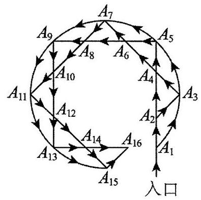

【84】已知无穷数列 $\left\{  {a}_{n}\right\}  ,{a}_{1} = 1$ . 性质 $s : \forall m, n \in  {\mathbf{N}}^{ * },{a}_{m + n} > {a}_{m} + {a}_{n}$ ,; 性质 $t : \forall m, n \in  {\mathbf{N}}^{ * },2 \leq  m < n$ , ${a}_{m - 1} + {a}_{n + 1} > {a}_{m} + {a}_{n}$ ，下列说法中正确的有___

① 若 ${a}_{n} = 3 - {2n}$ ，则 $\left\{  {a}_{n}\right\}$ 具有性质 s；

② 若 ${a}_{n} = {n}^{2}$ ，则 $\left\{  {a}_{n}\right\}$ 具有性质 $t$ ；

③若 $\left\{  {a}_{n}\right\}$ 具有性质 $s$ ，则 ${a}_{n} \geq  n$ ；___，

④若等比数列 $\left\{  {a}_{n}\right\}$ 既满足性质 $s$ 又满足性质 $t$ ，则其公比的取值范围为 $\left( {2, + \infty }\right)$

【85】牛顿法求函数 $y = f\left( x\right)$ 零点的操作过程是: 先在 $x$ 轴找初始点 ${P}_{1}\left( {{x}_{1},0}\right)$ ,然后作 $y = f\left( x\right)$ 在点 ${Q}_{1}\left( {{x}_{1}, f\left( {x}_{1}\right) }\right)$ 处切线，切线与 $x$ 轴交于点 ${P}_{2}\left( {{x}_{2},0}\right)$ ,再作 $y = f\left( x\right)$ 在点 ${Q}_{2}\left( {{x}_{2}, f\left( {x}_{2}\right) }\right)$ 处切线,切线与 $x$ 轴

交于点 ${P}_{3}\left( {{x}_{3},0}\right)$ ,再作 $y = f\left( x\right)$ 在点 ${Q}_{3}\left( {{x}_{3}, f\left( {x}_{3}\right) }\right)$ 处切线,依次类推,直到求得满足精度的零点近似解为止. 设函数 $f\left( x\right)  = {2}^{x}$ ,初始点为 ${P}_{1}\left( {0,0}\right)$ , 若按上述过程操作,则所得的第 $n$ 个三角形 $\bigtriangleup {P}_{n}{Q}_{n}{P}_{n + 1}$ 的面积为___. (用含有 $n$ 的代数式表示)

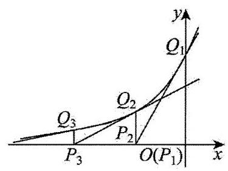

【86】已知数列 $1,1,2,1,2,4,1,2,4,8,1,2,4,8,{16},\ldots$ ,其中第一项是 ${2}^{0}$ ,接下来的两项是 ${2}^{0},{2}^{1}$ ,再接下来的三项是 ${2}^{0},{2}^{1},{2}^{2}$ ,依此类推,若该数列的前 $n$ 项和为 ${S}_{n}$ ,若 ${\log }_{2}\left( {S}_{n}\right)  \in  Z, n \in  {\mathrm{N}}^{ * }$ , 则称 $\left( {n,{\log }_{2}\left( {S}_{n}\right) }\right)$ 为“好数对”,如 ${\log }_{2}\left( {S}_{1}\right)  = {\log }_{2}{2}^{0} = 0,{\log }_{2}\left( {S}_{2}\right)  = {\log }_{2}{2}^{1} = 1$ ,则 $\left( {1,0}\right) ,\left( {2,1}\right)$ 都是“好数对”, 当 $n \geq  {66}$ 时，第一次出现的“好数对”是___.

【87】已知首项为 $\frac{1}{2}$ 的正项数列满足 $\left\{  {a}_{n}\right\}$ 满足 ${a}_{n}^{n + 1} = {a}_{n + 1}^{n}$ ,若存在 $n \in  {\mathrm{N}}^{ * }$ ,使得不等式 $\left( {m - {\left( -1\right) }^{n}{a}_{n}}\right) \left( {m + {\left( -1\right) }^{n}{a}_{n + 3}}\right)  < 0$ 成立,则 $m$ 的取值范围为___.

【88】若数列 $\left\{  {a}_{n}\right\}$ 满足对任意 $n \in  {\mathbf{N}}^{ * }$ ，数列 $\left\{  {a}_{n}\right\}$ 的前 ${n}^{2}$ 项至少有 $n$ 项大于 $n$ ，且 ${a}_{n} \geq  0$ ，则称数列 $\left\{  {a}_{n}\right\}$ 具有性质 ${M}^{2}$ . 若存在具有性质 ${M}^{2}$ 的数列 $\left\{  {a}_{n}\right\}$ ,使得其前 $n$ 项和 ${S}_{n} \leq  {\lambda n}$ 恒成立,则整数 $\lambda$ 的最小值是___.

【89】当 $n \in  {\mathbf{N}}^{ * }$ 时,定义函数 $N\left( n\right)$ 表示 $n$ 的最大奇因数. 如 $N\left( 1\right)  = 1, N\left( 2\right)  = 1, N\left( 3\right)  = 3, N\left( 4\right)  = 1, N\left( 5\right)  = 5$ , $N\left( {10}\right)  = 5$ ，记 $S\left( n\right)  = N\left( 1\right)  + N\left( 2\right)  + N\left( 3\right)  + \cdots N\left( {2}^{n}\right) \left( {n \in  N}\right)$ ，则 $S\left( n\right)  =$ ___.

【90】如图,球 $O$ 内切于圆柱 ${O}_{1}{O}_{2}$ ,圆柱的高为 $2,{EF}$ 为底面圆 ${O}_{1}$ 的一条直径, $D$ 为圆 ${O}_{2}$ 上任意一点, 则平面 ${DEF}$ 截球 $O$ 所得截面面积最小值为___；若 $M$ 为球面和圆柱侧面交线上的一点，则 $\bigtriangleup  {MEF}$ 周长的取值范围为___.

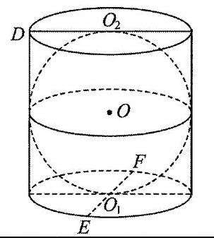

【91】如图,某正方体的顶点 $\mathrm{A}$ 在平面 $\alpha$ 内,三条棱 ${AB},{AC},{AD}$ 都在平面 $\alpha$ 的同侧,若顶点 $B, C, D$ 到平面 $\alpha$ 的距离分别为 $\sqrt{3},2,3$ ，则该正方体外接球的表面积为___.

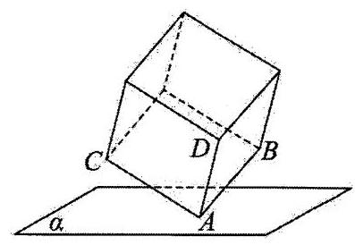

【92】已知函数 $f\left( x\right)  = {x}^{3} - {ax} + 1\left( {a \in  \mathbf{R}}\right)$ 的两个极值点为 ${x}_{1},{x}_{2}\left( {{x}_{1} < {x}_{2}}\right)$ ,记 $A\left( {{x}_{1}, f\left( {x}_{1}\right) }\right) , C\left( {{x}_{2}, f\left( {x}_{2}\right) }\right)$ . 点 $B, D$ 在 $f\left( x\right)$ 的图象上,满足 ${AB},{CD}$ 均垂直于 $y$ 轴. 若四边形 ${ABCD}$ 为菱形,则 $a =$ ___.

【93】如图,四边形 ${ABCD}$ 是圆柱底面的内接四边形, ${AC}$ 是圆柱的底面直径, ${PC}$ 是圆柱的母线, $E$ 是 ${AC}$ 与 ${BD}$ 的交点， ${AB} = {AD}$ ， $\angle {BAD} = {60}^{ \circ  }$ .

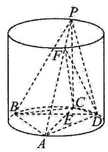

(1)记圆柱的体积为 ${V}_{1}$ ，四棱锥 $P - {ABCD}$ 的体积为 ${V}_{2}$ ，求 $\frac{{V}_{1}}{{V}_{2}}$ ；

(2)设点 $F$ 在线段 ${AP}$ 上， ${PA} = {4PF},{PC} = {4CE}$ ，求二面角 $F - {CD} - P$ 的余弦值.

【94】如图，在圆台 $O{O}_{1}$ 中， ${A}_{1}{B}_{1}$ ， ${AB}$ 分别为上、下底面直径，且 ${A}_{1}{B}_{1}//{AB}$ ， ${AB} = {2{A}_{1}}{B}_{1}$ ， $C{C}_{1}$ 为异于 $A{A}_{1}$ ， $B{B}_{1}$ 的一条母线.

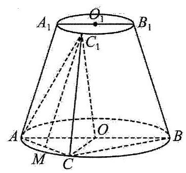

(1)若 $M$ 为 ${AC}$ 的中点，证明: ${C}_{1}M//$ 平面 ${AB}{B}_{1}{A}_{1}$ ；

(2)若 $O{O}_{1} = 3,{AB} = 4,\angle {ABC} = {30}^{ \circ  }$ ，求二面角 $A - {C}_{1}C - O$ 的正弦值.

【95】已知点 $A\left( {-\sqrt{3},0}\right) , B\left( {\sqrt{3},0}\right)$ ,动点 $V$ 满足直线 ${VA}$ 与直线 ${VB}$ 的斜率之积为 $\frac{1}{3}$ ,动点 $V$ 的轨迹为曲线 $C$ .

(1)求曲线 $C$ 的方程:

(2)直线 ${PQ}$ 与曲线 $C$ 交于 $P, Q$ 两点，且 ${BP}\bot {BQ},{BM}\bot {PQ}$ 交 ${PQ}$ 于点 $M$ ，求定点 $N$ 的坐标，使 $\left| {MN}\right|$ 为定值;

(3)过(2)中的点 $N$ 作直线交曲线 $C$ 于 $G, H$ 两点，且两点均在 $y$ 轴的右侧，直线 ${AG},{BH}$ 的斜率分别为 ${k}_{1},{k}_{2}$ ,求 $\frac{{k}_{1}}{{k}_{2}}$ 的值.

【96】已知椭圆 $C : \frac{{x}^{2}}{{a}^{2}} + \frac{{y}^{2}}{{b}^{2}} = 1\left( {a > b > 0}\right)$ 经过点 $\left( {1,\frac{3}{2}}\right)$ ,且离心率为 $\frac{1}{2}$ .

(1)求椭圆 $C$ 的方程；

(2)不过右焦点 ${F}_{2}$ 且与 $x$ 轴垂直的直线交椭圆 $C$ 于 $\mathrm{A}, M$ 两个不同的点，连接 $A{F}_{2}$ 交椭圆 $C$ 于点 $B$ 。

(i) 求证: 直线 ${MB}$ 过定点;

(ii) 若过左焦点 ${F}_{1}$ 的直线交椭圆 $C$ 于 $D, G$ 两个不同的点,且 ${AB} \bot  {DG}$ ,求四边形 ${ADBG}$ 面积的最小值.

【97】已知双曲线 $C : \frac{{x}^{2}}{{a}^{2}} - \frac{{y}^{2}}{{b}^{2}} = 1\left( {a > 0, b > 0}\right)$ 的实轴长为 $2\sqrt{3}$ ,右焦点 ${F}_{2}$ 到一条渐近线的距离为 1 .

(1)求 $C$ 的方程；

(2)过 $C$ 上一点 ${P}_{1}\left( {3,\sqrt{2}}\right)$ 作 $C$ 的切线 ${l}_{1},{l}_{1}$ 与 $C$ 的两条渐近线分别交于 $R, S$ 两点， ${P}_{2}$ 为点 ${P}_{1}$ 关于坐标原点的对称点,过 ${P}_{2}$ 作 $C$ 的切线 ${l}_{2},{l}_{2}$ 与 $C$ 的两条渐近线分别交于 $M, N$ 两点,求四边形 ${RSMN}$ 的面积.

(3)过 $C$ 上一点 $Q$ 向 $C$ 的两条渐近线作垂线，垂足分别为 ${H}_{1}$ ， ${H}_{2}$ ，是否存在点 $Q$ ，满足 $\left| {Q{H}_{1}}\right|  + \left| {Q{H}_{2}}\right|  = 2$ ， 若存在,求出点 $Q$ 坐标; 若不存在,请说明理由.

【98】在平面直角坐标系 ${xOy}$ 中,动点 $\mathrm{A}$ 在圆 ${x}^{2} + {y}^{2} = 4$ 上,动点 $B$ 在直线 $x =  - 2$ 上,过点 $B$ 作垂直于 $x =  - 2$ 的直线与线段 ${AB}$ 的垂直平分线交于点 $M$ ，且 $\overrightarrow{OA} \bot  \overrightarrow{OM}$ ，记 $M$ 的轨迹为曲线 $C$ .

(1)求曲线 $C$ 的方程.

(2)若直线 ${l}_{1} : {x - y - m} = 0$ 与曲线 $C$ 交于 $D, E$ 两点， ${l}_{2} : {x - y - n} = 0$ 与曲线 $C$ 交于 $P, Q$ 两点，其中 $m < n$ ， 且 $\overrightarrow{DE},\overrightarrow{PQ}$ 同向,直线 ${DP},{QE}$ 交于点 $G$ .

(i) 证明: 点 $G$ 在一条确定的直线上,并求出该直线的方程;

(ii) 当 $\bigtriangleup {DEG}$ 的面积等于 $n - m$ 时,试把 $n$ 表示成 $m$ 的函数.

【99】已知点 $A\left( {1,0}\right)$ ， $B\left( {0,1}\right)$ ， $C\left( {1,1}\right)$ 和动点 $P\left( {x, y}\right)$ 满足 ${y}^{2}$ 是 $\overrightarrow{PA} \cdot  \overrightarrow{PB}$ ， $\overrightarrow{PA} \cdot  \overrightarrow{PC}$ 的等差中项.

(1)求 $P$ 点的轨迹方程；

(2)设 $P$ 点的轨迹为曲线 ${C}_{1}$ 按向量 $\overrightarrow{a} = \left( {-\frac{3}{4},\frac{1}{16}}\right)$ 平移后得到曲线 ${C}_{2}$ ，曲线 ${C}_{2}$ 上不同的两点 $M$ ， $N$ 的连线交 $y$ 轴于点 $Q\left( {0, b}\right)$ ,如果 $\angle {MON}\text{ ( }O$ 为坐标原点)为锐角,求实数 $b$ 的取值范围;

(3)在(2)的条件下，如果 $b = 2$ 时，曲线 ${C}_{2}$ 在点 $M$ 和 $N$ 处的切线的交点为 $R$ ，求证: $R$ 在一条定直线上.

【100】已知平面直角坐标系 ${xOy}$ 中,有真命题: 函数 $y = {mx} + \frac{n}{x}\left( {m \geq  0, n > 0}\right)$ 的图象是双曲线,其渐近线分别为直线 $y = {mx}$ 和 $y$ 轴. 例如双曲线 $y = \frac{4}{x}$ 的渐近线分别为 $x$ 轴和 $y$ 轴,可将其图象绕原点 $O$ 顺时针旋转 $\frac{\pi }{4}$ 得到双曲线 ${x}^{2} - {y}^{2} = 8$ 的图象.

(1)求双曲线 $y = \frac{1}{x}$ 的离心率；

(2)已知曲线 $E : {x}^{2} - {y}^{2} = 2$ ，过 $E$ 上一点 $P$ 作切线分别交两条渐近线于 $A, B$ 两点，试探究 $\bigtriangleup  {AOB}$ 面积是否为定值, 若是, 则求出该定值; 若不是, 则说明理由;

(3)已知函数 $y = \frac{\sqrt{3}}{3}x + \frac{\sqrt{3}}{2x}$ 的图象为 $\Gamma$ ，直线 $l : x + \sqrt{3}y - 3 = 0$ ，过 $F\left( {1,\sqrt{3}}\right)$ 的直线与 $\Gamma$ 在第一象限交于 $M$ ， $N$ 两点,过 $M, N$ 作 $l$ 的垂线,垂足分别为 $C, D$ ,直线 ${MD},{NC}$ 交于点 $H$ ,求 $\bigtriangleup {MNH}$ 面积的最小值.

101~129 题

【101】已知正方体 ${ABCD} - {A}_{1}{B}_{1}{C}_{1}{D}_{1}$ 是边长为 1 的正方体，点 $M$ 为正方体棱上的一动点，则使得 $\left| {MB}\right|  + \left| {M{D}_{1}}\right|  = \frac{12}{5}$ 的点 $M$ 有___个. (用数字作答)

【102】在平面直角坐标系 ${xOy}$ 中,点 $A\left( {1,3}\right) , B\left( {4,3}\right)$ ,动点 $P$ 满足 $\frac{\left| PA\right| }{\left| PB\right| } = \frac{1}{2}$ ,记动点 $P$ 的轨迹为曲线 $\Gamma$ , 点 $Q$ 在抛物线 $C : {x}^{2} = {8y}$ 上运动，过点 $Q$ 作曲线 $\Gamma$ 的切线，切点分别为 $M, N$ ，则 $\left| {MN}\right|$ 的最小值为___.

【103】已知 $\mathrm{e}$ 是自然对数的底数,则 $D = \sqrt{{\left( m - n\right) }^{2} + {\left( {\mathrm{e}}^{m} - 2\sqrt{n}\right) }^{2}} + n + 1$ 的最小值为___.

【104】已知 $P\left( {x, y}\right)$ 是曲线 ${y}^{2} - {16}{x}^{2} = 1\left( {y > 0}\right)$ 上的动点，则 $\frac{{2x} + y}{\sqrt{{x}^{2} + {y}^{2}}}$ 的取值范围是___.

【105】从 $1,2,3,\cdots , n$ 这 $n$ 个数中随机抽一个数记为 $X$ ,再从 $1,2,\cdots , X$ 中随机抽一个数记为 $Y$ , 则 $E\left( Y\right)  =$ ___.

【106】用 1-9 这九个正整数组成无重复数字且任意相邻的三个数字之和是 3 的倍数的九位数, 这样的九位数有___个(用数学作答)

【107】已知函数 $f\left( x\right)$ 的图象关于点 $\left( {1,0}\right)$ 中心对称,也关于点 $\left( {0, - 1}\right)$ 中心对称,则 $f\left( 1\right) , f\left( 2\right) , f\left( 3\right) ,\cdots , f\left( {2024}\right)$ 的中位数为___.

【108】我国南宋数学家杨辉 1261 年所著的《详解九章算法》一书里出现了如图所示的表，即杨辉三角， 这是数学史上的一个伟大成就. 在“杨辉三角”中，若去除所有为 1 的项，依次构成数列 2,3,3,4,6, 4，5，10，10，5，...，记作数列 $\left\{  {a}_{n}\right\}$ ，若数列 $\left\{  {a}_{n}\right\}$ 的前 $n$ 项和为 ${S}_{n}$ ，则 ${S}_{56} =$ ___.

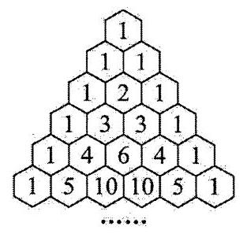

【109】对于定义在非空集 $D$ 上的函数 $f\left( x\right)$ ,若对任意的 ${x}_{1},{x}_{2} \in  D$ ,当 ${x}_{1} < {x}_{2}$ ,有 $f\left( {x}_{1}\right)  \leq  f\left( {x}_{2}\right)$ ,则称函数 $f\left( x\right)$ 为 “准单调递增函数”,若函数 $y = f\left( x\right)$ 的定义域 $D = \{ 1,2,3,4,5,6\}$ ,值域 $A \subseteq  \{ 7,8,9\}$ ,则在满足这样条件的所有函数中， $y = f\left( x\right)$ 为“准单调递增函数”的概率是___.

【110】随机数表是人们根据需要编制出来的,由0,1,2,3,4,5,6,7,8,9这 10 个数字组成,表中每一个数都是用随机方法产生的, 随机数的产生方法主要有抽签法、抛掷骰子法和计算机生成法. 现有甲、乙、丙三位同学合作在一个正二十面体(如图)的各面写上 0~9 这 10 个数字 (相对的两个面上的数字相同),这样就得到一个产生 $0 \sim  9$ 的随机数的骰子. 依次投掷这个骰子, 并逐个记下朝上一面的数字, 就能按顺序排成一个随机数表, 若甲、乙、丙依次投掷一次, 按顺序记下三个数, 三个数恰好构成等差数列的概率为___.

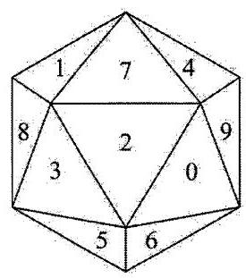

【111】小王一次买了两串冰糖葫芦, 其中一串有两颗冰糖葫芦, 另一串有三颗冰糖葫芦. 若小王每次随机从其中一串吃一颗，则只有两颗冰糖葫芦的这串先吃完的概率为___.

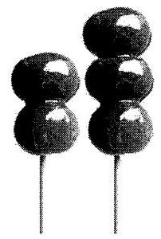

【112】一个平台的俯视图为一个 $3 \times  3$ 的方格表,初始时在中心的方格 $O$ 处有一只电子瓢虫,每过一秒钟, 该瓢虫都会随机选择平行于平台边界的四个方向之一移动一个单位. 如果瓢虫跌落平台就会“死亡”，那么在 2023 秒后，该瓢虫仍然“存活”的概率是___.

【113】我们称 $n\left( {n \in  {\mathbf{N}}^{ * }}\right)$ 元有序实数组 $\left( {{x}_{1},{x}_{2},\cdots ,{x}_{n}}\right)$ 为 $n$ 维向量, $\left| {x}_{1}\right|  + \left| {x}_{2}\right|  + \cdots  + \left| {x}_{n}\right|$ 为该向量的范数. 已知 $n$ 维向量 $\overrightarrow{a} = \left( {{x}_{1},{x}_{2},\cdots ,{x}_{n}}\right)$ ,其中 ${x}_{i} \in  \{  - 1,0,1\} \left( {i = 1,2,\cdots n}\right)$ ,记范数为奇数的 $\overrightarrow{a}$ 的个数为 ${A}_{n}$ ,则 ${A}_{2n} =$ (用含 $n$ 的式子表示, $n \in  {\mathbf{N}}^{ * }$ ).

【114】已知正整数 $m, n$ 满足 $m < n \leq  {24}$ ,若关于 $x$ 的方程 $\frac{1}{2 - \sin \left( {mx}\right) } + \frac{1}{2 - \sin \left( {nx}\right) } = 2$ 有实数解,则符合条件的 $\left( {m, n}\right)$ 共有___对.

【115】对于 $n \in  {\mathbf{N}}^{ * }$ ,将 $n$ 表示为 $n = {a}_{0} \times  {2}^{k} + {a}_{1} \times  {2}^{k - 1} + {a}_{2} \times  {2}^{k - 1} + \cdots  + {a}_{k - 1} \times  {2}^{1} + {a}_{k} \times  {2}^{0}$ ,当 $i = 0$ 时, ${a}_{i} = 1$ . 当 $1 \leq  i \leq  k$ 时, ${a}_{i}$ 为 0 或 1 . 记 $I\left( n\right)$ 为上述表示中 ${a}_{i}$ 为 0 的个数,(列如 $1 = 1 \times  {2}^{0},4 = 1 \times  {2}^{2} + 0 \times  {2}^{1} + 0 \times  {2}^{0}$ , 故 $I\left( 1\right)  = 0, I\left( 4\right)  = 2$ ) 若 $\mathop{\sum }\limits_{{n = 1}}^{i}{a}_{n} = {a}_{1} + {a}_{2} + \cdots  + {a}_{i}$ ，则 $\mathop{\sum }\limits_{{n = 1}}^{{127}}{2}^{I\left( n\right) } =$ ___.

【116】如图两个同心球，球心均为点 $O$ ，其中大球与小球的表面积之比为3:1，线段 ${AB}$ 与 ${CD}$ 是夹在两个球体之间的内弦,其中 $A\text{ 、 }C$ 两点在小球上, $B\text{ 、 }D$ 两点在大球上,两内弦均不穿过小球内部. 当四面体 ${ABCD}$ 的体积达到最大值时，此时异面直线 ${AD}$ 与 ${BC}$ 的夹角为 $\theta$ ，则 $\sin \frac{\theta }{2} =$ ()

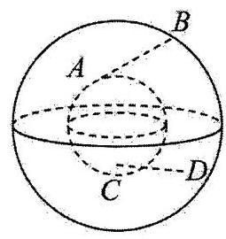

A. $\frac{\sqrt{6}}{6}$ B. $\frac{\sqrt{2}}{4}$

C. $\frac{\sqrt{30}}{6}$ D. $\frac{2\sqrt{6}}{33}$

【117】如图,在正四棱台 ${ABCD} - {A}_{1}{B}_{1}{C}_{1}{D}_{1}$ 中,上底面边长为 4,下底面边长为 8,高为 5,点 $M, N$ 分别在 ${A}_{1}{B}_{1},{D}_{1}{C}_{1}$ 上,且 ${A}_{1}M = {D}_{1}N = 1$ . 过点 $M, N$ 的平面 $\alpha$ 与此四棱台的下底面会相交,则平面 $\alpha$ 与四棱台的面的交线所围成图形的面积的最大值为( )

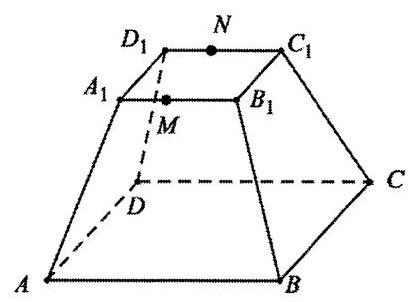

A. ${18}\sqrt{7}$ B. ${30}\sqrt{2}$

C. $6\sqrt{61}$ D. ${36}\sqrt{3}$

【118】如图,已知正三棱台 ${ABC} - {A}_{1}{B}_{1}{C}_{1}$ 的上、下底面边长分别为 4 和 6,侧棱长为 2,点 $P$ 在侧面 ${BC}{C}_{1}{B}_{1}$ 内运动(包含边界)，且 ${AP}$ 与平面 ${BC}{C}_{1}{B}_{1}$ 所成角的正切值为 $\sqrt{6}$ ，则所有满足条件的动点 $P$ 形成的轨迹长度为( )

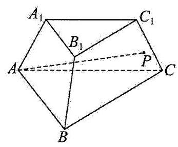

A. $\frac{4\pi }{3}$ B. $\frac{\sqrt{5}\pi }{3}$

C. $\frac{\sqrt{7}\pi }{3}$ D. $\frac{2\pi }{3}$

【119】已知点 $\mathrm{A}$ 在曲线 $P : y = {x}^{2}\left( {x > 0}\right)$ 上， $\odot  \mathrm{A}$ 过原点 $O$ ，且与 $y$ 轴的另一个交点为 $M$ ，若线段 ${OM}$ ， $\odot  \mathrm{A}$ 和曲线 $P$ 上分别存在点 $B$ 、点 $C$ 和点 $D$ ，使得四边形 ${ABCD}$ (点 $\mathrm{A}$ ， $B$ ， $C$ ， $D$ 顺时针排列)是正方形，则称点 $\mathrm{A}$ 为曲线 $P$ 的“完美点”. 那么下列结论中正确的是( ).

A. 曲线 $P$ 上不存在"完美点"

B. 曲线 $P$ 上只存在一个“完美点”，其横坐标大于 1

C. 曲线 $P$ 上只存在一个“完美点”，其横坐标大于 $\frac{1}{2}$ 且小于 1

D. 曲线 $P$ 上存在两个“完美点”，其横坐标均大于 $\frac{1}{2}$

【120】已知数列 $\left\{  {a}_{n}\right\}$ 的通项为 ${a}_{n}$ ,前 $n$ 项和为 ${S}_{n}$ ,则下列选项中不正确的是 ( )

A. 如果 ${a}_{n} = \sin \frac{n\pi }{2}$ ,则 $\forall n \in  {\mathrm{N}}^{ * },\exists M > 0$ ,使得 $\left| {S}_{n}\right|  < M$

B. 如果 ${a}_{n} = \frac{1}{n}$ ,则 $\forall M > 0,\exists {n}_{0} \in  {\mathrm{N}}^{ * }$ ,使得 $\left| {S}_{{n}_{0}}\right|  > M$

C. 如果 ${a}_{n} = \sin \frac{1}{n}$ ,则 $\forall n \in  {\mathrm{N}}^{ * },\exists M > 0$ ,使得 $\left| {S}_{n}\right|  < M$

D. 如果 $\forall n \in  {\mathrm{N}}^{ * },\exists {M}_{1} > 0$ ,使得 $\left| {S}_{n}\right|  < {M}_{1}$ ,则 $\forall n \in  {\mathrm{N}}^{ * },\exists {M}_{2} > 0$ ,便得 $\left| {a}_{n}\right|  < {M}_{2}$

【121】已知 ${x}_{1},{x}_{2}\left( {{x}_{1} > {x}_{2}}\right)$ 是方程 ${x}^{2} - {2px} - 1 = 0\left( {p \in  {\mathbf{N}}^{ * }}\right)$ 的两根,数列 $\left\{  {a}_{n}\right\}$ 满足 ${a}_{1} = 2,{a}_{2} = {2p}$ , ${a}_{n} = {2p}{a}_{n - 1} + {a}_{n - 2}\left( {n \geq  3}\right) .\left\{  {b}_{n}\right\}$ 满足 ${b}_{n} = f\left( {x}_{1}^{n}\right)$ ,其中 $f\left( x\right)  = x\sin \left( {\frac{\pi }{2}x}\right)$ . 则下列判断不正确的是( )

A. ${a}_{3} = 4{p}^{2} + 2$

B. $f\left( {{a}_{n + 1} - {x}_{2}^{n}}\right)  = {b}_{n}$

C. 存在实数 $r$ ,使得对任意的正整数 $n$ ,都有 ${b}_{n} < r$

D. 不存在实数 $r$ ,使得对任意的正整数 $n$ ,都有 ${b}_{n} > r$

【122】日常生活中植物寿命的统计规律常体现出分布的无记忆性.假设在一定的培养环境下, 一种植物的寿命是取值为正整数的随机变量 $X$ ,根据统计数据,它近似满足如下规律: 对任意正整数 $n$ ,寿命恰好为 $n$ 的植物在所有寿命不小于 $n$ 的植物中的占比为 10%. 记“一株植物的寿命为 $n$ ”为事件 ${A}_{n}$ ，“一株植物的寿命不小于 $n$ ”为事件 ${B}_{n}$ . 则下列判断正确的是( )

① $P\left( {A}_{2}\right)  = {0.01}$

② 设 ${a}_{n} = P\left( {{A}_{n + 1} \mid  {B}_{2}}\right)$ ，则 $\left\{  {a}_{n}\right\}$ 为等比数列

A、①是真命题，②是真命题 B、①是真命题，②是假命题

C、①是假命题，②是真命题 D、①是假命题，②是假命题

【123】已知正项数列 $\left\{  {a}_{n}\right\}$ 满足: ${a}_{n + 1}^{2} = {a}_{n} + 2, n \in  {\mathrm{N}}^{ * }$ ,则以下判断正确的是 ( )

① 若 ${a}_{1} \in  \left( {2, + \infty }\right)$ 时，数列 $\left\{  {a}_{n}\right\}$ 严格递增

② 若 ${a}_{1} = 1$ ，数列 $\left\{  {a}_{n}\right\}$ 的前 $n$ 项和 ${S}_{n} = {a}_{1} + \cdots  + {a}_{n}$ ，则 ${S}_{n} \leq  {{2n} - 1}\left( {n \geq  2, n \in  {\mathrm{N}}^{ * }}\right)$

A、①是真命题，②是真命题 B、①是真命题，②是假命题

C、①是假命题，②是真命题 D、①是假命题，②是假命题

【124】点 $P$ 是椭圆 $E : \frac{{x}^{2}}{{a}^{2}} + \frac{{y}^{2}}{{b}^{2}} = 1\left( {a > b > 0}\right)$ 上(左、右端点除外)的一个动点， ${F}_{1}\left( {-c,0}\right)$ ， ${F}_{2}\left( {c,0}\right)$ 分别是 $E$ 的左、右焦点.

(1)设点 $P$ 到直线 $l : x = \frac{{a}^{2}}{c}$ 的距离为 $d$ ，证明 $\frac{\left| P{F}_{2}\right| }{d}$ 为定值，并求出这个定值；

(2) $\bigtriangleup  {P{F}_{1}{F}_{2}}$ 的重心与内心(内切圆的圆心)分别为 $G, I$ ，已知直线 ${IG}$ 垂直于 $x$ 轴.

(i) 求椭圆 $E$ 的离心率;

(ii) 若椭圆 $E$ 的长轴长为 6,求 $\bigtriangleup P{F}_{1}{F}_{2}$ 被直线 ${IG}$ 分成两个部分的图形面积之比的取值范围.

【125】设离散型随机变量 $X$ 和 $Y$ 的分布列分别为 $P\left( {X = {a}_{k}}\right)  = {x}_{k}, P\left( {Y = {a}_{k}}\right)  = {y}_{k},{x}_{k} > 0,{y}_{k} > 0$ , $k = 0,1,2,\cdots , n,\mathop{\sum }\limits_{{k = 0}}^{n}{x}_{k} = \mathop{\sum }\limits_{{k = 0}}^{n}{y}_{k} = 1$ . 定义 $D\left( {X\parallel Y}\right)  = \mathop{\sum }\limits_{{k = 0}}^{n}{x}_{k}\ln \frac{{x}_{k}}{{y}_{k}}$ ,用来刻画 $X$ 和 $Y$ 的相似程度,设 $X \sim  B\left( {n, p}\right) ,\;0 < p < 1.$

(1)若 $n = 3, p = \frac{1}{3}, Y \sim  B\left( {3,\frac{2}{3}}\right)$ ，求 $D\left( {X\parallel Y}\right)$ ；

( 2 )若 $n = 2$ ，且 $Y$ 的分布列为 $\left( \begin{matrix} 0 & 1 & 2 \\  \frac{1}{6} & \frac{2}{3} & \frac{1}{6} \end{matrix}\right)$

求 $D\left( {X\parallel Y}\right)$ 的最小值；

(3)对任意与 $X$ 有相同可能取值的随机变量 $Y$ ,证明: $D\left( {X\parallel Y}\right)$ 的值不可能为负数.

【126】从甲、乙、丙、丁 4 人中随机抽取 3 个人去做传球训练.训练规则是确定一人第一次将球传出，每次传球时,传球者都等可能地将球传给另外两个人中的任何一人,每次必须将球传出.

(1)记甲乙丙三人中被抽到的人数为随机变量 $X$ ，求 $X$ 的分布列；

(2)若刚好抽到甲乙丙三个人相互做传球训练，且第 1 次由甲将球传出，记 $n$ 次传球后球在甲手中的概率为 ${p}_{n}, n = 1,2,3,\cdots$ .

① 直接写出 ${p}_{1},{p}_{2},{p}_{3}$ 的值;

② 求 ${p}_{n + 1}$ 与 ${p}_{n}$ 的关系式 $\left( {n \in  {\mathrm{N}}^{ * }}\right)$ ，并求 ${p}_{n}\left( {n \in  {\mathrm{N}}^{ * }}\right)$ .

【127】某商场周年庆进行大型促销活动,为吸引消费者,特别推出“玩游戏,送礼券”的活动,活动期间在商场消费达到一定金额的人可以参加游戏，游戏规则如下:在一个盒子里放着六枚硬币，其中有三枚正常的硬币，一面印着字，一面印着花；另外三枚硬币是特制的，有两枚双面都印着字，一枚双面都印着花，规定印着字的面为正面，印着花的面为反面. 游戏者蒙着眼睛随机从盒子中抽取一枚硬币并连续投掷两次，由工作人员告知投掷的结果，若两次投掷向上的面都是正面，则进入最终挑战，否则游戏结束. 最终挑战的方式是进行第三次投掷，有两个方案可供选择:方案一:继续投掷之前抽取的那枚硬币；方案二, 不使用之前抽取的硬币, 从盒子里剩余的五枚硬币中随机抽取一枚投掷. 不管选择方案一还是方案二, 如果掷出正面向上, 则获奖

(1)求第一次投掷后，向上的面为正面的概率；

(2)若已知某顾客进入了最终挑战，求他抽到的硬币是正常硬币的概率；

(3)在已知某顾客进入了最终挑战环节的条件下，试分别计算他选择两种抽奖方案最终获奖的概率，并以此判断应该选择哪种抽奖方案更合适.

【128】某自然保护区经过几十年的发展，某种濒临灭绝动物数量有大幅度的增加. 已知这种动物 $P$ 拥有两个亚种 (分别记为 $\mathrm{A}$ 种和 $B$ 种). 为了调查该区域中这两个亚种的数目,某动物研究小组计划在该区域中捕捉 100 个动物 $P$ ,统计其中 $\mathrm{A}$ 种的数目后,将捕获的动物全部放回,作为一次试验结果. 重复进行这个试验共 20 次,记第 $\mathrm{i}$ 次试验中 $\mathrm{A}$ 种的数目为随机变量 ${X}_{i}\left( {i = 1,2,\cdots ,{20}}\right)$ . 设该区域中 $\mathrm{A}$ 种的数目为 $M, B$ 种的数目为 $N$ ( $M, N$ 均大于 100 ),每一次试验均相互独立.

(1)求 ${X}_{1}$ 的分布列;

(2)记随机变量 $\bar{X} = \frac{1}{20}\mathop{\sum }\limits_{{i = 1}}^{{20}}{X}_{i}$ ，已知 $E\left( {{X}_{i} + {X}_{j}}\right)  = E\left( {X}_{i}\right)  + E\left( {X}_{j}\right)$ ， $D\left( {{X}_{i} + {X}_{j}}\right)  = D\left( {X}_{i}\right)  + D\left( {X}_{j}\right)$

(i) 证明: $E\left( \bar{X}\right)  = E\left( {X}_{1}\right) , D\left( \bar{X}\right)  = \frac{1}{20}D\left( {X}_{1}\right)$ ;

(ii) 该小组完成所有试验后,得到 ${X}_{i}$ 的实际取值分别为 ${x}_{i}\left( {i = 1,2,\cdots ,{20}}\right)$ . 数据 ${x}_{i}\left( {i = 1,2,\cdots ,{20}}\right)$ 的平均值 $\bar{x} = {30}$ ,方差 ${s}^{2} = 1$ . 采用 $\bar{x}$ 和 ${s}^{2}$ 分别代替 $E\left( \bar{X}\right)$ 和 $D\left( \bar{X}\right)$ ,给出 $M, N$ 的估计值.

(已知随机变量 $x$ 服从超几何分布记为: $x \sim  H\left( {P, n, Q}\right)$ (其中 $P$ 为总数, $Q$ 为某类元素的个数, $n$ 为抽取的个数),则 $D\left( x\right)  = n\frac{Q}{P}\left( {1 - \frac{Q}{P}}\right) \left( \frac{P - n}{P - 1}\right) )$

【129】在某抽奖活动中, 初始时的袋子中有 3 个除颜色外其余都相同的小球, 颜色为 2 白 1 红. 每次随机抽取一个小球后放回. 抽奖规则如下:设定抽中红球为中奖，抽中白球为未中奖；若抽到白球，放回后把袋中的一个白色小球替换为红色；若抽到红球，放回后把三个球的颜色重新变为 2 白 1 红的初始状态. 记第 $n$ 次抽奖中奖的概率为 ${P}_{n}$ .

(1)求 ${P}_{2},{P}_{3}$ ；

(2)若存在实数 $a, b, c$ ，对任意的不小于 4 的正整数 $n$ ，都有 ${P}_{n} = a{P}_{n - 1} + b{P}_{n - 2} + c{P}_{n - 3}$ ，试确定 $a, b, c$ 的值, 并证明上述递推公式;

(3)若累计中奖 4 次及以上可以获得一枚优胜者勋章，则从初始状态下连抽 9 次获得至少一枚勋章的概率为多少?