## 答案与解析

1~30 题

1、【答案】960

【解析】因为 $A \cap  B, B \cap  C, A \cap  C$ 均只有一个元素,且 $A \cap  B \cap  C = \varnothing$ ,

作出文氏图,则从 $D$ 的 5 个元素中选择 3 个元素均分给 $x, y, z$ 三个位置,

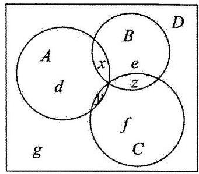

共有 ${P}_{5}^{3} = {60}$ 种不同排法,

剩余 2 个元素,每个均有 4 个位置 $\left( {d, e, f, g}\right)$ 可以排,

共有有 ${4}^{2} = {16}$ 种不同排法;

所以“有序子集列”共有 ${60} \times  {16} = {960}$ 个.

2、【答案】 $- \frac{1}{2}$

【解析】 ${a}_{n} = {a}_{1} + \left( {n - 1}\right) d = {a}_{1} + \frac{2\pi }{3}\left( {n - 1}\right)$ ,

则 $\cos {a}_{n} = \cos \left\lbrack  {{a}_{1} + \frac{2\pi }{3}\left( {n - 1}\right) }\right\rbrack   = \cos \left( {\frac{2\pi }{3}n + {a}_{1} - \frac{2\pi }{3}}\right)$ ,

其周期为 $\frac{2\pi }{\frac{2\pi }{3}} = 3$ ,而 $n \in  {\mathbf{N}}^{ * }$ ,即 $\cos {a}_{n}$ 最多 3 个不同取值,

集合 $S = \left\{  {x \mid  x = \cos {a}_{n}, n \in  {\mathbf{N}}^{ * }}\right\}$ 有且仅有两个元素,设 $S = \{ a, b\}$ ,

则在 $\cos {a}_{n},\cos {a}_{n + 1},\cos {a}_{n + 2}$ 中, $\cos {a}_{n} = \cos {a}_{n + 1} \neq  \cos {a}_{n + 2}$ 或 $\cos {a}_{n} \neq  \cos {a}_{n + 1} = \cos {a}_{n + 2}$ ,

或 $\cos {a}_{n} = \cos {a}_{n + 2} \neq  \cos {a}_{n + 1}$ ,又 $\cos {a}_{n} = \cos {a}_{n + 3}$ ,即 $\cos {a}_{n + 3} = \cos {a}_{n + 2} \neq  \cos {a}_{n + 1}$ ,

所以一定会有相邻的两项相等,设这两项分别为 $\cos \theta ,\cos \left( {\theta  + \frac{2\pi }{3}}\right)$ ,

于是有 $\cos \theta  = \cos \left( {\theta  + \frac{2\pi }{3}}\right)$ ,即有 $\theta  + \left( {\theta  + \frac{2\pi }{3}}\right)  = {2k\pi }, k \in  \mathbf{Z}$ ,解得 $\theta  = {k\pi } - \frac{\pi }{3}, k \in  \mathbf{Z}$ ,

不相等的两项为 $\cos \theta ,\cos \left( {\theta  + \frac{4\pi }{3}}\right)$ ,

故 ${ab} = \cos \left( {{k\pi } - \frac{\pi }{3}}\right) \cos \left\lbrack  {\left( {{k\pi } - \frac{\pi }{3}}\right)  + \frac{4\pi }{3}}\right\rbrack   =  - \cos \left( {{k\pi } - \frac{\pi }{3}}\right) \cos {k\pi } =  - {\cos }^{k}\pi \cos \frac{\pi }{3} =  - \frac{1}{2}, k \in  \mathbf{Z}$ .

3、【答案】 $n \cdot  {4}^{n}$

【解析】由题意知集合 $P$ 中的元素分别为 $2 \times  {2}^{1},3 \times  {2}^{2},4 \times  {2}^{3},\cdots ,\left( {n + 1}\right)  \cdot  {2}^{n}$ ,

设 ${S}_{n} = 2 \times  {2}^{1} + 3 \times  {2}^{2} + \cdots  + \left( {n + 1}\right)  \cdot  {2}^{n}$ ①，则 $2{S}_{n} = 2 \times  {2}^{2} + 3 \times  {2}^{3} + \cdots  + \left( {n + 1}\right)  \cdot  {2}^{n + 1}$ ②，

①-②，得 $- {S}_{n} = 4 + \left( {{2}^{2} + {2}^{3} + \cdots  + {2}^{n}}\right)  - \left( {n + 1}\right)  \cdot  {2}^{n + 1} = 4 + \frac{4 - {2}^{n} \times  2}{1 - 2} - \left( {n + 1}\right)  \cdot  {2}^{n + 1} =  - n \cdot  {2}^{n + 1}$ ，所以 ${S}_{n} = n \cdot  {2}^{n + 1}$ .

由于集合 $P$ 中每一个元素在子集中出现的次数为 ${2}^{n - 1}$ ,

所以 $\left| {P}_{1}\right|  + \left| {P}_{2}\right|  + \cdots  + \left| {P}_{k}\right|  = {2}^{n - 1} \cdot  {S}_{n} = {2}^{n - 1} \cdot  n \cdot  {2}^{n + 1} = n \cdot  {2}^{2n} = n \cdot  {4}^{n}$ .

5、【答案】5

【解析】 $A = \left( {{x}_{1},{x}_{2},{x}_{3},{x}_{4}}\right)$ ,由①②条件知, $\mathrm{A}$ 中元素各不相等且 ${x}_{i} \in  \{ 0,1,2,3\}$ ,

所以 $\mathrm{A}$ 有以下 24 种情况: $A = \left( {0,1,2,3}\right) , A = \left( {0,1,3,2}\right) , A = \left( {0,2,1,3}\right) , A = \left( {0,2,3,1}\right) , A = \left( {0,3,1,2}\right)$ , $A = \left( {0,3,2,1}\right) , A = \left( {1,0,2,3}\right) , A = \left( {1,0,3,2}\right) , A = \left( {1,2,0,3}\right) , A = \left( {1,2,3,0}\right) , A = \left( {1,3,0,2}\right) , A = \left( {1,3,2,0}\right) , \; A = \left( {2,0,1,3}\right) , A = \left( {2,0,3,1}\right) , A = \left( {2,1,0,3}\right) , A = \left( {2,1,3,0}\right) , A = \left( {2,3,0,1}\right) , A = \left( {2,3,1,0}\right) , A = \left( {3,0,1,2}\right) , \; A = \left( {3,0,2,1}\right) , A = \left( {3,1,0,2}\right) , A = \left( {3,1,2,0}\right) , A = \left( {3,2,0,1}\right) , A = \left( {3,2,1,0}\right)$ ,

因为集合 $M = \left\{  {z\left| {z = }\right| {x}_{i} - {y}_{i} \mid  }\right\}$ 有 7 个真子集,所以 $M$ 有 3 个元素,

即 $\left| {{x}_{i} - {y}_{i}}\right|$ 有 3 种情况. 又 $B = \left( {0,1,2,3}\right)$ ,

则满足题意 $A = \left( {0,2,3,1}\right) , A = \left( {0,3,1,2}\right) , A = \left( {1,2,0,3}\right) , A = \left( {2,0,1,3}\right) , A = \left( {3,2,0,1}\right)$ ,共 5 种情况.

5、【答案】2023

【解析】因为 $A = \left\{  {x \in  {\mathrm{N}}^{ * } \mid  1 \leq  x \leq  {2n}, n \in  {\mathrm{N}}^{ * }}\right\}   = \left\{  {1,2,3,\cdots ,{2n} - 1,{2n}\left( {n \in  {\mathrm{N}}^{ * }}\right) }\right\}$ ,

易知集合 $\mathrm{A}$ 中任意两个元素的和最小值是 $1 + 2 = 3$ ，最大值是 ${2n} - 1 + {2n} = {4n} - 1$ ，

且对任意 $k \in  {\mathrm{N}}^{ * },3 \leq  k \leq  {4n} - 1$ ,都存在 ${a}_{i},{a}_{j} \in  A$ ,使得 ${a}_{i} + {a}_{j} = k$ ,

所以 $L\left( A\right)  = {4n} - 1 - 3 + 1 = {4n} - 3$ ,由 ${4n} - 3 = {8089}$ ,解得 $n = {2023}$ .

6、【答案】-4 或 0

【解析】当 $t >  - 1$ 时,当 $a \in  \left\lbrack  {t + 1, t + 2}\right\rbrack$ 时,则 $\frac{\lambda }{a} \in  \left\lbrack  {t + 5, t + {10}}\right\rbrack$ ,

当 $a \in  \left\lbrack  {t + 5, t + {10}}\right\rbrack$ 时,则 $\frac{\lambda }{a} \in  \left\lbrack  {t + 1, t + 2}\right\rbrack$ ,

即当 $a = t + 1$ 时， $\frac{\lambda }{a} \leq  t + {10}$ ；当 $a = t + {10}$ 时， $\frac{\lambda }{a} \geq  t + 1$ ；所以 $\lambda  = \left( {t + {10}}\right) \left( {t + 1}\right)$ ，

当 $a = t + 2$ 时, $\frac{\lambda }{a} \geq  t + 5$ ; 当 $a = t + 5$ 时, $\frac{\lambda }{a} \leq  t + 2$ ,所以 $\lambda  = \left( {t + 5}\right) \left( {t + 2}\right)$ ,

因此有 $\lambda  = \left( {t + {10}}\right) \left( {t + 1}\right)  = \left( {t + 5}\right) \left( {t + 2}\right)  \Rightarrow  t = 0$ ;

当 $t + 2 < 0 < t + 5$ 时,当 $a \in  \left\lbrack  {t + 1, t + 2}\right\rbrack$ 时,则 $\frac{\lambda }{a} \in  \left\lbrack  {t + 1, t + 2}\right\rbrack$ ,

当 $a \in  \left\lbrack  {t + 5, t + {10}}\right\rbrack$ 时,则 $\frac{\lambda }{a} \in  \left\lbrack  {t + 5, t + {10}}\right\rbrack$ ,

即当 $a = t + 1$ 时, $\frac{\lambda }{a} \leq  t + 2$ ; 当 $a = t + {10}$ 时, $\frac{\lambda }{a} \geq  t + 1$ ; 所以 $\lambda  = \left( {t + 2}\right) \left( {t + 1}\right)$ ,

当 $a = t + 5$ 时, $\frac{\lambda }{a} \leq  t + {10}$ ; 当 $a = t + {10}$ 时, $\frac{\lambda }{a} \leq  t + 5$ ,所以 $\lambda  = \left( {t + 5}\right) \left( {t + {10}}\right)$ ,

因此有 $\lambda  = \left( {t + 2}\right) \left( {t + 1}\right)  = \left( {t + 5}\right) \left( {t + {10}}\right)  \Rightarrow  t =  - 4$ ,

当 $t + {10} < 0$ 时,同理可得无解,

综上所述: 实数 $t$ 的值为 -4 或 0 ,

7、【答案】9

【解析】因为函数 $f\left( x\right)  = \left\lbrack  {x\left\lbrack  x\right\rbrack  }\right\rbrack$ ,其中 $\left\lbrack  x\right\rbrack$ 表示不大于 $x$ 的最大整数,当 $x\;(0, n\rbrack , n\;{\mathrm{\;N}}^{ * }$ 时,函数 $f\left( x\right)$ 值域为集合，

所以 $n = 2$ ,故 $0 < x \leq  2$ ,

① 当 $0 < x < 1$ 时，则 $\left\lbrack  x\right\rbrack   = 0,\therefore f\left\lbrack  {x\left\lbrack  x\right\rbrack  }\right\rbrack   = 0$ ，

② 当 $x = 1$ 时， $\left\lbrack  x\right\rbrack   = 1$ 显然 $f\left( 1\right)  = 1$ ，

③ 当 $1 < x < 2$ 时， $\left\lbrack  x\right\rbrack   = 1$ ， $\therefore f\left\lbrack  {x\left\lbrack  x\right\rbrack  }\right\rbrack   = \left\lbrack  x\right\rbrack   = 1$ ，

④ 当 $x = 2$ 时， $f\left( 2\right)  = 4$ ，

$\therefore {A}_{2} = \{ 0,1,4\}$ ,

$\because T$ 中含有 4 个元素,其中两个元素 $\varnothing$ 和 ${A}_{2}$ ,

设其它两个元素为 $A, B$ ,则 $\left\{  \begin{array}{l} A \neq  \varnothing \\  A \neq  {A}_{2} \\  B \neq  \varnothing \\  B \neq  {A}_{2} \\  A \neq  B \end{array}\right.$ ,

由对称性,不妨设 $1 \leq  \left| A\right|  \leq  \left| B\right|  \leq  2$ ,其中 $\left| A\right| ,\left| B\right|$ 表示集合 $A$ 中元素的个数,

$\because \left\{  {\begin{array}{l} A \cap  B \in  T \\  A \cup  B \in  T \end{array}\text{ ,又 }\left| A\right|  \leq  \left| B\right| ,\therefore A \cap  B = \varnothing \text{ 或 }\mathrm{A}}\right.$ ,

若 $A \cap  B = \varnothing$ ,则 $A \cup  B$ 只能等于 ${A}_{2}$ ,(若 $A \cup  B = B$ ,则 $A \subseteq  B$ ,则 $A \cap  B = A = \varnothing$ ,矛盾), 则必有 $\left\{  \begin{array}{l} \left| A\right|  = 1 \\  \left| B\right|  = 2 \end{array}\right.$ ,

$\therefore \left( {A, B}\right)$ 的个数 $\Leftrightarrow  A$ 的个数 $= 3$ 种. 即 $\left\{  {\begin{array}{l} A = \{ 0\} \\  B = \{ 1,4\}  \end{array}\text{ 或 }\left\{  \begin{array}{l} A = \{ 1\} \\  B = \{ 0,4\}  \end{array}\right. }\right.$ 或 $\left\{  \begin{array}{l} A = \{ 4\} \\  B = \{ 0,1\}  \end{array}\right.$ ;

若 $A \cap  B = A \Leftrightarrow  A \subseteq  B$ ,此时满足 $A \cup  B = B$ ,

$\because A \neq  B$ 且 $1 \leq  \left| A\right|$ 且 $\left| B\right|  \leq  2$ ,

所以 $\left\{  \begin{array}{l} \left| A\right|  = 1 \\  \left| B\right|  = 2 \end{array}\right.$ ,

$\therefore B$ 的选择共有 ${\mathrm{C}}_{3}^{2} = 3$ 种,则 $\mathrm{A}$ 的个数有 ${\mathrm{C}}_{2}^{1} = 2$ 种,

$\therefore \left( {A, B}\right)$ 的个数 $= 2 \times  3 = 6$ 种.

这 6 种是 $\left\{  {\begin{array}{l} A = \{ 0\} \\  B = \{ 0,1\}  \end{array},\left\{  {\begin{array}{l} A = \{ 1\} \\  B = \{ 0,1\}  \end{array},\left\{  {\begin{array}{l} A = \{ 0\} \\  B = \{ 0,4\}  \end{array},\left\{  {\begin{array}{l} A = \{ 4\} \\  B = \{ 0,4\}  \end{array},\left\{  {\begin{array}{l} A = \{ 1\} \\  B = \{ 1,4\}  \end{array},\left\{  \begin{array}{l} A = \{ 4\} \\  B = \{ 1,4\}  \end{array}\right. }\right. }\right. }\right. }\right. }\right.$ ,

综上可知 $T$ 的个数为 9 个.

8、【答案】-2

【解析】由 $f\left( {x + y}\right) f\left( {x - y}\right)  = \left\lbrack  {f\left( x\right)  + f\left( y\right) }\right\rbrack  \left\lbrack  {f\left( x\right)  - f\left( y\right) }\right\rbrack$ ,

得 $f\left( {x + y}\right) f\left( {x - y}\right)  = {f}^{2}\left( x\right)  - {f}^{2}\left( y\right)$ ,

因为 $f\left( 1\right)  = 2, f\left( 2\right)  = 0$ ,

令 $x = 2, y = 1$ ,得 $f\left( 3\right) f\left( 1\right)  = {f}^{2}\left( 2\right)  - {f}^{2}\left( 1\right)$ ,得 $f\left( 3\right)  =  - 2$ ;

令 $x = 3, y = 2$ ,得 $f\left( 5\right) f\left( 1\right)  = {f}^{2}\left( 3\right)  - {f}^{2}\left( 2\right)$ ,得 $f\left( 5\right)  = 2$ ;

令 $x = 4, y = 1$ ,得 $f\left( 5\right) f\left( 3\right)  = {f}^{2}\left( 4\right)  - {f}^{2}\left( 1\right)$ ,得 $f\left( 4\right)  = 0$ ,

在 $f\left( {x + y}\right) f\left( {x - y}\right)  = {f}^{2}\left( x\right)  - {f}^{2}\left( y\right)$ 中,

令 $y = 2$ ,得 $f\left( {x + 2}\right) f\left( {x - 2}\right)  = {f}^{2}\left( x\right)$ ,

令 $x = 5$ ,得 $f\left( 7\right) f\left( 3\right)  = {f}^{2}\left( 5\right)$ ,得 $f\left( 7\right)  =  - 2$ ;

令 $x = 7$ ,得 $f\left( 9\right) f\left( 5\right)  = {f}^{2}\left( 7\right)$ ,得 $f\left( 9\right)  = 2$ ,

.......

在 $f\left( {x + y}\right) f\left( {x - y}\right)  = {f}^{2}\left( x\right)  - {f}^{2}\left( y\right)$ 中,

令 $x = 6, y = 1$ ,得 $f\left( 6\right)  = 0$ ;

令 $x = 8, y = 1$ ,得 $f\left( 8\right)  = 0$ ,

.......

依此类推,可得 $f\left( {{2k} - 1}\right)  = {\left( -1\right) }^{k + 1} \times  2, f\left( {2k}\right)  = 0\left( {k \in  {\mathrm{N}}^{ * }}\right)$ ,

因此 $f\left( {2023}\right)  = f\left( {2 \times  {1012} - 1}\right)  = {\left( -1\right) }^{{1012} + 1} \times  2 =  - 2, f\left( {2024}\right)  = f\left( {2 \times  {1012}}\right)  = 0$ ,

综上可知 $f\left( {2023}\right)  + f\left( {2024}\right)  =  - 2$ .

9、【答案】 $\left( {-\frac{11\pi }{4}, - {2\pi }}\right\rbrack   \cup  \left\lbrack  {{2\pi },\frac{9\pi }{4}}\right)  \cup  \left\{  \frac{5\pi }{2}\right\}$

【解析】当 $\omega  > 0$ 时,如图为满足题意的两种情况:

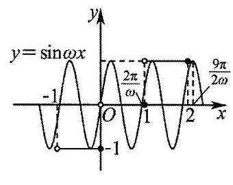

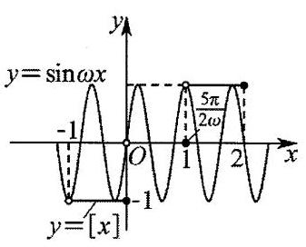

即 $\left\{  \begin{array}{l} \frac{2\pi }{\omega } \leq  1 \\  1 < \frac{5\pi }{2\omega } \leq  2\text{ 或 }\frac{5\pi }{2\omega } = 1,\text{ 解得 }\omega  \in  \left\lbrack  {{2\pi },\frac{9\pi }{4}}\right)  \cup  \left\{  \frac{5\pi }{2}\right\}  ; \\  \frac{9\pi }{2\omega } > 2 \end{array}\right.$

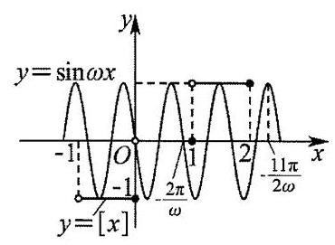

当 $\omega  < 0$ 时,如图:

则 $\left\{  \begin{array}{l}  - \frac{2\pi }{\omega } \leq  1 \\  1 <  - \frac{7\pi }{2\omega } \leq  2,\text{ 解得 }\omega  \in  \left( {-\frac{11\pi }{4}, - {2\pi }}\right\rbrack  . \\   - \frac{11\pi }{2\omega } > 2 \end{array}\right.$

综上, $\omega$ 的范围是 $\left( {-\frac{11\pi }{4}, - {2\pi }\rbrack  \cup  \left\lbrack  {{2\pi },\frac{9\pi }{4}}\right) \cup \{ \frac{5\pi }{2}}\right)$ ,

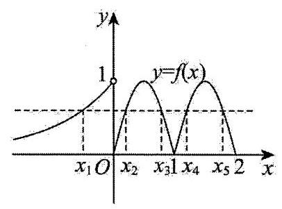

10、【答案】 $\left\lbrack  {-\frac{1}{{\mathrm{e}}^{5}},4}\right)$

【解析】作出 $f\left( x\right)  = \left\{  \begin{array}{l} \left| {\sin {\pi x}}\right| ,0 \leq  x \leq  2 \\  {\mathrm{e}}^{x}, x < 0 \end{array}\right.$ 的图象如图,

可知: ${x}_{2} + {x}_{3} = 1,{x}_{4} + {x}_{5} = 3,{x}_{1} < 0$ ,

所以 $\mathop{\sum }\limits_{{i = 1}}^{5}{x}_{i}f\left( {x}_{i}\right)  = \left( {{x}_{1} + {x}_{2} + {x}_{3} + {x}_{4} + {x}_{5}}\right) f\left( {x}_{1}\right)  = \left( {{x}_{1} + 4}\right) f\left( {x}_{1}\right)  = \left( {{x}_{1} + 4}\right) {\mathrm{e}}^{{x}_{1}}$ ,

令 $g\left( x\right)  = \left( {x + 4}\right) {\mathrm{e}}^{x}, x < 0$ ,

当 $x <  - 4$ 时, $g\left( x\right)  < 0$ ; 当 $- 4 < x < 0$ 时, $g\left( x\right)  > 0$ .

且 ${g}^{\prime }\left( x\right)  = \left( {x + 5}\right) {\mathrm{e}}^{x}$ ,当 $x <  - 5$ 时, ${g}^{\prime }\left( x\right)  < 0, g\left( x\right)$ 在 $\left( {-\infty , - 5}\right)$ 上严格递减;

当 $- 5 < x < 0$ 时, ${g}^{\prime }\left( x\right)  > 0, g\left( x\right)$ 在 $\left( {-5,0}\right)$ 上严格递增.

所以 $g{\left( x\right) }_{\min } = g\left( {-5}\right)  =  - \frac{1}{{\mathrm{e}}^{5}}$ ,且 $g\left( x\right)  < g\left( 0\right)  = 4$ ,

所以 $\mathop{\sum }\limits_{{i = 1}}^{5}{x}_{i}f\left( {x}_{i}\right)$ 的取值范围为 $\left\lbrack  {-\frac{1}{{\mathrm{e}}^{5}},4}\right)$ .

11、【答案】-36

【解析】因为 $x \in  \left\lbrack  {-{8\pi },{8\pi }}\right\rbrack  ,\frac{x}{24} \in  \left\lbrack  {-\frac{\pi }{3},\frac{\pi }{3}}\right\rbrack  ,\tan \frac{x}{24} \in  \left\lbrack  {-\sqrt{3},\sqrt{3}}\right\rbrack  ,\frac{\sqrt{3}\pi }{3}\tan \frac{x}{24} + \frac{\pi }{3} \in  \left\lbrack  {-\frac{2\pi }{3},\frac{4\pi }{3}}\right\rbrack$ ,

所以由 $\sin \left( {\frac{\sqrt{3}\pi }{3}\tan \frac{x}{24} + \frac{\pi }{3}}\right)  \geq  \frac{\sqrt{3}}{2}$ ,

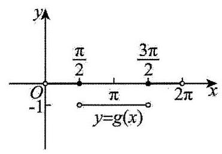

可得 $\frac{\sqrt{3}\pi }{3}\tan \frac{x}{24} + \frac{\pi }{3} \in  \left\lbrack  {\frac{\pi }{3},\frac{2\pi }{3}}\right\rbrack$ ,解得 $x \in  \left\lbrack  {0,{4\pi }}\right\rbrack$ ,即 $A = \left\lbrack  {0,{4\pi }}\right\rbrack$ , 如图为 $g\left( x\right)  = \left\lbrack  {\cos x}\right\rbrack$ 的图象,

由 $g\left( x\right)$ 的周期性,所以只需讨论一个周期内的情况即可,

当 $x = 0$ 时, $\cos x = 1, g\left( x\right)  = \left\lbrack  {\cos x}\right\rbrack   = 1$ ,

当 $0 < x \leq  \frac{\pi }{2}$ 时, $0 < \cos x < 1, g\left( x\right)  = \left\lbrack  {\cos x}\right\rbrack   = 0$ ,

当 $\frac{\pi }{2} < x < \frac{3\pi }{2}$ 时, $- 1 \leq  \cos x < 0, g\left( x\right)  = \left\lbrack  {\cos x}\right\rbrack   =  - 1$ ,

当 $\frac{3\pi }{2} \leq  x < {2\pi }$ 时, $0 < \cos x < 1, g\left( x\right)  = \left\lbrack  {\cos x}\right\rbrack   = 0$ ,

所以 $x \in  \left\lbrack  {0,{4\pi }}\right\rbrack$ ,即在一个周期内 ${xg}\left( x\right)  < 0$ 的部分,

由图得 $x \in  \left( {\frac{\pi }{2},\frac{3\pi }{2}}\right)$ 时, $g\left( x\right)  =  - 1 < 0$ ,

$x \in  \left( {\frac{5\pi }{2},\frac{7\pi }{2}}\right) ,\;g\left( x\right)  =  - 1 < 0,$

所以 $x \in  Z$ 且在定义域内的 $x$ 为2,3,4,8,9,10,

所以数 $y = g\left( x\right)$ 的所有“子母数”之和为 $\left( {2 + 3 + 4 + 8 + 9 + {10}}\right)  \times  \left( {-1}\right)  =  - {36}$ .

12、【答案】1

【解析】由题意知“特异点”为 ${f}^{\prime }\left( x\right)$ 的极大值点,

因为 $f\left( x\right)  = \left\{  \begin{array}{l}  - x{\mathrm{e}}^{x + 1}, x \leq  0 \\  {x}^{2} - {2x}, x > 0 \end{array}\right.$ ，所以 $f\left( 0\right)  = 0$ ，

当 $x < 0$ 时， ${f}^{\prime }\left( x\right)  =  - {\mathrm{e}}^{x + 1} + \left( {-x}\right) {\mathrm{e}}^{x + 1} =  - \left( {x + 1}\right) {\mathrm{e}}^{x + 1}$ ,

当 $x > 0$ 时, ${f}^{\prime }\left( x\right)  = {2x} - 2$ ,

又 $\mathop{\lim }\limits_{{x \rightarrow  {0}^{ - }}}\frac{f\left( x\right)  - f\left( 0\right) }{x - 0} = \mathop{\lim }\limits_{{x \rightarrow  {0}^{ - }}}\frac{-x{\mathrm{e}}^{x + 1}}{x} =  - \mathrm{e}$ ,

$\mathop{\lim }\limits_{{x \rightarrow  {0}^{ + }}}\frac{f\left( x\right)  - f\left( 0\right) }{x - 0} = \mathop{\lim }\limits_{{x \rightarrow  {0}^{ + }}}\frac{{x}^{2} - {2x}}{x} = \mathop{\lim }\limits_{{x \rightarrow  {0}^{ + }}}\left( {x - 2}\right)  =  - 2,$

故 ${f}^{\prime }\left( 0\right)$ 不存在.

又因为 ${f}^{\prime }\left( x\right)  = \left\{  \begin{array}{l}  - \left( {x + 1}\right) {\mathrm{e}}^{x + 1}, x < 0 \\  {2x} - 2, x > 0 \end{array}\right.$ ,

易知: 当 $x > 0$ 时, ${f}^{\prime }\left( x\right)$ 严格递增,故不可能有“特异点”,

当 $x < 0$ 时,设 $g\left( x\right)  = {f}^{\prime }\left( x\right)$ ,则 ${g}^{\prime }\left( x\right)  =  - {\mathrm{e}}^{x + 1} + \left\lbrack  {-\left( {x + 1}\right) {\mathrm{e}}^{x + 1}}\right\rbrack   =  - \left( {x + 2}\right) {\mathrm{e}}^{x + 1}$ ,

令 ${g}^{\prime }\left( x\right)  > 0$ ,则 $x <  - 2;{g}^{\prime }\left( x\right)  < 0$ ,则 $- 2 < x < 0$ ;

所以 ${f}^{\prime }\left( x\right)$ 在 $\left( {-\infty , - 2}\right)$ 上严格递增,在 $\left( {-2,0}\right)$ 上严格递减,

故 $x =  - 2$ 为 ${f}^{\prime }\left( x\right)$ 的极大值点,即为 $f\left( x\right)$ 的“特异点”.

综上所述， $f\left( x\right)$ 在其定义域内仅有一个“特异点”.

13、【答案】 $\{ 2\}$

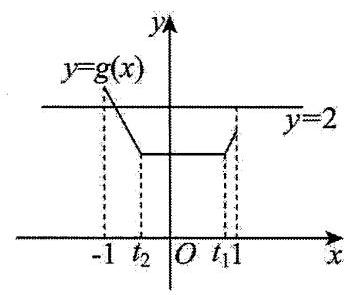

【解析】因为 $- 1 \leq  {t}_{2} \leq  {t}_{1} \leq  1$ ,则 $0 \leq  {t}_{1} - {t}_{2} \leq  2$ ,

令 $g\left( t\right)  = \left| {t - {t}_{1}}\right|  + \left| {t - {t}_{2}}\right|  = \left\{  \begin{array}{l}  - {2t} + {t}_{1} + {t}_{2}, - 1 \leq  t \leq  {t}_{2} \\  {t}_{1} - {t}_{2},{t}_{2} < t < {t}_{1} \\  {2t} - {t}_{1} - {t}_{2},{t}_{1} \leq  t \leq  1 \end{array}\right.$ ,

其图象如图所示,其值域为 $\left\lbrack  {{t}_{1} - {t}_{2},\max \left\{  {-{2t} + {t}_{1} + {t}_{2},{2t} - {t}_{1} - {t}_{2}}\right\}  }\right\rbrack$ ,

由 ${t}_{1} - {t}_{2} \in  \left\lbrack  {0,2}\right\rbrack$ 可知 $m \geq  2$ ; 由 ${\left( -2t + {t}_{1} + {t}_{2}\right) }_{\max } \geq  2$ 或 ${\left( 2t - {t}_{1} - {t}_{2}\right) }_{\max } \geq  2$ 可知 $m \leq  2$ ;

所以 $m = 2$ .

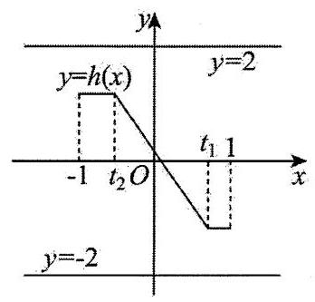

令 $h\left( t\right)  = \left| {t - {t}_{1}}\right|  - \left| {t - {t}_{2}}\right|  = \left\{  \begin{array}{l} {t}_{1} - {t}_{2}, - 1 \leq  t \leq  {t}_{2} \\  {t}_{1} + {t}_{2} - {2t},{t}_{2} < t < {t}_{1}, \\  {t}_{2} - {t}_{1},{t}_{1} \leq  t \leq  1 \end{array}\right.$

其图象如图所示,其值域为 $\left\lbrack  {{t}_{2} - {t}_{1},{t}_{1} - {t}_{2}}\right\rbrack$ ,

由 ${t}_{2} - {t}_{1} \leq  0$ 可知 $n \geq  0$ ; 由 ${t}_{1} - {t}_{2} \geq  0$ 可知 $n \leq  0$ ;

所以 $n = 0$ .

综上: $m = 2, n = 0, m + n = 2$ ,

14、【答案】1

【解析】令 $\max \{ \left| a\right| ,\left| b\right| ,\left| {a + {2b} - 4}\right| \}  = m$ ,

则 $\left| a\right|  \leq  m,\left| b\right|  \leq  m,\left| {a + {2b} - 4}\right|  \leq  m$ ,

所以 $4 = \left| {-a - {2b} + \left( {a + {2b} - 4}\right) }\right|  \leq  \left| a\right|  + 2\left| b\right|  + \left| {a + {2b} - 4}\right|  \leq  {4m}$ ,所以 $m \geq  1$ ;

即函数 $\max \{ \left| a\right| ,\left| b\right| ,\left| {a + {2b} - 4}\right| \}$ 的最小值为 1 .

15、【答案】 $\left\lbrack  {\frac{1}{2\mathrm{e}}, + \infty }\right)$

【解析】因为当 $x > 0$ 时, $a{\mathrm{e}}^{2x} \geq  \ln \frac{x}{a{\mathrm{e}}^{x}}$ 恒成立,

所以 $a{\mathrm{e}}^{2x} \geq  \ln x - \ln a - x$ 在 $\left( {0, + \infty }\right)$ 上恒成立,

所以 ${\mathrm{e}}^{\ln a + {2x}} + \ln a + {2x} \geq  {\mathrm{e}}^{\ln x} + \ln x$ 在 $\left( {0, + \infty }\right)$ 上恒成立,

令 $f\left( x\right)  = {\mathrm{e}}^{x} + x$ ,可得 ${f}^{\prime }\left( x\right)  = {\mathrm{e}}^{x} + 1 > 0$ ,

所以 $f\left( x\right)$ 在 $\left( {0, + \infty }\right)$ 上严格递增,且 $f\left( {\ln a + {2x}}\right)  \geq  f\left( {\ln x}\right)$ ,

所以 $\ln a + {2x} \geq  \ln x$ 在 $\left( {0, + \infty }\right)$ 上恒成立,即 $\ln a \geq  \ln x - {2x}$ 在 $\left( {0, + \infty }\right)$ 上恒成立,

所以 $\ln a \geq  {\left( \ln x - 2x\right) }_{\max }, x \in  \left( {0, + \infty }\right)$ 即可.

令 $g\left( x\right)  = \ln x - {2x}$ ,可得 ${g}^{\prime }\left( x\right)  = \frac{1}{x} - 2 = \frac{1 - {2x}}{x}$ ,

令 ${g}^{\prime }\left( x\right)  = 0$ ,则 $\frac{1 - {2x}}{x} = 0$ ,解得 $x = \frac{1}{2}$ ,

当 $0 < x < \frac{1}{2}$ 时, ${g}^{\prime }\left( x\right)  > 0$ ,

当 $x > \frac{1}{2}$ 时, ${g}^{\prime }\left( x\right)  < 0$ ,

所以 $g\left( x\right)$ 在 $\left( {0,\frac{1}{2}}\right)$ 上严格递增,在 $\left( {\frac{1}{2}, + \infty }\right)$ 上严格递减,

所以 $g\left( x\right)  \leq  g\left( \frac{1}{2}\right)  = \ln \frac{1}{2} - 1 = \ln \frac{1}{2\mathrm{e}}$ ,

所以 $\ln a \geq  \ln \frac{1}{2\mathrm{e}}$ ,解得 $a \geq  \frac{1}{2\mathrm{e}}$ ,

所以实数 $a$ 的取值范围是 $\left\lbrack  {\frac{1}{2\mathrm{e}}, + \infty }\right)$ .

16、【答案】 $\left( {\frac{1}{4},\frac{2}{\mathrm{e}}}\right)$

【解析】令 $g\left( x\right)  = t$ ,由函数 $f\left( x\right)$ 的图象可知,方程 $f\left( t\right)  = \lambda$ ( $\lambda$ 为常数)最多有 3 个解,

$f\left( t\right)$ 在 $( - \infty ,0\rbrack$ 上严格递增,

当 $t > 0$ 时, ${f}^{\prime }\left( t\right)  = \frac{2\left( {1 - \ln t}\right) }{{t}^{2}}$ ,则 $f\left( t\right)$ 在 $\left( {0,\mathrm{e}}\right)$ 上严格递增,在 $\left( {\mathrm{e}, + \infty }\right)$ 上严格递减,

所以 $t = \mathrm{e}$ 处取得极大值,即极大值为 $f\left( \mathrm{e}\right)  = \frac{2\ln \mathrm{e}}{\mathrm{e}} = \frac{2}{\mathrm{e}}$ ,如下图:

故结合图象可得 $0 < \lambda  < \frac{2}{\mathrm{e}}$ ,且方程 $f\left( t\right)  = \lambda$ 的三个解中最小的解为 $t = {\log }_{2}\lambda$ .

又 $g\left( x\right)  = {x}^{2} + {2x} - {4\lambda } = {\left( x + 1\right) }^{2} - {4\lambda } - 1$ ,在 $\left( {-\infty , - 1}\right)$ 上严格递减,在 $\left( {-1, + \infty }\right)$ 上严格递增,

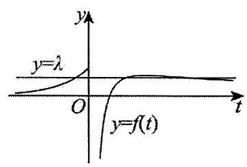

所以 $g\left( x\right)$ 最小值为 $g\left( {-1}\right)  =  - {4\lambda } - 1$ ,即当 $t \geq   - {4\lambda } - 1$ 时, $g\left( x\right)  = t$ 有 2 个零点,

所以使关于 $x$ 的方程 $f\left( {g\left( x\right) }\right)  = \lambda$ 有 6 个解,则 $\left\{  \begin{array}{l} {\log }_{2}\lambda  >  - {4\lambda } - 1 \\  0 < \lambda  < \frac{2}{\mathrm{e}} \end{array}\right.$ ,

${\log }_{2}\lambda  >  - {4\lambda } - 1$ ,即 ${4\lambda } + {\log }_{2}\lambda  + 1 > 0$ ,令 $h\left( \lambda \right)  = {4\lambda } + {\log }_{2}\lambda  + 1$ ,

易知 $h\left( \lambda \right)$ 在 $\left( {0, + \infty }\right)$ 上严格递增,又 $h\left( \frac{1}{4}\right)  = 0$ ,所以 ${4\lambda } + {\log }_{2}\lambda  + 1 > 0$ 的解集为 $\left( {\frac{1}{4}, + \infty }\right)$ ,

综上所述， $\lambda$ 的取值范围为 $\left( {\frac{1}{4},\frac{2}{\mathrm{e}}}\right)$ .

17、【答案】5

【解析】因为函数 $f\left( x\right)$ 的图象关于直线 $x = 0$ 和 $x = 2$ 对称,

所以 $f\left( x\right)  = f\left( {4 - x}\right)  = f\left( {x - 4}\right)$ ,所以其周期 $T = 4$ ,

$f\left( {{x}_{1} + {x}_{2}}\right)  = f\left( {x}_{1}\right)  + f\left( {x}_{2}\right)$ 中,令 ${x}_{1} = {x}_{2} = 1$ 得, $f\left( 2\right)  = {2f}\left( 1\right)$ ,

又 $f\left( 2\right)  = 2$ ,解得 $f\left( 1\right)  = 1$ ,同理可得 $f\left( \frac{1}{2}\right)  = \frac{1}{2}, f\left( \frac{1}{4}\right)  = \frac{1}{4}$ ,

所以 $f\left( 7\right)  = f\left( 3\right)  = f\left( 1\right)  = 1, f\left( \frac{7}{2}\right)  = f\left( \frac{1}{2}\right)  = \frac{1}{2}$ ,

$f\left( \frac{7}{4}\right)  = f\left( {1 + \frac{3}{4}}\right)  = f\left( 1\right)  + f\left( {\frac{1}{2} + \frac{1}{4}}\right)  = f\left( 1\right)  + f\left( \frac{1}{2}\right)  + f\left( \frac{1}{4}\right)  = \frac{7}{4},$

$f\left( \frac{7}{{2}^{2}}\right)  = f\left( \frac{7}{{2}^{3}}\right)  + f\left( \frac{7}{{2}^{3}}\right)  = \frac{7}{4}$ ，解得 $f\left( \frac{7}{{2}^{3}}\right)  = \frac{7}{{2}^{3}}$ ，

依次类推,可得当 $n \geq  2$ 时, $f\left( \frac{7}{{2}^{n}}\right)  = \frac{7}{{2}^{n}}$ ,

所以 $f\left( 7\right)  + f\left( \frac{7}{2}\right)  + f\left( \frac{7}{{2}^{2}}\right)  + \cdots  + f\left( \frac{7}{{2}^{n}}\right)  = 1 + \frac{1}{2} + \frac{\frac{7}{4} - \frac{7}{{2}^{n + 1}}}{1 - \frac{1}{2}} = 5 - \frac{7}{{2}^{n}}$ ,

又 $f\left( 7\right)  + f\left( \frac{7}{2}\right)  + f\left( \frac{7}{{2}^{2}}\right)  + \cdots  + f\left( \frac{7}{{2}^{n}}\right)  < t$ 对任意 $n \in  {\mathbf{N}}^{ * }$ 恒成立,故 $t \geq  5$ .

18、【答案】①④

【解析】对于①: 因为 $f\left( x\right)$ 的定义域为 $\mathbf{R}$ ,关于原点对称,

且 $f\left( {-x}\right)  = \frac{-x}{1 + \left| {-x}\right| } = \frac{x}{1 + \left| x\right| } =  - f\left( x\right)$ ,可知 $f\left( x\right)$ 为奇函数,

当 $x \geq  0$ 时, $f\left( x\right)  = \frac{x}{1 + x} = 1 - \frac{1}{x + 1}$ ,可知函数 $f\left( x\right)$ 在 $\lbrack 0, + \infty )$ 内严格递增,

且 $x + 1 \geq  1$ ,可得 $0 < \frac{1}{x + 1} \leq  1$ ,则 $f\left( x\right)  = 1 - \frac{1}{x + 1} \in  \lbrack 0,1)$ ,

结合 $f\left( x\right)$ 为奇函数,可知: 当 $x \geq  0$ 时,函数 $f\left( x\right)$ 在 $( - \infty ,0\rbrack$ 内严格递增,且 $f\left( x\right)  \in  ( - 1,0\rbrack$ ,

所以 $f\left( x\right)$ 的值域是 $\left( {-1,1}\right)$ ,故①正确；

对于②:由①可知:可知函数 $f\left( x\right)$ 是 $\mathbf{R}$ 上的严格增函数，

所以对任意 ${x}_{1},{x}_{2} \in  \mathbf{R}$ 且 ${x}_{1} < {x}_{2}$ ,均有 $f\left( {x}_{1}\right)  < f\left( {x}_{2}\right)$ ,故②错误;

对于③:当任意 ${x}_{1},{x}_{2} \in  \left( {0, + \infty }\right)$ 且 ${x}_{1} \neq  {x}_{2}$ 时，

令 ${x}_{1} = 1,{x}_{2} = 3,\frac{f\left( {x}_{1}\right)  + f\left( {x}_{2}\right) }{2} = \frac{f\left( 1\right)  + f\left( 3\right) }{2} = \frac{\frac{1}{2} + \frac{3}{4}}{2} = \frac{5}{8}$ ,

$f\left( \frac{{x}_{1} + {x}_{2}}{2}\right)  = f\left( 2\right)  = \frac{2}{3}$ ，显然 $\frac{5}{8} < \frac{2}{3}$ ，

因此 $\frac{f\left( {x}_{1}\right)  + f\left( {x}_{2}\right) }{2} > f\left( \frac{{x}_{1} + {x}_{2}}{2}\right)$ 不成立,故③不正确；

对于④:当 $x \geq  0$ 时， $f\left( x\right)  = \frac{x}{1 + x}$ ，

可得 ${f}_{1}\left( x\right)  = f\left( x\right)  = \frac{x}{x + 1},{f}_{2}\left( x\right)  = f\left( {{f}_{1}\left( x\right) }\right)  = \frac{\frac{x}{x + 1}}{\frac{x}{x + 1} + 1} = \frac{x}{{2x} + 1}$ ,

${f}_{3}\left( x\right)  = f\left( {{f}_{2}\left( x\right) }\right)  = \frac{\frac{x}{{2x} + 1}}{\frac{x}{{2x} + 1} + 1} = \frac{x}{{3x} + 1},\;{f}_{4}\left( x\right)  = f\left( {{f}_{3}\left( x\right) }\right)  = \frac{\frac{x}{{3x} + 1}}{\frac{x}{{3x} + 1} + 1} = \frac{x}{{4x} + 1},$

以此类推可得 ${f}_{n}\left( x\right)  = \frac{x}{{nx} + 1}$ ,因此 ${f}_{10}\left( \frac{1}{2}\right)  = \frac{\frac{1}{2}}{{10} \times  \frac{1}{2} + 1} = \frac{1}{{10} + 2} = \frac{1}{12}$ ,故④正确；

故答案为:①④.

19、【答案】2

【解析】显然 $f\left( n\right)  = {n}^{2} - {4n}, n \in  \left\lbrack  {a - 1, a + 1}\right\rbrack$ ,

当 $a + 1 \leq  2$ ,即 $a \leq  1$ 时, $f\left( n\right)$ 在 $\left\lbrack  {a - 1, a + 1}\right\rbrack$ 上严格递减, $f\left( {a + 1}\right)  \leq  f\left( n\right)  \leq  f\left( {a - 1}\right)$ ,

而 $f\left( {a - 1}\right)  = {\left( a - 1\right) }^{2} - 4\left( {a - 1}\right)  = {a}^{2} - {6a} + 5, f\left( {a + 1}\right)  = {\left( a + 1\right) }^{2} - 4\left( {a + 1}\right)  = {a}^{2} - {2a} - 3$ ,

即有 $f\left( n\right)  \in  \left\lbrack  {{a}^{2} - {2a} - 3,{a}^{2} - {6a} + 5}\right\rbrack$ ,此时,

$S = \left\lbrack  {\left( {a + 1}\right)  - \left( {a - 1}\right) }\right\rbrack  \left\lbrack  {\left( {{a}^{2} - {6a} + 5}\right)  - {a}^{2} - {2a} - 3)}\right\rbrack   = 2\left( {-{4a} + 8}\right)  \geq  8$ ;

当 $a - 1 \geq  2$ 时,即 $a \geq  3$ 时, $f\left( n\right)$ 在 $\left\lbrack  {a - 1, a + 1}\right\rbrack$ 上严格递增,则有 $f\left( n\right)  \in  \left\lbrack  {{a}^{2} - {6a} + 5,{a}^{2} - {2a} - 3}\right\rbrack$ ,

此时, $S = \left\lbrack  {\left( {a + 1}\right)  - \left( {a - 1}\right) }\right\rbrack  \left\lbrack  {\left( {{a}^{2} - {2a} - 3}\right)  - \left( {{a}^{2} - {6a} + 5}\right) }\right\rbrack   = 2\left( {{4a} - 8}\right)  \geq  8$ ;

当 $1 < a \leq  2$ 时， ${}^{f\left( n\right) }$ 在 $\left\lbrack  {a - 1,2}\right\rbrack$ 上严格递减， ${}^{f\left( n\right) }$ 在 $\left\lbrack  {2, a + 1}\right\rbrack$ 上严格递增，

且 $f\left( {a - 1}\right)  \geq  f\left( {a + 1}\right) , f\left( 2\right)  =  - 4$ ,则有 $f\left( n\right)  \in  \left\lbrack  {-4,{a}^{2} - {6a} + 5}\right\rbrack$ ,

此时, $S = \left\lbrack  {\left( {a + 1}\right)  - \left( {a - 1}\right) }\right\rbrack  \left\lbrack  {{a}^{2} - {6a} + 5 - \left( {-4}\right) }\right\rbrack   = 2\left( {{a}^{2} - {6a} + 9}\right)  \geq  2$ ;

当 $2 < a < 3$ 时， $f\left( n\right)$ 在 $\left\lbrack  {a - 1,2}\right\rbrack$ 上严格递减， $f\left( n\right)$ 在 $\left\lbrack  {2, a + 1}\right\rbrack$ 上严格递增，

且 $f\left( {a - 1}\right)  < f\left( {a + 1}\right) ,\;f\left( 2\right)  =  - 4$ ,则有 $f\left( n\right)  \in  \left\lbrack  {-4,{a}^{2} - {2a} - 3}\right\rbrack$ ,

此时, $S = \left\lbrack  {\left( {a + 1}\right)  - \left( {a - 1}\right) }\right\rbrack  \left\lbrack  {{a}^{2} - {2a} - 3 - \left( {-4}\right) }\right\rbrack   = 2\left( {{a}^{2} - {2a} + 1}\right)  > 2$ ,

综上所述， $S \geq  2$ ，所以 $S$ 的最小值为 2 .

20、【答案】 ${e}^{2}$

【解析】 $\because {x}_{1},{x}_{2}$ 分别是方程 $\ln \left( {x - 1}\right)  + x = 3, x\ln x = {\mathrm{e}}^{2}$ 的根,

$\therefore \ln \left( {{x}_{1} - 1}\right)  + {x}_{1} = 3,{x}_{2}\ln {x}_{2} = {\mathrm{e}}^{2}$ ,且 ${x}_{1} > 1,{x}_{2} > 1$ ,

即 $\ln \left( {{x}_{1} - 1}\right)  + {x}_{1} - 1 = 2$ ,变形为 $\ln \left( {{x}_{1} - 1}\right)  + \ln {\mathrm{e}}^{\left( {x}_{1} - 1\right) } = 2$ ,

从而 $\left( {{x}_{1} - 1}\right)  \cdot  {\mathrm{e}}^{\left( {x}_{1} - 1\right) } = {\mathrm{e}}^{2} = {x}_{2}\ln {x}_{2}$ ,

同构得: ${\mathrm{e}}^{\left( {x}_{1} - 1\right) }\ln {\mathrm{e}}^{\left( {x}_{1} - 1\right) } = {x}_{2}\ln {x}_{2}$ 且 ${x}_{1} > 1,{x}_{2} > 1$ .

设 $f\left( x\right)  = x\ln x, x \in  \left( {1, + \infty }\right) ,\therefore {f}^{\prime }\left( x\right)  = 1 + \ln x > 0$ ,

所以 $f\left( x\right)$ 在 $\left( {1, + \infty }\right)$ 上严格递增,

又 $\because f\left( {\mathrm{e}}^{\left( {x}_{1} - 1\right) }\right)  = f\left( {x}_{2}\right) ,\therefore {\mathrm{e}}^{\left( {x}_{1} - 1\right) } = {x}_{2}$ ,从而 ${x}_{1}{x}_{2} - {x}_{2} = {x}_{2}\left( {{x}_{1} - 1}\right)  = {x}_{2}\ln {x}_{2} = {\mathrm{e}}^{2}$ .

21、【答案】②④

【解析】对于①,根据题意可知 ${a}_{2} = {a}^{{a}_{1}} = {a}^{a}$ ,

因为 $0 < a < 1$ ,所以 ${a}^{1} < {a}^{a} < {a}^{0}$ ,即 ${a}_{2} \in  \left( {a,1}\right)$ ,故①错误;

对于③，则 ${a}_{1} < {a}_{2} < 1$ ，故 ${a}^{{a}_{1}} > {a}^{{a}_{2}} > {a}^{1}$ ，即 $1 > {a}_{2} > {a}_{3} > {a}_{1} = a > 0$ ，

所以 ${a}^{{a}_{2}} < {a}^{{a}_{3}} < {a}^{{a}_{1}}$ ,即 ${a}_{3} < {a}_{4} < {a}_{2}$ ,故③错误;

对于②,依次递推有 $0 < a < {a}_{3} < {a}_{4} < {a}_{2} < 1$ ,

所以 ${a}^{{a}_{3}} > {a}^{{a}_{4}} > {a}^{{a}_{2}}$ ,即 ${a}_{4} > {a}_{5} > {a}_{3}$ ,

所以 ${a}^{{a}_{4}} < {a}^{{a}_{5}} < {a}^{{a}_{3}}$ ,即 ${a}_{5} < {a}_{6} < {a}_{4}$ ,

所以 ${a}^{{a}_{5}} > {a}^{{a}_{6}} > {a}^{{a}_{4}}$ ,即 ${a}_{6} > {a}_{7} > {a}_{5}$ ,

所以 ${a}^{{a}_{6}} < {a}^{{a}_{7}} < {a}^{{a}_{5}}$ ,即 ${a}_{7} < {a}_{8} < {a}_{6}$ ,

所以 ${a}^{{a}_{7}} > {a}^{{a}_{8}} > {a}^{{a}_{6}}$ ,即 ${a}_{8} > {a}_{9} > {a}_{7}$ ,

所以 ${a}^{{a}_{8}} < {a}^{{a}_{9}} < {a}^{{a}_{7}}$ ,即 ${a}_{9} < {a}_{10} < {a}_{8}$ ,故②正确；

对于④,因为 $0 < a < 1$ ,所以 ${a}^{a} = {a}_{2} \in  \left( {a,1}\right)$ ,则 ${a}^{{a}_{2}} \in  \left( {a,1}\right)$ ,依次可知 ${a}^{{a}_{n}} \in  \left( {a,1}\right)$ ,

所以 $\left\{  {\begin{array}{l} a < {a}_{n + 1} < 1 \\  a \leq  {a}_{n} < 1 \end{array} \Rightarrow  a - 1 < {a}_{n + 1} - {a}_{n} < 1 - a \Rightarrow  \left| {{a}_{n + 1} - {a}_{n}}\right|  < 1 - a}\right.$ ,故④正确.

故答案为:②④.

22、【答案】 $\left\{  {{1012},{1349},{2023},{2024},{2025}}\right\}$

【解析】由题意 $f\left( x\right)  = 2{\cos }^{2}x - a\sin x - 1 =  - 2{\sin }^{2}x - a\sin x + 1$ ,

令 $t = \sin x, t \in  \left\lbrack  {-1,1}\right\rbrack$ ,所以 $g\left( t\right)  =  - 2{t}^{2} - {at} + 1,\Delta  = {a}^{2} + 8 > 0$ ,

所以 $g\left( {-1}\right)  =  - 1 + a, g\left( 0\right)  = 1, g\left( 1\right)  =  - a - 1$ ,

记 $g\left( t\right)  =  - 2{t}^{2} - {at} + 1$ 的两零点为 ${t}_{1}\text{ 、 }{t}_{2}$ ,因为 ${t}_{1} \cdot  {t}_{2} < 0$ ,设 ${t}_{1} < 0,{t}_{2} > 0$ ,

当 ${t}_{1} =  - 1$ ,即 $a = 1$ 时,得 ${t}_{2} = \frac{1}{2}, f\left( x\right)$ 在 $\left( {0,{2k\pi }}\right) \left( {k\text{ 为正整数 }}\right)$ ,内零点个数为 ${3k}$ ,

在 $\left( {0,\left( {{2k} + 1}\right) \pi }\right)$ 内零点个数为 ${3k} + 2$ ，因为 ${2024} = 3 \times  {674} + 2$ ，

所以 $n = {674} \times  2 + 1 = {1349}$ ;

当 ${t}_{2} = 1$ ,即 $a =  - 1$ 时, ${t}_{1} =  - \frac{1}{2}, f\left( x\right)$ 在 $\left( {0,{2k\pi }}\right) \left( {k\text{ 为正整数 }}\right)$ 内零点个数为 ${3k}$ ,

在 $\left( {0,\left( {{2k} + 1}\right) \pi }\right)$ 内零点个数为 ${3k} + 1$ ,此时不存在 $n$ ;

当 $a <  - 1$ 时,则 $- 1 < {t}_{1} < 0,{t}_{2} > 1$ ,

$f\left( x\right)$ 在 $\left( {0,{2k\pi }}\right)$ 和 $\left( {0,\left( {{2k} + 1}\right) \pi }\right)$ ( $k$ 为正整数)内零点个数均为 ${2k}$ ,

因为 ${2024} = 2 \times  {1012}$ ,所以 $n = {2024}$ 或 2025 ;

当 $- 1 < a < 1$ 时,则 $- 1 < {t}_{1} < 0,0 < {t}_{2} < 1$ ,

$f\left( x\right)$ 在 $\left( {0,{k\pi }}\right) \;\left( {k\text{ 为正整数 }}\right)$ 内零点个数均为 ${2k}$ ,

所以 $n = k = {1012}$ ;

当 $a > 1$ ,则 ${t}_{1} <  - 1,0 < {t}_{2} < 1$ ,

$f\left( x\right)$ 在 $\left( {0,{2k\pi }}\right)$ 和 $\left( {0,\left( {{2k} - 1}\right) \pi }\right) \left( {k\text{ 为正整数 }}\right)$ 内零点个数均为 ${2k}$ ,

所以 $n = {2023}$ 或 2024 ;

综上 $n$ 的所有可能值为: 1012,1349,2023,2024,2025. 故答案为: $\{ {1012},{1349},{2023},{2024},{2025}\}$

23、【答案】②④

【解析】当 ${2k\pi } \leq  x \leq  \pi  + {2k\pi }\left( {k \in  \mathbf{Z}}\right)$ 时, $f\left( x\right)  = \sin x + 2\sin x = 3\sin x$ ; 当 $- \pi  + {2k\pi } \leq  x \leq  {2k\pi }\left( {k \in  \mathbf{Z}}\right)$ 时, $f\left( x\right)  = \sin x - 2\sin x =  - \sin x$ ; 由此可得 $f\left( x\right)$ 图象如下图所示,

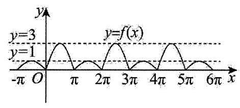

令 $f\left( x\right)  = t$ ,则 ${t}^{2} - \sqrt{a}t - 1 = 0$ ,又 $\Delta  = a + 4 > 0$ ,

${t}^{2} - \sqrt{a}t - 1 = 0$ 有两个不等实根 ${t}_{1},{t}_{2}\left( {{t}_{2} < {t}_{1}}\right) ,\therefore {t}_{1} + {t}_{2} = \sqrt{a},{t}_{1}{t}_{2} =  - 1,\therefore {t}_{2} < 0 < {t}_{1}$ ,

$\because y = {t}_{2}$ 与 $f\left( x\right)$ 图象无交点, $\therefore$ 只需讨论 $y = {t}_{1}$ 与 $f\left( x\right)$ 图象交点情况,

由 $\therefore {t}_{1} + {t}_{2} = \sqrt{a},{t}_{1}{t}_{2} =  - 1$ ,得: ${t}_{1} - \frac{1}{{t}_{1}} = \sqrt{a}$ ;

对于①,当 $a = {16}$ 时, ${t}_{1} - \frac{1}{{t}_{1}} = 4$ ,解得: ${t}_{1} = 2 + \sqrt{5} > 3$

此时 $y = {t}_{1}$ 与 $f\left( x\right)$ 图象无交点,则方程 ${f}^{2}\left( x\right)  - \sqrt{a}f\left( x\right)  - 1 = 0$ 无根,①错误;

对于②,当 $a \geq  0$ 时, $\sqrt{a} \in  \lbrack 0, + \infty )$ ,则 ${t}_{1} \geq  1$ ;

当 ${t}_{1} = 1$ 时, $y = {t}_{1}$ 与 $f\left( x\right)$ 在 $\left\lbrack  {0,{6\pi }}\right\rbrack$ 内有 9 个不同交点;

当 $1 < {t}_{1} < 3$ 时， $y = {t}_{1}$ 与 $f\left( x\right)$ 在 $\left\lbrack  {0,{6\pi }}\right\rbrack$ 内有 6 个不同交点；

当 ${t}_{1} = 3$ 时， $y = {t}_{1}$ 与 $f\left( x\right)$ 在 $\left\lbrack  {0,{6\pi }}\right\rbrack$ 内有 3 个不同交点；

当 ${t}_{1} > 3$ 时， $y = {t}_{1}$ 与 $f\left( x\right)$ 在 $\left\lbrack  {0,{6\pi }}\right\rbrack$ 内无交点；

综上所述: 当 $a \geq  0$ 时,方程 ${f}^{2}\left( x\right)  - \sqrt{a}f\left( x\right)  - 1 = 0$ 在 $\left\lbrack  {0,{6\pi }}\right\rbrack$ 内最多有 9 个不等实根,②正确；

对于③，当 $0 \leq  a < \frac{64}{9}$ 时， $\sqrt{a} \in  \left\lbrack  {0,\frac{8}{3}}\right)$ ，

当 ${t}_{1} - \frac{1}{{t}_{1}} = \frac{8}{3}$ 时, ${t}_{1} = 3$ ; 当 ${t}_{1} - \frac{1}{{t}_{1}} = 0$ 时, ${t}_{1} = 1$ ; 又 $y = t - \frac{1}{t}$ 在 $\left( {0, + \infty }\right)$ 上单调递增,

$\therefore {t}_{1} \in  \lbrack 1,3)$ ,则当 ${t}_{1} = 1$ 时, $y = {t}_{1}$ 与 $f\left( x\right)$ 在 $\left\lbrack  {0,{2\pi }}\right\rbrack$ 内有三个不同交点;

当 ${t}_{1} \in  \left( {1,3}\right)$ 时， $y = {t}_{1}$ 与 $f\left( x\right)$ 在 $\left\lbrack  {0,{2\pi }}\right\rbrack$ 内有两个不同交点；

二方程 ${f}^{2}\left( x\right)  - \sqrt{a}f\left( x\right)  - 1 = 0$ 在 $\left\lbrack  {0,{2\pi }}\right\rbrack$ 内有两个或三个不等实根,③错误;

对于④，由②知:若方程 ${f}^{2}\left( x\right)  - \sqrt{a}f\left( x\right)  - 1 = 0$ 在 $\left\lbrack  {0,{6\pi }}\right\rbrack$ 内根的个数为正偶数，则 $1 < {t}_{1} < 3$ ，

设 6 个根为 ${x}_{1},{x}_{2},{x}_{3},{x}_{4},{x}_{5},{x}_{6}\left( {{x}_{1} < {x}_{2} < {x}_{3} < {x}_{4} < {x}_{5} < {x}_{6}}\right)$ ,

则 ${x}_{1} + {x}_{2} = \pi ,{x}_{3} + {x}_{4} = {5\pi },{x}_{5} + {x}_{6} = {9\pi }$ ,

$\therefore {x}_{1} + {x}_{2} + {x}_{3} + {x}_{4} + {x}_{5} + {x}_{6} = {15\pi }$ ,④正确.

故答案为:②④.

24、【答案】(1)1 ; (2)仅在 $x \in  \left( {-\infty ,0}\right)$ 时存在 1 个零点；(3) $g\left( x\right)  = \left\{  \begin{array}{l} \frac{\sin x}{x}, x \in  \left( {-\pi ,0}\right)  \cup  \left( {0,\pi }\right) , \\  1, x = 0. \end{array}\right.$

【解析】(1) $\mathop{\lim }\limits_{{x \rightarrow  0}}\frac{x}{\sin x} = \mathop{\lim }\limits_{{x \rightarrow  0}}\frac{1}{\cos x} = 1$

(2) $f\left( x\right)  = 1 + x + \frac{{x}^{2}}{2} + \frac{{x}^{3}}{3!} + \cdots  + \frac{{x}^{{2n} - 1}}{\left( {{2n} - 1}\right) !},{f}^{\prime }\left( x\right)  = 1 + x + \frac{{x}^{2}}{2!} + \frac{{x}^{3}}{3!} + \cdots  + \frac{{x}^{{2n} - 2}}{\left( {{2n} - 2}\right) !}$ ,

所以 ${f}^{\prime }\left( x\right)  - f\left( x\right)  =  - \frac{{x}^{{2n} - 1}}{\left( {{2n} - 1}\right) !},\frac{{f}^{\prime }\left( x\right)  - f\left( x\right) }{{\mathrm{e}}^{x}} = {\left\lbrack  \frac{f\left( x\right) }{{\mathrm{e}}^{x}}\right\rbrack  }^{\prime } =  - \frac{{x}^{{2n} - 1}}{{\mathrm{e}}^{x}\left( {{2n} - 1}\right) !}$ .

当 $x > 0$ 时, ${\left\lbrack  \frac{f\left( x\right) }{{\mathrm{e}}^{x}}\right\rbrack  }^{\prime } < 0$ ,函数 $\frac{f\left( x\right) }{{\mathrm{e}}^{x}}$ 在 $\left( {0, + \infty }\right)$ 上严格递减,

当 $x < 0$ 时, ${\left\lbrack  \frac{f\left( x\right) }{{\mathrm{e}}^{x}}\right\rbrack  }^{\prime } > 0$ ,函数 $\frac{f\left( x\right) }{{\mathrm{e}}^{x}}$ 在 $\left( {-\infty ,0}\right)$ 上严格递增,

$\mathop{\lim }\limits_{{x \rightarrow   - \infty }}\frac{f\left( x\right) }{{\mathrm{e}}^{x}} =  - \infty ,\;f\left( 0\right)  = 1,$

当 $x > 0$ 时, $\frac{f\left( x\right) }{{\mathrm{e}}^{x}} > 0$ ,所以仅在 $x \in  \left( {-\infty ,0}\right)$ 时存在 1 个零点.

(3) $\frac{g\left( {2x}\right) }{g\left( x\right) } = \cos x$ ，所以 $\frac{g\left( x\right) }{g\left( \frac{x}{2}\right) } = \cos \frac{x}{2}$ ， $\frac{g\left( \frac{x}{2}\right) }{g\left( \frac{x}{4}\right) } = \cos \frac{x}{4}$ ， $\ldots$ ， $\frac{g\left( \frac{x}{{2}^{n - 1}}\right) }{g\left( \frac{x}{{2}^{n}}\right) } = \cos \frac{x}{{2}^{n}}$

将各式相乘得 $\frac{g\left( x\right) }{g\left( \frac{x}{{2}^{n}}\right) } = \cos \frac{x}{2} \cdot  \cos \frac{x}{4}\cdots \cdots \cos \frac{x}{{2}^{n}} = \frac{\cos \frac{x}{2} \cdot  \cos \frac{x}{4}\cdots \cdots \cos \frac{x}{{2}^{n}} \cdot  \sin \frac{x}{{2}^{n}}}{\sin \frac{x}{{2}^{n}}} = \frac{1}{{2}^{n}}\frac{\sin x}{\sin \frac{x}{{2}^{n}}}$ ,

两侧同时运算极限,所以 $\mathop{\lim }\limits_{{n \rightarrow   + \infty }}\frac{g\left( x\right) }{g\left( \frac{x}{{2}^{n}}\right) } = \mathop{\lim }\limits_{{n \rightarrow   + \infty }}\frac{\frac{1}{{2}^{n}} \cdot  \sin x}{\sin \frac{x}{{2}^{n}}} = \frac{\sin x}{x}\mathop{\lim }\limits_{{n \rightarrow   + \infty }}\frac{\frac{x}{{2}^{n}}}{\sin \frac{x}{{2}^{n}}}$ ,

即 $\frac{g\left( x\right) }{g\left( 0\right) } = \frac{\sin x}{x}\mathop{\lim }\limits_{{n \rightarrow   + \infty }}\frac{\frac{x}{{2}^{n}}}{\sin \frac{x}{{2}^{n}}}$ ,

令 $t = \frac{x}{{2}^{n}}$ ,原式可化为 $\frac{g\left( x\right) }{g\left( 0\right) } = \frac{\sin x}{x}\mathop{\lim }\limits_{{t \rightarrow  0}}\frac{t}{\sin t}$ ,又 $g\left( 0\right)  = 1$ ,

由(1)得 $\mathop{\lim }\limits_{{t \rightarrow  0}}\frac{t}{\sin t} = 1$ ,

故 $g\left( x\right)  = \frac{\sin x}{x}\left( {x \neq  0}\right)$ ,由题意函数 $g\left( x\right)$ 的定义域为 $\left( {-\pi ,\pi }\right)$ ,

综上, $g\left( x\right)  = \left\{  \begin{array}{l} \frac{\sin x}{x}, x \in  \left( {-\pi ,0}\right)  \cup  \left( {0,\pi }\right) , \\  1, x = 0. \end{array}\right.$

25、【答案】( 1 )见解析:( 2 ) ${a}_{n} = {3}^{\frac{1 - n}{2}} + 1$ ；( 3 )见解析

【解析】(1)因为 $f\left( x\right)  = {x}^{2}$ ,则 ${f}^{\prime }\left( x\right)  = {2x}$ ,

由题意可得: ${f}^{\prime }\left( {a}_{n}\right)  = \frac{f\left( {a}_{n - 1}\right)  - f\left( a\right) }{{a}_{n - 1} - a} = \frac{{a}_{n - 1}^{2} - a}{{a}_{n - 1} - a} = {a}_{n - 1} + a$ ,

则 $2{a}_{n} = {a}_{n - 1} + a$ ,即 $2\left( {{a}_{n} - a}\right)  = {a}_{n - 1} - a$ ,且 ${a}_{1} - a > 0$ ,

可知数列 $\left\{  {{a}_{n} - a}\right\}$ 为以 ${a}_{1} - a$ 为首项, $\frac{1}{2}$ 为公比的等比数列,

显然这样的数列对于给定的 ${a}_{1} > a$ 是存在的,

所以 $\forall a \in  \mathbf{R}, f\left( x\right)$ 都存在“ $a$ 关联切线伴随数列”.

(2)因为 $g\left( x\right)  = {\left( x - 1\right) }^{3}$ ，则 ${g}^{\prime }\left( x\right)  = 3{\left( x - 1\right) }^{2}$ ，

设 ${g}^{\prime }\left( {a}_{n}\right)  = \frac{g\left( {a}_{n - 1}\right)  - g\left( 1\right) }{{a}_{n - 1} - 1} = \frac{{\left( {a}_{n - 1} - 1\right) }^{3}}{{a}_{n - 1} - 1} = {\left( {a}_{n - 1} - 1\right) }^{2}$ ,即 $3{\left( {a}_{n} - 1\right) }^{2} = {\left( {a}_{n - 1} - 1\right) }^{2}$ ,

由题意可知: ${a}_{n} > 1$ ,则 ${a}_{n} - 1 > 0$ ,

可得 $\sqrt{3}\left( {{a}_{n} - 1}\right)  = \left( {{a}_{n - 1} - 1}\right)$ ,且 ${a}_{1} - 1 = \sqrt{3} \neq  0$ ,

可知数列 $\left\{  {{a}_{n} - 1}\right\}$ 为以 ${a}_{1} - 1 = \sqrt{3}$ 为首项, $\frac{\sqrt{3}}{3}$ 为公比的等比数列,

可得 ${a}_{n} - 1 = \sqrt{3} \times  {\left( \frac{\sqrt{3}}{3}\right) }^{n - 1} = {3}^{1 - \frac{n}{2}}$ ,所以数列通项公式为 ${a}_{n} = {3}^{1 - \frac{n}{2}} + 1$ .

(3)先证明 $b + {b}_{n} < 2{b}_{n + 1}$ ，

设函数 $s\left( x\right)  = h\left( x\right)  - \frac{h\left( {b}_{n}\right)  - h\left( b\right) }{{b}_{n} - b}x, x \in  \left( {b,{b}_{n}}\right)$ ,

则 $s\left( {b}_{n}\right)  = s\left( b\right) ,{s}^{\prime }\left( x\right)  = {h}^{\prime }\left( x\right)  - \frac{h\left( {b}_{n}\right)  - h\left( b\right) }{{b}_{n} - b}$ ,则 ${s}^{\prime }\left( {b}_{n + 1}\right)  = 0$ ,

定义 ${h}^{\prime }\left( x\right)$ 的导函数为 ${h}^{\prime \prime }\left( x\right) ,{h}^{\prime \prime }\left( x\right)$ 的导函数为 ${h}^{\prime \prime }\left( x\right)$ ,

则 ${h}^{\prime \prime }\left( x\right)  = {6mx} - 6\sin x,{h}^{\prime \prime }\left( x\right)  = {6m} - 6\cos x \geq  6 - 6\cos x \geq  0,{h}^{\prime \prime }\left( x\right)  \geq  {h}^{\prime \prime }\left( 0\right)  = 0$ ,

且 ${s}^{\prime \prime }\left( x\right)  = {h}^{\prime \prime }\left( x\right) ,{s}^{\prime \prime \prime }\left( x\right)  = {h}^{\prime \prime }\left( x\right)$ ,

令 $w\left( x\right)  = s\left( {{b}_{n + 1} + x}\right)  - s\left( {{b}_{n + 1} - x}\right) \left( {x \geq  0}\right)$ ,则 ${w}^{\prime }\left( x\right)  = {s}^{\prime }\left( {{b}_{n + 1} + x}\right)  + {s}^{\prime }\left( {{b}_{n + 1} - x}\right)$ ,

${w}^{\prime }\left( x\right)  = {s}^{\prime }\left( {{b}_{n + 1} + x}\right)  + {s}^{\prime }\left( {{b}_{n + 1} - x}\right) ,{w}^{\prime \prime }\left( x\right)  = {s}^{\prime \prime }\left( {{b}_{n + 1} + x}\right)  - {s}^{\prime \prime }\left( {{b}_{n + 1} - x}\right) ,$

因为 ${w}^{\prime \prime \prime }\left( x\right)  = {s}^{\prime \prime \prime }\left( {{b}_{n + 1} + x}\right)  + {s}^{\prime \prime \prime }\left( {{b}_{n + 1} - x}\right)  \geq  0$ ,

可知 ${w}^{\prime \prime }\left( x\right)$ 在 $\lbrack 0, + \infty )$ 内严格递增,则 ${w}^{\prime \prime }\left( x\right)  \geq  {w}^{\prime \prime }\left( 0\right)  = 0$ ,

同理得 ${w}^{\prime }\left( x\right)  \geq  {w}^{\prime }\left( 0\right)  = 0, w\left( x\right)  \geq  w\left( 0\right)  = 0$ ,

故 $s\left( {{b}_{n + 1} + x}\right)  > s\left( {{b}_{n + 1} - x}\right) \left( {x > 0}\right)$ ,

又 ${h}^{\prime \prime }\left( x\right)  \geq  {h}^{\prime \prime }\left( 0\right)  = 0,{s}^{\prime \prime }\left( x\right)  \geq  {s}^{\prime \prime }\left( 0\right)  = 0,{s}^{\prime }\left( x\right)$ 在 $\lbrack 0, + \infty )$ 内严格递增,

在 $\left( {b,{b}_{n + 1}}\right)$ 有 ${s}^{\prime }\left( x\right)  < 0,\left( {{b}_{n + 1},{b}_{n}}\right)$ 有 ${s}^{\prime }\left( x\right)  > 0$

因此取 $x = {b}_{n} - {b}_{n + 1}$ ,有 $s\left( b\right)  = s\left( {b}_{n}\right)  > s\left( {2{b}_{n + 1} - {b}_{n}}\right)$ ,

又 $s\left( x\right)$ 在 $\left( {b,{b}_{n + 1}}\right)$ 严格递减,在 $\left( {{b}_{n + 1},{b}_{n}}\right)$ 严格递增,

故 $b + {b}_{n} < 2{b}_{n + 1}$ ,

当 $n = 1$ 时， ${S}_{n} + {b}_{n} = 2{b}_{1}$ ，符合题意；

当 $n \geq  2$ 时, $b + {b}_{1} < 2{b}_{2}, b + {b}_{2} < 2{b}_{3},\cdots , b + {b}_{n + 1} < 2{b}_{n}$ ,

累加可得 $\left( {n - 1}\right) b + {b}_{1} + {b}_{2} + \cdots  + {b}_{n - 1} < 2{b}_{2} + 2{b}_{3} + \cdots  + 2{b}_{n}$ ,

整理得 $\left( {n - 1}\right) b + {b}_{1} < {b}_{2} + {b}_{3} + \cdots  +  + {b}_{n - 1} + 2{b}_{n}$ ,

所以 $\left( {n - 1}\right) b + 2{b}_{1} < {b}_{1} + {b}_{2} + {b}_{3} + \cdots  +  + {b}_{n - 1} + 2{b}_{n} = {S}_{n} + {b}_{n}$ ;

综上所述: ${S}_{n} + {b}_{n} \geq  \left( {n - 1}\right) b + 2{b}_{1}$ .

26、【答案】(1) $m = 1, n = \frac{1}{2};\;\left( 2\right)$ 见解析; (3)见解析.

【解析】(1)由 $f\left( x\right)  = \ln \left( {x + 1}\right) , g\left( x\right)  = \frac{mx}{1 + {nx}}$ ,有 $f\left( 0\right)  = g\left( 0\right)$ ,

可知 ${f}^{\prime }\left( x\right)  = \frac{1}{x + 1},{f}^{\prime \prime }\left( x\right)  =  - \frac{1}{{\left( x + 1\right) }^{2}},{g}^{\prime }\left( x\right)  = \frac{m}{{\left( 1 + nx\right) }^{2}},{g}^{\prime \prime }\left( x\right)  = \frac{2mn}{{\left( 1 + nx\right) }^{3}}$ ,

由题意, ${f}^{\prime }\left( 0\right)  = {g}^{\prime }\left( 0\right) ,{f}^{\prime \prime }\left( 0\right)  = {g}^{\prime \prime }\left( 0\right)$ ,

所以 $\left\{  \begin{array}{l} m = 1 \\   - {2mn} =  - 1 \end{array}\right.$ ,解得 $m = 1, n = \frac{1}{2}$ .

( 2 )由( 1 )知， $g\left( x\right)  = \frac{2x}{x + 2}$ ，

令 $\varphi \left( x\right)  = f\left( x\right)  - g\left( x\right)  = \ln \left( {x + 1}\right)  - \frac{2x}{x + 2}\left( {x \geq  0}\right)$ ,

则 ${\varphi }^{\prime }\left( x\right)  = \frac{1}{x + 1} - \frac{4}{{\left( x + 2\right) }^{2}} = \frac{{x}^{2}}{\left( {x + 1}\right) {\left( x + 2\right) }^{2}} \geq  0$ ,

所以 $\varphi \left( x\right)$ 在其定义域 $\left( {-1, + \infty }\right)$ 内为严格增函数,

又 $\varphi \left( 0\right)  = f\left( 0\right)  - g\left( 0\right)  = 0$ ,

$\therefore x \geq  0$ 时, $\varphi \left( x\right)  = f\left( x\right)  - g\left( x\right)  \geq  \varphi \left( 0\right)  = 0$ ,得证.

(3) $h\left( x\right)  = f\left( x\right)  - \frac{a}{2}g\left( x\right)  = \ln \left( {x + 1}\right)  - \frac{ax}{x + 2}$ 的定义域是 $\left( {-1, + \infty }\right)$ ，

${h}^{\prime }\left( x\right)  = \frac{1}{x + 1} - \frac{2a}{{\left( x + 2\right) }^{2}} = \frac{{x}^{2} + \left( {4 - {2a}}\right) \left( {x + 1}\right) }{\left( {x + 1}\right) {\left( x + 2\right) }^{2}}.$

① 当 $a \leq  2$ 时， ${h}^{\prime }\left( x\right)  \geq  0$ ，所以 $h\left( x\right)$ 在 $\left( {-1, + \infty }\right)$ 上严格递增，且 $h\left( 0\right)  = 0$ ，

所以 $h\left( x\right)$ 在 $\left( {-1, + \infty }\right)$ 上存在 1 个零点;

② 当 $a > 2$ 时,令 $t\left( x\right)  = {x}^{2} + \left( {4 - {2a}}\right) \left( {x + 1}\right)  = {x}^{2} + \left( {4 - {2a}}\right) x + \left( {4 - {2a}}\right)$ ,

由 $t\left( x\right)  = 0$ ,得 ${x}_{1} = \left( {a - 2}\right)  - \sqrt{{a}^{2} - {2a}}\left\langle  {0,{x}_{2} = \left( {a - 2}\right)  + \sqrt{{a}^{2} - {2a}}}\right\rangle  0$ .

又因为 $t\left( {-1}\right)  = 1 > 0, t\left( 0\right)  = 4 - {2a} < 0$ ,所以 ${x}_{1} \in  \left( {-1,0}\right) ,{x}_{2} \in  \left( {0, + \infty }\right)$ .

<table id="cross-table-1"><tr><td>$x$</td><td>$\left( {-1,{x}_{1}}\right)$</td><td>${x}_{1}$</td><td>$\left( {{x}_{1},{x}_{2}}\right)$</td><td>${X}_{2}$</td><td>$\left( {{x}_{2}, + \infty }\right)$</td></tr><tr></tr><tr><td>$h\left( x\right)$</td><td>单调递增</td><td>极大值 $h\left( {x}_{1}\right)$</td><td>单调递减</td><td>极小值 $h\left( {x}_{2}\right)$</td><td>单调递增</td></tr></table>

当 $x \in  \left( {{x}_{1},{x}_{2}}\right)$ 时,因为 $h\left( 0\right)  = 0$ ,所以 $h\left( x\right)$ 在 $\left( {{x}_{1},{x}_{2}}\right)$ 上存在 1 个零点,

且 $h\left( {x}_{1}\right)  > h\left( 0\right)  = 0, h\left( {x}_{2}\right)  < h\left( 0\right)  = 0$ ;

当 $x \in  \left( {-1,{x}_{1}}\right)$ 时,因为 $h\left( {{\mathrm{e}}^{-a} - 1}\right)  = \ln {\mathrm{e}}^{-a} - \frac{a\left( {{\mathrm{e}}^{-a} - 1}\right) }{{\mathrm{e}}^{-a} + 1} = \frac{-{2a}{\mathrm{e}}^{-a}}{{\mathrm{e}}^{-a} + 1} < 0$ ,

$- 1 < {\mathrm{e}}^{-a} - 1 < 0$ ,而 $h\left( x\right)$ 在 $\left( {-1,{x}_{1}}\right)$ 严格递增,且 ${h}^{\prime }\left( {x}_{1}\right)  = 0$ ,

而 $h\left( {{\mathrm{e}}^{-a} - 1}\right)  < 0$ ,故 $- 1 < {\mathrm{e}}^{-a} - 1 < {x}_{1}$ ,所以 $h\left( x\right)$ 在 $\left( {-1,{x}_{1}}\right)$ 上存在 1 个零点;

当 $x \in  \left( {{x}_{2}, + \infty }\right)$ 时,因为 $h\left( {{\mathrm{e}}^{a} - 1}\right)  = {\operatorname{lne}}^{a} - \frac{a\left( {{\mathrm{e}}^{a} - 1}\right) }{{\mathrm{e}}^{a} + 1} = \frac{2a}{{\mathrm{e}}^{a} + 1} > 0$ ,

${\mathrm{e}}^{a} - 1 > 0$ ,而 $h\left( x\right)$ 在 $\left( {{x}_{2}, + \infty }\right)$ 严格递增,且 ${h}^{\prime }\left( {x}_{2}\right)  = 0$ ,而 $h\left( {{\mathrm{e}}^{a} - 1}\right)  > 0$ ,

所以 ${\mathrm{e}}^{a} - 1 > {x}_{2}$ ,所以 $h\left( x\right)$ 在 $\left( {{x}_{2}, + \infty }\right)$ 上存在 1 个零点.

从而 $h\left( x\right)$ 在 $\left( {-1, + \infty }\right)$ 上存在 3 个零点.

综上所述,当 $a \leq  2$ 时,方程 $f\left( x\right)  - \frac{a}{2}g\left( x\right)  = 0$ 有 1 个解;

当 $a > 2$ 时,方程 $f\left( x\right)  - \frac{a}{2}g\left( x\right)  = 0$ 有 3 个解.

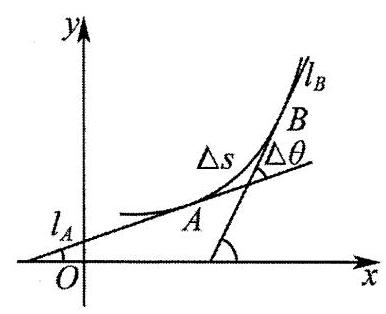

27、【答案】(1)4；(2)① $\frac{1}{45}$ ，②见解析.

【解析】(1) $f\left( x\right)  = \sin \left( {2x}\right) ,{f}^{\prime }\left( x\right)  = 2\cos \left( {2x}\right) ,{f}^{\prime \prime }\left( x\right)  =  - 4\sin \left( {2x}\right)$ ,

所以 ${f}^{\prime }\left( \frac{\pi }{4}\right)  = 2\cos \frac{\pi }{2} = 0,{f}^{\prime }\left( \frac{\pi }{4}\right)  =  - 4\sin \frac{\pi }{2} =  - 4$ ,

因此 $K\left( \frac{\pi }{4}\right)  = \frac{\left| {f}^{\prime \prime }\left( \frac{\pi }{4}\right) \right| }{{\left\{  1 + {\left\{  {f}^{\prime }\left( \frac{\pi }{4}\right) \right\}  }^{2}\right\}  }^{\frac{3}{2}}} = \frac{\left| -4\right| }{{\left( 1 + 0\right) }^{\frac{3}{2}}} = 4$ .

(2)①由圆的性质知圆 ${x}^{2} + {y}^{2} = {2025}$ 上圆心角为 $\frac{\pi }{3}$ 的圆弧的弧长为 ${\Delta S} = \frac{\pi }{3} \cdot  R$ .

弧的两端点处的切线对应的夹角 ${\Delta \theta } = \frac{\pi }{3}$ ,

所以该圆弧的平均曲率 $\bar{K} = \frac{\left| \Delta \theta \right| }{\left| \Delta S\right| } = \frac{1}{R} = \frac{1}{\sqrt{2025}} = \frac{1}{45}$ ,也即 $a = \frac{1}{45}$ .

② 由于 $a = \frac{1}{45}$ ,故 $g\left( x\right)  = \ln \left( {x + 1}\right)  - x{\mathrm{e}}^{x - 1}, x \in  \left( {-1, + \infty }\right)$ ,

又 $g\left( 0\right)  = 0,{g}^{\prime }\left( x\right)  = \frac{1}{x + 1} - \left( {x + 1}\right) {\mathrm{e}}^{x - 1},{g}^{\prime \prime }\left( x\right)  =  - \frac{1}{{\left( x + 1\right) }^{2}} - \left( {x + 2}\right) {\mathrm{e}}^{x - 1} < 0$ ,

所以 ${g}^{\prime }\left( x\right)$ 在 $\left( {-1, + \infty }\right)$ 上严格递减,而 ${g}^{\prime }\left( 0\right)  = 1 - \frac{1}{\mathrm{e}} > 0,{g}^{\prime }\left( 1\right)  = \frac{1}{2} - 2 =  - \frac{3}{2} < 0$ .

因此必存在唯一的 ${x}_{0} \in  \left( {0,1}\right)$ 使得 ${g}^{\prime }\left( {x}_{0}\right)  = 0$ 且 ${g}^{\prime }\left( x\right)$ 在 $\left( {-1,{x}_{0}}\right)$ 上为正,在 $\left( {{x}_{0}, + \infty }\right)$ 为负,即 $g\left( x\right)$ 在 $\left( {-1,{x}_{0}}\right)$ 上严格递增,在 $\left( {{x}_{0}, + \infty }\right)$ 上严格递减,

而 $g\left( 0\right)  = 0$ ,又 $g\left( \frac{1}{2}\right)  = \ln \frac{3}{2} - \frac{1}{2\sqrt{\mathrm{e}}} > \ln \frac{3}{2} - \frac{1}{3} > 0\left( {\because 2\sqrt{\mathrm{e}} > 3 \Leftrightarrow  \mathrm{e} > \frac{9}{4},\ln \frac{3}{2} > \frac{1}{3} \Leftrightarrow  {\mathrm{e}}^{\frac{1}{3}} < \frac{3}{2} \Leftrightarrow  \mathrm{e} < \frac{27}{8}}\right)$ ,

$g\left( 1\right)  = \ln 2 - 1 < 0,$

所以 $\exists t \in  \left( {\frac{1}{2},1}\right)$ 使得 $g\left( t\right)  = 0$ ,即 $g\left( x\right)$ 的图象与 $x$ 轴有且仅有两个交点 $\left( {0,0}\right) ,\left( {t,0}\right)$ ,

易得 $g\left( x\right)$ 在 $\left( {0,0}\right)$ 处的切线方程为 ${l}_{0} : y = \left( {1 - \frac{1}{\mathrm{e}}}\right) x = \frac{\mathrm{e} - 1}{\mathrm{e}}x$ ,

在 $\left( {t,0}\right)$ 处的切线方程为 ${l}_{t} : y = \left( {\frac{1}{t + 1} - \left( {t + 1}\right) {\mathrm{e}}^{t - 1}}\right) \left( {x - t}\right)$ ,

下面证明两切线 ${l}_{0},{l}_{t}$ 的图象不在 $g\left( x\right)$ 的图象的下方:

令 $h\left( x\right)  = g\left( x\right)  - \left( {\frac{1}{t + 1} - \left( {t + 1}\right) {\mathrm{e}}^{t - 1}}\right) \left( {x - t}\right)  = g\left( x\right)  - {g}^{\prime }\left( t\right) \left( {x - t}\right)$ ,则 ${h}^{\prime }\left( x\right)  = {g}^{\prime }\left( x\right)  - {g}^{\prime }\left( t\right)$ .

因为 ${h}^{\prime \prime }\left( x\right)  = {g}^{\prime \prime }\left( x\right)  < 0$ ,所以 ${h}^{\prime }\left( x\right)$ 在 $\left( {-1, + \infty }\right)$ 严格递减,而 ${h}^{\prime }\left( t\right)  = 0$ ,

所以 ${h}^{\prime }\left( t\right)$ 在 $\left( {-1, t}\right)$ 上为正,在 $\left( {t, + \infty }\right)$ 为负,即 $h\left( x\right)$ 在 $\left( {-1, t}\right)$ 上严格递增,在 $\left( {t, + \infty }\right)$ 严格递减,

因此 $h\left( x\right)  \leq  h\left( t\right)  = g\left( t\right)  - 0 = 0$ ,即 $g\left( x\right)  \leq  \left( {\frac{1}{t + 1} - \left( {t + 1}\right) {\mathrm{e}}^{t - 1}}\right) \left( {x - t}\right)$ ,

即 $g\left( x\right)$ 的图象恒在其图象上的点 $\left( {t,0}\right)$ 处的切线的下方 (当且仅当 $x = t$ 时重合).

同理可证(将 $t$ 视为 0 即可), $g\left( x\right)  \leq  \left( {1 - \frac{1}{\mathrm{e}}}\right) x$

设直线 $y = m\left( {m > 0}\right)$ 与两切线 ${l}_{0},{l}_{1}$ 交点的横坐标分别为 ${X}_{0},{X}_{t}$ ,

则易得 ${X}_{0} = \frac{m\mathrm{e}}{\mathrm{e} - 1},{X}_{t} = \frac{m}{\frac{1}{t + 1} - \left( {t + 1}\right) {\mathrm{e}}^{t - 1}} + t$ 且 ${X}_{0} < {x}_{1} < {x}_{2} < {X}_{t}$ ,

因为 $t \in  \left( {\frac{1}{2},1}\right)$ ,故 $\frac{1}{t + 1} - \left( {t + 1}\right) {\mathrm{e}}^{t - 1} \in  \left( {-\frac{3}{2},\frac{2}{3} - \frac{3}{2\sqrt{\mathrm{e}}}}\right)  \subseteq  \left( {-\frac{3}{2},0}\right)$ ,

所以 ${X}_{t} = \frac{m}{\frac{1}{t + 1} - \left( {t + 1}\right) {\mathrm{e}}^{t - 1}} + t < \frac{m}{-\frac{3}{2}} + t < 1 - \frac{2m}{3}$ ,

因此 $\left| {{x}_{2} - {x}_{1}}\right|  < {X}_{t} - {X}_{0} < 1 - \frac{2m}{3}\frac{m\mathrm{e}}{\mathrm{e} - 1} = 1 - \frac{\left( {5\mathrm{e} - 2}\right) m}{3\mathrm{e} - 3}$ .

28、【答案】( 1 ) $a = 0$ ；( 2 ) $\lbrack 1, + \infty )$ ；( 3 ) ${x}_{n + 1} > {x}_{n} + {2\pi }$

【解析】(1)由已知 ${g}^{\prime }\left( x\right)  =  - \left( {{2a} - 1}\right) \sin x + 1,{g}^{\prime \prime }\left( x\right)  =  - \left( {{2a} - 1}\right) \cos x$ ,

所以 $\frac{\left| 2a - 1\right| }{{\left( 1 + {1}^{2}\right) }^{\frac{3}{2}}} = \frac{\sqrt{2}}{4}$ ,解得 $a = 0$ ( $a = 1$ 舍去),

所以 $a = 0$ ;

(2)由(1)得 $g\left( x\right)  = x - \cos x, f\left( x\right)  = {\mathrm{e}}^{x}\sin \left( {\frac{\pi }{2} + x}\right)  = {\mathrm{e}}^{x}\cos x$ ，

则 ${g}^{\prime }\left( x\right)  = 1 + \sin x$ ,

对任意的 $x \in  \left\lbrack  {-\frac{\pi }{2},0}\right\rbrack  ,{mf}\left( x\right)  - {g}^{\prime }\left( x\right)  \geq  0$ ,即 $m{\mathrm{e}}^{x}\cos x - \sin x - 1 \geq  0$ 恒成立,

令 $x =  - \frac{\pi }{2}$ ,则 $m \cdot  0 + 1 - 1 = 0 \geq  0$ ,不等式恒成立,

当 $x \in  \left( {-\frac{\pi }{2},0}\right\rbrack$ 时, $\cos x > 0$ ,原不等式化为 $m \geq  \frac{\sin x + 1}{{\mathrm{e}}^{x}\cos x}$ ,

令 $h\left( x\right)  = \frac{\sin x + 1}{{\mathrm{e}}^{x}\cos x}, x \in  \left( {-\frac{\pi }{2},0}\right\rbrack$ ,

则 ${h}^{\prime }\left( x\right)  = \frac{\left( {\cos x}\right) {\mathrm{e}}^{x}\cos x - {\mathrm{e}}^{x}\left( {\cos x - \sin x}\right) \left( {\sin x + 1}\right) }{{\left( {\mathrm{e}}^{x}\cos x\right) }^{2}}$

$= \frac{1 - \sin x\cos x - \cos x + \sin x}{{\mathrm{e}}^{x}{\cos }^{2}x} = \frac{\left( {1 - \cos x}\right) \left( {1 + \sin x}\right) }{{\mathrm{e}}^{x}{\cos }^{2}x} \geq  0,$

所以 $h\left( x\right)$ 在区间 $\left( {-\frac{\pi }{2},0}\right\rbrack$ 严格递增,所以 $h{\left( x\right) }_{\max } = h\left( 0\right)  = 1$ ,

所以 $m \geq  1$ ,

综上所述，实数 $m$ 的取值范围为 $\lbrack 1, + \infty )$ ；

(3) ${x}_{n + 1} > {x}_{n} + {2\pi }$ ，证明如下:

由已知方程 $f\left( x\right)  = {g}^{\prime }\left( x\right)$ 可化为 ${\mathrm{e}}^{x}\cos x - \sin x - 1 = 0$ ,

令 $\varphi \left( x\right)  = {\mathrm{e}}^{x}\cos x - \sin x - 1$ ,则 ${\varphi }^{\prime }\left( x\right)  = {\mathrm{e}}^{x}\left( {\cos x - \sin x}\right)  - \cos x$ ,

因为 $x \in  \left( {{2n\pi } + \frac{\pi }{3},{2n\pi } + \frac{\pi }{2}}\right)$ ,所以 $\cos x < \sin x,\cos x > 0$ ,

所以 ${\varphi }^{\prime }\left( x\right)  < 0$ ,所以 $\varphi \left( x\right)$ 在区间 $\left( {{2n\pi } + \frac{\pi }{3},{2n\pi } + \frac{\pi }{2}}\right) \left( {n \in  {\mathrm{N}}^{ * }}\right)$ 上严格递减,

故 $\varphi \left( {{2n\pi } + \frac{\pi }{3}}\right)  = {\mathrm{e}}^{{2n\pi } + \frac{\pi }{3}}\cos \left( {{2n\pi } + \frac{\pi }{3}}\right)  - \sin \left( {{2n\pi } + \frac{\pi }{3}}\right)  - 1 = \frac{1}{2}{\mathrm{e}}^{{2n} + \frac{\pi }{3}} - \frac{\sqrt{3}}{2}1$

$\geq  \frac{1}{2}{\mathrm{e}}^{{2\pi } + \frac{\pi }{3}} - \frac{\sqrt{3}}{2} - 1 > {2}^{2 \times  3 + 1} \times  \frac{1}{2} - \frac{\sqrt{3}}{2} - 1 > 0$ ,

$\varphi \left( {{2n\pi } + \frac{\pi }{2}}\right)  =  - 2 < 0,$

所以存在唯一 ${x}_{0} \in  \left( {{2n\pi } + \frac{\pi }{3},{2n\pi } + \frac{\pi }{2}}\right)$ ,使得 $\varphi \left( {x}_{0}\right)  = 0$ ,

又 ${x}_{n} \in  \left( {{2n\pi } + \frac{\pi }{3},{2n\pi } + \frac{\pi }{2}}\right) ,{x}_{n + 1} - {2\pi } \in  \left( {{2n\pi } + \frac{\pi }{3},{2n\pi } + \frac{\pi }{2}}\right)$ ,

则 $\varphi \left( {{x}_{n + 1} - {2\pi }}\right)  = {\mathrm{e}}^{{x}_{n + 1} - {2\pi }}\cos \left( {{x}_{n + 1} - {2\pi }}\right)  - \sin \left( {{x}_{n + 1} - {2\pi }}\right)  - 1$

$= {\mathrm{e}}^{{x}_{n + 1} - 2\mathrm{e}}\cos {x}_{n + 1} - \sin {x}_{n + 1} - 1$

$= {\mathrm{e}}^{{x}_{n + 1} - 2\mathrm{e}}\cos {x}_{n + 1} - {\mathrm{e}}^{{x}_{n + 1}}\cos {x}_{n + 1}$

$= \left( {{\mathrm{e}}^{{x}_{n + 1} - {2\pi }} - {\mathrm{e}}^{{x}_{n + 1}}}\right) \cos {x}_{n + 1} < 0 = \varphi \left( {x}_{n}\right)$

由 $\varphi \left( x\right)$ 单调递减可得 ${x}_{n + 1} - {2\pi } > {x}_{n}$ ,

所以 ${x}_{n + 1} > {x}_{n} + {2\pi }$ .

29、【答案】( 1 ) ${x}^{2} + {\left( y - \frac{1}{2}\right) }^{2} = \frac{1}{4}$ ；( 2 )、( 3 )、( 3 )、( 3 )、见解析

【解析】(1) 记 $f\left( x\right)  = {x}^{2}$ ,设抛物线 $y = {x}^{2}$ 在原点的曲率圆的方程为 ${x}^{2} + {\left( y - b\right) }^{2} = {b}^{2}$ ,其中 $b$ 为曲率半径.

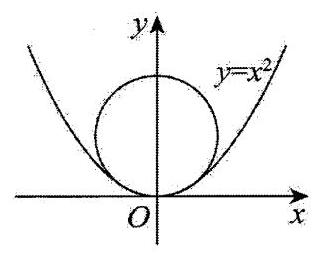

则 ${f}^{\prime }\left( x\right)  = {2x},{f}^{\prime \prime }\left( x\right)  = 2$ ,

故 $2 = {f}^{\prime \prime }\left( 0\right)  = \frac{{b}^{2}}{{\left( b - 0\right) }^{3}} = \frac{1}{b},\;2 = \frac{{r}^{2}}{{b}^{3}}$ ,即 $b = \frac{1}{2}$ ,

所以抛物线 $y = {x}^{2}$ 在原点的曲率圆的方程为 ${x}^{2} + {\left( y - \frac{1}{2}\right) }^{2} = \frac{1}{4}$ ;

(2)设曲线 $y = f\left( x\right)$ 在 $\left( {{x}_{0},{y}_{0}}\right)$ 的曲率半径为 $r$ . 则

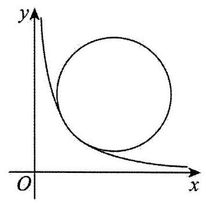

思路一: $\left\{  \begin{array}{l} {f}^{\prime }\left( {x}_{0}\right)  =  - \frac{{x}_{0} - a}{{y}_{0} - b} \\  {f}^{\prime \prime }\left( {x}_{0}\right)  = \frac{{r}^{2}}{{\left( b - {y}_{0}\right) }^{3}} \end{array}\right.$ ,

由 ${\left( {x}_{0} - a\right) }^{2} + {\left( {y}_{0} - b\right) }^{2} = {r}^{2}$ 知, ${\left\lbrack  {f}^{\prime }\left( {x}_{0}\right) \right\rbrack  }^{2} + 1 = \frac{{r}^{2}}{{\left( {y}_{0} - b\right) }^{2}}$ ,

所以 $r = \frac{{\left\{  {\left\lbrack  {f}^{\prime }\left( {x}_{0}\right) \right\rbrack  }^{2} + 1\right\}  }^{\frac{3}{2}}}{\left| {f}^{\prime \prime }\left( {x}_{0}\right) \right| }$ ,

故曲线 $y = \frac{1}{x}$ 在点 $\left( {{x}_{0},{y}_{0}}\right)$ 处的曲率半径 $r = \frac{{\left\{  {\left( -\frac{1}{{x}_{0}^{2}}\right) }^{2} + 1\right\}  }^{\frac{3}{2}}}{\left| \frac{2}{{x}_{0}^{3}}\right| }$ ,

所以 ${r}^{2} = \frac{{\left( \frac{1}{{x}_{0}^{4}} + 1\right) }^{3}}{{\left| \frac{2}{{x}_{0}^{3}}\right| }^{2}} = \frac{1}{4}{\left( {x}_{0}^{2} + \frac{1}{{x}_{0}^{2}}\right) }^{3} \geq  2$ ,则 ${r}^{\frac{2}{3}} = {2}^{-\frac{2}{3}}\left( {{x}_{0}^{2} + \frac{1}{{x}_{0}^{2}}}\right)  \geq  {2}^{\frac{1}{3}}$ ,

则 $r = \frac{1}{2}{\left( {x}_{0}^{2} + \frac{1}{{x}_{0}^{2}}\right) }^{\frac{3}{2}} \geq  \sqrt{2}$ ,当且仅当 ${x}_{0}^{2} = \frac{1}{{x}_{0}^{2}}$ ,即 ${x}_{0}^{2} = 1$ 时取等号,

故 $r \geq  \sqrt{2}$ ,曲线 $y = \frac{1}{x}$ 在点 $\left( {1,1}\right)$ 处的曲率半径 $r = \sqrt{2}$ .

思路二: $\left\{  {\begin{array}{l}  - \frac{1}{{x}_{0}^{2}} =  - \frac{{x}_{0} - a}{{y}_{0} - b} \\  \frac{2}{{x}_{0}^{3}} = \frac{{r}^{2}}{{\left( b - {y}_{0}\right) }^{3}} \end{array},\frac{\left| a + b{x}_{0}^{2} - 2{x}_{0}\right| }{\sqrt{\frac{{x}_{0}^{4} + 1}{{x}_{0}^{4} + 1}}} = r}\right.$ ,

所以 $\left\{  \begin{array}{l} {y}_{0} - b =  - \frac{{x}_{0} \cdot  {r}^{\frac{2}{3}}}{{2}^{\frac{1}{3}}} \\  {x}_{0} - a =  - \frac{{r}^{\frac{2}{3}}}{{2}^{\frac{1}{3}}{x}_{0}} \end{array}\right.$ ,而 ${r}^{2} = {\left( {x}_{0} - a\right) }^{2} + {\left( {y}_{0} - b\right) }^{2} = \frac{{x}_{0}^{2} \cdot  {r}^{\frac{4}{3}}}{{2}^{\frac{2}{3}}} + \frac{{r}^{\frac{4}{3}}}{{2}^{\frac{2}{3}} \cdot  {x}_{0}^{2}}$ ,

所以 ${r}^{\frac{2}{3}} = {2}^{-\frac{2}{3}}\left( {{x}_{0}^{2} + \frac{1}{{x}_{0}^{2}}}\right)$ ,解方程可得 $r = \frac{1}{2}{\left( {x}_{0}^{2} + \frac{1}{{x}_{0}^{2}}\right) }^{\frac{3}{2}}$ ,

则 ${r}^{2} = \frac{1}{4}{\left( {x}_{0}^{2} + \frac{1}{{x}_{0}^{2}}\right) }^{3} \geq  2$ ,当且仅当 ${x}_{0}^{2} = \frac{1}{{x}_{0}^{2}}$ ,即 ${x}_{0}^{2} = 1$ 时取等号,

故 $r \geq  \sqrt{2}$ ，曲线 $y = \frac{1}{x}$ 在点 $\left( {1,1}\right)$ 处的曲率半径 $r = \sqrt{2}$ .

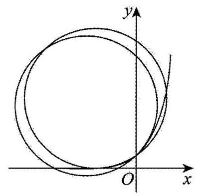

(3)思路一:函数 $y = {\mathrm{e}}^{x}$ 的图象在 $\left( {x,{\mathrm{e}}^{x}}\right)$ 处的曲率半径 $r = \frac{{\left( {\mathrm{e}}^{2x} + 1\right) }^{\frac{3}{2}}}{{\mathrm{e}}^{x}}$ , 故 ${r}^{\frac{2}{3}} = {\mathrm{e}}^{\frac{4}{3}x} + {\mathrm{e}}^{-\frac{2}{3}x}$ ,

由题意知: ${\mathrm{e}}^{\frac{4}{3}{x}_{1}} + {\mathrm{e}}^{-\frac{2}{3}{x}_{1}} = {\mathrm{e}}^{\frac{4}{3}{x}_{2}} + {\mathrm{e}}^{-\frac{2}{3}{x}_{2}}$ 令 ${t}_{1} = {\mathrm{e}}^{\frac{2}{3}{x}_{1}},{t}_{2} = {\mathrm{e}}^{\frac{2}{3}{x}_{2}}$ ,

则有 ${t}_{1}^{2} + \frac{1}{{t}_{1}} = {t}_{2}^{2} + \frac{1}{{t}_{2}}$ ,

所以 ${t}_{1}^{2} - {t}_{2}^{2} = \frac{1}{{t}_{2}} - \frac{1}{{t}_{1}}$ ,即 $\left( {{t}_{1} - {t}_{2}}\right) \left( {{t}_{1} + {t}_{2}}\right)  = \frac{{t}_{1} - {t}_{2}}{{t}_{1}{t}_{2}}$ ,故 ${t}_{1}{t}_{2}\left( {{t}_{1} + {t}_{2}}\right)  = 1$ .

因为 ${x}_{1} \neq  {x}_{2}$ ,所以 ${t}_{1} \neq  {t}_{2}$ ,

所以 $1 = {t}_{1}{t}_{2}\left( {{t}_{1} + {t}_{2}}\right)  > {t}_{1}{t}_{2} \cdot  2\sqrt{{t}_{1}{t}_{2}} = 2{\left( {t}_{1}{t}_{2}\right) }^{\frac{3}{2}} = 2{\mathrm{e}}^{{x}_{1} + {x}_{2}}$ ,

所以 ${x}_{1} + {x}_{2} <  - \ln 2$ .

思路二: 函数 $y = {\mathrm{e}}^{x}$ 的图象在 $\left( {x,{\mathrm{e}}^{x}}\right)$ 处的曲率半径 $r = \frac{{\left( {\mathrm{e}}^{2x} + 1\right) }^{\frac{3}{2}}}{{\mathrm{e}}^{x}}$ ,

有 ${r}^{2} = \frac{{\left( {\mathrm{e}}^{2x} + 1\right) }^{3}}{{\mathrm{e}}^{2x}} = {\mathrm{e}}^{4x} + 3{\mathrm{e}}^{2x} + 3 + {\mathrm{e}}^{-{2x}}$

令 ${t}_{1} = {\mathrm{e}}^{2{x}_{1}},{t}_{2} = {\mathrm{e}}^{2{x}_{2}}$ ,则有 ${t}_{1}^{2} + 3{t}_{1} + 3 + \frac{1}{{t}_{1}} = {t}_{2}^{2} + 3{t}_{2} + 3 + \frac{1}{{t}_{2}}$ ,

则 $\left( {{t}_{1} - {t}_{2}}\right) \left( {{t}_{1} + {t}_{2} + 3 - \frac{1}{{t}_{1}{t}_{2}}}\right)  = 0$ ,故 ${t}_{1} + {t}_{2} + 3 - \frac{1}{{t}_{1}{t}_{2}} = 0$ ,

因为 ${x}_{1} \neq  {x}_{2}$ ,所以 ${t}_{1} \neq  {t}_{2}$ ,

所以有 $0 = {t}_{1} + {t}_{2} + 3 - \frac{1}{{t}_{1}{t}_{2}} > 2\sqrt{{t}_{1}{t}_{2}} + 3 - \frac{1}{{t}_{1}{t}_{2}}$ ,

令 $t = \sqrt{{t}_{1}{t}_{2}}$ ,则 ${2t} + 3 - \frac{1}{{t}^{2}} < 0$ ,即 $0 > 2{t}^{3} + 3{t}^{2} - 1 = {\left( t + 1\right) }^{2}\left( {{2t} - 1}\right)$ ,

故 $t < \frac{1}{2}$ ,所以 ${\mathrm{e}}^{{x}_{1} + {x}_{2}} = \sqrt{{t}_{1}{t}_{2}} = t < \frac{1}{2}$ ,即 ${x}_{1} + {x}_{2} <  - \ln 2$ ;

思路三: 函数 $y = {\mathrm{e}}^{x}$ 的图象在 $\left( {x,{\mathrm{e}}^{x}}\right)$ 处的曲率半径 $r = \frac{{\left( {\mathrm{e}}^{2x} + 1\right) }^{\frac{3}{2}}}{{\mathrm{e}}^{x}}$ .

故 ${r}^{\frac{2}{3}} = {\mathrm{e}}^{\frac{4}{3}x} + {\mathrm{e}}^{\frac{2}{3}x}$

设 $g\left( x\right)  = {\mathrm{e}}^{\frac{4}{3}x} + {\mathrm{e}}^{\frac{2}{3}x}$ ,则 ${g}^{\prime }\left( x\right)  = \frac{4}{3}{\mathrm{e}}^{\frac{4}{3}x} - \frac{2}{3}{\mathrm{e}}^{-\frac{2}{3}x} = \frac{2}{3}{\mathrm{e}}^{-\frac{2}{3}x}\left( {2{\mathrm{e}}^{2x} - 1}\right)$ ,

所以当 $x \in  \left( {-\infty , - \frac{1}{2}\ln 2}\right)$ 时 ${g}^{\prime }\left( x\right)  < 0$ ,当 $x \in  \left( {-\frac{1}{2}\ln 2, + \infty }\right)$ 时 ${g}^{\prime }\left( x\right)  > 0$ ,

所以 $g\left( x\right)$ 在 $\left( {-\infty , - \frac{1}{2}\ln 2}\right)$ 上严格递减,在 $\left( {-\frac{1}{2}\ln 2, + \infty }\right)$ 上严格递增,

故有 ${x}_{1} <  - \frac{1}{2}\ln 2 < {x}_{2}$ ,

所以 ${x}_{1}, - \ln 2 - {x}_{2} \in  \left( {-\infty , - \frac{1}{2}\ln 2}\right)$ ,

要证 ${x}_{1} + {x}_{2} <  - \ln 2$ ,即证 ${x}_{1} <  - \ln 2 - {x}_{2}$ ,

即证 $g\left( {x}_{2}\right)  = g\left( {x}_{1}\right)  > g\left( {-\ln 2 - {x}_{2}}\right)$ 将 ${x}_{1} + {x}_{2} <  - \ln 2$ ,

下证: 当 $x \in  \left( {-\frac{1}{2}\ln 2, + \infty }\right)$ 时,有 $g\left( x\right)  > g\left( {-\ln 2 - x}\right)$ ,

设函数 $G\left( x\right)  = g\left( x\right)  - g\left( {-\ln 2 - x}\right)$ (其中 $x >  - \frac{1}{2}\ln 2$ ),

则 $G\left( x\right)  = {g}^{\prime }\left( x\right)  + {g}^{\prime }\left( {-\ln 2 - x}\right)  = \frac{2}{3}\left( {2{\mathrm{e}}^{2x} - 1}\right) \left( {{\mathrm{e}}^{\frac{2}{3}x} - {2}^{\frac{1}{3}}}\right)  \cdot  {\mathrm{e}}^{\frac{4}{3}x} > 0$ ,

故 $G\left( x\right)$ 严格递增, $G\left( x\right)  > G\left( {-\frac{1}{2}\ln 2}\right)  = 0$ ,

故 $g\left( {x}_{2}\right)  > g\left( {-\ln 2 - {x}_{2}}\right)$ ,所以 ${x}_{1} + {x}_{2} <  - \ln 2$ .

思路四: 函数 $y = {\mathrm{e}}^{x}$ 的图象在 $\left( {x,{\mathrm{e}}^{x}}\right)$ 处的曲率半径 $r = \frac{{\left( {\mathrm{e}}^{2x} + 1\right) }^{\frac{3}{2}}}{{\mathrm{e}}^{x}}$ ,

有 ${r}^{2} = \frac{{\left( {\mathrm{e}}^{2x} + 1\right) }^{3}}{{\mathrm{e}}^{2x}} = {\mathrm{e}}^{4x} + 3{\mathrm{e}}^{2x} + 3 + {\mathrm{e}}^{-{2x}}$ ,

设 $h\left( x\right)  = {\mathrm{e}}^{4x} + 3{\mathrm{e}}^{2x} + 3 + {\mathrm{e}}^{-{2x}}$ .

则有 ${h}^{\prime }\left( x\right)  = 4{\mathrm{e}}^{4x} + 6{\mathrm{e}}^{2x} - 2{\mathrm{e}}^{-{2x}} = 2{\mathrm{e}}^{-{2x}}{\left( {\mathrm{e}}^{2x} + 1\right) }^{2}\left( {2{\mathrm{e}}^{2x} - 1}\right)$ ,

所以当 $x \in  \left( {-\infty , - \frac{1}{2}\ln 2}\right)$ 时 ${h}^{\prime }\left( x\right)  < 0$ ,当 $x \in  \left( {-\frac{1}{2}\ln 2, + \infty }\right)$ 时 ${h}^{\prime }\left( x\right)  > 0$ ,

故 $h\left( x\right)$ 在 $\left( {-\infty , - \frac{1}{2}\ln 2}\right)$ 上严格递减,在 $\left( {-\frac{1}{2}\ln 2, + \infty }\right)$ 上严格递增.

故有 ${x}_{1} <  - \frac{1}{2}\ln 2 < {x}_{2}$ ,

所以 ${x}_{1}, - \ln 2 - {x}_{2} \in  \left( {-\infty , - \frac{1}{2}\ln 2}\right)$ ,

要证 ${x}_{1} + {x}_{2} <  - \ln 2$ ,即证 ${x}_{1} <  - \ln 2 - {x}_{2}$ ,

即证 $h\left( {x}_{2}\right)  = h\left( {x}_{1}\right)  > h\left( {-\ln 2 - {x}_{2}}\right)$ . 将 ${x}_{1} + {x}_{2} <  - \ln 2$ ,

下证: 当 $x \in  \left( {-\frac{1}{2}\ln 2, + \infty }\right)$ 时,有 $h\left( x\right)  > h\left( {-\ln 2 - x}\right)$ ,

设函数 $H\left( x\right)  = h\left( x\right)  - h\left( {-\ln 2 - x}\right)$ (其中 $x >  - \frac{1}{2}\ln 2$ ),

则 ${H}^{\prime }\left( x\right)  = {h}^{\prime }\left( x\right)  + {h}^{\prime }\left( {-\ln 2 - x}\right)  = {\left( 2{\mathrm{e}}^{2x} - 1\right) }^{2}\left( {1 + \frac{1}{2}{\mathrm{e}}^{-{2x}} + \frac{1}{4}{\mathrm{e}}^{-{4x}}}\right)  > 0$ ,

故 $H\left( x\right)$ 单调递增,故 $H\left( x\right)  > H\left( {-\frac{1}{2}\ln 2}\right)  = 0$ ,

故 $h\left( {x}_{2}\right)  > h\left( {-\ln 2 - {x}_{2}}\right)$ ,所以 ${x}_{1} + {x}_{2} <  - \ln 2$ .

30、【答案】(1)见解析; (2)见解析

【解析】(1) 由正弦函数的性质可知: $f\left( x\right)  = \sin x + \frac{1}{2}$ 在 $\left\lbrack  {\frac{1}{2},\frac{\pi }{2}}\right\rbrack$ 上严格递增,

在 $\left\lbrack  {\frac{\pi }{2},2}\right\rbrack$ 上严格递减，所以 $f{\left( x\right) }_{\text{ min }} = \min \left\{  {\sin \frac{1}{2} + \frac{1}{2},\sin 2 + \frac{1}{2}}\right\}   = \sin \frac{1}{2} + \frac{1}{2} > \frac{1}{2}$ ,

$f{\left( x\right) }_{\max } = \sin \frac{\pi }{2} + \frac{1}{2} = \frac{3}{2} < 2$ ,所以 $f\left( x\right)$ 在 $\left\lbrack  {\frac{1}{2},2}\right\rbrack$ 上的值域为 $\left\lbrack  {\sin \frac{1}{2} + \frac{1}{2},\frac{3}{2}}\right\rbrack   \subset  \left\lbrack  {\frac{1}{2},2}\right\rbrack$ ,

所以 $f$ 是从 $\left\lbrack  {\frac{1}{2},2}\right\rbrack$ 到 $\left\lbrack  {\frac{1}{2},2}\right\rbrack$ 的函数,

另一方面,我们证明存在 $\alpha  \in  \left( {0,1}\right)$ ,对任意 $x, y \in  \left\lbrack  {\frac{1}{2},2}\right\rbrack$ ,都有 $\rho \left( {f\left( x\right) , f\left( y\right) }\right)  \leq  {\alpha \rho }\left( {x, y}\right)$ ,

取 $\alpha  = \cos \frac{1}{2}$ ,则对任意 $x, y \in  \left\lbrack  {\frac{1}{2},2}\right\rbrack$ ,不妨设 $x < y$ ,分两种情形讨论:

① 当 $\sin x \leq  \sin y$ 时,令 $F\left( x\right)  = {\alpha x} - \sin x$ ,则 ${F}^{\prime }\left( x\right)  = \alpha  - \cos x \geq  \alpha  - \cos \frac{1}{2} = 0$ ,

所以 $F\left( x\right)$ 在 $\left\lbrack  {\frac{1}{2},2}\right\rbrack$ 上严格递增,因为 $x < y$ ,所以 $F\left( x\right)  < F\left( y\right)$ ,即 ${\alpha x} - \sin x < {\alpha y} - \sin y$ ,

所以 $\sin y - \sin x < {\alpha y} - {\alpha x}$ ,即 $\rho \left( {f\left( x\right) , f\left( y\right) }\right)  \leq  {\alpha \rho }\left( {x, y}\right)$ ,

② 当 $\sin x > \sin y$ 时，令 $G\left( x\right)  = {\alpha x} + \sin x$ ，则 ${G}^{\prime }\left( x\right)  = \alpha  + \cos x \geq  \alpha  + \cos 2 = \cos \frac{1}{2}\cos \left( {\pi  - 2}\right)  > 0$ ，

所以 $G\left( x\right)$ 在 $\left\lbrack  {\frac{1}{2},2}\right\rbrack$ 上严格递增,因为 $x < y$ ,所以 $G\left( x\right)  < G\left( y\right)$ ,即 ${\alpha x} + \sin x < {\alpha y} + \sin y$ ,

所以 $\sin x - \sin y < {\alpha y} - {\alpha x}$ ,即 $\rho \left( {f\left( x\right) , f\left( y\right) }\right)  \leq  {\alpha \rho }\left( {x, y}\right)$ ,

综上所述,对任意 $x, y \in  \left\lbrack  {\frac{1}{2},2}\right\rbrack$ ,都有 $\rho \left( {f\left( x\right) , f\left( y\right) }\right)  \leq  {\alpha \rho }\left( {x, y}\right)$ , 所以 $f$ 是度量空间 $\left( {\left\lbrack  {\frac{1}{2},2}\right\rbrack  ,\rho }\right)$ 上的一个“压缩函数”.

(2)证明:因为 $f : \mathbf{R} \rightarrow  \mathbf{R}$ 是度量空间 $\left( {\mathbf{R},\rho }\right)$ 上的一个压缩函数，

所以必存在 $\alpha  \in  \left( {0,1}\right)$ ,使得对任意 $x, y \in  \mathrm{R},\rho \left( {f\left( x\right) , f\left( y\right) }\right)  \leq  {\alpha \rho }\left( {x, y}\right)$ ,

即 $\left| {f\left( x\right)  - f\left( y\right) }\right|  \leq  \alpha \left| {x - y}\right|$ ,

因为 ${a}_{n + 1} = f\left( {a}_{n}\right) , n = 0,1,2,\cdots$ ,

所以 $\left| {{a}_{k + 1} - {a}_{k}}\right|  = \left| {f\left( {a}_{k}\right)  - f\left( {a}_{k - 1}\right) }\right|  \leq  \alpha \left| {{a}_{k} - {a}_{k - 1}}\right|  \leq  {\alpha }^{2}\left| {{a}_{k - 1} - {a}_{k - 2}}\right|  \leq  \cdots  \leq  {\alpha }^{k}\left| {{a}_{1} - {a}_{0}}\right|$ ,

由绝对值三角不等式可知:

对任意 $m > n \geq  N$ ,有 $\left| {{a}_{m} - {a}_{n}}\right|  = \left| {{a}_{m} - {a}_{m - 1} + {a}_{m - 1} - {a}_{m - 2} + {a}_{m - 2} + \cdots  + {a}_{n + 1} - {a}_{n}}\right|$

$\leq  \left| {{a}_{m} - {a}_{m - 1}}\right|  + \left| {{a}_{m - 1} - {a}_{m - 2}}\right|  + \cdots  + \left| {{a}_{n + 1} - {a}_{n}}\right|$

$\leq  {\alpha }^{m - 1}\left| {{a}_{1} - {a}_{0}}\right|  + {\alpha }^{m - 2}\left| {{a}_{1} - {a}_{0}}\right|  + \cdots  + {\alpha }^{n}\left| {{a}_{1} - {a}_{0}}\right|  = \frac{{\alpha }^{n}\left( {1 - {\alpha }^{m - n}}\right) }{1 - \alpha }\left| {{a}_{1} - {a}_{0}}\right|$ ,

又因为 $\alpha  \in  \left( {0,1}\right)$ ,所以 ${\alpha }^{n} \leq  {\alpha }^{N}$ ,

所以 $\left| {{a}_{m} - {a}_{n}}\right|  \leq  \frac{{\alpha }^{n}\left( {1 - {\alpha }^{m - n}}\right) }{1 - \alpha }\left| {{a}_{1} - {a}_{0}}\right|  \leq  \frac{{\alpha }^{n}}{1 - \alpha }\left| {{a}_{1} - {a}_{0}}\right|  \leq  \frac{{\alpha }^{N}}{1 - \alpha }\left| {{a}_{1} - {a}_{0}}\right|$ ,

① 当 ${a}_{1} = {a}_{0}$ 时，对任意 $m > n \geq  N$ ，有 $\left| {{a}_{m} - {a}_{n}}\right|  \leq  \frac{{\alpha }^{N}}{1 - \alpha }\left| {{a}_{1} - {a}_{0}}\right|  = 0$ ，所以 ${a}_{m} - {a}_{n} = 0$ ，

所以对任意 $\varepsilon  > 0$ ,对任意正整数 $N$ ,当 $m > n \geq  N$ 时,均有 $\rho \left( {{a}_{m},{a}_{n}}\right)  < \varepsilon$ ,

② 当 ${a}_{1} \neq  {a}_{0}$ 时，对任意 $\varepsilon  > 0$ ，取一个正整数 $N > {\log }_{\alpha }\frac{\varepsilon \left( {1 - \alpha }\right) }{\left| {a}_{1} - {a}_{0}\right| }$ ，

则 ${\alpha }^{N} < \frac{\varepsilon \left( {1 - \alpha }\right) }{\left| {a}_{1} - {a}_{0}\right| }$ ,即 $\frac{{\alpha }^{N}}{1 - \alpha }\left| {{a}_{1} - {a}_{0}}\right|  < \varepsilon$ ,

则当 $m > n \geq  N$ 时,有 $\rho \left( {{a}_{m},{a}_{n}}\right)  = \left| {{a}_{m} - {a}_{n}}\right|  \leq  \frac{{\alpha }^{N}}{1 - \alpha }\left| {{a}_{1} - {a}_{0}}\right|  < \varepsilon$ ,

综上所述,对任意 $\varepsilon  > 0$ ,都存在一个正整数 $N$ ,使得对任意正整数 $N$ ,当 $m > n \geq  N$ 时,均有 $\rho \left( {{a}_{m},{a}_{n}}\right)  < \varepsilon$ , 故 ${\left\{  {a}_{n}\right\}  }_{n = 0}^{+\infty }$ 为度量空间 $\left( {\mathrm{R},\rho }\right)$ 上的一个“基本数列”.

31~50 题

31、【答案】2

【解析】易知 ${f}^{\prime }\left( x\right)  = {\mathrm{e}}^{\sin x}\cos x + {\mathrm{e}}^{\cos x}\sin x = {\mathrm{e}}^{\sin x + \cos x}\left( {\frac{\sin x}{{\mathrm{e}}^{\sin x}} + \frac{\cos x}{{\mathrm{e}}^{\cos x}}}\right)$ .

当 $x \in  \left( {0,\frac{\pi }{2}}\right\rbrack$ 时, ${f}^{\prime }\left( x\right)  > 0$ ; 当 $x \in  \left\lbrack  {\pi ,\frac{3\pi }{2}}\right\rbrack$ 时, ${f}^{\prime }\left( x\right)  < 0$ ;

当 $x \in  \left( {\frac{\pi }{2},\pi }\right)$ 时, $u = \sin x$ 和 $u = \cos x$ 均为严格减函数,

令 $y = \frac{u}{{\mathrm{e}}^{u}}, u \in  \left( {-1,1}\right)$ ,则 ${y}^{\prime } = \frac{1 - u}{{\mathrm{e}}^{u}}$ ,

当 $u \in  \left( {-1,1}\right)$ 时, ${y}^{\prime } = \frac{1 - u}{{\mathrm{e}}^{u}} > 0$ 恒成立,

所以 $y = \frac{u}{{\mathrm{e}}^{u}}$ 在 $u \in  \left( {-1,1}\right)$ 上是严格增函数,

根据复合函数单调性可知 $\varphi \left( x\right)  = \frac{\sin x}{{\mathrm{e}}^{\sin x}} + \frac{\cos x}{{\mathrm{e}}^{\cos x}}$ 为严格减函数,又 $y = {\mathrm{e}}^{\sin x + \cos x} > 0$ ,

易知 ${f}^{\prime }\left( \frac{\pi }{2}\right)  > 0,{f}^{\prime }\left( \pi \right)  < 0$ ,由零点存在定理可得函数 ${f}^{\prime }\left( x\right)$ 在 $\left( {\frac{\pi }{2},\pi }\right)$ 上存在一个零点,

同理可得 ${f}^{\prime }\left( \frac{3\pi }{2}\right)  < 0,{f}^{\prime }\left( {2\pi }\right)  > 0$ ,所以函数 ${f}^{\prime }\left( x\right)$ 在 $\left( {\frac{3\pi }{2},{2\pi }}\right)$ 上存在一个零点,

结合 ${f}^{\prime }\left( x\right)$ 的正负情况, ${f}^{\prime }\left( x\right)$ 的零点为函数 $f\left( x\right)$ 的极值点,

因此函数 $f\left( x\right)$ 在 $\left( {0,{2\pi }}\right)$ 内一共有 2 个极值点.

32、【答案】①②④

【解析】对于①, 圆的法线恒过圆心, 故①正确;

对于②,由于曲线 $y = {x}^{4}$ 在 $\left( {c,{c}^{4}}\right)$ 处的切线斜率为 $4{c}^{3}$ ,故曲线 $y = {x}^{4}$ 在 $\left( {c,{c}^{4}}\right)$ 处的法线方程为 $x + 4{c}^{3}y = c + 4{c}^{7}$ ,该直线存在纵截距当且仅当 $c \neq  0$ ,且此时纵截距为 $\frac{c + 4{c}^{7}}{4{c}^{3}} = {c}^{4} + \frac{1}{4{c}^{2}}$ .

此时 ${c}^{4} + \frac{1}{4{c}^{2}} = {c}^{4} + \frac{1}{8{c}^{2}} + \frac{1}{8{c}^{2}} \geq  3\sqrt[3]{{c}^{4} \cdot  \frac{1}{8{c}^{2}} \cdot  \frac{1}{8{c}^{2}}} = 3\sqrt[3]{\frac{1}{64}} = \frac{3}{4}$ ,且当 $c = \frac{\sqrt{2}}{2}$ 时, ${c}^{4} + \frac{1}{4{c}^{2}} = \frac{1}{4} + \frac{1}{2} = \frac{3}{4}$ ,所以纵截距如存在,则最小值为 $\frac{3}{4}$ ,② 正确;

对于③，假设曲线 $y = {\mathrm{e}}^{x}$ 在 $\left( {u,{\mathrm{e}}^{u}}\right)$ 处的法线和曲线 $y = \ln x$ 在 $\left( {v,\ln v}\right)$ 处的法线均为直线 $l$ ，

则 $l$ 的斜率 $k$ 满足 $k =  - \frac{1}{{\mathrm{e}}^{u}} =  - \frac{1}{\frac{1}{v}}$ ,即 $k =  - \frac{1}{{\mathrm{e}}^{u}} =  - v$ ,从而 $v = {\mathrm{e}}^{u}$ ,故 $u = \ln v$ .

另一方面,点 $\left( {u,{\mathrm{e}}^{u}}\right)$ 和 $\left( {v,\ln v}\right)$ 确定的直线即为 $l$ ,从而 $k = \frac{{\mathrm{e}}^{u} - \ln v}{u - v} = \frac{v - \ln v}{u - v} = \frac{v - u}{u - v} =  - 1$ .

所以 $- \frac{1}{{\mathrm{e}}^{u}} =  - v =  - 1$ ,故 $u = 0, v = 1$ ,得到直线 $l$ 为过 $\left( {0,1}\right)$ 和 $\left( {1,0}\right)$ 的直线.

上述推理表明 $l$ 是唯一的,所以③错误;

④设曲线 $y = \sin x$ 在 $\left( {t,\sin t}\right)$ 处的法线为 $l$ .

若 $t = {k\pi }\left( {k \in  \mathbf{Z}}\right)$ ,则 $t$ 是 $y = \sin x$ 的极值点,从而 $l$ 的方程为 $x = t$ ,

该直线和曲线 $y = \sin x$ 显然只有一个公共点 $\left( {t,\sin t}\right)$ ;

若 $t \neq  {k\pi }\left( {k \in  \mathbf{Z}}\right)$ ,则 $\cos t \neq  0, l$ 的斜率为 $- \frac{1}{\cos t}$ ,故该直线的方程为 $y =  - \frac{1}{\cos t}\left( {x - t}\right)  + \sin t$ .

设 $f\left( x\right)  = \sin x + \frac{1}{\cos t}\left( {x - t}\right)  - \sin t$ ,则曲线 $y = \sin x$ 上的点 $\left( {p,\sin p}\right)$ 在 $l$ 上当且仅当 $f\left( p\right)  = 0$ .

求导得到 ${f}^{\prime }\left( x\right)  = \cos x + \frac{1}{\cos t}$ ,下面进行分类讨论:

如果 $\cos t > 0$ ,则当 $\cos x >  - 1$ 时,即 $\left( {{2k} - 1}\right) \pi  < x < \left( {{2k} + 1}\right) \pi$ 时 $\left( {k \in  \mathbf{Z}}\right)$ ,

有 ${f}^{\prime }\left( x\right)  = \cos x + \frac{1}{\cos t} >  - 1 + \frac{1}{\cos t} \geq   - 1 + 1 = 0$ .

所以 $f\left( x\right)$ 在每个 $\left\lbrack  {\left( {{2k} - 1}\right) \pi ,\left( {{2k} + 1}\right) \pi }\right\rbrack$ 上均严格递增 $\left( {k \in  \mathbf{Z}}\right)$ ,从而在 $\mathbf{R}$ 上严格递增;

如果 $\cos t < 0$ ,则当 $\cos x < 1$ 时,即 ${2k\pi } < x < \left( {{2k} + 2}\right) \pi$ 时 $\left( {k \in  \mathbf{Z}}\right)$ ,

有 ${f}^{\prime }\left( x\right)  = \cos x + \frac{1}{\cos t} < 1 + \frac{1}{\cos t} \leq  1 + \left( {-1}\right)  = 0$ .

所以 $f\left( x\right)$ 在每个 $\left\lbrack  {{2k\pi },\left( {{2k} + 2}\right) \pi }\right\rbrack$ 上均严格递减 $\left( {k \in  \mathbf{Z}}\right)$ ,从而在 $\mathbf{R}$ 上严格递减.

综合以上两种情况,知 $f\left( x\right)$ 一定是单调函数,而 $f\left( t\right)  = \sin t - \sin t = 0$ ,所以 $f\left( x\right)$ 只有唯一的零点 $t$ .

这表明曲线 $y = \sin x$ 上只有唯一一个点 $\left( {t,\sin t}\right)$ 在 $l$ 上,即曲线 $y = \sin x$ 和 $l$ 有唯一公共点.

综上,曲线 $y = \sin x$ 的任意法线与该曲线的公共点个数均为 1,④正确.

故答案为:①②④.

33、【答案】(-2- $\sqrt{3}, - 2 + \sqrt{3})$ .

【解析】由题意可得 ${f}^{\prime }\left( x\right)  = \frac{4\left( {x - 2}\right) }{{\mathrm{e}}^{x - 3}} + a$ ,

令 $g\left( x\right)  = {f}^{\prime }\left( x\right)$ ,则 ${g}^{\prime }\left( x\right)  = \frac{4\left( {3 - x}\right) }{{\mathrm{e}}^{x - 3}}$ ,

令 ${g}^{\prime }\left( x\right)  = 0$ ,则 $x = 3$ ,

所以当 $x > 3$ 时, ${g}^{\prime }\left( x\right)  < 0$ ; 当 $2 < x < 3$ 时, ${g}^{\prime }\left( x\right)  > 0$ ;

所以 $g\left( x\right)$ 在 $\left( {2,3}\right)$ 上严格递增,在 $\left( {3, + \infty }\right)$ 上严格递减,且 $g\left( 2\right)  = a, g\left( 3\right)  = a + 4$ ,

又当 $x \rightarrow   + \infty$ 时, $g\left( x\right)  \rightarrow  a$ ,

所以 $g\left( x\right)$ 的值域为 $(a, a + 4\rbrack$ ,

由题意可得存在斜率 ${k}_{1},{k}_{2} \in  (a, a + 4\rbrack$ ,使得 ${k}_{1} \cdot  {k}_{2} =  - 1$ ,

(当区间的两端点值乘积小于 -1 时, 区间内任意取值的乘积可能等于或大于 -1 )

则 $a\left( {a + 4}\right)  <  - 1$ ,即 ${a}^{2} + {4a} + 1 < 0$ ,解得 $- 2 - \sqrt{3} < a <  - 2 + \sqrt{3}$ .

34、【答案】1

【解析】设 $g\left( x\right)  = \frac{x}{{\mathrm{e}}^{x}},{g}^{\prime }\left( x\right)  = \frac{1 - x}{{\mathrm{e}}^{x}}$ ,

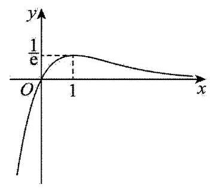

当 $x < 1$ 时, ${g}^{\prime }\left( x\right)  > 0$ ; 当 $x > 1$ 时, ${g}^{\prime }\left( x\right)  < 0$ ,

故 $g\left( x\right)$ 在 $\left( {-\infty ,1}\right)$ 上严格递增,在 $\left( {1, + \infty }\right)$ 上严格递减,

且 $x > 0$ 时, $g\left( x\right)  > 0;x < 0$ 时, $g\left( x\right)  < 0$ ,

$\therefore g{\left( x\right) }_{\max } = g\left( 1\right)  = \frac{1}{\mathrm{e}}$ ,

作出 $g\left( x\right)$ 的图象,如图,

要使 $f\left( x\right)  = 3{\left( \frac{x}{{\mathrm{e}}^{x}}\right) }^{2} + \left( {{a}^{2} - 1}\right) \frac{x}{{\mathrm{e}}^{x}} + 1 - {a}^{2}$ 有三个不同的零点 ${x}_{1},{x}_{2},{x}_{3}$ ,其中 ${x}_{1} < {x}_{2} < {x}_{3}$

令 $\frac{x}{{\mathrm{e}}^{x}} = t$ ,则 $3{t}^{2} + \left( {{a}^{2} - 1}\right) t + 1 - {a}^{2} = 0$ 需要有两个不同的实数根 ${t}_{1},{t}_{2}$ (其中 ${t}_{1} < {t}_{2}$ )

可得 ${t}_{1} + {t}_{2} = \frac{1 - {a}^{2}}{3},{t}_{1} \cdot  {t}_{2} = \frac{1 - {a}^{2}}{3},\because {t}_{1} < {t}_{2},\therefore {t}_{1} < 0$ ,则 ${t}_{2} \in  \left( {0,\frac{1}{\mathrm{e}}}\right)$

$\therefore {t}_{1} < 0 < {t}_{2} < \frac{1}{\mathrm{e}}$ ,则 ${x}_{1} < 0 < {x}_{2} < 1 < {x}_{3}$ ,且 $g\left( {x}_{2}\right)  = g\left( {x}_{3}\right)  = {t}_{2}$

$\therefore {\left( 1 - \frac{{x}_{1}}{{\mathrm{e}}^{{x}_{1}}}\right) }^{2}\left( {1 - \frac{{x}_{2}}{{\mathrm{e}}^{{x}_{2}}}}\right) \left( {1 - \frac{{x}_{3}}{{\mathrm{e}}^{{x}_{3}}}}\right)  = {\left( 1 - {t}_{1}\right) }^{2}{\left( 1 - {t}_{2}\right) }^{2} = {\left\lbrack  1 - \left( {t}_{1} + {t}_{2}\right)  + {t}_{1}{t}_{2}\right\rbrack  }^{2} = {\left( 1 - \frac{1 - {a}^{2}}{3} + \frac{1 - {a}^{2}}{3}\right) }^{2} = 1$ ,

35、【答案】 13

【解析】设 $f\left( x\right)  = \frac{\ln x}{x}, x > 0$ ,故 ${f}^{\prime }\left( x\right)  = \frac{1 - \ln x}{{x}^{2}}$ ,

当 $0 < x < \mathrm{e}$ 时, ${f}^{\prime }\left( x\right)  > 0$ ; 当 $x > \mathrm{e}$ 时, ${f}^{\prime }\left( x\right)  < 0$ ;

故 $f\left( x\right)$ 在 $\left( {0,\mathrm{e}}\right)$ 上为严格增函数,在 $\left( {\mathrm{e}, + \infty }\right)$ 上为严格减函数,

因为 ${x}_{i}^{{y}_{i}} = {y}_{i}^{{x}_{i}}$ ,故 $\ln {x}_{i}^{{y}_{i}} = \ln {y}_{i}^{{x}_{i}}$ 即 $\frac{\ln {x}_{i}}{{x}_{i}} = \frac{\ln {y}_{i}}{{y}_{i}}$ ,故 $2 \leq  {x}_{i} < \mathrm{e} < {y}_{i} \leq  4$ ,

故 $\left( {\mathop{\sum }\limits_{{i = 1}}^{n}{x}_{i}}\right) \left( {\mathop{\sum }\limits_{{i = n + 1}}^{{2n}}{y}_{i}}\right)  < n\mathrm{e} \times  {4n}$ ,所以 $4{n}^{2}\mathrm{e} \leq  {2024}$ 即 ${n}^{2}\mathrm{e} \leq  {506}$ ,

而 ${13}^{2}\mathrm{e} < {169} \times  {2.8} = {473.2} < {506},{14}^{2}\mathrm{e} > {196} \times  {2.7} = {529.2} > {506}$ ,

故正整数 $n$ 的最大值为 13 .

36、【答案】 $\left( {1, + \infty }\right)$

【解析】如图以 ${CE}$ 的中点 $C$ 为原点直角坐标系,

设 $M, G$ 分别是 ${BC},{BE}$ 与圆的切点,由圆的切线性质得 ${AG} = {AD} = 1$ ,

设 ${CD} = {CM} = {GE} = m\left( {m > 1}\right)$ ,所以 ${AC} = 1 + m,{AE} = {GE} - {AG} = m - 1$ ,

在 $\bigtriangleup {ACE}$ 中, $C{E}^{2} = C{A}^{2} + A{E}^{2} - {2CA} \cdot  {EA}\cos {60}^{ \circ  } = {m}^{2} + 3$ ,

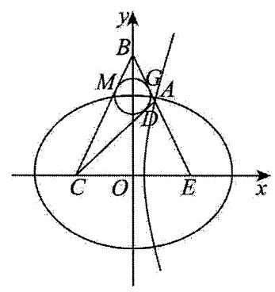

以 $E, C$ 为焦点经过点 $\mathrm{A}$ 的双曲线的离心率为 ${e}_{2} = \frac{\sqrt{{m}^{2} + 3}}{2}$ ,

以 $E, C$ 为焦点经过点 $\mathrm{A}$ 的椭圆的离心率为 ${e}_{1} = \frac{\sqrt{{m}^{2} + 3}}{2m}$ ,

则 ${e}_{1}{e}_{2} = \frac{{m}^{2} + 3}{4m} = \frac{m}{4} + \frac{3}{4m}$ ,

在 $\bigtriangleup  {ABC}$ 中，设 ${BM} = n$ ，所以 ${BC} = m + n,{AB} = n + 1$ ， ${AC} = m + 1$ ，

由余弦定理可得 $B{C}^{2} = A{B}^{2} + A{C}^{2} - {2AB} \cdot  {AC}\cos {120}^{ \circ  }$ ，

所以 ${mn} = {3m} + {3n} + 3$ ,所以 $n = \frac{{3m} + 3}{m - 3} > 0$ ,得 $m > 3$ ,

由对勾函数的单调性可得函数 $y = \frac{x}{4} + \frac{3}{4x}$ 在 $\left( {3, + \infty }\right)$ 上严格递增,

所以 ${e}_{1}{e}_{2} = \frac{m}{4} + \frac{3}{4m} > \frac{3}{4} + \frac{3}{4 \times  3} = 1$ .

37、【答案】 $\left\lbrack  {2,\sqrt{5}}\right\rbrack$

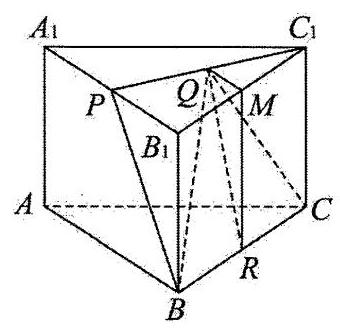

【解析】如图,连接 ${BP}$ ,过 $Q$ 作 ${QR} \bot  {BC}$ ,垂足为 $R$ .

再过 $Q$ 作 ${QM} \bot  {B}_{1}{C}_{1}$ 于点 $M$ ,连接 ${MR}$ .

由 ${B}_{1}{C}_{1}//{BC}$ 及 ${QM} \bot  {B}_{1}{C}_{1}$ 得 ${QM} \bot  {BC}$ ,

又 ${QR} \bot  {BC},{QM} \cap  {QR} = Q,{QM} \subset$ 平面 ${QMR},{QR} \subset$ 平面 ${QMR}$ ,

所以 ${BC} \bot  P$ 重 ${QMR}$ ,又 ${MR} \subset$ 平面 ${QMR}$ ,故 ${BC} \bot  {MR}$ .

又 ${BC} \bot  B{B}_{1}$ ,所以 ${MR}//B{B}_{1}$ ,而 $M{B}_{1}//{RB}$ ,

故四边形 $M{B}_{1}{BR}$ 是平行四边形,所以 ${MR} = B{B}_{1}$ .

由于 ${QM}\bot {B}_{1}{C}_{1},{P{B}_{1}}\bot {B}_{1}{C}_{1}$ ,故 ${QM}//{P{B}_{1}}$ ,

从而 ${QM}$ 的取值范围是 $0 \leq  {QM} \leq  P{B}_{1}$ .

而 $B{B}_{1} \bot$ 平面 ${A}_{1}{B}_{1}{C}_{1},{QM} \subset$ 平面 ${A}_{1}{B}_{1}{C}_{1}$ ,故 ${QM} \bot  B{B}_{1}$ . 而 ${MR}//B{B}_{1}$ ,故 ${QM} \bot  {MR}$ .

因为 ${MR} = {B{B}_{1}},{QM}\bot {MR}$ ,故 ${QR} = \sqrt{{QM}^{2} + {MR}^{2}} = \sqrt{{QM}^{2} + {BB}_{1}^{2}}$ ,从而 ${QR}$ 的取值范围是

$B{B}_{1} \leq  {QR} \leq  \sqrt{P{B}_{1}^{2} + B{B}_{1}^{2}}.$

将 $P{B}_{1} = \frac{1}{2}{A}_{1}{B}_{1} = 1, B{B}_{1} = 2$ 代入,知 ${QR}$ 的取值范围是 $\left\lbrack  {2,\sqrt{5}}\right\rbrack$ .

最后,由 ${QR} \bot  {BC}$ 知 ${S}_{\bigtriangleup {BCQ}} = \frac{1}{2}{BC} \cdot  {QR} = \frac{1}{2} \cdot  2 \cdot  {QR} = {QR}$ ,

故 ${S}_{\bigtriangleup {BCQ}}$ 的取值范围是 $\left\lbrack  {2,\sqrt{5}}\right\rbrack$ .

38、【答案】 $\frac{15}{4}$

【解析】因为 $x =  - \frac{\pi }{3}$ 为函数 $f\left( x\right)$ 的一个零点,且 $x = \frac{\pi }{3}$ 是函数 $f\left( x\right)$ 图象的一条对称轴,

所以 $\frac{2\pi }{3} = \left( {{2k} + 1}\right)  \cdot  \frac{T}{4}\left( {k \in  \mathbf{Z}}\right)$ ,所以 $T = \frac{2\pi }{\frac{3\left( {{2k} + 1}\right) }{4}}\left( {k \in  \mathbf{Z}}\right)$ ,所以 $\omega  = \frac{3\left( {{2k} + 1}\right) }{4}\left( {k \in  \mathbf{Z}}\right)$ ;

因为函数 $f\left( x\right)$ 在区间 $\left( {\frac{\pi }{12},\frac{\pi }{4}}\right)$ 上单调,

所以 $\frac{\pi }{4} - \frac{\pi }{12} \leq  \frac{T}{2}$ ,即 $T \geq  \frac{\pi }{3}$ ,所以 $\frac{2\pi }{\omega } \geq  \frac{\pi }{3}$ ,所以 $0 < \omega  \leq  6$ ,

又因为 $\omega  = \frac{3\left( {{2k} + 1}\right) }{4}\left( {k \in  \mathbf{Z}}\right)$ ,所以 $\omega  = \frac{3}{4},\frac{9}{4},\frac{15}{4},\frac{21}{4}$ ,

当 $\omega  = \frac{21}{4}$ 时, $k = 3, f\left( {-\frac{\pi }{3}}\right)  = \sin \left\lbrack  {\frac{21}{4} \times  \left( {-\frac{\pi }{3}}\right)  + \varphi }\right\rbrack   = 0, - \frac{7\pi }{4} + \varphi  = {k\pi }, k \in  \mathbf{Z}$ ,

又因为 $\left| \varphi \right|  \leq  \frac{\pi }{2}$ ,则 $\varphi  =  - \frac{\pi }{4}$ ,所以 $f\left( x\right)  = \sin \left( {\frac{21}{4}x - \frac{\pi }{4}}\right)$ ,

又 $x \in  \left( {\frac{\pi }{12},\frac{\pi }{4}}\right)$ ,则 $\frac{21}{4}x - \frac{\pi }{4} \in  \left( {\frac{3\pi }{16},\frac{17\pi }{16}}\right)$ ,

所以函数 $f\left( x\right)$ 在区间 $\left( {\frac{\pi }{12},\frac{\pi }{4}}\right)$ 上不单调,所以 $\omega  = \frac{21}{4}$ 舍去;

当 $\omega  = \frac{15}{4}$ 时, $k = 2, f\left( {-\frac{\pi }{3}}\right)  = \sin \left\lbrack  {\frac{15}{4} \times  \left( \frac{\pi }{-3}\right)  + \varphi }\right\rbrack   = 0, - \frac{5\pi }{4} + \varphi  = {k\pi }, k \in  \mathbf{Z}$ ,

又因为 $\left| \varphi \right|  \leq  \frac{\pi }{2}$ ,则 $\varphi  = \frac{\pi }{4}$ ,所以 $f\left( x\right)  = \sin \left( {\frac{15}{4}x + \frac{\pi }{4}}\right)$ .

又 $x \in  \left( {\frac{\pi }{12},\frac{\pi }{4}}\right) ,\frac{15}{4}x + \frac{\pi }{4} \in  \left( {\frac{9\pi }{16},\frac{19\pi }{16}}\right)  \subset  \left( {\frac{\pi }{2},\frac{3\pi }{2}}\right)$ , 所以函数 $f\left( x\right)$ 在区间 $\left( {\frac{\pi }{12},\frac{\pi }{4}}\right)$ 上单调,所以 $\omega  = \frac{15}{4}$ .

39、【答案】 $\left\lbrack  {\frac{\sqrt{2}}{2},\sqrt{5}}\right)$

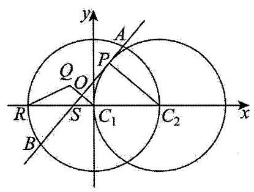

【解析】如图,不妨设 $\angle P{C}_{2}S = \theta \left( {0 \leq  \theta  < \frac{\pi }{2}}\right) , O{C}_{1} = r, Q{C}_{1} = {2r}$ , ${AB}$ 中点为 $O$ ,则 ${C}_{1}O \bot  {AB}$ ,

又 ${C}_{2}P \bot  {AB}$ ,所以 ${C}_{1}O//{C}_{2}P$ ,

所以 $\cos \theta  = \frac{P{C}_{2}}{S{C}_{2}} = \frac{1}{S{C}_{1} + 1} = \frac{1}{\frac{r}{\cos \theta } + 1} \Rightarrow  r = 1 - \cos \theta$ ,

在 $\bigtriangleup  Q{C}_{1}R$ 中，由余弦定理有:

$Q{R}^{2} = {1}^{2} + 4{r}^{2} - 2 \cdot  {2r} \cdot  \cos \theta  = 1 + 4{\left( 1 - \cos \theta \right) }^{2} - 4\left( {1 - \cos \theta }\right) \cos \theta  = 8{\cos }^{2}\theta  - {12}\cos \theta  + 5$ ,

因为 $\cos \theta  \in  (0,1\rbrack$ ,所以 $8{\cos }^{2}\theta  - {12}\cos \theta  + 5 \in  \left\lbrack  {\frac{1}{2},5}\right)$ ,所以 $\left| {QR}\right|  \in  \left\lbrack  {\frac{\sqrt{2}}{2},\sqrt{5}}\right)$ .

40、【答案】 11

【解析】显然 $k = 1$ 时, ${\sin }^{1} \circ   = {\sin }^{1} \circ$ 满足要求,

当 $k \geq  2$ 时,先考虑一个周期 $k \in  \left\lbrack  {2,{360}}\right\rbrack$ 内,

当 $k \in  \left\lbrack  {2,{179}}\right\rbrack$ 时, $\sin {k}^{ \circ  } \in  \left( {0,1}\right)$ ,故 $\sin {1}^{ \circ  } + \sin {2}^{ \circ  } + \cdots  + \sin {k}^{ \circ  }$ 单调递增且大于 $\sin {1}^{ \circ  }$ ,

而 $\sin {1}^{ \circ  } \cdot  \sin {2}^{ \circ  }\cdots \sin {k}^{ \circ  }$ 单调递减且小于 $\sin {1}^{ \circ  }$ ,两者不可能相等,

$k \in  \left\lbrack  {{180},{358}}\right\rbrack$ 时, $\sin {1}^{ \circ  } + \sin {2}^{ \circ  } + \cdots  + \sin {k}^{ \circ  }$ 单调递减且大于 0,

$\sin {1}^{ \circ  } \cdot  \sin {2}^{ \circ  }\cdots \sin {k}^{ \circ  } = 0$ ,两者不可能相等,

当 $k = {359},{360}$ 时, $\sin {1}^{ \circ  } + \sin {2}^{ \circ  } + \cdots  + \sin {k}^{ \circ  } = \sin {1}^{ \circ  } \cdot  \sin {2}^{ \circ  }\cdots \sin {k}^{ \circ  } = 0$ ,

故要想 $\sin {1}^{ \circ  } + \sin {2}^{ \circ  } + \cdots  + \sin {k}^{ \circ  } = \sin {1}^{ \circ  } \cdot  \sin {2}^{ \circ  }\cdots \sin {k}^{ \circ  }$ 成立,

则 $\sin {1}^{ \circ  } + \sin {2}^{ \circ  } + \cdots  + \sin {k}^{ \circ  } = \sin {1}^{ \circ  } \cdot  \sin {2}^{ \circ  }\cdots \sin {k}^{ \circ  } = 0$ ,

由周期性知,当 $k = {359},{719},{1079},{1439},{1799}$ 时,等式左边为 0,

又当 $k = {360},{720},{1080},{1440},{1800}$ 时, $\sin {k}^{ \circ  } = 0$ ,

故当 $k = 1,{359},{360},{719},{720},{1079},{1080},{1439},{1440},{17991800}$ 时,满足要求,共 11 个.

41、【答案】1

【解析】由 $\tan C = \tan \left( {\pi  - \left( {A + B}\right) }\right)  =  - \tan \left( {A + B}\right)  = \frac{\tan A + \tan B}{1 - \tan A\tan B}$ ,

得 $\tan A + \tan B + \tan C = \tan A\tan B\tan C$ .

记 $x = \tan C, y = \tan B, z = \tan A$ ,由条件得 $x + y + z \leq  \left\lbrack  x\right\rbrack   + \left\lbrack  y\right\rbrack   + \left\lbrack  z\right\rbrack$ ,

因为 $\left\lbrack  t\right\rbrack   \leq  t$ ,所以 $x, y, z$ 必为整数.

如果 $\bigtriangleup {ABC}$ 为钝角三角形,则 $\angle C > {90}^{ \circ  }$ ,则 $\angle A\text{ 、 }\angle B$ 均为锐角,

从而 $y\text{ 、 }z$ 为正整数 $\left( {z \leq  y}\right)$ ,

于是 $x < 0 < 1 \leq  z \leq  y$ ,

这时有 $1 \leq  {yz} = \frac{x + y + z}{x} = 1 + \frac{y + z}{x} < 1$ ,矛盾.

于是 $\bigtriangleup  {ABC}$ . 只能是锐角三角形，则 $1 \leq  z \leq  y \leq  x$ .

又 ${yz} = \frac{x + y + z}{x} \leq  \frac{3x}{x} = 3$ .

若 ${yz} = 1$ ,则 $y = z = 1$ ,从而 $x + y + z = {xyz}$ 不能成立;

若 ${yz} = 2$ ,则 $z = 1, y = 2$ ,由 $x + y + z = {xyz}$ ,得 $x = 3$ ;

若 ${yz} = 3$ ,则 $z = 1, y = 3$ ,由 $x + y + z = {xyz}$ ,得 $x = 2$ ,与 $y \leq  x$ 矛盾.

所以 $x = 3, y = 2, z = 1$ ,即 $\tan C = 3,\tan B = 2,\tan A = 1$ ,

所以 $\tan C - \tan B = 1$ .

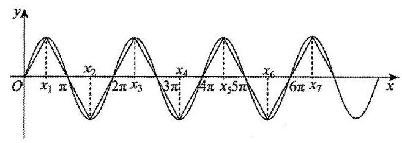

42、【答案】1013

【解析】 $f\left( x\right)  = \sin x$ 对任意 ${x}_{i},{x}_{j}\left( {i, j = 1,2,3,\ldots , m}\right)$ , 都有 $\left| {f\left( {x}_{i}\right)  - f\left( {x}_{j}\right) }\right|  \leq  f{\left( x\right) }_{\max } - f{\left( x\right) }_{\min } = 2$

要使 $m$ 取得最小值,尽可能多让 ${x}_{i}\left( {i = 1,2,3,\cdots , m}\right)$ 取得最值点,

考虑 $0 \leq  {x}_{1} < {x}_{2} < \ldots  < {x}_{m} \leq  {n\pi }$ ,

$\left| {f\left( {x}_{1}\right)  - f\left( {x}_{2}\right) }\right|  + \left| {f\left( {x}_{2}\right)  - f\left( {x}_{3}\right) }\right|  + \ldots  + \left| {f\left( {x}_{m - 1}\right)  - f\left( {x}_{m}\right) }\right|  = {2024}$

则按下图取值即可满足条件, $m$ 的最小值为 1013 .

43、【答案】0

【解析】可设 $\overrightarrow{{a}_{i}} = \left( {\sin {\varphi }_{i}\cos {\theta }_{i},\sin {\varphi }_{i}\sin {\theta }_{i},\cos {\varphi }_{i}}\right) , i = 1,2,3,4,5,6$ ,其中 ${\varphi }_{i} \in  \left\lbrack  {0,\pi }\right\rbrack  ,{\theta }_{i} \in  \left\lbrack  {0,{2\pi }}\right\rbrack$ , 则 $\overrightarrow{{a}_{i}} \cdot  \overrightarrow{{a}_{j}} = \sin {\varphi }_{i}\cos {\theta }_{i}\sin {\varphi }_{j}\cos {\theta }_{j} + \sin {\varphi }_{i}\sin {\theta }_{i}\sin {\varphi }_{j}\sin {\theta }_{j} + \cos {\varphi }_{i}\cos {\varphi }_{j}$

$= \sin {\varphi }_{i}\sin {\varphi }_{j}\left( {\cos {\theta }_{i}\cos {\theta }_{j} + \sin {\theta }_{i}\sin {\theta }_{j}}\right)  + \cos {\varphi }_{i}\cos {\varphi }_{j}$

$= \sin {\varphi }_{i}\sin {\varphi }_{j}\cos \left( {{\theta }_{i} - {\theta }_{j}}\right)  + \cos {\varphi }_{i}\cos {\varphi }_{j},$

因为 ${\theta }_{i},{\theta }_{j} \in  \left\lbrack  {0,{2\pi }}\right\rbrack$ ,所以 $- 1 \leq  \cos \left( {{\theta }_{i} - {\theta }_{j}}\right)  \leq  1$ ,

由于 ${\varphi }_{i},{\varphi }_{j} \in  \left\lbrack  {0,\pi }\right\rbrack  ,\sin {\varphi }_{i} \geq  0,\sin {\varphi }_{j} \geq  0$ ,故

$\overrightarrow{{a}_{i}} \cdot  \overrightarrow{{a}_{j}} = \sin {\varphi }_{i}\sin {\varphi }_{j}\cos \left( {{\theta }_{i} - {\theta }_{j}}\right)  + \cos {\varphi }_{i}\cos {\varphi }_{j} \leq  \cos {\varphi }_{i}\cos {\varphi }_{j} + \sin {\varphi }_{i}\sin {\varphi }_{j}$

$= \cos \left( {{\varphi }_{i} - {\varphi }_{j}}\right) ,$

因为 ${\varphi }_{i},{\varphi }_{j} \in  \left\lbrack  {0,\pi }\right\rbrack$ ,所以 $- 1 \leq  \cos \left( {{\varphi }_{i} - {\varphi }_{j}}\right)  \leq  1$ ,

又因为存在 $\overrightarrow{{a}_{i}} \cdot  \overrightarrow{{a}_{j}} \leq  M$ 恒成立,于是可取三组相互反向的向量,然后这三组所在直线两两垂直,

故 $M$ 的最小值为 0 .

思路二:其实可以想象，从原点出发引出 6 条向量到单位球上，由存在性，则需求 $\overrightarrow{{a}_{i}} \cdot  \overrightarrow{{a}_{j}}$ 最大值的最小值， 即两向量夹角最大时其中夹角最小那组的取值,

于是可取 $\overrightarrow{{a}_{k}}$ 分别为: $\left( {1,0,0}\right) ,\left( {0,1,0}\right) ,\left( {0,0,1}\right) ,\left( {-1,0,0}\right) ,\left( {0, - 1,0}\right) ,\left( {0,0, - 1}\right)$ ,

此时可得 $M \geq  {\left( \overrightarrow{{a}_{i}} \cdot  \overrightarrow{{a}_{j}}\right) }_{\min } = 0$ . 由于此时 $\left\langle  {\overrightarrow{{a}_{i}} \cdot  \overrightarrow{{a}_{j}}}\right\rangle   = \frac{\pi }{2}$ ,无论调整哪两个夹角变大,都会导致其余向量有夹角变小,导致 $M$ 可取的值变大,故前面的例子就是 $M$ 取得最小值的时刻,综上, $M$ 的最小值为 0 .

44、【答案】(1)A 的元素个数为 $2,\max A = 1$ ；(2)(i) $B = \left\lbrack  {\frac{1}{4}, + \infty }\right)$ ；(ii)见解析

【解析】(1)当 $a = 0$ 时， $f\left( x\right)  = \frac{1}{2}\ln x + 1$ ，其定义域为 $\left( {0, + \infty }\right)$ .

由 $f\left( x\right)  = x$ 得 $\frac{1}{2}\ln x - x + 1 = 0$ .

设 $g\left( x\right)  = \frac{1}{2}\ln x - x + 1$ ,则 ${g}^{\prime }\left( x\right)  = \frac{1 - {2x}}{2x}$ ,

当 $x \in  \left( {0,\frac{1}{2}}\right)$ 时, ${g}^{\prime }\left( x\right)  > 0$ ; 当 $x \in  \left( {\frac{1}{2}, + \infty }\right)$ 时, ${g}^{\prime }\left( x\right)  < 0$ ;

所以 $g\left( x\right)$ 在 $\left( {0,\frac{1}{2}}\right)$ 单调递增; 在 $\left( {\frac{1}{2}, + \infty }\right)$ 严格递减,

注意到 $g\left( 1\right)  = 0$ ,所以 $g\left( x\right)$ 在 $\left\lbrack  {\frac{1}{2}, + \infty }\right)$ 恰有一个零点 $x = 1$ ,且 $g\left( \frac{1}{2}\right)  > g\left( 1\right)  = 0$ ,

又 $g\left( {\mathrm{e}}^{-2}\right)  =  - {\mathrm{e}}^{-2} < 0$ ,所以 $g\left( {\mathrm{e}}^{-2}\right) g\left( \frac{1}{2}\right)  < 0$ ,所以 $g\left( x\right)$ 在 $\left( {0,\frac{1}{2}}\right)$ 恰有一个零点 ${x}_{0}$ ,

即 $f\left( x\right)$ 在 $\left\lbrack  {\frac{1}{2}, + \infty }\right)$ 恰有一个不动点 $x = 1$ ,在 $\left( {0,\frac{1}{2}}\right)$ 恰有一个不动点 $x = {x}_{0}$ ,

所以 $A = \left\{  {{x}_{0},1}\right\}$ ,所以 $\mathrm{A}$ 的元素个数为 2,

又因为 ${x}_{0} < 1$ ,所以 $\max A = 1$ .

(2)(i)当 $a = 0$ 时，由(1)知，A 有两个元素，不符合题意；

当 $a > 0$ 时, $f\left( x\right)  = \frac{1}{2}\ln x + a{x}^{2} + 1 - a$ ,其定义域为 $\left( {0, + \infty }\right)$ ,

由 $f\left( x\right)  = x$ 得 $\frac{1}{2}\ln x + a{x}^{2} - x + 1 - a = 0$ .

设 $h\left( x\right)  = \frac{1}{2}\ln x + a{x}^{2} - x + 1 - a, x \in  \left( {0, + \infty }\right)$ ,则 ${h}^{\prime }\left( x\right)  = \frac{1}{2x} + {2ax} - 1 = \frac{{4a}{x}^{2} - {2x} + 1}{2x}$ ,

设 $F\left( x\right)  = {4a}{x}^{2} - {2x} + 1$ ,则 $\Delta  = 4 - {16a}$ ,

① 当 $a \geq  \frac{1}{4}$ 时， $\Delta  \leq  0, F\left( x\right)  \geq  0,{h}^{\prime }\left( x\right)  \geq  0$ ，所以 $h\left( x\right)$ 在 $\left( {0, + \infty }\right)$ 严格递增，

又 $h\left( 1\right)  = 0$ ,所以 $h\left( x\right)$ 在 $\left( {0, + \infty }\right)$ 恰有一个零点 $x = 1$ ,

即 $f\left( x\right)$ 在 $\left( {0, + \infty }\right)$ 恰有一个不动点 $x = 1$ ,符合题意;

② 当 $0 < a < \frac{1}{4},\Delta  > 0$ ,故 $F\left( x\right)$ 恰有两个零点 ${x}_{1},{x}_{2}\left( {{x}_{1} < {x}_{2}}\right)$ .

又因为 $F\left( 0\right)  = 1 > 0, F\left( 1\right)  = {4a} - 1 < 0$ ,所以 $0 < {x}_{1} < 1 < {x}_{2}$ ,

当 $x \in  \left( {0,{x}_{1}}\right)$ 时， $F\left( x\right)  > 0,{h}^{\prime }\left( x\right)  > 0$ ；当 $x \in  \left( {{x}_{1},{x}_{2}}\right)$ 时， $F\left( x\right)  < 0,{h}^{\prime }\left( x\right)  < 0$ ；

当 $x \in  \left( {{x}_{2}, + \infty }\right)$ 时, $F\left( x\right)  > 0,{h}^{\prime }\left( x\right)  > 0$ ;

所以 $h\left( x\right)$ 在 $\left( {0,{x}_{1}}\right)$ 单调递增,在 $\left( {{x}_{1},{x}_{2}}\right)$ 严格递减,在 $\left( {{x}_{2}, + \infty }\right)$ 严格递增;

注意到 $h\left( 1\right)  = 0$ ,所以 $h\left( x\right)$ 在 $\left( {{x}_{1},{x}_{2}}\right)$ 恰有一个零点 $x = 1$ ,

且 $h\left( {x}_{1}\right)  > h\left( 1\right)  = 0, h\left( {x}_{2}\right)  < h\left( 1\right)  = 0$ ,

又 $x \rightarrow  0$ 时, $h\left( x\right)  \rightarrow   - \infty$ ,所以 $h\left( x\right)$ 在 $\left( {0,{x}_{1}}\right)$ 恰有一个零点 ${x}_{0}{}^{\prime }$ ,

从而 $f\left( x\right)$ 至少有两个不动点,不符合题意;

所以 $a$ 的取值范围为 $\left\lbrack  {\frac{1}{4}, + \infty }\right)$ ,即集合 $B = \left\lbrack  {\frac{1}{4}, + \infty }\right)$ .

(ii) 由 (i) 知, $B = \left\lbrack  {\frac{1}{4}, + \infty }\right)$ ,所以 $a = \min B = \frac{1}{4}$ ,

此时, $f\left( x\right)  = \frac{1}{2}\ln x + \frac{1}{4}{x}^{2} + \frac{3}{4}, h\left( x\right)  = \frac{1}{2}\ln x + \frac{1}{4}{x}^{2} - x + \frac{3}{4}$ ,由 (i) 知, $h\left( x\right)$ 在 $\left( {0, + \infty }\right)$ 严格递增,

所以,当 $x > 1$ 时, $h\left( x\right)  > h\left( 1\right)  = 0$ ,所以 $f\left( x\right)  > x$ ,即 $\frac{f\left( x\right) }{x} > 1$ ,

故若 ${a}_{n} > 1$ ,则 ${a}_{n + 1} > 1$ ,因此,若存在正整数 $N$ 使得 ${a}_{N} \leq  1$ ,则 ${a}_{N - 1} \leq  1$ ,从而 ${a}_{N - 2} \leq  1$ ,

重复这一过程有限次后可得 ${a}_{1} \leq  1$ ,与 ${a}_{1} = 2$ 矛盾,从而, $\forall n \in  {\mathbf{N}}^{ * },{a}_{n} > 1$ ,

下面我们先证明当 $x > 1$ 时, $\ln x < \frac{3}{2}\left( {x - 1}\right)$ ,

设 $G\left( x\right)  = \ln x - \frac{3}{2}x + \frac{3}{2}, x \in  \left( {1, + \infty }\right)$ ,

所以 ${G}^{\prime }\left( x\right)  = \frac{1}{x} - \frac{3}{2} = \frac{2 - {3x}}{2x} < 0$ ,所以 $G\left( x\right)$ 在 $\left( {1, + \infty }\right)$ 严格递减,

所以 $G\left( x\right)  < G\left( 1\right)  = 0$ ,

即当 $x > 1$ 时, $\ln x < \frac{3}{2}\left( {x - 1}\right)$ ,

从而当 $x > 1$ 时, $\frac{1}{2}\ln x + \frac{1}{4}{x}^{2} + \frac{3}{4} - x < \frac{1}{4}{x}^{2} - \frac{1}{4}x$ ,

从而 $\frac{\frac{1}{2}\ln x + \frac{1}{4}{x}^{2} + \frac{3}{4}}{x} - 1 < \frac{1}{4}\left( {x - 1}\right)$ ,即 $\frac{f\left( x\right) }{x} - 1 < \frac{1}{4}\left( {x - 1}\right)$ ,

故 $\frac{f\left( {a}_{n}\right) }{{a}_{n}} - 1 < \frac{1}{4}\left( {{a}_{n} - 1}\right)$ ,即 ${a}_{n + 1} - 1 < \frac{1}{4}\left( {{a}_{n} - 1}\right)$ ,

由于 ${a}_{n} > 1,{a}_{n + 1} > 1$ ,所以 ${a}_{n} - 1 > 0,{a}_{n + 1} - 1 > 0$ ,

故 $\left| {{a}_{n + 1} - 1}\right|  < \frac{1}{4}\left| {{a}_{n} - 1}\right|$ ,

故 $n \geq  2$ 时, $\left| {{a}_{n} - 1}\right|  < \frac{1}{4}\left| {{a}_{n - 1} - 1}\right|  < \frac{1}{{4}^{2}}\left| {{a}_{n - 2} - 1}\right|  < \cdots  < \frac{1}{{4}^{n - 1}}\left| {{a}_{1} - 1}\right|  = \frac{1}{{4}^{n - 1}}$ ,

所以 $\forall n \in  {\mathbf{N}}^{ * },\mathop{\sum }\limits_{{k = 1}}^{n}\left| {{a}_{k} - 1}\right|  \leq  \mathop{\sum }\limits_{{k = 1}}^{n}\frac{1}{{4}^{k - 1}} = \frac{1 - \frac{1}{{4}^{n}}}{1 - \frac{1}{4}} = \frac{4}{3}\left( {1 - \frac{1}{{4}^{n}}}\right)  < \frac{4}{3}$ ,故 $\max {C}_{n} = \frac{4}{3}$ .

思路二: (i) 当 $x = 1$ 时, $\frac{1}{2}\ln x + a{x}^{2} + 1 - a = 1 = x$ ,故 $x = 1$ 是 $f\left( x\right)$ 的一个不动点;

当 $x \neq  1$ 时,由 $\frac{1}{2}\ln x + a{x}^{2} + 1 - a = x$ ,得 $a = \frac{\frac{1}{2}\ln x - x + 1}{1 - {x}^{2}}\left( *\right)$ ,

要使得 $\mathrm{A}$ 恰有一个元素,即方程 $\frac{1}{2}\ln x + a{x}^{2} + 1 - a = x$ 有唯一解,因此方程 (*) 无实数解, 即直线 $y = a$ 与曲线 $y = \frac{\frac{1}{2}\ln x - x + 1}{1 - {x}^{2}}$ 无公共点.

令 $m\left( x\right)  = \frac{\frac{1}{2}\ln x - x + 1}{1 - {x}^{2}}$ ,则 ${m}^{\prime }\left( x\right)  = \frac{x\left( {-x + \ln x + \frac{1}{2{x}^{2}} - \frac{1}{x} + \frac{3}{2}}\right) }{{\left( 1 - {x}^{2}\right) }^{2}}$ ,令 $n\left( x\right)  =  - x + \ln x + \frac{1}{2{x}^{2}} - \frac{1}{x} + \frac{3}{2}\left( {x > 0}\right)$ ,

则 ${n}^{\prime }\left( x\right)  =  - 1 + \frac{1}{x} - \frac{1}{{x}^{3}} + \frac{1}{{x}^{2}} = \frac{-{x}^{3} + {x}^{2} + x - 1}{{x}^{3}} = \frac{-{\left( x - 1\right) }^{2}\left( {x + 1}\right) }{{x}^{3}} \leq  0$ ,

所以 $n\left( x\right)$ 在 $\left( {0, + \infty }\right)$ 严格递减,又因为 $n\left( 1\right)  = 0$ ,所以当 $x \in  \left( {0,1}\right)$ 时, $n\left( x\right)  > 0$ ,当 $x \in  \left( {1, + \infty }\right)$ 时, $n\left( x\right)  < 0$ ,

所以当 $x \in  \left( {0,1}\right)$ 时, ${m}^{\prime }\left( x\right)  > 0$ ,当 $x \in  \left( {1, + \infty }\right)$ 时, ${m}^{\prime }\left( x\right)  < 0$

所以 $m\left( x\right)$ 在 $\left( {0,1}\right)$ 单调递增,在 $\left( {1, + \infty }\right)$ 严格递减,

令 ${m}_{1}\left( x\right)  = \frac{x - 1 - \frac{1}{2}\ln x}{x + 1}$ ,则 ${m}_{1}\left( 1\right)  = 0,{m}_{1}^{\prime }\left( x\right)  = \frac{\frac{1}{2}\ln x - \frac{1}{2x} + \frac{3}{2}}{{\left( x + 1\right) }^{2}}$ ,

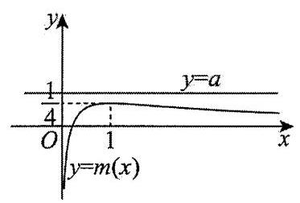

则 $\mathop{\lim }\limits_{{x \rightarrow  1}}m\left( x\right)  = \mathop{\lim }\limits_{{x \rightarrow  1}}\frac{\frac{1}{2}\ln x - x + 1}{1 - {x}^{2}} = \mathop{\lim }\limits_{{x \rightarrow  1}}\frac{\frac{x - 1 - \frac{1}{2}\ln x}{x + 1}}{x - 1}$

$= \mathop{\lim }\limits_{{x \rightarrow  1}}\frac{{m}_{1}\left( x\right)  - {m}_{1}\left( 1\right) }{x - 1} = {m}_{1}^{\prime }\left( 1\right)  = \frac{1}{4},$

又因为当 $x \rightarrow  0$ 时, $m\left( x\right)  \rightarrow   - \infty$ ,当 $x \rightarrow   + \infty$ 时, $m\left( x\right)  \rightarrow  0$ ,

所以曲线 $y = m\left( x\right)$ 的大致图象如图所示:

由图可知, $\mathrm{a} \geq  \frac{1}{4}$ ,所以 $a$ 的取值范围为 $\left\lbrack  {\frac{1}{4}, + \infty }\right)$ ,即集合 $B = \left( {\frac{1}{4}, + \infty }\right)$ .

(ii) 由 (i) 知, $B = \left\lbrack  {\frac{1}{4}, + \infty }\right)$ ,所以 $a = \min B = \frac{1}{4}$ ,

此时, $f\left( x\right)  = \frac{1}{2}\ln x + \frac{1}{4}{x}^{2} + \frac{3}{4}$ ,

令 $\varphi \left( x\right)  = \frac{\frac{1}{2}\ln x + \frac{1}{4}{x}^{2} + \frac{3}{4}}{x}$ ,则 ${\varphi }^{\prime }\left( x\right)  = \frac{{x}^{2} - 2\ln x - 1}{4{x}^{2}}$ ,

令 $t\left( x\right)  = {x}^{2} - 2\ln x - 1$ ,当 $x > 1$ 时, ${t}^{\prime }\left( x\right)  = {2x} - \frac{2}{x} = \frac{2\left( {{x}^{2} - 1}\right) }{x} > 0$ ,所以 $t\left( x\right)$ 在 $\left( {1, + \infty }\right)$ 严格递增,

所以当 $x > 1$ 时, $t\left( x\right)  > t\left( 1\right)  = 0$ ,所以 ${\varphi }^{\prime }\left( x\right)  > 0$ ,

所以 $\varphi \left( x\right)$ 在 $\left( {1, + \infty }\right)$ 严格递增,所以 $\varphi \left( x\right)  > \varphi \left( 1\right)  = 1$ ,

故若 ${a}_{n} > 1$ ,则 ${a}_{n + 1} > 1$ ,因此,若存在正整数 $N$ 使得 ${a}_{N} \leq  1$ ,则 ${a}_{N - 1} \leq  1$ ,从而 ${a}_{N - 2} \leq  1$ ,

重复这一过程有限次后可得 ${a}_{1} \leq  1$ ,与 ${a}_{1} = 2$ 矛盾,从而, $\forall n \in  {\mathbf{N}}^{ * },{a}_{n} > 1$ .

下面先证明当 $x > 1$ 时, $\ln x < \frac{1}{2}\left( {x - \frac{1}{x}}\right)$ .

令 $g\left( x\right)  = \frac{1}{2}\left( {x - \frac{1}{x}}\right)  - \ln x$ ,则 ${g}^{\prime }\left( x\right)  = \frac{1}{2}\left( {1 + \frac{1}{{x}^{2}}}\right)  - \frac{1}{x} = \frac{{\left( x - 1\right) }^{2}}{2{x}^{2}} \geq  0$ ,

所以 $g\left( x\right)$ 在 $\left( {0, + \infty }\right)$ 严格递增,所以当 $x > 1$ 时, $g\left( x\right)  > g\left( 1\right)  = 0$ ,所以当 $x > 1$ 时, $\ln x < \frac{1}{2}\left( {x - \frac{1}{x}}\right)$ .

所以 $\frac{f\left( x\right) }{x} - 1 = \frac{\frac{1}{2}\ln x + \frac{1}{4}{x}^{2} + \frac{3}{4} - x}{x}$

$< \frac{\frac{1}{2} \times  \frac{1}{2}\left( {x - \frac{1}{x}}\right)  + \frac{1}{4}{x}^{2} + \frac{3}{4} - x}{x} = \frac{{\left( x - 1\right) }^{3}}{4{x}^{2}} < \frac{1}{4}\left( {x - 1}\right) ,$

由于 ${a}_{n} > 1,{a}_{n + 1} > 1$ ,所以 ${a}_{n} - 1 > 0,{a}_{n + 1} - 1 > 0$ ,

故 $\frac{f\left( {a}_{n}\right) }{{a}_{n}} - 1 < \frac{1}{4}\left( {{a}_{n} - 1}\right)$ ,即 ${a}_{n + 1} - 1 < \frac{1}{4}\left( {{a}_{n} - 1}\right)$ ,

故 $\left| {{a}_{n + 1} - 1}\right|  < \frac{1}{4}\left| {{a}_{n} - 1}\right|$ ,

故 $n \geq  2$ 时, $\left| {{a}_{n} - 1}\right|  < \frac{1}{4}\left| {{a}_{n - 1} - 1}\right|  < \frac{1}{{4}^{2}}\left| {{a}_{n - 2} - 1}\right|  < \cdots  < \frac{1}{{4}^{n - 1}}\left| {{a}_{1} - 1}\right|  = \frac{1}{{4}^{n - 1}}$ .

所以 $\forall n \in  {\mathbf{N}}^{ * },\mathop{\sum }\limits_{{k = 1}}^{n}\left| {{a}_{k} - 1}\right|  \leq  \mathop{\sum }\limits_{{k = 1}}^{n}\frac{1}{{4}^{k - 1}} = \frac{1 - \frac{1}{{4}^{n}}}{1 - \frac{1}{4}} = \frac{4}{3}\left( {1 - \frac{1}{{4}^{n}}}\right)  < \frac{4}{3}$ ,故 $\max {C}_{n} = \frac{4}{3}$ .

(ii) 思路三: 同思路一可得, $\forall n \in  {\mathbf{N}}^{ * },{a}_{n} > 1$ .

下面我们先证明当 $x > 1$ 时, $\ln x < x - 1$ .

设 $G\left( x\right)  = \ln x - x + 1$ ,则当 $x > 1$ 时, ${G}^{\prime }\left( x\right)  = \frac{1}{x} - 1 = \frac{1 - x}{x} < 0$ ,所以 $G\left( x\right)$ 在 $\left( {1, + \infty }\right)$ 严格递减,所以 $G\left( x\right)  < G\left( 1\right)  = 0$ ,即 $\ln x < x - 1$ ,

从而当 $x > 1$ 时, $\frac{1}{2}\ln x < \frac{1}{2}\left( {x - 1}\right)  < \frac{3}{4}\left( {x - 1}\right)$ ,

于是 $\frac{1}{2}\ln x + \frac{1}{4}{x}^{2} + \frac{3}{4} - x < \frac{1}{4}{x}^{2} - \frac{1}{4}x$ ,

从而 $\frac{\frac{1}{2}\ln x + \frac{1}{4}{x}^{2} + \frac{3}{4}}{x} - 1 < \frac{1}{4}\left( {x - 1}\right)$ ,即 $\frac{f\left( x\right) }{x} - 1 < \frac{1}{4}\left( {x - 1}\right)$ ,

故 $\frac{f\left( {a}_{n}\right) }{{a}_{n}} - 1 < \frac{1}{4}\left( {{a}_{n} - 1}\right)$ ,即 ${a}_{n + 1} - 1 < \frac{1}{4}\left( {{a}_{n} - 1}\right)$ ,

由于 ${a}_{n} > 1,{a}_{n + 1} > 1$ ,所以 ${a}_{n} - 1 > 0,{a}_{n + 1} - 1 > 0$ ,

故 $\left| {{a}_{n + 1} - 1}\right|  < \frac{1}{4}\left| {{a}_{n} - 1}\right|$ ,

故 $n \geq  2$ 时, $\left| {{a}_{n} - 1}\right|  < \frac{1}{4}\left| {{a}_{n - 1} - 1}\right|  < \frac{1}{{4}^{2}}\left| {{a}_{n - 2} - 1}\right|  < \cdots  < \frac{1}{{4}^{n - 1}}\left| {{a}_{1} - 1}\right|  = \frac{1}{{4}^{n - 1}}$ .

所以 $\forall n \in  {\mathbf{N}}^{ * },\mathop{\sum }\limits_{{k = 1}}^{n}\left| {{a}_{k} - 1}\right|  \leq  \mathop{\sum }\limits_{{k = 1}}^{n}\frac{1}{{4}^{k - 1}} = \frac{1 - \frac{1}{{4}^{n}}}{1 - \frac{1}{4}} = \frac{4}{3}\left( {1 - \frac{1}{{4}^{n}}}\right)  < \frac{4}{3}$ .

故 $\max {C}_{n} = \frac{4}{3}$ .

45、【答案】( 1 ) $n = 0,1$ ，或 $x = 0$ ；( 2 )见解析；( 3 )见解析

【解析】(1)猜想: 伯努利不等式等号成立的充要条件是 $n = 0,1$ ,或 $x = 0$ .

当 $n = 0$ 时， ${\left( 1 + x\right) }^{0} = 1 + {0x}$ ，当 $n = 1$ 时， ${\left( 1 + x\right) }^{1} = 1 + x$ ，

当 $x = 0$ 时， ${\left( 1 + 0\right) }^{n} = 1 + {0n}$ ，其他值均不能保证等号成立，

猜想,伯努利不等式等号成立的充要条件是 $n = 0,1$ ,或 $x = 0$ ;

( 2 )当 $n \geq  1$ 时，我们需证 ${\left( 1 + x\right) }^{n} \geq  1 + {nx}$ ，

设 $f\left( x\right)  = {\left( 1 + x\right) }^{n} - {nx} - 1\left( {x <  - 1, a \geq  1}\right)$ ,注意到 $f\left( 0\right)  = 0$ ,

${f}^{\prime }\left( x\right)  = n{\left( 1 + x\right) }^{n - 1} - n = n\left\lbrack  {{\left( 1 + x\right) }^{n - 1} - 1}\right\rbrack$ ,令 ${\left( 1 + x\right) }^{n - 1} - 1 = 0$ 得 $x = 0$ ,

即 ${f}^{\prime }\left( 0\right)  = 0, x = 0$ 是 $f\left( x\right)$ 的一个极值点.

令 $g\left( x\right)  = {f}^{\prime }\left( x\right)$ ,则 ${g}^{\prime }\left( x\right)  = n\left( {n - 1}\right) {\left( 1 + x\right) }^{n - 2} > 0$ ,

所以 ${f}^{\prime }\left( x\right)$ 严格递增.

当 $- 1 < x < 0$ 时, ${f}^{\prime }\left( x\right)  < f\left( 0\right)  = 0$ ,当 $x > 0$ 时, ${f}^{\prime }\left( x\right)  > f\left( 0\right)  = 0$ ,

故 $f\left( x\right)$ 在 $\left( {-1,0}\right)$ 上严格递减,在 $\left( {0, + \infty }\right)$ 上严格递增.

所以在 $x = 0$ 处 $f\left( x\right)$ 取得极小值 $f\left( 0\right)  = 0$ ,

即 $f\left( x\right)  \geq  0$ 恒成立， ${\left( 1 + x\right) }^{n} \geq  {nx} + 1$ . 伯努利不等式对 $n \geq  1$ 得证.

(3)当 $n = 1$ 时，原不等式即 $1 + {a}_{1} \geq  1 + {a}_{1}$ ，显然成立.

当 $n \geq  2$ 时,构造数列 $\left\{  {x}_{n}\right\}   : {x}_{n} = \left( {1 + {a}_{1}}\right) \left( {1 + {a}_{2}}\right) \cdots \left( {1 + {a}_{n}}\right)  - \left( {1 + {a}_{1} + {a}_{2} + \cdots  + {a}_{n}}\right)$ ，

则 ${x}_{n + 1} - {x}_{n} = {a}_{n + 1}\left\lbrack  {\left( {1 + {a}_{1}}\right) \left( {1 + {a}_{2}}\right) \cdots \left( {1 + {a}_{n}}\right)  - 1}\right\rbrack$ ,

若 ${a}_{i} > 0\left( {i = 1,2,\cdots , n + 1}\right)$ ,由上式易得 ${x}_{n + 1} - {x}_{n} > 0$ ,即 ${x}_{n + 1} > {x}_{n}$ ;

若 $- 1 < {a}_{i} \leq  0\left( {i = 1,2,\cdots , n + 1}\right)$ ,则 $0 < 1 + {a}_{i} < 1$ ,所以 $\left( {1 + {a}_{1}}\right) \left( {1 + {a}_{2}}\right) \cdots \left( {1 + {a}_{n}}\right)  - 1 < 0$ ,

故 ${x}_{n + 1} - {x}_{n} = {a}_{n + 1}\left\lbrack  {\left( {1 + {a}_{1}}\right) \left( {1 + {a}_{2}}\right) \cdots \left( {1 + {a}_{n}}\right)  - 1}\right\rbrack   > 0$ ,

即此时 ${x}_{n + 1} > {x}_{n}$ 也成立.

所以 $\left\{  {x}_{n}\right\}$ 是一个严格递增的数列 $\left( {n \geq  2}\right)$ ,

由于 ${x}_{2} = \left( {1 + {a}_{1}}\right) \left( {1 + {a}_{2}}\right)  - \left( {1 + {a}_{1} + {a}_{2}}\right)  = {a}_{1}{a}_{2} > 0$ ,所以 ${x}_{n} > {x}_{2} > 0\left( {\forall n > 2}\right)$ ,

故原不等式成立.

46、【答案】(1)见解析；(2)见解析；(3)见解析

【解析】(1)存在数列 $\frac{2}{3},\frac{11}{6},3,\frac{25}{6}$ 是等差数列，且 $\frac{2}{3} < 1 < \frac{11}{6} < 2 < 3 < 4 < \frac{25}{6}$ ，所以数列1,2,4是“弱等差数列”.

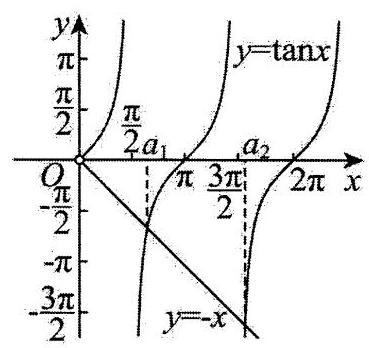

(2) ${f}^{\prime }\left( x\right)  = \sin x + x\cos x$ ，令 ${f}^{\prime }\left( x\right)  = 0$ 得 $- x = \tan x$ ，

所以极值点即为 $y =  - x$ 和 $y = \tan x$ 图象交点的横坐标，

由 $y =  - x$ 和 $y = \tan x$ 在 $\left( {0, + \infty }\right)$ 内的图象可知,在每个周期都有一个交点, 所以令 ${b}_{n} = \frac{n - 1}{2}\pi$ ,则 ${b}_{n} < {a}_{n} < {b}_{n + 1}$ ,所以 ${a}_{1},{a}_{2},\cdots ,{a}_{m}$ 是 “弱等差数列”.

(3)构造正整数等比数列 $\left\{  {a}_{n}\right\}  ,{a}_{n} = {k}^{{2024} - n}{\left( k + 1\right) }^{n - 1}\left( {n = 1,2,\cdots ,{2024}}\right)$ ，其中 $k$ 是待定正整数，

下面证明: 存在正整数 $k$ ,使得等比数列 $\left\{  {a}_{n}\right\}$ 是长为 2024 的 “弱等差数列”.

取 ${b}_{2024} = {a}_{2024} - 1,{b}_{2023} = {a}_{2023} - 1$ ,若存在这样的正整数 $k$ 使得

${b}_{1} \leq  {k}^{2023} < {b}_{2} \leq  {k}^{2022}\left( {k + 1}\right)  < {b}_{3} \leq  {k}^{2021}{\left( k + 1\right) }^{2} < \cdots  < {b}_{2023} \leq  k{\left( k + 1\right) }^{2022} < {b}_{2024} \leq  {\left( k + 1\right) }^{2023} < {b}_{2025}$ 成立,

所以 $d = {b}_{2024} - {b}_{2023} = {a}_{2024} - {a}_{2023} = {\left( k + 1\right) }^{2023} - k{\left( k + 1\right) }^{2022} = {\left( k + 1\right) }^{2022}$ ,

由 ${a}_{n} = {k}^{{2024} - n}{\left( k + 1\right) }^{n - 1}\left( {n = 1,2,\cdots ,{2024}}\right)$ ,得

${a}_{n + 1} - {a}_{n} = {k}^{{2024} - n - 1}{\left( k + 1\right) }^{n} - {k}^{{2024} - n}{\left( k + 1\right) }^{n - 1} = {k}^{{2023} - n}{\left( k + 1\right) }^{n - 1} < {\left( k + 1\right) }^{2022} = d$ ,

于是 ${a}_{n} = {a}_{2024} + \left( {{a}_{2023} - {a}_{2024}}\right)  + \cdots  + \left( {{a}_{n} - {a}_{n - 1}}\right)  > {b}_{2024} - \left( {{2024} - n}\right) d = {b}_{n}\left( {1 \leq  n \leq  {2023}}\right)$ ,

又因为 ${b}_{2024} = {a}_{2024} - 1 < {a}_{2024}$ ,所以当 $n = 1,2,\cdots ,{2024}$ 时, ${b}_{n} < {a}_{n}$ ,

而 ${a}_{n} = {a}_{1} + \left( {{a}_{2} - {a}_{1}}\right)  + \cdots  + \left( {{a}_{n} - {a}_{n - 1}}\right)  < {b}_{2} + \left( {n - 1}\right) d = {b}_{n + 1}$ ,

所以 ${b}_{1} \leq  {a}_{1} < {b}_{2} \leq  {a}_{2} < \cdots  < {b}_{2024} \leq  {a}_{2024} < {b}_{2025}$ ,

最后说明存在正整数 $k$ 使得 ${a}_{1} < {b}_{2}$ ,

由 ${b}_{2} = {b}_{2024} - {2022d} = {\left( k + 1\right) }^{2023} - 1 - \left( {m - 2}\right) {\left( k + 1\right) }^{2022} = {\left( k + 1\right) }^{2022}\left( {k + 3 - {2024}}\right)  - 1 > {k}^{m - 1}$ ,

上式对于充分大的 $k$ 成立,即总存在满足条件的正整数 $k$ .

所以，存在长为 2024 的“弱等差数列” $\left\{  {a}_{n}\right\}$ ，且 $\left\{  {a}_{n}\right\}$ 是等比数列.

47、【答案】( 1 ) $- 4 \leq  x \leq  0$ ；( 2 )存在；( 3 )2024

【解析】( 1 )由题意可得: $\left| \overrightarrow{{a}_{3}}\right|  \geq  \left| {\overrightarrow{{a}_{1}} + \overrightarrow{{a}_{2}}}\right|$ ，则 $\sqrt{9 + {\left( x + 6\right) }^{2}} \geq  \sqrt{9 + {\left( 2x + 6\right) }^{2}}$ ，解得: $- 4 \leq  x \leq  0$ ；

(2)存在“长向量”，且“长向量”为 $\overrightarrow{{a}_{2}}$ ， $\overrightarrow{{a}_{6}}$ ，理由如下:

由题意可得 $\left| \overline{{a}_{n}}\right|  = \sqrt{{\sin }^{2}\frac{n\pi }{2} + {\cos }^{2}\frac{n\pi }{2}} = 1$ ,

若存在 “长向量”, $\overrightarrow{{a}_{p}}$ ，只需使 $\left| {\overrightarrow{{S}_{n}} - \overrightarrow{{a}_{p}}}\right|  \leq  1$ ，

又 $\overrightarrow{{S}_{7}} = \overrightarrow{{a}_{1}} + \overrightarrow{{a}_{2}} + \overrightarrow{{a}_{3}} + \cdots  + \overrightarrow{{a}_{7}} = \left( {1 + 0 - 1 + 0 + 1 + 0 - 1,0 - 1 + 0 + 1 + 0 - 1 + 0}\right)  \neq  \left( {0, - 1}\right)$ ,

故只需使 $\left| {\overrightarrow{{S}_{n}} - \overrightarrow{{a}_{p}}}\right|  = \sqrt{{\sin }^{2}\frac{p\pi }{2} + {\left( \cos \frac{p\pi }{2} + 1\right) }^{2}} = \sqrt{{\sin }^{2}\frac{p\pi }{2} + {\cos }^{2}\frac{p\pi }{2} + 2\cos \frac{p\pi }{2} + 1}$

$= \sqrt{2 + 2\cos \frac{p\pi }{2}} \leq  1$ ,即 $0 \leq  2 + 2\cos \frac{p\pi }{2} \leq  1$ ,即 $- 1 \leq  \cos \frac{p\pi }{2} \leq   - \frac{1}{2}$ ,

当 $p = 2$ 或 6 时,符合要求,故存在 “长向量”,且 “长向量”为 $\overrightarrow{{a}_{2}},\overrightarrow{{a}_{6}}$ ;

(3)由题意，得 $\left| \overrightarrow{{a}_{1}}\right|  \geq  \left| {\overrightarrow{{a}_{2}} + \overrightarrow{{a}_{3}}}\right| ,{\left| \overrightarrow{{a}_{1}}\right| }^{2} \geq  {\left| \overrightarrow{{a}_{2}} + \overrightarrow{{a}_{3}}\right| }^{2}$ ，即 ${\overrightarrow{{a}_{1}}}^{2} \geq  {\left( \overrightarrow{{a}_{2}} + \overrightarrow{{a}_{3}}\right) }^{2}$ ，

即 ${\bar{a}}_{1}^{2} \geq  {\bar{a}}_{2}^{2} + {\bar{a}}_{3}^{2} + 2\overline{{a}_{2}} \cdot  \overline{{a}_{3}}$ ,同理 ${\bar{a}}_{2}^{2} \geq  {\bar{a}}_{1}^{2} + {\bar{a}}_{3}^{2} + 2\overline{{a}_{1}} \cdot  \overline{{a}_{3}}$ ,

${\bar{a}}_{3}^{2} \geq  {\bar{a}}_{1}^{2} + {\bar{a}}_{2}^{2} + 2{\bar{a}}_{1} \cdot  {\bar{a}}_{2},$

三式相加并化简,得: $0 \geq  {\overrightarrow{a}}_{1}^{2} + {\overrightarrow{a}}_{2}^{2} + {\overrightarrow{a}}_{3}^{2} + 2{\overrightarrow{a}}_{1} \cdot  \overrightarrow{{a}_{2}} + 2\overrightarrow{{a}_{1}} \cdot  \overrightarrow{{a}_{3}} + 2\overrightarrow{{a}_{1}} \cdot  \overrightarrow{{a}_{3}} + 2\overrightarrow{{a}_{2}} \cdot  \overrightarrow{{a}_{3}}$ ,

即 ${\left( \overrightarrow{{a}_{1}} + \overrightarrow{{a}_{2}} + \overrightarrow{{a}_{3}}\right) }^{2} \leq  0,\left| {\overrightarrow{{a}_{1}} + \overrightarrow{{a}_{2}} + \overrightarrow{{a}_{3}}}\right|  \leq  0$ ,所以 $\overrightarrow{{a}_{1}} + \overrightarrow{{a}_{2}} + \overrightarrow{{a}_{3}} = \overrightarrow{0}$ ,

设 ${\bar{a}}_{3} = \left( {u, v}\right)$ ,由 ${\bar{a}}_{1} + {\bar{a}}_{2} + {\bar{a}}_{3} = \overrightarrow{0}$ 得: $\left\{  \begin{array}{l} u =  - \sin x - 2\cos x \\  v =  - \cos x - 2\sin x \end{array}\right.$ ,

设 ${P}_{n}\left( {{x}_{n},{y}_{n}}\right)$ ,则依题意得: $\left\{  \begin{array}{l} \left( {{x}_{{2k} + 1},{y}_{{2k} + 1}}\right)  = 2\left( {{x}_{1},{y}_{1}}\right)  - \left( {{x}_{2k},{y}_{2k}}\right) \\  \left( {{x}_{{2k} + 2},{y}_{{2k} + 2}}\right)  = 2\left( {{x}_{2},{y}_{2}}\right)  - \left( {{x}_{{2k} + 1},{y}_{{2k} + 1}}\right)  \end{array}\right.$ ,

得 $\left( {{x}_{{2k} + 2},{y}_{{2k} + 2}}\right)  = 2\left\lbrack  {\left( {{x}_{2},{y}_{2}}\right)  - \left( {{x}_{1},{y}_{1}}\right) }\right\rbrack   + \left( {{x}_{2k},{y}_{2k}}\right)$ ,

故 $\left( {{x}_{{2k} + 2},{y}_{{2k} + 2}}\right)  = {2k}\left\lbrack  {\left( {{x}_{2},{y}_{2}}\right)  - \left( {{x}_{1},{y}_{1}}\right) }\right\rbrack   + \left( {{x}_{2},{y}_{2}}\right)$ ,

$\left( {{x}_{{2k} + 1},{y}_{{2k} + 1}}\right)  =  - {2k}\left\lbrack  {\left( {{x}_{2},{y}_{2}}\right)  - \left( {{x}_{1},{y}_{1}}\right) }\right\rbrack   + \left( {{x}_{2},{y}_{2}}\right) ,$

所以 $\overrightarrow{{P}_{{2k} + 1}{P}_{{2k} + 2}} = \left( {{x}_{{2k} + 2} - {x}_{{2k} + 1},{y}_{{2k} + 2} - {y}_{{2k} + 1}}\right)  = {4k}\left\lbrack  {\left( {{x}_{2},{y}_{2}}\right)  - \left( {{x}_{1},{y}_{1}}\right) }\right\rbrack   = {4k}\overrightarrow{{P}_{1}{P}_{2}}$ ,

${\left| \overrightarrow{{P}_{1}{P}_{2}}\right| }^{2} = {\left( -\sin x - 2\cos x\right) }^{2} + {\left( -\cos x - 2\sin x\right) }^{2} = 5 + 8\sin x\cos x = 5 + 4\sin {2x} \geq  1$ ,

当且仅当 $x = {t\pi } - \frac{\pi }{4}\left( {t \in  \mathbf{Z}}\right)$ 时等号成立,

故 ${\left| \overline{{P}_{1013}{P}_{1014}}\right| }_{\min } = 4 \times  \frac{1012}{2} = {2024}$ .

48、【答案】(1) $\left\lbrack  {-2,2}\right\rbrack$ ；(2)见解析

【解析】(1)由题意可知 $f\left( {x}_{1}\right)  = \sin {x}_{1} \in  \left\lbrack  {-1,1}\right\rbrack  , g\left( {x}_{2}\right)  = \cos 2{x}_{2} \in  \left\lbrack  {-1,1}\right\rbrack$ ,

故 $f\left( {x}_{1}\right)  + g\left( {x}_{2}\right)  \in  \left\lbrack  {-2,2}\right\rbrack$ ,

则 $m$ 的取值范围为 $\left\lbrack  {-2,2}\right\rbrack$ ;

(2)证明:因为在 $\left\lbrack  {0,{2a}}\right\rbrack$ 上，当且仅当 $x = \frac{a}{2}$ 时， $f\left( x\right)$ 取得最大值 1，

且 $f\left( x\right)$ 为定义在 $\mathrm{R}$ 上的奇函数,

故在 $\left\lbrack  {-{2a},0}\right\rbrack$ 上当且仅当 $x =  - \frac{a}{2}$ 时, $f\left( x\right)$ 取得最小值-1,

由对任意 $x \in  \mathbf{R}$ ,有 $f\left( {a + x}\right)  + f\left( {a - x}\right)  = 0$ ,可知 $f\left( x\right)$ 图象关于点 $\left( {a,0}\right)$ 对称,

又 $f\left( {a + x}\right)  =  - f\left( {a - x}\right)  = f\left( {x - a}\right)$ ,即 $f\left( {x + {2a}}\right)  = f\left( x\right)$ ,

故 ${2a}$ 为函数 $f\left( x\right)$ 的周期,

故 $f\left( x\right)  \in  \left\lbrack  {-1,1}\right\rbrack$ ,

$\sin {\pi x} \in  \left\lbrack  {-1,1}\right\rbrack  ,\cos {\pi x} \in  \left\lbrack  {-1,1}\right\rbrack$ ,

当 $f\left( {x}_{1}\right)  = 1$ 时, ${x}_{1} = \frac{a}{2} + {2na}, n \in  \mathrm{Z}$ ,

$\sin \pi {x}_{1} = 1$ 时, ${x}_{1} = \frac{1}{2} + {2k}, k \in  \mathrm{Z}$ ,

若 $\frac{a}{2} + {2na} = \frac{1}{2} + {2k}, a = \frac{{4k} + 1}{{4n} + 1}, k, n \in  \mathrm{Z}$ ,此时有 ${y}_{1} = \sin \pi {x}_{1} + f\left( {x}_{1}\right)  = 2$ 为最大值;

当 $f\left( {x}_{2}\right)  =  - 1$ 时, ${x}_{2} =  - \frac{a}{2} + {2ma}, m \in  \mathrm{Z}$ ,

$\cos \pi {x}_{2} = 1$ 时, ${x}_{2} = {2t}, t \in  \mathrm{Z}$ ,

若 $- \frac{a}{2} + {2ma} = {2t}, a = \frac{4t}{{4m} - 1}, t, m \in  Z$ ,此时有 ${y}_{2} = \cos \pi {x}_{2} - f\left( {x}_{2}\right)  = 2$ 为最大值,

由于 $a = \frac{{4k} + 1}{{4n} + 1} \neq  \frac{4t}{{4m} - 1}$ ,故 $\sin \pi {x}_{1} + f\left( {x}_{1}\right)  + \cos \pi {x}_{2} - f\left( {x}_{2}\right)  < 4$ ,

即不存在 ${x}_{1} \in  \mathrm{R},{x}_{2} \in  \mathrm{R}$ ,使得 $\sin \pi {x}_{1} + f\left( {x}_{1}\right)  + \cos \pi {x}_{2} - f\left( {x}_{2}\right)  = 4$ ,

所以 ${y}_{1} = \sin {\pi x} + f\left( x\right)$ 与 ${y}_{2} = \cos {\pi x} - f\left( x\right)$ 不具有 “4 关联” 性.

49、【答案】( 1 )不存在具有性质 $T$ 的 ${A}_{5}$ ；( 2 )见解析；( 3 )见解析

【解析】(1)不存在具有性质 $T$ 的 ${A}_{5}$ ,理由如下:

设 ${A}_{5} : {a}_{1},{a}_{2},{a}_{3},{a}_{4},{a}_{5}$ ,由于 ${a}_{1} = {a}_{5} = 0,{a}_{i + 1} - {a}_{i} \in  \{  - 1,2\} \left( {i = 1,2,3,4}\right)$ ,

设 ${a}_{2} - {a}_{1},{a}_{3} - {a}_{2},{a}_{4} - {a}_{3},{a}_{5} - {a}_{4}$ 中有 $m$ 个 $- 1,4 - m$ 个 2,

则有 $\left( {{a}_{2} - {a}_{1}}\right)  + \left( {{a}_{3} - {a}_{2}}\right)  + \left( {{a}_{4} - {a}_{3}}\right)  + \left( {{a}_{5} - {a}_{4}}\right)  = {a}_{5} - {a}_{1} = 0$ ,

所以 $- 1 \times  m + 2\left( {4 - m}\right)  = 0$ ,解得 $m = \frac{8}{3}$ ,与 $m$ 为整数矛盾,

所以不存在具有性质 $T$ 的 ${A}_{5}$ .

(2)设 $\left| {a}_{1}\right| ,\left| {a}_{2}\right| ,\left| {a}_{3}\right| ,\cdots ,\left| {a}_{10}\right|$ 中的最大值为 $M$ ，则存在 ${a}_{k}$ ，使得 ${a}_{k} = M$ 或 ${a}_{k} =  - M$ ，

若存在 ${a}_{k}$ ,使 ${a}_{k} = M$ ,下证: ${a}_{k},{a}_{k + 1},\cdots ,{a}_{10}$ 可以取遍 0 到 $M$ 之间所有的整数,

假设存在正整数 $m\left( {m < M}\right)$ 使得 ${a}_{k},{a}_{k + 1},\cdots ,{a}_{10}$ 中各项均不为 $m$ ,

令集合 $B = \left\{  {i \mid  {a}_{i} > m}\right\}$ ，设 ${i}_{0}$ 是集合 $B$ 中元素的最大值，

则有 ${a}_{{i}_{0}} > m > {a}_{{i}_{0} + 1}$ ,

这与 ${a}_{i + 1} - {a}_{i} \in  \{  - 1,2\} \left( {i = 1,2,\cdots , n - 1}\right)$ 矛盾,

所以 ${a}_{k},{a}_{k + 1},\cdots ,{a}_{10}$ 可以取遍 0 到 $M$ 之间所有的整数,

若 $M = 1$ ,则 ${a}_{1},{a}_{2},{a}_{3},\cdots ,{a}_{9}$ 的取值只能为 0, $\pm  1$ 中的数,

此时 ${a}_{1},{a}_{2},{a}_{3},\cdots ,{a}_{9}$ 中必有两项相同,

若 $M = 2$ ,则 ${a}_{1},{a}_{2},{a}_{3},\cdots ,{a}_{9}$ 的取值只能为 $0, \pm  1, \pm  2$ 中的数,

此时 ${a}_{1},{a}_{2},{a}_{3},\cdots ,{a}_{9}$ 中必有两项相同,

若 $M \geq  3$ ,则 ${a}_{1},{a}_{2},{a}_{3},\cdots ,{a}_{k}$ 中一定有异于 0 和 $M$ 的正整数,

再由 ${a}_{k},{a}_{k + 1},\cdots ,{a}_{10}$ 可以取遍 0 到 $M$ 之间所有的整数,

所以 ${a}_{1},{a}_{2},{a}_{3},\cdots ,{a}_{9}$ 中必有两项相同,

当 ${a}_{k} =  - M$ ,同理可证: ${a}_{1},{a}_{2},\cdots ,{a}_{k}$ 可以取遍 $- M$ 到 0 之间所有的整数,

从而 ${a}_{1},{a}_{2},{a}_{3},\cdots ,{a}_{9}$ 中必有两项相同.

(3)不妨设 $p < 0 < q$ ，当 ${a}_{2} - {a}_{1},{a}_{3} - {a}_{2},\cdots ,{a}_{k} - {a}_{k - 1}$ 中恰有 $q$ 个 $p, - p$ 个 $q$ ，

由于 $\left( {{a}_{2} - {a}_{1}}\right)  + \left( {{a}_{3} - {a}_{2}}\right)  + \cdots  + \left( {{a}_{k} - {a}_{k - 1}}\right)  = {a}_{k} - {a}_{1} = 0$ ,

所以取 $k = q - p + 1$ ,此时 ${A}_{k}$ 具有性质 $T$ ,

下证: ${a}_{1},{a}_{2},\cdots ,{a}_{k - 1}$ 中任意两项均不相同,

若存在 $i, j\left( {1 \leq  i < j \leq  k - 1}\right)$ 使得 ${a}_{i} = {a}_{j}$ ,

令 ${a}_{i} = {u}_{1}p + {v}_{1}q,{a}_{j} = {u}_{2}p + {v}_{2}q$ ,

则有 $0 \leq  {u}_{1} \leq  {u}_{2} \leq  q,0 \leq  {v}_{1} \leq  {v}_{2} \leq   - p$ ,

令 $s = {u}_{2} - {u}_{1}, t = {v}_{2} - {v}_{1}$ ,则有 ${ps} + {qt} = 0$ 且 $0 \leq  s \leq  q,0 \leq  t \leq   - p$ ,

由于 $p + q = 1$ ,则有 $s = q\left( {s - t}\right)$ ,

若 $s = t$ ,则有 $s = 0$ ,即 ${u}_{2} = {u}_{1}$ ,

当 ${a}_{i} = {a}_{j}$ 时,有 ${v}_{2} = {v}_{1}$ ,从而 $i = j$ ,矛盾;

若 $s \neq  t$ ,则有 $s = q$ 且 $s = t + 1$ ,

因此有 ${u}_{2} = q,{u}_{1} = 0,{v}_{2} = q - 1,{v}_{1} = 0$ ,

所以此时 ${a}_{i} = {a}_{1},{a}_{j} = {a}_{n}$ ,矛盾;

综上所述,存在正整数 $k$ ,使得对任意具有性质 $T$ 的 ${A}_{k}$ ,都有 ${a}_{1},{a}_{2},\cdots ,{a}_{k - 1}$ 中任意两项均不相同.

50、【答案】( 1 ) ${A}_{3}$ 的前 2 项为 3，8； ${A}_{4}$ 的前 2 项为 5，11；( 2 )见解析；( 3 ) $m = 6, n = 8$ .

【解析】(1)数列 ${A}_{3}$ 的前 2 项为 3，8；数列 ${A}_{4}$ 的前 2 项为 5，11；

(2)首先 $f\left( {1, n}\right)  = {n}^{2}$ ，当 $n \geq  2$ 时， $f\left( {1, n}\right)  - f\left( {1, n - 1}\right)  = {2n} - 1$ 结论成立；

当 $m \geq  2$ 时,对于相邻的两个数列:

${A}_{m - 1} : f\left( {m - 1,1}\right) ,\;f\left( {m - 1,2}\right) ,\;\cdots ,\;f\left( {m - 1, n - 1}\right) ,\;f\left( {m - 1, n}\right) ,\;\cdots ,$

${A}_{m} : \;f\left( {m,1}\right) ,\;f\left( {m,2}\right) ,\;\cdots ,\;f\left( {m, n - 1}\right) ,\;f\left( {m, n}\right) ,\;\cdots ,$

<table><tr><td>1</td><td>4</td><td>9</td><td>16</td><td>25</td><td>36</td><td>49</td><td>64</td></tr><tr><td>2</td><td>6</td><td>12</td><td>20</td><td>30</td><td>42</td><td>56</td><td>72</td></tr><tr><td>3</td><td>8</td><td>15</td><td>24</td><td>35</td><td>48</td><td>63</td><td>80</td></tr><tr><td>5</td><td>11</td><td>19</td><td>29</td><td>41</td><td>55</td><td>71</td><td>89</td></tr><tr><td>7</td><td>14</td><td>23</td><td>34</td><td>47</td><td>62</td><td>79</td><td>98</td></tr><tr><td>10</td><td>18</td><td>28</td><td>40</td><td>54</td><td>70</td><td>88</td><td>108</td></tr><tr><td>13</td><td>22</td><td>33</td><td>46</td><td>61</td><td>78</td><td>97</td><td>118</td></tr><tr><td>17</td><td>27</td><td>39</td><td>53</td><td>69</td><td>87</td><td>107</td><td>129</td></tr></table>

因为 $f\left( {m, n - 1}\right) , f\left( {m - 1, n}\right)$ 都在数列 ${N}_{m - 2}$ 中,且 $f\left( {m, n - 1}\right)$ 在 $f\left( {m - 1, n}\right)$ 之前,

所以 $f\left( {m, n - 1}\right)  < f\left( {m - 1, n}\right)$ 在数列 ${A}_{m - 1},{A}_{m}$ 中,必有 $f\left( {m - 1, n}\right)  < f\left( {m, n}\right)$ ,

所以 $f\left( {m, n - 1}\right)  < f\left( {m - 1, n}\right)  < f\left( {m, n}\right)$ ,

所以 $f\left( {m, n}\right)  - f\left( {m, n - 1}\right)  = f\left( {m - 1, n}\right)  - f\left( {m - 1, n - 1}\right)  + 1$

所以 $\{ f\left( {m, n}\right)  - f\left( {m, n - 1}\right) \}$ 构成首项为 $f\left( {1, n}\right)  - f\left( {1, n - 1}\right)  = {2n} - 1$ ,公差为 1 的等差数列,

所以 $f\left( {m, n}\right)  - f\left( {m, n - 1}\right)  = \left( {{2n} - 1}\right)  + \left( {m - 1}\right)  = {2n} + m - 2$ .

(3)由各个数列生成的规则知， $\left\{  {{n}^{2} + 1,{n}^{2} + 2,\cdots ,{n}^{2} + {2n}}\right\}$ 中不可能有两个元素是同一数列的项.

从上面的表格,我们猜想: 集合 $\left\{  {{n}^{2} + 1,{n}^{2} + 2,\cdots ,{n}^{2} + {2n}}\right\}$ 中的每个元素,且仅是数列 ${A}_{2},{A}_{3},\cdots ,{A}_{{2n} + 1}$ 中某个数列的项.

具体地可概括成结论 $P$ : 对任意 $n \in  {\mathbf{N}}^{ * }, i \in  \mathbf{N}, i \leq  n - 1$ ,有 $f\left( {{2n} - {2i}, i + 1}\right)  = {n}^{2} + i + 1, f\left( {{2n} + 1 - {2i}, i + 1}\right)  = {n}^{2} + n + i + 1$ . 下面用数学归纳法证明:

(i)当 $n = 1$ 时， $f\left( {2,1}\right)  = 2, f\left( {3,1}\right)  = 3$ ，由题意数列 ${A}_{2},{A}_{3}$ 的首项分别是2,3，结论成立；

(ii) 假设当 $n = k\left( {k \in  {\mathrm{N}}^{ * }}\right)$ 时,结论成立,即对 $\forall i \in  \mathrm{N}, i \leq  k - 1$ ,

$f\left( {{2k} - {2i}, i + 1}\right)  = {k}^{2} + i + 1, f\left( {{2k} + 1 - {2i}, i + 1}\right)  = {k}^{2} + k + i + 1$

那么由第 (2) 问的结论知: 当 $i \in  \mathrm{N}, i \leq  k - 1$ 时,

$f\left( {{2k} - {2i}, i + 2}\right)  = f\left( {{2k} - {2i}, i + 1}\right)  + 2\left( {i + 2}\right)  + \left( {{2k} - {2i}}\right)  - 2 = \left( {{k}^{2} + i + 1}\right)  + {2k} + 2 = {\left( k + 1\right) }^{2} + i + 2$ ,

$f\left( {{2k} + 1 - {2i}, i + 2}\right)  = f\left( {{2k} + 1 - {2i}, i + 1}\right)  + 2\left( {i + 2}\right)  + \left\lbrack  {{2k} + 1 - {2i}}\right\rbrack   - 2$

$= \left( {{k}^{2} + k + i + 1}\right)  + \left( {{2k} + 3}\right)$

$= {\left( k + 1\right) }^{2} + \left( {k + 1}\right)  + i + 2$ ,

上式表明,集合 $\left\{  {{\left( k + 1\right) }^{2} + 1,{\left( k + 1\right) }^{2} + 2,\cdots ,{\left( k + 1\right) }^{2} + 2\left( {k + 1}\right) }\right\}$ 中除了 ${\left( k + 1\right) }^{2} + 1,{\left( k + 1\right) }^{2} + \left( {k + 2}\right)$ 的每一个元素都是数列 ${A}_{2},{A}_{3},\cdots ,{A}_{{2k} + 1}$ 中的某个数列的项,

还剩下两个元素: ${\left( k + 1\right) }^{2} + 1,{\left( k + 1\right) }^{2} + \left( {k + 2}\right)$ ,它们必是数列 ${A}_{{2k} + 2},{A}_{{2k} + 3}$ 的首项,

结果只有 $f\left( {{2k} + 2,1}\right)  = {\left( k + 1\right) }^{2} + 1, f\left( {{2k} + 3,1}\right)  = {\left( k + 1\right) }^{2} + \left( {k + 1}\right)  + 1$ .

根据 $\left( 1\right) \left( 2\right)$ 知,结论 $P$ 成立.

由结论 $P$ 可得,数列 ${A}_{2k}$ 的首项为 ${k}^{2} + 1,{A}_{{2k} + 1}$ 的首项为 ${k}^{2} + k + 1$ ,

即 $f\left( {m,1}\right)  = \left\{  {\begin{array}{l} \frac{{m}^{2}}{4} + 1, m\text{ 为偶数, } \\  \frac{{\left( m - 1\right) }^{2}}{4} + \frac{m - 1}{2} + 1, m\text{ 为奇数, } \end{array} = \left\{  \begin{array}{l} \frac{{m}^{2}}{4} + 1, m\text{ 为偶数, } \\  \frac{{m}^{2} - 1}{4} + 1, m\text{ 为奇数, } \end{array}\right. }\right.$

另一方面,由第 (2) 问的结论: $f\left( {m, n}\right)  - f\left( {m, n - 1}\right)  = {2n} + m - 2$ 得:

$f\left( {m,2}\right)  - f\left( {m,1}\right)  = m + 2,$

$f\left( {m,3}\right)  - f\left( {m,2}\right)  = m + 4,$

...

$f\left( {m, n}\right)  - f\left( {m, n - 1}\right)  = {2n} + m - 2,$

相加得: $f\left( {m, n}\right)  = 2 + 4 + \cdots  + \left( {{2n} - 2}\right)  + \left( {n - 1}\right) m = \left( {n - 1}\right) \left( {n + m}\right)  + f\left( {m,1}\right)$ ，

当 $n = 1$ 时,上式也成立.

所以 $f\left( {m, n}\right)  = \left\{  {\begin{array}{l} \left( {\frac{{m}^{2}}{4} + 1}\right)  + \left( {n - 1}\right) \left( {n + m}\right) ,\;m\text{ 为偶数, } \\  \left( {\frac{{m}^{2} - 1}{4} + 1}\right)  + \left( {n - 1}\right) \left( {n + m}\right) , m\text{ 为奇数. } \end{array} = \left\{  \begin{array}{l} {\left( \frac{m}{2} + n - 1\right) }^{2} + n,\;m\text{ 为偶数, } \\  {\left( \frac{m}{2} + n - 1\right) }^{2} + n - \frac{1}{4}, m\text{ 为奇数 } \end{array}\right. }\right.$

令 ${\left( \frac{m}{2} + n - 1\right) }^{2} + n = {108}$ ,则 ${\left( \frac{m}{2} + n - 1\right) }^{2} = {108} - n$ ,

所以 $\frac{m}{2} = \sqrt{{108} - n} - \left( {n - 1}\right)$ .

由 $\frac{m}{2} \geq  1$ 得 ${n}^{2} + n \leq  {108}$ ,所以 $n \leq  9$ ,所以 ${108} - n \in  \lbrack {99},{107})$ ,

所以 $\sqrt{{108} - n} = {10}$ . 所以 $n = 8$ ,此时 $\sqrt{{108} - 8} - \left( {8 - 1}\right)  = 3$ ,所以 $m = 6$ ;

令 ${\left( \frac{m}{2} + n - 1\right) }^{2} + n - \frac{1}{4} = {108}$ ,有 ${\left( m + 2n - 2\right) }^{2} = {433} - {4n}$ ,

$m = \sqrt{{433} - {4n}} + 2 - {2n}$ . 由 $m \geq  1$ 得 ${n}^{2} \leq  {108}$ ,所以 $n \leq  {10}$ .

所以 ${433} - {4n} \in  \left( {{393},{429}}\right)$ ,所以 $\sqrt{{433} - {4n}} \notin  {\mathbf{N}}^{ * }$ ,无解.

综上,当 $f\left( {m, n}\right)  = {108}$ 时, $m = 6, n = 8$ .

## 51~80 题

51、【答案】 $\left( {-\frac{\pi }{4}, + \infty }\right)$

【解析】令 $h\left( x\right)  = f\left( x\right)  + \sin x$ ,则 $h\left( {-x}\right)  = f\left( {-x}\right)  - \sin x$ ,

又 $f\left( x\right)  = f\left( {-x}\right)  - 2\sin x$ ,所以得 $f\left( x\right)  + \sin x = f\left( {-x}\right)  - \sin x$ ,

即 $h\left( {-x}\right)  = h\left( x\right)$ ,所以 $h\left( x\right)$ 为 $\mathrm{R}$ 上的偶函数,

又 $x \geq  0$ 时, ${h}^{\prime }\left( x\right)  = {f}^{\prime }\left( x\right)  + \cos x > 0$ ,所以 $h\left( x\right)$ 在 $\lbrack 0, + \infty )$ 上严格递增,

又 $h\left( x\right)$ 为 $\mathrm{R}$ 上的偶函数,所以 $h\left( x\right)$ 在 $( - \infty ,0\rbrack$ 上严格递减,

由 $f\left( {x + \frac{\pi }{2}}\right)  > f\left( x\right)  + \sin x - \cos x$ ,得 $f\left( {x + \frac{\pi }{2}}\right)  + \cos x > f\left( x\right)  + \sin x$ ,

所以 $f\left( {x + \frac{\pi }{2}}\right)  + \sin \left( {x + \frac{\pi }{2}}\right)  > f\left( x\right)  + \sin x$ ,

即 $h\left( {x + \frac{\pi }{2}}\right)  > h\left( x\right)$ ,所以得 $\left| {x + \frac{\pi }{2}}\right|  > \left| x\right|$ ,解得: $x >  - \frac{\pi }{4}$ ,

所以不等式 $f\left( {x + \frac{\pi }{2}}\right)  > f\left( x\right)  + \sin x - \cos x$ 的解集为 $\left( {-\frac{\pi }{4}, + \infty }\right)$ .

52、【答案】 $\sqrt{3}$

【解析】因为 $\bigtriangleup {ABC}$ 的面积为 1,所 $\frac{1}{2}{bc}\sin A = \frac{1}{2}b \times  {2b}\sin A = {b}^{2}\sin A = 1$ ,可得 ${b}^{2} = \frac{1}{\sin A}$ ,

由 $\overrightarrow{BC} = \overrightarrow{AC} - \overrightarrow{AB}$ ,可得 ${\left| \overrightarrow{BC}\right| }^{2} = {\left| \overrightarrow{AC}\right| }^{2} + {\left| \overrightarrow{AB}\right| }^{2} - 2\overrightarrow{AC} \cdot  \overrightarrow{AB} = {b}^{2} + {c}^{2} - {2bc}\cos A = {b}^{2} +$

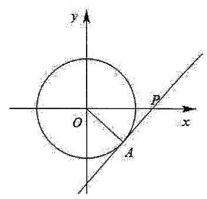

${\left( 2b\right) }^{2} - {2b} \times  {2b}\cos A = 5{b}^{2} - 4{b}^{2}\cos A = \frac{5}{\sin A} - \frac{4\cos A}{\sin A} = \frac{5 - 4\cos A}{\sin A},$

设 $m = \frac{\sin A}{-4\cos A + 5} =  - \frac{1}{4} \times  \left\lbrack  \frac{\sin A}{\cos A - \frac{5}{4}}\right\rbrack$ ,其中 $A \in  \left( {0,\pi }\right)$ ,

因为 $\frac{\sin A}{\cos A - \frac{5}{4}} = \frac{\sin A - 0}{\cos A - \frac{5}{4}}$ 表示点 $P\left( {\frac{5}{4},0}\right)$ 与点 $\left( {\cos A,\sin A}\right)$ 连线的斜率,

如图所示,当过点 $P$ 的直线与半圆相切时,此时斜率最小,

在直角 $\bigtriangleup {OAP}$ 中, ${OA} = 1,{OP} = \frac{5}{4}$ ,可得 ${PA} = \frac{3}{4}$ ,

所以斜率的最小值为 ${k}_{PA} =  - \tan \angle {APO} =  - \frac{4}{3}$ ,

所以 $m$ 的最大值为 $- \frac{1}{4} \times  \left( {-\frac{4}{3}}\right)  = \frac{1}{3}$ ,所以 ${\left| \overrightarrow{BC}\right| }^{2} \geq  3$ ,所以 $\left| \overrightarrow{BC}\right|  \geq  \sqrt{3}$ ,即 ${BC}$ 的最小值为 $\sqrt{3}$ .

53、【答案】 $2\sqrt{3} - 1$

【解析】如图在直角坐标系中,设 $\overrightarrow{c} = \overrightarrow{OC} = \left( {2,0}\right) ,\overrightarrow{a} = \overrightarrow{OA},\overrightarrow{a} - \overrightarrow{c} = \overrightarrow{CA}$ ,

$\because \left| \overrightarrow{c}\right|  = 2\left| {\overrightarrow{a} - \overrightarrow{c}}\right|  = 2,\therefore A$ 的轨迹是以 $C$ 为圆心,1 为半径的圆,

设 $\overrightarrow{b} = \overrightarrow{OB},\overrightarrow{a} + \overrightarrow{b} = \overrightarrow{OE}$ ,

由 $\left| \overrightarrow{a}\right|  = \left| \overrightarrow{b}\right|  = \left| {\overrightarrow{a} + \overrightarrow{b}}\right|$ 可知 $\langle \overrightarrow{a},\overrightarrow{b}\rangle  =  = \angle {AOB} = {120}^{ \circ  }$ ，

设 $\angle {OCA} = \theta ,\angle {AOC} = \alpha ,\angle {BOF} = {60}^{ \circ  } - \alpha$ ,

则 $\left| {CA}\right|  = 1,\left| {CD}\right|  = \cos \theta ,\left| {AD}\right|  = \sin \theta , D\left( {2 - \cos \theta ,0}\right) , A\left( {2 - \cos \theta ,\sin \theta }\right)$ ,

$\sin \alpha  = \frac{\left| AD\right| }{\left| OA\right| } = \frac{\sin \theta }{\left| OA\right| },\cos \alpha  = \frac{\left| OD\right| }{\left| OA\right| } = \frac{2 - \cos \theta }{\left| OA\right| },$

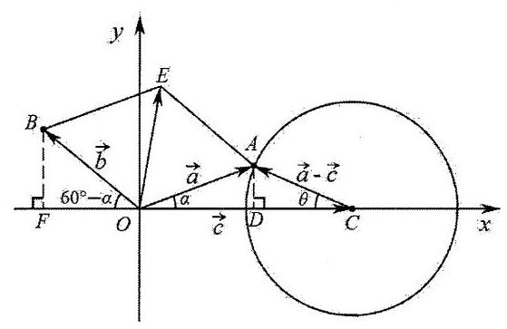

设 $B\left( {{x}_{0},{y}_{0}}\right)$ ,则

${x}_{0} =  - \left| {OA}\right| \cos \left( {{60}^{ \circ  } - \alpha }\right)  =  - \left| {OA}\right|  \cdot  \left( {\frac{1}{2}\cos \alpha  + \frac{\sqrt{3}}{2}\sin \alpha }\right)$

$=  - \left| {OA}\right| \left( {\frac{1}{2} \cdot  \frac{2 - \cos \theta }{\left| OA\right| } + \frac{\sqrt{3}}{2} \cdot  \frac{\sin \theta }{\left| OA\right| }}\right)  =  - \left( {1 + \frac{\sqrt{3}}{2}\sin \theta  - \frac{1}{2}\cos \theta }\right)$ ,

${y}_{0} = \left| {OA}\right|  \cdot  \sin \left( {{60}^{ \circ  } - \alpha }\right)  = \left| {OA}\right| \left( {\frac{\sqrt{3}}{2}\cos \alpha  - \frac{1}{2}\sin \alpha }\right)$

$= \left| {OA}\right| \left( {\frac{\sqrt{3}}{2} \cdot  \frac{2 - \cos \theta }{\left| OA\right| } - \frac{1}{2}\frac{\sin \theta }{\left| OA\right| }}\right)  =  - \left( {\frac{1}{2}\sin \theta  + \frac{\sqrt{3}}{2}\cos \theta  - \sqrt{3}}\right) ,$

$\therefore  - {x}_{0} - 1 = \frac{\sqrt{3}}{2}\sin \theta  - \frac{1}{2}\cos \theta  \Rightarrow  {\left( {x}_{0} + 1\right) }^{2} = \frac{3}{4}{\sin }^{2}\theta  + \frac{1}{4}{\cos }^{2}\theta  - \frac{\sqrt{3}}{2}\sin \theta \cos \theta$ ①

$- {y}_{0} + \sqrt{3} = \frac{1}{2}\sin \theta  + \frac{\sqrt{3}}{2}\cos \theta  \Rightarrow  {\left( {y}_{0} - \sqrt{3}\right) }^{2} = \frac{1}{4}{\sin }^{2}\theta  + \frac{3}{4}{\cos }^{2}\theta  + \frac{\sqrt{3}}{2}\sin \theta \cos \theta$ ②

①+②得: ${\left( {x}_{0} + 1\right) }^{2} + {\left( {y}_{0} - \sqrt{3}\right) }^{2} = 1$ ，

则 $B$ 的轨迹是以 $G\left( {-1,\sqrt{3}}\right)$ 为圆心，1 为半径的圆，

则 $\left| {\overrightarrow{b} - \overrightarrow{c}}\right|  = \left| \overrightarrow{CB}\right|  = \left| {CB}\right|  \geq  \left| {GC}\right|  - 1 = 2\sqrt{3} - 1$ .

54、① $x\overrightarrow{e} \cdot  \overrightarrow{{b}_{1}} + y\overrightarrow{e} \cdot  \overrightarrow{{b}_{2}} = 1$ ；

② $\left( {y\left| x\right|  + x\left| y\right| }\right) \left| {\overrightarrow{{b}_{1}} - \overrightarrow{{b}_{2}}}\right|  = \frac{1}{2}$ ；

③ 存在 $x, y$ ,使得 $\left| {\overrightarrow{{b}_{1}} - \overrightarrow{{b}_{2}}}\right|  = 2$ ;

④ 当 $\left| {\overrightarrow{{b}_{1}} - \overrightarrow{{b}_{2}}}\right|$ 取最小值时, $\overrightarrow{{b}_{1}} \cdot  \overrightarrow{{b}_{2}} = 0$ .

【答案】①③④

【解析】由 $x\overrightarrow{{b}_{1}} + y\overrightarrow{{b}_{2}} = \overrightarrow{e}$ 可得 $\left( {x\overrightarrow{{b}_{1}} + y\overrightarrow{{b}_{2}}}\right)  \cdot  \overrightarrow{e} = \overrightarrow{e} \cdot  \overrightarrow{e} = 1$ ,即 $x\overrightarrow{e} \cdot  \overrightarrow{{b}_{1}} + y\overrightarrow{e} \cdot  \overrightarrow{{b}_{2}} = 1$ ,①正确；

又 $x\overrightarrow{{b}_{1}} + y\overrightarrow{{b}_{2}} = \overrightarrow{e}$ 且 $x + y = 1$ ，则 $x\overrightarrow{{b}_{1}} + \left( {1 - x}\right) \overrightarrow{{b}_{2}} = \overrightarrow{e}$ ，即 $x\left( {\overrightarrow{{b}_{1}} - \overrightarrow{{b}_{2}}}\right)  = \overrightarrow{e} - \overrightarrow{{b}_{2}}$ ，所以 $\left| x\right| \left| {\overrightarrow{{b}_{1}} - \overrightarrow{{b}_{2}}}\right|  = \left| {\overrightarrow{e} - \overrightarrow{{b}_{2}}}\right|$ ，

又 $\left| {\overrightarrow{e} - {\overrightarrow{b}}_{2}}\right|  = \overrightarrow{e} \cdot  {\overrightarrow{b}}_{2}$ ,则 $\left| x\right| \left| {{\overrightarrow{b}}_{1} - {\overrightarrow{b}}_{2}}\right|  = \left| {\overrightarrow{e} - {\overrightarrow{b}}_{2}}\right|  = \overrightarrow{e} \cdot  {\overrightarrow{b}}_{2}$ ,同理 $\left| y\right| \left| {{\overrightarrow{b}}_{1} - {\overrightarrow{b}}_{2}}\right|  = \left| {\overrightarrow{e} - {\overrightarrow{b}}_{1}}\right|  = \overrightarrow{e} \cdot  {\overrightarrow{b}}_{1}$ ,

则 $y\left| x\right| \left| {\overrightarrow{{b}_{1}} - \overrightarrow{{b}_{2}}}\right|  + x\left| y\right| \left| {\overrightarrow{b} - \overrightarrow{{b}_{2}}}\right|  = y\overrightarrow{e} \cdot  \overrightarrow{{b}_{1}} + x\overrightarrow{e} \cdot  \overrightarrow{b} = 1$ ,即 $\left( {y\left| x\right|  + x\left| y\right| }\right) \left| {\overrightarrow{{b}_{1}} - \overrightarrow{{b}_{2}}}\right|  = 1$ ,② 错误;

由 $x + y = 1$ 知 $x, y$ 至少一正,若 $x, y$ 一正一负,则 $y\left| x\right|  + x\left| y\right|  = 0$ ,显然不满足 $\left( {y\left| x\right|  + x\left| y\right| }\right) \left| {\overrightarrow{{b}_{1}} - \overrightarrow{{b}_{2}}}\right|  = 1$ ,

故 $x, y$ 均为正,则 $y\left| x\right|  + x\left| y\right|  = {2xy} \leq  2 \cdot  {\left( \frac{x + y}{2}\right) }^{2} = \frac{1}{2}$ ,当且仅当 $x = y = \frac{1}{2}$ 时等号成立,

则 $\left| {\overrightarrow{{b}_{1}} - \overrightarrow{{b}_{2}}}\right|  = \frac{1}{y\left| x\right|  + x\left| y\right| } \geq  2$ ,

当且仅当 $x = y = \frac{1}{2}$ 时等号成立,则存在 $x, y$ ,使得 $\left| {\overrightarrow{{b}_{1}} - \overrightarrow{{b}_{2}}}\right|  = 2$ ,③正确;

当 $\left| {\overrightarrow{{b}_{1}} - \overrightarrow{{b}_{2}}}\right|$ 取最小值 2 时, $x = y = \frac{1}{2}$ ,由 $x\overrightarrow{{b}_{1}} + y\overrightarrow{{b}_{2}} = \overrightarrow{e}$ 可得 $\overrightarrow{{b}_{1}} + \overrightarrow{{b}_{2}} = 2\overrightarrow{e}$ ,则 ${\left( \overrightarrow{{b}_{1}} + \overrightarrow{{b}_{2}}\right) }^{2} = 4$ ,

即 ${\left( \overrightarrow{{b}_{1}} - \overrightarrow{{b}_{2}}\right) }^{2} + 4\overrightarrow{{b}_{1}} \cdot  \overrightarrow{{b}_{2}} = 4$ ,则 $\overrightarrow{{b}_{1}} \cdot  \overrightarrow{{b}_{2}} = 0$ ,④正确.

故答案为:①③④.

55、【答案】 $\frac{1}{4}$

【解析】在平面直角坐标系中,令 $\overrightarrow{{e}_{1}} = \left( {1,0}\right)$ ,设 $\overrightarrow{{e}_{2}} = \left( {\cos \theta ,\sin \theta }\right)$ ,则 $\overrightarrow{{e}_{3}} = \left( {-1 - \cos \theta , - \sin \theta }\right)$ , ${\left| \overrightarrow{{e}_{3}}\right| }^{2} = 2 + 2\cos \theta  = 1$ ,解得 $\cos \theta  =  - \frac{1}{2}$ ,则 $\sin \theta  =  \pm  \frac{1}{2}$ ,

依题意,不妨令 $\overrightarrow{{e}_{2}} = \left( {-\frac{1}{2},\frac{\sqrt{3}}{2}}\right) ,\overrightarrow{{e}_{3}} = \left( {-\frac{1}{2}, - \frac{\sqrt{3}}{2}}\right)$ ,

而 $z = 1 - x - y$ ,则 $x\overrightarrow{{e}_{1}} + y\overrightarrow{{e}_{2}} + z\overrightarrow{{e}_{3}} = \left( {\frac{3}{2}x - \frac{1}{2},\frac{\sqrt{3}}{2}x + \sqrt{3}y - \frac{\sqrt{3}}{2}}\right)$ ,

有 ${\left| x\overrightarrow{{e}_{1}} + y\overrightarrow{{e}_{2}} + z\overrightarrow{{e}_{3}}\right| }^{2} = {\left( \frac{3}{2}x - \frac{1}{2}\right) }^{2} + {\left( \frac{\sqrt{3}}{2}x + \sqrt{3}y - \frac{\sqrt{3}}{2}\right) }^{2} = \frac{1}{12}\left\lbrack  {{\left( -\sqrt{3}\right) }^{2} + {3}^{2}}\right\rbrack  {\left\lbrack  {\left( \frac{3}{2}x - \frac{1}{2}\right) }^{2} + {\left( \frac{\sqrt{3}}{2}x + \sqrt{3}y\frac{\sqrt{3}}{2}\right) }^{2}\right) }^{2}$

$\geq  \frac{1}{12}{\left\lbrack  \left( -\sqrt{3}\right) \left( \frac{3}{2}x - \frac{1}{2}\right)  + 3\left( \frac{\sqrt{3}}{2}x + \sqrt{3}y - \frac{\sqrt{3}}{2}\right) \right\rbrack  }^{2} = \frac{1}{12}{\left( 3\sqrt{3}y - \sqrt{3}\right) }^{2} = \frac{1}{4}{\left( 3y - 1\right) }^{2},$

当且仅当 $\frac{\frac{3}{2}x - \frac{1}{2}}{-\sqrt{3}} = \frac{\frac{\sqrt{3}}{2}x + \sqrt{3}y - \frac{\sqrt{3}}{2}}{3}$ ,即 ${2x} + y = 1$ 时取“=”,

而 $0 \leq  x \leq  \frac{1}{2} \leq  y \leq  1$ ,则 ${\left( 3y - 1\right) }^{2} \geq  \frac{1}{4}$ ,当且仅当 $y = \frac{1}{2}$ 时取 “=”,

因此, ${\left| x\overrightarrow{{e}_{1}} + y\overrightarrow{{e}_{2}} + z\overrightarrow{{e}_{3}}\right| }^{2} \geq  \frac{1}{4}{\left( 3y - 1\right) }^{2} \geq  \frac{1}{16}$ ,当且仅当 ${2x} + y = 1$ 且 $y = \frac{1}{2}$ ,即 $x = \frac{1}{4}$ 且 $y = \frac{1}{2}$ 时取“=”, 所以当 $x = \frac{1}{4}, y = \frac{1}{2}, z = \frac{1}{4}$ 时, $\left| {x\overrightarrow{{e}_{1}} + y\overrightarrow{{e}_{2}} + z\overrightarrow{{e}_{3}}}\right|$ 取得最小值 $\frac{1}{4}$ .

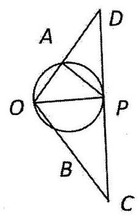

56、【答案】 $\frac{\sqrt{6}}{3}$

【解析】由 $\left| \overrightarrow{a}\right|  = \left| {\overrightarrow{a} + \overrightarrow{b}}\right|$ 得 ${\left| \overrightarrow{a}\right| }^{2} = {\left| \overrightarrow{a}\right| }^{2} + {\left| \overrightarrow{b}\right| }^{2} + 2\overrightarrow{a} \cdot  \overrightarrow{b}$ ,又 $\left| \overrightarrow{a}\right|  = 1,\overrightarrow{a} \cdot  \overrightarrow{b} =  - \frac{1}{2}$ 则 $\left| \overrightarrow{b}\right|  = 1$ 由 $\overrightarrow{a} \cdot  \overrightarrow{b} =  - \frac{1}{2}$ ，可知 $\langle \overrightarrow{a},\overrightarrow{b}\rangle  = \frac{2}{3}\pi$ ，即向量 $\overrightarrow{a},\overrightarrow{b}$ 满足 $\left| \overrightarrow{a}\right|  = \left| \overrightarrow{b}\right|  = 1$ ，且夹角为 $\frac{2}{3}\pi$ 取 $\overrightarrow{OA} = \overrightarrow{a},\overrightarrow{OB} = \overrightarrow{b},\overrightarrow{OP} = \overrightarrow{p}, A, B$ 分别是线段 ${OD},{OC}$ 的中点,

则 ${OD} = {OC} = {2OA} = {2OB} = 2,\angle {COD} = \frac{2}{3}\pi ,{CD} = 2\sqrt{3}$

由 $\overrightarrow{p} = \left( {2 - \lambda }\right) \overrightarrow{a} + \lambda \overrightarrow{b}$ 可知,点 $P$ 在直线 ${CD}$ 上. 又 $\overrightarrow{p}$ 与 $\overrightarrow{p} - \overrightarrow{a}$ 的夹角为 $\angle {APO}$

要使得 $\angle {APO}$ 最大,则取圆过点 $\mathrm{A}\text{ 、 }O$ 且与直线 ${CD}$ 相切于点 $P$ ,此时 $\angle {APO}$ 取得最大,由切割线定理得 ${\left| DP\right| }^{2} = \left| {DA}\right|  \cdot  \left| {DO}\right|  = 2$ ,

又 $\overrightarrow{OP} = \left( {2 - \lambda }\right) \overrightarrow{OA} + \lambda \overrightarrow{OB} = \frac{2 - \lambda }{2}\overrightarrow{OD} + \frac{\lambda }{2}\overrightarrow{OC} = \frac{2 - \lambda }{2}\overrightarrow{OD} + \frac{\lambda }{2}\left( {\overrightarrow{OD} + \overrightarrow{DC}}\right)  = \overrightarrow{OD} + \frac{\lambda }{2}\overrightarrow{DC}$ ,

则有, $\frac{\lambda }{2} = \frac{\left| DP\right| }{\left| CD\right| } = \frac{\sqrt{2}}{2\sqrt{3}}$ ,解之得 $\lambda  = \frac{\sqrt{6}}{3}$

57、【答案】B

【解析】对于(1): 由题意,若存在无穷数列 $\left\{  {a}_{n}\right\}$ 满足要求,则数列 $\left\{  {a}_{n}\right\}$ 包含1,2,3三项,

不妨令 ${a}_{{n}_{1}} = 1,{a}_{{n}_{2}} = 2,{a}_{{n}_{3}} = 3$ ,符合题意,但若只取出 ${a}_{{n}_{1}} = 1,{a}_{{n}_{2}} = 3$ ,

这两项不是数列 $1,2,3,\cdots , n,\cdots$ 的连续两项,不合题意,

故数列 $1,2,3,\cdots , n,\cdots$ 不是某个数列的“衍生数列”,(1)为假命题;

对于(2):定义 ${y}_{n} = \left\{  {\left( {{x}_{1},{x}_{2},\cdots ,{x}_{n}}\right)  \mid  {x}_{i} \in  \{ 0,1\} , i = 1,2,\cdots , n}\right\}  , A = \left\{  {{y}_{1},{y}_{2},{y}_{3},\cdots }\right\}$ ，

当数列 $\left\{  {a}_{n}\right\}$ 按照集合 $\mathrm{A}$ 的元素特征进行排序,

例如 $\left( 0\right) ,\left( 1\right) ,\left( {0,0}\right) ,\left( {0,1}\right) ,\left( {1,0}\right) ,\left( {1,1}\right) ,\left( {0,0,0}\right) ,\left( {0,1,0}\right) ,\left( {0,0,1}\right) ,\left( {1,0,0}\right) ,\cdots$ 时,

满足 $\left\{  {a}_{n}\right\}$ 各项均为 0 或 1,任意 $n$ 个 0 和 1 的组合均为集合 ${y}_{n}$ 的元素,即在数列 $\left\{  {a}_{n}\right\}$ 中均有对应,

可知 $\left\{  {a}_{n}\right\}$ 是自身的“衍生数列”，但是数列 $\left\{  {a}_{n}\right\}$ 从某一项起不是常数列，(2)为假命题.

综上, (1) (2)均为假命题，故选:B

58、【答案】D

【解析】对于①,设 $f\left( x\right)  = 1$ ,满足 $f\left( {x}_{0}\right)$ 是 $f\left( x\right)$ 在区间 $\left\lbrack  {a, b}\right\rbrack$ 上的最大值,但 ${x}_{0}$ 不是 $f\left( x\right)$ 在区间 $\left\lbrack  {a, b}\right\rbrack$ 上的一个 $M$ 点,①错误;

对于②,设 $f\left( x\right)  = \left\{  \begin{array}{l} {2}^{x}, x \in  Q \\  0, x \notin  Q \end{array}\right.$ ,对于区间 $\left\lbrack  {a, b}\right\rbrack$ ,令 $b$ 为有理数,满足对任意 $x \in  \left\lbrack  {a, b}\right\rbrack  \left( {x \neq  b}\right)$ 都成立 $f\left( x\right)  < f\left( b\right)$ ,故 $b$ 为区间 $\left\lbrack  {a, b}\right\rbrack$ 上的一个 $M$ 点,

但 $f\left( x\right)$ 在 $\mathbf{R}$ 上不是严格增函数,故②错误.

故选: D

59、【答案】D

【解析】对于 $\mathrm{A}$ ,令 $f\left( x\right)  = 1 - \ln x = x\left( {x > 0}\right)$ ,即 $x + \ln x - 1 = 0$ .

因为 $y = x + \ln x - 1$ 满足 ${y}^{\prime } = 1 + \frac{1}{x} > 0$ ,所以 $y = x + \ln x - 1$ 在区间 $\left( {0, + \infty }\right)$ 上严格递增,

所以 $f\left( x\right)$ 不可能为“ 3 型不动点”函数，故 A 错误；

对于 $\mathrm{B}$ ,令 $f\left( x\right)  = 5 - \ln x - {\mathrm{e}}^{x} = x$ ,即 $x + \ln x + {\mathrm{e}}^{x} - 5 = 0$ .

易判断 $y = x + \ln x + {\mathrm{e}}^{x} - 5$ 在区间 $\left( {0, + \infty }\right)$ 上严格递增,

所以 $f\left( x\right)$ 不可能为“ 3 型不动点”函数,故 $\mathrm{B}$ 错误;

对于 $\mathrm{C}$ ,由 $f\left( x\right)  = \frac{4{\mathrm{e}}^{x - 2}}{x}$ ,得 ${f}^{\prime }\left( x\right)  = \frac{4\left( {x - 1}\right) {\mathrm{e}}^{x - 2}}{{x}^{2}}$ ,

易知当 $x < 0$ 时, ${f}^{\prime }\left( x\right)  < 0, f\left( x\right)$ 严格递减,且 $f\left( x\right)  < 0$ ,所以当 $x < 0$ 时, $f\left( x\right)  = \frac{4{\mathrm{e}}^{x - 2}}{x}$ 的图象与直线 $y = x$ 有且只有一个交点;

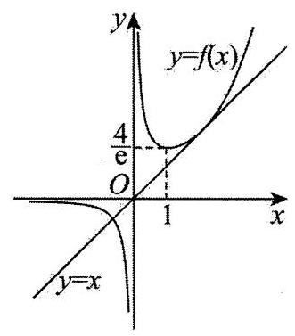

当 $0 < x < 1$ 时, ${f}^{\prime }\left( x\right)  < 0, f\left( x\right)$ 严格递减,且 $f\left( 1\right)  = \frac{4}{\mathrm{e}} > 1$ ;

当 $x > 1$ 时, ${f}^{\prime }\left( x\right)  > 0, f\left( x\right)$ 严格递增.

令 ${f}^{\prime }\left( x\right)  = 1$ ,得 $\frac{4\left( {x - 1}\right) {\mathrm{e}}^{x - 2}}{{x}^{2}} = 1$ ,解得 $x = 2$ ,此时 $f\left( 2\right)  = 2$ ,

所以直线 $y = x$ 与曲线 $f\left( x\right)  = \frac{4{\mathrm{e}}^{x - 2}}{x}$ 相切于点 $\left( {2,2}\right)$ .

所以直线 $y = x$ 与曲线 $f\left( x\right)  = \frac{4{\mathrm{e}}^{x - 2}}{x}$ 共有两个交点,

所以 $f\left( x\right)$ 为“2 型不动点”函数,故 $\mathrm{C}$ 错误;

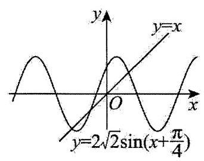

对于 $\mathrm{D}, f\left( x\right)  = 2\sin x + 2\cos x = 2\sqrt{2}\sin \left( {x + \frac{\pi }{4}}\right)$ ,作出 $f\left( x\right)$ 的图象,如图所示.

易知其与直线 $y = x$ 有且只有三个不同的交点,

即 $2\sin x + 2\cos x = x$ 有三个不同的解,

所以 $f\left( x\right)  = 2\sin x + 2\cos x$ 为“3 型不动点”函数,故 D 正确.

故选: D.

60、【答案】D

【解析】①若 ${P}_{i} = \frac{1}{n}\left( {i = 1,2,\cdots , n}\right)$ ,则 $H\left( x\right)  =  - \mathop{\sum }\limits_{{i = 1}}^{n}\frac{1}{n}{\log }_{2}\frac{1}{n} =  - n \cdot  \frac{1}{n}{\log }_{2}\frac{1}{n} = {\log }_{2}n$ ,故①正确；

② 假设 $n \geq  2$ ,因为 $P\left( {X = i}\right)  = {p}_{i} > 0\left( {i = 1,2,\cdots , n}\right) ,\mathop{\sum }\limits_{{i = 1}}^{n}{p}_{i} = 1$ ,所以 $0 < {p}_{i} < 1$ ,

所以 ${p}_{i}{\log }_{2}{p}_{i} < 0\left( {i = 1,2,\cdots , n}\right)$ ,所以 $H\left( x\right)  =  - \mathop{\sum }\limits_{{i = 1}}^{n}{p}_{i}{\log }_{2}{p}_{i} > 0$ ,

这与 $H\left( x\right)  = 0$ 矛盾,所以假设不成立,

而当 $n = 1$ 时,易得 $H\left( x\right)  = 0$ ,所以 $n = 1$ ,故②正确；

③若 $n = 2$ ，则 ${p}_{1} + {p}_{2} = 1$ ，

$H\left( x\right)  =  - \left( {{p}_{1}{\log }_{2}{p}_{1} + {p}_{2}{\log }_{2}{p}_{2}}\right)  =  - \left\lbrack  {{p}_{1}{\log }_{2}{p}_{1} + \left( {1 - {p}_{1}}\right)  \cdot  {\log }_{2}\left( {1 - {p}_{1}}\right) }\right\rbrack  ,$

设 $f\left( p\right)  =  - \left\lbrack  {p{\log }_{2}p + \left( {1 - p}\right) {\log }_{2}\left( {1 - p}\right) }\right\rbrack  ,\;0 < p < 1$ ,

则 ${f}^{\prime }\left( p\right)  =  - \left\lbrack  {{\log }_{2}p + p \cdot  \frac{1}{p\ln 2} - {\log }_{2}\left( {1 - p}\right)  + \left( {1 - p}\right)  \cdot  \frac{-1}{\left( {1 - p}\right) \ln 2}}\right\rbrack   =  - {\log }_{2}\frac{p}{1 - p}$ ,

令 ${f}^{\prime }\left( p\right)  < 0$ ,得 $\frac{p}{1 - p} > 1$ ,解得 $\frac{1}{2} < p < 1$ ,此时函数 $f\left( p\right)$ 严格递减,

令 ${f}^{\prime }\left( p\right)  > 0,0 < \frac{p}{1 - p} < 1$ ,解得 $0 < p < \frac{1}{2}$ ,此时函数 $f\left( p\right)$ 严格递增,

所以当 $p = \frac{1}{2}$ 时 $f\left( p\right)$ 最大,所以当 ${p}_{1} = \frac{1}{2}$ 时, $H\left( x\right)$ 取得最大值,故③正确;

④由题意知, $P\left( {Y = 1}\right)  = {p}_{1} + {p}_{2m}, P\left( {Y = 2}\right)  = {p}_{2} + {p}_{{2m} - 1}, P\left( {Y = 3}\right)  = {p}_{3} + {p}_{{2m} - 2},\ldots , P\left( {Y = m}\right)  = {p}_{m} + {p}_{m + 1}$ ,

$\therefore H\left( Y\right)  =  - \left\lbrack  {\left( {{p}_{1} + {p}_{2m}}\right) {\log }_{2}\left( {{p}_{1} + {p}_{2m}}\right)  + \cdots  + \left( {{p}_{m} + {p}_{m + 1}}\right) {\log }_{2}\left( {{p}_{m} + {p}_{m + 1}}\right) }\right\rbrack$ ,

又 $H\left( X\right)  =  - \left( {{p}_{1}{\log }_{2}{p}_{1} + {p}_{2}{\log }_{2}{p}_{2} + \cdots  + {p}_{m}{\log }_{2}{p}_{m} + \cdots  + {p}_{2m}\log {p}_{2m}}\right)$ ,

$\therefore H\left( Y\right)  - H\left( X\right)  = {p}_{1}{\log }_{2}\frac{{p}_{1}}{{p}_{1} + {p}_{2m}} + {p}_{2}{\log }_{2}\frac{{p}_{2}}{{p}_{2} + {p}_{{2m} - 4}} + \cdots  + {p}_{2m}{\log }_{2}\frac{{p}_{2m}}{{p}_{m} + {p}_{1}}$ ,

又 $\frac{{p}_{1}}{{p}_{1} + {p}_{2m}} < 1,\;\frac{{p}_{2}}{{p}_{2} + {p}_{{2m} - 1}} < 1,\cdots ,\;\frac{{p}_{2m}}{{p}_{1} + {p}_{2m}} < 1$ ,

$\therefore H\left( Y\right)  - H\left( X\right)  < 0,\therefore H\left( X\right)  > H\left( Y\right)$ ,故④正确.

综上, 正确说法的序号为①②③④, 故选: D.

61、【答案】B

【解析】依题意, ${F}_{x}\left( {x, y}\right)  = \mathop{\lim }\limits_{{{\Delta x} \rightarrow  0}}\frac{\Delta z}{\Delta x} = \mathop{\lim }\limits_{{{\Delta x} \rightarrow  0}}\left\lbrack  \frac{{\left( x + \Delta x\right) }^{2} + {y}^{2} - \left( {x + {\Delta x}}\right) y - {x}^{2} - {y}^{2} + {xy}}{\Delta x}\right\rbrack \; = \mathop{\lim }\limits_{{{\Delta x} \rightarrow  0}}\left( {{2x} - y + {\Delta x}}\right)  = {2x} - y,$

同理可求得 ${F}_{y}\left( {x, y}\right)  = {2y} - x$ ,所以 ${F}_{x}\left( {x, y}\right)  + {F}_{y}\left( {x, y}\right)  = x + y$ ,设 $z = x + y$ ,

则 $y =  - x + z$ ,由 $F\left( {x, y}\right)  = {x}^{2} + {y}^{2} - {xy} = 1$ ,

得 ${x}^{2} + {\left( -x + z\right) }^{2} - x\left( {-x + z}\right)  - 1 = 0$ ,

$3{x}^{2} - {3zx} + {z}^{2} - 1 = 0$ ,此方程有解,所以 $\Delta  = 9{z}^{2} - {12}\left( {{z}^{2} - 1}\right)  =  - 3{z}^{2} + {12} \geq  0$ ,

${z}^{2} \leq  4, - 2 \leq  z \leq  2$ ,故选: B

62、【答案】B

【解析】题设等价于对于任意 $x \in  \left\lbrack  {0,1}\right\rbrack$ ,均存在 $i, j \in  \mathbf{Z},0 \leq  i \leq  j \leq  {255}$ ,使得 $\left| {x - \frac{i}{j}}\right|  \leq  C$ ,将 $\frac{i}{j}$ 在数轴上表示如下:

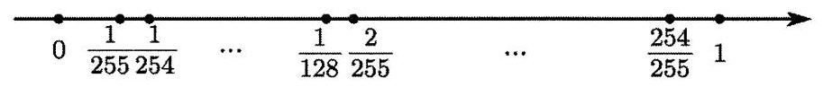

当 $x$ 与上述数轴上的点重合时,易得存在 $i, j \in  \mathbf{Z},0 \leq  i \leq  j \leq  {255}$ 使得 $x - \frac{i}{j} = 0$ ,又 $C$ 为正实数,则 $\left| {x - \frac{i}{j}}\right|  \leq  C$ 成立;

当 $x$ 与上述数轴上的点不重合时,假设在相邻的两个点 $\frac{{i}_{1}}{{j}_{1}},\frac{{i}_{2}}{{j}_{2}}$ 之间,则 $\left| {x - \frac{{i}_{1}}{{j}_{1}}}\right|  \leq  \frac{1}{2}\left| {\frac{{i}_{2}}{{j}_{2}} - \frac{{i}_{1}}{{j}_{1}}}\right|$ ,当且仅当 $x$ 在相邻的两个点 $\frac{{i}_{1}}{{j}_{1}},\frac{{i}_{2}}{{j}_{2}}$ 中点时取等,

要使对于任意 $x \in  \left\lbrack  {0,1}\right\rbrack$ ,均存在 $i, j \in  \mathbf{Z},0 \leq  i \leq  j \leq  {255}$ ,使得 $\left| {x - \frac{i}{j}}\right|  \leq  C$ ,则有 $C \geq  \frac{1}{2}\left| {\frac{{i}_{2}}{{j}_{2}} - \frac{{i}_{1}}{{j}_{1}}}\right|$ ,

又数轴上所有相邻的两个点之间距离最大为 $\frac{1}{255} - 0 = 1 - \frac{254}{255} = \frac{1}{255}$ ,此时 $x$ 在相邻的两个点 $0,\frac{1}{255}$ 或 $\frac{254}{255},1$ 中点,则 $C \geq  \frac{1}{2} \times  \frac{1}{255} = \frac{1}{510}$ .

以下说明数轴上所有相邻的两个点之间距离最大为 $\frac{1}{255}$ ,易得数轴上 $\frac{k}{255},\frac{k + 1}{255}\left( {k \in  \mathbf{Z},0 \leq  k \leq  {254}}\right)$ 两点之间的距离为 $\frac{1}{255}$ ,

当 $k = 0$ 或 $k = {254},0,\frac{1}{255}$ 和 $\frac{254}{255},1$ 为相邻的两点,之间的距离为 $\frac{1}{255}$ ; 当 $1 \leq  k \leq  {253}$ 时,则 $\frac{k}{255} < \frac{k}{254} < \frac{k + 1}{255}$ ,

即 $\frac{k}{255},\frac{k + 1}{255}$ 之间必存在点 $\frac{k}{254}$ ,可得相邻的两点之间的距离小于 $\frac{1}{255}$ ,综上可得数轴上所有相邻的两个点之间距离最大为 $\frac{1}{255}$ .

故 $\lambda  = \frac{1}{510}$ ,故 $\frac{1}{1000} < \lambda  < \frac{1}{500}$ ,故选: B.

63、【答案】A

【解析】如图,因为 $\overrightarrow{DC} = \overrightarrow{DB} + \overrightarrow{BC}$ ,

由 $\left| {\overrightarrow{DC} - t \cdot  \overrightarrow{DB}}\right|  \geq  \left| \overrightarrow{BC}\right|$ 可得 $\left| {\overrightarrow{DB} + \overrightarrow{BC} - t \cdot  \overrightarrow{DB}}\right|  \geq  \left| \overrightarrow{BC}\right|$ ,即 $\left| {\overrightarrow{BC} + \left( {1 - t}\right)  \cdot  \overrightarrow{DB}}\right|  \geq  \left| \overrightarrow{BC}\right|$ ,

两边平方得 ${\overrightarrow{BC}}^{2} + 2\left( {1 - t}\right) \overrightarrow{BC} \cdot  \overrightarrow{DB} + {\left( 1 - t\right) }^{2}{\overrightarrow{DB}}^{2} \geq  {\overrightarrow{BC}}^{2}$ ,

化简得 $2\left( {1 - t}\right) \overrightarrow{BC} \cdot  \overrightarrow{DB} + {\left( 1 - t\right) }^{2}{\overrightarrow{DB}}^{2} \geq  0$ ,

又 $\overrightarrow{BC} \cdot  \overrightarrow{DB} =  - \overrightarrow{BC} \cdot  \overrightarrow{BD} =  - \left| \overrightarrow{BC}\right|  \cdot  \overrightarrow{BD}\cos \angle {CBD} =  - {\overrightarrow{BD}}^{2}\cos \angle {CBL}$ ，令 $\cos \angle {CBD} = m$ ，

可得 $- 2\left( {1 - t}\right) m{\left| \overrightarrow{BD}\right| }^{2} + {\left( 1 - t\right) }^{2}{\left| \overrightarrow{DB}\right| }^{2} \geq  0$ ,即 $- 2\left( {1 - t}\right) m + {\left( 1 - t\right) }^{2} \geq  0$ ,

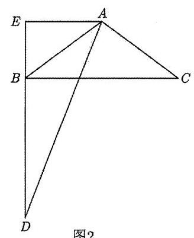

整理得 ${t}^{2} + \left( {{2m} - 2}\right) t + 1 - {2m} \geq  0$ 对任意 $t \in  R$ 恒成立,

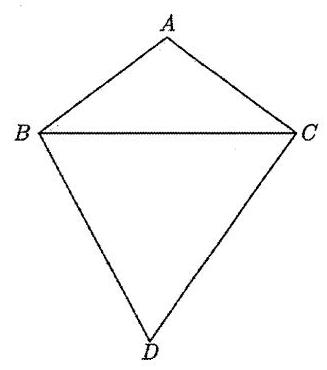

图 1

故 $\Delta  = {\left( 2m - 2\right) }^{2} - 4\left( {1 - {2m}}\right)  \leq  0$ ,整理得 ${m}^{2} \leq  0$ ,

即 $m = 0$ ,即 $\cos \angle {CBD} = 0$ ,故 $\angle {CBD} = \frac{\pi }{2}$ ,

要使 $\left| \overrightarrow{AD}\right|$ 最大,显然 $D$ 在 ${BC}$ 下方,

如图 2 所示,设 $\angle {ABC} = \theta ,0 < \theta  < \frac{\pi }{2}$ ,

过 $\mathrm{A}$ 作 ${BD}$ 的垂线交 ${BD}$ 的延长线于 $E$ ,由 $\angle {EAB} = \angle {ABC} = \theta$

可得 ${AE} = {AB} \cdot  \cos \theta  = \cos \theta ,{BE} = {AB} \cdot  \sin \theta  = \sin \theta$ ,

又 ${BD} = {BC} = {2AE} = 2\cos \theta$ ,故 ${AD} = \sqrt{{\left( 2\cos \theta  + \sin \theta \right) }^{2} + {\cos }^{2}\theta } = \sqrt{4{\cos }^{2}\theta  + 4\sin \theta \cos \theta  + 1}$

$= \sqrt{4 \cdot  \frac{1 + \cos {2\theta }}{2} + 4 \cdot  \frac{\sin {2\theta }}{2} + 1} = \sqrt{2\cos {2\theta } + 2\sin {2\theta } + 3} = \sqrt{2\sin \left( {{2\theta } + \frac{\pi }{4}}\right) 3}$ ,又

$0 < \theta  < \frac{\pi }{2},\frac{\pi }{4} < {2\theta } + \frac{\pi }{4} < \frac{5\pi }{4},$

可得当 ${2\theta } + \frac{\pi }{4} = \frac{\pi }{2}$ ，即 $\theta  = \frac{\pi }{8}$ 时， ${AD}$ 有最大值，最大值为 $\sqrt{2\sqrt{2} + 3} = \sqrt{{\left( \sqrt{2} + 1\right) }^{2}} = \sqrt{2} + 1$ ， 故 $\left| \overrightarrow{AD}\right|$ 的最大值为 $1 + \sqrt{2}$ ，故选:A.

64、【答案】B

【解析】设 $\overrightarrow{m} = \left( {{a}_{1},{a}_{2}}\right) ,\overrightarrow{n} = \left( {{a}_{3},{a}_{4}}\right)  \Rightarrow  f = {\left| \overrightarrow{m}\right| }^{2} + {\left| \overrightarrow{n}\right| }^{2} + \overrightarrow{m} \cdot  \overrightarrow{n}$ ,记 $\cos \theta  = \frac{\overrightarrow{m} \cdot  \overrightarrow{n}}{\left| \overrightarrow{m}\right| \left| \overrightarrow{n}\right| }$ ,

则 ${S}_{\Delta } = \frac{1}{2}\left| \overrightarrow{m}\right| \left| \overrightarrow{n}\right| \sin \theta  = \frac{1}{2}\left| \overrightarrow{m}\right| \left| \overrightarrow{n}\right| \sqrt{1 - {\cos }^{2}\theta } = \cdots  = \frac{1}{2}a{a}_{4} - a{a}_{3} = \frac{1}{2} \Rightarrow$

$\left| \overrightarrow{m}\right| \left| \overrightarrow{n}\right|  = \frac{1}{\sin \theta } \Rightarrow  f \geq  2\left| \overrightarrow{m}\right| \left| \overrightarrow{n}\right|  + \overrightarrow{m} \cdot  \overrightarrow{n} = \frac{2}{\sin \theta } + \frac{\cos \theta }{\sin \theta } \geq  \sqrt{3}$ (利用三角函数的有界性)

65、【答案】A

【解析】如图所示: 直线 ${BC}$ 为 $n$ ,点 $B$ 在平面 $\alpha$ 的投影为 $O$ ,

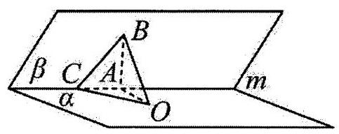

作 ${BA} \bot  m$ 于 $\mathrm{A}$ ,连接 ${OA},{OC}$ .

则 $\angle {BCA} = \angle {BAO} = {\theta }_{1},\angle {BCO} = {\theta }_{2}$ ,

设 ${AB} = a$ ,则 ${BC} = \frac{a}{\sin {\theta }_{1}},{BO} = a\sin {\theta }_{1}$ .

$\sin {\theta }_{2} = \frac{BO}{BC} = \frac{a\sin {\theta }_{1}}{\frac{a}{\sin {\theta }_{1}}}$ ,即 ${\sin }^{2}{\theta }_{1} = \sin {\theta }_{2}$ .

当 $0 < {\theta }_{1} < \frac{\pi }{6}$ 时,则 $\sin {\theta }_{1} - \sin 2{\theta }_{2} = \sin {\theta }_{1} - 2\sin {\theta }_{2}\cos {\theta }_{2} \geq  \sin {\theta }_{1} - 2{\sin }^{2}{\theta }_{1}$

$= \sin {\theta }_{1}\left( {1 - 2\sin {\theta }_{1}}\right)  > 0$ ,故 $\sin {\theta }_{1} > \sin 2{\theta }_{2}$ ,易知 $0 < {\theta }_{2} < {\theta }_{1} < \frac{\pi }{6}$ ,故 ${\theta }_{1} > 2{\theta }_{2},\mathrm{\;A}$ 正确;

当 $\frac{\pi }{6} < {\theta }_{1} < \frac{\pi }{4}$ 时,要证 $\tan {\theta }_{1} > 2\tan {\theta }_{2}$ ,即 $\frac{{\sin }^{2}{\theta }_{1}}{1 - {\sin }^{2}{\theta }_{1}} > \frac{4{\sin }^{4}{\theta }_{2}}{1 - {\sin }^{4}{\theta }_{2}}$ ,即 ${\sin }^{2}{\theta }_{1} < \frac{1}{3}$ ,不恒成立,故 $B$ 错误;

当 $\frac{\pi }{4} < {\theta }_{1} < \frac{\pi }{3}$ 时,则 $\sin {\theta }_{2} = {\sin }^{2}{\theta }_{1} < \sin {\theta }_{1}$ ,故 $C$ 错误;

当 $\frac{\pi }{3} < {\theta }_{1} < \frac{\pi }{2}$ 时,要证 $\cos {\theta }_{1} > \frac{3}{4}\cos {\theta }_{2}$ ,即 $1 - {\sin }^{2}{\theta }_{1} > \frac{9}{16}\left( {1 - {\sin }^{2}{\theta }_{2}}\right)$ ,即 ${\sin }^{2}{\theta }_{1} < \frac{7}{9}$ ,不恒成立,故 $D$ 错误;

故选: A.

66、【答案】B

【解析】取线段 ${F}_{2}P$ 的中点 $E$ ,连接 ${F}_{1}E$ ,

因为 $\left( {\overrightarrow{{F}_{2}F} + \overrightarrow{{F}_{1}{F}_{2}}}\right)  \cdot  \overrightarrow{{F}_{2}F} = 0$ ,所以 ${F}_{1}E \bot  {F}_{2}P$ ,

故三角形 $P{F}_{1}{F}_{2}$ 为等腰三角形,且 $\left| {{F}_{1}P}\right|  = \left| {{F}_{1}{F}_{2}}\right|  = {2c}$ .

在 ${\mathrm{{Rt}}}_{ \bigtriangleup  }{F}_{1}E{F}_{2}$ 中， $\cos \angle {F}_{1}{F}_{2}E = \frac{\left| {F}_{2}E\right| }{\left| {F}_{1}{F}_{2}\right| } = \frac{\frac{a}{2}}{2c} = \frac{a}{4c}$ ,

连接 ${F}_{1}Q$ ,又 $\left| {{F}_{2}Q}\right|  = \frac{a}{5}$ ,点 $Q$ 在双曲线 $C$ 上,

所以由双曲线的定义可得, $\left| {Q{F}_{1}}\right|  - \left| {Q{F}_{2}}\right|  = {2a}$ ,故 $\left| {Q{F}_{1}}\right|  = {2a} + \frac{a}{5} = \frac{11a}{5}$ .

在 $\bigtriangleup  {F}_{1}Q{F}_{2}$ 中,由余弦定理得,

$\cos \angle {F}_{1}{F}_{2}Q = \frac{{\left| {F}_{1}{F}_{2}\right| }^{2} + {\left| {F}_{2}Q\right| }^{2} - {\left| {F}_{1}Q\right| }^{2}}{2\left| {{F}_{1}{F}_{2}}\right|  \cdot  \left| {{F}_{2}Q}\right| } = \frac{{\left( 2c\right) }^{2} + {\left( \frac{a}{5}\right) }^{2} - {\left( \frac{11a}{5}\right) }^{2}}{2 \times  {2c} \times  \frac{a}{5}} = \frac{a}{4c}.$

整理可得 $4{c}^{2} = 5{a}^{2}$ ,所以 $\frac{{b}^{2}}{{a}^{2}} = \frac{{c}^{2} - {a}^{2}}{{a}^{2}} = \frac{5}{4} - 1 = \frac{1}{4}$ ,

故双曲线 $C$ 的渐近线方程为 $y =  \pm  \frac{1}{2}x$ ,故选: B

67、【答案】A

【解析】 $a, b, c \in  \mathrm{R}, f\left( x\right)  = a{x}^{2} + {bx} + c$ ,关于 $x$ 的方程 $f\left( x\right)  = x$ 有纯虚数根,设纯虚数根为 $x = m\mathrm{i}\left( {m \in  \mathrm{R}, m \neq  0}\right) ,$

则有 $f\left( {m\mathrm{i}}\right)  = m\mathrm{i}$ ,即 $- a{m}^{2} + c + {bm}\mathrm{i} = m\mathrm{i}$ ,即有 $c = a{m}^{2}, b = 1, a \neq  0, f\left( x\right)  = a{x}^{2} + x + a{m}^{2}$ ,

方程 $f\left( x\right)  = x$ 化为 ${x}^{2} + {m}^{2} = 0$ ,方程有两个纯虚数根为 $\pm  m\mathrm{i}$ ,

方程 $f\left( {f\left( x\right) }\right)  = x$ 化为: ${a}^{2}{x}^{4} + {2a}{x}^{3} + 2\left( {{a}^{2}{m}^{2} + 1}\right) {x}^{2} + {2a}{m}^{2}x + {a}^{2}{m}^{4} + 2{m}^{2} = 0$ ,

整理得 $\left( {{a}^{2}{x}^{2} + {2ax} + {a}^{2}{m}^{2} + 2}\right) \left( {{x}^{2} + {m}^{2}}\right)  = 0$ ,于是得 ${x}^{2} + {m}^{2} = 0$ 或 ${a}^{2}{x}^{2} + {2ax} + {a}^{2}{m}^{2} + 2 = 0$ ,

因此方程 $f\left( {f\left( x\right) }\right)  = x$ 有两个纯虚数根 $\pm  m\mathrm{i}$ ,

而方程 ${a}^{2}{x}^{2} + {2ax} + {a}^{2}{m}^{2} + 2 = 0$ 中, $\Delta  = 4{a}^{2} - 4{a}^{2}\left( {{a}^{2}{m}^{2} + 2}\right)  =  - 4{a}^{2}\left( {{a}^{2}{m}^{2} + 1}\right)  < 0$ ,

因此方程 ${a}^{2}{x}^{2} + {2ax} + {a}^{2}{m}^{2} + 2 = 0$ 无实数根,有两个虚数根 $x =  - \frac{1}{a} \pm  \frac{\sqrt{{a}^{2}{m}^{2} + 1}}{a}\mathrm{i}$ ,不是纯虚数根,

所以选项 $\mathrm{A}$ 正确,选项 $\mathrm{B},\mathrm{C},\mathrm{D}$ 均不正确,故选: $\mathrm{A}$

68、【答案】D

【解析】因为 $g\left( x\right)  \in  {A}_{\alpha }, h\left( x\right)  \in  {A}_{\beta }$ ,设 ${x}_{2} > {x}_{1}$ ,

则 $- \alpha \left( {{x}_{2} - {x}_{1}}\right)  < g\left( {x}_{2}\right)  - g\left( {x}_{1}\right)  < \alpha \left( {{x}_{2} - {x}_{1}}\right) , - \beta \left( {{x}_{2} - {x}_{1}}\right)  < h\left( {x}_{2}\right)  - h\left( {x}_{1}\right)  < \beta \left( {{x}_{2} - {x}_{1}}\right)$ ,

即有 $- \left( {\alpha  + \beta }\right) \left( {{x}_{2} - {x}_{1}}\right)  < g\left( {x}_{2}\right)  + h\left( {x}_{2}\right)  - \left\lbrack  {g\left( {x}_{1}\right)  + h\left( {x}_{1}\right) }\right\rbrack   < \left( {\alpha  + \beta }\right) \left( {{x}_{2} - {x}_{1}}\right)$ ,

所以 $g\left( x\right)  + h\left( x\right)  \in  {A}_{\alpha  + \beta }$ ,故 D 正确,

由于 $h\left( x\right)  \in  {A}_{\beta }$ ,则 $- h\left( x\right)  \in  {A}_{\beta }$ ,即 $- \beta \left( {{x}_{2} - {x}_{1}}\right)  <  - \left\lbrack  {h\left( {x}_{2}\right)  - h\left( {x}_{1}\right) }\right\rbrack   < \beta \left( {{x}_{2} - {x}_{1}}\right)$ ,

所以 $- \left( {\alpha  + \beta }\right) \left( {{x}_{2} - {x}_{1}}\right)  < g\left( {x}_{2}\right)  - h\left( {x}_{2}\right)  - \left\lbrack  {g\left( {x}_{1}\right)  - h\left( {x}_{1}\right) }\right\rbrack   < \left( {\alpha  + \beta }\right) \left( {{x}_{2} - {x}_{1}}\right)$ ,

所以 $g\left( x\right)  - h\left( x\right)  \in  {A}_{\alpha  + \beta }$ ,故 $\mathrm{C}$ 错误,

根据 $- \alpha \left( {{x}_{2} - {x}_{1}}\right)  < g\left( {x}_{2}\right)  - g\left( {x}_{1}\right)  < \alpha \left( {{x}_{2} - {x}_{1}}\right) , - \beta \left( {{x}_{2} - {x}_{1}}\right)  < h\left( {x}_{2}\right)  - h\left( {x}_{1}\right)  < \beta \left( {{x}_{2} - {x}_{1}}\right)$ ,

无法得到 $- {\alpha \beta }\left( {{x}_{2} - {x}_{1}}\right)  < g\left( {x}_{2}\right) h\left( {x}_{2}\right)  - g\left( {x}_{1}\right) h\left( {x}_{1}\right)  < {\alpha \beta }\left( {{x}_{2} - {x}_{1}}\right)$ ,故 A 错误,

由于 $\left| {h\left( {x}_{2}\right)  - h\left( {x}_{1}\right) }\right|  < \beta \left( {{x}_{2} - {x}_{1}}\right)$ ,所以 $\frac{1}{\left| h\left( {x}_{2}\right)  - h\left( {x}_{1}\right) \right| } > \frac{1}{\beta \left( {{x}_{2} - {x}_{1}}\right) }$ ,

又 $\left| {g\left( {x}_{2}\right)  - g\left( {x}_{1}\right) }\right|  < \alpha \left( {{x}_{2} - {x}_{1}}\right)$ ,故无法得到 $\left| {\frac{g\left( {x}_{2}\right) }{h\left( {x}_{2}\right) } - \frac{g\left( {x}_{1}\right) }{h\left( {x}_{1}\right) }}\right|  < \frac{\alpha }{\beta }\left( {{x}_{2} - {x}_{1}}\right)$ ,所以 $\mathrm{B}$ 错误,

故选: $\mathrm{D}$

69、【答案】B

【解析】观察图形知, ${A}_{1},{A}_{2},{A}_{3},{A}_{4},{A}_{5},{A}_{6},{A}_{7}$ 七个公司要到中转站,

先都必须沿小公路走到小公路与大公路的连接点,

令 ${A}_{1}$ 到 $B\text{ 、 }{A}_{2}$ 到 $C\text{ 、 }{A}_{3}$ 到 $D\text{ 、 }{A}_{4}$ 到 $D\text{ 、 }{A}_{5}$ 到 $E\text{ 、 }{A}_{6}$ 到 $E\text{ 、 }{A}_{7}$ 到 $F$ 的小公路距离总和为 $d$ ,

${BC} = {d}_{1},{CD} = {d}_{2},{DE} = {d}_{3},{EF} = {d}_{4},$

路口 $C$ 为中转站时,距离总和:

${S}_{C} = d + {d}_{1} + {d}_{2} + {d}_{2} + \left( {{d}_{3} + {d}_{2}}\right)  + \left( {{d}_{3} + {d}_{2}}\right)  + \left( {{d}_{4} + {d}_{3} + {d}_{2}}\right)  = d + {d}_{1} + 5{d}_{2} + 3{d}_{3} + {d}_{4}$ ,

路口 $D$ 为中转站时,距离总和: ${S}_{D} = d + \left( {{d}_{1} + {d}_{2}}\right)  + {d}_{2} + {d}_{3} + {d}_{3} + \left( {{d}_{4} + {d}_{3}}\right)  = d + {d}_{1} + 2{d}_{2} + 3{d}_{3} + {d}_{4}$ ,

路口 $E$ 为中转站时,距离总和: ${S}_{E} = d + \left( {{d}_{1} + {d}_{2} + {d}_{3}}\right)  + \left( {{d}_{2} + {d}_{3}}\right)  + {d}_{3} + {d}_{3} + {d}_{4} = d + {d}_{1} + 2{d}_{2} + 4{d}_{3} + {d}_{4}$ , 路口 $F$ 为中转站时,距离总和:

${S}_{F} = d + \left( {{d}_{1} + {d}_{2} + {d}_{3} + {d}_{4}}\right)  + \left( {{d}_{2} + {d}_{3} + {d}_{4}}\right)  + 2\left( {{d}_{3} + {d}_{4}}\right)  + 2{d}_{4} = d + {d}_{1} + 2{d}_{2} + 4{d}_{3} + 6{d}_{4}$ ,

显然 ${S}_{C} > {S}_{D},{S}_{F} > {S}_{E} > {S}_{D}$ ,所以这个中转站最好设在路口 $D$ .

故选: $\mathrm{B}$

70、【答案】B

【解析】根据题意， $\forall x \in  \mathbf{R}, a\cos x + b\cos {2x} \geq   - 1$ .

令 $\cos x = \cos {2x}$ ,即 $\cos x =  - \frac{1}{2}$ 或 $\cos x = 1$ ,可得 $- 1 \leq  a + b \leq  2$ .

考虑到 $a\cos x + b\cos {2x} + 1 = {2b}{\cos }^{2}x + a\cos x - b + 1$ ,

其关于 $\cos x$ 的一元二次方程的判别式 $\Delta  = {a}^{2} - {8b}\left( {1 - b}\right)$ .

将 $a + b =  - 1, a + b = 2$ 分别与 $\Delta  = 0$ 联立,

可得当 $\left( {a, b}\right)  = \left( {-\frac{4}{3},\frac{1}{3}}\right)$ 时， $a + b =  - 1$ ；

当 $\left( {a, b}\right)  = \left( {\frac{4}{3},\frac{2}{3}}\right)$ 时， $a + b = 2$ ，

因此 $a + b$ 的最小值为 -1,最大值为 2,故选: B.

71、【答案】A

【解析】设 $t$ 为函数 $f\left( x\right)$ 在区间 $\left\lbrack  {1,2}\right\rbrack$ 上的零点,

因为函数 $f\left( x\right)  = {\mathrm{e}}^{x} + {ax} + b - 3$ ( $a, b \in  \mathbf{R}$ )在区间 $\left\lbrack  {1,2}\right\rbrack$ 上总存在零点，

所以 ${\mathrm{e}}^{t} + {at} + b - 3 = 0$ ,即 ${ta} + b + {\mathrm{e}}^{t} - 3 = 0, t \in  \left\lbrack  {1,2}\right\rbrack$ ,

则点 $P\left( {a, b}\right)$ 是直线 ${tx} + y + {\mathrm{e}}^{t} - 3 = 0$ 上的点,

所以 ${a}^{2} + {\left( b - 4\right) }^{2} = {\left( \frac{\left| t \times  0 + 4 + {\mathrm{e}}^{t} - 3\right| }{\sqrt{{t}^{2} + 1}}\right) }^{2} = \frac{{\left( {\mathrm{e}}^{t} + 1\right) }^{2}}{{t}^{2} + 1}\left( {t \in  \left\lbrack  {1,2}\right\rbrack  }\right)$ ,

设 $g\left( t\right)  = \frac{{\left( {\mathrm{e}}^{t} + 1\right) }^{2}}{{t}^{2} + 1}\left( {t \in  \left\lbrack  {1,2}\right\rbrack  }\right)$ ,

则 ${g}^{\prime }\left( t\right)  = \frac{2{\mathrm{e}}^{t}\left( {{\mathrm{e}}^{t} + 1}\right) \left( {{t}^{2} + 1}\right)  - {2t}{\left( {\mathrm{e}}^{t} + 1\right) }^{2}}{{\left( {t}^{2} + 1\right) }^{2}} = \frac{2\left( {{\mathrm{e}}^{t} + 1}\right) \left( {{\mathrm{e}}^{t}{t}^{2} - t{\mathrm{e}}^{t} + {\mathrm{e}}^{t} - t}\right) }{{\left( {t}^{2} + 1\right) }^{2}}$

设 $h\left( t\right)  = {\mathrm{e}}^{t}{t}^{2} - t{\mathrm{e}}^{t} + {\mathrm{e}}^{t} - t, t \in  \left\lbrack  {1,2}\right\rbrack$ ,

则 ${h}^{\prime }\left( t\right)  = {\mathrm{e}}^{t}\left( {{t}^{2} + {2t}}\right)  - {\mathrm{e}}^{t}\left( {t + 1}\right)  + {\mathrm{e}}^{t} - 1 = {\mathrm{e}}^{t}{t}^{2} + t{\mathrm{e}}^{t} - 1, t \in  \left\lbrack  {1,2}\right\rbrack$ ,

令 $\varphi \left( t\right)  = {\mathrm{e}}^{t}{t}^{2} + t{\mathrm{e}}^{t} - 1, t \in  \left\lbrack  {1,2}\right\rbrack$ ,

则 ${\varphi }^{\prime }\left( t\right)  = {\mathrm{e}}^{t}\left( {{t}^{2} + {2t}}\right)  + {\mathrm{e}}^{t}\left( {t + 1}\right)  = {\mathrm{e}}^{t}\left( {{t}^{2} + {3t} + 1}\right)$ ,

当 $t \in  \left\lbrack  {1,2}\right\rbrack$ 时， ${\varphi }^{\prime }\left( t\right)  > 0$ ，所以 $\varphi \left( t\right)$ 在 $\left\lbrack  {1,2}\right\rbrack$ 上是严格增函数，

则 $\varphi \left( t\right)  \geq  \varphi \left( 1\right)  = 2\mathrm{e} - 1 > 0$ ,即当 $t \in  \left\lbrack  {1,2}\right\rbrack$ 时, ${h}^{\prime }\left( t\right)  > 0$ ,

所以 $h\left( t\right)$ 在 $\left\lbrack  {1,2}\right\rbrack$ 是增函数,则 $h\left( t\right)  \geq  h\left( 1\right)  = \mathrm{e} - 1 > 0$ ,

即 $t \in  \left\lbrack  {1,2}\right\rbrack$ 时, ${g}^{\prime }\left( t\right)  > 0$ ,所以 $g\left( t\right)$ 在 $\left\lbrack  {1,2}\right\rbrack$ 上是严格增函数,则 $g\left( t\right)  \geq  g\left( 1\right)  = \frac{{\left( \mathrm{e} + 1\right) }^{2}}{2}$ ,

综上: ${a}^{2} + {\left( b - 4\right) }^{2}$ 的最小值为 $\frac{{\left( \mathrm{e} + 1\right) }^{2}}{2}$ ,故选: A.

72、【答案】C

【解析】令 $y = {x}^{3} - {3x}$ ,则 ${y}^{\prime } = 3{x}^{2} - 3$ ,

令 $y = 3{x}^{2} - 3 > 0,\therefore x <  - 1$ 或 $x > 1$ ; 令 $y = 3{x}^{2} - 3 < 0,\therefore  - 1 < x < 1$ ;

则 $y = {x}^{3} - {3x}$ 在 $\left( {-\infty , - 1}\right) ,\left( {1, + \infty }\right)$ 上严格递增,在 $\left( {-1,1}\right)$ 上严格递减,

$y = {x}^{3} - {3x}$ 的极大值为 ${\left( -1\right) }^{3} + 3 = 2$ ,极小值为 ${1}^{3} - 3 =  - 2$ ,

且 ${x}^{3} - {3x} = 0$ 时, $x = 0$ 或 $x =  \pm  \sqrt{3}$ ,

由此可得 $y = {x}^{3} - {3x}$ 的图象,继而可作出 $f\left( x\right)  = \left| {{x}^{3} - {3x}}\right|$ 的图象,如图:

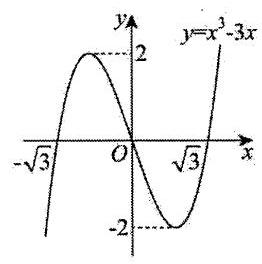

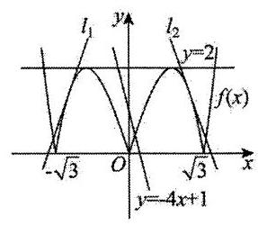

对于①，直线 $y = 2$ 与曲线 $y = f\left( x\right)$ 相切，切点为 $\left( {-1,2}\right) ,\left( {1,2}\right)$ ，

故直线 $y = 2$ 与曲线 $y = f\left( x\right)$ 双切,同时 $y = 2$ 还与曲线 $y = f\left( x\right)$ 相交,

故直线 $y = 2$ 与曲线 $y = f\left( x\right)$ 交切,① 正确；

对于②，由于 $f\left( x\right)  = \left| {{x}^{3} - {3x}}\right|$ 定义域为 $\mathrm{R}$ ，满足 $f\left( {-x}\right)  = \left| {-{x}^{3} + {3x}}\right|  = \left| {{x}^{3} - {3x}}\right|  = f\left( x\right)$ ，故 $f\left( x\right)$ 为偶函数，其图象关于 $y$ 轴对称,

故不存在唯一的直线,与曲线 $y = f\left( x\right)$ 单切且交切,

否则若存在直线与曲线 $y = f\left( x\right)$ 单切且交切,如图 ${l}_{1}$ ,则必存在关于 $y$ 轴对称的直线 ${l}_{2}$ 与曲线 $y = f\left( x\right)$ 单切且交切, ②错误,

故选: $\mathrm{C}$

73、【答案】(1) $b{\left( 2\right) }_{5} = {10}, b{\left( 2\right) }_{6} = {12}, S{\left( 2\right) }_{10} = {124}$ ；(2) 88 是数列 $\left\{  {b{\left( 3\right) }_{n}}\right\}$ 的第 30 项；

(3) ${t}_{0} = 7,{n}_{0} = {329}, S{\left( {t}_{0}\right) }_{{n}_{0}} = {427838}$

【解析】(1) 因为 $m = 2$ ,此时 $A = \left\{  {{2}^{{a}_{1}} + {2}^{{a}_{2}} \mid  0 \leq  {a}_{1} < {a}_{2},{a}_{1},{a}_{2} \in  \mathbf{N}}\right\}$ ,

$b{\left( 2\right) }_{5} = {2}^{3} + {2}^{1} = {10}, b{\left( 2\right) }_{6} = {2}^{3} + {2}^{2} = {12}$ ,

$\therefore S{\left( 2\right) }_{10} = 4\left( {{2}^{0} + {2}^{1} + {2}^{2} + {2}^{3} + {2}^{4}}\right)  = {124}$ .

(2)当 $m = 3$ 时， $A = \left\{  {{2}^{{a}_{1}} + {2}^{{a}_{2}} + {2}^{{a}_{3}} \mid  0 \leq  {a}_{1} < {a}_{2} < {a}_{3},{a}_{1},{a}_{2},{a}_{3} \in  \mathbf{N}}\right\}$ ，

$\because {88} = {2}^{6} + {2}^{4} + {2}^{3},\therefore {88}$ 是数列 $\left\{  {b{\left( 3\right) }_{n}}\right\}$ 中的项,

比它小的项分别有 ${2}^{{a}_{1}} + {2}^{{a}_{2}} + {2}^{{a}_{3}},0\;{a}_{1}\;{a}_{2} < {a}_{3}\;5,{a}_{1},{a}_{2},{a}_{3}\;\mathrm{\;N},{\mathrm{C}}_{6}^{3}$ 个,

有 ${2}^{{a}_{1}} + {2}^{{a}_{2}} + {2}^{6},0\;{a}_{1}\;{a}_{2}\;3,{a}_{1},{a}_{2}\;\mathbf{N},{\mathrm{C}}_{4}^{2}$ 个,

有 ${2}^{{a}_{1}} + {2}^{4} + {2}^{6},0\;{a}_{1}\;2,{a}_{1}\;\mathbf{N},{C}_{3}^{1}$ 个,

所以比 88 小的项共有 ${\mathrm{C}}_{6}^{3} + {\mathrm{C}}_{4}^{2} + {\mathrm{C}}_{3}^{1} = {29}$ 个,故 88 是数列 $\left\{  {b{\left( 3\right) }_{n}}\right\}$ 的第 30 项.

(3) $\because {2024} = {2}^{10} + {2}^{9} + {2}^{8} + {2}^{7} + {2}^{6} + {2}^{5} + {2}^{3},\therefore {2024}$ 是数列 $\left\{  {b{\left( 7\right) }_{n}}\right\}$ 中的项，故 ${t}_{0} = 7$ ，

则当 $m = 7$ 时, $A = \left\{  {{2}^{{a}_{1}} + {2}^{{a}_{2}} + \cdots  + {2}^{{a}_{7}} \mid  0 \leq  {a}_{1} < {a}_{2} < \cdots  < {a}_{7},{a}_{1},{a}_{2},\cdots ,{a}_{7} \in  \mathbf{N}}\right\}$ ,

思路一: 比它小的项分别有以下 7 种情况:

① ${2}^{{a}_{1}} + {2}^{{a}_{2}} + \cdots  + {2}^{{a}_{7}},0 \leq  {a}_{1} < {a}_{2} < \cdots  < {a}_{7} \leq  9,{a}_{1},{a}_{2},\cdots ,{a}_{7} \in  \mathbf{N},{10}$ 个数字任取 7 个得 ${\mathrm{C}}_{10}^{7}$ 个，

② ${2}^{{a}_{1}} + {2}^{{a}_{2}} + \cdots  + {2}^{{a}_{6}} + {2}^{10},0 \leq  {a}_{1} < {a}_{2} < \cdots  < {a}_{6} \leq  8,{a}_{1},{a}_{2},\cdots ,{a}_{6} \in  \mathbf{N}$ ，得 ${\mathrm{C}}_{9}^{6}$ 个，

③ ${2}^{{a}_{1}} + {2}^{{a}_{2}} + \cdots  + {2}^{{a}_{5}} + {2}^{9} + {2}^{10},0 \leq  {a}_{1} < {a}_{2} < \cdots  < {a}_{5} \leq  7,{a}_{1},{a}_{2},\cdots ,{a}_{5} \in  \mathbf{N}$ ，得 ${\mathrm{C}}_{8}^{5}$ 个，

④ ${2}^{{a}_{1}} + {2}^{{a}_{2}} + \cdots  + {2}^{{a}_{4}} + {2}^{8} + {2}^{9} + {2}^{10},0 \leq  {a}_{1} < {a}_{2} < \cdots  < {a}_{4} \leq  6,{a}_{1},{a}_{2},\cdots ,{a}_{4} \in  \mathbf{N}$ ，得 ${\mathrm{C}}_{7}^{4}$ 个，

⑤ ${2}^{{a}_{1}} + {2}^{{a}_{2}} + {2}^{{a}_{3}} + {2}^{7} + {2}^{8} + {2}^{9} + {2}^{10},0 \leq  {a}_{1} < {a}_{2} < {a}_{3} \leq  5,{a}_{1},{a}_{2},{a}_{3} \in  \mathbf{N}$ ，得 ${\mathrm{C}}_{6}^{3}$ 个，

⑥ ${2}^{{a}_{1}} + {2}^{{a}_{2}} + {2}^{6} + {2}^{7} + {2}^{8} + {2}^{9} + {2}^{10},0 \leq  {a}_{1} < {a}_{2} \leq  4,{a}_{1},{a}_{2} \in  \mathbf{N}$ ，得 ${\mathrm{C}}_{5}^{2}$ 个，

⑦ ${2}^{{a}_{1}} + {2}^{5} + {2}^{6} + {2}^{7} + {2}^{8} + {2}^{9} + {2}^{10},0 \leq  {a}_{1} \leq  2,{a}_{1} \in  \mathbf{N}$ ，得 ${\mathrm{C}}_{3}^{1}$ 个，

所以比 2024 小的项共有 ${\mathrm{C}}_{10}^{7} + {\mathrm{C}}_{9}^{6} + {\mathrm{C}}_{8}^{5} + {\mathrm{C}}_{7}^{4} + {\mathrm{C}}_{6}^{3} + {\mathrm{C}}_{5}^{2} + {\mathrm{C}}_{3}^{1}$ 个,

其中 ${\mathrm{C}}_{10}^{7} + {\mathrm{C}}_{9}^{6} + {\mathrm{C}}_{8}^{5} + {\mathrm{C}}_{7}^{4} + {\mathrm{C}}_{6}^{3} + {\mathrm{C}}_{5}^{2} + {\mathrm{C}}_{3}^{1} = {\mathrm{C}}_{10}^{3} + {\mathrm{C}}_{9}^{3} + {\mathrm{C}}_{8}^{3} + {\mathrm{C}}_{7}^{3} + {\mathrm{C}}_{6}^{3} + {\mathrm{C}}_{5}^{3} + 3$

$= {\mathrm{C}}_{10}^{3} + {\mathrm{C}}_{9}^{3} + {\mathrm{C}}_{8}^{3} + {\mathrm{C}}_{7}^{3} + {\mathrm{C}}_{6}^{3} + {\mathrm{C}}_{5}^{3} + {\mathrm{C}}_{5}^{4} + 3 - {\mathrm{C}}_{5}^{4}$

$= {\mathrm{C}}_{11}^{4} - 2$

$= {328}$

故 2024 是数列 $\left\{  {b{\left( 7\right) }_{n}}\right\}$ 的第 329 项，即 ${n}_{0} = {329}$ .

思路二: $A = \left\{  {{2}^{{a}_{1}} + {2}^{{a}_{2}} + \cdots  + {2}^{{a}_{7}} \mid  0 \leq  {a}_{1} < {a}_{2} < \cdots  < {a}_{7} \leq  {10},{a}_{1},{a}_{2},\cdots ,{a}_{7} \in  \mathbf{N}}\right\}$ 共有元素 ${\mathrm{C}}_{11}^{7}$ 个,

最大的是 ${2}^{10} + {2}^{9} + {2}^{8} + {2}^{7} + {2}^{6} + {2}^{5} + {2}^{4}$ ,其次为 ${2}^{10} + {2}^{9} + {2}^{8} + {2}^{7} + {2}^{6} + {2}^{5} + {2}^{3} = {2024}$ ,

所以 2024 是数列 $\left\{  {b{\left( 7\right) }_{n}}\right\}$ 的第 ${\mathrm{C}}_{11}^{7} - 1 = {329}$ 项,即 ${n}_{0} = {329}$ .

在总共 ${\mathrm{C}}_{11}^{7} = {330}$ 项中,含有 ${2}^{0}$ 的项共有 ${\mathrm{C}}_{10}^{6}$ 个,同理 ${2}^{1},{2}^{2},\cdots {2}^{10}$ 都各有 ${\mathrm{C}}_{10}^{6}$ 个,所以

$S{\left( 7\right) }_{330} = {\mathrm{C}}_{10}^{6} \cdot  \left( {{2}^{0} + {2}^{1} + \cdots  + {2}^{10}}\right)  = {210} \times  {2047} = {429870}$ ,则

$S{\left( {t}_{0}\right) }_{{n}_{0}} = S{\left( 7\right) }_{329} = S{\left( 7\right) }_{330} - b{\left( 7\right) }_{330} = {429870} - {2032} = {427838}.$

74、【答案】( 1 )0,1,1 ；( 2 )不可能结束；( 3 )64.

【解析】(1)依题意，6 次变换后得到的数列依次为

$3,2,1;1,1,2;0,1,1;1,0,1;1,1,0;0,1,1$ ,

所以，数列 $A : {2,5,3}$ ，经过 6 次“ $F$ 变换”后得到的数列为0,1,1.

(2)数列 A 经过不断的“ $F$ 变换”不可能结束

设数列 $D : {d}_{1},{d}_{2},{d}_{3}, E : {e}_{1},{e}_{2},{e}_{3}, O : 0,0,0$ ,且 $F\left( D\right)  = E, F\left( E\right)  = O$ ,

依题意 $\left| {{e}_{1} - {e}_{2}}\right|  = 0,\left| {{e}_{2} - {e}_{3}}\right|  = 0,\left| {{e}_{3} - {e}_{1}}\right|  = 0$ ,所以 ${e}_{1} = {e}_{2} = {e}_{3}$ ,

即非零常数列才能通过“ $F$ 变换”结束.

设 ${e}_{1} = {e}_{2} = {e}_{3} = e$ ( $e$ 为非零自然数).

为变换得到数列 $E$ 的前两项,数列 $D$ 只有四种可能

$D : {d}_{1},\;{d}_{1} + e,\;{d}_{1} + {2e};\;D : {d}_{1},\;{d}_{1} + e,\;{d}_{1};\;D : {d}_{1},\;{d}_{1} - e,\;{d}_{1};\;D : {d}_{1},\;{d}_{1} - e,\;{d}_{1} - {2e}.$

而任何一种可能中,数列 $E$ 的第三项是 0 或 ${2e}$ .

即不存在数列 $D$ ,使得其经过 “ $F$ 变换” 成为非零常数列,

由①②得，数列 A 经过不断的 “ $F$ 变换” 不可能结束.

(3)数列 A 经过一次“ $F$ 变换” 写得到数列 $B : {182},{185},3$ ，其结构为 $a, a + 3,3$ .

数列 $B$ 经过 6 次“ $F$ 变换”得到的数列分别为:

$3, a, a - 3;\;a - 3,3, a - 6;\;a - 6, a - 9,3;$

$3, a - {12}, a - 9;a - {15},3, a - {12};a - {18}, a - {15},3\left( {a \geq  {18}}\right)$ .

所以，经过 6 次“ $F$ 变换”后得到的数列也是形如“ $a, a + 3,3$ ”的数列，

变化的是, 除了 3 之外的两项均减小 18 .

因为 ${182} = {18} \times  {10} + 2$ ,所以,数列 $B$ 经过 $6 \times  {10} = {60}$ 次 “ $F$ 变换” 后得到的数列为2,5,3.

接下来经过“ $F$ 变换”后得到的数列分别为:

$3,2,1;1,1,2;0,1,1;1,0,1;1,1,0;0,1,1;1,0,1,\cdots ,$

至此,数列和的最小值为 2,以后数列循环出现,数列各项和不会更小,

所以经过 $1 + {60} + 3 = {64}$ 次“ $F$ 变换”得到的数列各项和达到最小,

即 $k$ 的最小值为 64 .

75、【答案】( 1 ) $P\left( {-A}\right)  = 1$ ， $P\left( B\right)  = 0$ ；( 2 ) $d =  - \frac{1}{A + B}$ ；

(3)当 $B = {300}$ 时， $P\left( A\right)  = \frac{3}{5}$ ，当 $B = {1500}$ 时， $P\left( A\right)  = \frac{7}{8}$ .

【解析】(1)当 $n =  - A$ 时,赌徒已经欠债 $- A$ 元，因此 $P\left( {-A}\right)  = 1$ .

当 $n = B$ 时,赌徒到了终止赌博的条件,不再赌了,因此输光的概率 $P\left( B\right)  = 0$ ;

(2)记 $M$ :赌徒有 $n$ 元最后输光的事件， $N$ :赌徒有 $n$ 元上一场赢的事件，

$P\left( M\right)  = P\left( N\right) P\left( {M \mid  N}\right)  + P\left( \bar{N}\right) P\left( {M \mid  \bar{N}}\right)$ ,即 $P\left( n\right)  = \frac{1}{2}P\left( {n - 1}\right)  + \frac{1}{2}P\left( {n + 1}\right)$ ,

所以 $P\left( n\right)  - P\left( {n - 1}\right)  = P\left( {n + 1}\right)  - P\left( n\right)$ ,

所以 $\{ P\left( n\right) \}$ 是一个等差数列,

设 $P\left( n\right)  - P\left( {n - 1}\right)  = d$ ,则 $P\left( {n - 1}\right)  - P\left( {n - 2}\right)  = d,\cdots , P\left( {-A + 1}\right)  - P\left( {-A}\right)  = d$ ,

累加得 $P\left( n\right)  - P\left( {-A}\right)  = \left( {n + A}\right) d$ ,故 $P\left( B\right)  - P\left( {-A}\right)  = \left( {A + B}\right) d$ ,得 $d =  - \frac{1}{A + B}$ ;

(3) $A = {100}$ ，由(2) $P\left( n\right)  - P\left( {-A}\right)  = \left( {n + A}\right) d =  - \frac{n + A}{A + B}$ ，

代入 $n = A$ 可得 $P\left( A\right)  - P\left( {-A}\right)  =  - \frac{2A}{A + B}$ ，即 $P\left( A\right)  = 1 - \frac{2A}{A + B}$ ，

当 $B = {300}$ 时， $P\left( A\right)  = \frac{1}{2}$ ，当 $B = {1500}$ 时， $P\left( A\right)  = \frac{7}{8}$ ，

当 $B$ 增大时， $P\left( A\right)$ 也会增大，即输光欠债的可能性越大，因此可知久赌无赢家，

即便是一个这样看似公平的游戏,只要赌徒一直玩下去就会 100% 的概率输光并负债.

76、【答案】(1)见解析；(2) $\frac{2\sqrt{21}}{7}$ ；(3)存在， ${CF} = \frac{4\sqrt{2}}{5}$

【解析】(1)连接 $A{B}_{1}$ ，在三棱台 ${ABC} - {A}_{1}{B}_{1}{C}_{1}$ 中， ${AB}//{A}_{1}{B}_{1}$ ；

$\because {AB} = {2A}{A}_{1} = {2{A}_{1}}{B}_{1} = {2B}{B}_{1},\therefore$ 四边形 ${AB}{B}_{1}{A}_{1}$ 为等腰梯形且 $\angle {AB}{B}_{1} = \angle {BA}{A}_{1} = {60}^{ \circ  }$ ，

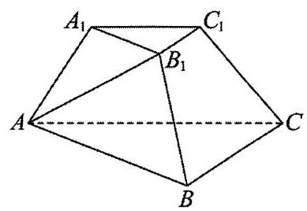

设 ${AB} = {2x}$ ,则 $B{B}_{1} = x$ .

由余弦定理得: $A{B}_{1}^{2} = A{B}^{2} + B{B}_{1}^{2} - {2AB} \cdot  B{B}_{1}\cos {60}^{ \circ  } = 3{x}^{2}$ ，

$\therefore A{B}^{2} = A{B}_{1}^{2} + B{B}_{1}^{2},\therefore A{B}_{1} \bot  B{B}_{1}$ ;

$\because$ 平面 ${AB}{B}_{1}{A}_{1} \bot$ 平面 ${BC}{C}_{1}{B}_{1}$ ,平面 ${AB}{B}_{1}{A}_{1} \cap$ 平面 ${BC}{C}_{1}{B}_{1} = B{B}_{1}, A{B}_{1} \subset$ 平面 ${AB}{B}_{1}{A}_{1}$ ,

$\therefore A{B}_{1} \bot$ 平面 ${BC}{C}_{1}{B}_{1}$ ,又 ${BC} \subset$ 平面 ${BC}{C}_{1}{B}_{1},\therefore A{B}_{1} \bot  {BC}$ ;

$\because \bigtriangleup {ABC}$ 是以 $B$ 为直角顶点的等腰直角三角形, $\therefore {BC} \bot  {AB}$ ,

$\because {AB} \cap  {A{B}_{1}} = A,{AB}, A{B}_{1} \subset$ 平面 ${AB}{B}_{1}{A}_{1},\therefore {BC} \bot$ 平面 ${AB}{B}_{1}{A}_{1}$ .

(2)由棱台性质知:延长 $A{A}_{1}, B{B}_{1}, C{C}_{1}$ 交于一点 $P$ ，

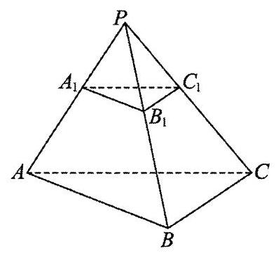

$\because {A}_{1}{B}_{1} = \frac{1}{2}{AB},\therefore {S}_{\bigtriangleup {ABC}} = 4{S}_{\bigtriangleup {A}_{1}{B}_{1}{C}_{1}},\therefore {V}_{P - {ABC}} = 8{V}_{P - {A}_{1}{B}_{1}{C}_{1}}$ ，

$\therefore {V}_{P - {ABC}} = \frac{8}{7}{V}_{{ABC} - {A}_{1}{B}_{1}{C}_{1}} = \frac{8}{7} \times  \frac{7\sqrt{3}}{12} = \frac{2\sqrt{3}}{3}$ ;

$\because {BC} \bot$ 平面 ${AB}{B}_{1}{A}_{1}$ ,即 ${BC} \bot$ 平面 ${PAB}$ ,

$\therefore {BC}$ 即为三棱锥 $P - {ABC}$ 中,点 $B$ 到平面 ${PAB}$ 的距离,

由(1)中所设: ${AB} = {BC} = {2x}$ ， $\angle {PAB} = \angle {PBA} = {60}^{ \circ  }$ ，

$\therefore \bigtriangleup {PAB}$ 为等边三角形, $\therefore {PA} = {PB} = {AB} = {2x}$ ,

$\therefore {V}_{P - {ABC}} = \frac{1}{3}{S}_{\bigtriangleup {PAB}} \cdot  {BC} = \frac{1}{3} \times  \frac{1}{2} \times  {\left( 2x\right) }^{2} \times  \frac{\sqrt{3}}{2} \times  {2x} = \frac{2\sqrt{3}}{3}{x}^{3} = \frac{2\sqrt{3}}{3},\therefore x = 1$ ;

$\therefore {AB} = {BC} = {PA} = {PB} = 2,\therefore {AC} = {PC} = 2\sqrt{2},$

$\therefore {S}_{\bigtriangleup {PAC}} = \frac{1}{2} \times  2 \times  \sqrt{{\left( 2\sqrt{2}\right) }^{2} - {1}^{2}} = \sqrt{7}$ ,

设所求点 $B$ 到平面 ${AC}{C}_{1}{A}_{1}$ 的距离为 $d$ ，即为点 $B$ 到面 ${PAC}$ 的距离，

$\because {V}_{P - {ABC}} = {V}_{B - {PAC}},\;\therefore \frac{1}{3}{S}_{\bigtriangleup {PAC}} \cdot  d = \frac{\sqrt{7}}{3}d = \frac{2\sqrt{3}}{3}$ ,解得: $d = \frac{2\sqrt{21}}{7}$ .

即点 $B$ 到平面 ${AC}{C}_{1}{A}_{1}$ 的距离为 $\frac{2\sqrt{21}}{7}$ .

(3) $\because {BC} \bot$ 平面 ${AB}{B}_{1}{A}_{1},{BC} \subset$ 平面 ${ABC}$ ， $\therefore$ 平面 ${ABC} \bot$ 平面 ${PAB}$ ，

$\because$ 平面 ${ABC} \cap$ 平面 ${PAB} = {AB}$

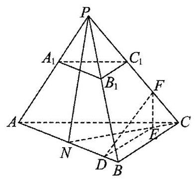

$\therefore$ 取 ${AB}$ 中点 $N$ ，在正 $\bigtriangleup  {PAB}$ 中， ${PN}\bot {AB}$ ， $\therefore {PN}\bot$ 平面 ${ABC}$ ，

又 ${PN} \subset$ 平面 ${PNC}$ ， $\therefore$ 平面 ${PNC} \bot$ 平面 ${ABC}$ .

作 ${FE} \bot  {CN}$ ,平面 ${PNC} \cap$ 平面 ${ABC} = {CN}$ ,则 ${FE} \bot$ 平面 ${ABC}$ ,

作 ${ED} \bot  {AB}$ ,连接 ${FD}$ ,则 ${ED}$ 即 ${FD}$ 在平面 ${ABC}$ 上的射影,

$\because {FE} \bot$ 平面 ${ABC},{AB} \subset$ 平面 ${ABC},\therefore {AB} \bot  {FE}$ ,

$\because {DE} \cap  {FE} = E,{DE},{FE} \subset$ 平面 ${DEF},\therefore {AB} \bot$ 平面 ${DEF}$ ,

$\because {FD} \subset$ 平面 ${DEF},\therefore {AB} \bot  {FD},\therefore \angle {FDE}$ 即二面角 $F - {AB} - C$ 的平面角.

设 ${FE} = \sqrt{3}t$ ,在 $\bigtriangleup {PCN}$ 中,作 ${PO} \bot  {CN}$ ,

$\because {FE} \bot  {CN},\therefore {PO}//{FE}$ ,又 ${FE} \bot$ 平面 ${ABC},\therefore {PO} \bot$ 平面 ${ABC}$ ,

$\therefore {V}_{P - {ABC}} = \frac{1}{3}{S}_{\bigtriangleup {ABC}} \cdot  {PO} = \frac{1}{3} \times  \frac{1}{2} \times  2 \times  {2PO} = \frac{2\sqrt{3}}{3}$ ,解得: ${PO} = \sqrt{3}$ ,

由(2)知: ${AC} = {PC} = {2\sqrt{2}},\therefore {OC} = \sqrt{{PC}^{2} - {PO}^{2}} = \sqrt{5}$ ，

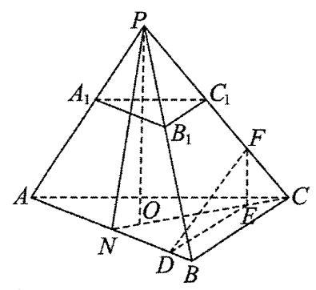

$\because \frac{EF}{PO} = \frac{CE}{OC},\therefore {CE} = \frac{\sqrt{5}}{\sqrt{3}} \cdot  \sqrt{3}t = \sqrt{5}t$ ,

$\because {CN} = \sqrt{{2}^{2} + {1}^{2}} = \sqrt{5},\therefore {EN} = \sqrt{5} - \sqrt{5}t$ ,

$\because {DE}//{BC},\therefore {DE} = \frac{EN}{CN} \cdot  {BC} = \frac{\sqrt{5} - \sqrt{5}t}{\sqrt{5}} \times  2 = 2 - {2t}$ ,

若存在 $F$ 使得二面角 $F - {AB} - C$ 的大小为 $\frac{\pi }{6}$ ,

则 $\tan \angle {FDE} = \tan \frac{\pi }{6} = \frac{FE}{DE} = \frac{\sqrt{3}t}{2 - {2t}} = \frac{\sqrt{3}}{3}$ ,解得: $t = \frac{2}{5}$ ,

$\therefore {CF} = \sqrt{{CE}^{2} + {EF}^{2}} = 2\sqrt{2}t = \frac{4\sqrt{2}}{5} < {C{C}_{1}} = \sqrt{2}$ ,

$\therefore$ 存在满足题意的点 $F,{CF} = \frac{4\sqrt{2}}{5}$ .

77、【答案】(1) $\frac{7}{9}$ ；(2)见解析；(3) $\frac{\pi }{6}$

【解析】(1)连接 ${AC}$ 交 ${BD}$ 于点 $M$ ,连接 ${QM}$ ,则平面 ${PAC} \cap$ 平面 ${QBD} = {QM}$ ,

依题意, ${PC}//$ 平面 ${QBD},{PC} \subset$ 平面 ${PAC}$ ,所以 ${PC}//{QM}$ ,

所以 $\frac{\left| PQ\right| }{\left| QA\right| } = \frac{\left| CM\right| }{\left| MA\right| }$ ,

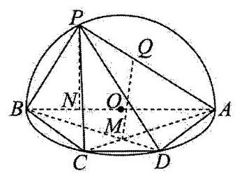

等腰梯形 ${ABCD}$ 中， $\bigtriangleup {MAB} \backsim  \bigtriangleup {MCD}$ ，所以 $\frac{\left| PQ\right| }{\left| QA\right| } = \frac{\left| CM\right| }{\left| MA\right| } = \frac{7}{9}$ .

(2)假设 ${PB}\bot {AD}$ ，

因为平面 ${PAB} \bot$ 平面 ${ABCD}$ . 平面 ${PAB} \cap$ 平面 ${ABCD} = {AB}$ .

作 ${PN} \bot  {AB}$ ,则 ${PN} \bot$ 平面 ${ABCD}$ ,又 ${AD} \subset$ 平面 ${ABCD}$ ,则 ${PN} \bot  {AD}$ ,

${PN} \cap  {PB} = P,{PN},{PB} \subset$ 平面 ${PAB}$ ，则 ${AD}\bot$ 平面 ${PAB}$ ，

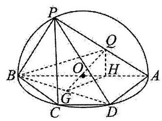

这与在 Rt $\bigtriangleup {ABD}$ 中, $\cos \angle {BAD} = \frac{1}{3}$ 相矛盾.

所以 ${PB}$ 不可能垂直 ${AD}$ .

(3)作 ${QH} \bot  {AB}$ 垂足为 $H$ ，连接 ${QB}$ ，

平面 ${PAB} \bot$ 平面 ${ABCD}$ ,平面 ${PAB} \cap$ 平面 ${ABCD} = {AB}$

此时, ${QH} \bot$ 平面 ${ABCD},{BH}$ 是 ${BQ}$ 在平面 ${ABD}$ 的射影,

所以 $\angle {QBH}$ 即为 ${QB}$ 与平面 ${ABD}$ 所成的角 $\alpha$ ,则 $\tan \alpha  = \frac{\left| QH\right| }{\left| BH\right| }$ ,

过 $H$ 作 ${GH} \bot  {BD}$ 垂足为 $G$ ,连结 ${QG}$ ,

又 ${QH} \bot  {BD},{GH} \cap  {QH} = H,{GH},{QH} \subset$ 平面 ${QHG}$ ,

所以 ${BD} \bot$ 平面 ${QHG},{QG} \subset$ 平面 ${QHG},{BD} \bot  {QG}$ .

所以 $\angle {QGH}$ 即为二面角 $Q - {BD} - A$ 的平面角 $\beta$ .

$\tan \beta  = \frac{\left| QH\right| }{\left| GH\right| }$ ,所以 $\frac{\tan \beta }{\tan \alpha } = \frac{\frac{\left| QH\right| }{\left| GH\right| }}{\frac{\left| QH\right| }{\left| BH\right| }} = \frac{\left| BH\right| }{\left| GH\right| } = 3$ ,即 $\tan \beta  = 3\tan \alpha$ .

所以 $\tan \left( {\beta  - \alpha }\right)  = \frac{\tan \beta  - \tan \alpha }{1 + \tan \beta \tan \alpha } = \frac{2\tan \alpha }{1 + 3{\tan }^{2}\alpha } \leq  \frac{\sqrt{3}}{3}$ ,等号取得当且仅当 $\tan \alpha  = \frac{\sqrt{3}}{3},\alpha  = \frac{\pi }{6}$ 时,

所以 $\beta  - \alpha$ 的最大值为 $\frac{\pi }{6}$ .

78、【答案】(1) $\frac{3}{2}$ ；(2)(i) $\frac{1}{8}$ ；(ii)见解析

【解析】(1)如图,取 ${CD}$ 中点 $M$ ,过 $M$ 作与该斜截圆柱的底面平行的平面,交 ${DA}$ 于点 $G$ ,交 ${BC}$ 延长线于点 $H$ ,与 $P{P}_{1}$ 交于点 $I$ ,

因 ${MH} = {MG} = 1,\angle {CMH} = \angle {DMG} = {45}^{ \circ  }$ ,则 ${DG} = {HC} = 1,{AG} = 2$ ,

过 $M$ 作 ${GH}$ 的垂线,交圆 $M$ 于 $J\text{ 、 }K$ 两点.

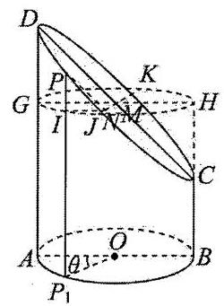

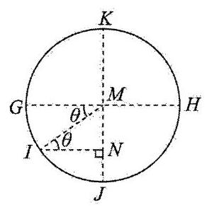

过 $I$ 作 ${IN} \bot  {JK}$ 交 ${JK}$ 于点 $N$ ,

又由 ${PI} \bot$ 圆 $M$ ,因 ${JK} \subset$ 圆 $M$ ,则 ${PI} \bot  {JK}$ ,

又因 ${PI} \cap  {IN} = I$ ,故 ${JK} \bot$ 平面 ${PIN}$ ,

因 ${PN} \subset$ 平面 ${PIN}$ ,故 ${PN} \bot  {JK}$ ,

所以 $\angle {PNI}$ 为椭圆面与圆 $M$ 所在平面的夹角,也即椭圆面与底面所成角,

所以 $\angle {PNI} = {45}^{ \circ  }$ . 则 $\bigtriangleup {PNI}$ 为等腰直角三角形, ${PI} = {IN}$ .

设 $\angle {AO}{P}_{1} = \theta$ ,如图作圆 $M$ 所在平面的俯视图,则 $\angle {GMI} = \theta$ ,

由 ${GH} \bot  {JK},{IN} \bot  {JK}$ ,所以 ${GH}//{IN}$ ,则有 $\angle {NIM} = \angle {GMI} = \theta$ ,所以 ${IN} = {MI}\cos \theta  = \cos \theta$ ,

所以 $P{P}_{1} = I{P}_{1} + {PI} = I{P}_{1} + {IN} = 2 + \cos \theta$ ,当 $\theta  = \frac{2\pi }{3}$ 时, $P{P}_{1} = 2 + \cos \frac{2\pi }{3} = \frac{3}{2}$ ;

(2)(i) $n = 6$ 时， $\theta  = \frac{\pi }{7}$ ，

所以 ${E}_{1}{F}_{1} = 2 + \cos \frac{\pi }{7},{E}_{2}{F}_{2} = 2 + \cos \frac{2\pi }{7},{E}_{3}{F}_{3} = 2 + \cos \frac{3\pi }{7},\ldots$

所以 $\left( {{E}_{1}{F}_{1} - 2}\right)  \cdot  \left( {{E}_{2}{F}_{2} - 2}\right)  \cdot  \left( {{E}_{3}{F}_{3} - 2}\right)  = \cos \frac{\pi }{7}\cos \frac{2\pi }{7}\cos \frac{3\pi }{7}$

$= \frac{\sin \frac{2\pi }{7}}{2\sin \frac{\pi }{7}} \times  \frac{\sin \frac{4\pi }{7}}{2\sin \frac{2\pi }{7}} \times  \frac{\sin \frac{6\pi }{7}}{2\sin \frac{3\pi }{7}} = \frac{\sin \frac{2\pi }{7}}{2\sin \frac{\pi }{7}} \times  \frac{\sin \frac{3\pi }{7}}{2\sin \frac{2\pi }{7}} \times  \frac{\sin \frac{\pi }{7}}{2\sin \frac{3\pi }{7}} = \frac{1}{8}$ .

(ii) 证明: 由 (1) 知 $P{P}_{1} = 2 + \cos \theta$ ,也即 $P{P}_{1}$ 是关于 $\theta$ 的函数,

也即将斜截圆柱的侧面沿着 ${AD}$ 展开,其椭圆面的轮廓线即为函数 $y = 2 + \cos x$ 的图象,

如图，将 ${E}_{1}{F}_{1},{E}_{2}{F}_{2},\cdots ,{E}_{n}{F}_{n},{BC}$ 绘制于函数 $y = 2 + \cos x$ 图象上，

并以 ${E}_{i}{F}_{i},{F}_{i - 1}{F}_{i},\;\left( {i = 2,3,\cdots , n}\right)$ 为边作矩形,则矩形的面积即为 ${F}_{i - 1}{F}_{i} \cdot  {E}_{i}{F}_{i}$ ,

所以 $\overset{\text{ ⏜ }}{A{F}_{1} \cdot  {E}_{1}{F}_{1}} + \overset{\text{ ⏜ }}{{F}_{1}{F}_{2} \cdot  {E}_{2}{F}_{2}} + \cdots  + \overset{\text{ ⏜ }}{{F}_{n - 1}{F}_{n} \cdot  {E}_{n}{F}_{n}} + {F}_{n}{BC}$ 即为这些矩形的面积之和.

而两个该斜截圆柱可拼成一个底面半径为 1 , 高为 4 的圆柱,

因此该斜截圆柱的侧面积为 $\frac{1}{2} \times  {2\pi } \times  4 = {4\pi }$ ,

所以函数 $y = 2 + \cos x\left( {0 \leq  x \leq  \pi }\right)$ 与坐标轴围成的面积为 $\frac{1}{2} \times  {4\pi } = {2\pi }$ ,

又因为无论点 ${F}_{i}\left( {i = 1,2,3,\cdots , n - 1}\right)$ 是否均匀分布在半圆弧 ${AB}$ 上,

这些矩形的面积之和都小于函数 $y = 2 + \cos x\left( {0 \leq  x \leq  \pi }\right)$ 与坐标轴围成的面积.

所以 $\overline{A{F}_{1} \cdot  {E}_{1}{F}_{1} + {F}_{1}{F}_{2} \cdot  {E}_{2}{F}_{2}} + \cdots  + \overline{{F}_{n - 1}{F}_{n} \cdot  {F}_{n}{F}_{n}} + \overline{{F}_{n}B \cdot  {BC}} < {2\pi }$ ，得证.

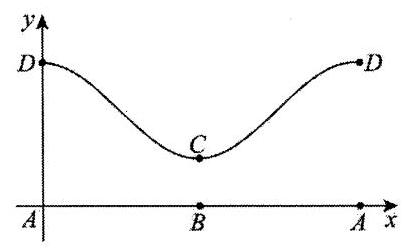

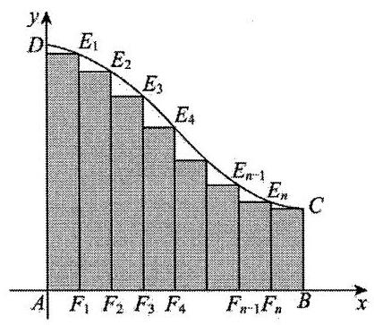

79、【答案】(1)见解析; (2) $\frac{2 - \sqrt{2}}{4}$

【解析】(1)因为 ${PA} \bot$ 平面 ${ABCD},{CD} \subset$ 平面 ${ABCD}$ ,所以 ${PA} \bot  {CD}$ ,

因为 ${PD}$ 与平面 ${ABCD}$ 所成的角为 ${45}^{ \circ  },{PA} \bot$ 平面 ${ABCD}$ ,

所以 $\angle {PDA} = {45}^{ \circ  }$ ,且 $\angle {PDA} = \angle {APD} = {45}^{ \circ  }$ ,所以 ${PA} = {AD}$ ,

又 $E$ 为 ${PD}$ 的中点，所以 ${AE} \bot  {PD}$ ，

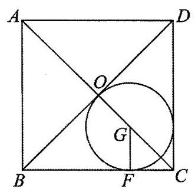

因为四边形 ${ABCD}$ 为正方形,所以 ${CD} \bot  {AD}$ ,

又 ${CD} \bot  {PA},{PA} \cap  {AD} = A,{PA},{AD} \subset$ 平面 ${PAD}$ ,

所以 ${CD} \bot$ 平面 ${PAD}$ ,

因为 ${AE} \subset$ 平面 ${PAD}$ ,所以 ${CD} \bot  {AE}$ ,

因为 ${PD} \cap  {CD} = D,{PD},{CD} \subset$ 平面 ${PCD}$ ,

所以 ${AE} \bot$ 平面 ${PCD}$ .

(2)因为底面 ${ABCD}$ 为正方形， $G$ 为 $\bigtriangleup  {BCD}$ 的内心，所以 $G$ 在对角线 ${AC}$ 上.

如图，设正方形的对角线的交点为 $O$ ，

所以 ${OG} = {GF},{CG} = \sqrt{2}{OG}$ ，

所以 ${CO} = {CG} + {OG} = \left( {\sqrt{2} + 1}\right) {OG},{AC} = {2CO} = 2\left( {\sqrt{2} + 1}\right) {OG}$ ，

所以 ${AG} = {AO} + {OG} = {CO} + {OG} = \sqrt{2}\left( {1 + \sqrt{2}}\right) {OG}$ ，

所以 ${AG} = \frac{\sqrt{2}}{2}{AC}$ ，又因为 ${AB} = 2$ ，所以 ${AG} = 2$ .

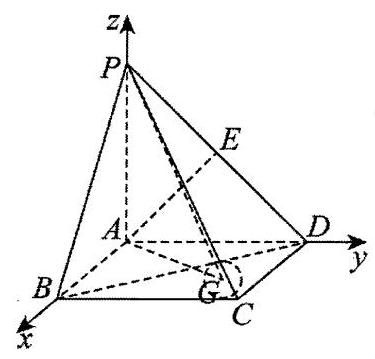

由题意知 ${AB},{AD},{AP}$ 两两垂直，以 ${AB},{AD},{AP}$ 所在的直线分别为 $x$ 轴， $y$ 轴， $z$ 轴建立如图所示的空间直角坐标系 $A - {xyz}$ .

所以 $G\left( {\sqrt{2},\sqrt{2},0}\right)$ ,由 (1) 知 ${AP} = {AD}$ ,

所以 $P\left( {0,0,2}\right) , D\left( {0,2,0}\right) , E\left( {0,1,1}\right)$ ,

所以 $\overrightarrow{PG} = \left( {\sqrt{2},\sqrt{2}, - 2}\right)$ .

又因为 ${AE} \bot$ 平面 ${PCD}$ ,所以平面 ${PCD}$ 的一个法向量为 $\overrightarrow{AE} = \left( {0,1,1}\right)$ .

设直线 ${PG}$ 与平面 ${PCD}$ 所成角为 $\theta$ ,

则 $\sin \theta  = \left| {\cos \langle \overrightarrow{AE},\overrightarrow{PG}\rangle }\right|  = \frac{\left| \overrightarrow{AE} \cdot  \overrightarrow{PG}\right| }{\left| \overrightarrow{AE}\right|  \cdot  \left| \overrightarrow{PG}\right| } = \frac{\left| \left( 0,1,1\right)  \cdot  \left( \sqrt{2},\sqrt{2}, - 2\right) \right| }{\sqrt{2} \times  \sqrt{8}} = \frac{2 - \sqrt{2}}{4}$ .

80、【答案】( 1 )见解析；( 2 )见解析；( 3 ) $\frac{\sqrt{2}}{2}$ .

【解析】(1)连接 ${DE},{OF}$ ,设 ${AF} = {tAC}$ ,

则 $\overrightarrow{BF} = \overrightarrow{BA} + \overrightarrow{AF} = \left( {1 - t}\right) \overrightarrow{BA} + t\overrightarrow{BC},\overrightarrow{AO} =  - \overrightarrow{BA} + \frac{1}{2}\overrightarrow{BC},{BF} \bot  {AO}$ ，

则 $\overrightarrow{BF} \cdot  \overrightarrow{AO} = \left\lbrack  {\left( {1 - t}\right) \overrightarrow{BA} + t\overrightarrow{BC}}\right\rbrack   \cdot  \left( {-\overrightarrow{BA} + \frac{1}{2}\overrightarrow{BC}}\right)  = \left( {t - 1}\right) {\overrightarrow{BA}}^{2} + \frac{1}{2}t\overrightarrow{B{C}^{2}} = 4\left( {t - 1}\right)  + {4t} = 0$ ,

解得 $t = \frac{1}{2}$ ,则 $F$ 为 ${AC}$ 的中点,

由 $D, E, O, F$ 分别为 ${PB},{PA},{BC},{AC}$ 的中点,

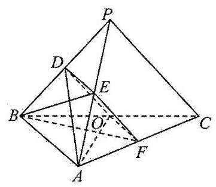

于是 ${DE}//{AB},{DE} = \frac{1}{2}{AB},{OF}//{AB},{OF} = \frac{1}{2}{AB}$ ,

即 ${DE}//{OF},{DE} = {OF}$ ,则四边形 ${ODEF}$ 为平行四边形,

${EF}//{DO},{EF} = {DO}$ ,又 ${EF} \text{ ⊄ }$ 平面 ${ADO},{DO} \subset$ 平面 ${ADO}$ ,

所以 ${EF}//$ 平面 ${ADO}$ .

(2)思路一:由(1)可知 ${EF}//{OD}$ ，

则 ${AO} = \sqrt{6},{DO} = \frac{\sqrt{6}}{2}$ ,得 ${AD} = \sqrt{5}{DO} = \frac{\sqrt{30}}{2}$ ,

因此 $O{D}^{2} + A{O}^{2} = A{D}^{2} = \frac{15}{2}$ ,则 ${OD} \bot  {AO}$ ,有 ${EF} \bot  {AO}$ ,

又 ${AO} \bot  {BF},{BF} \cap  {EF} = F,{BF},{EF} \subset$ 平面 ${BEF}$ ,

则有 ${AO} \bot$ 平面 ${BEF}$ ，又 ${AO} \subset$ 平面 ${ADO}$ ，所以平面 ${ADO} \bot$ 平面 ${BEF}$ .

思路二: 因为 ${AB} \bot  {BC}$ ,过点 $B$ 作 $z$ 轴 $\bot$ 平面 ${BAC}$ ,建立如图所示的空间直角坐标系,

$A\left( {2,0,0,}\right) , B\left( {0,0,0}\right) , C\left( {0,2\sqrt{2},0}\right) ,$

在 $\bigtriangleup {BDA}$ 中, $\cos \angle {PBA} = \frac{D{B}^{2} + A{B}^{2} - D{A}^{2}}{{2DB} \cdot  {AB}} = \frac{\frac{3}{2} + 4 - \frac{15}{2}}{2 \times  2 \times  \frac{\sqrt{6}}{2}} =  - \frac{1}{\sqrt{6}}$ ,

在 $\bigtriangleup {PBA}$ 中, $P{A}^{2} = P{B}^{2} + A{B}^{2} - {2PB} \cdot  {AB}\cos \angle {PBA} = 6 + 4 - 2\sqrt{6} \times  2 \times  \left( {-\frac{1}{\sqrt{6}}}\right)  = {14}$ ,

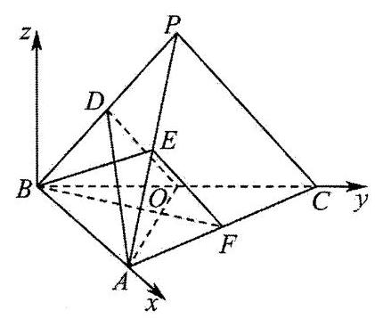

设 $P\left( {x, y, z}\right)$ ,所以由 $\left\{  \begin{array}{l} {PA} = \sqrt{14} \\  {PB} = \sqrt{6} \\  {PC} = \sqrt{6} \end{array}\right.$ 可得: $\left\{  \begin{array}{l} {\left( x - 2\right) }^{2} + {y}^{2} + {z}^{2} = {14} \\  {x}^{2} + {y}^{2} + {z}^{2} = 6 \\  {x}^{2} + {\left( y - 2\sqrt{2}\right) }^{2} + {z}^{2} = 6 \end{array}\right.$ ,

可得: $x =  - 1, y = \sqrt{2}, z = \sqrt{3}$ ,所以 $P\left( {-1,\sqrt{2},\sqrt{3}}\right)$ ,

则 $D\left( {-\frac{1}{2},\frac{\sqrt{2}}{2},\frac{\sqrt{3}}{2}}\right)$ ,所以 $E\left( {\frac{1}{2},\frac{\sqrt{2}}{2},\frac{\sqrt{3}}{2}}\right) , F\left( {1,\sqrt{2},0}\right)$ ,

$\overrightarrow{AO} = \left( {-2,\sqrt{2},0}\right) ,\overrightarrow{AD} = \left( {-\frac{5}{2},\frac{\sqrt{2}}{2},\frac{\sqrt{3}}{2}}\right)$

设平面 ${ADO}$ 的法向量为 ${\overrightarrow{n}}_{1} = \left( {{x}_{1},{y}_{1},{z}_{1}}\right)$ ,则 $\left\{  \begin{array}{l} \overrightarrow{{n}_{1}} \cdot  \overrightarrow{AO} = 0 \\  \overrightarrow{{n}_{1}} \cdot  \overrightarrow{AD} = 0 \end{array}\right.$ ,得 $\left\{  \begin{array}{l}  - 2{x}_{1} + \sqrt{2}{y}_{1} = 0 \\   - \frac{5}{2}{x}_{1} + \frac{\sqrt{2}}{2}{y}_{1} + \frac{\sqrt{3}}{2}{z}_{1} = 0 \end{array}\right.$ ,

令 ${x}_{1} = 1$ ,则 ${y}_{1} = \sqrt{2},{z}_{1} = \sqrt{3}$ ,所以 $\overrightarrow{{n}_{1}} = \left( {1,\sqrt{2},\sqrt{3}}\right)$ ,

$\overrightarrow{BE} = \left( {\frac{1}{2},\frac{\sqrt{2}}{2},\frac{\sqrt{3}}{2}}\right) ,\overrightarrow{BF} = \left( {1,\sqrt{2},0}\right)$

设平面 ${BEF}$ 的法向量为 $\overrightarrow{{n}_{2}} = \left( {{x}_{2},{y}_{2},{z}_{2}}\right)$ ,

则 $\left\{  \begin{array}{l} \overrightarrow{{n}_{2}} \cdot  \overrightarrow{BE} = 0 \\  \overrightarrow{{n}_{2}} \cdot  \overrightarrow{BF} = 0 \end{array}\right.$ ,得 $\left\{  \begin{array}{l} \frac{1}{2}{x}_{2} + \frac{\sqrt{2}}{2}{y}_{2} + \frac{\sqrt{3}}{2}{z}_{2} = 0 \\  {x}_{2} + \sqrt{2}{y}_{2} = 0 \end{array}\right.$ ,

令 ${x}_{2} = 2$ ,则 ${y}_{2} =  - \sqrt{2},{z}_{2} = 0$ ,所以 $\overrightarrow{{n}_{2}} = \left( {2, - \sqrt{2},0}\right)$ ,

$\overrightarrow{{n}_{1}} \cdot  \overrightarrow{{n}_{2}} = 2 \times  1 + \sqrt{2} \times  \left( {-\sqrt{2}}\right)  + 0 = 0,$

所以平面 ${ADO} \bot$ 平面 ${BEF}$ ;

(3) 思路一: 过点 $O$ 作 ${OH}//{BF}$ 交 ${AC}$ 于点 $H$ ，设 ${AD} \cap  {BE} = G$ ，

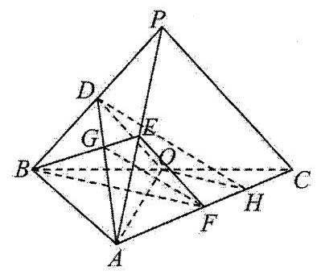

由 ${AO} \bot  {BF}$ ，得 ${HO} \bot  {AO}$ ，且 ${FH} = \frac{1}{3}{AH}$ ，

又由(2)知， ${OD} \bot  {AO}$ ，则 ${\angle {DOH}}$ 为二面角 $D - {AO} - {C\text{ 的平面角, }}$

因为 $D, E$ 分别为 ${PB},{PA}$ 的中点,因此 $G$ 为 $\bigtriangleup  {PAB}$ 的重心,

即有 ${DG} = \frac{1}{3}{AD},{GE} = \frac{1}{3}{BE}$ ，又 ${FH} = \frac{1}{3}{AH}$ ，即有 ${DH} = \frac{3}{2}{GF}$ ，

$\cos \angle {ABD} = \frac{4 + \frac{3}{2} - \frac{15}{2}}{2 \times  2 \times  \frac{\sqrt{6}}{2}} = \frac{4 + 6 - P{A}^{2}}{2 \times  2 \times  \sqrt{6}}$ ，解得 ${PA} = \sqrt{14}$ ，同理得 ${BE} = \frac{\sqrt{6}}{2}$ ，

于是 $B{E}^{2} + E{F}^{2} = B{F}^{2} = 3$ ,即有 ${BE} \bot  {EF}$ ,则 $G{F}^{2} = {\left( \frac{1}{3} \times  \frac{\sqrt{6}}{2}\right) }^{2} + {\left( \frac{\sqrt{6}}{2}\right) }^{2} = \frac{5}{3}$ ,

从而 ${GF} = \frac{\sqrt{15}}{3},{DH} = \frac{3}{2} \times  \frac{\sqrt{15}}{3} = \frac{\sqrt{15}}{2}$ ,

在 $\bigtriangleup {DOH}$ 中, ${OH} = \frac{1}{2}{BF} = \frac{\sqrt{3}}{2},{OD} = \frac{\sqrt{6}}{2},{DH} = \frac{\sqrt{15}}{2}$ ,

于是 $\cos \angle {DOH} = \frac{\frac{6}{4} + \frac{3}{4} - \frac{15}{4}}{2 \times  \frac{\sqrt{6}}{2} \times  \frac{\sqrt{3}}{2}} = \frac{\sqrt{2}}{2}$ ， $\sin \angle {DOH} = \sqrt{1 - {\left( -\frac{\sqrt{2}}{2}\right) }^{2}} = \frac{\sqrt{2}}{2}$ ，

所以二面角 $D - {AO} - C$ 的正弦值为 $\frac{\sqrt{2}}{2}$ .

思路二: 平面 ${ADO}$ 的法向量为 $\overrightarrow{{n}_{1}} = \left( {1,\sqrt{2},\sqrt{3}}\right)$ ,

平面 ${ACO}$ 的法向量为 $\overrightarrow{{n}_{3}} = \left( {0,0,1}\right)$ ,

所以 $\cos \overrightarrow{{n}_{1}},\overrightarrow{{n}_{3}} = \frac{\overrightarrow{{n}_{1}} \cdot  \overrightarrow{{n}_{3}}}{\left| \overrightarrow{{n}_{1}}\right|  \cdot  \left| \overrightarrow{{n}_{3}}\right| } = \frac{\sqrt{3}}{\sqrt{1 + 2 + 3}} = \frac{\sqrt{2}}{2}$ ,

因为 $\overrightarrow{{n}_{1}},\overrightarrow{{n}_{3}} \in  \left\lbrack  {0,\pi }\right\rbrack$ ,所以 $\sin \overrightarrow{{n}_{1}},\overrightarrow{{n}_{3}} = \sqrt{1 - {\cos }^{2}\overrightarrow{{n}_{1}},\overrightarrow{{n}_{3}}} = \frac{\sqrt{2}}{2}$ ,

故二面角 $D - {AO} - C$ 的正弦值为 $\frac{\sqrt{2}}{2}$ .

## 81~100 题

81、【答案】21

【解析】由题意知 ${M}_{m,2} = \{ 3,4,5,\cdots ,{2m} - 1\}$ ,

故由 $S\left( {M}_{m,2}\right)  \geq  {817}$ 可得 $\frac{\left( {{2m} - 1 - 2}\right) \left( {3 + {2m} - 1}\right) }{2} \geq  {817}$ ,即 $\left( {{2m} - 3}\right) \left( {m + 1}\right)  \geq  {817}$ ,

解得 $m \geq  \frac{1 + \sqrt{6561}}{4} = {21}$ 或 $m \leq  \frac{1 - \sqrt{6561}}{4}$ (舍去),

结合 $m \in  {\mathrm{N}}^{ * }$ ,故 $m$ 的最小值为 21 .

82、【答案】 $\frac{1}{2}\left( {{3}^{2024} + 1}\right)$

【解析】 ${A}_{1} = \{ 0,1,0\}$ ,依题意, ${A}_{2} = \{ 1,0,1,0,1,0,1,0,1\}$ ,

${A}_{3} = \{ 0,1,0,1,0,1,0,1,0,1,0,1,0,1,0,1,0,1,0,1,0,1,0,1,0,1,0,1,0\} .$

显然, ${A}_{1}$ 中有 3 项,其中 2 项为 0,1 项为 1,由于每个 0 都变为1,0,1,每个 1 都变为0,1,0,则 ${A}_{2}$ 中有 9 项,其中 4 项为 0,5 项为 1 ,

同理可得 ${A}_{3}$ 有 27 项,其中有 14 项为 0,13 项为 1 .

由此可得 ${A}_{n}$ 中有 ${3}^{n}$ 项,其中 0 的项数与 1 的项数差的绝对值是 1,

当 $n$ 为奇数时,0 的项数为偶数,比 1 的项数多 1 项;

当 $n$ 为偶数时,0 的项数为偶数,比 1 的项数少 1 项.

因此数列 ${A}_{2024}$ 有 ${3}^{2024}$ 项,0 的项数比 1 的项数少 1 项,

所以数列 ${A}_{2024}$ 的所有项之和为 $\frac{1}{2}\left( {{3}^{2024} - 1}\right)  \times  0 + \frac{1}{2}\left( {{3}^{2024} + 1}\right)  \times  1 = \frac{1}{2}\left( {{3}^{2024} + 1}\right)$ .

83、【答案】8; $m - 1$

【解析】由题意知,到达 ${A}_{2}$ 点共有 1 种走法,

到达 ${A}_{3}$ 点共有 $1 + 1 = 2$ 种走法 (一种是经过 ${A}_{2}$ 点到达 ${\dot{A}}_{3}$ ,一种是直接到达 ${\dot{A}}_{3}$ ),

到达 ${A}_{4}$ 点共有 $1 + 2 = 3$ 种走法 (一种是经过 ${A}_{2}$ ,一种是经过 ${A}_{3}$ ,所以到达 ${A}_{4}$ 将 ${A}_{2}\text{ 、 }{A}_{3}$ 的走法加起来), 到达 ${A}_{5}$ 点共有 $3 + 2 = 5$ 种走法 (一种是经过 ${A}_{2}$ 和 ${A}_{4}$ ,一种是经过 ${A}_{3}$ ,所以到达 ${A}_{5}$ 将 ${A}_{4}\text{ 、 }{A}_{3}$ 的走法加起来),

到达 ${A}_{6}$ 点共有 $3 + 5 = 8$ 种走法 (一种是经过 ${A}_{2}$ 和 ${A}_{4}$ ,一种是经过 ${A}_{3}$ 和 ${A}_{5}$ ,所以到达 ${A}_{6}$ 将 ${A}_{4}\text{ 、 }{A}_{5}$ 的走法加起来)，

故按图中所示方向到达 ${A}_{6}$ 有 8 种不同的打卡路线.

由题意知, ${a}_{1} = 1,{a}_{2} = 1,{a}_{3} = {a}_{1} + {a}_{2} = 2,{a}_{4} = {a}_{2} + {a}_{3} = 3,{a}_{5} = {a}_{3} + {a}_{4} = 5,\ldots ,{a}_{n} + {a}_{n + 1} = {a}_{n + 2}(1 \leq  n \leq  {14}$ 且 $\left. {n \in  {\mathbf{N}}^{ * }}\right)$ ,

因为 ${a}_{n} + {a}_{n + 1} = {a}_{n + 2}\left( {1 \leq  n \leq  {14}\text{ 且 }n \in  {\mathbf{N}}^{ * }}\right)$ ,

所以 ${a}_{1} + {a}_{2} = {a}_{3},{a}_{3} + {a}_{4} = {a}_{5},{a}_{5} + {a}_{6} = {a}_{7},\ldots ,{a}_{{2n} - 1} + {a}_{2n} = {a}_{{2n} + 1},\;\left( {1 \leq  n \leq  7\text{ 且 }n \in  {\mathbf{N}}^{ * }}\right)$ ,

将上式累加可得 ${a}_{1} + {a}_{2} + {a}_{3} + {a}_{4} + {a}_{5} + {a}_{6} + \cdots  + {a}_{{2n} + 1} + {a}_{2n} = {a}_{3} + {a}_{5} + {a}_{7} + \cdots  + {a}_{{2n} + 1},\;\left( {1 \leq  n \leq  7\text{ 且 }n \in  {\mathbf{N}}^{ * }}\right)$ ,

整理可得 ${a}_{1} + {a}_{2} + {a}_{4} + {a}_{6} + \cdots  + {a}_{2n} = {a}_{{2n} + 1}$ ,又 ${a}_{1} = 1,{a}_{{2n} + 1} = m$ ,

所以 ${a}_{2} + {a}_{4} + {a}_{6} + \cdots  + {a}_{2n} = {a}_{{2n} \cdot  \sharp } - {a}_{1} = m - 1$ ,即 $\mathop{\sum }\limits_{{i = 1}}^{n}{a}_{2i} = m - 1$ .

84、【答案】②③④

【解析】对于①,因为 ${a}_{n} = 3 - {2n}$ ,对 $\forall m, n \in  {\mathrm{N}}^{ * },{a}_{m + n} - {a}_{m} - {a}_{n} = 3 - 2\left( {m + n}\right)  - \left( {3 - {2m}}\right)  - \left( {3 - {2n}}\right)  =  - 3 < 0$ , 即 ${a}_{m + n} < {a}_{m} + {a}_{n}$ ,所以 $\left\{  {a}_{n}\right\}$ 不具有性质 $s$ ,故①错误;

对于②， ${a}_{n} = {n}^{2}$ ，对 $\forall m, n \in  {\mathrm{N}}^{ * }$ ， $2 \leq  m < n$ ，

${a}_{m - 1} + {a}_{n + 1} - {a}_{m} - {a}_{n} = {\left( m - 1\right) }^{2} + {\left( n + 1\right) }^{2} - {m}^{2} - {n}^{2} = 2\left( {n - m}\right)  + 2 > 0$ ,

$\therefore {a}_{m - 1} + {a}_{n + 1} > {a}_{m} + {a}_{n}$ ,故②正确；

对于③，若 $\left\{  {a}_{n}\right\}$ 具有性质 $s$ ，令 $m = 1$ ，则 ${a}_{n + 1} > {a}_{1} + {a}_{n} = 1 + {a}_{n}$ ，

即 ${a}_{n} - {a}_{n - 1} > 1, n \geq  2, n \in  {\mathrm{N}}^{ * }$ ,

$\therefore {a}_{n} = \left( {{a}_{n} - {a}_{n - 1}}\right)  + \left( {{a}_{n - 1} - {a}_{n - 2}}\right)  + \cdots  + \left( {{a}_{2} - {a}_{1}}\right)  + {a}_{1} > 1 + \cdots  + 1 = n$ ,又 ${a}_{1} = 1$ ,

所以 ${a}_{n} \geq  n, n \in  {\mathrm{N}}^{ * }$ ,故③正确；

对于④, $\left\{  {a}_{n}\right\}$ 是等比数列,设其公比为 $q$ ,又 ${a}_{1} = 1,\therefore {a}_{n} = {q}^{n - 1}$ ,

若 $\left\{  {a}_{n}\right\}$ 满足性质 $s$ ,由选项 $\mathrm{C}$ 得 ${a}_{n} \geq  n$ ,即 ${q}^{n - 1} \geq  n, n \in  {\mathrm{N}}^{ * },\therefore q > 1$ ,

由 $\forall m, n \in  {\mathrm{N}}^{ * },{a}_{m + n} > {a}_{m} + {a}_{n}$ ,得 ${q}^{m + n} > {q}^{m} + {q}^{n}$ ,

当 $m = n$ 时,得 ${q}^{2n} > 2{q}^{n}$ ,即 ${q}^{n} > 2$ ,对 $\forall n \in  {\mathrm{N}}^{ * }$ ,又 ${q}^{n} \geq  q,\therefore q > 2$ ,

当 $m \neq  n$ 时,不妨设 $n > m \geq  1$ ,则 ${q}^{n} > {q}^{m} \geq  q$ ,

$\therefore {q}^{m + n} > {q}^{m} + {q}^{n} > 2{q}^{m}$ ,解得 ${q}^{n} > 2,\therefore q \geq  2$ ,

综上,若 $\left\{  {a}_{n}\right\}$ 满足性质 $s$ ,则 $q > 2$ .

若 $\left\{  {a}_{n}\right\}$ 满足性质 $t$ ,对 $\forall m, n \in  {\mathrm{N}}^{ * },\;2 \leq  m < n,{a}_{m - 1} + {a}_{n + 1} > {a}_{m} + {a}_{n}$ ,

可得 ${q}^{m - 2} + {q}^{n} > {q}^{m - 1} + {q}^{n - 1}$ ,即 ${q}^{n} - {q}^{n - 1} > {q}^{m - 1} - {q}^{m - 2}$ ,令 $f\left( x\right)  = {q}^{x} - {q}^{x - 1}$ ,则 $f\left( n\right)  > f\left( {m - 1}\right)$ ,

又 $n > m - 1$ ，所以函数 $f\left( x\right)  = {q}^{x} - {q}^{x - 1}$ 在 $x \in  {\mathrm{N}}^{ * }$ 上单调递增，又由 $\left\{  {a}_{n}\right\}$ 满足性质 $s, g > 2$ ，

$\therefore {f}^{\prime }\left( x\right)  = {q}^{x}\ln q - {q}^{x - 1}\ln q = {q}^{x - 1} \cdot  \ln q \cdot  \left( {q - 1}\right)  > 0$ 成立,

所以等比数列 $\left\{  {a}_{n}\right\}$ 既满足性质 $s$ 又满足性质 $t$ ,则其公比的取值范围为 $\left( {2, + \infty }\right)$ ,故④正确.

故答案为:②③④.

85、【答案】 $\frac{{\log }_{4}\mathrm{e}}{{\mathrm{e}}^{n - 1}}$

【解析】设 ${P}_{n}\left( {{x}_{n},0}\right)$ ,则 ${Q}_{n}\left( {{x}_{n}, f\left( {x}_{n}\right) }\right)$ ,

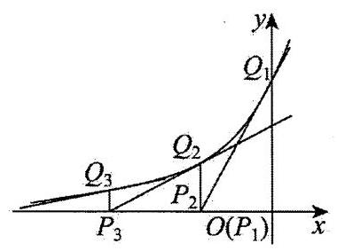

因为 $f\left( x\right)  = {2}^{x}$ ,所以 ${f}^{\prime }\left( x\right)  = {2}^{x}\ln 2$ ,

则 ${Q}_{n}\left( {{x}_{n}, f\left( {x}_{n}\right) }\right)$ 处切线为 $y = {2}^{{x}_{n}}\ln 2\left( {x - {x}_{n}}\right)  + {2}^{{x}_{n}}$ ,

切线与 $x$ 轴相交得 ${P}_{n + 1}\left( {{x}_{n + 1},0}\right)$ ,

则 ${x}_{n + 1} - {x}_{n} =  - \frac{1}{\ln 2}$ ,因为 ${x}_{1} = 0$ 得 ${x}_{n} =  - \frac{n - 1}{\ln 2}$ ,

所以 ${P}_{1}{P}_{2} = {P}_{2}{P}_{3} = \cdots  = {P}_{n}{P}_{n + 1} = \frac{1}{\ln 2}$ ,

$f\left( {x}_{n}\right)  = {2}^{-\frac{n - 1}{\ln 2}} = {\left( {2}^{-{\log }_{2}\mathrm{e}}\right) }^{n - 1} = \frac{1}{{\mathrm{e}}^{n - 1}},$

所以 ${S}_{\Delta {P}_{n}{Q}_{n}{P}_{n + 1}} = \frac{1}{2} \times  \frac{1}{\ln 2} \times  \frac{1}{{\mathrm{e}}^{n - 1}} = \frac{{\log }_{4}\mathrm{e}}{{\mathrm{e}}^{n - 1}}$ .

86、【答案】(95,14)

【解析】若 ${\log }_{2}\left( {S}_{n}\right)  \in  \mathrm{Z}, n \in  {\mathrm{N}}^{ * }$ ,则 ${S}_{n}$ 为 2 的整数幂,将数列排成如下形式: 第 $k$ 行为 ${2}^{0},{2}^{1},\cdots ,{2}^{k - 1}$ ,第 $k$ 行的和为 $\frac{1 \times  \left( {1 - {2}^{k}}\right) }{1 - 2} = {2}^{k} - 1$ ,

1

1,2

1, 2, 4

1, 2, 4, 8

该数列前 $1 + 2 + 3 + \cdots  + k = \frac{k\left( {k + 1}\right) }{2}$ 项的和为 $\frac{{S}_{k\left( {k + 1}\right) }}{2} = \left( {{2}^{1} - 1}\right)  + \left( {{2}^{2} - 1}\right)  + \cdots  + \left( {{2}^{k} - 1}\right)  = {2}^{k + 1} - k - 2$ ,

令 $\frac{k\left( {k + 1}\right) }{2} \geq  {66}$ ,则 $k \geq  {11}$ ,此时 ${2}^{k + 1} - k - 2$ 可用以 2 为底的整数幂表示,

当 $1 + 2 - k - 2 = 0$ 时,有 $k = 1$ ,此时共有 $\frac{1 \times  \left( {1 + 1}\right) }{2} + 2 = 3$ 项,不满足总项数 $n \geq  {66}$ ;

当 $1 + 2 + 4 - k - 2 = 0$ 时,有 $k = 5$ ,此时共有 $\frac{5 \times  \left( {1 + 5}\right) }{2} + 3 = {18}$ 项,不满足总项数 $n \geq  {66}$ ;

当 $1 + 2 + 4 + 8 - k - 2 = 0$ 时,有 $k = {13}$ ,此时共有 $\frac{{13} \times  \left( {1 + {13}}\right) }{2} + 4 = {95}$ 项,满足总项数 $n \geq  {66}$ ;

所以 $n$ 的最小值为 $\frac{\left( {1 + {13}}\right)  \times  {13}}{2} + 4 = {95}$ ,此时 ${S}_{95} = {2}^{14},{\log }_{2}\left( {S}_{95}\right)  = {14}$ ,

所以当 $n \geq  {66}$ 时,第一次出现的“好数对”是 $\left( {{95},{14}}\right)$ .

87、【答案】 $\left( {-\frac{1}{2},\frac{1}{4}}\right)$

【解析】因为 ${a}_{n}^{n + 1} = {a}_{n + 1}^{n}\left( {{a}_{n} > 0}\right)$ ,

所以 $\left( {n + 1}\right) \ln {a}_{n} = n\ln {a}_{n + 1} \Rightarrow  \frac{\ln {a}_{n + 1}}{\ln {a}_{n}} = \frac{n + 1}{n}$ ,

当 $n \geq  2$ 时, $\frac{\ln {a}_{n}}{\ln {a}_{n - 1}} \cdot  \frac{\ln {a}_{n - 1}}{\ln {a}_{n - 2}}\cdots \frac{\ln {a}_{2}}{\ln {a}_{1}} = \frac{n}{n - 1} \cdot  \frac{n - 1}{n - 2}\cdots \frac{2}{1}$ ,

所以 $\frac{\ln {a}_{n}}{\ln {a}_{1}} = n\left( {n \geq  2}\right)$ ,又 ${a}_{1} = \frac{1}{2}$ ,所以 ${a}_{n} = {\left( \frac{1}{2}\right) }^{n}\left( {n \geq  2}\right) , n = 1$ 时也成立,

所以 ${a}_{n} = {\left( \frac{1}{2}\right) }^{n}$ ,

因为 $\left( {m - {\left( -1\right) }^{n}{a}_{n}}\right) \left( {m + {\left( -1\right) }^{n}{a}_{n + 3}}\right)  < 0$ ,

当 $n$ 为奇数时,上式变为 $\left( {m + {a}_{n}}\right) \left( {m - {a}_{n + 3}}\right)  < 0$ ,

所以 $- {a}_{n} < m < {a}_{n + 3}$ ,因为 $\left\{  {a}_{n}\right\}$ 为严格递减数列,所以解得 $- \frac{1}{2} < m < \frac{1}{16}$ ;

当 $n$ 为偶数时,上式变为 $\left( {m - {a}_{n}}\right) \left( {m + {a}_{n + 3}}\right)  < 0$ ,

所以 $- {a}_{n + 3} < m < {a}_{n}$ ,解得 $- \frac{1}{32} < m < \frac{1}{4}$ ;

综上, $m$ 的取值范围为 $\left( {-\frac{1}{2},\frac{1}{4}}\right)$ .

88、【答案】2

【解析】因为 $\left\{  {a}_{n}\right\}$ 为 ${M}^{2}$ 的数列,故 $\left\{  {a}_{n}\right\}$ 的前 1 项至少有 1 项大于 1,即 ${a}_{1} > 1$ ,

所以 ${S}_{1} \leq  \lambda  \times  1$ ,故 $\lambda  > 1$ 即 $\lambda  \geq  2$ .

构造如下数列: ${a}_{1} = 1 + \frac{1}{2}$ ,

对于任意 $n \geq  2,{a}_{{n}^{2}} = {2n} - 1 + \frac{1}{{2}^{{2n} - 1}},{a}_{{n}^{2} - 1} = {2n} - 2 + \frac{1}{{2}^{{2n} - 2}},{a}_{k} = 0$ ,

其中 ${\left( n - 1\right) }^{2} < k \leq  {n}^{2} - 2$ ,

则数列 $\left\{  {a}_{n}\right\}$ 的前 ${n}^{2}$ 项比 $n$ 大的有 $n + \frac{1}{{2}^{n}}, n + 1 + \frac{1}{{2}^{n + 1}},\cdots ,{2n} - 1 + \frac{1}{{2}^{{2n} - 1}}$ ,共 $n$ 个,满足题设条件.

下证: $\left\{  {a}_{k}\right\}$ 满足 ${S}_{k} \leq  {2k}$ 恒成立.

证明: 对任意 $k \in  {\mathbf{N}}^{ * }$ ,存在 $n \in  \mathbf{N}$ ,使得 ${n}^{2} < k \leq  {\left( n + 1\right) }^{2}$ ,

当 $n \geq  1$ 时,若 $k = {\left( n + 1\right) }^{2}$ ,

则 ${S}_{{\left( n + 1\right) }^{2}} = 1 + 2 + 3 + \cdots  + {2n} + 1 + \frac{1}{2} + \cdots  + \frac{1}{{2}^{{2n} + 1}}$

$= \left( {n + 1}\right) \left( {{2n} + 1}\right)  + 1 - \frac{1}{{2}^{{2n} + 1}} < 2{n}^{2} + {3n} + 2 \leq  2{\left( n + 1\right) }^{2}$ ,

若 $k = {\left( n + 1\right) }^{2} - 1$ ,则 ${S}_{{\left( n + 1\right) }^{2} - 1} = {S}_{{n}^{2} + {2n}} = 1 + 2 + 3 + \cdots  + {2n} + \frac{1}{2} + \cdots  + \frac{1}{{2}^{2n}}$

$= n\left( {{2n} + 1}\right)  + 1 - \frac{1}{{2}^{2n}} < 2{n}^{2} + n + 1 < 2{n}^{2} + {4n}$ ,

当 ${n}^{2} < k \leq  {\left( n + 1\right) }^{2} - 2,{S}_{k} = {S}_{{n}^{2}} = 1 + 2 + 3 + \cdots  + {2n} - 1 + \frac{1}{2} + \cdots  + \frac{1}{{2}^{{2n} - 1}}$

$= n\left( {{2n} - 1}\right)  + 1 - \frac{1}{{2}^{{2n} - 1}} < 2{n}^{2} < {2k}$ .

所以 ${S}_{k} \leq  {2k}$ 恒成立,

综上, $\lambda$ 的最小值为 2 .

89、【答案】 $\frac{{4}^{n} + 2}{3}$

【解析】 $S\left( n\right)  - S\left( {n - 1}\right)  = N\left( {{2}^{n - 1} + 1}\right)  + N\left( {{2}^{n - 1} + 2}\right)  + \cdots  + N\left( {2}^{n}\right)$

其中奇数项的最大奇因数为其本身,而偶数项的最大奇因数和为 $S\left( {n - 1}\right)  - S\left( {n - 2}\right) \left( {n \geq  3}\right)$

$S\left( n\right)  - S\left( {n - 1}\right)  = \left\lbrack  {S\left( {n - 1}\right)  - S\left( {n - 2}\right) }\right\rbrack   + \left( {{2}^{n - 1} + 1 + {2}^{n - 1} + 3 + \cdots  + {2}^{n} - 1}\right)$ ,

$S\left( n\right)  - S\left( {n - 1}\right)  = \left\lbrack  {S\left( {n - 1}\right)  - S\left( {n - 2}\right) }\right\rbrack   + \frac{3}{16} \cdot  {4}^{n},$

$S\left( 3\right)  - S\left( 2\right)  = \left\lbrack  {S\left( 2\right)  - S\left( 1\right) }\right\rbrack   + {12}$ ,

$S\left( 2\right)  - S\left( 1\right)  = 4,$

累加得: $S\left( n\right)  - S\left( {n - 1}\right)  = 4 + {12} + \cdots  + \frac{3}{16} \cdot  {4}^{n} = {4}^{n - 1}$ ,

...

$S\left( 3\right)  - S\left( 2\right)  = {16}$ ,

$S\left( 2\right)  - S\left( 1\right)  = 4,$

累加得 $S\left( n\right)  - 2 = 4 + {16} + \cdots  + {4}^{n - 1} = \frac{4\left( {1 - {4}^{n - 1}}\right) }{1 - 4}$

故 $S\left( n\right)  = \frac{{4}^{n} + 2}{3}$

90、【答案】 $\frac{4}{5}\pi ;\left\lbrack  {\sqrt{5} + 3,2\sqrt{3} + 2}\right\rbrack$

【解析】过点 $O$ 在平面 ${ABCD}$ 内作 ${OG} \bot  D{O}_{1}$ ,垂足为 $G$ ,如图

易知 ${O}_{1}{O}_{2} \bot  {CD},{O}_{1}{O}_{2} = 2,{O}_{2}D = 1$ ,

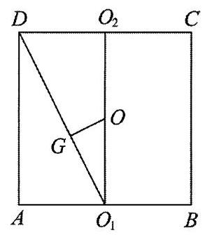

由勾股定理可得 ${O}_{1}D = \sqrt{{O}_{1}{O}_{2}^{2} + {O}_{2}{D}^{2}} = \sqrt{5}$ ,

则由题可得 ${OG} = \frac{1}{2} \times  \frac{{O}_{1}{O}_{2} \cdot  {O}_{2}D}{{O}_{1}D} = \frac{1}{2} \times  \frac{2 \times  1}{\sqrt{5}} = \frac{\sqrt{5}}{5}$ ,

设 $O$ 到平面 ${DEF}$ 的距离为 ${d}_{1}$ ，平面 ${DEF}$ 截得球的截面圆的半径为 ${r}_{1}$ ， 因为 ${O}_{1}D \subset$ 平面 ${DEF}$ ,

当 ${OG} \bot$ 平面 ${DEF},{d}_{1}$ 取最大值 ${OG}$ ,即 ${d}_{1} \leq  {OG} = \frac{\sqrt{5}}{5}$ ,所以 ${r}_{1} = \sqrt{1 - {d}_{1}^{2}} \geq  \sqrt{1 - \frac{1}{5}} = \frac{2}{5}\sqrt{5}$ ,

所以平面 ${DEF}$ 截得球的截面面积最小值为 $\pi  \times  {\left( \frac{2}{5}\sqrt{5}\right) }^{2} = \frac{4}{5}\pi$ .

由题可知,点 $M$ 在过球心与圆柱的底面平行的截面圆上,设 $P$ 在底面射影为 ${M}^{\prime }$ ,

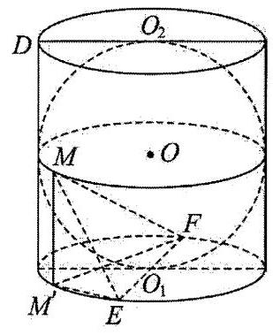

如图: 则 $M{M}^{\prime } = 1,{ME} = \sqrt{1 + M{E}^{2}},{MF} = \sqrt{1 + M{F}^{2}}$ ,

由勾股定理可得 ${M}^{\prime }{E}^{2} + {M}^{\prime }{F}^{2} = 4$ ,

令 ${M}^{\prime }{F}^{2} = 2 - t$ ,则 ${M}^{\prime }{E}^{2} = 2 + t$ ,其中 $- 2 \leq  t \leq  2$ ,

所以 ${ME} + {MF} = \sqrt{3 + t} + \sqrt{3 - t}$ ,

所以 ${\left( ME + MF\right) }^{2} = {\left( \sqrt{3 + t} + \sqrt{3 - t}\right) }^{2} = 6 + 2\sqrt{9 - t} \in  \left\lbrack  {6 + 2\sqrt{5},{12}}\right\rbrack$ , 因此 ${ME} + {MF} \in  \left\lbrack  {\sqrt{5} + 1,2\sqrt{3}}\right\rbrack$ ，所以 $\bigtriangleup  {MEF}$ 周长的取值范围为 $\left\lbrack  {\sqrt{5} + 3,2\sqrt{3} + 2}\right\rbrack$ .

91、【答案】 48π

【解析】设正方体的棱长为 $a$ ,取 $\left\{  {\overrightarrow{AB},\overrightarrow{AC},\overrightarrow{AD}}\right\}$ 作为空间向量的一组基底,

设单位向量 $\overrightarrow{n}$ 是平面 $\alpha$ 的一个方向向上的法向量,根据空间向量基本定理,

存在唯一的有序是数组 $\left( {x, y, z}\right)$ ,使得 $\overrightarrow{n} = x\overrightarrow{AB} + y\overrightarrow{AC} + z\overrightarrow{AD}$ .

由题意: $\overrightarrow{AB}$ 在 $\overrightarrow{n}$ 上的投影长度为 $\sqrt{3}$ ,

所以 $\overrightarrow{n} \cdot  \overrightarrow{AB} = \sqrt{3} \Rightarrow  \left( {x\overrightarrow{AB} + y\overrightarrow{AC} + z\overrightarrow{AD}}\right)  \cdot  \overrightarrow{AB} = \sqrt{3} \Rightarrow  x{a}^{2} = \sqrt{3} \Rightarrow  x = \frac{\sqrt{3}}{{a}^{2}}$

同理: $y = \frac{2}{{\dot{a}}^{2}}, z = \frac{3}{{a}^{2}}$ .

所以 $\left| \overrightarrow{n}\right|  = \frac{\sqrt{3 + 4 + 6}}{a} = \frac{4}{a}$ ,又 $\left| \overrightarrow{n}\right|  = 1$ ,所以 $a = 4$ .

所以正方体外接球半径为: $r = \frac{\sqrt{3}}{2}a = 2\sqrt{3}$ .

所以外接球表面积为: $S = {4\pi }{r}^{2} = {4\pi } \times  {\left( 2\sqrt{3}\right) }^{2} = {48\pi }$ .

92、【答案】 $\frac{3\sqrt{2}}{2}$

【解析】函数 $f\left( x\right)  = {x}^{3} - {ax} + 1\left( {a \in  \mathbf{R}}\right) ,{f}^{\prime }\left( x\right)  = 3{x}^{2} - a$ ,

若 $a \leq  0,{f}^{\prime }\left( x\right)  \geq  0$ 恒成立, $f\left( x\right)$ 在 $\mathrm{R}$ 上严格递增,不合题意,

$a > 0$ 时, ${f}^{\prime }\left( x\right)  = 3{x}^{2} - a = 0$ ,得 ${x}_{1} =  - \sqrt{\frac{a}{3}},{x}_{2} = \sqrt{\frac{a}{3}}$ ,

则 $f\left( {x}_{1}\right)  = 1 + \frac{2a}{3}\sqrt{\frac{a}{3}}, f\left( {x}_{2}\right)  = 1 - \frac{2a}{3}\sqrt{\frac{a}{3}}$ ,

四边形 ${ABCD}$ 为菱形,则 ${AC} \bot  {BD}$ ,

${k}_{AC} = \frac{f\left( {x}_{2}\right)  - f\left( {x}_{1}\right) }{{x}_{2} - {x}_{1}} = \frac{2a}{3}$ ,故 ${k}_{BD} = \frac{3}{2a} = \frac{f\left( {x}_{1}\right)  - f\left( {x}_{2}\right) }{{x}_{B} - {x}_{D}},{x}_{B} - {x}_{D} = \frac{8{a}^{2}}{9}\sqrt{\frac{a}{3}}$ ,

$\frac{{x}_{1} + {x}_{2}}{2} = \frac{{x}_{B} + {x}_{D}}{2} = 0$ ,则 ${x}_{B} = \frac{4{a}^{2}}{9}\sqrt{\frac{a}{3}},{x}_{D} =  - \frac{4{a}^{2}}{9}\sqrt{\frac{a}{3}}$ ,

由 $f\left( {x}_{B}\right)  = f\left( {x}_{1}\right)$ ,化简得 $\frac{{64}{a}^{6}}{729} - \frac{4{a}^{2}}{3} - 2 = 0$ ,令 $t = \frac{4{a}^{2}}{9} > 0$ ,则 ${t}^{3} - {3t} - 2 = 0$ ,

即 $\left( {t - 2}\right) {\left( t + 1\right) }^{2} = 0$ ,解得 $t = 2$ ,故 $\frac{4{a}^{2}}{9} = 2, a = \frac{3\sqrt{2}}{2}$ .

93、【答案】( 1 ) $\sqrt{3}\pi$ ；( 2 ) $\frac{2\sqrt{39}}{13}$

【解析】(1)因为 $\angle {ABD}$ 与 $\angle {ACD}$ 是底面圆弧 $\overset{\text{ ⏜ }}{AD}$ 所对的圆周角,

所以 $\angle {ABD} = \angle {ACD}$ ，

因为 ${AB} = {AD}$ ，所以在等腰 $\bigtriangleup  {ABD}$ 中， $\angle {ABD} = \angle {ADE}$ ，

所以 $\angle {ADE} = \angle {ACD}$ ，

因为 ${AC}$ 是圆柱的底面直径,所以 $\angle {ADC} = {90}^{ \circ  }$ ,则 $\angle {CAD} + \angle {ACD} = {90}^{ \circ  }$ ,

所以 $\angle {CAD} + \angle {ADE} = {90}^{ \circ  }$ ,则 $\angle {AED} = {90}^{ \circ  }$ ,即 ${AC} \bot  {BD}$ ,

所以在等腰 $\bigtriangleup {ABD},{BE} = {DE},{AC}$ 平分 $\angle {BAD}$ ,则 $\angle {CAD} = \frac{1}{2}\angle {BAD} = {30}^{ \circ  }$ ,

所以 $\angle {ADE} = {60}^{ \circ  }$ ,则 $\angle {CDE} = {30}^{ \circ  }$ ,

故在 $\mathrm{{Rt}} \bigtriangleup  {CED}$ 中， ${CD} = {2EC}$ ， ${DE} = \sqrt{3}{EC}$ ，则 ${BD} = {2DE} = {2\sqrt{3}{EC}}$ ，

在 Rt $\bigtriangleup {ACD}$ 中, ${AC} = {2CD} = {4EC}$ ,

因为 ${PC}$ 是圆柱的母线,所以 ${PC} \bot$ 面 ${ABCD}$ ,

所以 ${V}_{1} = \pi  \cdot  {\left( \frac{1}{2}AC\right) }^{2} \cdot  {CP} = \pi  \cdot  {\left( 2EC\right) }^{2} \cdot  {PC} = {4\pi } \cdot  E{C}^{2} \cdot  {PC}$ ,

${V}_{2} = \frac{1}{3} \times  \frac{1}{2}{AC} \cdot  {BD} \cdot  {PC} = \frac{1}{6} \times  {4EC} \times  2\sqrt{3}{EC} \cdot  {PC} = \frac{4\sqrt{3}}{3}E{C}^{2} \cdot  {PC},$

所以 $\frac{{V}_{1}}{{V}_{2}} = \sqrt{3}\pi$ .

(2)以 $C$ 为坐标原点， $\overrightarrow{CA}$ 的方向为 $x$ 轴正方向，建立如图所示的空间直角坐标系 $C - {xyz}$ ，

不妨设 $\left| \overrightarrow{CE}\right|  = 1$ ,则 ${AC} = {4EC} = 4,{DE} = \sqrt{3}{EC} = \sqrt{3},{PC} = {4CE} = 4$ ,

则 $C\left( {0,0,0}\right) , A\left( {4,0,0}\right) , D\left( {1,\sqrt{3},0}\right) , P\left( {0,0,4}\right)$ ,

所以 $\overrightarrow{CD} = \left( {1,\sqrt{3},0}\right) ,\overrightarrow{CP} = \left( {0,0,4}\right) ,\overrightarrow{PA} = \left( {4,0, - 4}\right)$ ,

因为 ${PA} = {4PF}$ ,所以 $\overrightarrow{PF} = \frac{1}{4}\overrightarrow{PA} = \left( {1,0, - 1}\right)$ ,

则 $\overrightarrow{CF} = \overrightarrow{CP} + \overrightarrow{PF} = \left( {0,0,4}\right)  + \left( {1,0, - 1}\right)  = \left( {1,0,3}\right)$ ,

设平面 ${FCD}$ 的法向量 $\overrightarrow{n} = \left( {x, y, z}\right)$ ,则 $\left\{  \begin{array}{l} \overrightarrow{n} \cdot  \overrightarrow{CF} = 0 \\  \overrightarrow{n} \cdot  \overrightarrow{CD} = 0 \end{array}\right.$ ,即 $\left\{  \begin{array}{l} x + {3z} = 0 \\  x + \sqrt{3}y = 0 \end{array}\right.$ ,

令 $x =  - 3$ ,则 $y = \sqrt{3}, z = 1$ ,故 $\overrightarrow{n} = \left( {-3,\sqrt{3},1}\right)$ ,

设平面 ${PCD}$ 的法向量 $\overrightarrow{m} = \left( {p, q, r}\right)$ ,则 $\left\{  \begin{array}{l} \overrightarrow{m} \cdot  \overrightarrow{CP} = 0 \\  \overrightarrow{m} \cdot  \overrightarrow{CD} = 0 \end{array}\right.$ ,即 $\left\{  \begin{array}{l} {4r} = 0 \\  p + \sqrt{3}q = 0 \end{array}\right.$ ,

令 $p =  - 3$ ,则 $q = \sqrt{3}, r = 0$ ,故 $\overrightarrow{m} = \left( {-3,\sqrt{3},0}\right)$ ,

设二面角 $F - {CD} - P$ 的平面角为 $\theta$ ,易知 $0 < \theta  < \frac{\pi }{2}$ ,

所以 $\cos \theta  = \left| {\cos \langle \overrightarrow{n},\overrightarrow{m}\rangle }\right|  = \frac{\overrightarrow{n} \cdot  \overrightarrow{m}}{\left| \overrightarrow{n}\right|  \cdot  \left| \overrightarrow{m}\right| } = \frac{9 + 3}{\sqrt{9 + 3 + 1} \times  \sqrt{9 + 3}} = \frac{2\sqrt{39}}{13}$ ,

因此二面角 $F - {CD} - P$ 的余弦值为 $\frac{2\sqrt{39}}{13}$ .

94、【答案】(1)见解析；(2) $\frac{\sqrt{130}}{13}$

【解析】( 1 )如图,连接 ${A}_{1}{C}_{1}$ .

因为在圆台 $O{O}_{1}$ 中,上、下底面直径分别为 ${A}_{1}{B}_{1},{AB}$ ,且 ${A}_{1}{B}_{1}//{AB}$ ,

所以 $A{A}_{1}, B{B}_{1},{C}_{1}C$ 为圆台母线且交于一点 $P$ ,所以 $A,{A}_{1},{C}_{1}, C$ 四点共面.

在圆台 $O{O}_{1}$ 中,平面 ${ABC}//$ 平面 ${A}_{1}{B}_{1}{C}_{1}$ ,

由平面 $A{A}_{1}{C}_{1}C \cap$ 平面 ${ABC} = {AC}$ ,平面 $A{A}_{1}{C}_{1}C \cap$ 平面 ${A}_{1}{B}_{1}{C}_{1} = {A}_{1}{C}_{1}$ ,得 ${A}_{1}{C}_{1}//{AC}$ .

又 ${A}_{1}{B}_{1}//{AB},{AB} = 2{A}_{1}{B}_{1}$ ,所以 $\frac{P{A}_{1}}{PA} = \frac{{A}_{1}{B}_{1}}{AB} = \frac{1}{2}$ ,

所以 $\frac{P{C}_{1}}{PC} = \frac{P{A}_{1}}{PA} = \frac{1}{2}$ ,即 ${C}_{1}$ 为 ${PC}$ 中点.

在 $\bigtriangleup {PAC}$ 中,又 $M$ 为 ${AC}$ 的中点,所以 ${C}_{1}M//A{A}_{1}$ .

因为 $A{A}_{1} \subset$ 平面 ${AB}{B}_{1}{A}_{1},{C}_{1}M \text{ ⊄ }$ 平面 ${AB}{B}_{1}{A}_{1}$ ,

所以 ${C}_{1}M//$ 平面 ${AB}{B}_{1}{A}_{1}$ ;

(2)以 $O$ 为坐标原点， ${OB},{O{O}_{1}}$ 分别为 $y, z$ 轴，过 $O$ 且垂直于平面 ${AB}{B}_{1}{A}_{1}$ 的直线为 $x$ 轴，

建立如图所示的空间直角坐标系 $O - {xyz}$ .

因为 $\angle {ABC} = {30}^{ \circ  }$ ,所以 $\angle {AOC} = {60}^{ \circ  }$ .

则 $A\left( {0, - 2,0}\right) , C\left( {\sqrt{3}, - 1,0}\right) , Q\left( {0,0,3}\right)$ .

因为 $\overrightarrow{OC} = \left( {\sqrt{3}, - 1,0}\right)$ ,所以 $\overrightarrow{{O}_{1}{C}_{1}} = \frac{1}{2}\overrightarrow{OC} = \left( {\frac{\sqrt{3}}{2}, - \frac{1}{2},0}\right)$ .

所以 ${C}_{1}\left( {\frac{\sqrt{3}}{2}, - \frac{1}{2},3}\right)$ ,所以 $\overrightarrow{{C}_{1}C} = \left( {\frac{\sqrt{3}}{2}, - \frac{1}{2}, - 3}\right)$ .

设平面 ${OC}{C}_{1}$ 的法向量为 $\overrightarrow{{n}_{1}} = \left( {{x}_{1},{y}_{1},{z}_{1}}\right)$ ,

所以 $\left\{  \begin{array}{l} \overrightarrow{{n}_{1}} \cdot  \overrightarrow{OC} = 0 \\  \overrightarrow{{n}_{1}} \cdot  \overrightarrow{{C}_{1}C} = 0 \end{array}\right.$ ,所以 $\left\{  \begin{matrix} \sqrt{3}{x}_{1} - {y}_{1} = 0 \\  \frac{\sqrt{3}}{2}{x}_{1} - \frac{1}{2}{y}_{1} - 3{z}_{1} = 0 \end{matrix}\right.$ ,

令 ${x}_{1} = 1$ ,则 ${y}_{1} = \sqrt{3},{z}_{1} = 0$ ,所以 $\overline{{n}_{1}} = \left( {1,3,0}\right)$ ,又 $\overrightarrow{AC} = \left( {\sqrt{3},1,0}\right)$ , 设平面 ${AC}{C}_{1}$ 的法向量为 $\overrightarrow{{n}_{2}} = \left( {{x}_{2},{y}_{2},{z}_{2}}\right)$ ,

所以 $\left\{  \begin{array}{l} \overrightarrow{{n}_{2}} \cdot  \overrightarrow{AC} = 0 \\  \overrightarrow{{n}_{2}} \cdot  \overrightarrow{{C}_{1}C} = 0 \end{array}\right.$ ,所以 $\left\{  \begin{matrix} \sqrt{3}{x}_{2} + {y}_{2} = 0 \\  \frac{\sqrt{3}}{2}{x}_{2} - \frac{1}{2}{y}_{2} - 3{z}_{2} = 0 \end{matrix}\right.$ ,

令 ${x}_{2} = 1$ ,则 ${y}_{2} =  - \sqrt{3},{z}_{2} = \frac{\sqrt{3}}{3}$ ,所以 $\overrightarrow{{n}_{2}} = \left( {1, - \sqrt{3},\frac{\sqrt{3}}{3}}\right)$ ,

所以 $\cos \left\langle  {\overrightarrow{{n}_{1}},\overrightarrow{{n}_{2}}}\right\rangle   = \frac{\overrightarrow{{n}_{1}} \cdot  \overrightarrow{{n}_{2}}}{\left| \overrightarrow{{n}_{1}}\right| \left| \overrightarrow{{n}_{2}}\right| } = \frac{1 \times  1 + \sqrt{3} \times  \left( {-\sqrt{3}}\right)  + 0 \times  \frac{\sqrt{3}}{3}}{\sqrt{1 + 3} \times  \sqrt{1 + 3 + \frac{1}{3}}} =  - \frac{\sqrt{39}}{13}$ .

设二面角 $M - {C}_{1}C - O$ 的大小为 $\theta$ ,则 $\cos \theta  = \left| {\cos \overrightarrow{{n}_{1}},\overrightarrow{{n}_{2}}}\right|  = \frac{\sqrt{39}}{13}$ ,

所以 $\sin \theta  = \sqrt{1 - {\cos }^{2}\theta } = \frac{\sqrt{130}}{13}$ .

所以二面角 $M - {C}_{1}C - O$ 的正弦值为 $\frac{\sqrt{130}}{13}$ .

95、【答案】( 1 ) $\frac{{x}^{2}}{3} - {y}^{2} = 1\left( {y \neq  0}\right)$ ；( 2 ) $N\left( {\frac{3\sqrt{3}}{2},0}\right)$ ；( 3 ) $- \frac{1}{5}$

【解析】(1)设 $V\left( {x, y}\right)$ 是曲线 $C$ 上的任意一点，

因为点 $A\left( {-\sqrt{3},0}\right) , B\left( {\sqrt{3},0}\right)$ ,且动点 $V$ 满足直线 ${VA}$ 与直线 ${VB}$ 的斜率之积为 $\frac{1}{3}$ ,

可得 $\frac{y}{x + \sqrt{3}} \cdot  \frac{y}{x - \sqrt{3}} = \frac{1}{3}$ ,整理得 $\frac{{x}^{2}}{3} - {y}^{2} = 1$ ,其中 $y \neq  0$ .

所以曲线 $C$ 的轨迹方程为 $\frac{{x}^{2}}{3} - {y}^{2} = 1\left( {y \neq  0}\right)$ .

(2)①当直线 ${PQ}$ 斜率存在时,设 $l$ 的方程为 $y = {kx} + t$ ，设 $P\left( {{x}_{1},{y}_{1}}\right) , Q\left( {{x}_{2},{y}_{2}}\right)$ ，

联立方程组 $\left\{  \begin{array}{l} \frac{{x}^{2}}{3} - {y}^{2} = 1 \\  y = {kx} + t \end{array}\right.$ ,整理得 $\left( {3{k}^{2} - 1}\right) {x}^{2} + {6ktx} + 3\left( {{t}^{2} + 1}\right)  = 0$ ,

则 $\Delta  = {\left( 6kt\right) }^{2} - 4\left( {3{t}^{2} + 3}\right) \left( {3{k}^{2} - 1}\right)  > 0$ ,即 $3{k}^{2} - {t}^{2} - 1 < 0$ ,

且 ${x}_{1} + {x}_{2} =  - \frac{6kt}{3{k}^{2} - 1},{x}_{1}{x}_{2} = \frac{3{t}^{2} + 3}{3{k}^{2} - 1}$

所以 ${y}_{1}{y}_{2} = \left( {k{x}_{1} + t}\right) \left( {k{x}_{2} + t}\right)  = {k}^{2}{x}_{1}{x}_{2} + {kt}\left( {{x}_{1} + {x}_{2}}\right)  + {t}^{2}$ ,

因为 $\overrightarrow{BP} \cdot  \overrightarrow{BQ} = \left( {{x}_{1} - \sqrt{3}}\right) \left( {{x}_{2} - \sqrt{3}}\right)  + {y}_{1}{y}_{2} = 0$ ,

所以 $\left( {{k}^{2} + 1}\right)  \cdot  {x}_{1}{x}_{2} + \left( {{kt} - \sqrt{3}}\right)  \cdot  \left( {{x}_{1} + {x}_{2}}\right)  + {t}^{2} + 3 = 0$ ,

所以 $\left( {{k}^{2} + 1}\right)  \cdot  \frac{3{t}^{2} + 3}{3{k}^{2} - 1} + \left( {{kt} - \sqrt{3}}\right) \frac{-{6kt}}{3{k}^{2} - 1} + {t}^{2} + 3 = 0$ ,

化简得 ${t}^{2} + 3\sqrt{3}{kt} + 6{k}^{2} = 0$ ,即 $\left( {t + \sqrt{3}k}\right) \left( {t + 2\sqrt{3}k}\right)  = 0$ ,

所以 ${t}_{1} =  - \sqrt{3}k,{t}_{2} =  - 2\sqrt{3}k$ ,且均满足 $3{k}^{2} - {t}^{2} - 1 < 0$ ,

当 ${t}_{1} =  - \sqrt{3}k$ 时,直线 ${PQ}$ 的方程为 $y = k\left( {x - \sqrt{3}}\right)$ ,直线过定点 $\left( {\sqrt{3},0}\right)$ ,与已知矛盾,

当 ${t}_{2} =  - 2\sqrt{3}k$ 时,直线 ${PQ}$ 的方程为 $y = k\left( {x - 2\sqrt{3}}\right)$ ,过定点 $\left( {2\sqrt{3},0}\right)$ ,记为点 $D$ .

②当直线 ${PQ}$ 的斜率不存在时,由对称性不妨设直线 ${BP} : y = x - \sqrt{3}$ ，

联立方程组 $\left\{  \begin{array}{l} \frac{{x}^{2}}{3} - {y}^{2} = 1 \\  y = x - \sqrt{3} \end{array}\right.$ ，解得 ${x}_{P} = {x}_{Q} = 2\sqrt{3}$ ，此时直线 ${PQ}$ 也过点 $D\left( {2\sqrt{3},0}\right)$ ，

综上,直线 ${PQ}$ 过定点 $D\left( {2\sqrt{3},0}\right)$ .

又由 ${BM} \bot  {PQ}$ ,所以点 $M$ 在以 ${BD}$ 为直径的圆上,

故当 $N$ 为该圆圆心,即点 $N$ 为 ${BD}$ 的中点时, $\left| {MN}\right|$ 为该圆半径,即 $\left| {MN}\right|  = \frac{1}{2}\left| {BD}\right|$ ,

所以存在定点 $N\left( {\frac{3\sqrt{3}}{2},0}\right)$ ,使 $\left| {MN}\right|$ 为定值 $\frac{\sqrt{3}}{2}$ .

(3)设 $G\left( {{x}_{3},{y}_{3}}\right)$ ， $H\left( {{x}_{4},{y}_{4}}\right)$ ，易得直线 ${GH}$ 的斜率不为0，可设直线 ${GH} : x = {ny} + \frac{3\sqrt{3}}{2}$

联立方程组 $\left\{  \begin{array}{l} \frac{{x}^{2}}{3} - {y}^{2} = 1 \\  x = {ny} + \frac{3\sqrt{3}}{2} \end{array}\right.$ ,整理得 $\left( {{n}^{2} - 3}\right) {y}^{2} + 3\sqrt{3}{ny} + \frac{15}{4} = 0$ ,

则 $\Delta  = {\left( 3\sqrt{3}n\right) }^{2} - 4\left( {{n}^{2} - 3}\right)  \times  \frac{15}{4} > 0$ ,且 ${y}_{3} + {y}_{4} =  - \frac{3\sqrt{3}n}{{n}^{2} - 3},{y}_{3}{y}_{4} = \frac{\frac{15}{4}}{{n}^{2} - 3}$ ,

则 $n{y}_{3} \cdot  {y}_{4} =  - \frac{5\sqrt{3}}{12}\left( {{y}_{3} + {y}_{4}}\right)$ ,

所以 $\frac{{k}_{1}}{{k}_{2}} = \frac{\frac{{y}_{3}}{{x}_{3} + \sqrt{3}}}{\frac{{y}_{4}}{{x}_{4} - \sqrt{3}}} = \frac{{y}_{3}\left( {n{y}_{4} + \frac{\sqrt{3}}{2}}\right) }{{y}_{4}\left( {n{y}_{3} + \frac{5\sqrt{3}}{2}}\right) } = \frac{n{y}_{3}{y}_{4} + \frac{\sqrt{3}}{2}{y}_{4}}{n{y}_{3}{y}_{4} + \frac{5\sqrt{3}}{2}{y}_{4}} = \frac{-\frac{5\sqrt{3}}{12}\left( {{y}_{3} + {y}_{4}}\right)  + \frac{\sqrt{3}}{2}{y}_{3}}{-\frac{5\sqrt{3}}{12}\left( {{y}_{3} + {y}_{4}}\right)  + \frac{5\sqrt{3}}{2}{y}_{4}}$

$= \frac{\frac{\sqrt{3}}{12}{y}_{3} - \frac{5\sqrt{3}}{12}{y}_{4}}{-\frac{5\sqrt{3}}{12}{y}_{3} + \frac{{25}\sqrt{3}}{12}{y}_{4}} =  - \frac{1}{5}.$

96、【答案】( 1 ) $\frac{{x}^{2}}{4} + \frac{{y}^{2}}{3} = 1$ ；( 2 )( i )见解析；(ii) $\frac{288}{49}$

【解析】(1)由题意知 $\left\{  \begin{array}{l} \frac{1}{{a}^{2}} + \frac{9}{4{b}^{2}} = 1 \\  {a}^{2} = {b}^{2} + {c}^{2} \\  \frac{c}{a} = \frac{1}{2} \end{array}\right.$ ，解得 $\left\{  \begin{array}{l} a = 2 \\  b = \sqrt{3} \\  c = 1 \end{array}\right.$ ，

故椭圆 $C$ 的方程为 $\frac{{x}^{2}}{4} + \frac{{y}^{2}}{3} = 1$ ;

(2)(i)由题意知 ${AB}$ 斜率存在，设其方程为 $y = k\left( {x - 1}\right) \left( {k \neq  0}\right)$ ，

$A\left( {{x}_{1},{y}_{1}}\right) ,\;B\left( {{x}_{2},{y}_{2}}\right)$ ,则 $M\left( {{x}_{1}, - {y}_{1}}\right)$ ,

由 $\left\{  \begin{array}{l} y = k\left( {x - 1}\right) \\  \frac{{x}^{2}}{4} + \frac{{y}^{2}}{3} = 1 \end{array}\right.$ ,得 $\left( {4{k}^{2} + 3}\right) {x}^{2} - 8{k}^{2}x + 4{k}^{2} - {12} = 0$ ,

由于直线 ${AB}$ 过椭圆焦点,则必有 $\Delta  > 0$ ,

则 ${x}_{1} + {x}_{2} = \frac{8{k}^{2}}{4{k}^{2} + 3},{x}_{1}{x}_{2} = \frac{4{k}^{2} - {12}}{4{k}^{2} + 3}$ ,

直线 ${MB}$ 的方程为 $y + {y}_{1} = \frac{{y}_{2} + {y}_{1}}{{x}_{2} - {x}_{1}}\left( {x - {x}_{1}}\right)$ ,

不妨设直线 ${MB}$ 交 $x$ 轴于点 $N$ ，

令 $y = 0$ ,可得 ${x}_{N} = \frac{{x}_{2} - {x}_{1}}{{y}_{2} + {y}_{1}}{y}_{1} + {x}_{1} - \frac{k\left( {{x}_{2} - {x}_{1}}\right) \left( {{x}_{1} - 1}\right) }{k\left( {{x}_{1} + {x}_{2} - 2}\right) } + {x}_{1} = \frac{2{x}_{1}{x}_{2} - \left( {{x}_{1} + {x}_{2}}\right) }{{x}_{2} + {x}_{2} - 2} \; = \frac{2 \times  \frac{4{k}^{2} - {12}}{4{k}^{2} + 3} - \frac{8{k}^{2}}{4{k}^{2} + 3}}{\frac{8{k}^{2}}{4{k}^{2} + 3} - 2} = 4$ ,即直线 ${MB}$ 过定点 $N\left( {4,0}\right)$ ;

(ii) $\left| {AB}\right|  = \sqrt{1 + {k}^{2}}\left| {{x}_{2} - {x}_{1}}\right|  = \sqrt{1 + {k}^{2}} \cdot  \sqrt{{\left( {x}_{2} + {x}_{1}\right) }^{2} - 4{x}_{1}{x}_{2}}$

$= \sqrt{1 + {k}^{2}} \cdot  \sqrt{{\left( \frac{8{k}^{2}}{4{k}^{2} + 3}\right) }^{2} - 4 \times  \frac{4{k}^{2} - {12}}{4{k}^{2} + 3}} = \frac{{12}\left( {{k}^{2} + 1}\right) }{4{k}^{2} + 3}$ ,

因为 ${AB} \bot  {DG}$ ,所以 ${k}_{DG} =  - \frac{1}{k}$ ,同理可得 $\left| {DG}\right|  = \frac{{12}\left( {{k}^{2} + 1}\right) }{3{k}^{2} + 4}$ ,

又 ${AB} \bot  {DG}$ ,则 ${S}_{\text{ 四边形 }}{S}_{\text{ 四边形 }}{AB} = \frac{1}{2}\left| {AB}\right| \left| {DG}\right|  = \frac{1}{2} \times  \frac{{12}\left( {{k}^{2} + 1}\right) }{4{k}^{2} + 3} \cdot  \frac{{12}\left( {{k}^{2} + 1}\right) }{3{k}^{2} + 4}$

$= \frac{{72}{\left( {k}^{2} + 1\right) }^{2}}{\left( {4{k}^{2} + 3}\right) \left( {3{k}^{2} + 4}\right) } \geq  \frac{{72}{\left( {k}^{2} + 1\right) }^{2}}{{\left( \frac{4{k}^{2} + 3 + 3{k}^{2} + 4}{2}\right) }^{2}} = \frac{288}{49},$

当且仅当 $4{k}^{2} + 3 = 3{k}^{2} + 4$ ,即 $k =  \pm  1$ 时等号成立,

即四边形 ${ADBG}$ 的面的最小值为 $\frac{288}{49}$ .

97、【答案】( 1 ) $\frac{{x}^{2}}{3} - {y}^{2} = 1$ ；( 2 ) $4\sqrt{3}$ ；( 3 ) $Q\left( {2,\frac{\sqrt{3}}{3}}\right)$ 或 $Q\left( {-2,\frac{\sqrt{3}}{3}}\right)$ 或 $Q\left( {2, - \frac{\sqrt{3}}{3}}\right)$ 或 $Q\left( {-2, - \frac{\sqrt{3}}{3}}\right)$

【解析】(1) 因为双曲线实轴长为 $2\sqrt{3}$ ,故 ${2a} = 2\sqrt{3}, a = \sqrt{3}, C$ 的一条渐近线方程为 $y = \frac{b}{a}x$ ,

则 $d = \frac{\frac{b}{a}}{\sqrt{1 + \frac{b}{{a}^{2}}}} = b = 1$ ,故双曲线 $C$ 的方程为 $\frac{{x}^{2}}{3} - {y}^{2} = 1$ .

(2)由题意可知四边形 ${MNRS}$ 为平行四边形,其面积 ${S}_{\square {MNRS}} = 4{S}_{\bigtriangleup {ORS}}$ ，

由题意可得直线 ${l}_{1}$ 的斜率存在,设直线 ${l}_{1} : y = {kx} + t, t = \sqrt{2} - {3k}$ ,且 $k \neq   \pm  \frac{\sqrt{3}}{3}$ ,

联立 $\left\{  \begin{array}{l} y = {kx} + t \\  \frac{{x}^{2}}{3} - {y}^{2} = 1 \end{array}\right.$ ,消去 $y$ 并整理得 $\left( {1 - 3{k}^{2}}\right) {x}^{2} - {6ktx} - 3{t}^{2} - 3 = 0$ ,

因为直线 ${l}_{1}$ 与双曲线相切,故 $\left\{  \begin{array}{l} 1 - 3{k}^{2} \neq  0 \\  \Delta  = {36}{k}^{2}{t}^{2} + 4\left( {1 - 3{k}^{2}}\right) \left( {3{t}^{2} + 3}\right)  = 0 \end{array}\right.$ ,

得 $3{k}^{2} = {t}^{2} + 1$ ,即 $2{k}^{2} - 2\sqrt{2}k + 1 = 0$ ,所以 $k = \frac{\sqrt{2}}{2}$ ,直线 ${l}_{1}$ 方程为 $x - \sqrt{2}y - 1 = 0$ .

设直线 ${l}_{1}$ 与 $y = \frac{\sqrt{3}}{3}x$ 的交点为 $R$ ,与 $y =  - \frac{\sqrt{3}}{3}x$ 的交点为 $\mathrm{S}$ ,

联立 $\left\{  \begin{array}{l} x - \sqrt{2}y - 1 = 0 \\  y = \frac{\sqrt{3}}{3}x \end{array}\right.$ ,得 ${x}_{R} = 3 + \sqrt{6}$ ,同理得 ${x}_{S} = 3 - \sqrt{6}$ ,

则 $\left| {RS}\right|  = \sqrt{1 + {k}^{2}}\left| {{x}_{R} - {x}_{S}}\right|  = \sqrt{1 + {\left( \frac{\sqrt{2}}{2}\right) }^{2}} \cdot  {k}_{R} - {x}_{S} \vDash  6$ ,

因为原点 $O$ 到直线 ${l}_{1}$ 的距离 $d = \frac{1}{\sqrt{1 + 2}} = \frac{\sqrt{3}}{3}$ ,

所以 ${S}_{\bigtriangleup {ORS}} = \frac{1}{2} \times  6 \times  \frac{\sqrt{3}}{3} = \sqrt{3}$ ，所以 ${S}_{\bigtriangleup {MNRS}} = 4{S}_{\bigtriangleup {ORS}} = 4\sqrt{3}$ .

(3)设 $Q\left( {{x}_{0},{y}_{0}}\right)$ ，则 $\frac{{x}_{0}^{2}}{3} - {y}_{0}^{2} = 1$ ，不妨设 $Q$ 到直线 $y = \frac{\sqrt{3}}{3}x$ 的距离为:

$\left| {Q{H}_{1}}\right|  = \frac{\left| \frac{\sqrt{3}}{3}{x}_{0} - {y}_{0}\right| }{\sqrt{{\left( \frac{\sqrt{3}}{3}\right) }^{2} + 1} - 1} = \frac{\sqrt{3}}{2}\left| {\frac{\sqrt{3}}{3}{x}_{0} - {y}_{0}}\right|$ ,同理 $\left| {Q{H}_{2}}\right|  = \frac{\sqrt{3}}{2}\left| {\frac{\sqrt{3}}{3}{x}_{0} + {y}_{0}}\right|$ ,

所以 $\left| {Q{H}_{1}}\right|  \cdot  \left| {Q{H}_{2}}\right|  = \frac{3}{4}\left| {\frac{{x}_{0}^{2}}{3} - {y}_{0}^{2}}\right|  = \frac{3}{4}$ ①

又因为 $\left| {Q{H}_{1}}\right|  + \left| {Q{H}_{2}}\right|  = 2$ ②，

由①②解得 $\left| {Q{H}_{1}}\right|  = \frac{1}{2},\left| {Q{H}_{2}}\right|  = \frac{3}{2}$ 或 $\left| {Q{H}_{1}}\right|  = \frac{3}{2},\left| {Q{H}_{2}}\right|  = \frac{1}{2}$ ,

当 $\left| {Q{H}_{1}}\right|  = \frac{\left| \frac{\sqrt{3}}{3}{x}_{0} - {y}_{0}\right| }{\sqrt{{\left( \frac{\sqrt{3}}{3}\right) }^{2} + 1}} = \frac{1}{2}$ 时,解得 $\frac{\sqrt{3}}{3}{x}_{0} - {y}_{0} = \frac{\sqrt{3}}{3}$ ,

又 $\frac{{x}_{0}^{2}}{3} - {y}_{0}^{2} = 1$ ,则 $\frac{\sqrt{3}}{3}{x}_{0} + {y}_{0} = \sqrt{3}$ ,解得 $\left\{  \begin{array}{l} {x}_{0} = 2 \\  {y}_{0} = \frac{\sqrt{3}}{3} \end{array}\right.$ ,

同理有 $\left\{  \begin{array}{l} {x}_{0} =  - 2 \\  {y}_{0} = \frac{\sqrt{3}}{3} \end{array}\right.$ 或 $\left\{  \begin{array}{l} {x}_{0} = 2 \\  {y}_{0} =  - \frac{\sqrt{3}}{3} \end{array}\right.$ 或 $\left\{  \begin{array}{l} {x}_{0} =  - 2 \\  {y}_{0} =  - \frac{\sqrt{3}}{3} \end{array}\right.$ ,

所以存在点 $Q\left( {2,\frac{\sqrt{3}}{3}}\right)$ 或 $Q\left( {-2,\frac{\sqrt{3}}{3}}\right)$ 或 $Q\left( {2, - \frac{\sqrt{3}}{3}}\right)$ 或 $Q\left( {-2, - \frac{\sqrt{3}}{3}}\right)$ 满足 $\left| {Q{H}_{1}}\right|  + \left| {Q{H}_{2}}\right|  = 2$ .

98、【答案】(1) ${y}^{2} = {4x}\left( {x \neq  0}\right)$ ；(2)(i)见解析， $y = 2$ ；(ii) $n = {\left\lbrack  2\left( 1 + m\right)  + \sqrt{1 + m}\right\rbrack  }^{2} - 1, m >  - 1$

【解析】(1)由题意得， $\left| {MB}\right|  = \left| {MA}\right|  = \sqrt{{\left| OA\right| }^{2} + {\left| OM\right| }^{2}}$ ，

设 $M\left( {x, y}\right)$ ,则 ${\left| x + 2\right| }^{2} = 4 + {x}^{2} + {y}^{2}$ ,化简整理得 ${y}^{2} = {4x}$ ,

所以动点 $M$ 的轨迹 $C$ 的方程为 ${y}^{2} = {4x}\left( {x \neq  0}\right)$ ;

(2)(i)设 $D\left( {{x}_{1},{y}_{1}}\right) , E\left( {{x}_{2},{y}_{2}}\right) , P\left( {{x}_{3},{y}_{3}}\right) , Q\left( {{x}_{4},{y}_{4}}\right)$ ，

联立 $\left\{  \begin{array}{l} x - y - m = 0 \\  {y}^{2} = {4x} \end{array}\right.$ ，整理得 ${y}^{2} - {4y} - {4m} = 0$ ，

则 $\Delta  = {16} + {16m} > 0$ ,得 $m >  - 1$ ,

且 ${y}_{1} + {y}_{2} = 4,{y}_{1}{y}_{2} =  - {4m}$ ,同理 ${y}_{3} + {y}_{4} = 4,{y}_{3}{y}_{4} =  - {4n}$ ,

设 ${DE},{PQ}$ 的中点分别为 $K, T$ ,则 ${y}_{K} = {y}_{T} = 2$ ,

由题意可知存在实数 $\lambda$ ,使 $\overrightarrow{GK} = \frac{1}{2}\left( {\overrightarrow{GD} + \overrightarrow{GE}}\right)  = \frac{1}{2}\left( {\lambda \overrightarrow{GP} + \lambda \overrightarrow{GQ}}\right)  = \lambda \overrightarrow{GT}$ ,

所以 $G, K, T$ 三点共线,即点 $G$ 在定直线 $y = 2$ 上;

(ii) 由 (i) 得, $\left| {DE}\right|  = \sqrt{2} \cdot  \left| {{y}_{1} - {y}_{2}}\right|  = \sqrt{2} \cdot  \sqrt{{\left( {y}_{1} + {y}_{2}\right) }^{2} - 4{y}_{1}{y}_{2}}$

$= \sqrt{2} \cdot  \sqrt{{16} + {16m}} = 4\sqrt{2 + {2m}}$ ,

同理 $\left| {PQ}\right|  = 4\sqrt{2 + {2n}}$ ,设 $\bigtriangleup {DEG}$ 的底边 ${DE}$ 上的高为 $h$ ,梯形 ${DEQP}$ 的高为 ${h}_{1}$ ,

则由相似比得 $\frac{h}{h + {h}_{1}} = \frac{\left| DE\right| }{\left| PQ\right| } = \frac{4\sqrt{2 + {2m}}}{4\sqrt{2 + {2n}}} = \frac{\sqrt{1 + m}}{\sqrt{1 + n}}$ ,

解得 $h = \frac{{h}_{1}\sqrt{1 + m}}{\sqrt{1 + n} - \sqrt{1 + m}} = \frac{\sqrt{1 + m}}{\sqrt{1 + n} - \sqrt{1 + m}}\frac{n - m}{\sqrt{2}} = \frac{\sqrt{1 + m}}{\sqrt{1 + n} - \sqrt{1 + m}}\frac{1 + n - \left( {1 + m}\right) }{\sqrt{2}}$

$= \frac{\sqrt{1 + m}\left( {\sqrt{1 + n} + \sqrt{1 + m}}\right) }{\sqrt{2}},$

所以 $\bigtriangleup {DEG}$ 的面积 ${S}_{\bigtriangleup {DEG}} = \frac{1}{2} \times  4\sqrt{2 + {2m}} \cdot  \frac{\sqrt{1 + m}\left( {\sqrt{1 + n} + \sqrt{1 + m}}\right) }{\sqrt{2}}$

$= 2\left( {1 + m}\right) \left( {\sqrt{1 + n} + \sqrt{1 + m}}\right) ,$

又 ${S}_{\bigtriangleup {DEG}} = n - m$ ，所以 $2\left( {1 + m}\right) \left( {\sqrt{1 + n} + \sqrt{1 + m}}\right)  = n - m = 1 + n - \left( {1 + m}\right)$

$= \left( {\sqrt{1 + n} + \sqrt{1 + m}}\right) \left( {\sqrt{1 + n} - \sqrt{1 + m}}\right) ,$

整理得 $2\left( {1 + m}\right)  = \sqrt{1 + n} - \sqrt{1 + m}$ ,所以 $\sqrt{1 + n} = 2\left( {1 + m}\right)  + \sqrt{1 + m}$ ,

即 $n = f\left( m\right)  = {\left\lbrack  2\left( 1 + m\right)  + \sqrt{1 + m}\right\rbrack  }^{2} - 1, m >  - 1$ .

99、【答案】(1) $y = {x}^{2} - \frac{3}{2}x + \frac{1}{2}$ ；(2) $b < 0$ 或 $b > 1$ ；(3)见解析.

【解析】(1)由题意可得 $\overrightarrow{PA} = \left( {1 - x, - y}\right) ,\overrightarrow{PB} = \left( {-x,1 - y}\right) ,\overrightarrow{PC} = \left( {1 - x,1 - y}\right)$ ,

则 $\overrightarrow{PA} \cdot  \overrightarrow{PB} = \left( {1 - x}\right)  \cdot  \left( {-x}\right)  + \left( {-y}\right)  \cdot  \left( {1 - y}\right)  = {x}^{2} + {y}^{2} - x - y$ ,

$\overrightarrow{PA} \cdot  \overrightarrow{PC} = \left( {1 - x}\right)  \cdot  \left( {1 - x}\right)  + \left( {-y}\right)  \cdot  \left( {1 - y}\right)  = {x}^{2} + {y}^{2} - {2x} - y + 1,$

又 $\because {y}^{2}$ 是 $\overrightarrow{PA} \cdot  \overrightarrow{PB},\overrightarrow{PA} \cdot  \overrightarrow{PC}$ 的等差中项,

$\therefore \left( {{x}^{2} + {y}^{2} - x - y}\right)  + \left( {{x}^{2} + {y}^{2} - {2x} - y + 1}\right)  = 2{y}^{2}$ ,

整理得点 $P\left( {x, y}\right)$ 的轨迹方程为 $y = {x}^{2} - \frac{3}{2}x + \frac{1}{2}$ .

(2)由(1)知 ${C}_{1} : y = {x}^{2} - \frac{3}{2}x + \frac{1}{2}$ ，

又 $\because \overrightarrow{a} = \left( {-\frac{3}{4},\frac{1}{16}}\right) ,\therefore$ 平移公式为 $\left\{  \begin{array}{l} {x}^{\prime } = x - \frac{3}{4} \\  {y}^{\prime } = y + \frac{1}{16} \end{array}\right.$ 即 $\left\{  \begin{array}{l} x = {x}^{\prime } + \frac{3}{4} \\  y = {y}^{\prime } - \frac{1}{16} \end{array}\right.$ ,

代入曲线 ${\mathrm{C}}_{1}$ 的方程得到曲线 ${\mathrm{C}}_{2}$ 的方程为: ${y}^{\prime } - \frac{1}{16} = {\left( {x}^{\prime } + \frac{3}{4}\right) }^{2} - \frac{3}{2}\left( {{x}^{\prime } + \frac{3}{4}}\right)  + \frac{1}{2}$ ,

即 $y = {x}^{2}$ . 曲线 ${\mathrm{C}}_{2}$ 的方程为 $y = {x}^{2}$ .

如图由题意可设 $M, N$ 所在的直线方程为 $y = {kx} + b$ ,

由 $\left\{  \begin{array}{l} y = {x}^{2} \\  y = {kx} + b \end{array}\right.$ 消去 $y$ 得 ${x}^{2} - {kx} - b = 0$ ,

令 $M\left( {{x}_{1},{y}_{1}}\right) , N\left( {{x}_{2},{y}_{2}}\right) \left( {{x}_{1} \neq  {x}_{2}}\right)$ ,则 $\left\{  \begin{array}{l} {x}_{1} + {x}_{2} = k \\  {x}_{1}{x}_{2} =  - b \end{array}\right.$ ,

$\therefore \overrightarrow{OM} = \left( {{x}_{1},{y}_{1}}\right)  = \left( {{x}_{1},{x}_{1}^{2}}\right) ,\overrightarrow{ON} = \left( {{x}_{2},{y}_{2}}\right)  = \left( {{x}_{2},{x}_{2}^{2}}\right)$ ,

又 $\because \angle {MON}$ 为锐角, $\therefore \cos \angle {MON} = \frac{\overrightarrow{OM} \cdot  \overrightarrow{ON}}{\left| \overrightarrow{OM}\right|  \cdot  \left| \overrightarrow{ON}\right| } > 0$ ,即 $\frac{{x}_{1}{x}_{2} + {x}_{1}^{2}{x}_{2}^{2}}{\left| \overrightarrow{OM}\right|  \cdot  \left| \overrightarrow{ON}\right| } > 0$ ,

$\therefore {x}_{1}{x}_{2} + {x}_{1}^{2}{x}_{2}^{2} > 0$ ,又 ${x}_{1}{x}_{2} =  - b$ ,

$\therefore  - b + {\left( -b\right) }^{2} > 0$ ,得 $b < 0$ 或 $b > 1$ .

(3)当 $b = 2$ 时，由(2)可得 $\left\{  \begin{matrix} {x}_{1} + {x}_{2} = k \\  {x}_{1}{x}_{2} =  - b =  - 2 \end{matrix}\right.$ ，对 $y = {x}^{2}$ 求导可得 ${y}^{\prime } = {2x}$ ，

$\therefore$ 抛物线 ${C}_{2}$ 在点,

$\therefore M = \left( {{x}_{1},{x}_{1}^{2}}\right) , N\left( {{x}_{2},{x}_{2}^{2}}\right)$ 处的切线的斜率分别为 ${k}_{M} = 2{x}_{1}$ ,

${k}_{N} = 2{x}_{2},$

$\therefore$ 在点 $M, N$ 处的切线方程分别为 ${l}_{M} : y - {x}_{1}^{2} = 2{x}_{1}\left( {x - {x}_{1}}\right) ,{l}_{N} : y - {x}_{2}^{2} = 2{x}_{2}\left( {x - {x}_{2}}\right)$ ,

由 $\left\{  \begin{array}{l} y - {x}_{1}^{2} = 2{x}_{1}\left( {x - {x}_{1}}\right) \\  y - {x}_{2}^{2} = 2{x}_{2}\left( {x - {x}_{2}}\right)  \end{array}\right. \left( {{x}_{1} \neq  {x}_{2}}\right)$ ,解得交点 $R$ 的坐标 $\left( {x, y}\right)$ .

满足 $\left\{  \begin{array}{l} x = \frac{{x}_{1} + {x}_{2}}{2} \\  y = {x}_{1} \cdot  {x}_{2} \end{array}\right.$ 即 $\left\{  \begin{array}{l} x = \frac{k}{2} \\  y =  - 2 \end{array}\right.$ , $\therefore R$ 点在定直线 $y =  - 2$ 上.

100、【答案】( 1 ) $\sqrt{2}$ ；( 2 )是定值2；( 3 ) $\frac{\sqrt{3}}{12}$

【解析】(1) 设双曲线 $y = \frac{1}{x}$ 的实轴长为 ${2a} > 0$ ,虚轴长为 ${2b} > 0$ ,

因为双曲线 $y = \frac{1}{x}$ 的两条渐近线为 $x$ 轴和 $y$ 轴,

所以两渐近线之间的夹角为 $\frac{\pi }{2}$ ,所以 $a = b$ ,

所以 $e = \frac{c}{a} = \sqrt{\frac{{a}^{2} + {b}^{2}}{{a}^{2}}} = \sqrt{2}$ .

(2)不妨设 $P\left( {m, n}\right)$ 是双曲线 $E : {x}^{2} - {y}^{2} = 2$ 在第一象限的点,则 $m > n > \sqrt{2},{m}^{2} - {n}^{2} = 2, n = \sqrt{{m}^{2} - 2}$ ， ${y}^{\prime } = \frac{x}{\sqrt{{x}^{2} - 2}}$

则过点 $P$ 的切线方程为: $y - n = \frac{m}{\sqrt{{m}^{2} - 2}}\left( {x - m}\right)  = \frac{m}{n}\left( {x - m}\right)$ ,即 $y = \frac{m}{n}x - \frac{{m}^{2}}{n} + n$ ,

与双曲线渐近线 $y =  \pm  x$ 联立,即 $\left\{  \begin{array}{l} y = \frac{m}{n}x - \frac{{m}^{2}}{n} + n \\  y = x \end{array}\right.$ , $\left\{  \begin{array}{l} y = \frac{m}{n}x - \frac{{m}^{2}}{n} + n \\  y =  - x \end{array}\right.$ ,

解得 $x = \frac{2}{m - n}$ 或 $x = \frac{2}{m + n}$ ,

设 $A\left( {\frac{2}{m - n},\frac{2}{m - n}}\right) , B\left( {\frac{2}{m + n}, - \frac{2}{m + n}}\right)$ ,则

$\left| {OA}\right|  = \sqrt{{\left( \frac{2}{m - n}\right) }^{2} + {\left( \frac{2}{m - n}\right) }^{2}} = \frac{2\sqrt{2}}{m - n},\left| {OB}\right|  = \sqrt{{\left( \frac{2}{m + n}\right) }^{2} + {\left( -\frac{2}{m + n}\right) }^{2}} = \frac{2\sqrt{2}}{m + n},$

因为 ${OA} \bot  {OB}$ ,

所以 ${S}_{\bigtriangleup {AOB}} = \frac{1}{2}\left| {OA}\right|  \cdot  \left| {OB}\right|  = \frac{1}{2} \times  \frac{2\sqrt{2}}{m - n} \times  \frac{2\sqrt{2}}{m + n} = \frac{4}{{m}^{2} - {n}^{2}} = 2$ ，

所以 $\bigtriangleup  {AOB}$ 面积是定值 2 .

(3)由 $y = \frac{\sqrt{3}}{3}x + \frac{\sqrt{3}}{2x}$ 的图象是双曲线，渐近线为 $y$ 轴与直线 $y = \frac{\sqrt{3}}{3}x$ ,

则两渐近线的夹角为 $\frac{\pi }{3}$ ,故 $\frac{b}{a} = \frac{1}{\sqrt{3}}$ ,两渐近线夹角的平分线所在直线方程为 $y = \sqrt{3}x$ ,

联立 $\left\{  \begin{array}{l} y = \sqrt{3}x \\  y = \frac{\sqrt{3}}{3}x + \frac{\sqrt{3}}{2x} \end{array}\right.$ 得, $\left\{  \begin{array}{l} x = \frac{\sqrt{3}}{2} \\  y = \frac{3}{2} \end{array}\right.$ 或 $\left\{  \begin{array}{l} x =  - \frac{\sqrt{3}}{2} \\  y =  - \frac{3}{2} \end{array}\right.$ ,则双曲线的 $a = \sqrt{{\left( \frac{\sqrt{3}}{2}\right) }^{2} + {\left( \frac{3}{2}\right) }^{2}} = \sqrt{3}$ ,

所以 $b = 1$ ,则将 $y = \frac{\sqrt{3}}{3}x + \frac{\sqrt{3}}{2x}$ 图象绕原点 $O$ 顺时针旋转 $\frac{\pi }{3}$ 得到双曲线 $\frac{{x}^{2}}{3} - {y}^{2} = 1$ 的图象,

直线 $l : x + \sqrt{3}y - 3 = 0$ 与 $x$ 轴夹角为 $\frac{\pi }{6}$ ,故直线 $l$ 的图象绕原点 $O$ 顺时针旋转 $\frac{\pi }{3}$ 得到直线 ${l}^{\prime } : x = \frac{3}{2}$ ,

同理可得点 $F\left( {1,\sqrt{3}}\right) , M, N, C, D, H$ 绕原点 $O$ 顺时针旋转 $\frac{\pi }{3}$ 得到 ${F}^{\prime }\left( {2,0}\right) ,{M}^{\prime },{N}^{\prime },{C}^{\prime },{D}^{\prime },{H}^{\prime }$ ,

且点 ${M}^{\prime },{N}^{\prime }$ 为 $\frac{{x}^{2}}{3} - {y}^{2} = 1$ 右支上的点,

设 ${M}^{\prime }\left( {{x}_{1},{y}_{1}}\right) ,{N}^{\prime }\left( {{x}_{2},{y}_{2}}\right)$ ,则 ${C}^{\prime }\left( {\frac{3}{2},{y}_{1}}\right) ,{D}^{\prime }\left( {\frac{3}{2},{y}_{2}}\right)$ ,

由题知,过 ${F}^{\prime }\left( {2,0}\right)$ 的直线斜率不为 0,设该直线 ${M}^{\prime }{N}^{\prime }$ 方程 $x = {my} + 2$ ,

因为点 ${M}^{\prime }$ ， ${N}^{\prime }$ 为 $\frac{{x}^{2}}{3} - {y}^{2} = 1$ 右支上的点，所以 ${k}_{M{N}^{\prime }} > \frac{\sqrt{3}}{3}$ 且 ${k}_{M{N}^{\prime }} <  - \frac{\sqrt{3}}{3}$ ，

所以 $- \sqrt{3} < m < \sqrt{3}$ ,

由 $\left\{  \begin{array}{l} x = {my} + 2 \\  \frac{{x}^{2}}{3} - {y}^{2} = 1 \end{array}\right.$ 得, $\left( {{m}^{2} - 3}\right) {y}^{2} + {4my} + 1 = 0,\Delta  = {12}\left( {{m}^{2} + 1}\right)  > 0$ ,

${y}_{1} + {y}_{2} = \frac{-{4m}}{{m}^{2} - 3},{y}_{1}{y}_{2} = \frac{1}{{m}^{2} - 3}$ ,

则 $\frac{{y}_{1} + {y}_{2}}{{y}_{1}{y}_{2}} =  - {4m}$ ,即 $\frac{{y}_{1} + {y}_{2}}{4} =  - m{y}_{1}{y}_{2}$ ,

因为由图象知直线 ${M}^{\prime }{D}^{\prime }$ 的斜率存在,所以 ${k}_{M{D}^{\prime }} = \frac{{y}_{1} - {y}_{2}}{{x}_{1} - \frac{3}{2}}$ ,

故直线 ${M}^{\prime }{D}^{\prime }$ 的方程为: $y - {y}_{2} = \frac{{y}_{1} - {y}_{2}}{{x}_{1} - \frac{3}{2}}\left( {x - \frac{3}{2}}\right)$ ,

令 $y = 0, x = \frac{-{y}_{2}\left( {{x}_{1} - \frac{3}{2}}\right) }{{y}_{1} - {y}_{2}} + \frac{3}{2} = \frac{-{y}_{2}\left( {m{y}_{1} + \frac{1}{2}}\right) }{{y}_{1} - {y}_{2}} + \frac{3}{2} = \frac{-m{y}_{1}{y}_{2} - \frac{1}{2}{y}_{2}}{{y}_{1} - {y}_{2}} + \frac{3}{2}$ ,

由 $- m{y}_{1}{y}_{2} = \frac{{y}_{1} + {y}_{2}}{4}$ 得, $x = \frac{\frac{{y}_{1} + {y}_{2}}{4} - \frac{1}{2}{y}_{2}}{{y}_{1} - {y}_{2}} + \frac{3}{2} = \frac{\frac{{y}_{1} - {y}_{2}}{4} + \frac{3}{2}}{{y}_{1} - {y}_{2}} = \frac{1}{2} + \frac{3}{2} = \frac{7}{4}$ ,

所以直线 ${M}^{\prime }{D}^{\prime }$ 过定点 $\left( {\frac{7}{4},0}\right)$ ,

同理可得直线 ${N}^{\prime }{C}^{\prime }$ 也过定点 $\left( {\frac{7}{4},0}\right)$ ,

所以直线 ${M}^{\prime }{D}^{\prime }$ 与 ${N}^{\prime }{C}^{\prime }$ 的交点为 ${H}^{\prime }\left( {\frac{7}{4},0}\right)$ ,

则 ${S}_{\bigtriangleup {MN}{H}^{\prime }} = \frac{1}{2} \times  \left| {{H}^{\prime }{F}^{\prime }}\right|  \times  \left| {{y}_{1} - {y}_{2}}\right|  = \frac{1}{2} \times  \frac{1}{4} \times  \sqrt{{\left( {x}_{1} + {x}_{2}\right) }^{2} - 4{x}_{1}{x}_{2}}$

$= \frac{1}{8}\sqrt{{\left( \frac{-{4m}}{{m}^{2} - 3}\right) }_{2} - \frac{4}{{m}^{2} - 3}} = \frac{\sqrt{3}}{4}\sqrt{\frac{{m}^{2} + 1}{{\left( {m}^{2} - 3\right) }^{2}}}$ ,令 ${m}^{2} + 1 = t,1 \leq  t < 4$

则 $\frac{{m}^{2} + 1}{{\left( {m}^{2} - 3\right) }^{2}} = \frac{t}{{\left( t - 4\right) }^{2}} = \frac{1}{t + \frac{16}{t} - 8}$ ,

因为函数 $y = t + \frac{16}{t} - 8$ 在 $\lbrack 1,4)$ 上单调递减， $y \in  (0,9\rbrack$ ，则 $\frac{1}{t + \frac{16}{t} - 8} \geq  \frac{1}{9}$ ，即 $\frac{{m}^{2} + 1}{{\left( {m}^{2} - 3\right) }^{2}} \geq  \frac{1}{9}$ 所以 ${S}_{\bigtriangleup {MN}{H}^{\prime }} \geq  \frac{\sqrt{3}}{4} \times  \sqrt{\frac{1}{9}} = \frac{\sqrt{3}}{12}$ , 故 $\bigtriangleup {MNH}$ 面积的最小值为 $\frac{\sqrt{3}}{12}$ .

## 101~129 题

101、【答案】18

【解析】正方体 ${ABCD} - {A}_{1}{B}_{1}{C}_{1}{D}_{1}$ 的棱长为 1,则 $\left| {B{D}_{1}}\right|  = \sqrt{3}$ ,显然 $\left| {MB}\right|  + \left| {M{D}_{1}}\right|  = \frac{12}{5} > \sqrt{3} = \left| {B{D}_{1}}\right|$ , 因此,在过直线 $B{D}_{1}$ 的某一平面内,点 $M$ 的轨迹是以 $B,{D}_{1}$ 为二焦点,长轴长 ${2a} = \frac{12}{5}$ 的椭圆, 半焦距 $c = \frac{\sqrt{3}}{2}$ ,短半轴长 $b,{b}^{2} = {a}^{2} - {c}^{2} = {1.44} - {0.75} = {0.69}$ ,

在空间,点 $M$ 的轨迹是上述椭圆绕直线 $B{D}_{1}$ 旋转半周形成的几何体,不妨称此几何体为椭球, 显然点 $B,{D}_{1}$ 都在此椭球内,连接 ${B}_{1}{D}_{1}$ ,由 $B{B}_{1} \bot$ 平面 ${A}_{1}{B}_{1}{C}_{1}{D}_{1},{B}_{1}{D}_{1} \subset$ 平面 ${A}_{1}{B}_{1}{C}_{1}{D}_{1}$ , 得 $B{B}_{1} \bot  {B}_{1}{D}_{1}$ ,点 ${B}_{1}$ 到直线 $B{D}_{1}$ 的距离 $h = \frac{\left| {{B}_{1}{D}_{1}}\right|  \cdot  \left| {B{B}_{1}}\right| }{\left| B{D}_{1}\right| } = \frac{\sqrt{2}}{\sqrt{3}}$ ,

令椭球被平面 $B{B}_{1}{D}_{1}$ 所截边界曲线方程为 $\frac{{x}^{2}}{1.44} + \frac{{y}^{2}}{0.69} = 1$ ,令点 ${B}_{1}$ 的横坐标为 $t$ ,而 $\left| {O{B}_{1}}\right|  = \frac{\sqrt{3}}{2}$ ,

则 ${t}^{2} = {\left| O{B}_{1}\right| }^{2} - {h}^{2} = \frac{1}{12}$ ,过点 ${B}_{1}$ 垂直于 $B{D}_{1}$ 的直线与椭圆交点坐标为 $\left( {t, s}\right)$ ,

于是 $\frac{{s}^{2}}{0.69} = 1 - \frac{{t}^{2}}{1.44} = 1 - \frac{1}{{12} \times  {1.44}} = \frac{407}{432},{s}^{2} = \frac{9361}{14400},{s}^{2} - {h}^{2} = \frac{9361}{14400} - \frac{2}{3} =  - \frac{717}{43200} < 0$ ,

即点 ${B}_{1}$ 在椭圆外,因此正方体 ${ABCD} - {A}_{1}{B}_{1}{C}_{1}{D}_{1}$ 的顶点 $B,{D}_{1}$ 在椭球内,其余顶点都在椭球外,

则棱 ${BA},{BC}, B{B}_{1},{D}_{1}{A}_{1},{D}_{1}{C}_{1},{D}_{1}D$ 与椭球各有一个公共点,

取棱 ${B}_{1}{C}_{1}$ 中点 $E$ ,连接 ${D}_{1}E,{BE}$ ,则 $\left| {{D}_{1}E}\right|  = \left| {BE}\right|  = \frac{\sqrt{5}}{2}$ ,显然 ${EO} \bot  B{D}_{1},\left| {EO}\right|  = \frac{\sqrt{2}}{2}$ ,

${\left| EO\right| }^{2} < {b}^{2}$ ,则点 $E$ 在椭球被平面 ${BE}{D}_{1}$ 所截边界椭圆内,即点 $E$ 在椭球内,棱 ${B}_{1}{C}_{1}$ 与椭球有 2 个公共点, 同理棱 $A{A}_{1}, C{C}_{1},{AD},{CD},{A}_{1}{B}_{1}$ 与椭球都各有 2 个公共点, 所以椭球与此正方体 ${ABCD} - {A}_{1}{B}_{1}{C}_{1}{D}_{1}$ 的所有棱的公共点个数为 $1 \times  6 + 2 \times  6 = {18}$ , 即符合条件的点 $M$ 有 18 个.

102、【答案】 $\frac{4\sqrt{5}}{3}$

【解析】设 $P\left( {x, y}\right)$ ,已知 $A\left( {1,3}\right) , B\left( {4,3}\right)$ ,则 $\frac{\left| PA\right| }{\left| PB\right| } = \frac{\sqrt{{\left( x - 1\right) }^{2} + {\left( y - 3\right) }^{2}}}{\sqrt{{\left( x - 4\right) }^{2} + {\left( y - 3\right) }^{2}}} = \frac{1}{2}$ ,

整理得 ${x}^{2} + {\left( y - 3\right) }^{2} = 4$ ,所以点 $P$ 的轨迹是以点 $\left( {0,3}\right)$ 为圆心,2 为半径的圆,

所以 $\Gamma  : {x}^{2} + {\left( y - 3\right) }^{2} = 4$ .

如图所示,设 $T\left( {0,3}\right)$ ,连接 ${MT},{NT}$ ,根据题意可知 ${QM} \bot  {MT},{QN} \bot  {NT}$ ,

且 $\left| {MT}\right|  = \left| {NT}\right|  = 2,\left| {QM}\right|  = \left| {QN}\right|$ ,

连接 ${QT}$ ,可得四边形 ${MQNT}$ 的面积为直角 $\bigtriangleup {QMT}$ 面积的 2 倍,且 ${QT} \bot  {MN}$ ,

所以 $\frac{1}{2}\left| {QT}\right| \left| {MN}\right|  = 2 \times  \frac{1}{2}\left| {QM}\right| \left| {MT}\right|$ ,

可得得 $\left| {MN}\right|  = \frac{2\left| {QM}\right| \left| {MT}\right| }{\left| QT\right| } = \frac{4\sqrt{{\left| QT\right| }^{2} - 4}}{\left| QT\right| } = 4\sqrt{1 - \frac{4}{{\left| QT\right| }^{2}}}$ .

设 $Q\left( {t,\frac{{t}^{2}}{8}}\right)$ ,则 $\left| {QT}\right|  = \sqrt{{t}^{2} + {\left( \frac{{t}^{2}}{8} - 3\right) }^{2}} = \sqrt{\frac{{t}^{4}}{64} + \frac{{t}^{2}}{4} + 9}$ ,

当 $t = 0$ ,即 $Q$ 与坐标原点重合时, $\left| {QT}\right|$ 取得最小值 3,故 $\left| {MN}\right|$ 的最小值为 $\frac{4\sqrt{5}}{3}$ .

103、【答案】2

【解析】易知表达式 $\sqrt{{\left( m - n\right) }^{2} + {\left( {\mathrm{e}}^{m} - 2\sqrt{n}\right) }^{2}}$ 可以看成点 $\left( {m,{\mathrm{e}}^{m}}\right)$ 和点 $\left( {n,2\sqrt{n}}\right)$ 之间的距离, 即表示曲线 $y = {\mathrm{e}}^{x}$ 上的点 $M\left( {m,{\mathrm{e}}^{m}}\right)$ 和曲线 $y = 2\sqrt{x}$ 上的点 $N\left( {n,2\sqrt{n}}\right)$ 之间的距离 $\left| {MN}\right|$ , 而 $n + 1$ 可以看成抛物线 ${y}^{2} = {4x}\left( {y \geq  0}\right)$ 上的点 $N\left( {n,2\sqrt{n}}\right)$ 到定直线 $x =  - 1$ 的距离 $\left| {NP}\right|$ ,

如下图所示:

易知抛物线 ${y}^{2} = {4x}\left( {y \geq  0}\right)$ 的焦点为 $F\left( {1,0}\right)$ ,准线方程为 $x =  - 1$ , 利用抛物线定义可得 $\left| {NP}\right|  = \left| {NF}\right|$ ；

所以 $D = \sqrt{{\left( m - n\right) }^{2} + {\left( {\mathrm{e}}^{m} - 2\sqrt{n}\right) }^{2}} + n + 1 = \left| {MN}\right|  + \left| {NP}\right|  \neq  \left| {MN}\right|  + \left| {NF}\right|  \neq  \left| {MF}\right|$ , 即求出 $\left| {MF}\right|$ 的最小值即可,

由 $M\left( {m,{\mathrm{e}}^{m}}\right)$ 和 $F\left( {1,0}\right)$ 可得 ${\left| MF\right| }^{2} = {\left( m - 1\right) }^{2} + {\left( {\mathrm{e}}^{m} - 0\right) }^{2} = {\mathrm{e}}^{2m} + {\left( m - 1\right) }^{2}$ ,

令 $f\left( x\right)  = {\mathrm{e}}^{2x} + {\left( x - 1\right) }^{2}$ ,则 ${f}^{\prime }\left( x\right)  = 2{\mathrm{e}}^{2x} + 2\left( {x - 1}\right)  = 2\left( {{\mathrm{e}}^{2x} + x - 1}\right)$ ,

令 $g\left( x\right)  = {\mathrm{e}}^{2x} + x - 1$ ,则 ${g}^{\prime }\left( x\right)  = 2{\mathrm{e}}^{2x} + 1 > 0$ 恒成立,

因此 $g\left( x\right)$ 为严格递增函数,即 ${f}^{\prime }\left( x\right)$ 为严格递增函数,又 ${f}^{\prime }\left( 0\right)  = 0$ ,

所以 $x \in  \left( {-\infty ,0}\right)$ 时, ${f}^{\prime }\left( x\right)  < {f}^{\prime }\left( 0\right)  = 0$ ,即 $f\left( x\right)$ 在 $\left( {-\infty ,0}\right)$ 上严格递减,

当 $x \in  \left( {0, + \infty }\right)$ 时, ${f}^{\prime }\left( x\right)  > {f}^{\prime }\left( 0\right)  = 0$ ,即 $f\left( x\right)$ 在 $\left( {0, + \infty }\right)$ 上严格递增,

因此 $f\left( x\right)$ 在 $x = 0$ 处取得极小值,也是最小值,即 $f{\left( x\right) }_{\min } = f\left( 0\right)  = {\mathrm{e}}^{0} + {\left( 0 - 1\right) }^{2} = 2$ ;

即可得 $D = \sqrt{{\left( m - n\right) }^{2} + {\left( {\mathrm{e}}^{m} - 2\sqrt{n}\right) }^{2}} + n + 1$ 的最小值为 2 .

104、【答案】 $\left( {\frac{2\sqrt{17}}{17},\frac{6\sqrt{17}}{17}}\right)$

【解析】如图,直线 $l$ 为 ${2x} + y = 0$ ,作 ${PH} \bot  l$ 于 $H$ ,则 ${PH} = \frac{\left| 2x + y\right| }{\sqrt{5}}$ ,

$P\left( {x, y}\right)$ 是双曲线 ${y}^{2} - {16}{x}^{2} = 1\left( {y > 0}\right)$ 上的动点,双曲线的渐近线方程为 $y =  \pm  {4x}$ ,

所以 ${y}^{2} - {16}{x}^{2} = 1\left( {y > 0}\right)$ 的图象在直线 $l$ 图象的上方,得到 ${PH} = \frac{\left| 2x + y\right| }{\sqrt{5}} = \frac{{2x} + y}{\sqrt{5}}$ ,

又 $\left| {PO}\right|  = \sqrt{{x}^{2} + {y}^{2}}$ ,所以 $\frac{{2x} + y}{\sqrt{{x}^{2} + {y}^{2}}} = \frac{\sqrt{5}\left| {PH}\right| }{\left| PO\right| } = \sqrt{5}\sin \angle {POH}$ ,

设直线 $y =  - {4x}$ 与 $y =  - {2x}$ 的倾斜角分别为 $\alpha ,\beta$ ,易知 $\tan \alpha  =  - 4,\tan \beta  =  - 2$ ,

则 $\tan \left( {\beta  - \alpha }\right)  = \frac{-2 + 4}{1 + 8} = \frac{2}{9}$ ，所以 $\sin \left( {\beta  - \alpha }\right)  = \frac{2}{\sqrt{85}}$ ，

设设直线 $y = {4x}$ 的倾斜角分别为 $\theta$ ,易知 $\tan \theta  = 4$ ，

则 $\tan \left( {\beta  - \theta }\right)  = \frac{-2 - 4}{1 - 8} = \frac{6}{7}$ ，所以 $\sin \left( {\beta  - \theta }\right)  = \frac{6}{\sqrt{85}}$ ，

所以 $\frac{{2x} + y}{\sqrt{{x}^{2} + {y}^{2}}}$ 的取值范围是 $\left( {\frac{2\sqrt{17}}{17},\frac{6\sqrt{17}}{17}}\right)$ .

105、【答案】 $\frac{n + 3}{4}$

【解析】依题意 $P\left( {X = k}\right)  = \frac{1}{n}, k = 1,2,3,\cdots , n$ ,

由全概率公式可知:

$P\left( {Y = 1}\right)  = P\left( {X = 1}\right)  \cdot  P\left( {Y = 1 \mid  X = 1}\right)  + P\left( {X = 2}\right) P\left( {Y = 1 \mid  X = 2}\right)  + P\left( {X = 3}\right) P\left( {Y = 1 \mid  X = 3}\right)$

$$
+ \cdots  + P\left( {X = n}\right) P\left( {Y = 1 \mid  X = n}\right)
$$

$= \frac{1}{n} \times  1 + \frac{1}{n} \times  \frac{1}{2} + \frac{1}{n} \times  \frac{1}{3} + \cdots  + \frac{1}{n} \times  \frac{1}{n} = \frac{1}{n} \times  \left( {1 + \frac{1}{2} + \frac{1}{3} + \cdots  + \frac{1}{n}}\right) ;$

$P\left( {Y = 2}\right)  = P\left( {X = 2}\right) P\left( {Y = 2 \mid  X = 2}\right)  + P\left( {X = 3}\right) P\left( {Y = 2 \mid  X = 3}\right)  + P\left( {X = 4}\right) P\left( {Y = 2 \mid  X = 4}\right)$

$$
+ \cdots  + P\left( {X = n}\right) P\left( {Y = 2 \mid  X = n}\right)
$$

$$
= \frac{1}{n} \times  \frac{1}{2} + \frac{1}{n} \times  \frac{1}{3} + \cdots  + \frac{1}{n} \times  \frac{1}{n} = \frac{1}{n} \times  \left( {\frac{1}{2} + \frac{1}{3} + \cdots  + \frac{1}{n}}\right) ;
$$

......,

$P\left( {Y = n - 1}\right)  = P\left( {X = n - 1}\right) P\left( {Y = n - 1 \mid  X = n - 1}\right)  + P\left( {X = n}\right) P\left( {Y = n - 1 \mid  X = n}\right)$

$= \frac{1}{n} \times  \frac{1}{n - 1} + \frac{1}{n} \times  \frac{1}{n} = \frac{1}{n} \times  \left( {\frac{1}{n - 1} + \frac{1}{n}}\right) ;$

$P\left( {Y = n}\right)  = P\left( {X = n}\right) P\left( {Y = n \mid  X = n}\right)  = \frac{1}{n} \times  \frac{1}{n};$

所以 $E\left( Y\right)  = 1 \times  P\left( {Y = 1}\right)  + 2 \times  P\left( {Y = 2}\right)  + \cdots  + n \times  P\left( {Y = n}\right)$

$= \frac{1}{n}\left\lbrack  {1 \times  \left( {1 + \frac{1}{2} + \frac{1}{3} + \cdots  + \frac{1}{n}}\right)  + 2 \times  \left( {\frac{1}{2} + \frac{1}{3} + \cdots  + \frac{1}{n}}\right)  + \cdots  + n \times  \frac{1}{n}}\right\rbrack$

$= \frac{1}{n}\left\lbrack  {1 + \left( {\frac{1}{2} + \frac{2}{2}}\right)  + \left( {\frac{1}{3} + \frac{2}{3} + \frac{3}{3}}\right)  + \left( {\frac{1}{4} + \frac{2}{4} + \frac{3}{4} + \frac{4}{4}}\right)  + \cdots  + \left( {\frac{1}{n} + \frac{2}{n} + \cdots  + \frac{n}{n}}\right) }\right\rbrack$

$= \frac{1}{n}\left( {1 + \frac{3}{2} + \frac{4}{2} + \frac{5}{2} + \cdots  + \frac{n + 1}{2}}\right)$

$= \frac{1}{n} \times  \frac{1}{2} \times  \frac{n\left( {2 + n + 1}\right) }{2} = \frac{n + 3}{4}.$

106、【答案】1296

【解析】若任意相邻的三个数字之和是 3 的倍数,

因此第三个数与第 $3 + a$ 个数的余数也必然相同,故第一,四,七个数和第二,五,八个数第三,六,九个数必为 $\left( {1,4,7}\right) ,\left( {2,5,8}\right) ,\left( {3,6,9}\right)$ , 因此有 ${P}_{3}^{3}{P}_{3}^{3}{P}_{3}^{3}{P}_{3}^{3} = {1296}$ 个.

107、【答案】 $\frac{2023}{2}$

【解析】由 $f\left( x\right)$ 的图象关于点 $\left( {1,0}\right)$ 中心对称,也关于点 $\left( {0, - 1}\right)$ 中心对称,

得 $f\left( x\right)  + f\left( {2 - x}\right)  = 0, f\left( x\right)  + f\left( {-x}\right)  =  - 2$ ,

两式相减得 $f\left( {2 - x}\right)  - f\left( {-x}\right)  = 2$ ,所以 $f\left( {x + 2}\right)  - f\left( x\right)  = 2$ ,

由 $x = 1$ 时,由 $f\left( x\right)  + f\left( {2 - x}\right)  = 0$ ,得 $f\left( 1\right)  = 0$ ;

由 $x = 0$ 时,由 $f\left( x\right)  + f\left( {-x}\right)  =  - 2$ ,得 $f\left( 0\right)  =  - 1$ ;

又由 $f\left( {x + 2}\right)  - f\left( x\right)  = 2$ ,结合 $f\left( 0\right)  =  - 1, f\left( 1\right)  = 0$ ,

所以 $f\left( 1\right) , f\left( 2\right) , f\left( 3\right) ,\cdots , f\left( {2024}\right)$ 成首项为 0,公差为 1 的等差数列,

所以 $f\left( {2024}\right)  = {2023}$ ,且此等差数列为严格递增数列,

所以 $f\left( 1\right) , f\left( 2\right) , f\left( 3\right) ,\cdots , f\left( {2024}\right)$ 的中位数为: $\frac{f\left( {1012}\right)  + f\left( {1013}\right) }{2} = \frac{f\left( 1\right)  + f\left( {2024}\right) }{2} = \frac{2023}{2}$ .

108、【答案】4084

【解析】根据题意, 2 为杨辉三角的第三行中去除 1 后的数, 共 1 个,

3,3 为杨辉三角的第四行去除 1 后的数，共 2 个，

4,6,4 为杨辉三角第五行去除 1 后的数，共 3 个，...,

故可设去除 1 后,杨辉三角从第 $n\left( {n \geq  3, n \in  {\mathbf{N}}_{ + }}\right)$ 行开始,

共有 $n - 2$ 个数在数列 $\left\{  {a}_{n}\right\}$ 中,

则前 $n$ 行共有 $1 + 2 + 3 + \cdots  + \left( {n - 2}\right)  = \frac{\left( {n - 2}\right) \left( {n - 1}\right) }{2}$ 个数,

又当 $n = {12}$ 时, $\frac{\left( {{12} - 2}\right) \left( {{12} - 1}\right) }{2} = {55} < {56}, n = {13}$ 时, $\frac{\left( {{13} - 2}\right) \left( {{13} - 1}\right) }{2} = {66} > {56}$ ,

故 ${S}_{56}$ 中包括了杨辉三角从第 3 行开始至第 12 行去除 1 后所有的数，以及第 13 行去除 1 后的第一个数，

故 ${S}_{56} = {C}_{2}^{1} + \left( {{C}_{3}^{1} + {C}_{3}^{2}}\right)  + \left( {{C}_{4}^{1} + {C}_{4}^{2} + {C}_{4}^{3}}\right)  + \left( {{C}_{5}^{1} + {C}_{5}^{2} + {C}_{5}^{3} + {C}_{5}^{4}}\right)  + \cdots  + \left( {{C}_{11}^{1} + {C}_{11}^{2} + \cdots  + {C}_{11}^{10}}\right)  + {C}_{12}^{1}$

$$
= \left( {{2}^{2} - 2}\right)  + \left( {{2}^{3} - 2}\right)  + \left( {{2}^{4} - 2}\right)  + \left( {{2}^{5} - 2}\right)  + \cdots  + \left( {{2}^{11} - 2}\right)  + {12}
$$

$= \left( {{2}^{2} + {2}^{3} + \cdots  + {2}^{11}}\right)  - 2 \times  {10} + {12}$

$= \frac{4\left( {1 - {2}^{10}}\right) }{1 - 2} - 8 = {2}^{12} - {12} = {4084}$ .

109、【答案】 $\frac{28}{729}$

【解析】若函数的值域为 $\{ 7\}$ ,则有 1 个函数,所以值域为单元素的函数有 3 个,

若值域为 $\{ 7,8\}$ ,将定义域中的元素分组为 3,3,则有 $\frac{{C}_{6}^{3}}{{P}_{2}^{2}} \cdot  {P}_{2}^{2} = {20}$ 个函数,

将定义域中的元素分组为2,4，则有 ${C}_{6}^{2}{P}_{2}^{2} = {30}$ 个函数，

将定义域中的元素分组为 1,5,则有 ${C}_{6}^{1}{P}_{2}^{2} = {12}$ 个函数,

则共有 ${20} + {30} + {12} = {62}$ 个函数，所以值域为双元素的函数共有 ${62}{C}_{3}^{2} = {186}$ 个函数;

若值域为 $\{ 7,8,9\}$ ,将定义域中的元素分组为1,2,3,则有 ${C}_{6}^{1}{C}_{5}^{2}{P}_{3}^{3} = {360}$ 个函数,

将定义域中的元素分组为2,2,2,则有 ${\mathrm{C}}_{6}^{2}{\mathrm{C}}_{4}^{2}{\mathrm{C}}_{2}^{2} = {90}$ 个函数, 将定义域中的元素分组为1,1,4,则有 $\frac{{C}_{6}^{1}{C}_{5}^{1}}{{P}_{2}^{2}}{P}_{3}^{3} = {90}$ 个函数,

则共有 ${360} + {90} + {90} = {540}$ 个函数,

综上可知, 共有 3 + 186 + 540 = 729 个函数,

其中，若函数为增函数，当值域为单元素集合，有 3 个函数，满足条件，

当值域有 2 个元素，将元素1,2,3,4,5,6中间隔 1 块板，有 5 种方法，则有 $5{\mathrm{C}}_{3}^{2} = {15}$ 个函数，

若值域有 3 个元素,则将元素1,2,3,4,5,6中间隔 2 块板,有 ${\mathrm{C}}_{5}^{2} = {10}$ 种方法,即有 10 个函数,

综上可知, $y = f\left( x\right)$ 为增函数的函数有 $3 + {15} + {10} = {28}$ 个函数,所以 $y = f\left( x\right)$ 为增函数的概率 $P = \frac{28}{729}$ .

110、【答案】 $\frac{1}{20}$

【解析】甲投 1 次, 记下数字有 10 种可能, 乙投 1 次也有 10 种可能; 丙投 1 次也有 10 种可能,

所以甲、乙、丙依次投掷 1 次，记下数字有 ${10} \times  {10} \times  {10} = {1000}$ 种情况，

0~9 这 10 个数字中选 3 个，能构成等差数列的情况如下:

公差为 0 的等差数列有: $0,0,0;1,1,1;2,2,2;\cdots ;9,9,9$ 共 10 种情况;

公差为 1 的等差数列有: $0,1,2;1,2,3;2,3,4;3,4,5;4,5,6;5,6,7;6,7,8;7,8$ , 9 共 8 种情况;

公差为 2 的等差数列有: $0,2,4;1,3,5;2,4,6;3,5,7;4,6,8;5,7,9$ 共 6 种情况;

公差为 3 的等差数列有: $0,3,6;1,4,7;2,5,8;3,6,9$ 共 4 种情况;

公差为 4 的等差数列有: $0,4,8;1,5,9$ 共 2 种情况;

公差为1,2,3,4的等差数列中的第 1 项和第 3 项的数字交换,分别构成公差为 $- 1, - 2, - 3, - 4$ 的等差数列,

所以构成等差数列的可能情况有 ${10} + 2 \times  \left( {8 + 6 + 4 + 2}\right)  = {50}$ 种,

所以若甲、乙、丙依次投掷一次，按顺序记下三个数，三个数恰好构成等差数列的概率为 $\frac{50}{1000} = \frac{1}{20}$ .

111、【答案】 $\frac{11}{16}$

【解析】将串在一起的两颗冰糖葫芦编号为 1,2 (最下面那颗),串在一起的三颗冰糖葫芦编号为 3,4, 5 (最下面那颗), 符合要求的顺序及对应的概率可以为以下几种:

按照 $1 \rightarrow  2$ 的顺序,概率为 $\frac{1}{2} \times  \frac{1}{2} = \frac{1}{4}$ ;

按照 $3 \rightarrow  1 \rightarrow  2$ 或 $1 \rightarrow  3 \rightarrow  2$ 的顺序,概率为 $2 \times  \frac{1}{2} \times  \frac{1}{2} \times  \frac{1}{2} = \frac{1}{4}$ ;

按照 $3 \rightarrow  1 \rightarrow  4 \rightarrow  2$ 或 $1 \rightarrow  3 \rightarrow  4 \rightarrow  2$ 或 $3 \rightarrow  4 \rightarrow  1 \rightarrow  2$ 的顺序,概率为 $3 \times  \frac{1}{2} \times  \frac{1}{2} \times  \frac{1}{2} \times  \frac{1}{2} = \frac{3}{16}$ ;

所以符合题意得概率为 $\frac{1}{4} + \frac{1}{4} + \frac{3}{16} = \frac{11}{16}$ .

112、【答案】 $\frac{1}{{2}^{1011}}$

【解析】设第 $n$ 秒后瓢虫在角的概率为 ${j}_{n}$ ,在中心的概率 ${z}_{n}$ ,在边中间的概率为 ${b}_{n}$ ,

则 ${j}_{n} = \frac{1}{2}{b}_{n - 1},{z}_{n} = \frac{1}{4}{b}_{n - 1},{b}_{n} = {z}_{n - 1} + \frac{1}{2}{j}_{n - 1}$ ,

<table><tr><td>$n$</td><td>$b$   $n$</td><td></td></tr><tr><td></td><td>$Z$   $n$</td><td></td></tr></table>

其中 ${j}_{1} = 0,{z}_{1} = 0,{b}_{1} = 1$ ,所以 ${j}_{2} = \frac{1}{2},{z}_{2} = \frac{1}{4},{b}_{2} = 0$ ,

又 ${b}_{n + 1} = {z}_{n} + \frac{1}{2}{j}_{n} = \frac{1}{2}{b}_{n - 1},{b}_{2023} = {\left( \frac{1}{2}\right) }^{\frac{{2023} - 1}{2}} = \frac{1}{{2}^{1011}}$ ,

而 ${b}_{2022} = \frac{1}{2}{b}_{2020} = \frac{1}{{2}^{2}}{b}_{2018} = \cdots  = \frac{1}{{2}^{1010}}{b}_{2} = 0$ ,

故 ${j}_{2023} = {z}_{2023} = 0$ ,

故在 2023 秒后，该瓢虫仍然“存活”的概率为 ${j}_{2023} + {z}_{2023} + {b}_{2023} = \frac{1}{{2}^{1011}}$ .

113、【答案】 $\frac{{3}^{2n} - 1}{2}$

【解析】在 ${2n}$ 维向量 $\overrightarrow{a} = \left( {{x}_{1},{x}_{2},\cdots ,{x}_{2n}}\right)$ 中,范数为奇数,则 ${x}_{i} = 0$ 的个数为奇数,

即 0 的个数为 $1\text{ 、 }3\text{ 、 }5\text{ 、 }\cdots \text{ 、 }{2n} - 1$ ,

根据乘法原理和加法原理得到 ${A}_{2n} = {\mathrm{C}}_{2n}^{1} \cdot  {2}^{{2n} - 1} + {\mathrm{C}}_{2n}^{3} \cdot  {2}^{{2n} - 3} + \cdots  + {\mathrm{C}}_{2n}^{{2n} - 1} \cdot  2$ ,

${3}^{2n} = {\left( 2 + 1\right) }^{2n} = {\mathrm{C}}_{2n}^{0} \cdot  {2}^{2n} + {\mathrm{C}}_{2n}^{1} \cdot  {2}^{{2n} - 1} + \cdots  + {\mathrm{C}}_{2n}^{{2n} - 1} \cdot  2 + {\mathrm{C}}_{2n}^{2n},$

$1 = {\left( 2 - 1\right) }^{2n} = {\mathrm{C}}_{2n}^{0} \cdot  {2}^{2n} - {\mathrm{C}}_{2n}^{1} \cdot  {2}^{{2n} - 1} + \cdots  - {\mathrm{C}}_{2n}^{{2n} - 1} \cdot  2 + {\mathrm{C}}_{2n}^{2n},$

两式相减得到 ${A}_{2n} = \frac{{3}^{2n} - 1}{2}$ .

114、【答案】 37

【解析】因为 $\sin \left( {mx}\right)  \in  \left\lbrack  {-1,1}\right\rbrack$ ,所以 $\frac{1}{2 - \sin \left( {mx}\right) } \in  \left\lbrack  {\frac{1}{3},1}\right\rbrack$ ,同理可得 $\frac{1}{2 - \sin \left( {nx}\right) } \in  \left\lbrack  {\frac{1}{3},1}\right\rbrack$ ,

又 $\frac{1}{2 - \sin \left( {mx}\right) } + \frac{1}{2 - \sin \left( {nx}\right) } = 2$ ,所以 $\sin \left( {mx}\right)  = \sin \left( {nx}\right)  = 1$ ,

所以 ${mx} = \left( {2{k}_{1} + \frac{1}{2}}\right) \pi ,{nx} = \left( {2{k}_{2} + \frac{1}{2}}\right) \pi$ ,其中 $k \in  \mathbf{Z}$ ,

从而 $m\left( {4{k}_{2} + 1}\right)  = n\left( {4{k}_{1} + 1}\right)$ ,即 $m = n\left( {\;\operatorname{mod}\;4}\right)$ .

① 若 $m = 1\left( {\;\operatorname{mod}\;4}\right) , n = 1\left( {\;\operatorname{mod}\;4}\right)$ ，

取 ${k}_{2} = \frac{n - 1}{4},{k}_{1} = \frac{m - 1}{4}$ ,则 $x = \pi$ 即为方程的解,

此时 $\left( {m, n}\right)$ 共有 ${C}_{6}^{2} = {15}$ 种;

② 若 $m = 3\left( {\;\operatorname{mod}\;4}\right) , n = 3\left( {\;\operatorname{mod}\;4}\right)$ ，

设取 ${k}_{2} = \frac{{n}^{2} - 1}{4},{k}_{1} = \frac{{mn} - 1}{4}$ ,则 $x = \frac{\pi }{4}$ 即为方程的解,

此时 $\left( {m, n}\right)$ 共有 ${\mathrm{C}}_{6}^{2} = {30}$ 种;

③若 $m, n$ 模 4 余 2,

则 $m, n \in  \{ 2,6,{10},{14},{18},{22}\}$ ,从而 $\frac{m}{2},\frac{n}{2} \in  \{ 1,3,5,7,9,{11}\}$ ,

由①②可知此时 $\left( {m, n}\right)$ 共有 $2 \times  {\mathrm{C}}_{3}^{2} = 6$ 种；

④若 $m, n$ 模 4 余 0,则 $m, n \in  \{ 4,8,{12},{16},{20},{24}\}$ ,从而 $\frac{m}{4},\frac{n}{4} \in  \{ 1,2,3,4,5,6\}$ ,

模 4 余 1 的是 $\left( {1,5}\right)$ ,由①知可以; 模 4 余 2 的是 $\left( {2,6}\right)$ ,由②不可以,

故此时 $\left( {m, n}\right)$ 共有 1 种;

综上所述符合条件的 $\left( {m, n}\right)$ 共有 ${30} + 6 + 1 = {37}$ 对.

115、【答案】1093

【解析】 ${127} = 1 \times  {2}^{6} + 1 \times  {2}^{5} + 1 \times  {2}^{4} + 1 \times  {2}^{3} + 1 \times  {2}^{2} + 1 \times  {2}^{1} + 1 \times  {2}^{0}$ ,

设 ${64} \leq  n \leq  {126}$ ,且 $n$ 为整数,

则 $n = 1 \times  {2}^{6} + {a}_{1} \times  {2}^{5} + {a}_{2} \times  {2}^{4} + {a}_{3} \times  {2}^{3} + {a}_{4} \times  {2}^{2} + {a}_{5} \times  {2}^{1} + {a}_{6} \times  {2}^{0}$ ,

${a}_{1},{a}_{2},{a}_{3},{a}_{4},{a}_{5},{a}_{6}$ 中 6 个数都为 0 或 1,

其中没有一个为 1 时,有 ${\mathrm{C}}_{6}^{0}$ 种情况,即有 ${\mathrm{C}}_{6}^{0}$ 个 $I\left( n\right)  = 6$ ;

其中有一个为 1 时,有 ${\mathrm{C}}_{6}^{1}$ 种情况,即有 ${\mathrm{C}}_{6}^{1}$ 个 $I\left( n\right)  = 5$ ;

其中有 2 个为 1 时,有 ${\mathrm{C}}_{6}^{2}$ 种情况,即有 ${\mathrm{C}}_{6}^{2}$ 个 $I\left( n\right)  = 4$ ;

...

故 $\mathop{\sum }\limits_{{n = {64}}}^{{127}}{2}^{I\left( n\right) } = {\mathrm{C}}_{6}^{0} \times  {2}^{6} + {\mathrm{C}}_{6}^{1} \times  {2}^{5} + {\mathrm{C}}_{6}^{2} \times  {2}^{4} + {\mathrm{C}}_{6}^{3} \times  {2}^{3} + {\mathrm{C}}_{6}^{4} \times  {2}^{2} + {\mathrm{C}}_{6}^{5} \times  {2}^{1} + 1 = {\left( 2 + 1\right) }^{6} = {3}^{6}$ ,同理可得: $\mathop{\sum }\limits_{{n = {32}}}^{{63}}{2}^{I\left( n\right) } = {3}^{5}$ ,

...

$\mathop{\sum }\limits_{{n = 2}}^{3}{2}^{I\left( n\right) } = {3}^{1}$

${2}^{I\left( 1\right) } = 1$

则 $\mathop{\sum }\limits_{{n = 1}}^{{127}}{2}^{I\left( n\right) } = 1 + 3 + {3}^{2} + \cdots  + {3}^{6} = \frac{{3}^{7} - 1}{3 - 1} = {1093}$ .

116、【答案】A

【解析】设正方体的边长为 2,则其内切球半径为 1,

外接球的半径为 $\frac{\sqrt{{2}^{2} + {2}^{2} + {2}^{2}}}{2} = \sqrt{3}$ ,所以内切球和外接球的表面积之比为 $1 : 3$ ,符合题意中的小球和大球的比例.

依题意 ${CD},{AB}$ 最长为 $\sqrt{{\left( \sqrt{3}\right) }^{2} - {1}^{2}} = \sqrt{2}$ ， ${AC}$ 最长为小球的直径 2 .

由于三角形的面积 $S = \frac{1}{2} \cdot  {ab} \cdot  \sin C$ ，

若 $a, b$ 为定值，则 $C = \frac{\pi }{2}$ 时面积取得最大值. 画出图像如下图所示，

其中 $A, C$ 分别是所在正方形的中心, $O$ 是正方体内切球与外接球的球

心. ${CD}//A{D}_{1},{CD} = A{D}_{1}, C{B}_{1}//{AB}, C{B}_{1} = {AB}$ . 由于 ${V}_{A - {BCD}} = \frac{1}{3}{V}_{{AB}{D}_{1} - C{B}_{1}{D}_{1}} = \frac{1}{3} \cdot  {S}_{{\Delta AB}{D}_{1}} \cdot  {AC}$ ,

故此时四面体 $A - {BCD}$ 的体积最大.

由于 ${CE}//{AB},{CE} = {AB}$ ，所以四边形 ${ABCE}$ 为平行四边形，所以 ${BC}//{AC}$ ，

所以 $\angle {ADE}$ 是异面直线 ${BC}$ 和 ${AD}$ 所成的角. 所以 $\angle {ADE} = \theta$ 由于 ${AD} = {AE}$ ,

设 $G$ 是 ${DE}$ 的中点,则 ${AG} \bot  {DE}$ ,所以 $\frac{\theta }{2} = \angle {GAE}$ ,

所以 $\sin \frac{\theta }{2} = \frac{GE}{AE} = \frac{1}{\sqrt{{2}^{2} + {1}^{2} + {1}^{2}}} = \frac{1}{\sqrt{6}} = \frac{\sqrt{6}}{6}$ ,故选: A

117、【答案】B

【解析】当斜面 $\alpha$ 经过点 ${BCNM}$ 时与四棱台的面的交线围成的图形的面积最大,此时 $\alpha$ 为等腰梯形,上底为 ${MN} = 4$ ,下底为 ${BC} = 8$ ,

此时作正四棱台 ${ABCD} - {A}_{1}{B}_{1}{C}_{1}{D}_{1}$ 俯视图如下:

则 ${MN}$ 中点在底面的投影到 ${BC}$ 的距离为 $8 - 2 - 1 = 5$

因为正四棱台 ${ABCD} - {A}_{1}{B}_{1}{C}_{1}{D}_{1}$ 的高为 5,

所以截面等腰梯形的高为 $\sqrt{{5}^{2} + {5}^{2}} = 5\sqrt{2}$

所以截面面积的最大值为 $S = \frac{1}{2} \times  \left( {4 + 8}\right)  \times  5\sqrt{2} = {30}\sqrt{2}$ ，所以选 B

118、【答案】A

【解析】依题意,延长正三棱台侧棱相交于点 $O$ ,取 ${B}_{1}{C}_{1}$ 中点 $D$ ,

${BC}$ 中点 $E$ ,连接 ${AD},{DE},{AE}$ ,则有 ${OA} = {OB} = {OC}$ ,

所以 ${DE}$ 的延长线必过点 $O$ 且 ${DE} \bot  {B}_{1}{C}_{1},{DE} \bot  {BC}$ ,

过点 $D$ 作 ${DF}//{C}_{1}C,{DG}//{B}_{1}B$ ,则四边形 ${DFC}{C}_{1}$ 是边长为 2 的菱形,

如图所示:

在 $\bigtriangleup {OBC}$ 中, $\frac{{B}_{1}{C}_{1}}{BC} = \frac{O{C}_{1}}{OC} = \frac{O{C}_{1}}{O{C}_{1} + {C}_{1}C}$ ,即 $\frac{2}{3} = \frac{O{C}_{1}}{O{C}_{1} + 2}$ ,

解得 $O{C}_{1} = 4$ ,所以 ${OC} = O{C}_{1} + {C}_{1}C = 4 + 2 = 6$ ,

所以 $\bigtriangleup {OBC}$ 为边长为 6 等边三角形,

所以 $\angle {DFE} = \angle {FD}{C}_{1} = \angle {OCB} = \frac{\pi }{3},{OE} = 3\sqrt{3}$ ,

所以 ${DE} = {DF} \times  \sin \frac{\pi }{3} = 2 \times  \frac{\sqrt{3}}{2} = \sqrt{3}$ ,

因为 $\bigtriangleup  {ABC}$ 是边长为 3 的等边三角形且 $E$ 为 ${BC}$ 中点，

所以 ${AE} = {3\sqrt{3}},{BC}\bot {AE}$ ,

在 $\bigtriangleup {OAE}$ 中,由余弦定理变形得, $\cos \angle {OEA} = \frac{O{E}^{2} + A{E}^{2} - O{A}^{2}}{2 \times  {OE} \times  {AE}} = \frac{{\left( 3\sqrt{3}\right) }^{2} + {\left( 3\sqrt{3}\right) }^{2} - {6}^{2}}{2 \times  3\sqrt{3} \times  3\sqrt{3}} = \frac{1}{3}$ ,

在 $\bigtriangleup  {ADE}$ 中，由余弦定理变形得，

$\cos \angle {DEA} = \frac{D{E}^{2} + A{E}^{2} - A{D}^{2}}{2 \times  {DE} \times  {AE}} = \frac{{\left( \sqrt{3}\right) }^{2} + {\left( 3\sqrt{3}\right) }^{2} - A{D}^{2}}{2 \times  \sqrt{3} \times  3\sqrt{3}} = \frac{1}{3},$

解得 ${AD} = {2\sqrt{6}}$ ，所以 $A{E}^{2} = D{E}^{2} + A{D}^{2}$ ，所以 ${AD}\bot {DE}$ ，

由 ${BC} \bot  {AE},{BC} \bot  {OE},{AE} \cap  {OE} = E,{AE},{OE} \subset$ 平面 ${AOE}$ ,

可得 ${BC} \bot$ 平面 ${AOE}$ ,

又 ${AD} \subset$ 平面 ${AOE}$ ,所以 ${BC} \bot  {AD}$ ,

由 ${BC} \bot  {AD},{AD} \bot  {DE},{BC} \cap  {DE} = E,{BC},{DE} \subset$ 平面 ${BC}{C}_{1}{B}_{1}$ ,

可得 ${AD} \bot$ 平面 ${BC}{C}_{1}{B}_{1}$ ,

因为 ${AP}$ 与平面 ${BC}{C}_{1}B$ 所成角的正切值为 $\sqrt{6}$ ，

所以 $\frac{AD}{DP} = \sqrt{6}$ ,解得 ${DP} = 2,{AP} = \sqrt{A{D}^{2} + D{P}^{2}} = \sqrt{{24} + 4} = 2\sqrt{7}$ ,

所以点 $P$ 在平面 ${BC}{C}_{1}{B}_{1}$ 的轨迹为以 $D$ 为原点的圆被四边形 ${BC}{C}_{1}{B}_{1}$ 所截的弧 $\overset{\text{ ⏜ }}{{C}_{1}F},\overset{\text{ ⏜ }}{{B}_{1}G}$ ,

设 $\overset{\text{ ⏜ }}{{C}_{1}F}$ 的长度为 $l$ ,则 $l = \left| {\angle {FD}{C}_{1}}\right|  \times  \left| {DP}\right|  = \frac{\pi }{3} \times  2 = \frac{2\pi }{3}$ ,

所以所有满足条件的动点 $P$ 形成的轨迹长度为 $\frac{4\pi }{3}$ ,故选: A.

119、【答案】B

【解析】如图 1,如果点 $\mathrm{A}$ 为“完美点” 则有 ${AB} = {AD} = \frac{\sqrt{2}}{2}{AC} = \frac{\sqrt{2}}{2}{OA}$ ，

以 $\mathrm{A}$ 为圆心, $\frac{\sqrt{2}}{2}{OA}$ 为半径作圆 (如图 2 中虚线圆) 交 $y$ 轴于 $B,{B}^{\prime }$ (可重合),交抛物线于点 $D,{D}^{\prime }$ , 当且仅当 ${AB}\bot {AD}$ 时，在圆 $\mathrm{A}$ 上总存在点 $C$ ，使得 ${AC}$ 为 $\angle {BAD}$ 的角平分线，即 $\angle {BAC} = \angle {DAC} = {45}^{ \circ  }$ ， 利用余弦定理可求得此时 ${BC} = {CD} = \frac{\sqrt{2}}{2}{OA}$ ，

图 1

即四边形 ${ABCD}$ 是正方形,即点 $\mathrm{A}$ 为“完美点”,如图,

结合图象可知,点 $B$ 一定是上方的交点,

否则在抛物线上不存在 $D$ 使得 ${AB} \bot  {AD}, D$ 也一定是上方的点,

否则, $\mathrm{A}, B, C, D$ 不是顺时针,

再考虑当点 $\mathrm{A}$ 横坐标越来越大时， $\angle {BAD}$ 的变化情况:

图2

设 $A\left( {m,{m}^{2}}\right)$ ，当 $m < 1$ 时， $\angle {AOy} > {45}^{ \circ  }$ ，此时圆与 $y$ 轴相离，

此时点 $\mathrm{A}$ 不是“完美点”，故只需要考虑 $m \geq  1$ ，

当 $m$ 增加时, $\angle {BAD}$ 越来越小,且趋近于 ${0}^{ \circ  }$ ,

而当 $m = 1$ 时， $\angle {BAD} > {90}^{ \circ  }$ ；

故曲线 $P$ 上存在唯一一个“完美点”其横坐标大于1. 故选 B .

120、【答案】C

【解析】A 选项,可以得到 ${a}_{n} = \left\{  \begin{array}{l} 1, n = {4k} + 1, k \in  \mathrm{N} \\  0, n = {4k} + 2, k \in  \mathrm{N} \\   - 1, n = {4k} + 3, k \in  \mathrm{N} \\  0, n = {4k} + 4, k \in  \mathrm{N} \end{array}\right.$ ,

故 ${S}_{n} = 1$ 或 0,故令 $M = 2$ ,则有 $\forall n \in  {\mathbf{N}}^{ * },\exists M > 0$ ,使得 $\left| {S}_{n}\right|  < M,\mathrm{\;A}$ 正确;

B 选项， ${S}_{n} = 1 + \frac{1}{2} + \frac{1}{3} + \frac{1}{4} + \frac{1}{5} + \frac{1}{6} + \frac{1}{7} + \cdots  + \frac{1}{n}$ ，

故 ${S}_{{2}^{m}} = 1 + \frac{1}{2} + \left( {\frac{1}{3} + \frac{1}{4}}\right)  + \left( {\frac{1}{5} + \frac{1}{6} + \frac{1}{7} + \frac{1}{8}}\right)  + \cdots  + \left( {\frac{1}{{2}^{m - 1} + 1} + \frac{1}{{2}^{m - 1} + 2}\cdots  + \frac{1}{{2}^{m}}}\right)  > \frac{m}{2} + 1$ ,

则 $\forall M > 0$ ,取 $m = \left\lbrack  {2M}\right\rbrack  ,\exists {n}_{0} = {2}^{m}$ ,使得 $\left| {S}_{{n}_{0}}\right|  \geq  \frac{\left\lbrack  2M\right\rbrack  }{2} + 1 > M$ , B 正确;

$\mathrm{C}$ 选项,下证 $\sin x \geq  \frac{2}{\pi }x, x \in  \left\lbrack  {0,\frac{\pi }{2}}\right\rbrack$ ,

令 $f\left( x\right)  = \sin x - \frac{2}{\pi }x, x \in  \left\lbrack  {0,\frac{\pi }{2}}\right\rbrack$ ,则 ${f}^{\prime }\left( x\right)  = \cos x - \frac{2}{\pi }$ 在 $x \in  \left\lbrack  {0,\frac{\pi }{2}}\right\rbrack$ 上单调递减,

因为 ${f}^{\prime }\left( 0\right)  = 1 - \frac{2}{\pi } > 0,{f}^{\prime }\left( \frac{\pi }{2}\right)  = \cos \frac{\pi }{2} - \frac{2}{\pi } =  - \frac{2}{\pi } < 0$ ,

故存在 ${x}_{0} \in  \left( {0,\frac{\pi }{2}}\right)$ ,使得 ${f}^{\prime }\left( {x}_{0}\right)  = 0$ ,

当 $x \in  \left( {0,{x}_{0}}\right)$ 时, ${f}^{\prime }\left( x\right)  > 0$ ,当 $x \in  \left( {{x}_{0},\frac{\pi }{2}}\right)$ 时, ${f}^{\prime }\left( x\right)  < 0$ ,

故 $f\left( x\right)  = \sin x - \frac{2}{\pi }x$ 在 $x \in  \left( {0,{x}_{0}}\right)$ 上严格递增,在 $x \in  \left( {{x}_{0},\frac{\pi }{2}}\right)$ 上严格递减,

又 $f\left( 0\right)  = f\left( \frac{\pi }{2}\right)  = 0$ ,故 $f\left( x\right)  \geq  0$ 在 $x \in  \left\lbrack  {0,\frac{\pi }{2}}\right\rbrack$ 恒成立,

即 $\sin x \geq  \frac{2}{\pi }x, x \in  \left\lbrack  {0,\frac{\pi }{2}}\right\rbrack$ ,

$0 < \frac{1}{n} < \frac{\pi }{2}$ ,则有 $\sin \frac{1}{n} \geq  \frac{2}{\pi } \cdot  \frac{1}{n}$ ,

又 $\mathrm{B}$ 选项可知,当 ${a}_{n} = \frac{1}{n}$ ,则 $\forall M > 0,\exists {n}_{0} \in  {\mathbf{N}}^{ * }$ ,使得 $\left| {S}_{{n}_{0}}\right|  > M$ ,

同理当 ${b}_{n} = \frac{2}{\pi } \cdot  \frac{1}{n}$ ,则 $\forall M > 0,\exists {n}_{1} \in  {\mathbf{N}}^{ * }$ ,使得 $\left| {S}_{{n}_{1}}\right|  > M$ ,

故当 ${c}_{n} = \sin \frac{1}{n}$ ,则 $\forall M > 0,\exists {n}_{2} \in  {\mathbf{N}}^{ * }$ ,使得 $\left| {S}_{{n}_{2}}\right|  > M$ , C 错误;

D 选项,如果 $\forall n \in  {\mathbf{N}}^{ * },\exists {M}_{1} > 0$ ,使得 $\left| {S}_{n}\right|  < {M}_{1}$ ,

则 $\left| {a}_{n}\right|  = \left| {{S}_{n} - {S}_{n - 1}}\right|  < \left| {S}_{n}\right|  + \left| {S}_{n - 1}\right|  < 2{M}_{1}$ ,

故对于 $\forall n \in  {\mathbf{N}}^{ * },\exists {M}_{2} = 2{M}_{1} > 0$ ,便得 $\left| {a}_{n}\right|  < {M}_{2},\mathrm{D}$ 正确.

故选: $\mathrm{C}$

121、【答案】D

【解析】由于 ${x}_{1},{x}_{2}\left( {{x}_{1} > {x}_{2}}\right)$ 是方程 ${x}^{2} - {2px} - 1 = 0$ 的两根,故 ${x}_{1} + {x}_{2} = {2p},{x}_{1}{x}_{2} =  - 1$ .

并可解出 ${x}_{1} = p + \sqrt{{p}^{2} + 1},\;{x}_{2} = p - \sqrt{{p}^{2} + 1}$ .

用数学归纳法证明: 对任意的正整数 $n$ ,有 ${a}_{n} = {x}_{1}^{n - 1} + {x}_{2}^{n - 1}$ .

当 $n = 1$ 时，由 ${x}_{1}{x}_{2} =  - 1$ 知 ${x}_{1},{x}_{2} \neq  0$ ，故 ${a}_{1} = 2 = 1 + 1 = {x}_{1}^{0} + {x}_{2}^{0}$ ，结论成立；

当 $n = 2$ 时,有 ${a}_{2} = {2p} = {x}_{1} + {x}_{2} = {x}_{1}^{1} + {x}_{2}^{1}$ ,结论成立;

假设当 $n = k - 2$ ，以及 $n = k - 1$ 时结论都成立，这里 $k \geq  3$ ，则 ${a}_{k - 2} = {x}_{1}^{k - 3} + {x}_{2}^{k - 3}$ ， ${a}_{k - 1} = {x}_{1}^{k - 2} + {x}_{2}^{k - 2}$ .

此时有 ${a}_{k} = {2p}{a}_{k - 1} + {a}_{k - 2}$

$= {2p}\left( {{x}_{1}^{k - 2} + {x}_{2}^{k - 2}}\right)  + \left( {{x}_{1}^{k - 3} + {x}_{2}^{k - 3}}\right)$

$= {2p}\left( {{x}_{1}^{k - 2} + {x}_{2}^{k - 2}}\right)  - \left( {-1}\right) \left( {{x}_{1}^{k - 3} + {x}_{2}^{k - 3}}\right)$

$= \left( {{x}_{1} + {x}_{2}}\right) \left( {{x}_{1}^{k - 2} + {x}_{2}^{k - 2}}\right)  - {x}_{1}{x}_{2}\left( {{x}_{1}^{k - 3} + {x}_{2}^{k - 3}}\right)$

$= {x}_{1}^{k - 1} + {x}_{1}^{k - 2}{x}_{2} + {x}_{1}{x}_{2}^{k - 2} + {x}_{2}^{k - 1} - {x}_{1}{x}_{2}^{k - 2} - {x}_{1}^{k - 2}{x}_{2}$

$= {x}_{1}^{k - 1} + {x}_{2}^{k - 1}$

故结论对 $n = k$ 也成立.

综上,对任意的正整数 $n$ ,有 ${a}_{n} = {x}_{1}^{n - 1} + {x}_{2}^{n - 1}$ .

由于 ${a}_{1} = 2$ 是偶数,且由 $p \in  {\mathbf{N}}^{ * }$ 知 ${a}_{2} = {2p}$ 是偶数,

且 ${a}_{n} = {2p}{a}_{n - 1} + {a}_{n - 2}\left( {n \geq  3}\right)$ ,可知每个 ${a}_{n}$ 都是偶数.

所以 ${b}_{n} = f\left( {x}_{1}^{n}\right)  = {x}_{1}^{n}\sin \left( {\frac{\pi }{2}{x}_{1}^{n}}\right)  = {x}_{1}^{n}\sin \left\lbrack  {\frac{\pi }{2}\left( {{x}_{1}^{n} + {x}_{2}^{n} - {x}_{2}^{n}}\right) }\right\rbrack   = {x}_{1}^{n}\sin \left\lbrack  {\frac{\pi }{2}\left( {{a}_{n + 1} - {x}_{2}^{n}}\right) }\right\rbrack$

$= {x}_{1}^{n}\sin \left( {\pi  \cdot  \frac{{a}_{n + 1}}{2} - \frac{\pi }{2}{x}_{2}^{n}}\right)  = {x}_{1}^{n} \cdot  {\left( -1\right) }^{\frac{{a}_{n + 1}}{2}}\sin \left( {-\frac{\pi }{2}{x}_{2}^{n}}\right) ,$

故 $\left| {b}_{n}\right|  = {\left| {x}_{1}\right| }^{n} \cdot  \left| {\sin \left( {\frac{\pi }{2}{x}_{2}^{n}}\right) }\right|$ .

而 ${x}_{1} = p + \sqrt{{p}^{2} + 1} > 0$ ,故 ${\left| {x}_{1}\right| }^{n} = {x}_{1}^{n}$ .

又因为 $\left| {x}_{2}\right|  = \left| {p - \sqrt{{p}^{2} + 1}}\right|  = \sqrt{{p}^{2} + 1} - p = \frac{1}{\sqrt{{p}^{2} + 1} + p} \leq  \frac{1}{\sqrt{2} + 1} < 1$ ,

故 $- 1 < {x}_{2}^{n} < 1$ ，从而 $\left| {\sin \left( {\frac{\pi }{2}{x}_{2}^{n}}\right) }\right|  = \sin \left( {\frac{\pi }{2}{\left| {x}_{2}\right| }^{n}}\right)  = \sin \left\lbrack  {\frac{\pi }{2}{\left( \sqrt{{p}^{2} + 1} - p\right) }^{n}}\right\rbrack   = \sin \left( \frac{\pi }{{x}_{1}^{n}}\right)$ .

所以 $\left| {b}_{n}\right|  = {x}_{1}^{n} \cdot  \sin \left( \frac{\pi }{2{x}_{1}^{n}}\right)$ .

构建 $f\left( x\right)  = x - \sin x,0 < x < \frac{\pi }{2}$ ,则 ${f}^{\prime }\left( x\right)  = 1 - \cos x > 0$ 在 $\left( {0,\frac{\pi }{2}}\right)$ 内恒成立,

则 $f\left( x\right)  > f\left( 0\right)  = 0$ ,可得 $x > \sin x,0 < x < \frac{\pi }{2}$ 成立.

由于 ${x}_{1} = p + \sqrt{{p}^{2} + 1} \geq  1 + \sqrt{2} > 1$ ,知 ${x}_{1} > 1,0 < \frac{\pi }{2{x}_{1}^{n}} < \frac{\pi }{2}$ .

故 $\left| {b}_{n}\right|  = {x}_{1}^{n} \cdot  \sin \left( \frac{\pi }{2{x}_{1}^{n}}\right)  \leq  {x}_{1}^{n} \cdot  \frac{\pi }{2{x}_{1}^{n}} = \frac{\pi }{2} < 2$ ,即 $- 2 < {b}_{n} < 2$ .

对于 $\mathrm{A}$ ,有 ${a}_{3} = {x}_{1}^{2} + {x}_{2}^{2} = {\left( {x}_{1} + {x}_{2}\right) }^{2} - 2{x}_{1}{x}_{2} = 4{p}^{2} + 2$ ,故 $\mathrm{A}$ 正确;

对于 $\mathrm{B}$ ,有 $f\left( {{a}_{n + 1} - {x}_{2}^{n}}\right)  = f\left( {{x}_{1}^{n} + {x}_{2}^{n} - {x}_{2}^{n}}\right)  = f\left( {x}_{1}^{n}\right)  = {b}_{n}$ ,故 $\mathrm{B}$ 正确;

对于 $\mathrm{C}$ ,由于 ${b}_{n} < 2$ ,故存在实数 $r = 2$ ,使得对任意的正整数 $n$ ,都有 ${b}_{n} < r$ ,故 $\mathrm{C}$ 正确; 对于 $\mathrm{D}$ ,由于 ${b}_{n} >  - 2$ ,故存在实数 $r =  - 2$ ,使得对任意的正整数 $n$ ,都有 ${b}_{n} > r$ ,故 $\mathrm{D}$ 错误. 故选: D.

122、【答案】C

【解析】设植物总数为 $M$ ,寿命为 $\mathrm{i}$ 年的植物数为 ${m}_{i}$ ,

由题意, $P\left( {A}_{i}\right)  = \frac{{m}_{i}}{M - \left( {{m}_{1} + {m}_{2} + \cdots  + {m}_{i - 1}}\right) } = \frac{1}{10}$ ,

则 ${m}_{i} = \frac{1}{10}\left\lbrack  {M - \left( {{m}_{1} + {m}_{2} + \cdots  + {m}_{i - 1}}\right) }\right\rbrack   \Rightarrow  {10}{m}_{i} + {m}_{1} + {m}_{2} + \cdots  + {m}_{i - 1} = M$

${10}{m}_{i + 1} + {m}_{1} + {m}_{2} + \cdots  + {m}_{i - 1} + {m}_{i} = M$②

②-①得， ${10}{m}_{i + 1} = 9{m}_{i} \Rightarrow  P\left( {A}_{i + 1}\right)  = \frac{9}{10}P\left( {A}_{i}\right)  \Rightarrow  P\left( {A}_{i}\right)  = \frac{1}{10}{\left( \frac{9}{10}\right) }^{i - 1}$ ，

即 $P\left( {A}_{n}\right)  = \frac{1}{10}{\left( \frac{9}{10}\right) }^{n - 1}$ ,故 $P\left( {A}_{2}\right)  = \frac{1}{10} \times  {\left( \frac{9}{10}\right) }^{2 - 1} = {0.09}$ ,故命题①错误;

由 ${m}_{i} = \frac{1}{10}\left\lbrack  {M - \left( {{m}_{1} + {m}_{2} + \cdots  + {m}_{i - 1}}\right) }\right\rbrack   \Rightarrow  P\left( {A}_{i}\right)  = \frac{1}{10}P\left( {B}_{i}\right)$ ,故 $P\left( {B}_{n}\right)  = {10P}\left( {A}_{n}\right)  = {\left( \frac{9}{10}\right) }^{n - 1}$ ,

由 ${a}_{n} = P\left( {{A}_{n + 1} \mid  {B}_{2}}\right)  = \frac{P\left( {{A}_{n + 1}{B}_{2}}\right) }{P\left( {B}_{2}\right) } = \frac{P\left( {A}_{n + 1}\right) }{P\left( {B}_{2}\right) } = \frac{\frac{1}{10}{\left( \frac{9}{10}\right) }^{n}}{\frac{9}{10}} = \frac{1}{10}{\left( \frac{9}{10}\right) }^{n - 1}$ ,

故 $\frac{{a}_{n + 1}}{{a}_{n}} = \frac{9}{10}$ ，即 $\left\{  {a}_{n}\right\}$ 为等比数列，故命题②正确；

故选: $\mathrm{C}$

123、【答案】C

【解析】由已知 ${a}_{n + 1} = \sqrt{{a}_{n} + 2}$ ,所以 $\frac{{a}_{n + 1} - 2}{{a}_{n} - 2} = \frac{\sqrt{{a}_{n} + 2} - 2}{{a}_{n} - 2} = \frac{1}{\sqrt{{a}_{n} + 2} + 2} > 0$ ,

故 ${a}_{n + 1} - 2$ 与 ${a}_{n} - 2$ 同号，即 ${a}_{n} - 2$ 与 ${a}_{1} - 2$ 同号，

若 ${a}_{1} \in  \left( {2, + \infty }\right)$ 时,可知 ${a}_{n} > 2$ ,可得 ${a}_{n + 1} < {a}_{n}$ ,数列为严格递减数列,①错误;

若 $a = 1$ ,则 ${a}_{n} < 2,\frac{{a}_{n + 1} - 2}{{a}_{n} - 2} = \frac{\sqrt{{a}_{n} + 2} - 2}{{a}_{n} - 2} = \frac{1}{\sqrt{{a}_{n} + 2} + 2} > \frac{1}{4}$ ,故 ${a}_{n + 1} - 2 < \frac{1}{4}\left( {{a}_{n} - 2}\right)$ ,

则 $n \geq  2$ 时 ${a}_{n} - 2 < {\left( \frac{1}{4}\right) }^{n - 1}\left( {{a}_{1} - 2}\right)  =  - {\left( \frac{1}{4}\right) }^{n - 1}$ ,故 ${a}_{n} < 2 - {\left( \frac{1}{4}\right) }^{n - 1}$ ,

${S}_{n} = {a}_{1} + \cdots  + {a}_{n} < {2n} - \frac{1 - {\left( \frac{1}{4}\right) }^{n}}{1 - \frac{1}{4}} = {2n} - \frac{4}{3} + \frac{4}{3}{\left( \frac{1}{4}\right) }^{n} < {2n} - \frac{4}{3} + \frac{4}{3}\left( \frac{1}{4}\right)  = {2n} - 1$ ,② 正确.

故选: $\mathrm{C}$

124、【答案】(1)定值为 $\frac{c}{a};\;\left( 2\right) \;\left( i\right) \;\frac{1}{3};\;\left( \text{ ii }\right) \;\left\lbrack  {\frac{4}{5},\frac{5}{4}}\right\rbrack$

【解析】( 1 )依题意， ${b}^{2} + {c}^{2} = {a}^{2}$ .

设 $P\left( {{x}_{0},{y}_{0}}\right)$ ,则 $\frac{{x}_{0}^{2}}{{a}^{2}} + \frac{{y}_{0}^{2}}{{b}^{2}} = 1, - a < {x}_{0} < a$ ,

所以 $\left| {P{F}_{2}}\right|  = \sqrt{{\left( {x}_{0} - c\right) }^{2} + {y}_{0}^{2}} = \sqrt{{\left( {x}_{0} - c\right) }^{2} + {b}^{2}\left( {1 - \frac{{x}_{0}^{2}}{{a}^{2}}}\right) } = \sqrt{\left( {1 - \frac{{b}^{2}}{{a}^{2}}}\right) {x}_{0}^{2} - {2c}{x}_{0} + {b}^{2} + {c}^{2}}$ ,

所以 $\left| {P{F}_{2}}\right|  = \sqrt{\frac{{c}^{2}}{{a}^{2}}{x}_{0}^{2} - {2c}{x}_{0} + {a}^{2}} = \left| {\frac{c}{a}{x}_{0} - a}\right|$ ,

又 $a > c$ ,所以 $a > \frac{c}{a}{x}_{0},\frac{{a}^{2}}{c} > {x}_{0}$ ,所以 $\left| {P{F}_{2}}\right|  = a - \frac{c}{a}{x}_{0}, d = \frac{{a}^{2}}{c} - {x}_{0}$

所以 $\frac{\left| P{F}_{2}\right| }{d} = \frac{a - \frac{c}{a}{x}_{0}}{\frac{{a}^{2}}{c} - {x}_{0}} = \frac{c}{a}$ ,即 $\frac{\left| P{F}_{2}\right| }{d}$ 为定值,且这个定值为 $\frac{c}{a}$ .

(2)(i)思路一:依题意， $G\left( {\frac{{x}_{0}}{3},\frac{{y}_{0}}{3}}\right)$ ，

设直线 ${IG}$ 与 $x$ 轴交于点 $C$ ,因为 ${IG} \bot  x$ 轴,所以 $C\left( {\frac{{x}_{0}}{3},0}\right)$ ,

所以 $\left| {{F}_{1}C}\right|  - \left| {{F}_{2}C}\right|  = \left( {\frac{{x}_{0}}{3} + c}\right)  - \left( {c - \frac{{x}_{0}}{3}}\right)  = \frac{2}{3}{x}_{0}$ ,

因为 $\bigtriangleup P{F}_{1}{F}_{2}$ 的内切圆与 $x$ 轴切于点 $C$ ,

所以 $\left| {P{F}_{1}}\right|  - \left| {P{F}_{2}}\right|  = \left| {{F}_{1}C}\right|  - \left| {{F}_{2}C}\right|  = \frac{2}{3}{x}_{0}$ ,

又因为 $\left| {P{F}_{1}}\right|  + \left| {P{F}_{2}}\right|  = {2a}$ ,解得 $\left| {P{F}_{2}}\right|  = a - \frac{{x}_{0}}{3}$

由(1)得 $\left| {P{F}_{2}}\right|  = a - \frac{c}{a}{x}_{0}$ ，所以 $a - \frac{c}{a}{x}_{0} = a - \frac{{x}_{0}}{3}$ ，

所以椭圆 $E$ 的离心率 $e = \frac{c}{a} = \frac{1}{3}$ .

思路二: 依题意, $G\left( {\frac{{x}_{0}}{3},\frac{{y}_{0}}{3}}\right)$ ,

设直线 ${IG}$ 与 $x$ 轴交于点 $C$ ,因为 ${IG} \bot  x$ 轴,所以 $C\left( {\frac{{x}_{0}}{3},0}\right)$ ,

所以 $\left| {{F}_{1}C}\right|  - \left| {{F}_{2}C}\right|  = \left( {\frac{{x}_{0}}{3} + c}\right)  - \left( {c - \frac{{x}_{0}}{3}}\right)  = \frac{2}{3}{x}_{0}$ ,

因为 $\bigtriangleup P{F}_{1}{F}_{2}$ 的内切圆与 $x$ 轴切于点 $C$ ,

所以 $\left| {P{F}_{1}}\right|  - \left| {P{F}_{2}}\right|  = \left| {{F}_{1}C}\right|  - \left| {{F}_{2}C}\right|  = \frac{2}{3}{x}_{0}$ ,

又因为 $\left| {P{F}_{1}}\right|  + \left| {P{F}_{2}}\right|  = {2a}$ ,得 $\left\{  \begin{array}{l} \left| {P{F}_{1}}\right|  = a + \frac{{x}_{0}}{3}, \\  \left| {P{F}_{2}}\right|  = a - \frac{{x}_{0}}{3}, \end{array}\right.$

所以 $\left\{  \begin{array}{l} \sqrt{{\left( {x}_{0} + c\right) }^{2} + {y}_{0}^{2}} = a + \frac{{x}_{0}}{3}, \\  \sqrt{{\left( {x}_{0} - c\right) }^{2} + {y}_{0}^{2}} = a - \frac{{x}_{0}}{3}, \end{array}\right.$ 两式平方后作差,得 ${4c}{x}_{0} = \frac{4}{3}a{x}_{0}$ 对任意 ${x}_{0}$ 成立,

所以椭圆 $E$ 的离心率 $e = \frac{c}{a} = \frac{1}{3}$ .

思路三: 依题意, $G\left( {\frac{{x}_{0}}{3},\frac{{y}_{0}}{3}}\right)$ ,因为 ${IG} \bot  x$ 轴,设点 $I$ 坐标为 $\left( {\frac{{x}_{0}}{3}, t}\right)$ ,

可求直线 $P{F}_{1}$ 方程为 $y = \frac{{y}_{0}}{{x}_{0} + c}\left( {x + c}\right)$ ,

则点 $I$ 到直线 $P{F}_{1}$ 的距离 $\frac{\left| {y}_{0}\left( \frac{{x}_{0}}{3} + c\right)  - t\left( {x}_{0} + c\right) \right| }{\sqrt{{y}_{0}^{2} + {\left( {x}_{0} + c\right) }^{2}}} = \left| t\right|$ ,

即 ${\left( {y}_{0}\left( \frac{{x}_{0}}{3} + c\right)  - t\left( {x}_{0} + c\right) \right) }^{2} = {t}^{2}\left( {{y}_{0}^{2} + {\left( {x}_{0} + c\right) }^{2}}\right)$ ,

化简得 ${y}_{0}{t}^{2} + {2t}\left( {\frac{{x}_{0}}{3} + c}\right) \left( {{x}_{0} + c}\right)  - {y}_{0}{\left( \frac{{x}_{0}}{3} + c\right) }^{2} = 0$ ,①

同理,由点 $I$ 到直线 $P{F}_{2}$ 的距离等于 $\left| t\right|$ ,可得 ${y}_{0}{t}^{2} + {2t}\left( {\frac{{x}_{0}}{3} - c}\right) \left( {{x}_{0} - c}\right)  - {y}_{0}{\left( \frac{{x}_{0}}{3} - c\right) }^{2} = 0$ ,②

将式①-②，得 ${2t} \cdot  \frac{8}{3}{c{x}_{0}} = {y}_{0} \cdot  \frac{4}{3}{c{x}_{0}}$ ，则 $t = \frac{{y}_{0}}{4}$ .

将 $t = \frac{{y}_{0}}{4}$ 代入式①,得 $\frac{{y}_{0}^{2}}{16} + \frac{1}{2}\left( {\frac{{x}_{0}}{3} + c}\right) \left( {{x}_{0} + c}\right)  - {\left( \frac{{x}_{0}}{3} + c\right) }^{2} = 0$ ,

化简得 $\frac{{x}_{0}^{2}}{9{c}^{2}} + \frac{{y}_{0}^{2}}{8{c}^{2}} = 1$ ,得 $9{c}^{2} = {a}^{2}$ ,

所以椭圆 $E$ 的离心率 $e = \frac{c}{a} = \frac{1}{3}$ .

(ii) 由 ${2a} = 6$ ,得 $a = 3$ ,又 $\frac{c}{a} = \frac{1}{3}$ ,所以 $c = 1,{b}^{2} = {a}^{2} - {c}^{2} = 8$ , 所以椭圆 $E$ 的方程为 $\frac{{x}^{2}}{9} + \frac{{y}^{2}}{8} = 1$ .

根楛椭圆对称性,不妨设点 $P$ 在第一象限或 $y$ 轴正半轴上,即 $0 \leq  {x}_{0} < 3,0 < {y}_{0} \leq  2\sqrt{2}$ ,

又 ${F}_{1}\left( {-1,0}\right) ,{F}_{2}\left( {1,0}\right)$ ,

所以直线 $P{F}_{1}$ 的方程为 $y = \frac{{y}_{0}}{{x}_{0} + 1}\left( {x + 1}\right)$ ,

设直线 ${IG}$ 与 $P{F}_{1}$ 交于点 $D$ ,因为 ${x}_{D} = \frac{{x}_{0}}{3}$ ,所以 ${y}_{D} = \frac{{y}_{0}\left( {{x}_{0} + 3}\right) }{3\left( {{x}_{0} + 1}\right) }$ ,

$\Delta {F}_{1}{CD}$ 的面积 ${S}_{1}$ 与 ${\Delta P}{F}_{1}{F}_{2}$ 的面积 $\mathrm{S}$ 之比为 $\frac{{S}_{1}}{S} = \frac{\frac{1}{2}\left( {\frac{{x}_{0}}{3} + 1}\right)  \times  \frac{{y}_{0}\left( {{x}_{0} + 3}\right) }{3\left( {{x}_{0} + 1}\right) }}{\frac{1}{2} \times  2 \times  {y}_{0}} = \frac{{\left( {x}_{0} + 3\right) }^{2}}{{18}\left( {{x}_{0} + 1}\right) }$ ,

令 $f\left( x\right)  = \frac{{\left( x + 3\right) }^{2}}{{18}\left( {x + 1}\right) }\left( {0 \leq  x < 3}\right)$ ,则 ${f}^{\prime }\left( x\right)  = \frac{\left( {x + 3}\right) \left( {x - 1}\right) }{{18}{\left( x + 1\right) }^{2}}$ ,

当 $x \in  \lbrack 0,1),{f}^{\prime }\left( x\right)  < 0$ ,当 $x \in  \left( {1,3}\right) ,{f}^{\prime }\left( x\right)  > 0$ ,

所以函数 $f\left( x\right)$ 在 $\lbrack 0,1)$ 严格递减，在 $\left( {1,3}\right)$ 严格递增.

又因为 $f\left( 0\right)  = \frac{1}{2}, f\left( 1\right)  = \frac{4}{9}, f\left( 3\right)  = \frac{1}{2}$ ,

所以 $f\left( x\right)$ 的值域是 $\left\lbrack  {\frac{4}{9},\frac{1}{2}}\right\rbrack$ ,所以 $\frac{4}{9} \leq  \frac{{S}_{1}}{S} \leq  \frac{1}{2}$ ,

所以 $\frac{4}{5} \leq  \frac{{S}_{1}}{S - {S}_{1}} \leq  1$ ,

根据对称性, $\bigtriangleup P{F}_{1}{F}_{2}$ 被直线 ${IG}$ 分成两个部分的图形面积之比的取值范围是 $\left\lbrack  {\frac{4}{5},\frac{5}{4}}\right\rbrack$ .

125、【答案】(1) $\ln 2$ ；(2) $\frac{1}{2}\ln \frac{9}{8}$ ；(3)见解析.

【解析】(1)因为 $X \sim  B\left( {3,\frac{1}{3}}\right)$ ,所以 ${x}_{k} = P\left( {X = k}\right)  = {\mathrm{C}}_{3}^{k}{\left( \frac{1}{3}\right) }^{k}{\left( \frac{2}{3}\right) }^{3 - k} = {\mathrm{C}}_{3}^{k}\frac{{2}^{3 - k}}{27}\left( {k = 0,1,2,3}\right)$ ,

因为 $Y \sim  B\left( {3,\frac{2}{3}}\right)$ ,所以 ${y}_{k} = P\left( {Y = k}\right)  = {\mathrm{C}}_{3}^{k}{\left( \frac{2}{3}\right) }^{k}{\left( \frac{1}{3}\right) }^{3 - k} = {\mathrm{C}}_{3}^{k}\frac{{2}^{k}}{27}\left( {k = 0,1,2,3}\right)$ ,

所以 $\frac{{x}_{k}}{{y}_{k}} = \frac{{\mathrm{C}}_{3}^{k} \cdot  \frac{{2}^{3 - k}}{27}}{{\mathrm{C}}_{3}^{k} \cdot  \frac{{2}^{k}}{27}} = {2}^{3 - {2k}}\left( {k = 0,1,2,3}\right)$ ,

所以 $D\left( {X\parallel Y}\right)  = \mathop{\sum }\limits_{{k = 0}}^{3}{x}_{k}\ln \frac{{x}_{k}}{{y}_{k}} = {\mathrm{C}}_{3}^{0} \times  \frac{{2}^{3}}{27} \times  \ln {2}^{3} + {\mathrm{C}}_{3}^{1} \times  \frac{{2}^{2}}{27} \times  \ln 2 + {\mathrm{C}}_{3}^{2} \times  \frac{{2}^{1}}{27} \times  \ln {2}^{1} + {\mathrm{C}}_{3}^{3} \times  \frac{{2}^{0}}{27} \times  \ln {2}^{3} = \ln$ .

(2)因为 ${x}_{k} = P\left( {X = k}\right)  = {\mathrm{C}}_{2}^{k}{p}^{k}{\left( 1 - p\right) }^{2 - k}\left( {k = 0,1,2}\right) ,{y}_{1} = P\left( {Y = 1}\right)  = \frac{1}{6},{y}_{2} = P\left( {Y = 2}\right)  = \frac{2}{3},{y}_{2} = P\left( {Y = 3}\right)  = \frac{1}{6}$ ，

所以 $D\left( {X\parallel Y}\right)  = \mathop{\sum }\limits_{{k = 0}}^{2}{x}_{k}\ln \frac{{x}_{k}}{{y}_{k}} = {x}_{0}\ln \frac{{x}_{0}}{{y}_{0}} + {x}_{1}\ln \frac{{x}_{1}}{{y}_{1}} + {x}_{2}\ln \frac{{x}_{2}}{{y}_{2}}$

$= {\left( 1 - p\right) }^{2}\ln \left\lbrack  {6{\left( 1 - p\right) }^{2}}\right\rbrack   + {2p}\left( {1 - p}\right) \ln \left\lbrack  {{3p}\left( {1 - p}\right) }\right\rbrack   + {p}^{2}\ln \left( {6{p}^{2}}\right)$ .

令 $f\left( p\right)  = {\left( 1 - p\right) }^{2}\ln \left\lbrack  {6{\left( 1 - p\right) }^{2}}\right\rbrack   + {2p}\left( {1 - p}\right) \ln \left\lbrack  {{3p}\left( {1 - p}\right) }\right\rbrack   + {p}^{2}\ln \left( {6{p}^{2}}\right)$ ,

则 ${f}^{\prime }\left( p\right)  =  - 2\left( {1 - p}\right) \ln \left\lbrack  {6{\left( 1 - p\right) }^{2}}\right\rbrack   - 2\left( {1 - p}\right)  + \left( {2 - {4p}}\right) \ln \left\lbrack  {{3p}\left( {1 - p}\right) }\right\rbrack   + 2 - {4p} + {2p}\ln \left( {6{p}^{2}}\right)  + {2p}$

$= \left( {-2 + {4p}}\right) \ln 6 - 2\ln \left( {1 - p}\right)  + 2\ln p + \left( {2 - {4p}}\right) \ln 3 = 2\ln p - 2\ln \left( {1 - p}\right)  + \left( {{4p} - 2}\right) \ln 2$ ,

令 $g\left( p\right)  = 2\ln p - 2\ln \left( {1 - p}\right)  + \left( {{4p} - 2}\right) \ln 2$ ,则 ${g}^{\prime }\left( p\right)  = \frac{2}{p} + \frac{2}{1 - p} + 4\ln 2$ ,

因为 $0 < p < 1$ ,所以 ${g}^{\prime }\left( p\right)  > 0$ ,故 $g\left( p\right)$ 在 $\left( {0,1}\right)$ 上严格递增,

又 $g\left( \frac{1}{2}\right)  = 0$ ,所以当 $0 < p < \frac{1}{2}$ 时, $g\left( p\right)  < 0$ ,即 ${f}^{\prime }\left( p\right)  < 0$ ,当 $\frac{1}{2} < p < 1$ 时, $g\left( p\right)  > 0$ ,即 ${f}^{\prime }\left( p\right)  > 0$ , 所以 $f\left( p\right)$ 在 $\left( {0,\frac{1}{2}}\right)$ 上单调递减,在 $\left( {\frac{1}{2},1}\right)$ 上严格递增,

所以 $f{\left( p\right) }_{\min } = f\left( \frac{1}{2}\right)  = \frac{1}{2}\ln \frac{9}{8}$ .

(3)令 $\varphi \left( x\right)  = \ln x - x + 1$ ，则 ${\varphi }^{\prime }\left( x\right)  = \frac{1}{x} - 1 = \frac{1 - x}{x}$ . 易得当 $x \in  \left( {0,1}\right)$ 时， ${\varphi }^{\prime }\left( x\right)  > 0$ ，

当 $x \in  \left( {1, + \infty }\right)$ 时, ${\varphi }^{\prime }\left( x\right)  < 0$ ,故 $\varphi \left( x\right)$ 在 $\left( {0,1}\right)$ 上严格递增,在 $\left( {1, + \infty }\right)$ 上严格递减,

所以 $\forall x \in  \left( {0, + \infty }\right) ,\varphi \left( x\right)  \leq  \varphi \left( 1\right)  = 0$ ,所以 $\ln x \leq  x - 1$ ,所以 $\ln \frac{1}{x} \leq  \frac{1}{x} - 1$ ,

所以 $\ln x \geq  1 - \frac{1}{x}$ ,

所以, $D\left( {X\parallel Y}\right)  = \mathop{\sum }\limits_{{k = 1}}^{n}{x}_{k}\ln \frac{{x}_{k}}{{y}_{k}} \geq  \mathop{\sum }\limits_{{k = 1}}^{n}{x}_{k}\left( {1 - \frac{{y}_{k}}{{x}_{k}}}\right)  = \mathop{\sum }\limits_{{k = 1}}^{n}\left( {{x}_{k} - {y}_{k}}\right)  = \mathop{\sum }\limits_{{k = 1}}^{n}{x}_{k} - \mathop{\sum }\limits_{{k = 1}}^{n}{y}_{k} = 1 - 1 = 0$

即 $D\left( {X\parallel Y}\right)$ 的值不可能为负.

126、【答案】(1)见解析；(2)① ${p}_{1} = 0,{p}_{2} = \frac{1}{2},{p}_{3} = \frac{1}{4}$ ; ② ${p}_{n + 1} =  - \frac{1}{2}{p}_{n} + \frac{1}{2}, n = 1,2,3$ ； ${p}_{n} = \frac{1}{3}\left\lbrack  {1 + \frac{{\left( -1\right) }^{n}}{{2}^{n - 1}}}\right\rbrack$

【解析】(1) $X$ 的可能取值为 2 和 3,

则 $P\left( {X = 2}\right)  = \frac{{\mathrm{C}}_{3}^{2}}{{\mathrm{C}}_{4}^{3}} = \frac{3}{4}, P\left( {X = 3}\right)  = \frac{{\mathrm{C}}_{3}^{3}}{{\mathrm{C}}_{4}^{3}} = \frac{1}{4}$

所以随机变量 $X$ 的分布列为: $\left( \begin{array}{rr} 2 & 3 \\  \frac{3}{4} & \frac{1}{4} \end{array}\right)$

(2)①若刚好抽到甲乙丙三个人相互做传球训练，且第 1 次由甲将球传出， $n$ 次传球后球在甲手中的概率为 ${p}_{n}, n = 1,2,3,\cdots$ ,

则有 ${p}_{1} = 0,{p}_{2} = 2 \times  \frac{1}{2} \times  \frac{1}{2} = \frac{2}{{2}^{2}} = \frac{1}{2},{p}_{3} = 2 \times  \frac{1}{2} \times  \frac{1}{2} \times  \frac{1}{2} = \frac{2}{{2}^{3}} = \frac{1}{4}$ .

② 记 ${A}_{n}$ 表示事件“经过 $n$ 次传球后，球在甲手中”，

$$
{A}_{n + 1} = \overline{{A}_{n}} \cdot  {A}_{n + 1} + {A}_{n} \cdot  {A}_{n + 1}
$$

所以 ${p}_{n + 1} = P\left( {\overline{{A}_{n}} \cdot  {A}_{n + 1} + {A}_{n} \cdot  {A}_{n + 1}}\right)  = P\left( {\overline{{A}_{n}} \cdot  {A}_{n + 1}}\right)  + P\left( {{A}_{n} \cdot  {A}_{n + 1}}\right)$

$= P\left( \overline{{A}_{n}}\right)  \cdot  P\left( {{A}_{n + 1}\left| \overline{{A}_{n}}\right)  + P\left( {A}_{n}\right)  \cdot  P\left( {{A}_{n + 1}\left| {A}_{n}\right)  = \left( {1 - {p}_{n}}\right)  \cdot  \frac{1}{2} + {p}_{n} \cdot  0 = \frac{1}{2}\left( {1 - {p}_{n}}\right) }\right. }\right.$

即 ${p}_{n + 1} =  - \frac{1}{2}{p}_{n} + \frac{1}{2}, n = 1,2,3$ ,

所以 ${p}_{n + 1} - \frac{1}{3} =  - \frac{1}{2}\left( {{p}_{n} - \frac{1}{3}}\right)$ ,且 ${p}_{1} - \frac{1}{3} =  - \frac{1}{3} \neq  0$ .

所以数列 $\left\{  {{p}_{n} - \frac{1}{3}}\right\}$ 表示以 $- \frac{1}{3}$ 为首项, $- \frac{1}{2}$ 为公比的等比数列,

所以 ${p}_{n} - \frac{1}{3} =  - \frac{1}{3} \times  {\left( -\frac{1}{2}\right) }^{n - 1}$ ,所以 ${p}_{n} =  - \frac{1}{3} \times  {\left( -\frac{1}{2}\right) }^{n - 1} + \frac{1}{3} = \frac{1}{3}\left\lbrack  {1 - {\left( -\frac{1}{2}\right) }^{n - 1}}\right\rbrack$ .

即 $n$ 次传球后球在甲手中的概率是 $\frac{1}{3}\left\lbrack  {1 + \frac{{\left( -1\right) }^{n}}{{2}^{n - 1}}}\right\rbrack$ .

127、【答案】(1) $\frac{7}{12}$ ；(2) $\frac{3}{11}$

(3)选择方案一的概率为 $\frac{19}{22}$ ，选择方案二的概率为 $\frac{29}{55}$ ，选择方案一获奖概率更高更合适.

【解析】(1) 设第一次抽到正常硬币为事件 $\mathrm{A}$ ,抽到双面都印着字的硬币为事件 $B$ ,

抽到双面都印着花的硬币为事件 $C$ ,

第一次投掷出正面向上为事件 ${M}_{1}$ ,

第二次投掷出正面向上为事件 ${M}_{2}$ ,

选择方案一进行第三次投掷并正面向上事件 ${M}_{3}$ ,

选择方案二进行第三次投掷并证明向上为事件 ${N}_{3}$ ,

由全概率公式可得, $P\left( {M}_{1}\right)  = P\left( {{M}_{1} \mid  A}\right)  \cdot  P\left( A\right)  + P\left( {{M}_{1} \mid  B}\right)  \cdot  P\left( B\right)  + P\left( {{M}_{1} \mid  C}\right)  \cdot  P\left( C\right)$ ,

$P\left( {M}_{1}\right)  = \frac{1}{2} \times  \frac{1}{2} + \frac{1}{3} \times  1 + \frac{1}{6} \times  0 = \frac{7}{12},$

(2)由题意知:连续两次都是正面的概率为:

$P\left( {{M}_{1}{M}_{2}}\right)  = P\left( {{M}_{1}{M}_{2} \mid  A}\right) P\left( A\right)  + P\left( {{M}_{1}{M}_{2} \mid  B}\right) P\left( B\right)  + P\left( {{M}_{1}{M}_{2} \mid  C}\right) P\left( C\right) ,$

所以 $P\left( {{M}_{1}{M}_{2}}\right)  = \frac{1}{2} \times  \frac{1}{2} \times  \frac{1}{2} + \frac{1}{3} \times  1 + \frac{1}{6} \times  0 = \frac{11}{24}$ ,

所以 $P\left( {A \mid  {M}_{1}{M}_{2}}\right)  = \frac{P\left( {{M}_{1}{M}_{2}A}\right) }{P\left( {{M}_{1}{M}_{2}}\right) } = \frac{P\left( {{M}_{1}{M}_{2} \mid  A}\right) }{P\left( {{M}_{1}{M}_{2}}\right) } = \frac{3}{11}$ ;

(3)若选择方案一，设第三次投掷后最终获得的礼券为 $X$ 元，

第三次投掷出正面向上为事件 $\mathrm{S}$ ，

则 $P\left( {{M}_{3} \mid  {M}_{1}{M}_{2}}\right)  = \frac{P\left( {{M}_{1}{M}_{2}{M}_{3}}\right) }{P\left( {{M}_{1}{M}_{2}}\right) }$

$= \frac{P\left( {{M}_{1}{M}_{2}{M}_{3} \mid  A}\right) P\left( A\right)  + P\left( {{M}_{1}{M}_{2}{M}_{3} \mid  B}\right) P\left( B\right)  + P\left( {{M}_{1}{M}_{2}{M}_{3}\text{ 个 }}\right) P\left( C\right) }{P\left( {{M}_{1}{M}_{2}}\right) },$

$= \frac{\frac{1}{2} \times  \frac{1}{2} \times  \frac{1}{2} \times  \frac{1}{2} + \frac{1}{3} \times  1 + \frac{1}{6} \times  0}{\frac{11}{24}} = \frac{19}{22}, P\left( S\right)  = \frac{19}{22},$

如选择方案二,设第三次投掷后最终获得礼券为 $Y$ 元,

第三次投掷出正面向上为事件 $T$ ,

①如果第一次抽到的是正常硬币，设第二次抽到正常硬币为事件 ${H}_{A}$ ，

第二次抽到两面都是字的硬币为事件 ${H}_{B}$ ,第二次抽到两面都是花的硬币为事件 ${H}_{C}$ ,

则 ${P}_{1} = P\left( {{M}_{1}{M}_{2} \mid  A}\right) P\left( A\right) \left\lbrack  {P\left( {{N}_{3} \mid  {H}_{A}}\right) \left| {P\left( {H}_{A}\right)  + P\left( {{N}_{3} \mid  {H}_{B}}\right) }\right| P\left( {H}_{B}\right)  + P\left( {{N}_{3} \mid  {H}_{C}}\right)  \mid  P\left( {H}_{C}\right) }\right\rbrack \; = \frac{1}{2} \times  \frac{1}{2} \times  \frac{1}{2} \times  \left( {\frac{2}{5} \times  \frac{1}{2} + \frac{2}{5} \times  1 + \frac{1}{5} \times  0}\right)  = \frac{3}{40}$ ;

②如果第一次抽到的两面都是字的硬币，设第二次抽到正常硬币为事件 ${K}_{A}$ ，

第二次抽到两面都是字的硬币为事件 ${K}_{B}$ ,第二次抽到两面都是花的硬币为事件 ${K}_{C}$ ,

则 ${P}_{2} = P\left( {{M}_{1}{M}_{2} \mid  B}\right) P\left( B\right) \left\lbrack  {P\left( {{N}_{3} \mid  {K}_{A}}\right) \left| {P\left( {K}_{A}\right)  + P\left( {{N}_{3} \mid  {K}_{B}}\right) }\right| P\left( {K}_{B}\right)  + P\left( {{N}_{3} \mid  {K}_{C}}\right)  \mid  P\left( {K}_{C}\right) }\right\rbrack   = \frac{1}{6}$ ;

所以 $P\left( {{M}_{1}{M}_{2}{N}_{3}}\right)  = {P}_{1} + {P}_{2} = \frac{29}{120}, P\left( {{N}_{3} \mid  {M}_{1}{M}_{2}}\right)  = \frac{P\left( {{M}_{1}{M}_{2}{N}_{3}}\right) }{P\left( {{M}_{1}{M}_{2}}\right) } = \frac{29}{55}$ ,

$P\left( T\right)  = \frac{29}{55}$

综上(一)(二)可得, $P\left( S\right)  > P\left( T\right)$ ,所以选择方案一的获奖概率更高更适合.

128、【答案】(1)见解析；(2)(i)见解析；件 ii) $M = {624}, N = {1456}$

【解析】(1)依题意， ${X}_{i}\left( {i = 1,2,\cdots ,{20}}\right)$ 均服从完全相同的超几何分布，

且 $M, N$ 均大于 100, 故 ${X}_{1}$ 的分布列为 $P\left( {{X}_{1} = k}\right)  = \frac{{\mathrm{C}}_{M}^{k}{\mathrm{C}}_{N}^{{100} - k}}{{\mathrm{C}}_{M + N}^{100}}\left( {k \in  \mathrm{N},0 \leq  k \leq  {100}}\right)$ .

<table><tr><td>${X}_{1}$</td><td>0</td><td>1</td><td>... ...</td><td>99</td><td>100</td></tr><tr><td>$P$</td><td>$\frac{{\mathrm{C}}_{M}^{0}{\mathrm{C}}_{N}^{100}}{{\mathrm{C}}_{M + N}^{100}}$</td><td>$\frac{{\mathrm{C}}_{M}^{1}{\mathrm{C}}_{N}^{99}}{{\mathrm{C}}_{M + N}^{100}}$</td><td>... ...</td><td>$\frac{{\mathrm{C}}_{M}^{99}{\mathrm{C}}_{N}^{1}}{{\mathrm{C}}_{M + N}^{100}}$</td><td>$\frac{{\mathrm{C}}_{M}^{100}{\mathrm{C}}_{N}^{0}}{{\mathrm{C}}_{M + N}^{100}}$</td></tr></table>

(2)(i) ${X}_{i}\left( {i = 1,2,\cdots ,{20}}\right)$ 均服从完全相同的超几何分布，故 $E\left( {X}_{i}\right)  = E\left( {X}_{1}\right)$

$E\left( \bar{X}\right)  = E\left( {\frac{1}{20}\mathop{\sum }\limits_{{i = 1}}^{{20}}{X}_{i}}\right)  = \frac{1}{20}E\left( {\mathop{\sum }\limits_{{i = 1}}^{{20}}{X}_{i}}\right)  = \frac{1}{20}\mathop{\sum }\limits_{{i = 1}}^{{20}}E\left( {X}_{i}\right)  = \frac{1}{20} \times  {20E}\left( X\right)  = E\left( X\right)$ ,

$D\left( \bar{X}\right)  = D\left( {\frac{1}{20}\mathop{\sum }\limits_{{i = 1}}^{{20}}{X}_{i}}\right)  = \frac{1}{{20}^{2}}D\left( {\mathop{\sum }\limits_{{i = 1}}^{{20}}{X}_{i}}\right)  = \frac{1}{{20}^{2}}\mathop{\sum }\limits_{{i = 1}}^{{20}}D\left( {X}_{i}\right)  = \frac{1}{{20}^{2}} \times  {20D}\left( X\right)  = \frac{1}{20}D\left( X\right)$ ,

故 $E\left( \bar{X}\right)  = E\left( {X}_{1}\right) ,\;D\left( \bar{X}\right)  = \frac{1}{20}D\left( {X}_{1}\right)$

(ii) 由 (i) 可知 $\bar{X}$ 的均值

$E\left( \bar{X}\right)  = E\left( {X}_{1}\right)  = \frac{100M}{M + N}.$

利用公式 $D\left( x\right)  = n\frac{Q}{P}\left( {1 - \frac{Q}{P}}\right) \left( \frac{P - n}{P - 1}\right)$ 计算 ${X}_{1}$ 的方差,

$D\left( {X}_{1}\right)  =  = \frac{{100MN}\left( {M + N - {100}}\right) }{{\left( M + N\right) }^{2}\left( {M + N - 1}\right) },$

所以 $D\left( \bar{X}\right)  = \frac{1}{20}D\left( {X}_{1}\right)  = \frac{{5MN}\left( {M + N - {100}}\right) }{{\left( M + N\right) }^{2}\left( {M + N - 1}\right) }$ .

依题意有 $\left\{  \begin{array}{l} \frac{100M}{M + N} = {30}, \\  \frac{{5MN}\left( {M + N - {100}}\right) }{{\left( M + N\right) }^{2}\left( {M + N - 1}\right) } = 1, \end{array}\right.$

解得 $M = {624}, N = {1456}$ .

所以可以估计 $M = {624}, N = {1456}$ .

129、【答案】( 1 ) ${P}_{2} = \frac{5}{9},{P}_{3} = \frac{5}{9};$ ( 2 ) $a = \frac{1}{3}, b = \frac{4}{9}, c = \frac{2}{9}$ ；( 3 ) $\frac{1979}{2187}$

【解析】(1) ${P}_{2} = \frac{1}{3} \times  \frac{1}{3} + \frac{2}{3} \times  \frac{2}{3} = \frac{5}{9}$ ,

${P}_{3} = {P}_{2} \times  \frac{1}{3} + \frac{2}{3} \times  \frac{1}{3} \times  1 + \frac{1}{3} \times  \frac{2}{3} \times  \frac{2}{3} = \frac{5}{9}$

(2)因为每次中奖后袋中的球会回到初始状态， 从初始状态开始,若第一次中奖,此时第 $n$ 次抽奖中奖的概率为 $\frac{1}{3}{P}_{n - 1}$ ,

从初始状态开始,若第一次未中奖而第二次中奖,此时第 $n$ 次抽奖中奖的概率为 $\frac{2}{3} \times  \frac{2}{3} \times  {P}_{n - 2} = \frac{4}{9}{P}_{n - 2}$ ,

从初始状态开始,若前两次均未中奖,则第三次必中奖,

此时第 $n$ 次抽奖中奖的概率为 $\frac{2}{3} \times  \frac{1}{3} \times  1 \times  {P}_{n - 3} = \frac{2}{9}{P}_{n - 3}$ ,

综上所述,对任意的 $n \geq  4,{P}_{n} = \frac{1}{3}{P}_{n - 1} + \frac{4}{9}{P}_{n - 2} + \frac{2}{9}{P}_{n - 3}$ ,

又 ${P}_{n} = a{P}_{n - 1} + b{P}_{n - 2} + c{P}_{n - 3}$ ,所以 $a = \frac{1}{3}, b = \frac{4}{9}, c = \frac{2}{9}$ ;

(3)由题意知每抽三次至少有一次中奖，

故连抽 9 次至少中奖 3 次,

所以只需排除 3 次中奖的情况即可获得一枚优胜者勋章，

另外, 每两次中奖的间隔不能超过三次, 每次中奖后袋中的球会回到初始状态,

从初始状态开始,抽一次中奖的概率为 ${Q}_{1} = \frac{1}{3}$ ,

从初始状态开始抽两次,第一次未中奖而第二次中奖的概率为 ${Q}_{2} = \frac{4}{9}$ ,

从初始状态开始抽三次,前两次均未中奖而第三次中奖的概率为 ${Q}_{3} = \frac{2}{9}$ ,

用 $\left( {i, j, k}\right)$ 表示第 $\mathrm{i}$ 次,第 $j$ 次,第 $k$ 次中奖,其余未中奖,

则三次中奖的所有情况如下: $\left( {1,4,7}\right) ,\left( {2,4,7}\right) ,\left( {2,5,7}\right) ,\left( {2,5,8}\right) ,\left( {3,4,7}\right) ,\left( {3,5,7}\right)$ ,

$\left( {3,5,8}\right) ,\left( {3,6,7}\right) ,\left( {3,6,8}\right) ,\left( {3,6,9}\right) ,$

故仅三次中奖的概率为: ${Q}_{1} \times  {Q}_{2}^{2} \times  \frac{2}{3} \times  \frac{1}{3} \times  3 + {Q}_{2}^{2} \times  {Q}_{3} \times  \frac{2}{3} \times  \frac{1}{3} \times  3 + {Q}_{2} \times  {Q}_{3}^{2} \times  \frac{2}{3} \times  3 + {Q}_{3}^{3} = \frac{208}{2187}$ ,

所以从初始状态下连抽 9 次获得至少一枚勋章的概率为 $1 - \frac{208}{2187} = \frac{1979}{2187}$ .