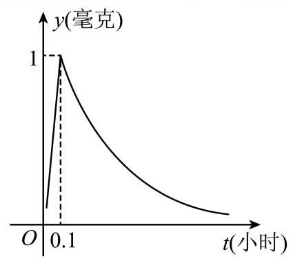
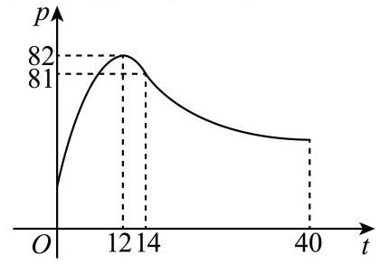

# 研发--应用题-药物浓度模型

## 知识讲解

## 导学说明

## 1. 教学目标

(1) 会从实际情境中识别自变量、因变量和约束范围，能把“有效时间”“舒适时长”“最佳时段”等语言转化为函数不等式或最值问题。

(2) 会处理分段函数模型，能根据不同区间分别建模、求解、合并结论，并注意端点、单位和结果精度。

(3) 能用函数单调性、二次函数性质、指数与对数运算等高中方法解决应用题，不依赖超纲工具。

## 2. 课程重难点

(1)重点: 从题干中抽取变量、函数关系式、定义域和阈值条件，形成“建模-分段-求解-回代解释”的完整链条。

(2)难点: 分段边界处的有效区间合并、多次投放或分阶段累计模型的时间平移，以及含参数最小值问题中的不等式恒成立处理。

## 3. 考查形式与分值占比

(1)题型: 中考/高考模拟中的函数应用解答题、选择填空压轴小题、实际情境建模题。常见设问包括求解析式、求有效时长、求参数范围、判断方案是否可行。

(2)占比: 通常以 8-12 分解答题出现；若作为选择填空压轴，常占 4-5 分。核心得分点集中在建模、分段讨论、阈值不等式求解和结论表达。

## 知识导图

可知识点:函数的应用

## EU知识笔记

函数应用题的一般步骤:

(1) 设定变量: 明确“谁随谁变”，写出自变量、因变量和单位，尤其注意时间起点是否发生平移。

(2) 建模: 把题干给出的文字、图像或规则转化为函数解析式。若函数分段给出，应先写清每一段的适用范围。

(3) 设阈值: 把“有效”“舒适”“最佳”“不低于”“至少”等关键词转化为不等式，例如 $y \geq 4$、$Q<0$、$p \geq 80$。

(4) 分段求解: 在每个区间内分别解不等式或求最值，再与该段定义域取交集。

(5) 回到实际: 合并区间，计算时长或参数范围，最后带单位回答，并按题目要求保留精度。

本讲义的主线不是单纯套公式，而是训练学生把实际语言压缩成一个可计算的函数问题。

## 3. 教法备注

知识标签: 程序性知识；函数应用；分段函数；阈值不等式；最值与参数。

教学步骤:

(1) 先让学生圈出“变量、范围、阈值、目标量”四类信息。

(2) 再要求学生把题目改写成一句数学话: 在什么区间内，求哪个函数满足什么条件。

(3) 最后用表格整理每一段的结论，防止把不同时间段的式子混用。

对应知识层级: 操作 + 迁移。学生需要先掌握基本函数运算，再迁移到实际情境中的时间平移、区间合并和参数控制。

## 母题1

### 母题说明

母题1以药物浓度为情境，核心考点是把“有效/舒适”转化为分段函数阈值不等式，并完成区间求解。

### 教法备注

【选题原因】本题把实际语言中的“有效净化时长”和“人体舒适时长”分别转化为 $4y\geq 4$ 与 $Q<0$。它能帮助学生建立应用题的基本范式: 先翻译条件，再在定义域内求解。

【错因预设】学生容易漏掉分段定义域；容易把“4 个单位剂量”误理解为时间乘 4；也容易在 $Q<0$ 转化为 $3<y<15$ 后忘记再代回 $y=\frac{16}{9-2^x}-1$。

【讲法建议】推荐先画时间轴，把 $0\leq x\leq 3$ 与 $3<x\leq 7$ 分开；再在每段下方写对应不等式。第(2)问重点讲“二次不等式只是中转站，最后仍要回到时间 $x$”。

药物浓度模型

为了改善空气质量, 某科研单位通过实验发现: 在一定范围内, 每使用1个单位剂量的缓释净化剂, 空气中释放的

净化剂浓度 $\mathrm{y}$ (单位:毫克/立方米) 随时间 $\mathrm{x}$ (单位:小时) 变化的函数关系式近似为: $y = \left\{  \begin{array}{l} \frac{16}{9 - {2}^{x}} - 1,0 \leq  x \leq  3 \\  {16} - {2}^{x - 3},3 < x \leq  7 \end{array}\right.$ . 由实验知,当空气中净化剂的浓度不低于4(毫克/立方米)时,它才能起到净化空气的作用.

(1)若一次性使用4个单位剂量的净化剂(此时浓度为1个单位时的4倍)，则有效净化时长约为多少小时？(结果精确到0.1，参考数据: $\lg 2 \approx  {0.3}$ ， $\lg {15} \approx  {1.17}$ )

(2)科研人员定义了“空气舒适度指数”Q，其计算公式为 $Q = {y}^{2} - {18y} + {45}$ (其中y为此时空气中的净化剂浓度). 规定:当 $Q < 0$ 时，人体感觉“舒适”. 若使用了1个单位剂量的净化剂，请问在使用后的3小时内，人体感觉“舒适”的时长约为多久？(结果精确到0.1)

## 答案

(1) 6.9

(2) 0.7小时

### 解析

1) 根据已知可得,一次性使用 4 个单位的净化剂,浓度 $f\left( x\right)  = {4y} = \left\{  \begin{array}{ll} \frac{64}{9 - {2}^{x}} - 4, & 0 \leq  x \leq  3, \\  4\left( {{16} - {2}^{x - 3}}\right) , & 3 < x \leq  7 \end{array}\right.$ ,

则当 $0 \leq  x \leq  3$ 时，由 $\frac{64}{9 - {2}^{x}} - 4 \geq  4$ ，得 $x \geq  0$ ，所以 $0 \leq  x \leq  3$ ，

当 $3 < x \leq  7$ 时，由 $4\left( {{16} - {2}^{x - 3}}\right)  \geq  4$ ，得 ${2}^{x - 3} \leq  {15}$ ， $\left( {x - 3}\right) \lg 2 \leq  \lg {15}$ ，得 $x \leq  {6.9}$ ，所以 $3 < x \leq  {6.9}$ ， 综上, $0 \leq  x \leq  {6.9}$ ,

所以一次喷洒4个单位的净化剂，则净化时间约达6.9小时，

(2) 由 $Q = {y}^{2} - {18y} + {45} < 0$ ，即 $\left( {y - 3}\right) \left( {y - {15}}\right)  < 0$ ，

解得 $3 < y < {15}$ ,

使用了1个单位剂量的净化剂，在使用后的3小时内浓度 $y = \frac{16}{9 - {2}^{x}} - 1$ ,

由 $3 < \frac{16}{9 - {2}^{x}} - 1 < {15}$ 可得 $1 < 9 - {2}^{x} < 4$ ,即 $5 < {2}^{x} < 8$ ,

取对数可得 $\lg 5 < x\lg 2 < 3\lg 2$ ,即 $\frac{\lg 5}{\lg 2} < x < 3$ ,

因为 $\frac{\lg 5}{\lg 2} = \frac{1 - \lg 2}{\lg 2} \approx  {2.3}$ ,所以 ${2.3} < x < 3$ ,

所以在使用后的3小时内, 人体感觉“舒适”的时长约为0.7小时.

## 变式题1-1

### 变式说明

变式1-1与母题同属药效阈值模型，不同在于加入二次投放叠加与时间平移，核心考点是建立 $x$ 与 $x-6$ 两个时间变量下的浓度和。

某化工企业生产过程中不慎污水泄漏，污染了附近水源，政府责成环保部门迅速开展治污行动，根据有关部门试验分析,建议向水源投放治污试剂,已知每投放a个单位 $\left( {0 < a \leq  4\text{ 且 }a \in  \mathrm{R}}\right)$ 的治污试剂,它在水中释放的浓度 $\mathrm{y}$ (克/升) 随着时间 $\mathrm{x}$ (天) 变化的函数关系式近似为 $y = {af}\left( x\right)$ ,其中 $f\left( x\right)  = \left\{  \begin{array}{l} \frac{1 + x}{7 - x}, x \in  \left\lbrack  {0,5}\right\rbrack  \\  \frac{{11} - x}{2}, x \in  (5,{11}\rbrack  \end{array}\right.$ ,若多次投放,

则某一时刻水中的治污试剂浓度为每次投放的治污试剂在相应时刻所释放的浓度之和，根据试验，当水中治污试剂的浓度不低于4(克/升)时，它才能治污有效.

(1) 若只投放一次4个单位的治污试剂，则有效时间最多可能持续几天？

(2)若先投放2个单位的治污试剂，6天后再投放m个单位的治污试剂，要使接下来的5天中，治污试剂能够持续有效，试求m的最小值.

### 答案

(1)7天；

(2) ${m}_{\min } = 2$ .

### 解析

(1)因为一次投放4个单位的治污试剂，

所以水中释放的治污试剂浓度为 $y = {4f}\left( x\right)  = \left\{  \begin{array}{l} \frac{4 + {4x}}{7 - x},0 \leq  x \leq  5 \\  {22} - {2x},5 < x \leq  {11} \end{array}\right.$ ,

当 $0 \leq  x \leq  5$ 时， $\frac{4\left( {1 + x}\right) }{7 - x} \geq  4$ ，解得 $3 \leq  x \leq  5$ ；

当 $5 \leq  x \leq  {11}$ 时， ${22} - {2x} \geq  4$ ，解得 $5 \leq  x \leq  9$ ；

综上, $3 \leq  x \leq  9$ ,故一次投放4个单位的治污试剂,则有效时间可持续7天.

(2)设 从 第 一 次 投 放 起 ，经过 $x\left( {6 \leq  x \leq  {11}}\right)$ 天 后 浓 度 为 $g\left( x\right)  = \left( {{11} - x}\right)  + m\left\lbrack  \frac{1 + x - 6}{7 - \left( {x - 6}\right) }\right\rbrack   = {11} - x + m \cdot  \frac{x - 5}{{13} - x}.$

因为 $6 \leq  x \leq  {11}$ ,则 ${13} - x > 0, x - 5 > 0$ ,

所以 ${11} - x + m \cdot  \frac{x - 5}{{13} - x} \geq  4$ ,即 $m \geq  \frac{\left( {{13} - x}\right) \left( {x - 7}\right) }{x - 5}$ ,令 $x - 5 = t, t \in  \left\lbrack  {1,6}\right\rbrack$ ,

所以 $m \geq   - \frac{\left( {t - 2}\right) \left( {t - 8}\right) }{t} = {10} - \left( {t + \frac{16}{t}}\right)$ ,

因为 $t + \frac{16}{t} \geq  2\sqrt{16} = 8$ ，所以 $m \geq  2$ ，当且仅当 $t = \frac{16}{t}$ ， $t = 4$ 即 $x = 9$ 时等号成立，

故为使接下来的5天中能够持续有效 $\mathrm{m}$ 的最小值为 2 .

## 变式题1-2

### 变式说明

变式1-2与母题同样围绕药物浓度达到阈值，不同在于模型由分段函数变为图像读参与指数衰减，核心考点是由图像确定参数并解指数不等式。

为了预防流感，某学校对教室用药熏消毒法进行消毒. 已知药物释放过程中，室内每立方米空气中的含药量y(毫克)与时间t(小时)成正比; 药物释放完毕后, y与t的函数关系式为y=( $\frac{1}{16}{)}^{t - a}$ (a为常数)，如图所示. 据测定，当空气中每立方米的含药量降低到0.25毫克以下时，学生方可进教室. 则从药物释放开始，至少需要经过 小时后， 学生才能回到教室.

② 答案

0.6

### 解析

当 $\mathrm{t} = {0.1}$ 时，可得 $1 = {\left( \frac{1}{16}\right) }^{{0.1} - \mathrm{a}}$ ,

$\therefore {0.1} - \mathrm{a} = 0,\mathrm{a} = {0.1}$ ,由题意可得 $\mathrm{y} \leq  {0.25} = \frac{1}{4}$ ,

即 ${\left( \frac{1}{16}\right) }^{t - {0.1}} \leq  \frac{1}{4}$ ，即 $t - {0.1} \geq  \frac{1}{2}$ ，

解得 $t \geq  {0.6}$ ,所以至少需要经过 0.6 小时后,学生才能回到教室.

## 母题2

### 母题说明

母题2与母题1同属“阈值决定有效区间”的应用模型，不同在于先由图像求分段解析式，再用 $p\geq80$ 判断最佳听课区间是否足够长。

### 教法备注

【选题原因】本题能把学生从“解出答案”推进到“解释方案是否可行”。第(1)问训练由图像求解析式，第(2)问训练由 $p\geq 80$ 得到最佳区间并比较区间长度。

【错因预设】学生可能把两段函数的定义域写错；对数底数 $a=\frac13$ 后不注意函数单调递减；判断能否讲完时只看某一个端点，而不是看整个最佳时段长度。

【讲法建议】先让学生用图像读出关键点，再分别代入二次函数和对数函数。第(2)问建议写成“最佳听课区间长度 $\Delta t$ 与 22 分钟比较”，突出应用题结论必须回到情境。

1

一研究小组在对某学校的学生上课注意力集中情况的调查研究中发现，其注意力指数 $p$ 与听课时间 $t$ 之间的关系满足如图所示的曲线. 当 $t \in  (0,{14}\rbrack$ 时,曲线是二次函数图像的一部分,当 $t \in  \left\lbrack  {{14},{40}}\right\rbrack$ 时,曲线是函数 $y = {\log }_{a}\left( {t - 5}\right)  + {83}\left( {a > 0,\text{ 且 }a \neq  1}\right)$ 图像的一部分.根据研究，当注意力指数 $p$ 不小于80时听课效果最佳.

(1) 求 $p = f\left( t\right)$ 的函数关系式；

(2)有一道数学难题，讲解需要22分钟，问老师能否经过合理安排在学生听课效果最佳时段讲完？请说明理由.

## 答案

(1) p=fleft(t\\right)=\\begin\{cases\}-\\dfrac\{1\}\{4\}\\\\mathrm\{( )\\t-12\\right)^\{2\}+82, t\\in \\left(0,14\\right]\\\\\\log_\{\\dfrac\{1\}

(2)能，理由见详解

### 解析

(1) 当 $t \in  (0,{14}\rbrack$ 时,设 $p = f\left( t\right)  = c{\left( t - {12}\right) }^{2} + {82}\left( {c < 0}\right)$ ,

将点 $\left( {{14},{81}}\right)$ 代入得 $c =  - \frac{1}{4}$ ，

$\therefore$ 当 $t \in  (0,{14}\rbrack$ 时, $p = f\left( t\right)  =  - \frac{1}{4}{\left( t - {12}\right) }^{2} + {82}$ ;

当 $t \in  \left\lbrack  {{14},{40}}\right\rbrack$ 时,将点 $\left( {{14},{81}}\right)$ 代入 $y = {\log }_{a}\left( {t - 5}\right)  + {83}$ ,得 $a = \frac{1}{3}$ .

所以

p=f\\left(t\\right)=\\begin\{cases\}-\\dfrac\{1\}\{4\}\\mathrm\{ (\}\\t-12\\right)^\{2\}+82, t\\in \\left(0,14\\right]\\\\\\log_\{\\d\\frac\{1\}

(2)当 $t \in  (0,{14}\rbrack$ 时， $\$ @$ .frac\{1\}\{4\}\\mathrm\{ ( \}\\t-12\\right)^\{2\}+82\\geq

解得: ${12} - 2\sqrt{2} \leq  t \leq  {12} + 2\sqrt{2}$ ,

所以 $t \in  \left\lbrack  {{12} - 2\sqrt{2},{14}}\right\rbrack$ ;

当 $t \in  \left\lbrack  {{14},{40}}\right\rbrack$ 时, ${\log }_{\frac{1}{3}}\left( {t - 5}\right)  + {83} \geq  {80}$ ,

解得 $5 < t \leq  {32}$ ,所以 $t \in  \left\lbrack  {{14},{32}}\right\rbrack$ ,

综上 $t \in  \left\lbrack  {{12} - 2\sqrt{2},{32}}\right\rbrack$ 时学生听课效果最佳.

此时 ${\Delta t} = {32} - \left( {{12} - 2\sqrt{2}}\right)  = {20} + 2\sqrt{2} > {22}$ .

所以, 教师能够合理安排时间讲完题目.

故老师能经过合理安排在学生听课效果最佳时段讲完.

某游戏厂商对新出品的一款游戏设定了“防沉迷系统”，规则如下，

### 变式说明

本变式与母题2同样考查“分段过程中的阈值区间”，不同在于由注意力指数改为经验值累计与损失，核心考点是按规则分段计算并求连续达标时间。

①3小时以内(含3小时)为健康时间，玩家在这段时间内获得的累积经验值 $E$ (单位: $\exp$ )与游玩时间 $t$ (小时) 满足关系式: $E = {t}^{2} + {20t} + {16}\left( {t > 0}\right)$ ;

②3到5小时(含5小时)为疲劳时间，玩家在这段时间内获得的经验值为0(即累积经验值不变)；

③超过5小时为不健康时间，累积经验值开始损失，损失的经验值与不健康时间成正比例关系，比例系数为50.

(1) 求当玩家游玩6小时时，求此时的累积经验值；

(2)若玩家为保证累积经验值不低于60，分别求玩家最短游玩时间和可持续保证累积经验值始终不低于60的游玩时间.

### 答案

(1) 35 exp

(2)玩家最短游玩时间为 2 小时，可持续保证累积经验值始终不低于60的游玩时间为 3.5 小时.

### 解析

(1)根据二次函数的性质可知 $E = {t}^{2} + {20t} + {{16}\left( {t > 0}\right) }$ ，在区间 $\left( {0, + \infty }\right)$ 上递增，

当 $t = 3$ 时， $E = 9 + {60} + {16} = {85}$ exp

当 $t = 5$ 时， $E = {85}$ exp

当 $t = 6$ 时， $E = {85} - {50} = {35}\mathrm{{exp}}$ .

(2) 令 $E = {t}^{2} + {20t} + {16} = {60}$ ，解得 $t = 2$ (负根舍去)，

故①当 $2 \leq  t \leq  5$ 时，累积经验值不低于60.

②当 $t > 5$ 时，累积经验值 $E = {85} - {50}\left( {t - 5}\right)  \geq  {60},5 < t \leq  {5.5}$ ，

综上所述，玩家最短游玩时间为2小时，

可持续保证累积经验值始终不低于60的游玩时间为 ${5.5} - 2 = {3.5}$ 小时.

## 分层练习

基础

动综合

可挑战

---
版本号：v1
生成日期：2026-06-16
说明：基于原始 dollar Markdown 生成 PDF-ready 美化排版版本，未修改原始文件。

版本号：v2
生成日期：2026-06-16
说明：使用 math-teacher-handout-pdf 补全教学目标、考查形式与分值占比、课程重难点、知识笔记、知识笔记教法备注、母题说明、母题教法备注和变式说明。

## 对本讲义的深度理解

这份讲义表面上是“药物浓度模型”，本质上是在训练学生处理一类共同结构: 现实情境给出一个随时间变化的量，题目再给出一个阈值，学生要把文字条件翻译成函数不等式，并在正确的时间区间内求出达标时段。母题1强调“已给分段函数后如何解阈值”，变式1-1加入“多次投放叠加与时间平移”，变式1-2转向“图像读参和指数衰减”；母题2把同一思想迁移到注意力指数，进一步要求用区间长度判断教学安排是否可行，最后的防沉迷模型则把连续函数变成分阶段规则。整份讲义真正要建立的不是某一种药物公式，而是“变量-模型-阈值-区间-解释”的应用题思维链。

版本号：v3
生成日期：2026-06-16
说明：将母题说明和变式说明压缩为一句话，并补充对整份讲义结构与教学主线的深度理解。

