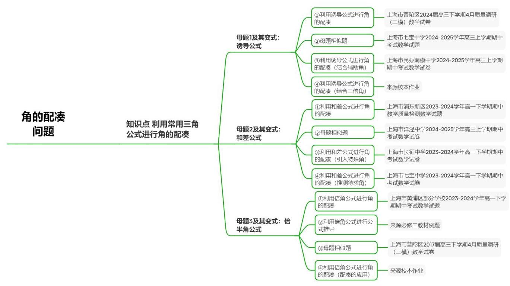
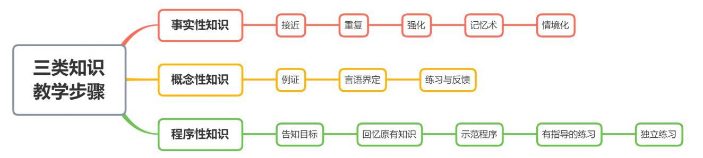

## 角的配凑问题

## 知识讲解

## 导学说明

## 1. 教学目标

(1)识记常见三角公式，理解角的和差、倍角等运算关系

(2)能够灵活运用角的配凑技巧，解决三角恒等变换、求值、化简与证明问题，并能迁移至解三角形及函数综合题中

## 2. 课程重难点

(1)重点:识别已知角与目标角之间的和、差、倍、半关系，熟练使用三角公式(和差公式、诱导公式、倍角公式等)进行配凑变形

(2)难点:非标准形式下的角配凑(如含参数、多步配凑)，配凑后公式的选择与符号判断

## 3. 考查形式与分值占比

(1)题型:全题型考查

(2)占比:在高考中占比5%

## 知识导图

## 3 教法备注

## 1. 三类知识点

(1)事实性知识:

含义:又叫事实，是指学习者通晓一门学科或解决其中的问题所必须知道的基本要素；

(2)概念性知识:

含义:是一种较为抽象概括的、有组织的知识类型;

(3)程序性知识:

含义:是关于如何做事的知识，通常体现为一系列要遵循的步骤或程序；

(4)三类知识教学步骤:

## 2. 本切片知识点标签

知识点利用常用三角公式进行角的凑角:程序性知识

【注】常用三角公式本身属于概念性知识。

## 可知识点:利用常用三角公式进行角的配凑

## 曰知识笔记

## 1. 常用三角公式

## (1)诱导公式

第一组: $\sin \left( {\alpha  + {2k\pi }}\right)  = \sin \alpha ,\cos \left( {\alpha  + {2k\pi }}\right)  = \cos \alpha ,\tan \left( {\alpha  + {2k\pi }}\right)  = \tan \alpha$ ;

第二组: $\sin \left( {\pi  + \alpha }\right)  =  - \sin \alpha ,\cos \left( {\pi  + \alpha }\right)  =  - \cos \alpha ,\tan \left( {\pi  + \alpha }\right)  = \tan \alpha$ ;

第三组: $\sin \left( {-\alpha }\right)  =  - \sin \alpha ,\cos \left( {-\alpha }\right)  = \cos \alpha ,\tan \left( {-\alpha }\right)  = \tan \left( {-\alpha }\right)$ ;

第四组: $\sin \left( {\pi  - \alpha }\right)  = \sin \alpha ,\cos \left( {\pi  - \alpha }\right)  =  - \cos \alpha ,\tan \left( {\pi  - \alpha }\right)  =  - \tan \alpha$ ;

第五组: $\sin \left( {\frac{\pi }{2} - \alpha }\right)  = \cos \alpha ,\cos \left( {\frac{\pi }{2} - \alpha }\right)  = \sin \alpha ,\tan \left( {\frac{\pi }{2} - \alpha }\right)  = \cot \alpha$ ;

第六组: $\sin \left( {\frac{\pi }{2} + \alpha }\right)  = \cos \alpha ,\;\cos \left( {\frac{\pi }{2} + \alpha }\right)  =  - \sin \alpha ,\tan \left( {\frac{\pi }{2} + \alpha }\right)  =  - \cot \alpha$ .

## (2)和差公式

$\cos \left( {\alpha  + \beta }\right)  = \cos \alpha \cos \beta  - \sin \alpha \sin \beta ,\cos \left( {\alpha  - \beta }\right)  = \cos \alpha \cos \beta  + \sin \alpha \sin \beta ;$

$\sin \left( {\alpha  + \beta }\right)  = \sin \alpha \cos \beta  + \cos \alpha \sin \beta ,\sin \left( {\alpha  - \beta }\right)  = \sin \alpha \cos \beta  - \cos \alpha \sin \beta ;$

$\tan \left( {\alpha  + \beta }\right)  = \frac{\tan \alpha  + \tan \beta }{1 - \tan \alpha \tan \beta },\tan \left( {\alpha  - \beta }\right)  = \frac{\tan \alpha  - \tan \beta }{1 + \tan \alpha \tan \beta }.$

## (3)倍半角公式

$\sin {2\alpha } = 2\sin \alpha \cos \alpha$

$\cos {2\alpha } = {\cos }^{2}\alpha  - {\sin }^{2}\alpha  = 2{\cos }^{2}\alpha  - 1 = 1 - 2{\sin }^{2}\alpha ,\tan {2\alpha } = \frac{2\tan \alpha }{1 - {\tan }^{2}\alpha };$

$\sin \frac{\alpha }{2} =  \pm  \sqrt{\frac{1 - \cos \alpha }{2}},\cos \frac{\alpha }{2} =  \pm  \sqrt{\frac{1 + \cos \alpha }{2}},\tan \frac{\alpha }{2} =  \pm  \sqrt{\frac{1 - \cos \alpha }{1 + \cos \alpha }};$

$\tan \frac{\alpha }{2} = \frac{1 - \cos \alpha }{\sin \alpha } = \frac{\sin \alpha }{1 + \cos \alpha }$

## 2. 角的配凑方法

先观察已知角和待求角之间的关系，并用已知角表示出待求角，再选择合适的公式(诱导、和差、倍半角)， 加以计算. 常见角的配凑方式举例:

(1)诱导公式: $\alpha  + \frac{\pi }{3} = \frac{\pi }{2} + \left( {\alpha  - \frac{\pi }{6}}\right)$ ， $\alpha  + \frac{\pi }{3} = \pi  - \left( {\frac{2\pi }{3} - \alpha }\right)$

(1)和差公式: $\alpha  = \left( {\alpha  + \beta }\right)  - \beta$

(1)倍半角公式 (通常会结合其他公式考查) : ${2\alpha } + \frac{\pi }{6} = \frac{\pi }{2} + 2\left( {\alpha  - \frac{\pi }{6}}\right)$

## 教法备注

知识标签:程序性知识

教学步骤:本讲需要学生能够利用三角公式进行给定角的求解，该讲知识点建立在已经学习完常用三角公式的基础上，所以教师应先带领学生复习常见三角公式，然后每种配凑方法教师都可以至少演示一道例题，以及部分变式，让学生能够在操作中学会角的配凑方法，最后进行独立练习

对应知识层级:操作

母题1

## 3 教法备注

母题说明:考查利用诱导公式进行角的配凑

若 $\cos \left( {\frac{\pi }{3} - \alpha }\right)  = \frac{3}{5}$ ，则 $\sin \left( {\frac{\pi }{6} + \alpha }\right)  =$ ___.

---

	答案

$\frac{3}{5}$

---

解析

利用诱导公式，求得所求表达式的值.

解: 依题意 $\sin \left( {\frac{\pi }{6} + \alpha }\right)  = \sin \left\lbrack  {\frac{\pi }{2} - \left( {\frac{\pi }{3} - \alpha }\right) }\right\rbrack   = \cos \left( {\frac{\pi }{3} - \alpha }\right)  = \frac{3}{5}$ .

故答案为: $\frac{3}{5}$

## 教法备注

1.【选题原因】

本题表面没有出现 $\frac{\pi }{2}\text{ 、 }\pi$ 等诱导公式标准形式，但通过观察已知角与待求角之和为 $\frac{\pi }{2}$ ，可转化为诱导公式求解。选题意在引导学生突破 " 诱导公式只用于单独角 " 的思维定式，建立 " 整体角配凑 " 思想，为后续复杂三角恒等变换打下基础

2.【错因预设】

(1)未能发现 $\left( {\frac{\pi }{3} - \alpha }\right)  + \left( {\frac{\pi }{6} + \alpha }\right)  = \frac{\pi }{2}$ ，盲目尝试和差公式，计算繁琐且易错；

(2)虽发现和为 $\frac{\pi }{2}$ ，但混淆诱导公式符号，如误写 $\sin \left( {\frac{\pi }{2} - x}\right)  =  - \cos x$ ；

(3)将 $\frac{\pi }{6} + \alpha$ 错误地展开成和差公式，忽略更简解法.

3.【讲法建议】

(1)解法一(配凑诱导公式，推荐)

由 $\left( {\frac{\pi }{3} - \alpha }\right)  + \left( {\frac{\pi }{6} + \alpha }\right)  = \frac{\pi }{2}$ ，得 $\frac{\pi }{6} + \alpha  = \frac{\pi }{2} - \left( {\frac{\pi }{3} - \alpha }\right)$ 。

所以 $\sin \left( {\frac{\pi }{6} + \alpha }\right)  = \sin \left\lbrack  {\frac{\pi }{2} - \left( {\frac{\pi }{3} - \alpha }\right) }\right\rbrack   = \cos \left( {\frac{\pi }{3} - \alpha }\right)  = \frac{3}{5}$ 。

(2)解法二(和差公式展开)

$\sin \left( {\frac{\pi }{6} + \alpha }\right)  = \sin \frac{\pi }{6}\cos \alpha  + \cos \frac{\pi }{6}\sin \alpha  = \frac{1}{2}\cos \alpha  + \frac{\sqrt{3}}{2}\sin \alpha$  。

由 $\cos \left( {\frac{\pi }{3} - \alpha }\right)  = \cos \frac{\pi }{3}\cos \alpha  + \sin \frac{\pi }{3}\sin \alpha  = \frac{1}{2}\cos \alpha  + \frac{\sqrt{3}}{2}\sin \alpha  = \frac{3}{5}$ ，对比即得原式 $= \frac{3}{5}$ 。

【该方法虽然不错，但高度依赖两式形式相同，所以通用性不如解法一】

(3)解法三(设元换元)

令 $t = \frac{\pi }{3} - \alpha$ ,则 $\alpha  = \frac{\pi }{3} - t$ 。代入待求角: $\frac{\pi }{6} + \alpha  = \frac{\pi }{6} + \frac{\pi }{3} - t = \frac{\pi }{2} - t$ 。

故 $\sin \left( {\frac{\pi }{6} + \alpha }\right)  = \sin \left( {\frac{\pi }{2} - t}\right)  = \cos t = \frac{3}{5}$ 。

【对于复杂角的配凑问题，或对于学生很难观察出关系时，可以采用该方法，重点教授】

## 3 教法备注

变式说明:考查利用诱导公式进行角的配凑(母题的相似题，供学生独立练习)

已知 $\sin \left( {\theta  + \frac{\pi }{4}}\right)  = \frac{1}{2}$ . 则 $\cos \left( {\theta  - \frac{\pi }{4}}\right)  =$

答案

$\frac{1}{2}$

解析

【分析】依题意利用两角之间的关系并根据诱导公式计算可得结果.

【详解】根据题意，由诱导公式可得

$\sin \left( {\theta  + \frac{\pi }{4}}\right)  = \cos \left( {\frac{\pi }{2} - \left( {\theta  + \frac{\pi }{4}}\right) }\right)  = \cos \left( {\frac{\pi }{4} - \theta }\right)  = \cos \left( {\theta  - \frac{\pi }{4}}\right)  = \frac{1}{2},$

所以 $\cos \left( {\theta  - \frac{\pi }{4}}\right)  = \frac{1}{2}$ .

故答案为: $\frac{1}{2}$

变式题1-2

## 3 教法备注

变式说明:考查利用诱导公式进行角的配凑(需要结合辅助角公式)

已知 $\sin \alpha  - \sqrt{3}\cos \alpha  = \frac{1}{2},\cos \left( {\alpha  + \frac{\pi }{6}}\right)  =$

答案

$- \frac{1}{4}$

解析

利用辅助角公式得到 $\sin \left( {\alpha  - \frac{\pi }{3}}\right)  = \frac{1}{4}$ ，再整体法用诱导公式求出答案.

$\sin \alpha  - \sqrt{3}\cos \alpha  = \frac{1}{2}$ ,即 $\sin \left( {\alpha  - \frac{\pi }{3}}\right)  = \frac{1}{4}$ ,

$\cos \left( {\alpha  + \frac{\pi }{6}}\right)  = \sin \left\lbrack  {\frac{\pi }{2} - \left( {\alpha  + \frac{\pi }{6}}\right) }\right\rbrack   = \sin \left( {\frac{\pi }{3} - \alpha }\right)  =  - \frac{1}{4}.$

故答案为: $- \frac{1}{4}$

## 变式题1-3

## 3 教法备注

变式说明:考查利用诱导公式进行角的配凑(需要结合二倍角公式)

已知 $\cos \left( {\frac{\pi }{4} + \alpha }\right)  = \frac{1}{3}$ ，则 $\cos \left( {\frac{\pi }{2} - {2\alpha }}\right)  =$ ___

---

	答案

$\frac{7}{9}$

	解析

---

母题2

## 3 教法备注

母题说明:考查利用和差公式进行角的配凑

若 $\alpha ,\beta$ 为锐角， $\sin \alpha  = \frac{4\sqrt{3}}{7},\cos \left( {\alpha  + \beta }\right)  =  - \frac{11}{14}$ ，则角 $\beta  =$ ___.

答案

$\frac{\pi }{3}$

解析

结合两角差的余弦公式、同角三角函数的基本关系式求得 $\cos \beta$ ，进而求得 $\beta$ .

由于 $\alpha ,\beta$ 为锐角，所以 $0 < \alpha  + \beta  < \pi$ ，

所以 $\cos \alpha  = \sqrt{1 - {\sin }^{2}\alpha } = \frac{1}{7},\sin \left( {\alpha  + \beta }\right)  = \sqrt{1 - {\cos }^{2}\left( {\alpha  + \beta }\right) } = \frac{5\sqrt{3}}{14}$ ，

所以 $\cos \beta  = \cos \left\lbrack  {\left( {\alpha  + \beta }\right)  - \alpha }\right\rbrack   = \cos \left( {\alpha  + \beta }\right) \cos \alpha  + \sin \left( {\alpha  + \beta }\right) \sin \alpha$

$=  - \frac{11}{14} \times  \frac{1}{7} + \frac{5\sqrt{3}}{14} \times  \frac{4\sqrt{3}}{7} = \frac{1}{2},$

所以 $\beta  = \frac{\pi }{3}$ .

故答案为: $\frac{\pi }{3}$

## 3 教法备注

1.【选题原因】

本题已知 $\sin \alpha$ 和 $\cos \left( {\alpha  + \beta }\right)$ ，直接展开 $\cos \left( {\alpha  + \beta }\right)$ 会引入 $\sin \beta$ 与 $\cos \beta$ ，需要联立方程求解，计算繁琐。选题意在引导学生建立 " 待求角 = 已知角之和(或差) " 的配凑思想，即 $\beta  = \left( {\alpha  + \beta }\right)  - \alpha$ ，从而直接使用和差公式，简化运算过程。本题是 "整体角配凑 " 从诱导公式向和差公式的自然延伸。

2.【错因预设】

(1)直接展开 $\cos \left( {\alpha  + \beta }\right)  = \cos \alpha \cos \beta  - \sin \alpha \sin \beta$ ，代入后得到关于 $\sin \beta ,\cos \beta$ 的方程，再联立 ${\sin }^{2}\beta  + {\cos }^{2}\beta  = 1$ 求解，计算量大且易出现符号或数值错误。

(2)未能发现 $\beta  = \left( {\alpha  + \beta }\right)  - \alpha$ 的关系，导致解题路径复杂。

(3)求出 $\sin \beta$ 或 $\cos \beta$ 后，忽略 $\alpha ,\beta$ 为锐角这一范围限制，得到多个可能值，无法确定唯一角。

(4)计算过程中混淆 $\sin \left( {\alpha  + \beta }\right)$ 的符号(因 $\cos \left( {\alpha  + \beta }\right)  < 0$ 且 $\alpha  + \beta$ 为锐角或钝角？需结合范围判断)。

3.【讲法建议】

(1)解法一(配凑和差公式，推荐)

由 $\beta  = \left( {\alpha  + \beta }\right)  - \alpha ,\cos \beta  = \cos \left\lbrack  {\left( {\alpha  + \beta }\right)  - \alpha }\right\rbrack   = \cos \left( {\alpha  + \beta }\right) \cos \alpha  + \sin \left( {\alpha  + \beta }\right) \sin \alpha$ .

已知 $\sin \alpha  = \frac{4\sqrt{3}}{7}$ ，则 $\cos \alpha  = \sqrt{1 - {\sin }^{2}\alpha } = \frac{1}{7}$ ( $\alpha$ 为锐角，取正)。

已知 $\cos \left( {\alpha  + \beta }\right)  =  - \frac{11}{14}$ ，则 $\sin \left( {\alpha  + \beta }\right)  = \frac{5\sqrt{3}}{14}$ . $\alpha ,\beta$ 为锐角，故 $0 < \alpha  + \beta  < \pi$ ，且 $\cos \left( {\alpha  + \beta }\right)  < 0$ ， 所以 $\alpha  + \beta$ 为钝角， $\sin \left( {\alpha  + \beta }\right)  > 0$ ，符号正确。

$\cos \beta  = \left( {-\frac{11}{14}}\right)  \cdot  \frac{1}{7} + \frac{5\sqrt{3}}{14} \cdot  \frac{4\sqrt{3}}{7} = \frac{1}{2}$ . 又 $\beta$ 为锐角，所以 $\beta  = \frac{\pi }{3}$

(2)解法二(展开联立)

由 $\cos \left( {\alpha  + \beta }\right)  = \cos \alpha \cos \beta  - \sin \alpha \sin \beta  = \frac{1}{7}\cos \beta  - \frac{4\sqrt{3}}{7}\sin \beta  =  - \frac{11}{14}$ ，

两边乘14: $2\cos \beta  - 8\sqrt{3}\sin \beta  =  - {11}$ 。再联立 ${\cos }^{2}\beta  + {\sin }^{2}\beta  = 1$ ，解方程组得 $\cos \beta  = \frac{1}{2},\sin \beta  = \frac{\sqrt{3}}{2}$ (取正值),故 $\beta  = \frac{\pi }{3}$ 。

【计算繁琐，且易出现符号判断失误】

变式题2-1

## 教法备注

母题说明:考查利用和差公式进行角的配凑(母题类似题，供学生独立练习)

已知角 $\alpha$ ， $\beta$ 为锐角， $\tan \alpha  = \frac{\sqrt{3}}{2}$ ， $\sin \left( {\alpha  - \beta }\right)  = \frac{\sqrt{21}}{14}$ ，则 $\tan \left( {{2\alpha } - \beta }\right)$ 的值为___.

## 答案

$\sqrt{3}$

解析

先由同角三角函数的基本关系求得 $\tan \left( {\alpha  - \beta }\right)$ ，再由两角和的正切公式结合 $\tan \left( {{2\alpha } - \beta }\right)  = \tan \left\lbrack  {\alpha  + \left( {\alpha  - \beta }\right) }\right\rbrack$ 即可得解.

因为角 $\alpha \text{ 、 }\beta$ 为锐角，所以 $\alpha  - \beta  \in  \left( {-\frac{\pi }{2},\frac{\pi }{2}}\right)$ ，

又 $\sin \left( {\alpha  - \beta }\right)  = \frac{\sqrt{21}}{14}$ ，所以 $\cos \left( {\alpha  - \beta }\right)  = \sqrt{1 - {\sin }^{2}\left( {\alpha  - \beta }\right) } = \sqrt{1 - {\left( \frac{\sqrt{21}}{14}\right) }^{2}} = \frac{5\sqrt{7}}{14}$ ，

所以 $\tan \left( {\alpha  - \beta }\right)  = \frac{\sin \left( {\alpha  - \beta }\right) }{\cos \left( {\alpha  - \beta }\right) } = \frac{\frac{\sqrt{21}}{14}}{\frac{5\sqrt{7}}{14}} = \frac{\sqrt{3}}{5}$ ，又 $\tan \alpha  = \frac{\sqrt{3}}{2}$ ，

所以 $\tan \left( {{2\alpha } - \beta }\right)  = \tan \left\lbrack  {\alpha  + \left( {\alpha  - \beta }\right) }\right\rbrack   = \frac{\tan \alpha  + \tan \left( {\alpha  - \beta }\right) }{1 - \tan \alpha \tan \left( {\alpha  - \beta }\right) } = \frac{\frac{\sqrt{3}}{2} + \frac{\sqrt{3}}{5}}{1 - \frac{\sqrt{3}}{2} \times  \frac{\sqrt{3}}{5}} = \sqrt{3}$ .

故答案为: $\sqrt{3}$ .

变式题2-2

## 3 教法备注

变式说明: 考查利用和差公式进行角的配凑(需要根据已知条件引入特殊角为 $\frac{\pi }{4}$ )

已知 $\cos \left( {\alpha  + \frac{\pi }{12}}\right)  = \frac{3}{5},\alpha  \in  \left( {0,\frac{\pi }{2}}\right)$ ，则 $\cos \left( {\alpha  + \frac{\pi }{3}}\right)  =$ ___.

答案

$- \frac{\sqrt{2}}{10}$

解析

先由已知条件求出 $\sin \left( {\alpha  + \frac{\pi }{12}}\right)$ ，再由于 $\alpha  + \frac{\pi }{3} = \left( {\alpha  + \frac{\pi }{12}}\right)  + \frac{\pi }{4}$ ，所以

$\cos \left( {\alpha  + \frac{\pi }{3}}\right)  = \cos \left\lbrack  {\left( {\alpha  + \frac{\pi }{12}}\right)  + \frac{\pi }{4}}\right\rbrack$ ,利用两角和的余弦公式展开计算即可.

因为 $\cos \left( {\alpha  + \frac{\pi }{12}}\right)  = \frac{3}{5} > 0,\alpha  \in  \left( {0,\frac{\pi }{2}}\right)$ ，

所以 $\left( {\alpha  + \frac{\pi }{12}}\right)  \in  \left( {\frac{\pi }{12},\frac{\pi }{2}}\right)$ ，

所以 $\sin \left( {\alpha  + \frac{\pi }{12}}\right)  = \sqrt{1 - {\cos }^{2}\left( {\alpha  + \frac{\pi }{12}}\right) } = \sqrt{1 - \frac{9}{25}} = \frac{4}{5}$ ,

所以 $\cos \left( {\alpha  + \frac{\pi }{3}}\right)  = \cos \left\lbrack  {\left( {\alpha  + \frac{\pi }{12}}\right)  + \frac{\pi }{4}}\right\rbrack$

$= \cos \left( {\alpha  + \frac{\pi }{12}}\right) \cos \frac{\pi }{4} - \sin \left( {\alpha  + \frac{\pi }{12}}\right) \sin \frac{\pi }{4}$

$= \frac{3}{5} \times  \frac{\sqrt{2}}{2} - \frac{4}{5} \times  \frac{\sqrt{2}}{2} =  - \frac{\sqrt{2}}{10}$ ,

故答案为: $- \frac{\sqrt{2}}{10}$

变式题2-3

## 3 教法备注

变式说明:考查利用和差公式进行角的配凑(需要根据已知条件推测待求角为α)

已知 $2\sin \beta  - \cos \beta  + 2 = 0,\sin \alpha  = 2\sin \left( {\alpha  + \beta }\right)$ ，则 $\tan \left( {\alpha  + \beta }\right)  =$

答案

$\frac{1}{2}$

解析

利用正弦的和差公式及同角三角函数的商数关系计算即可

由题意可知 $\sin \alpha  = \sin \left\lbrack  {\left( {\alpha  + \beta }\right)  - \beta }\right\rbrack   = \sin \left( {\alpha  + \beta }\right) \cos \beta  - \cos \left( {\alpha  + \beta }\right) \sin \beta$

$= 2\sin \left( {\alpha  + \beta }\right)$ ,

即 $\sin \left( {\alpha  + \beta }\right) \left( {\cos \beta  - 2}\right)  = \cos \left( {\alpha  + \beta }\right) \sin \beta$ ,

由题意可知 $\cos \left( {\alpha  + \beta }\right)  \neq  0,\cos \beta  - 2 \neq  0$ ,

则 $\frac{\sin \left( {\alpha  + \beta }\right) }{\cos \left( {\alpha  + \beta }\right) } = \frac{\sin \beta }{\cos \beta  - 2} = \frac{\sin \beta }{2\sin \beta } = \frac{1}{2}$ .

故答案为: $\frac{1}{2}$

方法点睛:三角恒等变换化简求值问题需要注意已知角与未知角的关系，利用合理的配凑即可处理.本题已知 $\beta$ 及 $\alpha$ 与 $\alpha  + \beta$ 的关系，所以构造 $\sin \alpha  = \sin \left( {\left( {\alpha  + \beta }\right)  - \beta }\right)$ ，利用整体思想凑出未知式计算即可.

母题3

## 教法备注

母题说明:考查利用倍角公式进行角的配凑(用已知角表示待求角) 若 $\sin \left( {\frac{\pi }{12} - \frac{\alpha }{2}}\right)  = \frac{4}{5}$ ，则 $\cos \left( {{2\alpha } - \frac{\pi }{3}}\right)  =$ ___.

答案

$- \frac{527}{625}$

解析

由二倍角公式求解即可.

$\because \sin \left( {\frac{\pi }{12} - \frac{\alpha }{2}}\right)  = \frac{4}{5},\therefore \cos \left( {\frac{\pi }{6} - \alpha }\right)  = 1 - 2{\sin }^{2}\left( {\frac{\pi }{12} - \frac{\alpha }{2}}\right)  = 1 - 2 \times  \frac{16}{25} =  - \frac{7}{25}$

$\therefore \cos \left( {{2\alpha } - \frac{\pi }{3}}\right)  = 2{\cos }^{2}\left( {\frac{\pi }{6} - \alpha }\right)  - 1 = 2 \times  {\left( -\frac{7}{25}\right) }^{2} - 1 =  - \frac{527}{625}$ ,

故答案为: $- \frac{527}{625}$

## 教法备注

1.【选题原因】

本题已知角为 $\frac{\pi }{12} - \frac{\alpha }{2}$ ，待求角为 ${2\alpha } - \frac{\pi }{3}$ ，表面没有直接的和、差或倍角关系。选题意在引导学生主动使用换元法将复杂角 " 化繁为简 "，发现 ${2\alpha } - \frac{\pi }{3} =  - 4\left( {\frac{\pi }{12} - \frac{\alpha }{2}}\right)$ ，从而转化为倍角公式问题。这是前两个母题(诱导公式、和差公式配凑)的进一步深化，考查学生对 "整体角" 的代数操作能力。

2.【错因预设】

(1)未能发现已知角与待求角之间的倍数关系，试图展开 $\sin \left( {\frac{\pi }{12} - \frac{\alpha }{2}}\right)$ 求出 $\sin \frac{\alpha }{2}$ 和 $\cos \frac{\alpha }{2}$ ，再求 $\cos \left( {{2\alpha } - \frac{\pi }{3}}\right)$ ,计算量极大。

(2)虽设 $t = \frac{\pi }{12} - \frac{\alpha }{2}$ ，但无法正确表示待求角，如错误写成 ${2\alpha } - \frac{\pi }{3} = {2t}$ 或 ${4t}$ 等形式。

(3)得到关系 ${2\alpha } - \frac{\pi }{3} =  - {4t}$ 后，误用倍角公式符号，如 $\cos \left( {-{4t}}\right)  =  - \cos {4t}$ 。

(4)在计算 $\cos {4t}$ 时，由 $\sin t = \frac{4}{5}$ 求 $\cos {2t}$ 或 $\cos {4t}$ 时，忽略 $\cos {2t}$ 的符号判断，导致多解。

3.【讲法建议】

(1)解法一(换元+倍角公式，推荐)

设 $t = \frac{\pi }{12} - \frac{\alpha }{2}$ ,则 $\alpha  = \frac{\pi }{6} - {2t}$ 。代入待求角: ${2\alpha } - \frac{\pi }{3} = 2\left( {\frac{\pi }{6} - {2t}}\right)  - \frac{\pi }{3} = \frac{\pi }{3} - {4t} - \frac{\pi }{3} =  - {4t}$ .

$\cos \left( {{2\alpha } - \frac{\pi }{3}}\right)  = \cos \left( {-{4t}}\right)  = \cos {4t}$ ,由 $\sin t = \frac{4}{5}$ 得:

$\cos {2t} = 1 - 2{\sin }^{2}t =  - \frac{7}{25},\cos {4t} = 2{\cos }^{2}{2t} - 1 =  - \frac{527}{625}$

(2)解法二(展开联立)

由 $\sin \left( {\frac{\pi }{12} - \frac{\alpha }{2}}\right)  = \frac{4}{5}$ ，可求出 $\cos \left( {\frac{\pi }{12} - \frac{\alpha }{2}}\right)  =  \pm  \frac{3}{5}$ ，再展开求 $\sin \frac{\alpha }{2},\cos \frac{\alpha }{2}$ ，进而求 $\sin \alpha ,\cos \alpha$ ， 最后求 $\cos \left( {{2\alpha } - \frac{\pi }{3}}\right)$ 。

【整个过程需讨论符号，计算繁琐，极易出错，不建议采用】

## 3 教法备注

母题说明:考查利用倍角公式进行角的配凑(凑二倍角)

2

求证: $\tan \frac{\alpha }{2} = \frac{\sin \alpha }{1 + \cos \alpha } = \frac{1 - \cos \alpha }{\sin \alpha }$ .

答案

证明见解析

解析

$\tan \frac{\alpha }{2} = \frac{\sin \frac{\alpha }{2}}{\cos \frac{\alpha }{2}} = \frac{2\sin \frac{\alpha }{2}\cos \frac{\alpha }{2}}{2{\cos }^{2}\frac{\alpha }{2}} = \frac{\sin \alpha }{1 + \cos \alpha }.$

$\tan \frac{\alpha }{2} = \frac{\sin \frac{\alpha }{2}}{\cos \frac{\alpha }{2}} = \frac{2{\sin }^{2}\frac{\alpha }{2}}{2\sin \frac{\alpha }{2}\cos \frac{\alpha }{2}} = \frac{1 - \cos \alpha }{\sin \alpha }.$

所以 $\tan \frac{\alpha }{2} = \frac{\sin \alpha }{1 + \cos \alpha } = \frac{1 - \cos \alpha }{\sin \alpha }$

此题考查三角恒等式的证明，关键在于熟练掌握二倍角公式的应用，根据公式进行化简变形.

## 教法备注

1.【选题原因】

本题是教材经典恒等式，表面是半角正切公式，但核心是 " 凑二倍角 " 思想。选题目的有三:

(1)训练学生逆向使用倍角公式(将单角 $\alpha$ 视为二倍角 $2 \cdot  \frac{\alpha }{2}$ )；

(2)掌握 “ 从右向左 " 证明的技巧，为复杂三角恒等变形积累经验;

(3)该公式在三角化简、积分、解三角形中均有重要应用，是高频考点。

2.【错因预设】

(1)试图从左向右证明时，将 $\tan \frac{\alpha }{2}$ 写成 $\frac{\sin \frac{\alpha }{2}}{\cos \frac{\alpha }{2}}$ ，然后分子分母乘以 $2\cos \frac{\alpha }{2}$ 或 $2\sin \frac{\alpha }{2}$ 时，不能正确得到 $\sin \alpha$ 和 $1 + \cos \alpha$ 。

(2)对公式 $1 + \cos \alpha  = 2{\cos }^{2}\frac{\alpha }{2}$ 和 $1 - \cos \alpha  = 2{\sin }^{2}\frac{\alpha }{2}$ 不熟悉。

(3)证明过程中符号处理不当(如忽略分母不为零的条件)。

(4)只证明一个等号，忽略另一个等号的证明，或误以为三个表达式自动相等

3.【讲法建议】

(1)解法一(从右到左证明)

$$
\frac{\sin \alpha }{1 + \cos \alpha } = \frac{2\sin \frac{\alpha }{2}\cos \frac{\alpha }{2}}{1 + \left( {2{\cos }^{2}\frac{\alpha }{2} - 1}\right) } = \frac{2\sin \frac{\alpha }{2}\cos \frac{\alpha }{2}}{2{\cos }^{2}\frac{\alpha }{2}} = \frac{\sin \frac{\alpha }{2}}{\cos \frac{\alpha }{2}} = \tan \frac{\alpha }{2}.
$$

$$
\frac{1 - \cos \alpha }{\sin \alpha } = \frac{1 - \left( {1 - 2{\sin }^{2}\frac{\alpha }{2}}\right) }{2\sin \frac{\alpha }{2}\cos \frac{\alpha }{2}} = \frac{2{\sin }^{2}\frac{\alpha }{2}}{2\sin \frac{\alpha }{2}\cos \frac{\alpha }{2}} = \frac{\sin \frac{\alpha }{2}}{\cos \frac{\alpha }{2}} = \tan \frac{\alpha }{2}.
$$

(2)解法二(从左到右证明)

$\tan \frac{\alpha }{2} = \frac{2\sin \frac{\alpha }{2}\cos \frac{\alpha }{2}}{2{\cos }^{2}\frac{\alpha }{2}} = \frac{\sin \alpha }{1 + \cos \alpha }.$

$\tan \frac{\alpha }{2} = \frac{2{\sin }^{2}\frac{\alpha }{2}}{2\sin \frac{\alpha }{2}\cos \frac{\alpha }{2}} = \frac{1 - \cos \alpha }{\sin \alpha }.$

(3)解法三(交叉相乘)

要证 $\tan \frac{\alpha }{2} = \frac{\sin \alpha }{1 + \cos \alpha }$ ，只需证 $\sin \alpha  \cdot  \cos \frac{\alpha }{2} = \sin \frac{\alpha }{2}\left( {1 + \cos \alpha }\right)$ 。

左边 $= 2\sin \frac{\alpha }{2}{\cos }^{2}\frac{\alpha }{2}$ ，右边 $= \sin \frac{\alpha }{2}\left( {1 + 2{\cos }^{2}\frac{\alpha }{2} - 1}\right)  = 2\sin \frac{\alpha }{2}{\cos }^{2}\frac{\alpha }{2}$ ，相等。另一个同理。

【此法适合选择题或快速验证，证明题需写完整】

## 变式题3-1

## ○ 教法备注

变式说明:考查利用倍角公式进行角的配凑(母题类似题，供学生独立完成)

若 $\frac{\pi }{2} < \alpha  < \pi ,\sin \alpha  = \frac{3}{5}$ ，则 $\tan \frac{\alpha }{2} =$

答案

3

解析

## 3. 教法备注

变式说明:考查利用倍角公式进行角的配凑(母题第2题方法的应用)

$\cos \frac{\pi }{17}\cos \frac{2\pi }{17}\cos \frac{4\pi }{17}\cos \frac{8\pi }{17} =$

答案

$\frac{1}{16}$

解析

$\cos \frac{\pi }{17}\cos \frac{2\pi }{17}\cos \frac{4\pi }{17}\cos \frac{8\pi }{17}$

$= \frac{\cos \frac{\pi }{17}\cos \frac{2\pi }{17}\cos \frac{4\pi }{17}\cos \frac{8\pi }{17}\left( {{2}^{4}\sin \frac{\pi }{17}}\right) }{{2}^{4}\sin \frac{\pi }{17}}$

$= \frac{\sin \frac{16\pi }{17}}{{2}^{4}\sin \frac{\pi }{17}}$

$= \frac{1}{16}$

## 分层练习

基础

1

已知 $\tan \left( {\alpha  + \beta }\right)  = 4,\tan \left( {\alpha  - \beta }\right)  =  - 3$ ，则 $\tan {2\beta } =$

9 答案

$- \frac{7}{11}$

解析

根据题意，结合两角差的正切公式，准确计算，即可求解.

由题意知: $\tan \left( {\alpha  + \beta }\right)  = 4,\tan \left( {\alpha  - \beta }\right)  =  - 3$ ,

可得 $\tan {2\beta } = \tan \left\lbrack  {\alpha  + \beta  - \left( {\alpha  - \beta }\right) }\right\rbrack   = \frac{\tan \left( {\alpha  + \beta }\right)  - \tan \left( {\alpha  - \beta }\right) }{1 + \tan \left( {\alpha  + \beta }\right) \tan \left( {\alpha  - \beta }\right) } =  - \frac{7}{11}$ .

故答案为: $- \frac{7}{11}$ .

已知 $\cos \left( {\alpha  - \beta }\right) \cos \alpha  + \sin \left( {\alpha  - \beta }\right) \sin \alpha  =  - \frac{4}{5}$ ， $\beta$ 是第三象限的角，则 $\sin \beta  =$ ___.

答案

$- \frac{3}{5}$

解析

根据两角差的余弦公式结合诱导公式以及同角的三角函数关系，即可求得答案.

由 $\cos \left( {\alpha  - \beta }\right) \cos \alpha  + \sin \left( {\alpha  - \beta }\right) \sin \alpha  =  - \frac{4}{5}$ ,

可得 $\cos \left\lbrack  {\left( {\alpha  - \beta }\right)  - \alpha }\right\rbrack   =  - \frac{4}{5}$ ，即 $\cos \left( {-\beta }\right)  =  - \frac{4}{5}$ ， $\therefore \cos \beta  =  - \frac{4}{5}$ ，

由于 $\beta$ 是第三象限的角，故 $\sin \beta  =  - \sqrt{1 - {\cos }^{2}\beta } =  - \frac{3}{5}$ ，

故答案为: $- \frac{3}{5}$

3

已知 $\cos \left( {\alpha  + \frac{\pi }{6}}\right)  = \frac{1}{4}$ ，则 $\sin \left( {{2\alpha } + \frac{5\pi }{6}}\right)  =$ ( )

A. $\frac{\sqrt{15}}{8}$ B. $- \frac{\sqrt{15}}{8}$ C. $\frac{7}{8}$ D. $- \frac{7}{8}$

答案

D

解析

利用诱导公式结合二倍角的余弦公式可求得所求值.

$\sin \left( {{2\alpha } + \frac{5\pi }{6}}\right)  = \sin \left( {{2\alpha } + \frac{\pi }{3} + \frac{\pi }{2}}\right)  = \cos \left( {{2\alpha } + \frac{\pi }{3}}\right)  = 2{\cos }^{2}\left( {\alpha  + \frac{\pi }{6}}\right)  - 1 = 2 \times  {\left( \frac{1}{4}\right) }^{2} - 1 =  - \frac{7}{8}.$ 故选: D.

4

已知 $\alpha$ 为锐角，且 $\cos \left( {\alpha  + \frac{\pi }{4}}\right)  = \frac{3}{5}$ ，则 $\sin \alpha  =$ ___.

答案

$\frac{\sqrt{2}}{10}$

解析 $\sin \alpha  = \sin \left\lbrack  {\left( {\alpha  + \frac{\pi }{4}}\right)  - \frac{\pi }{4}}\right\rbrack   = \frac{\sqrt{2}}{2}\sin \left( {\alpha  + \frac{\pi }{4}}\right)  - \frac{\sqrt{2}}{2}\cos \left( {\alpha  + \frac{\pi }{4}}\right)  = \frac{\sqrt{2}}{2}\left( {\frac{4}{5} - \frac{3}{5}}\right)  = \frac{\sqrt{2}}{10}.$

点睛:本题考查三角恒等关系的应用. 本题中整体思想的应用，将 $\alpha$ 转化成 $\left( {\alpha  + \frac{\pi }{4}}\right)  - \frac{\pi }{4}$ ，然后正弦的和差展开后，求得 $\sin \left( {\alpha  + \frac{\pi }{4}}\right)$ ，代入计算即可. 本题关键就是考查三角函数中的整体思想应用，遵循角度统一原则.

## 综合

1

已知 $\alpha ,\beta$ 均为锐角 $\sin \alpha  = \frac{4}{5},\cos \left( {\alpha  + \beta }\right)  =  - \frac{12}{13}$ ，则 $\sin \beta  =$ ___.

答案

$\frac{63}{65}$

解析

由 $\alpha$ ， $\beta$ 都是锐角，得出 $\alpha  + \beta$ 的范围，由 $\sin \alpha$ 和 $\cos \left( {\alpha  + \beta }\right)$ 的值，利用同角三角函数间的基本关系分别求出 $\cos \alpha$ 和 $\sin \left( {\alpha  + \beta }\right)$ 的值，然后把所求式子的角 $\beta$ 变为 $\left( {\alpha  + \beta }\right)  - \alpha$ ，利用两角和与差的正弦函数公式化简，把各自的值代入即可求出值.

$\because \alpha ,\beta$ 都是锐角,

$\therefore \alpha  + \beta  \in  \left( {0,\pi }\right)$ ,

又 $\sin \alpha  = \frac{4}{5},\cos \left( {\alpha  + \beta }\right)  =  - \frac{12}{13}$ ，

所以 $\cos \alpha  = \frac{3}{5},\sin \left( {\alpha  + \beta }\right)  = \frac{5}{13}$ ，

则 $\sin \beta  = \sin \left\lbrack  {\left( {\alpha  + \beta }\right)  - \alpha }\right\rbrack$

$= \sin \left( {\alpha  + \beta }\right) \cos \alpha  - \cos \left( {\alpha  + \beta }\right) \sin \alpha$

$= \frac{5}{13} \times  \frac{3}{5} + \frac{12}{13} \times  \frac{4}{5}$

$= \frac{63}{65}$ .

故答案为: $\frac{63}{65}$ .

2

已知 $0 < \alpha  < \frac{\pi }{2}$ ， $0 < \beta  < \pi$ ， $\sin \left( {\alpha  + \beta }\right)  =  - \frac{5}{13}$ ， $\cos \alpha  = \frac{4}{5}$ ，则 $\beta  =$ ___.(结果用反三角表示)

$\pi  - \arccos \frac{63}{65}$

解析

根据给定条件，利用同角公式、差角的余弦公式求出 $\cos \beta$ 即可.

由 $0 < \alpha  < \frac{\pi }{2},0 < \beta  < \pi$ ,得 $0 < \alpha  + \beta  < \frac{3\pi }{2}$ ,而 $\sin \left( {\alpha  + \beta }\right)  =  - \frac{5}{13} < 0$ ,

则 $\pi  < \alpha  + \beta  < \frac{3\pi }{2},\frac{\pi }{2} < \beta  < \pi ,\cos \left( {\alpha  + \beta }\right)  =  - \sqrt{1 - {\sin }^{2}\left( {\alpha  + \beta }\right) } =  - \frac{12}{13}$ ,

又 $\cos \alpha  = \frac{4}{5}$ ，则 $\sin \alpha  = \sqrt{1 - {\cos }^{2}\alpha } = \frac{3}{5}$ ，

因此 $\cos \beta  = \cos \left\lbrack  {\left( {\alpha  + \beta }\right)  - \alpha }\right\rbrack   = \cos \left( {\alpha  + \beta }\right) \cos \alpha  + \sin \left( {\alpha  + \beta }\right) \sin \alpha$

$=  - \frac{12}{13} \times  \frac{4}{5} - \frac{5}{13} \times  \frac{3}{5} =  - \frac{63}{65},$

所以 $\beta  = \arccos \left( {-\frac{63}{65}}\right)  = \pi  - \arccos \frac{63}{65}$ .

故答案为: $\pi  - \arccos \frac{63}{65}$

已知 $\sin \left( {\frac{\pi }{6} + \alpha }\right)  = \frac{4}{5}$ ， $\alpha  \in  \left( {\frac{\pi }{3},\frac{5\pi }{6}}\right)$ ，则 $\cos \alpha$ 的值为___.

答案

$\frac{4 - 3\sqrt{3}}{10}$

解析

根据角的范围，先求出 $\cos \left( {\frac{\pi }{6} + \alpha }\right)$ 的值，然后用角变换 $\alpha  = \left( {\frac{\pi }{6} + \alpha }\right)  - \frac{\pi }{6}$ 可求解.

由 $\alpha  \in  \left( {\frac{\pi }{3},\frac{5\pi }{6}}\right) ,\alpha  + \frac{\pi }{6} \in  \left( {\frac{\pi }{2},\pi }\right)$

所以 $\cos \left( {\frac{\pi }{6} + \alpha }\right)  =  - \sqrt{1 - {\sin }^{2}\left( {\frac{\pi }{6} + \alpha }\right) } =  - \frac{3}{5}$

$\cos \alpha  = \cos \left( {\left( {\frac{\pi }{6} + \alpha }\right)  - \frac{\pi }{6}}\right)  = \cos \left( {\frac{\pi }{6} + \alpha }\right) \cos \frac{\pi }{6} + \sin \left( {\frac{\pi }{6} + \alpha }\right) \sin \frac{\pi }{6}$

$=  - \frac{3}{5} \times  \frac{\sqrt{3}}{2} + \frac{4}{5} \times  \frac{1}{2} = \frac{4 - 3\sqrt{3}}{10}$

故答案为: $\frac{4 - 3\sqrt{3}}{10}$

本题考查同角三角函数的关系和利用角变换求解三角函数值，属于中档题.

4

已知 $\alpha ,\beta  \in  \left( {0,\frac{\pi }{2}}\right) ,\cos \alpha  = \frac{1}{3},\cos \left( {\alpha  + \beta }\right)  =  - \frac{3}{5}$ ，则 $\sin \beta  =$ ___.

9 答案

$\frac{4 + 6\sqrt{2}}{15}$

解析

结合所给角的象限与余弦值，可得其 正弦值，再利用两角差的正弦公式计算即可得.

由 $\alpha ,\beta  \in  \left( {0,\frac{\pi }{2}}\right) ,\cos \alpha  = \frac{1}{3},\cos \left( {\alpha  + \beta }\right)  =  - \frac{3}{5}$ ,则 $\alpha  + \beta  \in  \left( {0,\pi }\right)$ ,

则 $\sin \alpha  = \sqrt{1 - {\left( \frac{1}{3}\right) }^{2}} = \frac{2\sqrt{2}}{3},\sin \left( {\alpha  + \beta }\right)  = \sqrt{1 - {\left( -\frac{3}{5}\right) }^{2}} = \frac{4}{5}$ ,

$\sin \beta  = \sin \left( {\alpha  + \beta  - \alpha }\right)  = \sin \left( {\alpha  + \beta }\right) \cos \alpha  - \cos \left( {\alpha  + \beta }\right) \sin \alpha$

$= \frac{4}{5} \times  \frac{1}{3} - \left( {-\frac{3}{5}}\right)  \times  \frac{2\sqrt{2}}{3} = \frac{4 + 6\sqrt{2}}{15}.$

故答案为: $\frac{4 + 6\sqrt{2}}{15}$ .

5

已知 $\alpha  - \beta  = \frac{\pi }{3}$ ， $\cos \alpha  + \cos \beta  = \frac{1}{5}$ ，则 $\cos \frac{\alpha  + \beta }{2} =$ ___.

---

	答案

$\frac{\sqrt{3}}{15}$

	解析

$\because \alpha  - \beta  = \frac{\pi }{3}$

$\therefore \cos \alpha  + \cos \beta  = 2\cos \frac{\alpha  + \beta }{2}\cos \frac{\alpha  - \beta }{2} = 2\cos \frac{\alpha  + \beta }{2} \cdot  \cos \frac{\pi }{6} = \frac{1}{5}$

$\therefore \cos \frac{\alpha  + \beta }{2} = \frac{\sqrt{3}}{15}$

故答案为: $\frac{\sqrt{3}}{15}$

---

6

已知角 $\alpha$ 满足 $\cos \left( {\alpha  + \frac{\pi }{6}}\right)  = \frac{1}{3}$ ，则 $\sin \left( {{2\alpha } - \frac{\pi }{6}}\right)  =$ ___.

2 答案

$\frac{7}{9}$

解析

运用诱导公式和二倍角余弦公式求解即可.

由题意得 $\sin \left( {{2\alpha } - \frac{\pi }{6}}\right)  =  - \cos \left\lbrack  {\frac{\pi }{2} + \left( {{2\alpha } - \frac{\pi }{6}}\right) }\right\rbrack$ ,

$=  - \cos \left( {{2\alpha } + \frac{\pi }{3}}\right)  =  - \left\lbrack  {2{\cos }^{2}\left( {\alpha  + \frac{\pi }{6}}\right)  - 1}\right\rbrack$

$=  - \left\lbrack  {2 \times  {\left( \frac{1}{3}\right) }^{2} - 1}\right\rbrack   = \frac{7}{9}$ .

故答案为: $\frac{7}{9}$ .

本题主要考查诱导公式和二倍角公式的应用，还考查了运算求解的能力，属于中档题.

7

已知 $\tan \left( {\alpha  + \beta }\right)  = 4,\tan \left( {\alpha  - \beta }\right)  = 2$ ，则 $\sin {4\alpha }$ 的值为

答案

$- \frac{84}{85}$

解析

由两角和的正切公式计算 $\tan {2\alpha }$ ，再利用二倍角正弦公式及同角三角函数关系化简求值即可.

因为 $\tan {2\alpha } = \tan \left\lbrack  {\left( {\alpha  + \beta }\right)  + \left( {\alpha  - \beta }\right) }\right\rbrack   = \frac{\tan \left( {\alpha  + \beta }\right)  + \tan \left( {\alpha  - \beta }\right) }{1 - \tan \left( {\alpha  + \beta }\right) \tan \left( {\alpha  - \beta }\right) } =  - \frac{6}{7}$ ，

所以 $\sin {4\alpha } = 2\sin {2\alpha }\cos {2\alpha } = \frac{2\sin {2\alpha }\cos {2\alpha }}{{\sin }^{2}{2\alpha } + {\cos }^{2}{2\alpha }} = \frac{2\tan {2\alpha }}{1 + {\tan }^{2}{2\alpha }} =  - \frac{84}{85}$ .

故答案为: $- \frac{84}{85}$

8

若 $\alpha  \in  \left( {0,\frac{\pi }{2}}\right) ,\cos \left( {\alpha  + \frac{\pi }{6}}\right)  =  - \frac{4}{5}$ ，则 $\sin \alpha  =$ ___.

② 答案

$\frac{3\sqrt{3} + 4}{10}$

解析

先由已知条件求出 $\sin \left( {\alpha  + \frac{\pi }{6}}\right)$ ，然后利用两角差的正弦公式计算 $\sin \alpha  = \sin \left\lbrack  {\left( {\alpha  + \frac{\pi }{6}}\right)  - \frac{\pi }{6}}\right\rbrack$ 即可得到答案.

$\because \alpha  \in  \left( {0,\frac{\pi }{2}}\right) ,\therefore \alpha  + \frac{\pi }{6} \in  \left( {\frac{\pi }{6},\frac{2}{3}\pi }\right)$ ,

$\because \cos \left( {\alpha  + \frac{\pi }{6}}\right)  =  - \frac{4}{5},\;\therefore \sin \left( {\alpha  + \frac{\pi }{6}}\right)  = \frac{3}{5}$ ,

$\therefore \sin \alpha  = \sin \left\lbrack  {\left( {\alpha  + \frac{\pi }{6}}\right)  - \frac{\pi }{6}}\right\rbrack   = \sin \left( {\alpha  + \frac{\pi }{6}}\right) \cos \frac{\pi }{6} - \cos \left( {\alpha  + \frac{\pi }{6}}\right) \sin \frac{\pi }{6} = \frac{3}{5} \times  \frac{\sqrt{3}}{2} - \left( {-\frac{4}{5}}\right)  \times  \frac{1}{2} = \; \frac{3\sqrt{3} + 4}{10}$

故答案为: $\frac{3\sqrt{3} + 4}{10}$

本题考查“给值求值”问题:给出某些角的三角函数式的值，求另外一些角的三角函数值，解题关键在于“变角”，使其角相同或具有某种关系.

9

若 $\cos x\cos y + \sin x\sin y = \frac{1}{2},\sin {2x} + \sin {2y} = \frac{2}{3}$ ，则 $\sin \left( {x + y}\right)  =$

答案

$\frac{2}{3}$

解析

试题分析: $\because \cos x\cos y + \sin x\sin y = \frac{1}{2},\therefore \cos \left( {x - y}\right)  = \frac{1}{2},\because \sin {2x} + \sin {2y} = \frac{2}{3},\therefore$

$2\sin \left( {x + y}\right) \cos \left( {x - y}\right)  = \frac{2}{3},\therefore 2\sin \left( {x + y}\right)  \cdot  \frac{1}{2} = \frac{2}{3},\therefore \sin \left( {x + y}\right)  = \frac{2}{3}$ ,故答案为 $\frac{2}{3}$ .

考点: 三角恒更变化.

## 挑战

1

若 $\alpha ,\beta  \in  \left( {0,\frac{\pi }{2}}\right) ,\sin \left( {\alpha  - \frac{\beta }{2}}\right)  = \frac{1}{2},\sin \left( {\frac{\alpha }{2} - \beta }\right)  =  - \frac{1}{2}$ ，则 $\cos \left( {\alpha  + \beta }\right)$ 的值等于( )

A. $- \frac{\sqrt{3}}{2}$ B. $- \frac{1}{2}$ C. $\frac{1}{2}$ D. $\frac{\sqrt{3}}{2}$

B

解析

结合同角三角函数基本关系，两角差的余弦公式与二倍角公式计算即可得.

$\because \alpha ,\beta  \in  \left( {0,\frac{\pi }{2}}\right) ,\therefore \alpha  - \frac{\beta }{2} \in  \left( {-\frac{\pi }{4},\frac{\pi }{2}}\right) ,\frac{\alpha }{2} - \beta  \in  \left( {-\frac{\pi }{2},\frac{\pi }{4}}\right)$ ,

$\therefore \cos \left( {\alpha  - \frac{\beta }{2}}\right)  = \sqrt{1 - \frac{1}{4}} = \frac{\sqrt{3}}{2},\cos \left( {\frac{\alpha }{2} - \beta }\right)  = \sqrt{1 - \frac{1}{4}} = \frac{\sqrt{3}}{2}$ ,

$\therefore \cos \frac{\alpha  + \beta }{2} = \cos \left( {\alpha  - \frac{\beta }{2} - \frac{\alpha }{2} + \beta }\right)  = \cos \left( {\frac{\alpha }{2} - \beta }\right) \cos \left( {\alpha  - \frac{\beta }{2}}\right)  + \sin \left( {\alpha  - \frac{\beta }{2}}\right) \sin \left( {\frac{\alpha }{2} - \beta }\right)$

$= \frac{\sqrt{3}}{2} \times  \frac{\sqrt{3}}{2} + \frac{1}{2} \times  \left( {-\frac{1}{2}}\right)  = \frac{1}{2},$

$\therefore \cos \left( {\alpha  + \beta }\right)  = 2{\cos }^{2}\frac{\alpha  + \beta }{2} - 1 = 2 \times  \frac{1}{4} - 1 =  - \frac{1}{2}$ .

故选: B.

2

若 $\alpha  \in  \left( {-\frac{\pi }{2},0}\right) ,\beta  \in  \left( {0,\frac{\pi }{2}}\right)$ ，且 $\tan \left( {\alpha  - \beta }\right)  =  - \frac{1}{2}$ ， $\tan \beta  = \frac{1}{7}$ ，则 ${2\alpha } - \beta$ 的值为( )

A. $- \frac{3\pi }{4}$ B. $- \frac{\pi }{4}$ C. $\frac{\pi }{4}$ D. $\frac{3\pi }{4}$

答案

B

解析

求出 ${2\alpha } - \beta$ 的正切值及 ${2\alpha } - \beta$ 的取值范围，即可得出 ${2\alpha } - \beta$ 的值.

因为 $\alpha  \in  \left( {-\frac{\pi }{2},0}\right)$ ， $\beta  \in  \left( {0,\frac{\pi }{2}}\right)$ ，则 $- \pi  < \alpha  - \beta  < 0$ ，

又因为 $\tan \left( {\alpha  - \beta }\right)  =  - \frac{1}{2} >  - 1$ ，则 $- \frac{\pi }{4} < \alpha  - \beta  < 0$ ，

由二倍角正切公式可得 $\tan \left\lbrack  {2\left( {\alpha  - \beta }\right) }\right\rbrack   = \frac{2\tan \left( {\alpha  - \beta }\right) }{1 - {\tan }^{2}\left( {\alpha  - \beta }\right) } = \frac{2 \times  \left( {-\frac{1}{2}}\right) }{1 - {\left( -\frac{1}{2}\right) }^{2}} =  - \frac{4}{3}$ ，

所以, $\tan \left( {{2\alpha } - \beta }\right)  = \tan \left\lbrack  {2\left( {\alpha  - \beta }\right)  + \beta }\right\rbrack   = \frac{\tan \left\lbrack  {2\left( {\alpha  - \beta }\right) }\right\rbrack   + \tan \beta }{1 - \tan \left\lbrack  {2\left( {\alpha  - \beta }\right) }\right\rbrack  \tan \beta } = \frac{-\frac{4}{3} + \frac{1}{7}}{1 - \left( {-\frac{4}{3}}\right)  \times  \frac{1}{7}} =  - 1$ ,

因为 $- \frac{\pi }{4} < \alpha  - \beta  < 0,0 < \beta  < \frac{\pi }{2}$ ,则 $- \frac{\pi }{2} < 2\left( {\alpha  - \beta }\right)  + \beta  < \frac{\pi }{2}$ ,即 $- \frac{\pi }{2} < {2\alpha } - \beta  < \frac{\pi }{2}$ ,

因此, ${2\alpha } - \beta  =  - \frac{\pi }{4}$ .

故选: B.
