# 2026年06月09日高中数学题集 姓名:___

1 一般上海市静安区2017-2018学年高二下学期期末数学试题

如图, ${AB}$ 是平面 $\alpha$ 的斜线, $B$ 为斜足 ${AO} \bot$ 平面 $\alpha , O$ 为垂足, ${BC}$ 是平面 $\alpha$ 上的一条直线, ${OC} \bot  {BC}$ 于点 $C,\angle {ABC} = {60}^{ \circ  },\angle {OBC} = {45}^{ \circ  }$ .

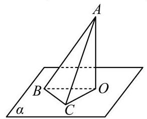

(1)求证: ${BC}\bot$ 平面 ${AOC}$ ；

(2)求 ${AB}$ 和平面 $\alpha$ 所成的角的大小.

## 答案

(1)证明见解析(2) ${45}^{ \circ  }$

## 解析

(1)推导出 ${AO}\bot {BC},{OC}\bot {BC}$ ，由此能证明 ${BC}\bot$ 平面 ${AOC}$ .

(2)设 ${BC} = 1$ ，推导出 ${OC} = 1,{OB} = \sqrt{2}$ ， ${AB} = 2$ ，从而 ${AO} = \sqrt{4 - 2} = \sqrt{2}$ ，由 ${AO}\bot$ 平面α，得 $\angle {ABO}$ 是 ${AB}$ 和平面 $\alpha$ 所成的角，由此能求出 ${AB}$ 和平面 $\alpha$ 所成的角.

(1) $\because {AB}$ 是平面 $\alpha$ 的斜线， $B$ 为斜足， ${AO}\bot$ 平面 $\alpha$ ， $O$ 为垂足，

${BC}$ 是平面 $\alpha$ 上的一条直线,

$\therefore {AO} \bot  {BC}$ ,

又 ${OC} \bot  {BC}$ ,且 ${AO} \cap  {OC} = O$ ,

$\therefore {BC} \bot$ 平面 ${AOC}$ .

(2)设 ${BC} = 1$ ，

$\because {OC}\bot {BC}$ 于点 $C,\angle {ABC} = {60}^{ \circ  },\angle {OBC} = {45}^{ \circ  }$ . ${BC}\bot$ 平面 ${AOC}$ ，

$\therefore {OC} = 1,{OB} = \sqrt{1 + 1} = \sqrt{2},{AB} = 2$ ,

$\therefore {AO} = \sqrt{4 - 2} = \sqrt{2}$ ,

$\because {AO} \bot$ 平面 $\alpha$ ,

$\therefore \angle {ABO}$ 是 ${AB}$ 和平面 $\alpha$ 所成的角,

$\because {AO} = {BO},{PO} \bot  {BO}$ ,

$\therefore \angle {ABO} = {45}^{ \circ  }$ ,

$\therefore {AB}$ 和平面 $\alpha$ 所成的角为 ${45}^{ \circ  }$ .

本题考查线面垂直的证明、线面角的求法、空间中线线、线面、面面间的位置关系等基础知识, 考查空间想象能力和运算求解能力, 是中档题.

2 一般上海市同济大学第二附属中学2024-2025学年高二上学期期中考试数学试卷如图,已知 $\mathrm{{PA}} = \mathrm{{AC}} = \mathrm{{PC}} = \mathrm{{AB}} = \mathrm{a},{PA} \bot  {AB},{AC} \bot  {AB}$ , M为 $\mathrm{{AC}}$ 的中点.

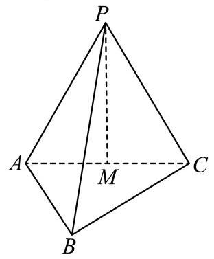

(1)求证: ${PM}\bot$ 平面 $\mathrm{{ABC}}$ ；

(2) 求直线 $\mathrm{{PB}}$ 与平面 $\mathrm{{ABC}}$ 所成角的大小.

答案

(1)见解析

(2) $\arcsin \frac{\sqrt{6}}{4}$

解析

(1)证明:因为 $\bigtriangleup  {PAC}$ 为等边三角形，且 $M$ 为 ${AC}$ 的中点，

所以 ${PM}\bot {AC}$ .

又 ${PA} \bot  {AB},{AC} \bot  {AB}$ ,且 ${PA} \cap  {AC} = A$ ,

所以 ${BA} \bot$ 平面 ${PAC}$ .

又 ${PM}$ 在平面 ${PAC}$ 内，所以 ${BA}\bot {PM}$ .

因为 ${AB} \cap  {AC} = A$ ，且 ${BA}\bot {PM}$ ， ${PM}\bot {AC}$ ，

所以 ${PM} \bot$ 平面 ${ABC}$ .

(2) 解:连结 ${BM}$ ，由(1)知 ${PM} \bot$ 平面 ${ABC}$ ，

所以 $\angle {PBM}$ 是直线 ${PB}$ 和平面 ${ABC}$ 所成的角.

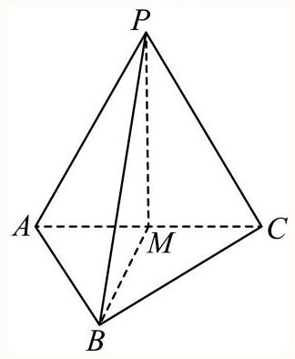

因为 $\bigtriangleup {PAC}$ 为等边三角形,所以 ${PM} = \frac{\sqrt{3}}{2}a$ .

又 $\bigtriangleup  {PAB}$ 为等腰直角三角形，且 $\angle {PAB} = \frac{\pi }{2}$ ，

所以 ${PB} = \sqrt{2}a$ .

因为 ${PM}\bot {BM}$ ，所以 ${\sin \angle {PBM}} = \frac{PM}{PB} = \frac{\sqrt{6}}{4}$ ，

则 $\angle {PBM} = \arcsin \frac{\sqrt{6}}{4}$

所以直线 ${PB}$ 和平面 ${ABC}$ 所成的角的大小等于 $\arcsin \frac{\sqrt{6}}{4}$ .

3 一般 上海市浦东新区上海海事大学附属北蔡高级中学2024届高三上学期期中数学试题

四边形 $\mathrm{{ABCD}}$ 是边长为 1 的正方形，AC与BD交于O点，PA⊥平面 $\mathrm{{ABCD}}$ ，且满足 ${PA} = {AB} = {AD}$ .

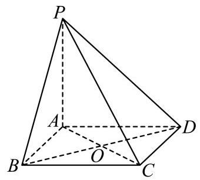

(1)求证: $\mathrm{{AB}}$ 和 $\mathrm{{PC}}$ 是异面直线；

(2) 求直线PC和平面 ${ABCD}$ 所成角.

答案

(1)见解析

(2) $\arctan \frac{\sqrt{2}}{2}$

解析

(1)因为 ${AB} \subset$ 平面 ${ABCD}, C \notin  {AB}$ ，所以 $P \notin$ 平面 ${ABCD}$ ， 由异面直线的判定定理可证得 $\mathrm{{AB}}$ 和 $\mathrm{{PC}}$ 是异面直线;

(2) 设 ${PA} = {AB} = {AD} = a$ ,

因为PA⊥平面ABCD，所以直线PC和平面ABCD所成角为 $\angle {PCA}$ ，

因为PA⊥平面ABCD, ${AC} \subset$ 平面 ${ABCD}$ ,所以PA⊥ ${AC}$ ,

在 Rt $\bigtriangleup {PAC}$ 中, ${AC} = \sqrt{{a}^{2} + {a}^{2}} = \sqrt{2}a,\tan \angle {PCA} = \frac{PA}{AC} = \frac{a}{\sqrt{2}a} = \frac{\sqrt{2}}{2}$ .

故直线 $\mathrm{{PC}}$ 和平面 $\mathrm{{ABCD}}$ 所成角为 $\arctan \frac{\sqrt{2}}{2}$ .

4 一般 2023-2024上海上海市金山区上海市张堰中学高二上学期阶段测试数学试卷

如图所示, ${ABCD} - {A}_{1}{B}_{1}{C}_{1}{D}_{1}$ 是棱长为 $\mathrm{a}$ 的正方体, $\mathrm{M}$ 是棱 ${A}_{1}{B}_{1}$ 的中点, $\mathrm{N}$ 是棱 ${A}_{1}{D}_{1}$ 的中点.

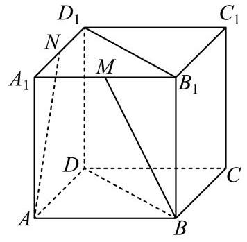

(1)求直线AN与平面ABCD所成角的大小；

(2)求异面直线AN与BM所成角的大小. (计算结果用反三角函数表示)

## 答案

(1) arctan 2

(2) $\arccos \frac{4}{5}$

解析

(1)由正方体的性质可知，

直线AN与平面ABCD所成角为 $\angle {DAN}$ ,

易得 $\tan \angle {DAN} = 2$ ,

所以直线 $\mathrm{{AN}}$ 与平面 $\mathrm{{ABCD}}$ 所成角的大小为 $\arctan 2$ ;

(2)记棱 ${B}_{1}{C}_{1}$ 的中点为G，连接BG、GM、GN，

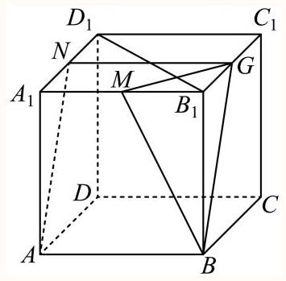

因为 ${ABCD} - {A}_{1}{B}_{1}{C}_{1}{D}_{1}$ 是正方体，G，N中点，

所以 ${GN}//{A}_{1}{B}_{1}//{AB},{GN} = {A}_{1}{B}_{1} = {AB}$ ,

即四边形 $\mathrm{{ABGN}}$ 为平行四边形,所以 ${BG}//{AN}$ ,

所以 $\angle {MBG}$ (或其补角) 是异面直线 $\mathrm{{AN}}$ 与 $\mathrm{{BM}}$ 所成的角,

在 $\bigtriangleup {MBG}$ 中, ${BM} = {BG} = \frac{\sqrt{5}}{2}a,{MG} = \frac{\sqrt{2}}{2}a$ ,

所以 $\cos \angle {MBG} = \frac{{\left( \frac{\sqrt{5}}{2}a\right) }^{2} + {\left( \frac{\sqrt{5}}{2}a\right) }^{2} - {\left( \frac{\sqrt{2}}{2}a\right) }^{2}}{2 \times  \frac{\sqrt{5}}{2}a \times  \frac{\sqrt{5}}{2}a} = \frac{4}{5}$ ，

所以异面直线 $\mathrm{{AN}}$ 与 $\mathrm{{BM}}$ 所成角的大小为 $\mathrm{{arccos}}\frac{4}{5}$ .

5 一般 浙江省衢州一中2011-2012学年高二上学期期末理科数学试题

如图,三棱柱 ${ABC} - {A}_{1}{B}_{1}{C}_{1}$ 的侧棱 ${A}_{1}A$ 垂直于底面 ${ABC},{A}_{1}A = 2,{AC} = {CB} = 1$ ,

$\angle {BCA} = {90}^{ \circ  }, M\text{ 、 }N$ 分别是 ${AB}\text{ 、 }{A}_{1}A$ 的中点.

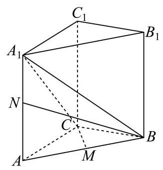

(1)求证: ${A}_{1}B\bot {CM}$

(2)求直线BN与平面 ${A}_{1}{BC}$ 所成角正弦值.

答案

(1)证明见解析

(2) $\frac{\sqrt{15}}{15}$

解析

(1) 因为 ${AC} = {CB} = 1$ ， $M$ 是 ${AB}$ 的中点，所以 ${CM}\bot {AB}$ ，

又因为 ${A}_{1}A \bot$ 平面 ${ABC}$ ，又 ${CM} \subset$ 平面 ${ABC}$ ，所认 ${A}_{1}A \bot  {CM}$ ，

又 ${A}_{1}A \cap  {AB} = A,{A}_{1}A,{AB} \subset$ 平面 ${BA}{A}_{1}{B}_{1}$ ,所以 ${CM} \bot$ 平面 ${BA}{A}_{1}{B}_{1}$ ,

因为 ${A}_{1}B \subset$ 平面 ${BA}{A}_{1}{B}_{1}$ ,所以 ${A}_{1}B \bot  {CM}$ ;

(2)过 $N$ 作 ${NH} \bot  {A}_{1}C$ 交 ${A}_{1}C$ 于 $H$ ，连接 ${BH}$ ，

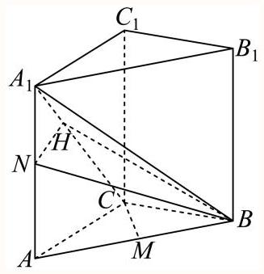

因为 $\angle {BCA} = {90}^{ \circ  }$ ，所以 ${AC}\bot {BC}$ ，

又因为 ${A}_{1}A \bot$ 平面 ${ABC}$ ,又 ${BC} \subset$ 平面 ${ABC}$ ,所认 ${A}_{1}A \bot  {BC}$ ,

又 ${A}_{1}A \cap  {AC} = A,{A}_{1}A,{AC} \subset$ 平面 ${CA}{A}_{1}{C}_{1}$ ,所以 ${BC} \bot$ 平面 ${CA}{A}_{1}{C}_{1}$ ,

因为 ${NH} \subset$ 平面 ${CA}{A}_{1}{C}_{1}$ ,所以 ${BC} \bot  {NH}$ ,

又 ${A}_{1}C \cap  {BC} = C,{A}_{1}C,{BC} \subset$ 平面 ${A}_{1}{CB}$ ,所以 ${NH} \bot$ 平面 ${A}_{1}{CB}$ ,

因为 $\angle {NBH}$ 是直线 ${NB}$ 与平面 ${A}_{1}{CB}$ 所成的角,

因为 ${AC} = {CB} = 1$ ,所以 ${AB} = \sqrt{{1}^{2} + {1}^{2}} = \sqrt{2}$ ,

因为 ${A}_{1}A = 2, N$ 是 ${A}_{1}A$ 的中点,所以 ${BN} = \sqrt{{1}^{2} + {\left( \sqrt{2}\right) }^{2}} = \sqrt{3}$ ,

在直角三角形 ${A}_{1}{AC}$ 中， ${A}_{1}C = \sqrt{{1}^{2} + {2}^{2}} = \sqrt{5}$ ，

所以 $\bigtriangleup {A}_{1}{AC} \sim  {A}_{1}{HN}$ ,所以 $\frac{{A}_{1}N}{NH} = \frac{{A}_{1}C}{AC}$ ,所以 $\frac{1}{NH} = \frac{\sqrt{5}}{1}$ ,所以 ${NH} = \frac{1}{\sqrt{5}}$ ,

所以 $\sin \angle {NBH} = \frac{NH}{BN} = \frac{\frac{1}{\sqrt{5}}}{\sqrt{3}} = \frac{\sqrt{15}}{15}$ ,

所以直线BN与平面 ${A}_{1}{BC}$ 所成角的正弦值为 $\frac{\sqrt{15}}{15}$ .

6 一般上海市实验学校2020-2021学年高二下学期期中数学试题

某风景区有空中景点A及平坦的地面上景点B，已知AB与地面所成角的大小为 ${60}^{ \circ  }$ ，点A在地面上的射影为 $\mathrm{H}$ ,如图,请在地面上选定点 $\mathrm{M}$ ,使得 $\frac{{AB} + {BM}}{AM}$ 达到最大值.

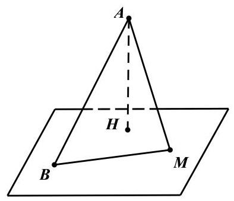

答案

点 $M$ 在 ${BH}$ 延长线上， ${BH} = {HM}$ 处.

解析

由线面角的定义得出 $\angle {ABM} \geq  {60}^{ \circ  }$ ,在 $\bigtriangleup {ABM}$ 中利用正弦定理以及三角恒等变换得出 $\frac{{AB} + {BM}}{AM} \leq  2\sin \left( {M + {30}^{ \circ  }}\right)$ ,最后由正弦函数的性质求解即可.

因为 ${AB}$ 与地面所成的角的大小为 ${60}^{ \circ  },{AH}$ 垂直于地面, ${BM}$ 是地面上的直线,所以 $\angle {ABH} = {60}^{ \circ  },\angle {ABM} \geq  {60}^{ \circ  }$ .

在 $\bigtriangleup {ABM}$ 中, $\because \frac{AB}{\sin M} = \frac{BM}{\sin A} = \frac{AM}{\sin B}$

$\therefore \frac{{AB} + {BM}}{AM} = \frac{\sin M + \sin A}{\sin B} = \frac{\sin M + \sin \left( {B + M}\right) }{\sin B}$

$= \frac{\sin M + \sin B\cos M + \cos B\sin M}{\sin B} = \frac{1 + \cos B}{\sin B}\sin M + \cos M$

$= \frac{2{\cos }^{2}\frac{B}{2}}{\sin B}\sin M + \cos M = \cot \frac{B}{2}\sin M + \cos M$

$\leq  \cot {30}^{ \circ  }\sin M + \cos M = \sqrt{3}\sin M + \cos M = 2\sin \left( {M + {30}^{ \circ  }}\right)$ .

当 $\angle M = \angle B = {60}^{ \circ  }$ 时, $\frac{{AB} + {BM}}{AM}$ 达到最大值,此时点 $M$ 在 ${BH}$ 延长线上, ${BH} = {HM}$ 处.

7 一般 上海市青浦高级中学2024-2025学年高二下学期3月质量检测数学试题

直线m和平面 $\alpha$ 所成角为 $\frac{\pi }{6}$ ，则直线m和平面 $\alpha$ 内任意直线所成角的取值范围是___

答案

$\left\lbrack  {\frac{\pi }{6},\frac{\pi }{2}}\right\rbrack$

## 解析

根据直线与平面所成角的定义得到所成角的最小值为 $\frac{\pi }{6}$ ，由三垂线定理可得当该平面内的直线与已知直线在平面内的射影垂直时,所成角为 $\frac{\pi }{2}$ ,达到最大值. 由此即可得到本题答案.

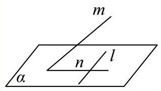

直线为 $m$ ,平面为 $\alpha , l$ 为 $\alpha$ 内的任意一条直线.

根据直线与平面所成角的定义,

可得 $m$ 与平面 $\alpha$ 所成的角是 $m$ 与平面 $\alpha$ 内所有直线所成角中最小的角,

$\therefore$ 直线 $m$ 与平面 $\alpha$ 内的直线所成角的最小值为 $\frac{\pi }{6}$ ,

当平面 $\alpha$ 内的直线 $l$ 与直线 $m$ 在平面内的射影 $n$ 垂直时, $l$ ,与 $m$ 也垂直, 此时 $l, m$ 所成的角 $\frac{\pi }{2}$ ,达到所成角中的最大值.

因此，此直线与该平面内任意一条直线所成角的取值范围是 $\left\lbrack  {\frac{\pi }{6},\frac{\pi }{2}}\right\rbrack$ .

故答案为: $\left\lbrack  {\frac{\pi }{6},\frac{\pi }{2}}\right\rbrack$ .

8 一般 上海市奉贤区2025-2026学年高三上学期学科质量监测(一)数学试卷

如图所示,四棱柱 ${ABCD} - {A}_{1}{B}_{1}{C}_{1}{D}_{1}$ 的底面 $\mathrm{{ABCD}}$ 是正方形，O是底面的中心， ${A}_{1}O \bot$ 平面 ${ABCD},{AB} = A{A}_{1} = \sqrt{2}$ .

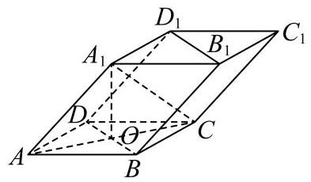

(1) 求证: ${A}_{1}C \bot$ 平面 ${BD}{D}_{1}{B}_{1}$ ;

(2)求直线 $O{A}_{1}$ 与平面 $A{A}_{1}B$ 所成角的正弦值.

答案

(1)证明见解析

(2) $\frac{\sqrt{3}}{3}$

解析

(1)因为 ${ABCD}$ 是正方形，所以 ${AC}\bot {BD},{OA} = {OC} = 1$ ，

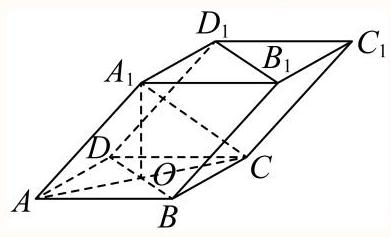

因为 ${A}_{1}O \bot$ 底面 ${ABCD}$ ,

所以 ${A}_{1}O \bot  {BD}$ ,又 ${A}_{1}O \cap  {AC} = O,{A}_{1}O,{AC}$ 在平面 $A{A}_{1}C$ 内,

所以 ${BD}\bot$ 平面 $A{A}_{1}C,{A}_{1}C$ 在平面 $A{A}_{1}C$ 内,

所以 ${BD} \bot  {A}_{1}C$ ,

由 $A{A}_{1} = \sqrt{2},{OA} = {OC} = 1,{A}_{1}O \bot$ 底面 ${ABCD}$ ,

可得 ${A}_{1}O = 1,{A}_{1}C = \sqrt{2}$ ,

所以 $A{A}_{1}^{2} + {A}_{1}{C}^{2} = A{C}^{2}$ ,即有 $A{A}_{1} \bot  {A}_{1}C$ ,

因为 $A{A}_{1}//B{B}_{1}$ ,所以 $B{B}_{1} \bot  {A}_{1}C$ ,

$B{B}_{1}$ 和 ${BD}$ 在平面 ${BD}{D}_{1}{B}_{1}$ 内,且 $B{B}_{1} \cap  {BD} = B$ ,

所以 ${A}_{1}C \bot$ 平面 ${BD}{D}_{1}{B}_{1}$ .

(2)方法1:设点 $O$ 到平面 $A{A}_{1}B$ 的距离为 $h$ ，

${V}_{O - {A}_{1}{AB}} = \frac{1}{3} \cdot  {S}_{AOB} \cdot  O{A}_{1} = \frac{1}{3} \cdot  {S}_{A{A}_{1}B} \cdot  h$

由题可知 $O{A}_{1} = 1,{S}_{AOB} = \frac{1}{2},{S}_{A{A}_{1}B} = \frac{1}{2} \times  \sqrt{2} \times  \sqrt{2} \times  \frac{\sqrt{3}}{2} = \frac{\sqrt{3}}{2}$ .

所以 $h = \frac{1 \times  1}{\sqrt{3}} = \frac{\sqrt{3}}{3}$ .

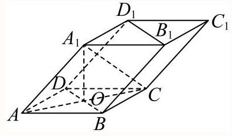

得直线 $O{A}_{1}$ 与平面 $A{A}_{1}B$ 所成角 $\theta$ 的正弦值 $\sin \theta  = \frac{h}{O{A}_{1}} = \frac{\sqrt{3}}{3}$ .

方法2: (建系)

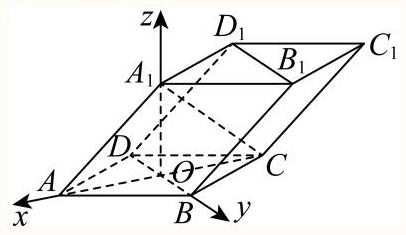

以 $O$ 为原点，射线 ${OA}$ 、 ${OB}$ 、 $O{A}_{1}$ 为 $x$ 轴、 $y$ 轴、 $z$ 轴的正半轴，建立空间直角坐标系.

可得 $A\left( {1,0,0}\right) \text{ 、 }B\left( {0,1,0}\right) \text{ 、 }{A}_{1}\left( {0,0,1}\right)$

则 ${\overrightarrow{OA}}_{1} = \left( {0,0,1}\right) ,{\overrightarrow{AA}}_{1} = \left( {-1,0,1}\right) ,\overrightarrow{AB} = \left( {-1,1,0}\right)$ ,

设平面 $A{A}_{1}B$ 的一个法向量为 $\overrightarrow{n} = \left( {x, y, z}\right)$ ,

则 $\left\{  \begin{array}{l} \overrightarrow{n} \cdot  {\overrightarrow{AA}}_{1} =  - x + z = 0 \\  \overrightarrow{n} \cdot  \overrightarrow{AB} =  - x + y = 0 \end{array}\right.$ ,令 $x = 1$ ,可得 $\overrightarrow{n} = \left( {1,1,1}\right)$ ,

直线 $O{A}_{1}$ 与平面 $A{A}_{1}B$ 所成角 $\theta$ 的正弦值等于向量 $\overrightarrow{O{A}_{1}}$ 与平面法向量 $\overrightarrow{n}$ 的夹角余弦值的绝对值: $\sin \theta  = \left| {\cos \left\langle  {\overrightarrow{O{A}_{1}},\overrightarrow{n}}\right\rangle  }\right|  = \left| \frac{\overrightarrow{O{A}_{1}} \cdot  \overrightarrow{n}}{\left| \overrightarrow{O{A}_{1}}\right|  \cdot  \left| \overrightarrow{n}\right| }\right|  = \frac{1}{\sqrt{3}} = \frac{\sqrt{3}}{3}$ .

9 一般 安徽省亳州市第一中学2021-2022学年高二上学期 9 月教学检测数学试题

如图，在三棱锥P $- \mathrm{{ABC}}$ 中， $\mathrm{{AB}} \bot  \mathrm{{BC}}$ ， $\mathrm{{AB}} = \mathrm{{BC}} = \frac{1}{2}\mathrm{{PA}}$ ，点 $\mathrm{O}$ 、 $\mathrm{D}$ 分别是 $\mathrm{{AC}}$ 、 $\mathrm{{PC}}$ 的中点， $\mathrm{{OP}} \bot$ 底面ABC.

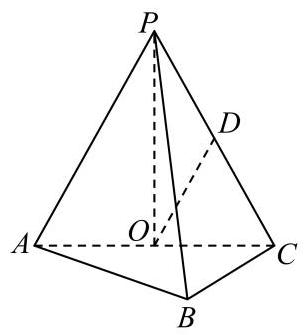

(1)求证: $\mathrm{{OD}}//$ 平面 $\mathrm{{PAB}}$ ；

(2)求直线 ${OD}$ 与平面 ${PBC}$ 所成角的正弦值.

答案

(1)详见解析(2) $\frac{\sqrt{210}}{30}$

解析

(1)由题意利用线面平行的判定定理证明题中的结论即可;

(2)首先作出直线与平面所成的角，然后利用几何体的空间结构特征确定线面角的正弦值即可. (1)如图，

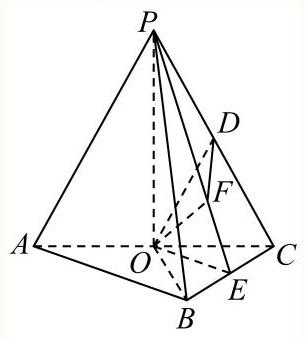

$\because \mathrm{O}$ 、 $\mathrm{D}$ 分别为 $\mathrm{{AC}}$ 、 $\mathrm{{PC}}$ 的中点，

$\therefore \mathrm{{OD}}\parallel \mathrm{{PA}}$ .

又PAC平面PAB，OD⊄平面PAB，

$\therefore \mathrm{{OD}}\parallel$ 平面 $\mathrm{{PAB}}$ .

(2)连接 ${OB}$ ，

$\because \mathrm{{AB}}\bot \mathrm{{BC}},\mathrm{{OA}} = \mathrm{{OC}}$ ,

$\therefore \mathrm{{OA}} = \mathrm{{OB}} = \mathrm{{OC}}$ .

又 $\because \mathrm{{OP}} \bot$ 平面 $\mathrm{{ABC}}$ ,

$\therefore \mathrm{{PA}} = \mathrm{{PB}} = \mathrm{{PC}}$ .

取BC的中点E，连接PE，OE，

则BC⊥平面POE,

作OF」LPE于F，

连接DF，则OF⊥平面PBC，

$\therefore \angle {ODF}$ 是OD与平面PBC所成的角.

设 ${AB} = {BC} = a$ ,

则 $\mathrm{{PA}} = \mathrm{{PB}} = \mathrm{{PC}} = 2\mathrm{a},\mathrm{{OA}} = \mathrm{{OB}} = \mathrm{{OC}} = \frac{\sqrt{2}}{2}\mathrm{a}$ ,

$\mathrm{{PO}} = \frac{\sqrt{14}}{2}\mathrm{a}$

在 $\bigtriangleup  \mathrm{{PBC}}$ 中， $\because \mathrm{{PE}} \bot  \mathrm{{BC}}$ ， $\mathrm{{PB}} = \mathrm{{PC}}$ ，

$\therefore \mathrm{{PE}} = \frac{\sqrt{15}}{2}\mathrm{a}\;\therefore \mathrm{{OF}} = \frac{\sqrt{210}}{30}\mathrm{a}$ .

又 $\because \mathrm{O}$ 、 $\mathrm{D}$ 分别为 $\mathrm{{AC}}$ 、 $\mathrm{{PC}}$ 的中点， $\therefore \mathrm{{OD}} = \frac{\mathrm{{PA}}}{2} = \mathrm{a}$ .

在Rt $\bigtriangleup \mathrm{{ODF}}$ 中， $\sin \angle \mathrm{{ODF}} = \frac{\mathrm{{OF}}}{\mathrm{{OD}}} = \frac{\sqrt{210}}{30}$ .

$\therefore \mathrm{{OD}}$ 与平面 $\mathrm{{PBC}}$ 所成角的正弦值为 $\frac{\sqrt{210}}{30}$

本题主要考查线面平行的判定定理, 直线与平面所成的角的含义与应用等知识, 意在考查学生的转化能力和空间想象能力.

10 一般上海市彭浦中学2022-2023学年高二上学期期中数学试题

如图, PA 上平面ABCD, ABCD为正方形, 且PA=AD, E、F分别是线段PA、CD的中点.

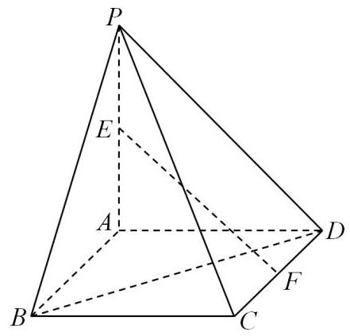

(1)求EF和平面PAB所成的角 $\alpha$ ；

(2) 求证: EF//平面PBC.

答案

(1) $\arctan \sqrt{2}$ ;

(2) 证明见解析.

解析

(1)若 $G$ 是 ${AB}$ 中点，连接 ${EG},{FG}$ ，四边形 ${ABCD}$ 为正方形， ${PA} = {PD}$ ，

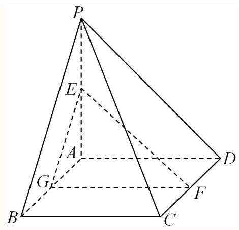

因为 ${PA} \bot$ 面 ${ABCD},{PA} \subset$ 面 ${PAB}$ ，则面 ${ABCD} \bot$ 面 ${PAB},$

由F是线段CD的中点,则 ${FG}//{BC}$ ,而 ${BC} \bot  {AB}$ ,即 ${FG} \bot  {AB}$ ,

由面 ${ABCD} \cap$ 面 ${PAB} = {AB},{FG} \subset$ 面 ${ABCD}$ ,故 ${FG} \bot$ 面 ${PAB}$ ,

所以EF和平面PAB所成角的平面角为 $\alpha  = \angle {FEG}$ 或补角，由 ${EG} \subset$ 面 ${PAB}$ ，则 ${FG}\bot {EG}$ ， 在直角 $\bigtriangleup {FEG}$ 中, $\tan \alpha  = \frac{FG}{EG}$ ,

由E是线段PA的中点,则 ${EG}//{BP}$ 且 ${EG} = \frac{1}{2}{BP}$ ，结合 ${AB} \subset$ 面 ${ABCD}$ ，即 ${PA}\bot {AB}$ ， 所以 ${EG} = \frac{\sqrt{2}}{2}{AB},{AB} = {BC} = {FG}$ ，则 ${EG} = \frac{\sqrt{2}}{2}{FG}$ ，故 ${\tan \alpha  = \sqrt{2}},$ 故EF和平面PAB所成角为 $\arctan \sqrt{2}$ .

(2)由(1)知: ${FG}//{BC}$ ， ${FG} \text{ ⊄ }$ 面 ${PBC}$ ， ${BC} \subset$ 面 ${PBC}$ ，则 ${FG}//$ 面 ${PBC}$ ，

又 ${EG}//{BP}$ ，同理可证 ${EG}//$ 面 ${PBC}$ ，

因为 ${FG} \cap  {EG} = G,{FG},{EG} \subset$ 面 ${FEG}$ ,则面 ${FEG}//$ 面 ${PBC}$ ,

由 ${EF} \subset$ 面 ${FEG}$ ,可得 ${EF}//$ 面 ${PBC}$ .

11 较易 专题10 空间角与空间距离的综合(1)一期中期末考点大串讲

如图,已知正方体 ${ABCD} - {A}_{1}{B}_{1}{C}_{1}{D}_{1}$ 的棱长为 2 .

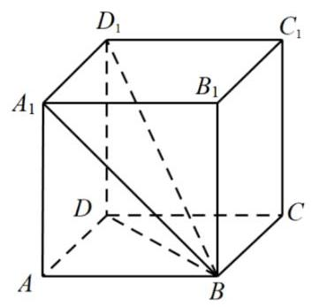

(1) 求直线 ${A}_{1}B$ 和平面 ${ABCD}$ 所成角的大小；

(2)求直线 $B{D}_{1}$ 和平面 ${ABCD}$ 所成角的正切值.

答案

(1) $\frac{\pi }{4}$

(2) $\frac{\sqrt{2}}{2}$

## 解析

(1)因为 ${A}_{1}A \bot$ 平面 $\mathrm{{ABCD}}$ ,

$\therefore$ 直线 ${A}_{1}B$ 在平面 $\mathrm{{ABCD}}$ 上的射影为直线 $\mathrm{{AB}}$ ,

$\therefore \angle {A}_{1}{BA}$ 就是直线 ${A}_{1}B$ 和平面 $\mathrm{{ABCD}}$ 所成的角.

$\because$ 在 $\mathrm{{Rt}}\bigtriangleup {A}_{1}{BA}$ 中, $A{A}_{1} = {AB}$ ,则 $\angle {A}_{1}{BA} = \frac{\pi }{4}$ ,

$\therefore$ 直线 ${A}_{1}B$ 和平面 $\mathrm{{ABCD}}$ 所成角的大小为 $\frac{\pi }{4}$ .

(2)因为 ${D}_{1}D \bot$ 平面 ${ABCD}$ ，

$\therefore$ 直线 ${D}_{1}B$ 在平面 $\mathrm{{ABCD}}$ 上的射影为直线 ${DB}$ ,

$\therefore \angle {D}_{1}{BD}$ 就是直线 ${D}_{1}B$ 和平面 $\mathrm{{ABCD}}$ 所成的角.

$\because$ 在 $\mathrm{{Rt}}\bigtriangleup {D}_{1}{BD}$ 中, $D{D}_{1} = 2,{BD} = 2\sqrt{2}$ ,则 $\tan \angle {D}_{1}{BD} = \frac{D{D}_{1}}{BD} = \frac{\sqrt{2}}{2}$ ,

$\therefore$ 直线 $B{D}_{1}$ 和平面 $\mathrm{{ABCD}}$ 所成角的的正切值为 $\frac{\sqrt{2}}{2}$ .

12 一般广东省东莞市第一中学2022-2023学年高一下学期期中考试数学试题

如图,四边形 ${ABCD}$ 为正方形, ${ED} \bot$ 平面 ${ABCD},{FB}//{ED},{AB} = {ED} = {2FB} = 2$ .

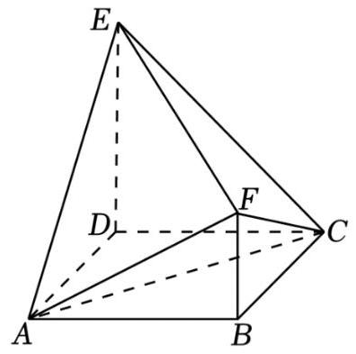

(1)求证: ${AC}\bot$ 平面 ${BDEF}$ ；

(2)求 ${BC}$ 与平面 ${AEF}$ 所成角的正弦值.

答案

(1)证明见解析；

(2) $\frac{2}{3}$ .

解析

(1)连接 ${BD}$ 交 ${AC}$ 于 $O$ ，如图，

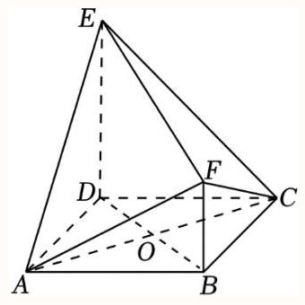

由四边形 ${ABCD}$ 为正方形,得 ${AC} \bot  {BD}$ ,

又 ${ED} \bot$ 平面 ${ABCD},{AC} \subset$ 平面 ${ABCD}$ ,则 ${ED} \bot  {AC}$ ,

而 ${FB}//{ED}$ ，即B，D，E，F四点共面，又 ${ED} \cap  {BD} = D$ ，且 ${ED},{BD} \subset$ 平面 ${BDEF}$ ， 所以 ${AC} \bot$ 平面 ${BDEF}$ .

(2)因为 ${BC}//{AD}$ ，则 ${BC}$ 与平面 ${AEF}$ 所成角等于 ${AD}$ 与平面 ${AEF}$ 所成角，

显然 ${AE} = \sqrt{{2}^{2} + {2}^{2}} = 2\sqrt{2},{AF} = \sqrt{{2}^{2} + {1}^{2}} = \sqrt{5},{EF} = \sqrt{{\left( 2\sqrt{2}\right) }^{2} + {1}^{2}} = 3$ ,

在 $\bigtriangleup {AEF}$ 中，由余弦定理得 $\cos \angle {AEF} = \frac{A{E}^{2} + E{F}^{2} - A{F}^{2}}{{2AE} \cdot  {EF}} = \frac{8 + 9 - 5}{2 \times  2\sqrt{2} \times  3} = \frac{\sqrt{2}}{2}$ ，

$\sin \angle {AEF} = \sqrt{1 - {\left( \frac{\sqrt{2}}{2}\right) }^{2}} = \frac{\sqrt{2}}{2}$ 因此

${S}_{\bigtriangleup {AEF}} = \frac{1}{2}{AE} \cdot  {EF}\sin \angle {AEF} = \frac{1}{2} \times  2\sqrt{2} \times  3 \times  \frac{\sqrt{2}}{2} = 3$ ,

设点 $D$ 到平面 ${AEF}$ 的距离为 $d$ ，

由 ${ED} \bot$ 平面 ${ABCD}$ ,知 ${DE} \bot  {AB}$ ,而 ${AD} \bot  {AB},{AD} \cap  {DE} = D$ ,则 ${AB} \bot$ 平面 ${ADE}$ ,

又 ${FB}//{ED},{FB} \text{ ⊄ }$ 平面 ${ADE},{ED} \subset$ 平面 ${ADE}$ ,

则 ${FB}//$ 平面 ${ADE}$ ,即有点 $\mathrm{F}$ 到平面 ${ADE}$ 的距离为 $\mathrm{{AB}}\mathrm{{\text{ 长 }2}},\text{ 又 }{S}_{\bigtriangleup {ADE}} = \frac{1}{2} \times  2 \times  2 = 2$ , 由 ${V}_{D - {AEF}} = {V}_{F - {ADE}}$ ,得 $\frac{1}{3}{S}_{\bigtriangleup {AEF}} \cdot  d = \frac{1}{3}{S}_{\bigtriangleup {ADE}} \times  2$ ,即 $\frac{1}{3} \times  {3d} = \frac{1}{3} \times  2 \times  2$ ,解得 $d = \frac{4}{3},$

所以 ${BC}$ 与平面 ${AEF}$ 所成角的正弦值为 $\frac{d}{AD} = \frac{\frac{4}{3}}{2} = \frac{2}{3}$ .

13 一般 专题04 第八章 立体几何初步(2)-期末考点大串讲(人教A版2019必修第二册)

如图,底面 ${ABCD}$ 是边长为2的正方形,半圆面 ${APD} \bot$ 底面 ${ABCD}$ ,点 $P$ 为圆弧 ${AD}$ 上的动点. 当三棱锥 $P - {BCD}$ 的体积最大时， ${PC}$ 与半圆面 ${APD}$ 所成角的余弦值为___.

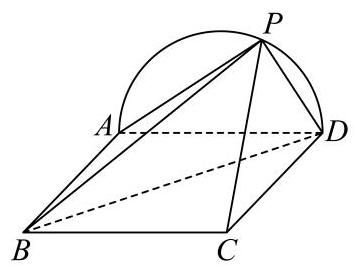

答案

$\frac{\sqrt{3}}{3} \mid  \frac{1}{3}\sqrt{3}$

解析

过点 $P$ 作 ${OP}\bot {AD}$ 于点 $O$ ，易得点 $P$ 位于圆弧 ${AD}$ 的中点时， ${V}_{P - {BCD}}$ 最大，证明 ${CD}\bot$ 面 ${PAD}$ ， 则 $\angle {CPD}$ 即为 ${PC}$ 与半圆面 ${APD}$ 所成角的平面角，再解Rt $\bigtriangleup  {PCD}$ 即可.

过点 $P$ 作 ${OP}\bot {AD}$ 于点 $O$ ，

因为面 ${APD}\bot$ 底面 ${ABCD}$ ,面 ${APD} \cap$ 底面 ${ABCD} = {AD},{OP} \subset$ 面 ${PAD}$ ,

所以 ${OP} \bot$ 平面 ${ABCD}$ ,

则 ${V}_{P - {BCD}} = \frac{1}{3} \times  \frac{1}{2} \times  2 \times  2 \cdot  \left| {OP}\right|  = \frac{2}{3}\left| {OP}\right|  \leq  \frac{2}{3}$ ,

当且仅当 $\left| {OP}\right|  = 1$ ,即点 $P$ 位于圆弧 ${AD}$ 的中点时, ${V}_{P - {BCD}}$ 最大,此时 $O$ 为 ${AD}$ 的中点,

因为面 ${APD} \bot$ 底面 ${ABCD}$ ,面 ${APD} \cap$ 底面 ${ABCD} = {AD},{CD} \bot  {AD},{CD} \subset$ 面 ${ABCD}$ ,

所以 ${CD} \bot$ 面 ${PAD}$ ,又 ${PD} \subset$ 面 ${PAD}$ ,所以 ${PD} \bot  {CD}$ ,

所以 $\angle {CPD}$ 即为 ${PC}$ 与半圆面 ${APD}$ 所成角的平面角,

在 Rt $\bigtriangleup {PCD}$ 中, $\left| {CD}\right|  = 2,\left| {PD}\right|  = \sqrt{1 + 1} = \sqrt{2},\left| {PC}\right|  = \sqrt{4 + 2} = \sqrt{6}$ ,

所以 $\cos \angle {CPD} = \frac{\left| PD\right| }{\left| PC\right| } = \frac{\sqrt{3}}{3}$ ,

故答案为: $\frac{\sqrt{3}}{3}$ .

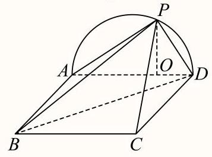

14 一般

如图,四边形 ${ABCD}$ 为正方形, ${ED} \bot$ 平面 ${ABCD},{FB}//{ED},{AB} = {ED} = {2FB} = 2$ .

(1)求直线 ${AE}$ 和平面 ${ABCD}$ 所成角的大小；

(2)求直线 ${BE}$ 和平面 ${ABCD}$ 所成角的正切值.

---

答案

(1) $\frac{\pi }{4}$

(2) $\frac{\sqrt{2}}{2}$

	解析

(1) 	因为 ${ED} \bot$ 平面 ${ABCD}$ ,

					$\therefore$ 直线 ${AE}$ 在平面 ${ABCD}$ 上的射影为直线 ${AD}$ ,

					$\therefore \angle {EAD}$ 就是直线 ${AE}$ 和平面 ${ABCD}$ 所成的角.

					$\because$ 在 $\operatorname{Rt} \bigtriangleup  {EAD}$ 中， ${ED} = {AD}$ ，则 $\angle {EAD} = \frac{\pi }{4}$ ，

					$\therefore$ 直线 ${AE}$ 和平面 ${ABCD}$ 所成角的大小为 $\frac{\pi }{4}$

(2) 				因为 ${ED} \bot$ 平面 ${ABCD}$ ,

---

$\therefore$ 直线 ${BE}$ 在平面 ${ABCD}$ 上的射影为直线 ${DB}$ ,

$\therefore \angle {EBD}$ 就是直线 ${EB}$ 和平面 ${ABCD}$ 所成的角.

$\because$ 在 $\operatorname{Rt}\bigtriangleup {EBD}$ 中, ${ED} = 2,{BD} = 2\sqrt{2}$ ,则 $\tan \angle {EBD} = \frac{ED}{BD} = \frac{\sqrt{2}}{2}$ ,

$\therefore$ 直线 ${BE}$ 和平面 ${ABCD}$ 所成角的的正切值为 $\frac{\sqrt{2}}{2}$ .

15 一般 知识点4变式1缺题

如图,在三棱台 ${ABC} - {A}_{1}{B}_{1}{C}_{1}$ 中, $A{A}_{1} \bot$ 平面 ${ABC},\angle {ABC} = {90}^{ \circ  }, A{A}_{1} = {A}_{1}{B}_{1} = {B}_{1}{C}_{1} = 1$ ， ${AB} = 2$ ，则 ${AC}$ 与平面 ${BC}{C}_{1}{B}_{1}$ 所成的角为( )

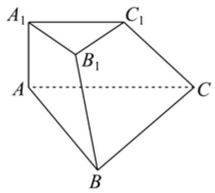

A. ${30}^{ \circ  }$

B. ${45}^{ \circ  }$

C. ${60}^{ \circ  }$

D. ${90}^{ \circ  }$

答案

A

解析

将棱台补全为如下棱锥 $D - {ABC}$ ，

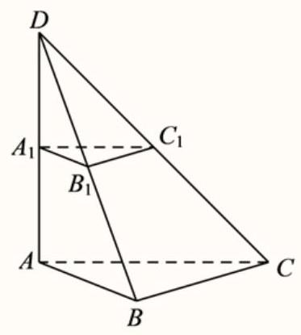

由 $\angle {ABC} = {90}^{ \circ  }$ , $A{A}_{1} = {A}_{1}{B}_{1} = {B}_{1}{C}_{1} = 1,{AB} = 2$ ,易知: ${DA} = {BC} = 2,{AC} = 2\sqrt{2}$ , 由 $A{A}_{1} \bot$ 平面 ${ABC},{AB},{AC} \bot$ 平面 ${ABC}$ ,则 $A{A}_{1} \bot  {AB}, A{A}_{1} \bot  {AC}$ ,所以 ${BD} = 2\sqrt{2},{CD} = 2\sqrt{3}$ ，故 ${B{C}^{2} + B{D}^{2}} = {C{D}^{2}}$ ，所以 ${S}_{\bigtriangleup {BCD}} = \frac{1}{2} \times  2 \times  2\sqrt{2} = {2\sqrt{2}}$ ，若 $\mathrm{A}$ 到面 ${BC}{C}_{1}{B}_{1}$ 的距离为 $\mathrm{h}$ ,又 ${V}_{D - {ABC}} = {V}_{A - {BCD}}$ ,则 $\frac{1}{3} \times  2 \times  \frac{1}{2} \times  2 \times  2 = \frac{1}{3}h \times  2\sqrt{2}$ ,可得 $h = \sqrt{2}$ ，

综上, ${AC}$ 与平面 ${BC}{C}_{1}{B}_{1}$ 所成角 $\theta  \in  \left\lbrack  {0,\frac{\pi }{2}}\right\rbrack$ ,则 $\sin \theta  = \frac{h}{AC} = \frac{1}{2}$ ,即 $\theta  = \frac{\pi }{6}$ . 故选: $A$

16 一般

如图,四边形 ${ABCD}$ 为正方形, ${ED} \bot$ 平面 ${ABCD},{FB}//{ED}, O$ 与 $G$ 分别为 ${BD},{AE}$ 的中点, ${AB} = {ED} = {2FB} = 2.$

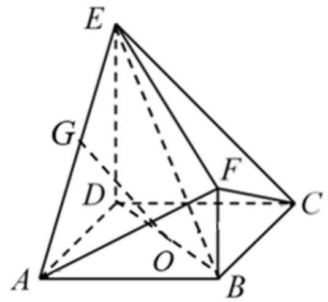

(1)求证: ${GO} \parallel$ 平面 ${EBC}$ ；

(2) 求 ${GO}$ 与平面 ${EBD}$ 所成角的正弦值.

答案

(1)证明见解析；

(2) ${30}^{ \circ  }$

图解析

(1)

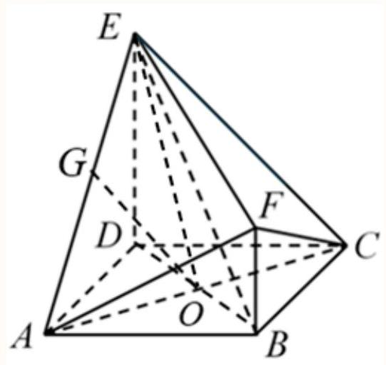

连接 ${AC}$ ,则 $O$ 是 ${AC}$ 的中点. ${\text{ 又 }G}$ 是 ${AE}$ 的中点,所以 ${GO}//{EC}$ .

因为 ${GO} \text{ ⊄ }$ 平面 ${EBC},{EC} \subset$ 平面 ${EBC}$ ,

所以 ${GO}\parallel$ 平面 ${EBC}$

(2)连接 ${EO}$ ,因为在正方形 ${ABCD}$ 中,所以 ${BD} \bot  {AC}$ .

又 ${ED} \bot$ 平面 ${ABCD}$ ,所以 ${ED} \bot  {AC}$ .

因为 ${BD},{ED} \subset$ 平面 ${EBD},{ED} \cap  {BD} = D$ ,所以 ${AC} \bot$ 平面 ${EBD}$ ,

所以 ${AC}\bot {EO}$ ,故 $\angle {OEC}$ 是 ${EC}$ 与平面 ${EBD}$ 所成的角.

因为 ${GO}//{EC}$ ，所以 ${GO}$ 与平面 ${EBD}$ 所成的角为 $\angle {OEC}$ .

因为 ${AB} = {ED} = {2FB} = 2,\angle {EDC} = {90}^{ \circ  }$ 所以 ${EC} = {2\sqrt{2}}$ .

则 ${EC} = {AC} = {2OC}$

在 Rt $\bigtriangleup {EOC}$ 中, $\sin \angle {OEC} = \frac{OC}{EC} = \frac{\frac{1}{2}{EC}}{EC} = \frac{1}{2}$ ,所以 $\angle {OEC} = {30}^{ \circ  }$ ,

所以 ${GO}$ 与平面 ${EBD}$ 所成角的大小是 ${30}^{ \circ  }$ .

17 一般 山东省烟台市中英文学校2023-2024学年高一下学期期末检测数学试题如图，在正四棱锥 $P - {ABCD}$ 中， $O$ 为底面 ${ABCD}$ 的中心.

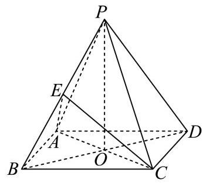

(1)若 ${AP} = 5,{AD} = 4\sqrt{2}$ ，求正四棱锥的体积；

(2) 若 ${AP} = {AD}$ ， $E$ 为 ${PB}$ 的中点，求直线 ${BD}$ 与平面 ${AEC}$ 所成角的大小.

答案

(1) 32

(2) $\frac{\pi }{4}$

解析

(1)正四棱锥满足 ${PO} \bot$ 平面 ${ABCD}$ ，由 ${AO} \subset$ 平面 ${ABCD}$ ，则 ${PO}\bot {AO}$ ， 又正四棱锥底面 ${ABCD}$ 是正方形，由 ${AD} = 4\sqrt{2}$ 可得， ${AO} = 4$ ， 故 ${PO} = \sqrt{P{A}^{2} - A{O}^{2}} = 3$ ,则 ${V}_{P - {ABCD}} = \frac{1}{3} \times  {\left( 4\sqrt{2}\right) }^{2} \times  3 = {32}$ ;

(2)连接 ${EA},{EO},{EC}$ ，由题意结合正四棱锥的性质可知，每个侧面都是等边三角形，

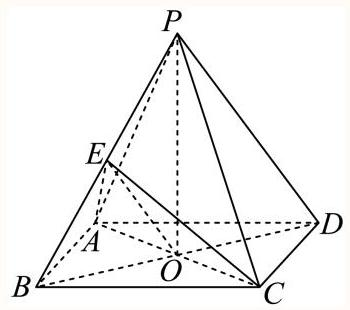

由 $E$ 是 ${PB}$ 中点,则 ${AE} \bot  {PB},{CE} \bot  {PB}$ ,又 ${AE} \cap  {CE} = E,{AE},{CE} \subset$ 平面 ${ACE}$ ,

故 ${PB}\bot$ 平面 ${ACE}$ ，即 ${BE}\bot$ 平面 ${ACE}$ ，又 ${BD} \cap$ 平面 ${ACE} = O$ ，

于是 $\angle {BOE}$ 即为直线 ${BD}$ 与平面 ${AEC}$ 所成角，

设 ${AP} = {AD} = a$ ,则 ${BO} = \frac{\sqrt{2}}{2}a,{BE} = \frac{1}{2}a,\sin \angle {BOE} = \frac{BE}{BO} = \frac{\frac{1}{2}a}{\frac{\sqrt{2}}{2}a} = \frac{\sqrt{2}}{2}$ ,

又线面角的范围是 $\left\lbrack  {0,\frac{\pi }{2}}\right\rbrack$ ,故 $\angle {BOE} = \frac{\pi }{4}$ ，即直线 ${BD}$ 与平面 ${AEC}$ 所成角的大小为 $\frac{\pi }{4}$ .

18 一般上海市嘉定区第一中学2024-2025学年高二上学期期末数学试题

如图，在棱长为2的正方体 ${ABCD} - {A}_{1}{B}_{1}{C}_{1}{D}_{1}$ 中， $E$ ， $F$ 分别为线段 $D{D}_{1}$ ， ${BD}$ 的中点.

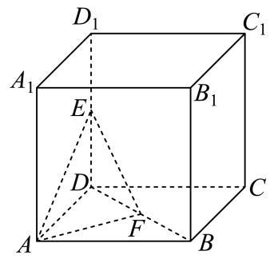

(1)求点 $D$ 到平面 ${AEF}$ 的距离；

(2)求直线 $C{C}_{1}$ 与平面 ${AEF}$ 所成的角.

答案

(1) $\frac{\sqrt{6}}{3}$

(2) $\arcsin \frac{\sqrt{6}}{3}$

解析

(1)在正方体 ${ABCD} - {A}_{1}{B}_{1}{C}_{1}{D}_{1}$ 中， $E$ 为线段 $D{D}_{1}$ 的中点，

所以 ${ED} \bot$ 平面 ${ADF}$ ,且 ${ED} = 1$ ,

因为 $F$ 是线段 ${BD}$ 的中点,所以 ${S}_{\bigtriangleup {ADF}} = \frac{1}{2}{S}_{\bigtriangleup {ABD}} = \frac{1}{2} \times  2 = 1$ ,

故三棱锥 $E - {ADF}$ 的体积 $V = \frac{1}{3}{S}_{\bigtriangleup {ADF}} \times  {ED} = \frac{1}{3} \times  1 \times  1 = \frac{1}{3}$ ;

因为 $E, F$ 分别为线段 $D{D}_{1},{BD}$ 的中点，所以 ${EF} = \frac{1}{2}B{D}_{1} = \frac{1}{2} \times  2\sqrt{3} = \sqrt{3}$ ，

又因为 ${AE} = \sqrt{5},{AF} = \frac{1}{2}{AC} = \frac{1}{2} \times  2\sqrt{2} = \sqrt{2}$ ,

所以在 $\bigtriangleup {AEF}$ 中满足 $E{F}^{2} + A{F}^{2} = A{E}^{2}$ ,故 $\bigtriangleup {AEF}$ 为直角三角形,

则 ${S}_{\bigtriangleup {AEF}} = \frac{1}{2}{AF} \times  {EF} = \frac{1}{2} \times  \sqrt{2} \times  \sqrt{3} = \frac{\sqrt{6}}{2}$ ，设点 $D$ 到平面 ${AEF}$ 的距离为 $d$ ，

则 $V = \frac{1}{3}{S}_{\bigtriangleup {ABF}} \times  d = \frac{1}{3}$ ,解得 $d = \frac{\sqrt{6}}{3}$ ,

因此点 $D$ 到平面 ${AEF}$ 的距离为 $\frac{\sqrt{6}}{3}$ .

(2)

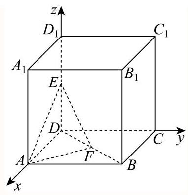

建立如图所示:

以 $D$ 为坐标原点, ${DA}\text{ 、 }{DC}\text{ 、 }D{D}_{1}$ 分别为 $x\text{ 、 }y\text{ 、 }z$ 轴的空间直角坐标系,

$C\left( {0,2,0}\right) ,{C}_{1}\left( {0,2,2}\right) , A\left( {2,0,0}\right) , E\left( {0,0,1}\right) , F\left( {1,1,0}\right) ,$

所以 $\overrightarrow{C{C}_{1}} = \left( {0,0,2}\right) ,\overrightarrow{AE} = \left( {-2,0,1}\right) ,\overrightarrow{AF} = \left( {-1,1,0}\right)$ ,

设平面 ${AEF}$ 的法向量为 $\overrightarrow{n} = \left( {x, y, z}\right)$ ,

则 $\left\{  \begin{array}{l} \overrightarrow{n} \cdot  \overrightarrow{AE} = 0 \\  \overrightarrow{n} \cdot  \overrightarrow{AF} = 0 \end{array}\right.$ ,即 $\left\{  \begin{array}{l}  - {2x} + z = 0 \\   - x + y = 0 \end{array}\right.$ ,令 $x = y = 1$ ,解得 $z = 2$ ,

所以 $\overrightarrow{n} = \left( {1,1,2}\right)$ ,

设直线 $C{C}_{1}$ 与平面 ${AEF}$ 所成角为 $\theta$ ,所以 $\sin \theta  = \frac{\left| \overrightarrow{n} \cdot  \overrightarrow{C{C}_{1}}\right| }{\left| \overrightarrow{n}\right|  \cdot  \left| \overrightarrow{C{C}_{1}}\right| } = \frac{4}{\sqrt{6} \times  2} = \frac{\sqrt{6}}{3}$ , 所以 $\theta  = \arcsin \frac{\sqrt{6}}{3}$