2026 年高考选填重难点突破十四个微专题

一、比较大小 2

二、三角恒等变换 6

三、三角函数的性质 10

四、解三角形 15

五、向量 19

六、解析几何 23

七、排列组合 42

八、立体几何 46

九、概率 60

十、二项式定理 64

十一、函数 68

十二、数列 86

十三、指对运算 90

十四、不等式 92

## 一、比较大小

1. 若 $a > b > 0$ ，且 ${ab} = 1$ ，则下列不等式成立的是( )

A. $a + \frac{1}{b} < \frac{b}{{2}^{a}} < {\log }_{2}\left( {a + b}\right)$ B. $\frac{b}{{2}^{a}} < {\log }_{2}\left( {a + b}\right)  < a + \frac{1}{b}$

C. $a + \frac{1}{b} < {\log }_{2}\left( {a + b}\right)  < \frac{b}{{2}^{a}}$ D. ${\log }_{2}\left( {a + b}\right)  < a + \frac{1}{b} < \frac{b}{{2}^{a}}$

题目出处: 2017 年山东卷理科 7

2. 设 $a = \frac{\ln 2}{2}, b = \frac{\ln 3}{3}, c = \frac{\ln 5}{5}$ ,则(   )

A. $c > b > a$ B. $b > a > c$ C. $b > c > a$ D. $a > b > c$

题目出处:2005 年全国三卷理科6(四川，陕西，云南)

3. 设 $a = {\log }_{3}2, b = \ln 2, c = {5}^{-\frac{1}{2}}$ ,则()

A. $b > a > c$ B. $b > c > a$ C. $a > c > b$ D. $c > b > a$

题目出处: 2010 年全国一卷理科8

4. 设 $x = \ln \pi , y = {\log }_{5}2, z = {\mathrm{e}}^{-\frac{1}{2}}$ ，则( )

A. $x < y < z$ B. $z < x < y$ C. $z < y < x$ D. $y < z < x$

题目出处: 2012 年全国卷理科 9

5. 设 $x, y, z$ 为正数,且 ${2}^{x} = {3}^{y} = {5}^{z}$ ,则(   )

A. ${2x} < {3y} < {5z}$ B. ${5z} < {2x} < {3y}$ C. ${3y} < {5z} < {2x}$ D. ${3y} < {2x} < {3y}$

题目出处: 2017 年全国新课标一卷理科11

6. 若实数 $x, y, z$ 满足 $2 + {\log }_{2}x = 3 + {\log }_{3}y = 5 + {\log }_{5}z$ ,则 $x, y, z$ 的大小关系不可能是( )

A. $x > y > z$ B. $x > z > y$ C. $y > x > z$ D. $y > z > x$

题目出处: 2025 年新高考一卷 8

7. 设 $a = {\log }_{0.2}{0.3}, b = {\log }_{2}{0.3}$ ,则()

A. $a + b < {ab} < 0$ B. ${ab} < a + b < 0$ C. $a + b < 0 < {ab}$ D. ${ab} < 0 < a + b$

题目出处: 2018 年全国三卷理科12

8. 设 $a, b, c$ 均为正数,且 ${2}^{a} = {\log }_{\frac{1}{2}}a,{\left( \frac{1}{2}\right) }^{b} = {\log }_{\frac{1}{2}}b,{\left( \frac{1}{2}\right) }^{c} = {\log }_{2}c$ ,则(   )

A. $a < b < c$ B. $b < a < c$ C. $c < b < a$ D. $c < a < b$

题目出处: 2007 年天津卷 9

9. 已知奇函数 $f\left( x\right)$ 在 $R$ 上是增函数， $g\left( x\right)  = {xf}\left( x\right)$ ，若 $a = g\left( {-{\log }_{2}{5.1}}\right)$ ， $b = g\left( {2}^{0.8}\right)$ ， $c = g\left( 3\right)$ ,则 $a, b, c$ 的大小关系为( )

A. $a < b < c$ B. $c < b < a$ C. $b < a < c$ D. $b < c < a$

题目出处: 2017 年天津卷理科6

10. 若 ${2}^{a} + {\log }_{2}a = {4}^{b} + 2{\log }_{4}b$ ,则(   )

A. $a > {2b}$ B. $a < {2b}$ C. $a > {b}^{2}$ D. $a < {b}^{2}$

题目出处: 2020 年全国一卷理科12

11. 若 ${2}^{x} - {2}^{y} < {3}^{-x} - {3}^{-y}$ ,则 ( )

A. $\ln \left( {y - x + 1}\right)  > 0$ B. $\ln \left( {y - x + 1}\right)  < 0$ C. $\ln \left| {x - y}\right|  > 0$ D. $\ln \left| {x - y}\right|  < 0$ 题目出处: 2020 年全国二卷理科11

12. 若 $0 < {x}_{1} < {x}_{2} < 1$ ,则(   )

A. ${\mathrm{e}}^{{x}_{2}} - {\mathrm{e}}^{{x}_{1}} > \ln {x}_{2} - \ln {x}_{1}$ B. ${\mathrm{e}}^{{x}_{2}} - {\mathrm{e}}^{{x}_{1}} < \ln {x}_{2} - \ln {x}_{1}$

C. ${x}_{2}{\mathrm{e}}^{{x}_{1}} > {x}_{1}{\mathrm{e}}^{{x}_{2}}$ D. ${x}_{2}{\mathrm{e}}^{{x}_{1}} < {x}_{1}{\mathrm{e}}^{{x}_{2}}$

题目出处: 2014 年湖南卷文科 9

13. 设 $a = {0.1}{\mathrm{e}}^{0.1}, b = \frac{1}{9}, c =  - \ln {0.9}$ ,则(   )

A. $a < b < c$ B. $c < b < a$ C. $c < a < b$ D. $a < c < b$

题目出处: 2022 年新高考一卷7

14. 设 $a = 2\ln {1.01}, b = \ln {1.02}, c = \sqrt{1.04} - 1$ ,则 ( )

A. $a < b < c$ B. $b < c < a$ C. $b < a < c$ D. $c < a < b$

题目出处: 2021 年全国一卷理科12

15. 已知 ${9}^{m} = {10}, a = {10}^{m} - {11}, b = {8}^{m} - 9$ ,则 ( )

A. $a > 0 > b$ B. $a > b > 0$ C. $b > a > 0$ D. $b > 0 > a$

题目出处: 2022 年全国甲卷文科12

16. 已知 $a = \frac{31}{32}, b = \cos \frac{1}{4}, c = 4\sin \frac{1}{4}$ ,则()

A. $c > b > a$ B. $b > a > c$ C. $a > b > c$ D. $a > c > b$

题目出处: 2022 年全国甲卷理科12

17. 已知 ${5}^{5} < {8}^{4},{13}^{4} < {8}^{5}$ ,设 $a = {\log }_{5}3, b = {\log }_{8}5, c = {\log }_{13}8$ ,则( )

A. $a < b < c$ B. $b < a < c$ C. $b < c < a$ D. $c < a < b$

题目出处: 2020 年全国三卷理科12

18. 已知 $a > 0, b > 0$ ,且 $a + b = 1$ ,则()

A. ${a}^{2} + {b}^{2} \geq  \frac{1}{2}$ B. ${2}^{a - b} > \frac{1}{2}$ C. ${\log }_{2}a + {\log }_{2}b \geq   - 2$ D. $\sqrt{a} + \sqrt{b} \leq  \sqrt{2}$

题目出处: 2021 年新高考一卷11 (多选)

## 二、三角恒等变换

1. 已知 $0 < \alpha  < \pi ,\cos \frac{\alpha }{2} = \frac{\sqrt{5}}{5}$ ,则 $\sin \left( {\alpha  - \frac{\pi }{4}}\right)  =$ (   )

A. $\frac{\sqrt{2}}{10}$ B. $\frac{\sqrt{2}}{5}$ C. $\frac{3\sqrt{2}}{10}$ D. $\frac{7\sqrt{2}}{10}$

题目出处: 2025 年新高考二卷8

2. 已知 $\sin \left( {\alpha  - \beta }\right)  = \frac{1}{3},\cos \alpha \sin \beta  = \frac{1}{6}$ ,则 $\cos \left( {{2\alpha } + {2\beta }}\right)  =$ (   )

A. $\frac{7}{9}$ B. $\frac{1}{9}$ C. $- \frac{1}{9}$ D. $- \frac{7}{9}$

题目出处: 2023 年新高考一卷8

3. 已知 $\alpha$ 为第一象限角, $\beta$ 为第三象限角, $\tan \alpha  + \tan \beta  = 4,\tan \alpha \tan \beta  = \sqrt{2} + 1$ ,则 $\sin \left( {\alpha  + \beta }\right)  =$

题目出处:2024 年新高考二卷13

4. 已知 $\cos \left( {\alpha  + \beta }\right)  = m,\tan \alpha \tan \beta  = 2$ ,则 $\cos \left( {\alpha  - \beta }\right)  =$ ( )

A. $- {3m}$ B. $- \frac{m}{3}$ C. $\frac{m}{3}$ D. ${3m}$

题目出处: 2024 年新高考一卷 4

5. 已知 $\frac{\cos \alpha }{\cos \alpha  - \sin \alpha } = \sqrt{3}$ ,则 $\tan \left( {\alpha  + \frac{\pi }{4}}\right)  =$ ( )

A. $2\sqrt{3} + 1$ B. $2\sqrt{3} - 1$ C. $\frac{\sqrt{3}}{2}$ D. $1 - \sqrt{3}$

题目出处: 2024 年全国甲卷理科 8

6. 已知 $\sin \alpha  + \sin \beta  = 1,\cos \alpha  + \cos \beta  = 0$ ,则 $\sin \left( {\alpha  + \beta }\right)  =$

题目出处: 2018 年全国新课标二卷理科15

7. 函数 $f\left( x\right)  = \sin \left( {x + {2\varphi }}\right)  - 2\sin \varphi \cos \left( {x + \varphi }\right)$ 的最大值为___

题目出处: 2014 年全国二卷理科14

8. 若 $\sin \left( {\alpha  + \beta }\right)  + \cos \left( {\alpha  + \beta }\right)  = 2\sqrt{2}\cos \left( {\alpha  + \frac{\pi }{4}}\right) \sin \beta$ ，则( )

A. $\tan \left( {\alpha  - \beta }\right)  = 1$ B. $\tan \left( {\alpha  + \beta }\right)  = 1$

C. $\tan \left( {\alpha  - \beta }\right)  =  - 1$ D. $\tan \left( {\alpha  + \beta }\right)  =  - 1$

题目出处: 2022 年新高考二卷6

9. ${\cos }^{2}\frac{\pi }{12} - {\cos }^{2}\frac{5\pi }{12} =$ (   )

A. $\frac{1}{2}$ B. $\frac{\sqrt{3}}{3}$ C. $\frac{\sqrt{2}}{2}$ D. $\frac{\sqrt{3}}{2}$

题目出处: 2021 年全国乙卷文科 6

10. 已知 $\alpha  \in  \left( {0,\pi }\right)$ ,且 $3\cos {2\alpha } - 8\cos \alpha  = 5$ ,则 $\sin \alpha  =$ (   )

A. $\frac{\sqrt{5}}{3}$ B. $\frac{2}{3}$ C. $\frac{1}{3}$ D. $\frac{\sqrt{5}}{9}$

题目出处: 2020 年全国新课标一卷理科9

11. 若 $\alpha  \in  \left( {0,\frac{\pi }{2}}\right) ,\tan {2\alpha } = \frac{\cos \alpha }{2 - \sin \alpha }$ ，则 $\tan \alpha  =$ ( )

A. $\frac{\sqrt{15}}{15}$ B. $\frac{\sqrt{5}}{5}$ C. $\frac{\sqrt{5}}{3}$ D. $\frac{\sqrt{15}}{3}$

题目出处: 2021 年全国甲卷理科9

12. 若 $\tan \theta  =  - 2$ ，则 $\frac{\sin \theta \left( {1 + \sin {2\theta }}\right) }{\sin \theta  + \cos \theta } =$ ( )

A. $- \frac{6}{5}$ B. $- \frac{2}{5}$ C. $\frac{2}{5}$ D. $\frac{6}{5}$

题目出处: 2021 年新高考一卷 6

13. 已知 $\frac{\tan \alpha }{\tan \left( {\alpha  + \frac{\pi }{4}}\right) } =  - \frac{2}{3}$ ,则 $\sin \left( {{2\alpha } + \frac{\pi }{4}}\right)$ 的值是 ___.

题目出处: 2019 年江苏卷 13

## 三、三角函数的性质

1. 若点 $\left( {a,0}\right) \left( {a > 0}\right)$ 是函数 $y = 2\tan \left( {x - \frac{\pi }{3}}\right)$ 的图像的一个对称中心,则 $a$ 的最小值为 ( )

A. -1 B. $\frac{1}{2}$ C. 1 D. 2

题目出处: 2025 年新高考一卷 4

2. 若 $\sin \alpha  + \cos \alpha  = \tan \alpha \;\left( {0 < \alpha  < \frac{\pi }{2}}\right)$ ,则 $\alpha  \in$ (   )

A. $\left( {0,\frac{\pi }{6}}\right)$ B. $\left( {\frac{\pi }{6},\frac{\pi }{4}}\right)$ C. $\left( {\frac{\pi }{4},\frac{\pi }{3}}\right)$ D. $\left( {\frac{\pi }{3},\frac{\pi }{2}}\right)$

题目出处: 2005 年湖北卷理科 7 /文科10

3. 设 $f\left( x\right)  = \sin \left( {{\omega x} + \varphi }\right)$ ,其中 $\omega  > 0$ ,则 $f\left( x\right)$ 是偶函数的充要条件是( )

A. $f\left( 0\right)  = 1$ B. $f\left( 0\right)  = 0$ C. ${f}^{\prime }\left( 0\right)  = 1$ D. ${f}^{\prime }\left( 0\right)  = 0$

题目出处: 2008 年四川卷理科10

4. 已知函数 $f\left( x\right)  = \sin x$ ,若存在 ${x}_{1},{x}_{2},\cdots ,{x}_{m}$ 满足 $0 \leq  {x}_{1} < {x}_{2} < \cdots  < {x}_{m} \leq  {6\pi }$ ,且 $\left| {f\left( {x}_{1}\right)  - f\left( {x}_{2}\right) }\right|  + \left| {f\left( {x}_{2}\right)  - f\left( {x}_{3}\right) }\right|  + \cdots  + \left| {f\left( {x}_{m - 1}\right)  - f\left( {x}_{m}\right) }\right|  = {12}\;\left( {m \geq  2, m \in  {N}_{ + }}\right)$ ,则 $m$ 的最小值为___.

题目出处: 2015 年上海卷理科13

5. 关于函数 $f\left( x\right)  = \sin \left| x\right|  + \left| {\sin x}\right|$ 有下述四个结论:

① $f\left( x\right)$ 是偶函数；

② $f\left( x\right)$ 在区间 $\left( {\frac{\pi }{2},\pi }\right)$ 单调递增

③ $f\left( x\right)$ 在 $\left\lbrack  {-\pi ,\pi }\right\rbrack$ 有四个零点; ④ $f\left( x\right)$ 的最大值为 2

其中所有正确结论的编号是( )

A. ①②④ B. ②④ C. ①④ D. ①③

题目出处: 2019 年全国一卷理科11

6. 已知函数 $f\left( x\right)  = \sin \left( {{\omega x} + \varphi }\right)$ 在区间 $\left( {\frac{\pi }{6},\frac{2\pi }{3}}\right)$ 单调递增,直线 $x = \frac{\pi }{6}$ 和 $x = \frac{2\pi }{3}$ 为函数 $y = f\left( x\right)$ 的图象的两条相邻对称轴,则 $f\left( {-\frac{5\pi }{12}}\right)  =$ (   )

A. $- \frac{\sqrt{3}}{2}$ B. $- \frac{1}{2}$ C. $\frac{1}{2}$ D. $\frac{\sqrt{3}}{2}$

题目出处: 2023 年全国乙卷理科 6

7. 如果函数 $y = \sin {2x} + a\cos {2x}$ 的图象关于直线 $x =  - \frac{\pi }{8}$ 对称，那么 $a =$ ()

A. $\sqrt{2}$ B. $- \sqrt{2}$ C. 1 D. -1

题目出处: 1994 年全国卷文科14(次压轴)

8. 记函数 $f\left( x\right)  = \sin \left( {{\omega x} + \frac{\pi }{4}}\right)  + b\;\left( {\omega  > 0}\right)$ 的最小正周期为 $T$ ,若 $\frac{2\pi }{3} < T < \pi$ ,且 $y = f\left( x\right)$ 的图象关于点 $\left( {\frac{3\pi }{2},2}\right)$ 中心对称,则 $f\left( \frac{\pi }{2}\right)  =$ (   )

A. 1 B. $\frac{3}{2}$ C. $\frac{5}{2}$ D. 3

题目出处: 2022 年新高考一卷 6

9. 已知函数 $f\left( x\right)  = \sin \left( {{2x} + \varphi }\right)$ ,其中 $\varphi$ 为实数,若 $f\left( x\right)  \leq  \left| {f\left( \frac{\pi }{6}\right) }\right|$ 对 $x \in  R$ 恒成立,且 $f\left( \frac{\pi }{2}\right)  > f\left( \pi \right)$ ,则 $f\left( x\right)$ 的单调递增区间为( )

A. $\left\lbrack  {{k\pi } - \frac{\pi }{3},{k\pi } + \frac{\pi }{6}}\right\rbrack  \;\left( {k \in  Z}\right)$ B. $\left\lbrack  {{k\pi },{k\pi } + \frac{\pi }{2}}\right\rbrack  \left( {k \in  Z}\right)$

C. $\left\lbrack  {{k\pi } + \frac{\pi }{6},{k\pi } + \frac{2\pi }{3}}\right\rbrack  \left( {k \in  Z}\right)$ D. $\left\lbrack  {{k\pi } - \frac{\pi }{2},{k\pi }}\right\rbrack  \left( {k \in  Z}\right)$

## 题目出处: 2011 年安徽卷理科9(次压轴)

10. 已知函数 $f\left( x\right)  = \sin \left( {{\omega x} + \varphi }\right)$ ,如图 $A, B$ 是直线 $y = \frac{1}{2}$ 与曲线 $y = f\left( x\right)$ 的两个交点, 若 $\left| {AB}\right|  = \frac{\pi }{6}$ ,则 $f\left( \pi \right)  =$

题目出处:2023年新高考二卷16

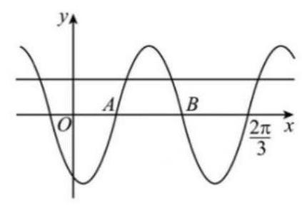

11. 函数 $y = f\left( x\right)$ 的图像由 $y = \cos \left( {{2x} + \frac{\pi }{6}}\right)$ 的图像向左平移 $\frac{\pi }{6}$ 个单位长度得到,则 $y = f\left( x\right)$ 的图像与直线 $y = \frac{1}{2}x - \frac{1}{2}$ 的交点个数为( )

A. 1 B. 2 C. 3 D. 4

题目出处: 2023 年全国甲卷文科 12

12. 已知函数 $f\left( x\right)  = 2\cos \left( {{\omega x} + \varphi }\right)$ 的部分图像如图所示,则满足条件

$$
\left( {f\left( x\right)  - f\left( {-\frac{7\pi }{4}}\right) }\right) \left( {f\left( x\right)  - f\left( \frac{4\pi }{3}\right) }\right)  > 0
$$

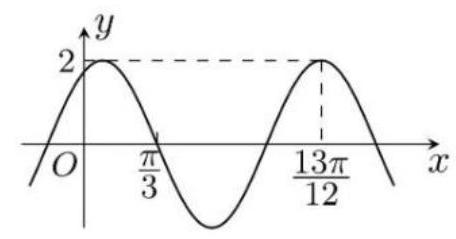

的最小正整数 $x$ 为___.

题目出处: 2021 年全国二卷理科16

13. 已知 $f\left( x\right)  = \sin \left( {{\omega x} + \varphi }\right) \left( {\omega  > 0, - \pi  < x < \pi }\right)$ 在 $\left\lbrack  {-\frac{5\pi }{12},\frac{\pi }{12}}\right\rbrack$ 上单调递增,且 $x = \frac{\pi }{12}$ 是它的一条对称轴, $\left( {\frac{\pi }{3},0}\right)$ 是它的一个对称中心,当 $x \in  \left\lbrack  {0,\frac{\pi }{2}}\right\rbrack$ 时, $f\left( x\right)$ 的最小值为 ( )

A. $- \frac{\sqrt{3}}{2}$ B. $- \frac{1}{2}$ C. 1 D. 0

题目出处: 2025 年天津卷 8

14. 已知函数 $f\left( x\right)  = \cos {\omega x} - 1\left( {\omega  > 0}\right)$ 在区间 $\left\lbrack  {0,{2\pi }}\right\rbrack$ 有且仅有 3 个零点,则 $\omega$ 的取值范围是___。

题目出处: 2023 年新高考一卷15

15. 设函数 $f\left( x\right)  = \sin \left( {{\omega x} + \frac{\pi }{3}}\right)$ 在区间 $\left( {0,\pi }\right)$ 恰有三个极值点,两个零点,则 $\omega$ 的取值范围是( )

A. $\left\lbrack  {\frac{5}{3},\frac{13}{6}}\right)$ B. $\left\lbrack  {\frac{5}{3},\frac{19}{6}}\right)$ C. $\left( {\frac{13}{6},\frac{8}{3}}\right\rbrack$ D. $\left( {\frac{13}{6},\frac{19}{6}}\right\rbrack$

题目出处: 2022 年全国甲卷理科11

16. 设函数 $f\left( x\right)  = \sin \left( {\omega x}\right)  + \cos \left( {\omega x}\right) \;\left( {\omega  > 0}\right)$ ,若 $f\left( {x + \pi }\right)  = f\left( x\right)$ 恒成立,且 $f\left( x\right)$ 在 $\left\lbrack  {0,\frac{\pi }{4}}\right\rbrack$ 上存在零点,则 $\omega$ 的最小值为( )

A. $- \frac{\sqrt{3}}{2}$ B. $- \frac{1}{2}$ C. 1 D. 0

题目出处: 2025 年北京卷 8

17. 记函数 $f\left( x\right)  = \cos \left( {{\omega x} + \varphi }\right) \left( {\omega  > 0,0 < \varphi  < \pi }\right)$ 的最小正周期为 $T$ ,若 $f\left( T\right)  = \frac{\sqrt{3}}{2}$ , $x = \frac{\pi }{9}$ 为 $f\left( x\right)$ 的零点，则 $\omega$ 的最小值为___.

## 题目出处: 2022 年全国乙卷理科15

18. 已知函数 $f\left( x\right)  = \sin \left( {{\omega x} + \varphi }\right) \left( {\omega  > 0,\left| \varphi \right|  \leq  \frac{\pi }{2}}\right) , x =  - \frac{\pi }{4}$ 为 $f\left( x\right)$ 的零点, $x = \frac{\pi }{4}$ 为 $f\left( x\right)$ 的对称轴,且 $f\left( x\right)$ 在 $\left( {\frac{\pi }{18},\frac{5\pi }{36}}\right)$ 上单调,则 $\omega$ 的最大值是( )

A. 11 B. 9 C. 7 D. 5

题目出处: 2016 年全国一卷理科12

## 四、解三角形

1. 在平面四边形 ${ABCD}$ 中， $\angle A = \angle B = \angle C = {75}^{ \circ  }$ ， ${BC} = 2$ ，则 ${AB}$ 的取值范围是___. 题目出处:2015 年全国一卷理科16

2. 在锐角三角形中,角 $A, B, C$ 的对边分别为 $a, b, c$ ,若 $\frac{a}{b} + \frac{b}{a} = 6\cos C$ ,则 $\frac{\tan C}{\tan A} + \frac{\tan C}{\tan B}$ 的值为___.

题目出处:2010 年江苏卷14

3. 记 $\bigtriangleup {ABC}$ 的内角 $A, B, C$ 所对的边分别为 $a, b, c$ ,若 $B = \frac{\pi }{3},{b}^{2} = \frac{9}{4}{ac}$ ,则 $\sin A + \sin C =$

A. $\frac{3}{2}$ B. $\sqrt{2}$ C. $\frac{\sqrt{7}}{2}$ D. $\frac{\sqrt{3}}{2}$

题目出处: 2024 年全国甲卷理科11

4. 在 $\bigtriangleup {ABC}$ 中, ${AB} = 2,{BC} = \sqrt{6},\angle {BAC} = {60}^{ \circ  },\angle {BAC}$ 的平分线交 ${BC}$ 于点 $D$ , 则 ${AD} =$ ___.

题目出处: 2023 年全国甲卷理科16

5. 在 $\bigtriangleup {ABC}$ 中,角 $A, B, C$ 所对的边分别为 $a, b, c,\angle {ABC} = {120}^{ \circ  },\angle {ABC}$ 的平分线交 ${AC}$ 于点 $D$ ，且 ${BD} = 1$ ，则 ${4a} + c$ 的最小值为___

题目出处:2018 年江苏高考13

6. 已知 $a, b, c$ 分别为 $\bigtriangleup {ABC}$ 三个内角 $A, B, C$ 的对边, $a = 2$ ,且

$\left( {2 + b}\right) \left( {\sin A - \sin B}\right)  = \left( {c - b}\right) \sin C$ ，则 $\bigtriangleup  {ABC}$ 的面积的最大值为___.

题目出处:2014 年全国一卷理科16

7. 某人要制作一个三角形，要求它的三条边高的长度分别是 $\frac{1}{13}$ ， $\frac{1}{11}$ ， $\frac{1}{5}$ ，则此人将( )

A. 不能做出满足要求的三角形 B. 作出一个锐角三角形

C. 作出一个直角三角形 D. 作出一个钝角三角形

题目出处:2010 年全上海卷18

8. 设 $a, b, c$ 分别是 $\bigtriangleup {ABC}$ 的三个内角 $A, B, C$ 所对的边,则 “ ${a}^{2} = b\left( {b + c}\right)$ ” 是 $A = {2B}$ 的( )

A. 充要条件 B. 充分而不必要条件

C. 必要而不充分条件 D. 既不充分也不必要条件

题目出处: 2006 年四川卷理科11/文科11

9. 在 $\bigtriangleup {ABC}$ 中,角 $A, B, C$ 的对边分别为 $a, b, c$ ,若 $\bigtriangleup {ABC}$ 为锐角三角形,且满足 $\sin B\left( {1 + 2\cos C}\right)  = 2\sin A\cos C + \cos A\sin C$ ，则下列等式成立的是( )

A. $a = {2b}$ B. $b = {2a}$ C. $A = {2B}$ D. $B = {2A}$

题目出处:2017年山东卷理科9(倒数第二题)

10. 在 $\bigtriangleup {ABC}$ 中, ${AB} = 4,{AC} = 3,\angle {BAC} = {90}^{ \circ  }, D$ 在边 ${BC}$ 上,延长 ${AD}$ 到 $P$ ,使得 ${AP} = 9$ ，若 $\overrightarrow{PA} = m\overrightarrow{PB} + \left( {\frac{3}{2} - m}\right) \overrightarrow{PC}$ ( $m$ 为常数)，则 ${CD}$ 的长度为是___.

题目出处:2020 年江苏高考13

11. 满足条件 ${AB} = 2$ ， ${AC} = \sqrt{2}{BC}$ ，则三角形 ${ABC}$ 面积的最大值是___. 题目出处: 2008 年江苏高考 13

12. 已知 $\bigtriangleup  {ABC}$ 的面积为 $\frac{1}{4}$ ，若 $\cos {2A} + \cos {2B} + 2\sin C = 2$ ， $\cos A\cos B\sin C = \frac{1}{4}$ ，则 ( )

A. $\sin C = {\sin }^{2}A + {\sin }^{2}B\;$ B. ${AB} = \sqrt{2}\;$ C. $\sin A + \sin B = \frac{\sqrt{6}}{2}\;$ D. $A{C}^{2} + B{C}^{2} = 3$

题目出处:2025 年新高考一卷11(多选)

## 五、向量

1. 已知 $\bigtriangleup  {ABC}$ 是边长为 2 的等边三角形， $P$ 为平面 $\bigtriangleup  {ABC}$ 内一点，则 $\overrightarrow{PA} \cdot  \left( {\overrightarrow{PB} + \overrightarrow{PC}}\right)$ 的最小值为( )

A. -2

B. $- \frac{3}{2}$ C. $- \frac{4}{3}$ D. -1

题目出处: 2017 年全国二卷理科12

2. 设 $\bigtriangleup {ABC},{P}_{0}$ 是边 ${AB}$ 上的一定点,满足 ${P}_{0}B = \frac{1}{4}{AB}$ ,且对于边 ${AB}$ 上任一点 $P$ ,恒有 $\overrightarrow{PB} \cdot  \overrightarrow{PC} \geq  \overrightarrow{{P}_{0}B} \cdot  \overrightarrow{{P}_{0}C}$ ,则( )

A. $\angle {ABC} = {90}^{ \circ  }$ B. ${AB} = {AC}$ C. $\angle {BAC} = {90}^{ \circ  }$ D. ${AC} = {BC}$

题目出处: 2013 年浙江卷理科 7

3. 在平面四边形 ${ABCD}$ 中, ${AB} \bot  {BC},{AD} \bot  {CD},\angle {BAD} = {120}^{ \circ  },{AB} = {AD} = 1$ ,若点 $E$ 为边 ${CD}$ 上的动点,则 $\overrightarrow{AE} \cdot  \overrightarrow{BE}$ 的最小值 ( )

A. $\frac{21}{16}$ B. $\frac{3}{2}$ C. $\frac{25}{16}$ D. 3

题目出处: 2018 年天津卷 8

4. 在等腰梯形 ${ABCD}$ 中，已知 ${AB} \parallel  {DC}$ ， ${AB} = 2$ ， ${BC} = 1$ ， $\angle {ABC} = {60}^{ \circ  }$ ，动点 $E$ 和 $F$ 分别在线段 ${BC}$ 和 ${DC}$ 上，且 $\overrightarrow{BE} = \lambda \overrightarrow{BC}$ ， $\overrightarrow{DF} = \frac{1}{9\lambda }\overrightarrow{DC}$ ，则 $\overrightarrow{AE} \cdot  \overrightarrow{AF}$ 的最小值为___ 题目出处: 2015 年天津卷理科14

5. 已知点 $P$ 是单位圆外一点,过点 $P$ 作圆的两条切线,切点分别为 $A, B$ ,则 $\overrightarrow{PA} \cdot  \overrightarrow{PB}$ 的最小值为( )

A. $- 4 + \sqrt{2}$ B. $- 3 + \sqrt{2}$ C. $- 4 + 2\sqrt{2}$ D. $- 3 + 2\sqrt{2}$

题目出处:2010 年全国一卷文科11

6. 已知 $\odot  O$ 的半径为1,直线 ${PA}$ 与 $\odot  O$ 相切于点 $A$ ,直线 ${PB}$ 与 $\odot  O$ 交于 $B, C$ 两点， $D$ 为 ${BC}$ 的中点,若 $\left| {PO}\right|  = \sqrt{2}$ ,则 $\overrightarrow{PA} \cdot  \overrightarrow{PD}$ 的最大值为( )

A. $\frac{1}{2} + \frac{\sqrt{2}}{2}$ B. $\frac{1}{2} + \sqrt{2}$ C. $1 + \sqrt{2}$ D. $2 + \sqrt{2}$

题目出处: 2023 年全国乙卷理科12

7. 在 $\bigtriangleup {ABC}$ 中, ${BC} = 1,\angle A = {60}^{ \circ  },\overrightarrow{AD} = \frac{1}{2}\overrightarrow{AB},\overrightarrow{CE} = \frac{1}{2}\overrightarrow{CD}$ ,记 $\overrightarrow{AB} = \overrightarrow{a},\overrightarrow{AC} = \overrightarrow{b}$ , 用 $\overrightarrow{a}$ 和 $\overrightarrow{b}$ 表示 $\overrightarrow{AE} =$ ___；若 $\overrightarrow{BF} = \frac{1}{3}\overrightarrow{BC}$ ，则 $\overrightarrow{AE} \cdot  \overrightarrow{AF}$ 的最大值为___

题目出处: 2023 年天津卷理科14

8. 在平面内,定点 $A, B, C, D$ ,满足

$\left| \overrightarrow{DA}\right|  = \left| \overrightarrow{DB}\right|  = \left| \overrightarrow{DC}\right| ,\overrightarrow{DA} \cdot  \overrightarrow{DB} = \overrightarrow{DB} \cdot  \overrightarrow{DC} = \overrightarrow{DC} \cdot  \overrightarrow{DA} =  - 2$

动点 $P, M$ 满足 $\left| \overrightarrow{AP}\right|  = 1,\overrightarrow{PM} = \overrightarrow{MC}$ ,则 ${\left| \overrightarrow{BM}\right| }^{2}$ 的最大值为 ( )

A. $\frac{43}{4}$ B. $\frac{49}{4}$ C. $\frac{{37} + 6\sqrt{3}}{4}$ D. $\frac{{37} + 2\sqrt{33}}{4}$

题目出处: 2016 年四川理科10

9. 已知 $\overrightarrow{a},\overrightarrow{b}$ 是平面向量内两个互相垂直的单位向量,若向量 $\overrightarrow{c}$ 满足 $\left( {\overrightarrow{a} - \overrightarrow{c}}\right) \left( {\overrightarrow{b} - \overrightarrow{c}}\right)  = 0$ , 则 $\left| \overrightarrow{c}\right|$ 的最大值为( )

A. 1 B. 2 C. $\sqrt{2}$ D. $\frac{\sqrt{2}}{2}$

题目出处: 2008 年浙江卷理科 9

10. 已知 $\overrightarrow{a},\overrightarrow{b},\overrightarrow{e}$ 是平面向量, $\overrightarrow{e}$ 是单位向量,若非零向量 $\overrightarrow{a}$ 与 $\overrightarrow{e}$ 的夹角为 $\frac{\pi }{3}$ ,向量 $\overrightarrow{b}$ 满足 ${\overrightarrow{b}}^{2} - 4\overrightarrow{e} \cdot  \overrightarrow{b} + 3 = 0$ ,则 $\left| {\overrightarrow{a} - \overrightarrow{b}}\right|$ 的最小值是( )

A. $\sqrt{3} - 1$ B. $\sqrt{3} + 1$ C. 2 D. $2 - \sqrt{3}$

题目出处: 2018 年浙江卷理科 9

11. 在平面上, $\overrightarrow{A{B}_{1}} \bot  \overrightarrow{A{B}_{2}},\left| \overrightarrow{O{B}_{1}}\right|  = \left| \overrightarrow{O{B}_{2}}\right|  = 1,\overrightarrow{AP} = \overrightarrow{A{B}_{1}} + \overrightarrow{A{B}_{2}}$ ,若 $\left| \overrightarrow{OP}\right|  < \frac{1}{2}$ ,则 $\left| \overrightarrow{OA}\right|$ 的取值范围是___

题目出处: 2013 年重庆卷理科10

12. 给定两个长度为 1 的平面向量 $\overrightarrow{OA}$ 和 $\overrightarrow{OB}$ ，它们的夹角为 ${120}^{ \circ  }$ ，如图，点 $C$ 在以 $O$ 为圆心的圆弧 $\overset{\text{ ⏜ }}{AB}$ 上变动,若 $\overrightarrow{OC} = x\overrightarrow{OA} + y\overrightarrow{OB}$ ,其中 $x, y \in  R$ ,则 $x + y$ 的最大值是___

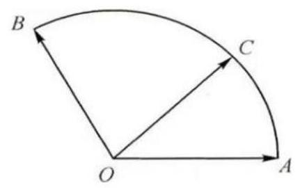

题目出处: 2009 年安徽卷理科14

## 六、解析几何

1. 若直线 $\frac{x}{a} + \frac{y}{b} = 1$ 通过点 $M\left( {\cos \alpha ,\sin \alpha }\right)$ ，则()

A. ${a}^{2} + {b}^{2} \leq  1$ B. ${a}^{2} + {b}^{2} \geq  1$ C. $\frac{1}{{a}^{2}} + \frac{1}{{b}^{2}} \leq  1$ D. $\frac{1}{{a}^{2}} + \frac{1}{{b}^{2}} \geq  1$

题目出处: 2008 年全国一卷理科10

2. 设直线系 $M : x\cos \theta  + \left( {y - 2}\right) \sin \theta  = 1\left( {0 \leq  \theta  \leq  {2\pi }}\right)$ ,对于下列四个命题

① $M$ 中所有的直线均经过一个定点

②存在定点 $P$ 不在 $M$ 中任一条直线上

③对于任意整数 $n\left( {n \geq  3}\right)$ ,存在正 $n$ 边形,其所有边均在 $M$ 中的直线上

④ $M$ 中的直线所围成的正三角形面积相等

其中真命题的代号是___(写出所有真命题的代号)

题目出处:2008年江西卷理科16(压轴)

3. 若过点 $\left( {2,1}\right)$ 的圆与两坐标轴都相切,则圆心到直线 ${2x} - y - 3 = 0$ 的距离为( )

A. $\frac{\sqrt{5}}{5}$ B. $\frac{2\sqrt{5}}{5}$ C. $\frac{3\sqrt{5}}{5}$ D. $\frac{4\sqrt{5}}{5}$

题目出处: 2020 年全国新课标二卷理科 5

4. 已知圆 ${x}^{2} + {y}^{2} - {6x} = 0$ ，过点 $\left( {1,2}\right)$ 的直线被该圆所截得的弦的长度的最小值为( )

A. 1 B. 2 C. 3 D. 4

题目出处:2020 年全国一卷文科6

5. 在平面直角坐标系中,记 $d$ 为点 $P\left( {\cos \theta ,\sin \theta }\right)$ 到直线 $x - {my} - 2 = 0$ 的距离,当 $\theta , m$ 变化时, $d$ 的最大值为( )

A. 1 B. 2 C. 3 D. 4

题目出处: 2018 年北京卷理科 7

6. 直线 $x + y + 2 = 0$ 分别与 $x$ 轴, $y$ 轴交于 $A, B$ 两点,点 $P$ 在圆 ${\left( x - 2\right) }^{2} + {y}^{2} = 2$ 上,则 $\bigtriangleup {ABP}$ 面积的取值范围是( )

A. $\left\lbrack  {2,6}\right\rbrack$ B. $\left\lbrack  {4,8}\right\rbrack$ C. $\left\lbrack  {\sqrt{2},3\sqrt{2}}\right\rbrack$ D. $\left\lbrack  {2\sqrt{2},3\sqrt{2}}\right\rbrack$

题目出处: 2018 年全国三卷理科 6

7. 已知圆 $C : {\left( x - 3\right) }^{2} + {\left( y - 4\right) }^{2} = 1$ 和两点 $A\left( {-m,0}\right) , B\left( {m,0}\right) \left( {m > 0}\right)$ ,若圆 $C$ 上存在点 $P$ ,使得 $\angle {APB} = {90}^{ \circ  }$ ,则 $m$ 的最大值为( )

A. 7 B. 6 C. 5 D. 4

题目出处: 2014 年北京卷文科 7

8. 写出与圆 ${x}^{2} + {y}^{2} = 1$ 和 ${\left( x - 3\right) }^{2} + {\left( y - 4\right) }^{2} = {16}$ 都相切的一条直线的方程为___. 题目出处: 2022 年新高考一卷14

9. 已知点 $P$ 在圆 ${\left( x - 5\right) }^{2} + {\left( y - 5\right) }^{2} = {16}$ 上,点 $A\left( {4,0}\right) , B\left( {0,2}\right)$ ,则()

A. 点 $P$ 到直线 ${AB}$ 的距离小于 10 B. 点 $P$ 到直线 ${AB}$ 的距离大于 2

C. 当 $\angle {PBA}$ 最小时, $\left| {PB}\right|  = 3\sqrt{2}\;$ D. 当 $\angle {PBA}$ 最大时, $\left| {PB}\right|  = 3\sqrt{2}$

题目出处:2021 年新高考一卷11(多选)

10. 已知直线 $l : x - {my} + 1 = 0$ 与 $\odot  O : {\left( x - 1\right) }^{2} + {y}^{2} = 4$ 交于 $A, B$ 两点,写出满足 “ $\bigtriangleup  {ABC}$ 面积为 $\frac{8}{5}$ ” 的 $m$ 的一个值___.

题目出处:2023 年新高考二卷15

11. 已知直线 ${ax} + y + 2 - a = 0$ 与圆 $C : {x}^{2} + {y}^{2} + {4y} - 1 = 0$ 交于 $A, B$ 两点,则 $\left| {AB}\right|$ 的最小值为( )

A. 2 B. 3 C. 4 D. 6

## 题目出处: 2024 年全国甲卷文科10

12. 已知 $a + c = {2b}$ ,直线 ${ax} + {by} + c = 0$ 与圆 ${x}^{2} + {y}^{2} + {4y} - 1 = 0$ 交于 $A, B$ 两点,则 $\left| {AB}\right|$ 的最小值为 ( )

A. 1 B. 2 C. 4 D. $2\sqrt{5}$

## 题目出处: 2024 年全国甲卷理科12

13. 设点 $A\left( {-2,3}\right) , B\left( {0, a}\right)$ ,若直线 ${AB}$ 关于 $y = a$ 对称的直线与圆 ${\left( x + 3\right) }^{2} + {\left( y + 2\right) }^{2} = 1$ 有公共点，则 $a$ 的取值范围是___.

题目出处: 2022 年新高考二卷15

14. 已知 $\odot  M : {x}^{2} + {y}^{2} - {2x} - {2y} - 2 = 0$ ,直线 $l : {2x} + y + 2 = 0, P$ 为 $l$ 上的动点,过点 $P$ 作 $\odot  M$ 的切线 ${PA},{PB}$ ，切点为 $A, B$ ，当 $\left| {PM}\right|  \cdot  \left| {AB}\right|$ 最小时，直线 ${AB}$ 的方程为 ( )

A. ${2x} - y - 1 = 0$ B. ${2x} + y - 1 = 0$ C. ${2x} - y + 1 = 0$ D. ${2x} + y + 1 = 0$

题目出处: 2020 年全国一卷理科11

15. 设平面点集 $A = \left\{  {\left( {x, y}\right) \left| {\;\left( {y - x}\right) \left( {y - \frac{1}{x}}\right)  \geq  0}\right. }\right\}  , B = \left\{  {\left( {x, y}\right) \left| {\;{\left( x - 1\right) }^{2} + {\left( y - 1\right) }^{2} \leq  1}\right. }\right\}$ , 则 $A \cap  B$ 所表示的平面图形面积为 ( )

A. $\frac{3}{4}\pi$ B. $\frac{3}{5}\pi$ C. $\frac{4}{7}\pi$ D. $\frac{\pi }{2}$

题目出处: 2012 年重庆卷理科10

16. 设点 $M\left( {{x}_{0},1}\right)$ ,若在圆 $O : {x}^{2} + {y}^{2} = 1$ 上存在点 $N$ ,使得 $\angle {OMN} = {45}^{ \circ  }$ ,则 ${x}_{0}$ 的取值范围是( )

A. $\left\lbrack  {-1,1}\right\rbrack$ B. $\left\lbrack  {-\frac{1}{2},\frac{1}{2}}\right\rbrack$ C. $\left\lbrack  {-\sqrt{2},\sqrt{2}}\right\rbrack$ D. $\left\lbrack  {-\frac{\sqrt{2}}{2},\frac{\sqrt{2}}{2}}\right\rbrack$

题目出处: 2014 年全国二卷文科12

17. 若圆 ${x}^{2} + {\left( y + 2\right) }^{2} = {r}^{2}\left( {r > 0}\right)$ 上到直线 $y = \sqrt{3}x + 2$ 的距离为 1 的点有且仅有 2 个, 则 $r$ 的取值范围是( )

A. $\left( {0,1}\right)$ B. $\left( {1,3}\right)$ C. $\left( {3, + \infty }\right)$ D. $\left( {0, + \infty }\right)$

题目出处:2025 年新高考一卷7

18. 已知 ${AC}$ , ${BD}$ 为圆 $O : {x}^{2} + {y}^{2} = 4$ 的两条相互垂直的弦,垂足为 $M\left( {1,\sqrt{2}}\right)$ ,则四边形 ${ABCD}$ 的面积的最大值为___.

题目出处:2009年全国二卷16

19. 已知曲线 $C : {x}^{2} + {y}^{2} = {16}\left( {y > 0}\right)$ ,从 $C$ 上任意一点 $P$ 向 $x$ 轴作垂线段 $P{P}^{\prime },{P}^{\prime }$ 为垂足,则线段 $P{P}^{\prime }$ 的中点 $M$ 的轨迹方程为 ( )

A. $\frac{{x}^{2}}{16} + \frac{{y}^{2}}{4} = 1\left( {y > 0}\right)$ B. $\frac{{x}^{2}}{16} + \frac{{y}^{2}}{8} = 1\left( {y > 0}\right)$

C. $\frac{{y}^{2}}{16} + \frac{{x}^{2}}{4} = 1\left( {y > 0}\right)$ D. $\frac{{y}^{2}}{16} + \frac{{x}^{2}}{8} = 1\left( {y > 0}\right)$

题目出处:2024年新高考二卷5

20. 已知椭圆 $\frac{{x}^{2}}{9} + \frac{{y}^{2}}{6} = 1,{F}_{1},{F}_{2}$ 为两个焦点， $O$ 为坐标原点， $P$ 为椭圆上一点， $\cos \angle {F}_{1}P{F}_{2} = \frac{3}{5}$ ，则 $\left| {PO}\right|  =$ ( )

A. $\frac{2}{5}$ B. $\frac{\sqrt{30}}{2}$ C. $\frac{3}{5}$ D. $\frac{\sqrt{35}}{2}$

题目出处: 2023 年全国甲卷理科12

21. 已知椭圆 $C : \frac{{x}^{2}}{{a}^{2}} + \frac{{y}^{2}}{{b}^{2}} = 1\left( {a > b > 0}\right) , C$ 的上顶点为 $A$ ,两个焦点为 ${F}_{1},{F}_{2}$ ,离心率为 $\frac{1}{2}$ ,过 ${F}_{1}$ 且垂直于 $A{F}_{2}$ 的直线与 $C$ 交于 $D, E$ 两点, $\left| {DE}\right|  = 6$ ,则 $\bigtriangleup {ADE}$ 的周长为___。

## 题目出处: 2022 年新高考一卷16

22. 已知直线 $l$ 与椭圆 $\frac{{x}^{2}}{6} + \frac{{y}^{2}}{3} = 1$ 在第一象限交于 $A, B$ 两点, $l$ 与 $x$ 轴, $y$ 轴分别交于 $M, N$ 两点,且 $\left| {MA}\right|  = \left| {NB}\right| ,\left| {MN}\right|  = 2\sqrt{3}$ ,则 $l$ 的方程为___

题目出处:2022 年新高考二卷16

23. 椭圆 $C : \frac{{x}^{2}}{{a}^{2}} + \frac{{y}^{2}}{{b}^{2}} = 1\left( {a > b > 0}\right)$ 的左顶点为 $A$ ,点 $P, Q$ 均在 $C$ 上,且关于 $y$ 轴对称, 若直线 ${AP},{AQ}$ 的斜率之积为 $\frac{1}{4}$ ，则 $C$ 的离心率为( )

A. $\frac{\sqrt{3}}{2}$ B. $\frac{\sqrt{2}}{2}$ C. $\frac{1}{2}$ D. $\frac{1}{3}$

题目出处: 2022 年全国甲卷理科10

24. 已知椭圆 $C : \frac{{x}^{2}}{{a}^{2}} + \frac{{y}^{2}}{{b}^{2}} = 1\left( {a > b > 0}\right)$ 的离心率为 $\frac{1}{3},{A}_{1},{A}_{2}$ 分别为 $C$ 的左、右顶点， $B$ 为 $C$ 的上顶点，若 $\overrightarrow{B{A}_{1}} \cdot  \overrightarrow{B{A}_{2}} =  - 1$ ，则 $C$ 的方程为( )

A. $\frac{{x}^{2}}{8} + \frac{{y}^{2}}{16} = 1$ B. $\frac{{x}^{2}}{9} + \frac{{y}^{2}}{8} = 1$ C. $\frac{{x}^{2}}{3} + \frac{{y}^{2}}{2} = 1$ D. $\frac{{x}^{2}}{2} + {y}^{2} = 1$

题目出处: 2022 年全国甲卷文科11

25. 设 $B$ 是椭圆 $C : \frac{{x}^{2}}{{a}^{2}} + \frac{{y}^{2}}{{b}^{2}} = 1\;\left( {a > b > 0}\right)$ 的上顶点,若 $C$ 上的任意一点 $P$ 都满足 $\left| {PB}\right|  \leq  {2b}$ ，则 $C$ 的离心率的取值范围是( )

A. $\left\lbrack  {\frac{\sqrt{2}}{2},1}\right)$ B. $\left\lbrack  {\frac{\sqrt{2}}{2},1}\right)$ C. $\left( {0,\frac{\sqrt{2}}{2}}\right\rbrack$ D. $\left( {0,\frac{1}{2}}\right\rbrack$

题目出处: 2021 年全国一卷理科11

26. 设 $B$ 是椭圆 $C : \frac{{x}^{2}}{5} + {y}^{2} = 1$ 的上顶点，点 $P$ 在 $C$ 上，则 ${PB}$ 的最大值是( )

A. $\frac{5}{2}$ B. $\sqrt{6}$ C. $\sqrt{5}$ D. 2

题目出处: 2021 年全国一卷文科11

27. 已知 ${F}_{1}$ ， ${F}_{2}$ 为椭圆 $C : \frac{{x}^{2}}{16} + \frac{{y}^{2}}{4} = 1$ 的两个焦点， $P$ ， $Q$ 为 $C$ 上关于坐标原点对称的两点， 且 $\left| {PQ}\right|  = \left| {{F}_{1}{F}_{2}}\right|$ ，则四边形 $P{F}_{1}Q{F}_{2}$ 的面积为___。

题目出处: 2021 年全国二卷理科15

28. 已知椭圆 $C$ 的焦点为 $F\left( {-1,0}\right) ,{F}_{2}\left( {1,0}\right)$ ,过 ${F}_{2}$ 的直线与 $C$ 交于 $A, B$ 两点,若 $\left| {A{F}_{2}}\right|  = 2\left| {{F}_{2}B}\right| ,\left| {AB}\right|  = \left| {B{F}_{1}}\right|$ ,则 $C$ 的方程为 ( )

A. $\frac{{x}^{2}}{2} + {y}^{2} = 1$ B. $\frac{{x}^{2}}{3} + \frac{{y}^{2}}{2} = 1$ C. $\frac{{x}^{2}}{4} + \frac{{y}^{2}}{3} = 1$ D. $\frac{{x}^{2}}{5} + \frac{{y}^{2}}{4} = 1$

题目出处: 2019 年全国一卷文科12

29. 设 $P, Q$ 分别为 ${x}^{2} + {\left( y - 6\right) }^{2} = 2$ 和椭圆 $\frac{{x}^{2}}{10} + {y}^{2} = 1$ 上的点,则 $P, Q$ 两点间的最大距离是___。

## 题目出处:2014 年福建卷理科9

30. 设 ${F}_{1},{F}_{2}$ 是椭圆 $\frac{{x}^{2}}{3} + {y}^{2} = 1$ 的左、右焦点,点 $A, B$ 在椭圆上,若 $\overrightarrow{{F}_{1}A} = 5\overrightarrow{{F}_{2}B}$ ,则点 $A$ 的坐标为___。

题目出处: 2011 年浙江卷理科17

31. 已知椭圆 $C : \frac{{x}^{2}}{{a}^{2}} + \frac{{y}^{2}}{{b}^{2}} = 1\left( {a > b > 0}\right)$ 的离心率为 $\frac{\sqrt{3}}{2}$ ，过右焦点 $F$ 且斜率为 $k \; \left( {k > 0}\right)$ 的直线与 $C$ 相交于 $A, B$ 两点，若 $\overrightarrow{AF} = 3\overrightarrow{FB}$ ，则 $k =$ ()

A. 1 B. $\sqrt{2}$ C. $\sqrt{3}$ D. 2

题目出处:2010 年全国二卷理科12

32. 已知 $F$ 是椭圆 $C$ 的一个焦点, $B$ 是短轴的一个端点,线段 ${BF}$ 的延长线交 $C$ 于点 $D$ ,且 $\overrightarrow{BF} = 2\overrightarrow{FD}$ ，则 $C$ 的离心率为___。

题目出处:2010 年全国一卷理科16

33. 设双曲线 $C : \frac{{x}^{2}}{{a}^{2}} - \frac{{y}^{2}}{{b}^{2}} = 1\;\left( {a > 0, b > 0}\right)$ 的左、右焦点分别为 ${F}_{1},{F}_{2}$ ,过 ${F}_{2}$ 作平行于 $y$ 轴的直线交 $C$ 于 $A, B$ 两点，若 $\left| {{F}_{1}A}\right|  = {13}$ ， $\left| {AB}\right|  = {10}$ ，则 $C$ 的离心率为___。

题目出处:2024 年新高考一卷16

34. 已知双曲线的两个焦点分别为 $\left( {0,4}\right) ,\left( {0, - 4}\right)$ ,点 $\left( {-6,4}\right)$ 在该双曲线上,则该双曲线的离心率为( )

A. 4 B. 3 C. 2 D. $\sqrt{2}$

## 题目出处:2024 年全国甲卷理科5

35. 记双曲线 $C : \frac{{x}^{2}}{{a}^{2}} - \frac{{y}^{2}}{{b}^{2}} = 1\left( {a > 0, b > 0}\right)$ 的离心率为 $\mathrm{e}$ ,写出满足条件 “直线 $y = {2x}$ 与 $C$ 无公共点” 的e 的一个值___.

## 题目出处:2022 年全国甲卷文科15

36. 已知 $M\left( {{x}_{0},{y}_{0}}\right)$ 是双曲线 $C : \frac{{x}^{2}}{2} - {y}^{2} = 1$ 上的一点， ${F}_{1},{F}_{2}$ 是 $C$ 的两个焦点，若 $\overrightarrow{M{F}_{1}} \cdot  \overrightarrow{M{F}_{2}} < 0$ ，则 ${y}_{0}$ 的取值范围是( )

A. $\left( {-\frac{\sqrt{3}}{3},\frac{\sqrt{3}}{3}}\right)$ B. $\left( {-\frac{\sqrt{3}}{6},\frac{\sqrt{3}}{6}}\right)$ C. $\left( {-\frac{2\sqrt{2}}{3},\frac{2\sqrt{2}}{3}}\right)$ D. $\left( {-\frac{2\sqrt{3}}{3},\frac{2\sqrt{3}}{3}}\right)$

题目出处: 2015 年全国一卷理科 5

37. 已知双曲线 $E$ 的中心为原点， $F\left( {3,0}\right)$ 是 $E$ 的焦点，过 $F$ 的直线 $l$ 与 $E$ 相交于 $A, B$ 两点，且 ${AB}$ 的中点为 $N\left( {-{12}, - {15}}\right)$ ，则 $E$ 的方程为( )

A. $\frac{{x}^{2}}{3} - \frac{{y}^{2}}{6} = 1$ B. $\frac{{x}^{2}}{4} - \frac{{y}^{2}}{5} = 1$ C. $\frac{{x}^{2}}{6} - \frac{{y}^{2}}{3} = 1$ D. $\frac{{x}^{2}}{5} - \frac{{y}^{2}}{4} = 1$

题目出处: 2010 年全国新课标卷理科12

38. 设 $A, B$ 为双曲线 ${x}^{2} - \frac{{y}^{2}}{9} = 1$ 上两点,下列四个点中,可为线段 ${AB}$ 中点的是 ( )

A. $\left( {1,1}\right)$ B. $\left( {-1,2}\right)$ C. $\left( {1,3}\right)$ D. $\left( {-1, - 4}\right)$

题目出处:2023年全国乙卷文科12

39. 已知 $F$ 为双曲线 $C : \frac{{x}^{2}}{{a}^{2}} - \frac{{y}^{2}}{{b}^{2}} = 1\left( {a > 0, b > 0}\right)$ 的右焦点， $A$ 为 $C$ 的右顶点， $B$ 为 $C$ 上的点，且 ${BF}$ 垂直于 $x$ 轴，若 ${AB}$ 的斜率为3，则 $C$ 的离心率为___.

题目出处:2020 年全国一卷理科15

40. 双曲线 $\frac{{x}^{2}}{{a}^{2}} - \frac{{y}^{2}}{{b}^{2}} = 1\left( {a > 0, b > 0}\right)$ 的左、右焦点分别为 ${F}_{1},{F}_{2}, P$ 是双曲线右支上一点,且直线 $P{F}_{2}$ 的斜率为 $2,\bigtriangleup P{F}_{1}{F}_{2}$ 是面积为 8 的直角三角形,则双曲线的方程为 ( )

A. $\frac{{x}^{2}}{8} - \frac{{y}^{2}}{2} = 1$ B. $\frac{{x}^{2}}{8} - \frac{{y}^{2}}{4} = 1$

C. $\frac{{x}^{2}}{2} - \frac{{y}^{2}}{8} = 1$ D. $\frac{{x}^{2}}{4} - \frac{{y}^{2}}{8} = 1$

题目出处: 2024 年天津卷8

41. 已知 ${F}_{1},{F}_{2}$ 是椭圆和双曲线的公共焦点, $P$ 是它们的一个公共点,且 $\angle {F}_{1}P{F}_{2} = \frac{\pi }{3}$ , 则椭圆与双曲线离心率的倒数之和的最大值为( )

A. $\frac{4\sqrt{3}}{3}$ B. $\frac{2\sqrt{3}}{3}$ C. 3 D. 2

## 题目出处: 2014 年湖北卷理科 9

42. 设 $F$ 为双曲线 $C : \frac{{x}^{2}}{{a}^{2}} - \frac{{y}^{2}}{{b}^{2}} = 1\;\left( {a > 0, b > 0}\right)$ 的右焦点, $O$ 为坐标原点,以 ${OF}$ 为直径的圆与圆 ${x}^{2} + {y}^{2} = {a}^{2}$ 交于 $P, Q$ 两点,若 $\left| {PQ}\right|  = \left| {OF}\right|$ ,则 $C$ 的离心率为( )

A. $\sqrt{2}$ B. $\sqrt{3}$ C. 2 D. $\sqrt{5}$

题目出处: 2019 年全国二卷理科11

43. 已知 ${F}_{1},{F}_{2}$ 分别为双曲线 $C : \frac{{x}^{2}}{9} - \frac{{y}^{2}}{27} = 1$ 的左、右焦点,点 $A \in  C$ ,点 $M$ 坐标为 $\left( {2,0}\right) ,{AM}$ 为 $\angle {F}_{1}A{F}_{2}$ 的平分线，则 $\left| {A{F}_{2}}\right|  =$

题目出处:2011年全国二卷文科16

44. 已知双曲线 $C : \frac{{x}^{2}}{{a}^{2}} - \frac{{y}^{2}}{{b}^{2}} = 1\left( {a > 0, b > 0}\right)$ 的左、右焦点分别为 ${F}_{1},{F}_{2}$ ,过 ${F}_{1}$ 的直线与 $C$ 的两条渐近线交于 $A, B$ 两点,若 $\overrightarrow{{F}_{1}A} = \overrightarrow{AB},\overrightarrow{{F}_{1}B} \cdot  \overrightarrow{{F}_{2}B} = 0$ ,则 $C$ 的离心率为___.

## 题目出处: 2019 年全国一卷理科16

45. 双曲线 $C$ 的两个焦点为 ${F}_{1},{F}_{2}$ ,以 $C$ 的实轴为直径的圆记为 $D$ ,过 ${F}_{1}$ 作 $D$ 的切线与 $C$ 交于 $M, N$ 两点，且 $\cos \angle {F}_{1}N{F}_{2} = \frac{3}{5}$ ，则 $C$ 的离心率为( )

A. $\frac{\sqrt{5}}{2}$ B. $\frac{3}{2}$ C. $\frac{\sqrt{13}}{2}$ D. $\frac{\sqrt{17}}{2}$

题目出处:2022 年全国乙卷理科11(多选)

46. 已知双曲线 $C : \frac{{x}^{2}}{{a}^{2}} - \frac{{y}^{2}}{{b}^{2}} = 1\left( {a > 0, b > 0}\right)$ 的左、右焦点分别为 ${F}_{1},{F}_{2}$ ,点 $A$ 在 $C$ 上，点 $B$ 在 $y$ 轴上， $\overrightarrow{{F}_{1}A}\bot \overrightarrow{{F}_{1}B}$ ， $\overrightarrow{{F}_{2}A} =  - \frac{2}{3}\overrightarrow{{F}_{2}B}$ ，则 $C$ 的离心率为___.

题目出处:2023 年新高考一卷16

47. 双曲线 $C$ 的两个焦点为 ${F}_{1},{F}_{2}$ ,以 $C$ 的实轴为直径的圆记为 $D$ ,过 ${F}_{1}$ 作 $D$ 的切线与 $C$ 交于 $M, N$ 两点，且 $\cos \angle {F}_{1}N{F}_{2} = \frac{3}{5}$ ，则 $C$ 的离心率为( )

A. $\frac{\sqrt{5}}{2}$ B. $\frac{3}{2}$ C. $\frac{\sqrt{13}}{2}$ D. $\frac{\sqrt{17}}{2}$

题目出处:2022年全国乙卷理科11(多选)

48. 已知 $F$ 为双曲线 $C : \frac{{x}^{2}}{{a}^{2}} - \frac{{y}^{2}}{{b}^{2}} = 1\left( {a > 0, b > 0}\right)$ 的右焦点， $A$ 为 $C$ 的右顶点， $B$ 为 $C$ 上的点，且 ${BF}$ 垂直于 $x$ 轴，若 ${AB}$ 的斜率为3，则 $C$ 的离心率为___.

题目出处:2020 年全国一卷理科15

49. 设 ${F}_{1},{F}_{2}$ 是双曲线 $C : {x}^{2} - \frac{{y}^{2}}{3} = 1$ 的两个焦点, $O$ 为坐标原点,点 $P$ 在 $C$ 上且 $\left| {OP}\right|  = 2$ ，则 $\bigtriangleup  P{F}_{1}{F}_{2}$ 的面积为( )

A. $\frac{7}{2}$ B. 3 C. $\frac{5}{2}$ D. 2

题目出处: 2020 年全国一卷文科11

50. 设双曲线 $C : \frac{{x}^{2}}{{a}^{2}} - \frac{{y}^{2}}{{b}^{2}} = 1\;\left( {a > 0, b > 0}\right)$ 的左、右焦点分别为 ${F}_{1},{F}_{2}$ ,离心率为 $\sqrt{5}, P$ 是 $C$ 上一点,且 ${F}_{1}P \bot  {F}_{2}P$ ,若 $\bigtriangleup P{F}_{1}{F}_{2}$ 的面积为4,则 $a =$ (   )

A. 1 B. 2 C. 4 D. 8

题目出处: 2020 年全国三卷理科11

51. 设双曲线 $C$ 的中心为点 $O$ ,若有且只有一对相交于点 $O$ ,所成角为 ${60}^{ \circ  }$ 的直线 ${A}_{1}{B}_{1}$ 和 ${A}_{2}{B}_{2}$ ,使 $\left| {{A}_{1}{B}_{1}}\right|  = \left| {{A}_{2}{B}_{2}}\right|$ ,其中 ${A}_{1},{B}_{1}$ 和 ${A}_{2},{B}_{2}$ 分别是这对直线与双曲线 $C$ 的交点, 则该双曲线的离心率的取值范围是( )

A. $\left( {\frac{2\sqrt{3}}{3},2}\right\rbrack$ B. $\left\lbrack  {\frac{2\sqrt{3}}{3},2}\right)$ C. $\left( {\frac{2\sqrt{3}}{3}, + \infty }\right)$ D. $\left\lbrack  {\frac{2\sqrt{3}}{3}, + \infty }\right)$

题目出处:2013年重庆卷文科10

52. 已知 ${F}_{1},{F}_{2}$ 分别为双曲线 $C : \frac{{x}^{2}}{9} - \frac{{y}^{2}}{27} = 1$ 的左、右焦点,点 $A \in  C$ ,点 $M$ 坐标为 $\left( {2,0}\right)$ ， ${AM}$ 为 $\angle {F}_{1}A{F}_{2}$ 的平分线，则 $\left| {A{F}_{2}}\right|  =$ ___。

题目出处: 2011 年全国二卷文科16

53. 双曲线 $C : \frac{{x}^{2}}{{a}^{2}} - \frac{{y}^{2}}{{b}^{2}} = 1\left( {a > 0, b > 0}\right)$ 的左右焦点分别为 ${F}_{1},{F}_{2}$ ,左、右顶点分别为 ${A}_{1},{A}_{2}$ ,以 ${F}_{1}{F}_{2}$ 为直径的圆与 $C$ 的一条渐近线交于 $M, N$ 两点,且 $\angle N{A}_{1}M = \frac{5\pi }{6}$ , 则( )

A. $\angle {A}_{1}M{A}_{2} = \frac{\pi }{6}$ B. $\left| {M{A}_{1}}\right|  = 2\left| {M{A}_{2}}\right|$

C. $C$ 的离心率为 $\sqrt{13}$ D. 当 $a = \sqrt{2}$ ，四边形 $N{A}_{1}M{A}_{2}$ 的面积为 $8\sqrt{3}$

题目出处:2025 年新高考二卷11(多选)

54. 已知 ${\left( x - 1\right) }^{2} + {y}^{2} = {25}$ 的圆心与抛物线 ${y}^{2} = {2px}$ ( $p > 0$ ) 的焦点 $F$ 重合, $A$ 为两曲线的交点，则原点到直线 ${AF}$ 的距离为___。

题目出处:2024年天津卷12

55. $O$ 为坐标原点， $F$ 为抛物线 $C : {y}^{2} = 4\sqrt{2}x$ 的焦点， $P$ 为 $C$ 上一点，若 $\left| {PF}\right|  = 4\sqrt{2}$ ， 则 $\bigtriangleup {POF}$ 的面积为( )

A. 2 B. $2\sqrt{2}$ C. $2\sqrt{3}$ D. 4

题目出处: 2013 年全国一卷文科8

56. 已知 $F$ 是抛物线 $C : {y}^{2} = {8x}$ 的焦点， $M$ 是 $C$ 上一点， ${FM}$ 的延长线交 $y$ 轴于点 $N$ ，，若 $M$ 为 ${FN}$ 的中点,则 $\left| {FN}\right|  =$

题目出处: 2017 年全国二卷理科16

57. 以抛物线 $C$ 的顶点为圆心的圆交 $C$ 于 $A, B$ 两点,交 $C$ 的准线于 $D, E$ 两点,已知 $\left| {AB}\right|  = 4\sqrt{2},\left| {DE}\right|  = 2\sqrt{5}$ ，则 $C$ 的焦点到准线的距离为( )

A. 2 B. 4 C. 6 D. 8

题目出处: 2016 年全国一卷理科10

58. 抛物线 $C : {y}^{2} = {4x}$ 的准线为 $l, P$ 为 $C$ 上的动点,过 $P$ 作圆 $A : {x}^{2} + {\left( y - 4\right) }^{2} = 1$ 的一条切线, $Q$ 为切点,过 $P$ 作 $l$ 的垂线,垂足为 $B$ ,则(   )

A. $l$ 与 $\odot  A$ 相切 B. 当 $P, A, B$ 三点共线时, $\left| {PQ}\right|  = \sqrt{15}$

C. 当 $\left| {PB}\right|  = 2$ 时， ${PA}\bot {AB}$ D. 满足 $\left| {PA}\right|  = \left| {PB}\right|$ 的点 $P$ 有且仅有 2 个题目出处: 2024 年新高考二卷10(多选)

59. 已知 $F$ 为抛物线 $C : {y}^{2} = {4x}$ 的焦点,过 $F$ 作两条互相垂直的直线 ${l}_{1},{l}_{2}$ ,直线 ${l}_{1}$ 与 $C$ 交于 $A, B$ 两点，直线 ${l}_{2}$ 与 $C$ 交于 $D, E$ 两点，则 $\left| {AB}\right|  + \left| {DE}\right|$ 的最小值为( )

A. 16 B. 14 C. 12 D. 10

题目出处: 2017 年全国一卷理科10

60. 已知抛物线 $C : {y}^{2} = {8x}$ 的焦点为 $F$ ,准线为 $l, P$ 是 $l$ 上一点, $Q$ 是直线 ${PF}$ 与 $C$ 的一个交点,若 $\overrightarrow{FP} = 4\overrightarrow{FQ}$ ,则 $\left| {QF}\right|  =$ ( )

A. $\frac{7}{2}$ B. 3 C. $\frac{5}{2}$ D. 2

题目出处: 2014 年全国一卷理科10

61. 已知点 $M\left( {-1,1}\right)$ 和抛物线 $C : {y}^{2} = {4x}$ ,过 $C$ 的焦点且斜率为 $k$ 的直线与 $C$ 交于 $A, B$ 两点,若 $\angle {AMB} = {90}^{ \circ  }$ ，则 $k =$ ___。

题目出处: 2018 年全国三卷理16

62. 设 $O$ 为坐标原点， $P$ 是以 $F$ 为焦点的抛物线 ${y}^{2} = {2px}$ ( $p > 0$ )上任意一点， $M$ 是线段 ${PF}$ 上的点,且 $\left| {PM}\right|  = 2\left| {MF}\right|$ ,则直线 ${OM}$ 的斜率的最大值为 ( )

A. $\frac{\sqrt{3}}{3}$ B. $\frac{2}{3}$ C. $\frac{\sqrt{2}}{2}$ D. 1

题目出处: 2016 年四川卷理科8

63. 设 $O$ 为坐标原点,直线 $y =  - \sqrt{3}\left( {x - 1}\right)$ 过抛物线 $C : {y}^{2} = {2px}\left( {p > 0}\right)$ 的焦点,且与 $C$ 交于 $M, N$ 两点， $l$ 为 $C$ 的准线，则( )

A. $p = 2$

B. $\left| {MN}\right|  = \frac{8}{3}$

C. 以 ${MN}$ 为直径的圆与 $l$ 相切 D. $\bigtriangleup {OMN}$ 为等腰三角形

题目出处:2023 年新高考二卷10(多选)

64. 已知 $O$ 为坐标原点,过抛物线 $C : {y}^{2} = {2px}\;\left( {p > 0}\right)$ 的焦点 $F$ 的直线与 $C$ 交于 $A, B$ 两点,点 $A$ 在第一象限,点 $M\left( {p,0}\right)$ ,若 $\left| {AF}\right|  = \left| {AM}\right|$ ,则(   )

A. 直线 ${AB}$ 的斜率为 $2\sqrt{6}$ B. $\left| {OB}\right|  = \left| {OF}\right|$

C. $\left| {AB}\right|  > 4\left| {OF}\right|$ D. $\angle {OAM} + \angle {OBM} < {180}^{ \circ  }$

题目出处: 2022 年新高考二卷10(多选)

65. 已知 $O$ 为坐标原点,点 $A\left( {1,1}\right)$ 在抛物线 $C : {x}^{2} = {2py}\left( {p > 0}\right)$ 上,过点 $B\left( {0, - 1}\right)$ 的直线交 $C$ 于 $P, Q$ 两点,则 ( )

A. $C$ 的准线为 $y =  - 1$ B. 直线 ${AB}$ 与 $C$ 相切

C. $\left| {OP}\right|  \cdot  \left| {OQ}\right|  > {\left| OA\right| }^{2}$ D. $\left| {BP}\right|  \cdot  \left| {BQ}\right|  > {\left| BA\right| }^{2}$

题目出处: 2022 年新高考一卷11(多选)

66. 已知抛物线 ${y}^{2} = {2px}$ 上三点 $A\left( {2,2}\right) , B, C$ ,直线 ${AB},{AC}$ 是圆 ${\left( x - 2\right) }^{2} + {y}^{2} = 1$ 的两条切线，则直线 ${BC}$ 的方程为( )

A. $x + {2y} + 1 = 0$ B. ${3x} + {6y} + 4 = 0$

C. ${2x} + {6y} + 3 = 0$ D. $x + {3y} + 2 = 0$

## 题目出处:2021年八省联考7(教育部命制)

67. 设抛物线 $C : {y}^{2} = {6x}$ 的焦点为 $F$ ,过 $F$ 的直线交 $C$ 于 $A, B$ ,过 $A$ 作 $C$ 的准线的垂线, 垂足为 $D$ ,过 $F$ 且垂直于 ${AB}$ 的直线交 $l$ 于 $E$ ,则()

A. $\left| {AD}\right|  = \left| {AF}\right|$ B. $\left| {AE}\right|  = \left| {AB}\right|$ C. $\left| {AB}\right|  \geq  6$ D. $\left| {AE}\right|  \cdot  \left| {BE}\right|  \geq  {18}$

题目出处:2025 年新高考一卷10(多选)

68. 设 $F$ 为抛物线 ${y}^{2} = {4x}$ 的焦点， $A, B, C$ 为该抛物线上三点，若 $\overrightarrow{FA} + \overrightarrow{FB} + \overrightarrow{FC} = \overrightarrow{0}$ ， 则 $\left| \overrightarrow{FA}\right|  + \left| \overrightarrow{FB}\right|  + \left| \overrightarrow{FC}\right|$ 的值为( )

A. 3 B. 4 C. 6 D. 9

题目出处: 2007 年全国二卷理科12

69. 已知抛物线 $C : {y}^{2} = {8x}$ 的焦点为 $F$ ,准线与 $x$ 轴的交点为 $K$ ,点 $A$ 在 $C$ 上,且 $\left| {AK}\right|  = \sqrt{2}\left| {AF}\right|$ ，则 $\bigtriangleup  {AFK}$ 的面积为( )

A. 4 B. 8 C. 16 D. 32

题目出处: 2008 年四川卷理科12

70. 设抛物线 ${y}^{2} = {2x}$ 的焦点为 $F$ ,过点 $M\left( {\sqrt{3},0}\right)$ 的直线与抛物线相交于 $A, B$ 两点,与抛物线的准线相交于 $C,\left| {BF}\right|  = 2$ ,则 $\bigtriangleup {BCF}$ 与 $\bigtriangleup {ACF}$ 的面积之比 $\frac{{S}_{\bigtriangleup {BCF}}}{{S}_{\bigtriangleup {ACF}}} =$ ( )

A. $\frac{4}{5}$ B. $\frac{2}{3}$ C. $\frac{4}{7}$ D. $\frac{1}{2}$

题目出处: 2009 年天津卷理科9

## 七、排列组合

1. 有 5 个相同的小球, 装入 3 个相同的盒内, 每盒至少装一个球, 共有多少不同的装法

2. 有 5 个相同的小球, 装入 3 个不同的盒内, 每盒至少装一个球, 共有多少不同的装法

3. 有 5 个不同的小球, 装入 3 个相同的盒内, 每盒至少装一个球, 共有多少不同的装法

4. 有 5 个不同的小球, 装入 3 个不同的盒内, 每盒至少装一个球, 共有多少不同的装法

5.6 个人从左至右排成一行，最左端只能排成甲或乙，最右端不能排甲，则不同的排法共有 ( )

A. 192 种 B. 216 种 C. 240 种 D. 288 种

题目出处: 2014 年四川卷理科6

6. 用 $0,1,2,3,\cdots ,9$ 十个数字,可以组成有重复数字的三位数的个数为( )

$\begin{array}{llll} \text{ A. }{243} & \text{ B. }{252} & \text{ C. }{261} & \text{ D. }{279} \end{array}$

题目出处: 2013 年山东卷理科10

7. 满足 $a, b \in  \{  - 1,0,1,2\}$ ,且关于 $x$ 的方程 $a{x}^{2} + {2x} + b = 0$ 有实数解的有序数对的个数为 ( )

A. 14 B. 13 C. 12 D. 10

## 题目出处: 2013 年福建卷理科5

8. 从1,3,5,7,9这五个数中,每次取出两个不同的数分别记为 $a, b$ ,共可得到 $\lg a - \lg b$ 的不不同值的个数是( )

A. 9 B. 10 C. 18 D. 20

题目出处: 2013 年四川卷理科8

9. 将字母 $a, a, b, b, c, c$ 排成三行两列,要求每行的字母互不相同,每列的字母也互不相同, 则不同的排列方法共有( )

A. 12 种 B. 18 种 C. 24 种 D. 36 种

题目出处: 2012 年全国卷理科11

10. 现有16 张不同的卡片，其中红色、黄色、蓝色、绿色卡片各4 张。从中任取 3 张，要求这 3 张卡片不能是同一种颜色，且红色卡片至多1 张. 不同取法的种数为( )

A.232 B.252 C. 472 D. 484

题目出处: 2012 年山东卷理科11

11. 某次联欢会要安排 3 个歌舞类节目, 2 个小品类节目和1 个相声类节目的演出顺序, 则同类节目不相邻的排法种数是( )

A. 72 B. 120 C. 144 D. 168

题目出处: 2014 年重庆卷理科9

12. 某艺校在一天的 6 节课中随机安排语文、数学、外语三门文化课和其他三门艺术课各1 节, 则在课表上的相邻两节文化课之间最多间隔1 节艺术课的排法共有___种(用数字作答) .

## 题目出处:2012 年重庆卷理科15

13. 从 0 到 9 这10 个数中任取 3 个数字组成一个没有重复数字的三位数, 这个数字不能被 3 整除的个数为___。

题目出处: 2006 年四川卷理科12

14. 甲、乙两位同学从 6 种课外读物中各自选读 2 种，则这两人选读的课外读物中恰有 1 种相同的选法共有( )

A. 30 种 B. 60 种 C. 120 种 D. 240 种

题目出处: 2023 年全国乙卷理科 7

## 八、立体几何

1. 已知在半径为 2 的球面上有 $A, B, C, D$ 四点,若 ${AB} = {CD} = 2$ ，则四面体 ${ABCD}$ 的体积最大值为( )

A. $\frac{2\sqrt{3}}{3}$ B. $\frac{4\sqrt{3}}{3}$ C. $2\sqrt{3}$ D. $\frac{8\sqrt{3}}{3}$

题目出处: 2010 年全国卷理科 12

3. 已知圆锥的顶点为 $S$ ,母线 ${SA},{SB}$ 所成的角的余弦值为 $\frac{7}{8},{SA}$ 与圆锥底面所成的角为 ${45}^{ \circ  }$ ，若 $\bigtriangleup  {SAB}$ 的面积为 $5\sqrt{15}$ ，则该圆锥的侧面积为___，

题目出处:2018年全国二卷理科16

4. 已知圆锥的顶点为 $S$ ,母线 ${SA},{SB}$ 互相垂直, ${SA}$ 与圆锥底面所成的角为 ${30}^{ \circ  }$ ,若 $\bigtriangleup  {SAB}$ 的面积为8，则该圆锥的体积为___.

## 题目出处: 2018 年全国二卷文科16

5. 设 $A, B, C, D$ 是一个半径为 4 的球面上四点， $\bigtriangleup  {ABC}$ 为等边三角形且其面积为 $9\sqrt{3}$ ，则三棱锥 $D - {ABC}$ 的体积最大值为( )

A. ${12}\sqrt{3}$ B. ${18}\sqrt{3}$ C. ${24}\sqrt{3}$ D. ${54}\sqrt{3}$

题目出处: 2018 年全国三卷理科10

6. 如图、在 $\bigtriangleup {ABC}$ 中， ${AB} = {BC} = 2$ ， $\angle {ABC} = {120}^{ \circ  }$ ，若平面 ${ABC}$ 外的点 $P$ 和线段 ${AC}$ 上的点 $D$ ,满足 ${PD} = {DA}$ ， ${PB} = {BA}$ ，则四面体 ${PBCD}$ 的体积的最大值是___.

题目出处:2016 年浙江卷理科 14(次压轴)

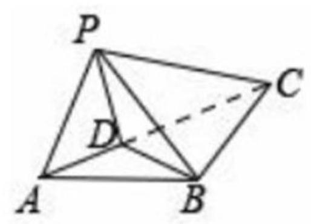

7. 如图、四边形 ${ABCD}$ 为正方形， ${ED} \bot$ 平面 ${ABCD}$ ， ${FB}\parallel {ED}$ ， ${AB} = {ED} = {2FB}$ ，记三棱锥 $E - {ACD}$ ， $F - {ABC}$ ， $F - {ACE}$ 的体积分别为 ${V}_{1}$ ， ${V}_{2}$ ， ${V}_{3}$ ，则()

A. ${V}_{3} = 2{V}_{2}$ B. ${V}_{3} = {V}_{1}$ C. ${V}_{3} = {V}_{1} + {V}_{2}$ D. $2{V}_{3} = 3{V}_{1}$

题目出处: 2022 年新高考二卷11(多选)

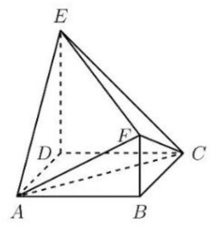

8. 在三棱锥 $P - {ABC}$ 中,线段 ${PC}$ 上的点 $M$ 满足 ${PM} = \frac{1}{3}{PC}$ ,线段 ${PB}$ 上的点 $N$ 满足 ${PN} = \frac{2}{3}{PB}$ ，则三棱锥 $P - {AMN}$ 和三棱锥 $P - {ABC}$ 的体积之比为( )

A. $\frac{1}{9}$ B. $\frac{2}{9}$ C. $\frac{1}{3}$ D. $\frac{4}{9}$

题目出处:2023 年天津卷 8 (次压轴)

9. 一个五面体 ${ABC} - {DEF}$ ,已知 ${AD} \parallel  {BE} \parallel  {CF}$ ,且两两之间的距离为 1,并已知 ${AD} = 1$ , ${BE} = 2,{CF} = 3$ ，则该五面体的体积为( )

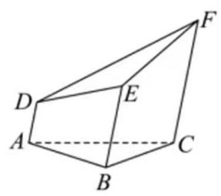

A. $\frac{\sqrt{3}}{6}$ B. $\frac{3\sqrt{3}}{4} + \frac{1}{2}$ C. $\frac{\sqrt{3}}{2}$ D. $\frac{3\sqrt{3}}{4} - \frac{1}{2}$

题目出处: 2024 年天津卷 9 (压轴)

10. 设有下列四个命题:

${p}_{1}$ : 两两相交且不过同一点的三条直线必在同一个平面内

${p}_{2}$ : 过空间中任意三点有且仅有一个平面

${p}_{3}$ : 若空间两条直线不相交,则这两条直线平行

${p}_{4}$ : 若直线 $l \subset$ 平面 $\alpha$ ,直线 $m \bot$ 平面 $\alpha$ ,则 $m \bot  l$

则下列命题中所有真命题的序号是( )

① ${p}_{1} \land  {p}_{4}$ ② ${p}_{1} \land  {p}_{2}$ ③ $\neg {p}_{2} \vee  {p}_{3}$ ④ $\neg {p}_{3} \vee  \neg {p}_{4}$

题目出处: 2020 年全国二卷理科16

11. 在正三棱柱 ${ABC} - {A}_{1}{B}_{1}{C}_{1}$ 中, ${AB} = A{A}_{1} = 1$ ,点 $P$ 满足 $\overrightarrow{BP} = \lambda \overrightarrow{BC} + \mu \overrightarrow{B{B}_{1}}$ ,其中 $\lambda  \in  \left\lbrack  {0,1}\right\rbrack  ,\mu  \in  \left\lbrack  {0,1}\right\rbrack$ ,则( )

A. 当 $\lambda  = 1$ 时， $\bigtriangleup A{B}_{1}P$ 的周长为定值___B. 当 $\mu  = 1$ 时，三棱锥 $P - {A}_{1}{BC}$ 的体积为定值

C. 当 $\lambda  = \frac{1}{2}$ ,有且仅有一个点 $P$ ,使得 ${A}_{1}P \bot  {BP}$

D. 当 $\mu  = \frac{1}{2}$ 时,有且仅有一个点 $P$ ,使得 ${A}_{1}B \bot$ 平面 $A{B}_{1}P$

## 题目出处: 2021 年新高考一卷理科12

12. 已知三棱锥 $S - {ABC}$ 的所有顶点都在球 $O$ 的球面上, $\bigtriangleup {ABC}$ 是边长为 1 的正三角形, ${SC}$ 为球 $O$ 的直径,且 ${SC} = 2$ ,则此棱锥的体积为 ( )

A. $\frac{\sqrt{2}}{6}$ B. $\frac{\sqrt{3}}{6}$ C. $\frac{\sqrt{2}}{3}$ D. $\frac{\sqrt{2}}{2}$

题目出处: 2011 年全国一卷理科11

13. 已知三棱锥 $S - {ABC}$ 的所有顶点都在球 $O$ 的球面上, $\bigtriangleup {ABC}$ 是边长为 1 的正三角形, ${SC}$ 为球 $O$ 的直径，且 ${SC} = 2$ ，则此三棱锥的体积为( )

A. $\frac{\sqrt{2}}{6}$ B. $\frac{\sqrt{3}}{6}$ C. $\frac{\sqrt{2}}{3}$ D. $\frac{\sqrt{2}}{2}$

题目出处: 2012 年全国一卷理科11

14. 平面 $\alpha$ 截球 $O$ 的球面所得圆的半径为 1,球心 $O$ 到平面 $\alpha$ 的距离为 $\sqrt{2}$ ,则此球的体积为( )

A. $\sqrt{6}\pi$ B. $4\sqrt{3}\pi$ C. $4\sqrt{6}\pi$ D. $6\sqrt{3}\pi$

题目出处: 2012 年全国一卷文科8

15. 三棱柱 ${ABC} - {A}_{1}{B}_{1}{C}_{1}$ 中,底面边长和侧棱长都相等, $\angle {BA}{A}_{1} = \angle {CA}{A}_{1} = {60}^{ \circ  }$ ,则异面直线 $A{B}_{1}$ 与 $B{C}_{1}$ 所成角的余弦值为___

题目出处: 2012 年全国二卷理科16

16. 已知四棱柱 ${ABCD} - {A}_{1}{B}_{1}{C}_{1}{D}_{1}$ 中， ${AB} = 2$ ， ${C{C}_{1}} = {2\sqrt{2}}$ ， $E$ 为 $C{C}_{1}$ 的中点，则直线 $A{C}_{1}$ 与平面 ${BED}$ 的距离为( )

A. 2 B. $\sqrt{3}$ C. $\sqrt{2}$ D. 1

题目出处: 2012 年全国二卷文科8

17. 已知正方体 ${ABCD} - {A}_{1}{B}_{1}{C}_{1}{D}_{1}$ 中， $E$ ， $F$ 分别为 $B{B}_{1}$ ， $C{C}_{1}$ 的中点，那么异面直线 ${AE}$ 与 ${D}_{1}F$ 所成的角的余弦值为___

题目出处: 2012 年全国二卷文科16

18. 如图、有一个水平放置的透明无盖的正方体容器高 $8\mathrm{\;{cm}}$ ,将一个球放在容器口,再向容器内注水，当球面恰好接触水面时测得水深6cm，如果不计容器厚度，则球的体积为 ( )

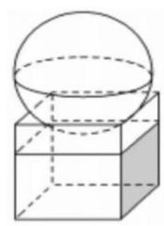

A. $\frac{500\pi }{3}{\mathrm{\;{cm}}}^{3}$ B. $\frac{864\pi }{3}c{m}^{3}$ C. $\frac{1372}{3}c{m}^{3}$ D. $\frac{2048}{3}c{m}^{3}$

题目出处: 2013 年全国一卷理科 6

19. 已知 $H$ 是球 $O$ 的直径 ${AB}$ 上一点, ${AH} : {HB} = 1 : 2,{AB} \bot$ 平面 $\alpha , H$ 为垂足, $\alpha$ 截球 $O$ 所得截面的面积为 $\pi$ ，则球 $O$ 的表面积为___

## 题目出处:2013 年全国一卷文科15

20. 已知正四棱锥 $O - {ABCD}$ 的体积为 $\frac{3\sqrt{2}}{2}$ ,底面边长为 $\sqrt{3}$ ,则以 $O$ 为球心, ${OA}$ 为半径的球的表面积为___

## 题目出处: 2013 年全国二卷文科15

21. 如图、为测量山高 ${MN}$ ,选择 $A$ 和另一座山顶 $C$ 测量观测点,从 $A$ 点测得 $M$ 点的仰角 $\angle {MAN} = {60}^{ \circ  }, C$ 点的仰角 ${CAB} = {45}^{ \circ  }$ 以及 $\angle {MAC} = {75}^{ \circ  }$ ; 从 $C$ 点测得 $\angle {MCA} = {60}^{ \circ  }$ , 已知山高 ${BC} = {100m}$ ，则山高 ${MN} =$ ___

题目出处:2014 年全国一卷文科16

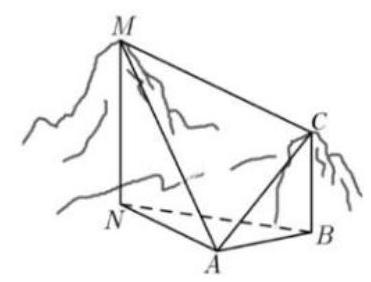

22. 直三棱柱 ${ABC} - {A}_{1}{B}_{1}{C}_{1}$ 中， $\angle {BCA} = {90}^{ \circ  }$ ， $M$ ， $N$ 分别为 ${A}_{1}{B}_{1}$ ， ${A}_{1}{C}_{1}$ 的中点， ${BC} = {CA} = {C{C}_{1}}$ ，则 ${BM}$ 与 ${AN}$ 所成的角的余弦值为()

A. $\frac{1}{10}$ B. $\frac{2}{5}$ C. $\frac{\sqrt{30}}{10}$ D. $\frac{\sqrt{2}}{2}$

题目出处: 2014 年全国二卷理科11

23. 平面 $\alpha$ 过正方体 ${ABCD} - {A}_{1}{B}_{1}{C}_{1}{D}_{1}$ 的顶点 $A,\alpha \parallel$ 平面 $C{B}_{1}{D}_{1},\alpha  \cap$ 平面 ${ABCD} = m$ ， $\alpha  \cap$ 平面 ${{AB}{B}_{1}}{A}_{1} = n$ ，则 $m$ ， $n$ 所成角的正弦值为( )

A. $\frac{\sqrt{3}}{2}$ B. $\frac{\sqrt{2}}{2}$ C. $\frac{\sqrt{3}}{3}$ D. $\frac{1}{3}$

题目出处: 2016 年全国一卷理科11

24. 在封闭的直三棱柱 ${ABC} - {A}_{1}{B}_{1}{C}_{1}$ 内有一个体积为 $V$ 的球，若 ${AB}\bot {BC}$ ， ${AB} = 6$ ， ${BC} = 8, A{A}_{1} = 3$ ，则 $V$ 的最大值是( )

A. ${4\pi }$

B. $\frac{9\pi }{2}$ C. ${6\pi }$ D. $\frac{32\pi }{3}$

题目出处: 2016 年全国三卷理科10

25. 已知三棱锥 $S - {ABC}$ 的所有顶点都在球 $O$ 的球面上, ${SC}$ 是球 $O$ 的直径,若平面 ${SCA} \bot$ 平面 ${SCB}$ ， ${SA} = {AC}$ ， ${SB} = {BC}$ ，三棱锥 $S - {ABC}$ 的体积为9，则球 $O$ 的表面积为___ 题目出处: 2017 年全国一卷文科16

26. 直三棱柱 ${ABC} - {A}_{1}{B}_{1}{C}_{1}$ 中， $\angle {ABC} = {120}^{ \circ  }$ ， ${AB} = 2$ ， ${BC} = {C{C}_{1}} = 1$ ，则异面直线 $A{B}_{1}$ 与 $B{C}_{1}$ 所成的角的余弦值为( )

A. $\frac{\sqrt{3}}{2}$ B. $\frac{\sqrt{15}}{5}$ C. $\frac{\sqrt{10}}{5}$ D. $\frac{\sqrt{3}}{3}$

题目出处: 2017 年全国二卷理科10

27. $a, b$ 为空间中两条互相垂直的直线,等腰三角形 ${ABC}$ 的直角边 ${AC}$ 所在的直线与 $a, b$ 都垂直,斜边 ${AB}$ 以直线 ${AC}$ 为旋转轴旋转,有下列结论:

①当直线 ${AB}$ 与 $a$ 成 ${60}^{ \circ  }$ 角时， ${AB}$ 与 $b$ 成 ${30}^{ \circ  }$ 角

②当直线 ${AB}$ 与 $a$ 成 ${60}^{ \circ  }$ 角时， ${AB}$ 与 $b$ 成 ${60}^{ \circ  }$ 角

③直线 ${AB}$ 与 $a$ 所成的角的最小值为 ${45}^{ \circ  }$

④直线 ${AB}$ 与 $a$ 所成的角的最大值为 ${60}^{ \circ  }$

其中正确的是___

题目出处: 2017 年全国三卷理科16

28. 已知三棱锥 $P - {ABC}$ 的四个顶点在球 $O$ 的球面上， ${PA} = {PB} = {PC}$ ， $\bigtriangleup  {ABC}$ 是边长为 2 的正三角形, $E, F$ 分别是 ${PA},{AB}$ 的中点, $\angle {CEF} = {90}^{ \circ  }$ ,则球 $O$ 的体积为( )

A. $8\sqrt{6}\pi$ B. $4\sqrt{6}\pi$ C. $2\sqrt{6}\pi$ D. $\sqrt{6}\pi$

题目出处: 2019 年全国一卷理科12

29. 已知 $\angle {ACB} = {90}^{ \circ  }$ ， $P$ 为平面 ${ABC}$ 外一点， ${PC} = 2$ ，点 $P$ 到 $\angle {ACB}$ 两边 ${AC}$ ， ${BC}$ 的距离均为 $\sqrt{3}$ ，那么 $P$ 到平面 ${ABC}$ 的距离为___

题目出处: 2019 年全国一卷文科16 30. 设 $\alpha ,\beta$ 为两个平面，则 $\alpha //\beta$ 的充要条件是( )

A. $\alpha$ 内有无数条直线与 $\beta$ 平行 B. $\alpha$ 内有两条直线与 $\beta$ 平行

C. $\alpha ,\beta$ 平行于同一条直线 D. $\alpha ,\beta$ 垂直于同一个平面

题目出处: 2019 年全国二卷理科7

31. 中国有悠久的金石文化, 印信是金石文化的代表之一, 印信的形式多为长方体、正方体或圆柱体，但南北朝时期的官员独孤信的印信形状是 “半正多面体”(图 1)，半正多面体是由两种或两种以上的正多边行围成的多面体, 正多面体体现了数学的对称美, 图 2 是一个棱长数为 48 的半正多面体, 它的所有顶点都在同一个正方体的表面上, 且此正方体的棱长为1，则该半多面体共有___个面，其棱长为___

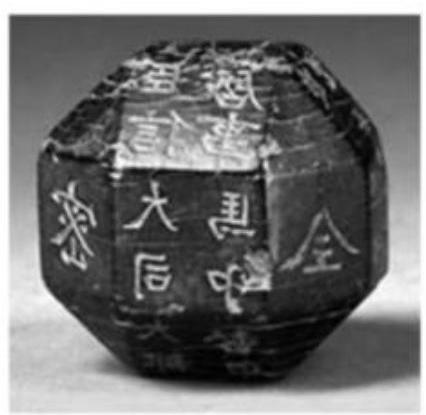

图 1

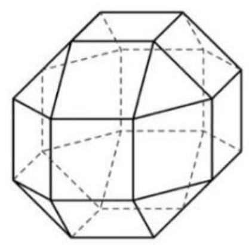

图 2

题目出处: 2019 年全国二卷理科16

32. 如图、点 $N$ 为正方形 ${ABCD}$ 的中心, $\bigtriangleup {ECD}$ 为正三角形,平面 ${ECD} \bot$ 平面 ${ABCD}$ , $M$ 是线段 ${ED}$ 的中点，则( )

A. ${BM} = {EN}$ ，且直线 ${BM}$ ， ${EN}$ 是相交直线

B. ${BM} \neq  {EN}$ ，且直线 ${BM}$ ， ${EN}$ 是相交直线

C. ${BM} = {EN}$ ,且直线 ${BM},{EN}$ 是异面直线

D. ${BM} \neq  {EN}$ ，且直线 ${BM},{EN}$ 是异面直线题目出处:2019 年全国三卷理科8

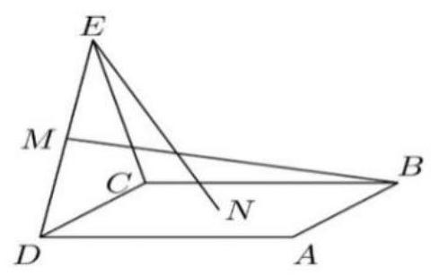

33. 学生到工厂劳动实践，利用 ${3D}$ 打印技术制作模型，如图，该模型为长方体 ${ABCD} - {A}_{1}{B}_{1}{C}_{1}{D}_{1}$ 挖去四棱锥 $O - {EFGH}$ 后得到的几何体，其中 $O$ 为长方体的中心， $E, F, G, H$ 分别为所在棱的中点， ${AB} = {BC} = {6\mathrm{\;{cm}}}$ ， $A{A}_{1} = {4\mathrm{\;{cm}}}$ ， ${3D}$ 打印原料密度为 ${0.9g}/c{m}^{3}$ ，不计打印损耗，制作该模型所需原料的质量为___

题目出处: 2019 年全国三卷理科16

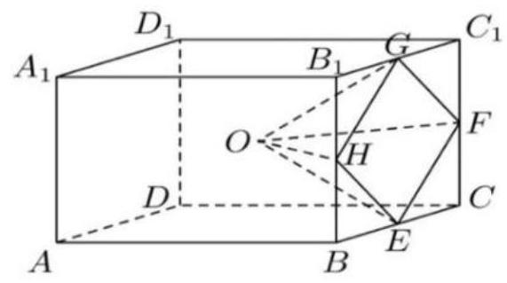

34. 埃及胡夫金字塔是古代世界建筑奇迹之一, 它的形状可视为一个正四棱锥, 以该四棱锥的高为边长的正方形面积等于该四棱锥一个侧面三角形的面积, 则其侧面三角形底边上的高与底面正方形的边长的比值为( )

A. $\frac{\sqrt{5} - 1}{4}$ B. $\frac{\sqrt{5} - 1}{2}$ C. $\frac{\sqrt{5} + 1}{4}$ D. $\frac{\sqrt{5} + 1}{2}$

题目出处: 2020 年全国一卷理科 3

35. 已知 $A, B, C$ 为球 $O$ 的球面上的三个点， $\odot  {O}_{1}$ 为 $\bigtriangleup {ABC}$ 的外接圆，若 $\odot  {O}_{1}$ 的面积为 ${4\pi },{AB} = {BC} = {AC} = {OO}_{1}$ ，则球 $O$ 的表面积为( )

A. ${64\pi }$ B. ${48\pi }$ C. ${36\pi }$ D. ${32\pi }$

题目出处: 2020 年全国一卷理科10

36. 如图、在三棱锥 $P - {ABC}$ 的平面展开图中, ${AC} = 1,{AB} = {AD} = \sqrt{3},{AB} \bot  {AC}$ , ${AB}\bot {AD}$ ， $\cos \angle {CAE} = {30}^{ \circ  }$ ，则 $\cos \angle {FCB} =$ ___

题目出处:2020 年全国一卷理科16

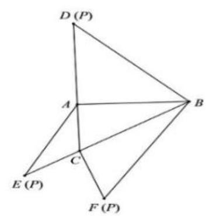

题 16 图

37. 已知 $\bigtriangleup {ABC}$ 是面积为 $\frac{9\sqrt{3}}{4}$ 的等边三角形,且其顶点都在球 $O$ 的球面山,若球 $O$ 的表面积为 ${16\pi }$ ，则 $O$ 到平面 ${ABC}$ 的距离为( )

A. $\sqrt{3}$ B. $\frac{3}{2}$ C. 1

D. $\frac{\sqrt{3}}{2}$

题目出处: 2020 年全国二卷理科10

38. 已知圆锥的底面半径为1，母线长为3，则该圆锥内半径最大的球的体积为___ 题目出处:2020 年全国三卷理科15

39. 日晷是中国古代用来测定时间的仪器, 利用与晷面垂直的晷针投射到晷面的影子来测定时间,把地球看成一个球 (球心记为 $O$ ),地球上一点 $A$ 的纬度是指 ${OA}$ 与地球赤道所在平面所成角，点 $A$ 处的水平面是指过点 $A$ 且与 ${OA}$ 垂直的平面，在点 $A$ 处放置一个日晷，若晷面与赤道所在平面平行,点 $A$ 处的纬度为北纬 ${40}^{ \circ  }$ ,则晷针与点 $A$ 处的水平面所成的角为( )

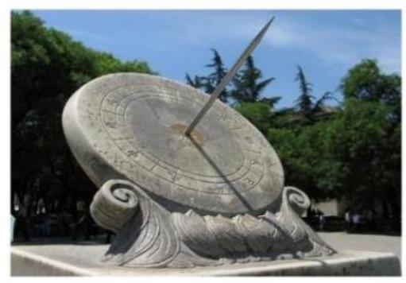

A. 20° B. 40° C. 50° D. ${90}^{ \circ  }$

题目出处: 2020 年山东卷 4

40. 已知直四棱柱 ${ABCD} - {A}_{1}{B}_{1}{C}_{1}{D}_{1}$ 的棱长均为2， $\angle {BAD} = {60}^{ \circ  }$ ，以 ${D}_{1}$ 为球心， $\sqrt{5}$ 为半径的球面与侧面 ${BC}{C}_{1}{B}_{1}$ 的交线长为___。

题目出处:2020 年山东卷/海南卷16

41. 已知直四棱柱 ${ABCD} - {A}_{1}{B}_{1}{C}_{1}{D}_{1}$ 的棱长均为2， $\angle {BAD} = {60}^{ \circ  }$ ，以 ${D}_{1}$ 为球心， $\sqrt{5}$ 为半径的球面与侧面 ${BC}{C}_{1}{B}_{1}$ 的交线长为___

题目出处:2020 年山东卷 16

42. 已知正方体的棱长为 1,每条棱所在的直线与平面 $\alpha$ 所成的角都相等,则 $\alpha$ 截此正方体所得的截面面积的最大值为( )

A. $\frac{3\sqrt{3}}{4}$ B. $\frac{2\sqrt{3}}{3}$ C. $\frac{3\sqrt{2}}{4}$ D. $\frac{\sqrt{3}}{2}$

题目出处: 2018 年全国一卷理科12

43. 正方体 ${ABCD} - {A}_{1}{B}_{1}{C}_{1}{D}_{1}$ 的棱长为 $1, P$ 为 ${BC}$ 的中点, $Q$ 为线段 $C{C}_{1}$ 上的动点,过点 $A, P, Q$ 的平面截该正方体所得的截面记为 $S$ ，则下列命题正确的是___

① 当 $0 < {CQ} < \frac{1}{2}$ 时， $S$ 为四边形

② 当 ${CQ} = \frac{1}{2}$ 时， $S$ 为等腰梯形

③ 当 ${CQ} = \frac{3}{4}$ 时， $S$ 与 ${C}_{1}{D}_{1}$ 的交点 $R$ 满足 ${C}_{1}{R}_{1} = \frac{1}{3}$

④ 当 $\frac{3}{4} < {CQ} < 1$ 时， $S$ 为六边形

⑤ 当 ${CQ} = 1$ 时， $S$ 的面积为 $\frac{\sqrt{6}}{2}$

题目出处:2013 安徽卷文科15

44. 如图、图形纸片的圆心为 $O$ ,半径为 $5\mathrm{\;{cm}}$ ,该纸片上的等边三角形 ${ABC}$ 的中心为 $O$ , $D, E, F$ 为圆 $O$ 上的点， $\bigtriangleup {DBC},\bigtriangleup {ECA},\bigtriangleup {FAB}$ 分别是以 ${BC},{CA},{AB}$ 为底边的等腰三角形，沿虚线剪开后，分别以 ${BC}$ ， ${CA}$ ， ${AB}$ 为折痕折起 $\bigtriangleup  {DBC}$ ， $\bigtriangleup  {ECA}$ ， $\bigtriangleup  {FAB}$ ， 使得 $D, E, F$ 重合,得到三棱锥,当 $\bigtriangleup {ABC}$ 的边长变化时,所得三棱锥体积 (单位: $c{m}^{3}$ ) 的最大值为___

题目出处: 2017 年全国一卷理科16

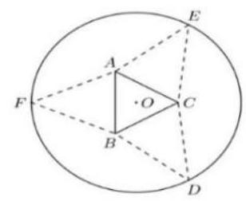

45. 已知 $A, B, C$ 是半径为 1 的球 $O$ 的球面上三个点,且 ${AC} \bot  {BC},{AC} = {BC} = 1$ ,则三棱锥 $O - {ABC}$ 的体积为( )

A. $\frac{\sqrt{2}}{12}$ B. $\frac{\sqrt{3}}{12}$ C. $\frac{\sqrt{2}}{4}$ D. $\frac{\sqrt{3}}{4}$

题目出处: 2021 年新高考二卷理科11

46. 在正方体 ${ABCD} - {A}_{1}{B}_{1}{C}_{1}{D}_{1}$ 中, ${AB} = 4, O$ 为 $A{C}_{1}$ 的中点,若该正方体的棱与球 $O$ 的球面由公共点，则球 $O$ 的半径的取值范围是___

题目出处: 2023 年全国甲卷文科16

47. 已知 $S, A, B, C$ 均在半径为 2 的球面上, $\bigtriangleup {ABC}$ 是边长为 3 的等边三角形, ${SA} \bot$ 平面 ${ABC},$ 则 ${SA} =$ ___

题目出处:2023 年全国乙卷文科16

48. 已知正四棱锥的侧棱长为 $l$ ,其各顶点都在同一个球面上,若该球的体积为 ${36\pi }$ ,且 $3 \leq  l \leq  3\sqrt{3}$ ，则该四棱锥体积的取值范围是( )

A. $\left\lbrack  {{18},\frac{81}{4}}\right\rbrack$ B. $\left\lbrack  {\frac{27}{4},\frac{81}{4}}\right\rbrack$ C. $\left\lbrack  {\frac{27}{4},\frac{64}{3}}\right\rbrack$ D. $\left\lbrack  {{18},{27}}\right\rbrack$

题目出处: 2022 年新高考一卷理科8

49. 已知球 $O$ 的半径为1,四棱锥的顶点为 $O$ ,底面的四个顶点均在球 $O$ 的球面上,则当该四棱锥的体积最大时, 其高为( )

A. $\frac{1}{3}$ B. $\frac{1}{2}$ C. $\frac{\sqrt{3}}{3}$ D. $\frac{\sqrt{2}}{2}$

题目出处: 2022 年全国乙卷文科12

## 九、概率

1. 设 $O$ 为正方形 ${ABCD}$ 的中心,点 $O, A, B, C, D$ 中任取 3 点,则取到的 3 点共线的概率为 ( )

A. $\frac{1}{5}$ B. $\frac{2}{5}$ C. $\frac{1}{2}$ D. $\frac{4}{5}$

题目出处: 2020 年全国一卷文科 4

2. 两位男同学和两位女同学随机的排成一列, 则两位女同学相邻的概率为 ( )

A. $\frac{1}{6}$ B. $\frac{1}{4}$ C. $\frac{1}{3}$ D. $\frac{1}{2}$

题目出处: 2019 年全国三卷文科3

3. 生物实验室有5只兔子, 其中有3只测量过某项指标, 若从这 5 只兔子中随机取出 3 只, 则恰有两只测量过该指标的概率为( )

A. $\frac{2}{3}$ B. $\frac{3}{5}$ C. $\frac{2}{5}$ D. $\frac{1}{5}$

题目出处: 2019 年全国二卷文科 4

4. 我国古代典籍《周易》用“卦”描述万物的变化，每一“重卦”从下到上排列的 6 个爻组成, 爻分为阳爻 “一” 和阴爻 “-”, 右图就是一重卦, 在所有重卦中随机取一重卦, 则该重卦恰有3 个阳爻的概率是( )

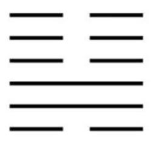

A. $\frac{5}{16}$ B. $\frac{11}{32}$ C. $\frac{21}{32}$ D. $\frac{11}{16}$

题目出处: 2019 年全国一卷理科 6

5. 甲、乙两队进行篮球决赛，采取七场四胜制(当一队赢得四场胜利时，该队获胜，决赛结束)。根据前期比赛成绩, 甲队的主客场安排依次为 “主主客客主客主”, 设甲队主场取胜的概率为 0.6 , 客场取胜的概率为 0.5 , 且各场比赛结果相互独立, 则甲队以 4:1 获胜的概率为___.

## 题目出处: 2019 年全国一卷理科15

6. 某群体中的成员只用现金支付的概率为 0.45 ，既用现金也用非现金支付的概率为 0.15 ， 则不用现金支付的概率为( )

A.0.3 B.0.4 C.0.6 D.0.7

题目出处: 2018 年全国三卷文科5

7. 从 2 男同学和 3 名女同学中任选 2 人参加社区服务，则选中的 2 人都是女同学的概率为 ( )

A.0.6 B.0.5 C. 0.4 D.0.3

题目出处: 2018 年全国二卷文科5

8. 我国数学家陈景润在哥德巴赫猜想的研究中取得了世界领先的成果, 哥德巴赫是 “每个大于 2 的偶数可以表示为两个素数的和”,如: ${30} = 7 + {23}$ ,在不超过 30 的素数中,随机选取两个不同的数, 其和等于 30 的概率是 ( )

A. $\frac{1}{12}$ B. $\frac{1}{14}$ C. $\frac{1}{15}$ D. $\frac{1}{18}$

题目出处: 2018 年全国二卷理科8

9. 从分别写有1,2,3,4,5的 5 张卡片中随机抽取 1 张，放回后再随机抽取一张，则抽取的第一张卡片上的数大于第二张卡片上的数的概率位( )

A. $\frac{1}{10}$ B. $\frac{1}{5}$ C. $\frac{3}{10}$ D. $\frac{2}{5}$

题目出处: 2017 年全国二卷文科11

10. 在信道内传输 0,1 信号,信号的传输相互独立,发送 0 时,收到 1 的概率为 $\alpha$

$\left( {0 < \alpha  < 1}\right)$ ,收到 0 的概率为 $1 - \alpha$ ; 发送 1 时,收到 0 的概率为 $\beta \left( {0 < \beta  < 1}\right)$ ,收到 1 的概率为 $1 - \beta$ ,考虑两种传输方案: 单次传输和三次传输,单词传输是指每个信号只发送 1次，三次传输是指每个信号重复发送 3 次，收到的信号需要译码，译码规则如下:单次传输时，收到的信号即为译码；三次传输时，收到的信号中出现次数多的即为译码(例如: 若依次收到1,0,1，则译码为 1)，则()

A. 采用单次传输方案，若依次发送1,0,1，则依次收到1,0,1的概率为 $\left( {1 - \alpha }\right) {\left( 1 - \beta \right) }^{2}$

B. 采取三次传输方案,若发送 1,则依次收到1,0,1的概率为 $\beta {\left( 1 - \beta \right) }^{2}$

C. 采用三次传输方案,若发送 1,则译码为 1 的概率为 $\beta {\left( 1 - \beta \right) }^{2} + {\left( 1 - \beta \right) }^{3}$

D. 当 $0 < \alpha  < {0.5}$ 时,若发送 0,则采用三次传输方案译码为 0 的概率大于采用单词传输方案译码为 0 的概率

题目出处: 2023 年新高考二卷12 (多选)

11. 信息熵是信息论中一个重要的概念,设随机变量 $X$ 所有可能的取值为 $1,2,\cdots , n$ ,且 $P\left( {X = i}\right)  = {p}_{i} > 0\;\left( {i = 1,2,\cdots , n}\right) ,\mathop{\sum }\limits_{{i = 1}}^{n}{p}_{i} = 1$ ,定义 $X$ 信息熵 $H\left( X\right)  =  - \mathop{\sum }\limits_{{i = 1}}^{n}{p}_{i}{\log }_{2}{p}_{i}$ , 则( )

A. 若 $n = 1$ ,则 $H\left( X\right)  = 0$

B. 若 $n = 2$ ,则 $H\left( X\right)$ 随着 ${p}_{1}$ 的增大而增大

C. 若 ${p}_{i} = \frac{1}{n}\left( {i = 1,2,\cdots , n}\right)$ ,则 $H\left( X\right)$ 随着 $n$ 的增大而增大

D. 若 $n = {2m}$ ,随机变量 $Y$ 所有可能的取值为 $1,2,\cdots , m$ ,且 $P\left( {Y = j}\right)  = {p}_{j} + {p}_{{2m} + 1 - j} \; \left( {j = 1,2,\cdots , m}\right)$ ,则 $H\left( X\right)  \leq  H\left( Y\right)$

题目出处:2020 年新高考一卷12(多选)

12. 某棋手与甲、乙、丙三位棋手各比赛一盘, 各盘比赛结果相互独立, 已知该棋手与甲、 乙、丙比赛获胜得概率分别为 ${p}_{1},{p}_{2},{p}_{3}$ ,且 ${p}_{3} > {p}_{2} > {p}_{1} > 0$ ,则该棋手连胜两盘得概率为 $p$ ,则 ( )

A. $p$ 与该棋手和甲、乙、丙得比赛次序无关 B. 该棋手在第二盘与甲比赛, $p$ 最大 C. 该棋手在第二盘与乙比赛, $p$ 最大 D. 该棋手在第二盘与丙比赛, $p$ 最大题目出处: 2022 年全国乙卷理科10

## 十、二项式定理

1. 若将函数 $f\left( x\right)  = {x}^{5}$ 表示为 $f\left( x\right)  = {a}_{0} + {a}_{1}\left( {1 + x}\right)  + {a}_{2}{\left( 1 + x\right) }^{2} + \cdots  + {a}_{5}{\left( 1 + x\right) }^{5}$ ,其中 ${a}_{0},{a}_{1},{a}_{2},\cdots ,{a}_{5}$ 为实数,则 ${a}_{3} =$

题目出处:2012 年浙江卷理科14

2. ${\left( \frac{x}{\sqrt{y}} - \frac{y}{\sqrt{x}}\right) }^{6}$ 展开式中， ${x}^{3}$ 的系数为___

## 题目出处: 2010 年安徽卷理科12

3. 设二项式 ${\left( x - \frac{a}{\sqrt{x}}\right) }^{6}\left( {a > 0}\right)$ 的展开式中 ${x}^{3}$ 的系数为 $A$ ,常数项为 $B$ ,若 $B = {4A}$ , 则 $a$ 的值是___

题目出处: 2011 年浙江卷理科13

4. $\left( {x + y}\right) {\left( 2x - y\right) }^{5}$ 的展开式中 ${x}^{3}{y}^{3}$ 的系数为( )

A. -80 B. -40 C. 40 D. 80

题目出处: 2017 年新课标三卷理科 4

5. ${\left( \sqrt{x} - \frac{1}{x}\right) }^{9}$ 展开式中的常数项是( )

A. -36 B. 36 C. -84 D. 84

6. $\left( {{x}^{2} + 2}\right) {\left( \frac{1}{{x}^{2}} - 1\right) }^{5}$ 的展开式的常数项是( )

A. -3 B. -2 C. 2 D. 3

7. ${\left( 1 + 2\sqrt{x}\right) }^{3}{\left( 1 - \sqrt[3]{x}\right) }^{5}$ 展开式中 $x$ 的系数为( )

A. -4 B. -2 C. 2 D. 4

8. 求 ${\left( {x}^{2} + 3x - 4\right) }^{4}$ 的展开式中 $x$ 的系数为___

9. ${\left( \frac{x}{2} + \frac{1}{x} + \sqrt{2}\right) }^{5}$ 的展开式中整理后的常数项为___(用数字作答).

10. 已知 ${\left( 1 - 2x\right) }^{7} = {a}_{0} + {a}_{1}x + {a}_{2}{x}^{2} + \cdots  + {a}_{7}{x}^{7}$ . 求:

(1) ${a}_{1} + {a}_{2} + \cdots  + {a}_{7}$ ; (2) ${a}_{1} + {a}_{3} + {a}_{5} + {a}_{7}$ ；

(3) ${a}_{0} + {a}_{2} + {a}_{4} + {a}_{6}$ ； (4) $\left| {a}_{0}\right|  + \left| {a}_{1}\right|  + \cdots  + \left| {a}_{7}\right|$

(5) $\frac{{a}_{1}}{2} + \frac{{a}_{2}}{{2}^{2}} + \cdots  + \frac{{a}_{7}}{{2}^{7}}$ ; (6) ${a}_{1} + 2{a}_{2} + 3{a}_{3} + 4{a}_{4} + 5{a}_{5} + 6{a}_{6} + 7{a}_{7}$

11. 若 ${\left( 1 - 2x\right) }^{2015} = {a}_{0} + {a}_{1}x + \cdots  + {a}_{2015}{x}^{2015}\left( {x \in  R}\right)$ ,则 $\frac{{a}_{1}}{2} + \frac{{a}_{2}}{{2}^{2}} + \cdots  + \frac{{a}_{2015}}{{2}^{2015}}$ 的值为

( ) A. 2 B. 0 C. -1 D. -2

12. 已知 $\left( {1 + x}\right)  + {\left( 1 + x\right) }^{2} + \cdots  + {\left( 1 + x\right) }^{n} = {a}_{0} + {a}_{1}x + \cdots  + {a}_{n}{x}^{n}$ . 若 ${a}_{1} + {a}_{2} + \cdots  + {a}_{n - 1} = {29} - n$ ，那么自然数 $n$ 的值为( )

A. 3 B. 4 C. 5 D. 6

13. 多项式 ${x}^{2} + {x}^{10} = {a}_{0} + {a}_{1}\left( {x + 1}\right)  + {a}_{2}{\left( x + 1\right) }^{2} + \cdots  + {a}_{9}{\left( x + 1\right) }^{9} + {a}_{10}{\left( x + 1\right) }^{10}$ ,则 ${a}_{2} =$ (   )

A. 32 B. 42 C. 46 D. 56

14. ${\left( a + b\right) }^{n}$ 展开式中:(1)只有第 7 项的二项式系数最大，则 $n =$ ___；

(2)第7项二项式系数取最大值， $n =$ ___

## 十一、函数

1. 设 $f\left( x\right)$ 是定义在 $R$ 上且周期为 2 的偶函数,当 $2 \leq  x \leq  3$ 时, $f\left( x\right)  = 5 - {2x}$ ,则 $f\left( {-\frac{3}{4}}\right)  =$ ( )

A. $- \frac{1}{2}$ B. $- \frac{1}{4}$ C. $\frac{1}{4}$ D. $\frac{1}{2}$

题目出处: 2025 年新高考一卷 4

2. 设函数 $f\left( x\right)  = \ln \left| {{2x} + 1}\right|  - \ln \left| {{2x} - 1}\right|$ ，则 $f\left( x\right)$ ( )

A. 是偶函数，且在 $\left( {\frac{1}{2}, + \infty }\right)$ 单调递增 B. 是奇函数,且在 $\left( {-\frac{1}{2},\frac{1}{2}}\right)$ 单调递减

C. 是偶函数,且在 $\left( {-\infty , - \frac{1}{2}}\right)$ 单调递增 D. 是奇函数,且在 $\left( {-\infty , - \frac{1}{2}}\right)$ 单调递减

题目出处: 2020 年全国二卷理科10

3. 设 $a \in  \left( {0,1}\right)$ ,若函数 $f\left( x\right)  = {a}^{x} + {\left( 1 + a\right) }^{x}$ 在 $\left( {0, + \infty }\right)$ 上单调递增,则 $a$ 的取值范围是 ___.

题目出处: 2023 年全国乙卷理科16

4. 已知函数 $f\left( x\right)  = \left\{  \begin{array}{l}  - {x}^{2} - {2ax} - a, x < 0 \\  {\mathrm{e}}^{x} + \ln \left( {x + 1}\right) , x \geq  0 \end{array}\right.$ 在 $R$ 上单调递增,则 $a$ 的取值范围是( )

A. $\left( {-\infty ,0}\right)$ B. $\left\lbrack  {-1,0}\right\rbrack$ C. $\left\lbrack  {-1,1}\right\rbrack$ D. $\lbrack 0, + \infty )$

题目出处: 2024 年新高考一卷 6

5. 设函数 $f\left( x\right)  = \left\{  \begin{array}{l} {2}^{-x}, x \leq  0 \\  1, x > 0 \end{array}\right.$ ,则满足 $f\left( {x + 1}\right)  < f\left( {2x}\right)$ 的 $x$ 的取值范围是( )

A. $( - \infty ,1\rbrack$ B. $\left( {0, + \infty }\right)$ C. $\left( {-1,0}\right)$ D. $\left( {-\infty ,0}\right)$

## 题目出处: 2018 年全国一卷文科12

6. 已知函数 $f\left( x\right)  = {x}^{2} - {2x} + a\left( {{\mathrm{e}}^{x - 1} + {\mathrm{e}}^{-x + 1}}\right)$ 有唯一零点，则 $a =$ ( )

A. $- \frac{1}{2}$ B. $\frac{1}{3}$ C. $\frac{1}{2}$ D. 1

题目出处: 2017 年全国三卷理科11

7. 设函数 $f\left( x\right)  = a{\left( x + 1\right) }^{2} - 1, g\left( x\right)  = \cos x + {2ax}$ ,当 $x \in  \left( {-1,1}\right)$ 时,曲线 $y = f\left( x\right)$ 与 $y = g\left( x\right)$ 恰好有一个交点，则 $a =$ ( )

A. -1 B. $\frac{1}{2}$ C. 1 D. 2

## 题目出处: 2024 年新高考二卷6

8. 曲线 $y = {x}^{3} - {3x}$ 与 $y =  - {\left( x - 1\right) }^{2} + a$ 在 $\left( {0, + \infty }\right)$ 有两个不同的交点,则 $a$ 的取值范围是 ___.

## 题目出处: 2024 年全国甲卷文科16

9. 已知函数 $f\left( x\right)  = \left\{  \begin{array}{l} {\mathrm{e}}^{x}, x \leq  0 \\  \ln x, x > 0 \end{array}\right.$ , $g\left( x\right)  = f\left( x\right)  + x + a$ ,若 $g\left( x\right)$ 存在 2 个零点,则 $a$ 的取值范围

A. $\lbrack 1, + \infty )$ B. $\lbrack 0, + \infty )$ C. $\lbrack  - 1, + \infty )$ D. $\lbrack 1, + \infty )$

## 题目出处: 2018 年全国一卷理科 9

10. 已知函数 $f\left( x\right)  = \left\{  \begin{array}{l} 2\sqrt{x},0 \leq  x \leq  1 \\  \frac{1}{x}, x > 1 \end{array}\right.$ ,若关于 $x$ 的方程 $f\left( x\right)  =  - \frac{1}{4}x + a\;\left( {a \in  R}\right)$ 恰有两个互异的实数解，则 $a$ 的取值范围为( )

A. $\left\lbrack  {\frac{5}{4},\frac{9}{4}}\right\rbrack$ B. $\left( {\frac{5}{4},\frac{9}{4}}\right\rbrack$ C. $\left( {\frac{5}{4},\frac{9}{4}}\right\rbrack   \cup  \{ 1\}$ D. $\left\lbrack  {\frac{5}{4},\frac{9}{4}}\right\rbrack   \cup  \{ 1\}$

题目出处: 2019 年天津卷文科8

11. 设 $f\left( x\right) , g\left( x\right)$ 是定义在 $R$ 上的两个周期函数, $f\left( x\right)$ 的周期为 $4, g\left( x\right)$ 的周期为 2,且 $f\left( x\right)$ 是奇函数,当 $x \in  (0,2\rbrack$ 时, $f\left( x\right)  = \sqrt{1 - {\left( x - 1\right) }^{2}}, g\left( x\right)  = \left\{  \begin{array}{l} k\left( {x + 2}\right) ,0 < x \leq  1 \\   - \frac{1}{2},1 < x \leq  2 \end{array}\right.$ , 其中 $k > 0$ ,若在区间 $(0,9\rbrack$ 上,关于 $x$ 的方程 $f\left( x\right)  = g\left( x\right)$ 有 8 个不同的实数根,则 $k$ 的取值范围是___.

题目出处: 2019 年江苏卷 14

12. 已知 $\lambda  \in  R$ ,函数 $f\left( x\right)  = \left\{  \begin{array}{l} x - 4, x \geq  \lambda \\  {x}^{2} - {4x} + 3, x < \lambda  \end{array}\right.$ ,当 $\lambda  = 2$ 时,不等式 $f\left( x\right)  < 0$ 的解集是___，若函数 $f\left( x\right)$ 恰有 2 个零点，则 $\lambda$ 的取值范围是___.

题目出处: 2018 年浙江卷15

13. 若函数 $f\left( x\right)  = 2{x}^{3} - a{x}^{2} + 1\;\left( {a \in  R}\right)$ 在 $\left( {0, + \infty }\right)$ 内有且只有一个零点,则 $f\left( x\right)$ 在 $\left\lbrack  {-1,1}\right\rbrack$ 上的最大值与最小值的和为___。

题目出处: 2018 年江苏卷 11

14. 关于 $x$ 的方程 ${\left( {x}^{2} - 1\right) }^{2} - \left| {{x}^{2} - 1}\right|  + k = 0$ ,给出四个命题

(1)存在实数 $k$ ，使得方程恰有 2 个不同的实根

(2)存在实数 $k$ ，使得方程恰有 4 个不同的实根

(3)存在实数 $k$ ，使得方程恰有 5 个不同的实根

(4)存在实数 $k$ ，使得方程恰有 8 个不同的实根其中假命题的个数是( )

A. 0 B. 1 C. 2 D. 3

## 题目出处:2006 年湖北卷理科12

15. 已知函数 $f\left( x\right)  = a{x}^{3} - 3{x}^{2} + 1$ ,若 $f\left( x\right)$ 存在唯一的零点 ${x}_{0}$ ,且 ${x}_{0} > 0$ ,在 $a$ 的取值范围是( )

A. $\left( {2, + \infty }\right)$ B. $\left( {1, + \infty }\right)$ C. $\left( {-\infty , - 2}\right)$ D. $\left( {-\infty , - 1}\right)$

题目出处: 2014 年全国一卷文科12

16. 已知函数 $f\left( x\right)  = \left\{  \begin{array}{l} \left| {\lg x}\right| ,0 < x \leq  {10} \\   - \frac{1}{2}x + 6, x > {10} \end{array}\right.$ ,若 $a, b, c$ 互不相等,且 $f\left( a\right)  = f\left( b\right)  = f\left( c\right)$ ,则 ${abc}$ 的取值范围是( )

A. $\left( {1,{10}}\right)$ B. $\left( {5,6}\right)$ C. $\left( {{10},{12}}\right)$ D. $\left( {{20},{24}}\right)$

## 题目出处: 2010 年全国新课标文科12

17. 已知当 $x \in  \left\lbrack  {0,1}\right\rbrack$ ，函数 $y = {\left( mx - 1\right) }^{2}$ 的图象与 $y = \sqrt{x} + m$ 的图象有且只有一个交点， 则正实数 $m$ 的取值范围是( )

A. $(0,1\rbrack  \cup  \left\lbrack  {2\sqrt{3}, + \infty }\right)$ B. $\left( {0,1\rbrack \cup \lbrack 3, + \infty }\right)$

C. $\left( {0,\sqrt{2}\rbrack \cup \lbrack 2\sqrt{3}, + \infty }\right)$ D. $\left( {0,\sqrt{2}\rbrack \cup \lbrack 3, + \infty }\right)$

题目出处:2017 年山东卷理科10(压轴)

18. 若函数 $f\left( x\right)  = \left( {1 - {x}^{2}}\right) \left( {{x}^{2} + {ax} + b}\right)$ 的图像关于直线 $x =  - 2$ 对称,则 $f\left( x\right)$ 的最大值为 ___

题目出处: 2013 年全国一卷理科16

19. 设 $a \in  \left( {0,1}\right)$ ,若函数 $f\left( x\right)  = {a}^{x} + {\left( 1 + a\right) }^{x}$ 在 $\left( {0, + \infty }\right)$ 上单调递增,则 $a$ 的取值范围是 ___

题目出处: 2023 年全国乙卷理科16

20. 设函数 $f\left( x\right)$ 的定义域为 $R$ ,满足 $f\left( {x + 1}\right)  = {2f}\left( x\right)$ ,且当 $x \in  (0,1\rbrack$ 时, $f\left( x\right)  = x\left( {x - 1}\right)$ ,若对任意 $x \in  ( - \infty , m\rbrack$ ,都有 $f\left( x\right)  \geq   - \frac{8}{9}$ ,则 $m$ 的取值范围是( )

A. $\left( {-\infty ,\frac{9}{4}}\right\rbrack$ B. $\left( {-\infty ,\frac{7}{3}}\right\rbrack$ C. $\left( {-\infty ,\frac{5}{2}}\right\rbrack$ D. $\left( {-\infty ,\frac{8}{3}}\right\rbrack$

题目出处: 2019 年全国二卷理12

21. 已知 $a \in  R$ ,设函数 $f\left( x\right)  = \left\{  \begin{array}{l} {x}^{2} - {2ax} + {2a}, x \leq  1 \\  x - a\ln x, x > 1 \end{array}\right.$ ,若关于 $x$ 的不等式 $f\left( x\right)  \geq  0$ 在 $R$ 上恒成立,则 $a$ 的取值范围为( )

A. $\left\lbrack  {0,1}\right\rbrack$ B. $\left\lbrack  {0,2}\right\rbrack$ C. $\left\lbrack  {0,\mathrm{e}}\right\rbrack$ D. $\left\lbrack  {1,\mathrm{e}}\right\rbrack$

## 题目出处:2019 年天津卷理科8

22. 已知函数 $f\left( x\right)  = x\left| {x - a}\right|  - 2{a}^{2}$ ,若当 $x > 2$ 时, $f\left( x\right)  > 0$ ,则 $a$ 的取值范围为 ( )

A. $( - \infty ,1\rbrack$ B. $\left\lbrack  {-2,1}\right\rbrack$ C. $\left\lbrack  {-1,2}\right\rbrack$ D. $\lbrack  - 1, + \infty )$

题目出处:2025年八省联考 8

23. 设函数 $f\left( x\right)  = \left( {x + a}\right) \ln \left( {x + b}\right)$ ,若 $f\left( x\right)  \geq  0$ ,则 ${a}^{2} + {b}^{2}$ 的最小值为( )

A. $\frac{1}{8}$ B. $\frac{1}{4}$ C. $\frac{1}{2}$ D. 1

题目出处: 2024 年新高考二卷8

24. 已知函数 $f\left( x\right)  = \left\{  \begin{array}{l}  - {x}^{2} + {2x}, x \leq  0 \\  \ln \left( {x + 1}\right) , x > 0 \end{array}\right.$ ,若 $\left| {f\left( x\right) }\right|  \geq  {ax}$ ,则 $a$ 的取值范围是 ( )

A. $( - \infty ,0\rbrack$ B. $( - \infty ,1\rbrack$ C. $\left\lbrack  {-2,1}\right\rbrack$ D. $\left\lbrack  {-2,0}\right\rbrack$

题目出处: 2013 年全国一卷文科12

25. 设函数 $f\left( x\right)  = {\mathrm{e}}^{x}\left( {{2x} - 1}\right)  - {ax} + a$ ,其中 $a < 1$ ,若存在唯一的整数 ${x}_{0}$ ,使得 $f\left( {x}_{0}\right)  < 0$ ,则 $a$ 的取值范围是( )

A. $\left\lbrack  {-\frac{3}{2\mathrm{e}},1}\right)$ B. $\left\lbrack  {-\frac{3}{2\mathrm{e}},\frac{3}{4}}\right)$ C. $\left\lbrack  {\frac{3}{2\mathrm{e}},\frac{3}{4}}\right)$ D. $\left\lbrack  {\frac{3}{2\mathrm{e}},1}\right)$

题目出处: 2015 年全国一卷理科12

26. 设 $D$ 是含数 1 的有限实数集, $f\left( x\right)$ 是定义在 $D$ 上的函数,若 $f\left( x\right)$ 的图像绕原点逆时针旋转 $\frac{\pi }{6}$ 后与原图像重合,则下列选项中 $f\left( 1\right)$ 的取值只可能是( )

A. $\sqrt{3}$ B. $\frac{\sqrt{3}}{2}$ C. $\frac{\sqrt{3}}{3}$ D. 0

题目出处: 2018 年上海卷 16

27. 存在函数 $f\left( x\right)$ 满足: 对任意的 $x \in  R$ 都有( )

A. $f\left( {\sin {2x}}\right)  = \sin x$ B. $f\left( {\sin {2x}}\right)  = {x}^{2} + {2x}$

C. $f\left( {{x}^{2} + 1}\right)  = \left| {x + 1}\right|$ D. $f\left( {{x}^{2} + {2x}}\right)  = \left| {x + 1}\right|$

题目出处: 2015 年浙江卷理科 7 28. 若直线 $y = {2x} + 5$ 是曲线 $y = {e}^{x} + x + a$ 的切线，则 $a =$ ___.

题目出处:2025 年新高考一卷12

29. 若曲线 $y = {\mathrm{e}}^{x} + x$ 在点 $\left( {0,1}\right)$ 处的切线也是曲线 $y = \ln \left( {x + 1}\right)  + a$ 的切线,则 $a =$ ___. 题目出处:2024年新高考一卷13

30. 若过点 $\left( {a, b}\right)$ 可以作曲线 $y = {\mathrm{e}}^{x}$ 的两条切线,则( )

A. ${\mathrm{e}}^{b} < a$ B. ${\mathrm{e}}^{a} < b$ C. $0 < a < {\mathrm{e}}^{b}$ D. $0 < b < {\mathrm{e}}^{a}$

题目出处:2021年新高考一卷7

31. 若直线 $y = {kx} + b$ 是曲线 $y = \ln x + 2$ 的切线,也是曲线 $y = \ln \left( {x + 1}\right)$ 的切线,则 $b =$ ___

题目出处: 2016 年全国二卷理科16

32. 已知函数 $f\left( x\right)  = \left| {{\mathrm{e}}^{x} - 1}\right| ,{x}_{1} < 0,{x}_{2} > 0$ ,函数 $f\left( x\right)$ 的图像在点 $A\left( {{x}_{1}, f\left( {x}_{1}\right) }\right)$ 和点 $B\left( {{x}_{2}, f\left( {x}_{2}\right) }\right)$ 处的两条切线互相垂直,且分别交 $y$ 轴于 $M, N$ 两点,则 $\frac{\left| AM\right| }{\left| BN\right| }$ 的取值范围是 ___

## 题目出处: 2021 年新高考二卷16

33. 对于 $R$ 上可导的任意函数 $f\left( x\right)$ ,若满足 $\left( {x - 1}\right) {f}^{\prime }\left( x\right)  \geq  0$ ,则必有( )

A. $f\left( 0\right)  + f\left( 2\right)  < {2f}\left( 1\right)$ B. $f\left( 0\right)  + f\left( 2\right)  \leq  {2f}\left( 1\right)$

C. $f\left( 0\right)  + f\left( 2\right)  \geq  {2f}\left( 1\right)$ D. $f\left( 0\right)  + f\left( 2\right)  > {2f}\left( 1\right)$

题目出处:2006 年江西卷理科5

34. $f\left( x\right)$ 是定义在 $\left( {0, + \infty }\right)$ 上的非负可导函数,且满足 $x{f}^{\prime }\left( x\right)  - f\left( x\right)  \leq  0$ ,对任意正数 $a, b$ ,若 $a < b$ ,则必有(   )

A. ${af}\left( b\right)  \leq  {bf}\left( a\right)$ B. ${bf}\left( a\right)  \leq  {af}\left( b\right)$

C. ${af}\left( a\right)  \leq  {bf}\left( b\right)$ D. ${bf}\left( b\right)  \leq  {af}\left( a\right)$

题目出处: 2007 年陕西卷理科11(次压轴)

35. 设 $f\left( x\right)$ 在 $R$ 上的导函数为 ${f}^{\prime }\left( x\right) , f\left( {-1}\right)  = 2$ ,对任意 $x \in  R,{f}^{\prime }\left( x\right)  > 2$ ,则 $f\left( x\right)  > {2x} + 4$ 的解集为___.

题目出处: 2011 年辽宁卷理科11

36. 设 $f\left( x\right)$ 在 $R$ 上的导函数为 ${f}^{\prime }\left( x\right) , f\left( {-1}\right)  = 2$ ,对任意 $x \in  R,{f}^{\prime }\left( x\right)  > 2$ ,则 $f\left( x\right)  > {2x} + 4$ 的解集为___.

题目出处: 2011 年辽宁卷理科11

37. 设 $f\left( x\right)$ 在 $R$ 上的导函数为 ${f}^{\prime }\left( x\right)$ ,且 ${2f}\left( x\right)  + x{f}^{\prime }\left( x\right)  > {x}^{2}$ ,则下面的不等式在 $R$ 上恒成立的有( )

A. $f\left( x\right)  > 0$ B. $f\left( x\right)  < 0$ C. $f\left( x\right)  > x$ D. $f\left( x\right)  < x$

题目出处:2009 年天津卷文科10

38. 设函数 ${f}^{\prime }\left( x\right)$ 是奇函数 $f\left( x\right) \left( {x \in  R}\right)$ 的导函数, $f\left( {-1}\right)  = 0$ ,当 $x > 0$ 时, $x{f}^{\prime }\left( x\right)  - f\left( x\right)  < 0$ ，则使得 $f\left( x\right)  > 0$ 成立的 $x$ 的取值范围是( )

A. $\left( {-\infty , - 1}\right)  \cup  \left( {0,1}\right)$ B. $\left( {-1,0}\right)  \cup  \left( {1, + \infty }\right)$

C. $\left( {-\infty , - 1}\right)  \cup  \left( {-1,0}\right)$ D. $\left( {0,1}\right)  \cup  \left( {1, + \infty }\right)$

题目出处: 2015 年全国二卷理科12

39. 设定义在 $R$ 上的函数 $f\left( x\right)$ 是最小正周期为 ${2\pi }$ 的偶函数， ${f}^{\prime }\left( x\right)$ 是 $f\left( x\right)$ 的导函数，当 $x \in  \left\lbrack  {0,\pi }\right\rbrack$ 时, $0 < f\left( x\right)  < 1$ ; 当 $x \in  \left( {0,\pi }\right)$ ,且 $x \neq  \frac{\pi }{2}$ 时, $\left( {x - \frac{\pi }{2}}\right) {f}^{\prime }\left( x\right)  > 0$ ,则函数 $y = f\left( x\right)  - \sin x$ 在 $\left\lbrack  {-{2\pi },{2\pi }}\right\rbrack$ 上的零点个数为( )

A. 2 B. 4 C. 5 D. 8

## 题目出处:2012年湖南卷文科9(压轴)

40. 函数 $f\left( x\right)$ 满足 ${x}^{2}{f}^{\prime }\left( x\right)  + {2xf}\left( x\right)  = \frac{{\mathrm{e}}^{x}}{x}, f\left( 2\right)  = \frac{{\mathrm{e}}^{2}}{8}$ ,则当 $x > 0$ 时, $f\left( x\right)$ ( )

A. 有极大值无极小值 B. 有极小值无极大值

C. 既有极大值又有极小值 D. 既无极大值也无极小值

题目出处: 2019 年辽宁卷理科12 41. 若 $x = 2$ 是函数 $f\left( x\right)  = \left( {x - 1}\right) \left( {x - 2}\right) \left( {x - a}\right)$ 的极值点，则 $f\left( 0\right)  =$ ___.

题目出处: 2025 年新高考二卷13

42. 设函数 $f\left( x\right)  = \sqrt{3}\sin \frac{\pi x}{m}$ ,若存在 $f\left( x\right)$ 的极值点 ${x}_{0}$ 满足 ${x}_{0}^{2} + {\left\lbrack  f\left( {x}_{0}\right) \right\rbrack  }^{2} < {m}^{2}$ ,则 $m$ 的取值范围是( )

A. $\left( {-\infty , - 6}\right)  \cup  \left( {6, + \infty }\right)$ B. $\left( {-\infty , - 4}\right)  \cup  \left( {4, + \infty }\right)$

C. $\left( {-\infty , - 2}\right)  \cup  \left( {2, + \infty }\right)$ D. $\left( {-\infty , - 1}\right)  \cup  \left( {1, + \infty }\right)$

题目出处: 2014 年全国二卷理科12

43. 设 $a \neq  0$ ,若 $x = a$ 为函数 $f\left( x\right)  = a{\left( x - a\right) }^{2}\left( {x - b}\right)$ 的极大值点,则()

A. $a < b$ B. $a > b$ C. ${ab} < {a}^{2}$ D. ${ab} > {a}^{2}$

题目出处: 2021 年全国一卷理科11

44. 已知 $x = {x}_{1}, x = {x}_{2}$ 分别是函数 $f\left( x\right)  = 2{a}^{x} - \mathrm{e}{x}^{2}$ ( $a > 0$ 且 $a \neq  1$ )的极小值点和极大值点，若 ${x}_{1} < {x}_{2}$ ，则 $a$ 的取值范围是___。

## 题目出处: 2022 年全国乙卷理科16

46. 若函数 $f\left( x\right)  = a\ln x + \frac{b}{x} + \frac{c}{{x}^{2}}\;\left( {a \neq  0}\right)$ 既有极大值也有极小值,则( )

A. ${bc} > 0$ B. ${ab} > 0$ C. ${b}^{2} + {8ac} > 0$ D.ac<0

题目出处: 2023 年新高考二卷11

47. 设函数 $f\left( x\right)$ 的定义域为 $R,{x}_{0}\left( {{x}_{0} \neq  0}\right)$ 是 $f\left( x\right)$ 的极大值点,以下结论一定正确的是 ( )

A. $\forall x \in  R, f\left( x\right)  \leq  f\left( {x}_{0}\right)$ B. $- {x}_{0}$ 是 $f\left( {-x}\right)$ 的极小值点

C. $- {x}_{0}$ 是 $- f\left( x\right)$ 的极小值点 D. $- {x}_{0}$ 是 $- f\left( {-x}\right)$ 的极小值点

题目出处: 2013 年福建卷理科8

48. 已知 $f\left( x\right)$ 是定义在 $R$ 上的奇函数,且当 $x > 0$ 时, $f\left( x\right)  = \left( {{x}^{2} - 3}\right) {e}^{x} + 2$ ,则 ( )

A. $f\left( 0\right)  = 0$ B. 当 $x < 0$ 时, $f\left( x\right)  =  - \left( {{x}^{2} - 3}\right) {e}^{-x} - 2$

C. $f\left( x\right)  \geq  2$ 当且仅当 $x \geq  \sqrt{3}$ D. $x =  - 1$ 是 $f\left( x\right)$ 的极大值点

题目出处:2025 年新高考二卷10

49. 设函数 $f\left( x\right)  = {\left( x - 1\right) }^{2}\left( {x - 4}\right)$ ,则 ( )

A. $x = 3$ 是 $f\left( x\right)$ 的极小值点 B. 当 $0 < x < 1$ 时， $f\left( x\right)  < f\left( {x}^{2}\right)$

C. 当 $1 < x < 2$ 时, $- 4 < f\left( {{2x} - 1}\right)  < 0$ D. 当 $- 1 < x < 0$ 时, $f\left( {2 - x}\right)  > f\left( x\right)$

题目出处: 2024 年新高考一卷10

50. 设函数 $f\left( x\right)  = 2{x}^{3} - {3a}{x}^{2} + 1$ ,则 ( )

A. 当 $a > 1$ 时， $f\left( x\right)$ 有 3 个零点

B. 当 $a < 0$ 时， $x = 0$ 是 $f\left( x\right)$ 的极大值

C. 存在 $a, b$ ,使得 $x = b$ 为曲线 $y = f\left( x\right)$ 的对称轴

D. 存在 $a$ ,使得点 $\left( {1, f\left( 1\right) }\right)$ 为曲线 $y = f\left( x\right)$ 的对称中心

题目出处:2024年新高考二卷11

51. 设函数 $f\left( x\right)  = \left\{  \begin{array}{l} {x}^{3} - {3x}, x \leq  a \\   - {2x}, x > a \end{array}\right.$ ，(1)若 $a = 0$ ，则 $f\left( x\right)$ 的最大值为___，②若 $f\left( x\right)$ 无最大值，则实数 $a$ 的取值范围是___.

题目出处:2016 年北京卷14

52. 设函数 $f\left( x\right)  = \left\{  \begin{array}{l}  - {ax} + 1, x < a \\  {\left( x - 2\right) }^{2}, x \geq  a \end{array}\right.$ ,若 $f\left( x\right)$ 存在最小值,则 $a$ 的一个取值为___， $a$ 的最大值为___.

题目出处: 2022 年北京卷14

53. 设点 $P$ 在曲线 $y = \frac{1}{2}{\mathrm{e}}^{x}$ 上,点 $Q$ 在曲线 $y = \ln \left( {2x}\right)$ 上,则 $\left| {PQ}\right|$ 的最小值为 ( )

A. $1 - \ln 2$ B. $\sqrt{2}\left( {1 - \ln 2}\right)$ C. $1 + \ln 2$ D. $\sqrt{2}\left( {1 + \ln 2}\right)$

题目出处: 2012 年全国一卷理科12 54. 若 ${x}_{1}$ 满足方程 ${2}^{x} + {2x} = 5$ ， ${x}_{2}$ 满足方程 $2{\log }_{2}\left( {x - 1}\right)  + {2x} = 5$ ，则 ${x}_{1} + {x}_{2} =$ ( )

A. $\frac{5}{2}$ B. 3 C. $\frac{7}{2}$ D. 4

题目出处: 2009 年辽宁卷理科12

55. 已知函数 $f\left( x\right)  = {2m}{x}^{2} - 2\left( {4 - m}\right) x + 1, g\left( x\right)  = {mx}$ ,若对于任意实数 $x, f\left( x\right)$ 与 $g\left( x\right)$ 的值至少有一个为正数，则实数 $m$ 的取值范围是( )

A. $\left( {0,2}\right)$ B. $\left( {0,8}\right)$ C. $\left( {2,8}\right)$ D. $\left( {-\infty ,0}\right)$

题目出处:2008年江西卷理科12(压轴)

56. 设 $a > 1$ ,若仅有一个常数 $c$ 使得对于任意的 $x \in  \left\lbrack  {a,{2a}}\right\rbrack$ ,都有 $y \in  \left\lbrack  {a,{a}^{2}}\right\rbrack$ 满足方程 ${\log }_{a}x + {\log }_{a}y = c$ ，这时 $a$ 的取值的集合为___.

## 题目出处:2008年天津卷理科16(压轴)

57. 关于定义域为 $R$ 的函数 $f\left( x\right)$ ，以下说法正确的是( )

① 存在 $R$ 上的单调递增的函数 $f\left( x\right)$ ，使得 $f\left( x\right)  + f\left( {2x}\right)  =  - x$ 恒成立

② 存在 $R$ 上单调递减的函数 $f\left( x\right)$ ，使得 $f\left( x\right)  + f\left( {2x}\right)  =  - x$ 恒成立

③ 使得 $f\left( x\right)  + f\left( {-x}\right)  = \cos x$ 恒成立的函数 $f\left( x\right)$ 存在且有无穷多个

④ 使得 $f\left( x\right)  - f\left( {-x}\right)  = \cos x$ 恒成立的函数 $f\left( x\right)$ 存在且有无穷多个题目出处:2025 年北京卷15(压轴)

58. 已知函数 $f\left( x\right)$ 的定义域为 $R, f\left( x\right)  > f\left( {x - 1}\right)  + f\left( {x - 2}\right)$ ,且当 $x < 3$ 时, $f\left( x\right)  = x$ , 则下列结论一定正确的是( )

A. $f\left( {10}\right)  > {100}$ B. $f\left( {20}\right)  > {1000}$ C. $f\left( {10}\right)  < {1000}$ D. $f\left( {20}\right)  < {10000}$

题目出处: 2024 年新高考一卷8

59. 已知函数 $f\left( x\right)$ 的定义域为 $R, f\left( {xy}\right)  = {y}^{2}f\left( x\right)  + {x}^{2}f\left( y\right)$ ,则 ( )

A. $f\left( 0\right)  = 0$ B. $f\left( 1\right)  = 0$ C. $f\left( x\right)$ 是偶函数 D. $x = 0$ 为 $f\left( x\right)$ 的极小值点

题目出处:2023 年新高考一卷11

60. 已知函数 $f\left( x\right)$ 及其导函数 ${f}^{\prime }\left( x\right)$ 的定义域均为 $R$ ,记 $g\left( x\right)  = {f}^{\prime }\left( x\right)$ ,若 $f\left( {\frac{3}{2} - {2x}}\right)$ , $g\left( {2 + x}\right)$ 均为偶函数，则( )

A. $f\left( 0\right)  = 0$ B. $g\left( {-\frac{1}{2}}\right)  = 0$ C. $f\left( {-1}\right)  = f\left( 4\right)$ D. $g\left( {-1}\right)  = g\left( 2\right)$

题目出处:2022 年新高考一卷12

61. 设 $f\left( x\right)$ 是定义域为 $R$ 的奇函数,且 $f\left( {1 + x}\right)  = f\left( {-x}\right)$ ,若 $f\left( {-\frac{1}{3}}\right)  = \frac{1}{3}$ ,则 $f\left( \frac{5}{3}\right)  =$ ( )

A. $- \frac{5}{3}$ B. $- \frac{1}{3}$ C. $\frac{1}{3}$ D. $\frac{5}{3}$

题目出处: 2021 年全国二卷文科12

62. 已知函数 $f\left( x\right)$ 的定义域为 $R$ ,且 $f\left( {x + y}\right)  + f\left( {x - y}\right)  = f\left( x\right) f\left( y\right) , f\left( 1\right)  = 1$ ,则 $\mathop{\sum }\limits_{{k = 1}}^{{22}}f\left( k\right)  =$ (   )

A. -3 B. -2 C. 0 D. 1

## 题目出处: 2022 年新高考二卷理科8

63. 已知函数 $f\left( x\right)$ , $g\left( x\right)$ 的定义域均为 $R$ ,且 $f\left( x\right)  + g\left( {2 - x}\right)  = 5, g\left( x\right)  - f\left( {x - 4}\right)  = 7$ , 若 $y = g\left( x\right)$ 的图像关于直线 $x = 2$ 对称, $g\left( 2\right)  = 4$ ,则 $\mathop{\sum }\limits_{{k = 1}}^{{22}}f\left( k\right)  =$ (   )

A. -21 B. -22 C. -23 D. -24

题目出处: 2022 年全国乙卷理科12

64. 已知函数 $f\left( x\right)$ 满足: $f\left( 1\right)  = \frac{1}{4},{4f}\left( x\right) f\left( y\right)  = f\left( {x + y}\right)  + f\left( {x - y}\right) \;\left( {x, y \in  R}\right)$ ,则 $f\left( {2010}\right)  =$

题目出处:2010 年重庆卷理科15

65. 已知函数 $f\left( x\right) \left( {x \in  R}\right)$ 满足 $f\left( {-x}\right)  = 2 - f\left( x\right)$ ,若函数 $y = \frac{x + 1}{x}$ 与函数 $f\left( x\right)$ 的图像交点为 $\left( {{x}_{1},{y}_{1}}\right) ,\left( {{x}_{2},{y}_{2}}\right) ,\cdots ,\left( {{x}_{m},{y}_{m}}\right)$ ,则 $\mathop{\sum }\limits_{{i = 1}}^{m}\left( {{x}_{i} + {y}_{i}}\right)  =$ (   )

A. 0 B. $m$ C. ${2m}$ D. ${4m}$

题目出处: 2016 年全国二卷理科12

66. 设函数 $f\left( x\right)$ 的定义域为 $R, f\left( {x + 1}\right)$ 为奇函数, $f\left( {x + 2}\right)$ 为偶函数,当 $x \in  \left\lbrack  {1,2}\right\rbrack$ 时, $f\left( x\right)  = a{x}^{2} + b$ ，若 $f\left( 0\right)  + f\left( 3\right)  = 6$ ，则 $f\left( \frac{9}{2}\right)  =$ ( )

A. $- \frac{9}{4}$ B. $- \frac{3}{2}$ C. $\frac{7}{4}$ D. $\frac{5}{2}$

题目出处: 2021 年全国二卷理科12

67. 若 $f\left( x\right)  = \ln \left| {a + \frac{1}{1 - x}}\right|  + b$ 是奇函数，则 $a =$ ___， $b =$ ___.

题目出处: 2022 年全国乙卷文科16

68. 设函数 $f\left( x\right)  = \frac{{\left( x + 1\right) }^{2} + \sin x}{{x}^{2} + 1}$ 的最大值为 $M$ ，最小值为 $m$ ，则 $M + m =$ ___. 题目出处: 2012 年新课标全国一卷文科16

69. 函数 $f\left( x\right)  = \left| {{2x} - 1}\right|  - 2\ln x$ 的最小值为___.

题目出处: 2021 年新高考一卷15

70. 已知函数 $f\left( x\right)  = 2\sin x + \sin {2x}$ ，则 $f\left( x\right)$ 的最小值为___.

题目出处: 2018 年全国一卷理科16

## 十二、数列

1. 记 ${S}_{n}$ 为等比数列 $\left\{  {a}_{n}\right\}$ 的前 $n$ 项和,若 ${S}_{4} =  - 5,{S}_{6} = {21}{S}_{2}$ ,则 ${S}_{8} =$ (   )

A. 120 B. 85 C. -85 D. -120

题目出处: 2023 年新高考二卷8

2. 记 ${S}_{n}$ 为数列 $\left\{  {a}_{n}\right\}$ 的前 $n$ 项和,设甲: $\left\{  {a}_{n}\right\}$ 为等差数列,乙: $\left\{  \frac{{S}_{n}}{n}\right\}$ 为等差数列,则()

A. 甲是乙的充分条件但不是必要条件

B. 甲是乙的必要条件但不是充分条件

C. 甲是乙的充要条件

D. 甲既不是乙的充分条件也不是乙的必要条件

题目出处:2023年新高考一卷7

3. 已知等差数列 $\left\{  {a}_{n}\right\}$ 的公差为 $\frac{2\pi }{3}$ ,集合 $S = \left\{  {\cos {a}_{n} \mid  n \in  {N}^{ * }}\right\}$ ,若 $S = \{ a, b\}$ ,则 ${ab} =$ ( )

A. -1 B. $- \frac{1}{2}$ C. 0 D. $\frac{1}{2}$

题目出处: 2023 年全国乙卷理科10

4. 已知 $\left\{  {a}_{n}\right\}$ 为等比数列, ${a}_{2}{a}_{4}{a}_{5} = {a}_{3}{a}_{6},{a}_{9}{a}_{10} =  - 8$ ,则 ${a}_{7} =$

题目出处: 2023 年全国乙卷理科 15

5. 数列 $\left\{  {a}_{n}\right\}$ 满足 ${a}_{n + 1} + {\left( -1\right) }^{n}{a}_{n} = {2n} - 1$ ，则 $\left\{  {a}_{n}\right\}$ 的前 60 项和为()

A. 3690 B. 3660 C. 1845 D. 1830

题目出处: 2012 年全国一卷文科12

6. 数列 $\left\{  {a}_{n}\right\}$ 满足 ${a}_{n + 2} + {\left( -1\right) }^{n}{a}_{n} = {{3n} - 1}$ ，前 16 项和为 540，则 ${a}_{1} =$ ___

题目出处: 2020 年全国一卷文科16

7. 定义 “规范 01 数列” 数列 $\left\{  {a}_{n}\right\}$ 如下: $\left\{  {a}_{n}\right\}$ 共有 ${2m}$ 项，其中 $m$ 项为 0， $m$ 项为 1，且对于任意 $k \leq  {2m}$ ， ${a}_{1},{a}_{2},\cdots ,{a}_{k}$ 中的 0 的个数不少于 1 的个数，若 $m = 4$ ，则不同的 “规范 01 数列” 共有( )

A. 18 个 B. 16 个 C. 14 个 D. 12 个

题目出处: 2016 年全国三卷理科12

8. 几位大学生响应国家创业号召，开发了一款应用软件，为了激发大家学习数学的兴趣， 他们推出了“解数学题获取软件激活码”的活动，这款软件的激活码为下面数学问题的答案:已知数列 $1,2,1,2,4,1,2,4,8,1,2,4,8,{16},\cdots$ ，其中第一项是 ${2}^{0}$ ，接下来的两项是 ${2}^{0},{2}^{1}$ ,再接下来的三项是 ${2}^{0},{2}^{1},{2}^{2}$ ,依此类推,求满足如下条件的最小整数 $N : N > {100}$ 且该数列的前 $N$ 项和为 2 的整数幂，那么该款软件的激活码是( )

A. 440 B. 330 C. 220 D. 110

## 题目出处: 2017 年全国一卷理科12

9. 设 $\bigtriangleup {A}_{n}{B}_{n}{C}_{n}$ 的三边长分别为 ${a}_{n},{b}_{n},{c}_{n},\bigtriangleup {A}_{n}{B}_{n}{C}_{n}$ 的面积为 ${S}_{n}, n = 1,2,3\cdots$ ,若 ${b}_{1} > {c}_{1},{b}_{1} + {c}_{1} = 2{a}_{1},{a}_{n + 1} = {a}_{n},{b}_{n + 1} = \frac{{a}_{n} + {c}_{n}}{2},{c}_{n + 1} = \frac{{a}_{n} + {b}_{n}}{2}$ ,则( )

A. $\left\{  {S}_{n}\right\}$ 为递减数列

B. $\left\{  {S}_{n}\right\}$ 为递增数列

C. $\left\{  {S}_{{2n} - 1}\right\}$ 为递增数列, $\left\{  {S}_{2n}\right\}$ 为递减数列

D. $\left\{  {S}_{{2n} - 1}\right\}$ 为递减数列, $\left\{  {S}_{2n}\right\}$ 为递增数列

题目出处: 2013 年全国一卷理科12

10. 某校学生在研究民间剪纸艺术时, 发现剪纸时经常会沿纸的某条对称轴把纸对折. 规格为 ${20dm} \times  {12dm}$ 的长方形纸,对折 1 次共可以得到 ${10dm} \times  {12dm},{20dm} \times  {6dm}$ 两种规格的图形,它们的面积之和 ${S}_{1} = {240d}{m}^{2}$ ,对折2次共可以得到 ${5dm} \times  {12dm}$ , ${10dm} \times  {6dm}$ , ${20dm} \times  {3dm}$ 三种规格的图形，它们的面积之和 ${S}_{2} = {180d}{m}^{2}$ ，以此类推. 则对折 4 次共可以得到不同规格图形的种数为___；如果对折 $n$ 次，那么 $\mathop{\sum }\limits_{{k = 1}}^{n}{S}_{k} =$ ___ $d{m}^{2}$

## 题目出处: 2021 年新高考一卷16

11. 已知正整数 $n = {a}_{0} \cdot  {2}^{0} + {a}_{1} \cdot  {2}^{1} + \cdots  + {a}_{k - 1} \cdot  {2}^{k - 1} + {a}_{k} \cdot  {2}^{k}$ ,其中 ${a}_{i} \in  \{ 0,1\} \; \left( {i = 1,2,\cdots , k}\right)$ ,记 $\omega \left( n\right)  = {a}_{0} + {a}_{1} + {a}_{2} + \cdots  + {a}_{k}$ ,则(   )

A. $\omega \left( {2n}\right)  = \omega \left( n\right)$ B. $\omega \left( {{2n} + 3}\right)  = \omega \left( n\right)  + 1$

C. $\omega \left( {{8n} + 5}\right)  = \omega \left( {{4n} + 3}\right)$ D. $\omega \left( {{2}^{n} - 1}\right)  = n$

题目出处: 2021 年新高考二卷12 (多选)

## 十三、指对运算

1. 已知 ${2}^{a} = 5$ ， ${\log }_{8}3 = b$ ，则 ${4}^{a - {3b}} =$ ( )

A. 25 B. 5 C. $\frac{25}{9}$ D. $\frac{5}{3}$

题目出处: 2022 年浙江卷 7

2. 已知 $a > 1$ ,且 $\frac{1}{{\log }_{8}a} - \frac{1}{{\log }_{a}4} =  - \frac{5}{2}$ ,则 $a =$

题目出处: 2024 年全国甲卷理科15

3. 已知 $a > b > 1$ ,若 ${\log }_{a}b + {\log }_{b}a = \frac{5}{2},{a}^{b} = {b}^{a}$ ,则 $a =$ ___， $b =$ 题目出处: 2016 年浙江卷12

4. 已知函数 $f\left( x\right)  = \left( {x - 1}\right) \ln x - x - 1$ ,若 $f\left( {x}_{0}\right)  = 0$ ,证明: $f\left( \frac{1}{{x}_{0}}\right)  = 0$ 题目出处: 2019 年全国二卷文科21 改编

5. 已知 ${x}_{1}\left( {1 - \ln {x}_{1}}\right)  = {x}_{2}\left( {1 - \ln {x}_{2}}\right) ,\frac{{x}_{2}}{{x}_{1}} = t$ ,请用 $t$ 表示 $\ln \left( {{x}_{1} + {x}_{2}}\right)$

题目出处:2021 年新高考一卷22改编

## 十四、不等式

1. 设实数 $x, y$ 满足 $3 \leq  x{y}^{2} \leq  8,4 \leq  \frac{{x}^{2}}{y} \leq  9$ ，则 $\frac{{x}^{3}}{{y}^{4}}$ 的最大值为___.

题目出处: 2010 年江苏卷 12

2. 已知 $f\left( x\right)  = \left\{  \begin{array}{l} 1, x \geq  0 \\   - 1, x < 0 \end{array}\right.$ ,则不等式 $x + \left( {x + 2}\right)  \cdot  f\left( {x + 2}\right)  \leq  5$ 的解集是___.

题目出处:2004 年浙江卷13

3. 设矩形 ${ABCD}\left( {{AB} > {CD}}\right)$ 的周长为 ${24cm}$ ，把 $\bigtriangleup {ABC}$ 沿 ${AC}$ 向 $\bigtriangleup {ADC}$ 折叠， ${AB}$ 折过去后交 ${DC}$ 于点 $P$ ,设 ${AB} = {xcm}$ ,求 $\bigtriangleup {ADP}$ 的最大面积及相应 $x$ 的值

## 题目出处: 必修一 49 页第8题

4. 已知正数 $a, b, c$ 满足: ${5c} - {3a} \leq  b \leq  {4c} - a, c\ln b \geq  a + c\ln c$ ,则 $\frac{b}{a}$ 的取值范围是___.

题目出处:2012年江苏卷14

5. 以 $\max M$ 表示数集 $M$ 中的最大的数,设 $0 < a < b < c < 1$ ,已知 $b \geq  {2a}$ 或 $a + b \leq  1$ ,则 $\max \{ b - a, c - b,1 - c\}$ 的最小值为___.

题目出处: 2024 年1月19 日九省联考 14

6. 已知 $a, b$ 为实数,且 ${ab} \neq  0$ ,对于任意 $x \geq  0$ 均有 $\left( {x - a}\right) \left( {x - b}\right) \left( {x - {2a} - b}\right)  \geq  0$ ,则 ( )

A. $a < 0$ B. $a > 0$ C. $b < 0$ D. $b > 0$

题目出处: 2020 年浙江卷 9

7. 已知 $a, b \in  R$ ,若对任意 $x \in  R$ , $a\left| {x - b}\right|  + \left| {x - 4}\right|  - \left| {{2x} - 5}\right|  \geq  0$ ,则 ( )

$\begin{array}{llll} \text{ A. }a \leq  1, b \geq  3 & \text{ B. }a \leq  1, b \leq  3 & \text{ C. }a \geq  1, b \geq  3 & \text{ D. }a \geq  1, b \leq  3 \end{array}$

题目出处: 2022 年浙江卷 9

8. 已知 $x, y > 0$ ，且 $x + {3y} = {5xy}$ ，则 ${3x} + {4y}$ 的最小值为___. 题目出处:2012 年浙江卷文科9

9. 已知 $a, b > 0$ 满足 $a + \frac{1}{b} = 1$ ，则 $b + \frac{1}{a}$ 的最小值为___.

题目出处:2025 年上海卷 8

10. 已知 ${x}^{2} + 2{y}^{2} = 4\left( {x, y > 0}\right)$ ,求 $f\left( {x, y}\right)  = \frac{{xy}\left( {{x}^{2} + {y}^{2}}\right) }{2{x}^{2} + {y}^{2}}$ 的最大值题目出处: 2019 年全国二卷理科21 节选

11. 已知 $5{x}^{2}{y}^{2} + {y}^{4} = 1\left( {x, y \in  R}\right)$ ，则 ${x}^{2} + {y}^{2}$ 的最小值为___.

题目出处:2020 年江苏卷12

12. 已知 $x, y$ 满足 ${x}^{2} + {y}^{2} - {4x} - {2y} - 4 = 0$ ,则 $x - y$ 的最大值为 ( )

A. $1 + \frac{3\sqrt{2}}{2}$ B. 4 C. $1 + 3\sqrt{2}$ D. 7

## 题目出处:2023 年全国乙卷文科11

13. 已知实数 $a, b, c$ 满足 $a + b + c = 0$ ， ${a}^{2} + {b}^{2} + {c}^{2} = 1$ ，则 $a$ 的最大值是___. 题目出处: 2014 年浙江卷文科16

4. 对于 $c > 0$ ,当非零实数 $a, b$ 满足 $4{a}^{2} - {2ab} + 4{b}^{2} - c = 0$ ,且使 $\left| {{2a} + b}\right|$ 最大时,则 $\frac{3}{a} - \frac{4}{b} + \frac{5}{c}$ 的最小值为___.

题目出处:2014 年辽宁卷理科16

15. 设 $a > b > c > 0$ ,则 $2{a}^{2} + \frac{1}{ab} + \frac{1}{a\left( {a - b}\right) } - {10ac} + {25}{c}^{2}$ 的最小值为 ( )

A. 2 B. 4 C. $2\sqrt{5}$ D. 5

题目出处: 2010 年四川卷理科12

16. 设正实数 $x, y, z$ 满足 ${x}^{2} - {3xy} + 4{y}^{2} - z = 0$ ,则当 $\frac{xy}{z}$ 取得最大值时, $\frac{2}{x} + \frac{1}{y} - \frac{2}{z}$ 的最大值为( )

A. 0 B. 1 C. $\frac{9}{4}$ D. 3

题目出处:2013 年山东卷理科12

17. 已知 ${a}^{2} + {b}^{2} = 1,{b}^{2} + {c}^{2} = 2,{c}^{2} + {a}^{2} = 2$ ，则 ${ab} + {bc} + {ca}$ 的最小值为___. 题目出处:2004年全国二卷理科12/文科12

18. 用长度分别为2,3,4,5,6(单位: ${cm}$ )的 5 根细木棍围成一个三角形(允许连接，但不允许折断)能够得到的三角形的最大面积为( )

A. $8\sqrt{5}{\mathrm{\;{cm}}}^{2}$ B. $6\sqrt{10}{\mathrm{\;{cm}}}^{2}$ C. $3\sqrt{55}{\mathrm{\;{cm}}}^{2}$ D. ${20}{\mathrm{\;{cm}}}^{2}$

题目出处: 2006 年全国一卷理科11 /文科12

19. 若实数 $a, b, c$ 满足 ${2}^{a} + {2}^{b} = {2}^{a + b}$ ， ${2}^{a} + {2}^{b} + {2}^{c} = {2}^{a + b + c}$ ，则 $c$ 的最大值是___. 题目出处:2011 年重庆卷文科15 (压轴)

高校强基、自招、综合评价数学真题集

2025 年北京大学强基计划测试数学试题 13

2024 年北京大学强基计划测试数学试题 16

2023 年北京大学强基计划测试数学试题 20

2022 年北京大学强基计划测试数学试题 23

2022 年北京大学强基计划测试(上海)数学试题. 27

2021 年北京大学强基计划测试数学试题 31

2020 年北京大学强基计划测试数学试题 35

2019 年北京大学自主招生数学试题 39

2018 年北京大学自主招生数学试题 43

2017 年北京大学自主招生数学试题 47

2016 年北京大学自主招生数学试题 51

2015 年北京大学自主招生数学试题 56

2014 年 “北约” 自主招生数学试题 59

2013 年 “北约” 自主招生数学试题 61

2012 年 “北约” 自主招生数学试题公众号. 阿叶数学

2021 年南开大学数学伯苓班选拔考试数学试题 469

2022 年武汉大学强基计划测试数学试题 471

2020 年武汉大学强基计划测试数学试题 473

2021 年中国科学院大学综合评价测试数学试题 476

2021 年南方科技大学综合评价测试数学试题 477

1941 年西南联合大学数学入学测试甲组试题 478

1945 年西南联合大学入学测试数学试题 479

2020 年 7 月深圳北理莫斯科大学附加数学入学测试. 481

2014 年 “卓越联盟” 自主招生数学试题 483

2013 年 “卓越联盟” 自主招生数学试题 486

2012 年 “卓越联盟” 自主招生数学试题 489

2011 年 “卓越联盟” 自主招生数学试题公众号:阿叶数学

导数压轴解答题讲义

第一章 恒成立问题 5

一、分离参数 5

二、分类讨论 10

三、必要性探路法 25

第二章 零点问题 31

一、零点不转化型 31

二、零点转化型 43

第三章 不等式的证明问题. 47

一、合理构造函数 47

二、函数的分拆 60

三、主元法 62

四、恒成立放缩 64

五、割线放缩与切线放缩. 66

六、最值放缩公众号:阿叶数学

七、同构 74

八、隐零点替换策略. 76

第四章 导数与数列的结合问题. 78

一、分析通项法 78

二、赋值法放缩 85

三、裂项放缩 92

四、切线放缩 96

五、曲线放缩 99

六、数学归纳法 100

第五章 切线问题 103

第六章 极值问题 105

第七章 估值问题 109

第八章 任意与存在问题. 111

第九章 恒成立问题详细解析. 117

一、分离参数详细解析. 117

二、分类讨论详细解析. 公众号 - 阿叶数学

三、必要性探路法详细解析. 168

第十章 零点问题详细解析. 182

一、零点不转化型详细解析. 182

二、零点转化型详细解析. 210

第十一章 不等式的证明问题详细解析 219

一、合理构造函数详细解析. 219

二、函数的分拆详细解析. 251

三、主元法详细解析. 255

四、恒成立放缩详细解析. 258

五、割线放缩与切线放缩详细解析 262

六、最值放缩详细解析. 272

七、同构详细解析 282

八、隐零点替换策略详细解析 286

第十二章 导数与数列的结合问题详细解析 290

一、分析通项法详细解析. 290

二、赋值法放缩详细解析. 公众号、阿叶数学

## 圆锥曲线压轴题讲义

第一章 圆锥曲线压轴题解题总纲. 4

一、引入变量 4

(1)如何设线: 4

(2)如何设线解点: 4

(3)如何设点 4

二、建立变量之间的约束(等式或者不等式) 4

(1)长度的四种刻画: 4

(2)角度的三种刻画: 5

(3)面积的四种刻画. 5

(4)约束关系较复杂时，该如何处理？ 6

三、利用变量之间的约束，将问题转化为 “单变量” 函数 .... 8

(1)六种常见分式结构的处理 8

(2)整式结构的处理. 10

第二章 经典的常规题型. 公众号. 阿叶数学

第三章 几何优化 29

一、长度的优化 29

二、角度的优化 31

三、面积的优化 34

第四章 设点优化 39

第五章 设线解点优化 46

第六章 同一法(同构)优化. 50

一、一元二次方程的同构. 50

二、直线方程的同构. 57

第七章 动点认知的优化. 60

第八章 非对称结构的优化. 65

第九章 与数列的综合 70

第十章 多曲线问题 77

第十一章 与立体几何综合问题 79

第十二章 经典的常规题型详细解析 80

第十三章 几何优化详细解析. 公众号、阿叶数学

一、长度的优化详细解析. 139

二、角度的优化详细解析. 147

三、面积的优化详细解析. 152

第十四章 设点优化详细解析. 171

第十五章 设线解点优化详细解析 195

第十六章 同一法(同构)优化详细解析 204

一、一元二次方程的同构详细解析 204

二、直线方程的同构详细解析 221

第十七章 动点认知的优化详细解析 233

第十八章 非对称结构的优化详细解析 255

第十九章 与数列的综合详细解析. 272

第二十章 多曲线问题详细解析. 289

第二十一章 与立体几何综合问题详细解析公众号:阿叶数学